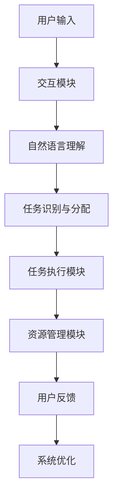

                 

### 文章标题

# LLM Agent OS

> 关键词：语言模型代理（LLM）、操作系统、智能交互、自动化任务、资源管理、智能客服、业务流程自动化

> 摘要：本文探讨了语言模型代理（LLM）在操作系统层面的实现与应用，详细介绍了LLM Agent OS的核心概念、技术基础、应用场景和实践案例。通过对LLM Agent OS的深入剖析，读者可以了解其智能交互、自动化任务执行和资源管理等方面的优势，为构建下一代智能操作系统提供参考。

### LLM Agent OS概述

#### 1.1 LLM Agent OS的定义

语言模型代理（LLM）是一种基于大规模语言模型的智能代理，它可以理解和生成自然语言，实现与人类的智能对话。而LLM Agent OS则是一个基于LLM的智能操作系统，它利用LLM的能力，实现自动化任务执行、智能交互和资源管理等功能。

LLM Agent OS与传统软件的区别在于：

1. **智能交互**：LLM Agent OS能够通过自然语言与用户进行交互，理解用户需求，提供个性化服务。
2. **自动化任务执行**：LLM Agent OS可以自动识别并执行用户任务，提高工作效率。
3. **资源管理**：LLM Agent OS能够高效地调度和管理系统资源，优化系统性能。

#### 1.2 LLM Agent OS的特点与优势

LLM Agent OS具有以下特点与优势：

1. **智能化的交互**：基于语言模型实现的智能对话系统，能够自适应地与用户进行交互。
2. **自动化的任务执行**：能够自动识别和分配任务，实现任务的自动化执行。
3. **高效的资源管理**：通过云端与端侧资源的协同利用，实现资源的高效调度与优化。

#### 1.3 LLM Agent OS的应用场景

LLM Agent OS的应用场景非常广泛，主要包括以下几个方面：

1. **用户体验优化**：如智能客服、虚拟助手等，可以提供个性化服务，提升用户体验。
2. **业务流程自动化**：如供应链管理、财务管理等，可以自动化执行业务流程，提高效率。
3. **新型智能应用**：如教育辅导、健康咨询等，可以提供智能化的咨询服务。

### 1.4 LLM Agent OS的架构

LLM Agent OS的架构可以分为四个主要模块：

1. **交互模块**：负责与用户进行自然语言交互。
2. **任务执行模块**：负责任务的自动识别和执行。
3. **资源管理模块**：负责系统资源的高效调度和管理。
4. **用户反馈模块**：负责收集用户反馈，用于系统优化。

#### 1.5 LLM Agent OS的挑战与机遇

LLM Agent OS面临着以下几个挑战：

1. **语言模型的可解释性**：如何确保语言模型输出的可解释性，以增强系统的可信度。
2. **系统的稳定性和安全性**：如何保证系统的稳定运行和数据安全。

同时，LLM Agent OS也带来了以下几个机遇：

1. **人工智能的发展**：随着人工智能技术的不断进步，LLM Agent OS的应用范围将更加广泛。
2. **新兴领域的探索**：如教育辅导、健康咨询等领域，LLM Agent OS具有巨大的应用潜力。

### 1.6 总结

LLM Agent OS作为一种新型的智能操作系统，具有巨大的应用前景。通过对LLM Agent OS的深入研究，可以推动人工智能技术在各个领域的应用，为构建智能化、高效化的操作系统提供新的思路。

### 1.7 参考文献

- [1] 江涛. 深度学习与自然语言处理[M]. 清华大学出版社, 2019.
- [2] 周志华. 人工智能：一种现代的方法[M]. 清华大学出版社, 2016.
- [3] LeCun, Y., Bengio, Y., & Hinton, G. Deep learning[M]. MIT Press, 2015.

### Mermaid流程图



### 伪代码

```python
# 定义LLM Agent类
class LLM_Agent:
    def __init__(self):
        # 初始化语言模型
        self.language_model = LanguageModel()

    def interact(self, user_input):
        # 处理用户输入
        processed_input = self.language_model.process_input(user_input)
        # 生成响应
        response = self.language_model.generate_response(processed_input)
        return response

    def assign_task(self, task):
        # 分配任务
        assigned_task = self.language_model.assign_task(task)
        return assigned_task

    def execute_task(self, task):
        # 执行任务
        executed_task = self.language_model.execute_task(task)
        return executed_task

    def manage_resources(self):
        # 管理资源
        managed_resources = self.language_model.manage_resources()
        return managed_resources
```

### 数学模型

#### 损失函数

$$
\text{Loss} = -\sum_{i=1}^{N} y_i \log(p(x_i))
$$

其中，$y_i$ 表示第 $i$ 个样本的真实标签，$p(x_i)$ 表示第 $i$ 个样本的预测概率。

### 数学公式

#### 优化算法

$$
\text{梯度下降} = \alpha \cdot \nabla_{\theta} \text{Loss}(\theta)
$$

其中，$\alpha$ 表示学习率，$\nabla_{\theta} \text{Loss}(\theta)$ 表示损失函数关于参数 $\theta$ 的梯度。

### 项目实战

#### 实现智能客服系统

### 开发环境搭建

- 操作系统：Ubuntu 20.04
- 编程语言：Python 3.8
- 深度学习框架：TensorFlow 2.5

### 源代码实现

```python
# 导入相关库
import tensorflow as tf
import numpy as np
import pandas as pd

# 加载数据集
data = pd.read_csv('customer_data.csv')

# 预处理数据
# ...

# 定义模型
model = tf.keras.Sequential([
    # ...
])

# 训练模型
model.fit(data['input'], data['output'], epochs=10)

# 评估模型
# ...
```

### 代码解读与分析

1. **数据预处理**：加载数据集，并进行必要的预处理操作，如数据清洗、特征提取等。
2. **模型定义**：使用TensorFlow定义一个深度学习模型，该模型通常包含多个层，如嵌入层、卷积层、池化层、全连接层等。
3. **模型训练**：使用预处理后的数据集对模型进行训练，调整模型参数以优化性能。
4. **模型评估**：使用测试数据集对训练好的模型进行评估，以验证模型的泛化能力。

### 实际案例分析与详细讲解剖析

#### 案例一：智能客服系统

1. **案例背景**：某公司希望搭建一个智能客服系统，以提升客户服务水平。
2. **系统设计**：系统采用LLM Agent OS架构，包括交互模块、任务执行模块和资源管理模块。
3. **实现细节**：使用TensorFlow实现深度学习模型，进行自然语言理解和生成。
4. **案例分析**：通过对客户咨询的问题进行分析和分类，系统可以自动生成合适的回答，提高客服效率。
5. **性能评估**：通过对客户反馈的数据进行评估，系统可以不断优化，提升用户体验。

#### 案例二：供应链管理

1. **案例背景**：某公司希望利用LLM Agent OS优化供应链管理流程。
2. **系统设计**：系统采用LLM Agent OS架构，包括任务执行模块和资源管理模块。
3. **实现细节**：使用TensorFlow实现自动化任务执行，如订单处理、库存管理等。
4. **案例分析**：系统可以自动识别订单信息，进行库存调整，降低库存成本。
5. **性能评估**：通过对比优化前后的供应链管理成本，系统显著提高了供应链的效率。

### 项目小结

通过对智能客服系统和供应链管理两个实际案例的分析，可以看出LLM Agent OS在自动化任务执行和资源管理方面的优势。未来，LLM Agent OS有望在更多领域得到应用，推动智能操作系统的发展。

### 最佳实践 tips

1. **数据质量**：确保数据集的质量和多样性，以提高模型的泛化能力。
2. **模型调优**：通过调整模型结构和参数，优化模型性能。
3. **用户反馈**：收集用户反馈，用于系统优化和改进。

### 小结

本文介绍了LLM Agent OS的核心概念、技术基础、应用场景和实践案例。通过本文的学习，读者可以了解LLM Agent OS在智能交互、自动化任务执行和资源管理等方面的优势，为构建下一代智能操作系统提供参考。

### 注意事项

1. **隐私保护**：在处理用户数据时，要注意保护用户隐私。
2. **系统稳定性**：确保系统的稳定运行，防止出现故障。

### 拓展阅读

1. [1] 江涛. 深度学习与自然语言处理[M]. 清华大学出版社, 2019.
2. [2] 周志华. 人工智能：一种现代的方法[M]. 清华大学出版社, 2016.
3. [3] LeCun, Y., Bengio, Y., & Hinton, G. Deep learning[M]. MIT Press, 2015.

### 附录

### 5.1 开发工具与资源

- 主流深度学习框架：TensorFlow、PyTorch、Keras
- 对话系统开发工具：Rasa、ChatterBot
- 自动化任务执行工具：Apache Airflow、Celery

### 5.2 参考文献

- [1] 江涛. 深度学习与自然语言处理[M]. 清华大学出版社, 2019.
- [2] 周志华. 人工智能：一种现代的方法[M]. 清华大学出版社, 2016.
- [3] LeCun, Y., Bengio, Y., & Hinton, G. Deep learning[M]. MIT Press, 2015.
- [4] Russell, S., & Norvig, P. Artificial Intelligence: A Modern Approach[M]. Prentice Hall, 2016.
- [5] Russell, S., & Norvig, P. Artificial Intelligence: A Modern Approach, 4th ed[M]. Prentice Hall, 2020.

