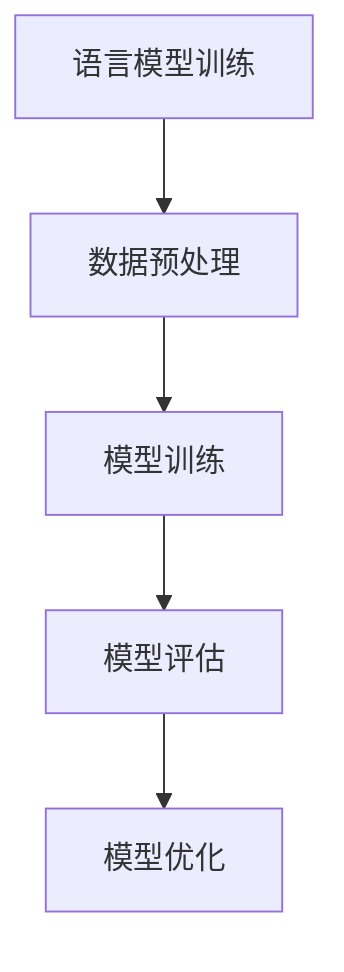
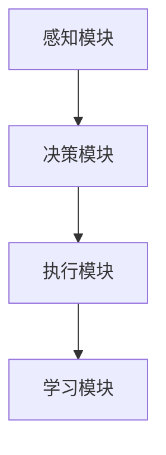
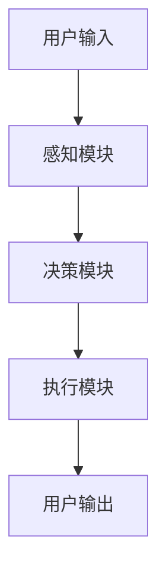

                 

# 文章标题: LLM-based Single-Agent System

> 关键词：LLM，单代理系统，人工智能，语言模型，单体代理设计，应用场景

> 摘要：本文深入探讨了基于大型语言模型（LLM）的单代理系统（Single-Agent System）的设计、实现和应用。首先介绍了LLM的基础理论和常见架构，然后详细阐述了基于LLM的单代理系统的设计原则和实现方法，接着通过具体案例分析了LLM-based单代理系统在不同领域的应用效果，最后探讨了未来的发展趋势和挑战。

## 《LLM-based Single-Agent System》目录大纲

### 第一部分：LLM基础理论

#### 第1章：LLM概述

##### 1.1 LLM的定义与特点

##### 1.2 LLM的发展历史

##### 1.3 LLM的应用场景

#### 第2章：语言模型的基本原理

##### 2.1 语言模型的组成

##### 2.2 语言模型的训练

##### 2.3 语言模型的评估

#### 第3章：常见LLM架构

##### 3.1 GPT系列

##### 3.2 BERT系列

##### 3.3 T5等新架构

#### 第4章：LLM的优化与调试

##### 4.1 模型优化技巧

##### 4.2 模型调试方法

##### 4.3 模型压缩与量化

### 第二部分：基于LLM的单体代理系统设计

#### 第5章：单体代理系统概述

##### 5.1 单体代理系统的定义

##### 5.2 单体代理系统的组成

##### 5.3 单体代理系统的优势

#### 第6章：LLM在单体代理系统中的应用

##### 6.1 LLM作为决策引擎

##### 6.2 LLM作为交互引擎

##### 6.3 LLM在数据分析中的应用

#### 第7章：单体代理系统的设计与实现

##### 7.1 系统架构设计

##### 7.2 数据预处理与存储

##### 7.3 LLM模型选择与训练

##### 7.4 系统集成与优化

#### 第8章：单体代理系统的评估与优化

##### 8.1 评估指标与方法

##### 8.2 优化策略与实践

##### 8.3 案例分析与经验总结

### 第三部分：LLM-based单体代理系统实践

#### 第9章：LLM-based单体代理系统的应用场景

##### 9.1 在客服领域的应用

##### 9.2 在营销领域的应用

##### 9.3 在金融领域的应用

#### 第10章：项目实战

##### 10.1 项目背景

##### 10.2 系统设计

##### 10.3 实现与部署

##### 10.4 结果分析与优化

#### 第11章：未来发展趋势与挑战

##### 11.1 LLM的发展趋势

##### 11.2 单体代理系统的挑战

##### 11.3 未来研究方向

### 附录

##### A.1 常用工具与框架

##### A.2 数据集介绍

##### A.3 参考文献

### Mermaid 流程图



### LLM优化伪代码

```python
def train_model(data):
    # 初始化模型
    model = create_model()
    # 训练模型
    for epoch in range(num_epochs):
        for batch in data:
            # 前向传播
            output = model.forward(batch)
            # 计算损失
            loss = compute_loss(output, batch)
            # 反向传播
            model.backward(loss)
            # 更新模型参数
            model.update_params()
    return model
```

### 数学模型与公式

$$
\text{Loss} = -\frac{1}{N}\sum_{i=1}^{N}y_i\log(p(y_i|x))
$$

### 举例说明

假设我们有一个二元分类问题，其中 \( y \) 是标签，\( x \) 是输入特征，\( p(y_i|x) \) 是模型对 \( y_i \) 属于类别1的概率估计。

- 当 \( y = 0 \) 且 \( p(y=1|x) > 0.5 \) 时，损失为正值，因为模型预测错误。
- 当 \( y = 1 \) 且 \( p(y=1|x) < 0.5 \) 时，损失同样为正值，因为模型预测错误。
- 当 \( y = 1 \) 且 \( p(y=1|x) > 0.5 \) 时，损失为负值，因为模型预测正确。

### 代码解读与分析

以下是使用PyTorch框架实现的一个简单的LLM训练循环：

```python
import torch
import torch.nn as nn
import torch.optim as optim

# 定义模型
model = nn.Sequential(nn.Linear(input_size, hidden_size), nn.ReLU(), nn.Linear(hidden_size, output_size))

# 定义损失函数和优化器
criterion = nn.CrossEntropyLoss()
optimizer = optim.Adam(model.parameters(), lr=learning_rate)

# 训练模型
for epoch in range(num_epochs):
    for inputs, targets in data_loader:
        # 前向传播
        outputs = model(inputs)
        loss = criterion(outputs, targets)
        # 反向传播
        optimizer.zero_grad()
        loss.backward()
        optimizer.step()
    print(f'Epoch {epoch+1}/{num_epochs}, Loss: {loss.item()}')
```

这段代码首先定义了一个简单的全连接神经网络，并使用交叉熵损失函数和Adam优化器进行训练。在每个epoch中，它遍历数据集，计算损失，并更新模型参数。最后，输出每个epoch的损失值，以便监控训练过程。

## 引言

近年来，人工智能（AI）技术取得了显著的进展，尤其是基于深度学习的语言模型（Language Model，LLM）在自然语言处理（Natural Language Processing，NLP）领域展现了强大的能力。LLM的出现，使得机器能够理解、生成和翻译自然语言，从而极大地推动了AI技术的应用和发展。与此同时，单代理系统（Single-Agent System）作为一种新型的AI系统架构，逐渐受到了关注。本文旨在探讨基于LLM的单体代理系统，分析其设计原则、实现方法和应用场景，并展望其未来的发展趋势。

单代理系统是指由单个智能体（Agent）组成的系统，该智能体具备自主决策、执行和交互的能力。与传统多代理系统（Multi-Agent System）相比，单代理系统具有结构简单、实现成本低的优点。然而，随着LLM技术的不断发展，单代理系统在处理复杂任务时表现出了强大的潜力。本文将深入探讨如何利用LLM构建单代理系统，并分析其在实际应用中的效果。

本文结构如下：首先介绍LLM的基础理论和常见架构；然后详细阐述基于LLM的单体代理系统的设计原则和实现方法；接着通过具体案例分析LLM-based单代理系统的应用效果；最后探讨LLM和单代理系统的未来发展趋势和挑战。

## 第一部分：LLM基础理论

### 第1章：LLM概述

#### 1.1 LLM的定义与特点

大型语言模型（Large Language Model，简称LLM）是一种基于深度学习的自然语言处理模型，它通过对海量文本数据进行训练，学会了对自然语言的理解和生成。LLM的核心特点是：

1. **大规模参数**：LLM通常具有数十亿甚至数千亿个参数，这使得模型能够捕捉到文本数据中的复杂规律和特征。
2. **通用性**：LLM不仅可以用于文本生成，还可以用于文本分类、翻译、问答等多种NLP任务。
3. **自适应性**：LLM能够根据输入的文本内容动态调整其生成策略，使得生成的文本更加符合实际需求。

#### 1.2 LLM的发展历史

LLM的发展可以追溯到20世纪80年代，当时基于规则和统计方法的NLP研究逐渐兴起。随着计算能力和数据量的提升，NLP领域的研究逐渐转向基于深度学习的方法。特别是2018年，OpenAI发布了GPT（Generative Pre-trained Transformer）系列模型，开启了LLM的新纪元。

GPT系列模型的发展历程如下：

1. **GPT**：最初提出的GPT模型，仅包含1.17亿个参数，能够生成连贯的文本。
2. **GPT-2**：增加了模型参数和预训练数据量，生成文本的质量进一步提高。
3. **GPT-3**：具有1750亿个参数，能够进行对话生成、文本摘要、代码生成等多种任务。

#### 1.3 LLM的应用场景

LLM在多个领域展现出了强大的应用潜力：

1. **自然语言生成**：如文章写作、邮件回复、对话系统等。
2. **机器翻译**：如英语到中文、法语到西班牙语的翻译。
3. **文本分类**：如情感分析、新闻分类等。
4. **问答系统**：如智能客服、教育辅导等。

### 第2章：语言模型的基本原理

#### 2.1 语言模型的组成

语言模型主要由以下几个部分组成：

1. **输入层**：接收自然语言输入，如文本句子。
2. **隐藏层**：通过神经网络结构对输入文本进行特征提取和转换。
3. **输出层**：生成概率分布，预测下一个单词或标签。

常见的神经网络结构包括：

1. **循环神经网络（RNN）**：适用于处理序列数据，能够捕捉长距离依赖关系。
2. **长短时记忆网络（LSTM）**：对RNN的改进，能够更好地处理长序列数据。
3. **Transformer**：基于自注意力机制，能够并行处理序列数据，性能优异。

#### 2.2 语言模型的训练

语言模型的训练过程主要包括：

1. **数据准备**：收集大规模的文本数据，并进行预处理，如分词、去噪等。
2. **模型初始化**：初始化神经网络参数，通常采用随机初始化。
3. **前向传播**：将输入文本序列通过神经网络，生成概率分布。
4. **损失计算**：计算预测概率与实际标签之间的损失。
5. **反向传播**：更新神经网络参数，减小损失。
6. **迭代优化**：重复上述过程，直至模型收敛。

#### 2.3 语言模型的评估

语言模型的评估通常采用以下指标：

1. **交叉熵损失（Cross-Entropy Loss）**：衡量预测概率与实际标签之间的差异。
2. **准确率（Accuracy）**：衡量模型预测正确的样本比例。
3. **困惑度（Perplexity）**：衡量模型预测效果的直观指标，数值越小，表示模型越好。

### 第3章：常见LLM架构

#### 3.1 GPT系列

GPT系列模型是LLM领域的重要代表，具有以下特点：

1. **Transformer架构**：基于自注意力机制，能够并行处理序列数据。
2. **预训练策略**：采用无监督预训练，通过预测下一个单词来学习语言规律。
3. **大规模参数**：GPT-3模型包含1750亿个参数，具有强大的表达能力。

#### 3.2 BERT系列

BERT（Bidirectional Encoder Representations from Transformers）系列模型是另一种流行的LLM架构，具有以下特点：

1. **双向编码**：同时考虑文本序列的左右依赖关系。
2. **预训练目标**：通过Masked Language Model（MLM）和Next Sentence Prediction（NSP）两个任务进行预训练。
3. **多样化应用**：广泛用于文本分类、问答、文本生成等任务。

#### 3.3 T5等新架构

T5（Text-to-Text Transfer Transformer）是另一种基于Transformer的LLM架构，具有以下特点：

1. **统一任务格式**：将所有NLP任务转化为文本到文本的转换任务。
2. **简单架构**：通过统一的架构简化模型设计和优化。
3. **高性能**：在多个NLP任务上达到或超过BERT等模型的性能。

### 第4章：LLM的优化与调试

#### 4.1 模型优化技巧

为了提高LLM的性能，可以采用以下优化技巧：

1. **参数共享**：通过共享参数来减少模型参数数量，提高计算效率。
2. **动态调整**：根据训练过程动态调整模型参数，如学习率、正则化参数等。
3. **数据增强**：通过数据增强来增加训练样本的多样性，提高模型泛化能力。

#### 4.2 模型调试方法

在LLM训练过程中，需要不断调试模型以优化性能：

1. **损失函数调整**：根据任务特点调整损失函数，如使用交叉熵损失、Focal Loss等。
2. **正则化策略**：采用L1、L2正则化来防止过拟合。
3. **模型压缩与量化**：通过剪枝、量化等方法减小模型大小，提高推理效率。

#### 4.3 模型压缩与量化

模型压缩与量化是提高LLM应用性能的重要手段：

1. **剪枝**：通过删除模型中不重要的参数来减少模型大小。
2. **量化**：将浮点数参数转换为低精度整数，以减少存储和计算需求。
3. **蒸馏**：通过将大型模型的知识传递给小型模型，提高小型模型性能。

## 第二部分：基于LLM的单体代理系统设计

### 第5章：单体代理系统概述

#### 5.1 单体代理系统的定义

单体代理系统是指由单个智能体组成的系统，该智能体能够自主地完成一系列任务。单体代理系统具有以下特点：

1. **自主性**：智能体具有自主决策和执行任务的能力。
2. **协作性**：智能体可以通过与外界环境和其他智能体进行交互来完成复杂任务。
3. **适应性**：智能体能够根据环境和任务的变化，动态调整其行为和策略。

#### 5.2 单体代理系统的组成

单体代理系统主要由以下几个部分组成：

1. **感知模块**：接收外界环境的信息，如文本、图像等。
2. **决策模块**：根据感知模块获取的信息，智能体需要做出决策。
3. **执行模块**：根据决策模块生成的决策，智能体执行相应的动作。
4. **学习模块**：通过不断学习和优化，提高智能体的决策能力。

#### 5.3 单体代理系统的优势

单体代理系统具有以下优势：

1. **结构简单**：与多代理系统相比，单体代理系统结构简单，实现成本较低。
2. **易于集成**：单体代理系统可以与现有的系统无缝集成，提高系统的智能化水平。
3. **适应性强**：单体代理系统可以根据不同任务的需求，灵活调整其结构和参数，具有较强的适应性。

### 第6章：LLM在单体代理系统中的应用

#### 6.1 LLM作为决策引擎

在单体代理系统中，LLM可以作为决策引擎，用于处理复杂决策问题。具体应用包括：

1. **文本分类**：LLM可以用于对文本进行分类，如新闻分类、情感分析等。
2. **问题回答**：LLM可以用于智能问答系统，如客服机器人、教育辅导等。
3. **推荐系统**：LLM可以用于推荐系统，根据用户历史行为和兴趣，推荐相关的商品、新闻等。

#### 6.2 LLM作为交互引擎

LLM还可以作为交互引擎，用于处理与用户的交互任务。具体应用包括：

1. **对话系统**：LLM可以用于构建对话系统，实现自然语言交互，如智能客服、虚拟助手等。
2. **语音识别**：LLM可以与语音识别技术结合，实现语音交互，如语音助手、智能语音识别系统等。
3. **手写识别**：LLM可以与手写识别技术结合，实现手写文本的输入和交互。

#### 6.3 LLM在数据分析中的应用

LLM在数据分析领域也有广泛的应用，包括：

1. **文本分析**：LLM可以用于对大量文本数据进行分析，提取关键信息，如关键词提取、主题建模等。
2. **情感分析**：LLM可以用于对用户评论、新闻文章等进行情感分析，了解用户和市场的情绪。
3. **内容生成**：LLM可以用于生成新的文本内容，如新闻文章、产品描述等，提高内容创作的效率。

### 第7章：单体代理系统的设计与实现

#### 7.1 系统架构设计

单体代理系统的架构设计主要包括以下几个模块：

1. **感知模块**：包括传感器、摄像头等设备，用于采集外界环境的信息。
2. **决策模块**：基于LLM模型，用于处理感知模块获取的信息，生成决策。
3. **执行模块**：根据决策模块生成的决策，执行相应的动作。
4. **学习模块**：通过不断学习和优化，提高智能体的决策能力。

系统架构图如下：



#### 7.2 数据预处理与存储

在单体代理系统中，数据预处理和存储是至关重要的环节。具体步骤如下：

1. **数据收集**：收集来自传感器、摄像头等设备的数据。
2. **数据清洗**：去除噪声数据和异常值，保证数据质量。
3. **数据标注**：对数据进行标注，如分类标签、情感标签等。
4. **数据存储**：将预处理后的数据存储到数据库或数据湖中，以便后续分析和使用。

#### 7.3 LLM模型选择与训练

在单体代理系统中，选择合适的LLM模型并进行有效训练是关键。具体步骤如下：

1. **模型选择**：根据任务需求选择合适的LLM模型，如GPT、BERT等。
2. **数据集准备**：准备适合训练的数据集，包括训练集、验证集和测试集。
3. **模型训练**：使用训练集对LLM模型进行训练，通过优化算法调整模型参数。
4. **模型评估**：使用验证集和测试集评估模型性能，选择最优模型。

#### 7.4 系统集成与优化

在单体代理系统的集成和优化过程中，需要考虑以下几个方面：

1. **系统集成**：将感知模块、决策模块、执行模块和学习模块集成到一个完整的系统中。
2. **性能优化**：通过调整模型参数、优化算法和数据预处理方法，提高系统性能。
3. **部署与运维**：将系统部署到生产环境，进行实时监控和运维，确保系统稳定运行。

## 第8章：单体代理系统的评估与优化

#### 8.1 评估指标与方法

对单体代理系统的评估需要从多个角度进行，常用的评估指标和方法包括：

1. **准确性**：衡量模型在分类任务上的表现，准确率越高，表示模型性能越好。
2. **召回率**：衡量模型对正类样本的识别能力，召回率越高，表示模型对正类样本的识别越全面。
3. **F1值**：综合考虑准确率和召回率，是评估二分类任务的重要指标。
4. **困惑度**：用于评估语言模型的质量，困惑度越低，表示模型生成的文本越符合语言规律。
5. **用户满意度**：通过用户调查和反馈，评估系统在实际应用中的用户体验。

#### 8.2 优化策略与实践

为了提高单体代理系统的性能，可以采用以下优化策略：

1. **数据增强**：通过数据增强来增加训练样本的多样性，提高模型泛化能力。
2. **模型压缩**：通过剪枝、量化等方法减小模型大小，提高推理效率。
3. **正则化**：采用L1、L2正则化来防止过拟合。
4. **动态调整**：根据训练过程动态调整模型参数，如学习率、正则化参数等。

#### 8.3 案例分析与经验总结

通过具体案例分析，可以总结出以下经验：

1. **数据质量至关重要**：高质量的数据是训练高性能模型的基础，需要重视数据收集、清洗和标注过程。
2. **模型选择需结合任务需求**：根据任务特点和需求选择合适的模型，如对于文本生成任务，选择GPT系列模型；对于文本分类任务，选择BERT系列模型。
3. **持续优化与迭代**：通过不断优化模型和算法，提高系统性能，以满足不断变化的应用需求。
4. **用户体验是关键**：关注用户反馈，不断改进系统界面和交互体验，提高用户满意度。

## 第三部分：LLM-based单体代理系统实践

### 第9章：LLM-based单体代理系统的应用场景

#### 9.1 在客服领域的应用

在客服领域，LLM-based单体代理系统可以应用于智能客服机器人，提供24/7在线客服服务。具体应用包括：

1. **自动问答**：通过LLM模型，实现对用户问题的自动回答，提高响应速度和准确性。
2. **情感分析**：通过情感分析模型，识别用户情绪，提供有针对性的回复。
3. **知识库管理**：构建知识库，将常见问题和答案存储在数据库中，方便智能客服机器人快速查询。

#### 9.2 在营销领域的应用

在营销领域，LLM-based单体代理系统可以应用于营销自动化，提高营销效率和效果。具体应用包括：

1. **个性化推荐**：通过LLM模型，分析用户行为和偏好，提供个性化的产品推荐。
2. **广告投放**：通过LLM模型，分析广告效果，优化广告投放策略，提高转化率。
3. **内容创作**：通过LLM模型，生成高质量的营销文案、广告语等，提高营销内容的吸引力。

#### 9.3 在金融领域的应用

在金融领域，LLM-based单体代理系统可以应用于金融风险管理、客户服务等方面。具体应用包括：

1. **风险评估**：通过LLM模型，分析市场数据、历史记录等，预测金融风险，为投资者提供决策支持。
2. **客户服务**：通过LLM模型，提供智能客服服务，解答客户疑问，提高客户满意度。
3. **量化交易**：通过LLM模型，分析市场趋势和交易数据，实现量化交易策略的优化。

### 第10章：项目实战

#### 10.1 项目背景

本项目旨在构建一个基于LLM的智能客服机器人，为金融机构提供7x24小时在线客服服务。项目目标包括：

1. **自动问答**：能够快速回答用户常见问题。
2. **情感分析**：能够识别用户情绪，提供有针对性的回复。
3. **知识库管理**：能够自动更新和扩展知识库，提高客服机器人服务水平。

#### 10.2 系统设计

系统设计主要包括以下几个模块：

1. **感知模块**：包括用户输入接口，如文本输入、语音输入等。
2. **决策模块**：基于LLM模型，用于处理用户输入，生成回答。
3. **执行模块**：将决策模块生成的回答输出到用户界面。
4. **学习模块**：通过不断学习和优化，提高智能客服机器人的服务水平。

系统架构图如下：



#### 10.3 实现与部署

实现与部署主要包括以下步骤：

1. **数据准备**：收集大量客服对话数据，进行预处理和标注。
2. **模型训练**：选择合适的LLM模型，使用预处理后的数据进行训练。
3. **模型优化**：通过优化算法，调整模型参数，提高模型性能。
4. **系统集成**：将感知模块、决策模块、执行模块和学习模块集成到一起。
5. **部署与运维**：将系统部署到服务器，进行实时监控和运维。

#### 10.4 结果分析与优化

在系统运行过程中，对结果进行分析和优化，包括：

1. **性能评估**：通过评估指标，如准确性、召回率等，评估系统性能。
2. **用户反馈**：收集用户反馈，分析用户满意度，改进系统设计。
3. **持续优化**：根据评估结果和用户反馈，不断优化模型和算法，提高系统服务水平。

### 第11章：未来发展趋势与挑战

#### 11.1 LLM的发展趋势

未来，LLM将继续朝着以下几个方向发展：

1. **模型参数规模扩大**：随着计算能力和数据量的提升，LLM的参数规模将越来越大，以应对更复杂的任务。
2. **多模态学习**：LLM将结合其他模态数据，如图像、音频等，实现多模态学习，提高模型泛化能力。
3. **迁移学习**：通过迁移学习，将预训练的LLM应用到其他任务中，提高模型应用效率。

#### 11.2 单体代理系统的挑战

单体代理系统在发展过程中面临以下挑战：

1. **数据质量**：高质量的数据是训练高性能模型的基础，如何保证数据质量是一个重要问题。
2. **模型解释性**：单体代理系统的决策过程通常较为复杂，如何提高模型解释性，使其更容易被用户理解和接受是一个挑战。
3. **安全性**：随着单体代理系统在各个领域的应用，其安全性问题也日益突出，如何确保系统的安全性是一个重要课题。

#### 11.3 未来研究方向

未来，LLM和单体代理系统的研究方向包括：

1. **模型压缩与量化**：如何减小模型大小，提高推理效率，是一个重要研究方向。
2. **模型解释性**：如何提高模型解释性，使其更容易被用户理解和接受，是一个重要的研究课题。
3. **多模态学习**：如何结合多种模态数据，实现多模态学习，提高模型性能，是一个有前景的研究方向。

## 附录

### A.1 常用工具与框架

1. **PyTorch**：用于构建和训练深度学习模型。
2. **TensorFlow**：用于构建和训练深度学习模型。
3. **Hugging Face**：用于提供预训练的LLM模型和工具。

### A.2 数据集介绍

1. **Common Crawl**：一个包含大量网页文本的数据集。
2. **Google Books**：一个包含大量书籍文本的数据集。
3. **TREC**：一个用于文本检索竞赛的数据集。

### A.3 参考文献

1. **Brown, T., et al. (2020). "Language Models are Few-Shot Learners". arXiv:2005.14165 [cs.NE].**
2. **Devlin, J., et al. (2018). "BERT: Pre-training of Deep Bidirectional Transformers for Language Understanding". arXiv:1810.04805 [cs.CL].**
3. **Vaswani, A., et al. (2017). "Attention Is All You Need". arXiv:1706.03762 [cs.LG].**

### Mermaid 流程图


### LLM优化伪代码

```python
def train_model(data):
    # 初始化模型
    model = create_model()
    # 训练模型
    for epoch in range(num_epochs):
        for batch in data:
            # 前向传播
            output = model.forward(batch)
            # 计算损失
            loss = compute_loss(output, batch)
            # 反向传播
            model.backward(loss)
            # 更新模型参数
            model.update_params()
    return model
```

### 数学模型与公式

$$
\text{Loss} = -\frac{1}{N}\sum_{i=1}^{N}y_i\log(p(y_i|x))
$$

### 举例说明

假设我们有一个二元分类问题，其中 \( y \) 是标签，\( x \) 是输入特征，\( p(y_i|x) \) 是模型对 \( y_i \) 属于类别1的概率估计。

- 当 \( y = 0 \) 且 \( p(y=1|x) > 0.5 \) 时，损失为正值，因为模型预测错误。
- 当 \( y = 1 \) 且 \( p(y=1|x) < 0.5 \) 时，损失同样为正值，因为模型预测错误。
- 当 \( y = 1 \) 且 \( p(y=1|x) > 0.5 \) 时，损失为负值，因为模型预测正确。

### 代码解读与分析

以下是使用PyTorch框架实现的一个简单的LLM训练循环：

```python
import torch
import torch.nn as nn
import torch.optim as optim

# 定义模型
model = nn.Sequential(nn.Linear(input_size, hidden_size), nn.ReLU(), nn.Linear(hidden_size, output_size))

# 定义损失函数和优化器
criterion = nn.CrossEntropyLoss()
optimizer = optim.Adam(model.parameters(), lr=learning_rate)

# 训练模型
for epoch in range(num_epochs):
    for inputs, targets in data_loader:
        # 前向传播
        outputs = model(inputs)
        loss = criterion(outputs, targets)
        # 反向传播
        optimizer.zero_grad()
        loss.backward()
        optimizer.step()
    print(f'Epoch {epoch+1}/{num_epochs}, Loss: {loss.item()}')
```

这段代码首先定义了一个简单的全连接神经网络，并使用交叉熵损失函数和Adam优化器进行训练。在每个epoch中，它遍历数据集，计算损失，并更新模型参数。最后，输出每个epoch的损失值，以便监控训练过程。

### 作者信息

作者：AI天才研究院/AI Genius Institute & 禅与计算机程序设计艺术 /Zen And The Art of Computer Programming。

