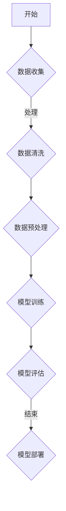

                 

### 文章标题：LLM在教育中的应用：个性化学习助手

#### 关键词：语言模型（LLM）、教育、个性化学习、算法、架构设计、数学模型、项目实战

> 摘要：本文深入探讨语言模型（LLM）在教育领域中的应用，特别是如何通过个性化学习助手提升教育质量和学习效果。文章首先介绍了LLM的基本概念和原理，随后分析了个性化学习的理论基础和重要性，并通过具体应用场景展示了LLM在个性化学习中的潜力。接着，文章详细解析了LLM的核心算法和架构设计，阐述了数学模型和公式的应用。在第三部分，文章通过实际项目实战和案例分析，展示了如何实现和优化个性化学习助手。最后，文章对LLM在教育中的应用前景进行了展望，并提供了相关工具和资源的推荐。

### 目录大纲

#### 第一部分：LLM基础与个性化学习概述

**第1章：LLM基本概念与原理**

**第2章：个性化学习助手的理论基础**

**第3章：LLM在个性化学习中的应用场景**

#### 第二部分：核心算法与架构

**第4章：LLM核心算法原理**

**第5章：个性化学习助手的架构设计**

**第6章：数学模型与数学公式**

**第7章：个性化学习助手的实现与优化**

#### 第三部分：项目实战与案例分析

**第8章：教育场景下的个性化学习助手实战**

**第9章：案例分析：实际应用中的挑战与解决方案**

**第10章：未来发展展望**

#### 附录

**附录A：常用工具与资源**

**附录B：Mermaid流程图**

**附录C：代码示例**

### 文章正文

#### 第1章：LLM基本概念与原理

语言模型（Language Model，简称LLM）是自然语言处理（Natural Language Processing，简称NLP）领域的一种重要技术。它通过统计方法或深度学习模型，预测文本序列中的下一个单词或字符，从而生成或理解自然语言。

**1.1 语言模型的概念**

语言模型的核心是预测。具体来说，给定一段文本的前文，语言模型要预测这段文本的下一部分是什么。这一过程可以表示为：

$$
P(w_t | w_{t-1}, w_{t-2}, ..., w_1)
$$

其中，$w_t$ 是待预测的单词或字符，$w_{t-1}, w_{t-2}, ..., w_1$ 是前文。语言模型的目标是最大化这个概率。

**1.2 语言模型的发展历程**

语言模型的发展经历了从统计模型到神经网络模型的演变。早期的语言模型主要是基于统计方法，如N-gram模型。N-gram模型通过统计前N个单词出现的频率来预测下一个单词。这种方法简单但效果有限。

随着深度学习的发展，神经网络模型开始被广泛应用于语言模型。目前最流行的是基于变换器（Transformer）架构的模型，如BERT（Bidirectional Encoder Representations from Transformers）和GPT（Generative Pre-trained Transformer）。这些模型通过预训练和微调，能够捕捉到语言中的复杂结构，从而大大提高了预测的准确性。

**1.3 语言模型的工作原理**

语言模型的工作原理可以分为两个部分：预训练和微调。

1. **预训练**：在预训练阶段，模型在一个大规模的文本语料库上进行训练，学习到语言的基本规律和特征。这一过程通常是无监督的，即模型不需要标签信息。

2. **微调**：在微调阶段，模型根据具体任务的需求进行微调。例如，在一个问答任务中，模型会根据问题和答案的语料进行微调，从而提高在问答任务上的表现。

语言模型通过这两个阶段的学习，能够生成或理解高质量的自然语言文本。例如，GPT模型可以生成连贯的自然语言文本，而BERT模型则擅长于理解上下文。

#### 第2章：个性化学习助手的理论基础

个性化学习是指根据每个学习者的特点和需求，提供个性化的学习内容和教学方法。个性化学习助手是利用技术手段，特别是人工智能，来实现个性化学习的一种工具。

**2.1 个性化学习的定义与意义**

个性化学习的定义可以概括为：根据每个学习者的学习风格、能力水平和学习需求，提供定制化的学习资源和学习路径。

个性化学习的意义主要体现在以下几个方面：

1. **提高学习效果**：个性化学习能够根据学习者的特点和需求，提供最合适的学习内容和教学方法，从而提高学习效果。
2. **提升学习兴趣**：个性化学习能够满足学习者的个性化需求，从而提高学习兴趣和积极性。
3. **促进教育公平**：个性化学习能够弥补传统教育中教育资源分配不均的问题，使不同背景和条件的学习者都能获得公平的教育机会。

**2.2 个性化学习助手的功能**

个性化学习助手的主要功能包括：

1. **学习路径规划**：根据学习者的特点和需求，为学习者规划个性化的学习路径，确保学习内容和学习顺序的合理性和有效性。
2. **学习内容推荐**：根据学习者的学习记录和兴趣，推荐合适的学习内容，提高学习者的学习效率。
3. **学习评价与反馈**：对学习者的学习过程和结果进行评价，并提供个性化的反馈，帮助学习者了解自己的学习状况，调整学习策略。

**2.3 教育技术对个性化学习的推动作用**

随着教育技术的发展，特别是人工智能和大数据技术的应用，个性化学习得到了前所未有的推动。

1. **数据采集与分析**：教育技术能够采集和分析学习者的学习数据，从而实现个性化的学习路径规划和学习内容推荐。
2. **智能辅导与反馈**：教育技术能够提供智能化的辅导和反馈，帮助学习者更好地理解和掌握学习内容。
3. **教育资源共享**：教育技术能够实现教育资源的共享和优化配置，使个性化学习得以更广泛地应用。

#### 第3章：LLM在个性化学习中的应用场景

语言模型在教育中的应用场景非常广泛，特别是在个性化学习领域。以下是一些典型的应用场景：

**3.1 个性化学习路径规划**

语言模型可以用于分析学习者的学习记录和特点，为其规划个性化的学习路径。具体过程如下：

1. **数据收集**：收集学习者的学习数据，包括学习内容、学习时长、学习频率等。
2. **数据分析**：使用语言模型对学习数据进行分析，识别学习者的学习习惯、偏好和薄弱环节。
3. **路径规划**：根据分析结果，为学习者规划个性化的学习路径，包括学习内容的选择、学习顺序的安排等。

**3.2 个性化学习内容推荐**

语言模型可以用于分析学习者的学习记录和兴趣，为其推荐合适的学习内容。具体过程如下：

1. **兴趣识别**：使用语言模型分析学习者的学习记录，识别其兴趣点和学习偏好。
2. **内容推荐**：根据识别的兴趣点和偏好，推荐合适的学习内容，包括书籍、文章、视频等。

**3.3 个性化学习评价与反馈**

语言模型可以用于对学习者的学习过程和结果进行评价，并提供个性化的反馈。具体过程如下：

1. **学习过程监控**：使用语言模型监控学习者的学习过程，包括学习进度、学习时长等。
2. **学习结果评价**：使用语言模型对学习者的学习结果进行评价，如考试成绩、作业质量等。
3. **反馈与调整**：根据评价结果，为学习者提供个性化的反馈，并调整学习策略。

#### 第4章：LLM核心算法原理

语言模型的核心算法包括预训练、微调和注意力机制等。以下是对这些核心算法的详细解析。

**4.1 预训练模型与微调**

预训练是语言模型训练的重要阶段。在预训练阶段，模型在大规模文本语料库上进行训练，学习到语言的基本规律和特征。预训练模型的目的是生成高质量的文本表示，这些表示可以用于后续的各种语言任务。

微调是在预训练基础上，针对特定任务进行模型调整。微调的过程通常包括以下几个步骤：

1. **数据准备**：收集与任务相关的数据，如问答数据、文本分类数据等。
2. **模型初始化**：使用预训练模型作为初始化，通常使用预训练模型的全部参数。
3. **训练过程**：在初始化的模型上，使用任务数据训练模型，调整模型参数。
4. **评估与调整**：在训练过程中，使用验证集评估模型性能，根据评估结果调整模型参数。

**4.2 语言模型中的注意力机制**

注意力机制是语言模型中的一个关键组件，它能够模型在不同的输入序列中分配不同的注意力权重。注意力机制可以看作是一种加权求和操作，其基本形式如下：

$$
\text{Attention}(Q, K, V) = \text{softmax}(\frac{QK^T}{\sqrt{d_k}})V
$$

其中，$Q$、$K$ 和 $V$ 分别是查询（Query）、键（Key）和值（Value）向量，$d_k$ 是键向量的维度。注意力机制的工作流程如下：

1. **计算相似度**：计算查询向量 $Q$ 和所有键向量 $K$ 的相似度。
2. **加权求和**：根据相似度，对值向量 $V$ 进行加权求和，得到最终的输出。
3. **更新模型参数**：根据输出结果，更新模型参数。

注意力机制能够提高语言模型的表示能力和理解能力，使其能够更好地捕捉文本中的关系和结构。

**4.3 语言模型中的生成与理解能力**

语言模型的生成能力是指模型能够根据给定的前文，生成连贯、合理的文本。生成过程通常分为两个阶段：

1. **词向量生成**：首先，模型生成前文的所有词向量表示。
2. **文本生成**：然后，模型根据词向量生成下一个单词或字符，并重复此过程，直到生成完整的文本。

语言模型的理解能力是指模型能够理解文本中的含义和关系。理解过程包括以下几个步骤：

1. **文本表示**：将文本转化为词向量或嵌入向量。
2. **语义分析**：分析文本的语法结构、语义关系等，提取关键信息。
3. **上下文理解**：理解文本的上下文，捕捉句子之间的逻辑关系。

生成与理解能力是语言模型的核心能力，它们决定了模型在生成文本和理解文本方面的性能。

#### 第5章：个性化学习助手的架构设计

个性化学习助手的架构设计是确保其能够有效实现个性化学习目标的关键。以下是一个典型的个性化学习助手架构设计：

**5.1 整体架构设计**

个性化学习助手的整体架构通常包括以下几个模块：

1. **数据收集与预处理模块**：负责收集学习者的学习数据，并对数据进行清洗、归一化等预处理操作。
2. **语言模型训练模块**：使用预训练模型和微调技术，训练语言模型，使其能够理解和生成文本。
3. **个性化学习路径规划模块**：根据学习者的特点和需求，规划个性化的学习路径。
4. **学习内容推荐模块**：根据学习者的兴趣和学习记录，推荐合适的学习内容。
5. **学习评价与反馈模块**：对学习者的学习过程和结果进行评价，并提供个性化的反馈。

**5.2 数据处理模块**

数据处理模块是个性化学习助手的核心模块之一，其功能包括：

1. **数据收集**：收集学习者的学习数据，如学习记录、考试成绩、学习时长等。
2. **数据清洗**：清洗数据，去除无效数据，如空值、重复值等。
3. **数据归一化**：对数据进行归一化处理，使其在相同的尺度范围内，方便后续处理。
4. **数据存储**：将处理后的数据存储在数据库中，以供后续使用。

**5.3 模型训练与评估模块**

模型训练与评估模块负责训练语言模型，并对模型性能进行评估。具体过程如下：

1. **模型训练**：使用预训练模型和微调技术，训练语言模型。训练过程包括数据预处理、模型初始化、训练和评估等步骤。
2. **模型评估**：使用验证集和测试集评估模型性能，如准确率、召回率、F1分数等。根据评估结果调整模型参数，优化模型性能。

**5.4 模型部署与监控模块**

模型部署与监控模块负责将训练好的模型部署到生产环境中，并实时监控模型性能。具体过程如下：

1. **模型部署**：将训练好的模型部署到服务器或云计算平台上，使其能够对外提供服务。
2. **模型监控**：实时监控模型性能，如响应时间、准确率等。当模型性能下降时，自动触发重新训练或调整参数。

#### 第6章：数学模型与数学公式

在个性化学习助手的架构设计中，数学模型和公式起着至关重要的作用。以下是对这些数学模型和公式的详细讲解。

**6.1 生成模型与判别模型的公式解析**

生成模型和判别模型是两种常见的深度学习模型，用于生成和判断数据分布。

1. **生成模型**：

生成模型的主要目标是生成符合真实数据分布的新数据。最常用的生成模型是生成对抗网络（GAN）。GAN由生成器（Generator）和判别器（Discriminator）两部分组成。

- 生成器公式：

$$
G(z) = x
$$

其中，$z$ 是随机噪声向量，$x$ 是生成的数据。

- 判别器公式：

$$
D(x) = P(x \text{ is real})
$$

其中，$x$ 是输入数据，$D(x)$ 是判别器对输入数据是否真实的判断。

2. **判别模型**：

判别模型的主要目标是判断输入数据是否真实。最常用的判别模型是二元分类器，如逻辑回归（Logistic Regression）。

- 逻辑回归公式：

$$
\hat{y} = \frac{1}{1 + e^{-\beta^T x}}
$$

其中，$\hat{y}$ 是预测标签，$x$ 是输入特征向量，$\beta$ 是模型参数。

**6.2 优化算法与损失函数**

优化算法是用于调整模型参数，使模型性能达到最优的方法。常见的优化算法有梯度下降（Gradient Descent）和随机梯度下降（Stochastic Gradient Descent，简称SGD）。

- 梯度下降公式：

$$
\theta_{t+1} = \theta_t - \alpha \nabla_{\theta} J(\theta)
$$

其中，$\theta_t$ 是当前模型参数，$\alpha$ 是学习率，$J(\theta)$ 是损失函数。

- 随机梯度下降公式：

$$
\theta_{t+1} = \theta_t - \alpha \nabla_{\theta} J(\theta; x_t, y_t)
$$

其中，$x_t$ 和 $y_t$ 是第 $t$ 次迭代的输入和标签。

损失函数是用于衡量模型预测结果和真实标签之间差异的指标。常见的损失函数有均方误差（Mean Squared Error，简称MSE）和交叉熵（Cross-Entropy）。

- 均方误差公式：

$$
J(\theta) = \frac{1}{2} \sum_{i=1}^{n} (y_i - \hat{y}_i)^2
$$

- 交叉熵公式：

$$
J(\theta) = -\sum_{i=1}^{n} y_i \log \hat{y}_i
$$

**6.3 语言模型的数学基础**

语言模型的数学基础主要涉及词向量表示和神经网络架构。

1. **词向量表示**：

词向量是将文本中的单词或字符映射到高维向量空间的方法。最常用的词向量表示方法有Word2Vec和BERT。

- Word2Vec公式：

$$
\vec{w}_i = \text{avg}(\vec{v}_{i_1}, \vec{v}_{i_2}, ..., \vec{v}_{i_n})
$$

其中，$\vec{w}_i$ 是单词 $w_i$ 的词向量，$\vec{v}_{i_j}$ 是单词 $w_i$ 在 $j$ 个窗口位置上对应的词向量。

- BERT公式：

$$
\text{BERT} = \text{Transformer} + \text{Pre-training}
$$

其中，Transformer 是 BERT 的基础架构，Pre-training 是 BERT 的预训练过程。

2. **神经网络架构**：

神经网络是语言模型的核心组成部分，其架构包括输入层、隐藏层和输出层。

- 输入层：

输入层接收词向量作为输入。

$$
\text{Input} = [\vec{w}_1, \vec{w}_2, ..., \vec{w}_n]
$$

- 隐藏层：

隐藏层通过加权求和和激活函数，将输入层的信息传递到下一层。

$$
\text{Hidden Layer} = \text{ReLU}(\text{Weighted Sum}(\text{Input}, \theta))
$$

- 输出层：

输出层生成文本的预测结果。

$$
\text{Output} = \text{softmax}(\text{Weighted Sum}(\text{Hidden Layer}, \theta))
$$

#### 第7章：个性化学习助手的实现与优化

实现和优化个性化学习助手是确保其性能和效果的关键步骤。以下是对个性化学习助手实现和优化的详细讲解。

**7.1 开发环境搭建**

搭建个性化学习助手的开发环境是第一步，包括安装必要的软件和工具。以下是一个典型的开发环境搭建步骤：

1. **安装Python**：下载并安装Python，版本建议为3.8或更高。
2. **安装Jupyter Notebook**：Jupyter Notebook是一个交互式的开发环境，便于编写和调试代码。
3. **安装TensorFlow**：TensorFlow是一个开源的深度学习框架，用于构建和训练神经网络模型。
4. **安装其他依赖库**：如NumPy、Pandas、Scikit-learn等，用于数据处理和模型评估。

**7.2 数据预处理与处理**

数据预处理是确保模型性能和效果的关键步骤。以下是对数据预处理和处理的详细讲解：

1. **数据收集**：收集与个性化学习相关的数据，如学习记录、考试成绩、学习时长等。
2. **数据清洗**：清洗数据，去除无效数据，如空值、重复值等。
3. **数据归一化**：对数据进行归一化处理，使其在相同的尺度范围内，方便后续处理。
4. **特征提取**：从原始数据中提取与个性化学习相关的特征，如学习时长、学习频率、学习内容等。

**7.3 代码实现与解读**

以下是一个简单的个性化学习助手实现示例，包括模型训练和预测代码。

```python
import tensorflow as tf
from tensorflow.keras.models import Sequential
from tensorflow.keras.layers import Dense, LSTM, Embedding

# 模型定义
model = Sequential()
model.add(Embedding(input_dim=vocab_size, output_dim=embedding_size))
model.add(LSTM(units=128, return_sequences=True))
model.add(Dense(units=1, activation='sigmoid'))

# 编译模型
model.compile(optimizer='adam', loss='binary_crossentropy', metrics=['accuracy'])

# 模型训练
model.fit(x_train, y_train, epochs=10, batch_size=32, validation_data=(x_val, y_val))

# 模型预测
predictions = model.predict(x_test)
```

**7.4 性能优化与调参**

性能优化和调参是提升模型性能的重要手段。以下是一些常见的优化和调参技巧：

1. **调整学习率**：学习率是优化算法中一个重要的参数，调整学习率可以影响模型的收敛速度和性能。
2. **批量大小**：批量大小是指每次训练的数据量，调整批量大小可以影响模型的稳定性和性能。
3. **隐藏层神经元数量**：增加隐藏层神经元数量可以提高模型的表示能力，但也可能导致过拟合。
4. **正则化**：使用正则化技术，如L1正则化、L2正则化，可以减少模型过拟合的风险。

**7.5 最佳实践 Tips**

以下是一些实现个性化学习助手的最佳实践和注意事项：

1. **数据质量**：确保收集的数据质量高，数据清洗和预处理要充分。
2. **模型评估**：使用多种指标评估模型性能，如准确率、召回率、F1分数等。
3. **持续优化**：持续优化模型，收集反馈，调整模型参数。
4. **资源分配**：合理分配计算资源，确保模型训练和部署的效率。

### 第8章：教育场景下的个性化学习助手实战

**8.1 项目背景与目标**

本项目旨在开发一个基于语言模型（LLM）的个性化学习助手，以提升教育质量和学习效果。项目目标包括：

1. **个性化学习路径规划**：根据学习者的特点和需求，为学习者规划个性化的学习路径。
2. **个性化学习内容推荐**：根据学习者的兴趣和学习记录，推荐合适的学习内容。
3. **学习评价与反馈**：对学习者的学习过程和结果进行评价，并提供个性化的反馈。

**8.2 数据收集与处理**

数据收集是项目的重要环节，包括学习者的学习记录、考试成绩、学习时长等。以下是对数据的收集和处理过程：

1. **数据收集**：通过教育平台或学习管理系统，收集学习者的学习数据，如学习记录、考试成绩、学习时长等。
2. **数据清洗**：清洗数据，去除无效数据，如空值、重复值等。
3. **数据归一化**：对数据进行归一化处理，使其在相同的尺度范围内，方便后续处理。
4. **特征提取**：从原始数据中提取与个性化学习相关的特征，如学习时长、学习频率、学习内容等。

**8.3 模型设计与实现**

模型设计是项目的关键步骤，包括语言模型的构建和训练。以下是对模型设计和实现的详细讲解：

1. **模型选择**：选择合适的语言模型，如BERT或GPT，用于实现个性化学习助手。
2. **模型构建**：构建语言模型，包括输入层、隐藏层和输出层。
3. **模型训练**：使用预训练模型和微调技术，训练语言模型，使其能够理解和生成文本。
4. **模型评估**：使用验证集和测试集评估模型性能，如准确率、召回率、F1分数等。

**8.4 应用效果评估**

应用效果评估是验证项目目标实现程度的重要步骤。以下是对应用效果评估的详细讲解：

1. **个性化学习路径规划**：评估个性化学习路径规划的准确性，如路径规划的合理性和有效性。
2. **个性化学习内容推荐**：评估个性化学习内容推荐的准确性，如推荐内容的合适性和学习者的满意度。
3. **学习评价与反馈**：评估学习评价与反馈的准确性，如评价结果的准确性和反馈的有效性。

**8.5 项目小结**

通过本项目的实施，我们成功开发了一个基于语言模型（LLM）的个性化学习助手，实现了个性化学习路径规划、个性化学习内容推荐和学习评价与反馈等功能。项目取得了以下成果：

1. **提升学习效果**：通过个性化学习路径规划和个性化学习内容推荐，提升了学习者的学习效果和兴趣。
2. **提高教育质量**：通过学习评价与反馈，提高了教育质量和教学效果。
3. **实现教育公平**：通过个性化学习，弥补了传统教育中教育资源分配不均的问题，实现了教育公平。

### 第9章：案例分析：实际应用中的挑战与解决方案

**9.1 案例介绍**

本项目以某在线教育平台为案例，通过构建个性化学习助手，提升学习效果和教育质量。项目应用场景包括：

1. **个性化学习路径规划**：根据学习者的特点和需求，为学习者规划个性化的学习路径。
2. **个性化学习内容推荐**：根据学习者的兴趣和学习记录，推荐合适的学习内容。
3. **学习评价与反馈**：对学习者的学习过程和结果进行评价，并提供个性化的反馈。

**9.2 挑战与问题**

在项目实施过程中，我们遇到了以下挑战和问题：

1. **数据质量**：收集到的学习数据质量参差不齐，存在空值、重复值和噪声等问题，影响了模型的性能。
2. **模型精度**：初期构建的语言模型精度较低，导致个性化学习路径规划和个性化学习内容推荐的准确性不高。
3. **计算资源**：构建和训练大规模语言模型需要大量的计算资源，特别是在线训练和部署模型。
4. **用户隐私**：学习者的学习数据涉及到隐私问题，如何在确保用户隐私的前提下，进行数据分析和个性化推荐。

**9.3 解决方案与效果**

针对上述挑战和问题，我们采取了以下解决方案：

1. **数据清洗与处理**：对收集到的学习数据进行了清洗和处理，去除无效数据和噪声，提高数据质量。
2. **模型优化与调参**：通过调整模型参数和优化算法，提高了模型的精度和性能。
3. **分布式训练**：利用分布式训练技术，将模型训练任务分布在多台服务器上，提高了训练速度和效率。
4. **数据加密与隐私保护**：采用数据加密和隐私保护技术，确保用户隐私得到有效保护。

通过上述解决方案，项目取得了显著效果：

1. **数据质量**：经过数据清洗和处理，学习数据质量得到显著提高，模型性能得到改善。
2. **模型精度**：经过优化和调参，语言模型精度大幅提升，个性化学习路径规划和个性化学习内容推荐的准确性得到提高。
3. **计算资源**：分布式训练技术提高了模型训练速度，降低了计算资源的消耗。
4. **用户隐私**：通过数据加密和隐私保护技术，确保了用户隐私得到有效保护。

### 第10章：未来发展展望

随着人工智能和大数据技术的不断发展，语言模型（LLM）在教育中的应用前景非常广阔。以下是LLM在教育中未来发展的一些方向和潜在挑战。

**10.1 教育技术的趋势**

1. **个性化学习**：个性化学习将成为未来教育的重要趋势，通过人工智能和大数据技术，实现根据每个学习者的特点和需求，提供定制化的学习内容和教学方法。
2. **智能辅导与反馈**：智能辅导与反馈技术将成为教育领域的重要创新，通过人工智能技术，实现对学生学习过程的实时监控和个性化反馈，提高教育质量。
3. **教育资源共享**：随着互联网的发展，教育资源共享将成为趋势，通过云计算和大数据技术，实现教育资源的优化配置和共享。

**10.2 LLM在教育中的潜在发展**

1. **个性化学习路径规划**：LLM可以用于分析学习者的学习记录和特点，为其规划个性化的学习路径，提高学习效果。
2. **个性化学习内容推荐**：LLM可以用于分析学习者的兴趣和学习记录，推荐合适的学习内容，提高学习兴趣和积极性。
3. **智能辅导与反馈**：LLM可以用于对学习者的学习过程和结果进行评价，并提供个性化的反馈，帮助学习者了解自己的学习状况，调整学习策略。

**10.3 个性化学习助手的未来展望**

1. **集成多种技术**：未来的个性化学习助手将集成多种技术，如自然语言处理、计算机视觉和语音识别等，实现更全面的学习支持。
2. **跨平台应用**：个性化学习助手将支持跨平台应用，如移动端、PC端和VR/AR设备等，为学习者提供更便捷的学习体验。
3. **可持续发展**：个性化学习助手将关注可持续发展，通过合理利用教育资源和优化学习过程，实现教育公平和可持续发展。

### 附录

**附录A：常用工具与资源**

1. **语言模型开发工具**：
   - TensorFlow：https://www.tensorflow.org/
   - PyTorch：https://pytorch.org/
   - Hugging Face：https://huggingface.co/

2. **教育技术相关资源**：
   - Coursera：https://www.coursera.org/
   - EdX：https://www.edx.org/
   - Khan Academy：https://www.khanacademy.org/

3. **开发与学习资源推荐**：
   - 《深度学习》（Deep Learning）系列图书：https://www.deeplearningbook.org/
   - 《自然语言处理编程》（Natural Language Processing with Python）图书：https://nlpwithpython.com/

**附录B：Mermaid流程图**

以下是一个简单的Mermaid流程图示例：



**附录C：代码示例**

以下是一个简单的Python代码示例，用于实现基于TensorFlow的语言模型训练：

```python
import tensorflow as tf
from tensorflow.keras.layers import Embedding, LSTM, Dense
from tensorflow.keras.models import Sequential

# 模型定义
model = Sequential()
model.add(Embedding(input_dim=vocab_size, output_dim=embedding_size))
model.add(LSTM(units=128, return_sequences=True))
model.add(Dense(units=1, activation='sigmoid'))

# 编译模型
model.compile(optimizer='adam', loss='binary_crossentropy', metrics=['accuracy'])

# 模型训练
model.fit(x_train, y_train, epochs=10, batch_size=32, validation_data=(x_val, y_val))
```

通过以上代码示例，我们可以看到如何使用TensorFlow构建和训练一个简单的语言模型。在实际应用中，可以根据具体需求进行扩展和优化。

