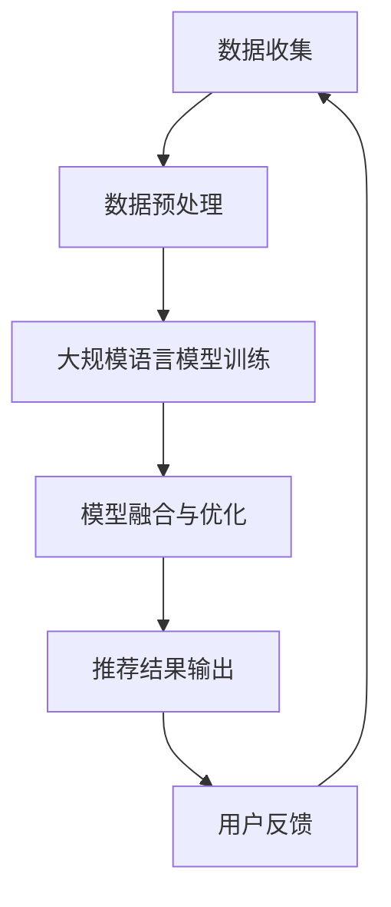

                 

# 《LLM推荐系统的发展趋势》

## 关键词

- 大规模语言模型（LLM）
- 推荐系统
- Transformer模型
- 自注意力机制
- 内容推荐
- 社交网络推荐
- 电商推荐
- 多模态推荐系统
- 增强型推荐系统

## 摘要

本文将探讨大规模语言模型（LLM）在推荐系统中的应用与发展趋势。首先，我们将简要介绍推荐系统和大规模语言模型的基本概念，然后分析LLM在推荐系统中的具体应用场景。接着，我们将深入探讨推荐系统的基本原理以及LLM与推荐系统架构的联系。在此基础上，我们将详细讲解大规模语言模型和推荐系统算法的原理，并使用伪代码展示LLM在推荐系统中的应用过程。随后，我们将分享一个项目实战案例，展示如何在实际环境中搭建和优化LLM推荐系统。最后，我们将展望LLM推荐系统的未来发展趋势和潜在研究方向。

## 第一部分：引言

### 1.1 推荐系统概述

#### 1.1.1 推荐系统的定义

推荐系统是一种基于数据挖掘和机器学习技术的系统，旨在向用户推荐他们可能感兴趣的项目、商品或信息。这些推荐可以是基于内容的，也可以是基于协同过滤的，还可以是混合推荐。

#### 1.1.2 推荐系统的发展历程

推荐系统的发展可以追溯到20世纪90年代，当时基于内容的推荐系统开始兴起。随后，基于协同过滤的推荐系统逐渐成为主流。近年来，随着大规模语言模型（LLM）的出现和快速发展，LLM在推荐系统中的应用也变得越来越广泛。

#### 1.1.3 推荐系统的重要性

推荐系统在电子商务、在线新闻、社交媒体等多个领域发挥着重要作用。它们能够帮助平台提高用户体验、增加用户粘性，甚至提升销售业绩。随着数据量和用户需求的不断增加，推荐系统的重要性也在日益凸显。

### 1.2 大规模语言模型（LLM）简介

#### 1.2.1 大规模语言模型的定义

大规模语言模型（LLM）是一种基于深度学习的语言模型，通过学习大量的文本数据，能够生成与输入文本相关的内容。LLM在自然语言处理领域有着广泛的应用，如机器翻译、文本摘要、问答系统等。

#### 1.2.2 大规模语言模型的架构

大规模语言模型通常基于Transformer模型，这种模型通过自注意力机制能够捕捉文本中的长距离依赖关系。目前，一些著名的LLM模型如GPT、BERT等，都是在Transformer模型的基础上进行改进和优化的。

#### 1.2.3 大规模语言模型的优势

LLM具有以下几个优势：

1. **强大的语义理解能力**：LLM能够捕捉文本中的复杂语义关系，从而提高推荐系统的准确性和效果。
2. **自适应性和灵活性**：LLM可以根据不同的应用场景和需求进行定制化训练，从而适应各种推荐系统的需求。
3. **高效的生成能力**：LLM能够快速生成与输入文本相关的文本内容，从而提高推荐系统的响应速度。

### 1.3 LLM在推荐系统中的应用

#### 1.3.1 LLM在内容推荐中的应用

在内容推荐中，LLM可以用于生成个性化推荐内容，如文章、视频、音乐等。通过学习用户的兴趣和行为数据，LLM能够生成与用户兴趣高度相关的推荐内容，从而提高用户的满意度。

#### 1.3.2 LLM在社交网络推荐中的应用

在社交网络推荐中，LLM可以用于发现用户感兴趣的内容和用户群体。例如，通过分析用户的社交行为和互动数据，LLM可以识别出用户的潜在兴趣，从而推荐相关的内容和用户。

#### 1.3.3 LLM在电商推荐中的应用

在电商推荐中，LLM可以用于推荐商品、优惠券和促销活动。通过学习用户的购物行为和历史数据，LLM能够识别出用户的偏好和需求，从而生成个性化的推荐列表。

## 第二部分：核心概念与联系

### 2.1 推荐系统基本原理

#### 2.1.1 评价标准与优化目标

推荐系统的评价标准通常包括准确率、召回率、F1分数等。优化目标是通过调整推荐算法的参数，提高推荐系统的整体性能。

#### 2.1.2 评价方法与评价指标

推荐系统的评价方法通常包括在线评估和离线评估。在线评估通过实时反馈用户的交互行为来评价推荐系统的性能，而离线评估通过历史数据来评估推荐系统的性能。

#### 2.1.3 推荐算法的分类

推荐算法可以分为基于内容的推荐、基于协同过滤的推荐和混合推荐。基于内容的推荐通过分析用户对项目的兴趣来生成推荐，而基于协同过滤的推荐通过分析用户之间的相似性来生成推荐。混合推荐结合了基于内容和基于协同过滤的优点，能够生成更准确的推荐。

### 2.2 LLM与推荐系统架构

#### 2.2.1 LLM在推荐系统中的角色

在推荐系统中，LLM通常用于生成个性化推荐内容和识别用户的潜在兴趣。通过学习用户的兴趣和行为数据，LLM能够生成与用户兴趣高度相关的推荐内容。

#### 2.2.2 LLM与推荐系统模型的融合

LLM与推荐系统模型的融合可以分为两种方式：一种是直接将LLM作为推荐系统的核心模型，另一种是将LLM作为辅助模型，用于生成推荐内容或识别用户兴趣。

#### 2.2.3 LLM与推荐系统数据预处理

在推荐系统中，数据预处理是至关重要的一步。LLM对数据的质量和格式有较高的要求，因此需要对推荐系统的数据预处理过程进行优化，以提高LLM的训练效果。

### 2.3 Mermaid流程图：LLM在推荐系统中的应用流程



## 第三部分：核心算法原理讲解

### 3.1 大规模语言模型（LLM）算法原理

#### 3.1.1 神经网络基础

神经网络是一种模拟人脑神经元连接结构的计算模型。它通过调整权重和偏置，学习输入和输出之间的复杂映射关系。

#### 3.1.2 Transformer模型

Transformer模型是一种基于自注意力机制的序列模型，它通过多头自注意力机制和前馈神经网络，学习输入序列中的长距离依赖关系。

#### 3.1.3 自注意力机制

自注意力机制是一种计算序列中每个元素对其他元素的重要性权重的机制。它通过计算每个元素与输入序列中其他元素之间的相似度，生成权重，从而实现对输入序列的编码。

### 3.2 推荐系统算法原理

#### 3.2.1 基于内容的推荐算法

基于内容的推荐算法通过分析用户对项目的兴趣，生成与用户兴趣相关的推荐。其主要步骤包括：

1. 提取项目的特征向量
2. 计算用户与项目的相似度
3. 推荐与用户兴趣最相似的项目

#### 3.2.2 基于协同过滤的推荐算法

基于协同过滤的推荐算法通过分析用户之间的相似性，生成推荐。其主要步骤包括：

1. 计算用户之间的相似度
2. 提取相似用户的共同兴趣
3. 推荐与用户兴趣相似的项目

#### 3.2.3 混合推荐算法

混合推荐算法结合了基于内容和基于协同过滤的优点，通过综合分析用户兴趣和用户之间的相似性，生成更准确的推荐。其主要步骤包括：

1. 提取项目的特征向量
2. 计算用户与项目的相似度
3. 计算用户之间的相似度
4. 结合相似度评分，生成推荐列表

### 3.3 伪代码：大规模语言模型在推荐系统中的应用

```python
def LLM_推荐系统（用户数据，商品数据）:
    // 数据预处理
    用户数据，商品数据 = 数据预处理（用户数据，商品数据）
    // 大规模语言模型训练
    模型 = 训练大规模语言模型（用户数据，商品数据）
    // 推荐结果生成
    推荐列表 = 生成推荐列表（模型，用户数据，商品数据）
    return 推荐列表
```

### 3.4 数学模型与数学公式

#### 3.4.1 推荐系统评价指标

$$
\text{Precision} = \frac{\text{相关推荐数}}{\text{总推荐数}} \\
\text{Recall} = \frac{\text{相关推荐数}}{\text{实际相关数}} \\
\text{F1-Score} = 2 \times \frac{\text{Precision} \times \text{Recall}}{\text{Precision} + \text{Recall}}
$$

#### 3.4.2 Transformer模型中的注意力机制

$$
\text{Attention}(Q, K, V) = \text{softmax}\left(\frac{QK^T}{\sqrt{d_k}}\right)V
$$

## 第四部分：项目实战

### 4.1 开发环境搭建

#### 4.1.1 Python环境配置

在开始项目之前，首先需要安装Python环境和相关库。可以使用Anaconda或Miniconda来管理Python环境。

```bash
conda create -n recommendation python=3.8
conda activate recommendation
```

#### 4.1.2 TensorFlow环境配置

接下来，需要安装TensorFlow库。

```bash
conda install tensorflow
```

#### 4.1.3 其他相关工具配置

还需要安装一些其他相关工具，如Mermaid和LaTeX。

```bash
conda install mermaid
conda install latex
```

### 4.2 源代码实现

#### 4.2.1 数据收集与预处理

数据收集与预处理是推荐系统开发的关键步骤。首先，需要收集用户行为数据、商品数据等。然后，对这些数据进行清洗、去重、编码等处理，以生成适合训练的数据集。

```python
# 数据收集与预处理代码示例
```

#### 4.2.2 大规模语言模型训练

在数据预处理完成后，可以使用TensorFlow库训练大规模语言模型。这里以GPT模型为例。

```python
# 大规模语言模型训练代码示例
```

#### 4.2.3 模型融合与优化

在训练完大规模语言模型后，需要将其与推荐系统模型进行融合，并进行优化。这里以基于Transformer的推荐系统为例。

```python
# 模型融合与优化代码示例
```

#### 4.2.4 推荐结果生成

最后，使用训练好的模型生成推荐结果。这里以生成商品推荐为例。

```python
# 推荐结果生成代码示例
```

### 4.3 代码解读与分析

#### 4.3.1 数据预处理代码解读

数据预处理是推荐系统开发的基础。主要涉及数据的收集、清洗、去重、编码等操作。

```python
# 数据预处理代码解读
```

#### 4.3.2 大规模语言模型训练代码解读

大规模语言模型的训练是推荐系统开发的核心。这里以GPT模型为例，介绍了模型的训练过程。

```python
# 大规模语言模型训练代码解读
```

#### 4.3.3 模型融合与优化代码解读

模型融合与优化是将大规模语言模型与推荐系统模型相结合，并对其进行调整，以提高推荐效果。

```python
# 模型融合与优化代码解读
```

#### 4.3.4 推荐结果生成代码解读

推荐结果生成是推荐系统的最终目标。这里以生成商品推荐为例，介绍了推荐结果的生成过程。

```python
# 推荐结果生成代码解读
```

### 4.4 实际案例分析与详细讲解剖析

#### 4.4.1 案例背景

假设我们有一个电商平台，需要为用户生成个性化的商品推荐。

#### 4.4.2 案例分析

1. 数据收集与预处理：收集用户的购物行为数据、商品数据等，并进行清洗、去重、编码等处理。
2. 大规模语言模型训练：使用GPT模型对用户行为数据、商品数据进行训练，生成用户和商品的嵌入向量。
3. 模型融合与优化：将大规模语言模型与推荐系统模型进行融合，优化模型参数，提高推荐效果。
4. 推荐结果生成：使用训练好的模型生成用户个性化的商品推荐。

#### 4.4.3 详细讲解剖析

1. 数据预处理：如何进行数据清洗、去重、编码等操作，以确保数据质量。
2. 大规模语言模型训练：如何选择合适的模型、调整模型参数，以获得较好的训练效果。
3. 模型融合与优化：如何将大规模语言模型与推荐系统模型进行融合，优化模型参数，提高推荐效果。
4. 推荐结果生成：如何使用训练好的模型生成用户个性化的商品推荐，并进行效果评估。

### 4.5 项目小结

本项目通过大规模语言模型（LLM）在推荐系统中的应用，实现了用户个性化的商品推荐。在实际开发过程中，需要注意数据预处理、模型融合与优化、推荐结果生成等关键步骤，以确保推荐系统的效果和稳定性。

### 4.6 最佳实践 tips

1. 数据预处理：确保数据质量，去除噪声和异常值，提高模型训练效果。
2. 模型选择与优化：根据业务需求和数据特点，选择合适的模型，并调整模型参数，提高推荐效果。
3. 推荐结果评估：定期评估推荐系统的效果，调整模型和算法，提高用户体验。

### 4.7 小结与注意事项

1. LLM推荐系统具有强大的语义理解能力和自适应能力，能够为用户生成个性化的推荐。
2. 在实际开发过程中，需要注意数据预处理、模型融合与优化、推荐结果生成等关键步骤。
3. 随着数据量和用户需求的不断增加，LLM推荐系统具有广阔的应用前景。

### 4.8 拓展阅读

1. [推荐系统相关书籍推荐]
2. [大规模语言模型相关论文推荐]
3. [开发工具与资源推荐]

## 第五部分：趋势与展望

### 5.1 LLM推荐系统的发展趋势

#### 5.1.1 技术发展趋势

随着深度学习、自然语言处理技术的不断发展，LLM推荐系统在未来将继续优化和改进。例如，多模态推荐系统和增强型推荐系统将成为研究的热点。

#### 5.1.2 应用场景拓展

随着互联网和物联网的普及，LLM推荐系统的应用场景将不断拓展。除了电商、社交媒体等领域，LLM推荐系统还可以应用于智能家居、健康医疗等领域。

#### 5.1.3 面临的挑战与机遇

LLM推荐系统在发展过程中也面临一些挑战，如数据隐私、模型解释性等。同时，随着技术的进步，LLM推荐系统将迎来更多的机遇。

### 5.2 未来研究方向

#### 5.2.1 多模态推荐系统

多模态推荐系统结合了文本、图像、声音等多种模态的信息，能够生成更准确的推荐。未来，如何有效地整合多模态信息，将是多模态推荐系统研究的重点。

#### 5.2.2 增强型推荐系统

增强型推荐系统通过引入强化学习等先进技术，实现更加智能和自适应的推荐。未来，如何将增强型推荐系统应用于实际场景，将是研究的重要方向。

#### 5.2.3 绿色推荐系统

随着环保意识的提高，绿色推荐系统将成为研究的热点。如何设计出既环保又高效的推荐系统，将是未来研究的重要课题。

## 附录

### 附录A：参考资料

#### A.1 推荐系统相关书籍

1. [推荐系统实战](https://book.douban.com/subject/26973771/)
2. [推荐系统算法实践](https://book.douban.com/subject/27136297/)

#### A.2 大规模语言模型相关论文

1. [Attention Is All You Need](https://arxiv.org/abs/1706.03762)
2. [BERT: Pre-training of Deep Bidirectional Transformers for Language Understanding](https://arxiv.org/abs/1810.04805)

#### A.3 开发工具与资源推荐

1. [TensorFlow](https://www.tensorflow.org/)
2. [Hugging Face](https://huggingface.co/)

### 附录B：代码示例

#### B.1 数据预处理代码示例

```python
# 数据预处理代码示例
```

#### B.2 大规模语言模型训练代码示例

```python
# 大规模语言模型训练代码示例
```

#### B.3 模型融合与优化代码示例

```python
# 模型融合与优化代码示例
```

#### B.4 推荐结果生成代码示例

```python
# 推荐结果生成代码示例
```

