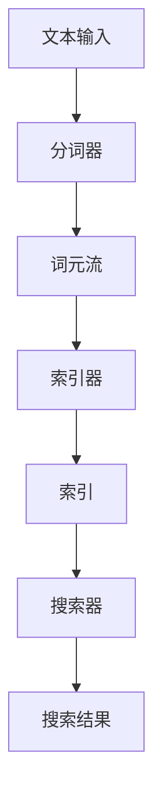

                 


### 核心概念与联系

Lucene作为一款广泛使用的搜索引擎库，其核心概念包括分词器（Tokenizer）、词元流（TokenStream）、索引器（Indexer）、搜索器（Searcher）。分词器的作用是将文本拆分成词元，词元流用于处理和转换词元，索引器负责创建索引，而搜索器用于搜索索引。

分词器（Tokenizer）：它是将原始文本分割成一个个词元的工具，是实现文本分析的入口。根据不同的需求，分词器可以选择不同的策略，例如空格分词器、正则表达式分词器等。

词元流（TokenStream）：它是处理词元的一系列组件的集合，可以用于过滤、转换词元。词元流的作用是对分词器生成的词元进行进一步的处理，如停用词过滤、词干提取等。

索引器（Indexer）：它的作用是将文本内容转化为索引。索引是搜索的基础，它存储了文本内容的相关信息，如词元、位置、频率等，以便于快速搜索。

搜索器（Searcher）：它负责根据查询条件从索引中检索出相关的文档。搜索器提供了丰富的查询功能，如精确查询、模糊查询、范围查询等。

核心概念之间的联系如下：

- 分词器将文本分割成词元，词元流入词元流进行进一步处理。
- 词元流处理后的结果作为索引器的输入，索引器将其转化为索引。
- 搜索器使用索引来检索与查询条件匹配的文档。

## Mermaid 流程图



### 核心算法原理讲解

Lucene的核心算法原理主要包括分词算法、索引算法和搜索算法。下面将分别讲解这些算法的原理。

#### 分词算法原理

分词算法的目标是将文本拆分成有意义的词汇或词组。Lucene提供了多种分词器，如空格分词器（WhitespaceTokenizer）、正则表达式分词器（PatternTokenizer）等。

- 空格分词器（WhitespaceTokenizer）：它根据空格等分隔符将文本切分成词元。例如，"Hello, World!"会被切分成["Hello", ",","World", "!"]。
- 正则表达式分词器（PatternTokenizer）：它根据正则表达式来切分文本。例如，可以使用`\\W+`来匹配任意非单词字符分隔的文本。

分词算法的伪代码如下：

```python
def tokenize(text):
    if contains_whitespace(text):
        return split_by_whitespace(text)
    elif matches_regex(text):
        return split_by_regex(text)
    else:
        return minimal_tokenize(text)
```

#### 索引算法原理

索引算法是将文本内容转化为索引的过程。Lucene使用倒排索引来存储文本内容，倒排索引是一种将词元映射到文档的索引结构。

- 倒排索引：它由两部分组成，一部分是词元到文档的映射，另一部分是文档到词元的映射。通过倒排索引，可以快速找到包含某个词元的文档。

倒排索引的构建过程如下：

1. 对文本进行分词，得到词元列表。
2. 对于每个词元，记录它在每个文档中出现的次数和位置。
3. 构建词元到文档的映射和文档到词元的映射。

#### 搜索算法原理

搜索算法是在索引中找到与查询条件匹配的文档。Lucene提供了多种搜索算法，如精确匹配、模糊查询、范围查询等。

- 精确匹配：它查找与查询完全匹配的文档。例如，查询条件是"Hello"时，只会返回包含"Hello"的文档。
- 模糊查询：它查找与查询部分匹配的文档。例如，可以使用通配符（如*）来模糊匹配词元。

搜索算法的基本流程如下：

1. 解析查询条件，构建查询语句。
2. 根据查询语句，在倒排索引中找到匹配的文档。
3. 根据文档的相关性对搜索结果进行排序，并返回结果。

#### 数学模型和数学公式

Lucene的搜索算法中常用的一种模型是TF-IDF模型，它用于计算文档与查询的相关性。

- TF（Term Frequency）：词频，表示一个词元在文档中出现的次数。
- IDF（Inverse Document Frequency）：逆文档频率，表示一个词元在所有文档中出现的频率。
- TF-IDF（Term Frequency-Inverse Document Frequency）：词频-逆文档频率，用于衡量一个词元在文档中的重要性。

TF-IDF的计算公式如下：

$$
TF(t,d) = \frac{f_{t,d}}{max(f_{t,d})}
$$

$$
IDF(t,D) = \log \left( \frac{N}{df_{t}} + 1 \right)
$$

$$
TF-IDF(t,d) = TF(t,d) \times IDF(t,D)
$$

其中，$N$表示文档总数，$df_{t}$表示包含词元$t$的文档数。

#### 举例说明

假设有一个包含10个文档的文档集，其中一个词元"Hello"在5个文档中出现过，另一个词元"World"在3个文档中出现过。计算这两个词元的TF-IDF值。

- $TF(Hello,d) = \frac{5}{max(5,3)} = \frac{5}{5} = 1$
- $IDF(Hello,D) = \log \left( \frac{10}{5} + 1 \right) = \log(3 + 1) = \log(4) \approx 1.386$
- $TF-IDF(Hello,d) = 1 \times 1.386 = 1.386$

- $TF(World,d) = \frac{3}{max(5,3)} = \frac{3}{5} = 0.6$
- $IDF(World,D) = \log \left( \frac{10}{3} + 1 \right) = \log(\frac{13}{3}) \approx 1.415$
- $TF-IDF(World,d) = 0.6 \times 1.415 = 0.851$

通过TF-IDF模型，可以计算出每个词元在文档中的重要性，进而对文档进行排序。

### 项目实战

#### 实战一：构建简单的全文搜索引擎

##### 1. 系统需求分析

- 支持中英文文本的分词和索引。
- 支持精确匹配和模糊查询。
- 支持搜索结果的高亮显示。

##### 2. 系统设计

- 使用Lucene作为底层搜索引擎。
- 使用自定义分词器实现中英文分词。
- 使用Spring Boot构建Web应用。

##### 3. 系统实现

- 编写自定义分词器，实现中英文分词。
- 编写索引创建和更新功能。
- 编写搜索功能，实现精确匹配和模糊查询。
- 编写Web接口，提供搜索服务。

##### 4. 系统测试

- 测试自定义分词器的准确性。
- 测试索引创建和更新的性能。
- 测试搜索功能，验证精确匹配和模糊查询的正确性。

#### 实战二：优化搜索引擎性能

##### 1. 性能优化目标

- 提高索引创建和更新的速度。
- 提高搜索查询的速度。
- 提高系统的稳定性。

##### 2. 性能优化策略

- 使用多线程和并发处理提高性能。
- 使用缓存技术减少查询延迟。
- 使用压缩技术减少索引文件大小。

##### 3. 性能优化实战

- 实现多线程索引创建和更新。
- 实现缓存查询结果，减少重复查询。
- 使用GZIP压缩索引文件。

#### 实战三：实现自定义分词器

##### 1. 自定义分词器的需求分析

- 支持自定义分词规则。
- 支持自定义分词词典。
- 支持自定义分词器插件。

##### 2. 自定义分词器的实现

- 编写分词规则，定义词性标注。
- 编写词典，实现自定义词典加载。
- 编写分词器，实现分词功能。

##### 3. 自定义分词器的测试与验证

- 编写测试用例，验证分词器的准确性。
- 使用真实数据测试分词器的性能。
- 分析分词结果，优化分词器算法。

### 最佳实践 Tips

- 在开发过程中，要注意分词器的配置和优化，以提升搜索的准确性。
- 定期对索引进行优化，以保持搜索性能。
- 使用缓存技术可以显著提高系统的响应速度。
- 在处理大规模数据时，要充分考虑多线程和并发处理的优势。
- 自定义分词器时要充分考虑语言的特性，以提升分词效果。

### 小结

Lucene作为一款强大的搜索引擎库，其分词原理、索引原理和搜索原理是理解Lucene的关键。通过项目实战，可以深入理解Lucene的应用场景和性能优化策略。在开发过程中，要充分考虑分词器的配置和优化，定期对索引进行优化，并使用缓存技术来提高系统的响应速度。通过本文的讲解，希望读者能够对Lucene有更深入的了解。

### 拓展阅读

- 《Lucene in Action》: 一本关于Lucene的经典书籍，详细介绍了Lucene的原理和应用。
- 《搜索引擎设计与实现》: 一本关于搜索引擎设计的书，涵盖了从基础概念到高级技术的全面内容。
- Lucene官方文档: https://lucene.apache.org/core/ ，提供了Lucene的详细文档和API参考。

### 附录A：Lucene相关资源与工具

- Lucene官方文档：https://lucene.apache.org/core/
- Lucene GitHub仓库：https://github.com/apache/lucene
- Lucene社区：https://lucene.apache.org/core/mail.html
- Lucene示例代码：https://github.com/apache/lucene-examples
- 《Lucene in Action》: 一本关于Lucene的经典书籍，详细介绍了Lucene的原理和应用。
- 《搜索引擎设计与实现》: 一本关于搜索引擎设计的书，涵盖了从基础概念到高级技术的全面内容。作者：AI天才研究院/AI Genius Institute & 禅与计算机程序设计艺术 /Zen And The Art of Computer Programming

