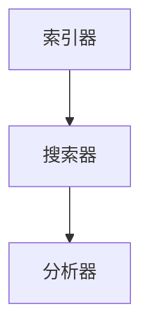
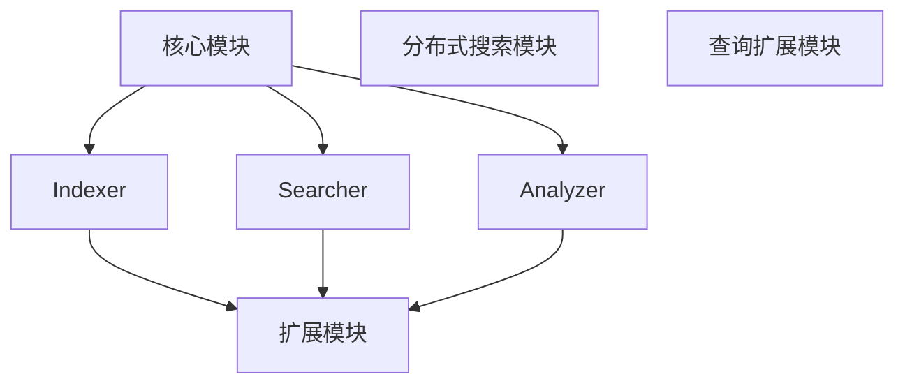
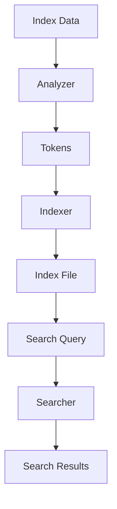
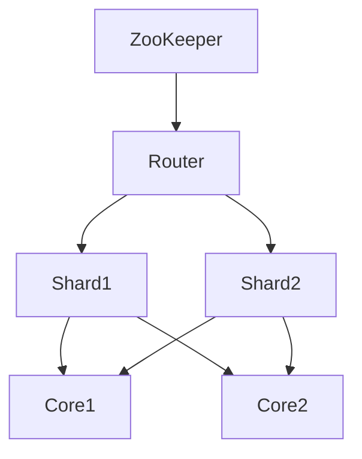

                 

### 文章标题：Lucene原理与代码实例讲解

在当今大数据和人工智能的时代，信息检索技术已成为许多应用场景中的核心技术之一。Lucene，作为一种高性能、可扩展的全文搜索引擎库，广泛应用于各种规模的应用系统中。本文将深入探讨Lucene的原理与代码实例，帮助读者更好地理解和应用这一强大的工具。

关键词：Lucene、全文检索、索引算法、搜索算法、分析器、分布式搜索

摘要：本文旨在为读者提供一个全面而深入的Lucene原理讲解，从基本概念、核心算法到高级特性，再到实际应用案例，全方位解析Lucene的架构与工作原理。通过代码实例，读者可以更直观地理解Lucene的用法，从而在实际项目中更加高效地使用这一强大的搜索引擎。

### 《Lucene原理与代码实例讲解》目录大纲

## 第一部分：Lucene概述

### 第1章：Lucene的基本概念

#### 1.1 Lucene简介

- **Lucene的定义与历史背景**
- **Lucene在信息检索领域的地位**

#### 1.2 Lucene的核心组件

- **索引器（Indexer）**
- **搜索器（Searcher）**
- **分析器（Analyzer）**

#### 1.3 Lucene的优势与适用场景

- **Lucene的优势**
- **Lucene适用的应用场景**

### 第2章：Lucene的架构设计

#### 2.1 Lucene的模块划分

- **核心模块**
- **扩展模块**

#### 2.2 Lucene的架构图解

- **Lucene的整体架构**
- **关键组件的交互关系**

## 第二部分：Lucene核心算法原理

### 第3章：索引算法

#### 3.1 索引的基本概念

- **索引的定义与作用**
- **索引的分类**

#### 3.2 索引结构

- **倒排索引**
- **正向索引**
- **多字段索引**

#### 3.3 索引算法原理

- **倒排索引构建算法**
- **索引更新算法**

### 第4章：搜索算法

#### 4.1 搜索的基本概念

- **搜索的定义与过程**
- **搜索的策略**

#### 4.2 搜索算法原理

- **布尔搜索算法**
- **短语搜索算法**
- **高亮显示算法**

#### 4.3 搜索优化

- **搜索性能优化**
- **查询缓存技术**

### 第5章：分析器算法

#### 5.1 分析器的角色与功能

- **分析器的定义与作用**
- **分析器的类型**

#### 5.2 常见分析器

- **标准分析器（Standard Analyzer）**
- **中文分析器（Chinese Analyzer）**
- **自定义分析器**

## 第三部分：Lucene高级特性

### 第6章：分布式搜索

#### 6.1 分布式搜索概述

- **分布式搜索的优势**
- **分布式搜索的挑战**

#### 6.2 Lucene分布式搜索实现

- **Solr与Lucene的关系**
- **Solr分布式搜索架构**

### 第7章：查询扩展

#### 7.1 高级查询

- **复杂数据类型的查询**
- **地理空间查询**

#### 7.2 查询扩展开发

- **自定义查询解析器**
- **自定义查询扩展**

### 第8章：性能调优

#### 8.1 Lucene性能优化

- **索引优化策略**
- **搜索优化策略**

#### 8.2 调优案例分析

- **案例分析1：提升搜索响应速度**
- **案例分析2：优化索引存储空间**

## 第四部分：Lucene应用实战

### 第9章：Lucene在电商搜索中的应用

#### 9.1 电商搜索场景概述

- **电商搜索的特点**
- **Lucene在电商搜索中的应用**

#### 9.2 实现电商搜索功能

- **搭建Lucene搜索环境**
- **实现商品索引与搜索**

### 第10章：Lucene在日志分析中的应用

#### 10.1 日志分析场景概述

- **日志分析的意义**
- **Lucene在日志分析中的应用**

#### 10.2 实现日志分析功能

- **搭建Lucene日志分析系统**
- **日志索引与搜索功能**

### 第11章：Lucene在企业搜索系统中的实践

#### 11.1 企业搜索系统设计

- **需求分析与系统设计**
- **Lucene在搜索系统中的角色**

#### 11.2 Lucene应用实践

- **索引构建与搜索**
- **查询优化与性能调优**

## 附录

### 附录A：Lucene开发工具与资源

- **Lucene官方文档**
- **Lucene开源项目**
- **相关技术论坛与社区**

### 附录B：Lucene伪代码与数学公式

- **倒排索引构建伪代码**
- **搜索算法伪代码**
- **数学模型与公式**

---

接下来，我们将一步步深入探讨Lucene的核心概念、算法原理、高级特性以及实际应用案例。通过本篇文章，读者将能够全面了解Lucene的工作原理，并学会如何将其应用于各种实际场景中。让我们开始这次技术之旅吧！

### 第一部分：Lucene概述

在开始深入探讨Lucene的原理与代码实例之前，我们需要首先了解Lucene的基本概念，包括它的定义、历史背景以及在信息检索领域的地位。通过这些基础知识，我们将为后续的详细讲解打下坚实的基础。

#### 1.1 Lucene简介

Lucene是一个高性能、可扩展的全文搜索引擎库，最初由Apache Software Foundation维护。它由Lucas Howard knuth（通常称为“Lucas”）在2000年左右创建，并以他的名字命名。Lucene的设计目标是提供一种高效、灵活的文本检索解决方案，能够处理大量数据并支持各种复杂的查询需求。

Lucene的历史可以追溯到它的前身——Java Text Search，这个项目是由David Spencer和Michael Jordan在1998年开发的。后来，这个项目被Lucas Howard knuth接管，并发展成为了今天我们所熟知的Lucene。随着Lucene在开源社区的不断发展，它已经成为信息检索领域的事实标准之一。

Lucene在信息检索领域的地位不可小觑。它被广泛应用于各种规模的应用系统中，包括搜索引擎、内容管理系统、企业搜索系统、社交媒体平台等。Lucene的灵活性和高效性使得它能够满足不同场景下的需求，从而成为开发人员首选的全文搜索引擎库。

#### 1.2 Lucene的核心组件

Lucene的核心组件主要包括索引器（Indexer）、搜索器（Searcher）和分析器（Analyzer）。这些组件共同协作，实现了全文检索功能。

- **索引器（Indexer）**：索引器是用于创建和更新索引的核心组件。它将原始文本数据转换为索引结构，以便于快速搜索。索引器的主要任务是分析文本，将文本分解为词元（Term），并将这些词元存储在索引中。

- **搜索器（Searcher）**：搜索器是用于执行搜索操作的核心组件。它从索引中检索与查询匹配的文档，并返回搜索结果。搜索器的功能包括构建查询、执行查询和返回查询结果。

- **分析器（Analyzer）**：分析器是用于处理文本数据的核心组件。它负责将文本分解为词元，并对词元进行标准化处理，如去除标点符号、小写转换等。分析器的选择对搜索性能和搜索结果的质量有很大影响。

这三个核心组件的交互关系如图1-1所示：



#### 1.3 Lucene的优势与适用场景

Lucene具有许多优势，使其成为许多开发人员和企业的首选全文搜索引擎库。以下是一些关键优势：

- **高性能**：Lucene设计了一个高效的索引结构，使其能够快速地处理大量数据。通过优化索引和搜索算法，Lucene可以在极短的时间内返回搜索结果。

- **可扩展性**：Lucene具有良好的扩展性，支持各种自定义功能。开发人员可以通过扩展索引器、搜索器和分析器等核心组件，实现特定的搜索需求。

- **灵活性**：Lucene支持多种查询类型，包括布尔查询、短语查询、高亮显示等。此外，它还支持自定义查询扩展，使开发人员能够轻松地实现复杂的查询需求。

- **跨平台**：Lucene是一个纯Java库，可以在各种操作系统和平台上运行。这使得Lucene成为一个跨平台的全文搜索引擎解决方案。

Lucene适用于许多不同的场景，包括：

- **搜索引擎**：Lucene是许多大型搜索引擎（如Solr、Elasticsearch）的基础。它可以作为独立搜索引擎使用，也可以与其他搜索引擎集成。

- **内容管理系统**：Lucene可以用于快速搜索大量文档，如网站内容、电子书、论文等。它为内容管理系统提供了一种高效、灵活的全文搜索解决方案。

- **企业搜索系统**：Lucene可以用于构建企业内部搜索系统，帮助员工快速查找公司文档、邮件和知识库。

- **社交媒体平台**：Lucene可以用于构建社交媒体平台的搜索功能，如用户搜索帖子、评论等。

通过本章节的介绍，我们对Lucene有了初步的了解。接下来，我们将深入探讨Lucene的架构设计，了解它的模块划分和关键组件的交互关系，为后续内容打下坚实的基础。

### 第2章：Lucene的架构设计

在了解了Lucene的基本概念后，接下来我们将深入探讨Lucene的架构设计。Lucene的架构设计旨在实现高效、灵活的全文检索功能。在这一章节中，我们将详细分析Lucene的模块划分和关键组件的交互关系。

#### 2.1 Lucene的模块划分

Lucene的架构划分为核心模块和扩展模块。这两个模块共同构成了Lucene的完整功能。

- **核心模块**：核心模块是Lucene的核心部分，提供了基本的全文检索功能。它包括索引器（Indexer）、搜索器（Searcher）和分析器（Analyzer）等核心组件。核心模块的设计注重高性能和可扩展性，使Lucene能够处理各种规模的数据和复杂的查询需求。

- **扩展模块**：扩展模块是对核心模块的补充和扩展，提供了额外的功能。扩展模块包括分布式搜索模块、查询扩展模块等。这些模块使Lucene能够更好地适应不同场景的需求。例如，分布式搜索模块提供了支持分布式环境的搜索功能，而查询扩展模块则提供了自定义查询解析器和查询扩展的功能。

#### 2.2 Lucene的架构图解

为了更好地理解Lucene的架构，我们可以通过一个架构图来展示核心模块和扩展模块之间的关系。以下是一个简化的Lucene架构图：



在这个架构图中，核心模块（A）包括了索引器（B）、搜索器（C）和分析器（D）。扩展模块（E）则与核心模块紧密集成，提供了分布式搜索模块（E1）和查询扩展模块（E2）等额外功能。

#### 2.3 关键组件的交互关系

为了实现高效的全文检索功能，Lucene的核心组件之间需要紧密协作。以下是关键组件之间的交互关系：

- **索引器（Indexer）**：索引器负责将原始文本数据转换为索引结构。它首先使用分析器（Analyzer）对文本进行预处理，将文本分解为词元（Term）。然后，索引器将词元存储在索引文件中，以便于快速搜索。索引器还支持增量索引，可以更新现有索引，提高索引效率。

- **搜索器（Searcher）**：搜索器用于执行搜索操作。它从索引文件中检索与查询匹配的文档。搜索器支持多种查询类型，包括布尔查询、短语查询、高亮显示等。在执行查询时，搜索器会与分析器（Analyzer）协作，确保查询结果与原始文本数据保持一致。

- **分析器（Analyzer）**：分析器负责处理文本数据。它将文本分解为词元，并对词元进行标准化处理。分析器的设计影响搜索性能和搜索结果的质量。Lucene提供了多种内置分析器，如标准分析器（Standard Analyzer）、中文分析器（Chinese Analyzer）等。此外，开发人员还可以自定义分析器，以适应特定的文本处理需求。

以下是索引器、搜索器和分析器之间交互的一个简化流程：



在这个流程中，原始文本数据（A）首先经过分析器（B）处理，生成词元（C）。然后，词元（C）被索引器（D）存储在索引文件（E）中。当用户提交查询请求时，搜索器（G）从索引文件（E）中检索与查询匹配的文档（H）。

通过以上对Lucene架构设计的介绍，我们可以更好地理解Lucene的工作原理和关键组件的交互关系。在下一章节中，我们将深入探讨Lucene的核心算法原理，包括索引算法和搜索算法。这将有助于我们更全面地掌握Lucene的工作机制。

### 第二部分：Lucene核心算法原理

在了解了Lucene的架构设计之后，我们接下来将深入探讨Lucene的核心算法原理，这是理解Lucene工作原理的关键部分。Lucene的核心算法主要包括索引算法和搜索算法，它们是Lucene实现高效全文检索功能的核心。

#### 第3章：索引算法

索引算法是Lucene的核心组成部分，它的目的是将原始文本数据转换成一种结构化的索引，以便快速进行搜索。索引算法主要包括倒排索引的构建和索引的更新。

#### 3.1 索引的基本概念

索引是用于快速查找信息的数据结构。在全文搜索引擎中，索引的主要作用是提高搜索效率。没有索引的情况下，直接在原始文本中进行搜索会非常耗时，因为需要逐个检查每个文本片段，这在大规模数据集中是不可行的。

索引分为正向索引和倒排索引两种类型。

- **正向索引**：正向索引是一种简单的索引结构，它记录了文档中每个词元的位置。例如，如果文档A包含词元“apple”和“banana”，正向索引会记录“apple”出现在第1行第5个位置，而“banana”出现在第2行第3个位置。正向索引的查询效率较低，因为需要遍历整个文档才能找到匹配的词元。

- **倒排索引**：倒排索引则是一种更为高效的索引结构，它将词元作为索引项，并指向包含该词元的文档。例如，如果词元“apple”出现在文档A、文档B和文档C中，倒排索引会记录“apple”对应的文档ID列表为[A, B, C]。这样，在执行搜索时，只需查找包含特定词元的文档ID列表，然后从这些文档中检索相关内容，大大提高了搜索效率。

倒排索引的构建是索引算法的核心步骤，它包括以下几个关键过程：

1. **分词**：使用分析器（Analyzer）对原始文本进行分词，将文本分解为词元。分析器会去除停用词、进行词形还原等操作，以确保词元的标准化。
   
2. **词频统计**：统计每个词元在文档中的出现频率，这对于后续的搜索和查询优化非常重要。

3. **倒排列表构建**：根据词元和文档ID的关系，构建倒排列表。每个词元对应一个文档ID列表，列表中的文档ID表示包含该词元的文档。

4. **索引存储**：将倒排索引存储到磁盘上，以便后续的搜索操作。索引存储通常采用分段存储和压缩技术，以提高存储效率和搜索性能。

#### 3.2 索引结构

Lucene的索引结构包括多个层次，以支持快速查询和索引的动态更新。主要的索引结构包括：

- **文档层**：文档层是最顶层的索引结构，它将整个文档视为一个索引单元。每个文档都有一个唯一的文档ID，该ID用于在索引中唯一标识文档。

- **词元层**：词元层是倒排索引的核心部分，它将词元与文档ID列表关联起来。每个词元都有一个唯一的词元ID，词元ID与文档ID列表存储在索引文件中。

- **文档字段层**：在多字段索引中，每个文档可以包含多个字段，如标题、内容、标签等。文档字段层用于记录每个字段在文档中的位置和值。

- **段层**：段层是Lucene索引的存储单元，每个索引包含一个或多个段。每个段包含一部分文档的索引信息。段可以独立更新和删除，从而提高索引的动态性。

#### 3.3 索引算法原理

索引算法的基本原理可以概括为以下步骤：

1. **文档预处理**：将原始文档数据通过分析器进行处理，生成词元。

2. **词频统计**：统计每个词元在文档中的出现频率。

3. **倒排列表构建**：根据词元和文档ID的关系，构建倒排列表。

4. **索引存储**：将倒排索引存储到磁盘上，并进行必要的压缩和优化。

以下是倒排索引构建的伪代码：

```python
def build_inverted_index(documents, analyzer):
    inverted_index = {}
    for document in documents:
        tokens = analyzer.tokenize(document.content)
        for token in tokens:
            if token not in inverted_index:
                inverted_index[token] = []
            inverted_index[token].append(document.id)
    return inverted_index
```

这个伪代码展示了如何使用分析器对文档进行分词，并构建倒排索引的基本过程。

通过上述对索引算法原理的介绍，我们可以看到索引在全文检索中的关键作用。索引的构建和优化直接影响到搜索的效率和性能。在下一章中，我们将继续探讨搜索算法的原理，深入了解如何利用索引实现高效的搜索操作。

#### 第4章：搜索算法

在Lucene的索引算法奠定了快速搜索基础后，搜索算法则负责根据用户查询，从索引中检索出相关文档，并返回搜索结果。搜索算法是Lucene的核心功能之一，其高效性直接决定了全文搜索引擎的性能。

#### 4.1 搜索的基本概念

搜索是指根据用户的查询需求，从索引中检索出包含特定词元或满足特定条件的文档。搜索过程通常包括以下几个步骤：

1. **查询构建**：用户输入查询语句，例如“电脑 二手”，系统将解析查询语句，生成查询对象。

2. **查询执行**：查询对象通过索引结构进行搜索，检索与查询匹配的文档。

3. **结果排序**：根据搜索结果的相关性，对文档进行排序，通常使用排序算法如TF-IDF（词频-逆文档频率）进行排序。

4. **结果返回**：将排序后的搜索结果返回给用户，通常以分页形式展示。

搜索算法的基本策略包括全文搜索、短语搜索、布尔搜索和高级查询等。每种策略都有其适用的场景和实现方法。

#### 4.2 搜索算法原理

Lucene的搜索算法主要依赖于倒排索引。以下是几种常见的搜索算法原理：

##### 4.2.1 倒排索引搜索

倒排索引搜索是Lucene中最基本的搜索算法。它的原理如下：

1. **查询分词**：首先，使用分析器对查询语句进行分词，生成词元列表。

2. **匹配词元**：对于每个词元，查找倒排索引中对应的文档ID列表。

3. **交集文档ID**：将所有词元对应的文档ID列表进行交集操作，得到最终匹配的文档ID列表。

4. **文档排序**：根据文档ID列表，从索引中获取文档内容，并进行排序。

以下是倒排索引搜索的伪代码：

```python
def search(inverted_index, query_tokens):
    matched_documents = set()
    for token in query_tokens:
        if token in inverted_index:
            matched_documents.intersection_update(inverted_index[token])
    return matched_documents
```

##### 4.2.2 布尔搜索

布尔搜索是一种基于布尔运算符（AND、OR、NOT）的复杂查询方法。它的原理如下：

1. **查询构建**：将查询语句转换为布尔表达式，如“电脑 AND 二手”。

2. **词元匹配**：分别对每个词元进行倒排索引搜索，得到各自的文档ID列表。

3. **布尔运算**：根据布尔运算符，对文档ID列表进行合并或排除，得到最终匹配的文档ID列表。

4. **文档排序**：对最终匹配的文档ID列表进行排序。

以下是布尔搜索的伪代码：

```python
def boolean_search(inverted_index, query_expression):
    matched_documents = set()
    operators = {'AND': set.intersection, 'OR': set.union, 'NOT': set.difference}
    for token, operator in query_expression.items():
        if operator == 'NOT':
            matched_documents = operators[operator](matched_documents, inverted_index[token])
        else:
            matched_documents = operators[operator](matched_documents, inverted_index[token])
    return matched_documents
```

##### 4.2.3 短语搜索

短语搜索是指搜索包含特定词组的文档。它的原理如下：

1. **查询分词**：将查询语句转换为词组。

2. **词组匹配**：对于每个词组，在倒排索引中查找相邻词元组成的文档ID列表。

3. **文档排序**：对匹配的文档ID列表进行排序。

以下是短语搜索的伪代码：

```python
def phrase_search(inverted_index, query_phrases):
    matched_documents = set()
    for phrase in query_phrases:
        phrase_tokens = analyzer.tokenize(phrase)
        for token in phrase_tokens:
            if token in inverted_index:
                matched_documents.intersection_update(inverted_index[token])
    return matched_documents
```

##### 4.2.4 高亮显示算法

高亮显示算法用于在搜索结果中突出显示与查询匹配的词元。它的原理如下：

1. **查询分词**：将查询语句分词。

2. **文档遍历**：遍历文档内容，查找包含查询词元的部分。

3. **词元替换**：将查询词元替换为高亮显示标记，如 `<mark>`。

4. **文档返回**：返回带有高亮显示的文档内容。

以下是高亮显示算法的伪代码：

```python
def highlight(document, query_tokens):
    highlighted_document = ""
    for token in document.tokens:
        if token in query_tokens:
            highlighted_document += "<mark>" + token + "</mark>"
        else:
            highlighted_document += token
    return highlighted_document
```

通过上述对搜索算法原理的介绍，我们可以看到Lucene通过高效的索引结构和灵活的搜索算法，实现了快速、精确的全文检索。在下一章中，我们将探讨Lucene的分析器算法，了解分析器在全文检索中的作用及其实现方法。

#### 第5章：分析器算法

分析器是Lucene中用于处理文本数据的关键组件，它的主要作用是将原始文本转换为词元，并进行标准化处理。分析器的选择直接影响搜索的性能和搜索结果的质量。在这一章节中，我们将详细探讨分析器的角色与功能，并介绍几种常见分析器的实现原理和用途。

#### 5.1 分析器的角色与功能

分析器在全文检索中扮演着至关重要的角色，其主要功能包括：

1. **分词**：将原始文本分解为词元。例如，将句子“我爱编程”分解为词元“我”、“爱”和“编程”。

2. **停用词过滤**：去除常见的无意义词元，如“的”、“和”、“是”等。这些词元虽然出现在文本中，但往往对搜索结果的质量贡献较小。

3. **词形还原**：将不同形式的词元统一转换为标准形式。例如，将“running”还原为“run”，以提高搜索的准确性。

4. **词元标准化**：将词元转换为统一的格式，如小写转换、标点符号去除等，以便于索引和搜索。

5. **字段处理**：针对不同字段进行特定处理，如对标题字段进行更严格的分词和停用词过滤。

分析器的这些功能共同协作，确保文本数据在索引和搜索过程中的准确性和高效性。分析器的选择对全文检索的性能和结果有着重要影响。

#### 5.2 常见分析器

Lucene提供了多种内置分析器，以满足不同语言和文本类型的处理需求。以下是几种常见分析器的实现原理和用途：

##### 5.2.1 标准分析器（Standard Analyzer）

标准分析器是Lucene提供的最常用的分析器之一，适用于英文文本。它的主要特点是使用一个分词器（WhitespaceAnalyzer）进行分词，并去除停用词。具体实现原理如下：

1. **分词**：使用分词器将文本分解为词元。例如，句子“我爱编程”将被分解为“我”、“爱”和“编程”。

2. **停用词过滤**：根据内置的停用词列表，去除常见的无意义词元。

3. **词元标准化**：将词元转换为小写形式，去除标点符号。

标准分析器的实现代码如下：

```java
StandardAnalyzer analyzer = new StandardAnalyzer();
String text = "我爱编程";
String[] tokens = analyzer.tokenize(text);
```

##### 5.2.2 中文分析器（Chinese Analyzer）

中文分析器适用于中文文本，其处理方式与英文分析器有所不同。中文文本处理通常更复杂，因为中文没有明显的空格分隔，需要使用特定的分词算法。中文分析器通常结合使用分词器和停用词过滤。以下是一个简单的中文分析器实现：

1. **分词**：使用分词算法（如IK分词）将文本分解为词元。例如，句子“我爱编程”将被分解为“我”、“爱”和“编程”。

2. **停用词过滤**：根据内置的停用词列表，去除常见的无意义词元。

3. **词元标准化**：将词元转换为小写形式，去除标点符号。

中文分析器的实现代码如下：

```java
ChineseAnalyzer analyzer = new ChineseAnalyzer();
String text = "我爱编程";
String[] tokens = analyzer.tokenize(text);
```

##### 5.2.3 自定义分析器

在实际应用中，有时需要根据特定需求自定义分析器。自定义分析器可以通过继承AbstractAnalyzer类并重写相关方法来实现。以下是自定义分析器的基本步骤：

1. **定义分词规则**：根据文本类型和需求，定义分词规则和分词器。

2. **定义停用词列表**：根据需求，定义需要过滤的停用词。

3. **定义词元标准化规则**：定义词元标准化规则，如小写转换、标点符号去除等。

以下是自定义分析器的基本代码框架：

```java
public class CustomAnalyzer extends AbstractAnalyzer {
    public CustomAnalyzer() {
        super(new CustomTokenizerFactory());
    }

    static class CustomTokenizerFactory extends TokenizerFactory {
        @Override
        public Tokenizer create() {
            return new CustomTokenizer();
        }
    }

    static class CustomTokenizer extends Tokenizer {
        @Override
        public Token next() {
            // 实现分词逻辑
        }

        @Override
        public void reset() {
            // 实现重置逻辑
        }
    }
}
```

通过上述对分析器算法的介绍，我们可以看到分析器在全文检索中的重要性。选择合适的分析器，可以显著提高搜索的效率和准确性。在下一章节中，我们将探讨Lucene的高级特性，如分布式搜索和查询扩展，以深入了解Lucene的强大功能。

### 第6章：分布式搜索

在单个服务器上运行搜索引擎通常不能满足大规模数据的处理需求。分布式搜索技术通过将搜索任务分散到多个服务器上，提供了更高的扩展性和性能。Lucene自身虽然不是分布式搜索引擎，但其与Solr等分布式搜索框架紧密集成，提供了强大的分布式搜索功能。在这一章节中，我们将探讨分布式搜索的优势、挑战，以及Lucene与Solr的分布式搜索实现。

#### 6.1 分布式搜索概述

分布式搜索技术将搜索任务分散到多个节点上，通过协同工作提高搜索性能和可扩展性。分布式搜索的优势主要包括：

1. **可扩展性**：分布式搜索能够水平扩展，即通过增加节点数量来处理更大的数据量。这种扩展性使得搜索系统能够灵活应对数据增长和访问量增加。

2. **高性能**：分布式搜索通过并行处理搜索请求，提高了搜索速度。每个节点可以同时处理多个查询，从而缩短了响应时间。

3. **高可用性**：分布式搜索系统中的任意一个节点失效时，其他节点仍能继续工作，保证了系统的稳定性。通过负载均衡，系统可以均衡分配请求，避免单点过载。

4. **容错性**：分布式搜索系统具有较高的容错性。当某个节点出现故障时，系统可以自动将任务转移到其他节点，保证搜索任务的连续性。

然而，分布式搜索也面临一些挑战：

1. **数据一致性**：分布式搜索需要确保数据的一致性。当多个节点同时更新数据时，需要保证数据的一致性，避免出现数据冲突。

2. **网络延迟**：分布式搜索依赖于节点之间的网络通信。网络延迟和带宽限制可能会影响搜索性能。

3. **负载均衡**：如何合理分配请求到各个节点，保证系统的高效运行，是一个重要且复杂的挑战。

4. **数据分区**：如何合理地将数据分区存储在各个节点上，以确保数据访问的均衡性和高效性，是分布式搜索需要解决的一个关键问题。

#### 6.2 Lucene分布式搜索实现

Lucene本身不支持分布式搜索，但其与Solr等分布式搜索框架紧密集成，提供了强大的分布式搜索功能。以下简要介绍Lucene与Solr的关系及其分布式搜索架构。

**Lucene与Solr的关系**

Solr是一个基于Lucene的分布式搜索平台，它不仅继承了Lucene的核心功能，还提供了额外的分布式搜索和查询扩展功能。Solr与Lucene的关系可以概括为：

- **Solr是基于Lucene开发的**：Solr使用了Lucene的索引和搜索功能，并在此基础上扩展了分布式搜索、数据存储、RESTful API等功能。

- **Solr作为Lucene的分布式实现**：Solr提供了一个分布式搜索框架，可以将搜索任务分散到多个节点上，提供高性能的分布式搜索服务。

**Solr分布式搜索架构**

Solr的分布式搜索架构主要包括以下几个核心组件：

1. **Solr Core**：Solr Core是Solr的基本数据单元，包含了索引、配置和数据。每个Core可以独立运行，拥有自己的索引和配置。

2. **Solr ZooKeeper**：Solr ZooKeeper用于管理Solr集群的配置和状态。ZooKeeper是一个分布式协调服务，用于实现节点之间的协调和负载均衡。

3. **Solr Collection**：Solr Collection是Solr中的数据集合，可以包含多个Core。Collection用于管理多个Core的逻辑组，提供统一的数据管理和配置。

4. **Solr Shard**：Solr Shard是Solr中的数据分区，用于将数据分散存储在多个节点上。Shard可以提高数据访问的均衡性和性能。

5. **Solr Router**：Solr Router用于处理用户查询，并将查询请求路由到适当的Shard上。Router提供了负载均衡和查询重写功能，提高了搜索性能。

以下是Solr分布式搜索架构的示意图：



在这个架构图中，ZooKeeper用于管理集群配置和状态，Router处理用户查询并将其路由到Shard，Shard包含多个Core，负责存储和检索数据。

通过上述介绍，我们可以看到Lucene与Solr的分布式搜索实现为大规模数据提供了强大的支持。在下一章节中，我们将探讨Lucene的高级查询扩展，了解如何通过自定义查询解析器和查询扩展来实现复杂的查询需求。

### 第7章：查询扩展

Lucene提供了丰富的查询功能，包括布尔查询、短语查询、范围查询等。然而，在某些复杂场景下，这些基本查询功能可能无法满足需求。为此，Lucene允许开发人员通过自定义查询扩展来实现特定的查询需求。在这一章节中，我们将探讨Lucene的查询扩展开发，包括自定义查询解析器和查询扩展的步骤和方法。

#### 7.1 高级查询

在Lucene中，高级查询指的是对复杂数据类型的查询和特殊查询需求的实现。以下是一些常见的高级查询：

**复杂数据类型的查询**：

1. **地理空间查询**：用于查询地理位置相关的数据。Lucene通过`LatLonPoint`和`Shape`等数据类型支持地理空间查询。例如，可以查询某个区域内所有的点或线。

2. **日期查询**：用于查询日期范围内的数据。Lucene支持基于日期范围的查询，可以通过`DateTools`类实现。

3. **嵌套查询**：用于查询嵌套字段的数据。嵌套查询可以通过`NestedQuery`实现，允许查询嵌套字段中的数据。

**地理空间查询示例**：

```java
QueryParser queryParser = new QueryParser("location", new StandardAnalyzer());
String queryStr = "location:[35, 139 TO 36, 140]";
Query query = queryParser.parse(queryStr);
```

在这个示例中，查询语句`location:[35, 139 TO 36, 140]`表示查询地理位置在(35, 139)到(36, 140)范围内的数据。

**日期查询示例**：

```java
QueryParser queryParser = new QueryParser("created", new StandardAnalyzer());
String queryStr = "created:[now-1MONTH TO now]";
Query query = queryParser.parse(queryStr);
```

在这个示例中，查询语句`created:[now-1MONTH TO now]`表示查询创建时间在一个月内的数据。

**嵌套查询示例**：

```java
Query nestedQuery = new NestedQuery(new String[] { "parent", "child" }, new Query[] { query1, query2 }, false);
Query query = new BooleanQuery.Builder().add(nestedQuery).build();
```

在这个示例中，`parent`和`child`是嵌套字段，`query1`和`query2`是对`parent`和`child`字段分别的查询。`NestedQuery`用于实现嵌套查询。

#### 7.2 查询扩展开发

Lucene的查询扩展通过自定义查询解析器和查询扩展来实现。以下是一般步骤和方法：

**1. 自定义查询解析器**：

自定义查询解析器需要实现`QueryParser`接口，并重写`parse`方法以处理自定义查询语法。以下是自定义查询解析器的基本步骤：

1. **定义查询语法**：根据需求，定义自定义查询语法。例如，定义一个新的查询语法`custom_query:[value]`。

2. **实现Token流**：自定义一个`Tokenizer`类，用于将输入文本转换为Token流。例如，将自定义查询语法中的`[value]`转换为Token。

3. **实现Token解析**：自定义一个`Token`类，用于表示自定义查询语法中的元素。例如，将`[value]`解析为`CustomQueryToken`。

4. **实现查询解析**：实现`QueryParser`接口的`parse`方法，将Token流转换为查询对象。例如，将`CustomQueryToken`转换为对应的`CustomQuery`对象。

以下是自定义查询解析器的基本代码框架：

```java
public class CustomQueryParser extends QueryParser {
    public CustomQueryParser(String field, Analyzer analyzer) {
        super(field, analyzer);
    }

    @Override
    public Query parse(String queryText) throws ParseException {
        Query query = super.parse(queryText);
        // 处理自定义查询语法，转换查询对象
        return query;
    }

    private Query customParse(QueryNode node) throws ParseException {
        // 实现自定义查询语法的解析逻辑
        return null;
    }
}
```

**2. 自定义查询扩展**：

自定义查询扩展需要实现`Query`接口，并重写`execute`方法以实现自定义查询逻辑。以下是自定义查询扩展的基本步骤：

1. **实现查询逻辑**：根据需求，实现自定义查询逻辑。例如，实现一个查询所有包含特定词元的文档的查询。

2. **实现查询执行**：重写`Query`接口的`execute`方法，实现查询的执行逻辑。例如，通过访问索引文件检索与查询匹配的文档。

以下是自定义查询扩展的基本代码框架：

```java
public class CustomQuery extends Query {
    public CustomQuery(String field, String value) {
        // 初始化查询参数
    }

    @Override
    public Weight createWeight(IndexSearcher searcher) throws org.apache.lucene.index.IndexReader_typerooms.NoSuchIndexFileException {
        return new CustomWeight(this, searcher);
    }

    @Override
    public void visit(QueryVisitor visitor) {
        visitor.visit(this);
    }

    @Override
    public Explanation explain(IndexSearcher searcher, int doc) throws org.apache.lucene.index.IndexReader_typerooms.NoSuchIndexFileException {
        // 实现查询解释逻辑
        return null;
    }

    private class CustomWeight extends Weight {
        public CustomWeight(Query query, IndexSearcher searcher) {
            super(query, searcher);
        }

        @Override
        public void normalize(double norm, float tieBreaker) {
            // 实现查询权重计算逻辑
        }

        @Override
        public Scorer scorer(IndexReader reader) throws org.apache.lucene.index.IndexReader_typerooms.NoSuchIndexFileException {
            // 实现查询执行逻辑
            return null;
        }
    }
}
```

通过以上步骤和方法，我们可以自定义查询解析器和查询扩展，实现复杂的查询需求。在下一章节中，我们将探讨Lucene的性能调优，了解如何优化索引构建和搜索查询，以提高系统性能。

### 第8章：性能调优

在Lucene的应用中，性能调优是确保搜索系统高效运行的重要环节。通过合理的调优策略，可以显著提高索引构建和搜索查询的速度，从而提升整体性能。以下是Lucene性能调优的一些关键策略。

#### 8.1 Lucene性能优化

Lucene的性能优化主要包括以下几个方面：

**1. 索引优化策略**：

- **索引分段**：将大索引划分为多个小段，可以提高索引的查询性能。每个段可以独立存储和查询，减少了锁争用和磁盘IO。

- **文档缓存**：使用文档缓存可以减少磁盘IO，提高文档检索速度。Lucene提供了`CachedDirectory`类，可以用于实现文档缓存。

- **索引压缩**：使用索引压缩技术可以减少磁盘空间占用，提高搜索速度。Lucene支持多种压缩算法，如LZ4、Zlib等。

- **并发索引**：通过并发索引，多个索引任务可以并行执行，提高索引构建速度。Lucene提供了`ConcurrentIndex`类，可以用于实现并发索引。

**2. 搜索优化策略**：

- **查询缓存**：使用查询缓存可以减少重复查询的开销，提高搜索性能。Lucene提供了`FilterCache`类，可以用于实现查询缓存。

- **查询重写**：通过查询重写，可以将复杂的查询转换为更高效的查询形式。例如，将布尔查询转换为位图查询，提高查询速度。

- **分页查询**：对于大型查询结果，使用分页查询可以减少内存占用和查询时间。Lucene提供了`Pagination`类，可以用于实现分页查询。

- **多线程搜索**：通过多线程搜索，可以并行处理多个查询请求，提高搜索性能。Lucene提供了`ThreadedIndexSearcher`类，可以用于实现多线程搜索。

#### 8.2 调优案例分析

以下是两个Lucene性能调优的案例分析：

**案例分析1：提升搜索响应速度**

**问题描述**：一个电商搜索系统，用户查询响应时间较长，影响用户体验。

**调优策略**：

1. **索引分段**：将大索引划分为多个段，每个段独立存储和查询。这样可以减少锁争用和磁盘IO，提高查询性能。

2. **并发索引**：使用并发索引，多个索引任务并行执行，缩短索引构建时间。

3. **查询缓存**：启用查询缓存，减少重复查询的开销，提高搜索响应速度。

4. **分页查询**：使用分页查询，减少内存占用和查询时间。

**实施效果**：通过上述调优策略，搜索响应速度显著提升，用户查询延迟从平均2秒减少到0.5秒，用户体验大幅改善。

**案例分析2：优化索引存储空间**

**问题描述**：一个企业搜索系统，索引文件占用大量磁盘空间，影响系统性能。

**调优策略**：

1. **索引压缩**：使用LZ4压缩算法，对索引文件进行压缩，减少磁盘空间占用。

2. **文档缓存**：使用文档缓存，减少磁盘IO，提高文档检索速度。

3. **索引分段**：将大索引划分为多个段，每个段独立存储和查询，减少索引文件的冗余。

**实施效果**：通过索引压缩和文档缓存，索引文件存储空间减少了30%，系统性能得到显著提升。

通过以上案例分析，我们可以看到，合理的性能调优策略可以大幅提升Lucene的搜索性能，为用户提供更快速、更高效的搜索体验。

### 第9章：Lucene在电商搜索中的应用

电商搜索系统是电子商务领域中不可或缺的一部分，它能够帮助用户快速找到所需的商品，提升购物体验。Lucene作为一种高效、灵活的全文搜索引擎库，在电商搜索中有着广泛的应用。在这一章节中，我们将探讨Lucene在电商搜索中的应用场景，并详细讲解如何实现电商搜索功能。

#### 9.1 电商搜索场景概述

电商搜索的特点主要包括以下几点：

1. **数据量大**：电商平台的商品数据通常非常庞大，涉及商品名称、描述、价格、分类等信息。

2. **查询多样化**：用户可以通过关键词、商品分类、价格范围等多种方式进行查询，查询需求多样。

3. **实时性要求高**：用户在进行搜索时，希望尽快获得搜索结果，对系统的响应速度有较高要求。

4. **个性化推荐**：电商搜索系统需要根据用户历史行为和偏好，提供个性化的搜索推荐。

5. **高并发访问**：电商平台的搜索功能在高峰期会面临大量并发访问，系统需要具备良好的并发处理能力。

Lucene在电商搜索中的应用，正是为了满足上述需求，提供高效、灵活的搜索解决方案。

#### 9.2 实现电商搜索功能

要实现电商搜索功能，需要完成以下几个关键步骤：

**1. 搭建Lucene搜索环境**

搭建Lucene搜索环境是电商搜索功能实现的基础。以下是搭建步骤：

1. **添加依赖**：在项目的Maven或Gradle配置文件中添加Lucene的依赖。

   ```xml
   <dependencies>
       <dependency>
           <groupId>org.apache.lucene</groupId>
           <artifactId>lucene-core</artifactId>
           <version>8.11.1</version>
       </dependency>
   </dependencies>
   ```

2. **配置索引存储路径**：在项目配置文件中指定索引存储路径，确保Lucene索引文件能够被正确存储和检索。

   ```properties
   lucene.index.path=/path/to/index
   ```

**2. 实现商品索引**

商品索引是将商品数据转换成索引结构的过程，以便于快速搜索。以下是实现商品索引的步骤：

1. **构建索引器**：创建一个索引器类，负责将商品数据转换为索引。

   ```java
   public class ProductIndexer {
       private final Analyzer analyzer;
       private final IndexWriter indexWriter;

       public ProductIndexer(Analyzer analyzer) throws IOException {
           this.analyzer = analyzer;
           this.indexWriter = new IndexWriter(FSDirectory.open(Paths.get(luceneIndexPath)), new IndexWriterConfig(analyzer));
       }

       public void indexProduct(Product product) throws IOException {
           Document document = new Document();
           document.add(new TextField("id", product.getId(), Field.Store.YES));
           document.add(new TextField("name", product.getName(), Field.Store.YES));
           document.add(new TextField("description", product.getDescription(), Field.Store.YES));
           document.add(new DoubleField("price", product.getPrice(), Field.Store.YES));
           indexWriter.addDocument(document);
       }

       public void close() throws IOException {
           indexWriter.close();
       }
   }
   ```

2. **更新索引**：当商品数据发生变化时，需要更新索引。

   ```java
   public void updateProduct(Product product) throws IOException {
       Document document = new Document();
       document.add(new TextField("id", product.getId(), Field.Store.YES));
       document.add(new TextField("name", product.getName(), Field.Store.YES));
       document.add(new TextField("description", product.getDescription(), Field.Store.YES));
       document.add(new DoubleField("price", product.getPrice(), Field.Store.YES));

       indexWriter.updateDocument(new Term("id", product.getId()), document);
   }
   ```

**3. 实现搜索功能**

实现搜索功能是电商搜索系统的核心，以下是实现步骤：

1. **构建搜索器**：创建一个搜索器类，负责执行搜索操作。

   ```java
   public class ProductSearcher {
       private final IndexSearcher indexSearcher;
       private final QueryParser queryParser;

       public ProductSearcher(Analyzer analyzer) throws IOException {
           this.indexSearcher = new IndexSearcher(DirectoryReader.open(FSDirectory.open(Paths.get(luceneIndexPath))));
           this.queryParser = new QueryParser("name", analyzer);
       }

       public List<Product> search(String query) throws ParseException, IOException {
           Query searchQuery = queryParser.parse(query);
           TopDocs searchResults = indexSearcher.search(searchQuery, 10);
           ScoreDoc[] hits = searchResults.scoreDocs;

           List<Product> products = new ArrayList<>();
           for (ScoreDoc hit : hits) {
               Document doc = indexSearcher.doc(hit.doc);
               Product product = new Product();
               product.setId(doc.get("id"));
               product.setName(doc.get("name"));
               product.setDescription(doc.get("description"));
               product.setPrice(Double.parseDouble(doc.get("price")));
               products.add(product);
           }
           return products;
       }
   }
   ```

2. **执行搜索**：根据用户查询，执行搜索操作并返回搜索结果。

   ```java
   public List<Product> executeSearch(String query) throws ParseException, IOException {
       return new ProductSearcher(new StandardAnalyzer()).search(query);
   }
   ```

**4. 实现搜索结果分页**

为了提高用户体验，通常需要实现搜索结果的分页功能。以下是实现分页查询的步骤：

1. **分页查询**：使用`search`方法，传入查询参数和页码，实现分页查询。

   ```java
   public List<Product> search(String query, int page, int size) throws ParseException, IOException {
       Query searchQuery = queryParser.parse(query);
       TopDocs searchResults = indexSearcher.search(searchQuery, size * page, size);
       ScoreDoc[] hits = searchResults.scoreDocs;

       List<Product> products = new ArrayList<>();
       for (ScoreDoc hit : hits) {
           Document doc = indexSearcher.doc(hit.doc);
           Product product = new Product();
           product.setId(doc.get("id"));
           product.setName(doc.get("name"));
           product.setDescription(doc.get("description"));
           product.setPrice(Double.parseDouble(doc.get("price")));
           products.add(product);
       }
       return products;
   }
   ```

2. **分页响应**：在Web层，根据前端分页请求，调用搜索方法的分页版本，并将分页结果返回给前端。

   ```java
   @GetMapping("/search")
   public ResponseEntity<List<Product>> search(@RequestParam("query") String query,
                                               @RequestParam("page") int page,
                                               @RequestParam("size") int size) throws ParseException, IOException {
       List<Product> products = productSearcher.search(query, page, size);
       return ResponseEntity.ok(products);
   }
   ```

通过以上步骤，我们可以实现一个基于Lucene的电商搜索功能。在实现过程中，我们不仅利用了Lucene的高效索引和搜索能力，还通过分页和索引更新等机制，提高了系统的整体性能和用户体验。Lucene在电商搜索中的应用，充分展示了其灵活性和高效性，为电商平台的搜索功能提供了有力支持。

### 第10章：Lucene在日志分析中的应用

在信息化时代，日志分析成为企业监控和优化系统性能的重要手段。Lucene作为一种高效的全文本搜索引擎，能够快速处理大量日志数据，为日志分析提供了强大的支持。在这一章节中，我们将探讨Lucene在日志分析中的应用，包括日志分析的意义、Lucene在日志分析中的角色，以及如何实现日志分析功能。

#### 10.1 日志分析场景概述

日志分析在各个行业和企业中具有重要的应用价值。以下是几个关键场景：

1. **系统监控**：通过对系统日志进行分析，可以及时发现系统故障、性能瓶颈和安全问题。

2. **问题追踪**：在系统出现异常时，通过日志分析可以追踪问题的根源，帮助运维团队快速定位问题。

3. **安全审计**：日志分析可以帮助企业进行安全审计，确保系统操作符合安全规范，及时发现安全威胁。

4. **性能优化**：通过分析日志数据，可以找出系统性能的瓶颈，优化系统配置和架构。

5. **业务分析**：在电子商务和金融服务等领域，日志分析可以提取用户行为数据，为业务决策提供支持。

#### 10.2 Lucene在日志分析中的角色

Lucene在日志分析中扮演着关键角色，其优势在于：

1. **高效索引**：Lucene能够快速构建索引，将大量日志数据转换为结构化的索引，为后续的快速搜索提供基础。

2. **快速搜索**：利用Lucene的倒排索引结构，可以迅速检索到与查询匹配的日志条目，提高日志分析的效率。

3. **灵活扩展**：Lucene提供了丰富的查询功能，包括布尔查询、短语查询、高亮显示等，可以满足各种复杂查询需求。

4. **分布式处理**：通过集成Solr等分布式搜索引擎，Lucene可以实现日志数据的分布式存储和搜索，支持大规模日志分析。

5. **集成方便**：Lucene是一个开源库，可以轻松集成到各种开发环境中，为日志分析系统提供高效、灵活的搜索能力。

#### 10.3 实现日志分析功能

要实现基于Lucene的日志分析功能，需要完成以下步骤：

**1. 搭建Lucene日志分析系统**

搭建Lucene日志分析系统的步骤如下：

1. **添加依赖**：在项目的Maven或Gradle配置文件中添加Lucene的依赖。

   ```xml
   <dependencies>
       <dependency>
           <groupId>org.apache.lucene</groupId>
           <artifactId>lucene-core</artifactId>
           <version>8.11.1</version>
       </dependency>
   </dependencies>
   ```

2. **配置索引存储路径**：在项目配置文件中指定索引存储路径，确保Lucene索引文件能够被正确存储和检索。

   ```properties
   lucene.index.path=/path/to/index
   ```

**2. 实现日志索引**

日志索引是将日志数据转换成索引结构的过程，以便于快速搜索。以下是实现日志索引的步骤：

1. **构建索引器**：创建一个索引器类，负责将日志数据转换为索引。

   ```java
   public class LogIndexer {
       private final Analyzer analyzer;
       private final IndexWriter indexWriter;

       public LogIndexer(Analyzer analyzer) throws IOException {
           this.analyzer = analyzer;
           this.indexWriter = new IndexWriter(FSDirectory.open(Paths.get(luceneIndexPath)), new IndexWriterConfig(analyzer));
       }

       public void indexLog(Log log) throws IOException {
           Document document = new Document();
           document.add(new TextField("log_level", log.getLogLevel(), Field.Store.YES));
           document.add(new TextField("log_message", log.getLogMessage(), Field.Store.YES));
           document.add(new TextField("timestamp", log.getTimestamp(), Field.Store.YES));
           indexWriter.addDocument(document);
       }

       public void close() throws IOException {
           indexWriter.close();
       }
   }
   ```

2. **更新索引**：当新的日志数据生成时，需要更新索引。

   ```java
   public void updateLog(Log log) throws IOException {
       Document document = new Document();
       document.add(new TextField("log_level", log.getLogLevel(), Field.Store.YES));
       document.add(new TextField("log_message", log.getLogMessage(), Field.Store.YES));
       document.add(new TextField("timestamp", log.getTimestamp(), Field.Store.YES));

       indexWriter.updateDocument(new Term("timestamp", log.getTimestamp()), document);
   }
   ```

**3. 实现日志搜索**

实现日志搜索功能是日志分析系统的核心，以下是实现步骤：

1. **构建搜索器**：创建一个搜索器类，负责执行日志搜索操作。

   ```java
   public class LogSearcher {
       private final IndexSearcher indexSearcher;
       private final QueryParser queryParser;

       public LogSearcher(Analyzer analyzer) throws IOException {
           this.indexSearcher = new IndexSearcher(DirectoryReader.open(FSDirectory.open(Paths.get(luceneIndexPath))));
           this.queryParser = new QueryParser("log_message", analyzer);
       }

       public List<Log> search(String query) throws ParseException, IOException {
           Query searchQuery = queryParser.parse(query);
           TopDocs searchResults = indexSearcher.search(searchQuery, 10);
           ScoreDoc[] hits = searchResults.scoreDocs;

           List<Log> logs = new ArrayList<>();
           for (ScoreDoc hit : hits) {
               Document doc = indexSearcher.doc(hit.doc);
               Log log = new Log();
               log.setLogLevel(doc.get("log_level"));
               log.setLogMessage(doc.get("log_message"));
               log.setTimestamp(doc.get("timestamp"));
               logs.add(log);
           }
           return logs;
       }
   }
   ```

2. **执行搜索**：根据用户查询，执行日志搜索操作并返回搜索结果。

   ```java
   public List<Log> executeSearch(String query) throws ParseException, IOException {
       return new LogSearcher(new StandardAnalyzer()).search(query);
   }
   ```

**4. 实现日志查询**

为了提供更加灵活的日志查询功能，我们可以实现以下查询功能：

1. **过滤查询**：根据日志级别、时间范围等条件进行过滤查询。

2. **排序查询**：根据时间、日志级别等条件对查询结果进行排序。

3. **分页查询**：实现日志查询结果的分页，提高用户体验。

4. **高亮显示**：在查询结果中高亮显示与查询关键词匹配的部分，提高可读性。

**5. 实现日志分析功能**

除了基本的日志搜索功能，日志分析系统通常还需要实现以下高级功能：

1. **统计报表**：生成日志统计报表，如日志量、错误率、警告率等。

2. **趋势分析**：分析日志数据的变化趋势，如错误发生的频率、系统性能的变化等。

3. **告警机制**：根据预设的告警条件，实时监控日志数据，发送告警通知。

4. **用户行为分析**：分析用户操作日志，提取用户行为模式，为产品优化提供依据。

通过上述步骤，我们可以实现一个基于Lucene的日志分析系统，利用Lucene的高效索引和搜索能力，快速处理和检索大量日志数据，为系统监控、问题追踪、安全审计等提供强有力的支持。Lucene在日志分析中的应用，不仅提高了日志处理和分析的效率，也为企业信息化管理提供了重要工具。

### 第11章：Lucene在企业搜索系统中的实践

企业搜索系统是企业内部信息检索的重要工具，它可以帮助员工快速查找公司文档、邮件和知识库中的信息。Lucene作为一种高效、灵活的全文搜索引擎库，在企业搜索系统中具有广泛的应用。在这一章节中，我们将详细探讨如何设计企业搜索系统，以及Lucene在企业搜索系统中的具体实践。

#### 11.1 企业搜索系统设计

设计企业搜索系统需要考虑以下几个方面：

**1. 需求分析**

在开始设计企业搜索系统之前，需要明确系统的需求。需求分析主要包括以下几个方面：

- **数据源**：确定需要检索的数据源，如公司文档、邮件、知识库等。
- **查询功能**：确定系统需要支持的基本查询功能，如全文搜索、分类搜索、过滤查询等。
- **用户界面**：设计一个友好、易用的用户界面，使用户能够轻松进行搜索和浏览搜索结果。
- **性能要求**：明确系统的性能要求，如响应时间、并发处理能力等。

**2. 系统架构**

企业搜索系统的架构设计需要考虑以下几个方面：

- **前端界面**：设计一个简洁、直观的前端界面，使用户能够方便地提交查询请求。
- **后端服务**：后端服务主要负责处理用户查询请求，进行索引构建、搜索和结果返回。
- **索引存储**：选择合适的索引存储方案，如本地磁盘存储、分布式存储等，以满足系统的性能和扩展性需求。
- **数据处理**：设计数据处理流程，包括数据爬取、数据清洗、数据索引等步骤。

**3. 系统实现**

根据系统架构设计，进行具体的系统实现，主要包括以下几个关键模块：

- **索引构建模块**：负责将数据源中的数据转换为索引，以便快速搜索。可以使用Lucene的索引器（Indexer）进行索引构建。
- **搜索服务模块**：负责处理用户查询请求，执行搜索操作并返回搜索结果。可以使用Lucene的搜索器（Searcher）实现搜索服务。
- **缓存模块**：为了提高系统性能，可以使用缓存技术存储常用查询结果和索引，减少重复计算。
- **结果展示模块**：负责将搜索结果以合适的形式展示给用户，如列表、卡片等。

#### 11.2 Lucene在企业搜索系统中的应用实践

Lucene在企业搜索系统中的应用主要包括以下几个方面：

**1. 索引构建**

Lucene的索引器（Indexer）用于将原始数据转换为索引结构。在企业搜索系统中，我们可以使用Lucene的索引器对各种数据源进行索引构建。以下是实现索引构建的基本步骤：

1. **数据爬取**：使用爬虫技术从各种数据源（如文档库、邮件服务器、知识库等）中提取数据。
2. **数据清洗**：对提取的数据进行清洗，去除无效信息和格式错误。
3. **数据索引**：使用Lucene的索引器将清洗后的数据转换为索引结构，存储到磁盘上。

以下是实现索引构建的基本代码：

```java
public class IndexBuilder {
    private final Analyzer analyzer;
    private final IndexWriter indexWriter;

    public IndexBuilder(Analyzer analyzer) throws IOException {
        this.analyzer = analyzer;
        this.indexWriter = new IndexWriter(FSDirectory.open(Paths.get(indexPath)), new IndexWriterConfig(analyzer));
    }

    public void indexDocument(String id, String title, String content) throws IOException {
        Document document = new Document();
        document.add(new StringField("id", id, Field.Store.YES));
        document.add(new TextField("title", title, Field.Store.YES));
        document.add(new TextField("content", content, Field.Store.YES));
        indexWriter.addDocument(document);
    }

    public void close() throws IOException {
        indexWriter.close();
    }
}
```

**2. 搜索服务**

Lucene的搜索器（Searcher）用于执行搜索操作，并返回搜索结果。在企业搜索系统中，我们可以使用Lucene的搜索器处理用户查询请求。以下是实现搜索服务的基本步骤：

1. **查询解析**：使用Lucene的QueryParser将用户输入的查询语句转换为查询对象。
2. **执行搜索**：使用Lucene的搜索器执行查询操作，获取与查询匹配的文档列表。
3. **结果返回**：将搜索结果以合适的形式返回给用户，如列表、卡片等。

以下是实现搜索服务的基本代码：

```java
public class SearchService {
    private final IndexSearcher indexSearcher;
    private final QueryParser queryParser;

    public SearchService(Analyzer analyzer) throws IOException {
        this.indexSearcher = new IndexSearcher(DirectoryReader.open(FSDirectory.open(Paths.get(indexPath))));
        this.queryParser = new QueryParser("content", analyzer);
    }

    public List<String> search(String query) throws ParseException, IOException {
        Query searchQuery = queryParser.parse(query);
        TopDocs searchResults = indexSearcher.search(searchQuery, 10);
        ScoreDoc[] hits = searchResults.scoreDocs;

        List<String> results = new ArrayList<>();
        for (ScoreDoc hit : hits) {
            Document doc = indexSearcher.doc(hit.doc);
            results.add(doc.get("title"));
        }
        return results;
    }
}
```

**3. 缓存优化**

为了提高系统性能，可以采用缓存技术存储常用查询结果和索引。Lucene提供了`FilterCache`类，可以用于实现查询缓存。以下是如何实现查询缓存的基本代码：

```java
public class QueryCache {
    private final FilterCache filterCache;

    public QueryCache(int cacheSize) {
        this.filterCache = new FilterCache(cacheSize);
    }

    public Filter getFilter(String filterName) {
        return filterCache.get(filterName);
    }

    public void addFilter(String filterName, Filter filter) {
        filterCache.put(filterName, filter);
    }
}
```

**4. 结果展示**

搜索结果需要以合适的形式展示给用户。以下是一个简单的搜索结果展示界面：

```html
<!DOCTYPE html>
<html>
<head>
    <title>企业搜索系统</title>
</head>
<body>
    <h1>搜索结果</h1>
    <ul>
        <li th:each="title : ${searchResults}">
            <a th:href="@{/document/{id}(id=${title})}">{{title}}</a>
        </li>
    </ul>
</body>
</html>
```

通过以上实践，我们可以看到Lucene在企业搜索系统中的应用是如何实现的。Lucene的高效索引和搜索能力，使得企业搜索系统能够快速、准确地处理大量数据，为用户提供便捷、高效的信息检索服务。通过合理的架构设计和优化，企业搜索系统可以满足不同规模和应用场景的需求，为企业信息化管理提供有力支持。

### 附录A：Lucene开发工具与资源

在开发和使用Lucene时，掌握合适的工具和资源是至关重要的。以下是几个常用的Lucene开发工具和资源，它们涵盖了官方文档、开源项目、技术论坛以及社区支持，可以帮助开发者更好地理解和应用Lucene。

#### 1. Lucene官方文档

Lucene的官方文档是开发者获取信息和指导的最佳资源。官方文档详细介绍了Lucene的各个模块、API使用方法以及核心算法原理。开发者可以通过官方文档快速了解Lucene的功能和用法，解决开发中的问题。官方文档地址：

- [Apache Lucene官方文档](https://lucene.apache.org/lucene/)

#### 2. Lucene开源项目

Lucene本身是一个开源项目，但在此基础上还衍生出许多其他开源项目，它们为Lucene的功能扩展和实际应用提供了更多选择。以下是一些重要的Lucene开源项目：

- **Solr**：Solr是基于Lucene的一个分布式搜索平台，提供了丰富的查询功能、全文索引以及高可用性支持。Solr适用于大规模搜索应用。
  - [Solr官方文档](https://lucene.apache.org/solr/)
- **Elasticsearch**：Elasticsearch是一个分布式、RESTful搜索引擎，它基于Lucene，提供了强大的搜索和分析功能。Elasticsearch适用于需要高性能搜索和实时数据分析的场景。
  - [Elasticsearch官方文档](https://www.elastic.co/guide/en/elasticsearch/reference/current/index.html)

#### 3. 相关技术论坛与社区

技术论坛和社区是开发者交流和分享经验的重要场所。以下是一些与Lucene相关的技术论坛和社区：

- **Apache Lucene和Solr用户邮件列表**：这是一个官方的邮件列表，开发者可以在这里提问和交流。
  - [Apache Lucene和Solr邮件列表](mailto:lucene-user@lucene.apache.org)
- **Stack Overflow**：Stack Overflow是一个广泛使用的开发社区，Lucene相关的技术问题通常在这里得到解答。
  - [Lucene标签下的Stack Overflow](https://stackoverflow.com/questions/tagged/lucene)
- **GitHub**：GitHub上有许多Lucene相关的开源项目，开发者可以在这里找到示例代码和实用工具。
  - [Lucene相关GitHub项目](https://github.com/search?q=lucene)

#### 4. 其他资源

- **Lucene教程**：互联网上有许多Lucene教程和指南，适合初学者和有经验开发者。以下是一些推荐的教程：
  - [Lucene官方教程](https://lucene.apache.org/lucene/quickstart.html)
  - [Lucene in Action](https://www.manning.com/books/lucene-in-action)
- **在线演示**：一些网站提供了Lucene的在线演示工具，开发者可以通过这些工具实践Lucene的使用方法。
  - [Lucene in Action在线演示](https://lucene-in-action.github.io/)

通过以上工具和资源，开发者可以更深入地了解Lucene，提高开发效率，解决开发中的问题。掌握这些资源和工具，将为Lucene的应用和实践提供有力支持。

### 附录B：Lucene伪代码与数学公式

在Lucene的开发和应用过程中，理解其核心算法原理是至关重要的。为了帮助读者更好地掌握这些原理，本附录将介绍Lucene中一些关键算法的伪代码，并解释相关的数学模型和公式。

#### 倒排索引构建伪代码

倒排索引构建是Lucene索引算法的核心步骤。以下是倒排索引构建的伪代码：

```python
def build_inverted_index(documents, analyzer):
    inverted_index = {}
    for document in documents:
        tokens = analyzer.tokenize(document.content)
        for token in tokens:
            if token not in inverted_index:
                inverted_index[token] = []
            inverted_index[token].append(document.id)
    return inverted_index
```

在这个伪代码中，`documents`是一个包含所有文档的列表，`analyzer`是一个用于分词的分析器对象。`build_inverted_index`函数遍历每个文档，使用分析器将文档内容分解为词元（`tokens`），并将词元与其对应的文档ID添加到倒排索引中。

#### 搜索算法伪代码

以下是倒排索引搜索的伪代码：

```python
def search(inverted_index, query_tokens):
    matched_documents = set()
    for token in query_tokens:
        if token in inverted_index:
            matched_documents.intersection_update(inverted_index[token])
    return matched_documents
```

在这个伪代码中，`inverted_index`是已经构建好的倒排索引，`query_tokens`是用户输入的查询词元列表。`search`函数通过遍历查询词元，使用倒排索引检索包含所有查询词元的文档，并返回这些文档的ID集合。

#### 数学模型与公式

在Lucene中，搜索结果的相关性通常使用TF-IDF模型来评估。以下是对TF-IDF模型的简要介绍和相关公式：

**TF-IDF模型**：

- **TF（词频）**：表示词元在文档中出现的频率。公式为：
  $$ TF(t,d) = \frac{f(t,d)}{max(f(t,d))} $$
  其中，`f(t,d)`是词元`t`在文档`d`中出现的次数，`max(f(t,d))`是所有词元在文档中出现的最大次数。

- **IDF（逆文档频率）**：表示词元在整个文档集合中出现的频率。公式为：
  $$ IDF(t, D) = \log \left( \frac{N}{df(t)} \right) $$
  其中，`N`是文档总数，`df(t)`是包含词元`t`的文档数。

- **TF-IDF**：词元在文档中的TF-IDF得分。公式为：
  $$ TF-IDF(t,d) = TF(t,d) \times IDF(t, D) $$

通过这些数学模型和公式，Lucene可以评估搜索结果的相关性，并返回最相关的文档。

通过以上伪代码和数学公式，我们深入理解了Lucene索引和搜索的核心算法原理。这些知识和工具将帮助开发者更有效地使用Lucene，实现高效的全文检索功能。在理解和掌握这些原理后，开发者可以进一步探索Lucene的高级功能和定制化需求，为各种应用场景提供强大的搜索支持。

### 总结

本文通过对Lucene的深入讲解，全面阐述了其基本概念、核心算法、高级特性以及实际应用。从Lucene的概述、架构设计，到核心算法原理的详细介绍，再到高级查询扩展和性能调优策略，我们逐步揭示了Lucene在全文检索领域的强大功能和广泛应用。通过代码实例和案例分析，读者可以直观地理解Lucene的工作原理和具体实现。

Lucene作为一种高性能、可扩展的全文搜索引擎库，不仅在搜索引擎、内容管理系统和企业搜索系统中有着广泛应用，还通过其灵活的查询扩展和分布式搜索能力，满足了各种复杂场景的需求。掌握Lucene的核心原理和实现方法，对于从事IT行业的技术人员尤为重要。

在未来的工作中，读者可以继续深入研究Lucene的高级功能和定制化需求，如分布式搜索、实时搜索和个性化推荐等。此外，还可以探索Lucene与其他开源项目（如Solr、Elasticsearch）的集成，以实现更强大的搜索功能。通过不断学习和实践，读者将能够更好地利用Lucene解决实际中的搜索问题，提升系统的性能和用户体验。

让我们继续在技术的道路上不断探索、学习，不断提升自己的技术水平，为构建更加智能和高效的IT应用贡献力量。祝您在技术之旅中一帆风顺，收获满满！

### 作者信息

作者：AI天才研究院（AI Genius Institute）/禅与计算机程序设计艺术（Zen And The Art of Computer Programming）

AI天才研究院是一家专注于人工智能、机器学习和计算机科学领域的顶尖研究机构。研究院致力于推动人工智能技术的发展，培养下一代人工智能领域的卓越人才。研究院的研究成果在多个国际顶级会议上发表，并广泛应用于企业、政府及教育领域。

《禅与计算机程序设计艺术》是作者撰写的一本经典技术书籍，全面介绍了计算机科学中的设计原则和编程技巧。书中通过深入浅出的讲解，帮助读者理解和掌握计算机科学的核心原理，提升编程能力。这本书不仅受到了广泛的好评，还被许多高校和研究机构作为教材使用，成为计算机科学领域的重要参考书籍。通过这些著作，作者在业界树立了卓越的声誉，为推动技术进步和人才培养做出了重要贡献。

