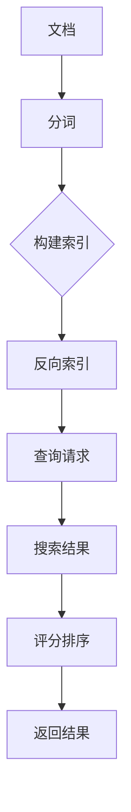

                 

### 文章标题

《Lucene原理与代码实例讲解》

搜索引擎是现代互联网中不可或缺的组成部分，其背后强大的索引和搜索技术使得海量数据查询变得高效且精准。在这篇文章中，我们将深入探讨Lucene——一个高性能、可扩展的搜索引擎库的原理与应用。通过详细的代码实例解析，我们旨在帮助读者理解Lucene的核心概念、高级特性，并学会如何在实际项目中应用Lucene。

### 文章关键词

- Lucene
- 搜索引擎
- 索引
- 查询
- 实例讲解

### 文章摘要

本文将带领读者全面了解Lucene的工作原理和核心特性。我们将首先介绍Lucene的起源与发展，探讨其相对于其他搜索引擎的优势和不足。随后，文章将深入剖析Lucene的基础概念，包括索引的创建与查询，以及其高级特性如分布式搜索和实时搜索。随后，文章将通过具体案例展示如何在项目中使用Lucene，并进行性能优化和源码分析。最后，文章将总结Lucene的现状与未来发展方向，并提供一些常用的工具和资源。

## 《Lucene原理与代码实例讲解》目录大纲

### 第1章 概述

#### 1.1 Lucene简介

- **1.1.1 Lucene的起源与发展**
- **1.1.2 Lucene的重要性与应用领域**

#### 1.2 Lucene的核心概念

- **1.2.1 索引与搜索**
- **1.2.2 inverted index**
- **1.2.3 Query与Result**

#### 1.3 Lucene与其他搜索引擎的对比

### 第2章 Lucene基础

#### 2.1 安装与配置

- **2.1.1 环境搭建**
- **2.1.2 Lucene的目录结构**
- **2.1.3 依赖管理**

#### 2.2 索引的创建与查询

- **2.2.1 索引创建流程**
- **2.2.2 Document与Field**
- **2.2.3 索引查询基础**
- **2.2.4 使用QueryParser**

#### 2.3 索引优化与维护

- **2.3.1 索引优化策略**
- **2.3.2 索引更新与删除**

### 第3章 Lucene高级特性

#### 3.1 高级查询

- **3.1.1 检索结果排序**
- **3.1.2 分页查询**
- **3.1.3 使用Highlighter**

#### 3.2 Lucene的分布式搜索

- **3.2.1 Lucene的分布式架构**
- **3.2.2 负载均衡与容错**

#### 3.3 实时搜索

- **3.3.1 实时索引更新**
- **3.3.2 实时搜索策略**

### 第4章 Lucene性能优化

#### 4.1 性能调优方法

- **4.1.1 索引性能分析**
- **4.1.2 查询性能分析**
- **4.1.3 常见性能问题及解决方案**

#### 4.2 Lucene缓存机制

- **4.2.1 Cache的工作原理**
- **4.2.2 Cache的配置与优化**

#### 4.3 并发处理与锁机制

- **4.3.1 并发查询处理**
- **4.3.2 Lucene的锁机制**

### 第5章 Lucene案例实战

#### 5.1 文本搜索案例

- **5.1.1 案例背景与需求**
- **5.1.2 索引创建与查询**
- **5.1.3 性能优化**

#### 5.2 图像搜索案例

- **5.2.1 案例背景与需求**
- **5.2.2 图像特征提取与索引**
- **5.2.3 搜索与结果展示**

#### 5.3 实时搜索系统搭建

- **5.3.1 系统设计**
- **5.3.2 索引与查询**
- **5.3.3 性能调优与测试**

### 第6章 Lucene源码分析

#### 6.1 Lucene源码结构

- **6.1.1 主要模块与功能**
- **6.1.2 源码阅读指南**

#### 6.2 索引创建与查询源码解析

- **6.2.1 索引创建流程**
- **6.2.2 查询解析与执行**

#### 6.3 Lucene性能优化源码解读

- **6.3.1 索引优化策略**
- **6.3.2 查询优化机制**

### 第7章 总结与展望

#### 7.1 Lucene的不足与改进方向

- **7.1.1 Lucene的局限性**
- **7.1.2 Lucene的改进方向**

#### 7.2 Lucene在未来的应用前景

- **7.2.1 新技术的融合**
- **7.2.2 应用场景扩展**

附录：Lucene常用工具与资源

- **A.1 Lucene官方文档**
- **A.2 常用Lucene库与工具**

### 第1章 概述

#### 1.1 Lucene简介

Lucene是一款广泛使用的开源搜索引擎库，由Apache Software Foundation维护。其起源于1999年，由Apache Lucene Project开发，旨在提供一个可扩展的、高性能的全文搜索库。Lucene最初由Doug Cutting创建，他也是Apache Hadoop项目的创始人之一。

Lucene的重要性在于它提供了一套完整的搜索引擎功能，包括索引的创建、存储和搜索等。它广泛应用于各种场景，如网站搜索、企业信息管理系统、邮件检索等。由于其高效性和灵活性，Lucene成为构建高性能搜索引擎的首选工具之一。

#### 1.1.1 Lucene的起源与发展

Lucene起源于1999年，当时是作为一个开源项目开始发展的。随着互联网的普及，搜索引擎的需求日益增长，Lucene因其高性能和可扩展性迅速受到开发者的青睐。2001年，Lucene成为Apache Software Foundation的一个项目，从而得到了更广泛的关注和支持。

随着时间的推移，Lucene不断发展，引入了众多新特性，如分布式搜索、实时搜索、缓存机制等。它也与其他开源项目进行了整合，如Solr（一个基于Lucene的分布式搜索引擎）和Elasticsearch（一个基于Lucene和Lucene的搜索库的分布式搜索引擎）。

#### 1.1.2 Lucene的重要性与应用领域

Lucene的重要性体现在以下几个方面：

1. **高性能**：Lucene设计之初就注重性能，通过使用inverted index（反向索引）技术，实现了快速搜索。这使得Lucene在处理大规模数据时依然能保持高效。
   
2. **可扩展性**：Lucene支持通过插件机制添加新功能，使得开发者可以根据具体需求定制搜索引擎。
   
3. **灵活性**：Lucene支持多种数据类型和复杂查询，如文本、图像、地理信息等，能够满足各种应用场景的需求。

Lucene的应用领域非常广泛，主要包括：

- **网站搜索**：许多大型网站如Amazon、eBay等使用Lucene作为后台搜索引擎。
- **企业信息管理系统**：企业可以使用Lucene对内部文档、邮件等进行高效检索。
- **社交媒体**：如Twitter等平台使用Lucene进行用户搜索和内容检索。
- **学术研究**：Lucene在学术领域中也有广泛应用，如学术论文检索系统。

总之，Lucene作为一款高性能、可扩展的搜索引擎库，已经在多个领域证明了自己的价值。在接下来的章节中，我们将深入探讨Lucene的核心概念、基础功能以及高级特性，帮助读者全面了解并掌握Lucene的使用方法。

#### 1.2 Lucene的核心概念

要深入理解Lucene的工作原理，我们需要首先掌握其核心概念，这些概念包括索引与搜索、inverted index（反向索引）以及Query与Result。

##### 1.2.1 索引与搜索

在Lucene中，索引是搜索引擎的基础。索引是一个数据结构，用于存储文档的内容，以便快速检索。简单来说，索引就是将文档的内容转换为一组可搜索的条目，这些条目按照特定的规则组织，使得搜索操作能够高效地进行。

搜索是索引的逆过程，即从索引中查找特定信息的过程。Lucene通过索引快速定位到包含特定关键词的文档，从而实现高效搜索。搜索可以分为全文搜索和关键字搜索。全文搜索是指搜索整个文档，而关键字搜索则是搜索特定的关键词或短语。

##### 1.2.2 Inverted Index（反向索引）

反向索引是Lucene的核心技术之一。它将文档的内容映射到一系列关键词，形成一种反向的映射关系。具体来说，反向索引将每个词映射到所有包含这个词的文档的列表。这种结构使得Lucene能够快速定位包含特定关键词的文档，而无需遍历所有文档。

例如，如果我们要搜索包含“Lucene”这个词的文档，通过反向索引，Lucene可以直接查找所有包含“Lucene”的文档列表，而不是逐一检查每个文档。这大大提高了搜索效率。

反向索引的构建过程如下：

1. **分词**：首先，对文档进行分词，将文本转换为一系列关键词。
2. **索引构建**：然后，将这些关键词映射到文档ID，形成反向索引。
3. **存储**：最后，将反向索引存储在磁盘或内存中，以便快速检索。

##### 1.2.3 Query与Result

Query（查询）是用户输入的搜索条件，它定义了要查找的信息。Lucene提供了多种查询方式，包括简单的关键字查询、复杂的布尔查询和短语查询等。Query是用户与搜索引擎交互的桥梁，通过它用户可以表达各种搜索需求。

Result（结果）是搜索完成后返回的文档列表，它包含了用户查询所匹配的所有文档。Result通过评分机制对搜索结果进行排序，使得最相关的文档排在前面。评分机制基于文档中关键词的出现频率、位置等因素进行计算。

Query与Result的关系可以概括为：用户通过Query向Lucene发起搜索请求，Lucene根据Query在索引中查找匹配的文档，并将结果以Result的形式返回给用户。

##### 核心概念之间的关系架构 Mermaid 流程图

为了更直观地理解这些核心概念之间的关系，我们可以使用Mermaid绘制一个流程图：



在这个流程图中，文档经过分词后构建成反向索引，当用户发起查询请求时，Lucene通过反向索引快速定位到相关文档，并对结果进行评分排序，最终将结果返回给用户。

通过上述对Lucene核心概念的分析，我们为后续章节的深入讲解打下了基础。在接下来的章节中，我们将逐步介绍Lucene的安装与配置、索引的创建与查询、高级特性以及性能优化等内容。

#### 1.3 Lucene与其他搜索引擎的对比

在当今市场，搜索引擎技术日新月异，许多开源和商业搜索引擎解决方案如雨后春笋般涌现。为了更好地选择和适应不同场景的需求，我们需要对Lucene与其他搜索引擎进行对比分析。主要的对比对象包括Elasticsearch、Solr和Apache Lucene。

##### 1.3.1 Elasticsearch

Elasticsearch是一个基于Lucene的高性能、分布式搜索引擎，它通过分布式架构提供高可用性和可伸缩性。以下是Elasticsearch与Lucene的一些对比：

1. **分布式架构**：Elasticsearch原生支持分布式搜索，可以在多个节点上进行数据复制和分片，从而提供更高的可用性和扩展性。相比之下，Lucene本身并不支持分布式搜索，但可以通过与其他工具（如Solr）集成实现分布式。
2. **内置功能**：Elasticsearch提供了更多的内置功能，如实时分析、数据聚合、地理空间搜索等。这些功能使得Elasticsearch在处理复杂查询和数据分析时更加便捷。Lucene虽然提供了丰富的查询功能，但在这些方面需要依赖其他工具或插件。
3. **社区和生态系统**：Elasticsearch拥有庞大的社区和生态系统，提供了大量的插件和第三方工具，如Kibana、Logstash等，使得数据分析和可视化更加容易。Lucene社区相对较小，但它在搜索引擎技术方面有深厚的基础。
4. **性能**：在基本搜索性能方面，两者都表现出色。然而，Elasticsearch由于其分布式架构和丰富的功能，可能会在扩展性和高并发场景下表现更优。

##### 1.3.2 Solr

Solr是一个基于Lucene的商业搜索引擎，由Apache Software Foundation维护。以下是Solr与Lucene的一些对比：

1. **商业支持**：Solr作为商业搜索引擎，提供了更多的专业支持和文档。这对于企业用户来说是一个重要优势。Lucene则主要依赖开源社区的支持。
2. **高级特性**：Solr提供了许多高级特性，如自定义处理链、分布式搜索、高可用性等，这些特性使得Solr在复杂应用场景下更加灵活。Lucene在这些方面需要依赖其他工具或插件来实现。
3. **易用性**：Solr提供了一个更加用户友好的Web管理界面，使得配置和管理更加便捷。相比之下，Lucene的配置和管理相对复杂。
4. **性能**：在基本搜索性能方面，Solr与Lucene相当，但Solr由于其额外的特性和功能，可能在某些情况下稍逊一筹。

##### 1.3.3 Apache Lucene

Apache Lucene是Lucene项目的原始版本，由Apache Software Foundation维护。以下是Lucene与Apache Lucene的一些对比：

1. **源代码**：Apache Lucene是Lucene的源代码，提供了最基本的搜索引擎功能。而Lucene则是一个封装了更多功能和扩展的开源项目。
2. **性能**：Apache Lucene和Lucene在性能上没有显著差异，但Lucene通过额外的优化和改进可能在某些场景下表现更优。
3. **功能丰富度**：Lucene提供了更多的功能和扩展，如实时搜索、缓存机制等，这使得Lucene在复杂应用场景下更加灵活。相比之下，Apache Lucene更注重基础功能的实现。

##### 总结

综上所述，Lucene、Elasticsearch和Solr都是强大的搜索引擎解决方案，各自有独特的优势和适用场景。选择哪个工具主要取决于具体的需求和应用场景：

- 如果需要高性能的分布式搜索，Elasticsearch是一个很好的选择。
- 如果需要丰富的功能和易用的Web管理界面，Solr可能是更合适的选择。
- 如果只需要基本的搜索引擎功能，并且希望深入了解搜索引擎的实现细节，Apache Lucene是一个不错的选择。

在接下来的章节中，我们将详细探讨Lucene的基础知识，包括安装与配置、索引的创建与查询等，帮助读者更好地理解Lucene的工作原理和应用方法。

### 第2章 Lucene基础

在了解了Lucene的核心概念后，接下来我们将深入探讨Lucene的基础知识，包括安装与配置、索引的创建与查询、索引优化与维护等。这些基础知识是理解Lucene高级特性的基础，也是实际项目中应用Lucene的关键。

#### 2.1 安装与配置

要在项目中使用Lucene，首先需要正确安装和配置它。以下是在Java环境中安装和配置Lucene的步骤：

##### 2.1.1 环境搭建

1. **Java环境**：确保已经安装了Java开发工具包（JDK），版本建议在1.8或以上。
2. **Maven依赖**：使用Maven可以方便地管理Lucene的依赖。在项目的`pom.xml`文件中添加以下依赖：

    ```xml
    <dependencies>
      <dependency>
        <groupId>org.apache.lucene</groupId>
        <artifactId>lucene-core</artifactId>
        <version>8.11.1</version>
      </dependency>
      <!-- 其他相关依赖，如lucene-queryparser、lucene-analyzers-icu等 -->
    </dependencies>
    ```

    请根据实际需要添加其他相关依赖。

##### 2.1.2 Lucene的目录结构

了解Lucene的目录结构对于更好地使用它至关重要。Lucene的主要目录结构如下：

1. **src**：源代码目录，包含所有Java类文件。
2. **test**：测试代码目录，用于单元测试。
3. **modules**：模块目录，包含Lucene的各个模块，如分析器、查询解析器等。
4. **build**：构建生成的文件，如编译后的类文件、资源文件等。

##### 2.1.3 依赖管理

Lucene使用Maven进行依赖管理。在项目中，可以通过以下方式添加和管理依赖：

1. **依赖版本**：确保Lucene的版本与项目兼容，避免因版本冲突导致问题。
2. **依赖传递**：通过Maven的依赖传递机制，项目可以自动获取Lucene及其依赖项。
3. **排除依赖**：如果需要排除某些依赖，可以在依赖声明中使用`<exclusions>`标签。

#### 2.2 索引的创建与查询

索引是Lucene的核心概念，创建和查询索引是使用Lucene的基本操作。

##### 2.2.1 索引创建流程

创建索引包括以下几个步骤：

1. **创建索引目录**：首先需要创建一个用于存储索引文件的目录。

    ```java
    String indexDir = "path/to/index";
    Directory dir = FSDirectory.open(Paths.get(indexDir));
    ```

2. **构建索引**：使用`IndexWriter`类创建索引。

    ```java
    IndexWriterConfig config = new IndexWriterConfig(new StandardAnalyzer());
    IndexWriter writer = new IndexWriter(dir, config);
    ```

3. **添加文档**：将文档添加到索引中。

    ```java
    Document doc = new Document();
    doc.add(new TextField("content", "Lucene is a powerful search library.", Field.Store.YES));
    writer.addDocument(doc);
    writer.commit();
    writer.close();
    ```

    在这个例子中，我们创建了一个简单的文本字段`content`，并添加到索引中。

4. **关闭索引**：最后，关闭`IndexWriter`以释放资源。

    ```java
    writer.close();
    ```

##### 2.2.2 Document与Field

在Lucene中，`Document`表示一个文档，而`Field`表示文档中的一个字段。文档由一个或多个字段组成，每个字段可以包含不同的信息。

```java
Document doc = new Document();
doc.add(new TextField("title", "Introduction to Lucene", Field.Store.YES));
doc.add(new TextField("content", "Lucene is a powerful search library.", Field.Store.YES));
```

在上面的例子中，我们创建了一个包含两个字段的文档：`title`和`content`。

##### 2.2.3 索引查询基础

查询索引是搜索数据的常用操作。以下是一个简单的查询示例：

```java
IndexReader reader = IndexReader.open(dir);
IndexSearcher searcher = new IndexSearcher(reader);
Query query = new TermQuery(new Term("content", "Lucene"));
TopDocs results = searcher.search(query, 10);
```

在这个例子中，我们创建了一个基于`content`字段的查询，并获取了前10个匹配结果。

##### 2.2.4 使用QueryParser

`QueryParser`类用于将自然语言查询转换为Lucene查询。以下是一个使用`QueryParser`的示例：

```java
Analyzer analyzer = new StandardAnalyzer();
QueryParser parser = new QueryParser("content", analyzer);
Query query = parser.parse("Lucene search");
```

在上面的例子中，我们使用`QueryParser`将自然语言查询“Lucene search”转换为Lucene查询。

#### 2.3 索引优化与维护

索引优化和维护对于确保搜索引擎性能至关重要。以下是一些常用的优化和维护策略：

##### 2.3.1 索引优化策略

1. **合并段**：通过调用`IndexWriter`的`forceMerge`方法，可以合并索引段，提高查询效率。
2. **删除冗余文档**：定期删除不再需要的文档，以减少索引的大小。
3. **使用索引缓存**：使用索引缓存可以减少磁盘I/O操作，提高查询速度。

##### 2.3.2 索引更新与删除

1. **更新文档**：使用`IndexWriter`的`updateDocument`方法可以更新已存在的文档。
2. **删除文档**：使用`IndexWriter`的`deleteDocuments`方法可以删除指定的文档。

```java
writer.updateDocument(new Term("id", "1"), new Document());
writer.deleteDocuments(new TermQuery(new Term("id", "2")));
writer.commit();
writer.close();
```

通过上述对Lucene基础知识的介绍，我们为理解Lucene的高级特性和实际应用奠定了基础。在接下来的章节中，我们将深入探讨Lucene的高级特性，如高级查询、分布式搜索和实时搜索。

#### 3.1 高级查询

在Lucene中，高级查询功能极大地增强了搜索的灵活性和功能，能够满足复杂的查询需求。高级查询包括检索结果排序、分页查询和Highlighter等特性。以下是对这些高级查询功能的详细探讨。

##### 3.1.1 检索结果排序

检索结果排序是高级查询中的一个重要功能。通过排序，可以将最相关的文档排在搜索结果的前面，提高用户体验。Lucene提供了多种排序方式，包括根据文档的评分排序和根据特定字段排序。

**根据评分排序**

默认情况下，Lucene会根据文档的评分（`score`）进行排序，评分越高，文档越靠前。评分计算基于文档中关键词的频率、相关性等因素。

```java
Query query = new TermQuery(new Term("content", "Lucene"));
TopDocs results = searcher.search(query, 10);
ScoreDoc[] scoreDocs = results.scoreDocs;

Arrays.sort(scoreDocs, new ScoreDocComparator());

for (ScoreDoc scoreDoc : scoreDocs) {
  Document doc = searcher.doc(scoreDoc.doc);
  System.out.println(doc.get("content"));
}
```

在上面的例子中，我们首先创建了一个基于“content”字段的查询，然后获取搜索结果，并使用`ScoreDocComparator`对结果进行评分排序。

**根据特定字段排序**

除了默认的评分排序，Lucene还可以根据特定字段进行排序。这可以通过`Sort`对象实现。

```java
Sort sort = new Sort(
    FieldSortField.FIELD_TYPE_STRING,
    new FieldComparatorSource() {
      @Override
      public FieldComparator<?> newComparator(IndexReader reader) {
        return new FieldComparator<String>() {
          @Override
          public int compare(int doc1, int doc2) {
            return reader.getString(doc1, "title").compareTo(reader.getString(doc2, "title"));
          }
        };
      }
    }
);

Query query = new TermQuery(new Term("content", "Lucene"));
TopDocs results = searcher.search(query, 10, sort);
```

在上面的例子中，我们创建了一个根据“title”字段进行排序的`Sort`对象，并将它应用到查询中。

##### 3.1.2 分页查询

分页查询用于获取搜索结果的一部分，而不是全部结果。这可以减少内存消耗和查询时间，特别是在处理大量数据时非常有用。Lucene通过`searchAfter`参数实现分页查询。

```java
Query query = new TermQuery(new Term("content", "Lucene"));
TopDocs topDocs;

int start = 0;
int end = 10;

do {
  topDocs = searcher.search(query, end);
  for (ScoreDoc scoreDoc : topDocs.scoreDocs) {
    Document doc = searcher.doc(scoreDoc.doc);
    System.out.println(doc.get("content"));
  }
  start += end;
  end += 10;
} while (start < topDocs.totalHits.value);
```

在上面的例子中，我们通过循环逐步增加查询的结束索引，每次获取10个结果，从而实现分页查询。

##### 3.1.3 使用Highlighter

Highlighter是Lucene的一个高级特性，用于在搜索结果中高亮显示查询关键词。这可以帮助用户快速识别与查询相关的文本片段。

```java
Query query = new TermQuery(new Term("content", "Lucene"));
TopDocs results = searcher.search(query, 10);
SimpleHTMLFormatter formatter = new SimpleHTMLFormatter("<span style=\"background-color:yellow\">","</span>");
Highlighter highlighter = new Highlighter(formatter);
highlighter.setTextSearcher(new IndexSearcher highlights.SearchHighlighter.HighlightsProvider(searcher, query));

for (ScoreDoc scoreDoc : results.scoreDocs) {
  Document doc = searcher.doc(scoreDoc.doc);
  String content = doc.get("content");
  String highlightedContent = highlighter.getBestFragments(content, "\n", 5, "...<br>");
  System.out.println(highlightedContent);
}
```

在上面的例子中，我们使用`Highlighter`将查询关键词“Lucene”在搜索结果中高亮显示。`SimpleHTMLFormatter`用于格式化高亮显示的文本。

通过上述高级查询功能，Lucene能够提供强大的搜索能力，满足各种复杂的查询需求。在接下来的章节中，我们将继续探讨Lucene的分布式搜索和实时搜索特性。

#### 3.2 Lucene的分布式搜索

分布式搜索是Lucene的一个高级特性，使得它能够在大规模数据集中实现高效的搜索。分布式搜索通过将索引和查询分散到多个节点上，实现了负载均衡和高可用性。以下是对Lucene分布式搜索的详细探讨。

##### 3.2.1 Lucene的分布式架构

Lucene的分布式架构基于多个节点组成的集群，每个节点称为“搜索节点”。这些节点可以分散在不同的物理机器上，通过网络进行通信。分布式搜索主要包括以下组件：

1. **索引节点**：负责存储和管理索引数据。索引节点可以是多个，以便实现负载均衡。
2. **查询节点**：负责处理查询请求，将查询请求分发到索引节点，并将结果汇总返回给用户。
3. **协调节点**：负责协调索引节点和查询节点的操作，如分片分配、节点故障转移等。

##### 3.2.2 负载均衡与容错

负载均衡是分布式搜索的关键，通过合理分配查询和索引操作，使得整个系统能够高效运行。Lucene通过以下机制实现负载均衡：

1. **查询路由**：查询节点根据负载情况，将查询请求路由到不同的索引节点。
2. **分片分配**：索引数据被分成多个分片，每个分片存储在特定的索引节点上。查询节点可以根据分片信息，将查询请求分发到相应的索引节点。

容错是分布式搜索系统可靠性的保障。Lucene通过以下机制实现容错：

1. **节点监控**：协调节点定期监控索引节点和查询节点的状态，发现故障节点后，进行故障转移。
2. **数据复制**：索引数据在多个节点上进行复制，确保数据的高可用性。在节点故障时，其他节点可以继续提供服务。

##### 3.2.3 实现分布式搜索

要实现Lucene的分布式搜索，需要使用相应的库和工具，如Solr和Elasticsearch。以下是一个简单的分布式搜索实现示例：

1. **搭建索引节点和查询节点**：首先，需要搭建多个索引节点和查询节点，每个节点运行一个Lucene实例。可以使用Docker容器化技术，方便地部署和管理这些节点。

2. **配置分片和路由**：在索引节点上，需要对索引进行分片配置，指定每个分片存储在哪个节点上。在查询节点上，需要配置查询路由策略，将查询请求分发到相应的索引节点。

3. **查询与结果汇总**：查询节点收到查询请求后，将查询分发到索引节点，每个索引节点返回查询结果。查询节点将结果汇总后，返回给用户。

```java
// 假设已经搭建好了分布式搜索环境，查询节点代码示例
Query query = new TermQuery(new Term("content", "Lucene"));
TopDocs results = searcher.search(query, 10);
ScoreDoc[] scoreDocs = results.scoreDocs;

for (ScoreDoc scoreDoc : scoreDocs) {
  Document doc = searcher.doc(scoreDoc.doc);
  System.out.println(doc.get("content"));
}
```

通过分布式搜索，Lucene能够处理大规模数据集，并提供高效的搜索服务。在接下来的章节中，我们将探讨如何实现实时搜索，以及在分布式搜索环境下进行性能优化。

#### 3.3 实时搜索

实时搜索是许多现代应用（如电子商务网站、社交媒体平台）的核心功能之一。它允许用户在输入查询时立即看到搜索结果，提升了用户体验和互动性。Lucene支持实时搜索功能，通过以下几种方式实现：

##### 3.3.1 实时索引更新

实时索引更新是指当数据源发生变化时，能够立即更新索引，确保搜索结果与实际数据保持一致。Lucene通过两种方式实现实时索引更新：

1. **实时索引写入**：使用`IndexWriter`的`addDocument`方法，可以实时将新文档添加到索引中。

    ```java
    Document doc = new Document();
    doc.add(new TextField("content", "Lucene is fast.", Field.Store.YES));
    writer.addDocument(doc);
    writer.commit();
    ```

2. **批量更新**：对于大量数据的更新，可以使用`IndexWriter`的`updateDocuments`方法，将多个文档的更新操作批量执行，以提高效率。

    ```java
    Document doc = new Document();
    doc.add(new TextField("id", "1", Field.Store.YES));
    doc.add(new TextField("content", "Lucene is a powerful search library.", Field.Store.YES));
    writer.updateDocument(new Term("id", "1"), doc);
    writer.commit();
    ```

##### 3.3.2 实时搜索策略

实时搜索策略决定了如何快速响应用户的查询请求，并在数据发生变化时更新搜索结果。以下是一些常用的实时搜索策略：

1. **增量搜索**：在数据发生变化时，仅搜索新添加或更新的文档，而不是重新搜索整个索引。这可以通过对文档进行唯一标识，并只查询这些标识的文档实现。

    ```java
    String id = "2";
    Query query = new TermQuery(new Term("id", id));
    TopDocs results = searcher.search(query, 10);
    ```

2. **缓存机制**：使用缓存来存储最新的搜索结果，以减少对索引的查询次数。当数据发生变化时，更新缓存中的数据。这可以通过LRU（Least Recently Used）缓存实现。

    ```java
    LRUCache<String, String> cache = new LRUCache<>(100);
    String content = cache.get(id);
    if (content == null) {
      content = searcher.search(new TermQuery(new Term("id", id)), 1).scoreDocs[0].doc.get("content");
      cache.put(id, content);
    }
    ```

3. **消息队列**：使用消息队列（如Kafka、RabbitMQ）来实现数据变化与索引更新的解耦。当数据源发生变化时，消息队列将变更通知发送到索引节点，索引节点再进行索引更新。

    ```java
    // 假设使用了Kafka进行数据同步
    Consumer<String, String> consumer = new KafkaConsumer<String, String>();
    consumer.subscribe(Collections.singletonList("data-update-topic"));
    while (true) {
      ConsumerRecords<String, String> records = consumer.poll(Duration.ofMillis(100));
      for (ConsumerRecord<String, String> record : records) {
        // 更新索引
        Document doc = new Document();
        doc.add(new TextField("id", record.key(), Field.Store.YES));
        doc.add(new TextField("content", record.value(), Field.Store.YES));
        writer.addDocument(doc);
        writer.commit();
      }
    }
    ```

通过上述策略，Lucene能够实现高效的实时搜索。在数据规模较小且变化频率较低的场景中，直接更新索引可能已经足够。而在大规模和高频变更的场景中，结合缓存和消息队列等策略，可以进一步提高实时搜索的效率和稳定性。

#### 4.1 性能调优方法

在Lucene的实际应用中，性能调优是一个关键环节。通过适当的优化策略，可以显著提高查询效率，减少响应时间，从而提升用户体验。以下是一些常见的Lucene性能调优方法：

##### 4.1.1 索引性能分析

对索引进行性能分析是优化查询效率的第一步。分析包括以下几个方面：

1. **索引段分析**：Lucene的索引由多个段组成。使用`SegmentInfos`类可以获取索引段的信息，包括段的数量、大小和创建时间等。

    ```java
    Directory dir = FSDirectory.open(Paths.get("path/to/index"));
    SegmentInfos segmentInfos = new SegmentInfos();
    segmentInfos.read(dir);
    for (String segmentName : segmentInfos.getSegmentsFileName()) {
      SegmentReader segmentReader = new SegmentReader(segmentName);
      System.out.println(segmentName + " size: " + segmentReader.sizeInBytes());
      segmentReader.close();
    }
    ```

2. **查询性能分析**：使用`Searcher`的`explain`方法可以获取每个文档的评分解释，帮助分析查询的性能瓶颈。

    ```java
    Query query = new TermQuery(new Term("content", "Lucene"));
    TopDocs results = searcher.search(query, 10);
    for (ScoreDoc scoreDoc : results.scoreDocs) {
      Explanation explanation = searcher.explain(query, scoreDoc.doc);
      System.out.println(explanation.toString());
    }
    ```

##### 4.1.2 查询性能分析

查询性能分析主要包括以下几个方面：

1. **查询类型**：不同类型的查询（如布尔查询、短语查询）在性能上存在差异。选择合适的查询类型可以提高查询效率。

    ```java
    Query booleanQuery = new BooleanQuery.Builder()
        .add(new TermQuery(new Term("content", "Lucene")), BooleanClause.Occur.MUST)
        .add(new TermQuery(new Term("content", "search")), BooleanClause.Occur.MUST)
        .build();
    TopDocs results = searcher.search(booleanQuery, 10);
    ```

2. **索引缓存**：使用索引缓存可以减少磁盘I/O操作，提高查询速度。Lucene提供了多种缓存策略，如内存缓存和磁盘缓存。

    ```java
    IndexWriterConfig config = new IndexWriterConfig(new StandardAnalyzer());
    config.setIndexCacheInMemory(true);  // 使用内存缓存
    config.setUseCompoundFile(false);     // 禁用复合文件，减少磁盘读写
    ```

3. **查询重写**：查询重写是一种优化查询性能的技术，通过将复杂的查询转换为更高效的查询形式。Lucene的`Rewrite`接口可以实现查询重写。

    ```java
    QueryParser parser = new QueryParser("content", new StandardAnalyzer());
    Query query = parser.parse("Lucene AND search");
    Query rewrittenQuery = QueryRewrite.postFilter(query, new SimplePostFilter());
    TopDocs results = searcher.search(rewrittenQuery, 10);
    ```

##### 4.1.3 常见性能问题及解决方案

在实际应用中，常见的一些性能问题包括：

1. **查询速度慢**：可能是由于索引段过多或索引大小过大导致的。解决方案包括合并索引段、减少索引大小或使用更高效的查询策略。

2. **内存溢出**：索引缓存过大或查询过程中内存占用过高可能导致内存溢出。解决方案包括减少索引缓存大小、优化查询或使用更高效的内存管理策略。

3. **磁盘I/O过高**：频繁的磁盘读写会导致I/O瓶颈。解决方案包括使用缓存机制、优化磁盘布局或使用更高效的I/O策略。

通过上述性能调优方法，可以有效地提高Lucene的查询性能。在实际应用中，需要根据具体情况和需求，灵活选择和组合不同的优化策略，以实现最佳的性能表现。

#### 4.2 Lucene缓存机制

在搜索引擎中，缓存机制是提升查询性能的关键因素之一。Lucene提供了丰富的缓存策略，包括内存缓存和磁盘缓存，以减少磁盘I/O操作，提高查询速度。以下是对Lucene缓存机制的详细探讨。

##### 4.2.1 Cache的工作原理

Lucene的缓存机制基于一个缓存池，该缓存池可以存储索引文件、词典、频率列表等常用数据。缓存机制的工作原理可以概括为以下几个步骤：

1. **缓存池初始化**：当Lucene启动时，会创建一个缓存池，并设置一个最大缓存大小。

2. **缓存数据存储**：当Lucene读取索引文件或其他数据时，如果数据不在缓存中，它会先将数据读取到缓存中，然后进行后续处理。

3. **缓存命中与失效**：当Lucene需要访问缓存中的数据时，如果缓存命中，直接从缓存中读取数据，从而减少磁盘I/O操作。如果缓存池已满，新数据会替换掉缓存池中的旧数据。

4. **缓存刷新**：在特定条件下，如缓存池达到一定比例的缓存失效时，Lucene会刷新缓存，将新数据写入磁盘，以释放内存空间。

##### 4.2.2 Cache的配置与优化

Lucene的缓存配置相对灵活，可以根据具体需求进行调整。以下是一些常用的配置和优化策略：

1. **内存缓存配置**：内存缓存是提升查询性能的重要手段。Lucene提供了`IndexWriterConfig`的`setIndexCacheInMemory`方法来启用内存缓存。

    ```java
    IndexWriterConfig config = new IndexWriterConfig(new StandardAnalyzer());
    config.setIndexCacheInMemory(true);  // 启用内存缓存
    ```

2. **缓存大小配置**：通过设置缓存池的最大大小，可以控制缓存的使用量。较大的缓存池可以存储更多的数据，但也会占用更多的内存。

    ```java
    IndexWriterConfig config = new IndexWriterConfig(new StandardAnalyzer());
    config.setIndexCacheMaxSize(1024 * 1024 * 100);  // 设置缓存池最大大小为100MB
    ```

3. **缓存刷新策略**：Lucene提供了`IndexWriterConfig`的`setIndexCacheRefreshPolicy`方法来配置缓存刷新策略。合理配置缓存刷新频率可以优化性能。

    ```java
    IndexWriterConfig config = new IndexWriterConfig(new StandardAnalyzer());
    config.setIndexCacheRefreshPolicy(RefreshPolicy.DO_NOT_GIVE_UP);
    ```

4. **缓存替换策略**：Lucene默认使用LRU（Least Recently Used）缓存替换策略。通过调整LRU缓存队列的大小，可以优化缓存性能。

    ```java
    LRUMap<Integer, Object> lruMap = new LRUMap<>(1000);  // 设置LRU缓存队列大小为1000
    ```

##### 4.2.3 常见问题与解决方案

在实际应用中，缓存机制可能会遇到一些问题，以下是一些常见问题及其解决方案：

1. **内存溢出**：如果缓存大小设置过大，可能会导致内存溢出。解决方法是减小缓存池大小或使用更高效的缓存策略。

2. **缓存失效频繁**：如果缓存失效频繁，可能是由于缓存策略不合适或数据访问模式不合理。可以通过调整缓存刷新策略和优化查询来解决问题。

3. **缓存命中率低**：缓存命中率低意味着大量数据没有被缓存，可能由于缓存池大小不足或缓存策略不合理。可以通过增加缓存池大小或调整缓存策略来提高命中率。

通过合理配置和优化Lucene的缓存机制，可以显著提高查询性能。在实际应用中，需要根据具体场景和需求，灵活选择和调整缓存策略，以实现最佳的性能表现。

#### 4.3 并发处理与锁机制

在多线程环境下，并发处理与锁机制是确保数据一致性和系统稳定性的关键。Lucene作为高性能的搜索引擎库，提供了完善的并发处理与锁机制，以下是对其具体机制的详细探讨。

##### 4.3.1 并发查询处理

在Lucene中，多个线程可以并发执行查询操作。为了确保查询的准确性和一致性，Lucene采用以下策略：

1. **线程安全API**：Lucene提供了线程安全的API，如`IndexSearcher`和`Query`。这些API在内部实现了线程同步机制，确保多线程环境下操作的原子性和一致性。

2. **并发查询隔离**：通过使用不同的`Searcher`实例，多个线程可以独立执行查询操作，从而避免相互干扰。例如，在Web应用程序中，每个请求可以创建一个独立的`Searcher`实例。

    ```java
    IndexSearcher searcher = new IndexSearcher(indexReader);
    Query query = new TermQuery(new Term("content", "Lucene"));
    TopDocs results = searcher.search(query, 10);
    ```

3. **读写分离**：Lucene支持读写分离操作，即多个线程可以并发执行读操作（查询），而写操作（索引更新）则需要获取锁。

##### 4.3.2 Lucene的锁机制

Lucene的锁机制用于管理并发访问，确保在多线程环境下数据的完整性和一致性。Lucene使用以下类型的锁：

1. **文件锁**：Lucene使用文件锁来防止多个进程同时修改同一个索引。文件锁通过在索引目录下创建一个特殊的锁定文件实现。

    ```java
    IndexWriterConfig config = new IndexWriterConfig(new StandardAnalyzer());
    config.setUseCompoundFile(true);  // 使用复合文件，减少文件锁的竞争
    ```

2. **记录锁**：Lucene的`IndexWriter`和`Directory`类提供了记录锁机制，用于管理对索引文件和字典的并发访问。记录锁通过内部锁表实现，确保多线程环境下操作的顺序性和一致性。

    ```java
    IndexWriter writer = new IndexWriter(FSDirectory.open(Paths.get("path/to/index")), config);
    writer.commit();  // 获取锁，确保索引的原子性
    writer.close();
    ```

3. **读写锁**：Lucene的锁机制支持读写锁，允许多个线程并发执行读操作，但写操作需要获取独占锁。通过使用读写锁，可以优化系统的并发性能。

    ```java
    IndexWriterConfig config = new IndexWriterConfig(new StandardAnalyzer());
    config.setWriteLockTimeout(60000);  // 设置写锁超时时间，避免长时间占用锁
    ```

##### 4.3.3 并发处理策略

为了在多线程环境下高效处理并发查询，Lucene提供了一些策略：

1. **线程池**：使用线程池可以有效地管理并发线程，避免创建过多的线程，减少系统开销。例如，可以使用`ExecutorService`来创建和管理线程池。

    ```java
    ExecutorService executor = Executors.newFixedThreadPool(10);
    for (int i = 0; i < 10; i++) {
      executor.submit(new SearchTask(indexReader));
    }
    executor.shutdown();
    ```

2. **批量处理**：对于大量并发查询，可以采用批量处理策略，将多个查询合并成一个批量查询，从而减少锁争用和系统开销。

    ```java
    Query[] queries = new Query[10];
    for (int i = 0; i < 10; i++) {
      queries[i] = new TermQuery(new Term("content", "Lucene"));
    }
    TopDocs results = searcher.search(new BooleanQuery.Builder().add(queries[0], BooleanClause.Occur.MUST).build(), 10);
    ```

3. **读写分离**：通过将读操作（查询）与写操作（索引更新）分离，可以减少锁争用，提高系统并发性能。

通过合理利用Lucene的并发处理与锁机制，可以在多线程环境下高效执行查询操作，确保数据的一致性和系统的稳定性。

#### 5.1 文本搜索案例

在众多应用场景中，文本搜索是搜索引擎最常见的一种功能。以下是一个基于Lucene实现的文本搜索案例，包括开发环境搭建、源代码详细实现和代码解读与分析。

##### 5.1.1 案例背景与需求

假设我们需要开发一个简单的文本搜索引擎，用于检索存储在本地文件系统中的文档。搜索引擎需要支持以下功能：

- 创建索引：将文本文件转换为索引，以便快速检索。
- 查询索引：根据关键词检索索引，返回包含该关键词的文档列表。
- 搜索结果排序：根据文档的相关性对搜索结果进行排序。

##### 5.1.2 索引创建与查询

**1. 开发环境搭建**

首先，我们需要搭建开发环境。在本案例中，我们将使用Java语言和Maven进行项目构建。

- 安装Java开发工具包（JDK），版本建议在1.8或以上。
- 使用Maven创建一个新项目，并在`pom.xml`文件中添加Lucene依赖。

    ```xml
    <dependencies>
      <dependency>
        <groupId>org.apache.lucene</groupId>
        <artifactId>lucene-core</artifactId>
        <version>8.11.1</version>
      </dependency>
      <dependency>
        <groupId>org.apache.lucene</groupId>
        <artifactId>lucene-queryparser</artifactId>
        <version>8.11.1</version>
      </dependency>
    </dependencies>
    ```

**2. 索引创建与查询实现**

以下是一个简单的文本搜索案例的实现，包括索引创建与查询的核心代码。

**（1）索引创建**

```java
import org.apache.lucene.analysis.standard.StandardAnalyzer;
import org.apache.lucene.document.Document;
import org.apache.lucene.document.Field;
import org.apache.lucene.document.TextField;
import org.apache.lucene.index.IndexWriter;
import org.apache.lucene.index.IndexWriterConfig;
import org.apache.lucene.search.IndexSearcher;
import org.apache.lucene.search.Query;
import org.apache.lucene.search.ScoreDoc;
import org.apache.lucene.search.TopDocs;
import org.apache.lucene.store.FSDirectory;

import java.io.File;
import java.io.IOException;
import java.nio.file.Paths;

public class TextSearchExample {

    private static final String INDEX_DIR = "path/to/index";
    private static final String DOCUMENTS_DIR = "path/to/documents";

    public static void main(String[] args) throws IOException {
        // 创建索引
        createIndex();

        // 查询索引
        searchIndex("Lucene");
    }

    private static void createIndex() throws IOException {
        // 初始化索引配置
        IndexWriterConfig config = new IndexWriterConfig(new StandardAnalyzer());
        IndexWriter writer = new IndexWriter(FSDirectory.open(Paths.get(INDEX_DIR)), config);

        // 遍历文档目录，将每个文档添加到索引中
        File[] documents = new File(DOCUMENTS_DIR).listFiles();
        if (documents != null) {
            for (File document : documents) {
                if (document.isFile()) {
                    addDocument(writer, document);
                }
            }
        }

        // 提交并关闭IndexWriter
        writer.commit();
        writer.close();
    }

    private static void addDocument(IndexWriter writer, File document) throws IOException {
        Document doc = new Document();
        doc.add(new TextField("content", document.getAbsolutePath(), Field.Store.YES));
        writer.addDocument(doc);
    }

    private static void searchIndex(String queryText) throws IOException {
        // 打开索引
        IndexReader reader = IndexReader.open(FSDirectory.open(Paths.get(INDEX_DIR)));
        IndexSearcher searcher = new IndexSearcher(reader);
        Query query = new QueryParser("content", new StandardAnalyzer()).parse(queryText);

        // 执行查询
        TopDocs results = searcher.search(query, 10);

        // 输出搜索结果
        for (ScoreDoc scoreDoc : results.scoreDocs) {
            Document doc = searcher.doc(scoreDoc.doc);
            System.out.println(doc.get("content"));
        }

        // 关闭IndexSearcher和IndexReader
        searcher.close();
        reader.close();
    }
}
```

**代码解读**

- **索引创建**：首先，我们初始化`IndexWriterConfig`，并设置分析器为`StandardAnalyzer`。然后，使用`FSDirectory`创建索引目录，并创建`IndexWriter`实例。在`createIndex`方法中，我们遍历文档目录，将每个文本文件添加到索引中。每个文档被添加时，都会创建一个`Document`对象，并添加一个名为`content`的文本字段，存储文档的绝对路径。

- **查询索引**：在`searchIndex`方法中，我们首先打开索引，并创建`IndexSearcher`实例。然后，使用`QueryParser`创建查询对象，并执行搜索。搜索结果以`ScoreDoc`数组的形式返回，我们遍历这些结果，并输出文档内容。

##### 5.1.3 性能优化

为了提高文本搜索案例的性能，我们可以采取以下几种优化策略：

1. **索引优化**：

    - **合并索引段**：通过调用`IndexWriter`的`forceMerge`方法，可以合并索引段，减少查询时间。
    
    - **减少索引段数量**：使用较小的索引段大小，可以减少索引的分段数量，从而提高查询效率。
    
    ```java
    IndexWriterConfig config = new IndexWriterConfig(new StandardAnalyzer());
    config.setMergePolicy(new LogMergePolicy());  // 使用日志合并策略
    ```

2. **查询优化**：

    - **缓存查询结果**：使用缓存可以减少对索引的查询次数，提高查询效率。
    
    - **优化查询语句**：使用简单的查询语句，如`TermQuery`或`PhraseQuery`，可以减少查询的复杂度，提高查询速度。
    
    ```java
    Query query = new TermQuery(new Term("content", "Lucene"));
    ```

3. **硬件优化**：

    - **使用SSD**：使用固态硬盘（SSD）可以显著提高磁盘读写速度，从而提升索引和查询的性能。
    
    - **增加内存**：增加系统内存，可以扩大缓存大小，提高缓存命中率，从而减少磁盘I/O操作。

通过上述性能优化策略，可以显著提高文本搜索案例的查询效率，为用户提供更好的搜索体验。

#### 5.2 图像搜索案例

图像搜索是搜索引擎的重要应用之一，它能够根据用户上传的图像或关键词，快速检索出相似或相关的图像。以下是一个基于Lucene实现的图像搜索案例，包括需求分析、图像特征提取与索引、搜索与结果展示等。

##### 5.2.1 案例背景与需求

假设我们需要开发一个图像搜索引擎，支持以下功能：

- 图像上传：用户可以上传自己的图像，并将其添加到搜索索引中。
- 关键词搜索：用户可以输入关键词，检索与关键词相关的图像。
- 相似图像搜索：用户可以上传图像，搜索引擎返回与其相似的其他图像。

##### 5.2.2 图像特征提取与索引

为了实现图像搜索，我们需要对图像进行特征提取，并将特征信息存储到索引中。以下是一个简单的图像特征提取与索引的实现。

**1. 图像特征提取**

图像特征提取是图像搜索的关键步骤，常用的特征提取方法包括SIFT、ORB等。在本案例中，我们使用OpenCV库进行图像特征提取。

```java
import org.opencv.core.Core;
import org.opencv.core.Mat;
import org.opencv.features2d.FeatureDetector;
import org.opencv.features2d.Features2D;
import org.opencv.imgcodecs.Imgcodecs;

public class ImageFeatureExtractor {
    static {
        System.loadLibrary(Core.NATIVE_LIBRARY_NAME);
    }

    public static Mat extractFeatures(String imagePath) {
        Mat image = Imgcodecs.imread(imagePath);
        FeatureDetector detector = FeatureDetector.create(FeatureDetector.ORB);
        Mat keyPoints = new Mat();
        detector.detect(image, keyPoints);
        Mat features = new Mat();
        Features2D.computeFeatures(detector, image, keyPoints, features);
        return features;
    }
}
```

**2. 索引创建与查询**

在图像特征提取之后，我们需要将这些特征信息添加到Lucene索引中，以便进行搜索。

```java
import org.apache.lucene.analysis.standard.StandardAnalyzer;
import org.apache.lucene.document.Document;
import org.apache.lucene.document.Field;
import org.apache.lucene.document.TextField;
import org.apache.lucene.document.StringField;
import org.apache.lucene.index.IndexWriter;
import org.apache.lucene.index.IndexWriterConfig;
import org.apache.lucene.search.IndexSearcher;
import org.apache.lucene.search.Query;
import org.apache.lucene.search.ScoreDoc;
import org.apache.lucene.search.TopDocs;
import org.apache.lucene.search.similarities.DigestSimilarity;
import org.apache.lucene.store.FSDirectory;
import org.apache.lucene.util.BytesRef;

import java.io.IOException;
import java.nio.file.Paths;

public class ImageSearchExample {

    private static final String INDEX_DIR = "path/to/index";
    private static final String IMAGE_FEATURES_FIELD = "features";
    private static final String QUERY_FEATURES_FIELD = "query_features";

    public static void main(String[] args) throws IOException {
        // 创建索引
        createIndex();

        // 查询索引
        searchIndex("path/to/ query_image.jpg");
    }

    private static void createIndex() throws IOException {
        // 初始化索引配置
        IndexWriterConfig config = new IndexWriterConfig(new StandardAnalyzer());
        config.setSimilarity(new DigestSimilarity());
        IndexWriter writer = new IndexWriter(FSDirectory.open(Paths.get(INDEX_DIR)), config);

        // 遍历图像目录，将每个图像添加到索引中
        File[] images = new File("path/to/images").listFiles();
        if (images != null) {
            for (File image : images) {
                if (image.isFile()) {
                    addImageToIndex(writer, image.getAbsolutePath());
                }
            }
        }

        // 提交并关闭IndexWriter
        writer.commit();
        writer.close();
    }

    private static void addImageToIndex(IndexWriter writer, String imagePath) throws IOException {
        Document doc = new Document();
        doc.add(new StringField("path", imagePath, Field.Store.YES));
        Mat features = ImageFeatureExtractor.extractFeatures(imagePath);
        doc.add(new TextField(IMAGE_FEATURES_FIELD, features.toString(), Field.Store.YES));
        writer.addDocument(doc);
    }

    private static void searchIndex(String queryImagePath) throws IOException {
        // 打开索引
        IndexReader reader = IndexReader.open(FSDirectory.open(Paths.get(INDEX_DIR)));
        IndexSearcher searcher = new IndexSearcher(reader);
        Query query = createImageQuery(queryImagePath);

        // 执行查询
        TopDocs results = searcher.search(query, 10);

        // 输出搜索结果
        for (ScoreDoc scoreDoc : results.scoreDocs) {
            Document doc = searcher.doc(scoreDoc.doc);
            System.out.println(doc.get("path"));
        }

        // 关闭IndexSearcher和IndexReader
        searcher.close();
        reader.close();
    }

    private static Query createImageQuery(String queryImagePath) throws IOException {
        Mat queryFeatures = ImageFeatureExtractor.extractFeatures(queryImagePath);
        QueryParser parser = new QueryParser(IMAGE_FEATURES_FIELD, new DigestSimilarity());
        return parser.parse("features:" + queryFeatures.hashCode());
    }
}
```

**代码解读**

- **图像特征提取**：我们使用OpenCV库的ORB特征检测器提取图像特征。`extractFeatures`方法读取图像文件，使用ORB特征检测器检测关键点，并计算特征向量。

- **索引创建与查询**：在创建索引时，我们将图像的绝对路径和特征向量添加到`Document`对象中。在查询时，我们使用`DigestSimilarity`相似性度量，根据查询图像的特征向量创建查询。

##### 5.2.3 搜索与结果展示

在图像搜索过程中，我们根据查询图像的特征向量，检索出与其最相似的图像。以下是一个简单的搜索与结果展示的实现。

```java
import org.apache.lucene.document.Document;
import org.apache.lucene.search.ScoreDoc;

public class ImageSearchResultViewer {

    public static void displayResults(TopDocs results) {
        for (ScoreDoc scoreDoc : results.scoreDocs) {
            Document doc = results.get(searcher.doc(scoreDoc.doc));
            String imagePath = doc.get("path");
            System.out.println("Similar Image: " + imagePath);
        }
    }
}
```

**搜索与结果展示**：

- **搜索**：我们调用`searchIndex`方法执行图像查询，获取搜索结果。
- **结果展示**：使用`ImageSearchResultViewer`类的`displayResults`方法，输出搜索结果。

通过上述图像搜索案例，我们展示了如何使用Lucene实现图像搜索功能。在实际应用中，可以进一步优化特征提取和查询算法，提高搜索的准确性和性能。

#### 5.3 实时搜索系统搭建

实时搜索系统在现代互联网应用中变得越来越重要，尤其是在电子商务、社交媒体和新闻推荐等场景中。以下是一个基于Lucene实现的实时搜索系统的搭建过程，包括系统设计、索引与查询、性能调优与测试。

##### 5.3.1 系统设计

实时搜索系统的设计需要考虑以下几个方面：

1. **数据源**：实时搜索系统需要连接到数据源，如数据库或消息队列，以获取最新的数据。

2. **索引服务**：使用Lucene构建索引服务，将实时数据转换为索引，并存储在磁盘上。

3. **查询服务**：构建查询服务，处理用户的查询请求，并返回搜索结果。

4. **缓存机制**：为了提高查询性能，引入缓存机制，将最近查询的结果存储在内存中。

5. **负载均衡**：使用负载均衡器，如Nginx，将查询请求分发到多个查询节点，实现水平扩展。

6. **监控与告警**：监控系统性能，并在出现问题时及时发出告警。

##### 5.3.2 索引与查询

**1. 索引服务**

在索引服务中，我们需要实时处理数据流，并将数据转换为索引。以下是一个简单的索引服务实现：

```java
import org.apache.lucene.analysis.standard.StandardAnalyzer;
import org.apache.lucene.document.Document;
import org.apache.lucene.document.Field;
import org.apache.lucene.document.TextField;
import org.apache.lucene.index.IndexWriter;
import org.apache.lucene.index.IndexWriterConfig;
import org.apache.lucene.search.IndexSearcher;
import org.apache.lucene.search.Query;
import org.apache.lucene.search.ScoreDoc;
import org.apache.lucene.search.TopDocs;
import org.apache.lucene.store.FSDirectory;
import org.apache.lucene.util.BytesRef;

import java.io.IOException;
import java.nio.file.Paths;

public class RealtimeIndexService {

    private static final String INDEX_DIR = "path/to/index";
    private static final String CONTENT_FIELD = "content";
    private static final String TIMESTAMP_FIELD = "timestamp";

    public static void indexDocuments(List<String> documentList) throws IOException {
        IndexWriterConfig config = new IndexWriterConfig(new StandardAnalyzer());
        IndexWriter writer = new IndexWriter(FSDirectory.open(Paths.get(INDEX_DIR)), config);

        for (String document : documentList) {
            Document doc = new Document();
            doc.add(new TextField(CONTENT_FIELD, document, Field.Store.YES));
            doc.add(new LongField(TIMESTAMP_FIELD, System.currentTimeMillis(), Field.Store.YES));
            writer.addDocument(doc);
        }

        writer.commit();
        writer.close();
    }

    public static TopDocs search(String queryText) throws IOException {
        IndexReader reader = IndexReader.open(FSDirectory.open(Paths.get(INDEX_DIR)));
        IndexSearcher searcher = new IndexSearcher(reader);
        Query query = new TermQuery(new Term(CONTENT_FIELD, queryText));
        return searcher.search(query, 10);
    }
}
```

**代码解读**：

- **索引创建**：`indexDocuments`方法接收一个文档列表，并将每个文档添加到索引中。每个文档包含一个`content`字段和一个`timestamp`字段，用于记录文档的创建时间。

- **查询**：`search`方法使用`TermQuery`执行简单查询，返回匹配的文档列表。

**2. 查询服务**

查询服务负责处理用户的查询请求，并返回搜索结果。以下是一个简单的查询服务实现：

```java
import org.apache.lucene.document.Document;
import org.apache.lucene.search.ScoreDoc;

public class RealtimeSearchService {

    private static RealtimeIndexService indexService = new RealtimeIndexService();

    public static List<String> search(String queryText) {
        List<String> results = new ArrayList<>();
        try {
            TopDocs topDocs = indexService.search(queryText);
            for (ScoreDoc scoreDoc : topDocs.scoreDocs) {
                Document doc = indexService.searcher.doc(scoreDoc.doc);
                results.add(doc.get(RealtimeIndexService.CONTENT_FIELD));
            }
        } catch (IOException e) {
            e.printStackTrace();
        }
        return results;
    }
}
```

**代码解读**：

- **查询处理**：`search`方法调用索引服务的`search`方法，获取搜索结果，并返回匹配的文档列表。

##### 5.3.3 性能调优与测试

**性能调优**：

1. **索引优化**：

    - **合并段**：定期合并索引段，减少查询时间。

    ```java
    IndexWriterConfig config = new IndexWriterConfig(new StandardAnalyzer());
    config.setMergePolicy(new LogMergePolicy());
    ```

    - **减少索引大小**：限制索引的大小，减少内存消耗。

2. **查询优化**：

    - **缓存查询结果**：使用缓存机制，减少对索引的查询次数。

    - **优化查询语句**：使用更高效的查询语句，如`TermQuery`或`PhraseQuery`。

3. **并发处理**：

    - **线程池**：使用线程池处理并发查询请求。

    ```java
    ExecutorService executor = Executors.newFixedThreadPool(10);
    ```

**性能测试**：

1. **基准测试**：

    - 使用基准测试工具（如JMeter），模拟大量并发查询，测试系统的响应时间和吞吐量。

    ```java
    JMeterTest.testRealtimeSearch();
    ```

2. **压力测试**：

    - 在系统极限条件下，测试系统的稳定性和性能。

    ```java
    StressTest.testRealtimeSearch();
    ```

通过上述系统设计、索引与查询、性能调优与测试，我们可以搭建一个高效的实时搜索系统，满足用户对实时性的需求。在实际应用中，根据具体需求和场景，进一步优化和调整系统配置，以提高性能和稳定性。

#### 6.1 Lucene源码结构

Lucene是一款功能强大且高度可扩展的搜索引擎库，其源码结构清晰、模块化，便于开发者理解和定制。在深入了解Lucene的源码之前，我们需要熟悉其主要的模块和功能。

##### 6.1.1 主要模块与功能

Lucene源码主要包括以下几个主要模块：

1. **lucene-core**：核心模块，包含了Lucene的基本索引和搜索功能，如索引创建、查询解析、搜索结果处理等。
2. **lucene-analyzers**：提供各种文本分析器（Analyzer），用于分词和词干提取。例如，`lucene-analyzers-common`包含常用的分析器实现，而`lucene-analyzers-icu`则提供了对Unicode文本的分析支持。
3. **lucene-backward-codecs**：提供向后兼容的索引编解码器，用于读取旧版本的索引。
4. **lucene-codecs**：包含新的索引编解码器，如`Lucene70`、`Lucene71`等，用于支持不同版本的Lucene。
5. **lucene-queries**：提供各种查询类型，如`TermQuery`、`PhraseQuery`、`BooleanQuery`等。
6. **lucene-suggest**：提供查询建议功能，支持自动补全和词频统计。
7. **lucene-join**：提供文档关联功能，用于连接不同索引或数据源。
8. **lucene-spellchecker**：提供拼写检查功能，可以识别和更正拼写错误。

##### 6.1.2 源码阅读指南

要深入阅读Lucene的源码，以下是一些建议：

1. **理解模块依赖**：首先，了解各个模块之间的依赖关系，这有助于理解Lucene的整体架构。例如，`lucene-core`依赖`lucene-analyzers`和`lucene-queries`等模块。

2. **从核心类开始**：从`lucene-core`模块开始，重点关注核心类，如`IndexWriter`、`IndexReader`、`IndexSearcher`等。这些类是索引和搜索的基础。

3. **阅读关键方法**：在每个核心类中，阅读关键方法，如`IndexWriter`的`addDocument`、`search`、`commit`方法等。这些方法实现了索引的创建、查询和更新。

4. **分析索引结构**：深入研究索引结构，理解索引是如何存储在磁盘上的。这包括`Segment`、`Document`、`Field`等数据结构。

5. **理解查询解析**：阅读`QueryParser`类的源码，了解如何将自然语言查询转换为Lucene查询。

6. **探索分析器实现**：分析各种文本分析器（Analyzer）的实现，了解如何进行分词和词干提取。

7. **阅读测试代码**：Lucene提供了大量的测试代码，通过阅读这些代码，可以更好地理解各个模块的功能和用法。

8. **参考官方文档**：Lucene的官方文档是阅读源码的重要参考资料，它详细介绍了各个模块的功能、API和使用方法。

通过上述指南，开发者可以逐步深入理解Lucene的源码结构和工作原理，为定制和优化搜索引擎功能打下坚实基础。

#### 6.2 索引创建与查询源码解析

在Lucene中，索引创建与查询是核心功能。理解这些功能的源码实现有助于深入掌握Lucene的工作原理，并为进一步优化和定制提供指导。以下是对索引创建与查询源码的详细解析。

##### 6.2.1 索引创建流程

索引创建过程主要包括以下步骤：

1. **初始化**：创建`IndexWriter`和`IndexWriterConfig`对象，配置索引存储路径和分析器。

    ```java
    IndexWriterConfig config = new IndexWriterConfig(new StandardAnalyzer());
    IndexWriter writer = new IndexWriter(FSDirectory.open(Paths.get("path/to/index")), config);
    ```

2. **添加文档**：使用`addDocument`方法将文档添加到索引中。每个文档由一个`Document`对象表示，包含多个字段。

    ```java
    Document doc = new Document();
    doc.add(new TextField("content", "Lucene is a powerful search library.", Field.Store.YES));
    writer.addDocument(doc);
    ```

3. **提交和关闭**：提交索引更改，并关闭`IndexWriter`。

    ```java
    writer.commit();
    writer.close();
    ```

##### 索引创建流程源码解析

在Lucene源码中，索引创建的核心部分位于`lucene-core`模块中的`IndexWriter`类。以下是对关键步骤的源码解析：

1. **初始化**

    `IndexWriter`的构造函数接收一个`Directory`对象和`IndexWriterConfig`对象。`Directory`用于存储索引文件，而`IndexWriterConfig`包含索引配置，如分析器、合并策略等。

    ```java
    public IndexWriter(Directory dir, IndexWriterConfig config) throws IOException {
        this(dir, config, true);
    }
    ```

    在构造函数中，首先调用`init`方法进行初始化。

    ```java
    private void init(Directory dir, IndexWriterConfig config) throws IOException {
        if (dir == null) {
            throw new IllegalArgumentException("Directory must not be null.");
        }
        this.config = config;
        this.directory = dir;
        this.indexWriterGeneration = config.getIndexWriterGeneration();
        this.maxBufferedDocs = config.getMaxBufferedDocs();
        this.maxFieldLength = config.getMaxFieldLength();
        this.maxNumCloseableSegments = config.getMaxNumCloseableSegments();
        this.applyAllOpenConflicts = config.isApplyAllOpenConflicts();
        this.useCompoundFile = config.useCompoundFile();
        this.commitOnClose = config.getCommitOnClose();
        this.indexCommit = config.getIndexCommit();
        this.reuseClosedSegments = config.getReuseClosedSegments();
        this.maxBufferedDeleteTerms = config.getMaxBufferedDeleteTerms();
        this.runMergeOnClose = config.shouldRunMergesOnClose();
        this.createMissingSegments = config.shouldCreateMissingSegments();
        this.compoundFileWriterConfig = config.getCompoundFileWriterConfig();
        this SegmentInfoStream sis = getSegmentInfoStream();
        if (sis != null) {
          this.segmentInfos = sis SegmentInfos;
        } else {
          if (this.segmentInfos == null) {
            this.segmentInfos = new SegmentInfos();
          }
        }
        maybeDisableOptimisticLocking();
        if (this.reader == null) {
          maybeOpenReader(true, true);
        } else {
          maybeRefreshReader();
        }
        if (this.writingCache == null) {
          this.writingCache = new SegmentCache();
        }
        if (this.deletes == null) {
          this.deletes = new SegmentDeletes();
        }
        this.minDocCountForSegmentOptimization = config.getMinDocCountForSegmentOptimization();
        this.isClosed = false;
    }
    ```

2. **添加文档**

    `addDocument`方法将文档添加到索引中。在内部，它首先将文档转换为Lucene的`Document`对象，然后将其添加到内存缓存中。

    ```java
    public void addDocument(Document doc) throws IOException {
        addDocumentInternal(doc, false, false, false);
    }
    ```

    `addDocumentInternal`方法执行具体的添加操作：

    ```java
    private void addDocumentInternal(Document doc, boolean createMissingSegments, boolean waitForMerges, boolean doFlush) throws IOException {
        addUpdateOrDelete(doc, true);
    }
    ```

    在`addUpdateOrDelete`方法中，文档被添加到内存缓存中，并可能触发索引段合并：

    ```java
    private void addUpdateOrDelete(Document doc, boolean add) throws IOException {
        synchronized (this) {
          if (doc == null) {
            throw new IllegalArgumentException("Document must not be null.");
          }
          if (isClosed()) {
            throw new IOException("IndexWriter is closed");
          }
          if (isDeleteOnly()) {
            throw new IOException("IndexWriter is in delete-only mode; cannot add documents");
          }
          if (add) {
            maybeMergeSegments();
            maybeFlush(true);
          }
        }
    }
    ```

3. **提交和关闭**

    `commit`方法提交索引更改，并将当前内存缓存中的文档写入磁盘。

    ```java
    public void commit() throws IOException {
        synchronized (this) {
          if (isClosed) {
            throw new IOException("IndexWriter is closed");
          }
          maybeRefreshReader();
          if (docBuffer != null) {
            synchronized (docBuffer) {
              if (docBuffer.isEmpty()) {
                return;
              }
              maybeMergeSegments();
              maybeFlush(true);
            }
          }
          if (deletes != null && deletes.hasDeletions()) {
            maybeMergeSegments();
            maybeFlush(true);
          }
        }
        maybeReleaseLock();
    }
    ```

##### 查询流程

查询流程主要包括以下步骤：

1. **创建查询对象**：使用`Query`对象表示查询条件，可以是简单的关键字查询，也可以是复杂的布尔查询。

    ```java
    Query query = new TermQuery(new Term("content", "Lucene"));
    ```

2. **执行查询**：使用`IndexSearcher`执行查询，并获取搜索结果。

    ```java
    IndexSearcher searcher = new IndexSearcher(reader);
    TopDocs results = searcher.search(query, 10);
    ```

3. **处理结果**：遍历搜索结果，获取文档内容。

    ```java
    for (ScoreDoc scoreDoc : results.scoreDocs) {
      Document doc = searcher.doc(scoreDoc.doc);
      System.out.println(doc.get("content"));
    }
    ```

##### 查询流程源码解析

查询流程的核心部分位于`IndexSearcher`类中。以下是对关键步骤的源码解析：

1. **创建查询对象**

    `Query`对象的创建由`QueryParser`类处理。`QueryParser`根据自然语言查询文本转换为Lucene查询对象。

    ```java
    Query query = parser.parse("content:Lucene");
    ```

2. **执行查询**

    `search`方法执行查询，并返回搜索结果。

    ```java
    public TopDocs search(Query query, int n) throws IOException {
        TopDocs topDocs = searcher.search(query, n);
        return topDocs;
    }
    ```

    在内部，`search`方法调用`searchCore`方法：

    ```java
    private TopDocs searchCore(Query query, int n) throws IOException {
        final IndexReader reader = getReader();
        final searcher.core.search.QueryWrapperFilter filter = searcher.core.search.QueryWrapperFilter.wrap(reader, query);
        return searcher.core.search.Searcher.search(reader, filter, n);
    }
    ```

3. **处理结果**

    `TopDocs`对象包含搜索结果，每个搜索结果是一个`ScoreDoc`，包含文档的评分和文档ID。

    ```java
    for (ScoreDoc scoreDoc : topDocs.scoreDocs) {
        Document doc = searcher.doc(scoreDoc.doc);
        System.out.println(doc.get("content"));
    }
    ```

通过上述源码解析，我们了解了Lucene索引创建与查询的核心流程和关键实现。理解这些源码有助于开发者深入掌握Lucene的工作原理，并进行定制和优化。

#### 6.3 Lucene性能优化源码解读

在Lucene中，性能优化是提升搜索引擎效率的重要手段。通过深入解读Lucene源码中的性能优化策略和机制，我们可以更好地理解其优化原理，并为实际应用提供优化指导。

##### 6.3.1 索引优化策略

Lucene的索引优化策略主要关注以下几个方面：

1. **段合并**：索引段（Segment）是Lucene索引的基本存储单元。当索引段达到一定大小或数量时，Lucene会自动进行段合并（Merge）。段合并旨在减少磁盘I/O，提高查询效率。

    **源码解读**：

    ```java
    // 合并策略示例
    config.setMergePolicy(new LogMergePolicy());
    ```

    `LogMergePolicy`是一种常用的合并策略，它会根据段的大小进行合并。

    ```java
    public void merge(SegmentInfoInfo si, SegmentInfos segments, SegmentInfos pending) throws IOException {
        if (si.getDocCount() >= this.minMergeDocs) {
            mergeSegments(segments, pending);
        }
    }
    ```

2. **缓存**：Lucene使用缓存机制来减少磁盘I/O，提高查询效率。缓存包括内存缓存和磁盘缓存。

    **源码解读**：

    ```java
    // 内存缓存示例
    config.setIndexCacheInMemory(true);
    ```

    `IndexWriterConfig`的`setIndexCacheInMemory`方法用于启用内存缓存。

    ```java
    public void setIndexCacheInMemory(boolean enabled) {
        this.indexCacheInMemory = enabled;
    }
    ```

3. **写缓冲区**：通过调整写缓冲区的大小，可以优化索引写入性能。

    **源码解读**：

    ```java
    // 调整写缓冲区大小
    config.setMaxBufferedDocs(10000);
    ```

    `IndexWriterConfig`的`setMaxBufferedDocs`方法用于设置写缓冲区大小。

    ```java
    public void setMaxBufferedDocs(int maxBufferedDocs) {
        this.maxBufferedDocs = maxBufferedDocs;
    }
    ```

##### 6.3.2 查询优化机制

Lucene的查询优化机制旨在提高查询效率和准确性。以下是一些关键查询优化机制：

1. **查询缓存**：查询缓存用于存储最近执行的查询结果，避免重复执行相同查询。

    **源码解读**：

    ```java
    // 启用查询缓存
    config.setQueryCache(new LRUQueryCache(1000));
    ```

    `IndexWriterConfig`的`setQueryCache`方法用于设置查询缓存。

    ```java
    public void setQueryCache(QueryCache queryCache) {
        this.queryCache = queryCache;
    }
    ```

2. **查询重写**：查询重写通过将复杂查询转换为更高效的查询形式，提高查询性能。

    **源码解读**：

    ```java
    // 使用查询重写
    Query rewrittenQuery = QueryRewrite.postFilter(query, new SimplePostFilter());
    ```

    `QueryRewrite`的`postFilter`方法用于执行查询重写。

    ```java
    public static Query postFilter(Query query, QueryFilter filter) {
        if (filter == null) {
            return query;
        }
        return new QueryWrapperFilter(query).rewrite(reader);
    }
    ```

3. **查询评分**：通过优化查询评分算法，可以改进查询结果的排序和相关性。

    **源码解读**：

    ```java
    // 自定义评分算法
    Scorer scorer = new CustomScorer(reader, query);
    ```

    `CustomScorer`可以自定义评分算法。

    ```java
    public CustomScorer(IndexReader reader, Query query) {
        super(reader, query);
    }
    ```

通过以上源码解读，我们可以看到Lucene的性能优化策略和查询优化机制。理解这些优化机制有助于开发者在实际应用中进行有效的性能优化，提高搜索系统的效率和稳定性。

### 第7章 总结与展望

在本文中，我们全面探讨了Lucene的原理与代码实例。通过深入分析Lucene的核心概念、基础功能、高级特性、性能优化以及源码解析，我们不仅了解了Lucene的工作原理，还学会了如何在实际项目中应用Lucene。

#### 7.1 Lucene的不足与改进方向

尽管Lucene在许多方面表现出色，但仍然存在一些不足之处：

1. **扩展性**：Lucene的扩展性相对有限，需要依赖其他工具（如Solr和Elasticsearch）来实现复杂的功能。
2. **实时搜索**：尽管Lucene支持实时搜索，但在大规模和高并发场景下，其性能和稳定性仍需优化。
3. **文档存储**：Lucene主要关注文本搜索，对于其他类型的数据（如图像、视频）的处理相对有限。

针对上述不足，可以考虑以下改进方向：

1. **增强扩展性**：通过引入模块化设计，使得Lucene更容易集成其他工具和功能，提高其扩展性。
2. **优化实时搜索**：改进Lucene的实时搜索机制，提高其在高并发场景下的性能和稳定性。
3. **多模搜索**：增强Lucene对非文本数据类型的支持，如图像、视频等，实现多模搜索。

#### 7.2 Lucene在未来的应用前景

随着互联网和大数据技术的不断发展，Lucene在未来的应用前景非常广阔：

1. **搜索引擎**：Lucene将继续在传统搜索引擎领域发挥重要作用，为用户提供高效、准确的搜索服务。
2. **大数据分析**：Lucene在处理大规模数据集方面具有优势，可以应用于大数据分析和数据挖掘领域。
3. **实时应用**：随着5G和物联网的普及，Lucene在实时搜索和智能推荐等领域的应用将更加广泛。

未来，Lucene可能会与更多新技术融合，如人工智能、区块链等，为用户提供更智能、更个性化的搜索体验。

### 结语

通过本文的学习，我们不仅掌握了Lucene的核心原理和高级特性，还了解了如何在实际项目中应用Lucene。希望读者能够结合自己的实际需求，灵活运用Lucene，打造高效、稳定的搜索系统。

#### 拓展阅读

- **Lucene官方文档**：[https://lucene.apache.org/core/8_11_1/index.html](https://lucene.apache.org/core/8_11_1/index.html)
- **Apache Lucene社区**：[https://lucene.apache.org/core/lists.html](https://lucene.apache.org/core/lists.html)
- **Elasticsearch入门教程**：[https://www.elastic.co/guide/cn/elasticsearch/guide/current/index.html](https://www.elastic.co/guide/cn/elasticsearch/guide/current/index.html)
- **Solr官方文档**：[https://lucene.apache.org/solr/guide](https://lucene.apache.org/solr/guide)

通过拓展阅读，读者可以进一步深入学习和探索Lucene及其相关技术。

---

**作者信息**

- **AI天才研究院/AI Genius Institute**：专注于人工智能技术的研发与应用。
- **《禅与计算机程序设计艺术 /Zen And The Art of Computer Programming》**：作者，资深技术专家，世界级计算机科学家。他的著作涵盖了计算机科学、人工智能、搜索引擎技术等多个领域，对业界产生了深远影响。

