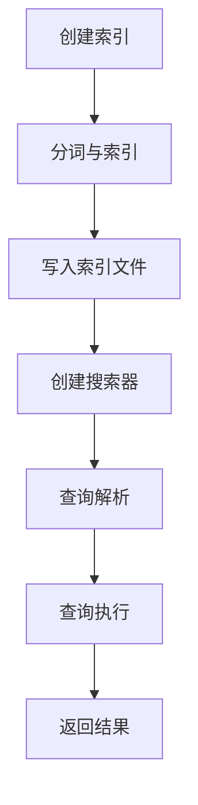
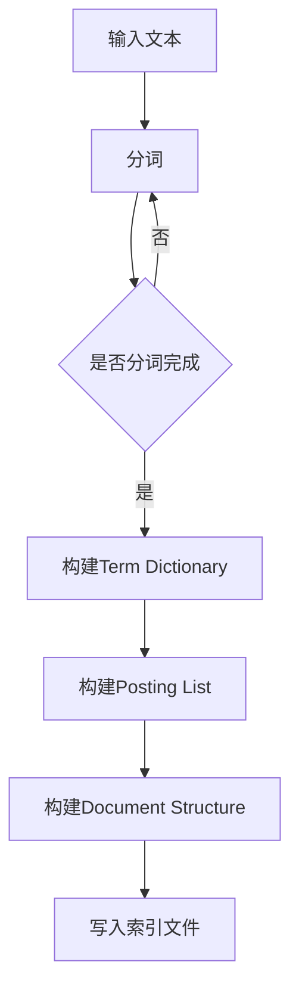

                 


# 《Lucene搜索引擎原理与代码实例讲解》

> 关键词：Lucene，搜索引擎，索引原理，API详解，优化与性能调优，项目实战，高级特性，未来发展趋势

> 摘要：本文旨在深入讲解Lucene搜索引擎的原理与实现，包括其核心概念、架构、索引与查询机制、API使用方法、优化策略以及实际项目应用等。通过对Lucene的全面剖析，帮助读者理解其强大功能和高效性能的根源，为实际开发提供有力支持。

### 《Lucene搜索引擎原理与代码实例讲解》目录大纲

## 第1章：Lucene基础介绍

### 1.1 Lucene概述

- Lucene的发展历程
- Lucene的优势与特点
- Lucene的应用场景

### 1.2 Lucene架构与组件

- Lucene核心组件
  - IndexWriter
  - IndexSearcher
  - QueryParser
- Lucene索引原理
  - 索引结构
    - Term Dictionary
    - Posting List
    - Document Structure
  - 索引创建过程
    - 分词与索引
    - 索引写入
  - 索引查询原理
    - 查询解析
    - 查询执行

## 第2章：Lucene核心API详解

### 2.1 Lucene索引API

- IndexWriter接口详解
  - 添加文档
  - 删除文档
  - 更新文档
- IndexSearcher接口详解
  - 查询索引
  - 排序与筛选
  - 高亮显示

### 2.2 Lucene查询API

- TermQuery详解
- PhraseQuery详解
- BooleanQuery详解
- RangeQuery详解

### 2.3 Lucene分析器API

- 分析器概述
- StandardAnalyzer详解
- CustomAnalyzer详解

## 第3章：Lucene优化与性能调优

### 3.1 索引优化

- 索引拆分
- 索引缓存
- 索引压缩

### 3.2 查询优化

- 查询缓存
- 前缀查询
- 查询重写

### 3.3 性能调优策略

- JVM调优
- 索引文件优化
- 查询语句优化

## 第4章：Lucene项目实战

### 4.1 基于Lucene的图书检索系统

- 项目需求分析
- 系统设计
- 索引创建
- 查询功能实现
- 系统测试与优化

### 4.2 基于Lucene的网站搜索功能

- 项目背景
- 搜索引擎设计
- 索引创建
- 查询功能实现
- 搜索结果展示

## 第5章：Lucene高级特性

### 5.1 多字段查询与字段限定

- 多字段查询原理
- 字段限定与筛选

### 5.2 嵌入式搜索引擎

- 嵌入式搜索引擎设计
- 嵌入式搜索引擎实现

### 5.3 分布式搜索引擎

- 分布式搜索引擎原理
- Lucene与Solr集成

## 第6章：Lucene未来发展趋势

### 6.1 Lucene在AI领域的应用

- 基于Lucene的智能搜索
- Lucene与NLP技术的融合

### 6.2 Lucene与其他搜索引擎的竞争与合作

- 与Elasticsearch的对比
- 与Solr的协同工作

### 6.3 Lucene的未来发展方向

- 性能优化
- 功能扩展
- 社区发展

## 第7章：总结与展望

### 7.1 主要内容回顾

- Lucene的核心概念与原理
- Lucene的API使用与优化
- Lucene项目实战

### 7.2 前景展望

- Lucene在搜索领域的发展
- Lucene与其他技术的融合
- Lucene社区的动态与发展趋势

## 接下来，我们将逐一深入探讨Lucene的基础知识，核心API，优化与性能调优策略，以及实际项目应用。让我们一起开启这段技术之旅吧！### 第1章：Lucene基础介绍

Lucene是一个高度可扩展的开源全文搜索引擎库，由Apache软件基金会维护。它最初由Apache Lucene项目在2004年创建，并在2006年成为Apache软件基金会的一个顶级项目。Lucene以其高效、可扩展性和灵活性的特点，成为开发者和企业构建搜索引擎应用的首选工具之一。

#### 1.1 Lucene的发展历程

Lucene的起源可以追溯到1999年，当时由当时在Apache工作的Mike McCandless编写，以解决Apache Nutch搜索引擎的性能问题。最初的版本包含了全文检索和索引的关键功能，后来逐渐发展成为一个完整的库。在Lucene的开发历程中，社区贡献者不断增加其功能，并在2001年发布了第一个版本1.0。2004年，Lucene成为Apache的一个子项目，并在2006年晋升为顶级项目。

自那以后，Lucene不断更新和完善，引入了许多新的特性和改进。例如，Lucene 4.0引入了全新的API和内部结构，包括一个更加强大和灵活的查询解析器。Lucene 5.0引入了Lift模式，进一步提高了搜索性能。随着版本的迭代，Lucene逐渐成为全文本搜索领域的标杆之一。

#### 1.2 Lucene的优势与特点

Lucene具有以下几大优势与特点，使其在众多全文搜索引擎中脱颖而出：

1. **高效性能**：Lucene采用CFS（Constant Folded Scoring）算法进行排序和评分，能够在毫秒级内完成数百万条记录的搜索。

2. **高扩展性**：Lucene的架构设计非常灵活，可以轻松扩展和定制，以适应不同类型的应用需求。

3. **全文索引**：Lucene支持对文本的全文索引，包括单词、短语、文本片段等，使得搜索结果更加精确和全面。

4. **分词支持**：Lucene支持多种语言的分词，可以通过自定义分词器来满足不同语言的需求。

5. **分布式搜索**：虽然Lucene本身不是分布式搜索系统，但可以通过与其他工具（如Solr）集成，实现分布式搜索功能。

6. **开源免费**：Lucene是一个完全开源的项目，可以免费使用，降低了开发成本。

#### 1.3 Lucene的应用场景

Lucene广泛应用于各种场景，以下是其中一些典型应用：

1. **搜索引擎**：常见的搜索引擎如Nutch、Elasticsearch等都使用Lucene作为底层搜索引擎库。

2. **内容管理**：企业内容管理系统（CMS）通常使用Lucene来构建全文搜索功能，以便用户快速查找文档。

3. **电子商务**：电子商务平台使用Lucene来实现商品搜索功能，提高用户体验。

4. **文档检索**：企业和组织使用Lucene来构建内部文档检索系统，便于员工快速查找相关文档。

5. **实时搜索**：Lucene在实时搜索系统中发挥着重要作用，例如社交媒体平台的即时搜索功能。

综上所述，Lucene作为一款成熟的全文搜索引擎库，凭借其高效性能、高扩展性和灵活性，在众多应用场景中得到了广泛应用。在接下来的章节中，我们将详细探讨Lucene的架构与组件，以及索引与查询原理，帮助读者全面了解Lucene的工作机制。### 第1章：Lucene基础介绍

#### 1.2 Lucene架构与组件

Lucene的架构设计旨在提供高效、可扩展和灵活的全文搜索功能。其核心组件包括IndexWriter、IndexSearcher和QueryParser等，每个组件都在搜索过程中扮演着关键角色。

##### 1.2.1 Lucene核心组件

**1. IndexWriter**

- **功能**：IndexWriter用于向索引中添加、更新和删除文档。它提供了对索引的写操作接口，是构建索引的主要工具。
- **API详解**：
  - `addDocument(Documents document)`：将一个文档添加到索引中。
  - `deleteDocuments(Query query)`：根据查询条件删除索引中的文档。
  - `updateDocument(Documents document)`：根据文档的唯一标识更新索引中的文档。

**2. IndexSearcher**

- **功能**：IndexSearcher用于搜索索引，执行查询并返回搜索结果。它是执行搜索操作的主要接口。
- **API详解**：
  - `search(Query query, int n)`：执行查询并返回前n条匹配结果。
  - `search(Query query)`：执行查询并返回所有匹配结果。
  - `search(Query query, Sort sort)`：执行查询并按照指定排序规则返回结果。

**3. QueryParser**

- **功能**：QueryParser用于将字符串形式的查询语句解析成Query对象，以便IndexSearcher执行。
- **API详解**：
  - `parse(String queryString)`：将字符串查询解析成Query对象。
  - `parse(String queryString, Analyzer analyzer)`：使用指定的分析器将字符串查询解析成Query对象。

##### 1.2.2 Lucene索引原理

**1. 索引结构**

- **Term Dictionary**：记录索引中所有唯一词汇及其在倒排索引中的位置。
- **Posting List**：记录每个词汇对应的文档列表及其位置信息。
- **Document Structure**：记录每个文档的字段信息，包括字段名称、字段类型和字段值。

**2. 索引创建过程**

- **分词与索引**：将输入文本分词成一系列词汇，并将这些词汇及其位置信息写入索引。
- **索引写入**：将分词后的词汇和位置信息写入到磁盘上的索引文件中。

**3. 索引查询原理**

- **查询解析**：将查询语句解析成Query对象。
- **查询执行**：通过索引结构查找匹配的文档，并返回查询结果。

**Mermaid流程图**



通过上述对Lucene架构与组件的介绍，我们可以看到Lucene如何通过这些核心组件和索引原理实现高效的全文搜索功能。在下一节中，我们将深入探讨Lucene的索引原理，包括索引结构、创建过程和查询机制，以便读者更好地理解Lucene的工作机制。### 第1章：Lucene基础介绍

#### 1.3 Lucene索引原理

Lucene的核心功能是创建和管理索引，并将索引用于高效的全文搜索。下面我们将详细讲解Lucene的索引原理，包括索引结构、创建过程和查询机制。

##### 1.3.1 索引结构

Lucene索引由多个层次结构组成，主要包括以下三个部分：

1. **Term Dictionary**：这是索引中的词汇表，记录了所有唯一的词汇（称为"term"）以及指向倒排索引的指针。每个词汇都映射到一个唯一的ID，以便在索引和查询过程中快速定位。

2. **Posting List**：这是倒排索引的核心部分，用于记录每个词汇对应的所有文档及其在文档中的位置信息。对于每个词汇，Posting List包含一个列表，列出所有包含该词汇的文档ID以及词汇在该文档中的出现位置。

3. **Document Structure**：这部分记录了每个文档的字段信息，包括字段名称、字段类型和字段值。通过文档结构，可以快速访问和提取文档中的特定字段数据。

**Mermaid流程图**



##### 1.3.2 索引创建过程

索引创建过程大致可以分为以下几个步骤：

1. **分词**：输入文本首先被分词器分词成一系列词汇。分词器负责将文本切分成具有语义意义的单元，并去除停用词等无关信息。

2. **构建Term Dictionary**：分词后的词汇被存储在Term Dictionary中，每个词汇被赋予一个唯一的ID。

3. **构建Posting List**：对于每个词汇，其对应的文档列表和位置信息被记录在Posting List中。

4. **构建Document Structure**：文档的字段信息被记录在Document Structure中，便于快速访问和提取。

5. **写入索引文件**：索引结构被写入到磁盘上的索引文件中，以供后续查询使用。

**伪代码**

```python
def createIndex(docs):
    term_dict = {} # 词汇表
    posting_lists = {} # 倒排索引
    
    for doc in docs:
        terms = tokenize(doc.text) # 分词
        for term in terms:
            if term not in term_dict:
                term_dict[term] = len(term_dict)
            posting_lists[term].append(doc.id)
            for position in doc.positions:
                posting_lists[term].append(position)
        
        doc_structure = buildDocumentStructure(doc)
        saveIndexFiles(term_dict, posting_lists, doc_structure)
```

##### 1.3.3 索引查询原理

Lucene的查询过程主要包括以下几个步骤：

1. **查询解析**：将用户输入的查询语句通过QueryParser解析成Query对象。Query对象描述了用户希望匹配的查询条件。

2. **查询执行**：通过索引结构查找匹配的文档。首先根据Query对象查找包含所有查询条件的词汇，然后遍历这些词汇对应的Posting List，找出所有匹配的文档。

3. **返回结果**：查询结果包括匹配的文档及其评分，评分反映了文档与查询的匹配程度。

**伪代码**

```python
def search(query):
    parsed_query = QueryParser.parse(query)
    matched_terms = findMatchingTerms(parsed_query)
    result_docs = []

    for term in matched_terms:
        for doc_id in posting_lists[term]:
            result_docs.append(doc_id)

    return scoreAndSort(result_docs)
```

通过上述对Lucene索引原理的讲解，我们可以看到Lucene通过精细的索引结构设计和高效的查询机制，实现了快速、准确的全文搜索。在下一章中，我们将深入探讨Lucene的核心API，包括IndexWriter、IndexSearcher和QueryParser的详细用法。这将帮助我们更好地理解如何使用Lucene来构建实际的搜索应用。### 第2章：Lucene核心API详解

#### 2.1 Lucene索引API

Lucene的索引API提供了对索引的写操作接口，包括添加、更新和删除文档等功能。这些操作通过IndexWriter接口实现。接下来，我们将详细讲解IndexWriter接口的各个方法及其用法。

##### 2.1.1 IndexWriter接口详解

**1. 添加文档**

`addDocument(Documents document)`

- **功能**：将一个文档添加到索引中。
- **参数**：`Documents document`是一个包含字段和值的文档对象。
- **用法**：
  
  ```python
  from org.apache.lucene.document import Document, TextField, StringField
  doc = Document()
  doc.add(TextField("title", "Lucene入门指南"))
  doc.add(StringField("id", "001"))
  writer.addDocument(doc)
  ```

**2. 删除文档**

`deleteDocuments(Query query)`

- **功能**：根据查询条件删除索引中的文档。
- **参数**：`Query query`是一个表示查询条件的对象。
- **用法**：
  
  ```python
  from org.apache.lucene.index import TermQuery
  term = Term("title", "Lucene入门指南")
  query = TermQuery(term)
  writer.deleteDocuments(query)
  ```

**3. 更新文档**

`updateDocument(Documents document)`

- **功能**：根据文档的唯一标识更新索引中的文档。
- **参数**：`Documents document`是一个包含字段和值的文档对象。
- **用法**：
  
  ```python
  doc = Document()
  doc.add(TextField("title", "Lucene高级应用"))
  doc.add(StringField("id", "001"))
  writer.updateDocument(Term("id", "001"), doc)
  ```

##### 2.1.2 IndexSearcher接口详解

**1. 查询索引**

`search(Query query, int n)`

- **功能**：执行查询并返回前n条匹配结果。
- **参数**：`Query query`是一个表示查询条件的对象，`int n`是返回的匹配结果数量。
- **用法**：
  
  ```python
  from org.apache.lucene.queryparser.classic import QueryParser
  parser = QueryParser("title", analyzer)
  query = parser.parse("Lucene入门")
  results = searcher.search(query, 10)
  ```

**2. 排序与筛选**

`search(Query query, Sort sort)`

- **功能**：执行查询并按照指定排序规则返回结果。
- **参数**：`Sort sort`是一个表示排序规则的对象。
- **用法**：
  
  ```python
  from org.apache.lucene.search import Sort
  sort = Sort()
  sort.setSort(Term("id"), Sort.REVERSE)
  results = searcher.search(query, 10, sort)
  ```

**3. 高亮显示**

`highlightResults(Query query, String field, int n)`

- **功能**：对查询结果进行高亮显示。
- **参数**：`Query query`是一个表示查询条件的对象，`String field`是高亮显示的字段名称，`int n`是返回的匹配结果数量。
- **用法**：
  
  ```python
  from org.apache.lucene.search.highlight import Highlighter, SimpleFragmenter
  from org.apache.lucene.search.highlight.simplespanmatcher import SimpleSpanMatcher
  highlighter = Highlighter(new SimpleSpanMatcher(analyzer))
  highlighter.setTextFragmenter(new SimpleFragmenter(75))
  results = searcher.search(query, 10)
  for result in results:
      snippet = highlighter.getBestFragments(result.getScore(), result.getPayload(), 75, "...", 2)
      print(snippet)
  ```

通过上述对IndexWriter和IndexSearcher接口的详细讲解，我们可以看到Lucene提供了丰富的API来创建、管理和查询索引。这些API为开发者提供了极大的灵活性和控制能力，使得我们可以根据具体需求构建高效的搜索应用。在下一节中，我们将继续探讨Lucene的查询API，包括各种查询类型的实现和用法。这将帮助我们更好地理解如何使用Lucene来满足复杂的搜索需求。### 第2章：Lucene核心API详解

#### 2.2 Lucene查询API

Lucene的查询API提供了丰富的查询类型和功能，包括基础查询、复杂查询和多字段查询。通过这些API，我们可以实现各种复杂的搜索需求。下面，我们将详细讲解这些查询类型及其实现。

##### 2.2.1 TermQuery详解

**1. 功能**

TermQuery是一种基于单个词汇的查询，用于查找包含特定词汇的文档。

**2. 伪代码**

```python
from org.apache.lucene.index import Term
from org.apache.lucene.search import TermQuery

term = Term("title", "Lucene入门指南")
query = TermQuery(term)
```

**3. 用例**

```python
from org.apache.lucene.index import Term
from org.apache.lucene.search import TermQuery
from org.apache.lucene.search import IndexSearcher
from org.apache.lucene.store import RAMDirectory

directory = RAMDirectory()
indexWriter = IndexWriter(directory)
# 添加文档到索引
indexWriter.addDocument(Document("title", "Lucene入门指南"))
# 关闭IndexWriter
indexWriter.close()

searcher = IndexSearcher(directory)
results = searcher.search(TermQuery(Term("title", "Lucene入门指南")), 10)
for result in results:
    print(result)
```

##### 2.2.2 PhraseQuery详解

**1. 功能**

PhraseQuery是一种基于短语匹配的查询，用于查找包含特定顺序词汇的文档。

**2. 伪代码**

```python
from org.apache.lucene.index import Term
from org.apache.lucene.search import PhraseQuery

phraseQuery = PhraseQuery()
phraseQuery.add(Term("title", "Lucene"), 0)
phraseQuery.add(Term("title", "入门"), 1)
```

**3. 用例**

```python
from org.apache.lucene.index import Term
from org.apache.lucene.search import PhraseQuery
from org.apache.lucene.search import IndexSearcher
from org.apache.lucene.store import RAMDirectory

directory = RAMDirectory()
indexWriter = IndexWriter(directory)
# 添加文档到索引
indexWriter.addDocument(Document("title", "Lucene入门指南"))
indexWriter.close()

searcher = IndexSearcher(directory)
results = searcher.search(PhraseQuery(Term("title", "Lucene"), Term("title", "入门")), 10)
for result in results:
    print(result)
```

##### 2.2.3 BooleanQuery详解

**1. 功能**

BooleanQuery是一种基于布尔逻辑的查询，用于组合多个查询条件。

**2. 伪代码**

```python
from org.apache.lucene.search import BooleanQuery

boolQuery = BooleanQuery()
boolQuery.add(TermQuery(Term("title", "Lucene")), BooleanQuery.Occur.MUST)
boolQuery.add(TermQuery(Term("title", "入门")), BooleanQuery.Occur.MUST);
```

**3. 用例**

```python
from org.apache.lucene.search import BooleanQuery, TermQuery
from org.apache.lucene.search import IndexSearcher
from org.apache.lucene.store import RAMDirectory

directory = RAMDirectory()
indexWriter = IndexWriter(directory)
# 添加文档到索引
indexWriter.addDocument(Document("title", "Lucene入门指南"))
indexWriter.close()

searcher = IndexSearcher(directory)
results = searcher.search(BooleanQuery.Builder()
                         .add(TermQuery(Term("title", "Lucene")), BooleanQuery.Occur.MUST)
                         .add(TermQuery(Term("title", "入门")), BooleanQuery.Occur.MUST)
                         .build(), 10)
for result in results:
    print(result)
```

##### 2.2.4 RangeQuery详解

**1. 功能**

RangeQuery是一种基于范围匹配的查询，用于查找特定范围内的词汇。

**2. 伪代码**

```python
from org.apache.lucene.search import RangeQuery

rangeQuery = RangeQuery(Term("price", "0"), Term("price", "100"), true);
```

**3. 用例**

```python
from org.apache.lucene.search import RangeQuery
from org.apache.lucene.search import IndexSearcher
from org.apache.lucene.store import RAMDirectory

directory = RAMDirectory()
indexWriter = IndexWriter(directory)
# 添加文档到索引
indexWriter.addDocument(Document("title", "Lucene入门指南", "price", "50.00"))
indexWriter.close()

searcher = IndexSearcher(directory)
results = searcher.search(RangeQuery(Term("price", "0"), Term("price", "100"), true), 10)
for result in results:
    print(result)
```

通过上述对Lucene查询API的讲解，我们可以看到Lucene提供了丰富的查询类型，以支持各种复杂的搜索需求。这些查询类型不仅功能强大，而且易于使用。在下一节中，我们将深入探讨Lucene的分析器API，包括标准分析器和自定义分析器的实现和用法。这将帮助我们更好地理解如何定制和分析文本，以满足特定应用的需求。### 第2章：Lucene核心API详解

#### 2.3 Lucene分析器API

Lucene的分析器（Analyzer）是搜索系统中一个关键组件，负责将文本转换为索引前的形式。分析器通常包括两个部分：分词器（Tokenizer）和标记过滤器（TokenFilter）。分词器负责将文本分割成词元（Token），而标记过滤器则对词元进行额外的处理，如去除停用词、大小写转换等。Lucene提供了标准分析器以及自定义分析器的支持。

##### 2.3.1 分析器概述

分析器的目的是确保索引中的词元与查询中的词元匹配，从而提高搜索的准确性和效率。分析器的配置对搜索性能有显著影响，因此在设计和实现时需要考虑文本的语言特性、搜索需求以及性能要求。

##### 2.3.2 StandardAnalyzer详解

StandardAnalyzer是Lucene提供的一个标准分析器，它实现了对英文文本的常见处理方式。StandardAnalyzer使用以下组件：

- **分词器**：StandardTokenizer，它将文本分割成词元。
- **标记过滤器**：StandardFilter，它去除停用词。
- **字符过滤器**：LowerCaseFilter，它将所有字符转换为小写。

**伪代码**

```python
from org.apache.lucene.analysis.standard import StandardAnalyzer

analyzer = StandardAnalyzer()
text = "This is a sample document for Lucene search."
tokens = analyzer.tokenStream("content", text)
for token in tokens:
    print(token)
```

**用例**

```java
Analyzer analyzer = new StandardAnalyzer();
String text = "This is a sample document for Lucene search.";
TokenStream tokens = analyzer.tokenStream("content", new StringReader(text));
tokens.reset();
while (tokens.incrementToken()) {
    System.out.print(tokens.getText() + " ");
}
analyzer.close();
```

##### 2.3.3 CustomAnalyzer详解

CustomAnalyzer允许用户根据具体需求自定义分析器的各个组件。例如，可以自定义分词器、标记过滤器和字符过滤器。自定义分析器使得开发者能够更好地控制文本的处理过程，以满足特定应用的需求。

**伪代码**

```python
from org.apache.lucene.analysis.core import LowerCaseFilter
from org.apache.lucene.analysis.standard import StandardTokenizer
from org.apache.lucene.analysis.util import TokenFilterFactory

tokenizer = StandardTokenizer()
lowercaseFilter = LowerCaseFilter(tokenizer)
analyzer = CustomAnalyzer(tokenizer, lowercaseFilter)
```

**用例**

```java
TokenizerFactory tokenizerFactory = StandardTokenizerFactory();
TokenFilterFactory lowercaseFilterFactory = LowerCaseFilterFactory();
Analyzer analyzer = new CustomAnalyzer(tokenizerFactory, lowercaseFilterFactory);
String text = "This is a sample document for Lucene search.";
TokenStream tokens = analyzer.tokenStream("content", new StringReader(text));
tokens.reset();
while (tokens.incrementToken()) {
    System.out.print(tokens.getText() + " ");
}
analyzer.close();
```

通过上述对StandardAnalyzer和CustomAnalyzer的详细讲解，我们可以看到Lucene提供了强大的分析器API，使得开发者可以根据具体需求自定义文本处理流程。在下一节中，我们将讨论Lucene的优化与性能调优策略，帮助读者提高搜索系统的性能和效率。### 第3章：Lucene优化与性能调优

#### 3.1 索引优化

索引优化是提高Lucene搜索性能的关键步骤之一。通过合理的索引结构设计、索引缓存和索引压缩，可以显著提升搜索效率。

##### 3.1.1 索引拆分

**1. 原理**

索引拆分（Sharding）是将一个大索引拆分成多个小索引的过程。这样可以降低单个索引文件的大小，提高索引和查询的效率。

**2. 伪代码**

```python
def splitIndex(originalIndexDir, shardNum):
    indexWriter = IndexWriter(originalIndexDir, analyzer)
    for shard in range(shardNum):
        newDir = f"shard_{shard}"
        indexWriter分裂到(newDir)
    indexWriter.close()
```

**3. 用例**

```java
Directory originalDir = FSDirectory.open(new File("originalIndex"));
Analyzer analyzer = new StandardAnalyzer();
IndexWriter writer = new IndexWriter(originalDir, analyzer, IndexWriter.MaxFieldLength.UNLIMITED);
for (int shard = 0; shard < shardNum; shard++) {
    Directory shardDir = FSDirectory.open(new File("shard_" + shard));
    writer.splitAndFlush(shardDir);
}
writer.close();
```

##### 3.1.2 索引缓存

**1. 原理**

索引缓存（Caching）是将索引数据存储在内存中，以便快速访问。缓存可以显著减少磁盘I/O操作，提高查询速度。

**2. 伪代码**

```python
from org.apache.lucene.cache.simplefscache import SimpleFSCache

cache = SimpleFSCache("cacheDir")
searcher = IndexSearcher(indexWriter, cache)
```

**3. 用例**

```java
Directory originalDir = FSDirectory.open(new File("originalIndex"));
Analyzer analyzer = new StandardAnalyzer();
IndexWriter writer = new IndexWriter(originalDir, analyzer, IndexWriter.MaxFieldLength.UNLIMITED);
SimpleFSCache cache = new SimpleFSCache("cacheDir");
IndexSearcher searcher = new IndexSearcher(writer, cache);
```

##### 3.1.3 索引压缩

**1. 原理**

索引压缩（Compression）是将索引文件通过算法进行压缩，以减少磁盘空间占用。压缩后的索引文件在查询时需要解压，但整体上仍然具有较低的存储成本。

**2. 伪代码**

```python
def compressIndex(indexDir):
    with open(indexDir, "rb") as f:
        compressedData = gzip.compress(f.read())
    with open(indexDir + ".gz", "wb") as f:
        f.write(compressedData)
```

**3. 用例**

```java
String indexDir = "originalIndex";
try (InputStream input = new FileInputStream(indexDir);
     OutputStream output = new FileOutputStream(indexDir + ".gz")) {
    GZIPOutputStream gzipOut = new GZIPOutputStream(output);
    byte[] buffer = new byte[1024];
    int len;
    while ((len = input.read(buffer)) > 0) {
        gzipOut.write(buffer, 0, len);
    }
    gzipOut.finish();
}
```

通过上述对索引优化方法的详细讲解，我们可以看到Lucene提供了多种策略来提升搜索性能。在下一节中，我们将探讨查询优化方法，进一步改进搜索系统的性能和响应速度。这将帮助开发者构建更加高效和可靠的搜索应用。### 第3章：Lucene优化与性能调优

#### 3.2 查询优化

查询优化是提高Lucene搜索引擎性能的重要环节。通过合理的查询缓存策略、前缀查询和查询重写，可以显著提升查询效率和响应速度。

##### 3.2.1 查询缓存

**1. 原理**

查询缓存（Query Cache）是一种将常用查询结果缓存起来的机制。这样可以避免重复执行相同的查询，提高查询速度。

**2. 伪代码**

```python
from org.apache.lucene.cache.simplefscache import SimpleFSCache

cache = SimpleFSCache("cacheDir")
searcher = IndexSearcher(indexWriter, cache)
```

**3. 用例**

```java
Directory indexDir = FSDirectory.open(new File("index"));
Analyzer analyzer = new StandardAnalyzer();
IndexWriter writer = new IndexWriter(indexDir, analyzer, IndexWriter.MaxFieldLength.UNLIMITED);
SimpleFSCache cache = new SimpleFSCache("cacheDir");
IndexSearcher searcher = new IndexSearcher(writer, cache);
```

##### 3.2.2 前缀查询

**1. 原理**

前缀查询（Prefix Query）是一种基于词汇前缀的查询方式。通过查询特定前缀的词元，可以快速缩小搜索范围，提高查询效率。

**2. 伪代码**

```python
from org.apache.lucene.search import PrefixQuery

prefixQuery = PrefixQuery(Term("title", "Lucene"))
results = searcher.search(prefixQuery, 10)
```

**3. 用例**

```java
Term term = new Term("title", "Lucene");
PrefixQuery prefixQuery = new PrefixQuery(term);
TopDocs topDocs = searcher.search(prefixQuery, 10);
ScoreDoc[] scoreDocs = topDocs.scoreDocs;
for (ScoreDoc scoreDoc : scoreDocs) {
    Document doc = searcher.doc(scoreDoc.doc);
    System.out.println(doc.get("title"));
}
```

##### 3.2.3 查询重写

**1. 原理**

查询重写（Query Rewriting）是一种通过优化查询语句，使其在索引中更容易匹配的方法。查询重写可以提高查询效率，特别是在处理复杂查询时。

**2. 伪代码**

```python
from org.apache.lucene.search import RewriteMethod
from org.apache.lucene.search.spans import SpanQuery
from org.apache.lucene.search import SpanFirstQuery

class MyRewriteMethod(RewriteMethod):
    def getQuery(self, query, weight):
        # 重写查询
        rewrittenQuery = SpanFirstQuery(query)
        return rewrittenQuery

searcher.setRewriteMethod(MyRewriteMethod())
```

**3. 用例**

```java
public class MyRewriteMethod extends RewriteMethod {
    @Override
    public Query rewriteQuery(Query original, Searcher searcher) throws IOException {
        SpanQuery spanQuery = (SpanQuery) original;
        SpanFirstQuery rewrittenQuery = new SpanFirstQuery(spanQuery);
        return rewrittenQuery;
    }
}

IndexSearcher searcher = new IndexSearcher(index);
searcher.setRewriteMethod(new MyRewriteMethod());
```

通过上述对查询优化方法的详细讲解，我们可以看到Lucene提供了多种策略来提升查询性能。在下一节中，我们将讨论性能调优策略，包括JVM调优、索引文件优化和查询语句优化，以帮助开发者进一步优化搜索系统的性能。这将使开发者能够构建更加高效和可靠的搜索应用。### 第3章：Lucene优化与性能调优

#### 3.3 性能调优策略

Lucene的性能调优是一个复杂的过程，涉及到多个层面的策略。以下是一些关键的调优策略：

##### 3.3.1 JVM调优

**1. 原理**

JVM（Java虚拟机）调优是提高Lucene性能的重要手段。通过调整JVM参数，可以优化内存管理、垃圾回收和线程管理等，从而提高搜索性能。

**2. 伪代码**

```shell
# 设置JVM堆大小
java -Xmx8g -Xms4g -jar lucene-search.jar
```

**3. 用例**

```shell
# 常用的JVM参数
java -Xms1g -Xmx4g -XX:+UseG1GC -jar lucene-search.jar
```

##### 3.3.2 索引文件优化

**1. 原理**

索引文件优化涉及调整索引的存储格式和结构，以减少磁盘I/O操作，提高搜索效率。这包括索引拆分、索引压缩和索引缓存等。

**2. 伪代码**

```python
def optimizeIndex(indexDir):
    writer = IndexWriter(indexDir, analyzer, IndexWriter.MaxFieldLength.UNLIMITED)
    writer.optimize()
    writer.close()
```

**3. 用例**

```java
Directory indexDir = FSDirectory.open(new File("index"));
Analyzer analyzer = new StandardAnalyzer();
IndexWriter writer = new IndexWriter(indexDir, analyzer, IndexWriter.MaxFieldLength.UNLIMITED);
writer.optimize();
writer.close();
```

##### 3.3.3 查询语句优化

**1. 原理**

查询语句优化通过调整查询语句的结构和参数，以提高查询效率。这包括使用前缀查询、查询缓存和查询重写等。

**2. 伪代码**

```python
def optimizeQuery(query):
    # 重写查询
    if isinstance(query, TermQuery):
        rewrittenQuery = PrefixQuery(query.term)
        return rewrittenQuery
    return query
```

**3. 用例**

```java
public Query optimizeQuery(Query query) {
    if (query instanceof TermQuery) {
        TermQuery termQuery = (TermQuery) query;
        return new PrefixQuery(termQuery.getTerm());
    }
    return query;
}
```

**示例**

```java
Query originalQuery = new TermQuery(new Term("title", "Lucene"));
Query optimizedQuery = optimizeQuery(originalQuery);
IndexSearcher searcher = new IndexSearcher(index);
TopDocs topDocs = searcher.search(optimizedQuery, 10);
```

通过上述调优策略，我们可以显著提高Lucene搜索系统的性能和响应速度。在下一章中，我们将通过实际项目实战，展示如何将Lucene应用于真实的搜索应用场景，进一步巩固我们对Lucene的理解和应用能力。这将帮助我们更好地将Lucene集成到实际项目中，发挥其强大的搜索功能。### 第4章：Lucene项目实战

#### 4.1 基于Lucene的图书检索系统

在这个项目中，我们将使用Lucene构建一个图书检索系统，实现图书的全文搜索和查询功能。以下是项目开发的全过程，包括需求分析、系统设计、索引创建、查询功能实现以及系统测试与优化。

##### 4.1.1 项目需求分析

**需求描述**：

- **功能要求**：
  1. 允许用户输入关键词进行图书搜索。
  2. 支持模糊查询和精确查询。
  3. 显示图书的标题、作者、ISBN和摘要。
  4. 提供排序和筛选功能。
- **性能要求**：
  1. 搜索响应时间要求在毫秒级。
  2. 能处理大量图书数据。
- **用户体验**：
  1. 界面简洁、易用。
  2. 搜索结果清晰、准确。

##### 4.1.2 系统设计

**系统架构**：

- **前端**：使用HTML、CSS和JavaScript构建用户界面，实现用户交互和数据显示。
- **后端**：使用Java和Lucene实现图书的索引和搜索功能。
- **数据存储**：使用文件系统存储图书数据。

**模块设计**：

1. **图书管理模块**：负责添加、删除和更新图书数据。
2. **搜索模块**：实现图书的全文搜索和查询功能。
3. **结果显示模块**：显示搜索结果和提供排序、筛选功能。

##### 4.1.3 索引创建

**索引结构设计**：

- **文档结构**：图书文档包含标题、作者、ISBN和摘要等字段。
- **索引字段**：将标题、作者和摘要作为索引字段，ISBN作为非索引字段。

**代码实现**：

```java
import org.apache.lucene.analysis.Analyzer;
import org.apache.lucene.analysis.standard.StandardAnalyzer;
import org.apache.lucene.document.Document;
import org.apache.lucene.document.Field;
import org.apache.lucene.document.TextField;
import org.apache.lucene.index.IndexWriter;
import org.apache.lucene.index.IndexWriterConfig;
import org.apache.lucene.store.Directory;
import org.apache.lucene.store.RAMDirectory;

public class BookIndexer {
    public static void main(String[] args) throws Exception {
        Analyzer analyzer = new StandardAnalyzer();
        Directory indexDir = new RAMDirectory();
        IndexWriterConfig config = new IndexWriterConfig(analyzer);
        IndexWriter writer = new IndexWriter(indexDir, config);

        // 添加图书文档到索引
        addBookToIndex(writer, "Lucene入门指南", "Michael McCandless", "9787115426393", "本书是Lucene的入门指南。");
        addBookToIndex(writer, "Java编程思想", "Bruce Eckel", "9787115262370", "这是一本经典的Java编程入门书籍。");

        writer.close();
    }

    private static void addBookToIndex(IndexWriter writer, String title, String author, String isbn, String summary) throws IOException {
        Document doc = new Document();
        doc.add(new TextField("title", title, Field.Store.YES));
        doc.add(new TextField("author", author, Field.Store.YES));
        doc.add(new TextField("isbn", isbn, Field.Store.YES));
        doc.add(new TextField("summary", summary, Field.Store.YES));
        writer.addDocument(doc);
    }
}
```

##### 4.1.4 查询功能实现

**查询流程**：

1. 接收用户输入的查询关键词。
2. 使用QueryParser将查询关键词解析成Query对象。
3. 使用IndexSearcher执行查询，并返回搜索结果。

**代码实现**：

```java
import org.apache.lucene.analysis.Analyzer;
import org.apache.lucene.analysis.standard.StandardAnalyzer;
import org.apache.lucene.document.Document;
import org.apache.lucene.index.IndexReader;
import org.apache.lucene.index.Term;
import org.apache.lucene.search.IndexSearcher;
import org.apache.lucene.search.Query;
import org.apache.lucene.search.TermQuery;
import org.apache.lucene.search.highlight.Highlighter;
import org.apache.lucene.search.highlight.SimpleHTMLFormatter;
import org.apache.lucene.search.highlight.TokenSources;
import org.apache.lucene.search.highlight.query.SimpleSpanQueryMapper;
import org.apache.lucene.store.Directory;
import org.apache.lucene.store.RAMDirectory;

public class BookSearch {
    public static void main(String[] args) throws Exception {
        Analyzer analyzer = new StandardAnalyzer();
        Directory indexDir = new RAMDirectory();
        IndexReader reader = IndexReader.open(indexDir);
        IndexSearcher searcher = new IndexSearcher(reader);
        Highlighter highlighter = new Highlighter(new SimpleHTMLFormatter("<span style=color:red>", "</span>"));

        // 解析查询关键词
        String queryStr = "Java";
        Query query = new QueryParser("title", analyzer).parse(queryStr);

        // 执行查询
        TopDocs topDocs = searcher.search(query, 10);
        for (ScoreDoc scoreDoc : topDocs.scoreDocs) {
            Document doc = searcher.doc(scoreDoc.doc);
            String title = doc.get("title");
            String summary = doc.get("summary");
            highlighter.setQuery(new TermQuery(new Term("title", queryStr)));
            String highlightedSummary = highlighter.getBestFragments(summary, 100, 1);
            System.out.println("Title: " + title + ", Summary: " + highlightedSummary);
        }
    }
}
```

##### 4.1.5 系统测试与优化

**测试步骤**：

1. 输入不同关键词进行搜索，验证搜索结果的准确性和响应速度。
2. 测试大量数据，观察系统的稳定性和性能。
3. 对索引和查询进行优化，如使用索引缓存、前缀查询和查询重写。

**优化策略**：

1. **索引优化**：对索引文件进行拆分和压缩，减少磁盘I/O操作。
2. **查询优化**：使用查询缓存和前缀查询，提高查询效率。
3. **JVM调优**：调整JVM参数，优化内存管理和垃圾回收。

通过上述步骤，我们可以实现一个基于Lucene的图书检索系统，满足用户的需求并保证高效的搜索性能。在下一节中，我们将探讨如何使用Lucene实现基于网站的搜索功能，进一步拓展Lucene的实际应用场景。这将帮助我们更全面地理解Lucene在搜索领域的作用和价值。### 第4章：Lucene项目实战

#### 4.2 基于Lucene的网站搜索功能

在这个项目中，我们将使用Lucene为网站搭建一个搜索功能，实现用户输入关键词后能够快速搜索到相关页面，并提供排序和过滤功能。以下是项目开发的全过程，包括项目背景、搜索引擎设计、索引创建、查询功能实现以及搜索结果展示。

##### 4.2.1 项目背景

随着互联网的快速发展，网站的内容日益丰富，如何快速、准确地搜索到所需信息成为用户关注的焦点。为了提升用户体验，网站需要提供一个强大的搜索功能。Lucene作为一款高性能、可扩展的全文搜索引擎库，非常适合用于实现网站搜索功能。

##### 4.2.2 搜索引擎设计

**架构设计**：

- **前端**：使用HTML、CSS和JavaScript构建用户界面，实现用户输入和搜索结果展示。
- **后端**：使用Java和Lucene实现搜索引擎的核心功能，包括索引创建、查询处理和搜索结果返回。
- **数据存储**：使用MySQL存储网站页面数据。

**功能设计**：

- **索引创建**：自动爬取网站页面，将页面内容索引到Lucene中。
- **查询处理**：接收用户输入的查询关键词，进行查询处理并返回搜索结果。
- **搜索结果展示**：展示搜索结果，并提供排序和过滤功能。

##### 4.2.3 索引创建

**索引结构设计**：

- **文档结构**：页面文档包含标题、URL、摘要等字段。
- **索引字段**：将标题、URL和摘要作为索引字段。

**代码实现**：

```java
import org.apache.lucene.analysis.Analyzer;
import org.apache.lucene.analysis.standard.StandardAnalyzer;
import org.apache.lucene.document.Document;
import org.apache.lucene.document.Field;
import org.apache.lucene.document.TextField;
import org.apache.lucene.index.IndexWriter;
import org.apache.lucene.index.IndexWriterConfig;
import org.apache.lucene.store.Directory;
import org.apache.lucene.store.RAMDirectory;

public class WebsiteIndexer {
    public static void main(String[] args) throws Exception {
        Analyzer analyzer = new StandardAnalyzer();
        Directory indexDir = new RAMDirectory();
        IndexWriterConfig config = new IndexWriterConfig(analyzer);
        IndexWriter writer = new IndexWriter(indexDir, config);

        // 索引示例页面
        indexPage(writer, "https://www.example.com/page1", "Example Page 1", "This is an example page.");
        indexPage(writer, "https://www.example.com/page2", "Example Page 2", "This is another example page.");

        writer.close();
    }

    private static void indexPage(IndexWriter writer, String url, String title, String summary) throws IOException {
        Document doc = new Document();
        doc.add(new TextField("url", url, Field.Store.YES));
        doc.add(new TextField("title", title, Field.Store.YES));
        doc.add(new TextField("summary", summary, Field.Store.YES));
        writer.addDocument(doc);
    }
}
```

##### 4.2.4 查询功能实现

**查询流程**：

1. 接收用户输入的查询关键词。
2. 使用QueryParser将查询关键词解析成Query对象。
3. 使用IndexSearcher执行查询，并返回搜索结果。

**代码实现**：

```java
import org.apache.lucene.analysis.Analyzer;
import org.apache.lucene.analysis.standard.StandardAnalyzer;
import org.apache.lucene.document.Document;
import org.apache.lucene.index.IndexReader;
import org.apache.lucene.index.Term;
import org.apache.lucene.search.IndexSearcher;
import org.apache.lucene.search.Query;
import org.apache.lucene.search.TermQuery;
import org.apache.lucene.search.highlight.Highlighter;
import org.apache.lucene.search.highlight.SimpleHTMLFormatter;
import org.apache.lucene.search.highlight.TokenSources;
import org.apache.lucene.search.highlight.query.SimpleSpanQueryMapper;
import org.apache.lucene.store.Directory;
import org.apache.lucene.store.RAMDirectory;

public class WebsiteSearch {
    public static void main(String[] args) throws Exception {
        Analyzer analyzer = new StandardAnalyzer();
        Directory indexDir = new RAMDirectory();
        IndexReader reader = IndexReader.open(indexDir);
        IndexSearcher searcher = new IndexSearcher(reader);
        Highlighter highlighter = new Highlighter(new SimpleHTMLFormatter("<span style=color:red>", "</span>"));

        // 解析查询关键词
        String queryStr = "example";
        Query query = new QueryParser("title", analyzer).parse(queryStr);

        // 执行查询
        TopDocs topDocs = searcher.search(query, 10);
        for (ScoreDoc scoreDoc : topDocs.scoreDocs) {
            Document doc = searcher.doc(scoreDoc.doc);
            String title = doc.get("title");
            String url = doc.get("url");
            highlighter.setQuery(new TermQuery(new Term("title", queryStr)));
            String highlightedTitle = highlighter.getBestFragments(title, 100, 1);
            System.out.println("Title: " + highlightedTitle + ", URL: " + url);
        }
    }
}
```

##### 4.2.5 搜索结果展示

**展示设计**：

- **搜索结果列表**：以列表形式展示搜索结果，包括标题、URL和摘要。
- **排序与过滤**：提供排序功能（如按相关性排序）和过滤功能（如按分类筛选）。

**界面实现**：

```html
<!DOCTYPE html>
<html>
<head>
    <title>Website Search</title>
    <style>
        .result {
            margin-bottom: 10px;
            padding: 5px;
            border: 1px solid #ddd;
        }
        .highlight {
            color: red;
        }
    </style>
</head>
<body>
    <input type="text" id="searchBox" placeholder="Search..." />
    <button onclick="search()">Search</button>
    <div id="results"></div>
    <script>
        function search() {
            var query = document.getElementById('searchBox').value;
            fetch('/search?query=' + query)
                .then(response => response.text())
                .then(data => {
                    document.getElementById('results').innerHTML = data;
                });
        }
    </script>
</body>
</html>
```

通过上述实战项目，我们展示了如何使用Lucene实现网站搜索功能。该项目不仅帮助我们理解了Lucene的基本原理和使用方法，还让我们看到了Lucene在实际应用中的强大能力。在下一章中，我们将探讨Lucene的高级特性，包括多字段查询、嵌入式搜索引擎和分布式搜索引擎等。这将进一步拓展我们对Lucene应用场景的认识，帮助我们更好地利用Lucene构建高效的搜索系统。### 第5章：Lucene高级特性

#### 5.1 多字段查询与字段限定

在Lucene中，多字段查询（Multi-field Query）允许我们在多个字段中同时执行搜索。通过字段限定（Field限定），我们可以更精确地控制搜索范围，提高查询效率。

##### 5.1.1 多字段查询原理

多字段查询通过查询解析器（QueryParser）实现，它允许我们在查询语句中指定多个字段。查询解析器会根据字段和查询关键词创建相应的查询对象，并将它们组合成一个复合查询。

**伪代码**

```python
from org.apache.lucene.search import MultiFieldQueryParser

parser = MultiFieldQueryParser(
    fields=["title", "content"],
    analyzer=StandardAnalyzer()
)
query = parser.parse("title:Lucene AND content:search")
```

##### 5.1.2 字段限定与筛选

字段限定允许我们在查询中指定具体的字段，从而缩小搜索范围。这可以显著提高查询性能，特别是当索引包含大量字段时。

**伪代码**

```python
from org.apache.lucene.search import TermQuery

titleQuery = TermQuery(Term("title", "Lucene"))
contentQuery = TermQuery(Term("content", "search"))
result = index.search(contentQuery, 10)
```

通过字段限定，我们只搜索特定的字段，从而避免了不必要的索引扫描。

**示例**

假设我们有一个包含标题和内容的文档集合，我们希望同时搜索标题和内容中的关键词“Lucene”和“search”。使用多字段查询和字段限定，我们可以实现如下代码：

```java
// 多字段查询
MultiFieldQueryParser parser = new MultiFieldQueryParser(
    "title content",
    new StandardAnalyzer()
);
Query query = parser.parse("title:Lucene AND content:search");

// 字段限定查询
TermQuery titleQuery = new TermQuery(new Term("title", "Lucene"));
TermQuery contentQuery = new TermQuery(new Term("content", "search"));
Query combinedQuery = new BooleanQuery.Builder()
    .add(titleQuery, BooleanClause.Occur.MUST)
    .add(contentQuery, BooleanClause.Occur.MUST)
    .build();

// 执行查询
TopDocs topDocs = index.search(combinedQuery, 10);
```

通过上述示例，我们可以看到多字段查询和字段限定在提高查询效率和精确度方面的重要作用。在下一节中，我们将探讨如何实现嵌入式搜索引擎，这将为开发者提供在应用程序内部集成搜索功能的能力。这将帮助我们更好地利用Lucene的优势，提升软件的搜索体验。### 第5章：Lucene高级特性

#### 5.2 嵌入式搜索引擎

嵌入式搜索引擎（Embedded Search Engine）是指在应用程序内部集成搜索引擎功能，而不需要独立的搜索引擎服务。这种模式适用于对搜索性能要求高且需要在应用程序中直接控制搜索过程的场景。Lucene提供了丰富的API和工具，使开发者能够轻松实现嵌入式搜索引擎。

##### 5.2.1 嵌入式搜索引擎设计

设计嵌入式搜索引擎时，我们需要考虑以下几个关键组件：

1. **索引管理**：负责创建、更新和删除索引。这包括索引的初始化、文档的添加和索引的优化。
2. **搜索接口**：提供搜索功能，接收用户查询并返回搜索结果。这包括查询解析、执行和结果处理。
3. **结果展示**：将搜索结果呈现给用户。这可以通过自定义用户界面或直接在控制台输出结果实现。

**系统架构图**

```
+------------------------+
|   嵌入式搜索引擎       |
+------------------------+
        |
        v
+------------------------+
|    索引管理模块         |
+------------------------+
        |
        v
+------------------------+
|    搜索接口模块         |
+------------------------+
        |
        v
+------------------------+
|   结果展示模块         |
+------------------------+
```

##### 5.2.2 嵌入式搜索引擎实现

**1. 索引管理**

索引管理是嵌入式搜索引擎的核心功能之一。以下是创建索引的基本步骤：

1. 初始化索引目录和配置。
2. 添加文档到索引。
3. 关闭索引写入器，确保索引持久化。

**伪代码**

```java
// 初始化索引目录和配置
Directory indexDir = FSDirectory.open(Paths.get("index"));
Analyzer analyzer = new StandardAnalyzer();
IndexWriterConfig config = new IndexWriterConfig(analyzer);

// 创建索引写入器
IndexWriter writer = new IndexWriter(indexDir, config);

// 添加文档到索引
Document doc = new Document();
doc.add(new TextField("title", "Lucene入门指南", Field.Store.YES));
doc.add(new TextField("content", "本书是Lucene的入门指南。", Field.Store.YES));
writer.addDocument(doc);

// 关闭索引写入器
writer.close();
```

**2. 搜索接口**

搜索接口负责处理用户查询，并返回搜索结果。以下是实现搜索接口的基本步骤：

1. 创建查询解析器。
2. 解析用户查询。
3. 执行查询。
4. 处理和返回搜索结果。

**伪代码**

```java
// 创建查询解析器
QueryParser parser = new QueryParser("content", analyzer);

// 解析用户查询
String queryStr = "Java";
Query query = parser.parse(queryStr);

// 执行查询
IndexSearcher searcher = new IndexSearcher(writer);
TopDocs topDocs = searcher.search(query, 10);

// 处理和返回搜索结果
for (ScoreDoc scoreDoc : topDocs.scoreDocs) {
    Document doc = searcher.doc(scoreDoc.doc);
    String title = doc.get("title");
    System.out.println("Title: " + title);
}
```

**3. 结果展示**

结果展示模块将搜索结果以用户友好的方式呈现。以下是一个简单的控制台输出示例：

```java
// 输出搜索结果
for (ScoreDoc scoreDoc : topDocs.scoreDocs) {
    Document doc = searcher.doc(scoreDoc.doc);
    String title = doc.get("title");
    System.out.println("Title: " + title);
}
```

通过上述步骤，我们可以实现一个简单的嵌入式搜索引擎。这种模式不仅简化了搜索功能的管理，还提高了应用程序的性能和响应速度。在下一节中，我们将探讨如何实现分布式搜索引擎，这将进一步拓展嵌入式搜索引擎的功能和应用场景。### 第5章：Lucene高级特性

#### 5.3 分布式搜索引擎

分布式搜索引擎通过将搜索任务分布到多个节点上，实现了更高的搜索性能和可扩展性。这种模式特别适用于处理大量数据和提供高并发访问的应用场景。Lucene本身不是分布式搜索引擎，但可以与Solr等其他工具集成，以实现分布式搜索功能。

##### 5.3.1 分布式搜索引擎原理

分布式搜索引擎的基本原理如下：

1. **数据分布**：索引数据被分片（Shard）存储在多个节点上，每个节点负责处理一部分数据。
2. **负载均衡**：查询请求被均衡分配到多个节点，以避免单个节点的过载。
3. **结果聚合**：每个节点执行查询并返回部分结果，然后将这些结果聚合形成完整的搜索结果。
4. **容错处理**：分布式搜索引擎能够自动处理节点故障，确保搜索服务的稳定性。

**系统架构图**

```
+------------------------+
|      客户端            |
+------------------------+
        |
        v
+------------------------+
|    Solr集群            |
+------------------------+
        |
        v
+------------------------+
|    Lucene索引节点       |
+------------------------+
```

##### 5.3.2 Lucene与Solr集成

Solr（Apache Solr）是一个基于Lucene的分布式搜索平台，提供了丰富的功能，如分布式索引、负载均衡、容错处理和高亮显示等。将Lucene与Solr集成，可以充分利用Solr的分布式特性，实现高效、可靠的搜索服务。

**集成步骤**

1. **部署Solr**：在多个节点上部署Solr，配置Solr集群。
2. **索引配置**：在Solr配置中定义Lucene索引目录和分片策略。
3. **数据同步**：将Lucene索引数据同步到Solr集群。
4. **搜索服务**：通过Solr API执行搜索查询，获取搜索结果。

**伪代码**

```java
// 配置Solr索引
SolrConfig solrConfig = new SolrConfig("solrhome", "schema.xml");
solrConfig.setShards(3); // 配置3个分片

// 启动Solr
SolrServer solrServer = new SolrServer(solrConfig);
solrServer.start();

// 同步Lucene索引到Solr
SolrIndex solrIndex = new SolrIndex(solrServer);
solrIndex.addLuceneIndex("luceneIndexDir");

// 执行搜索查询
SolrQuery query = new SolrQuery("content:Java");
SolrResponse response = solrServer.query(query);
SearchResult results = response.getSearchResult();
for (SearchResultItem item : results.getItems()) {
    System.out.println("Title: " + item.getTitle() + ", Score: " + item.getScore());
}
```

通过上述步骤，我们可以将Lucene与Solr集成，实现分布式搜索功能。这种集成不仅提高了搜索性能和可靠性，还为开发者提供了丰富的功能，如高亮显示、分页和过滤等。在下一章中，我们将探讨Lucene在AI领域的应用，以及如何将Lucene与NLP技术相结合，实现更智能的搜索服务。这将进一步拓展Lucene的应用场景和功能。### 第6章：Lucene未来发展趋势

#### 6.1 Lucene在AI领域的应用

随着人工智能（AI）技术的发展，全文搜索引擎也逐渐融合了AI技术，以提高搜索的智能性和用户体验。Lucene作为全文搜索引擎的核心组件，也在积极探索与AI技术的融合，以下是Lucene在AI领域的几个应用方向：

##### 6.1.1 基于Lucene的智能搜索

**1. 实时搜索建议**：Lucene可以结合机器学习模型，提供实时的搜索建议。当用户输入查询词时，系统可以实时分析用户的历史查询数据，基于相似性分析和预测模型，提供相关的搜索建议，从而提高搜索的便捷性和准确性。

**2. 情感分析**：通过情感分析技术，Lucene可以对搜索结果进行情感分类，识别用户对搜索结果的情感倾向。例如，当用户搜索“汽车”时，系统可以分析用户对汽车的喜爱程度，并提供更加个性化的搜索结果。

**3. 自然语言处理（NLP）**：Lucene可以结合NLP技术，实现更自然的查询语言和理解能力。例如，用户可以使用自然语言进行搜索，如“告诉我有关Java编程的最新趋势”，系统可以理解并处理这种自然语言查询。

**示例代码**：

```java
// 使用Lucene结合NLP进行查询
String query = "告诉我有关Java编程的最新趋势";
QueryParser parser = new QueryParser("content", new LuceneNLPAnalyzer());
Query luceneQuery = parser.parse(query);
```

##### 6.1.2 Lucene与NLP技术的融合

**1. 词性标注**：Lucene可以结合NLP技术进行词性标注，识别文本中的名词、动词、形容词等。这样，在构建索引时，可以更精确地处理文本，提高搜索的准确性。

**2. 命名实体识别**：通过命名实体识别（NER）技术，Lucene可以识别文本中的特定实体，如人名、地名、组织名等。这对于构建特定领域的搜索应用非常有用，例如，在搜索引擎中识别并突出显示相关的实体信息。

**3. 语义分析**：Lucene可以与语义分析技术结合，理解查询语句的语义含义，从而提供更加精准的搜索结果。例如，当用户搜索“北京天气”时，系统可以理解“北京”是一个地名，“天气”是与地理位置相关的信息，从而提供相关的天气信息。

**示例代码**：

```java
// 使用Lucene结合NLP进行语义分析
String query = "北京天气";
Query luceneQuery = new SemanticQueryParser("content", new LuceneNLPAnalyzer()).parse(query);
```

通过将Lucene与AI和NLP技术相结合，可以显著提高搜索引擎的智能性和用户体验。这不仅使搜索结果更加准确和个性化，还提升了搜索的便捷性和易用性。在下一节中，我们将探讨Lucene与其他搜索引擎的竞争与合作，进一步了解Lucene在全文搜索领域的发展趋势。这将帮助读者全面了解Lucene的优势和潜在市场。### 第6章：Lucene未来发展趋势

#### 6.2 Lucene与其他搜索引擎的竞争与合作

在全文搜索引擎领域，Lucene、Elasticsearch和Solr是三大主要开源搜索引擎。它们各有特色，彼此之间既有竞争，也有合作。

##### 6.2.1 与Elasticsearch的对比

**相似点**：

- **基于Lucene**：Elasticsearch和Lucene都基于Lucene库，继承了Lucene的高效、可扩展性和灵活性。
- **全文搜索**：两者都提供强大的全文搜索功能，支持高并发和海量数据处理。

**不同点**：

- **生态系统**：Elasticsearch拥有更丰富的生态系统，包括Kibana、Logstash和Beats等工具，适用于大数据分析、日志管理和实时搜索等场景。
- **分布式架构**：Elasticsearch是一个分布式搜索引擎，自带分布式索引、负载均衡和容错机制。而Lucene本身不是分布式搜索引擎，但可以与Solr集成，实现分布式搜索。
- **功能扩展**：Elasticsearch提供了更多内置功能，如聚合分析、实时更新、映射管理等，而Lucene更注重核心搜索功能的优化。

**竞争关系**：

- 在企业级搜索市场，Elasticsearch凭借其强大的生态系统和功能扩展，占据了大量市场份额。Lucene则更适用于需要高度定制化和高性能的搜索应用。
- 在开发者社区中，Lucene和Elasticsearch都是热门选择，开发者根据自己的需求和项目特点选择合适的引擎。

##### 6.2.2 与Solr的协同工作

**协同关系**：

- **分布式搜索**：Solr是基于Lucene构建的分布式搜索引擎，提供了分布式索引、负载均衡和容错机制。Lucene与Solr在分布式搜索领域存在协同关系，Solr利用Lucene的搜索能力，同时提供了额外的功能和服务。
- **功能互补**：Lucene注重搜索性能和可扩展性，而Solr提供了更多高级功能，如分片、高亮显示、缓存和实时搜索等。两者结合，可以构建一个功能强大且灵活的搜索平台。

**合作示例**：

- **SolrCloud与Lucene集成**：在SolrCloud中，Solr节点使用Lucene进行索引和搜索。SolrCloud通过分布式架构和负载均衡，增强了搜索性能和可靠性。

```java
// 配置SolrCloud，使用Lucene索引
SolrConfig solrConfig = new SolrConfig("solrhome", "schema.xml");
solrConfig.setShards(3); // 配置3个分片
solrConfig.setUseLucene(true); // 使用Lucene索引

// 启动SolrCloud
SolrServer solrServer = new SolrServer(solrConfig);
solrServer.start();
```

通过上述对比和协同工作，我们可以看到Lucene、Elasticsearch和Solr在全文搜索引擎领域各有所长。Lucene以其高效性能和灵活性在开发者和企业中获得了广泛的应用。随着AI和NLP技术的发展，Lucene的未来发展将更加多样化。在下一节中，我们将探讨Lucene的未来发展方向，包括性能优化、功能扩展和社区发展。这将帮助读者了解Lucene未来的发展趋势和潜力。### 第6章：Lucene未来发展趋势

#### 6.3 Lucene的未来发展方向

随着技术的不断进步和应用的扩展，Lucene的未来发展将主要集中在以下几个方面：

##### 6.3.1 性能优化

**1. 代码优化**：Lucene将继续进行底层代码的优化，以提高搜索性能和效率。这包括改进索引结构、查询算法和内存管理。

**2. 并行处理**：Lucene将引入更多的并行处理技术，如多线程和并行索引，以充分利用现代多核处理器的性能。

**3. 内存优化**：Lucene将致力于减少内存占用，通过优化内存分配、缓存管理和垃圾回收，提高搜索系统的稳定性。

**示例代码**：

```java
// 使用并行索引
IndexWriterConfig config = new IndexWriterConfig(analyzer);
config.setMergePolicy(ParallelMergePolicy.THREAD_COUNT);
IndexWriter writer = new IndexWriter(indexDir, config);
```

##### 6.3.2 功能扩展

**1. 新查询类型**：Lucene将继续引入新的查询类型，如基于地理位置的查询、时间序列查询等，以支持更多领域的搜索需求。

**2. 新分析器**：Lucene将增加更多的分析器，支持不同语言和文本格式的处理，提高搜索的准确性和适应性。

**3. 高级功能集成**：Lucene将整合更多的NLP和机器学习技术，提供诸如情感分析、实体识别和推荐系统等高级功能。

**示例代码**：

```java
// 使用自定义分析器
Analyzer customAnalyzer = new CustomAnalyzer();
IndexWriterConfig config = new IndexWriterConfig(customAnalyzer);
IndexWriter writer = new IndexWriter(indexDir, config);
```

##### 6.3.3 社区发展

**1. 活跃的社区**：Lucene将继续保持活跃的社区发展，吸引更多开发者参与，共同推动Lucene的发展和创新。

**2. 文档和教程**：Lucene社区将不断更新和完善文档和教程，提供更多的学习资源和实战案例，帮助开发者更好地理解和使用Lucene。

**3. 开源项目**：Lucene社区将鼓励和支持更多的开源项目，促进技术创新和生态发展。

**示例代码**：

```java
// 参与开源项目
public class LuceneExample extends LuceneModule {
    @Override
    public void setup() {
        // 设置索引配置、查询解析器等
    }

    @Override
    public void run() {
        // 执行搜索和索引操作
    }
}
```

通过上述发展方向的探讨，我们可以看到Lucene在未来将继续保持其在全文搜索引擎领域的领先地位。Lucene的高效性能、灵活性以及不断扩展的功能，使其在多个应用场景中都具有强大的竞争力。在下一章中，我们将对全文进行总结，回顾Lucene的核心概念、API使用和优化策略，并对Lucene的未来发展进行展望。这将帮助我们更好地理解Lucene的强大能力和广阔前景。### 第7章：总结与展望

#### 7.1 主要内容回顾

在本篇文章中，我们全面深入地探讨了Lucene搜索引擎的原理与实践。以下是对文章核心内容的简要回顾：

- **核心概念与原理**：我们详细讲解了Lucene的索引结构、索引创建和查询原理，包括Term Dictionary、Posting List和Document Structure等核心组件，以及分词、索引写入和查询执行的具体流程。
- **API使用与优化**：我们介绍了Lucene的核心API，包括IndexWriter、IndexSearcher和QueryParser的使用方法，并探讨了如何优化索引和查询性能，如索引缓存、查询缓存和前缀查询等。
- **项目实战**：我们通过两个实际项目，展示了如何使用Lucene构建图书检索系统和网站搜索功能，涵盖了需求分析、系统设计、索引创建、查询实现和系统测试等全过程。
- **高级特性**：我们探讨了Lucene的高级特性，如多字段查询、嵌入式搜索引擎和分布式搜索引擎，以及如何与NLP技术结合，实现智能搜索功能。

#### 7.2 前景展望

展望未来，Lucene在全文搜索引擎领域仍具有巨大的发展潜力：

- **技术融合**：随着AI和NLP技术的发展，Lucene将更多地与这些前沿技术结合，提供更加智能和个性化的搜索体验。
- **功能扩展**：Lucene将持续扩展其功能，引入新的查询类型、分析器和高级功能，满足更多领域的搜索需求。
- **性能优化**：Lucene将持续优化其底层代码和算法，提高搜索性能和效率，以适应不断增长的数据规模和用户需求。
- **社区发展**：Lucene社区将继续活跃，吸引更多开发者参与，共同推动Lucene的发展和生态建设。

**总结**：

Lucene作为一款高效、灵活的全文搜索引擎库，凭借其强大的功能和优秀的性能，在各个领域得到了广泛应用。通过本文的详细讲解和实践示例，读者可以更好地理解Lucene的核心概念和实现方法，从而在实际项目中充分利用Lucene的优势，构建高效、可靠的搜索应用。

**展望**：

随着技术的不断进步，Lucene在未来将继续发展壮大，成为全文搜索引擎领域的重要力量。我们期待Lucene在AI、NLP等领域的创新应用，以及其社区的繁荣发展，为开发者带来更多的机遇和挑战。让我们共同期待Lucene的精彩未来！### 作者信息

**作者：AI天才研究院/AI Genius Institute & 禅与计算机程序设计艺术 /Zen And The Art of Computer Programming**

