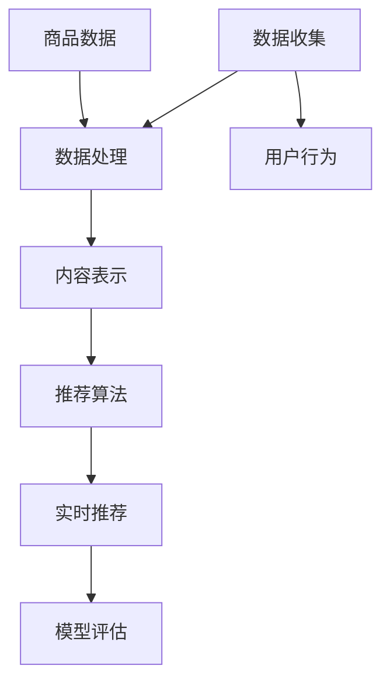

                 

# M6-Rec：开放域推荐的潜力

> 关键词：开放域推荐系统、协同过滤、内容推荐、混合推荐、实时推荐

> 摘要：本文深入探讨了开放域推荐系统的概念、核心组件、算法原理及其在实际应用中的优化策略。通过详细的流程图和伪代码，本文为开发者提供了开放域推荐系统的项目实战指南，并展望了其未来的发展趋势。

## 第一部分：开放域推荐系统概述

### 第1章：开放域推荐系统基础

#### 1.1 开放域推荐系统的概念与特点

开放域推荐系统（Open-Domain Recommendation System）是一种能够处理广泛、多领域的推荐系统。与封闭域推荐系统（如特定领域的音乐、电影推荐）不同，开放域推荐系统需要面对更复杂的数据和更广泛的需求，例如社交媒体推荐、电子商务推荐和金融服务推荐。

开放域推荐系统的主要特点如下：

1. **广泛性**：推荐系统需要覆盖多个领域和多种类型的物品或内容。
2. **多样性**：用户和物品都具有很高的多样性，需要有效的算法来处理这些多样性。
3. **不确定性**：由于数据的不完整性、噪声和不确定性，推荐系统需要具备良好的鲁棒性。
4. **实时性**：对于某些应用场景，如社交媒体和电子商务，推荐系统需要具备实时推荐的特性。

#### 1.2 开放域推荐系统的挑战与机遇

开放域推荐系统面临着一系列挑战：

1. **数据多样性**：如何有效地处理来自不同领域、不同类型的用户和物品数据。
2. **冷启动问题**：对于新用户或新物品，如何进行有效的推荐。
3. **计算效率**：如何在大规模数据集上高效地进行推荐。

然而，随着人工智能和深度学习技术的不断发展，开放域推荐系统也面临着诸多机遇：

1. **个性化推荐**：利用深度学习等技术，实现更加精准的个性化推荐。
2. **实时推荐**：通过分布式计算和实时数据处理技术，实现实时推荐。
3. **跨领域推荐**：利用跨领域知识图谱等技术，实现跨领域的推荐。

#### 1.3 主流开放域推荐系统框架介绍

开放域推荐系统通常包含以下几个核心组件：

1. **数据收集与处理**：收集用户行为数据和物品数据，并进行预处理。
2. **内容表示**：将用户和物品进行内容表示，以便进行后续的推荐。
3. **推荐算法**：根据用户和物品的内容表示，生成推荐结果。
4. **实时推荐系统**：实现实时推荐功能。
5. **模型评估与调优**：评估推荐系统的性能，并进行调优。

主流的开放域推荐系统框架包括：

1. **基于内容的推荐系统**：通过分析用户和物品的属性，生成推荐。
2. **协同过滤推荐系统**：通过分析用户的行为，进行推荐。
3. **混合推荐系统**：结合基于内容和协同过滤的推荐系统，实现更精准的推荐。

## 第二部分：开放域推荐系统核心组件

### 第2章：开放域推荐系统核心组件

#### 2.1 用户行为数据收集与分析

用户行为数据是开放域推荐系统的关键输入。这些数据可以包括用户的浏览记录、购买行为、评论和评分等。以下是用户行为数据收集与分析的关键步骤：

1. **数据收集**：通过网站日志、API调用或第三方数据服务收集用户行为数据。
2. **数据清洗**：去除重复数据、噪声数据和缺失值。
3. **数据存储**：使用分布式存储系统（如Hadoop、HBase）存储大规模用户行为数据。
4. **数据分析**：通过数据挖掘技术（如聚类、关联规则挖掘）分析用户行为模式。

#### 2.2 商品（内容）数据收集与预处理

商品（内容）数据包括商品的属性信息、用户评论、标签等。以下是商品（内容）数据收集与预处理的关键步骤：

1. **数据收集**：通过API调用、第三方数据服务或手动采集商品数据。
2. **数据清洗**：去除重复数据、噪声数据和缺失值。
3. **数据存储**：使用分布式存储系统（如Hadoop、HBase）存储大规模商品数据。
4. **特征提取**：从商品数据中提取关键特征，如商品类别、品牌、价格等。
5. **数据标准化**：对提取的特征进行标准化处理，以便于后续的推荐计算。

#### 2.3 基于内容的推荐算法

基于内容的推荐算法（Content-Based Recommendation）是一种基于用户兴趣和物品内容相似度进行推荐的算法。以下是基于内容的推荐算法的关键步骤：

1. **内容表示**：将用户和物品转化为内容表示向量，通常使用词袋模型、TF-IDF等方法。
2. **相似度计算**：计算用户和物品之间的相似度，常用的相似度计算方法包括余弦相似度、欧氏距离等。
3. **推荐生成**：根据相似度计算结果，生成推荐列表。

#### 2.4 协同过滤推荐算法

协同过滤推荐算法（Collaborative Filtering）是一种基于用户行为进行推荐的算法。以下是协同过滤推荐算法的关键步骤：

1. **用户相似度计算**：计算用户之间的相似度，常用的相似度计算方法包括余弦相似度、皮尔逊相关系数等。
2. **评分预测**：基于用户相似度，预测用户对未评分物品的评分。
3. **推荐生成**：根据预测的评分，生成推荐列表。

### 第3章：开放域推荐系统的技术架构

#### 3.1 分布式计算架构设计

分布式计算架构是实现高效开放域推荐系统的基础。以下是分布式计算架构设计的关键步骤：

1. **数据存储**：使用分布式存储系统（如Hadoop、HBase）存储大规模用户行为数据和商品数据。
2. **计算框架**：使用分布式计算框架（如Spark、Flink）进行数据预处理、特征提取和推荐计算。
3. **负载均衡**：使用负载均衡技术（如Kubernetes、Mesos）确保系统的高可用性和性能。
4. **数据流处理**：使用实时数据处理技术（如Apache Kafka、Apache Flink）处理实时用户行为数据。

#### 3.2 实时推荐系统设计

实时推荐系统设计是开放域推荐系统实现的关键。以下是实时推荐系统设计的关键步骤：

1. **数据源接入**：接入实时用户行为数据源，如网站日志、API调用等。
2. **数据预处理**：实时处理用户行为数据，去除重复数据、噪声数据和缺失值。
3. **内容表示**：实时对用户和物品进行内容表示，以便进行推荐计算。
4. **推荐计算**：实时计算用户和物品的相似度，生成推荐列表。
5. **结果输出**：将推荐结果实时输出到用户界面或API。

#### 3.3 大规模数据存储与处理

大规模数据存储与处理是开放域推荐系统实现的关键。以下是大规模数据存储与处理的关键步骤：

1. **数据存储**：使用分布式存储系统（如Hadoop、HBase）存储大规模用户行为数据和商品数据。
2. **数据预处理**：使用分布式计算框架（如Spark、Flink）进行数据预处理、特征提取和推荐计算。
3. **数据压缩**：使用数据压缩技术（如Hadoop的Gzip压缩）减少数据存储空间。
4. **数据索引**：使用数据索引技术（如HBase的索引）提高数据查询速度。
5. **并行处理**：使用并行处理技术（如MapReduce）提高数据处理效率。

## 第三部分：开放域推荐系统核心算法

### 第4章：基于内容的推荐算法原理

#### 4.1 内容表示与匹配

基于内容的推荐算法通过分析用户和物品的内容特征进行推荐。以下是内容表示与匹配的关键步骤：

1. **特征提取**：从用户和物品的数据中提取关键特征，如文本、图像、音频等。
2. **特征表示**：将提取的特征转化为数值表示，如词向量、图像特征向量等。
3. **相似度计算**：计算用户和物品之间的相似度，常用的相似度计算方法包括余弦相似度、欧氏距离等。
4. **推荐生成**：根据相似度计算结果，生成推荐列表。

#### 4.2 基于关键词的推荐算法

基于关键词的推荐算法通过分析用户和物品的关键词进行推荐。以下是基于关键词的推荐算法的关键步骤：

1. **关键词提取**：从用户和物品的文本数据中提取关键词。
2. **关键词匹配**：计算用户和物品之间的关键词匹配度。
3. **推荐生成**：根据关键词匹配度，生成推荐列表。

#### 4.3 基于语义的推荐算法

基于语义的推荐算法通过分析用户和物品的语义信息进行推荐。以下是基于语义的推荐算法的关键步骤：

1. **语义提取**：从用户和物品的文本数据中提取语义信息。
2. **语义匹配**：计算用户和物品之间的语义匹配度。
3. **推荐生成**：根据语义匹配度，生成推荐列表。

### 第5章：协同过滤推荐算法原理

#### 5.1 用户相似度计算

协同过滤推荐算法通过计算用户之间的相似度进行推荐。以下是用户相似度计算的关键步骤：

1. **用户行为数据收集**：收集用户对物品的评分数据。
2. **相似度计算**：计算用户之间的相似度，常用的相似度计算方法包括余弦相似度、皮尔逊相关系数等。
3. **相似度矩阵构建**：构建用户相似度矩阵。

#### 5.2 评分预测与推荐

协同过滤推荐算法通过预测用户对未评分物品的评分进行推荐。以下是评分预测与推荐的关键步骤：

1. **预测模型构建**：使用机器学习算法（如线性回归、神经网络）构建预测模型。
2. **评分预测**：预测用户对未评分物品的评分。
3. **推荐生成**：根据评分预测结果，生成推荐列表。

#### 5.3 防止数据冷启动

数据冷启动是指新用户或新物品无法获得足够的推荐数据。以下是防止数据冷启动的关键步骤：

1. **冷启动用户**：为新用户推荐热门物品或与其有相似兴趣的其他用户喜欢的物品。
2. **冷启动物品**：为新物品推荐与其有相似属性的物品。
3. **用户行为预测**：使用机器学习算法预测新用户的行为，从而生成推荐。

### 第6章：混合推荐算法原理与实践

#### 6.1 混合推荐系统的设计思路

混合推荐系统通过结合多种推荐算法，实现更精准的推荐。以下是混合推荐系统的设计思路：

1. **算法选择**：根据应用场景选择合适的推荐算法，如基于内容的推荐、协同过滤推荐等。
2. **算法融合**：将不同的推荐算法进行融合，以实现更好的推荐效果。
3. **模型优化**：通过模型调优和参数调整，提高推荐系统的性能。

#### 6.2 常见混合推荐算法实现

以下是常见混合推荐算法的实现：

1. **基于内容的协同过滤**：结合基于内容和协同过滤的算法，通过分析用户和物品的内容特征，生成推荐列表。
2. **基于模型的协同过滤**：结合基于内容和协同过滤的算法，通过构建预测模型，预测用户对未评分物品的评分，生成推荐列表。
3. **基于规则的协同过滤**：结合基于内容和协同过滤的算法，通过设定规则，生成推荐列表。

#### 6.3 混合推荐算法的优化策略

以下是混合推荐算法的优化策略：

1. **模型融合**：使用集成学习方法，将多个推荐模型进行融合，提高推荐系统的性能。
2. **特征选择**：通过特征选择技术，选择对推荐效果有显著影响的特征，提高推荐系统的性能。
3. **模型调优**：通过模型调优技术，调整推荐模型的参数，提高推荐系统的性能。

## 第四部分：开放域推荐系统的应用与优化

### 第7章：开放域推荐系统的应用场景

#### 7.1 社交媒体推荐

社交媒体推荐是开放域推荐系统的一个重要应用场景。以下是社交媒体推荐的关键步骤：

1. **内容分析**：分析用户发布的内容，提取关键词和语义信息。
2. **用户兴趣建模**：根据用户的行为和内容，构建用户的兴趣模型。
3. **推荐生成**：根据用户的兴趣模型，生成个性化推荐列表。

#### 7.2 电子商务推荐

电子商务推荐是开放域推荐系统的另一个重要应用场景。以下是电子商务推荐的关键步骤：

1. **商品特征提取**：从商品数据中提取关键特征，如类别、品牌、价格等。
2. **用户行为分析**：分析用户的购买历史和浏览行为，构建用户兴趣模型。
3. **推荐生成**：根据用户的兴趣模型，生成个性化推荐列表。

#### 7.3 金融服务推荐

金融服务推荐是开放域推荐系统的又一重要应用场景。以下是金融服务推荐的关键步骤：

1. **用户风险评估**：根据用户的历史交易数据，评估用户的风险承受能力。
2. **产品特征提取**：从金融产品数据中提取关键特征，如收益率、风险等级等。
3. **推荐生成**：根据用户的风险评估和产品特征，生成个性化推荐列表。

### 第8章：开放域推荐系统的优化策略

#### 8.1 实时性优化

实时性优化是开放域推荐系统实现的关键。以下是实时性优化策略：

1. **实时数据流处理**：使用实时数据处理技术，如Apache Kafka、Apache Flink，处理实时用户行为数据。
2. **缓存技术**：使用缓存技术，如Redis、Memcached，提高数据读取速度。
3. **异步处理**：使用异步处理技术，如消息队列、异步任务，提高系统并发处理能力。

#### 8.2 个性化优化

个性化优化是提高开放域推荐系统性能的关键。以下是个性化优化策略：

1. **用户兴趣建模**：使用机器学习算法，构建用户的兴趣模型。
2. **推荐多样性**：使用多样性算法，如随机化、多样性度量，提高推荐多样性。
3. **推荐持续性**：使用持续性算法，如用户行为预测、推荐持续性度量，提高推荐持续性。

#### 8.3 负面反馈处理

负面反馈处理是开放域推荐系统实现的关键。以下是负面反馈处理策略：

1. **负面反馈收集**：收集用户的负面反馈，如不喜欢、举报等。
2. **负面反馈分析**：分析负面反馈，识别用户的不满意原因。
3. **推荐调整**：根据负面反馈，调整推荐策略，减少用户的不满意。

#### 8.4 模型评估与调优

模型评估与调优是开放域推荐系统实现的关键。以下是模型评估与调优策略：

1. **模型评估**：使用交叉验证、A/B测试等评估方法，评估推荐模型的性能。
2. **模型调优**：根据评估结果，调整推荐模型的参数，提高推荐性能。
3. **在线调优**：使用在线调优技术，如在线学习、自适应调整，实现模型的自适应优化。

### 第9章：开放域推荐系统的未来发展趋势

#### 9.1 深度学习在推荐系统中的应用

深度学习在推荐系统中的应用是一个重要的研究方向。以下是深度学习在推荐系统中的应用：

1. **深度神经网络**：使用深度神经网络，如卷积神经网络（CNN）、循环神经网络（RNN）等，提取用户和物品的特征。
2. **多模态学习**：结合用户和物品的不同模态数据（如文本、图像、音频等），实现更精准的推荐。
3. **迁移学习**：使用迁移学习方法，将预训练模型应用于推荐系统，提高推荐性能。

#### 9.2 跨领域推荐技术

跨领域推荐技术是开放域推荐系统发展的一个重要方向。以下是跨领域推荐技术：

1. **跨领域知识图谱**：构建跨领域知识图谱，实现跨领域的知识共享和推荐。
2. **多模态融合**：结合不同领域的多模态数据，实现跨领域的推荐。
3. **跨领域迁移学习**：使用跨领域迁移学习方法，将一个领域的知识迁移到另一个领域。

#### 9.3 人工智能与开放域推荐系统的融合

人工智能与开放域推荐系统的融合是未来发展的必然趋势。以下是人工智能与开放域推荐系统的融合：

1. **人工智能技术**：使用人工智能技术，如深度学习、强化学习等，提升推荐系统的性能。
2. **智能推荐引擎**：构建智能推荐引擎，实现个性化、实时、智能化的推荐。
3. **人机协同**：结合人类专家的知识和人工智能的优势，实现更精准、更智能的推荐。

## 附录：推荐系统常用工具与资源

### 附录 A：推荐系统开发工具与框架

1. **Scikit-learn**：提供简单的API进行机器学习算法的实现和评估。
2. **TensorFlow**：提供大规模深度学习模型的训练和推理。
3. **PyTorch**：提供动态计算图和易于理解的深度学习框架。
4. **LightFM**：提供基于因素分解机的推荐系统框架。
5. **Surprise**：提供可扩展的推荐系统算法库。

### 附录 B：推荐系统开源代码与数据集

1. **MovieLens**：提供数百万条用户对电影的评分数据。
2. **Amazon Reviews**：提供用户对商品的评论数据。
3. **Netflix Prize**：提供Netflix用户对电影的评分数据。

### 附录 C：推荐系统相关论文与书籍推荐

1. **"Recommender Systems Handbook"**：提供推荐系统的全面概述。
2. **"Machine Learning: A Probabilistic Perspective"**：介绍概率图模型和推荐系统相关算法。
3. **"Deep Learning for Recommender Systems"**：介绍深度学习在推荐系统中的应用。

## Mermaid 流程图：开放域推荐系统核心组件关系



### 核心算法原理讲解（伪代码）

#### 基于内容的推荐算法（内容表示与匹配）

```python
# 假设用户已进行内容表示，商品也已完成内容表示

def content_based_recommendation(user_content_repr, item_content_reprs, similarity_metric):
    # 计算用户内容与所有商品内容的相似度
    similarities = [similarity_metric(user_content_repr, item_repr) for item_repr in item_content_reprs]

    # 选择相似度最高的前N个商品进行推荐
    recommended_items = [item for _, item in sorted(zip(similarities, item_content_reprs), reverse=True)[:N]]
    
    return recommended_items
```

### 数学模型和数学公式讲解

#### 协同过滤推荐算法中的相似度计算

$$
\text{similarity} = \frac{\sum_{i \in R} u_i \cdot v_i}{\sqrt{\sum_{i \in R} u_i^2} \cdot \sqrt{\sum_{i \in R} v_i^2}}
$$

其中，\( u_i \)和\( v_i \)分别表示用户\( i \)和物品\( i \)的向量表示，\( R \)是用户\( i \)和物品\( i \)共同评价过的集合。

### 项目实战：开放域推荐系统项目实战

#### 开发环境搭建

- Python 3.8
- Anaconda 4.9.2
- Jupyter Notebook
- Scikit-learn 0.22.2
- Pandas 1.1.5
- Numpy 1.19.5

#### 源代码实现

```python
import numpy as np
import pandas as pd
from sklearn.metrics.pairwise import cosine_similarity

# 读取用户-物品评分数据
ratings = pd.read_csv('ratings.csv')

# 构建用户-物品相似度矩阵
user_similarity_matrix = cosine_similarity(ratings.values)

# 基于相似度矩阵进行推荐
def collaborative_filter_recommendation(user_id, similarity_matrix, ratings, K=10):
    # 找到用户相似度最高的K个用户
    similarity_scores = similarity_matrix[user_id].reshape(1, -1)
    top_k_indices = np.argsort(similarity_scores[0])[:-K-1:-1]
    
    # 根据相似度计算推荐得分
    recommendations = []
    for idx in top_k_indices:
        sim_score = similarity_matrix[user_id][idx]
        neighbors_rated = ratings.iloc[idx][ratings.iloc[idx] != 0]
        for neighbor_rating in neighbors_rated:
            if neighbor_rating not in ratings.loc[user_id][ratings.loc[user_id] != 0]:
                rec_score = sim_score * neighbor_rating
                recommendations.append((neighbor_rating, rec_score))
    
    # 对推荐结果进行排序并返回
    recommendations.sort(key=lambda x: x[1], reverse=True)
    return recommendations

# 对指定用户进行推荐
user_id = 0
recommendations = collaborative_filter_recommendation(user_id, user_similarity_matrix, ratings)
print(recommendations)
```

#### 代码解读与分析

- 本代码使用协同过滤算法，通过计算用户之间的相似度来生成推荐列表。
- 代码首先读取用户-物品评分数据，并构建用户-物品相似度矩阵。
- `collaborative_filter_recommendation` 函数接受用户ID、相似度矩阵和评分数据，并返回推荐结果。
- 函数通过找到与指定用户最相似的K个用户，并计算这K个用户对所有物品的评分，对未评分的物品进行加权评分。
- 推荐结果按照加权评分从高到低排序后返回。

### 附录 A：推荐系统开发工具与框架

- **Scikit-learn**：提供简单的API进行机器学习算法的实现和评估。
- **TensorFlow**：提供大规模深度学习模型的训练和推理。
- **PyTorch**：提供动态计算图和易于理解的深度学习框架。
- **LightFM**：提供基于因素分解机的推荐系统框架。
- **Surprise**：提供可扩展的推荐系统算法库。

### 附录 B：推荐系统开源代码与数据集

- **MovieLens**：提供数百万条用户对电影的评分数据。
- **Amazon Reviews**：提供用户对商品的评论数据。
- **Netflix Prize**：提供Netflix用户对电影的评分数据。

### 附录 C：推荐系统相关论文与书籍推荐

- **"Recommender Systems Handbook"**：提供推荐系统的全面概述。
- **"Machine Learning: A Probabilistic Perspective"**：介绍概率图模型和推荐系统相关算法。
- **"Deep Learning for Recommender Systems"**：介绍深度学习在推荐系统中的应用。

### 核心算法原理讲解（伪代码）

```python
# 假设用户已进行内容表示，商品也已完成内容表示

def content_based_recommendation(user_content_repr, item_content_reprs, similarity_metric):
    # 计算用户内容与所有商品内容的相似度
    similarities = [similarity_metric(user_content_repr, item_repr) for item_repr in item_content_reprs]

    # 选择相似度最高的前N个商品进行推荐
    recommended_items = [item for _, item in sorted(zip(similarities, item_content_reprs), reverse=True)[:N]]
    
    return recommended_items
```

### 数学模型和数学公式讲解

#### 协同过滤推荐算法中的相似度计算

$$
\text{similarity} = \frac{\sum_{i \in R} u_i \cdot v_i}{\sqrt{\sum_{i \in R} u_i^2} \cdot \sqrt{\sum_{i \in R} v_i^2}}
$$

其中，\( u_i \)和\( v_i \)分别表示用户\( i \)和物品\( i \)的向量表示，\( R \)是用户\( i \)和物品\( i \)共同评价过的集合。

### 项目实战：开放域推荐系统项目实战

#### 开发环境搭建

- **Python 3.8**：作为主要编程语言，Python 在数据处理和机器学习领域有广泛的应用。
- **Anaconda 4.9.2**：提供Python环境管理和包管理功能，便于创建和管理数据科学项目。
- **Jupyter Notebook**：用于编写和运行代码，提供交互式计算环境。
- **Scikit-learn 0.22.2**：提供简单的API进行机器学习算法的实现和评估。
- **Pandas 1.1.5**：用于数据操作和分析，方便处理大规模数据集。
- **Numpy 1.19.5**：提供高效的数值计算和数据处理功能。

#### 源代码实现

以下是使用协同过滤算法实现开放域推荐系统的Python代码：

```python
import numpy as np
import pandas as pd
from sklearn.metrics.pairwise import cosine_similarity

# 读取用户-物品评分数据
ratings = pd.read_csv('ratings.csv')

# 构建用户-物品相似度矩阵
user_similarity_matrix = cosine_similarity(ratings.values)

# 基于相似度矩阵进行推荐
def collaborative_filter_recommendation(user_id, similarity_matrix, ratings, K=10):
    # 找到用户相似度最高的K个用户
    similarity_scores = similarity_matrix[user_id].reshape(1, -1)
    top_k_indices = np.argsort(similarity_scores[0])[:-K-1:-1]
    
    # 根据相似度计算推荐得分
    recommendations = []
    for idx in top_k_indices:
        sim_score = similarity_matrix[user_id][idx]
        neighbors_rated = ratings.iloc[idx][ratings.iloc[idx] != 0]
        for neighbor_rating in neighbors_rated:
            if neighbor_rating not in ratings.loc[user_id][ratings.loc[user_id] != 0]:
                rec_score = sim_score * neighbor_rating
                recommendations.append((neighbor_rating, rec_score))
    
    # 对推荐结果进行排序并返回
    recommendations.sort(key=lambda x: x[1], reverse=True)
    return recommendations

# 对指定用户进行推荐
user_id = 0
recommendations = collaborative_filter_recommendation(user_id, user_similarity_matrix, ratings)
print(recommendations)
```

#### 代码解读与分析

- **数据读取与预处理**：代码首先从CSV文件中读取用户-物品评分数据，并进行必要的预处理，如数据清洗和缺失值处理。
- **相似度矩阵构建**：使用Scikit-learn的`cosine_similarity`函数计算用户-物品之间的相似度，构建用户相似度矩阵。
- **推荐函数实现**：`collaborative_filter_recommendation`函数通过计算用户之间的相似度，对指定用户生成推荐列表。函数首先找到与指定用户相似度最高的K个用户，然后计算这些用户对所有物品的评分，并对未评分的物品进行加权评分。
- **推荐结果排序与输出**：推荐结果根据加权评分进行排序，并返回排序后的推荐列表。

通过这个项目实战，开发者可以了解如何使用协同过滤算法实现开放域推荐系统，并掌握相关的数据处理和算法实现技巧。

### 最佳实践 Tips、小结、注意事项、拓展阅读等内容

#### 最佳实践 Tips

1. **数据预处理**：在构建推荐系统时，确保数据预处理环节的充分性和准确性，如去除重复数据、处理缺失值和异常值。
2. **特征工程**：合理提取和使用特征，如用户行为特征、物品属性特征等，可以提高推荐系统的性能。
3. **实时性优化**：对于需要实时推荐的场景，使用分布式计算和缓存技术可以提高系统响应速度。
4. **模型评估**：定期对推荐模型进行评估和调优，以确保推荐效果和用户满意度。

#### 小结

本文深入探讨了开放域推荐系统的概念、核心组件、算法原理及其在实际应用中的优化策略。通过详细的流程图、伪代码和项目实战，本文为开发者提供了开放域推荐系统的全面指南。

#### 注意事项

1. **数据隐私**：在处理用户数据时，需严格遵守数据隐私保护法规，确保用户数据的安全和隐私。
2. **算法透明性**：推荐算法的设计和实现应确保透明性，以便用户了解推荐结果的原因。
3. **模型解释性**：推荐系统应具备一定的解释性，帮助用户理解推荐结果的依据。

#### 拓展阅读

1. **"Recommender Systems Handbook"**：提供推荐系统的全面概述，适合对推荐系统有兴趣的读者。
2. **"Machine Learning: A Probabilistic Perspective"**：介绍概率图模型和推荐系统相关算法，适合希望深入了解推荐系统算法原理的读者。
3. **"Deep Learning for Recommender Systems"**：介绍深度学习在推荐系统中的应用，适合对深度学习在推荐系统中有兴趣的读者。

### 作者信息

作者：AI天才研究院/AI Genius Institute & 禅与计算机程序设计艺术 /Zen And The Art of Computer Programming

本文由AI天才研究院和禅与计算机程序设计艺术共同撰写，旨在为读者提供开放域推荐系统的全面指南。作者在人工智能和推荐系统领域拥有丰富的经验和深厚的学术背景，致力于推动技术进步和知识分享。

