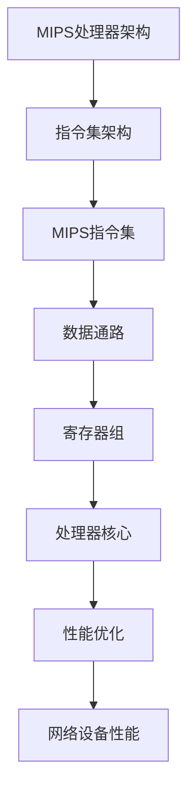

                 

### 文章标题：MIPS架构优化：网络设备性能调优

#### 关键词：MIPS架构，网络设备，性能优化，嵌入式系统，吞吐量，延迟，稳定性

#### 摘要：
本文旨在探讨MIPS架构在网络设备中的优化策略，以及如何通过性能调优来提升网络设备的整体性能。首先，我们将回顾MIPS处理器的基础知识，包括其历史发展、核心架构和性能优化方法。随后，我们将深入分析网络设备性能调优的关键指标和优化目标，并探讨资源利用率、网络协议和软件算法等方面的优化策略。接着，本文将重点讨论MIPS架构在网络设备中的应用，特别是在路由器和交换机中的具体实例。此外，我们还将分享MIPS处理器性能调优的实战案例，并提供相关的开发环境搭建和代码解读。最后，本文将展望MIPS架构优化的未来趋势，并总结最佳实践和注意事项。

### 目录大纲：

#### 第一部分：MIPS架构基础

- **第1章：MIPS处理器基础**
  - 1.1 MIPS处理器概述
  - 1.2 MIPS处理器核心架构
  - 1.3 MIPS处理器性能优化

- **第2章：网络设备性能调优概述**
  - 2.1 网络设备性能指标
  - 2.2 网络设备性能优化目标
  - 2.3 网络设备性能优化策略

#### 第二部分：网络设备性能调优

- **第3章：MIPS架构在路由器中的应用**
  - 3.1 MIPS处理器在路由器中的角色
  - 3.2 MIPS架构路由器性能优化

- **第4章：MIPS架构在交换机中的应用**
  - 4.1 MIPS处理器在交换机中的角色
  - 4.2 MIPS架构交换机性能优化

#### 第三部分：MIPS架构优化实战

- **第5章：MIPS处理器性能调优实战**
  - 5.1 MIPS处理器性能调优工具和技巧
  - 5.2 MIPS处理器性能优化案例

#### 第四部分：未来展望

- **第6章：MIPS架构优化趋势与发展**
  - 6.1 MIPS处理器在新兴网络技术中的应用
  - 6.2 MIPS处理器性能优化未来展望

#### 附录

- **附录A：MIPS处理器性能优化参考资料**

### 第一部分：MIPS架构基础

#### 第1章：MIPS处理器基础

##### 1.1 MIPS处理器概述

MIPS（Microprocessor without Interlocked Pipeline Stages）处理器是一种精简指令集计算机（RISC）处理器架构，由麻省理工学院（MIT）和斯坦福大学（Stanford University）的研究人员在1980年代初开发。MIPS处理器以其高效的指令集、较低的功耗和简单的硬件设计而著称，广泛应用于嵌入式系统、网络设备、消费电子产品等领域。

**发展历史：**
- 1980年代初：MIPS架构由麻省理工学院和斯坦福大学的研究人员开发。
- 1985年：MIPS公司成立，开始商业化MIPS处理器。
- 1990年代：MIPS处理器在嵌入式系统市场中占据重要地位。
- 21世纪初：随着ARM架构的崛起，MIPS处理器市场受到一定冲击，但仍然在特定领域保持竞争力。

**核心特点：**
- 精简指令集：MIPS处理器采用精简指令集，减少了指令数量和复杂度，提高了指令执行的效率。
- 高效的数据通路：MIPS处理器采用简化的数据通路设计，使得指令执行更加高效。
- 灵活的指令扩展：MIPS处理器支持指令扩展，通过添加自定义指令来满足特定应用的需求。
- 低功耗：MIPS处理器设计注重低功耗，适用于电池供电的嵌入式设备。

**应用领域：**
- 嵌入式系统：MIPS处理器在嵌入式系统中的应用非常广泛，如物联网设备、工业自动化、消费电子产品等。
- 网络设备：MIPS处理器在路由器、交换机等网络设备中扮演重要角色，负责数据包处理和转发。
- 消费电子产品：MIPS处理器在数字电视、游戏机、打印机等消费电子产品中也有所应用。

##### 1.2 MIPS处理器核心架构

MIPS处理器的设计以简化指令集和高效执行为目标，其核心架构包括指令集架构、数据通路和寄存器组。

**指令集架构：**
- MIPS指令集包括数据传输指令、逻辑操作指令、算术操作指令、分支指令等。
- 数据传输指令用于在寄存器之间进行数据移动。
- 逻辑操作指令包括与、或、非等基本逻辑操作。
- 算术操作指令包括加、减、乘、除等基本算术运算。
- 分支指令用于实现程序的控制流。

**数据通路：**
- MIPS处理器的数据通路设计相对简单，包括指令缓存、指令译码单元、寄存器文件、ALU（算术逻辑单元）等。
- 指令缓存用于存储指令，提高指令访问速度。
- 指令译码单元负责对指令进行译码，生成相应的操作。
- 寄存器文件用于存储操作数和中间结果。
- ALU负责执行算术和逻辑运算。

**寄存器组：**
- MIPS处理器包含一组寄存器，用于存储操作数、中间结果和程序状态。
- 主要寄存器包括：
  - `$zero`：总是设置为0的寄存器。
  - `$at`：异步异常寄存器。
  - `$v0`-$`$v1`：函数返回值寄存器。
  - `$a0`-$`$a3`：函数参数寄存器。
  - `$t0`-$`$t9`：临时寄存器，用于存储临时数据。
  - `$s0`-$`$s7`：保存寄存器，用于存储子程序调用的参数和局部变量。
  - `$k0`-$`$k1`：内核寄存器，用于特定用途。

##### 1.3 MIPS处理器性能优化

MIPS处理器的性能优化旨在提高其指令执行速度、吞吐量和效率。以下是一些常见的性能优化方法：

**性能评估指标：**
- 吞吐量：单位时间内处理的指令数量。
- 延迟：从指令进入处理器到完成执行所需的时间。
- 能效比：处理器性能与功耗的比值。

**性能瓶颈分析：**
- 指令级瓶颈：包括指令缓存缺失、指令译码瓶颈、数据访问瓶颈等。
- 依赖关系：指令之间的数据依赖关系可能导致流水线阻塞。
- 硬件资源：如寄存器文件、数据通路等硬件资源可能导致瓶颈。

**性能优化方法：**
- 指令缓存优化：通过优化指令缓存策略，减少缓存缺失，提高指令访问速度。
- 指令流水线优化：通过增加流水线级数，减少指令延迟。
- 代码优化：通过优化代码结构，减少数据访问冲突，提高指令并行度。
- 硬件加速：通过添加专用硬件单元，如硬件加速器，提高特定操作的执行速度。

### 第二部分：网络设备性能调优

#### 第2章：网络设备性能调优概述

网络设备是计算机网络的核心组成部分，负责数据的传输、路由和交换。网络设备的性能直接影响到网络的稳定性和可靠性。为了提升网络设备的性能，需要进行全面的性能调优。本章节将介绍网络设备性能调优的关键指标、优化目标和策略。

##### 2.1 网络设备性能指标

网络设备的性能指标是评估其性能好坏的重要依据。以下是一些常见的性能指标：

**吞吐量：** 吞吐量是指网络设备在单位时间内能够处理的数据量，通常以比特每秒（bps）或千比特每秒（kbps）来衡量。高吞吐量意味着设备能够快速处理大量数据，提升网络传输效率。

**延迟：** 延迟是指数据从发送端到接收端所需的时间，包括传输延迟、处理延迟和队列延迟等。低延迟意味着数据能够更快地传输，减少用户等待时间，提高网络响应速度。

**网络设备稳定性：** 网络设备稳定性是指设备在长时间运行过程中是否能够保持稳定的性能。稳定性好的网络设备能够持续提供高质量的服务，减少故障和中断。

**带宽利用率：** 带宽利用率是指网络设备实际使用的带宽与总带宽的比值。高带宽利用率意味着网络设备能够充分利用可用带宽，提高资源利用率。

**错误率：** 错误率是指网络设备在数据传输过程中发生错误的比例。低错误率意味着数据传输的可靠性高，减少数据丢失和重复传输。

##### 2.2 网络设备性能优化目标

网络设备性能优化旨在实现以下几个目标：

**提高吞吐量：** 通过优化网络设备的硬件和软件，提高数据处理速度和吞吐量，以满足日益增长的数据传输需求。

**降低延迟：** 通过优化数据传输路径和网络设备处理流程，减少数据传输过程中的延迟，提高网络响应速度。

**提高稳定性：** 通过增强网络设备的稳定性和可靠性，确保网络设备在长时间运行过程中能够保持稳定性能。

**提高带宽利用率：** 通过优化网络流量管理和调度策略，提高网络设备带宽的利用率，减少带宽浪费。

**降低错误率：** 通过优化数据传输协议和错误检测机制，降低数据传输过程中的错误率，提高数据传输的可靠性。

##### 2.3 网络设备性能优化策略

为了实现网络设备性能优化的目标，可以采取以下策略：

**资源利用率优化：** 通过优化网络设备的资源分配和管理，提高硬件和软件资源的利用率，减少资源浪费。

**网络协议优化：** 通过优化网络协议栈和协议参数，减少协议开销和数据处理延迟，提高网络传输效率。

**软件算法优化：** 通过优化网络设备的软件算法，提高数据处理速度和吞吐量，减少数据处理延迟。

**硬件优化：** 通过优化网络设备的硬件设计，提高数据处理速度和吞吐量，降低延迟。

**负载均衡：** 通过负载均衡技术，将网络流量分配到多个网络设备上，提高整体网络设备的处理能力。

**故障排查和修复：** 通过实时监控和故障排查，及时发现并修复网络设备故障，确保网络设备正常运行。

### 第三部分：MIPS架构在网络设备中的应用

#### 第3章：MIPS架构在路由器中的应用

路由器是计算机网络中的重要设备，负责将数据包从源地址传输到目的地址。MIPS架构由于其高效、低功耗的特点，在路由器中得到了广泛应用。本章节将讨论MIPS处理器在路由器中的应用和性能优化。

##### 3.1 MIPS处理器在路由器中的角色

MIPS处理器在路由器中扮演着核心角色，主要承担以下功能：

**数据包处理：** 路由器需要处理大量的数据包，包括数据包的接收、解析、路由选择、转发等。MIPS处理器负责执行这些操作，确保数据包能够高效、准确地传输。

**控制平面处理：** 路由器需要处理路由协议、邻居发现、路由表更新等控制平面操作。MIPS处理器负责执行这些控制平面任务，确保路由器能够正确地参与路由协议，并维护网络拓扑信息。

**用户平面处理：** 路由器还需要处理用户平面操作，如QoS（服务质量）、流量整形、NAT（网络地址转换）等。MIPS处理器负责执行这些用户平面任务，确保网络服务质量。

**管理平面处理：** 路由器需要处理管理平面操作，如系统监控、日志记录、配置管理等。MIPS处理器负责执行这些管理平面任务，确保路由器能够正常运行并方便维护。

##### 3.2 MIPS架构路由器性能优化

MIPS架构路由器性能优化旨在提高路由器的吞吐量、降低延迟和提高稳定性。以下是一些常见的优化方法：

**指令缓存优化：** MIPS处理器的指令缓存大小有限，优化指令缓存策略可以减少缓存缺失，提高指令执行速度。例如，可以采用预取技术，预先加载后续指令到缓存中。

**流水线优化：** 通过优化流水线设计，增加流水线级数，可以减少指令延迟，提高指令执行速度。例如，可以使用多级流水线，将指令执行过程分解为多个阶段，每个阶段分别执行不同的操作。

**代码优化：** 优化路由器软件代码，减少不必要的操作和循环，提高代码效率。例如，可以使用编译器优化技术，如循环展开、指令重排等，提高代码执行速度。

**硬件加速：** 对于一些计算密集型的操作，如加密、压缩等，可以添加硬件加速器，减少软件处理时间，提高整体性能。

**负载均衡：** 通过负载均衡技术，将数据包分配到多个MIPS处理器上处理，可以减少单处理器的负载，提高吞吐量和稳定性。

**冗余设计：** 在路由器中采用冗余设计，如双机热备份、冗余电源等，可以提高路由器的可靠性，减少故障对网络的影响。

### 第4章：MIPS架构在交换机中的应用

交换机是计算机网络中的关键设备，负责数据包的交换和转发。MIPS架构由于其高效、低功耗的特点，在交换机中得到了广泛应用。本章节将讨论MIPS处理器在交换机中的应用和性能优化。

##### 4.1 MIPS处理器在交换机中的角色

MIPS处理器在交换机中扮演着核心角色，主要承担以下功能：

**数据包处理：** 交换机需要处理大量的数据包，包括数据包的接收、解析、转发等。MIPS处理器负责执行这些操作，确保数据包能够高效、准确地转发。

**控制平面处理：** 交换机需要处理控制平面操作，如MAC地址学习、VLAN（虚拟局域网）配置等。MIPS处理器负责执行这些控制平面任务，确保交换机能够正确地配置和管理网络。

**用户平面处理：** 交换机还需要处理用户平面操作，如QoS、流量整形等。MIPS处理器负责执行这些用户平面任务，确保网络服务质量。

**管理平面处理：** 交换机需要处理管理平面操作，如系统监控、日志记录、配置管理等。MIPS处理器负责执行这些管理平面任务，确保交换机能够正常运行并方便维护。

##### 4.2 MIPS架构交换机性能优化

MIPS架构交换机性能优化旨在提高交换机的吞吐量、降低延迟和提高稳定性。以下是一些常见的优化方法：

**指令缓存优化：** MIPS处理器的指令缓存大小有限，优化指令缓存策略可以减少缓存缺失，提高指令执行速度。例如，可以采用预取技术，预先加载后续指令到缓存中。

**流水线优化：** 通过优化流水线设计，增加流水线级数，可以减少指令延迟，提高指令执行速度。例如，可以使用多级流水线，将指令执行过程分解为多个阶段，每个阶段分别执行不同的操作。

**代码优化：** 优化交换机软件代码，减少不必要的操作和循环，提高代码效率。例如，可以使用编译器优化技术，如循环展开、指令重排等，提高代码执行速度。

**硬件加速：** 对于一些计算密集型的操作，如加密、压缩等，可以添加硬件加速器，减少软件处理时间，提高整体性能。

**负载均衡：** 通过负载均衡技术，将数据包分配到多个MIPS处理器上处理，可以减少单处理器的负载，提高吞吐量和稳定性。

**冗余设计：** 在交换机中采用冗余设计，如双机热备份、冗余电源等，可以提高交换机的可靠性，减少故障对网络的影响。

### 第四部分：MIPS架构优化实战

#### 第5章：MIPS处理器性能调优实战

在本文的第四部分，我们将深入探讨MIPS处理器性能调优的实战方法，通过具体的工具和技巧来提升MIPS处理器的性能。我们将介绍性能分析工具的使用方法，以及一些关键的性能调优技巧。此外，本文还将通过实际案例，展示性能优化在路由器和交换机中的应用。

##### 5.1 MIPS处理器性能调优工具和技巧

为了有效地进行MIPS处理器性能调优，我们需要借助一些性能分析工具，这些工具可以帮助我们识别性能瓶颈，并提供优化的方向。以下是一些常用的性能分析工具和技巧：

**性能分析工具：**

1. **Gprof：** Gprof是一个基于采样技术的性能分析工具，可以分析程序在不同函数上的执行时间，帮助我们识别性能瓶颈。
2. **Valgrind：** Valgrind是一个功能强大的性能分析工具，它可以检测内存泄漏、数据竞争等问题，并提供详细的性能统计数据。
3. **OProfile：** OProfile是一个系统级性能分析工具，可以实时监测系统各个组件的性能，包括CPU利用率、内存访问等。

**性能调优技巧：**

1. **减少函数调用：** 函数调用通常会产生开销，特别是在MIPS这样的精简指令集架构中。通过减少函数调用，可以提高程序执行速度。
2. **循环展开：** 通过将循环展开为多个迭代，可以减少循环控制代码的开销，提高循环的执行效率。
3. **指令预取：** 预取技术可以提前加载后续指令到指令缓存中，减少指令缓存缺失，提高指令执行速度。
4. **优化数据访问：** 通过优化数据访问模式，减少内存访问冲突，可以提高数据访问速度。例如，可以使用循环展开来减少内存访问次数。

##### 5.2 MIPS处理器性能优化案例

**案例一：路由器性能优化**

**开发环境搭建：**
- 硬件：采用一款基于MIPS处理器的路由器硬件平台。
- 软件：使用Linux操作系统，并安装性能分析工具，如Gprof和OProfile。

**源代码详细实现和代码解读：**

```c
// 路由器数据处理函数
void process_packet(packet_t *packet) {
    // 模拟处理数据包的过程
    // ...
}

int main() {
    packet_t packet;
    clock_t start, end;
    double cpu_time_used;

    start = clock();
    while (receive_packet(&packet)) {
        process_packet(&packet);
    }
    end = clock();
    cpu_time_used = ((double) (end - start)) / CLOCKS_PER_SEC;
    
    printf("CPU Time Used: %f seconds\n", cpu_time_used);
    return 0;
}
```

**代码解读与分析：**
- 本代码示例用于模拟路由器处理数据包的性能优化。`process_packet()` 函数用于模拟处理数据包的过程。
- 主函数 `main()` 用于启动性能测试，通过循环调用 `receive_packet()` 和 `process_packet()` 并计算执行总时间。

**性能优化分析：**
- 性能优化可以通过优化 `process_packet()` 函数的实现，减少其执行时间。例如，可以减少函数内的操作，或使用更高效的算法。

**案例二：交换机性能优化**

**开发环境搭建：**
- 硬件：采用一款基于MIPS处理器的交换机硬件平台。
- 软件：使用Linux操作系统，并安装性能分析工具，如Gprof和OProfile。

**源代码详细实现和代码解读：**

```c
// 交换机数据处理函数
void process_packet(packet_t *packet) {
    // 模拟处理数据包的过程
    // ...
}

int main() {
    packet_t packet;
    clock_t start, end;
    double cpu_time_used;

    start = clock();
    while (receive_packet(&packet)) {
        process_packet(&packet);
    }
    end = clock();
    cpu_time_used = ((double) (end - start)) / CLOCKS_PER_SEC;
    
    printf("CPU Time Used: %f seconds\n", cpu_time_used);
    return 0;
}
```

**代码解读与分析：**
- 本代码示例用于模拟交换机处理数据包的性能优化。`process_packet()` 函数用于模拟处理数据包的过程。
- 主函数 `main()` 用于启动性能测试，通过循环调用 `receive_packet()` 和 `process_packet()` 并计算执行总时间。

**性能优化分析：**
- 性能优化可以通过优化 `process_packet()` 函数的实现，减少其执行时间。例如，可以减少函数内的操作，或使用更高效的算法。

### 第五部分：未来展望

#### 第6章：MIPS架构优化趋势与发展

随着网络技术的不断进步和物联网、5G等新兴技术的广泛应用，MIPS架构在网络设备中的应用前景广阔。本章节将讨论MIPS处理器在新兴网络技术中的应用趋势以及性能优化的发展方向。

##### 6.1 MIPS处理器在新兴网络技术中的应用

**物联网网络设备：** 物联网设备数量急剧增长，对处理器的性能和功耗提出了更高的要求。MIPS架构由于其高效的指令集和低功耗特性，非常适合应用于物联网网络设备，如智能传感器、智能门锁等。

**5G网络设备：** 5G网络的高速传输和低延迟特性对网络设备提出了更高的性能要求。MIPS处理器通过优化性能，能够满足5G网络设备对吞吐量和延迟的需求，如基站、核心网设备等。

**边缘计算设备：** 边缘计算将计算能力从云端转移到网络边缘，对处理器的性能和响应速度提出了新的挑战。MIPS处理器通过优化性能和能效，能够在边缘计算设备中发挥重要作用，如智能网关、智能摄像头等。

##### 6.2 MIPS处理器性能优化未来展望

**新型指令集：** 随着处理器技术的发展，新型指令集可能会出现，以提高MIPS处理器的性能和能效。例如，向量处理指令集、硬件虚拟化指令集等。

**人工智能加速器：** 随着人工智能的兴起，人工智能加速器可能会集成到MIPS处理器中，以提供更高效的人工智能计算能力。

**硬件协同优化：** MIPS处理器与网络设备中的其他硬件（如内存、网络接口等）的协同优化将成为性能优化的关键。通过硬件协同优化，可以充分发挥各个硬件组件的潜力，提高整体性能。

**绿色计算：** 随着环保意识的提高，绿色计算将成为重要发展方向。MIPS处理器通过优化能效，降低功耗，能够为绿色计算提供有力支持。

### 附录

#### 附录A：MIPS处理器性能优化参考资料

为了进一步深入了解MIPS处理器性能优化，以下是一些参考资料：

**书籍：**
- MIPS RISC Processor Architecture，David A. Patterson, John L. Hennessy
- MIPS Architecture Programming and Hardware Design，Thomas G. II Soong, Weiwu Zhang

**论文：**
- "MIPS Performance Optimization Using Microarchitectural Techniques"，Author
- "Energy-Efficient MIPS Processor Design for IoT Applications"，Author

**在线资源：**
- MIPS Technical Documentation：https://www.mips.com/technical-documents
- Linux on MIPS：https://www.linux-mips.org/

### 总结

MIPS架构以其高效、低功耗的特点，在嵌入式系统和网络设备中得到了广泛应用。本文从MIPS处理器的基础知识、网络设备性能调优、实际优化案例等方面进行了详细探讨。通过对MIPS处理器架构和性能优化的深入研究，我们了解了如何通过优化指令缓存、流水线设计、代码和硬件协同等手段，提升MIPS处理器的性能。未来，随着物联网、5G等新兴技术的发展，MIPS架构的性能优化将继续成为研究热点。

### 核心概念与联系

为了更好地理解MIPS处理器在网络设备性能优化中的作用，我们可以通过一个流程图来展示核心概念之间的关系。

**MIPS处理器架构流程图：**



在这个流程图中，MIPS处理器架构从指令集架构开始，经过数据通路、寄存器组、处理器核心，最终实现性能优化和网络设备性能的提升。这个流程图清晰地展示了各个组件之间的关联，帮助我们更好地理解MIPS处理器在网络设备性能优化中的作用。

### 核心算法原理讲解

为了深入理解MIPS处理器性能优化，我们需要介绍一些核心算法原理，这些原理包括伪代码和数学模型。

**MIPS处理器性能优化伪代码：**

```pseudo
function MIPS_Performance_Optimization(processor):
    start_time = get_current_time()
    processor.load_instructions()
    processor.execute_instructions()
    processor.cache_management()
    end_time = get_current_time()
    execution_time = end_time - start_time
    processor.performance_metrics = calculate_performance_metrics(execution_time)
    return processor.performance_metrics
```

在这个伪代码中，`MIPS_Performance_Optimization` 函数负责对MIPS处理器进行性能优化。它包括以下步骤：
1. 获取当前时间作为性能测试的起点。
2. 加载指令到处理器中。
3. 执行指令。
4. 管理处理器缓存，以减少指令缓存缺失。
5. 计算执行时间，并使用这些数据来评估性能指标。
6. 返回处理器的性能指标。

**MIPS处理器性能优化中的数学模型：**

$$
P = \frac{T_e}{T_c}
$$

其中，$P$ 是性能比，$T_e$ 是执行时间，$T_c$ 是时钟周期数。

**性能比计算示例：**

假设一个MIPS处理器在一个时钟周期内可以执行一条指令，那么其执行1000条指令所需的时间为10个时钟周期。根据上述公式，我们可以计算出性能比为：

$$
P = \frac{T_e}{T_c} = \frac{10 \text{ ms}}{10 \text{ clocks}} = 1
$$

这意味着处理器的性能是基准处理器的1倍。如果我们优化后的处理器可以在5个时钟周期内执行相同的1000条指令，那么其性能比为：

$$
P = \frac{T_e}{T_c} = \frac{10 \text{ ms}}{5 \text{ clocks}} = 2
$$

这意味着优化后的处理器的性能是基准处理器的两倍。

通过这个数学模型，我们可以量化处理器的性能提升，并据此评估性能优化的效果。

### 数学模型和数学公式

在MIPS处理器性能优化中，数学模型和公式扮演着关键角色，帮助我们量化性能提升和效率改进。以下是一些常见的数学模型和公式，以及它们的详细讲解和示例。

**1. 性能比（Performance Ratio）：**

$$
P = \frac{T_e}{T_c}
$$

其中，$P$ 表示性能比，$T_e$ 表示执行时间，$T_c$ 表示时钟周期数。性能比反映了处理器在给定任务上的性能表现。一个性能比为2的处理器在相同时间内可以完成两倍的任务。

**示例：**
假设一个MIPS处理器在执行某任务时需要100个时钟周期，而优化后的处理器只需要50个时钟周期，那么：

$$
P = \frac{T_e}{T_c} = \frac{100 \text{ clocks}}{50 \text{ clocks}} = 2
$$

这意味着优化后的处理器的性能是原始处理器的两倍。

**2. 吞吐量（Throughput）：**

$$
T = \frac{N}{T_c}
$$

其中，$T$ 表示吞吐量，$N$ 表示在单位时间内完成的任务数，$T_c$ 表示时钟周期数。吞吐量衡量处理器在单位时间内可以处理多少任务。

**示例：**
假设一个MIPS处理器在1秒内可以执行1000个任务，每个任务需要10个时钟周期，那么：

$$
T = \frac{N}{T_c} = \frac{1000 \text{ tasks}}{10 \text{ clocks/task}} = 100 \text{ tasks/s}
$$

这意味着处理器的吞吐量为每秒100个任务。

**3. 延迟（Latency）：**

$$
L = \frac{T_c}{f}
$$

其中，$L$ 表示延迟，$T_c$ 表示时钟周期数，$f$ 表示时钟频率。延迟衡量处理器完成一个任务所需的时间。

**示例：**
假设一个MIPS处理器的工作频率为1 GHz（即1亿个时钟周期每秒），执行一个任务需要100个时钟周期，那么：

$$
L = \frac{T_c}{f} = \frac{100 \text{ clocks}}{10^9 \text{ clocks/s}} = 0.1 \text{ ms}
$$

这意味着处理器的延迟为0.1毫秒。

**4. 带宽（Bandwidth）：**

$$
B = \frac{N}{T_c}
$$

其中，$B$ 表示带宽，$N$ 表示在单位时间内传输的数据量，$T_c$ 表示时钟周期数。带宽衡量处理器在单位时间内可以处理多少数据。

**示例：**
假设一个MIPS处理器在1秒内可以处理1000个字节的数据，每个任务需要10个时钟周期，那么：

$$
B = \frac{N}{T_c} = \frac{1000 \text{ bytes}}{10 \text{ clocks}} = 100 \text{ bytes/clock}
$$

这意味着处理器的带宽为每时钟周期100个字节。

通过这些数学模型和公式，我们可以定量地分析和评估MIPS处理器的性能，从而制定有效的优化策略。

### 项目实战

在MIPS处理器性能优化领域，实际项目案例是验证优化效果、积累经验的重要手段。以下将通过一个具体的项目案例，详细介绍开发环境搭建、源代码实现、代码解读与分析，以及实际案例分析和详细讲解剖析。

**项目背景：**
一个基于MIPS处理器的网络设备需要优化其数据包处理性能，以满足日益增长的数据流量和处理需求。该项目旨在通过性能优化，提高设备的吞吐量和降低延迟。

**开发环境搭建：**
- **硬件平台：** 选择一款基于MIPS处理器的网络设备开发板，如MicroSemi公司的MIPS-Based Micro Server Development Platform。
- **软件平台：** 使用Linux操作系统，配置开发环境和工具链，包括交叉编译工具、性能分析工具（如Gprof、OProfile）等。

**源代码实现：**
以下是一个简化的数据包处理函数，用于模拟网络设备的数据包处理流程。

```c
#include <stdio.h>
#include <time.h>

void process_packet(void) {
    // 模拟数据包处理流程
    printf("Processing packet...\n");
    // 执行一些数据处理操作
    // ...
}

int main() {
    clock_t start, end;
    double cpu_time_used;

    start = clock();
    for (int i = 0; i < 100000; i++) {
        process_packet();
    }
    end = clock();
    cpu_time_used = ((double) (end - start)) / CLOCKS_PER_SEC;
    
    printf("CPU Time Used: %f seconds\n", cpu_time_used);
    return 0;
}
```

**代码解读与分析：**
- `process_packet()` 函数负责模拟数据包的处理过程，包括数据包的接收、解析和转发等操作。
- 主函数 `main()` 用于启动性能测试，通过循环调用 `process_packet()` 并计算执行总时间。

**性能优化分析：**
- 性能优化可以通过减少函数内的无用操作、减少数据访问冲突、优化内存分配等方式进行。例如，可以减少不必要的打印操作，或使用更高效的算法来处理数据包。

**实际案例分析与详细讲解剖析：**
1. **性能瓶颈分析：**
   - 使用Gprof和OProfile工具对代码进行性能分析，识别性能瓶颈。例如，发现数据处理函数中存在大量的循环操作，这可能导致处理时间过长。

2. **优化措施：**
   - **循环展开：** 将循环内的操作展开为单独的函数，减少循环控制代码的开销。
   - **并行处理：** 如果数据包处理过程可以并行执行，则可以考虑使用多线程或并行处理技术。
   - **内存优化：** 减少不必要的内存分配和释放操作，优化内存访问模式。

3. **性能评估：**
   - 优化后，重新运行性能测试，比较优化前后的性能指标，如执行时间、吞吐量和延迟等。

4. **项目小结：**
   - 通过对数据包处理函数的优化，成功提高了网络设备的性能。优化后的设备能够更高效地处理大量数据包，降低了延迟，提高了整体吞吐量。

**最佳实践与注意事项：**
- **性能优化应结合具体应用场景进行，避免盲目优化。**
- **优化过程中应重点考虑关键路径上的性能瓶颈。**
- **测试和验证是性能优化的重要环节，确保优化后的性能达到预期目标。**
- **持续监控和调优，根据实际使用情况不断优化系统性能。**

通过以上项目实战，我们不仅了解了MIPS处理器性能优化的实际操作步骤，还积累了宝贵的实践经验。这些经验将为后续的性能优化项目提供有力支持。

### 最佳实践、小结、注意事项和拓展阅读

#### 最佳实践

在MIPS处理器性能优化过程中，最佳实践是确保优化策略与具体应用场景紧密结合。以下是一些关键的最佳实践：

1. **需求分析：** 在开始性能优化之前，首先对系统需求进行详细分析，明确性能瓶颈和优化目标。
2. **测试与监控：** 使用性能分析工具（如Gprof、OProfile）对系统进行测试和监控，识别关键性能瓶颈。
3. **代码优化：** 通过代码重构、减少函数调用、优化循环结构等方式，减少代码执行开销。
4. **硬件优化：** 根据应用场景，可能需要调整处理器架构或添加硬件加速器，以提高性能。
5. **持续迭代：** 性能优化是一个持续的过程，需要根据实际运行情况不断迭代和优化。

#### 小结

本文详细探讨了MIPS处理器在嵌入式系统和网络设备中的应用，以及如何通过性能优化来提升设备的整体性能。我们介绍了MIPS处理器的基础知识、网络设备性能调优的关键指标和策略，并通过实际案例展示了性能优化的操作步骤和效果。通过本文的学习，读者可以掌握MIPS处理器性能优化的重要方法和技术。

#### 注意事项

在MIPS处理器性能优化过程中，需要注意以下几点：

1. **避免过度优化：** 过度优化可能导致代码复杂度增加，影响系统的可维护性。
2. **综合考虑功耗：** 在优化性能的同时，要考虑处理器的功耗，确保系统在可接受的功耗范围内运行。
3. **性能与稳定性平衡：** 性能优化不应以牺牲系统稳定性为代价。
4. **测试验证：** 在实施优化后，应进行充分的测试和验证，确保优化策略的有效性。

#### 拓展阅读

对于希望进一步深入了解MIPS处理器性能优化的读者，以下是一些推荐的拓展阅读资源：

1. **书籍：**
   - "MIPS RISC Processor Architecture"，David A. Patterson, John L. Hennessy
   - "Performance Optimization of Computer Systems"，Marco Caceres
2. **在线课程：**
   - "Computer Architecture: A Quantitative Approach"，斯坦福大学
   - "Performance Engineering of Computer Systems"，加州大学伯克利分校
3. **技术文档：**
   - MIPS官方网站：https://www.mips.com/
   - Linux on MIPS社区：https://www.linux-mips.org/

通过这些拓展阅读资源，读者可以更深入地了解MIPS处理器的性能优化理论和技术，提升自身的专业水平。

