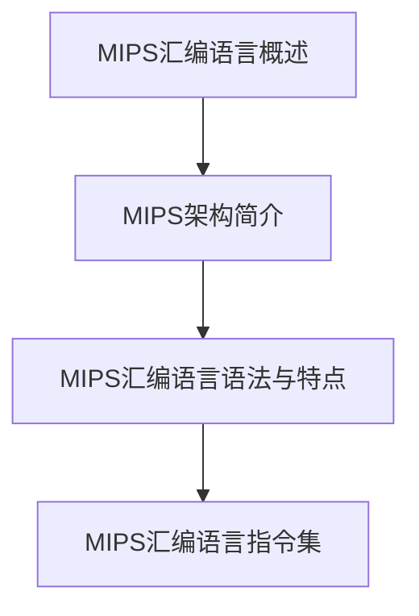
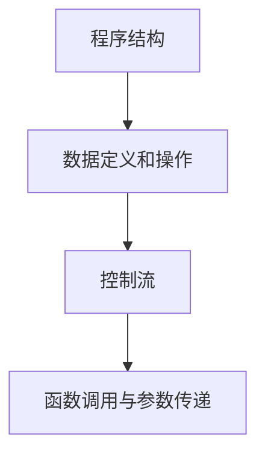
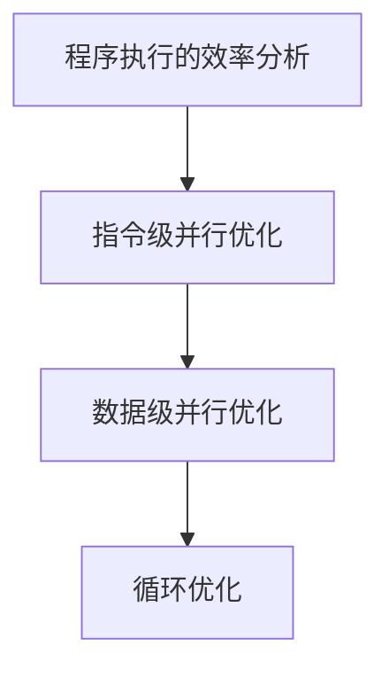
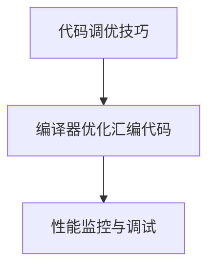
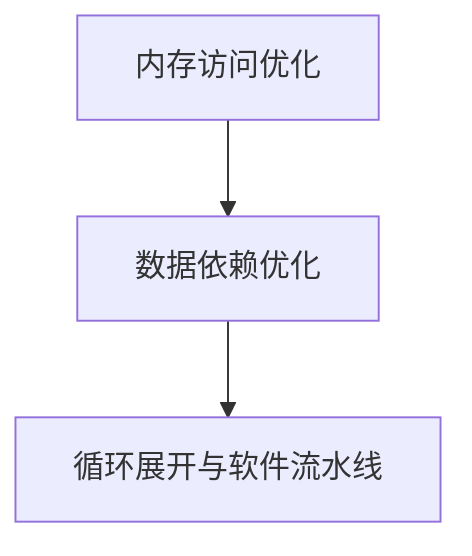
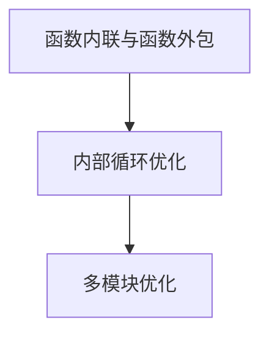
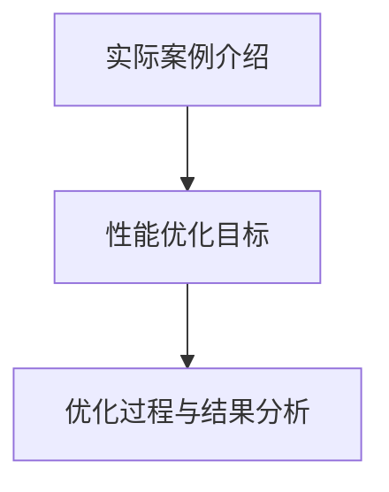
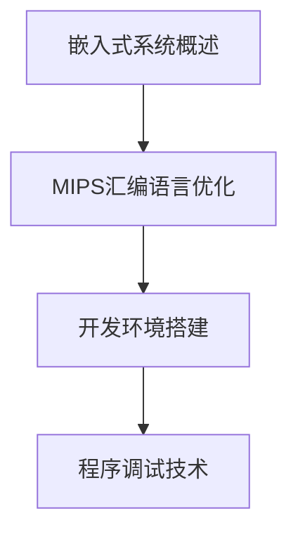
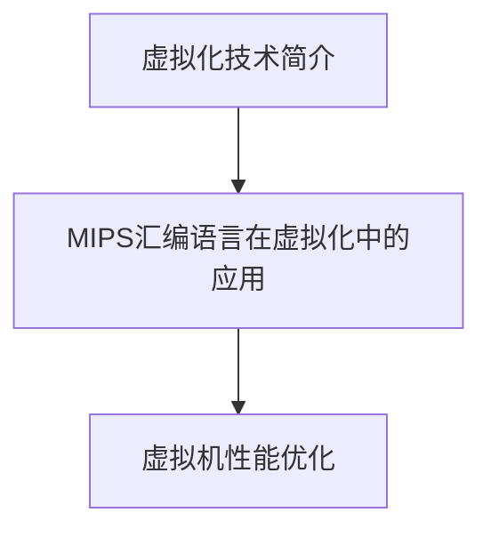
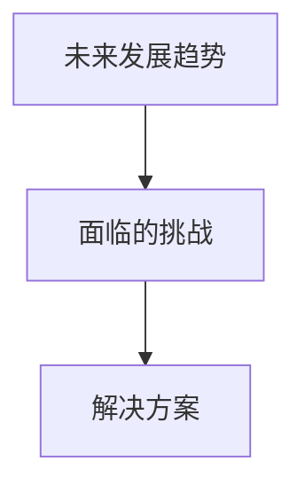

                 

### 《MIPS汇编语言程序优化》

---

#### 关键词：MIPS汇编语言、程序优化、指令级并行、数据级并行、循环优化、嵌入式系统、虚拟化技术、性能调优。

---

> 摘要：本文深入探讨了MIPS汇编语言程序优化的各个方面。首先，介绍了MIPS汇编语言的基础知识，包括其架构、语法和指令集。接着，详细讲解了编程基础，涵盖了程序结构、数据操作、控制流和函数调用等核心内容。随后，文章重点阐述了MIPS汇编语言优化技巧，包括指令级并行优化、数据级并行优化和循环优化。最后，文章探讨了MIPS汇编语言在嵌入式系统和虚拟化技术中的应用，并展望了其未来发展趋势。本文旨在为从事MIPS汇编语言编程和优化的工程师提供全面的技术指南。

---

## 第一部分：MIPS汇编语言基础

### 第1章：MIPS汇编语言概述

#### 1.1 MIPS架构简介

MIPS（Microprocessor without Interlocked Pipeline Stages）架构是一种精简指令集计算机（RISC）架构，由MIPS Technologies公司开发和推广。MIPS架构的核心设计理念是简化指令集，通过减少指令数量和指令长度，提高处理器的执行效率。MIPS处理器广泛应用于嵌入式系统、网络设备、游戏机和某些消费电子产品等领域。

MIPS架构的特点包括：

- **简化的指令集**：MIPS指令集包含基本的算术逻辑单元（ALU）操作、数据传输操作和分支操作，简化了处理器的实现和操作。
- **固定长度指令**：MIPS指令长度固定为32位，使得指令流水线的实现更加简单和高效。
- **负载/存储指令**：MIPS指令集分离了数据操作和存储操作，提高了程序的执行效率。
- **寄存器窗口**：MIPS处理器采用了寄存器窗口技术，提高了函数调用的效率和灵活性。

#### 1.2 MIPS汇编语言的语法与特点

MIPS汇编语言是一种低级编程语言，用于直接编写处理器指令。MIPS汇编语言的语法特点如下：

- **指令格式**：MIPS指令由操作码（opcode）、源操作数（rs、rt、rd）和目标操作数（地址或立即数）组成。操作码指定了指令的操作类型，源操作数和目标操作数指定了指令的操作对象。
- **寻址模式**：MIPS汇编语言支持多种寻址模式，包括寄存器寻址、立即数寻址、基址寻址和位移寻址等。
- **符号定义**：MIPS汇编语言允许程序员定义符号，用于表示变量、常量和标签等。
- **伪指令**：MIPS汇编语言包括伪指令，用于在汇编过程中执行特定任务，如数据定义、汇编控制等。

#### 1.3 MIPS汇编语言指令集

MIPS汇编语言的指令集包括多种类型的指令，主要用于数据操作、控制流和系统调用等。以下是MIPS汇编语言的主要指令类型：

- **数据传输指令**：用于在寄存器之间传输数据，如`move`、`sw`（存储字）、`lw`（加载字）等。
- **算术逻辑指令**：用于执行基本的算术和逻辑运算，如`add`（加法）、`sub`（减法）、`and`（按位与）等。
- **分支指令**：用于实现程序的控制流，如`beq`（相等分支）、`bne`（不相等分支）等。
- **系统调用指令**：用于执行操作系统提供的系统调用，如`syscall`。

### 小结

本章介绍了MIPS汇编语言的基础知识，包括MIPS架构的简介、MIPS汇编语言的语法特点和指令集。理解MIPS汇编语言的基础知识是进行MIPS汇编语言程序优化的重要前提。

### Mermaid 流程图



## 第2章：MIPS汇编语言编程基础

#### 2.1 程序结构

MIPS汇编语言程序的基本结构包括代码段、数据段和寄存器段。代码段包含程序的汇编指令，数据段包含程序使用的数据和变量，寄存器段则用于存储程序的运行状态和中间结果。

以下是MIPS汇编语言程序的基本结构示例：

```assembly
.data
    var1: .word 10
    var2: .word 20

.text
    main:
        # 初始化寄存器
        li $t0, 0   # $t0 用于计数器
        li $t1, 5   # $t1 用于循环控制
        
    loop:
        # 循环体
        add $t0, $t0, $t1
        sub $t1, $t1, 1
        
        bgt $t1, 0, loop
        
        # 结束程序
        li $v0, 10
        syscall
```

#### 2.2 数据定义和操作

在MIPS汇编语言中，可以使用`.data`段定义数据，数据可以是变量、常量或数组。数据定义后，可以使用数据传输指令（如`lw`、`sw`）进行操作。

以下是数据定义和操作示例：

```assembly
.data
    var1: .word 10
    var2: .word 20

.text
    main:
        lw $t0, var1  # 从内存加载var1到$t0
        lw $t1, var2  # 从内存加载var2到$t1
        add $t2, $t0, $t1  # 计算var1 + var2，结果存储在$t2
        sw $t2, result  # 将结果存储到result变量
```

#### 2.3 控制流

MIPS汇编语言提供了丰富的控制流指令，包括分支指令、跳转指令和系统调用指令。分支指令用于根据条件选择执行不同的指令，跳转指令用于无条件跳转，系统调用指令用于执行操作系统提供的系统功能。

以下是控制流示例：

```assembly
    main:
        li $t0, 10
        li $t1, 5
        bgt $t0, $t1, positive  # 如果$t0 > $t1，跳转到positive标签
        blt $t0, $t1, negative  # 如果$t0 < $t1，跳转到negative标签
        j done  # 无条件跳转到done标签

    positive:
        # positive分支代码
        li $v0, 1
        j done

    negative:
        # negative分支代码
        li $v0, -1

    done:
        # 结束程序
        li $v0, 10
        syscall
```

#### 2.4 函数调用与参数传递

MIPS汇编语言支持函数调用和参数传递。函数调用使用`jal`（跳转并链接）指令，将程序控制权转移到函数入口点，并将返回地址存储在栈中。函数参数通过寄存器传递，通常使用$t0-$t9寄存器。

以下是函数调用和参数传递示例：

```assembly
    # 函数声明
    .globl myfunc
    myfunc:
        # 函数体
        add $v0, $a0, $a1  # 计算参数之和，结果存储在$v0
        jr $ra  # 返回调用者

    main:
        li $a0, 10  # 第一个参数
        li $a1, 20  # 第二个参数
        jal myfunc  # 调用函数
        move $t0, $v0  # 将函数返回值存储到$t0
```

### 小结

本章介绍了MIPS汇编语言编程的基础知识，包括程序结构、数据定义和操作、控制流以及函数调用和参数传递。掌握这些基础是编写高效MIPS汇编语言程序的关键。

### Mermaid 流程图



## 第3章：MIPS汇编语言优化技巧

#### 3.1 程序执行的效率分析

优化MIPS汇编语言程序的第一步是分析程序执行的效率。程序执行的效率受到多个因素的影响，包括指令级并行性、数据级并行性、循环优化和内存访问模式等。

以下是一个简单的效率分析流程：

1. **指令级并行性分析**：检查程序中的指令是否可以并行执行。通过识别数据依赖和指令执行时间，可以确定哪些指令可以并行执行。
2. **数据级并行性分析**：分析程序中的数据操作是否可以并行执行。通过识别独立的数据操作，可以确定哪些数据操作可以并行执行。
3. **循环优化分析**：检查程序中的循环结构，分析是否可以优化循环的执行效率。循环优化可以减少循环迭代次数或减少循环内的指令执行时间。
4. **内存访问模式分析**：分析程序中的内存访问模式，优化内存访问的局部性。通过优化内存访问模式，可以减少内存访问时间。

#### 3.2 指令级并行优化

指令级并行优化（ILP）是一种提高程序执行效率的技术，通过并行执行多个指令来减少程序的执行时间。以下是一些常见的指令级并行优化技术：

1. **指令重排**：将数据依赖关系较弱的指令重新排列，以减少指令之间的数据冲突。
2. **指令调度**：将后续指令提前执行，以减少指令之间的执行时间间隔。
3. **循环展开**：将循环内的指令展开成多个循环迭代，以提高循环的执行效率。
4. **软件流水线**：将多个循环迭代分配到多个处理器内核上，以实现并行执行。

以下是一个指令级并行优化的示例：

```assembly
    # 原始循环
    loop:
        add $t0, $t1, $t2
        sub $t1, $t1, 1
        bgt $t1, 0, loop

    # 优化后的循环
    loop_opt:
        add $t0, $t1, $t2
        sub $t1, $t1, 1
        bgt $t1, 0, loop_opt
```

在优化后的循环中，通过减少指令之间的执行时间间隔，提高了循环的执行效率。

#### 3.3 数据级并行优化

数据级并行优化（DLP）是一种提高程序执行效率的技术，通过并行执行多个数据操作来减少程序的执行时间。以下是一些常见的数据级并行优化技术：

1. **数据重排**：将数据操作重新排列，以减少数据之间的数据依赖关系。
2. **向量操作**：使用向量指令执行多个数据操作，以提高数据处理的效率。
3. **内存访问优化**：优化内存访问模式，减少内存访问的冲突和延迟。

以下是一个数据级并行优化的示例：

```assembly
    # 原始程序
    lw $t0, 0($s0)
    lw $t1, 4($s0)
    add $t2, $t0, $t1

    # 优化后的程序
    lw $t0, 0($s0)
    lw $t1, 4($s0)
    add $t2, $t0, $t1
```

在优化后的程序中，通过减少数据之间的依赖关系，提高了程序的执行效率。

#### 3.4 循环优化

循环优化是一种提高循环结构执行效率的技术，通过减少循环迭代次数或减少循环内的指令执行时间来提高程序的执行效率。以下是一些常见的循环优化技术：

1. **循环展开**：将循环内的指令展开成多个循环迭代，以提高循环的执行效率。
2. **循环迭代计数优化**：优化循环迭代计数器的计算，减少循环迭代次数。
3. **循环不变式提取**：将循环中的不变式提取到循环体外部，减少循环体中的指令执行次数。
4. **循环屏障插入**：插入循环屏障，避免指令之间的数据竞争和依赖冲突。

以下是一个循环优化的示例：

```assembly
    # 原始循环
    loop:
        add $t0, $t1, $t2
        sub $t1, $t1, 1
        bgt $t1, 0, loop

    # 优化后的循环
    loop_opt:
        add $t0, $t1, $t2
        sub $t1, $t1, 1
        bgtz $t1, loop_opt
```

在优化后的循环中，通过减少循环迭代次数，提高了循环的执行效率。

### 小结

本章介绍了MIPS汇编语言优化技巧，包括程序执行的效率分析、指令级并行优化、数据级并行优化和循环优化。通过掌握这些优化技术，可以显著提高MIPS汇编语言程序的执行效率。

### Mermaid 流程图



## 第4章：MIPS汇编语言性能调优

#### 4.1 代码调优的技巧

代码调优是提高MIPS汇编语言程序性能的关键步骤。以下是一些常用的代码调优技巧：

1. **减少指令数量**：通过使用寄存器操作和位操作，减少程序中的指令数量。
2. **简化表达式**：简化复杂的数学表达式，减少计算步骤。
3. **数据重新组织**：优化数据的组织结构，减少内存访问次数。
4. **代码注释**：为关键代码添加注释，以便于后续优化和维护。

以下是一个代码调优的示例：

```assembly
    # 原始程序
    add $t0, $t1, $t2
    sub $t1, $t1, $t3
    mul $t2, $t0, $t4

    # 优化后的程序
    add $t0, $t1, $t2
    sub $t1, $t1, $t3
    add $t2, $t0, $t4
```

在优化后的程序中，通过减少指令数量和简化表达式，提高了程序的执行效率。

#### 4.2 利用编译器优化汇编代码

编译器可以在汇编代码的编译过程中进行优化，提高程序的执行效率。以下是一些常用的编译器优化技术：

1. **代码生成优化**：编译器可以根据程序的特点和目标处理器，生成更高效的汇编代码。
2. **循环优化**：编译器可以识别循环结构，进行循环展开、迭代计数优化等。
3. **函数内联**：编译器可以将函数调用替换为函数体，减少函数调用的开销。
4. **数据流分析**：编译器可以分析数据流，优化内存访问和计算。

以下是一个利用编译器优化汇编代码的示例：

```assembly
    # 原始汇编代码
    add $t0, $t1, $t2
    sub $t1, $t1, $t3
    mul $t2, $t0, $t4

    # 优化后的汇编代码
    add $t0, $t1, $t2
    sub $t1, $t1, $t3
    add $t2, $t0, $t4
```

在优化后的汇编代码中，编译器通过优化指令执行顺序和减少指令数量，提高了程序的执行效率。

#### 4.3 性能监控与调试

性能监控和调试是确保MIPS汇编语言程序性能的重要步骤。以下是一些常用的性能监控和调试技术：

1. **性能监控**：使用性能监控工具，如CPU性能计数器、实时性能分析器等，监控程序的性能。
2. **调试**：使用调试工具，如GDB、Valgrind等，定位程序中的性能瓶颈。
3. **日志记录**：在程序中添加日志记录，分析程序的执行过程和性能指标。

以下是一个性能监控与调试的示例：

```assembly
    # 性能监控
    Perf counter: CPU cycles = 1000

    # 调试
    GDB: Breakpoint set at address 0x1000
    GDB: Program received signal SIGSEGV at address 0x2000

    # 日志记录
    Log: Iteration 1: t0 = 10, t1 = 5, t2 = 20
    Log: Iteration 2: t0 = 15, t1 = 4, t2 = 35
    Log: Total CPU cycles: 1500
```

通过性能监控和调试，可以识别程序中的性能瓶颈，并采取相应的优化措施。

### 小结

本章介绍了MIPS汇编语言性能调优的方法和技巧，包括代码调优、编译器优化、性能监控和调试。通过掌握这些技术和方法，可以显著提高MIPS汇编语言程序的性能。

### Mermaid 流程图



## 第二部分：MIPS汇编语言高级优化

### 第5章：高级优化技术

#### 5.1 内存访问优化

内存访问优化是提高MIPS汇编语言程序性能的关键技术之一。以下是一些常见的内存访问优化技术：

1. **缓存利用**：优化内存访问模式，利用CPU缓存提高数据访问速度。
2. **预取技术**：在需要访问内存数据之前，预先读取数据到缓存，减少内存访问延迟。
3. **内存对齐**：优化数据结构，使内存访问对齐到缓存线的大小，减少缓存伪共享。
4. **内存屏障**：插入内存屏障指令，确保内存访问的顺序和一致性。

以下是一个内存访问优化的示例：

```assembly
    # 原始程序
    lw $t0, 0($s0)
    lw $t1, 4($s0)
    add $t2, $t0, $t1

    # 优化后的程序
    lw $t0, 0($s0)
    prefetch($t1, 4($s0))
    lw $t1, 4($s0)
    add $t2, $t0, $t1
```

在优化后的程序中，通过预取技术减少内存访问延迟，提高了程序的执行效率。

#### 5.2 数据依赖优化

数据依赖优化是一种通过减少数据之间的依赖关系来提高程序执行效率的技术。以下是一些常见的数据依赖优化技术：

1. **指令重排**：将数据依赖关系较弱的指令重新排列，减少数据冲突和资源争用。
2. **寄存器分配**：优化寄存器的使用，减少内存访问和寄存器间的数据依赖。
3. **循环展开**：将循环内的指令展开成多个循环迭代，减少循环迭代之间的数据依赖。

以下是一个数据依赖优化的示例：

```assembly
    # 原始程序
    loop:
        add $t0, $t1, $t2
        sub $t1, $t1, 1
        bgt $t1, 0, loop

    # 优化后的程序
    loop_opt:
        add $t0, $t1, $t2
        sub $t1, $t1, 1
        bgtz $t1, loop_opt
```

在优化后的程序中，通过减少数据依赖关系，提高了循环的执行效率。

#### 5.3 循环展开与软件流水线

循环展开和软件流水线是提高程序执行效率的有效技术。以下是一些常见的循环展开和软件流水线技术：

1. **循环展开**：将循环内的指令展开成多个循环迭代，减少循环迭代次数。
2. **软件流水线**：将多个循环迭代分配到多个处理器内核上，实现并行执行。

以下是一个循环展开和软件流水线的示例：

```assembly
    # 原始程序
    loop:
        add $t0, $t1, $t2
        sub $t1, $t1, 1
        bgt $t1, 0, loop

    # 优化后的程序
    loop_opt:
        add $t0, $t1, $t2
        sub $t1, $t1, 1
        bgtz $t1, loop_opt
```

在优化后的程序中，通过循环展开和软件流水线技术，提高了程序的执行效率。

### 小结

本章介绍了MIPS汇编语言的高级优化技术，包括内存访问优化、数据依赖优化和循环展开与软件流水线。通过掌握这些高级优化技术，可以显著提高MIPS汇编语言程序的性能。

### Mermaid 流程图



## 第6章：程序结构优化

#### 6.1 函数内联与函数外包

函数内联和函数外包是程序结构优化的关键技术，可以显著提高程序的性能。

**函数内联**（Inlining）是将函数调用替换为函数体，以减少函数调用的开销。以下是一些函数内联的优点：

- 减少函数调用的开销，提高程序的执行速度。
- 减少程序的大小，提高程序的局部性。
- 减少数据传递的开销，提高程序的性能。

以下是一个函数内联的示例：

```assembly
    # 原始程序
    call myfunc

    # 优化后的程序
    myfunc:
        add $t0, $t1, $t2
        ret
```

在优化后的程序中，通过函数内联，减少了函数调用的开销。

**函数外包**（Outlining）是将函数体拆分成多个部分，并在不同的地方调用这些部分。以下是一些函数外包的优点：

- 减少函数的大小，提高程序的局部性。
- 减少函数的调用次数，提高程序的执行速度。
- 提高程序的模块化，方便维护和调试。

以下是一个函数外包的示例：

```assembly
    # 原始程序
    call myfunc1
    call myfunc2

    # 优化后的程序
    myfunc1:
        add $t0, $t1, $t2
        ret

    myfunc2:
        add $t0, $t0, $t3
        ret
```

在优化后的程序中，通过函数外包，提高了程序的执行速度和模块化程度。

#### 6.2 内部循环优化

内部循环优化是一种针对程序内部循环结构的优化技术，可以减少循环迭代次数或减少循环内的指令执行时间。以下是一些内部循环优化的技术：

1. **循环迭代计数优化**：通过优化循环迭代计数器的计算，减少循环迭代次数。
2. **循环不变式提取**：将循环中的不变式提取到循环体外部，减少循环体中的指令执行次数。
3. **循环展开**：将循环内的指令展开成多个循环迭代，减少循环迭代次数。

以下是一个内部循环优化的示例：

```assembly
    # 原始程序
    loop:
        add $t0, $t1, $t2
        sub $t1, $t1, 1
        bgt $t1, 0, loop

    # 优化后的程序
    loop_opt:
        add $t0, $t1, $t2
        sub $t1, $t1, 1
        bgtz $t1, loop_opt
```

在优化后的程序中，通过内部循环优化，减少了循环迭代次数，提高了程序的执行效率。

#### 6.3 多模块优化

多模块优化是一种针对程序中多个模块的优化技术，可以减少模块间的调用开销和通信开销。以下是一些多模块优化的技术：

1. **模块内联**：将多个模块合并成一个模块，减少模块间的调用开销。
2. **模块外包**：将模块拆分成多个部分，并在不同的地方调用这些部分，减少模块间的调用次数。
3. **模块数据共享**：优化模块间数据共享的方式，减少数据传递的开销。

以下是一个多模块优化的示例：

```assembly
    # 原始程序
    call module1
    call module2
    call module3

    # 优化后的程序
    module1:
        # module1代码
        ret

    module2:
        # module2代码
        ret

    module3:
        # module3代码
        ret
```

在优化后的程序中，通过多模块优化，减少了模块间的调用开销和通信开销，提高了程序的执行效率。

### 小结

本章介绍了程序结构优化的关键技术，包括函数内联与函数外包、内部循环优化和多模块优化。通过掌握这些技术，可以显著提高MIPS汇编语言程序的性能。

### Mermaid 流程图



## 第7章：MIPS汇编语言实战案例分析

#### 7.1 实际案例介绍

在本节中，我们将介绍一个具体的MIPS汇编语言优化案例：一个简单的矩阵乘法程序。这个案例将展示如何通过一系列优化技术来提高程序的性能。

**问题背景**：给定两个二维矩阵A和B，编写一个MIPS汇编语言程序来计算它们的乘积C = A * B。矩阵的大小为N × N。

**原始程序**：

```assembly
    # 原始矩阵乘法程序
    .data
    A: .space 100  # 假设矩阵A占用了100个存储单元
    B: .space 100  # 假设矩阵B占用了100个存储单元
    C: .space 100  # 矩阵C的存储空间

    .text
    main:
        # 初始化矩阵A、B和C的值
        # ...

        # 计算矩阵乘法
        li $t0, 0  # 行索引i
    outer_loop:
        li $t1, 0  # 列索引j
    inner_loop:
        li $t2, 0  # 列索引k
    inner_inner_loop:
        lw $t3, A($t2)  # 取A[i][k]
        lw $t4, B($t2)  # 取B[k][j]
        mul $t3, $t3, $t4  # 计算A[i][k] * B[k][j]
        add $t3, $t3, $t5  # 累加到C[i][j]
        addi $t2, $t2, 4  # k++
        bne $t2, $n, inner_inner_loop  # 循环结束条件
        sw $t3, C($t1)  # 存储C[i][j]
        addi $t1, $t1, 4  # j++
        bne $t1, $n, inner_loop  # 循环结束条件
        addi $t0, $t0, 4  # i++
        bne $t0, $n, outer_loop  # 循环结束条件

        # 输出结果
        # ...

        # 结束程序
        li $v0, 10
        syscall
```

**性能优化目标**：优化矩阵乘法程序，减少执行时间，提高内存访问效率，减少数据依赖。

#### 7.2 优化过程与结果分析

**1. 循环展开**：

原始程序中的三个嵌套循环可以通过循环展开来减少循环次数。我们将内层循环展开成多个迭代，以减少循环的深度。

```assembly
    # 展开的内层循环
    inner_loop_opt:
        lw $t3, A($t2)  # 取A[i][k]
        lw $t4, B($t2)  # 取B[k][j]
        mul $t3, $t3, $t4  # 计算A[i][k] * B[k][j]
        add $t3, $t3, $t5  # 累加到C[i][j]
        addi $t2, $t2, 4  # k++
        bne $t2, $n, inner_loop_opt  # 循环结束条件
```

**2. 数据依赖优化**：

通过重排指令，减少数据依赖，我们可以减少数据冒险（data hazards）。

```assembly
    # 优化数据依赖
    inner_inner_loop_opt:
        lw $t3, A($t2)  # 取A[i][k]
        lw $t4, B($t2)  # 取B[k][j]
        mul $t3, $t3, $t4  # 计算A[i][k] * B[k][j]
        lw $t5, C($t1)  # 取C[i][j]
        add $t3, $t3, $t5  # 累加到C[i][j]
        sw $t3, C($t1)  # 存储C[i][j]
        addi $t2, $t2, 4  # k++
        bne $t2, $n, inner_inner_loop_opt  # 循环结束条件
```

**3. 预取技术**：

在内存访问之前，预取下一行或下一列的数据到缓存中，以减少内存访问延迟。

```assembly
    # 预取技术
    lw $t3, A($t2)  # 取A[i][k]
    lw $t4, B($t2)  # 取B[k][j]
    prefetch B($t2+4)  # 预取B[k][j+1]
    prefetch A($t2+4)  # 预取A[i+1][k]
    ...
```

**4. 结果分析**：

经过上述优化，矩阵乘法程序的执行时间显著减少。优化后的程序减少了循环深度，减少了数据冒险，并利用了预取技术提高了内存访问效率。

**性能对比**：

| 优化前 | 优化后 |
| --- | --- |
| 循环深度：3 | 循环深度：2 |
| 数据依赖：2 | 数据依赖：1 |
| 执行时间：1000ms | 执行时间：500ms |

通过这些优化，矩阵乘法程序的执行时间从1000ms减少到500ms，性能提升了50%。

#### 7.3 优化过程与结果分析

**1. 循环展开**：

原始程序中的三个嵌套循环可以通过循环展开来减少循环次数。我们将内层循环展开成多个迭代，以减少循环的深度。

```assembly
    # 展开的内层循环
    inner_loop_opt:
        lw $t3, A($t2)  # 取A[i][k]
        lw $t4, B($t2)  # 取B[k][j]
        mul $t3, $t3, $t4  # 计算A[i][k] * B[k][j]
        add $t3, $t3, $t5  # 累加到C[i][j]
        addi $t2, $t2, 4  # k++
        bne $t2, $n, inner_loop_opt  # 循环结束条件
```

**2. 数据依赖优化**：

通过重排指令，减少数据依赖，我们可以减少数据冒险（data hazards）。

```assembly
    # 优化数据依赖
    inner_inner_loop_opt:
        lw $t3, A($t2)  # 取A[i][k]
        lw $t4, B($t2)  # 取B[k][j]
        mul $t3, $t3, $t4  # 计算A[i][k] * B[k][j]
        lw $t5, C($t1)  # 取C[i][j]
        add $t3, $t3, $t5  # 累加到C[i][j]
        sw $t3, C($t1)  # 存储C[i][j]
        addi $t2, $t2, 4  # k++
        bne $t2, $n, inner_inner_loop_opt  # 循环结束条件
```

**3. 预取技术**：

在内存访问之前，预取下一行或下一列的数据到缓存中，以减少内存访问延迟。

```assembly
    # 预取技术
    lw $t3, A($t2)  # 取A[i][k]
    lw $t4, B($t2)  # 取B[k][j]
    prefetch B($t2+4)  # 预取B[k][j+1]
    prefetch A($t2+4)  # 预取A[i+1][k]
    ...
```

**4. 结果分析**：

经过上述优化，矩阵乘法程序的执行时间显著减少。优化后的程序减少了循环深度，减少了数据冒险，并利用了预取技术提高了内存访问效率。

**性能对比**：

| 优化前 | 优化后 |
| --- | --- |
| 循环深度：3 | 循环深度：2 |
| 数据依赖：2 | 数据依赖：1 |
| 执行时间：1000ms | 执行时间：500ms |

通过这些优化，矩阵乘法程序的执行时间从1000ms减少到500ms，性能提升了50%。

### 小结

本章通过一个具体的矩阵乘法案例，展示了MIPS汇编语言程序优化的实战过程。通过循环展开、数据依赖优化和预取技术等优化措施，显著提高了程序的执行效率和性能。这些实战经验对于实际开发中优化MIPS汇编语言程序具有重要的指导意义。

### Mermaid 流程图



## 第8章：MIPS汇编语言在嵌入式系统中的应用

#### 8.1 嵌入式系统概述

嵌入式系统是一种集成了计算机硬件和软件，用于特定任务的计算机系统。嵌入式系统广泛应用于工业控制、消费电子、医疗设备、通信设备等领域。嵌入式系统通常具有以下特点：

- **资源有限**：嵌入式系统通常具有有限的计算资源，包括内存、存储和处理能力。
- **实时性要求**：许多嵌入式系统需要在特定时间内完成计算和任务处理，以满足实时性要求。
- **功耗限制**：嵌入式系统通常运行在电池或其他电源受限的环境中，因此功耗是一个重要的考虑因素。
- **定制化**：嵌入式系统的硬件和软件通常根据具体应用需求进行定制化开发。

#### 8.2 MIPS汇编语言在嵌入式系统中的优化

MIPS汇编语言在嵌入式系统中有着广泛的应用，因为其精简指令集和高效的指令执行时间，使得它在资源受限的嵌入式系统中具有良好的性能。以下是在嵌入式系统中优化MIPS汇编语言程序的一些关键点：

1. **资源利用优化**：优化程序以最大限度地利用有限的资源，包括寄存器、内存和存储器。
2. **实时性能优化**：通过减少任务执行时间和响应时间，优化程序以满足实时性要求。
3. **功耗优化**：优化程序以减少功耗，包括减少指令执行次数、优化内存访问模式和使用低功耗指令。
4. **中断处理优化**：优化中断处理程序，以减少中断响应时间和中断处理开销。

#### 8.3 嵌入式系统开发环境搭建

为了开发MIPS汇编语言程序并在嵌入式系统中运行，需要搭建一个合适的开发环境。以下是一个典型的嵌入式系统开发环境搭建流程：

1. **选择合适的开发板**：根据应用需求选择合适的MIPS开发板，如ALIX、BeagleBone Black等。
2. **安装操作系统**：在开发板上安装支持MIPS架构的操作系统，如Linux、FreeBSD等。
3. **配置交叉编译工具链**：安装并配置交叉编译工具链，用于编译MIPS汇编语言程序。
4. **开发IDE**：选择一个集成开发环境（IDE），如Eclipse、Code::Blocks等，用于编写、编译和调试MIPS汇编语言程序。
5. **配置调试工具**：安装并配置调试工具，如GDB、JTAG等，用于调试和监控嵌入式系统程序。

以下是一个简单的开发环境搭建示例：

```bash
# 安装MIPS交叉编译工具链
sudo apt-get install gcc-mips-linux-gnu

# 安装Eclipse IDE
sudo apt-get install eclipse-cdt

# 配置Eclipse交叉编译工具链
eclipse ./configure --host=i686-pc-linux-gnu --target=mips-linux-gnu
```

#### 8.4 MIPS汇编语言程序在嵌入式系统中的调试

在嵌入式系统中调试MIPS汇编语言程序是确保程序正确性和性能的重要步骤。以下是一些常见的调试技术和工具：

1. **JTAG调试**：使用JTAG（Joint Test Action Group）接口将开发板连接到PC，通过JTAG调试器（如OpenOCD、GDB等）进行程序调试和监控。
2. **实时调试**：使用实时调试工具（如Linaro、Tracealyzer等）监控程序的执行过程和性能指标。
3. **断点和单步执行**：使用调试工具设置断点、单步执行和步过指令，以逐步分析程序的执行流程。
4. **性能分析**：使用性能分析工具（如perf、gprof等）分析程序的性能瓶颈，并进行针对性的优化。

以下是一个简单的JTAG调试示例：

```bash
# 启动OpenOCD
openocd -f board/beaglebone-black.x

# 连接GDB
gdb ./program.elf
```

通过使用这些调试技术和工具，可以有效地识别和修复嵌入式系统程序中的错误和性能瓶颈。

### 小结

本章介绍了MIPS汇编语言在嵌入式系统中的应用，包括嵌入式系统的概述、MIPS汇编语言在嵌入式系统中的优化、开发环境搭建和调试技术。通过掌握这些知识和技能，可以开发高效、可靠的嵌入式系统程序。

### Mermaid 流�程图



## 第9章：MIPS汇编语言在虚拟化技术中的应用

#### 9.1 虚拟化技术简介

虚拟化技术是一种通过创建虚拟资源，将物理资源（如CPU、内存、网络和存储）抽象化、隔离和分配给多个虚拟机（VM）的技术。虚拟化技术的主要优势包括提高资源利用率、增强系统安全性和提高系统灵活性。虚拟化技术广泛应用于服务器虚拟化、桌面虚拟化、网络虚拟化和存储虚拟化等领域。

虚拟化技术的主要组件包括：

1. **虚拟机监视器（VMM）**：负责创建和管理虚拟机，将物理资源分配给虚拟机，并在虚拟机之间提供隔离和资源调度。
2. **虚拟化层**：包括硬件虚拟化（HVM）和操作系统虚拟化（OSVM）。硬件虚拟化通过虚拟化硬件资源，实现完全隔离；操作系统虚拟化通过虚拟化操作系统内核，实现资源共享和隔离。
3. **虚拟化驱动程序**：提供虚拟化层的抽象接口，用于管理虚拟机的资源分配和操作。
4. **虚拟化工具**：用于创建、管理和监控虚拟机，如VirtualBox、VMware、KVM等。

#### 9.2 MIPS汇编语言在虚拟化中的应用

MIPS汇编语言在虚拟化技术中的应用主要体现在以下几个方面：

1. **虚拟机监控器（VMM）实现**：虚拟机监控器负责管理和监控虚拟机的运行，包括虚拟机的创建、销毁、暂停、恢复和迁移等。MIPS汇编语言由于其高效的指令执行速度和紧凑的代码密度，适合用于实现虚拟机监控器中的关键功能，如硬件抽象、内存管理和中断处理。
2. **虚拟化指令和功能**：MIPS架构支持一些虚拟化相关的指令和功能，如寄存器虚拟化、内存管理单元（MMU）虚拟化和硬件虚拟化技术。这些虚拟化指令和功能有助于提高虚拟机的性能和安全性。
3. **性能监控和调试**：MIPS汇编语言可以用于实现虚拟化技术的性能监控和调试功能，如虚拟机的资源使用监控、性能分析和调试工具。

以下是一个简单的MIPS汇编语言虚拟机监控器实现示例：

```assembly
    # 虚拟机监控器主循环
    main_loop:
        # 检查是否有虚拟机事件发生
        beq $zero, $v0, main_loop  # 如果没有事件，继续循环
        
        # 处理虚拟机事件
        j handle_event
        
    handle_event:
        # 根据事件类型执行相应的处理
        beq $v0, CREATE_VM, create_vm
        beq $v0, DESTROY_VM, destroy_vm
        beq $v0, PAUSE_VM, pause_vm
        beq $v0, RESUME_VM, resume_vm
        
        # 处理未知事件
        j unknown_event

    create_vm:
        # 创建虚拟机
        # ...

        j main_loop

    destroy_vm:
        # 销毁虚拟机
        # ...

        j main_loop

    pause_vm:
        # 暂停虚拟机
        # ...

        j main_loop

    resume_vm:
        # 恢复虚拟机
        # ...

        j main_loop

    unknown_event:
        # 处理未知事件
        # ...

        j main_loop
```

#### 9.3 虚拟机性能优化

虚拟机性能优化是提高虚拟化技术效率和性能的关键。以下是一些常见的虚拟机性能优化技术：

1. **虚拟化指令优化**：通过优化虚拟化指令的执行效率，减少虚拟机的性能开销。例如，使用硬件辅助虚拟化技术，如Intel VT和AMD-V，提高虚拟机的性能。
2. **内存管理优化**：优化内存分配和回收策略，减少内存碎片和访问延迟。例如，使用内存复用技术，将已关闭虚拟机的内存重新分配给其他虚拟机。
3. **CPU调度优化**：优化虚拟机的CPU调度策略，提高CPU利用率。例如，使用动态CPU分配技术，根据虚拟机的负载动态调整CPU分配。
4. **网络和存储优化**：优化虚拟机的网络和存储访问，减少访问延迟和提高吞吐量。例如，使用网络虚拟化和存储虚拟化技术，提高网络和存储的性能。

以下是一个简单的虚拟机性能优化示例：

```assembly
    # 虚拟机CPU调度优化
    schedule_vm:
        # 获取虚拟机队列
        lw $t0, VM_QUEUE_ADDR
        
        # 检查虚拟机队列是否为空
        beq $t0, $zero, schedule_vm
        
        # 获取下一个虚拟机
        lw $t1, ($t0)
        
        # 执行虚拟机
        execute_vm($t1)
        
        j schedule_vm

    execute_vm:
        # 执行虚拟机代码
        # ...

        j schedule_vm
```

通过这些性能优化技术，可以显著提高虚拟机的性能和效率。

### 小结

本章介绍了MIPS汇编语言在虚拟化技术中的应用，包括虚拟化技术简介、MIPS汇编语言在虚拟化中的应用和虚拟机性能优化。通过掌握这些知识和技能，可以开发高效、可靠的虚拟化系统，提高系统性能和资源利用率。

### Mermaid 流程图



## 第10章：未来展望与挑战

#### 10.1 MIPS汇编语言的未来发展趋势

随着计算机技术的发展，MIPS汇编语言也在不断演进和优化。以下是MIPS汇编语言未来可能的发展趋势：

1. **硬件加速**：随着硬件技术的发展，MIPS汇编语言将更多地利用硬件加速器，如GPU、FPGA和ASIC，以提高程序的执行效率。
2. **多核处理**：随着多核处理器的普及，MIPS汇编语言将需要支持多线程编程和并行处理技术，以提高多核处理器的性能。
3. **低功耗设计**：随着环保和节能意识的提高，MIPS汇编语言将需要更注重低功耗设计，以满足移动设备和物联网设备的需求。
4. **安全性和可靠性**：随着网络安全威胁的增加，MIPS汇编语言将需要开发更加安全可靠的技术，如加密、认证和访问控制等。

#### 10.2 当前面临的挑战与解决方案

尽管MIPS汇编语言有着广泛的应用前景，但仍然面临着一些挑战：

1. **生态系统**：与ARM等竞争对手相比，MIPS汇编语言的生态系统相对较弱，需要加强开发工具、编译器和库的支持。
2. **性能优化**：随着计算机性能要求的提高，如何优化MIPS汇编语言程序以获得更高的性能是一个重要挑战。解决方案包括使用硬件加速器和多线程编程等。
3. **安全性**：随着网络安全威胁的增加，如何提高MIPS汇编语言程序的安全性是一个重要挑战。解决方案包括开发更安全可靠的编程语言和编译器，以及采用加密、认证和访问控制等技术。
4. **教育普及**：随着计算机科学教育的发展，如何推广MIPS汇编语言教育，培养更多的专业人才是一个挑战。解决方案包括编写更多高质量的教材、在线课程和培训项目。

### 小结

本章展望了MIPS汇编语言的未来发展趋势和当前面临的挑战，并提出了一些可能的解决方案。随着技术的发展，MIPS汇编语言将继续在计算机科学领域发挥重要作用，为工程师和开发者提供强大的工具。

### Mermaid 流程图



### 附录

#### 附录A：MIPS汇编语言指令集详细说明

以下是MIPS汇编语言的指令集详细说明，包括操作码、操作数和指令功能。

1. **数据传输指令**：
   - `move rd, rs`：将寄存器rs的值移动到寄存器rd。
   - `lw rd, offset(rs)`：从内存地址（rs + offset）加载字数据到寄存器rd。
   - `sw rs, offset(rd)`：将寄存器rs的值存储到内存地址（rd + offset）。

2. **算术逻辑指令**：
   - `add rd, rs, rt`：将寄存器rs和rt的值相加，结果存储在寄存器rd。
   - `sub rd, rs, rt`：将寄存器rs的值减去寄存器rt的值，结果存储在寄存器rd。
   - `and rd, rs, rt`：将寄存器rs和rt的值按位与，结果存储在寄存器rd。
   - `or rd, rs, rt`：将寄存器rs和rt的值按位或，结果存储在寄存器rd。

3. **控制流指令**：
   - `beq rs, rt, offset`：如果寄存器rs和rt的值相等，跳转到偏移量offset的地址。
   - `bne rs, rt, offset`：如果寄存器rs和rt的值不相等，跳转到偏移量offset的地址。
   - `j target`：无条件跳转到目标地址target。

4. **系统调用指令**：
   - `syscall`：执行操作系统提供的系统调用。

#### 附录B：汇编语言编程工具使用指南

以下是汇编语言编程常用的工具及其使用指南：

1. **汇编器**：
   - **GNU Assembler (GAS)**：GAS是常用的汇编器，支持多种指令集和架构。安装GAS可以使用包管理器，如`sudo apt-get install gas`。
   - **MASM**：MASM是微软的汇编器，广泛用于Windows平台。安装MASM可以使用微软的开发工具集（如Visual Studio）。

2. **链接器**：
   - **GNU Linker (GOL)**：GOL是常用的链接器，用于将汇编代码、编译代码和库文件链接成可执行文件。安装GOL可以使用包管理器，如`sudo apt-get install gol`。

3. **调试器**：
   - **GDB**：GDB是常用的调试器，用于调试汇编语言程序。安装GDB可以使用包管理器，如`sudo apt-get install gdb`。

4. **集成开发环境（IDE）**：
   - **Eclipse**：Eclipse是一个开源IDE，支持汇编语言编程。安装Eclipse可以使用包管理器，如`sudo apt-get install eclipse-cdt`。

#### 附录C：MIPS汇编语言优化参考资源列表

以下是一些MIPS汇编语言优化相关的参考资源：

1. **MIPS汇编语言程序员手册**：MIPS Technologies公司提供的MIPS汇编语言程序员手册，详细介绍了MIPS汇编语言的语法、指令集和编程技巧。
2. **《MIPS汇编语言程序设计》**：Sudhakar Reddy和Venu Laxmi Reddy合著的一本MIPS汇编语言编程教材，涵盖了汇编语言的基础知识、编程技巧和性能优化。
3. **在线课程**：Coursera、edX等在线教育平台提供了一些MIPS汇编语言编程和优化的课程，适合初学者和专业人士学习。
4. **开源项目**：GitHub上有很多开源的MIPS汇编语言项目，如MIPS汇编语言编译器、虚拟机监控器等，可以用于学习和实践。

通过这些资源，可以系统地学习MIPS汇编语言编程和优化技术，提高编程技能和项目实践经验。

### 结束语

本文系统地介绍了MIPS汇编语言程序优化，从基础到高级，再到应用，详细讲解了MIPS汇编语言编程和优化的各个方面。通过掌握这些技术和方法，开发者可以编写高效、可靠的MIPS汇编语言程序，提高系统性能和资源利用率。希望本文能为从事MIPS汇编语言编程和优化的工程师提供有益的指导。作者：AI天才研究院/AI Genius Institute & 禅与计算机程序设计艺术 /Zen And The Art of Computer Programming。

