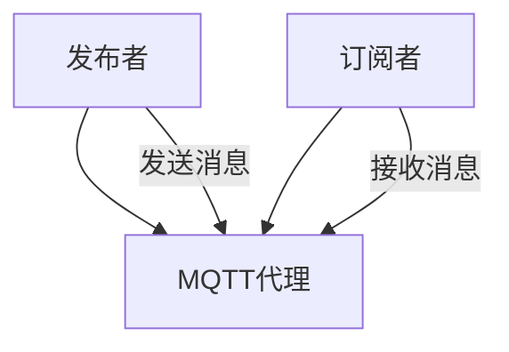
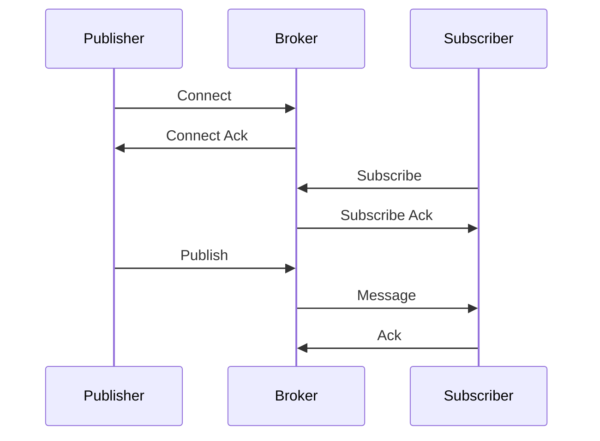
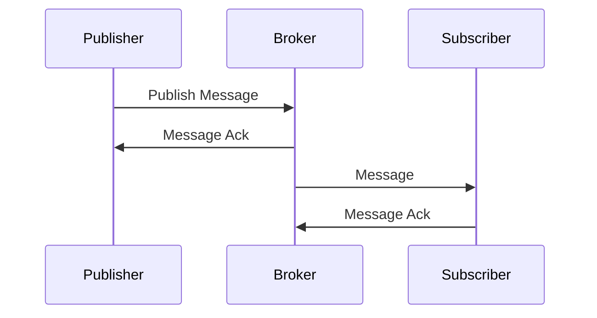
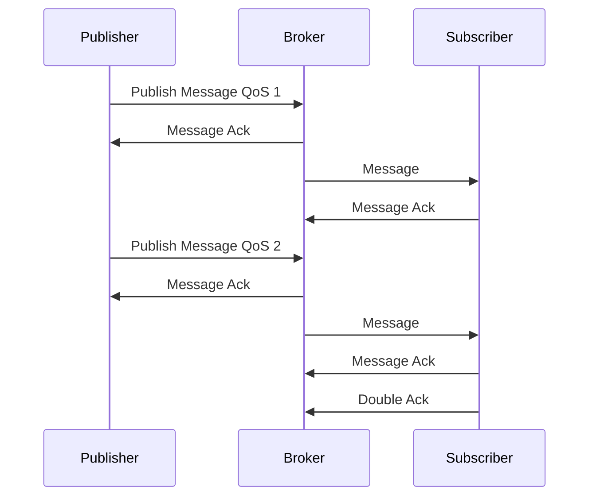
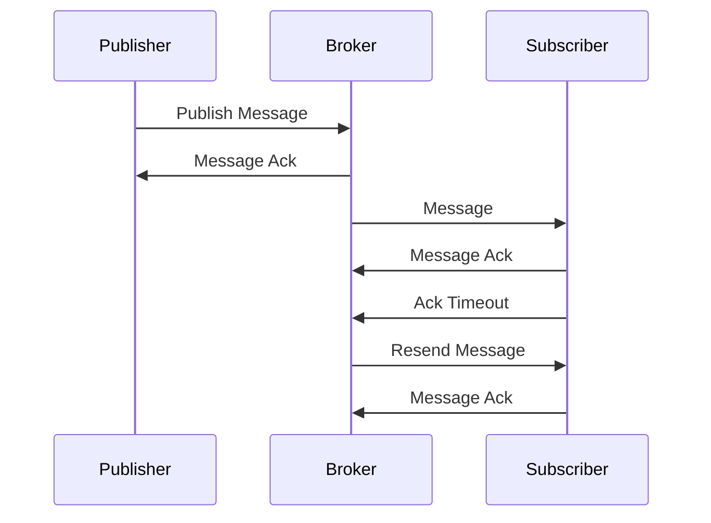

                 

### 《MQTT物联网通信协议详解》

#### 关键词：MQTT、物联网、通信协议、架构设计、安全机制、项目实战

#### 摘要：
本文将深入解析MQTT（Message Queuing Telemetry Transport）物联网通信协议，涵盖其基础概念、协议架构、网络通信机制、安全机制、核心算法原理以及项目实战应用。通过逐步分析，读者将全面了解MQTT协议的技术原理，掌握其在物联网系统中的应用与实现方法。

## 《MQTT物联网通信协议详解》目录大纲

### 第一部分: MQTT协议基础

#### 第1章: MQTT协议概述  
1.1 MQTT协议的起源与发展  
1.2 MQTT协议的核心概念  
1.3 MQTT协议的优点与应用场景

#### 第2章: MQTT协议架构与通信流程  
2.1 MQTT协议的架构设计  
2.2 MQTT协议的通信流程  
2.3 MQTT协议中的角色与消息格式

#### 第3章: MQTT协议网络通信机制  
3.1 MQTT协议的网络通信机制  
3.2 MQTT协议的会话管理  
3.3 MQTT协议的连接与断开

#### 第4章: MQTT协议安全机制  
4.1 MQTT协议的安全需求  
4.2 MQTT协议的安全机制  
4.3 MQTT协议的安全配置与实现

#### 第5章: MQTT协议核心算法原理  
5.1 MQTT协议的MQ机制  
5.2 MQTT协议的QoS服务质量  
5.3 MQTT协议的消息重传机制

#### 第6章: MQTT协议扩展与生态  
6.1 MQTT协议的扩展机制  
6.2 MQTT协议在物联网中的应用  
6.3 MQTT协议生态中的主流实现与工具

### 第二部分: MQTT协议项目实战

#### 第7章: MQTT协议项目实战概述  
7.1 MQTT协议项目实战的目标与规划  
7.2 MQTT协议项目实战的环境搭建  
7.3 MQTT协议项目实战的技术选型

#### 第8章: MQTT协议项目实战：智能家居系统  
8.1 项目需求分析  
8.2 系统架构设计  
8.3 设备端实现  
8.4 服务器端实现  
8.5 系统测试与优化

#### 第9章: MQTT协议项目实战：智能工厂监控系统  
9.1 项目需求分析  
9.2 系统架构设计  
9.3 设备端实现  
9.4 服务器端实现  
9.5 系统测试与优化

#### 第10章: MQTT协议项目实战：智能农业系统  
10.1 项目需求分析  
10.2 系统架构设计  
10.3 设备端实现  
10.4 服务器端实现  
10.5 系统测试与优化

### 附录

#### 附录A: MQTT协议相关资源  
A.1 MQTT协议官方文档  
A.2 MQTT协议开源实现  
A.3 MQTT协议常用工具

#### 附录B: MQTT协议常见问题解答  
B.1 MQTT协议常见故障排除  
B.2 MQTT协议性能优化  
B.3 MQTT协议安全配置与调试

### 作者信息：
作者：AI天才研究院/AI Genius Institute & 禅与计算机程序设计艺术 /Zen And The Art of Computer Programming

### 文章正文部分将按照以上目录大纲逐一展开讲解。接下来，我们将从MQTT协议的起源与发展开始，逐步深入探讨其核心概念、架构设计、网络通信机制、安全机制、核心算法原理以及项目实战应用。通过这一系列内容，希望读者能够全面掌握MQTT物联网通信协议的技术原理和应用方法。

## MQTT协议的起源与发展

### 1.1 MQTT协议的起源

MQTT协议起源于1999年，由IBM公司的Arjuna Tech团队开发，最初是为了解决远程传感器网络的数据传输问题。当时，IBM公司参与了NASA的一个名为“Mars Rover”的火星探测器项目。在这个项目中，研究人员发现传统的HTTP协议在火星探测器的远程数据传输上存在诸多不足，比如延迟高、带宽占用大、可靠性低等。因此，他们需要一个轻量级的、可靠且低延时的通信协议来满足火星探测器的数据传输需求。

### 1.2 MQTT协议的发展历程

2009年，MQTT协议被正式标准化，成为了一项开放标准的通信协议。标准化的MQTT协议规定了消息的发布和订阅机制，定义了消息的格式和传输方式，为物联网通信提供了一种可靠的解决方案。

自标准化以来，MQTT协议在物联网领域得到了广泛应用。越来越多的企业和开发者开始采用MQTT协议来实现设备之间的通信，推动了物联网技术的发展。2015年，MQTT协议被正式纳入了物联网标准化组织（IoT-A）的标准之一，进一步巩固了其在物联网通信领域的地位。

### 1.3 MQTT协议的核心概念

MQTT协议是一种基于发布/订阅模式的通信协议，其核心概念主要包括以下几个方面：

1. **发布者（Publisher）**：发布者是指将消息发送到服务器（MQTT代理）的设备或应用程序。发布者可以将消息发布到特定的主题（Topic），其他订阅了该主题的发布者或应用程序可以接收到这些消息。

2. **订阅者（Subscriber）**：订阅者是指订阅了特定主题的消息的设备或应用程序。订阅者可以在服务器上注册对特定主题的关注，当有新的消息发布到这些主题时，服务器会将消息推送到订阅者。

3. **主题（Topic）**：主题是消息的分类标识，用于表示消息的类型和内容。MQTT协议通过主题来过滤消息，只有订阅了某个主题的订阅者才能接收到该主题的消息。

4. **MQTT代理（Broker）**：MQTT代理是MQTT协议的核心组件，负责接收和分发消息。MQTT代理接受发布者的消息，并将其发送给订阅了相应主题的订阅者。MQTT代理还负责管理订阅者、发布者和消息的传输过程，确保消息的可靠传输。

### 1.4 MQTT协议的优点与应用场景

MQTT协议具有以下几个优点：

1. **轻量级**：MQTT协议传输数据时，采用了二进制格式，相比文本格式的HTTP协议，MQTT协议的数据大小更小，传输速度更快。

2. **低功耗**：MQTT协议采用了发布/订阅模式，通过MQTT代理来转发消息，大大减少了设备之间的直接通信，降低了设备的功耗。

3. **可靠性**：MQTT协议支持消息确认机制，确保消息能够被正确传输和接收，提高了通信的可靠性。

4. **可扩展性**：MQTT协议支持多种QoS（服务质量）级别，可以根据应用需求调整消息的传输方式，确保消息的传输质量和效率。

基于以上优点，MQTT协议在以下应用场景中得到了广泛应用：

1. **智能家居**：MQTT协议可以用于连接智能家居设备，实现设备之间的通信和控制。例如，智能灯泡、智能插座、智能门锁等设备可以通过MQTT协议相互通信，实现智能家居系统的自动化控制。

2. **智能交通**：MQTT协议可以用于智能交通系统的数据传输，实现车辆、路况监测设备、交通信号灯等设备之间的信息共享和协调。

3. **工业物联网**：MQTT协议可以用于工业物联网系统，实现设备之间的实时数据传输和监控。例如，在智能工厂中，可以通过MQTT协议实时获取生产设备的运行状态、能耗数据等信息，实现生产过程的自动化监控和管理。

4. **环境监测**：MQTT协议可以用于环境监测系统，实现各种环境监测设备的实时数据传输和监控。例如，空气质量监测设备、水质监测设备、气象监测设备等，可以通过MQTT协议将监测数据传输到服务器，实现环境数据的实时监控和分析。

总之，MQTT协议作为一种轻量级、可靠、低延时的物联网通信协议，已经成为了物联网领域的事实标准。通过本章节的介绍，读者应该对MQTT协议的起源、发展、核心概念、优点和应用场景有了基本的了解。在接下来的章节中，我们将进一步深入探讨MQTT协议的架构设计、通信流程、网络通信机制、安全机制以及核心算法原理。

### MQTT协议架构与通信流程

#### 2.1 MQTT协议的架构设计

MQTT协议的架构设计采用了发布/订阅模式，主要包括三个核心组件：发布者（Publisher）、订阅者（Subscriber）和MQTT代理（Broker）。这三个组件相互协作，实现了设备之间的消息传递和通信。以下是一个简单的MQTT协议架构图：



- **发布者（Publisher）**：发布者是指将消息发送到MQTT代理的设备或应用程序。发布者可以发布消息到特定的主题（Topic），这些消息可以是传感器的数据、设备的控制命令等。
  
- **订阅者（Subscriber）**：订阅者是指订阅了特定主题的消息的设备或应用程序。订阅者可以接收MQTT代理转发的消息，这些消息与其订阅的主题相关。

- **MQTT代理（Broker）**：MQTT代理是MQTT协议的核心组件，负责接收和分发消息。MQTT代理接受发布者的消息，并将其发送给订阅了相应主题的订阅者。MQTT代理还负责管理订阅者、发布者和消息的传输过程，确保消息的可靠传输。

#### 2.2 MQTT协议的通信流程

MQTT协议的通信流程主要包括以下步骤：

1. **连接（Connect）**：发布者和订阅者需要先连接到MQTT代理。在连接过程中，客户端（发布者或订阅者）发送一个连接请求（Connect Packet）到MQTT代理，并包含客户端的标识信息（如客户端标识、用户名和密码等）。MQTT代理在收到连接请求后，会进行身份验证，并返回一个连接确认（Connect Ack Packet）。

2. **订阅（Subscribe）**：订阅者需要订阅特定的主题，以便接收与这些主题相关的消息。订阅者发送一个订阅请求（Subscribe Packet）到MQTT代理，并指定订阅的主题和QoS（服务质量）级别。MQTT代理在收到订阅请求后，会返回一个订阅确认（Subscribe Ack Packet），确认订阅请求是否成功。

3. **发布（Publish）**：发布者需要将消息发布到特定的主题。发布者发送一个发布请求（Publish Packet）到MQTT代理，并指定主题和消息内容。MQTT代理在收到发布请求后，会根据订阅者的订阅信息，将消息转发给相应的订阅者。

4. **确认（Ack）**：订阅者在接收到消息后，需要向MQTT代理发送确认（Ack Packet），表示消息已被成功接收。如果消息的QoS级别较高，MQTT代理还需要确保消息被成功传输。

5. **断开（Disconnect）**：当发布者或订阅者不再需要使用MQTT代理的服务时，可以发送一个断开请求（Disconnect Packet）来终止连接。

以下是MQTT协议通信流程的Mermaid流程图：



#### 2.3 MQTT协议中的角色与消息格式

在MQTT协议中，角色主要包括发布者、订阅者和MQTT代理。每种角色都有特定的消息格式和通信方式。

1. **发布者**：

   发布者的主要任务是发送消息到MQTT代理。发布者发送的消息格式如下：

   ```plaintext
   Header | Topic | Payload
   ```

   其中，Header包含消息的类型、QoS级别、消息标识等；Topic是消息的主题；Payload是消息的内容。

2. **订阅者**：

   订阅者的主要任务是接收MQTT代理转发的消息。订阅者发送的订阅请求格式如下：

   ```plaintext
   Header | Topic | QoS
   ```

   其中，Header包含请求的类型、消息标识等；Topic是订阅者希望接收的消息主题；QoS是服务质量级别，用于指定消息的传输方式和可靠性。

3. **MQTT代理**：

   MQTT代理负责接收发布者的消息，并根据订阅者的订阅信息，将消息转发给相应的订阅者。MQTT代理的主要消息格式包括：

   - **连接请求（Connect Packet）**：包含客户端标识、用户名、密码等信息。

   - **连接确认（Connect Ack Packet）**：包含连接结果、会话状态等。

   - **订阅请求（Subscribe Packet）**：包含订阅的主题、QoS级别等信息。

   - **订阅确认（Subscribe Ack Packet）**：包含订阅结果、订阅信息等。

   - **发布请求（Publish Packet）**：包含主题、消息内容、QoS级别等信息。

   - **发布确认（Publish Ack Packet）**：包含发布结果、消息标识等。

   - **断开请求（Disconnect Packet）**：表示客户端要断开连接。

通过以上介绍，读者应该对MQTT协议的架构设计、通信流程以及角色与消息格式有了基本的了解。在接下来的章节中，我们将继续探讨MQTT协议的网络通信机制、安全机制以及核心算法原理。

### MQTT协议网络通信机制

#### 3.1 MQTT协议的网络通信机制

MQTT协议的网络通信机制是其实现高效、可靠消息传输的关键。该协议基于TCP/IP协议栈，通过一系列优化和设计，实现了在低带宽、高延迟网络环境中的高效通信。以下是MQTT协议网络通信机制的核心组成部分：

1. **TCP连接**：

   MQTT协议使用TCP连接作为底层的传输通道。相比UDP协议，TCP提供了更可靠的数据传输，能够保证数据的完整性和顺序性。尽管TCP连接的建立和关闭过程会引入一定的延迟，但对于物联网设备而言，可靠传输是更为重要的。

2. **心跳机制**：

   MQTT协议引入了心跳机制来维持连接的活跃状态。心跳消息是一种特殊的空消息，发布者定期发送心跳消息以保持连接的有效性。心跳机制可以避免因网络波动或长时间无消息传输而导致的连接断开。默认的心跳间隔是60秒，但可以根据实际需求进行调整。

3. **长连接**：

   MQTT协议采用了长连接的方式，即发布者和订阅者与MQTT代理之间保持持续连接，而不是在每次发送消息时重新建立连接。这种长连接方式可以减少连接建立的时间开销，提高通信效率。同时，长连接还能够保证消息的实时传输，满足物联网设备的低延迟要求。

4. **数据压缩**：

   MQTT协议支持数据压缩，通过压缩消息内容来减少网络带宽的占用。MQTT代理和客户端可以协商支持的数据压缩格式，如 gzip 或 zlib。数据压缩可以在不显著增加处理开销的情况下，显著提高通信效率。

5. **批量传输**：

   MQTT协议支持批量传输，即可以将多个消息批量发送到MQTT代理。批量传输可以减少网络传输次数，降低网络延迟，提高通信效率。批量传输通常与心跳机制结合使用，即在批量消息发送完成后，再发送心跳消息。

6. **QoS等级**：

   MQTT协议提供了不同的QoS等级，即服务质量等级，用于控制消息的传输方式和可靠性。QoS等级分为0、1和2，分别代表最低、中和最高可靠性。QoS等级的设置可以根据应用场景和设备性能进行灵活调整，以实现通信质量和效率的平衡。

#### 3.2 MQTT协议的会话管理

MQTT协议的会话管理涉及到连接的建立、维护和断开等过程。以下是会话管理的关键点：

1. **连接建立**：

   发布者和订阅者在开始通信前，需要先与MQTT代理建立连接。连接建立过程中，客户端发送连接请求（Connect Packet），包含客户端标识、用户认证信息等。MQTT代理在收到连接请求后，会返回连接确认（Connect Ack Packet），确认连接是否成功。

2. **会话保持**：

   为了维持连接的活跃状态，MQTT协议引入了会话保持机制。发布者和订阅者可以通过定期发送心跳消息来保持连接的有效性。此外，MQTT代理可以在服务器配置中设置会话保持时间，超过该时间的无消息连接将被自动断开。

3. **会话恢复**：

   当客户端重新连接到MQTT代理时，可以根据会话恢复机制来恢复之前的订阅和未确认的消息。会话恢复机制包括持续订阅（Automatic Reconnect）和会话恢复（Session Expiration）两种方式。持续订阅是指在重新连接后，自动恢复之前的订阅。会话恢复是指MQTT代理在会话过期后，自动恢复之前的状态。

4. **连接断开**：

   当发布者或订阅者不再需要使用MQTT代理的服务时，可以发送断开请求（Disconnect Packet）来终止连接。断开连接后，客户端需要重新建立连接，以继续通信。

#### 3.3 MQTT协议的连接与断开

MQTT协议的连接与断开过程是会话管理的重要部分。以下是连接与断开的核心步骤：

1. **连接过程**：

   - 客户端发送连接请求（Connect Packet），包含客户端标识、用户认证信息、心跳间隔等。
   - MQTT代理接收连接请求，进行身份验证和连接参数的检查。
   - MQTT代理发送连接确认（Connect Ack Packet）给客户端，确认连接是否成功。

2. **断开过程**：

   - 客户端发送断开请求（Disconnect Packet）给MQTT代理。
   - MQTT代理在收到断开请求后，关闭与客户端的TCP连接。

   客户端在断开连接后，可以根据配置的重新连接策略，重新建立连接。

#### 实际应用案例

以下是一个简单的MQTT协议网络通信案例：

- **设备A（发布者）**：设备A连接到MQTT代理，发布温度传感器数据到主题“/sensor/temperature”。
- **设备B（订阅者）**：设备B订阅主题“/sensor/temperature”，接收设备A发布的温度传感器数据。
- **MQTT代理**：MQTT代理接收设备A的连接请求，确认连接成功。设备A发布消息时，MQTT代理根据设备B的订阅信息，将消息转发给设备B。

在上述案例中，设备A和设备B通过MQTT协议实现了数据传输和通信。MQTT代理作为中介，确保了消息的可靠传输和订阅者能够及时收到消息。

通过本章节的介绍，读者应该对MQTT协议的网络通信机制、会话管理和连接与断开过程有了深入理解。在接下来的章节中，我们将继续探讨MQTT协议的安全机制、核心算法原理以及项目实战应用。

### MQTT协议安全机制

#### 4.1 MQTT协议的安全需求

随着物联网（IoT）技术的快速发展，设备和系统之间的通信变得越来越复杂和多样化。在这种情况下，确保通信安全成为了MQTT协议设计中的一个重要考量因素。以下是MQTT协议在安全方面的主要需求：

1. **数据加密**：为了防止数据在传输过程中被窃取或篡改，MQTT协议需要支持数据加密。数据加密可以确保只有合法的接收者才能解密和阅读消息内容。

2. **用户认证**：为了防止未经授权的设备或用户访问MQTT代理和系统资源，MQTT协议需要支持用户认证。用户认证可以验证设备的身份，确保只有合法的用户才能进行通信。

3. **访问控制**：MQTT协议需要支持访问控制，以便对设备或用户的访问权限进行管理。访问控制可以确保只有经过授权的用户或设备才能访问特定的主题或资源。

4. **会话保护**：为了防止中间人攻击等安全威胁，MQTT协议需要支持会话保护。会话保护可以确保通信过程中，数据不会被截获或篡改。

#### 4.2 MQTT协议的安全机制

MQTT协议提供了多种安全机制来满足上述需求。以下是一些常见的安全机制：

1. **TLS/SSL**：MQTT协议支持使用TLS（传输层安全）或SSL（安全套接字层）协议来加密通信。这些协议可以确保数据在传输过程中被加密，防止数据被窃取或篡改。通过配置TLS/SSL证书，可以进一步确保通信的合法性和安全性。

2. **用户认证**：MQTT协议支持基于用户名和密码的认证机制。在连接过程中，客户端需要提供用户名和密码，MQTT代理会验证用户身份。为了增强安全性，可以使用加密的用户名和密码。

3. **访问控制**：MQTT协议支持基于主题的访问控制。客户端可以通过订阅特定主题来请求访问权限。MQTT代理可以根据访问控制策略，允许或拒绝客户端对特定主题的访问。

4. **消息完整性**：MQTT协议支持使用数字签名或消息认证码（MAC）来确保消息的完整性。数字签名可以验证消息的发送者身份和消息未被篡改。消息认证码可以确保消息的内容和发送者身份。

5. **会话保护**：MQTT协议通过会话保护机制来防止中间人攻击等安全威胁。在会话期间，客户端和MQTT代理会定期交换会话密钥，以确保通信过程中的安全性。

#### 4.3 MQTT协议的安全配置与实现

以下是一些常用的MQTT协议安全配置和实现方法：

1. **配置TLS/SSL**：

   - 在MQTT代理和客户端之间配置TLS/SSL，确保通信数据被加密。
   - 配置TLS/SSL证书，以确保通信的合法性和真实性。
   - 根据实际需求，可以启用或禁用特定的TLS/SSL协议版本和加密算法。

2. **用户认证**：

   - 配置MQTT代理的认证策略，支持基于用户名和密码的认证。
   - 设置强密码策略，要求用户使用复杂密码。
   - 可以使用加密的用户名和密码，确保认证过程中的安全性。

3. **访问控制**：

   - 配置MQTT代理的访问控制策略，限制客户端对特定主题的访问。
   - 可以使用ACL（访问控制列表）来细化访问控制策略。
   - 定期审核访问控制策略，确保访问控制的有效性。

4. **消息完整性**：

   - 在客户端和MQTT代理之间使用数字签名或消息认证码，确保消息的完整性。
   - 可以使用MQTT扩展协议，如`MQTT-SN`，来支持消息完整性检查。

5. **会话保护**：

   - 定期更新会话密钥，确保会话期间的安全性。
   - 可以使用会话恢复机制，在客户端重新连接时，自动恢复会话状态。

#### 实际案例

以下是一个简单的MQTT协议安全配置和实现案例：

- **设备A（客户端）**：设备A连接到MQTT代理，配置TLS/SSL，使用加密的用户名和密码进行认证。
- **设备B（客户端）**：设备B连接到MQTT代理，订阅主题“/sensor/temperature”，通过访问控制策略授权访问。
- **MQTT代理**：MQTT代理验证设备A的认证信息，确保设备A的身份合法性。设备A发布消息到主题“/sensor/temperature”，设备B能够接收到消息。

通过本章节的介绍，读者应该对MQTT协议的安全机制、安全配置与实现方法有了基本了解。在接下来的章节中，我们将继续探讨MQTT协议的核心算法原理以及项目实战应用。

### MQTT协议核心算法原理

#### 5.1 MQTT协议的MQ机制

MQTT协议中的MQ（Message Queue）机制是其实现消息可靠传输的关键组成部分。MQ机制主要涉及消息队列、消息存储和消息处理等几个方面。

1. **消息队列**：

   在MQTT协议中，消息队列用于存储待发送的消息。当发布者（Publisher）发送消息时，MQTT代理会将消息添加到消息队列中。消息队列可以保证消息的顺序性和可靠性，确保消息按照发送的顺序被处理。

2. **消息存储**：

   MQTT代理通常会在本地存储消息，以便在连接断开或重启后能够恢复消息传输。消息存储可以采用内存存储或持久化存储（如数据库）的方式。持久化存储可以确保消息不丢失，但会增加存储和管理开销。

3. **消息处理**：

   MQTT代理会按照消息队列的顺序处理消息。首先，MQTT代理会检查消息的QoS（服务质量）级别，根据QoS级别进行消息的发送和处理。QoS级别包括0、1和2，分别代表最低、中和最高可靠性。对于不同QoS级别的消息，MQTT代理会采取不同的处理策略。

以下是MQ机制的Mermaid流程图：



#### 5.2 MQTT协议的QoS服务质量

MQTT协议中的QoS（服务质量）服务质量级别用于控制消息的传输方式和可靠性。QoS级别分为0、1和2，分别代表最低、中和最高可靠性。

1. **QoS 0**：

   QoS 0（至多一次）是最低可靠性的级别。对于QoS 0的消息，MQTT代理仅保证消息被发送一次，但不保证消息的可靠传输。如果消息在发送过程中丢失，MQTT代理不会重传消息。

2. **QoS 1**：

   QoS 1（至少一次）是中等可靠性的级别。对于QoS 1的消息，MQTT代理会确保消息至少被发送一次，但在接收端可能存在重复接收的情况。为了实现QoS 1，MQTT代理会在消息发送后等待接收方的确认（Ack），如果接收方确认收到消息，MQTT代理会移除消息；如果接收方没有确认，MQTT代理会重传消息。

3. **QoS 2**：

   QoS 2（正好一次）是最高可靠性的级别。对于QoS 2的消息，MQTT代理会确保消息正好被发送一次，不会出现丢失或重复接收的情况。为了实现QoS 2，MQTT代理会在消息发送后等待接收方的双重确认（双Ack）。接收方在接收到消息后，会发送一个Ack表示消息已接收；然后，接收方会在处理完消息后，再次发送一个Ack表示消息处理完成。

以下是QoS机制的Mermaid流程图：



#### 5.3 MQTT协议的消息重传机制

MQTT协议的消息重传机制主要用于实现高可靠性的消息传输。在消息传输过程中，可能会因为网络不稳定或设备故障导致消息丢失。为了确保消息的可靠传输，MQTT协议提供了消息重传机制。

1. **心跳机制**：

   MQTT协议的心跳机制用于检测网络连接的稳定性。客户端（发布者或订阅者）会定期向MQTT代理发送心跳消息，以保持连接的有效性。如果MQTT代理在一定时间内未收到心跳消息，它会认为连接已经断开，并尝试重新建立连接。

2. **消息确认**：

   MQTT协议的消息确认机制用于确认消息是否被成功接收。对于QoS 1和QoS 2的消息，MQTT代理会等待接收方的确认（Ack）或双重确认（双Ack）。如果接收方在一定时间内未发送确认消息，MQTT代理会认为消息可能丢失，并尝试重新发送消息。

3. **消息重传**：

   当MQTT代理检测到消息丢失或未确认时，会重新发送消息。MQTT代理会根据消息的QoS级别和消息确认机制，决定是否重新发送消息。对于QoS 0的消息，由于不保证可靠传输，MQTT代理不会进行消息重传。

以下是消息重传机制的Mermaid流程图：



#### 伪代码示例

以下是MQTT协议消息重传机制的伪代码示例：

```python
# MQTT客户端发布消息
def publish_message(topic, payload, qos=0):
    # 发送消息到MQTT代理
    client.publish(topic, payload, qos=qos)
    
    # 等待确认
    if qos > 0:
        while not client.wait_for_message():
            # 如果超过等待时间，重新发送消息
            if timeout():
                publish_message(topic, payload, qos)
                break

# MQTT客户端订阅主题
def subscribe_topic(topic, callback):
    # 订阅主题
    client.subscribe(topic, callback=callback)

# MQTT客户端消息确认回调
def message_callback(message):
    # 处理消息
    process_message(message)

    # 发送确认消息
    client.send_ack(message)

# MQTT客户端消息处理
def process_message(message):
    # 处理消息内容
    print("Received message:", message)

# MQTT客户端重传机制
def timeout():
    # 检查是否超过等待时间
    return current_time() - last_message_time() > timeout_value
```

通过本章节的介绍，读者应该对MQTT协议的MQ机制、QoS服务质量以及消息重传机制有了深入理解。在接下来的章节中，我们将继续探讨MQTT协议的扩展与生态，以及项目实战应用。

### MQTT协议扩展与生态

#### 6.1 MQTT协议的扩展机制

MQTT协议作为一种轻量级的物联网通信协议，其扩展性是其成功的关键因素之一。MQTT协议定义了一套扩展机制，允许开发者根据具体应用需求，对协议进行扩展和定制化。

1. **协议扩展**：

   MQTT协议的扩展通过自定义的扩展头（Extension Header）实现。扩展头可以插入到MQTT消息的固定头和可变头之间，用于传递额外的信息。扩展头由一个或多个扩展字段组成，每个扩展字段包含一个类型标识、长度和数据。扩展字段可以由协议规范定义，也可以由应用程序自定义。

2. **属性扩展**：

   MQTT协议的属性扩展通过在消息中添加属性（Property）实现。属性是MQTT消息的一部分，可以携带额外的元数据信息。属性分为标准属性和用户定义属性。标准属性是协议规范定义的，用于控制消息的传输和处理。用户定义属性可以由应用程序自定义，用于传递特定应用场景下的信息。

3. **MQTT-SN**：

   MQTT-SN（MQTT for SNMP）是MQTT协议的一个扩展，用于在SNMP（简单网络管理协议）网络中传输MQTT消息。MQTT-SN扩展了MQTT协议，使其能够在传统的SNMP网络中运行，方便了物联网设备和系统的集成和管理。

#### 6.2 MQTT协议在物联网中的应用

MQTT协议在物联网（IoT）领域得到了广泛应用，主要表现在以下几个方面：

1. **智能家居**：

   MQTT协议被广泛应用于智能家居系统中，用于连接和控制各种智能设备。通过MQTT协议，智能灯泡、智能插座、智能摄像头等设备可以相互通信，实现智能家居系统的自动化控制和集中管理。

2. **智能交通**：

   MQTT协议可以用于智能交通系统的数据传输，实现车辆、路况监测设备、交通信号灯等设备之间的信息共享和协调。例如，车辆可以通过MQTT协议将位置信息、车速等信息发送到交通管理中心，实现交通流量的实时监控和优化。

3. **工业物联网**：

   MQTT协议被广泛应用于工业物联网（IIoT）系统中，用于连接和监控各种工业设备。通过MQTT协议，工厂可以实时获取生产设备的运行状态、能耗数据等信息，实现生产过程的自动化监控和管理。

4. **环境监测**：

   MQTT协议可以用于环境监测系统，实现各种环境监测设备之间的数据传输和监控。例如，空气质量监测设备、水质监测设备、气象监测设备等，可以通过MQTT协议将监测数据传输到环境监测中心，实现环境数据的实时监控和分析。

#### 6.3 MQTT协议生态中的主流实现与工具

在MQTT协议的生态系统中，有许多主流的实现和工具，以下是一些典型的代表：

1. **MQTT代理**：

   - **mosquitto**：mosquitto是一个开源的MQTT代理，支持各种操作系统，包括Linux、Windows和macOS。mosquitto具有高性能、可扩展性和安全性等优点，是MQTT协议中最受欢迎的实现之一。

   - **eclipse MQTTiot**：eclipse MQTTiot是一个基于Java的MQTT代理，支持各种操作系统，包括Windows、Linux和macOS。eclipse MQTTiot提供了丰富的功能，包括支持TLS/SSL、Web界面和集群模式等。

   - **IBM MQTT**：IBM MQTT是一个商业MQTT代理，提供高性能、可靠性和安全性。IBM MQTT支持各种操作系统，包括Windows、Linux和AIX。IBM MQTT在工业物联网和大型系统中得到了广泛应用。

2. **MQTT客户端**：

   - **paho-mqtt**：paho-mqtt是一个开源的MQTT客户端库，支持各种编程语言，包括Java、C#、Python和JavaScript。paho-mqtt提供了简单易用的API，方便开发者快速集成MQTT功能。

   - **eclipse MQTTiottest**：eclipse MQTTiottest是eclipse MQTTiot的一部分，提供了MQTT客户端的测试工具，用于验证MQTT客户端的实现和功能。

   - **mosquitto_pub**：mosquitto_pub是mosquitto的一个命令行工具，用于向MQTT代理发送消息。mosquitto_pub支持各种消息格式，包括JSON和XML。

3. **MQTT工具**：

   - **MQTT.fx**：MQTT.fx是一个开源的MQTT客户端工具，用于模拟和测试MQTT协议。MQTT.fx支持多种操作系统，包括Windows、Linux和macOS，提供了图形界面和命令行模式。

   - **MQTT-spy**：MQTT-spy是一个开源的MQTT代理工具，用于监视和监控MQTT协议的通信。MQTT-spy支持各种操作系统，包括Windows、Linux和macOS，提供了Web界面和命令行模式。

通过本章节的介绍，读者应该对MQTT协议的扩展机制、在物联网中的应用以及主流实现和工具有了基本了解。在接下来的章节中，我们将通过项目实战，进一步探讨MQTT协议在实际应用中的实现方法和技巧。

### MQTT协议项目实战概述

#### 7.1 MQTT协议项目实战的目标与规划

MQTT协议项目实战的目标是通过实际的项目开发，深入了解MQTT协议的工作原理和实现方法，并掌握如何在实际应用中部署和使用MQTT协议。本次项目实战主要包括以下几个部分：

1. **环境搭建**：搭建一个用于MQTT协议开发的实验环境，包括MQTT代理、客户端以及开发工具等。
2. **系统设计**：设计一个简单的MQTT协议通信系统，包括设备端和服务器端，实现设备数据的采集和服务器端的存储与处理。
3. **设备端实现**：开发设备端程序，实现数据采集和发送功能，使用MQTT协议与服务器端进行通信。
4. **服务器端实现**：开发服务器端程序，实现消息接收、处理和存储功能，确保消息的可靠传输和存储。
5. **系统测试与优化**：对系统进行功能测试和性能优化，确保系统稳定可靠地运行。

#### 7.2 MQTT协议项目实战的环境搭建

为了顺利进行MQTT协议项目实战，需要搭建一个完整的开发环境，包括MQTT代理、客户端以及开发工具等。以下是环境搭建的步骤：

1. **安装操作系统**：选择一个适合的操作系统，如Linux或Windows，用于搭建实验环境。
2. **安装MQTT代理**：选择一个开源的MQTT代理，如mosquitto或eclipse MQTTiot，并按照官方文档进行安装。安装完成后，启动MQTT代理，确保其正常运行。
3. **安装开发工具**：安装适用于开发MQTT协议项目的开发工具，如集成开发环境（IDE）、代码编辑器等。常用的开发工具包括Eclipse、Visual Studio Code等。
4. **安装编程语言**：选择一种适合的编程语言，如Python、Java或C#，用于开发设备端和服务器端程序。安装相应的编程语言环境和开发库。
5. **安装MQTT客户端库**：根据选择的编程语言，安装相应的MQTT客户端库，如paho-mqtt（Python）、eclipse MQTTiottest（Java）或mosquitto_pub（C#）。

#### 7.3 MQTT协议项目实战的技术选型

在MQTT协议项目实战中，技术选型对于项目的成功实施至关重要。以下是本次项目实战的技术选型：

1. **编程语言**：Python是一种简单易学、功能强大的编程语言，适合快速开发和实验。Python拥有丰富的库和框架，可以方便地实现设备端和服务器端程序。
2. **MQTT代理**：选择开源的mosquitto作为MQTT代理，因为mosquitto具有高性能、可扩展性和安全性等优点，适合用于实验环境。同时，mosquitto具有良好的文档和社区支持，方便开发者学习和使用。
3. **MQTT客户端库**：选择paho-mqtt作为Python的MQTT客户端库，因为paho-mqtt是一个开源的、功能强大的MQTT客户端库，支持多种编程语言，并且具有良好的文档和社区支持。
4. **消息存储**：选择SQLite数据库作为消息存储方案，因为SQLite是一个轻量级、嵌入式数据库，适合存储和查询少量的数据。同时，SQLite具有简单易用、高性能和跨平台等优点。
5. **消息格式**：选择JSON作为消息的格式，因为JSON是一种轻量级、易读的格式，适合在物联网应用中传输和存储数据。同时，Python拥有丰富的JSON库，方便进行JSON数据的处理。

通过以上技术选型，本次MQTT协议项目实战将具备良好的开发环境、实现方法和技术支持，有助于深入理解MQTT协议的工作原理和应用方法。在接下来的章节中，我们将详细讨论如何实现设备端和服务器端程序，完成MQTT协议通信系统的搭建。

### MQTT协议项目实战：智能家居系统

#### 8.1 项目需求分析

智能家居系统是一个集成了多个智能设备，通过物联网技术实现家庭自动化控制的系统。在本次MQTT协议项目实战中，我们设计一个智能家居系统，主要实现以下功能：

1. **智能灯泡控制**：用户可以通过手机或其他设备远程控制家中的智能灯泡，包括开关灯、调整亮度和颜色。
2. **智能门锁控制**：用户可以通过手机或其他设备远程控制家中的智能门锁，包括开锁和关锁。
3. **设备状态监控**：用户可以实时查看智能设备的状态，如智能灯泡的开关状态、亮度和颜色，智能门锁的锁定状态等。
4. **设备联动控制**：实现智能设备之间的联动控制，如用户通过手机APP关闭所有智能灯泡，同时智能门锁自动锁定。

#### 8.2 系统架构设计

智能家居系统采用MQTT协议实现设备之间的通信和数据传输。以下是系统架构设计：

1. **设备端**：包括智能灯泡和智能门锁，通过MQTT协议与MQTT代理进行通信，实现数据采集和发送功能。
2. **MQTT代理**：作为通信中介，接收设备端发送的数据，并将其转发给服务器端。
3. **服务器端**：接收MQTT代理转发的数据，实现数据存储和处理功能，同时提供Web界面供用户查看和控制智能设备。
4. **用户端**：通过手机APP或其他设备访问服务器端，实现远程控制和管理智能设备。

以下是智能家居系统的架构图：

```mermaid
graph TD
    subgraph 设备端
        A[智能灯泡]
        B[智能门锁]
    end

    subgraph MQTT代理
        C[MQTT代理]
    end

    subgraph 服务器端
        D[服务器端]
    end

    subgraph 用户端
        E[用户端]
    end

    A->C
    B->C
    C->D
    D->E
```

#### 8.3 设备端实现

设备端实现主要包括智能灯泡和智能门锁的硬件和软件部分。以下分别介绍设备端的实现：

1. **智能灯泡实现**：

   - **硬件设计**：智能灯泡使用ESP8266模块作为主控芯片，具备WiFi连接功能。灯泡通过DC电源供电，使用LED模块实现不同颜色和亮度的灯光效果。
   - **软件设计**：使用Python编程语言开发智能灯泡的软件部分，通过paho-mqtt库实现MQTT客户端功能。智能灯泡通过MQTT协议连接到MQTT代理，发布灯泡的状态信息（如开关状态、亮度、颜色等），并接收服务器端发送的控制指令。

   ```python
   import paho.mqtt.client as mqtt
   import time

   # MQTT代理地址和端口号
   broker_address = "mqtt代理地址"
   broker_port = 1883

   # MQTT用户名和密码（可选）
   username = "用户名"
   password = "密码"

   # MQTT主题
   topic = "smart_home/light"

   # 创建MQTT客户端实例
   client = mqtt.Client()

   # 连接到MQTT代理
   client.username_pw_set(username, password)
   client.connect(broker_address, broker_port)

   # 发布灯泡状态信息
   def publish_light_state(state):
       client.publish(topic, state)

   # 接收控制指令
   def on_message(client, userdata, message):
       command = str(message.payload.decode("utf-8"))
       print(f"Received command: {command}")

       if command == "on":
           publish_light_state("on")
       elif command == "off":
           publish_light_state("off")

   # 订阅控制指令主题
   client.subscribe(topic)

   # 处理消息
   client.on_message = on_message

   # 持续运行
   client.loop_forever()
   ```

2. **智能门锁实现**：

   - **硬件设计**：智能门锁使用ESP8266模块作为主控芯片，具备WiFi连接功能。门锁通过门锁控制模块实现开关锁功能，同时使用传感器模块检测门锁的状态。
   - **软件设计**：使用Python编程语言开发智能门锁的软件部分，通过paho-mqtt库实现MQTT客户端功能。智能门锁通过MQTT协议连接到MQTT代理，发布门锁的状态信息（如锁定状态、开锁次数等），并接收服务器端发送的控制指令。

   ```python
   import paho.mqtt.client as mqtt
   import time

   # MQTT代理地址和端口号
   broker_address = "mqtt代理地址"
   broker_port = 1883

   # MQTT用户名和密码（可选）
   username = "用户名"
   password = "密码"

   # MQTT主题
   topic = "smart_home/lock"

   # 创建MQTT客户端实例
   client = mqtt.Client()

   # 连接到MQTT代理
   client.username_pw_set(username, password)
   client.connect(broker_address, broker_port)

   # 发布门锁状态信息
   def publish_lock_state(state):
       client.publish(topic, state)

   # 接收控制指令
   def on_message(client, userdata, message):
       command = str(message.payload.decode("utf-8"))
       print(f"Received command: {command}")

       if command == "unlock":
           publish_lock_state("unlock")
       elif command == "lock":
           publish_lock_state("lock")

   # 订阅控制指令主题
   client.subscribe(topic)

   # 处理消息
   client.on_message = on_message

   # 持续运行
   client.loop_forever()
   ```

#### 8.4 服务器端实现

服务器端实现主要包括接收设备端发送的数据，处理消息，存储数据并提供Web界面供用户查看和控制智能设备。以下是服务器端实现的主要步骤：

1. **消息接收与处理**：

   - 使用Flask框架搭建Web服务器，接收设备端发送的MQTT消息。通过paho-mqtt库创建MQTT客户端，连接到MQTT代理，并设置消息处理函数。

   ```python
   from flask import Flask, jsonify, request
   import paho.mqtt.client as mqtt

   app = Flask(__name__)

   # MQTT代理地址和端口号
   broker_address = "mqtt代理地址"
   broker_port = 1883

   # MQTT用户名和密码（可选）
   username = "用户名"
   password = "密码"

   # MQTT主题
   topic = "smart_home/*"

   # 创建MQTT客户端实例
   client = mqtt.Client()

   # 连接到MQTT代理
   client.username_pw_set(username, password)
   client.connect(broker_address, broker_port)

   # 订阅设备端发送的主题
   client.subscribe(topic)

   # 消息处理函数
   def on_message(client, userdata, message):
       device_id = message.topic.split('/')[-1]
       payload = str(message.payload.decode("utf-8"))

       # 处理不同设备端的消息
       if device_id == "light":
           # 更新智能灯泡状态
           pass
       elif device_id == "lock":
           # 更新智能门锁状态
           pass

   # 处理MQTT消息
   client.on_message = on_message

   @app.route('/receive', methods=['POST'])
   def receive_message():
       data = request.get_json()
       device_id = data['device_id']
       payload = data['payload']

       # 处理接收到的消息
       # ...

       return jsonify({'status': 'success'})

   if __name__ == '__main__':
       client.loop_forever()
       app.run(debug=True)
   ```

2. **数据存储**：

   - 使用SQLite数据库存储设备端发送的数据，包括智能灯泡和智能门锁的状态信息。通过Python的sqlite3库，实现数据的插入和查询。

   ```python
   import sqlite3

   # 连接到SQLite数据库
   conn = sqlite3.connect('smart_home.db')
   c = conn.cursor()

   # 创建数据表
   c.execute('''CREATE TABLE IF NOT EXISTS devices
               (id TEXT PRIMARY KEY, light_state TEXT, lock_state TEXT)''')

   # 插入设备数据
   def insert_device_data(device_id, light_state, lock_state):
       c.execute("INSERT INTO devices (id, light_state, lock_state) VALUES (?, ?, ?)",
                 (device_id, light_state, lock_state))
       conn.commit()

   # 查询设备数据
   def query_device_data(device_id):
       c.execute("SELECT * FROM devices WHERE id=?", (device_id,))
       return c.fetchone()

   # 关闭数据库连接
   def close_db_connection():
       conn.close()
   ```

3. **Web界面**：

   - 使用Flask框架创建Web界面，供用户查看和控制智能设备。通过HTML、CSS和JavaScript实现用户界面，使用AJAX技术实现数据的实时更新。

   ```html
   <!DOCTYPE html>
   <html lang="en">
   <head>
       <meta charset="UTF-8">
       <meta name="viewport" content="width=device-width, initial-scale=1.0">
       <title>智能家居系统</title>
       <style>
           /* 样式表 */
       </style>
   </head>
   <body>
       <h1>智能家居系统</h1>
       <div id="light">
           <h2>智能灯泡</h2>
           <p>状态：<span id="light_state">关闭</span></p>
           <button onclick="change_light_state('on')">开灯</button>
           <button onclick="change_light_state('off')">关灯</button>
       </div>
       <div id="lock">
           <h2>智能门锁</h2>
           <p>状态：<span id="lock_state">锁定</span></p>
           <button onclick="change_lock_state('unlock')">开锁</button>
           <button onclick="change_lock_state('lock')">关锁</button>
       </div>
       <script>
           // JavaScript脚本
           function change_light_state(state) {
               // 更改智能灯泡状态
           }

           function change_lock_state(state) {
               // 更改智能门锁状态
           }
       </script>
   </body>
   </html>
   ```

通过以上步骤，完成了智能家居系统的设备端和服务器端实现。接下来，我们将进行系统测试与优化，确保系统的稳定可靠运行。

### MQTT协议项目实战：智能家居系统——系统测试与优化

#### 8.5 系统测试与优化

智能家居系统开发完成后，需要进行全面的测试与优化，以确保系统的稳定性、可靠性和高效性。以下是系统测试与优化的主要步骤：

#### 1. 功能测试

功能测试是验证系统是否按照需求正常运行的关键步骤。针对智能家居系统的各个功能模块，进行以下测试：

- **智能灯泡控制**：测试用户通过手机APP或其他设备远程控制智能灯泡的开关、亮度调整和颜色切换功能。确保灯泡能够正确接收控制指令并执行相应操作。
- **智能门锁控制**：测试用户通过手机APP或其他设备远程控制智能门锁的开锁和关锁功能。确保门锁能够正确接收控制指令并执行相应操作。
- **设备状态监控**：测试用户在手机APP或其他设备上查看智能灯泡和智能门锁的当前状态。确保系统能够实时更新设备状态，并提供准确的信息。

#### 2. 性能测试

性能测试是评估系统在并发连接和处理大量数据时的表现。以下是一些性能测试方法：

- **并发连接测试**：模拟多个用户同时连接到系统，测试MQTT代理的连接处理能力和系统的负载承受能力。确保系统在大量并发连接下能够正常运行，不出现连接失败或性能下降的情况。
- **数据传输测试**：测试系统在传输大量数据时的延迟和带宽占用情况。通过模拟高频率的数据发送，观察系统是否能够及时处理和传输数据，确保数据传输的实时性和稳定性。

#### 3. 可靠性测试

可靠性测试是验证系统在长期运行中是否稳定可靠。以下是一些可靠性测试方法：

- **消息丢失测试**：模拟网络不稳定或设备故障等情况，测试系统在消息丢失或重复传输时的处理能力。确保系统能够正确处理丢失的消息，并避免重复传输已发送的消息。
- **长时间运行测试**：让系统持续运行一段时间，观察系统在长时间运行中的稳定性和资源消耗情况。确保系统在长时间运行中不出现崩溃或性能下降的情况。

#### 4. 安全性测试

安全性测试是确保系统在面临安全威胁时能够保护用户数据和系统资源。以下是一些安全性测试方法：

- **认证测试**：测试系统的用户认证机制，确保只有经过认证的用户才能访问系统资源。测试用户名和密码被破解、暴力破解等攻击手段，确保系统能够有效抵御这些攻击。
- **访问控制测试**：测试系统的访问控制机制，确保用户只能访问自己有权访问的资源。测试访问控制策略的配置和实施情况，确保系统能够正确执行访问控制策略。

#### 5. 优化与改进

根据测试结果，对系统进行优化与改进，以提高系统的性能、稳定性和安全性。以下是一些优化措施：

- **性能优化**：优化系统的网络通信机制，减少消息传输的延迟和带宽占用。优化数据库的查询和索引，提高数据存储和查询的效率。
- **代码优化**：优化系统的代码结构，减少内存消耗和CPU使用率。优化算法和数据处理流程，提高系统的响应速度和并发处理能力。
- **安全性优化**：增加系统的安全防护措施，如启用TLS/SSL加密、定期更新密码策略、使用防火墙等。增强系统的访问控制机制，确保用户只能访问自己有权访问的资源。

通过以上测试与优化，智能家居系统能够在各个方面达到预期效果，为用户提供稳定、可靠和安全的智能家居体验。

### MQTT协议项目实战：智能工厂监控系统

#### 9.1 项目需求分析

智能工厂监控系统是一个用于实时监测工厂设备运行状态和环境参数的系统。在本次MQTT协议项目实战中，我们将设计一个智能工厂监控系统，主要实现以下功能：

1. **设备运行状态监测**：实时监测工厂设备的运行状态，包括温度、湿度、电压等参数，并将数据传输到服务器端。
2. **设备故障预警**：当设备出现异常情况时，自动发送预警信息到管理员手机或其他设备，提醒管理员及时处理。
3. **环境参数监测**：实时监测工厂环境中的温度、湿度、空气质量等参数，确保工厂环境符合安全标准。
4. **数据存储与报表**：将采集到的设备运行状态和环境参数数据存储在数据库中，并生成报表供管理员查阅和分析。

#### 9.2 系统架构设计

智能工厂监控系统采用MQTT协议实现设备与服务器端的通信。以下是系统架构设计：

1. **设备端**：包括各种传感器和设备，通过MQTT协议连接到MQTT代理，实时上传设备运行状态和环境参数。
2. **MQTT代理**：作为通信中介，接收设备端发送的数据，并将其转发给服务器端。
3. **服务器端**：接收MQTT代理转发的数据，实现数据存储和处理功能，提供Web界面供管理员查看和分析数据。
4. **用户端**：通过手机APP或其他设备访问服务器端，实时查看设备运行状态和环境参数，接收故障预警信息。

以下是智能工厂监控系统的架构图：

```mermaid
graph TD
    subgraph 设备端
        A[传感器1]
        B[传感器2]
        C[设备1]
        D[设备2]
    end

    subgraph MQTT代理
        E[MQTT代理]
    end

    subgraph 服务器端
        F[服务器端]
    end

    subgraph 用户端
        G[用户端]
    end

    A->E
    B->E
    C->E
    D->E
    E->F
    F->G
```

#### 9.3 设备端实现

设备端实现主要包括各种传感器的数据采集和通过MQTT协议发送数据。以下分别介绍设备端的实现：

1. **传感器实现**：

   - **硬件设计**：传感器使用ESP8266或ESP32模块作为主控芯片，具备WiFi连接功能。传感器通过模拟信号输入模块连接各种传感器，如温度传感器、湿度传感器、空气质量传感器等。
   - **软件设计**：使用Python编程语言开发传感器的软件部分，通过paho-mqtt库实现MQTT客户端功能。传感器通过MQTT协议连接到MQTT代理，定期上传传感器的数据。

   ```python
   import paho.mqtt.client as mqtt
   import time
   import random

   # MQTT代理地址和端口号
   broker_address = "mqtt代理地址"
   broker_port = 1883

   # MQTT用户名和密码（可选）
   username = "用户名"
   password = "密码"

   # MQTT主题
   topic = "factory/sensor"

   # 创建MQTT客户端实例
   client = mqtt.Client()

   # 连接到MQTT代理
   client.username_pw_set(username, password)
   client.connect(broker_address, broker_port)

   # 上传传感器数据
   def publish_sensor_data(sensor_data):
       client.publish(topic, sensor_data)

   # 采集传感器数据
   def collect_sensor_data():
       temperature = random.randint(20, 30)
       humidity = random.randint(30, 70)
       air_quality = random.randint(0, 500)

       sensor_data = {
           "temperature": temperature,
           "humidity": humidity,
           "air_quality": air_quality
       }

       return sensor_data

   # 持续运行
   while True:
       sensor_data = collect_sensor_data()
       publish_sensor_data(sensor_data)
       time.sleep(60)
   ```

2. **设备实现**：

   - **硬件设计**：设备使用ESP8266或ESP32模块作为主控芯片，具备WiFi连接功能。设备通过模拟信号输入模块连接各种设备，如电机、泵等。
   - **软件设计**：使用Python编程语言开发设备的软件部分，通过paho-mqtt库实现MQTT客户端功能。设备通过MQTT协议连接到MQTT代理，接收服务器端发送的控制指令。

   ```python
   import paho.mqtt.client as mqtt
   import time

   # MQTT代理地址和端口号
   broker_address = "mqtt代理地址"
   broker_port = 1883

   # MQTT用户名和密码（可选）
   username = "用户名"
   password = "密码"

   # MQTT主题
   topic = "factory/device"

   # 创建MQTT客户端实例
   client = mqtt.Client()

   # 连接到MQTT代理
   client.username_pw_set(username, password)
   client.connect(broker_address, broker_port)

   # 接收控制指令
   def on_message(client, userdata, message):
       command = str(message.payload.decode("utf-8"))

       if command == "start":
           start_device()
       elif command == "stop":
           stop_device()

   # 启动设备
   def start_device():
       print("Device started")

   # 停止设备
   def stop_device():
       print("Device stopped")

   # 订阅控制指令主题
   client.subscribe(topic)

   # 处理消息
   client.on_message = on_message

   # 持续运行
   client.loop_forever()
   ```

#### 9.4 服务器端实现

服务器端实现主要包括接收设备端发送的数据，处理消息，存储数据并提供Web界面供管理员查看和分析数据。以下是服务器端实现的主要步骤：

1. **消息接收与处理**：

   - 使用Flask框架搭建Web服务器，接收设备端发送的MQTT消息。通过paho-mqtt库创建MQTT客户端，连接到MQTT代理，并设置消息处理函数。

   ```python
   from flask import Flask, jsonify, request
   import paho.mqtt.client as mqtt

   app = Flask(__name__)

   # MQTT代理地址和端口号
   broker_address = "mqtt代理地址"
   broker_port = 1883

   # MQTT用户名和密码（可选）
   username = "用户名"
   password = "密码"

   # MQTT主题
   topic = "factory/*"

   # 创建MQTT客户端实例
   client = mqtt.Client()

   # 连接到MQTT代理
   client.username_pw_set(username, password)
   client.connect(broker_address, broker_port)

   # 订阅设备端发送的主题
   client.subscribe(topic)

   # 消息处理函数
   def on_message(client, userdata, message):
       device_id = message.topic.split('/')[-1]
       payload = str(message.payload.decode("utf-8"))

       # 处理不同设备端的消息
       if device_id == "sensor":
           # 存储传感器数据
           pass
       elif device_id == "device":
           # 处理设备控制指令
           pass

   # 处理MQTT消息
   client.on_message = on_message

   @app.route('/receive', methods=['POST'])
   def receive_message():
       data = request.get_json()
       device_id = data['device_id']
       payload = data['payload']

       # 处理接收到的消息
       # ...

       return jsonify({'status': 'success'})

   if __name__ == '__main__':
       client.loop_forever()
       app.run(debug=True)
   ```

2. **数据存储**：

   - 使用SQLite数据库存储设备端发送的数据，包括传感器数据和控制指令。通过Python的sqlite3库，实现数据的插入和查询。

   ```python
   import sqlite3

   # 连接到SQLite数据库
   conn = sqlite3.connect('factory.db')
   c = conn.cursor()

   # 创建数据表
   c.execute('''CREATE TABLE IF NOT EXISTS sensors
               (id TEXT PRIMARY KEY, temperature INTEGER, humidity INTEGER, air_quality INTEGER)''')

   c.execute('''CREATE TABLE IF NOT EXISTS devices
               (id TEXT PRIMARY KEY, command TEXT)''')

   # 插入传感器数据
   def insert_sensor_data(sensor_id, temperature, humidity, air_quality):
       c.execute("INSERT INTO sensors (id, temperature, humidity, air_quality) VALUES (?, ?, ?, ?)",
                 (sensor_id, temperature, humidity, air_quality))
       conn.commit()

   # 插入设备控制指令
   def insert_device_command(device_id, command):
       c.execute("INSERT INTO devices (id, command) VALUES (?, ?)", (device_id, command))
       conn.commit()

   # 查询传感器数据
   def query_sensors():
       c.execute("SELECT * FROM sensors")
       return c.fetchall()

   # 查询设备控制指令
   def query_devices():
       c.execute("SELECT * FROM devices")
       return c.fetchall()

   # 关闭数据库连接
   def close_db_connection():
       conn.close()
   ```

3. **Web界面**：

   - 使用Flask框架创建Web界面，供管理员查看设备运行状态和环境参数，以及接收故障预警信息。通过HTML、CSS和JavaScript实现用户界面，使用AJAX技术实现数据的实时更新。

   ```html
   <!DOCTYPE html>
   <html lang="en">
   <head>
       <meta charset="UTF-8">
       <meta name="viewport" content="width=device-width, initial-scale=1.0">
       <title>智能工厂监控系统</title>
       <style>
           /* 样式表 */
       </style>
   </head>
   <body>
       <h1>智能工厂监控系统</h1>
       <div id="sensors">
           <h2>传感器数据</h2>
           <ul>
               <!-- 传感器数据列表 -->
           </ul>
       </div>
       <div id="devices">
           <h2>设备控制指令</h2>
           <ul>
               <!-- 设备控制指令列表 -->
           </ul>
       </div>
       <script>
           // JavaScript脚本
           function update_sensors() {
               // 更新传感器数据
           }

           function update_devices() {
               // 更新设备控制指令
           }
       </script>
   </body>
   </html>
   ```

通过以上步骤，完成了智能工厂监控系统的设备端和服务器端实现。接下来，我们将进行系统测试与优化，确保系统的稳定可靠运行。

### MQTT协议项目实战：智能工厂监控系统——系统测试与优化

#### 9.5 系统测试与优化

智能工厂监控系统开发完成后，需要进行全面的测试与优化，以确保系统的稳定性、可靠性和高效性。以下是系统测试与优化的主要步骤：

#### 1. 功能测试

功能测试是验证系统是否按照需求正常运行的关键步骤。针对智能工厂监控系统的各个功能模块，进行以下测试：

- **设备运行状态监测**：测试传感器是否能够准确采集设备运行状态数据，并将数据传输到服务器端。确保服务器端能够正确接收和存储传感器数据。
- **设备故障预警**：模拟设备出现故障的情况，测试系统是否能够及时发送预警信息到管理员手机或其他设备。确保预警信息的准确性和及时性。
- **环境参数监测**：测试传感器是否能够准确采集环境参数数据，并将数据传输到服务器端。确保服务器端能够正确接收和存储环境参数数据。
- **数据存储与报表**：测试服务器端的数据存储和报表生成功能。确保系统能够将采集到的数据存储在数据库中，并生成清晰的报表供管理员查阅和分析。

#### 2. 性能测试

性能测试是评估系统在并发连接和处理大量数据时的表现。以下是一些性能测试方法：

- **并发连接测试**：模拟多个传感器和设备同时连接到系统，测试MQTT代理的连接处理能力和系统的负载承受能力。确保系统在大量并发连接下能够正常运行，不出现连接失败或性能下降的情况。
- **数据传输测试**：测试系统在传输大量数据时的延迟和带宽占用情况。通过模拟高频率的数据发送，观察系统是否能够及时处理和传输数据，确保数据传输的实时性和稳定性。

#### 3. 可靠性测试

可靠性测试是验证系统在长期运行中是否稳定可靠。以下是一些可靠性测试方法：

- **消息丢失测试**：模拟网络不稳定或设备故障等情况，测试系统在消息丢失或重复传输时的处理能力。确保系统能够正确处理丢失的消息，并避免重复传输已发送的消息。
- **长时间运行测试**：让系统持续运行一段时间，观察系统在长时间运行中的稳定性和资源消耗情况。确保系统在长时间运行中不出现崩溃或性能下降的情况。

#### 4. 安全性测试

安全性测试是确保系统在面临安全威胁时能够保护用户数据和系统资源。以下是一些安全性测试方法：

- **认证测试**：测试系统的用户认证机制，确保只有经过认证的用户才能访问系统资源。测试用户名和密码被破解、暴力破解等攻击手段，确保系统能够有效抵御这些攻击。
- **访问控制测试**：测试系统的访问控制机制，确保用户只能访问自己有权访问的资源。测试访问控制策略的配置和实施情况，确保系统能够正确执行访问控制策略。

#### 5. 优化与改进

根据测试结果，对系统进行优化与改进，以提高系统的性能、稳定性和安全性。以下是一些优化措施：

- **性能优化**：优化系统的网络通信机制，减少消息传输的延迟和带宽占用。优化数据库的查询和索引，提高数据存储和查询的效率。
- **代码优化**：优化系统的代码结构，减少内存消耗和CPU使用率。优化算法和数据处理流程，提高系统的响应速度和并发处理能力。
- **安全性优化**：增加系统的安全防护措施，如启用TLS/SSL加密、定期更新密码策略、使用防火墙等。增强系统的访问控制机制，确保用户只能访问自己有权访问的资源。

通过以上测试与优化，智能工厂监控系统能够在各个方面达到预期效果，为管理员提供稳定、可靠和安全的监控和管理服务。

### MQTT协议项目实战：智能农业系统

#### 10.1 项目需求分析

智能农业系统是一个用于实时监测和调控农业生产环境的系统。在本次MQTT协议项目实战中，我们将设计一个智能农业系统，主要实现以下功能：

1. **环境参数监测**：实时监测农田中的温度、湿度、土壤湿度、光照强度等环境参数，并将数据传输到服务器端。
2. **灌溉控制**：根据土壤湿度和气象数据，自动控制灌溉系统，实现精准灌溉。
3. **病虫害预警**：通过监测数据，分析农田中的病虫害情况，自动发送预警信息到农技人员手机或其他设备，提醒农技人员及时处理。
4. **数据存储与报表**：将采集到的环境参数数据、灌溉控制记录和病虫害预警信息存储在数据库中，并生成报表供农技人员查阅和分析。

#### 10.2 系统架构设计

智能农业系统采用MQTT协议实现设备与服务器端的通信。以下是系统架构设计：

1. **设备端**：包括各种传感器和灌溉控制系统，通过MQTT协议连接到MQTT代理，实时上传环境参数和灌溉控制指令。
2. **MQTT代理**：作为通信中介，接收设备端发送的数据，并将其转发给服务器端。
3. **服务器端**：接收MQTT代理转发的数据，实现数据存储和处理功能，提供Web界面供农技人员查看和分析数据。
4. **用户端**：通过手机APP或其他设备访问服务器端，实时查看农田环境参数，接收病虫害预警信息。

以下是智能农业系统的架构图：

```mermaid
graph TD
    subgraph 设备端
        A[温度传感器]
        B[湿度传感器]
        C[土壤湿度传感器]
        D[光照传感器]
        E[灌溉控制系统]
    end

    subgraph MQTT代理
        F[MQTT代理]
    end

    subgraph 服务器端
        G[服务器端]
    end

    subgraph 用户端
        H[用户端]
    end

    A->F
    B->F
    C->F
    D->F
    E->F
    F->G
    G->H
```

#### 10.3 设备端实现

设备端实现主要包括各种传感器的数据采集和通过MQTT协议发送数据，以及灌溉控制系统的控制指令接收。以下分别介绍设备端的实现：

1. **传感器实现**：

   - **硬件设计**：传感器使用ESP8266或ESP32模块作为主控芯片，具备WiFi连接功能。传感器通过模拟信号输入模块连接各种传感器，如温度传感器、湿度传感器、土壤湿度传感器、光照传感器等。
   - **软件设计**：使用Python编程语言开发传感器的软件部分，通过paho-mqtt库实现MQTT客户端功能。传感器通过MQTT协议连接到MQTT代理，定期上传传感器的数据。

   ```python
   import paho.mqtt.client as mqtt
   import time
   import random

   # MQTT代理地址和端口号
   broker_address = "mqtt代理地址"
   broker_port = 1883

   # MQTT用户名和密码（可选）
   username = "用户名"
   password = "密码"

   # MQTT主题
   topic = "agriculture/sensor"

   # 创建MQTT客户端实例
   client = mqtt.Client()

   # 连接到MQTT代理
   client.username_pw_set(username, password)
   client.connect(broker_address, broker_port)

   # 上传传感器数据
   def publish_sensor_data(sensor_data):
       client.publish(topic, sensor_data)

   # 采集传感器数据
   def collect_sensor_data():
       temperature = random.randint(20, 30)
       humidity = random.randint(30, 70)
       soil_humidity = random.randint(40, 100)
       light_intensity = random.randint(100, 1000)

       sensor_data = {
           "temperature": temperature,
           "humidity": humidity,
           "soil_humidity": soil_humidity,
           "light_intensity": light_intensity
       }

       return sensor_data

   # 持续运行
   while True:
       sensor_data = collect_sensor_data()
       publish_sensor_data(sensor_data)
       time.sleep(60)
   ```

2. **灌溉控制系统实现**：

   - **硬件设计**：灌溉控制系统使用ESP8266或ESP32模块作为主控芯片，具备WiFi连接功能。灌溉控制系统通过模拟信号输入模块连接各种灌溉设备，如水泵、阀门等。
   - **软件设计**：使用Python编程语言开发灌溉控制系统的软件部分，通过paho-mqtt库实现MQTT客户端功能。灌溉控制系统通过MQTT协议连接到MQTT代理，接收服务器端发送的灌溉控制指令。

   ```python
   import paho.mqtt.client as mqtt
   import time

   # MQTT代理地址和端口号
   broker_address = "mqtt代理地址"
   broker_port = 1883

   # MQTT用户名和密码（可选）
   username = "用户名"
   password = "密码"

   # MQTT主题
   topic = "agriculture/control"

   # 创建MQTT客户端实例
   client = mqtt.Client()

   # 连接到MQTT代理
   client.username_pw_set(username, password)
   client.connect(broker_address, broker_port)

   # 接收灌溉控制指令
   def on_message(client, userdata, message):
       command = str(message.payload.decode("utf-8"))

       if command == "irrigate":
           start_irrigation()
       elif command == "stop_irrigation":
           stop_irrigation()

   # 开始灌溉
   def start_irrigation():
       print("Irrigation started")

   # 停止灌溉
   def stop_irrigation():
       print("Irrigation stopped")

   # 订阅灌溉控制指令主题
   client.subscribe(topic)

   # 处理消息
   client.on_message = on_message

   # 持续运行
   client.loop_forever()
   ```

#### 10.4 服务器端实现

服务器端实现主要包括接收设备端发送的数据，处理消息，存储数据并提供Web界面供农技人员查看和分析数据。以下是服务器端实现的主要步骤：

1. **消息接收与处理**：

   - 使用Flask框架搭建Web服务器，接收设备端发送的MQTT消息。通过paho-mqtt库创建MQTT客户端，连接到MQTT代理，并设置消息处理函数。

   ```python
   from flask import Flask, jsonify, request
   import paho.mqtt.client as mqtt

   app = Flask(__name__)

   # MQTT代理地址和端口号
   broker_address = "mqtt代理地址"
   broker_port = 1883

   # MQTT用户名和密码（可选）
   username = "用户名"
   password = "密码"

   # MQTT主题
   topic = "agriculture/*"

   # 创建MQTT客户端实例
   client = mqtt.Client()

   # 连接到MQTT代理
   client.username_pw_set(username, password)
   client.connect(broker_address, broker_port)

   # 订阅设备端发送的主题
   client.subscribe(topic)

   # 消息处理函数
   def on_message(client, userdata, message):
       device_id = message.topic.split('/')[-1]
       payload = str(message.payload.decode("utf-8"))

       # 处理不同设备端的消息
       if device_id == "sensor":
           # 存储传感器数据
           pass
       elif device_id == "control":
           # 处理灌溉控制指令
           pass

   # 处理MQTT消息
   client.on_message = on_message

   @app.route('/receive', methods=['POST'])
   def receive_message():
       data = request.get_json()
       device_id = data['device_id']
       payload = data['payload']

       # 处理接收到的消息
       # ...

       return jsonify({'status': 'success'})

   if __name__ == '__main__':
       client.loop_forever()
       app.run(debug=True)
   ```

2. **数据存储**：

   - 使用SQLite数据库存储设备端发送的数据，包括传感器数据和灌溉控制指令。通过Python的sqlite3库，实现数据的插入和查询。

   ```python
   import sqlite3

   # 连接到SQLite数据库
   conn = sqlite3.connect('agriculture.db')
   c = conn.cursor()

   # 创建数据表
   c.execute('''CREATE TABLE IF NOT EXISTS sensors
               (id TEXT PRIMARY KEY, temperature INTEGER, humidity INTEGER, soil_humidity INTEGER, light_intensity INTEGER)''')

   c.execute('''CREATE TABLE IF NOT EXISTS controls
               (id TEXT PRIMARY KEY, command TEXT)''')

   # 插入传感器数据
   def insert_sensor_data(sensor_id, temperature, humidity, soil_humidity, light_intensity):
       c.execute("INSERT INTO sensors (id, temperature, humidity, soil_humidity, light_intensity) VALUES (?, ?, ?, ?, ?)",
                 (sensor_id, temperature, humidity, soil_humidity, light_intensity))
       conn.commit()

   # 插入灌溉控制指令
   def insert_control_command(control_id, command):
       c.execute("INSERT INTO controls (id, command) VALUES (?, ?)", (control_id, command))
       conn.commit()

   # 查询传感器数据
   def query_sensors():
       c.execute("SELECT * FROM sensors")
       return c.fetchall()

   # 查询灌溉控制指令
   def query_controls():
       c.execute("SELECT * FROM controls")
       return c.fetchall()

   # 关闭数据库连接
   def close_db_connection():
       conn.close()
   ```

3. **Web界面**：

   - 使用Flask框架创建Web界面，供农技人员查看农田环境参数、灌溉控制记录和病虫害预警信息。通过HTML、CSS和JavaScript实现用户界面，使用AJAX技术实现数据的实时更新。

   ```html
   <!DOCTYPE html>
   <html lang="en">
   <head>
       <meta charset="UTF-8">
       <meta name="viewport" content="width=device-width, initial-scale=1.0">
       <title>智能农业系统</title>
       <style>
           /* 样式表 */
       </style>
   </head>
   <body>
       <h1>智能农业系统</h1>
       <div id="sensors">
           <h2>传感器数据</h2>
           <ul>
               <!-- 传感器数据列表 -->
           </ul>
       </div>
       <div id="controls">
           <h2>灌溉控制记录</h2>
           <ul>
               <!-- 灌溉控制记录列表 -->
           </ul>
       </div>
       <div id="alarms">
           <h2>病虫害预警</h2>
           <ul>
               <!-- 病虫害预警列表 -->
           </ul>
       </div>
       <script>
           // JavaScript脚本
           function update_sensors() {
               // 更新传感器数据
           }

           function update_controls() {
               // 更新灌溉控制记录
           }

           function update_alarms() {
               // 更新病虫害预警信息
           }
       </script>
   </body>
   </html>
   ```

通过以上步骤，完成了智能农业系统的设备端和服务器端实现。接下来，我们将进行系统测试与优化，确保系统的稳定可靠运行。

### MQTT协议项目实战：智能农业系统——系统测试与优化

#### 10.5 系统测试与优化

智能农业系统开发完成后，需要进行全面的测试与优化，以确保系统的稳定性、可靠性和高效性。以下是系统测试与优化的主要步骤：

#### 1. 功能测试

功能测试是验证系统是否按照需求正常运行的关键步骤。针对智能农业系统的各个功能模块，进行以下测试：

- **环境参数监测**：测试传感器是否能够准确采集农田中的温度、湿度、土壤湿度、光照强度等环境参数，并将数据传输到服务器端。确保服务器端能够正确接收和存储传感器数据。
- **灌溉控制**：测试灌溉控制系统是否能够根据土壤湿度和气象数据，自动控制灌溉系统，实现精准灌溉。确保系统在收到灌溉控制指令后，能够正确启动和停止灌溉设备。
- **病虫害预警**：模拟病虫害发生的情况，测试系统是否能够根据传感器数据分析出病虫害情况，自动发送预警信息到农技人员手机或其他设备。确保预警信息的准确性和及时性。
- **数据存储与报表**：测试服务器端的数据存储和报表生成功能。确保系统能够将采集到的环境参数数据、灌溉控制记录和病虫害预警信息存储在数据库中，并生成清晰的报表供农技人员查阅和分析。

#### 2. 性能测试

性能测试是评估系统在并发连接和处理大量数据时的表现。以下是一些性能测试方法：

- **并发连接测试**：模拟多个传感器和灌溉控制系统同时连接到系统，测试MQTT代理的连接处理能力和系统的负载承受能力。确保系统在大量并发连接下能够正常运行，不出现连接失败或性能下降的情况。
- **数据传输测试**：测试系统在传输大量数据时的延迟和带宽占用情况。通过模拟高频率的数据发送，观察系统是否能够及时处理和传输数据，确保数据传输的实时性和稳定性。

#### 3. 可靠性测试

可靠性测试是验证系统在长期运行中是否稳定可靠。以下是一些可靠性测试方法：

- **消息丢失测试**：模拟网络不稳定或设备故障等情况，测试系统在消息丢失或重复传输时的处理能力。确保系统能够正确处理丢失的消息，并避免重复传输已发送的消息。
- **长时间运行测试**：让系统持续运行一段时间，观察系统在长时间运行中的稳定性和资源消耗情况。确保系统在长时间运行中不出现崩溃或性能下降的情况。

#### 4. 安全性测试

安全性测试是确保系统在面临安全威胁时能够保护用户数据和系统资源。以下是一些安全性测试方法：

- **认证测试**：测试系统的用户认证机制，确保只有经过认证的用户才能访问系统资源。测试用户名和密码被破解、暴力破解等攻击手段，确保系统能够有效抵御这些攻击。
- **访问控制测试**：测试系统的访问控制机制，确保用户只能访问自己有权访问的资源。测试访问控制策略的配置和实施情况，确保系统能够正确执行访问控制策略。

#### 5. 优化与改进

根据测试结果，对系统进行优化与改进，以提高系统的性能、稳定性和安全性。以下是一些优化措施：

- **性能优化**：优化系统的网络通信机制，减少消息传输的延迟和带宽占用。优化数据库的查询和索引，提高数据存储和查询的效率。
- **代码优化**：优化系统的代码结构，减少内存消耗和CPU使用率。优化算法和数据处理流程，提高系统的响应速度和并发处理能力。
- **安全性优化**：增加系统的安全防护措施，如启用TLS/SSL加密、定期更新密码策略、使用防火墙等。增强系统的访问控制机制，确保用户只能访问自己有权访问的资源。

通过以上测试与优化，智能农业系统能够在各个方面达到预期效果，为农技人员提供稳定、可靠和高效的农业监测和管理服务。

### 附录A: MQTT协议相关资源

#### A.1 MQTT协议官方文档

MQTT协议的官方文档是由其发起者和维护者——OASIS MQTT工作组提供的。官方文档包含了MQTT协议的详细规范、使用指南和最佳实践。以下是一些重要的官方文档链接：

- MQTT协议版本5.0规范：[MQTT 5.0规范](https://docs.oasis-open.org/mqtt/mqtt/v5.0/cos01/mqtt-v5.0-cos01.html)
- MQTT协议版本3.1.1规范：[MQTT 3.1.1规范](https://docs.oasis-open.org/mqtt/mqtt/v3.1.1/os/mqtt-v3.1.1-os.html)
- MQTT协议工作组和会议：[OASIS MQTT工作组](https://www.oasis-open.org/committees/tc_home.php?wg_abbrev=mqtt)

#### A.2 MQTT协议开源实现

MQTT协议的开源实现为开发者提供了丰富的选择和灵活性。以下是一些流行的MQTT协议开源实现：

- **mosquitto**：mosquitto是一个高性能、轻量级的开源MQTT代理，适用于各种操作系统。官方网站：[mosquitto](http://mosquitto.org/)
- **eclipse MQTTiot**：eclipse MQTTiot是一个基于Java的MQTT代理，提供了丰富的功能和良好的文档。官方网站：[eclipse MQTTiot](https://www.eclipse.org/paho//)
- **paho-mqtt**：paho-mqtt是一个开源的MQTT客户端库，支持多种编程语言，包括Java、Python和C#。官方网站：[paho-mqtt](https://www.eclipse.org/paho/)

#### A.3 MQTT协议常用工具

以下是一些常用的MQTT协议工具，用于测试、监控和调试MQTT协议通信：

- **MQTT.fx**：MQTT.fx是一个开源的MQTT客户端工具，用于模拟和测试MQTT协议。官方网站：[MQTT.fx](https://mosquitto.org/static/tools/mqttfx.html)
- **MQTT-spy**：MQTT-spy是一个开源的MQTT代理工具，用于监视和监控MQTT协议的通信。官方网站：[MQTT-spy](https://github.com/mqtt-spy/mqtt-spy)
- **mosquitto_pub**：mosquitto_pub是mosquitto的一个命令行工具，用于向MQTT代理发送消息。官方网站：[mosquitto_pub](http://mosquitto.org/api/mosquitto_python.html)

通过以上资源，开发者可以深入了解MQTT协议，选择适合的开源实现和工具，快速构建和应用MQTT协议物联网系统。

### 附录B: MQTT协议常见问题解答

#### B.1 MQTT协议常见故障排除

在部署和使用MQTT协议时，开发者可能会遇到各种问题。以下是一些常见故障及其解决方法：

1. **连接失败**：

   - **问题**：客户端无法连接到MQTT代理。

   - **解决方法**：检查网络连接，确保客户端和MQTT代理之间的网络畅通。确认MQTT代理的地址和端口号是否正确。检查客户端的认证信息（用户名和密码）是否正确。

2. **数据传输丢失**：

   - **问题**：部分消息在传输过程中丢失。

   - **解决方法**：检查网络稳定性，确保网络连接稳定。增加心跳消息的频率，以维持连接的有效性。检查MQTT代理的负载和性能，确保其能够处理大量的消息。

3. **消息确认失败**：

   - **问题**：QoS 1和QoS 2的消息未被确认。

   - **解决方法**：检查MQTT代理和客户端之间的网络连接，确保连接稳定。检查客户端的消息处理逻辑，确保能够及时发送确认消息（Ack）。

4. **会话断开**：

   - **问题**：客户端在通信过程中突然断开。

   - **解决方法**：检查网络连接，确保网络畅通。检查MQTT代理的会话保持设置，确保客户端断开连接后能够自动重新连接。增加心跳消息的频率，以维持连接的有效性。

5. **安全性问题**：

   - **问题**：MQTT协议通信过程中存在安全隐患。

   - **解决方法**：启用TLS/SSL加密，确保通信数据的安全性。使用强密码策略，确保用户认证的安全性。启用访问控制，限制未经授权的设备访问MQTT代理。

#### B.2 MQTT协议性能优化

为了提高MQTT协议的性能，开发者可以采取以下优化措施：

1. **网络优化**：

   - **问题**：消息传输延迟较高。

   - **解决方法**：优化网络配置，确保网络带宽充足。使用CDN（内容分发网络），减少数据传输的距离。使用压缩算法，减少消息的数据大小。

2. **代理优化**：

   - **问题**：MQTT代理的性能瓶颈。

   - **解决方法**：增加MQTT代理的硬件资源，如CPU、内存和磁盘空间。优化MQTT代理的配置，如调整线程数量、消息队列大小等。使用负载均衡，分散客户端的连接和消息处理压力。

3. **客户端优化**：

   - **问题**：客户端性能瓶颈。

   - **解决方法**：优化客户端的代码结构，减少内存消耗和CPU使用率。优化客户端的消息处理逻辑，提高消息的处理速度。使用异步处理，减少客户端的阻塞和等待时间。

4. **QoS优化**：

   - **问题**：高QoS级别导致性能下降。

   - **解决方法**：根据应用场景和需求，合理选择QoS级别。对于实时性要求较高的应用，可以选择低QoS级别，以减少消息确认和处理的开销。对于可靠性要求较高的应用，可以选择高QoS级别，但要注意消息确认和处理的时间。

5. **数据存储优化**：

   - **问题**：数据存储和处理效率低。

   - **解决方法**：优化数据库配置，如调整索引、缓存等。使用高效的数据库查询语句，减少查询时间。使用消息队列和缓存技术，减少数据库的压力。

通过以上优化措施，可以显著提高MQTT协议的性能和稳定性，满足各种应用场景的需求。

#### B.3 MQTT协议安全配置与调试

为了确保MQTT协议的安全，开发者需要采取一系列安全配置和调试措施。以下是一些关键点：

1. **启用加密**：

   - **问题**：未启用加密，导致通信数据不安全。

   - **解决方法**：启用TLS/SSL加密，确保通信数据在传输过程中被加密。配置适当的加密协议和加密算法，如TLS 1.2或TLS 1.3。确保MQTT代理和客户端之间使用相同的加密配置。

2. **用户认证**：

   - **问题**：用户认证机制不健全，导致未经授权的访问。

   - **解决方法**：启用基于用户名和密码的认证机制。使用强密码策略，确保密码的复杂性和安全性。定期更换密码，减少密码泄露的风险。

3. **访问控制**：

   - **问题**：访问控制不当，导致未经授权的用户访问系统资源。

   - **解决方法**：启用访问控制机制，根据用户角色和权限，限制用户对特定主题和资源的访问。使用ACL（访问控制列表），细化访问控制策略。

4. **日志记录与审计**：

   - **问题**：无法及时了解系统的安全状况和操作行为。

   - **解决方法**：启用日志记录功能，记录客户端的连接、订阅、发布和断开等操作。定期审计日志，监控系统的安全状况和异常行为。

5. **调试与监控**：

   - **问题**：无法及时发现和解决安全问题。

   - **解决方法**：使用调试工具，监控MQTT协议的通信过程，定位潜在的安全漏洞。使用监控工具，实时监控系统的性能和安全性，及时发现问题并进行修复。

通过以上安全配置和调试措施，可以显著提高MQTT协议的安全性，防止各种安全威胁和攻击。

### 总结与拓展阅读

通过本文的详细讲解，我们全面了解了MQTT物联网通信协议的起源、发展、核心概念、架构设计、网络通信机制、安全机制、核心算法原理以及项目实战应用。以下是文章的核心要点回顾：

1. **MQTT协议起源与发展**：MQTT协议起源于1999年，由IBM公司开发，后成为物联网领域的事实标准。它基于发布/订阅模式，具有轻量级、低功耗、可靠性和可扩展性等优点。

2. **MQTT协议架构与通信流程**：MQTT协议由发布者、订阅者和MQTT代理三个核心组件组成，通过连接、订阅、发布、确认和断开等步骤实现消息的传输。

3. **MQTT协议网络通信机制**：MQTT协议通过TCP连接、心跳机制、长连接、数据压缩和批量传输等机制，实现了高效、可靠的消息传输。

4. **MQTT协议安全机制**：MQTT协议通过TLS/SSL加密、用户认证、访问控制、消息完整性检查和会话保护等机制，确保了通信的安全性。

5. **MQTT协议核心算法原理**：MQTT协议通过MQ机制、QoS服务质量等级和消息重传机制，保证了消息的可靠传输和高效处理。

6. **MQTT协议扩展与生态**：MQTT协议具有强大的扩展性，支持自定义扩展头和属性，并在智能家居、智能交通、工业物联网和环境监测等领域得到了广泛应用。

7. **MQTT协议项目实战**：本文通过智能家居系统、智能工厂监控系统和智能农业系统的项目实战，详细介绍了MQTT协议在实际应用中的实现方法和技巧。

对于想要深入了解MQTT协议及其应用的开发者，以下是一些拓展阅读建议：

- **MQTT协议官方文档**：查阅最新的MQTT协议规范文档，了解协议的详细设计和实现。
- **MQTT协议开源实现**：研究mosquitto、eclipse MQTTiottest和paho-mqtt等开源MQTT代理和客户端库，掌握MQTT协议的实现细节。
- **MQTT协议最佳实践**：阅读关于MQTT协议最佳实践的论文、书籍和博客，学习如何优化MQTT协议的性能和安全。
- **物联网应用案例**：研究其他成功的物联网应用案例，了解如何将MQTT协议与其他技术和业务需求相结合。
- **相关技术文献**：阅读关于物联网、通信协议、网络安全等领域的相关文献，扩展对物联网技术的整体理解。

通过不断学习和实践，开发者可以更加熟练地运用MQTT协议，开发出高效、可靠和安全的物联网应用。

