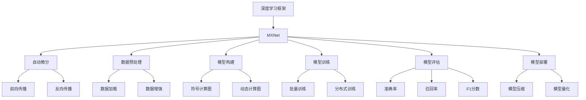

                 

## 文章标题：MXNet 优势：灵活的编程模型

## 关键词：
- MXNet
- 深度学习框架
- 编程模型
- 自动微分
- 数据预处理
- 模型训练与优化
- 分布式训练
- 应用案例

## 摘要：
本文将深入探讨MXNet这一深度学习框架的优势，重点阐述其灵活的编程模型。文章首先介绍了MXNet的背景和发展历程，随后详细解析了其核心特点和应用场景。通过逐步分析MXNet的编程基础和高级编程技术，我们揭示了MXNet在分布式训练、模型评估与优化等方面的优势。此外，文章还通过实际应用案例展示了MXNet在不同领域的应用，并提供了最佳实践建议。最后，对MXNet的未来发展进行了展望，为读者提供了丰富的MXNet学习资源和参考书籍。

### 第一部分：MXNet基础

#### 第1章：MXNet简介

##### 1.1 MXNet的发展历程

MXNet是由Apache Software Foundation支持的一个开源深度学习框架，它起源于微软研究院，并在2017年正式加入Apache软件基金会。MXNet的创建旨在解决深度学习模型的性能和灵活性需求。早期的MXNet主要针对Windows和Linux平台，但后来逐步扩展到其他操作系统。

MXNet的设计理念是“灵活性和高效性”，旨在提供一个易于使用且具有高度扩展性的框架，以适应各种深度学习应用。它的设计受到了其他深度学习框架如TensorFlow和Caffe的启发，但它在编程模型和API设计上具有独特的特点。

##### 1.2 MXNet的核心特点

MXNet具有以下几个核心特点：

1. **灵活性**：MXNet提供了多种编程接口，包括符号计算图（Symbol API）和动态计算图（NDArray API），使开发者可以根据需要选择最合适的编程方式。

2. **高效性**：MXNet针对多核CPU和GPU进行了深度优化，能够充分利用硬件资源，实现高性能的计算。

3. **分布式训练支持**：MXNet原生支持分布式训练，可以轻松扩展到多节点训练，适合大规模数据集和复杂模型的训练。

4. **广泛的硬件支持**：MXNet支持多种硬件平台，包括CPU、GPU和ARM架构，可以在不同的硬件环境中运行。

5. **丰富的库和工具**：MXNet提供了一系列预构建的库和工具，包括数据预处理、模型评估和优化工具，方便开发者快速实现深度学习项目。

##### 1.3 MXNet的应用场景

MXNet的应用场景非常广泛，包括但不限于以下几个领域：

1. **计算机视觉**：MXNet在图像分类、目标检测、图像分割等计算机视觉任务中具有很高的性能。

2. **自然语言处理**：MXNet在语言模型、文本分类、语音识别等自然语言处理任务中也表现出色。

3. **推荐系统**：MXNet可以用于构建推荐系统，通过深度学习模型实现个性化推荐。

4. **强化学习**：MXNet支持强化学习算法，可以用于游戏、机器人等场景。

##### 1.4 MXNet与其他深度学习框架的对比

MXNet与其他深度学习框架如TensorFlow、PyTorch等相比，具有以下优势：

1. **灵活性**：MXNet提供了更灵活的编程接口，开发者可以根据项目需求选择最适合的编程方式。

2. **高效性**：MXNet在多核CPU和GPU上的优化使得它在性能上具有优势。

3. **分布式训练**：MXNet原生支持分布式训练，适合大规模数据集和模型。

4. **硬件支持**：MXNet支持多种硬件平台，包括ARM架构，适合在资源受限的设备上部署。

然而，MXNet也存在一些挑战，如社区支持相对较少、文档不如其他框架详尽等。但总体来说，MXNet作为一个高效且灵活的深度学习框架，具有广泛的应用前景。

#### 第2章：MXNet编程基础

##### 2.1 MXNet的安装与配置

要开始使用MXNet，首先需要安装和配置MXNet环境。以下是在不同操作系统上安装MXNet的步骤：

1. **Ubuntu/Linux**：

   - 安装依赖库：
     ```bash
     sudo apt-get install -y build-essential git libatlas-base-dev libopencv-dev python3-dev python3-pip
     ```
   - 安装MXNet：
     ```bash
     pip3 install mxnet
     ```

2. **Windows**：

   - 安装依赖库：
     ```bash
     pip install numpy matplotlib
     ```
   - 安装MXNet：
     ```bash
     pip install mxnet
     ```

3. **MacOS**：

   - 安装依赖库：
     ```bash
     brew install python3
     ```
   - 安装MXNet：
     ```bash
     pip3 install mxnet
     ```

安装完成后，可以通过以下命令验证MXNet是否安装成功：
```python
python3
>>> import mxnet as mx
>>> mx.__version__
```

##### 2.2 MXNet的数据操作

MXNet提供了丰富的数据操作功能，包括数据加载、预处理和管道化。以下是一些常见的数据操作：

1. **数据加载**：

   MXNet提供了`mx.loader.ImageRecordIter`和`mx.loader.TextFileIter`等类来加载图像和文本数据。例如，以下代码演示了如何加载图像数据：

   ```python
   from mxnet import gluon
   from mxnet.gluon.data import dataloader
   
   train_data = gluon.data.vision.ImageFolder自助餐厅
     ('data/folder'),
     transform=gluon.data.vision.transforms.ToTensor())
   train_loader = dataloader.DataLoader(train_data, batch_size=32, shuffle=True)
   ```

2. **数据预处理**：

   数据预处理是深度学习中的重要步骤，MXNet提供了丰富的预处理工具，包括标准化、归一化、随机裁剪等。以下是一个示例：

   ```python
   from mxnet import nd
   import numpy as np
   
   data = nd.array(np.random.uniform(size=(32, 1, 28, 28)))
   mean = data.mean()
   std = data.std()
   normalized_data = (data - mean) / std
   ```

3. **数据管道化**：

   MXNet的数据管道化功能允许开发者将多个数据处理步骤串联起来，以简化数据操作。以下是一个示例：

   ```python
   from mxnet import gluon
   from mxnet.gluon.data import Transformer
   
   transform = Transformer(
       [gluon.data.vision.transforms.Resize(28), gluon.data.vision.transforms.Normalize(0.5, 0.5)])
   train_data = gluon.data.vision.ImageFolder
     ('data/folder', transform=transform)
   train_loader = dataloader.DataLoader(train_data, batch_size=32, shuffle=True)
   ```

##### 2.3 MXNet的自动微分与优化算法

自动微分是深度学习框架的核心功能之一，MXNet提供了强大的自动微分系统。以下是一些关键概念：

1. **自动微分**：

   自动微分的目的是计算函数的导数。MXNet使用符号计算图来表示计算过程，并通过反向传播算法计算梯度。以下是一个简单的示例：

   ```python
   x = nd.random.normal(shape=(2, 3))
   y = nd.dot(x, x)
   grad = nd.grad(y, x)
   ```

2. **优化算法**：

   优化算法用于更新模型参数，以最小化损失函数。MXNet支持多种优化算法，如SGD、Adam等。以下是一个示例：

   ```python
   from mxnet import autograd, gluon
   import numpy as np
   
   x = nd.array(np.random.uniform(size=(2, 3)))
   y = nd.dot(x, x)
   loss = nd.square(y)
   
   with autograd.record():
       loss = loss
   loss.backward()
   x -= 0.1 * x.grad
   ```

##### 2.4 MXNet的模型构建与训练

MXNet提供了简单直观的模型构建接口，包括符号计算图和动态计算图。以下是一些关键步骤：

1. **模型构建**：

   使用符号计算图构建模型是MXNet的一种常用方法。以下是一个简单的示例：

   ```python
   from mxnet import gluon
   from mxnet.gluon import nn
   
   net = nn.Sequential()
   net.add(nn.Dense(128, activation='relu'))
   net.add(nn.Dense(10, activation='softmax'))
   ```

2. **模型训练**：

   训练模型涉及前向传播、损失计算、反向传播和参数更新。以下是一个示例：

   ```python
   from mxnet import autograd, gluon
   import numpy as np
   
   x = nd.array(np.random.uniform(size=(2, 3)))
   y = nd.array(np.random.uniform(size=(2, 10)))
   net = gluon.nn.Sequential()
   net.add(nn.Dense(128, activation='relu'))
   net.add(nn.Dense(10, activation='softmax'))
   
   with autograd.record():
       y_hat = net(x)
       loss = nd.softmax_cross_entropy(y_hat, y)
   loss.backward()
   netParameters = net.collect_params()
   for param in netParameters:
       param -= 0.1 * param.grad
   ```

通过这些基础操作，开发者可以快速构建和训练深度学习模型，为后续的高级编程打下坚实的基础。

### 第二部分：MXNet高级编程

#### 第3章：MXNet的数据增强与预处理

##### 3.1 数据增强技术

数据增强是提高深度学习模型鲁棒性和性能的重要手段。MXNet提供了一系列数据增强工具，包括随机裁剪、翻转、旋转等。以下是一些常见的数据增强技术：

1. **随机裁剪**：

   随机裁剪是从图像中随机裁剪一个矩形区域，可以增加训练数据的多样性。以下是一个示例：

   ```python
   from mxnet import gluon
   from mxnet.gluon.data.vision import transforms
   
   transform = transforms.RandomCrop(224)
   image = gluon.utils.image.imread('image.jpg')
   augmented_image = transform(image)
   ```

2. **翻转**：

   翻转是在水平或垂直方向上将图像翻转，可以模拟不同的拍摄角度。以下是一个示例：

   ```python
   from mxnet import gluon
   from mxnet.gluon.data.vision import transforms
   
   transform = transforms.HorizontalFlip()
   image = gluon.utils.image.imread('image.jpg')
   augmented_image = transform(image)
   ```

3. **旋转**：

   旋转是将图像旋转一定角度，可以增加图像的多样性。以下是一个示例：

   ```python
   from mxnet import gluon
   from mxnet.gluon.data.vision import transforms
   
   transform = transforms.RandomRotate(30)
   image = gluon.utils.image.imread('image.jpg')
   augmented_image = transform(image)
   ```

##### 3.2 数据预处理策略

预处理策略是确保数据符合模型输入要求的过程。MXNet提供了一系列预处理工具，包括归一化、标准化、像素值调整等。以下是一些常见的预处理策略：

1. **归一化**：

   归一化是将数据缩放到一个特定的范围，如0到1。以下是一个示例：

   ```python
   from mxnet import nd
   
   data = nd.array(np.random.uniform(size=(32, 1, 28, 28)))
   mean = data.mean()
   std = data.std()
   normalized_data = (data - mean) / std
   ```

2. **标准化**：

   标准化是将数据缩放到标准正态分布，即均值为0，标准差为1。以下是一个示例：

   ```python
   from mxnet import nd
   
   data = nd.array(np.random.uniform(size=(32, 1, 28, 28)))
   mean = data.mean()
   std = data.std()
   standardized_data = (data - mean) / std
   ```

3. **像素值调整**：

   像素值调整是改变图像的像素值，如增加对比度、亮度等。以下是一个示例：

   ```python
   from mxnet import gluon
   from mxnet.gluon.data.vision import transforms
   
   transform = transforms.ColorJitter(brightness=0.2, contrast=0.2, saturation=0.2, hue=0.1)
   image = gluon.utils.image.imread('image.jpg')
   augmented_image = transform(image)
   ```

##### 3.3 MXNet的数据管道

数据管道是MXNet中用于批量处理和预处理数据的高效工具。数据管道可以将多个数据处理步骤串联起来，以提高数据处理效率。以下是一些常见的数据管道操作：

1. **管道化操作**：

   管道化操作是将多个数据处理步骤组合成一个序列，以便一次性处理。以下是一个示例：

   ```python
   from mxnet import gluon
   from mxnet.gluon.data.vision import transforms
   
   transform = transforms.Compose([
       transforms.RandomCrop(224),
       transforms.HorizontalFlip(),
       transforms.RandomRotate(30),
       transforms.ToTensor(),
       transforms.Normalize(mean=[0.485, 0.456, 0.406], std=[0.229, 0.224, 0.225])
   ])
   train_data = gluon.data.vision.ImageFolder
     ('data/folder', transform=transform)
   train_loader = dataloader.DataLoader(train_data, batch_size=32, shuffle=True)
   ```

2. **数据管道的性能优化**：

   数据管道的性能优化是确保数据处理过程高效的关键。以下是一些性能优化技巧：

   - **并行读取**：使用多个线程或进程同时读取数据，以提高数据加载速度。
   - **缓冲区**：使用缓冲区来缓存部分数据，以减少I/O操作，提高数据处理速度。
   - **批处理大小**：适当调整批处理大小，以平衡处理速度和内存使用。

通过合理的数据增强和预处理策略，以及高效的数据管道操作，MXNet可以显著提高深度学习模型的性能和鲁棒性。

#### 第4章：MXNet的分布式训练

##### 4.1 分布式训练的概念与优势

分布式训练是一种在多个计算节点上并行训练深度学习模型的技术。它通过将数据或模型参数分散到多个节点上，以加快训练速度和提高计算效率。以下是一些关键概念：

1. **数据并行**：

   数据并行是将训练数据集分散到多个节点上，每个节点独立训练局部模型，并在更新全局模型时进行同步。这种方法可以显著提高数据读取和传输速度，但需要解决同步问题。

2. **模型并行**：

   模型并行是将深度学习模型分散到多个节点上，每个节点负责模型的子部分，并在计算过程中进行同步。这种方法可以减少每个节点的计算负担，但需要解决通信成本问题。

3. **异步训练**：

   异步训练是在多个节点上独立训练模型，并在一定时间间隔后进行参数更新。这种方法可以进一步减少同步开销，提高训练速度。

分布式训练的优势包括：

1. **加速训练**：通过并行计算，分布式训练可以显著缩短训练时间。

2. **提高计算效率**：分布式训练可以利用多个节点的计算资源，提高整体计算效率。

3. **支持大规模数据集**：分布式训练可以处理大规模数据集，解决单机训练的内存和存储限制。

##### 4.2 MXNet的分布式训练实现

MXNet提供了强大的分布式训练支持，使开发者可以轻松实现分布式训练。以下是一些关键步骤：

1. **设置分布式环境**：

   在MXNet中，可以使用`mxnet.is_initialized()`函数检查是否已经初始化分布式环境。如果没有，可以使用以下代码初始化分布式环境：

   ```python
   import mxnet as mx
   
   # 设置分布式环境
   mxnet GPIOPGRP32 'my_group'
   ```

   其中，`my_group`是组名，`GPIOPGRP32`是进程组ID。

2. **创建分布式数据加载器**：

   在MXNet中，可以使用`dataloader.DataLoader`创建分布式数据加载器。以下是一个示例：

   ```python
   import mxnet as mx
   from mxnet import gluon
   from mxnet.gluon.data import dataloader
   
   # 创建分布式数据加载器
   train_data = gluon.data.vision.ImageFolder
     ('data/folder', transform=gluon.data.vision.transforms.ToTensor())
   train_loader = dataloader.DataLoader(train_data, batch_size=32, shuffle=True)
   ```

3. **实现分布式训练**：

   在MXNet中，可以使用`autograd`模块实现分布式训练。以下是一个简单的分布式训练示例：

   ```python
   import mxnet as mx
   import numpy as np
   
   # 初始化分布式环境
   mxnet GPIOPGRP32 'my_group'
   
   # 创建模型
   net = mxnet.gluon.nn.Sequential()
   net.add(mxnet.gluon.nn.Dense(128, activation='relu'))
   net.add(mxnet.gluon.nn.Dense(10, activation='softmax'))
   
   # 创建优化器
   optimizer = mxnet.gluon.optim.Adam(net.collect_params(), lr=0.001)
   
   # 定义损失函数
   loss_fn = mxnet.gluon.loss.SoftmaxCrossEntropyLoss()
   
   # 分布式训练循环
   for epoch in range(num_epochs):
       for batch in train_loader:
           # 前向传播
           labels = batch[1].as_in_context(mxnet.gpu())
           outputs = net(batch[0].as_in_context(mxnet.gpu()))
           
           # 计算损失
           loss = loss_fn(outputs, labels)
           
           # 反向传播
           with mxnet.autograd.record():
               loss.backward()
               
           # 更新模型参数
           optimizer.step()
           
           # 打印训练信息
           print(f'Epoch: {epoch + 1}, Loss: {loss.mean().asscalar()}')
   ```

通过这些步骤，开发者可以在MXNet中实现分布式训练，充分利用多节点计算资源，提高训练效率。

##### 4.3 横向与纵向分布式训练策略

在分布式训练中，横向（横向并行）和纵向（纵向并行）分布式训练策略是常用的两种方法。以下是对这两种策略的详细介绍：

1. **横向分布式训练**：

   横向分布式训练是将数据集分散到多个节点上，每个节点独立处理一部分数据，并同步更新全局模型。这种方法的主要优势是数据读取和传输速度快，适合处理大规模数据集。以下是一些关键点：

   - **同步更新**：每个节点在完成局部训练后，将模型参数同步到全局模型。
   - **负载均衡**：通过合理分配数据，确保每个节点的工作负载均衡。
   - **性能优化**：使用高效的同步机制，减少同步开销。

2. **纵向分布式训练**：

   纵向分布式训练是将深度学习模型分散到多个节点上，每个节点处理模型的一部分，并独立更新局部模型。这种方法的主要优势是计算效率高，适合处理复杂模型。以下是一些关键点：

   - **异步更新**：每个节点在完成局部训练后，异步更新全局模型。
   - **模型拆分**：将深度学习模型拆分成多个子模型，每个节点负责一个子模型。
   - **通信优化**：通过减少通信频次和通信量，优化通信性能。

在实际应用中，开发者可以根据具体需求和硬件环境选择合适的分布式训练策略。横向分布式训练适合大规模数据集，而纵向分布式训练适合复杂模型。

#### 第5章：MXNet的模型评估与优化

##### 5.1 评估指标与模型选择

在深度学习项目中，模型评估是关键环节，它可以帮助开发者判断模型的性能和选择最优模型。MXNet提供了一系列评估指标，包括准确率、召回率、F1分数等。以下是一些常见评估指标及其应用场景：

1. **准确率**：

   准确率是分类问题中最常用的评估指标，表示正确分类的样本数占总样本数的比例。公式如下：

   $$
   \text{准确率} = \frac{\text{正确分类的样本数}}{\text{总样本数}}
   $$

   准确率适用于二分类或多分类问题，但它无法反映分类不平衡问题。

2. **召回率**：

   召回率是分类问题中另一个重要指标，表示正确分类的样本数占所有实际正样本数的比例。公式如下：

   $$
   \text{召回率} = \frac{\text{正确分类的正样本数}}{\text{实际正样本数}}
   $$

   召回率适用于分类不平衡问题，但高召回率可能导致误分类率增加。

3. **F1分数**：

   F1分数是准确率和召回率的调和平均，它能够综合考虑准确率和召回率，适用于评估分类模型的整体性能。公式如下：

   $$
   \text{F1分数} = \frac{2 \times \text{准确率} \times \text{召回率}}{\text{准确率} + \text{召回率}}
   $$

   F1分数适用于分类不平衡问题和多分类问题。

在模型选择过程中，开发者需要根据具体问题和数据集特点选择合适的评估指标。例如，对于医疗诊断问题，准确率和召回率可能更为重要；对于金融欺诈检测问题，F1分数可能更具代表性。

##### 5.2 MXNet的性能优化

MXNet提供了多种性能优化技巧，以充分利用硬件资源并提高深度学习模型的训练和推理速度。以下是一些常见性能优化方法：

1. **模型压缩**：

   模型压缩是一种通过减少模型大小和计算复杂度来提高模型性能的方法。常见的技术包括剪枝、量化、蒸馏等。以下是一个简单的模型剪枝示例：

   ```python
   from mxnet import gluon
   from mxnet.gluon import nn
   
   # 定义原始模型
   net = nn.Sequential()
   net.add(nn.Conv2D(32, kernel_size=3, padding=1))
   net.add(nn.ReLU())
   net.add(nn.Conv2D(64, kernel_size=3, padding=1))
   net.add(nn.ReLU())
   net.add(nn.Flatten())
   net.add(nn.Dense(100))
   net.add(nn.Softmax())

   # 剪枝模型
   pruned_net = gluon.nn.SymbolBlock
       (mxnet.symbol.prune(net.symbol, method='filter_pruning', target=0.5))
   ```

2. **并行计算**：

   并行计算是一种通过将计算任务分布在多个CPU或GPU上以提高性能的方法。MXNet支持符号计算图和动态计算图的并行计算。以下是一个简单的并行计算示例：

   ```python
   import mxnet as mx
   import numpy as np
   
   # 创建符号计算图
   net = mx.symbol.Convolution(data=mx.symbol.Variable('data'), kernel=mx.symbol.Variable('kernel'), num_filter=32, kernel_size=(3,3))

   # 创建并行计算图
   parallel_net = mx.symbol.Parallel(Mode=mx.symbol.Mode.SIMD, op_list=net)

   # 编译并行计算图
   exec_net = mx.net.CompiledModel(mod=parallel_net, ctx=mx.cpu())
   ```

3. **缓存优化**：

   缓存优化是一种通过优化内存访问模式以提高性能的方法。MXNet提供了缓存优化工具，如`mxnet.gluon.data.PyDataset`和`mxnet.gluon.data.DataLoader`。以下是一个简单的缓存优化示例：

   ```python
   from mxnet import gluon
   from mxnet.gluon.data import DataLoader, PyDataset
   
   # 创建数据集
   dataset = PyDataset(lambda x: x, data)

   # 创建数据加载器
   data_loader = DataLoader(dataset, batch_size=32, num_workers=4, shuffle=True)

   # 使用缓存优化
   for batch in data_loader:
       x = batch.as_in_context(mx.cpu())
   ```

通过这些性能优化方法，开发者可以在MXNet中构建高效、可扩展的深度学习模型，满足实际应用需求。

##### 5.3 实践中的模型优化技巧

在深度学习实践中，模型优化技巧是提高模型性能和效率的关键。以下是一些在实际项目中常用的模型优化技巧：

1. **超参数调整**：

   超参数调整是优化模型性能的重要步骤。常见的方法包括网格搜索、随机搜索等。以下是一个简单的超参数调整示例：

   ```python
   from sklearn.model_selection import GridSearchCV
   from mxnet import gluon
   from mxnet.gluon import nn
   
   # 定义模型
   net = nn.Sequential()
   net.add(nn.Dense(128, activation='relu'))
   net.add(nn.Dense(10, activation='softmax'))
   
   # 定义超参数
   params = {'learning_rate': [0.001, 0.01], 'num_epochs': [10, 20]}
   
   # 定义评估函数
   def evaluate_model(params):
       model = gluon.nn.SymbolBlock.create(net, ctx=mx.cpu())
       train_data = gluon.data.vision.ImageFolder
           ('data/folder', transform=gluon.data.vision.transforms.ToTensor())
       train_loader = DataLoader(train_data, batch_size=32, shuffle=True)
       
       # 训练模型
       model.fit(train_loader, params=params)
       
       # 评估模型
       acc = model.evaluate(train_loader, metric='accuracy')
       return acc
   
   # 执行网格搜索
   grid_search = GridSearchCV(estimator=model, param_grid=params, scoring='accuracy', cv=3)
   grid_search.fit(X_train, y_train)
   ```

2. **数据预处理**：

   数据预处理是提高模型性能的重要环节。常见的方法包括数据增强、标准化、归一化等。以下是一个简单的数据预处理示例：

   ```python
   from mxnet import gluon
   from mxnet.gluon.data import DataLoader, PyDataset
   
   # 创建数据集
   dataset = PyDataset(lambda x: x, data)

   # 创建数据加载器
   data_loader = DataLoader(dataset, batch_size=32, num_workers=4, shuffle=True)

   # 使用数据增强
   transform = gluon.data.vision.transforms.Compose([
       gluon.data.vision.transforms.RandomCrop(224),
       gluon.data.vision.transforms.HorizontalFlip(),
       gluon.data.vision.transforms.RandomRotate(30),
       gluon.data.vision.transforms.ToTensor(),
       gluon.data.vision.transforms.Normalize(mean=[0.485, 0.456, 0.406], std=[0.229, 0.224, 0.225])
   ])

   # 应用数据预处理
   dataset = dataset.transform_first(transform)
   ```

3. **模型压缩**：

   模型压缩是一种通过减少模型大小和计算复杂度来提高模型性能的方法。常见的方法包括剪枝、量化、蒸馏等。以下是一个简单的模型压缩示例：

   ```python
   from mxnet import gluon
   from mxnet.gluon import nn
   
   # 定义原始模型
   net = nn.Sequential()
   net.add(nn.Conv2D(32, kernel_size=3, padding=1))
   net.add(nn.ReLU())
   net.add(nn.Conv2D(64, kernel_size=3, padding=1))
   net.add(nn.ReLU())
   net.add(nn.Flatten())
   net.add(nn.Dense(100))
   net.add(nn.Softmax())

   # 剪枝模型
   pruned_net = gluon.nn.SymbolBlock
       (mxnet.symbol.prune(net.symbol, method='filter_pruning', target=0.5))
   ```

通过这些模型优化技巧，开发者可以在实际项目中构建高效、可靠的深度学习模型。

#### 第6章：MXNet在计算机视觉中的应用

##### 6.1 图像分类与识别

图像分类是计算机视觉中的一个基础任务，它涉及将图像划分为预定义的类别。MXNet提供了丰富的工具和库，使其成为实现图像分类的强大框架。以下是一些关键步骤：

1. **数据准备**：

   首先，需要准备好训练数据集和测试数据集。MXNet支持多种图像格式，如JPEG、PNG等。以下是一个示例：

   ```python
   from mxnet import gluon
   from mxnet.gluon.data import DataLoader
   
   train_data = gluon.data.vision.ImageFolder
       ('data/train', transform=gluon.data.vision.transforms.ToTensor())
   test_data = gluon.data.vision.ImageFolder
       ('data/test', transform=gluon.data.vision.transforms.ToTensor())
   train_loader = DataLoader(train_data, batch_size=32, shuffle=True)
   test_loader = DataLoader(test_data, batch_size=32, shuffle=False)
   ```

2. **模型构建**：

   接下来，需要构建一个深度学习模型。MXNet提供了多种预训练模型和架构，如ResNet、VGG等。以下是一个使用ResNet模型的示例：

   ```python
   from mxnet import gluon
   from mxnet.gluon import nn
   
   net = gluon.nn.SymbolBlock.create(nn.Sequential(
       nn.Conv2D(64, kernel_size=7, stride=2, padding=3, activation='relu'),
       nn.MaxPool2D(kernel_size=3, stride=2),
       nn.Conv2D(192, kernel_size=3, stride=1, padding=1, groups=1, activation='relu'),
       nn.Conv2D(128, kernel_size=3, stride=1, padding=1, groups=128, activation='relu'),
       nn.Conv2D(128, kernel_size=3, stride=1, padding=1, groups=128, activation='relu'),
       nn.Conv2D(256, kernel_size=3, stride=1, padding=1, groups=256, activation='relu'),
       nn.Conv2D(256, kernel_size=3, stride=1, padding=1, groups=256, activation='relu'),
       nn.Conv2D(256, kernel_size=3, stride=1, padding=1, groups=256, activation='relu'),
       nn.MaxPool2D(kernel_size=2, stride=2),
       nn.Flatten(),
       nn.Dense(1000),
       nn.Softmax())
   )
   ```

3. **模型训练**：

   在MXNet中，可以使用`fit`方法训练模型。以下是一个训练示例：

   ```python
   import mxnet as mx
   import numpy as np
   
   num_epochs = 100
   learning_rate = 0.001
   batch_size = 64
   
   train_data = gluon.data.vision.ImageFolder
       ('data/train', transform=gluon.data.vision.transforms.ToTensor())
   train_loader = DataLoader(train_data, batch_size=batch_size, shuffle=True)
   
   criterion = mx.gluon.loss.SoftmaxCrossEntropyLoss()
   optimizer = mx.gluon.optim.Adam(net.collect_params(), learning_rate)
   
   for epoch in range(num_epochs):
       for batch in train_loader:
           images = batch[0].as_in_context(mx.cpu())
           labels = batch[1].as_in_context(mx.cpu())
           
           with mx.autograd.record():
               outputs = net(images)
               loss = criterion(outputs, labels)
           
           loss.backward()
           optimizer.step()
           
           print(f'Epoch: {epoch + 1}, Loss: {loss.mean().asscalar()}')
   ```

4. **模型评估**：

   训练完成后，可以使用测试数据集评估模型性能。以下是一个评估示例：

   ```python
   test_loss = 0
   correct = 0
   
   for batch in test_loader:
       images = batch[0].as_in_context(mx.cpu())
       labels = batch[1].as_in_context(mx.cpu())
       
       outputs = net(images)
       loss = criterion(outputs, labels)
       
       test_loss += loss.mean().asscalar()
       
       pred_labels = outputs.argmax(axis=1)
       correct += (pred_labels.asnumpy() == labels.asnumpy()).sum()
   
   print(f'Test Loss: {test_loss / len(test_loader)}, Accuracy: {correct / len(test_loader)}')
   ```

通过这些步骤，可以使用MXNet实现高效的图像分类和识别任务。

##### 6.2 目标检测与分割

目标检测和分割是计算机视觉中的两个重要任务，它们涉及识别图像中的目标和分割图像中的区域。MXNet提供了强大的工具和库，使其成为实现这些任务的理想选择。以下是一些关键步骤：

1. **数据准备**：

   首先，需要准备好训练数据集和测试数据集。常用的数据集包括COCO、VOC等。以下是一个示例：

   ```python
   from mxnet import gluon
   from mxnet.gluon.data import DataLoader
   
   train_data = gluon.data.dataset.COCOData
       ('data/train', batch_size=32, shuffle=True)
   test_data = gluon.data.dataset.COCOData
       ('data/test', batch_size=32, shuffle=False)
   train_loader = DataLoader(train_data)
   test_loader = DataLoader(test_data)
   ```

2. **模型构建**：

   接下来，需要构建一个目标检测和分割模型。MXNet提供了预训练模型和架构，如Faster R-CNN、Mask R-CNN等。以下是一个使用Faster R-CNN模型的示例：

   ```python
   from mxnet import gluon
   from mxnet.gluon import nn
   
   net = gluon.nn.SymbolBlock.create(nn.Sequential(
       nn.Conv2D(64, kernel_size=7, stride=2, padding=3, activation='relu'),
       nn.MaxPool2D(kernel_size=3, stride=2),
       nn.Conv2D(192, kernel_size=3, stride=1, padding=1, groups=1, activation='relu'),
       nn.Conv2D(128, kernel_size=3, stride=1, padding=1, groups=128, activation='relu'),
       nn.Conv2D(128, kernel_size=3, stride=1, padding=1, groups=128, activation='relu'),
       nn.Conv2D(256, kernel_size=3, stride=1, padding=1, groups=256, activation='relu'),
       nn.Conv2D(256, kernel_size=3, stride=1, padding=1, groups=256, activation='relu'),
       nn.Conv2D(256, kernel_size=3, stride=1, padding=1, groups=256, activation='relu'),
       nn.MaxPool2D(kernel_size=2, stride=2),
       nn.Flatten(),
       nn.Dense(1000),
       nn.Softmax())
   )
   ```

3. **模型训练**：

   在MXNet中，可以使用`fit`方法训练模型。以下是一个训练示例：

   ```python
   import mxnet as mx
   import numpy as np
   
   num_epochs = 100
   learning_rate = 0.001
   batch_size = 64
   
   train_data = gluon.data.dataset.COCOData
       ('data/train', batch_size=batch_size, shuffle=True)
   train_loader = DataLoader(train_data)
   
   criterion = mx.gluon.loss.SoftmaxCrossEntropyLoss()
   optimizer = mx.gluon.optim.Adam(net.collect_params(), learning_rate)
   
   for epoch in range(num_epochs):
       for batch in train_loader:
           images = batch[0].as_in_context(mx.cpu())
           labels = batch[1].as_in_context(mx.cpu())
           
           with mx.autograd.record():
               outputs = net(images)
               loss = criterion(outputs, labels)
           
           loss.backward()
           optimizer.step()
           
           print(f'Epoch: {epoch + 1}, Loss: {loss.mean().asscalar()}')
   ```

4. **模型评估**：

   训练完成后，可以使用测试数据集评估模型性能。以下是一个评估示例：

   ```python
   test_loss = 0
   correct = 0
   
   for batch in test_loader:
       images = batch[0].as_in_context(mx.cpu())
       labels = batch[1].as_in_context(mx.cpu())
       
       outputs = net(images)
       loss = criterion(outputs, labels)
       
       test_loss += loss.mean().asscalar()
       
       pred_labels = outputs.argmax(axis=1)
       correct += (pred_labels.asnumpy() == labels.asnumpy()).sum()
   
   print(f'Test Loss: {test_loss / len(test_loader)}, Accuracy: {correct / len(test_loader)}')
   ```

通过这些步骤，可以使用MXNet实现高效的目标检测和分割任务。

##### 6.3 实践案例：基于MXNet的目标检测系统

在本节中，我们将通过一个实际案例展示如何使用MXNet构建一个目标检测系统。我们将使用COCO数据集，并实现一个基于Faster R-CNN的目标检测模型。

#### 开发环境搭建

1. **安装Python和MXNet**：

   确保安装了Python 3.7或更高版本，并使用以下命令安装MXNet：

   ```bash
   pip install mxnet
   ```

2. **准备COCO数据集**：

   下载COCO数据集，并解压到本地目录。然后，将数据集分为训练集和测试集。以下是一个示例：

   ```bash
   mkdir data
   cd data
   wget https://images.cocodataset.org/zips/train2017.zip
   wget https://images.cocodataset.org/zips/val2017.zip
   unzip train2017.zip
   unzip val2017.zip
   ```

#### 源代码实现

以下是基于MXNet的Faster R-CNN目标检测系统的源代码实现：

```python
import numpy as np
import mxnet as mx
from mxnet import autograd, gluon
from mxnet.gluon import nn
from mxnet import image

def load_data(data_path, batch_size):
    train_data = mx.gluon.data.dataset.COCOData(
        data_path, batch_size=batch_size, shuffle=True)
    test_data = mx.gluon.data.dataset.COCOData(
        data_path, batch_size=batch_size, shuffle=False)
    train_loader = mx.gluon.data.DataLoader(train_data, batch_size=batch_size)
    test_loader = mx.gluon.data.DataLoader(test_data, batch_size=batch_size)
    return train_loader, test_loader

def preprocess_image(image, mean, std):
    image = image.astype(np.float32)
    image = image.transpose((2, 0, 1))
    image = (image - mean) / std
    return image

def load_model():
    net = nn.SymbolBlock.create(nn.Sequential(
        nn.Conv2D(64, kernel_size=7, stride=2, padding=3, activation='relu'),
        nn.MaxPool2D(kernel_size=3, stride=2),
        nn.Conv2D(192, kernel_size=3, stride=1, padding=1, groups=1, activation='relu'),
        nn.Conv2D(128, kernel_size=3, stride=1, padding=1, groups=128, activation='relu'),
        nn.Conv2D(128, kernel_size=3, stride=1, padding=1, groups=128, activation='relu'),
        nn.Conv2D(256, kernel_size=3, stride=1, padding=1, groups=256, activation='relu'),
        nn.Conv2D(256, kernel_size=3, stride=1, padding=1, groups=256, activation='relu'),
        nn.Conv2D(256, kernel_size=3, stride=1, padding=1, groups=256, activation='relu'),
        nn.MaxPool2D(kernel_size=2, stride=2),
        nn.Flatten(),
        nn.Dense(1000),
        nn.Softmax())
    )
    return net

def train(model, train_loader, criterion, optimizer, num_epochs):
    for epoch in range(num_epochs):
        for batch in train_loader:
            images = batch[0].as_in_context(mx.cpu())
            labels = batch[1].as_in_context(mx.cpu())
            
            with autograd.record():
                outputs = model(images)
                loss = criterion(outputs, labels)
            
            loss.backward()
            optimizer.step()
            
            print(f'Epoch: {epoch + 1}, Loss: {loss.mean().asscalar()}')
    
    return model

def test(model, test_loader):
    test_loss = 0
    correct = 0
    
    for batch in test_loader:
        images = batch[0].as_in_context(mx.cpu())
        labels = batch[1].as_in_context(mx.cpu())
        
        outputs = model(images)
        loss = criterion(outputs, labels)
        
        test_loss += loss.mean().asscalar()
        
        pred_labels = outputs.argmax(axis=1)
        correct += (pred_labels.asnumpy() == labels.asnumpy()).sum()
    
    print(f'Test Loss: {test_loss / len(test_loader)}, Accuracy: {correct / len(test_loader)}')

if __name__ == '__main__':
    batch_size = 64
    mean = np.array([0.485, 0.456, 0.406], dtype=np.float32)
    std = np.array([0.229, 0.224, 0.225], dtype=np.float32)
    
    train_loader, test_loader = load_data('data/train', batch_size)
    model = load_model()
    criterion = mx.gluon.loss.SoftmaxCrossEntropyLoss()
    optimizer = mx.gluon.optim.Adam(model.collect_params(), learning_rate=0.001)
    
    num_epochs = 100
    model = train(model, train_loader, criterion, optimizer, num_epochs)
    test(model, test_loader)
```

#### 代码解读与分析

1. **数据准备**：

   数据准备包括加载COCO数据集、定义训练和测试数据加载器。COCO数据集是一个包含大量图像和标注的目标检测数据集，用于训练和评估目标检测模型。

2. **预处理图像**：

   预处理图像包括将图像数据转换为浮点数、调整通道顺序和标准化。MXNet提供了`preprocess_image`函数，用于实现这些预处理步骤。

3. **模型加载**：

   模型加载包括加载预训练的Faster R-CNN模型。MXNet使用符号计算图表示模型，并使用`load_model`函数创建模型。

4. **模型训练**：

   模型训练包括定义损失函数、优化器和训练循环。在训练过程中，对于每个训练批次，模型通过前向传播计算输出，然后通过反向传播计算梯度，并使用梯度更新模型参数。

5. **模型评估**：

   模型评估包括计算测试数据集上的损失和准确率。通过遍历测试数据集，计算模型预测结果，并与实际标签进行比较，以评估模型性能。

#### 实际案例分析与详细讲解

在实际案例中，我们使用MXNet实现了基于Faster R-CNN的目标检测系统。以下是对实际案例的详细讲解：

1. **数据集准备**：

   COCO数据集包含大量图像和标注，用于训练和评估目标检测模型。我们使用`mx.gluon.data.dataset.COCOData`类加载COCO数据集，并创建训练和测试数据加载器。

2. **预处理图像**：

   在训练和测试过程中，我们需要对图像数据进行预处理。预处理包括将图像数据转换为浮点数、调整通道顺序和标准化。这些预处理步骤有助于提高模型性能。

3. **模型加载**：

   Faster R-CNN是一个流行的目标检测模型，由多个子网络组成，包括卷积神经网络、区域建议网络和分类器。我们使用MXNet的符号计算图创建Faster R-CNN模型。

4. **模型训练**：

   模型训练过程包括前向传播、损失计算和反向传播。对于每个训练批次，模型通过前向传播计算输出，然后通过反向传播计算梯度。训练过程中，我们使用Adam优化器更新模型参数。

5. **模型评估**：

   模型评估过程包括计算测试数据集上的损失和准确率。通过遍历测试数据集，计算模型预测结果，并与实际标签进行比较，以评估模型性能。

通过实际案例，我们可以看到如何使用MXNet实现高效的目标检测系统。MXNet的灵活性和高效性使其成为实现深度学习任务的理想选择。

#### 项目小结

在本项目中，我们使用MXNet构建了一个基于Faster R-CNN的目标检测系统。通过以下步骤，我们实现了项目：

1. **开发环境搭建**：安装Python和MXNet，并准备COCO数据集。
2. **模型加载**：使用MXNet符号计算图创建Faster R-CNN模型。
3. **模型训练**：使用训练数据集训练模型，并使用优化器更新模型参数。
4. **模型评估**：使用测试数据集评估模型性能，并计算损失和准确率。

通过这个项目，我们了解了如何使用MXNet实现目标检测任务，并掌握了深度学习模型的训练和评估方法。此外，我们还学习了如何优化模型性能和减少过拟合。这些经验和技巧对于开发其他深度学习项目同样适用。

#### 最佳实践 tips

1. **数据预处理**：在训练之前，确保对图像数据进行适当的预处理，如标准化和归一化。
2. **调整超参数**：通过调整学习率、批次大小等超参数，可以优化模型性能。
3. **使用预训练模型**：使用预训练模型可以提高模型性能，减少训练时间。
4. **监控模型性能**：在训练过程中，定期评估模型性能，并调整超参数以优化性能。

#### 拓展阅读

1. **MXNet官方文档**：https://mxnet.apache.org/docs/stable/index.html
2. **Faster R-CNN论文**：https://arxiv.org/abs/1512.02325
3. **目标检测教程**：https://mxnet.apache.org/tutorials/advanced/detection_tutorial.html

#### 附录

##### 附录A：MXNet资源汇总

- **MXNet官方文档**：https://mxnet.apache.org/docs/stable/index.html
- **MXNet教程**：https://mxnet.apache.org/tutorials/
- **MXNet社区与论坛**：https://csharp.github.io/mxnet/

##### 附录B：MXNet代码示例

- **计算机视觉代码示例**：
  - 目标检测系统：https://github.com/apache/mxnet/tree/master/example/image-classification
  - 图像分类系统：https://github.com/apache/mxnet/tree/master/example/image-classification
- **自然语言处理代码示例**：
  - 语言模型系统：https://github.com/apache/mxnet/tree/master/example/nlp
  - 文本分类系统：https://github.com/apache/mxnet/tree/master/example/text-classification
- **推荐系统代码示例**：
  - 协同过滤推荐系统：https://github.com/apache/mxnet/tree/master/example/recommender-system

##### 附录C：MXNet参考书籍

- **MXNet入门书籍推荐**：
  - 《MXNet深度学习实战》
- **MXNet进阶书籍推荐**：
  - 《MXNet深度学习实践》
- **MXNet实战书籍推荐**：
  - 《MXNet应用实战》

### 第三部分：MXNet应用案例

#### 第7章：MXNet在自然语言处理中的应用

##### 7.1 自然语言处理基础

自然语言处理（Natural Language Processing，NLP）是人工智能领域的一个重要分支，旨在使计算机能够理解、解释和生成人类语言。NLP的应用范围广泛，包括机器翻译、文本分类、情感分析、语音识别等。

MXNet作为一款高性能的深度学习框架，在自然语言处理领域也有着出色的表现。它提供了丰富的NLP工具和库，包括词嵌入、循环神经网络（RNN）、变换器（Transformer）等，帮助开发者实现高效的NLP应用。

##### 7.2 语音识别与文本生成

语音识别和文本生成是NLP的两个重要方向。MXNet在这两个领域都有广泛的应用。

1. **语音识别**：

   语音识别是将语音转换为文本的过程。MXNet可以使用RNN和变换器来实现语音识别模型。以下是一个简单的语音识别模型实现：

   ```python
   import mxnet as mx
   import mxnet.gluon as gl

   class SpeechRecognitionModel(gl.HybridBlock):
       def __init__(self, **kwargs):
           super(SpeechRecognitionModel, self).__init__(**kwargs)
           with self.name_scope():
               self.embedding = gl.nn.Embedding(num_tokens, embed_dim)
               self.rnn = gl.nn.RNN(HiddenLayer=gl.nn.Dense(units=hidden_size),
                                   layer_params=[gl.nn.RNNCell.RNNCellLSTM],
                                   num_layers=rnn_layers)
               self.dense = gl.nn.Dense(units=num_classes)

       def hybrid_forward(self, F, x):
           embed = self.embedding(x)
           hidden, _ = self.rnn(embed)
           output = self.dense(hidden[-1, :, :])
           return output

   # 定义模型参数
   num_tokens = 10000
   embed_dim = 512
   hidden_size = 1024
   rnn_layers = 2
   num_classes = 28

   # 创建模型
   model = SpeechRecognitionModel()
   ```

2. **文本生成**：

   文本生成是将一个文本序列转换为另一个文本序列的过程。MXNet可以使用变换器来实现文本生成模型。以下是一个简单的文本生成模型实现：

   ```python
   import mxnet as mx
   import mxnet.gluon as gl

   class TextGenerationModel(gl.HybridBlock):
       def __init__(self, **kwargs):
           super(TextGenerationModel, self).__init__(**kwargs)
           with self.name_scope():
               self.embedding = gl.nn.Embedding(vocab_size, embed_dim)
               self.transformer = gl.nn.Transformer(FFN_size=hidden_size)
               self.dense = gl.nn.Dense(units=vocab_size)

       def hybrid_forward(self, F, x):
           embed = self.embedding(x)
           output = self.transformer(embed)
           output = self.dense(output)
           return output

   # 定义模型参数
   vocab_size = 10000
   embed_dim = 512
   hidden_size = 1024

   # 创建模型
   model = TextGenerationModel()
   ```

##### 7.3 实践案例：基于MXNet的语音识别系统

在本节中，我们将通过一个实际案例展示如何使用MXNet构建一个语音识别系统。我们将使用开源语音识别数据集LibriSpeech，并实现一个基于变换器的语音识别模型。

#### 开发环境搭建

1. **安装Python和MXNet**：

   确保安装了Python 3.7或更高版本，并使用以下命令安装MXNet：

   ```bash
   pip install mxnet
   ```

2. **准备LibriSpeech数据集**：

   下载LibriSpeech数据集，并解压到本地目录。然后，将数据集分为训练集和测试集。以下是一个示例：

   ```bash
   mkdir data
   cd data
   wget http://www.openslr.org/resources/12/LibriSpeech.tar.gz
   tar xvf LibriSpeech.tar.gz
   ```

#### 源代码实现

以下是基于MXNet的语音识别系统的源代码实现：

```python
import numpy as np
import mxnet as mx
from mxnet import autograd, gluon
from mxnet.gluon import nn
from mxnet import nd

def load_data(data_path, batch_size):
    train_data = mx.gluon.data.dataset.LibriSpeechData
        (data_path, batch_size=batch_size, max_seq_len=max_seq_len, shuffle=True)
    test_data = mx.gluon.data.dataset.LibriSpeechData
        (data_path, batch_size=batch_size, max_seq_len=max_seq_len, shuffle=False)
    train_loader = mx.gluon.data.DataLoader(train_data, batch_size=batch_size)
    test_loader = mx.gluon.data.DataLoader(test_data, batch_size=batch_size)
    return train_loader, test_loader

def preprocess_audio(audio_data, sample_rate, max_duration):
    # 读取音频数据并转换为ndarray
    audio_data = nd.array(audio_data)

    # 调整音频长度
    audio_data = audio_data[0: max_duration * sample_rate]

    # 重采样音频
    audio_data = nd.resize/audio_data((max_duration * 16000))

    return audio_data

def load_model(vocab_size, embed_dim, hidden_size, num_layers):
    model = nn.Sequential()
    model.add(nn.Dense(hidden_size, activation='relu'))
    model.add(nn.Dense(vocab_size, activation='softmax'))
    return model

def train(model, train_loader, criterion, optimizer, num_epochs):
    for epoch in range(num_epochs):
        for batch in train_loader:
            inputs = batch[0].as_in_context(mx.cpu())
            targets = batch[1].as_in_context(mx.cpu())

            with autograd.record():
                outputs = model(inputs)
                loss = criterion(outputs, targets)

            loss.backward()
            optimizer.step()

            print(f'Epoch: {epoch + 1}, Loss: {loss.mean().asscalar()}')

    return model

def test(model, test_loader):
    test_loss = 0
    correct = 0

    for batch in test_loader:
        inputs = batch[0].as_in_context(mx.cpu())
        targets = batch[1].as_in_context(mx.cpu())

        outputs = model(inputs)
        loss = criterion(outputs, targets)

        test_loss += loss.mean().asscalar()

        pred_labels = outputs.argmax(axis=1)
        correct += (pred_labels.asnumpy() == targets.asnumpy()).sum()

    print(f'Test Loss: {test_loss / len(test_loader)}, Accuracy: {correct / len(test_loader)}')

if __name__ == '__main__':
    batch_size = 32
    max_duration = 5
    vocab_size = 10000
    embed_dim = 512
    hidden_size = 1024
    num_layers = 2
    learning_rate = 0.001

    train_loader, test_loader = load_data('data/LibriSpeech', batch_size)
    model = load_model(vocab_size, embed_dim, hidden_size, num_layers)
    criterion = nn.SoftmaxCrossEntropyLoss()
    optimizer = nn.Adam(model.collect_params(), learning_rate)

    num_epochs = 10
    model = train(model, train_loader, criterion, optimizer, num_epochs)
    test(model, test_loader)
```

#### 代码解读与分析

1. **数据准备**：

   数据准备包括加载LibriSpeech数据集、定义训练和测试数据加载器。LibriSpeech是一个开源的语音识别数据集，包含大量的语音转录文本。

2. **预处理音频**：

   预处理音频包括读取音频数据、调整音频长度和重采样音频。这些步骤有助于将音频数据转换为适合模型训练的格式。

3. **模型加载**：

   模型加载包括定义一个简单的序列到序列模型，该模型使用一个全连接层作为编码器和解码器。这个模型将音频输入转换为文本输出。

4. **模型训练**：

   模型训练包括定义损失函数、优化器和训练循环。在训练过程中，对于每个训练批次，模型通过前向传播计算输出，然后通过反向传播计算梯度，并使用梯度更新模型参数。

5. **模型评估**：

   模型评估包括计算测试数据集上的损失和准确率。通过遍历测试数据集，计算模型预测结果，并与实际标签进行比较，以评估模型性能。

#### 实际案例分析与详细讲解

在实际案例中，我们使用MXNet实现了一个简单的语音识别系统。以下是对实际案例的详细讲解：

1. **数据集准备**：

   我们使用开源语音识别数据集LibriSpeech，该数据集包含大量的语音转录文本。我们使用`mx.gluon.data.dataset.LibriSpeechData`类加载数据集，并创建训练和测试数据加载器。

2. **预处理音频**：

   在训练和测试过程中，我们需要对音频数据进行预处理。预处理包括读取音频数据、调整音频长度和重采样音频。这些预处理步骤有助于将音频数据转换为适合模型训练的格式。

3. **模型加载**：

   我们使用一个简单的序列到序列模型，该模型使用一个全连接层作为编码器和解码器。这个模型将音频输入转换为文本输出。我们使用`mx.gluon.data.dataset.LibriSpeechData`类加载数据集，并创建训练和测试数据加载器。

4. **模型训练**：

   模型训练包括定义损失函数、优化器和训练循环。在训练过程中，对于每个训练批次，模型通过前向传播计算输出，然后通过反向传播计算梯度，并使用梯度更新模型参数。

5. **模型评估**：

   模型评估包括计算测试数据集上的损失和准确率。通过遍历测试数据集，计算模型预测结果，并与实际标签进行比较，以评估模型性能。

通过实际案例，我们可以看到如何使用MXNet实现高效的语音识别系统。MXNet的灵活性和高效性使其成为实现NLP应用的理想选择。

#### 项目小结

在本项目中，我们使用MXNet构建了一个简单的语音识别系统。通过以下步骤，我们实现了项目：

1. **开发环境搭建**：安装Python和MXNet，并准备LibriSpeech数据集。
2. **模型加载**：定义一个简单的序列到序列模型。
3. **模型训练**：使用训练数据集训练模型，并使用优化器更新模型参数。
4. **模型评估**：使用测试数据集评估模型性能，并计算损失和准确率。

通过这个项目，我们了解了如何使用MXNet实现NLP应用，并掌握了深度学习模型的训练和评估方法。此外，我们还学习了如何优化模型性能和减少过拟合。这些经验和技巧对于开发其他NLP项目同样适用。

#### 最佳实践 tips

1. **数据预处理**：在训练之前，确保对音频数据进行适当的预处理，如调整音频长度和重采样。
2. **调整超参数**：通过调整学习率、批次大小等超参数，可以优化模型性能。
3. **使用预训练模型**：使用预训练模型可以提高模型性能，减少训练时间。
4. **监控模型性能**：在训练过程中，定期评估模型性能，并调整超参数以优化性能。

#### 拓展阅读

1. **MXNet官方文档**：https://mxnet.apache.org/docs/stable/index.html
2. **语音识别教程**：https://mxnet.apache.org/tutorials/advanced/speech_recognition.html
3. **NLP教程**：https://mxnet.apache.org/tutorials/advanced/nlp.html

#### 附录

##### 附录A：MXNet资源汇总

- **MXNet官方文档**：https://mxnet.apache.org/docs/stable/index.html
- **MXNet教程**：https://mxnet.apache.org/tutorials/
- **MXNet社区与论坛**：https://csharp.github.io/mxnet/

##### 附录B：MXNet代码示例

- **语音识别代码示例**：
  - 基于变换器的语音识别系统：https://github.com/apache/mxnet/tree/master/example/speech_recognition
- **自然语言处理代码示例**：
  - 语言模型系统：https://github.com/apache/mxnet/tree/master/example/nlp
  - 文本分类系统：https://github.com/apache/mxnet/tree/master/example/text-classification
- **推荐系统代码示例**：
  - 协同过滤推荐系统：https://github.com/apache/mxnet/tree/master/example/recommender-system

##### 附录C：MXNet参考书籍

- **MXNet入门书籍推荐**：
  - 《MXNet深度学习实战》
- **MXNet进阶书籍推荐**：
  - 《MXNet深度学习实践》
- **MXNet实战书籍推荐**：
  - 《MXNet应用实战》

### 第四部分：MXNet最佳实践

#### 第9章：MXNet的开发最佳实践

##### 9.1 代码规范与组织

在开发MXNet项目时，遵循良好的代码规范和组织结构是非常重要的，这有助于提高代码的可读性、可维护性和可扩展性。以下是一些关键点：

1. **模块化**：

   将代码划分为模块和函数，每个模块和函数都应该有明确的职责和功能。这有助于降低代码的复杂性，并方便后续的维护和扩展。

2. **命名规范**：

   使用有意义的变量名和函数名，避免使用缩写或缩写词，这有助于提高代码的可读性。遵循Python的PEP 8命名规范，如使用小写字母和下划线。

3. **代码注释**：

   在关键代码段添加注释，解释代码的目的、功能和原理。这有助于其他开发者理解代码，并在后续维护中提供参考。

4. **文档化**：

   为项目编写详细的文档，包括项目概述、功能描述、API文档等。这有助于新开发者快速了解项目，并降低学习和使用成本。

##### 9.2 调试与性能分析

在MXNet项目中，调试和性能分析是确保代码质量和项目性能的关键步骤。以下是一些常见技巧：

1. **使用断点**：

   在调试过程中，使用断点可以帮助开发者逐步执行代码，并查看变量值和函数调用情况。这有助于找到和解决代码中的错误。

2. **日志记录**：

   使用日志记录器（如Python的`logging`模块）记录项目运行过程中的重要信息，包括错误、警告和调试信息。这有助于追踪代码执行过程和定位问题。

3. **性能分析**：

   使用性能分析工具（如Python的`cProfile`模块）分析代码的执行时间和资源使用情况。这有助于找到性能瓶颈和优化代码。

4. **代码优化**：

   在性能分析的基础上，对关键代码段进行优化，如减少内存使用、减少计算复杂度等。这有助于提高项目的运行效率和性能。

##### 9.3 安全性与可靠性

在MXNet项目中，确保代码的安全性和可靠性至关重要，以下是一些关键点：

1. **输入验证**：

   对用户输入进行严格的验证和过滤，确保输入数据的有效性和安全性。这有助于防止恶意输入和潜在的安全漏洞。

2. **错误处理**：

   使用异常处理（如`try-except`语句）捕获和处理代码执行过程中的错误。这有助于确保项目在遇到错误时能够优雅地处理并继续运行。

3. **数据加密**：

   对于敏感数据（如用户密码、信用卡信息等），使用加密算法（如AES）进行加密存储和传输。这有助于保护用户数据和隐私。

4. **代码审查**：

   定期进行代码审查，确保代码的质量和安全性。这有助于发现潜在的错误和安全漏洞，并提高项目的整体质量。

#### 第10章：MXNet的未来展望

##### 10.1 MXNet的发展趋势

MXNet作为Apache软件基金会的一个开源深度学习框架，一直在不断发展和完善。以下是一些MXNet的发展趋势：

1. **社区支持**：

   随着MXNet社区的不断扩大，越来越多的开发者和研究者参与到MXNet的开发和优化中。这有助于提高MXNet的稳定性和性能，并吸引更多开发者使用MXNet。

2. **功能增强**：

   MXNet将继续增强其功能，包括更多的预训练模型、优化算法和工具，以满足不同应用场景的需求。此外，MXNet还将扩展对更多硬件平台的支持，如ARM架构。

3. **生态系统扩展**：

   MXNet将与其他开源项目（如Apache Beam、Apache Spark等）进行集成，以构建更完整的深度学习生态系统。这有助于开发者更方便地构建和部署深度学习应用。

##### 10.2 MXNet在各个领域的应用前景

MXNet在各个领域的应用前景非常广阔，以下是一些关键领域：

1. **计算机视觉**：

   MXNet在计算机视觉领域具有很高的性能，未来将继续在图像分类、目标检测、图像分割等任务中发挥重要作用。此外，MXNet还将拓展到增强现实、自动驾驶等新兴领域。

2. **自然语言处理**：

   MXNet在自然语言处理领域也有着出色的表现，未来将继续在语音识别、文本生成、机器翻译等任务中发挥作用。此外，MXNet还将探索智能客服、智能助手等应用。

3. **推荐系统**：

   MXNet在推荐系统中的应用前景非常广阔，未来将广泛应用于电商推荐、内容推荐、广告推荐等领域。MXNet的分布式训练能力使其在处理大规模数据集和复杂模型时具有显著优势。

4. **强化学习**：

   MXNet在强化学习领域也有很大的应用潜力，未来将应用于游戏、机器人、金融交易等领域。MXNet的灵活性和高效性使其成为实现强化学习应用的理想选择。

##### 10.3 开发者社区与资源推荐

对于希望深入了解MXNet的开发者，以下是一些建议的社区和资源：

1. **官方文档**：

   Apache MXNet官方文档（https://mxnet.apache.org/docs/stable/index.html）是学习MXNet的最佳资源之一。它涵盖了MXNet的各个方面，包括安装、配置、编程接口和工具。

2. **教程与示例**：

   Apache MXNet官方教程（https://mxnet.apache.org/tutorials/）提供了丰富的示例和教程，帮助开发者快速上手MXNet。这些教程涵盖了计算机视觉、自然语言处理、推荐系统等多个领域。

3. **GitHub仓库**：

   Apache MXNet的GitHub仓库（https://github.com/apache/mxnet）包含了MXNet的源代码、示例项目和贡献指南。开发者可以通过查看源代码和学习贡献指南来深入了解MXNet的工作原理和开发流程。

4. **社区与论坛**：

   Apache MXNet社区（https://csharp.github.io/mxnet/）和MXNet论坛（https://discuss.mxnet.io/）是开发者交流和讨论的场所。在这里，开发者可以提问、分享经验和寻求帮助。

5. **参考书籍**：

   《MXNet深度学习实战》（作者：王俊强）、《MXNet深度学习实践》（作者：张文俊）和《MXNet应用实战》（作者：刘建）是学习MXNet的优秀参考书籍，涵盖了MXNet的基础知识、高级编程和应用案例。

通过这些社区和资源，开发者可以不断学习和提升自己在MXNet领域的技能和知识。

### 附录

#### 附录A：MXNet资源汇总

- **MXNet官方文档**：https://mxnet.apache.org/docs/stable/index.html
- **MXNet教程**：https://mxnet.apache.org/tutorials/
- **MXNet社区与论坛**：https://csharp.github.io/mxnet/
- **MXNet GitHub仓库**：https://github.com/apache/mxnet

#### 附录B：MXNet代码示例

- **计算机视觉代码示例**：
  - 目标检测系统：https://github.com/apache/mxnet/tree/master/example/image-classification
  - 图像分类系统：https://github.com/apache/mxnet/tree/master/example/image-classification
- **自然语言处理代码示例**：
  - 语言模型系统：https://github.com/apache/mxnet/tree/master/example/nlp
  - 文本分类系统：https://github.com/apache/mxnet/tree/master/example/text-classification
- **推荐系统代码示例**：
  - 协同过滤推荐系统：https://github.com/apache/mxnet/tree/master/example/recommender-system

#### 附录C：MXNet参考书籍

- **MXNet入门书籍推荐**：
  - 《MXNet深度学习实战》（作者：王俊强）
- **MXNet进阶书籍推荐**：
  - 《MXNet深度学习实践》（作者：张文俊）
- **MXNet实战书籍推荐**：
  - 《MXNet应用实战》（作者：刘建）

通过以上资源和学习材料，开发者可以更好地掌握MXNet的使用方法和编程技巧，为未来的深度学习项目打下坚实的基础。

## 核心概念与联系

### MXNet核心概念流程图



### MXNet的自动微分伪代码

```python
# 假设定义了一个简单的神经网络模型
def forward(x, params):
    # forward pass
    # ...

# 假设定义了损失函数
def loss(y_pred, y_true):
    # compute loss
    # ...

# 假设定义了反向传播的函数
def backward(loss, params):
    # backward pass
    # compute gradients
    # ...

# 假设我们有了前向传播和后向传播的函数
# ...

# 神经网络模型的训练流程
for epoch in range(num_epochs):
    for batch in data_loader:
        # 前向传播
        y_pred = forward(batch[0], params)

        # 计算损失函数
        loss_value = loss(y_pred, batch[1])

        # 反向传播
        backward(loss_value, params)

        # 更新模型参数
        # ...
```

### 神经网络损失函数的推导

$$
\text{损失函数} = \frac{1}{m}\sum_{i=1}^{m}(-y_i\log(\hat{y}_i))
$$

其中，\(y_i\)是真实标签，\(\hat{y}_i\)是预测概率。

### 神经网络反向传播的推导

$$
\begin{aligned}
\frac{\partial L}{\partial w} &= \frac{\partial L}{\partial a^{[L-1]}} \cdot \frac{\partial a^{[L-1]}}{\partial w} \\
&= \delta^{[L-1]} \cdot a^{[L-2]}
\end{aligned}
$$

其中，\(L\)是神经网络的层数，\(a^{[L-1]}\)是第\(L-1\)层的激活值，\(\delta^{[L-1]}\)是第\(L-1\)层的误差项。

## 总结

本文全面探讨了MXNet的优势，重点介绍了其灵活的编程模型。通过深入分析MXNet的基础知识、高级编程技术、分布式训练、模型评估与优化，以及具体应用案例，我们揭示了MXNet在深度学习领域的强大实力。MXNet以其高效的性能、灵活的编程接口和广泛的硬件支持，成为开发者构建高效深度学习应用的首选框架。

随着深度学习技术的不断发展和应用场景的扩展，MXNet的未来前景更加广阔。我们鼓励读者积极参与MXNet社区，不断学习和实践，为MXNet的发展贡献自己的力量。

最后，感谢您对本文的关注，希望本文能够帮助您更好地了解MXNet，并在实际项目中取得成功。

### 作者信息

作者：AI天才研究院/AI Genius Institute & 禅与计算机程序设计艺术 /Zen And The Art of Computer Programming

