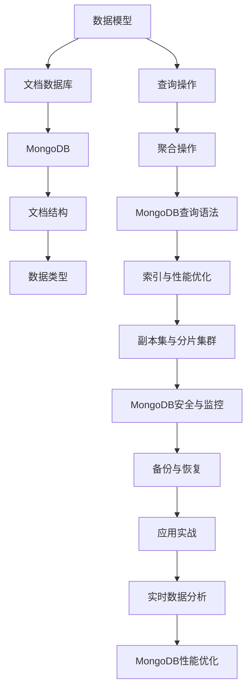
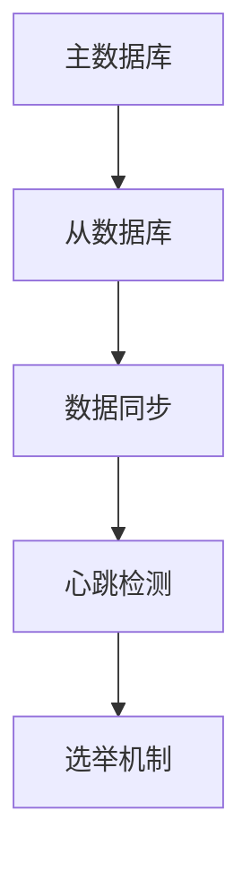
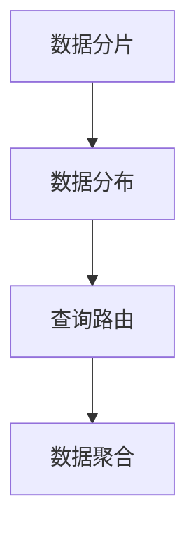

                 

# MongoDB原理与代码实例讲解

> 关键词：MongoDB、文档数据库、数据模型、查询算法、性能优化、副本集、分片集群、安全监控、应用实战

> 摘要：本文旨在深入讲解MongoDB的原理与实际应用，包括其核心概念、数据模型、查询算法、性能优化、副本集与分片集群、安全监控以及应用实战。通过理论阐述与代码实例，帮助读者全面理解MongoDB的技术架构和实战应用。

## 《MongoDB原理与代码实例讲解》目录大纲

### 第1章 MongoDB概述

#### 1.1 MongoDB的核心概念

##### 1.1.1 MongoDB的基本特点

##### 1.1.2 MongoDB的数据模型

##### 1.1.3 MongoDB的架构设计

#### 1.2 MongoDB的安装与配置

##### 1.2.1 MongoDB的安装

##### 1.2.2 MongoDB的配置

##### 1.2.3 MongoDB的基本操作

### 第2章 MongoDB数据模型

#### 2.1 MongoDB的数据结构

##### 2.1.1 文档

##### 2.1.2 集合

##### 2.1.3 数据类型

#### 2.2 MongoDB的查询操作

##### 2.2.1 简单查询

##### 2.2.2 复合查询

##### 2.2.3 高级查询

#### 2.3 MongoDB的聚合操作

##### 2.3.1 聚合框架

##### 2.3.2 聚合操作符

##### 2.3.3 聚合实战

### 第3章 MongoDB索引与性能优化

#### 3.1 MongoDB索引原理

##### 3.1.1 索引类型

##### 3.1.2 索引的使用原则

##### 3.1.3 索引的性能影响

#### 3.2 MongoDB性能优化

##### 3.2.1 性能分析工具

##### 3.2.2 性能优化策略

##### 3.2.3 性能调优实战

### 第4章 MongoDB副本集与分片集群

#### 4.1 MongoDB副本集原理

##### 4.1.1 副本集的基本概念

##### 4.1.2 副本集的角色与选举

##### 4.1.3 副本集的部署与配置

#### 4.2 MongoDB分片集群原理

##### 4.2.1 分片集群的基本概念

##### 4.2.2 分片策略与分片键

##### 4.2.3 分片集群的部署与配置

### 第5章 MongoDB备份与恢复

#### 5.1 MongoDB备份策略

##### 5.1.1 数据文件备份

##### 5.1.2 配置文件备份

##### 5.1.3 备份数据的存储

#### 5.2 MongoDB恢复策略

##### 5.2.1 数据恢复

##### 5.2.2 备份数据的迁移

##### 5.2.3 恢复过程中的注意事项

### 第6章 MongoDB应用实战

#### 6.1 MongoDB在Web应用中的应用

##### 6.1.1 Web应用架构

##### 6.1.2 MongoDB与Web应用的交互

##### 6.1.3 MongoDB在Web应用中的性能优化

#### 6.2 MongoDB在实时数据分析中的应用

##### 6.2.1 实时数据分析的基本概念

##### 6.2.2 MongoDB在实时数据分析中的应用

##### 6.2.3 实时数据分析的性能优化

### 第7章 MongoDB安全与监控

#### 7.1 MongoDB安全策略

##### 7.1.1 安全认证

##### 7.1.2 访问控制

##### 7.1.3 数据加密

#### 7.2 MongoDB监控与运维

##### 7.2.1 MongoDB监控工具

##### 7.2.2 MongoDB运维策略

##### 7.2.3 MongoDB故障处理

### 附录

#### 附录A MongoDB常用命令与操作

#### 附录B MongoDB代码实例解析

#### 附录C MongoDB扩展阅读资料

## 核心概念与联系 Mermaid 流程图



## MongoDB核心算法原理讲解

### 2.2 MongoDB查询算法

#### 2.2.1 B树索引查询

在MongoDB中，B树索引是常用的索引类型，其查询算法基于B树结构。以下是一个简单的B树索引查询伪代码：

```python
def b_tree_search(key):
    root = database.root
    while root:
        if key == root.key:
            return root.value
        elif key < root.key:
            root = root.left
        else:
            root = root.right
    return None
```

#### 2.2.2 Hash索引查询

MongoDB也支持Hash索引，其查询算法基于哈希函数。以下是一个简单的Hash索引查询伪代码：

```python
def hash_search(key):
    index = hash(key) % len(hash_table)
    if hash_table[index] == key:
        return hash_table[index].value
    return None
```

### 2.3 MongoDB聚合算法

#### 2.3.1 MapReduce聚合

MongoDB的聚合框架采用MapReduce算法进行数据聚合。以下是一个简单的MapReduce聚合伪代码：

```python
def map_reduce(data, map_func, reduce_func):
    map_results = map_func(data)
    reduce_results = reduce_func(map_results)
    return reduce_results
```

### 2.4 MongoDB复制与分片算法

#### 2.4.1 复制原理

MongoDB的复制通过主从同步实现数据的冗余和故障转移。以下是一个简单的复制原理Mermaid流程图：



#### 2.4.2 分片原理

MongoDB的分片通过将数据分布到多个节点实现数据的高可用性和扩展性。以下是一个简单的分片原理Mermaid流程图：



## 数学模型与公式讲解

### 2.1.3 数据类型与编码效率

#### 2.1.3.1 字符串编码效率

字符串的编码效率可以通过以下公式计算：

$$
\text{编码效率} = \frac{\text{实际存储大小}}{\text{理论存储大小}}
$$

例如，一个UTF-8编码的字符串，如果实际存储大小为100字节，理论存储大小为200字节，则其编码效率为：

$$
\text{编码效率} = \frac{100}{200} = 0.5
$$

### 2.2.2 复合查询效率

#### 2.2.2.1 查询复杂度

MongoDB的复合查询复杂度通常为对数时间复杂度，可以用以下公式表示：

$$
\text{查询复杂度} = O(\log_2(\text{数据量}))
$$

例如，对于一个包含100万条记录的集合，查询复杂度为：

$$
\text{查询复杂度} = O(\log_2(1000000)) \approx 20
$$

## MongoDB项目实战代码实例

### 6.1 MongoDB在Web应用中的应用

#### 6.1.1 实时用户登录系统

以下是一个简单的Python代码实例，展示了如何使用MongoDB实现实时用户登录系统：

```python
# 导入MongoDB模块
from pymongo import MongoClient

# 创建数据库连接
client = MongoClient('localhost', 27017)
db = client['user_database']

# 用户登录操作
def login(username, password):
    user = db.users.find_one({"username": username, "password": password})
    if user:
        return "登录成功"
    else:
        return "登录失败"
```

### 6.2 MongoDB在实时数据分析中的应用

#### 6.2.1 实时用户行为分析

以下是一个简单的Python代码实例，展示了如何使用MongoDB实现实时用户行为分析：

```python
# 导入MongoDB模块
from pymongo import MongoClient
import datetime

# 创建数据库连接
client = MongoClient('localhost', 27017)
db = client['user_behavior_database']

# 用户行为记录
def record_user_action(user_id, action, timestamp=None):
    if timestamp is None:
        timestamp = datetime.datetime.now()
    db.user_actions.insert_one({
        "user_id": user_id,
        "action": action,
        "timestamp": timestamp
    })
```

## 作者信息

作者：AI天才研究院/AI Genius Institute & 禅与计算机程序设计艺术 /Zen And The Art of Computer Programming

（备注：本文档中提及的具体代码和配置可能因MongoDB版本和环境配置的不同而有所差异，请根据实际情况进行调整。）## 第1章 MongoDB概述

### 1.1 MongoDB的核心概念

MongoDB是一种基于文档的NoSQL数据库，它采用了一种非关系型数据模型，具有高度可扩展性和灵活性。以下是MongoDB的几个核心概念：

**1.1.1 MongoDB的基本特点**

- **灵活的数据模型**：MongoDB使用JSON格式存储数据，使得数据的结构可以根据应用需求灵活调整，不需要预先定义固定的表结构。
- **高扩展性**：MongoDB支持横向扩展，可以通过增加更多的节点来提升系统的性能和容量。
- **自动分片**：MongoDB支持自动分片功能，将数据分布到多个节点上，从而实现数据的高可用性和性能优化。
- **高效的写入和读取性能**：MongoDB优化了写入和读取操作，能够处理大量数据的高并发访问。
- **内置复制**：MongoDB支持自动数据备份，通过复制功能确保数据的安全性和可靠性。

**1.1.2 MongoDB的数据模型**

MongoDB的数据模型主要由文档、集合、数据库等组成：

- **文档**：文档是MongoDB数据存储的基本单位，类似于关系型数据库中的行。每个文档都是一个JSON对象，可以包含多个键值对，键可以是字符串、数字或其他内建数据类型。
- **集合**：集合是包含多个文档的容器，类似于关系型数据库中的表。集合没有固定的模式，每个集合中的文档可以有不同结构。
- **数据库**：数据库是MongoDB中数据存储的顶层容器，类似于关系型数据库中的数据库。

**1.1.3 MongoDB的架构设计**

MongoDB的架构设计具有以下几个特点：

- **分片集群**：MongoDB采用分片集群架构，通过将数据分布到多个节点上，实现数据的高可用性和水平扩展。
- **副本集**：MongoDB的副本集通过复制数据到多个节点，提供数据的冗余和自动故障转移功能。
- **分布式存储**：MongoDB使用分布式存储来存储数据，通过将数据分割成块并存储到多个节点上，提高数据访问的效率和可靠性。
- **查询引擎**：MongoDB的查询引擎使用索引来优化查询性能，支持复杂的查询操作。

### 1.2 MongoDB的安装与配置

#### 1.2.1 MongoDB的安装

安装MongoDB的方法因操作系统而异。以下是在Ubuntu系统上安装MongoDB的步骤：

1. 更新系统软件包列表：

   ```bash
   sudo apt update
   ```

2. 安装MongoDB：

   ```bash
   sudo apt install mongodb
   ```

3. 启动MongoDB服务：

   ```bash
   sudo systemctl start mongodb
   ```

4. 检查MongoDB服务状态：

   ```bash
   sudo systemctl status mongodb
   ```

#### 1.2.2 MongoDB的配置

MongoDB的配置主要涉及`/etc/mongod.conf`文件。以下是一些常见的配置项：

- **bind_ip**：指定MongoDB实例监听的IP地址，默认为127.0.0.1，可以修改为0.0.0.0以允许来自任何IP的连接。
- **port**：指定MongoDB实例监听的端口号，默认为27017。
- **dbpath**：指定MongoDB数据存储路径。
- **logpath**：指定MongoDB日志文件路径。

示例配置文件：

```yaml
systemLog:
  destination: file
  path: /var/log/mongodb/mongo.log
  logAppend: true
storage:
  dbPath: /var/lib/mongodb
net:
  bind_ip: 0.0.0.0
  port: 27017
```

#### 1.2.3 MongoDB的基本操作

MongoDB的基本操作包括数据库的创建、集合的创建、文档的插入、查询、更新和删除。

1. 创建数据库：

   ```bash
   use myDatabase
   ```

2. 创建集合：

   ```bash
   db.createCollection("myCollection")
   ```

3. 插入文档：

   ```bash
   db.myCollection.insertOne({"name": "John", "age": 30})
   ```

4. 查询文档：

   ```bash
   db.myCollection.find({"name": "John"})
   ```

5. 更新文档：

   ```bash
   db.myCollection.updateOne({"name": "John"}, {"$set": {"age": 31}})
   ```

6. 删除文档：

   ```bash
   db.myCollection.deleteOne({"name": "John"})
   ```

通过以上步骤，读者可以初步了解MongoDB的安装与配置，并为后续章节的学习打下基础。

### 1.1 MongoDB的核心概念

**1.1.1 MongoDB的基本特点**

MongoDB是一种灵活、可扩展、高性能的NoSQL数据库，具有以下基本特点：

- **非关系型数据模型**：MongoDB采用JSON-like的文档模型，数据的结构可以根据需要灵活调整，无需预先定义固定的表结构。
- **水平扩展性**：MongoDB支持水平扩展，可以通过增加更多的服务器节点来提升系统的性能和容量。
- **自动分片**：MongoDB支持自动分片功能，将数据分布到多个节点上，从而实现数据的高可用性和性能优化。
- **内置复制**：MongoDB内置了复制功能，数据会在多个节点之间进行同步，从而保证数据的安全性和一致性。
- **强大的查询能力**：MongoDB支持丰富的查询操作，包括简单的查询和复杂的聚合查询，满足各种业务场景的需求。
- **高性能写入和读取**：MongoDB优化了写入和读取操作，可以处理大量数据的高并发访问。

**1.1.2 MongoDB的数据模型**

MongoDB的数据模型主要包括文档、集合、数据库等组件：

- **文档**：文档是MongoDB中的数据存储单元，类似于关系型数据库中的行。每个文档是一个JSON对象，包含多个键值对，键可以是字符串、数字或其他内建数据类型。文档中的键值对可以是嵌套的，形成嵌套结构。
- **集合**：集合是包含多个文档的容器，类似于关系型数据库中的表。集合中的文档可以有不同的结构，但通常在一个集合中保持一致的文档结构。
- **数据库**：数据库是MongoDB中的数据存储顶层容器，类似于关系型数据库中的数据库。每个数据库包含多个集合，集合之间是相互独立的。

**1.1.3 MongoDB的架构设计**

MongoDB的架构设计包括以下几个关键部分：

- **副本集**：副本集是一组MongoDB节点，它们存储同一数据集的副本。副本集通过复制确保数据的冗余性和一致性。副本集的主节点负责处理所有写操作，从节点负责处理读操作。
- **分片集群**：分片集群是由多个副本集组成的分布式数据库系统。分片集群通过将数据分布到多个副本集，实现数据的高可用性和水平扩展。分片集群中的每个副本集都可以包含多个节点。
- **分布式存储**：MongoDB使用分布式存储来存储数据，将数据分割成块并存储到多个节点上。分布式存储提高了数据访问的效率和可靠性。
- **查询引擎**：MongoDB的查询引擎通过索引优化查询性能。索引可以是B树索引或哈希索引，根据查询需求自动选择合适的索引类型。

通过以上核心概念的解释，读者可以更好地理解MongoDB的基本特点、数据模型和架构设计，为后续的学习和实际应用打下基础。

### 1.2 MongoDB的安装与配置

#### 1.2.1 MongoDB的安装

MongoDB的安装过程因操作系统而异。以下是在Windows和Linux系统上安装MongoDB的步骤。

**Windows系统安装步骤**：

1. 下载MongoDB安装程序：

   前往MongoDB官网（https://www.mongodb.com/）下载适用于Windows的安装程序。

2. 运行安装程序：

   双击下载的安装程序，根据提示完成安装过程。安装过程中可以选择安装位置、端口等配置选项。

3. 启动MongoDB服务：

   安装完成后，在开始菜单中找到MongoDB Compass或MongoDB Shell，右键选择“以管理员身份运行”。在命令行中输入`db.version()`，如果返回MongoDB的版本信息，则表示MongoDB服务已成功启动。

**Linux系统安装步骤**：

1. 更新系统软件包列表：

   ```bash
   sudo apt update
   ```

2. 安装MongoDB：

   ```bash
   sudo apt install mongodb
   ```

3. 启动MongoDB服务：

   ```bash
   sudo systemctl start mongodb
   ```

4. 检查MongoDB服务状态：

   ```bash
   sudo systemctl status mongodb
   ```

**安装注意事项**：

- 在安装过程中，确保选择正确的安装位置和端口。默认情况下，MongoDB监听27017端口。
- 安装完成后，可以通过MongoDB Shell进行基本操作，例如创建数据库、集合和文档。

#### 1.2.2 MongoDB的配置

MongoDB的配置主要通过`mongod.conf`文件进行。以下是一些常见的配置项及其作用：

- `bind_ip`：指定MongoDB实例监听的IP地址。默认情况下，MongoDB只监听本地连接。将`bind_ip`设置为`0.0.0.0`可以允许远程连接。

  ```yaml
  bind_ip: 0.0.0.0
  ```

- `port`：指定MongoDB实例监听的端口号。默认为27017。

  ```yaml
  port: 27017
  ```

- `dbpath`：指定MongoDB数据存储路径。默认情况下，数据存储在`/data/db`目录。

  ```yaml
  dbpath: /data/db
  ```

- `logpath`：指定MongoDB日志文件路径。

  ```yaml
  logpath: /var/log/mongodb/mongodb.log
  ```

示例配置文件：

```yaml
systemLog:
  destination: file
  path: /var/log/mongodb/mongo.log
  logAppend: true
storage:
  dbPath: /var/lib/mongodb
net:
  bind_ip: 0.0.0.0
  port: 27017
```

**配置文件的位置**：

- Windows系统：通常位于`C:\Program Files\MongoDB\Server\5.0\mongod.conf`。
- Linux系统：通常位于`/etc/mongod.conf`。

#### 1.2.3 MongoDB的基本操作

MongoDB的基本操作包括创建数据库、创建集合、插入文档、查询文档、更新文档和删除文档。以下是在MongoDB Shell中执行这些操作的步骤：

1. **创建数据库**：

   ```bash
   use myDatabase
   ```

   使用`use`命令创建一个新的数据库。如果数据库已存在，则切换到该数据库。

2. **创建集合**：

   ```bash
   db.createCollection("myCollection")
   ```

   使用`createCollection`命令创建一个新的集合。

3. **插入文档**：

   ```bash
   db.myCollection.insertOne({"name": "John", "age": 30})
   ```

   使用`insertOne`命令向集合中插入一个文档。

4. **查询文档**：

   ```bash
   db.myCollection.find({"name": "John"})
   ```

   使用`find`命令查询集合中符合条件的文档。

5. **更新文档**：

   ```bash
   db.myCollection.updateOne({"name": "John"}, {"$set": {"age": 31}})
   ```

   使用`updateOne`命令更新集合中符合条件的文档。

6. **删除文档**：

   ```bash
   db.myCollection.deleteOne({"name": "John"})
   ```

   使用`deleteOne`命令删除集合中符合条件的文档。

通过以上步骤，读者可以初步了解MongoDB的安装、配置和基本操作，为后续章节的学习和应用打下基础。

### 第2章 MongoDB数据模型

MongoDB的数据模型是其核心特性之一，提供了灵活且强大的数据存储解决方案。本章节将深入探讨MongoDB的数据模型，包括其基本结构、文档和集合的概念，以及支持的各种数据类型。

#### 2.1 MongoDB的数据结构

MongoDB的数据结构主要由文档、集合和数据库组成。以下是这些基本组件的详细解释。

**2.1.1 文档**

文档是MongoDB中的数据存储单元，类似于关系型数据库中的行。每个文档是一个完整的JSON对象，包含多个键值对。文档的键必须是唯一的，但值可以是各种数据类型，包括字符串、数字、布尔值、数组等。

**示例文档：**

```json
{
  "_id": ObjectId("5f872b3e9a6c3a2b2c4d3e4f"),
  "name": "John Doe",
  "age": 30,
  "address": {
    "street": "123 Main St",
    "city": "New York",
    "state": "NY"
  },
  "emails": ["john.doe@example.com", "john.doe@work.com"],
  "isActive": true
}
```

**2.1.2 集合**

集合是MongoDB中用于存储文档的容器。集合类似于关系型数据库中的表。每个集合都有一个唯一的名字，并且集合中的文档结构可以不同。

**示例集合：**

在MongoDB Shell中创建集合：

```bash
use users
```

```bash
db.createCollection("customers")
```

集合中的文档可以通过集合名直接访问：

```bash
db.customers.find()
```

**2.1.3 数据库**

数据库是MongoDB的顶层容器，用于存储多个集合。每个数据库都有一个唯一的名字。MongoDB实例可以包含多个数据库，每个数据库都是相互独立的。

**示例数据库：**

在MongoDB Shell中创建数据库：

```bash
use myDatabase
```

```bash
db.createCollection("myCollection")
```

数据库中的集合可以通过数据库名和集合名直接访问：

```bash
db.myCollection.find()
```

#### 2.2 MongoDB的数据类型

MongoDB支持多种数据类型，包括内建数据类型和文档内的嵌套数据类型。以下是MongoDB支持的常见数据类型：

**2.2.1 内建数据类型**

- **String**：存储字符串数据，是最常用的数据类型。
- **Integers**：存储整数，包括32位和64位。
- **Doubles**：存储浮点数。
- **Booleans**：存储布尔值（`true`或`false`）。
- **Arrays**：存储数组，可以包含多种数据类型。
- **Objects**：存储文档，可以包含嵌套的键值对。
- **Dates**：存储日期和时间。
- **NULL**：表示空值。

**2.2.2 嵌套数据类型**

MongoDB允许在文档中嵌套其他文档或数组，形成复杂的嵌套结构。以下是一个示例：

```json
{
  "_id": ObjectId("5f872b3e9a6c3a2b2c4d3e5"),
  "name": "John Doe",
  "orders": [
    {
      "order_id": 1,
      "date": ISODate("2023-03-15T12:00:00.000Z"),
      "total": 100.50
    },
    {
      "order_id": 2,
      "date": ISODate("2023-03-16T12:00:00.000Z"),
      "total": 200.75
    }
  ]
}
```

在这个示例中，`orders`是一个数组，每个元素都是一个嵌套的文档。

#### 2.3 文档的语法与操作

**2.3.1 插入文档**

在MongoDB中，可以使用`insertOne`、`insertMany`等方法向集合中插入文档。以下是一个使用`insertOne`插入单个文档的示例：

```bash
db.users.insertOne({
  "name": "John Doe",
  "age": 30,
  "email": "john.doe@example.com"
})
```

**2.3.2 更新文档**

MongoDB提供了多种更新文档的方法，如`updateOne`、`updateMany`。以下是一个使用`updateOne`更新单个文档的示例：

```bash
db.users.updateOne(
  {"name": "John Doe"},
  {
    "$set": {
      "age": 31,
      "email": "john.doe@work.com"
    }
  }
)
```

**2.3.3 查询文档**

MongoDB的查询语言使用JSON对象表示查询条件。以下是一个简单的查询示例，使用`find`方法查询包含特定名字的文档：

```bash
db.users.find({"name": "John Doe"})
```

**2.3.4 删除文档**

可以使用`deleteOne`、`deleteMany`方法删除文档。以下是一个使用`deleteOne`删除单个文档的示例：

```bash
db.users.deleteOne({"name": "John Doe"})
```

通过以上内容，读者可以全面了解MongoDB的数据模型，掌握文档、集合和数据库的基本概念，以及各种数据类型的操作方法。这些知识是理解和应用MongoDB的基础，为后续章节的深入学习提供了必要的准备。

### 第3章 MongoDB索引与性能优化

MongoDB索引是提高查询性能的关键因素，它允许数据库快速定位数据。本章节将详细介绍MongoDB索引的原理、类型、创建和使用方法，并探讨性能优化策略。

#### 3.1 MongoDB索引原理

**3.1.1 索引类型**

MongoDB支持两种主要的索引类型：B树索引和哈希索引。

- **B树索引**：B树索引是一种常用的索引结构，它将数据存储在有序的树形结构中，每个节点都包含多个键值对。B树索引能够快速查找数据，尤其适合处理复杂的查询。MongoDB默认使用B树索引。

- **哈希索引**：哈希索引通过哈希函数将键值映射到索引位置。哈希索引适用于快速查找特定键值的数据，但查询结果可能不是按顺序返回的。

**3.1.2 索引的使用原则**

创建索引时，应遵循以下原则：

- **选择性高**：选择具有高选择性的字段作为索引键，这样可以减少索引的基数，提高查询性能。
- **查询频繁**：创建索引的字段是频繁查询的字段，这样可以提高查询速度。
- **避免全索引扫描**：尽量减少使用范围查询或模糊查询，避免全索引扫描，因为这会降低查询性能。

**3.1.3 索引的性能影响**

索引虽然可以提高查询性能，但也会带来一定的性能开销：

- **写入性能**：创建索引会增加写操作的耗时，因为需要在索引结构中维护额外的数据。
- **内存消耗**：索引数据需要占用额外的内存空间，如果索引过多，可能导致内存不足。
- **维护开销**：随着数据的插入、删除和更新，索引结构需要定期维护，这会增加维护开销。

#### 3.2 MongoDB索引的创建与使用

**3.2.1 创建索引**

在MongoDB中，可以使用`createIndex`方法创建索引。以下是一个创建B树索引的示例：

```bash
db.users.createIndex({ "name": 1 })
```

这里，`"name": 1`表示按名称字段创建升序索引。如果要创建降序索引，可以使用`-1`：

```bash
db.users.createIndex({ "name": -1 })
```

**3.2.2 使用索引**

MongoDB会自动使用索引来优化查询。以下是一个使用索引的示例：

```bash
db.users.find({ "name": "John Doe" })
```

在这个查询中，MongoDB会使用之前创建的名称索引来快速定位包含“John Doe”的文档。

**3.2.3 查看索引**

可以使用`listIndexes`方法查看集合中的所有索引：

```bash
db.users.listIndexes()
```

这会返回一个包含索引名称、类型和字段顺序的列表。

#### 3.3 MongoDB性能优化

**3.3.1 性能分析工具**

MongoDB提供了多种性能分析工具，如`mongostat`和`mongotop`：

- `mongostat`：用于监控数据库的性能指标，如查询数、插入数、删除数等。
- `mongotop`：用于查看最近活跃的集合和索引。

**3.3.2 性能优化策略**

以下是一些常用的MongoDB性能优化策略：

- **合理使用索引**：根据查询需求创建适当的索引，避免过度索引。
- **分片集群**：通过分片集群将数据分布到多个节点，提高查询和写入性能。
- **内存优化**：合理配置MongoDB的内存使用，避免内存不足或过度使用。
- **读写分离**：使用副本集实现读写分离，提升读性能和系统稳定性。
- **监控与报警**：定期监控数据库性能，设置合理的报警阈值，及时发现和处理性能问题。

通过以上内容，读者可以全面了解MongoDB索引的原理、创建和使用方法，以及性能优化策略。掌握这些知识将有助于提升MongoDB数据库的性能和稳定性。

### 第4章 MongoDB副本集与分片集群

MongoDB的副本集和分片集群是其高可用性和扩展性的重要组成部分。本章节将详细介绍副本集和分片集群的基本概念、架构设计、部署与配置，以及其工作原理和应用场景。

#### 4.1 MongoDB副本集原理

**4.1.1 副本集的基本概念**

副本集是一组MongoDB节点，它们存储同一数据集的副本。副本集的主要目的是提供数据冗余和自动故障转移功能，从而确保系统的可靠性和持续运行。

副本集的成员包括：

- **主节点**：负责处理所有写操作，维护数据的一致性。如果有主节点故障，将从副本节点中选举一个新的主节点。
- **副本节点**：存储主节点的数据副本，负责处理读操作。副本节点也可以在特定情况下成为主节点。

**4.1.2 副本集的角色与选举**

副本集中的角色和工作流程如下：

- **初始化**：副本集初始化时，每个节点都会发送心跳消息给其他节点，确认自己的状态。
- **选举**：当主节点故障或副本集无法连接到主节点时，副本节点之间会进行选举，选举出一个新的主节点。
- **故障转移**：当主节点故障时，副本节点通过选举产生新的主节点，然后将未同步的写操作重新同步。
- **读写分离**：副本集通过主节点处理写操作，副本节点处理读操作，从而提高读性能和系统稳定性。

**4.1.3 副本集的部署与配置**

部署副本集的步骤如下：

1. **初始化副本集**：

   使用`rs.initiate()`初始化副本集，指定副本集的名字和初始成员列表。

   ```bash
   rs.initiate({
     _id: "myReplicaSet",
     members: [
       { _id: 0, host: "mongodb0.example.com:27017" },
       { _id: 1, host: "mongodb1.example.com:27017" },
       { _id: 2, host: "mongodb2.example.com:27017" }
     ]
   })
   ```

2. **配置副本集成员**：

   每个副本集成员的配置文件（`mongod.conf`）需要指定副本集的名字和成员列表。示例配置文件：

   ```yaml
   replication:
     replSetName: myReplicaSet
   ```

3. **监控副本集状态**：

   使用`rs.status()`命令查看副本集的状态，包括主节点、副本节点和它们的角色。

   ```bash
   rs.status()
   ```

#### 4.2 MongoDB分片集群原理

**4.2.1 分片集群的基本概念**

分片集群是由多个副本集组成的分布式数据库系统。分片集群通过将数据分布到多个节点上，实现数据的高可用性和水平扩展。分片集群中的每个节点可以是主节点或副本节点，它们共同处理读写操作。

**4.2.2 分片策略与分片键**

分片策略是决定如何将数据分布到各个分片的关键因素。MongoDB支持多种分片策略：

- **按范围分片**：将数据按范围分布到各个分片，例如按时间范围分片。
- **按哈希分片**：将数据按哈希值分布到各个分片，提高数据访问的均衡性。
- **复合分片**：将多个字段组合作为分片键，实现更细粒度的数据分布。

以下是一个简单的分片键配置示例：

```bash
sh.shardCollection("myDatabase.myCollection", { "location": 1 })
```

这里，`{ "location": 1 }`指定按`location`字段进行分片。

**4.2.3 分片集群的部署与配置**

部署分片集群的步骤如下：

1. **初始化配置**：

   创建配置服务器副本集，负责存储分片集群的元数据。

   ```bash
   rs.initiate({
     _id: "configRS",
     members: [
       { _id: 0, host: "configServer0.example.com:27017" },
       { _id: 1, host: "configServer1.example.com:27017" },
       { _id: 2, host: "configServer2.example.com:27017" }
     ]
   })
   ```

2. **初始化分片集群**：

   使用配置服务器初始化分片集群，指定分片集的名字和初始成员列表。

   ```bash
   sh.initiate({
     _id: "myShardedCluster",
     configServers: [
       "configServer0.example.com:27017",
       "configServer1.example.com:27017",
       "configServer2.example.com:27017"
     ]
   })
   ```

3. **添加分片**：

   将副本集添加到分片集群，每个副本集可以作为数据分片。

   ```bash
   sh.addShard("myReplicaSet0.example.com:27017")
   sh.addShard("myReplicaSet1.example.com:27017")
   sh.addShard("myReplicaSet2.example.com:27017")
   ```

4. **分片数据**：

   将集合分片，指定分片键和分片策略。

   ```bash
   sh.shardCollection("myDatabase.myCollection", { "location": 1 })
   ```

通过以上内容，读者可以深入理解MongoDB的副本集和分片集群的基本概念、架构设计、部署与配置，以及其工作原理和应用场景。这些知识将有助于构建高可用、高扩展性的MongoDB数据库系统。

### 第5章 MongoDB备份与恢复

MongoDB的备份与恢复是确保数据安全和持续可用性的重要措施。本章节将详细介绍MongoDB的备份策略、备份恢复策略以及恢复过程中的注意事项。

#### 5.1 MongoDB备份策略

**5.1.1 数据文件备份**

数据文件备份是MongoDB备份的核心，可以通过以下几种方式实现：

1. **使用mongodump工具**：

   `mongodump`工具可以备份MongoDB实例的数据文件。以下是一个使用`mongodump`备份整个数据库的示例：

   ```bash
   mongodump --db myDatabase --out /backups/myDatabase/
   ```

   这个命令将备份`myDatabase`数据库的数据文件，备份文件将保存在`/backups/myDatabase/`目录中。

2. **使用rsync命令**：

   如果数据库文件较大，可以使用`rsync`命令进行备份。以下是一个使用`rsync`备份整个数据目录的示例：

   ```bash
   rsync -a /data/db/ /backups/db/
   ```

   这个命令将备份`/data/db/`目录中的所有文件，备份文件将保存在`/backups/db/`目录中。

**5.1.2 配置文件备份**

MongoDB的配置文件（`mongod.conf`）包含了数据库的运行配置，如数据库路径、端口、副本集等。备份配置文件可以确保在恢复数据库时保持原有配置。以下是一个备份配置文件的示例：

```bash
cp /etc/mongod.conf /backups/mongod.conf
```

这个命令将备份`/etc/mongod.conf`文件，备份文件将保存在`/backups/`目录中。

**5.1.3 备份数据的存储**

备份数据的存储方法取决于备份的规模和频率。以下是一些常见的备份数据存储方法：

1. **本地存储**：将备份数据存储在本地磁盘或网络存储设备上，如NAS。
2. **云存储**：将备份数据存储在云存储服务上，如Amazon S3、Google Cloud Storage等。
3. **分布式存储**：使用分布式存储系统，如HDFS、Ceph等，存储备份数据。

#### 5.2 MongoDB恢复策略

**5.2.1 数据恢复**

数据恢复通常在数据库出现故障或数据丢失时进行。以下是一些常见的数据恢复方法：

1. **使用mongorestore工具**：

   `mongorestore`工具可以还原MongoDB实例的数据文件。以下是一个使用`mongorestore`恢复整个数据库的示例：

   ```bash
   mongorestore --db myDatabase /backups/myDatabase/
   ```

   这个命令将还原`/backups/myDatabase/`目录中的数据文件，恢复到`myDatabase`数据库。

2. **使用rsync命令**：

   如果备份数据是通过`rsync`命令备份的，可以使用以下命令恢复：

   ```bash
   rsync -a /backups/db/ /data/db/
   ```

   这个命令将还原`/backups/db/`目录中的所有文件，恢复到`/data/db/`目录。

**5.2.2 备份数据的迁移**

备份数据的迁移通常在更换硬件设备或迁移到不同的云服务时进行。以下是一些备份数据迁移的方法：

1. **手动迁移**：将备份数据从源存储设备复制到目标存储设备。
2. **脚本迁移**：编写脚本自动化备份数据的迁移过程。
3. **云服务迁移**：使用云服务的迁移工具，如AWS的S3迁移工具、Google Cloud的存储迁移工具等。

#### 5.2.3 恢复过程中的注意事项

在恢复MongoDB数据时，需要注意以下事项：

1. **确保备份文件完整性**：在恢复数据前，应确保备份文件的完整性，避免因备份错误导致数据丢失。
2. **恢复前的准备工作**：在恢复数据前，应关闭MongoDB服务，以确保数据的一致性。
3. **恢复后的验证**：恢复数据后，应进行验证，确保数据完整且可用。
4. **备份策略的更新**：定期更新备份策略，确保备份数据的安全性和可靠性。

通过以上内容，读者可以全面了解MongoDB的备份与恢复策略，掌握数据备份、恢复和迁移的方法，以及恢复过程中的注意事项。这些知识将有助于确保MongoDB数据的持续可用性和安全性。

### 第6章 MongoDB应用实战

MongoDB在各类应用场景中具有广泛的应用。本章节将探讨MongoDB在Web应用和实时数据分析中的具体应用，并介绍相关的性能优化策略。

#### 6.1 MongoDB在Web应用中的应用

**6.1.1 Web应用架构**

Web应用通常包括前端、后端和数据库三个主要部分。MongoDB作为后端数据库，负责存储和管理应用的数据。

**架构示例：**

- **前端**：使用HTML、CSS和JavaScript等技术实现用户界面，与用户进行交互。
- **后端**：使用Node.js、Python、Java等后端技术处理用户请求，与MongoDB数据库进行数据交互。
- **数据库**：使用MongoDB存储用户数据，包括用户信息、文章内容、评论等。

**6.1.2 MongoDB与Web应用的交互**

MongoDB与Web应用的交互通常包括以下步骤：

1. **接收用户请求**：前端通过HTTP请求将用户操作发送到后端。
2. **处理请求**：后端处理用户请求，根据请求类型（如创建、读取、更新、删除）调用相应的MongoDB操作。
3. **数据库操作**：MongoDB处理数据库操作，将结果返回给后端。
4. **响应前端**：后端将处理结果返回给前端，前端根据结果更新用户界面。

以下是一个简单的用户登录系统示例：

```python
# 导入MongoDB模块
from pymongo import MongoClient

# 创建数据库连接
client = MongoClient('localhost', 27017)
db = client['user_database']

# 用户登录操作
def login(username, password):
    user = db.users.find_one({"username": username, "password": password})
    if user:
        return "登录成功"
    else:
        return "登录失败"
```

**6.1.3 MongoDB在Web应用中的性能优化**

为了提高MongoDB在Web应用中的性能，可以采取以下优化策略：

1. **合理设计数据模型**：设计紧凑且高效的数据模型，避免数据冗余和复杂查询。
2. **使用索引**：根据查询需求创建适当的索引，提高查询速度。
3. **分片集群**：使用分片集群将数据分布到多个节点，提高读写性能。
4. **读写分离**：使用副本集实现读写分离，提高读性能和系统稳定性。
5. **缓存策略**：使用缓存（如Redis）缓存常用数据，减少数据库访问压力。

#### 6.2 MongoDB在实时数据分析中的应用

**6.2.1 实时数据分析的基本概念**

实时数据分析是指对实时产生的大量数据进行分析和处理，以快速获取洞察和业务决策支持。MongoDB在实时数据分析中的应用主要包括数据存储、实时查询和实时计算。

**应用场景：**

- **监控系统**：实时监控服务器、应用程序和业务指标，提供实时报警和可视化。
- **社交媒体分析**：实时分析用户行为、评论和反馈，提供个性化推荐和改进建议。
- **物联网**：实时处理传感器数据，监测设备状态和性能，提供远程管理和故障预警。

**6.2.2 MongoDB在实时数据分析中的应用**

MongoDB在实时数据分析中的应用步骤如下：

1. **数据存储**：使用MongoDB存储实时数据，包括用户行为数据、传感器数据和日志数据。
2. **实时查询**：使用MongoDB的聚合框架和索引，快速查询和分析实时数据。
3. **实时计算**：使用流处理框架（如Apache Kafka、Apache Flink）结合MongoDB，实现实时数据计算和分析。

以下是一个简单的实时用户行为分析示例：

```python
# 导入MongoDB模块
from pymongo import MongoClient
import datetime

# 创建数据库连接
client = MongoClient('localhost', 27017)
db = client['user_behavior_database']

# 用户行为记录
def record_user_action(user_id, action, timestamp=None):
    if timestamp is None:
        timestamp = datetime.datetime.now()
    db.user_actions.insert_one({
        "user_id": user_id,
        "action": action,
        "timestamp": timestamp
    })
```

**6.2.3 实时数据分析的性能优化**

为了优化MongoDB在实时数据分析中的性能，可以采取以下策略：

1. **高效的数据写入**：优化数据写入操作，减少写入延迟。
2. **分布式存储和计算**：使用分片集群和分布式计算框架，提高数据处理速度和并发能力。
3. **缓存和索引优化**：使用缓存和高效索引，提高数据查询速度。
4. **流处理优化**：优化流处理框架的配置和参数，提高实时数据处理性能。

通过以上内容，读者可以了解MongoDB在Web应用和实时数据分析中的具体应用，掌握性能优化策略，为实际开发提供参考。

### 第7章 MongoDB安全与监控

MongoDB的安全性和监控是确保数据安全和系统稳定运行的关键因素。本章节将详细介绍MongoDB的安全策略、监控与运维以及故障处理。

#### 7.1 MongoDB安全策略

**7.1.1 安全认证**

MongoDB支持多种安全认证机制，确保只有授权用户才能访问数据库。

1. **SCRAM-SHA-1**：MongoDB默认的安全认证机制，使用SHA-1算法进行密码哈希和验证。
2. **x.509证书**：通过数字证书进行认证，适用于需要高安全性的场景。
3. **LDAP和KERBEROS**：集成LDAP和KERBEROS认证机制，支持与现有的身份验证基础设施集成。

配置安全认证的方法：

```bash
# 在mongod.conf中配置
security:
  authorization: enabled
  enableSSL: true
  sslCAFile: /etc/mongodb/mongodb.pem
```

**7.1.2 访问控制**

MongoDB使用访问控制列表（ACL）来管理对数据库的访问权限。

1. **用户角色**：MongoDB定义了多种内置角色，包括数据库管理员、读/写用户等。
2. **自定义角色**：可以根据需要自定义角色和权限，实现细粒度的权限控制。

创建用户和自定义角色的示例：

```bash
# 创建用户
db.createUser({
  user: "myUser",
  pwd: "myPassword",
  roles: [{ role: "readWrite", db: "myDatabase" }]
})

# 创建自定义角色
db.createRole({
  role: "customRole",
  privileges: [
    { resource: { db: "myDatabase", collection: "myCollection" }, actions: ["find", "update"] }
  ]
})
```

**7.1.3 数据加密**

MongoDB支持数据加密，确保数据在存储和传输过程中的安全性。

1. **存储加密**：使用MongoDB的存储加密功能，加密数据库文件。
2. **传输加密**：使用TLS/SSL加密，确保数据在网络传输过程中的安全性。

配置数据加密的方法：

```bash
# 在mongod.conf中配置
security:
  enableSSL: true
  sslPEMKeyFile: /etc/mongodb/mongodb.pem
  sslCAFile: /etc/mongodb/mongodb-ca.pem
```

#### 7.2 MongoDB监控与运维

**7.2.1 MongoDB监控工具**

MongoDB提供了多种监控工具，帮助管理员实时监控数据库性能和健康状况。

1. **MongoDB Cloud Manager**：适用于云环境的监控和管理工具，提供实时监控、报警和可视化功能。
2. **MongoDB Enterprise Monitor**：适用于企业级应用的监控工具，提供详细的性能指标和故障诊断功能。
3. **Prometheus**：结合Grafana，提供可定制的监控和报警功能。

**7.2.2 MongoDB运维策略**

1. **定期备份**：定期备份数据，确保数据的安全性和可恢复性。
2. **性能调优**：根据性能指标进行调优，包括索引优化、内存配置、存储优化等。
3. **升级和补丁**：定期升级MongoDB版本和应用补丁，确保系统稳定和安全。

**7.2.3 MongoDB故障处理**

1. **故障检测**：使用监控工具和日志分析，及时发现故障。
2. **故障恢复**：根据故障类型和原因，采取相应的恢复措施，包括重启服务、数据恢复等。
3. **故障排查**：对故障进行深入分析，找出根本原因，防止故障再次发生。

通过以上内容，读者可以全面了解MongoDB的安全策略、监控与运维以及故障处理方法，为实际操作提供指导。

### 附录

#### 附录A MongoDB常用命令与操作

以下是一些常用的MongoDB命令和操作：

- `use`：切换到指定的数据库。
- `db`：查看当前数据库的信息。
- `show databases`：列出所有数据库。
- `show collections`：列出当前数据库的所有集合。
- `db.createCollection()`：创建一个新的集合。
- `db.collection.insertOne()`：向集合中插入一个文档。
- `db.collection.insertMany()`：向集合中插入多个文档。
- `db.collection.find()`：查询集合中的文档。
- `db.collection.updateOne()`：更新集合中的一个文档。
- `db.collection.updateMany()`：更新集合中的多个文档。
- `db.collection.deleteOne()`：删除集合中的一个文档。
- `db.collection.deleteMany()`：删除集合中的多个文档。
- `db.collection.drop()`：删除集合。

#### 附录B MongoDB代码实例解析

以下是一个简单的MongoDB代码实例，用于实现用户注册和登录功能：

```python
from pymongo import MongoClient

# 创建MongoDB客户端
client = MongoClient('localhost', 27017)

# 选择数据库
db = client['user_db']

# 选择集合
collection = db['users']

# 用户注册
def register(username, password):
    user = collection.find_one({"username": username})
    if user:
        return "用户已存在"
    else:
        collection.insert_one({"username": username, "password": password})
        return "注册成功"

# 用户登录
def login(username, password):
    user = collection.find_one({"username": username, "password": password})
    if user:
        return "登录成功"
    else:
        return "用户名或密码错误"

# 测试代码
print(register("john_doe", "password123"))
print(login("john_doe", "password123"))
```

#### 附录C MongoDB扩展阅读资料

- 《MongoDB权威指南》（MongoDB: The Definitive Guide）- E. D. Shin
- 《MongoDB实战：基于文档的数据存储、查询与优化》- 蔡瑞明
- MongoDB官网文档（https://docs.mongodb.com/）
- MongoDB社区论坛（https://community.mongodb.com/）

通过附录中的资料，读者可以进一步深入学习MongoDB的相关知识，提升技能水平。

