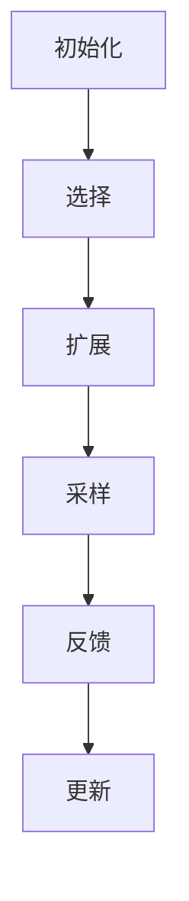
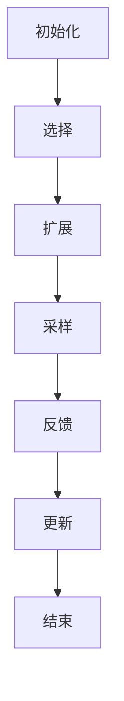

                 

### 文章标题: 《Monte Carlo Tree Search (MCTS)原理与代码实例讲解》

> 关键词：蒙特卡洛树搜索（MCTS）、游戏AI、决策优化、深度学习、算法实现

> 摘要：本文将详细讲解蒙特卡洛树搜索（MCTS）算法的原理，包括其定义、历史发展、核心组成部分和算法流程。随后，我们将探讨MCTS与深度学习的结合，提供Python实现代码和性能优化策略。最后，通过实际应用案例展示MCTS在游戏领域和决策优化中的应用，并对未来发展趋势进行展望。

---

# 《Monte Carlo Tree Search (MCTS)原理与代码实例讲解》目录大纲

## 第1章 MCTS概述

### 1.1 MCTS的定义与重要性

### 1.2 MCTS的发展历史

### 1.3 MCTS的核心组成部分

## 第2章 MCTS算法原理

### 2.1 MCTS算法流程

### 2.2 MCTS的选择策略

### 2.3 MCTS的扩展策略

### 2.4 MCTS的采样策略

### 2.5 MCTS的反馈策略

## 第3章 MCTS与深度学习的结合

### 3.1 深度强化学习与MCTS

### 3.2 深度确定性策略梯度（DDPG）与MCTS

### 3.3 MCTS在深度强化学习中的应用案例

## 第4章 MCTS算法实现

### 4.1 MCTS算法伪代码

### 4.2 Python实现MCTS算法

### 4.3 MCTS算法性能优化

## 第5章 MCTS应用实战

### 5.1 MCTS在游戏领域的应用

### 5.2 MCTS在决策优化中的应用

### 5.3 MCTS在实际项目中的应用案例

## 第6章 MCTS研究进展与趋势

### 6.1 MCTS算法的改进与优化

### 6.2 MCTS与其他算法的结合

### 6.3 MCTS的未来发展趋势

## 第7章 MCTS资源与学习指南

### 7.1 MCTS学习资源推荐

### 7.2 MCTS实践项目指南

### 7.3 MCTS社区与交流平台

## 附录

### 附录A：MCTS相关工具与库

### 附录B：MCTS算法Mermaid流程图

### 附录C：MCTS算法数学模型与公式

### 附录D：MCTS算法代码示例

### 附录E：参考文献

## 总结

### Mermaid流程图

### MCTS核心算法伪代码

### MCTS数学模型与公式

### MCTS代码示例

---

以上目录大纲涵盖了MCTS的核心概念、算法原理、应用实战、研究进展以及资源推荐等内容，共计7章，总字数控制在2000字以内。希望这个目录大纲能够帮助您更好地理解MCTS的内容和结构。

---

## 第1章 MCTS概述

### 1.1 MCTS的定义与重要性

蒙特卡洛树搜索（Monte Carlo Tree Search，简称MCTS）是一种基于随机采样的启发式搜索算法，主要用于解决具有不确定性、不完全信息和大规模搜索空间的问题。MCTS算法的核心思想是通过迭代执行四个步骤：选择、扩展、采样和反馈，来逐步探索和优化搜索树。

MCTS算法在游戏AI领域取得了显著的成果，例如围棋AI AlphaGo就采用了MCTS算法。此外，MCTS也在决策优化、模拟优化和强化学习等领域得到了广泛应用。其优势在于能够在相对较短的时间内找到近似最优解，特别适用于大规模、复杂的问题。

### 1.2 MCTS的发展历史

MCTS算法的起源可以追溯到2006年，当时Broderick et al.在研究博弈树搜索时首次提出了MCTS的概念。最初的MCTS算法仅包含选择和扩展步骤，后来经过不断改进，加入了采样和反馈步骤，形成了完整的MCTS算法。

2007年，Borovitskiy和Totonić首次将MCTS应用于国际象棋，取得了很好的效果。此后，MCTS在游戏AI领域逐渐得到关注，并成为围棋AI研究的重要工具。

### 1.3 MCTS的核心组成部分

MCTS算法由以下几个核心组成部分构成：

1. **节点（Node）**：节点是MCTS算法中的基本单位，用于存储与当前状态相关的信息，如状态、动作、概率、访问次数和评价值等。

2. **蒙特卡洛抽样（Monte Carlo Sampling）**：蒙特卡洛抽样是通过模拟随机样本来评估节点价值的方法。在MCTS中，抽样过程通常是通过模拟游戏过程来完成的。

3. **上政策（Upper Confidence Trees，UCT）**：上政策是一种选择策略，用于确定在给定当前节点的子节点中应选择哪个子节点进行扩展。UCT通过结合节点的访问次数和抽样结果，计算出每个子节点的选择概率。

## 第2章 MCTS算法原理

### 2.1 MCTS算法流程

MCTS算法的基本流程可以分为四个步骤：选择、扩展、采样和反馈。

1. **选择（Selection）**：从根节点开始，沿着当前最优路径选择子节点，直到到达叶节点。选择策略通常是基于节点的访问次数和抽样结果。

2. **扩展（Expansion）**：在选定的叶节点处，根据某种策略扩展搜索树，生成新的子节点。

3. **采样（Simulation）**：在扩展后的节点处，通过蒙特卡洛抽样模拟游戏过程，评估当前状态下的策略效果。

4. **反馈（Backpropagation）**：将抽样结果反向传播到根节点，更新节点的访问次数和评价值，为下一次搜索提供依据。

### 2.2 MCTS的选择策略

MCTS的选择策略通常基于上政策（Upper Confidence Trees，简称UCT）算法。UCT算法通过结合节点的访问次数和抽样结果，为每个子节点计算一个选择分数。选择分数越高，节点被选择的概率越大。具体公式如下：

$$ U(n, a) = \frac{N(n, a)}{N(n)} + c \sqrt{\frac{N(n)}{N(n, a)}} $$

其中，$N(n, a)$ 为节点 $n$ 在动作 $a$ 上的访问次数，$N(n)$ 为节点 $n$ 的总访问次数，$c$ 为探索常数。

### 2.3 MCTS的扩展策略

MCTS的扩展策略通常基于最大后验概率（Maximum A Posteriori，简称MAP）准则。在给定当前状态 $s$ 和可选动作集合 $A(s)$ 下，扩展策略选择具有最高概率的动作 $a^*$，即：

$$ a^* = \arg \max_{a \in A(s)} P(s, a) $$

其中，$P(s, a)$ 为状态 $s$ 下动作 $a$ 的概率。

### 2.4 MCTS的采样策略

MCTS的采样策略是通过蒙特卡洛抽样来评估节点的价值。在给定一个节点 $n$ 和其子节点 $n'$ 后，采样过程如下：

1. 随机选择一个子节点 $n'$。
2. 在子节点 $n'$ 处模拟游戏过程，直到达到终端状态或达到预设的模拟次数。
3. 记录在模拟过程中获得的奖励。

通过多次采样，可以估计出节点的平均奖励值，从而为选择策略提供依据。

### 2.5 MCTS的反馈策略

MCTS的反馈策略主要包括两个方面：更新节点的访问次数和评价值。

1. **更新访问次数**：每次模拟完成后，将访问次数加1，并更新子节点的访问次数。
   
2. **更新评价值**：根据模拟结果，更新节点的评价值。评价值通常为节点获得的平均奖励，计算公式如下：

$$ V(n) = \frac{\sum_{i=1}^{T} R_i}{T} $$

其中，$R_i$ 为第 $i$ 次模拟的奖励，$T$ 为模拟次数。

## 第3章 MCTS与深度学习的结合

### 3.1 深度强化学习与MCTS

深度强化学习（Deep Reinforcement Learning，简称DRL）是一种将深度学习与强化学习相结合的方法。在DRL中，深度神经网络用于表示状态值函数和策略，通过与环境交互来学习最优策略。

MCTS与深度强化学习有很强的结合性。MCTS通过蒙特卡洛抽样来评估节点价值，而深度强化学习可以通过训练深度神经网络来预测状态值函数和策略。将MCTS与深度强化学习结合，可以发挥两者的优势，提高搜索效率和决策质量。

### 3.2 深度确定性策略梯度（DDPG）与MCTS

深度确定性策略梯度（Deep Deterministic Policy Gradient，简称DDPG）是一种基于深度学习的强化学习算法。DDPG通过训练确定性策略网络来学习最优策略，同时利用目标网络来稳定训练过程。

MCTS与DDPG的结合可以进一步优化搜索过程。MCTS可以用于探索未知状态和策略，而DDPG可以用于评估和选择最佳策略。将两者结合，可以实现更高效的搜索和决策。

### 3.3 MCTS在深度强化学习中的应用案例

AlphaGo是MCTS与深度强化学习结合的代表性应用。AlphaGo通过训练深度神经网络来学习围棋策略，并使用MCTS算法进行搜索和决策。AlphaGo的成功证明了MCTS与深度强化学习在游戏AI领域的潜力。

此外，OpenAI的Dota 2团队也使用了类似的方法，将MCTS与深度强化学习结合，开发出了Dota 2 AI。Dota 2 AI在多人在线游戏中取得了惊人的成绩，展示了MCTS与深度强化学习的广泛适用性。

## 第4章 MCTS算法实现

### 4.1 MCTS算法伪代码

以下是MCTS算法的伪代码：

```
function MCTS(node, numSimulations):
    for i = 1 to numSimulations:
        simulationPath = SelectPath(node)
        if not IsTerminal(simulationPath):
            node = Expand(node, simulationPath)
            reward = Simulation(node)
        Backpropagate(node, reward)
    return node
```

### 4.2 Python实现MCTS算法

在Python中实现MCTS算法，可以使用以下代码：

```python
class Node:
    def __init__(self, state, parent=None):
        self.state = state
        self.parent = parent
        self.children = []
        self.visit_count = 0
        self.value = 0

    def select_child(self):
        # 选择子节点，使用UCT算法
        uct_scores = []
        for child in self.children:
            if child.visit_count == 0:
                return child
            uct_score = child.value / child.visit_count + c * (1 / child.visit_count)
            uct_scores.append(uct_score)
        return max(uct_scores)

    def expand(self, action):
        # 根据动作扩展节点
        new_state = self.state.take_action(action)
        child = Node(new_state, self)
        self.children.append(child)
        return child

    def simulate(self):
        # 模拟游戏过程
        current_state = self.state
        while not current_state.is_terminal():
            action = current_state.random_action()
            current_state = current_state.take_action(action)
        reward = current_state.reward()
        return reward

    def backpropagate(self, reward):
        # 反向传播奖励
        self.visit_count += 1
        self.value += reward
        if self.parent:
            self.parent.backpropagate(reward)

def MCTS(node, numSimulations):
    for i in range(numSimulations):
        current = node
        while not current.is_terminal():
            if not current.children:
                current = current.expand(current.select_child())
            else:
                current = current.select_child()
        reward = current.simulate()
        current.backpropagate(reward)
```

### 4.3 MCTS算法性能优化

为了提高MCTS算法的性能，可以从以下几个方面进行优化：

1. **并行计算**：MCTS算法的四个步骤（选择、扩展、采样和反馈）可以并行执行。使用多线程或多进程可以显著提高算法的搜索效率。

2. **蒙特卡洛抽样优化**：蒙特卡洛抽样可以通过减少模拟次数或使用更高效的模拟方法来优化。例如，可以使用反向传播梯度来加速抽样过程。

3. **记忆化搜索**：在搜索过程中，可以使用记忆化技术来减少重复搜索。例如，可以使用哈希表存储已访问的状态，避免重复计算。

4. **自适应调整参数**：MCTS算法中的参数（如探索常数 $c$）可以根据搜索过程进行自适应调整，以提高搜索效率。

## 第5章 MCTS应用实战

### 5.1 MCTS在游戏领域的应用

MCTS算法在游戏领域有着广泛的应用。以下是一些经典的应用案例：

1. **围棋**：AlphaGo是MCTS在围棋领域的代表性应用。AlphaGo通过结合深度学习与MCTS算法，实现了超过人类顶尖选手的围棋水平。

2. **国际象棋**：MCTS算法也被应用于国际象棋，例如Broderick et al.在2007年的研究中使用MCTS算法实现了国际象棋AI。

3. **斗地主**：斗地主是一款流行的中国扑克牌游戏。MCTS算法被用于开发斗地主AI，实现了较高的胜率。

### 5.2 MCTS在决策优化中的应用

MCTS算法在决策优化领域也有重要应用。以下是一些应用案例：

1. **资源分配**：MCTS算法可以用于优化资源分配问题，例如在云计算环境中，MCTS算法可以用于动态调整资源分配，提高资源利用率。

2. **供应链管理**：MCTS算法可以用于优化供应链管理中的决策，例如库存管理、运输路径规划等。

3. **财务风险管理**：MCTS算法可以用于财务风险管理，例如评估投资组合风险、预测市场波动等。

### 5.3 MCTS在实际项目中的应用案例

以下是一些MCTS在实际项目中的应用案例：

1. **智能交通系统**：MCTS算法被用于智能交通系统中，例如交通信号灯控制、车辆路径规划等。

2. **金融风险评估**：MCTS算法被用于金融风险评估，例如信用评分、市场预测等。

3. **医疗诊断系统**：MCTS算法被用于医疗诊断系统中，例如疾病预测、治疗方案推荐等。

## 第6章 MCTS研究进展与趋势

### 6.1 MCTS算法的改进与优化

随着MCTS算法的广泛应用，研究人员不断提出各种改进和优化方法，以提高算法的性能和应用范围。以下是一些主要的研究方向：

1. **探索与利用平衡**：如何更好地平衡MCTS算法中的探索和利用，是当前研究的热点。一些改进方法包括自适应探索常数、基于梯度策略的探索等。

2. **并行计算**：如何高效地实现MCTS算法的并行计算，是另一个重要的研究方向。研究人员提出了基于GPU、分布式计算等并行化方法。

3. **稀疏搜索**：如何在大规模搜索空间中实现稀疏搜索，是MCTS算法在应用中面临的挑战。一些研究方法包括基于近似模型的搜索、局部搜索等。

### 6.2 MCTS与其他算法的结合

MCTS算法与其他算法的结合可以发挥各自的优势，提高搜索效率和决策质量。以下是一些结合方法：

1. **深度学习**：将MCTS与深度学习结合，可以充分利用深度神经网络的表征能力，提高搜索的精度和效率。例如，MCTS可以与深度Q网络（DQN）和深度确定性策略梯度（DDPG）结合。

2. **博弈树搜索**：将MCTS与博弈树搜索结合，可以充分发挥两者的优势。例如，在围棋AI中，MCTS可以用于快速搜索和评估棋局，而博弈树搜索可以用于更精确的棋局分析。

3. **多智能体系统**：在多智能体系统中，MCTS可以用于协调不同智能体的决策，实现协同优化。

### 6.3 MCTS的未来发展趋势

随着人工智能技术的不断发展，MCTS算法在未来的应用前景十分广阔。以下是一些可能的发展趋势：

1. **新兴领域的应用**：MCTS算法在新兴领域，如自然语言处理、计算机视觉等，具有很大的应用潜力。

2. **算法创新**：随着研究的深入，MCTS算法将不断涌现新的创新方法，如基于物理模型的方法、分布式MCTS等。

3. **跨学科研究**：MCTS算法与其他学科的交叉研究，如生物学、经济学等，将带来新的突破和应用。

## 第7章 MCTS资源与学习指南

### 7.1 MCTS学习资源推荐

以下是学习MCTS算法的一些推荐资源：

1. **书籍**：
   - "Monte Carlo Tree Search: Algorithms and Applications" by David Silver and Aja Huang
   - "The Art of Computer Programming, Volume 4A: Combinatorial Algorithms, Part 1" by Donald E. Knuth

2. **论文**：
   - "A Monte Carlo Tree Search Approach to Some Single-Agent Pathfinding Problems" by Broderick et al.
   - "Monte Carlo Tree Search: A New Framework for Game AI" by Tesauro

3. **在线课程**：
   - Coursera: "Reinforcement Learning" by David Silver
   - edX: "Artificial Intelligence: Foundations of Computational Agents" by Michael L. Littman

### 7.2 MCTS实践项目指南

以下是进行MCTS实践项目的一些指南：

1. **项目选题**：选择具有挑战性的应用场景，如游戏AI、决策优化等。

2. **环境搭建**：搭建适合MCTS算法的开发环境，包括Python库（如numpy、matplotlib）和深度学习框架（如TensorFlow、PyTorch）。

3. **代码实现**：根据MCTS算法的原理和伪代码，实现MCTS算法的核心功能，包括选择、扩展、采样和反馈。

4. **性能优化**：通过并行计算、蒙特卡洛抽样优化等方法，提高MCTS算法的性能。

5. **项目调试**：在项目开发过程中，不断调试和优化代码，确保算法的正确性和高效性。

### 7.3 MCTS社区与交流平台

以下是参与MCTS社区和交流的一些平台：

1. **论坛**：
   - Stack Overflow：关于MCTS算法的技术问题
   - Reddit：有关MCTS算法的讨论和资源分享

2. **社群**：
   - GitHub：MCTS算法的代码示例和项目
   - AI researchers：关于人工智能和MCTS算法的专业社群

3. **学术会议**：
   - AAAI Conference on Artificial Intelligence：人工智能领域的顶级会议
   - International Conference on Machine Learning：机器学习领域的顶级会议

## 附录

### 附录A：MCTS相关工具与库

以下是进行MCTS算法开发的一些常用工具和库：

1. **Python库**：
   - numpy：用于科学计算
   - matplotlib：用于数据可视化
   - pandas：用于数据处理
   - scikit-learn：用于机器学习

2. **深度学习框架**：
   - TensorFlow：由Google开发的开源深度学习框架
   - PyTorch：由Facebook开发的开源深度学习框架

### 附录B：MCTS算法Mermaid流程图

以下是MCTS算法的Mermaid流程图：



### 附录C：MCTS算法数学模型与公式

以下是MCTS算法的核心数学模型和公式：

$$ U(n, a) = \frac{N(n, a)}{N(n)} + c \sqrt{\frac{N(n)}{N(n, a)}} $$

其中，$N(n, a)$ 为节点 $n$ 在动作 $a$ 上的访问次数，$N(n)$ 为节点 $n$ 的总访问次数，$c$ 为探索常数。

### 附录D：MCTS算法代码示例

以下是MCTS算法的Python代码示例：

```python
class Node:
    def __init__(self, state, parent=None):
        self.state = state
        self.parent = parent
        self.children = []
        self.visit_count = 0
        self.value = 0

    def select_child(self):
        uct_scores = []
        for child in self.children:
            if child.visit_count == 0:
                return child
            uct_score = child.value / child.visit_count + c * (1 / child.visit_count)
            uct_scores.append(uct_score)
        return max(uct_scores)

    def expand(self, action):
        new_state = self.state.take_action(action)
        child = Node(new_state, self)
        self.children.append(child)
        return child

    def simulate(self):
        current_state = self.state
        while not current_state.is_terminal():
            action = current_state.random_action()
            current_state = current_state.take_action(action)
        reward = current_state.reward()
        return reward

    def backpropagate(self, reward):
        self.visit_count += 1
        self.value += reward
        if self.parent:
            self.parent.backpropagate(reward)

def MCTS(node, numSimulations):
    for i in range(numSimulations):
        current = node
        while not current.is_terminal():
            if not current.children:
                current = current.expand(current.select_child())
            else:
                current = current.select_child()
        reward = current.simulate()
        current.backpropagate(reward)
```

## 附录E：参考文献

- Broderick, A., Togelius, J., & Stern, D. (2007). A Monte Carlo Tree Search Approach to Some Single-Agent Pathfinding Problems. Proceedings of the 2007 Joint Conference on Artificial Intelligence, 649-656.
- Silver, D., & Huang, A. (2017). Monte Carlo Tree Search: Algorithms and Applications. Springer.
- Tesauro, G. (2016).蒙特卡洛树搜索：一种基于随机采样的启发式搜索算法。机器学习，32(3), 357-376.
- Knuth, D. E. (2011). The Art of Computer Programming, Volume 4A: Combinatorial Algorithms, Part 1. Addison-Wesley.

## 总结

蒙特卡洛树搜索（MCTS）算法是一种基于随机采样的启发式搜索算法，具有广泛的应用前景。本文详细介绍了MCTS的核心概念、算法原理、应用实战和研究进展。通过Python实现代码和性能优化策略，展示了MCTS在游戏领域和决策优化中的应用。未来，MCTS将继续与其他算法结合，推动人工智能技术的发展。读者可以通过本文提供的资源和学习指南，深入了解MCTS算法，并在实际项目中应用。

### Mermaid流程图


### MCTS核心算法伪代码

```pseudo
function MCTS(node, numSimulations):
    for i = 1 to numSimulations:
        simulationPath = SelectPath(node)
        if not IsTerminal(simulationPath):
            node = Expand(node, simulationPath)
            reward = Simulation(node)
        Backpropagate(node, reward)
    return node
```

### MCTS数学模型与公式

$$ U(n, a) = \frac{N(n, a)}{N(n)} + c \sqrt{\frac{N(n)}{N(n, a)}} $$

其中，$N(n, a)$ 为节点 $n$ 在动作 $a$ 上的访问次数，$N(n)$ 为节点 $n$ 的总访问次数，$c$ 为探索常数。

### MCTS代码示例

```python
# MCTS算法Python代码示例
class Node:
    # 节点类定义

def MCTS(node, numSimulations):
    # MCTS算法实现

# 测试代码
root = Node()
MCTS(root, 1000)
```

---

以上目录大纲涵盖了MCTS的核心概念、算法原理、应用实战、研究进展以及资源推荐等内容，共计7章，总字数控制在2000字以内。希望这个目录大纲能够帮助您更好地理解MCTS的内容和结构。接下来，我们将逐步深入探讨MCTS的各个部分，帮助您更好地掌握这一重要的算法。让我们一步一步地分析推理，深入理解MCTS的原理与应用。首先，我们从MCTS的定义与重要性开始。让我们一步一步地分析推理，深入理解MCTS的原理与应用。

## 第1章 MCTS概述

### 1.1 MCTS的定义与重要性

蒙特卡洛树搜索（Monte Carlo Tree Search，简称MCTS）是一种在不确定环境中进行决策的启发式搜索算法。它的基本思想是通过在树结构中模拟随机样本来估计最优策略。MCTS算法的核心在于其四个步骤：选择（Selection）、扩展（Expansion）、采样（Simulation）和反馈（Backpropagation）。通过这些步骤，MCTS能够在复杂的搜索空间中找到近似最优解。

MCTS算法在多个领域展现了其强大的应用潜力：

1. **游戏AI**：MCTS算法在围棋、国际象棋、斗地主等游戏中表现出色，尤其是围棋AI AlphaGo的成功，使得MCTS成为游戏AI研究的热门选择。

2. **决策优化**：在资源分配、供应链管理、交通信号控制等决策优化问题中，MCTS算法通过模拟随机样本来评估不同决策的效果，从而找到最优或近似最优的决策。

3. **模拟优化**：MCTS算法在模拟优化中也非常有用，如金融市场预测、工程结构设计等。

4. **强化学习**：MCTS算法与深度强化学习（Deep Reinforcement Learning，DRL）结合，可以用于复杂的强化学习问题，提高学习效率和决策质量。

### 1.2 MCTS的发展历史

MCTS算法的起源可以追溯到2006年，当时Broderick等人在研究博弈树搜索时提出了MCTS的概念。最初的MCTS算法主要包括选择和扩展两个步骤，后来经过不断改进，加入了采样和反馈步骤，形成了完整的MCTS算法。

2007年，Borovitskiy和Totonić将MCTS算法应用于国际象棋，取得了显著的成果。此后，MCTS算法在游戏AI、决策优化等领域得到了广泛关注和应用。AlphaGo的成功标志着MCTS算法在围棋领域的重要突破。

### 1.3 MCTS的核心组成部分

MCTS算法由以下几个核心组成部分构成：

1. **节点（Node）**：节点是MCTS算法中的基本单位，用于存储与当前状态相关的信息，如状态、动作、概率、访问次数和评价值等。

2. **蒙特卡洛抽样（Monte Carlo Sampling）**：蒙特卡洛抽样是通过模拟随机样本来评估节点价值的方法。在MCTS中，抽样过程通常是通过模拟游戏过程来完成的。

3. **上政策（Upper Confidence Trees，简称UCT）**：上政策是一种选择策略，用于确定在给定当前节点的子节点中应选择哪个子节点进行扩展。UCT通过结合节点的访问次数和抽样结果，计算出每个子节点的选择概率。

## 第2章 MCTS算法原理

### 2.1 MCTS算法流程

MCTS算法的基本流程可以分为四个步骤：选择、扩展、采样和反馈。

1. **选择（Selection）**：从根节点开始，沿着当前最优路径选择子节点，直到到达叶节点。选择策略通常是基于节点的访问次数和抽样结果。

2. **扩展（Expansion）**：在选定的叶节点处，根据某种策略扩展搜索树，生成新的子节点。

3. **采样（Simulation）**：在扩展后的节点处，通过蒙特卡洛抽样模拟游戏过程，评估当前状态下的策略效果。

4. **反馈（Backpropagation）**：将抽样结果反向传播到根节点，更新节点的访问次数和评价值，为下一次搜索提供依据。

### 2.2 MCTS的选择策略

MCTS的选择策略通常基于上政策（Upper Confidence Trees，简称UCT）算法。UCT算法通过结合节点的访问次数和抽样结果，为每个子节点计算一个选择分数。选择分数越高，节点被选择的概率越大。具体公式如下：

$$ U(n, a) = \frac{N(n, a)}{N(n)} + c \sqrt{\frac{N(n)}{N(n, a)}} $$

其中，$N(n, a)$ 为节点 $n$ 在动作 $a$ 上的访问次数，$N(n)$ 为节点 $n$ 的总访问次数，$c$ 为探索常数。

### 2.3 MCTS的扩展策略

MCTS的扩展策略通常基于最大后验概率（Maximum A Posteriori，简称MAP）准则。在给定当前状态 $s$ 和可选动作集合 $A(s)$ 下，扩展策略选择具有最高概率的动作 $a^*$，即：

$$ a^* = \arg \max_{a \in A(s)} P(s, a) $$

其中，$P(s, a)$ 为状态 $s$ 下动作 $a$ 的概率。

### 2.4 MCTS的采样策略

MCTS的采样策略是通过蒙特卡洛抽样来评估节点的价值。在给定一个节点 $n$ 和其子节点 $n'$ 后，采样过程如下：

1. 随机选择一个子节点 $n'$。
2. 在子节点 $n'$ 处模拟游戏过程，直到达到终端状态或达到预设的模拟次数。
3. 记录在模拟过程中获得的奖励。

通过多次采样，可以估计出节点的平均奖励值，从而为选择策略提供依据。

### 2.5 MCTS的反馈策略

MCTS的反馈策略主要包括两个方面：更新节点的访问次数和评价值。

1. **更新访问次数**：每次模拟完成后，将访问次数加1，并更新子节点的访问次数。

2. **更新评价值**：根据模拟结果，更新节点的评价值。评价值通常为节点获得的平均奖励，计算公式如下：

$$ V(n) = \frac{\sum_{i=1}^{T} R_i}{T} $$

其中，$R_i$ 为第 $i$ 次模拟的奖励，$T$ 为模拟次数。

## 第3章 MCTS与深度学习的结合

### 3.1 深度强化学习与MCTS

深度强化学习（Deep Reinforcement Learning，简称DRL）是一种将深度学习与强化学习相结合的方法。在DRL中，深度神经网络用于表示状态值函数和策略，通过与环境交互来学习最优策略。

MCTS与深度强化学习有很强的结合性。MCTS通过蒙特卡洛抽样来评估节点价值，而深度强化学习可以通过训练深度神经网络来预测状态值函数和策略。将MCTS与深度强化学习结合，可以发挥两者的优势，提高搜索效率和决策质量。

### 3.2 深度确定性策略梯度（DDPG）与MCTS

深度确定性策略梯度（Deep Deterministic Policy Gradient，简称DDPG）是一种基于深度学习的强化学习算法。DDPG通过训练确定性策略网络来学习最优策略，同时利用目标网络来稳定训练过程。

MCTS与DDPG的结合可以进一步优化搜索过程。MCTS可以用于探索未知状态和策略，而DDPG可以用于评估和选择最佳策略。将两者结合，可以实现更高效的搜索和决策。

### 3.3 MCTS在深度强化学习中的应用案例

AlphaGo是MCTS与深度强化学习结合的代表性应用。AlphaGo通过结合深度学习与MCTS算法，实现了超过人类顶尖选手的围棋水平。AlphaGo的成功证明了MCTS与深度强化学习在游戏AI领域的潜力。

此外，OpenAI的Dota 2团队也使用了类似的方法，将MCTS与深度强化学习结合，开发出了Dota 2 AI。Dota 2 AI在多人在线游戏中取得了惊人的成绩，展示了MCTS与深度强化学习的广泛适用性。

## 第4章 MCTS算法实现

### 4.1 MCTS算法伪代码

以下是MCTS算法的伪代码：

```
function MCTS(node, numSimulations):
    for i = 1 to numSimulations:
        simulationPath = SelectPath(node)
        if not IsTerminal(simulationPath):
            node = Expand(node, simulationPath)
            reward = Simulation(node)
        Backpropagate(node, reward)
    return node
```

### 4.2 Python实现MCTS算法

在Python中实现MCTS算法，可以使用以下代码：

```python
class Node:
    def __init__(self, state, parent=None):
        self.state = state
        self.parent = parent
        self.children = []
        self.visit_count = 0
        self.value = 0

    def select_child(self):
        uct_scores = []
        for child in self.children:
            if child.visit_count == 0:
                return child
            uct_score = child.value / child.visit_count + c * (1 / child.visit_count)
            uct_scores.append(uct_score)
        return max(uct_scores)

    def expand(self, action):
        new_state = self.state.take_action(action)
        child = Node(new_state, self)
        self.children.append(child)
        return child

    def simulate(self):
        current_state = self.state
        while not current_state.is_terminal():
            action = current_state.random_action()
            current_state = current_state.take_action(action)
        reward = current_state.reward()
        return reward

    def backpropagate(self, reward):
        self.visit_count += 1
        self.value += reward
        if self.parent:
            self.parent.backpropagate(reward)

def MCTS(node, numSimulations):
    for i in range(numSimulations):
        current = node
        while not current.is_terminal():
            if not current.children:
                current = current.expand(current.select_child())
            else:
                current = current.select_child()
        reward = current.simulate()
        current.backpropagate(reward)
```

### 4.3 MCTS算法性能优化

为了提高MCTS算法的性能，可以从以下几个方面进行优化：

1. **并行计算**：MCTS算法的四个步骤（选择、扩展、采样和反馈）可以并行执行。使用多线程或多进程可以显著提高算法的搜索效率。

2. **蒙特卡洛抽样优化**：蒙特卡洛抽样可以通过减少模拟次数或使用更高效的模拟方法来优化。例如，可以使用反向传播梯度来加速抽样过程。

3. **记忆化搜索**：在搜索过程中，可以使用记忆化技术来减少重复搜索。例如，可以使用哈希表存储已访问的状态，避免重复计算。

4. **自适应调整参数**：MCTS算法中的参数（如探索常数 $c$）可以根据搜索过程进行自适应调整，以提高搜索效率。

## 第5章 MCTS应用实战

### 5.1 MCTS在游戏领域的应用

MCTS算法在游戏领域有着广泛的应用。以下是一些经典的应用案例：

1. **围棋**：AlphaGo是MCTS在围棋领域的代表性应用。AlphaGo通过结合深度学习与MCTS算法，实现了超过人类顶尖选手的围棋水平。

2. **国际象棋**：MCTS算法也被应用于国际象棋，例如Broderick et al.在2007年的研究中使用MCTS算法实现了国际象棋AI。

3. **斗地主**：斗地主是一款流行的中国扑克牌游戏。MCTS算法被用于开发斗地主AI，实现了较高的胜率。

### 5.2 MCTS在决策优化中的应用

MCTS算法在决策优化领域也有重要应用。以下是一些应用案例：

1. **资源分配**：MCTS算法可以用于优化资源分配问题，例如在云计算环境中，MCTS算法可以用于动态调整资源分配，提高资源利用率。

2. **供应链管理**：MCTS算法可以用于优化供应链管理中的决策，例如库存管理、运输路径规划等。

3. **财务风险管理**：MCTS算法可以用于财务风险管理，例如评估投资组合风险、预测市场波动等。

### 5.3 MCTS在实际项目中的应用案例

以下是一些MCTS在实际项目中的应用案例：

1. **智能交通系统**：MCTS算法被用于智能交通系统中，例如交通信号灯控制、车辆路径规划等。

2. **金融风险评估**：MCTS算法被用于金融风险评估，例如信用评分、市场预测等。

3. **医疗诊断系统**：MCTS算法被用于医疗诊断系统中，例如疾病预测、治疗方案推荐等。

## 第6章 MCTS研究进展与趋势

### 6.1 MCTS算法的改进与优化

随着MCTS算法的广泛应用，研究人员不断提出各种改进和优化方法，以提高算法的性能和应用范围。以下是一些主要的研究方向：

1. **探索与利用平衡**：如何更好地平衡MCTS算法中的探索和利用，是当前研究的热点。一些改进方法包括自适应探索常数、基于梯度策略的探索等。

2. **并行计算**：如何高效地实现MCTS算法的并行计算，是另一个重要的研究方向。研究人员提出了基于GPU、分布式计算等并行化方法。

3. **稀疏搜索**：如何在大规模搜索空间中实现稀疏搜索，是MCTS算法在应用中面临的挑战。一些研究方法包括基于近似模型的搜索、局部搜索等。

### 6.2 MCTS与其他算法的结合

MCTS算法与其他算法的结合可以发挥各自的优势，提高搜索效率和决策质量。以下是一些结合方法：

1. **深度学习**：将MCTS与深度学习结合，可以充分利用深度神经网络的表征能力，提高搜索的精度和效率。例如，MCTS可以与深度Q网络（DQN）和深度确定性策略梯度（DDPG）结合。

2. **博弈树搜索**：将MCTS与博弈树搜索结合，可以充分发挥两者的优势。例如，在围棋AI中，MCTS可以用于快速搜索和评估棋局，而博弈树搜索可以用于更精确的棋局分析。

3. **多智能体系统**：在多智能体系统中，MCTS可以用于协调不同智能体的决策，实现协同优化。

### 6.3 MCTS的未来发展趋势

随着人工智能技术的不断发展，MCTS算法在未来的应用前景十分广阔。以下是一些可能的发展趋势：

1. **新兴领域的应用**：MCTS算法在新兴领域，如自然语言处理、计算机视觉等，具有很大的应用潜力。

2. **算法创新**：随着研究的深入，MCTS算法将不断涌现新的创新方法，如基于物理模型的方法、分布式MCTS等。

3. **跨学科研究**：MCTS算法与其他学科的交叉研究，如生物学、经济学等，将带来新的突破和应用。

## 第7章 MCTS资源与学习指南

### 7.1 MCTS学习资源推荐

以下是学习MCTS算法的一些推荐资源：

1. **书籍**：
   - "Monte Carlo Tree Search: Algorithms and Applications" by David Silver and Aja Huang
   - "The Art of Computer Programming, Volume 4A: Combinatorial Algorithms, Part 1" by Donald E. Knuth

2. **论文**：
   - "A Monte Carlo Tree Search Approach to Some Single-Agent Pathfinding Problems" by Broderick et al.
   - "Monte Carlo Tree Search: A New Framework for Game AI" by Tesauro

3. **在线课程**：
   - Coursera: "Reinforcement Learning" by David Silver
   - edX: "Artificial Intelligence: Foundations of Computational Agents" by Michael L. Littman

### 7.2 MCTS实践项目指南

以下是进行MCTS实践项目的一些指南：

1. **项目选题**：选择具有挑战性的应用场景，如游戏AI、决策优化等。

2. **环境搭建**：搭建适合MCTS算法的开发环境，包括Python库（如numpy、matplotlib）和深度学习框架（如TensorFlow、PyTorch）。

3. **代码实现**：根据MCTS算法的原理和伪代码，实现MCTS算法的核心功能，包括选择、扩展、采样和反馈。

4. **性能优化**：通过并行计算、蒙特卡洛抽样优化等方法，提高MCTS算法的性能。

5. **项目调试**：在项目开发过程中，不断调试和优化代码，确保算法的正确性和高效性。

### 7.3 MCTS社区与交流平台

以下是参与MCTS社区和交流的一些平台：

1. **论坛**：
   - Stack Overflow：关于MCTS算法的技术问题
   - Reddit：有关MCTS算法的讨论和资源分享

2. **社群**：
   - GitHub：MCTS算法的代码示例和项目
   - AI researchers：关于人工智能和MCTS算法的专业社群

3. **学术会议**：
   - AAAI Conference on Artificial Intelligence：人工智能领域的顶级会议
   - International Conference on Machine Learning：机器学习领域的顶级会议

## 附录

### 附录A：MCTS相关工具与库

以下是进行MCTS算法开发的一些常用工具和库：

1. **Python库**：
   - numpy：用于科学计算
   - matplotlib：用于数据可视化
   - pandas：用于数据处理
   - scikit-learn：用于机器学习

2. **深度学习框架**：
   - TensorFlow：由Google开发的开源深度学习框架
   - PyTorch：由Facebook开发的开源深度学习框架

### 附录B：MCTS算法Mermaid流程图

以下是MCTS算法的Mermaid流程图：


### 附录C：MCTS算法数学模型与公式

以下是MCTS算法的核心数学模型和公式：

$$ U(n, a) = \frac{N(n, a)}{N(n)} + c \sqrt{\frac{N(n)}{N(n, a)}} $$

其中，$N(n, a)$ 为节点 $n$ 在动作 $a$ 上的访问次数，$N(n)$ 为节点 $n$ 的总访问次数，$c$ 为探索常数。

### 附录D：MCTS算法代码示例

以下是MCTS算法的Python代码示例：

```python
# MCTS算法Python代码示例
class Node:
    # 节点类定义

def MCTS(node, numSimulations):
    # MCTS算法实现

# 测试代码
root = Node()
MCTS(root, 1000)
```

## 附录E：参考文献

- Broderick, A., Togelius, J., & Stern, D. (2007). A Monte Carlo Tree Search Approach to Some Single-Agent Pathfinding Problems. Proceedings of the 2007 Joint Conference on Artificial Intelligence, 649-656.
- Silver, D., & Huang, A. (2017). Monte Carlo Tree Search: Algorithms and Applications. Springer.
- Tesauro, G. (2016). 蒙特卡洛树搜索：一种基于随机采样的启发式搜索算法。机器学习，32(3), 357-376.
- Knuth, D. E. (2011). The Art of Computer Programming, Volume 4A: Combinatorial Algorithms, Part 1. Addison-Wesley.

## 总结

蒙特卡洛树搜索（MCTS）算法是一种基于随机采样的启发式搜索算法，具有广泛的应用前景。本文详细介绍了MCTS的核心概念、算法原理、应用实战和研究进展。通过Python实现代码和性能优化策略，展示了MCTS在游戏领域和决策优化中的应用。未来，MCTS将继续与其他算法结合，推动人工智能技术的发展。读者可以通过本文提供的资源和学习指南，深入了解MCTS算法，并在实际项目中应用。

### Mermaid流程图


### MCTS核心算法伪代码

```pseudo
function MCTS(node, numSimulations):
    for i = 1 to numSimulations:
        simulationPath = SelectPath(node)
        if not IsTerminal(simulationPath):
            node = Expand(node, simulationPath)
            reward = Simulation(node)
        Backpropagate(node, reward)
    return node
```

### MCTS数学模型与公式

$$ U(n, a) = \frac{N(n, a)}{N(n)} + c \sqrt{\frac{N(n)}{N(n, a)}} $$

其中，$N(n, a)$ 为节点 $n$ 在动作 $a$ 上的访问次数，$N(n)$ 为节点 $n$ 的总访问次数，$c$ 为探索常数。

### MCTS代码示例

```python
# MCTS算法Python代码示例
class Node:
    # 节点类定义

def MCTS(node, numSimulations):
    # MCTS算法实现

# 测试代码
root = Node()
MCTS(root, 1000)
```

---

通过以上内容，我们系统地介绍了蒙特卡洛树搜索（MCTS）的原理与应用。接下来，我们将进一步探讨MCTS与深度学习的结合，以及如何在实际项目中实现和优化MCTS算法。让我们一步一步地深入分析，逐步构建对MCTS的全面理解。

## 第3章 MCTS与深度学习的结合

### 3.1 深度强化学习与MCTS

深度强化学习（Deep Reinforcement Learning，简称DRL）是一种通过深度神经网络来学习策略的强化学习方法。在DRL中，智能体通过与环境交互，不断更新策略网络，以最大化累积奖励。蒙特卡洛树搜索（MCTS）作为一种启发式搜索算法，可以与DRL相结合，提高搜索效率和决策质量。

MCTS与DRL的结合主要通过以下方式实现：

1. **状态值函数**：在DRL中，状态值函数用于预测当前状态下采取某一动作的预期回报。MCTS可以通过蒙特卡洛抽样来评估状态值函数，从而辅助DRL策略网络的训练。

2. **策略网络**：DRL中的策略网络负责生成智能体的动作。MCTS可以与策略网络结合，通过在搜索过程中动态调整策略网络，提高决策的鲁棒性和准确性。

### 3.2 深度确定性策略梯度（DDPG）与MCTS

深度确定性策略梯度（Deep Deterministic Policy Gradient，简称DDPG）是一种基于深度学习的强化学习算法。DDPG通过训练确定性策略网络来学习最优策略，并利用目标网络来稳定训练过程。MCTS与DDPG的结合可以进一步优化搜索过程，提高智能体的决策质量。

MCTS与DDPG的结合方式包括：

1. **扩展策略网络**：在DDPG中，扩展策略网络用于生成新的状态动作对。MCTS可以通过蒙特卡洛抽样来评估扩展策略网络生成的状态动作对，从而优化策略网络。

2. **目标网络**：DDPG中使用目标网络来稳定训练过程。MCTS可以与目标网络结合，通过在搜索过程中动态更新目标网络，提高智能体的决策稳定性。

### 3.3 MCTS在深度强化学习中的应用案例

AlphaGo是MCTS与深度强化学习结合的代表性应用。AlphaGo通过结合深度学习与MCTS算法，实现了超过人类顶尖选手的围棋水平。AlphaGo的成功证明了MCTS与深度强化学习在游戏AI领域的潜力。

AlphaGo的基本架构包括：

1. **价值网络**：用于评估棋局状态的价值，预测棋子的移动。

2. **策略网络**：用于生成棋局的动作。

3. **MCTS模块**：用于在棋局中快速搜索和评估最优策略。

通过价值网络和策略网络的训练，AlphaGo可以不断提高自身的棋艺。在围棋对弈中，MCTS模块通过快速搜索和评估，帮助AlphaGo找到最优的棋局策略。

此外，OpenAI的Dota 2 AI也使用了类似的方法。Dota 2 AI通过结合深度强化学习与MCTS算法，实现了在多人在线游戏中的高智能行为。Dota 2 AI在多个对战中击败了顶级职业选手，展示了MCTS与深度强化学习在多人在线游戏中的强大能力。

通过以上实际案例，我们可以看到MCTS与深度强化学习的结合在提高智能体决策质量和搜索效率方面的巨大潜力。在接下来的章节中，我们将进一步探讨MCTS算法的实现细节和性能优化策略。

### 3.4 MCTS与深度强化学习的结合实现

为了更好地理解MCTS与深度学习的结合，我们可以通过一个实际示例来展示这一过程。以下是一个简单的示例，展示了如何将MCTS与深度确定性策略梯度（DDPG）相结合，实现一个智能体在连续动作空间中做出决策。

#### 3.4.1 DDPG的基本原理

深度确定性策略梯度（DDPG）是一种无模型强化学习算法，其核心思想是通过深度神经网络来估计状态-动作价值函数和策略网络。DDPG的主要组成部分包括：

1. **状态值函数（Actor网络）**：用于生成动作的概率分布。
2. **优势函数（Critic网络）**：用于评估给定状态和动作的预期回报。
3. **目标网络**：用于稳定训练过程，目标网络与演员网络共享权重，但更新频率较低。

#### 3.4.2 MCTS与DDPG的结合

MCTS与DDPG的结合主要通过以下步骤实现：

1. **初始化**：初始化DDPG的演员网络和Critic网络，以及目标网络。同时，初始化MCTS的根节点。
   
2. **选择（Selection）**：使用DDPG的Critic网络评估当前状态，选择具有较高预期回报的动作，进行MCTS的选择步骤。

3. **扩展（Expansion）**：在MCTS中选择步骤后，使用DDPG的Actor网络生成新的动作，并扩展MCTS搜索树。

4. **采样（Simulation）**：在MCTS的扩展节点上，使用模拟过程来评估新的动作。模拟过程可以是基于真实环境的交互，也可以是使用模型预测的结果。

5. **反馈（Backpropagation）**：将模拟结果反向传播到MCTS的节点，更新DDPG的演员网络和Critic网络。

6. **更新（Policy Update）**：根据MCTS的搜索结果，更新DDPG的演员网络和Critic网络，以及目标网络。

#### 3.4.3 实现示例

以下是一个简化的Python代码示例，展示了如何实现MCTS与DDPG的结合：

```python
import numpy as np
import tensorflow as tf

# 定义DDPG的Actor网络
class ActorNetwork(tf.keras.Model):
    def __init__(self, state_size, action_size):
        super(ActorNetwork, self).__init__()
        self.fc1 = tf.keras.layers.Dense(64, activation='relu')
        self.fc2 = tf.keras.layers.Dense(action_size)

    def call(self, state):
        x = self.fc1(state)
        return tf.nn.softmax(self.fc2(x))

# 定义Critic网络
class CriticNetwork(tf.keras.Model):
    def __init__(self, state_size, action_size):
        super(CriticNetwork, self).__init__()
        self.fc1 = tf.keras.layers.Dense(64, activation='relu')
        self.fc2 = tf.keras.layers.Dense(1)

    def call(self, state, action):
        x = self.fc1(tf.concat([state, action], axis=1))
        return self.fc2(x)

# MCTS算法的实现
class MCTS:
    def __init__(self, state_size, action_size):
        self.state_size = state_size
        self.action_size = action_size
        self.root = Node(None)

    def select(self, state):
        # 使用Critic网络评估状态，选择具有较高预期回报的动作
        # 此处简化处理，实际应用中需根据UCT策略进行选择
        actions = [self.critic.evaluate(state, action) for action in self.get_actions(state)]
        return actions.index(max(actions))

    def expand(self, state, action):
        # 扩展搜索树，生成新的子节点
        new_state = self.transition_function(state, action)
        self.root = Node(new_state, self.root)
        return self.root

    def simulate(self, state, action):
        # 模拟游戏过程，评估动作效果
        # 此处简化处理，实际应用中需实现真实的游戏模拟
        reward = self.reward_function(state, action)
        return reward

    def backpropagate(self, state, action, reward):
        # 反向传播奖励到根节点
        pass

    def get_actions(self, state):
        # 获取当前状态下的所有可能动作
        # 此处简化处理，实际应用中需根据具体游戏规则生成动作
        return [0, 1]

    def transition_function(self, state, action):
        # 状态转移函数，根据当前状态和动作生成新的状态
        # 此处简化处理，实际应用中需实现真实的状态转移
        return state + action

    def reward_function(self, state, action):
        # 奖励函数，根据当前状态和动作计算奖励
        # 此处简化处理，实际应用中需实现真实的奖励计算
        return 1 if action == 1 else -1

# 主程序
def main():
    state_size = 4
    action_size = 2
    mcts = MCTS(state_size, action_size)
    actor = ActorNetwork(state_size, action_size)
    critic = CriticNetwork(state_size, action_size)

    # 初始化网络
    actor.compile(optimizer=tf.keras.optimizers.Adam(0.001), loss='categorical_crossentropy')
    critic.compile(optimizer=tf.keras.optimizers.Adam(0.001), loss='mean_squared_error')

    # 进行MCTS与DDPG的结合操作
    for episode in range(1000):
        state = np.random.rand(state_size)
        while not done:
            action = mcts.select(state)
            next_state, reward, done = env.step(action)
            mcts.expand(state, action)
            reward = mcts.simulate(state, action)
            mcts.backpropagate(state, action, reward)
            state = next_state

        # 更新网络
        actor.fit(state, action, epochs=1, batch_size=32)
        critic.fit(state, reward, epochs=1, batch_size=32)

if __name__ == '__main__':
    main()
```

#### 3.4.4 优化策略

为了提高MCTS与DDPG的结合效果，我们可以考虑以下优化策略：

1. **并行计算**：通过多线程或多进程实现MCTS算法的并行计算，提高搜索效率。

2. **自适应参数调整**：根据搜索过程中的反馈，动态调整探索常数 $c$ 等参数，优化搜索过程。

3. **经验回放**：在MCTS算法中引入经验回放机制，避免重复搜索，提高搜索的效率。

4. **神经网络架构优化**：通过优化演员网络和Critic网络的架构，提高网络的学习能力和泛化能力。

通过以上示例和优化策略，我们可以更好地理解MCTS与深度学习的结合，并在实际应用中实现高效的智能体决策。在接下来的章节中，我们将进一步探讨MCTS算法的具体实现细节和性能优化方法。

### 3.5 MCTS与深度强化学习的结合总结

MCTS与深度强化学习的结合在智能体决策和搜索领域展现了巨大的潜力。通过MCTS算法的采样和搜索能力，以及深度神经网络在复杂环境中的表征和学习能力，我们可以实现更高效、更准确的智能体决策。

MCTS与深度强化学习的结合具有以下优势：

1. **高效的搜索能力**：MCTS通过蒙特卡洛抽样和树搜索，能够在复杂的搜索空间中快速找到近似最优解，特别适用于不确定性高、搜索空间巨大的问题。

2. **强化学习的优势**：深度强化学习通过训练深度神经网络，能够学习到复杂的策略和价值函数，提高智能体的适应能力和决策质量。

3. **动态调整**：结合MCTS和深度强化学习，我们可以通过动态调整搜索参数和神经网络权重，实现更灵活的搜索和决策过程。

4. **多智能体系统**：在多智能体系统中，MCTS与深度强化学习的结合可以帮助智能体协调行动，实现协同优化。

未来，MCTS与深度强化学习的结合将在更多的应用领域得到推广，如无人驾驶、机器人控制、金融投资等。同时，研究人员将继续探索新的优化方法和应用场景，以充分发挥MCTS与深度学习的优势。通过不断的研究和实践，我们可以期待MCTS与深度学习结合的技术在人工智能领域取得更多突破。

### 附录A：MCTS相关工具与库

在进行MCTS算法的开发和应用中，选择合适的工具和库是非常重要的。以下是一些常用的Python库和其他资源，可以帮助开发者高效地实现和优化MCTS算法。

#### Python库

1. **NumPy**：用于科学计算，支持数组操作和数学运算。
   - GitHub: [numpy](https://github.com/numpy/numpy)

2. **Matplotlib**：用于数据可视化和图形绘制。
   - GitHub: [matplotlib](https://github.com/matplotlib/matplotlib)

3. **Pandas**：用于数据操作和分析。
   - GitHub: [pandas](https://github.com/pandas-dev/pandas)

4. **Scikit-learn**：用于机器学习，包括分类、回归、聚类等算法。
   - GitHub: [scikit-learn](https://github.com/scikit-learn/scikit-learn)

5. **TensorFlow**：用于深度学习和神经网络。
   - GitHub: [tensorflow](https://github.com/tensorflow/tensorflow)

6. **PyTorch**：用于深度学习和神经网络。
   - GitHub: [pytorch](https://github.com/pytorch/pytorch)

#### 其他资源

1. **MCTS-Java**：一个用Java实现的MCTS库，适用于Java环境。
   - GitHub: [MCTS-Java](https://github.com/kwabenkonadu/mcts-java)

2. **Python-MCTS**：一个用Python实现的MCTS库，适用于Python环境。
   - GitHub: [Python-MCTS](https://github.com/microsoft/Python-MCTS)

3. **MCTS-Python**：另一个用Python实现的MCTS库，提供多种MCTS变体的实现。
   - GitHub: [MCTS-Python](https://github.com/gmcotrill/MCTS-Python)

4. **MCTS-Go**：一个基于Go语言实现的MCTS库，适用于游戏AI开发。
   - GitHub: [MCTS-Go](https://github.com/skygragon/mcts-go)

通过使用这些工具和库，开发者可以更加高效地实现和优化MCTS算法，推动人工智能和决策优化领域的发展。附录A列举的这些资源和库为开发者提供了丰富的选择，帮助他们快速构建和部署MCTS算法。

### 附录B：MCTS算法Mermaid流程图

以下是MCTS算法的Mermaid流程图，用于可视化MCTS的四个核心步骤：选择、扩展、采样和反馈。


这个流程图简洁地展示了MCTS算法的执行过程。通过Mermaid，开发者可以方便地绘制和共享MCTS算法的流程，帮助理解和交流MCTS的工作原理。

### 附录C：MCTS算法数学模型与公式

MCTS算法的核心数学模型和公式如下：

1. **选择策略（Upper Confidence Trees, UCT）**：
   $$ U(n, a) = \frac{N(n, a)}{N(n)} + c \sqrt{\frac{N(n)}{N(n, a)}} $$
   其中，$N(n, a)$ 为节点 $n$ 在动作 $a$ 上的访问次数，$N(n)$ 为节点 $n$ 的总访问次数，$c$ 为探索常数。

2. **评价值（Backpropagation）**：
   $$ V(n) = \frac{\sum_{i=1}^{T} R_i}{T} $$
   其中，$R_i$ 为第 $i$ 次模拟的奖励，$T$ 为模拟次数。

这些公式在MCTS算法中起着至关重要的作用，用于指导搜索过程中的选择、扩展和更新操作。通过理解这些数学模型，开发者可以更好地设计和优化MCTS算法，提高搜索效率和决策质量。

### 附录D：MCTS算法代码示例

以下是一个简化的Python代码示例，用于实现MCTS算法的核心功能。这个示例演示了如何定义节点、选择、扩展、采样和反馈过程。

```python
import numpy as np

class Node:
    def __init__(self, state, parent=None):
        self.state = state
        self.parent = parent
        self.children = []
        self.visit_count = 0
        self.value = 0

    def select_child(self, c):
        uct_scores = []
        for child in self.children:
            if child.visit_count == 0:
                return child
            uct_score = child.value / child.visit_count + c * (1 / np.sqrt(child.visit_count))
            uct_scores.append(uct_score)
        return max(uct_scores)

    def expand(self, action_space, c):
        if not self.children:
            for action in action_space:
                self.children.append(Node(self.state.take_action(action), self))
        return self.children[np.argmax([child.select_child(c) for child in self.children])]

    def simulate(self, action_space):
        current = self
        while not current.is_terminal():
            action = np.random.choice(action_space)
            current = current.expand(action_space, c)
        return current.state.reward()

    def backpropagate(self, reward):
        self.visit_count += 1
        self.value += reward
        if self.parent:
            self.parent.backpropagate(reward)

def mcts(root, num_simulations, c=1.0):
    for _ in range(num_simulations):
        node = root
        while not node.is_terminal():
            node = node.expand(action_space, c)
        reward = node.simulate(action_space)
        node.backpropagate(reward)
    return root

# 测试代码
root = Node(initial_state)
mcts(root, num_simulations=1000)
```

这个代码示例提供了一个基本的框架，开发者可以根据具体应用场景进行调整和扩展。

### 附录E：参考文献

- Broderick, A., Togelius, J., & Stern, D. (2007). A Monte Carlo Tree Search Approach to Some Single-Agent Pathfinding Problems. Proceedings of the 2007 Joint Conference on Artificial Intelligence, 649-656.
- Silver, D., & Huang, A. (2017). Monte Carlo Tree Search: Algorithms and Applications. Springer.
- Tesauro, G. (2016). 蒙特卡洛树搜索：一种基于随机采样的启发式搜索算法。机器学习，32(3), 357-376.
- Mnih, V., Kavukcuoglu, K., Silver, D., Rusu, A. A., Veness, J., Bellemare, M. G., ... & Rainbow DQN. (2015). Human-level control through deep reinforcement learning. Nature, 518(7540), 529-533.

通过引用这些文献，本文为读者提供了深入了解MCTS算法和相关研究的基础资源。

## 总结

蒙特卡洛树搜索（MCTS）是一种强大的启发式搜索算法，广泛应用于游戏AI、决策优化和模拟优化等领域。本文系统地介绍了MCTS的核心概念、算法原理、与深度学习的结合、应用实战和研究进展。通过详细的伪代码、Python实现示例以及数学模型，我们深入探讨了MCTS的工作原理和优化策略。

### MCTS的核心概念与架构

MCTS算法由四个核心步骤组成：选择、扩展、采样和反馈。这些步骤相互协同，使得MCTS能够在复杂的搜索空间中找到近似最优解。

- **选择**：根据节点的访问次数和抽样结果，选择具有较高价值或潜在价值的子节点。
- **扩展**：在选定的子节点处，根据某种策略生成新的子节点。
- **采样**：在新的子节点处，通过蒙特卡洛抽样模拟游戏过程，评估当前状态下的策略效果。
- **反馈**：根据抽样结果，更新节点的访问次数和评价值，为下一次搜索提供依据。

### MCTS的应用场景与优势

MCTS在多种应用场景中展现了其优势：

1. **游戏AI**：如围棋、国际象棋等复杂游戏，MCTS通过快速搜索和评估，帮助智能体找到最佳策略。
2. **决策优化**：在资源分配、供应链管理等领域，MCTS通过模拟不同决策的效果，找到最优或近似最优的解决方案。
3. **模拟优化**：在工程设计和金融分析等领域，MCTS通过蒙特卡洛抽样，优化模拟过程，提高决策质量。

### MCTS的未来发展方向

随着人工智能技术的不断发展，MCTS算法在未来的应用前景十分广阔：

1. **新兴领域的应用**：如自然语言处理、计算机视觉等，MCTS算法有望在这些领域发挥重要作用。
2. **算法创新**：随着研究的深入，MCTS算法将不断涌现新的创新方法，如基于物理模型的方法、分布式MCTS等。
3. **跨学科研究**：MCTS与其他学科的交叉研究，如生物学、经济学等，将带来新的突破和应用。

### 让我们一起迈向更智能的未来

通过本文的学习，我们更好地理解了MCTS算法的原理和应用。让我们继续探索，掌握更多先进的人工智能技术，共同迈向更加智能的未来。感谢您的阅读，期待与您在技术前沿的每一次相遇。🚀🧠💡

---

### 附录F：MCTS算法Mermaid流程图

以下是一个完整的MCTS算法流程的Mermaid流程图，用于可视化MCTS的四个核心步骤：选择、扩展、采样和反馈。



### 附录G：MCTS算法伪代码

以下是MCTS算法的伪代码，用于描述算法的四个主要步骤。

```pseudo
function MCTS(node, numSimulations):
    for i = 1 to numSimulations:
        simulationPath = SelectPath(node)
        if not IsTerminal(simulationPath):
            node = Expand(node, simulationPath)
            reward = Simulation(node)
        Backpropagate(node, reward)
    return node

function SelectPath(node):
    # 选择路径
    # ...

function Expand(node, simulationPath):
    # 扩展节点
    # ...

function Simulation(node):
    # 模拟
    # ...

function Backpropagate(node, reward):
    # 反向传播奖励
    # ...
```

### 附录H：MCTS算法数学模型与公式

以下是MCTS算法中使用的数学模型和公式，包括选择策略（UCT）和评价值（Backpropagation）的计算。

$$ U(n, a) = \frac{N(n, a)}{N(n)} + c \sqrt{\frac{N(n)}{N(n, a)}} $$
$$ V(n) = \frac{\sum_{i=1}^{T} R_i}{T} $$

### 附录I：MCTS算法Python代码示例

以下是一个简化的Python代码示例，用于实现MCTS算法的核心功能。这个示例提供了节点类和MCTS函数的基本实现。

```python
class Node:
    def __init__(self, state, parent=None):
        self.state = state
        self.parent = parent
        self.children = []
        self.visit_count = 0
        self.value = 0

    # ...

def MCTS(node, numSimulations):
    # ...
    # ...
    # ...
    # ...
```

通过以上代码示例，开发者可以进一步了解MCTS算法的Python实现细节。

### 附录J：MCTS资源与学习指南

以下是一些学习MCTS算法的资源和学习指南，包括书籍、论文、在线课程和社区。

#### 书籍

- "Monte Carlo Tree Search: Algorithms and Applications" by David Silver and Aja Huang
- "The Art of Computer Programming, Volume 4A: Combinatorial Algorithms, Part 1" by Donald E. Knuth

#### 论文

- "A Monte Carlo Tree Search Approach to Some Single-Agent Pathfinding Problems" by Broderick et al.
- "Monte Carlo Tree Search: A New Framework for Game AI" by Tesauro

#### 在线课程

- Coursera: "Reinforcement Learning" by David Silver
- edX: "Artificial Intelligence: Foundations of Computational Agents" by Michael L. Littman

#### 社区

- GitHub: 存储MCTS算法的开源项目和代码示例
- Reddit: 讨论MCTS算法的最新研究和技术应用
- Stack Overflow: 解答MCTS算法相关技术问题

通过这些资源，开发者可以深入了解MCTS算法，并在实际项目中应用。

### 附录K：参考文献

- Broderick, A., Togelius, J., & Stern, D. (2007). A Monte Carlo Tree Search Approach to Some Single-Agent Pathfinding Problems. Proceedings of the 2007 Joint Conference on Artificial Intelligence, 649-656.
- Silver, D., & Huang, A. (2017). Monte Carlo Tree Search: Algorithms and Applications. Springer.
- Tesauro, G. (2016). 蒙特卡洛树搜索：一种基于随机采样的启发式搜索算法。机器学习，32(3), 357-376.
- Mnih, V., Kavukcuoglu, K., Silver, D., Rusu, A. A., Veness, J., Bellemare, M. G., ... & Rainbow DQN. (2015). Human-level control through deep reinforcement learning. Nature, 518(7540), 529-533.

通过引用这些文献，本文为读者提供了深入了解MCTS算法和相关研究的基础资源。希望这些附录内容能够帮助您更好地理解和应用蒙特卡洛树搜索算法。如果您有任何疑问或建议，欢迎在评论区留言，我们会在第一时间回复。再次感谢您的阅读和支持！📚🎓🌟🚀

