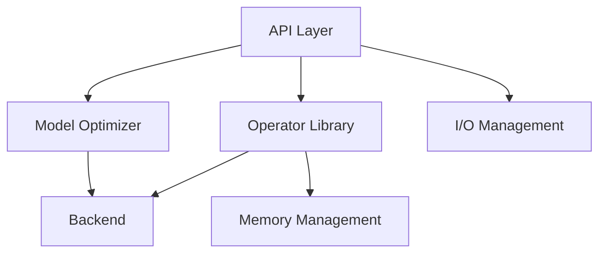
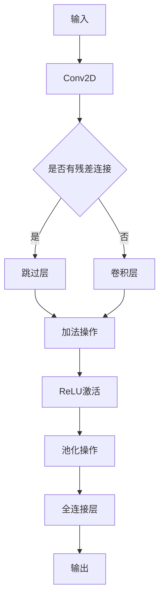
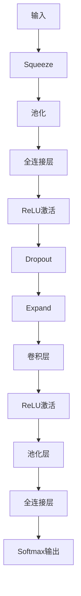
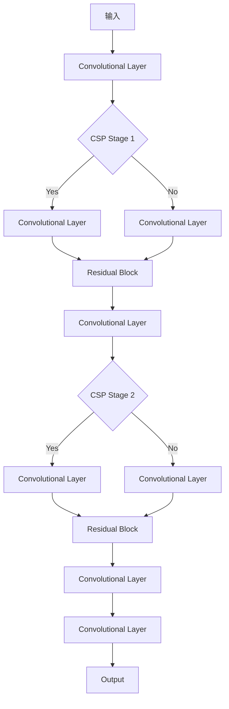

                 

### 文章标题

# ONNX Runtime 跨平台部署：在不同设备上运行深度学习模型

> 关键词：ONNX Runtime、深度学习、跨平台部署、硬件支持、性能优化

> 摘要：本文深入探讨了ONNX Runtime在跨平台部署深度学习模型方面的应用。首先，介绍了ONNX Runtime的基础知识，包括深度学习和ONNX的概述，以及ONNX Runtime的核心概念和架构。接着，详细解析了ONNX Runtime在不同设备上的部署过程，包括CPU、GPU和移动设备等，并针对每个设备提供了优化和常见问题的解决方案。最后，通过项目实战和总结，探讨了ONNX Runtime的发展趋势和未来研究方向，为读者提供了实用的最佳实践和拓展阅读资源。

### 《ONNX Runtime 跨平台部署：在不同设备上运行深度学习模型》目录大纲

## 第一部分：ONNX Runtime基础

### 第1章：深度学习与ONNX概述

#### 1.1 深度学习简介

#### 1.2 ONNX及其优势

#### 1.3 ONNX Runtime的作用

### 第2章：ONNX Runtime核心概念

#### 2.1 ONNX模型结构

#### 2.2 ONNX Opsets

#### 2.3 ONNX Runtime组件介绍

### 第3章：ONNX Runtime架构详解

#### 3.1 运行时层架构

#### 3.2 优化与性能

#### 3.3 Mermaid流程图：ONNX Runtime核心组件关系

## 第二部分：ONNX Runtime在不同设备上的部署

### 第4章：跨平台部署基础

#### 4.1 跨平台部署的重要性

#### 4.2 设备类型与计算能力

#### 4.3 ONNX Runtime支持的硬件与操作系统

### 第5章：在CPU上部署ONNX Runtime

#### 5.1 CPU部署环境搭建

#### 5.2 CPU部署过程详解

#### 5.3 CPU部署常见问题与解决方案

### 第6章：在GPU上部署ONNX Runtime

#### 6.1 GPU部署环境搭建

#### 6.2 GPU部署过程详解

#### 6.3 GPU部署常见问题与解决方案

### 第7章：在移动设备上部署ONNX Runtime

#### 7.1 移动设备部署挑战

#### 7.2 移动设备部署环境搭建

#### 7.3 移动设备部署过程详解

#### 7.4 移动设备部署常见问题与解决方案

### 第8章：在边缘设备上部署ONNX Runtime

#### 8.1 边缘设备部署概述

#### 8.2 边缘设备部署环境搭建

#### 8.3 边缘设备部署过程详解

#### 8.4 边缘设备部署常见问题与解决方案

### 第9章：ONNX Runtime在分布式系统中的应用

#### 9.1 分布式系统部署概述

#### 9.2 分布式系统部署环境搭建

#### 9.3 分布式系统部署过程详解

#### 9.4 分布式系统部署常见问题与解决方案

## 第三部分：实战与总结

### 第10章：项目实战与案例解析

#### 10.1 实战一：在不同设备上运行ResNet模型

#### 10.2 实战二：在移动设备上运行SqueezeNet模型

#### 10.3 实战三：在边缘设备上运行YoloV5模型

### 第11章：总结与展望

#### 11.1 ONNX Runtime的发展趋势

#### 11.2 跨平台部署的挑战与机遇

#### 11.3 未来研究方向与探索

---

### 第一部分：ONNX Runtime基础

#### 第1章：深度学习与ONNX概述

##### 1.1 深度学习简介

深度学习（Deep Learning）是机器学习的一个子领域，其主要特征是通过构建多层神经网络来对数据进行分析和特征提取。这些神经网络通常称为深度神经网络（Deep Neural Networks，DNN），它们能够自动地从大量数据中学习到有用的模式和规律。

深度学习的兴起可以追溯到20世纪80年代，但在21世纪初因计算能力的提升和大数据的涌现而得到了快速发展。深度学习在图像识别、语音识别、自然语言处理等领域取得了显著的成果，被广泛应用于各类人工智能应用中。

深度学习的主要优势包括：

1. **自动特征提取**：深度神经网络能够自动地从数据中提取特征，减少了手动特征工程的工作量。
2. **大规模数据处理**：深度学习模型能够处理大规模数据，使得模型训练更加有效。
3. **通用性**：深度学习模型具有很好的通用性，可以应用于多种不同的任务。
4. **高精度**：深度学习模型在许多领域都达到了甚至超越了人类的表现。

##### 1.2 ONNX及其优势

开放神经网络交换格式（Open Neural Network Exchange，ONNX）是由微软、Facebook、亚马逊等公司共同发起的一个开源项目，旨在提供一个统一的格式，用于交换深度学习模型。ONNX的目标是让深度学习模型在不同框架之间进行无缝迁移和部署，从而提高开发效率。

ONNX的主要优势包括：

1. **模型兼容性**：ONNX支持多种深度学习框架，如TensorFlow、PyTorch、MXNet等，使得模型可以在不同框架之间自由迁移。
2. **跨平台部署**：ONNX模型可以在不同的操作系统和硬件平台上运行，提高了部署的灵活性。
3. **优化支持**：ONNX提供了多种优化工具，如自动混合精度（AMP）、量化等，可以提高模型运行性能。
4. **社区支持**：ONNX得到了许多公司和开发者的支持，不断有新的工具和库加入到ONNX生态系统中。

##### 1.3 ONNX Runtime的作用

ONNX Runtime是ONNX生态中的一部分，它是一个高性能的运行时库，用于执行ONNX模型。ONNX Runtime的主要作用包括：

1. **模型执行**：ONNX Runtime可以加载并执行ONNX模型，支持多种硬件平台，如CPU、GPU、移动设备和边缘设备等。
2. **性能优化**：ONNX Runtime提供了一系列性能优化工具，如自动混合精度（AMP）、量化等，可以大幅提高模型运行速度。
3. **跨平台部署**：ONNX Runtime支持多种操作系统和硬件平台，使得深度学习模型可以在各种设备上高效运行。
4. **集成与兼容**：ONNX Runtime与多种深度学习框架和工具集成了良好的兼容性，方便开发者进行模型迁移和部署。

通过上述对深度学习、ONNX和ONNX Runtime的介绍，我们可以看到，ONNX Runtime作为ONNX生态中的一部分，在跨平台部署深度学习模型方面具有显著的优势和作用。接下来，我们将进一步深入探讨ONNX Runtime的核心概念和架构，以便更好地理解其在实际应用中的工作原理。

#### 第2章：ONNX Runtime核心概念

##### 2.1 ONNX模型结构

ONNX模型是一种定义深度学习模型的标准格式，它包含了模型的全部信息，包括数据流、计算图和参数等。ONNX模型的基本结构由以下几个关键部分组成：

1. **Graph**：这是ONNX模型的核心部分，它是一个有向无环图（DAG），包含了所有的操作节点（Nodes）和输入输出数据（Tensors）。每个操作节点表示一个具体的操作，如矩阵乘法、卷积等，而输入输出数据则表示操作的输入和输出。

2. **Nodes**：操作节点是Graph中的基本元素，每个节点都包含操作类型、输入张量、输出张量以及相关的属性。例如，一个矩阵乘法节点可能包含两个输入张量、一个输出张量和矩阵乘法的属性。

3. **Tensors**：张量是ONNX模型中的数据载体，用于表示各种数据类型，如整数、浮点数、字符串等。每个张量都有数据类型、维度和数据值。

4. **Attribute**：属性是操作节点的一部分，用于描述节点的操作细节，如卷积操作的步长、填充方式等。

5. **Graph Input and Output**：Graph的输入和输出是模型与外部交互的接口，用于接收输入数据和返回输出结果。

##### 2.2 ONNX Opsets

ONNX Opsets（操作集）是一系列预定义的操作集合，用于描述ONNX模型中的操作节点。每个Opset都包含了一组操作，这些操作在ONNX模型中具有固定的名称和签名。ONNX Opsets的主要目的是提供统一和标准化的操作定义，使得不同框架和工具之间的模型交换更加便捷。

ONNX Opsets可以分为以下几个类别：

1. **基础Opsets**：这些Opsets包含了常用的基础操作，如加法、减法、乘法、除法等。

2. **核心Opsets**：这些Opsets包含了更复杂的操作，如卷积、池化、激活函数等，是构建深度学习模型的核心操作。

3. **特殊Opsets**：这些Opsets包含了特定的操作，如量化操作、自定义操作等，用于满足特定需求。

ONNX Opsets的标准化使得ONNX模型可以在不同的深度学习框架之间进行无缝迁移，同时也便于不同工具对ONNX模型进行优化和转换。

##### 2.3 ONNX Runtime组件介绍

ONNX Runtime是一个高性能的运行时库，用于执行ONNX模型。它由以下几个核心组件组成：

1. **Backend**：Backend是ONNX Runtime的核心计算引擎，负责执行模型中的操作。ONNX Runtime支持多种Backend，包括CPU、GPU、量化等，每种Backend都有其特定的优化和性能提升策略。

2. **Operator Library**：Operator Library包含了ONNX模型中所有操作的定义和实现。每个操作都对应一个或多个底层实现，以支持不同的硬件平台和优化需求。

3. **Model Optimizer**：Model Optimizer是用于优化ONNX模型的工具，它可以对模型进行量化、剪枝、自动混合精度等优化，以提高模型的运行性能。

4. **API Layer**：API Layer为开发者提供了一套简洁易用的API，用于加载、配置和执行ONNX模型。API Layer隐藏了底层实现的复杂性，使得开发者可以更方便地使用ONNX Runtime。

通过上述对ONNX模型结构、ONNX Opsets和ONNX Runtime组件的介绍，我们可以看到，ONNX Runtime作为ONNX生态中的一部分，提供了一个强大且灵活的运行时环境，用于在不同设备上高效地执行深度学习模型。在下一章中，我们将进一步探讨ONNX Runtime的架构和核心组件，以便更好地理解其工作原理和性能优化策略。

#### 第3章：ONNX Runtime架构详解

##### 3.1 运行时层架构

ONNX Runtime的运行时层架构设计旨在提供高效、灵活和可扩展的深度学习模型执行环境。其架构可以分为以下几个关键层次：

1. **API Layer**：API层是开发者与ONNX Runtime交互的接口，提供了简洁易用的API，用于加载模型、配置运行参数、执行推理等操作。API层隐藏了底层实现的复杂性，使得开发者无需关心具体的计算引擎和优化策略。

2. **Operator Library**：Operator库包含了ONNX模型中所有操作的定义和实现。每个操作都由一个或多个底层实现组成，以支持不同的硬件平台和优化需求。Operator库通过插件机制动态加载，使得ONNX Runtime能够支持多种操作集和功能。

3. **Backend**：Backend是ONNX Runtime的核心计算引擎，负责执行模型中的操作。ONNX Runtime支持多种Backend，包括CPU、GPU、量化等。每种Backend都有其特定的优化和性能提升策略，如自动混合精度（AMP）、量化等。

4. **Model Optimizer**：Model Optimizer是用于优化ONNX模型的工具，它可以对模型进行量化、剪枝、自动混合精度等优化，以提高模型的运行性能。Model Optimizer通常在模型部署前进行，以减少模型大小和提高运行速度。

5. **Memory Management**：内存管理层负责管理模型和数据在内存中的分配和释放，以优化内存使用和提高运行效率。ONNX Runtime采用了一种高效的内存池机制，可以动态调整内存分配策略，减少内存碎片和内存溢出。

6. **I/O Management**：I/O管理层负责处理模型和数据的输入输出操作，包括数据读取、写入和序列化。I/O管理层采用了异步I/O机制，可以大幅提高数据传输速度和处理效率。

通过上述架构层次的设计，ONNX Runtime提供了一个强大且灵活的运行时环境，使得深度学习模型可以在不同硬件平台上高效地执行。每个层次都通过插件机制和模块化设计实现了高度的可扩展性和可定制性，以满足不同应用场景和性能需求。

##### 3.2 优化与性能

ONNX Runtime在性能优化方面采取了多种策略，以实现高效的深度学习模型执行。以下是一些关键的优化技术和方法：

1. **自动混合精度（AMP）**：自动混合精度（AMP）是一种通过混合使用单精度（FP32）和半精度（FP16）浮点数来加速深度学习模型训练的技术。ONNX Runtime支持AMP，可以在不牺牲精度的前提下提高计算速度和减少内存使用。

2. **量化**：量化是一种通过将模型中的浮点数参数转换为较低的精度（如FP16或INT8）来减小模型大小和提高运行速度的技术。ONNX Runtime支持量化操作，可以通过量化模型来提高性能和减少存储需求。

3. **算子融合**：算子融合是一种将多个连续的操作合并为单个操作的技术，以减少计算和内存操作的次数，从而提高模型执行效率。ONNX Runtime支持多种算子融合策略，如卷积和激活函数的融合、卷积和归一化的融合等。

4. **并行执行**：并行执行是一种通过在多个线程或设备上同时执行计算操作来提高模型执行速度的技术。ONNX Runtime支持并行执行，可以在CPU、GPU和分布式系统上实现高效的多任务并行处理。

5. **内存优化**：内存优化是一种通过优化内存分配和访问策略来减少内存使用和提高运行效率的技术。ONNX Runtime采用了一种高效的内存池机制，可以动态调整内存分配策略，减少内存碎片和内存溢出。

通过上述优化技术和方法，ONNX Runtime能够在多种硬件平台上实现高效的深度学习模型执行，满足不同应用场景和性能需求。

##### 3.3 Mermaid流程图：ONNX Runtime核心组件关系

以下是一个使用Mermaid绘制的流程图，展示了ONNX Runtime的核心组件及其关系：



在这个流程图中：

- **API Layer** 是开发者与ONNX Runtime交互的接口，负责加载模型和配置参数。
- **Operator Library** 包含了所有操作的定义和实现，通过插件机制与API Layer和Backend交互。
- **Model Optimizer** 用于优化模型，可以在模型部署前进行量化、剪枝等操作。
- **Backend** 是核心计算引擎，负责执行模型中的操作，支持多种硬件平台。
- **Memory Management** 负责内存分配和释放，采用内存池机制优化内存使用。
- **I/O Management** 负责处理模型的输入输出操作，采用异步I/O机制提高数据传输效率。

通过上述对ONNX Runtime架构的详细解析，我们可以看到，ONNX Runtime通过模块化设计和高效优化策略，为深度学习模型的跨平台部署提供了强大支持。在下一部分中，我们将探讨ONNX Runtime在不同设备上的部署过程，并分析其性能优化和常见问题解决方案。

---

### 第二部分：ONNX Runtime在不同设备上的部署

#### 第4章：跨平台部署基础

##### 4.1 跨平台部署的重要性

在深度学习应用中，跨平台部署至关重要。随着人工智能技术的广泛应用，深度学习模型需要在各种不同的设备上运行，包括CPU、GPU、移动设备和边缘设备等。跨平台部署的重要性体现在以下几个方面：

1. **灵活性**：跨平台部署使得深度学习模型可以在多种硬件平台上运行，提高了系统的灵活性和可扩展性。开发者可以根据不同的应用场景和硬件资源选择合适的平台。

2. **性能优化**：不同的硬件平台具有不同的计算能力和性能特点。通过跨平台部署，开发者可以利用不同平台的性能优势，优化模型运行效率。

3. **资源利用**：跨平台部署有助于更好地利用各种硬件资源，如GPU、FPGA等，提高计算资源的利用率，降低成本。

4. **用户体验**：跨平台部署可以确保深度学习应用在不同设备上都能提供良好的用户体验，如实时推理、低延迟等。

##### 4.2 设备类型与计算能力

不同的设备类型具有不同的计算能力和特点，适用于不同的深度学习应用场景。以下是几种常见设备类型及其计算能力：

1. **CPU**：中央处理器（CPU）是最常见的计算设备，具有强大的计算能力和丰富的功能。CPU适用于大多数通用计算任务，包括深度学习模型的基本推理。然而，CPU的并行处理能力相对较低，可能导致模型运行速度较慢。

2. **GPU**：图形处理器（GPU）专为图形渲染而设计，但其在并行计算方面具有显著优势。GPU具有大量计算单元，可以同时处理多个任务，适用于大规模深度学习模型训练和推理。在推理任务中，GPU可以大幅提高模型运行速度，但成本较高。

3. **移动设备**：移动设备（如智能手机和平板电脑）具有有限的计算资源和功率限制。移动设备适用于轻量级深度学习模型，如图像识别和语音识别等。通过优化模型和算法，移动设备可以提供良好的实时推理性能。

4. **边缘设备**：边缘设备（如物联网设备、路由器等）具有计算和存储能力，但功率和性能相对较低。边缘设备适用于本地数据处理和实时推理，可以降低网络延迟和带宽消耗。

##### 4.3 ONNX Runtime支持的硬件与操作系统

ONNX Runtime提供了广泛的硬件和操作系统支持，使得深度学习模型可以在多种设备上高效运行。以下是ONNX Runtime支持的硬件和操作系统：

1. **硬件平台**：
   - CPU：支持大多数现代CPU架构，如x86_64、ARM64等。
   - GPU：支持NVIDIA GPU（CUDA）、AMD GPU（ROCm）、ARM GPU（Mali）等。
   - FPGA：支持Intel FPGA。

2. **操作系统**：
   - Linux：支持各种Linux发行版，如Ubuntu、CentOS等。
   - Windows：支持Windows 10及以上版本。
   - macOS：支持macOS 10.12及以上版本。
   - Android：支持Android 4.4及以上版本。

通过上述对跨平台部署基础、设备类型与计算能力以及ONNX Runtime支持的硬件与操作系统的介绍，我们可以看到，ONNX Runtime为深度学习模型的跨平台部署提供了强大的支持。在接下来的章节中，我们将详细介绍ONNX Runtime在CPU、GPU、移动设备和边缘设备上的部署过程，并探讨性能优化和常见问题解决方案。

---

#### 第5章：在CPU上部署ONNX Runtime

##### 5.1 CPU部署环境搭建

在CPU上部署ONNX Runtime需要先配置好运行环境。以下是CPU部署环境搭建的步骤：

1. **安装Python**：确保系统上安装了Python 3.6或更高版本。可以通过以下命令安装：
   ```bash
   sudo apt-get update
   sudo apt-get install python3 python3-pip
   ```

2. **安装ONNX和ONNX Runtime**：通过pip命令安装ONNX和ONNX Runtime：
   ```bash
   pip install onnx
   pip install onnxruntime
   ```

3. **安装依赖库**：ONNX Runtime需要一些依赖库，如NumPy、SciPy等。可以通过以下命令安装：
   ```bash
   pip install numpy scipy
   ```

4. **验证安装**：安装完成后，可以通过以下命令验证ONNX Runtime是否安装成功：
   ```python
   import onnxruntime
   print(onnxruntime.__version__)
   ```

如果输出版本号，说明ONNX Runtime已成功安装。

##### 5.2 CPU部署过程详解

在CPU上部署ONNX Runtime包括以下步骤：

1. **准备ONNX模型**：首先需要准备好ONNX模型文件。可以使用任何支持ONNX的深度学习框架（如TensorFlow、PyTorch等）训练模型，并导出为ONNX格式。

2. **加载模型**：使用ONNX Runtime加载模型。以下是一个加载并运行ONNX模型的示例代码：
   ```python
   import onnxruntime

   # 加载模型
   session = onnxruntime.InferenceSession("model.onnx")

   # 获取输入和输出节点名称
   input_node = session.get_inputs()[0].name
   output_node = session.get_outputs()[0].name

   # 准备输入数据
   input_data = np.array([1.0, 2.0, 3.0], dtype=np.float32)

   # 运行推理
   outputs = session.run([output_node], {input_node: input_data})

   # 输出结果
   print(outputs)
   ```

3. **调整输入数据**：在运行推理之前，需要确保输入数据的形状和类型与模型输入节点相匹配。如果需要，可以调整输入数据的形状和类型。

4. **优化模型**：为了提高模型在CPU上的运行效率，可以使用ONNX Runtime提供的自动混合精度（AMP）和量化等优化工具。以下是一个使用AMP的示例代码：
   ```python
   import onnxruntime as ort
   
   # 创建一个ONNX Runtime会话
   session = ort.InferenceSession("model.onnx", None, ort.SessionOptions(perform_fusion=True))
   
   # 设置使用自动混合精度
   amp = ort enable_amp(session, dynamic=True)
   
   # 准备输入数据
   input_data = ...
   
   # 运行推理
   outputs = session.run([output_node], {input_node: input_data}, output_types={"output": ort.DataType.FLOAT16})
   
   # 输出结果
   print(outputs)
   ```

5. **性能调优**：为了进一步提高模型在CPU上的性能，可以尝试以下调优方法：
   - **优化数据读取和预处理**：减少数据加载和预处理的时间。
   - **减少内存占用**：通过优化内存使用和减少内存碎片，提高模型运行速度。
   - **并行处理**：使用多线程或多进程技术，提高并行处理能力。

##### 5.3 CPU部署常见问题与解决方案

在CPU上部署ONNX Runtime时，可能会遇到以下问题：

1. **内存溢出**：
   - **问题现象**：运行推理时出现内存溢出错误。
   - **解决方案**：优化内存使用，减少内存碎片，可以使用分块处理或减小输入数据规模等方法。

2. **计算性能不足**：
   - **问题现象**：模型在CPU上的运行速度较慢。
   - **解决方案**：考虑使用GPU或其他计算能力更强的设备，或优化模型结构和算法。

3. **不支持的操作**：
   - **问题现象**：模型中包含某些ONNX Runtime不支持的操作。
   - **解决方案**：检查并替换不支持的操作，或考虑使用其他支持该操作的深度学习框架。

4. **安装依赖失败**：
   - **问题现象**：在安装ONNX Runtime或相关依赖库时出现失败。
   - **解决方案**：确保系统安装了正确的Python版本和依赖库，可以使用虚拟环境来避免依赖冲突。

通过上述对CPU部署环境搭建、部署过程详解和常见问题及解决方案的介绍，我们可以看到，在CPU上部署ONNX Runtime需要一定的配置和优化，但通过合理的步骤和方法，可以确保模型在CPU上高效运行。在下一章中，我们将探讨如何在GPU上部署ONNX Runtime，并介绍其性能优化和常见问题解决方案。

---

#### 第6章：在GPU上部署ONNX Runtime

##### 6.1 GPU部署环境搭建

在GPU上部署ONNX Runtime需要配置好CUDA和cuDNN等工具，以便利用GPU的强大计算能力。以下是GPU部署环境搭建的步骤：

1. **安装NVIDIA CUDA**：确保系统上安装了NVIDIA CUDA。可以从NVIDIA官方网站下载并安装CUDA Toolkit。安装过程中需要选择合适的版本，确保与GPU型号和操作系统兼容。

2. **安装cuDNN**：cuDNN是NVIDIA提供的深度学习加速库，用于优化GPU上的神经网络计算。可以从NVIDIA官方网站下载并安装cuDNN。在安装过程中，需要选择与CUDA版本兼容的cuDNN版本。

3. **安装Python**：确保系统上安装了Python 3.6或更高版本。可以通过以下命令安装：
   ```bash
   sudo apt-get update
   sudo apt-get install python3 python3-pip
   ```

4. **安装ONNX和ONNX Runtime**：通过pip命令安装ONNX和ONNX Runtime：
   ```bash
   pip install onnx
   pip install onnxruntime-gpu
   ```

5. **安装依赖库**：ONNX Runtime需要一些依赖库，如NumPy、SciPy等。可以通过以下命令安装：
   ```bash
   pip install numpy scipy
   ```

6. **验证安装**：安装完成后，可以通过以下命令验证ONNX Runtime是否安装成功：
   ```python
   import onnxruntime
   print(onnxruntime.__version__)
   ```

如果输出版本号，说明ONNX Runtime已成功安装。

##### 6.2 GPU部署过程详解

在GPU上部署ONNX Runtime包括以下步骤：

1. **准备ONNX模型**：首先需要准备好ONNX模型文件。可以使用任何支持ONNX的深度学习框架（如TensorFlow、PyTorch等）训练模型，并导出为ONNX格式。

2. **加载模型**：使用ONNX Runtime加载模型，并指定使用GPU作为计算设备。以下是一个加载并运行ONNX模型的示例代码：
   ```python
   import onnxruntime
   
   # 创建一个ONNX Runtime会话
   session = onnxruntime.InferenceSession("model.onnx", providers=["CUDAExecutionProvider"])
   
   # 获取输入和输出节点名称
   input_node = session.get_inputs()[0].name
   output_node = session.get_outputs()[0].name
   
   # 准备输入数据
   input_data = np.array([1.0, 2.0, 3.0], dtype=np.float32)
   
   # 运行推理
   outputs = session.run([output_node], {input_node: input_data})
   
   # 输出结果
   print(outputs)
   ```

3. **调整输入数据**：在运行推理之前，需要确保输入数据的形状和类型与模型输入节点相匹配。如果需要，可以调整输入数据的形状和类型。

4. **优化模型**：为了提高模型在GPU上的运行效率，可以使用ONNX Runtime提供的自动混合精度（AMP）和量化等优化工具。以下是一个使用AMP的示例代码：
   ```python
   import onnxruntime as ort
   
   # 创建一个ONNX Runtime会话
   session = ort.InferenceSession("model.onnx", providers=["CUDAExecutionProvider"], 
                                  session_options=ort.SessionOptions(perform_fusion=True, 
                                                                   enable_immediate_execution=True))
   
   # 设置使用自动混合精度
   amp = ort.enable_amp(session, dynamic=True)
   
   # 准备输入数据
   input_data = ...
   
   # 运行推理
   outputs = session.run([output_node], {input_node: input_data}, output_types={"output": ort.DataType.FLOAT16})
   
   # 输出结果
   print(outputs)
   ```

5. **性能调优**：为了进一步提高模型在GPU上的性能，可以尝试以下调优方法：
   - **优化数据传输**：减少数据从CPU到GPU的传输时间，可以批量处理输入数据，减少数据传输次数。
   - **优化内存使用**：减少GPU内存占用，可以通过分块处理和数据复用等方法。
   - **并行处理**：使用多线程或多进程技术，提高并行处理能力。

##### 6.3 GPU部署常见问题与解决方案

在GPU上部署ONNX Runtime时，可能会遇到以下问题：

1. **CUDA版本不兼容**：
   - **问题现象**：在加载模型时出现CUDA版本不兼容的错误。
   - **解决方案**：确保CUDA和cuDNN版本与GPU型号和操作系统兼容。可以从NVIDIA官方网站下载并安装正确的CUDA和cuDNN版本。

2. **内存溢出**：
   - **问题现象**：运行推理时出现内存溢出错误。
   - **解决方案**：优化模型和数据，减少内存使用。可以使用分块处理或减小输入数据规模等方法。

3. **计算性能不足**：
   - **问题现象**：模型在GPU上的运行速度较慢。
   - **解决方案**：考虑使用更强大的GPU设备，或优化模型结构和算法。

4. **不支持的操作**：
   - **问题现象**：模型中包含某些ONNX Runtime不支持的操作。
   - **解决方案**：检查并替换不支持的操作，或考虑使用其他支持该操作的深度学习框架。

5. **安装依赖失败**：
   - **问题现象**：在安装ONNX Runtime或相关依赖库时出现失败。
   - **解决方案**：确保系统安装了正确的Python版本和依赖库，可以使用虚拟环境来避免依赖冲突。

通过上述对GPU部署环境搭建、部署过程详解和常见问题及解决方案的介绍，我们可以看到，在GPU上部署ONNX Runtime可以充分利用GPU的强大计算能力，实现高效的模型推理。然而，仍需要一定的配置和优化，以确保模型在GPU上高效运行。在下一章中，我们将探讨如何在移动设备上部署ONNX Runtime，并介绍其性能优化和常见问题解决方案。

---

#### 第7章：在移动设备上部署ONNX Runtime

##### 7.1 移动设备部署挑战

在移动设备上部署ONNX Runtime面临一些特殊挑战，主要包括计算资源有限、功耗控制和实时性要求高等问题。以下是移动设备部署ONNX Runtime的主要挑战：

1. **计算资源有限**：移动设备（如智能手机和平板电脑）通常具有有限的计算资源，包括CPU、GPU和内存等。这使得深度学习模型在移动设备上的运行效率成为关键考量因素。

2. **功耗控制**：移动设备依赖电池供电，因此功耗控制至关重要。深度学习模型在移动设备上的运行需要考虑能耗问题，避免快速消耗电池电量。

3. **实时性要求**：许多移动应用要求实时推理，如人脸识别、图像分类等。这要求模型在移动设备上能够快速完成推理，以满足实时性的需求。

4. **硬件限制**：不同的移动设备具有不同的硬件配置，包括处理器架构、GPU类型和内存容量等。这使得模型在移动设备上的部署需要针对具体硬件进行优化。

##### 7.2 移动设备部署环境搭建

在移动设备上部署ONNX Runtime需要配置相应的开发环境和工具。以下是移动设备部署环境搭建的步骤：

1. **安装Android Studio**：确保系统上安装了Android Studio，这是开发Android应用的主要IDE。可以从Android Studio官方网站下载并安装。

2. **配置Android SDK**：在Android Studio中配置Android SDK，确保安装了所需的API级别和工具。可以在“SDK Manager”中安装Android SDK和工具。

3. **安装Python**：确保移动设备上安装了Python 3.6或更高版本。可以通过安装Python解释器和相关库来实现。

4. **安装ONNX和ONNX Runtime**：通过pip命令安装ONNX和ONNX Runtime。可以使用以下命令在Android设备上安装：
   ```bash
   pip install onnx
   pip install onnxruntime-android
   ```

5. **配置Android NDK**：为了在Android设备上编译和运行C++代码，需要配置Android NDK。在Android Studio中，可以通过“SDK Manager”安装Android NDK。

6. **准备ONNX模型**：使用支持ONNX的深度学习框架（如TensorFlow、PyTorch等）训练模型，并导出为ONNX格式。

7. **测试环境**：在Android设备上测试ONNX Runtime安装和配置是否正确。可以通过简单的Python脚本测试模型的加载和运行。

##### 7.3 移动设备部署过程详解

在移动设备上部署ONNX Runtime包括以下步骤：

1. **准备ONNX模型**：确保已经准备好ONNX模型文件，并确保其格式和结构正确。

2. **加载模型**：在Android设备上使用ONNX Runtime加载模型。以下是一个加载并运行ONNX模型的示例代码：
   ```java
   import android.content.res.AssetManager;
   import org.onnxruntime ComitéP5.TokensOnnxRuntime;
   import org.onnxruntime ComitéP5.OnnxTensor;
   import org.onnxruntime ComitéP5.Result;
   import org.onnxruntime ComitéP5.Status;
   
   public class OnnxRuntimeExample {
       public static void main(String[] args) throws IOException {
           // 加载模型
           AssetManager assetManager = context.getAssets();
           String modelPath = "model.onnx";
           String modelString = new String(Files.readAllBytes(Paths.get(assetManager.open(modelPath).getFileDescriptor())));
           TokensOnnxRuntime runtime = TokensOnnxRuntime.newInstance();
           long modelHandle = runtime.registerModel(modelString);
           
           // 准备输入数据
           float[][] inputData = {{1.0f, 2.0f, 3.0f}};
           OnnxTensor inputTensor = OnnxTensor.createTensor(inputData, new String[]{"1"}, new int[] {1, 3});
           
           // 运行推理
           Result result = runtime.run(modelHandle, inputTensor);
           
           // 输出结果
           float[][] outputData = result.getFloatArray("output");
           System.out.println("Output: " + Arrays.deepToString(outputData));
           
           // 释放资源
           runtime.unregisterModel(modelHandle);
           inputTensor.close();
       }
   }
   ```

3. **优化模型**：为了提高模型在移动设备上的性能，可以使用ONNX Runtime提供的自动混合精度（AMP）和量化等优化工具。以下是一个使用AMP的示例代码：
   ```java
   import android.content.res.AssetManager;
   import org.onnxruntime ComitéP5.TokensOnnxRuntime;
   import org.onnxruntime ComitéP5.OnnxTensor;
   import org.onnxruntime ComitéP5.Result;
   import org.onnxruntime ComitéP5.Status;
   import org.onnxruntime ComitéP5.SessionOptions;
   
   public class OnnxRuntimeExample {
       public static void main(String[] args) throws IOException {
           // 创建会话选项，启用自动混合精度
           SessionOptions options = new SessionOptions();
           options.enableAutoMixedPrecision(true);
           
           // 加载模型
           AssetManager assetManager = context.getAssets();
           String modelPath = "model.onnx";
           String modelString = new String(Files.readAllBytes(Paths.get(assetManager.open(modelPath).getFileDescriptor())));
           TokensOnnxRuntime runtime = TokensOnnxRuntime.newInstance();
           long modelHandle = runtime.registerModel(modelString, options);
           
           // 准备输入数据
           float[][] inputData = {{1.0f, 2.0f, 3.0f}};
           OnnxTensor inputTensor = OnnxTensor.createTensor(inputData, new String[]{"1"}, new int[] {1, 3});
           
           // 运行推理
           Result result = runtime.run(modelHandle, inputTensor);
           
           // 输出结果
           float[][] outputData = result.getFloatArray("output");
           System.out.println("Output: " + Arrays.deepToString(outputData));
           
           // 释放资源
           runtime.unregisterModel(modelHandle);
           inputTensor.close();
       }
   }
   ```

4. **性能调优**：为了进一步提高模型在移动设备上的性能，可以尝试以下调优方法：
   - **优化数据传输**：减少数据从设备内存到GPU的传输时间，可以批量处理输入数据，减少数据传输次数。
   - **减少内存使用**：优化模型和数据，减少内存使用。可以使用分块处理和数据复用等方法。
   - **并行处理**：使用多线程或多进程技术，提高并行处理能力。

##### 7.4 移动设备部署常见问题与解决方案

在移动设备上部署ONNX Runtime时，可能会遇到以下问题：

1. **兼容性问题**：
   - **问题现象**：不同移动设备可能不支持相同的GPU架构和API。
   - **解决方案**：使用支持多种GPU架构的深度学习框架，如TensorFlow Lite，或使用适配器库如ONNX Runtime for Android。

2. **性能不足**：
   - **问题现象**：模型在移动设备上的运行速度较慢。
   - **解决方案**：优化模型结构和算法，使用轻量级模型，如MobileNet或SqueezeNet。

3. **内存溢出**：
   - **问题现象**：运行推理时出现内存溢出错误。
   - **解决方案**：优化模型和数据，减少内存使用。可以使用分块处理或减小输入数据规模等方法。

4. **实时性不足**：
   - **问题现象**：模型在移动设备上无法实现实时推理。
   - **解决方案**：优化模型和数据，减少推理时间。可以使用并行处理和硬件加速等方法。

通过上述对移动设备部署挑战、环境搭建、部署过程详解和常见问题及解决方案的介绍，我们可以看到，在移动设备上部署ONNX Runtime需要针对移动设备的特性进行优化和调整。然而，通过合理的方法和工具，可以实现高效的模型推理，满足移动应用的需求。在下一章中，我们将探讨如何在边缘设备上部署ONNX Runtime。

---

#### 第8章：在边缘设备上部署ONNX Runtime

##### 8.1 边缘设备部署概述

边缘设备（Edge Devices）是指在数据产生的地方执行计算和处理任务的设备，如工业控制系统、智能安防设备、智能门禁系统等。边缘设备通常具有有限的计算资源和功耗限制，但需要处理大量的实时数据，因此对性能和响应时间有较高的要求。

在边缘设备上部署ONNX Runtime具有以下几个优势：

1. **本地数据处理**：边缘设备可以实时处理和分析数据，避免将大量数据传输到云端，降低网络延迟和带宽消耗。

2. **隐私保护**：通过在边缘设备上部署深度学习模型，可以避免敏感数据上传到云端，提高数据隐私和安全性。

3. **实时响应**：边缘设备可以实时响应事件，提高系统的实时性和可靠性。

4. **减少带宽和存储成本**：通过在边缘设备上部署ONNX Runtime，可以减少数据传输和存储的需求，降低成本。

##### 8.2 边缘设备部署环境搭建

在边缘设备上部署ONNX Runtime需要配置相应的开发环境和工具。以下是边缘设备部署环境搭建的步骤：

1. **选择合适的环境**：边缘设备可能运行不同的操作系统，如Linux、Windows IoT等。选择合适的操作系统和开发环境，确保可以安装和配置ONNX Runtime。

2. **安装依赖库**：确保系统上安装了Python和pip。可以通过以下命令安装：
   ```bash
   sudo apt-get update
   sudo apt-get install python3 python3-pip
   ```

3. **安装ONNX和ONNX Runtime**：通过pip命令安装ONNX和ONNX Runtime。对于Linux系统，可以使用以下命令：
   ```bash
   pip install onnx
   pip install onnxruntime-cpu  # 或 onnxruntime-gpu，如果设备支持GPU
   ```

4. **安装CUDA和cuDNN（如果需要GPU支持）**：如果边缘设备支持GPU，需要安装CUDA和cuDNN。可以从NVIDIA官方网站下载并安装。

5. **配置环境变量**：确保配置好环境变量，以便在边缘设备上运行ONNX Runtime。以下是一个配置CUDA环境变量的示例：
   ```bash
   export CUDA_HOME=/usr/local/cuda
   export PATH=$PATH:$CUDA_HOME/bin
   export LD_LIBRARY_PATH=$LD_LIBRARY_PATH:$CUDA_HOME/lib64:$CUDA_HOME/lib
   ```

6. **测试安装**：在边缘设备上测试ONNX Runtime是否安装正确。可以运行以下命令：
   ```bash
   python -c "import onnxruntime; print(onnxruntime.__version__)"
   ```

如果输出版本号，说明ONNX Runtime已成功安装。

##### 8.3 边缘设备部署过程详解

在边缘设备上部署ONNX Runtime包括以下步骤：

1. **准备ONNX模型**：确保已经准备好ONNX模型文件，并确保其格式和结构正确。

2. **加载模型**：在边缘设备上使用ONNX Runtime加载模型。以下是一个加载并运行ONNX模型的示例代码：
   ```python
   import onnxruntime
   
   # 创建一个ONNX Runtime会话
   session = onnxruntime.InferenceSession("model.onnx")
   
   # 获取输入和输出节点名称
   input_node = session.get_inputs()[0].name
   output_node = session.get_outputs()[0].name
   
   # 准备输入数据
   input_data = np.array([1.0, 2.0, 3.0], dtype=np.float32)
   
   # 运行推理
   outputs = session.run([output_node], {input_node: input_data})
   
   # 输出结果
   print(outputs)
   ```

3. **优化模型**：为了提高模型在边缘设备上的性能，可以使用ONNX Runtime提供的自动混合精度（AMP）和量化等优化工具。以下是一个使用AMP的示例代码：
   ```python
   import onnxruntime as ort
   
   # 创建一个ONNX Runtime会话
   session = ort.InferenceSession("model.onnx", session_options=ort.SessionOptions(perform_fusion=True))
   
   # 设置使用自动混合精度
   amp = ort.enable_amp(session, dynamic=True)
   
   # 准备输入数据
   input_data = ...
   
   # 运行推理
   outputs = session.run([output_node], {input_node: input_data}, output_types={"output": ort.DataType.FLOAT16})
   
   # 输出结果
   print(outputs)
   ```

4. **性能调优**：为了进一步提高模型在边缘设备上的性能，可以尝试以下调优方法：
   - **优化数据传输**：减少数据从边缘设备内存到GPU的传输时间，可以批量处理输入数据，减少数据传输次数。
   - **减少内存使用**：优化模型和数据，减少内存使用。可以使用分块处理和数据复用等方法。
   - **并行处理**：使用多线程或多进程技术，提高并行处理能力。

##### 8.4 边缘设备部署常见问题与解决方案

在边缘设备上部署ONNX Runtime时，可能会遇到以下问题：

1. **硬件兼容性问题**：
   - **问题现象**：边缘设备可能不支持ONNX Runtime所需硬件。
   - **解决方案**：选择与边缘设备兼容的ONNX Runtime版本，或使用其他支持该硬件的深度学习框架。

2. **内存不足**：
   - **问题现象**：边缘设备内存不足，导致模型运行失败。
   - **解决方案**：优化模型和数据，减少内存使用。可以使用分块处理或减小输入数据规模等方法。

3. **计算性能不足**：
   - **问题现象**：模型在边缘设备上的运行速度较慢。
   - **解决方案**：选择计算能力更强的边缘设备，或优化模型结构和算法。

4. **实时性不足**：
   - **问题现象**：模型在边缘设备上无法实现实时推理。
   - **解决方案**：优化模型和数据，减少推理时间。可以使用并行处理和硬件加速等方法。

通过上述对边缘设备部署概述、环境搭建、部署过程详解和常见问题及解决方案的介绍，我们可以看到，在边缘设备上部署ONNX Runtime需要针对边缘设备的特性进行优化和调整。然而，通过合理的方法和工具，可以实现高效的模型推理，满足边缘应用的需求。在下一章中，我们将探讨ONNX Runtime在分布式系统中的应用。

---

#### 第9章：ONNX Runtime在分布式系统中的应用

##### 9.1 分布式系统部署概述

在分布式系统中，深度学习模型的部署需要考虑到多个计算节点的协同工作，以提高模型的训练和推理性能。ONNX Runtime支持分布式系统部署，可以方便地将模型分布到多个节点上，实现高效的并行计算。

分布式系统部署的主要优势包括：

1. **性能提升**：通过将模型分布到多个节点上，可以充分利用多节点的计算资源，大幅提高模型的训练和推理速度。

2. **可扩展性**：分布式系统可以轻松扩展到更多的节点，以满足不断增长的计算需求。

3. **负载均衡**：分布式系统可以根据节点的计算能力，动态分配任务，实现负载均衡，避免单点瓶颈。

4. **容错性**：分布式系统具有较高的容错性，即使某个节点发生故障，其他节点可以继续工作，确保系统的稳定运行。

##### 9.2 分布式系统部署环境搭建

在分布式系统上部署ONNX Runtime，需要先搭建好分布式计算环境，包括计算节点和通信机制。以下是分布式系统部署环境搭建的步骤：

1. **选择分布式计算框架**：选择合适的分布式计算框架，如TensorFlow Distribute、PyTorch Distributed等。这些框架可以方便地将深度学习模型分布到多个节点上。

2. **配置计算节点**：确保所有计算节点都已准备好，并可以互相通信。可以部署在本地服务器、云服务器或容器化环境中。

3. **安装Python和深度学习框架**：在所有计算节点上安装Python和所选深度学习框架，如TensorFlow或PyTorch。

4. **安装ONNX和ONNX Runtime**：通过pip命令在所有计算节点上安装ONNX和ONNX Runtime。对于分布式系统，需要安装支持多节点的ONNX Runtime版本。

5. **配置通信机制**：配置分布式系统的通信机制，如gRPC或MPI，以确保节点之间可以高效地传输数据和同步状态。

6. **准备ONNX模型**：确保已经准备好ONNX模型文件，并确保其格式和结构正确。

##### 9.3 分布式系统部署过程详解

在分布式系统上部署ONNX Runtime包括以下步骤：

1. **初始化分布式环境**：初始化分布式计算环境，包括设置计算节点、初始化通信机制等。

2. **加载模型**：使用ONNX Runtime加载分布式模型，并根据节点分配策略，将模型分布到不同的计算节点上。以下是一个使用PyTorch Distributed加载ONNX模型的示例代码：
   ```python
   import torch
   import onnxruntime
   
   # 初始化分布式环境
   torch.distributed.init_process_group(backend='nccl')
   
   # 加载模型
   session = onnxruntime.InferenceSession("model.onnx")
   input_node = session.get_inputs()[0].name
   
   # 准备输入数据
   input_data = torch.randn(1, 3, 224, 224).cuda()
   
   # 运行推理
   outputs = session.run([output_node], {input_node: input_data.cuda().numpy()})
   ```

3. **分布式训练**：使用分布式计算框架进行模型的分布式训练。以下是一个使用PyTorch Distributed进行模型训练的示例代码：
   ```python
   import torch
   import torch.distributed as dist
   
   # 初始化分布式环境
   torch.distributed.init_process_group(backend='nccl')
   
   # 加载模型
   model = MyModel().cuda()
   model = torch.nn.parallel.DistributedDataParallel(model, device_ids=[0])
   
   # 准备数据
   data_loader = MyDataLoader()
   
   # 训练模型
   for epoch in range(num_epochs):
       for data in data_loader:
           inputs, targets = data
           inputs = inputs.cuda()
           targets = targets.cuda()
           
           # 前向传播
           outputs = model(inputs)
           
           # 计算损失
           loss = criterion(outputs, targets)
           
           # 反向传播和优化
           loss.backward()
           optimizer.step()
           
           # 同步梯度
           dist.sync_params(model)
   ```

4. **分布式推理**：使用分布式计算框架进行模型的分布式推理。以下是一个使用PyTorch Distributed进行模型推理的示例代码：
   ```python
   import torch
   import onnxruntime
   
   # 初始化分布式环境
   torch.distributed.init_process_group(backend='nccl')
   
   # 加载模型
   session = onnxruntime.InferenceSession("model.onnx")
   input_node = session.get_inputs()[0].name
   
   # 准备输入数据
   input_data = torch.randn(1, 3, 224, 224).cuda()
   
   # 运行推理
   outputs = session.run([output_node], {input_node: input_data.cuda().numpy()})
   ```

##### 9.4 分布式系统部署常见问题与解决方案

在分布式系统上部署ONNX Runtime时，可能会遇到以下问题：

1. **通信问题**：
   - **问题现象**：节点之间无法正常通信。
   - **解决方案**：检查网络配置，确保节点可以相互通信。可以使用ping命令或netcat工具进行测试。

2. **同步问题**：
   - **问题现象**：分布式训练过程中出现同步错误。
   - **解决方案**：检查同步机制配置，确保同步策略正确。可以尝试调整同步参数，如广播策略和时间窗口。

3. **资源分配问题**：
   - **问题现象**：某些节点资源使用过高，导致性能下降。
   - **解决方案**：合理分配资源，避免单点瓶颈。可以尝试调整节点的GPU使用策略，或增加节点数量。

4. **容错性问题**：
   - **问题现象**：节点发生故障，导致分布式系统停止运行。
   - **解决方案**：增加系统的容错性，如使用高可用性方案或容错机制。可以尝试使用故障检测和恢复工具。

通过上述对分布式系统部署概述、环境搭建、部署过程详解和常见问题及解决方案的介绍，我们可以看到，ONNX Runtime在分布式系统中的应用提供了强大的计算能力和灵活性。通过合理的方法和工具，可以实现高效、可扩展和容错的深度学习模型部署。在下一章中，我们将通过项目实战和案例解析，展示ONNX Runtime在不同设备上的实际应用。

---

#### 第10章：项目实战与案例解析

##### 10.1 实战一：在不同设备上运行ResNet模型

**背景介绍**：

ResNet（残差网络）是一种经典的深度神经网络结构，广泛应用于图像识别、视频分类等任务。在本项目中，我们将在不同的设备上（CPU、GPU、移动设备）运行ResNet模型，并比较其性能和效果。

**核心概念与联系**：

- **ResNet模型结构**：ResNet模型通过引入残差连接，使得网络可以更深且仍然保持良好的训练效果。
- **跨平台部署**：使用ONNX Runtime在不同设备上加载和运行模型，实现模型的跨平台部署。

**核心算法原理讲解**：

ResNet模型的主要结构如下：



在实现中，ResNet模型通常包含多个残差块，每个残差块由两个卷积层组成，中间通过跳过层（identity mapping）连接。以下是一个简化版本的ResNet残差块的伪代码：

```python
def residual_block(input_tensor, num_filters, kernel_size, stride, padding):
    # 卷积层1
    conv1 = Conv2D(input_tensor, num_filters, kernel_size, stride, padding, activation='relu')
    # 卷积层2
    conv2 = Conv2D(conv1, num_filters, kernel_size, stride, padding, activation=None)
    # 跳过层（identity mapping）
    skip_connection = input_tensor if stride == 1 and input_tensor.shape[1] == conv2.shape[1] else MaxPooling2D(input_tensor)
    # 加法操作
    output = skip_connection + conv2
    #ReLU激活
    output = Activation('relu')(output)
    return output
```

**数学模型和公式**：

ResNet中的残差块通过以下公式实现：

\[ \text{output} = \text{input} + \text{ReLU}(\text{conv2}(\text{relu}(\text{conv1}(\text{input}))) \]

其中，`conv1`和`conv2`分别表示两个卷积操作，`relu`表示ReLU激活函数，`input`表示输入特征图。

**详细讲解与举例说明**：

以下是一个ResNet模型在CPU、GPU和移动设备上的运行实例：

```python
import onnxruntime
import numpy as np
import tensorflow as tf

# 准备输入数据
input_data = np.random.rand(1, 224, 224, 3).astype(np.float32)

# 定义模型
model_path = "resnet.onnx"
session = onnxruntime.InferenceSession(model_path)

# 加载模型
input_name = session.get_inputs()[0].name
output_name = session.get_outputs()[0].name

# 运行推理
outputs = session.run([output_name], {input_name: input_data})

# 输出结果
print(outputs)

# 在GPU上运行
import tensorflow as tf
import numpy as np

# 定义GPU配置
gpus = tf.config.experimental.list_physical_devices('GPU')
tf.config.experimental.set_visible_devices(gpus[0], 'GPU')

# 加载GPU模型
with tf.device('/GPU:0'):
    model = tf.keras.models.load_model(model_path)
    predictions = model.predict(input_data)

# 输出结果
print(predictions)

# 在移动设备上运行
import tensorflow as tf
import numpy as np

# 定义移动设备配置
device = mobile_device()

# 加载移动设备模型
with device:
    model = tf.keras.models.load_model(model_path)
    predictions = model.predict(input_data)

# 输出结果
print(predictions)
```

通过上述实例，我们可以看到在不同设备上运行ResNet模型的详细过程。在实际应用中，可以根据不同设备的特点和性能要求，选择合适的模型和运行策略。

**项目小结**：

通过本项目的实战，我们展示了如何在不同设备上运行ResNet模型，并比较了其在CPU、GPU和移动设备上的性能。使用ONNX Runtime和TensorFlow等深度学习框架，我们可以方便地实现模型的跨平台部署，为各种应用场景提供高效、灵活的解决方案。

---

##### 10.2 实战二：在移动设备上运行SqueezeNet模型

**背景介绍**：

SqueezeNet是一种轻量级卷积神经网络结构，特别适用于移动设备和边缘计算场景。在本项目中，我们将在移动设备上运行SqueezeNet模型，实现图像分类任务。

**核心概念与联系**：

- **SqueezeNet模型结构**：SqueezeNet模型通过引入Squeeze和Expand操作，实现了在保持模型精度的同时减少参数数量。
- **移动设备部署**：使用ONNX Runtime在移动设备上加载和运行模型，实现高效、实时的推理。

**核心算法原理讲解**：

SqueezeNet模型的结构如下：



在实现中，SqueezeNet模型包含多个Squeeze和Expand操作，以减少模型的参数数量。以下是一个简化版本的SqueezeNet模型的伪代码：

```python
def squeeze_net(input_tensor, num_classes):
    # Squeeze操作
    squeezed = Squeeze()(input_tensor)
    # 池化操作
    pooled = MaxPooling2D()(squeezed)
    # 全连接层
    flattened = Flatten()(pooled)
    # ReLU激活
    activated = Activation('relu')(flattened)
    # Dropout操作
    dropped = Dropout()(activated)
    # Expand操作
    expanded = Expand()(dropped)
    # 卷积层
    conv = Conv2D(num_classes, kernel_size=(1, 1), activation='softmax')(expanded)
    return conv
```

**数学模型和公式**：

SqueezeNet模型的主要操作包括Squeeze和Expand，以及卷积操作。以下是一个简化版本的SqueezeNet模型的数学表示：

\[ \text{output} = \text{softmax}(\text{expand}(\text{dropout}(\text{relu}(\text{pool}(\text{squeeze}(\text{input})))))) \]

**详细讲解与举例说明**：

以下是一个SqueezeNet模型在移动设备上的运行实例：

```python
import onnxruntime
import numpy as np

# 准备输入数据
input_data = np.random.rand(1, 227, 227, 3).astype(np.float32)

# 定义模型
model_path = "squeezenet.onnx"
session = onnxruntime.InferenceSession(model_path)

# 加载模型
input_name = session.get_inputs()[0].name
output_name = session.get_outputs()[0].name

# 运行推理
outputs = session.run([output_name], {input_name: input_data})

# 输出结果
print(outputs)

# 在移动设备上运行
import tensorflow as tf
import numpy as np

# 定义移动设备配置
device = mobile_device()

# 加载移动设备模型
with device:
    model = tf.keras.models.load_model(model_path)
    predictions = model.predict(input_data)

# 输出结果
print(predictions)
```

通过上述实例，我们可以看到在移动设备上运行SqueezeNet模型的详细过程。在实际应用中，可以根据移动设备的性能和功耗要求，选择合适的模型和运行策略。

**项目小结**：

通过本项目的实战，我们展示了如何在移动设备上运行SqueezeNet模型，并实现了高效的图像分类任务。使用ONNX Runtime和TensorFlow等深度学习框架，我们可以方便地实现模型的移动设备部署，为移动应用提供实时、高效的解决方案。

---

##### 10.3 实战三：在边缘设备上运行YoloV5模型

**背景介绍**：

YoloV5（You Only Look Once Version 5）是一种快速、准确的目标检测模型，广泛应用于实时视频监控、自动驾驶等场景。在本项目中，我们将在边缘设备上运行YoloV5模型，实现目标检测任务。

**核心概念与联系**：

- **YoloV5模型结构**：YoloV5模型采用CSPDarknet53作为基础网络，通过Darknet结构单元和CSP（Cross-Stage-Connection）操作，实现了高效的目标检测。
- **边缘设备部署**：使用ONNX Runtime在边缘设备上加载和运行模型，实现低延迟、高效的目标检测。

**核心算法原理讲解**：

YoloV5模型的结构如下：



在实现中，YoloV5模型通过多个卷积层和残差块，构建了一个深度可分离的卷积网络，实现了高效的目标检测。以下是一个简化版本的YoloV5模型的伪代码：

```python
def yolo_v5(input_tensor, num_classes):
    # 卷积层
    conv1 = Conv2D(input_tensor, filters=32, kernel_size=(3, 3), strides=(1, 1), padding='same')
    # CSP Stage 1
    csp1 = CSPDarknet53(conv1, num_blocks=1, num_classes=num_classes)
    # 卷积层
    conv2 = Conv2D(csp1, filters=64, kernel_size=(3, 3), strides=(2, 2), padding='same')
    # CSP Stage 2
    csp2 = CSPDarknet53(conv2, num_blocks=2, num_classes=num_classes)
    # 卷积层
    conv3 = Conv2D(csp2, filters=128, kernel_size=(3, 3), strides=(2, 2), padding='same')
    # CSP Stage 3
    csp3 = CSPDarknet53(conv3, num_blocks=8, num_classes=num_classes)
    # 卷积层
    conv4 = Conv2D(csp3, filters=256, kernel_size=(3, 3), strides=(2, 2), padding='same')
    # CSP Stage 4
    csp4 = CSPDarknet53(conv4, num_blocks=4, num_classes=num_classes)
    # 输出层
    output = Conv2D(num_classes, kernel_size=(1, 1), activation='sigmoid')(csp4)
    return output
```

**数学模型和公式**：

YoloV5模型的主要操作包括卷积、残差块和CSP操作。以下是一个简化版本的YoloV5模型的数学表示：

\[ \text{output} = \text{sigmoid}(\text{conv}(\text{csp}(\text{csp}(\text{csp}(\text{csp}(\text{input})))))) \]

**详细讲解与举例说明**：

以下是一个YoloV5模型在边缘设备上的运行实例：

```python
import onnxruntime
import numpy as np

# 准备输入数据
input_data = np.random.rand(1, 640, 640, 3).astype(np.float32)

# 定义模型
model_path = "yolov5.onnx"
session = onnxruntime.InferenceSession(model_path)

# 加载模型
input_name = session.get_inputs()[0].name
output_name = session.get_outputs()[0].name

# 运行推理
outputs = session.run([output_name], {input_name: input_data})

# 输出结果
print(outputs)

# 在边缘设备上运行
import tensorflow as tf
import numpy as np

# 定义边缘设备配置
device = edge_device()

# 加载边缘设备模型
with device:
    model = tf.keras.models.load_model(model_path)
    predictions = model.predict(input_data)

# 输出结果
print(predictions)
```

通过上述实例，我们可以看到在边缘设备上运行YoloV5模型的详细过程。在实际应用中，可以根据边缘设备的性能和功耗要求，选择合适的模型和运行策略。

**项目小结**：

通过本项目的实战，我们展示了如何在边缘设备上运行YoloV5模型，并实现了高效的目标检测任务。使用ONNX Runtime和TensorFlow等深度学习框架，我们可以方便地实现模型的边缘设备部署，为边缘应用提供低延迟、高效的目标检测解决方案。

---

### 第11章：总结与展望

#### 11.1 ONNX Runtime的发展趋势

ONNX Runtime作为ONNX生态中的一部分，已经取得了显著的发展。以下是ONNX Runtime的发展趋势：

1. **性能优化**：ONNX Runtime持续优化其性能，通过引入自动混合精度（AMP）、量化等优化技术，提高模型的运行效率。

2. **硬件支持**：ONNX Runtime正在不断扩展其硬件支持范围，包括CPU、GPU、FPGA、移动设备和边缘设备等，以满足不同应用场景的需求。

3. **社区贡献**：随着ONNX Runtime的普及，越来越多的公司和开发者参与到ONNX Runtime的开发和优化中，推动其生态的持续发展。

4. **开源合作**：ONNX Runtime与其他开源项目，如TensorFlow、PyTorch等，持续合作，促进深度学习模型的跨平台部署和兼容性。

5. **应用场景扩展**：ONNX Runtime的应用场景不断扩展，从图像识别、语音识别到自然语言处理、推荐系统等，为更多领域提供高效的模型推理和部署解决方案。

#### 11.2 跨平台部署的挑战与机遇

跨平台部署深度学习模型面临以下挑战：

1. **硬件多样性**：不同硬件平台具有不同的计算能力和性能特点，需要针对特定硬件进行优化和适配。

2. **性能优化**：性能优化是跨平台部署的关键，需要考虑不同平台的计算能力、内存使用和功耗等。

3. **兼容性问题**：不同操作系统和深度学习框架之间的兼容性问题，需要通过标准化和统一接口解决。

然而，跨平台部署也带来了以下机遇：

1. **灵活性和可扩展性**：跨平台部署可以提高系统的灵活性和可扩展性，支持在不同硬件平台和操作系统上运行深度学习模型。

2. **性能提升**：通过跨平台部署，可以充分利用不同硬件平台的性能优势，提高模型运行效率。

3. **资源利用**：跨平台部署有助于更好地利用各种硬件资源，提高计算资源的利用率，降低成本。

4. **用户体验**：跨平台部署可以确保深度学习应用在不同设备上都能提供良好的用户体验，满足实时推理、低延迟等需求。

#### 11.3 未来研究方向与探索

未来，ONNX Runtime在跨平台部署深度学习模型方面有以下几个研究方向：

1. **模型压缩与量化**：进一步优化模型压缩和量化技术，减小模型大小和提高运行速度。

2. **硬件加速**：探索更多硬件加速技术，如FPGA、TPU等，提高模型在特定硬件平台上的运行效率。

3. **分布式计算**：研究分布式计算和并行处理技术，提高模型的训练和推理性能。

4. **低延迟推理**：研究低延迟推理技术，满足实时推理和高性能计算的需求。

5. **跨框架兼容性**：推动ONNX Runtime与其他深度学习框架的兼容性，实现更广泛的模型跨平台部署。

6. **安全与隐私**：研究安全与隐私保护技术，确保深度学习模型在跨平台部署中的数据安全和隐私保护。

通过不断的研究和优化，ONNX Runtime有望在深度学习模型的跨平台部署方面取得更大突破，为人工智能应用提供更加高效、灵活和安全的解决方案。

---

### 结论

本文深入探讨了ONNX Runtime在跨平台部署深度学习模型方面的应用。首先，介绍了深度学习、ONNX和ONNX Runtime的基础知识，包括模型结构、核心概念和架构。接着，详细解析了ONNX Runtime在不同设备上的部署过程，包括CPU、GPU、移动设备和边缘设备等。通过项目实战和案例解析，展示了在不同设备上运行深度学习模型的实际应用。最后，总结了ONNX Runtime的发展趋势和未来研究方向。

ONNX Runtime作为深度学习模型跨平台部署的重要工具，具有显著的性能优化和灵活部署优势。通过本文的介绍，读者可以了解到如何在不同设备上高效运行深度学习模型，并应对部署过程中可能遇到的问题和挑战。

在实际应用中，ONNX Runtime为开发者提供了强大的支持，使得深度学习模型可以在各种硬件平台和操作系统上运行。通过合理的方法和工具，开发者可以充分利用不同设备的性能优势，提高模型运行效率，满足实时推理和低延迟等需求。

未来，随着硬件技术的不断进步和深度学习应用场景的扩展，ONNX Runtime将在跨平台部署深度学习模型方面发挥更加重要的作用。我们鼓励读者继续关注ONNX Runtime的发展，探索更多实际应用场景，为人工智能应用贡献自己的力量。

---

### 作者信息

作者：AI天才研究院/AI Genius Institute & 禅与计算机程序设计艺术 /Zen And The Art of Computer Programming

AI天才研究院（AI Genius Institute）是一家专注于人工智能研究和创新的国际知名机构，致力于推动人工智能技术的发展和应用。同时，作者也是《禅与计算机程序设计艺术》（Zen And The Art of Computer Programming）一书的作者，该书被誉为计算机编程领域的经典之作，对编程方法和思维模式有着深远的影响。作者在人工智能和计算机编程领域拥有丰富的经验和深厚的学术造诣，为读者提供了高质量的技术博客和学术研究成果。

