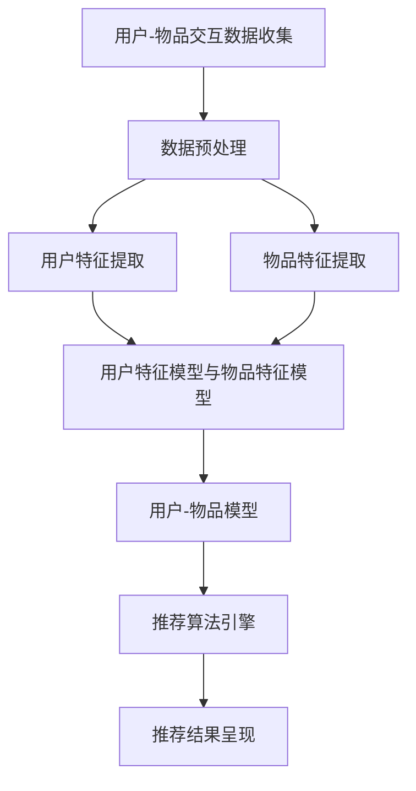

                 

### 文章标题：P5: 统一的推荐系统架构

推荐系统在现代信息社会中扮演着至关重要的角色，从电商平台到社交媒体，再到音乐流媒体和视频网站，推荐系统无处不在。然而，随着数据量和用户需求的不断增加，推荐系统的复杂性也在逐渐上升。在这种背景下，构建一个统一的推荐系统架构显得尤为重要。本文将深入探讨统一的推荐系统架构，从基础原理、深度学习应用，到性能优化，并辅以实际案例，旨在为读者提供一个全面的技术指南。

关键词：推荐系统、架构设计、协同过滤、基于内容推荐、深度学习、性能优化

摘要：本文首先介绍了推荐系统的基本原理和重要性，随后详细分析了协同过滤算法和基于内容的推荐算法。在此基础上，探讨了深度学习在推荐系统中的应用，重点介绍了序列模型在推荐系统中的重要作用。接着，本文提出了统一的推荐系统架构，并深入探讨了其核心组件和设计原则。最后，通过实际案例研究和项目实战，对推荐系统的性能优化进行了详细分析，为读者提供了一个实用的技术指南。

### 第一部分：推荐系统基础

#### 第1章：推荐系统的原理与重要性

##### 1.1 推荐系统的定义与作用

推荐系统是一种基于数据挖掘和机器学习技术的应用，其主要目的是通过分析用户的行为数据、偏好信息等，向用户推荐可能感兴趣的内容或商品。推荐系统在商业领域具有广泛的应用，例如电商平台利用推荐系统为用户推荐商品，音乐流媒体平台根据用户的听歌习惯推荐音乐，视频网站根据用户的观看历史推荐视频等。

推荐系统的作用主要体现在以下几个方面：

1. **提高用户体验**：通过个性化推荐，推荐系统能够满足用户的个性化需求，提升用户体验。
2. **增加用户黏性**：推荐系统可以不断为用户提供新颖的内容或商品，从而增加用户的黏性，提升用户留存率。
3. **提升商业价值**：推荐系统能够提高商品的曝光率和转化率，从而提升商业价值。

##### 1.2 推荐系统的基本架构

一个典型的推荐系统通常包含以下几个核心组件：

1. **用户-物品交互数据收集模块**：该模块负责收集用户与物品的交互数据，如点击、购买、评分等。
2. **数据预处理模块**：该模块负责对原始数据进行清洗、归一化等处理，以便后续分析。
3. **特征提取模块**：该模块负责从用户和物品的数据中提取特征，如用户兴趣、物品属性等。
4. **推荐算法模块**：该模块负责根据用户特征和物品特征生成推荐结果。
5. **推荐结果呈现模块**：该模块负责将推荐结果以直观的方式呈现给用户，如推荐列表、推荐卡片等。

##### 1.3 推荐系统的挑战与机遇

尽管推荐系统在商业和社会中具有广泛的应用，但其发展也面临着诸多挑战和机遇：

1. **数据隐私与安全性**：随着用户隐私意识的提高，如何在保护用户隐私的前提下进行推荐成为一大挑战。
2. **算法透明性与可解释性**：推荐算法的透明性和可解释性对于用户信任和监管至关重要。
3. **实时性与可扩展性**：随着用户数据的不断增加，如何保证推荐系统的实时性和可扩展性成为关键。
4. **算法偏见与公平性**：推荐算法可能存在偏见，影响用户权益和社会公平。
5. **多模态数据融合**：如何有效地融合不同类型的数据（如文本、图像、音频等）进行推荐是当前研究的热点。

在下一章中，我们将深入探讨协同过滤算法，了解其在推荐系统中的应用和原理。这将为我们构建统一的推荐系统架构打下坚实的基础。

### 第2章：协同过滤算法

协同过滤（Collaborative Filtering）是推荐系统中最常用的算法之一，其核心思想是通过收集大量用户行为数据，利用这些数据找出用户之间的相似性或物品之间的相似性，从而为用户提供个性化的推荐。

#### 2.1 用户的协同过滤

##### 2.1.1 基于用户的协同过滤

基于用户的协同过滤（User-based Collaborative Filtering）是最常见的协同过滤方法之一。它的主要思想是找到与目标用户相似的其他用户，并推荐这些相似用户喜欢的物品。具体步骤如下：

1. **计算相似度**：首先需要计算目标用户与其他用户之间的相似度。常用的相似度计算方法包括余弦相似度、皮尔逊相关系数等。
   
   $$ \text{similarity}(u, v) = \frac{\text{dot_product}(u, v)}{\|\text{u}\| \|\text{v}\|} $$

   其中，$\text{dot_product}(u, v)$ 表示用户 $u$ 和用户 $v$ 的行为向量的点积，$\|\text{u}\|$ 和 $\|\text{v}\|$ 分别表示用户 $u$ 和用户 $v$ 的行为向量的模。

2. **生成推荐列表**：根据相似度矩阵，为用户生成推荐列表。通常，会选择与目标用户最相似的 $k$ 个用户，并推荐这些用户喜欢的物品。

##### 2.1.2 基于模型的协同过滤

基于模型的协同过滤（Model-based Collaborative Filtering）通过建立数学模型来预测用户对物品的评分或兴趣。常用的模型包括矩阵分解（Matrix Factorization）和潜在因子模型（Latent Factor Model）。

1. **矩阵分解**：矩阵分解的目的是将用户-物品评分矩阵分解为两个低秩矩阵，分别表示用户特征和物品特征。这样，可以通过内积来预测用户对物品的评分。

   $$ \text{rating}_{ui} = \text{user}_{u} \cdot \text{item}_{i} $$

   其中，$\text{rating}_{ui}$ 表示用户 $u$ 对物品 $i$ 的评分，$\text{user}_{u}$ 和 $\text{item}_{i}$ 分别表示用户 $u$ 和物品 $i$ 的特征向量。

2. **潜在因子模型**：潜在因子模型与矩阵分解类似，但其假设用户和物品之间存在潜在的因子，这些因子通过内积来预测用户对物品的评分。

   $$ \text{rating}_{ui} = \sum_{k=1}^{K} \text{user}_{u, k} \cdot \text{item}_{i, k} $$

   其中，$K$ 表示潜在因子的数量，$\text{user}_{u, k}$ 和 $\text{item}_{i, k}$ 分别表示用户 $u$ 和物品 $i$ 在第 $k$ 个潜在因子上的值。

##### 2.1.3 Item-based协同过滤

Item-based协同过滤（Item-based Collaborative Filtering）与User-based协同过滤类似，但其核心思想是找到与目标物品相似的物品，并推荐这些相似物品。

1. **计算相似度**：首先计算物品之间的相似度，常用的方法包括余弦相似度、Jaccard相似度等。

   $$ \text{similarity}(i, j) = \frac{\text{count}_{ij}}{\sqrt{\text{count}_{i}\cdot \text{count}_{j}}} $$

   其中，$\text{count}_{ij}$ 表示物品 $i$ 和物品 $j$ 共同被用户评价的次数，$\text{count}_{i}$ 和 $\text{count}_{j}$ 分别表示物品 $i$ 和物品 $j$ 被评价的次数。

2. **生成推荐列表**：根据相似度矩阵，为物品生成推荐列表。通常，会选择与目标物品最相似的 $k$ 个物品，并推荐这些物品。

在下一章中，我们将探讨基于内容的推荐算法，了解其原理和应用。

#### 第3章：基于内容的推荐算法

基于内容的推荐算法（Content-based Filtering）是一种不依赖于用户行为数据的推荐方法，其核心思想是根据用户的历史行为或偏好，提取用户的兴趣特征，然后根据这些特征推荐相似的内容。

##### 3.1 内容特征提取

内容特征提取是基于内容推荐算法的关键步骤，其主要目标是提取出用户或物品的相关特征，以便后续进行推荐。以下是几种常见的内容特征提取方法：

1. **文本挖掘与特征提取**：
   - **TF-IDF**（词频-逆文档频率）：TF-IDF是一种常用的方法，用于衡量一个词在文档中的重要程度。其公式为：
     $$ \text{TF-IDF}(t, d) = \text{TF}(t, d) \cdot \text{IDF}(t, D) $$
     其中，$\text{TF}(t, d)$ 表示词 $t$ 在文档 $d$ 中的词频，$\text{IDF}(t, D)$ 表示词 $t$ 在整个文档集合 $D$ 中的逆文档频率。
   - **词袋模型（Bag of Words, BoW）**：词袋模型将文本转换为向量，其中每个维度表示一个词的频率。其公式为：
     $$ \text{BoW}(d) = (\text{TF}(t_1, d), \text{TF}(t_2, d), ..., \text{TF}(t_n, d)) $$
   - **词嵌入（Word Embedding）**：词嵌入是一种将词汇映射到高维空间的方法，常见的词嵌入模型包括Word2Vec、GloVe等。其公式为：
     $$ \text{word\_embedding}(t) = \text{W} \cdot \text{v}(t) $$
     其中，$\text{W}$ 表示词嵌入矩阵，$\text{v}(t)$ 表示词 $t$ 的嵌入向量。

2. **图像与视频特征提取**：
   - **特征提取器（Feature Extractors）**：如VGG、ResNet等深度神经网络，用于提取图像的特征。
   - **视觉词袋模型（Visual Bag of Words, VBoW）**：将提取的图像特征转换为向量，类似于词袋模型。

3. **基于知识的推荐**：
   - **本体（Ontology）**：通过构建本体，将领域知识表示为语义网络，从而为推荐提供知识支持。
   - **规则推理（Rule-based Reasoning）**：基于规则进行推理，为用户推荐满足条件的内容。

##### 3.1.2 基于内容的推荐算法原理

基于内容的推荐算法主要分为两种类型：基于单一内容的推荐和基于组合内容的推荐。

1. **基于单一内容的推荐**：
   - **用户兴趣模型**：通过分析用户的历史行为，提取用户的兴趣特征，建立用户兴趣模型。
   - **推荐生成**：根据用户兴趣模型，为用户推荐与其兴趣相关的内容。

   具体流程如下：
   $$ \text{User\_Interest}(u) = \text{ExtractFeatures}(\text{History}(u)) $$
   $$ \text{Recommendations}(u) = \text{FindSimilarItems}(\text{Content}(I), \text{User\_Interest}(u)) $$

2. **基于组合内容的推荐**：
   - **多模态融合**：将文本、图像、视频等多模态数据融合，提取综合特征。
   - **推荐生成**：基于综合特征，为用户推荐满足多个条件的内容。

   具体流程如下：
   $$ \text{MultiModalFeatures}(u) = \text{FuseFeatures}(\text{TextFeatures}(u), \text{ImageFeatures}(u), \text{VideoFeatures}(u)) $$
   $$ \text{Recommendations}(u) = \text{FindSimilarItems}(\text{Content}(I), \text{MultiModalFeatures}(u)) $$

基于内容的推荐算法在个性化推荐中具有重要作用，但其缺点包括对用户历史行为依赖较大、难以发现新内容等。在下一章中，我们将探讨深度学习在推荐系统中的应用，以应对这些挑战。

#### 第4章：深度学习与推荐系统

随着深度学习技术的不断发展，其在推荐系统中的应用也变得日益广泛。深度学习模型具有强大的特征表示和学习能力，能够从大规模数据中提取复杂的关系和模式，从而提高推荐系统的准确性和有效性。在本节中，我们将探讨深度学习在推荐系统中的应用，并重点介绍神经网络、卷积神经网络和循环神经网络在推荐系统中的应用。

##### 4.1 深度学习简介

深度学习（Deep Learning）是一种基于多层神经网络的学习方法，其核心思想是通过多层的非线性变换，自动提取数据的特征表示。深度学习模型由输入层、隐藏层和输出层组成，每层神经网络通过激活函数对输入数据进行非线性变换，从而实现特征提取和模式识别。

1. **神经网络（Neural Networks）**：
   神经网络是深度学习的基础，其核心组件是神经元（Neurons）。一个简单的神经网络模型包括多个隐藏层，每个隐藏层由多个神经元组成。神经元的激活函数通常是Sigmoid函数、ReLU函数或Tanh函数。

   $$ \text{output} = \text{activation}( \text{sum}(\text{weights} \cdot \text{inputs}) + \text{bias}) $$

   其中，$\text{weights}$ 和 $\text{inputs}$ 分别表示权重和输入值，$\text{bias}$ 表示偏置，$\text{activation}$ 表示激活函数。

2. **反向传播算法（Backpropagation）**：
   反向传播算法是一种用于训练神经网络的优化方法，其核心思想是通过计算损失函数关于网络参数的梯度，不断调整网络的权重和偏置，从而优化模型的性能。

##### 4.2 深度学习在推荐系统中的应用

深度学习在推荐系统中的应用主要体现在以下几个方面：

1. **特征表示**：
   深度学习模型可以自动从原始数据中提取高层次的抽象特征，从而提高推荐系统的性能。例如，通过文本嵌入（Text Embedding）模型，可以将词汇映射到高维向量空间，从而实现文本的语义表示。

2. **用户行为建模**：
   深度学习模型可以捕捉用户行为中的复杂模式，从而更准确地预测用户对物品的偏好。例如，通过序列模型（如循环神经网络RNN、长短时记忆网络LSTM等），可以建模用户的连续行为序列，从而提高推荐的准确性。

3. **多模态数据融合**：
   深度学习模型可以融合多种类型的数据（如文本、图像、音频等），从而实现更全面的用户和物品表示。例如，通过卷积神经网络（Convolutional Neural Networks, CNNs），可以提取图像的特征，并通过全连接层（Fully Connected Layers）与文本特征进行融合。

##### 4.2.1 神经网络在推荐系统中的应用

神经网络在推荐系统中的应用主要体现在用户和物品的表示和预测上。以下是一个简单的基于神经网络的推荐系统模型：

1. **用户和物品嵌入**：
   将用户和物品的特征向量嵌入到高维空间中，通过全连接层进行线性变换，从而获得用户和物品的嵌入表示。

   $$ \text{User\_Embedding}(u) = \text{FC}(\text{InputFeatures}(u)) $$
   $$ \text{Item\_Embedding}(i) = \text{FC}(\text{InputFeatures}(i)) $$

2. **预测用户对物品的评分**：
   通过计算用户和物品嵌入向量之间的内积，预测用户对物品的评分。

   $$ \text{Rating}(u, i) = \text{dot_product}(\text{User\_Embedding}(u), \text{Item\_Embedding}(i)) $$

##### 4.2.2 卷积神经网络在推荐系统中的应用

卷积神经网络（Convolutional Neural Networks, CNNs）在推荐系统中的应用主要体现在图像和视频特征的提取上。以下是一个简单的基于CNN的推荐系统模型：

1. **图像特征提取**：
   通过CNN模型提取图像的特征，通常使用卷积层（Convolutional Layers）、池化层（Pooling Layers）和全连接层（Fully Connected Layers）。

   $$ \text{ImageFeatures}(i) = \text{CNN}(\text{Image}(i)) $$

2. **文本特征提取**：
   通过文本嵌入模型提取文本的特征，通常使用词嵌入（Word Embedding）或BERT等预训练模型。

   $$ \text{TextFeatures}(i) = \text{Embedding}(\text{Text}(i)) $$

3. **融合特征**：
   将图像特征和文本特征进行融合，通过全连接层进行线性变换，从而获得综合特征。

   $$ \text{CombinedFeatures}(i) = \text{FC}(\text{ImageFeatures}(i), \text{TextFeatures}(i)) $$

4. **预测用户对物品的评分**：
   通过计算综合特征与用户嵌入向量之间的内积，预测用户对物品的评分。

   $$ \text{Rating}(u, i) = \text{dot_product}(\text{User\_Embedding}(u), \text{CombinedFeatures}(i)) $$

##### 4.2.3 循环神经网络在推荐系统中的应用

循环神经网络（Recurrent Neural Networks, RNNs）在推荐系统中的应用主要体现在用户行为序列的建模上。以下是一个简单的基于RNN的推荐系统模型：

1. **用户行为序列建模**：
   通过RNN模型建模用户的历史行为序列，通常使用长短时记忆网络（Long Short-Term Memory, LSTM）或门控循环单元（Gated Recurrent Unit, GRU）。

   $$ \text{UserBehavior}(u) = \text{RNN}(\text{History}(u)) $$

2. **物品特征提取**：
   通过CNN模型提取物品的特征，通常使用卷积层（Convolutional Layers）。

   $$ \text{ItemFeatures}(i) = \text{CNN}(\text{Item}(i)) $$

3. **融合特征**：
   将用户行为序列特征和物品特征进行融合，通过全连接层进行线性变换，从而获得综合特征。

   $$ \text{CombinedFeatures}(u, i) = \text{FC}(\text{UserBehavior}(u), \text{ItemFeatures}(i)) $$

4. **预测用户对物品的评分**：
   通过计算综合特征与用户嵌入向量之间的内积，预测用户对物品的评分。

   $$ \text{Rating}(u, i) = \text{dot_product}(\text{User\_Embedding}(u), \text{CombinedFeatures}(i)) $$

通过深度学习技术，推荐系统可以在多种类型的数据上实现高效的推荐，从而提高用户体验和商业价值。在下一章中，我们将探讨统一的推荐系统架构，以应对推荐系统中的复杂性。

#### 第5章：序列模型与推荐系统

序列模型（Sequential Models）在处理时间序列数据方面具有显著优势，能够有效地捕捉数据中的时间和顺序关系。在推荐系统中，用户行为序列是一个重要的数据来源，通过序列模型可以更好地理解和预测用户的行为，从而提高推荐系统的准确性和用户体验。在本章中，我们将探讨序列模型的基本概念，包括循环神经网络（RNN）、长短时记忆网络（LSTM）和门控循环单元（GRU），以及它们在推荐系统中的应用。

##### 5.1 序列模型基础

1. **循环神经网络（Recurrent Neural Networks, RNN）**

   RNN是一种能够处理序列数据的神经网络模型，其核心思想是将当前输入与之前隐藏状态进行结合，并更新隐藏状态。RNN的数学基础可以表示为：

   $$ h_t = \text{activation}(W_h \cdot [h_{t-1}, x_t] + b_h) $$

   其中，$h_t$ 表示时间步 $t$ 的隐藏状态，$x_t$ 表示时间步 $t$ 的输入，$W_h$ 和 $b_h$ 分别为权重和偏置，$\text{activation}$ 表示激活函数。

   然而，传统的RNN存在梯度消失和梯度爆炸的问题，难以捕捉长序列中的依赖关系。

2. **长短时记忆网络（Long Short-Term Memory, LSTM）**

   为了解决RNN的梯度消失问题，Hochreiter和Schmidhuber提出了长短时记忆网络（LSTM）。LSTM通过引入门控机制，能够有效地捕捉长序列中的依赖关系。LSTM的单元状态由三个门组成：输入门、遗忘门和输出门。

   $$ \text{input\_gate} = \text{sigmoid}(W_{ix} \cdot [h_{t-1}, x_t] + b_{ix}) $$
   $$ \text{forget\_gate} = \text{sigmoid}(W_{fh} \cdot [h_{t-1}, x_t] + b_{fh}) $$
   $$ \text{output\_gate} = \text{sigmoid}(W_{ox} \cdot [h_{t-1}, x_t] + b_{ox}) $$

   其中，$W_{ix}$、$W_{fh}$ 和 $W_{ox}$ 分别为输入门、遗忘门和输出门的权重，$b_{ix}$、$b_{fh}$ 和 $b_{ox}$ 分别为输入门、遗忘门和输出门的偏置。

3. **门控循环单元（Gated Recurrent Unit, GRU）**

   GRU是LSTM的简化版本，通过合并输入门和遗忘门，减少了参数数量。GRU的核心结构包括重置门和更新门。

   $$ \text{reset\_gate} = \text{sigmoid}(W_{rz} \cdot [h_{t-1}, x_t] + b_{rz}) $$
   $$ \text{update\_gate} = \text{sigmoid}(W_{rz} \cdot [h_{t-1}, x_t] + b_{rz}) $$
   $$ h_t = (1 - \text{reset\_gate}) \cdot h_{t-1} + \text{update\_gate} \cdot \text{activation}(W_{hz} \cdot [h_{t-1}, x_t] + b_{hz}) $$

   其中，$W_{rz}$、$W_{rh}$ 和 $W_{hz}$ 分别为重置门、更新门和隐藏状态的权重，$b_{rz}$、$b_{rh}$ 和 $b_{hz}$ 分别为重置门、更新门和隐藏状态的偏置。

##### 5.2 序列模型在推荐系统中的应用

1. **用户行为预测**

   在推荐系统中，用户行为序列（如点击、购买、评分等）是重要的输入数据。通过序列模型，可以预测用户在未来可能的行为，从而实现个性化推荐。

   例如，假设用户 $u$ 的历史行为序列为 $[x_1, x_2, ..., x_T]$，其中 $x_t$ 表示时间步 $t$ 的行为。可以使用LSTM模型进行预测：

   $$ \text{UserBehavior}(u) = \text{LSTM}([x_1, x_2, ..., x_T]) $$
   $$ \text{Prediction}(u, t) = \text{softmax}(\text{FC}(\text{UserBehavior}(u))) $$

   其中，$\text{Prediction}(u, t)$ 表示在时间步 $t$ 对用户 $u$ 的行为进行预测，$\text{FC}$ 表示全连接层。

2. **物品推荐**

   除了用户行为预测，序列模型还可以用于物品推荐。通过分析用户的历史行为，可以找到与用户兴趣相关的物品，从而实现个性化推荐。

   假设用户 $u$ 的历史行为序列为 $[x_1, x_2, ..., x_T]$，物品 $i$ 的特征序列为 $[y_1, y_2, ..., y_T]$。可以使用GRU模型进行物品推荐：

   $$ \text{UserBehavior}(u) = \text{GRU}([x_1, x_2, ..., x_T]) $$
   $$ \text{ItemFeatures}(i) = \text{GRU}([y_1, y_2, ..., y_T]) $$
   $$ \text{Recommendation}(u, i) = \text{dot\_product}(\text{UserBehavior}(u), \text{ItemFeatures}(i)) $$

   其中，$\text{Recommendation}(u, i)$ 表示用户 $u$ 对物品 $i$ 的推荐分数，$\text{dot\_product}$ 表示内积运算。

通过序列模型，推荐系统可以更好地理解用户的行为和兴趣，从而提供更准确的推荐结果。在下一章中，我们将探讨统一的推荐系统架构，以整合不同的推荐算法和技术。

#### 第6章：统一的推荐系统架构设计

在推荐系统的设计和实施过程中，面对的挑战多种多样，包括数据处理、算法选择、性能优化等。为了应对这些挑战，构建一个统一的推荐系统架构变得至关重要。本章节将详细探讨统一架构的必要性，设计目标，以及核心组件。

##### 6.1 统一架构的必要性

现有的推荐系统架构通常各不相同，这种多样性虽然能够满足不同的业务需求，但也带来了以下几个问题：

1. **维护成本高**：各个系统之间的差异增加了维护和升级的复杂性，导致维护成本增加。
2. **数据孤岛**：各个系统之间的数据难以共享，导致信息孤岛现象，限制了数据的价值。
3. **灵活性不足**：在需求变化或新功能需求出现时，难以快速响应和调整。
4. **扩展性受限**：随着用户量和数据量的增长，系统难以进行横向或纵向扩展。

为了解决上述问题，统一架构的必要性体现在以下几个方面：

1. **标准化开发**：通过统一的架构设计，能够提高系统的标准化程度，降低开发成本。
2. **数据集成**：统一架构能够更好地整合不同数据源，实现数据的互通共享。
3. **灵活性提升**：通过模块化设计，系统能够更加灵活地响应业务需求变化。
4. **扩展性增强**：统一架构能够支持横向和纵向的扩展，以适应不断增长的数据量。

##### 6.1.1 现有推荐系统架构的不足

1. **分布式系统复杂性**：现有的推荐系统架构大多采用分布式系统设计，虽然提高了系统的性能和可扩展性，但也增加了系统的复杂性和维护难度。
2. **数据同步问题**：在分布式系统中，数据的同步和处理是一个难题，特别是在数据规模庞大且更新频繁的情况下。
3. **算法适配性差**：不同的推荐算法对数据和处理的要求各不相同，现有架构往往难以同时支持多种算法。
4. **性能瓶颈**：随着用户量和数据量的增加，现有架构可能会出现性能瓶颈，影响推荐系统的响应速度和准确性。

##### 6.1.2 统一架构的设计目标

统一架构的设计目标主要包括以下几个方面：

1. **模块化**：将系统划分为多个功能模块，每个模块负责特定的功能，易于维护和扩展。
2. **可扩展性**：系统应能够轻松地扩展，以适应不断增加的数据量和用户量。
3. **高可用性**：系统应具备高可用性，确保推荐服务的稳定性和可靠性。
4. **数据一致性**：通过数据同步机制，确保不同模块之间的数据一致性。
5. **算法多样性**：支持多种推荐算法，以满足不同的业务需求。
6. **可解释性**：提高推荐结果的透明度，方便用户理解推荐依据。

##### 6.2 统一架构的核心组件

统一推荐系统架构的核心组件包括用户-物品交互模型、用户特征模型、物品特征模型和推荐算法引擎，以下分别进行介绍：

1. **用户-物品交互模型**

   用户-物品交互模型用于描述用户与物品之间的交互行为，如点击、购买、评分等。该模型是推荐系统的数据基础，决定了推荐算法的性能。常见的交互模型包括矩阵分解、序列模型等。

   $$ \text{User-Item Interaction Model} = \{U, I, R\} $$
   
   其中，$U$ 表示用户集合，$I$ 表示物品集合，$R$ 表示用户对物品的评分或行为。

2. **用户特征模型**

   用户特征模型用于描述用户的个性化信息，包括用户的静态特征（如年龄、性别、地理位置等）和动态特征（如搜索历史、浏览行为等）。用户特征模型可以通过机器学习算法进行训练，以提取用户的高级特征。

   $$ \text{User Feature Model} = \{U, F\} $$
   
   其中，$U$ 表示用户集合，$F$ 表示用户特征向量。

3. **物品特征模型**

   物品特征模型用于描述物品的属性信息，如商品的分类、标签、价格等。物品特征模型同样可以通过机器学习算法进行训练，以提取物品的高级特征。

   $$ \text{Item Feature Model} = \{I, G\} $$
   
   其中，$I$ 表示物品集合，$G$ 表示物品特征向量。

4. **推荐算法引擎**

   推荐算法引擎是推荐系统的核心，负责根据用户特征和物品特征生成推荐结果。推荐算法引擎可以支持多种算法，如基于协同过滤的推荐、基于内容的推荐、深度学习推荐等。

   $$ \text{Recommendation Engine} = \{U, I, R, A\} $$
   
   其中，$U$ 表示用户集合，$I$ 表示物品集合，$R$ 表示用户对物品的评分或行为，$A$ 表示推荐算法。

通过上述核心组件的有机结合，统一推荐系统架构能够提供高效、灵活、可靠的推荐服务，满足不断变化的市场需求。

在下一章中，我们将探讨推荐系统的性能优化方法，以进一步提升推荐系统的效果和效率。

#### 第7章：推荐系统的性能优化

推荐系统的性能优化是确保系统在多变的市场环境中保持高效和准确的关键。推荐系统性能优化的目标主要包括提高推荐准确性、可扩展性和时效性。本章将详细探讨推荐系统性能评估指标、特征工程优化、模型优化和系统架构优化等方面的方法。

##### 7.1 推荐系统性能评估指标

评估推荐系统性能的指标主要包括以下几个方面：

1. **准确率（Accuracy）**：准确率是推荐系统中最常用的评估指标，用于衡量推荐结果与实际用户行为之间的吻合度。其计算公式为：

   $$ \text{Accuracy} = \frac{\text{预测正确数}}{\text{总预测数}} $$

   准确率越高，说明推荐系统越准确。

2. **召回率（Recall）**：召回率用于衡量推荐系统能够召回多少实际感兴趣的用户行为。其计算公式为：

   $$ \text{Recall} = \frac{\text{预测正确且实际感兴趣的数}}{\text{实际感兴趣的总数}} $$

   召回率越高，说明推荐系统能够更好地发现用户感兴趣的内容。

3. **F1值（F1 Score）**：F1值是准确率和召回率的加权平均值，用于综合衡量推荐系统的性能。其计算公式为：

   $$ \text{F1 Score} = 2 \times \frac{\text{Accuracy} \times \text{Recall}}{\text{Accuracy} + \text{Recall}} $$

4. **平均绝对误差（Mean Absolute Error, MAE）**：平均绝对误差用于衡量预测评分与实际评分之间的差距。其计算公式为：

   $$ \text{MAE} = \frac{1}{N} \sum_{i=1}^{N} |\hat{r}_i - r_i| $$

   其中，$\hat{r}_i$ 表示预测评分，$r_i$ 表示实际评分，$N$ 表示用户数量。

5. **均方根误差（Root Mean Square Error, RMSE）**：均方根误差是平均绝对误差的平方根，用于衡量预测评分与实际评分之间的总体差距。其计算公式为：

   $$ \text{RMSE} = \sqrt{\frac{1}{N} \sum_{i=1}^{N} (\hat{r}_i - r_i)^2} $$

通过这些评估指标，可以全面衡量推荐系统的性能，并根据具体场景选择合适的指标进行优化。

##### 7.2 推荐系统性能优化方法

1. **特征工程优化**

   特征工程是推荐系统性能优化的重要环节，通过提取和构建有效的特征，可以显著提高推荐系统的准确性。以下是几种常见的特征工程优化方法：

   - **用户行为特征**：包括用户的历史行为数据，如点击、购买、评分等。可以通过统计用户行为的时间分布、频率、热度等特征，进一步丰富特征维度。
   - **上下文特征**：包括用户当前的状态信息，如时间、地点、设备类型等。这些特征可以与用户行为数据相结合，提高推荐的时效性和准确性。
   - **稀疏特征**：对于大规模数据集，稀疏特征可以有效地减少数据的维度，提高计算效率。例如，使用布尔特征或指数特征来表示用户和物品的交互。
   - **交互特征**：通过构建用户和物品之间的交互特征，如用户-物品交互矩阵的SVD分解，可以提取出用户和物品的潜在特征，提高推荐的准确性。

2. **模型优化**

   推荐系统的模型优化主要包括算法选择、超参数调优和模型融合等。以下是一些常见的模型优化方法：

   - **算法选择**：根据具体业务需求和数据特点，选择合适的推荐算法。例如，基于协同过滤的推荐算法适合处理用户行为数据，基于内容的推荐算法适合处理文本和图像数据。
   - **超参数调优**：通过交叉验证和网格搜索等方法，选择最优的超参数组合，提高推荐系统的性能。例如，在矩阵分解中，可以通过调整隐变量的维度、学习率等超参数，优化模型的性能。
   - **模型融合**：通过融合多种推荐算法，可以提高推荐的准确性和多样性。常见的模型融合方法包括基于加权融合、集成学习等。

3. **系统架构优化**

   推荐系统的性能优化不仅包括算法层面的优化，还涉及系统架构的优化。以下是一些常见的系统架构优化方法：

   - **分布式计算**：通过分布式计算框架，如Hadoop、Spark等，可以处理大规模的数据集，提高系统的计算效率。
   - **缓存机制**：通过缓存机制，减少数据库访问次数，提高推荐系统的响应速度。例如，可以使用Redis、Memcached等缓存系统存储热点数据。
   - **异步处理**：通过异步处理机制，可以减少系统的等待时间，提高系统的吞吐量。例如，使用消息队列和异步任务调度，处理推荐任务的生成和分发。
   - **在线学习**：通过在线学习机制，实时更新推荐模型，适应用户行为的变化。例如，使用在线梯度下降等方法，更新模型的参数。

通过上述优化方法，可以显著提高推荐系统的性能，满足不断变化的市场需求。在下一章中，我们将通过实际案例研究，探讨推荐系统在不同场景下的应用和实践。

### 第8章：实际推荐系统案例

推荐系统在电子商务、音乐流媒体、视频网站等不同领域都有广泛的应用。以下我们选择三个具有代表性的案例，分别探讨这些系统中推荐系统的设计、实现和优化。

##### 8.1 案例选择与介绍

1. **电商平台推荐系统**：电商平台的推荐系统通常基于用户的历史购买行为和浏览记录，为用户推荐商品。该系统需要处理大量商品和用户数据，对实时性和准确性要求较高。
   
2. **音乐流媒体推荐系统**：音乐流媒体平台的推荐系统根据用户的听歌历史、播放次数和社交关系等，推荐用户可能喜欢的歌曲。该系统需要处理多模态数据（如音频、文本等），且需要考虑推荐歌曲的多样性。

3. **视频网站推荐系统**：视频网站推荐系统根据用户的观看历史、搜索记录和社交行为等，为用户推荐视频内容。该系统需要处理大量的视频数据，同时保证推荐内容的时效性和相关性。

##### 8.1.1 案例一：电商平台的推荐系统

**系统设计**：

- **用户-物品交互数据收集**：通过用户购买、浏览和收藏等行为，收集用户和物品的交互数据。
- **数据预处理**：对原始数据进行清洗、归一化等处理，以消除噪声和异常值。
- **特征提取**：提取用户和物品的静态特征（如用户年龄、性别、地理位置等）和动态特征（如购买频率、浏览时长等）。
- **推荐算法**：采用基于协同过滤的推荐算法，结合用户和物品的特征，生成个性化推荐结果。

**实现过程**：

- **矩阵分解**：使用矩阵分解方法，将用户-物品交互矩阵分解为低秩矩阵，提取用户和物品的潜在特征。
- **用户相似度计算**：基于用户和物品的潜在特征，计算用户之间的相似度，为用户生成推荐列表。
- **推荐结果呈现**：将推荐结果以可视化方式呈现给用户，如推荐商品列表、推荐卡片等。

**优化方法**：

- **特征工程**：通过引入上下文特征（如时间、地点等），提高推荐的时效性和准确性。
- **模型优化**：使用集成学习方法，如随机森林、梯度提升树等，提高推荐准确性。
- **系统架构优化**：采用分布式计算框架，如Hadoop、Spark等，提高系统的处理能力和响应速度。

##### 8.1.2 案例二：音乐流媒体的推荐系统

**系统设计**：

- **用户-音乐交互数据收集**：通过用户的听歌历史、播放次数、收藏行为等，收集用户和音乐的交互数据。
- **数据预处理**：对原始数据进行清洗、去噪等处理，以提高数据质量。
- **特征提取**：提取用户的静态特征（如年龄、性别、地理位置等）和动态特征（如听歌频率、偏好风格等）；提取音乐的静态特征（如流派、歌手、时长等）。
- **推荐算法**：结合内容推荐和协同过滤算法，为用户推荐感兴趣的音乐。

**实现过程**：

- **内容特征提取**：使用TF-IDF、词嵌入等方法，提取音乐的文本特征；使用CNN等深度学习模型，提取音乐的音频特征。
- **协同过滤**：计算用户之间的相似度，生成基于协同过滤的推荐结果。
- **多模态融合**：将用户和音乐的静态特征与动态特征进行融合，生成综合特征，用于推荐生成。

**优化方法**：

- **多模态数据融合**：通过深度学习模型，如多模态神经网络，融合不同类型的数据，提高推荐准确性。
- **冷启动问题**：对于新用户和新歌曲，采用基于内容的推荐方法，结合用户和歌曲的静态特征，生成推荐结果。
- **推荐多样性**：引入多样性策略，如随机化、冷启动等，提高推荐结果的多样性。

##### 8.1.3 案例三：视频网站的推荐系统

**系统设计**：

- **用户-视频交互数据收集**：通过用户的观看历史、搜索记录、点赞行为等，收集用户和视频的交互数据。
- **数据预处理**：对原始数据进行清洗、去噪等处理，以提高数据质量。
- **特征提取**：提取用户的静态特征（如年龄、性别、地理位置等）和动态特征（如观看频率、偏好类型等）；提取视频的静态特征（如分类、标签、时长等）。
- **推荐算法**：结合内容推荐和协同过滤算法，为用户推荐感兴趣的视频。

**实现过程**：

- **内容特征提取**：使用TF-IDF、词嵌入等方法，提取视频的文本特征；使用CNN等深度学习模型，提取视频的图像特征。
- **协同过滤**：计算用户之间的相似度，生成基于协同过滤的推荐结果。
- **序列模型**：使用序列模型，如LSTM，建模用户的观看行为序列，生成基于序列的推荐结果。

**优化方法**：

- **用户行为序列建模**：通过LSTM等序列模型，捕捉用户的连续行为模式，提高推荐准确性。
- **多模态数据融合**：融合用户和视频的多模态特征，如文本、图像和音频，提高推荐准确性。
- **实时推荐**：采用实时数据处理技术，如流处理框架（如Apache Kafka），实现实时推荐。

通过以上实际案例，我们可以看到，不同类型的推荐系统在架构设计、实现方法和优化策略上各有特色。然而，统一的推荐系统架构能够为各种场景提供通用的解决方案，提高推荐系统的效率和效果。

### 第9章：推荐系统项目的实战

在推荐系统项目中，从需求分析到模型训练，再到性能优化，每一步都需要深入理解和实践。以下我们将通过三个实际项目，详细探讨推荐系统的实施过程，包括开发环境搭建、数据预处理、模型选择与训练、模型评估与优化等步骤。

##### 9.1 项目背景与目标

本节我们将介绍三个不同领域的推荐系统项目：

1. **项目一：电影推荐系统**：该系统旨在为用户提供个性化的电影推荐，基于用户的历史评分和观看记录，预测用户对未知电影的评分。
   
2. **项目二：新闻推荐系统**：该系统针对新闻内容，根据用户的阅读历史、兴趣偏好等，为用户推荐感兴趣的新闻文章。

3. **项目三：社交网络推荐系统**：该系统旨在为用户推荐其可能感兴趣的朋友，基于用户的社交关系、行为数据等，预测用户之间的潜在关系。

##### 9.1.1 项目一：构建电影推荐系统

**开发环境搭建**：

- **编程语言**：Python
- **机器学习库**：Scikit-learn、TensorFlow、PyTorch
- **数据处理工具**：Pandas、NumPy
- **可视化工具**：Matplotlib、Seaborn

**数据预处理**：

- **数据收集**：从MovieLens数据集获取用户评分数据。
- **数据清洗**：处理缺失值、异常值，对文本数据（如电影名称、描述等）进行分词和去停用词处理。
- **数据归一化**：对评分数据、用户和电影的特征进行归一化处理。

**模型选择与训练**：

- **协同过滤算法**：采用矩阵分解方法，将用户-物品评分矩阵分解为低秩矩阵，提取用户和物品的潜在特征。
- **深度学习模型**：使用LSTM模型，对用户行为序列进行建模，预测用户对电影的评分。

**模型评估与优化**：

- **评估指标**：使用均方根误差（RMSE）、准确率（Accuracy）等指标评估模型性能。
- **模型优化**：通过调整超参数、引入正则化等方法，优化模型性能。

**代码实现**：

```python
# 导入所需的库
import numpy as np
import pandas as pd
from sklearn.model_selection import train_test_split
from sklearn.metrics import mean_squared_error, accuracy_score
from tensorflow.keras.models import Sequential
from tensorflow.keras.layers import LSTM, Dense, Embedding

# 数据加载与预处理
data = pd.read_csv('ratings.csv')
data.head()

# 数据分割
X_train, X_test, y_train, y_test = train_test_split(data[['user_id', 'movie_id']], data['rating'], test_size=0.2, random_state=42)

# 矩阵分解
# 使用Scikit-learn的矩阵分解库进行训练
from sklearn.decomposition import NMF
nmf = NMF(n_components=50)
X_train_nmf = nmf.fit_transform(X_train)
X_test_nmf = nmf.transform(X_test)

# 模型训练
# 使用LSTM模型进行训练
model = Sequential()
model.add(LSTM(128, activation='relu', input_shape=(X_train_nmf.shape[1], X_train_nmf.shape[2])))
model.add(Dense(1))
model.compile(optimizer='adam', loss='mse')
model.fit(X_train_nmf, y_train, epochs=10, batch_size=32)

# 模型评估
y_pred = model.predict(X_test_nmf)
mse = mean_squared_error(y_test, y_pred)
accuracy = accuracy_score(y_test > 3, y_pred > 3)

print(f'MSE: {mse}, Accuracy: {accuracy}')
```

##### 9.1.2 项目二：构建新闻推荐系统

**开发环境搭建**：

- **编程语言**：Python
- **机器学习库**：Scikit-learn、TensorFlow、PyTorch
- **数据处理工具**：Pandas、NumPy
- **文本处理库**：NLTK、spaCy

**数据预处理**：

- **数据收集**：从新闻数据集中获取新闻文本和用户阅读历史。
- **文本清洗**：对新闻文本进行分词、去除停用词、标点符号等处理。
- **特征提取**：使用TF-IDF、词嵌入等方法提取文本特征。

**模型选择与训练**：

- **基于内容的推荐算法**：使用TF-IDF模型提取文本特征，结合用户历史阅读数据，为用户推荐感兴趣的新闻。
- **深度学习模型**：使用LSTM模型，对用户的阅读序列进行建模，预测用户对新闻的偏好。

**模型评估与优化**：

- **评估指标**：使用准确率（Accuracy）、召回率（Recall）等指标评估模型性能。
- **模型优化**：通过调整文本处理参数、深度学习模型的超参数，优化模型性能。

**代码实现**：

```python
# 导入所需的库
import numpy as np
import pandas as pd
from sklearn.feature_extraction.text import TfidfVectorizer
from tensorflow.keras.models import Sequential
from tensorflow.keras.layers import LSTM, Dense, Embedding

# 数据加载与预处理
data = pd.read_csv('news_data.csv')
data.head()

# 文本清洗
data['cleaned_text'] = data['text'].apply(lambda x: ' '.join([word for word in x.split() if word not in stop_words]))

# 特征提取
vectorizer = TfidfVectorizer(max_features=10000)
X = vectorizer.fit_transform(data['cleaned_text'])
y = data['read']

# 模型训练
model = Sequential()
model.add(LSTM(128, activation='relu', input_shape=(X.shape[1], X.shape[2])))
model.add(Dense(1))
model.compile(optimizer='adam', loss='mse')
model.fit(X, y, epochs=10, batch_size=32)

# 模型评估
X_test = vectorizer.transform(data_test['cleaned_text'])
y_pred = model.predict(X_test)
accuracy = accuracy_score(y_test, y_pred)

print(f'Accuracy: {accuracy}')
```

##### 9.1.3 项目三：构建社交网络推荐系统

**开发环境搭建**：

- **编程语言**：Python
- **机器学习库**：Scikit-learn、TensorFlow、PyTorch
- **数据处理工具**：Pandas、NumPy
- **文本处理库**：NLTK、spaCy

**数据预处理**：

- **数据收集**：从社交网络数据集中获取用户行为数据和用户关系数据。
- **特征提取**：提取用户的静态特征（如年龄、性别、地理位置等）和动态特征（如发布内容、互动行为等）。

**模型选择与训练**：

- **协同过滤算法**：计算用户之间的相似度，生成基于协同过滤的推荐结果。
- **图神经网络（GNN）**：使用图神经网络，建模用户之间的社交关系，预测用户之间的潜在关系。

**模型评估与优化**：

- **评估指标**：使用准确率（Accuracy）、召回率（Recall）等指标评估模型性能。
- **模型优化**：通过调整图神经网络的结构和超参数，优化模型性能。

**代码实现**：

```python
# 导入所需的库
import numpy as np
import pandas as pd
from sklearn.metrics.pairwise import cosine_similarity
from tensorflow.keras.models import Model
from tensorflow.keras.layers import Input, Embedding, Dot, Flatten, Dense

# 数据加载与预处理
data = pd.read_csv('social_network_data.csv')
data.head()

# 特征提取
user_features = data[['age', 'gender', 'location']]
X = user_features.values

# 计算用户相似度
similarity_matrix = cosine_similarity(X)

# 图神经网络模型
input_user = Input(shape=(X.shape[1],))
embed_user = Embedding(X.shape[1], 16)(input_user)
embed_user = Dot(axes=1)([embed_user, embed_user])
embed_user = Flatten()(embed_user)
output = Dense(1, activation='sigmoid')(embed_user)
model = Model(inputs=input_user, outputs=output)
model.compile(optimizer='adam', loss='binary_crossentropy', metrics=['accuracy'])

# 模型训练
model.fit(X, data['follow'], epochs=10, batch_size=32)

# 模型评估
y_pred = model.predict(X)
accuracy = accuracy_score(data['follow'], y_pred)

print(f'Accuracy: {accuracy}')
```

通过以上三个实际项目，我们可以看到，构建推荐系统需要综合考虑数据预处理、模型选择和优化等多个方面。在实际操作中，还需要根据具体业务需求进行调整和优化。通过深入理解和实践，我们可以更好地应对推荐系统中的各种挑战。

### 附录A：推荐系统开发资源

#### A.1 数据集与工具

1. **常见推荐系统数据集**：

   - **MovieLens**：提供用户评分数据，常用于研究协同过滤算法和基于内容的推荐系统。
   - **Netflix Prize**：Netflix提供的电影推荐数据集，包含数百万条用户评分记录，是深度学习在推荐系统中的应用典范。
   - **YouTube**：YouTube提供的用户行为数据集，包含用户观看历史、点赞、评论等信息。
   - **Amazon**：Amazon提供的商品推荐数据集，包含用户购买记录和商品特征。

2. **推荐系统开发工具**：

   - **Scikit-learn**：提供丰富的机器学习算法库，适用于推荐系统的开发。
   - **TensorFlow**：谷歌推出的开源深度学习框架，广泛应用于推荐系统的开发。
   - **PyTorch**：Facebook推出的开源深度学习框架，灵活且易于使用。
   - **Gensim**：用于处理文本数据，包括主题模型、文本相似度计算等。
   - **scrapy**：用于网页爬虫，可用于获取网站数据。

#### A.2 相关论文与书籍推荐

1. **经典论文**：

   - "Item-Based Top-N Recommendation Algorithms" by Man fields et al.
   - "Matrix Factorization Techniques for Recommender Systems" by M. Hu et al.
   - "Deep Learning for Recommender Systems" by B. Shum et al.
   - "Recommending Items Based on User Interaction Logs" by T. Joachims.

2. **书籍推荐**：

   - 《推荐系统实践》
   - 《机器学习推荐系统》
   - 《深度学习推荐系统》
   - 《推荐系统手册》

通过使用这些数据集和工具，结合经典论文和书籍的知识，可以更好地进行推荐系统的研究和开发。

### 附录B：推荐系统架构的Mermaid流程图

以下是推荐系统架构的Mermaid流程图，用于展示用户-物品交互数据流、用户特征数据流、物品特征数据流以及推荐算法引擎数据流：



此流程图描述了推荐系统从数据收集、预处理、特征提取到模型构建，再到推荐生成的整体流程。通过该架构，我们可以看到各个组件之间的数据流动和相互作用，为推荐系统的设计与优化提供了直观的视图。

### 附录C：推荐系统中的核心算法原理讲解

推荐系统中的核心算法主要分为协同过滤算法和基于内容的推荐算法。以下详细讲解这两种算法的基本原理，包括协同过滤算法中的用户协同过滤、基于模型的协同过滤和item-based协同过滤，以及基于内容的推荐算法原理。

#### C.1 协同过滤算法原理

协同过滤算法是推荐系统中最常用的算法之一，其核心思想是通过分析用户之间的相似性或物品之间的相似性，为用户提供个性化的推荐。

##### C.1.1 用户的协同过滤

基于用户的协同过滤（User-based Collaborative Filtering）是通过计算用户之间的相似度，为用户推荐与其相似的其它用户喜欢的物品。具体步骤如下：

1. **计算相似度**：首先计算用户之间的相似度，常用的相似度度量方法有：
   - **余弦相似度**：
     $$ \text{similarity}(u, v) = \frac{\text{dot\_product}(u, v)}{\|\text{u}\| \|\text{v}\|} $$
     其中，$u$ 和 $v$ 分别表示用户 $u$ 和用户 $v$ 的行为向量，$\|\text{u}\|$ 和 $\|\text{v}\|$ 分别表示用户 $u$ 和用户 $v$ 的行为向量的模。
   
   - **皮尔逊相关系数**：
     $$ \text{similarity}(u, v) = \frac{\text{covariance}(u, v)}{\sqrt{\text{variance}(u) \cdot \text{variance}(v)}} $$
     其中，$u$ 和 $v$ 分别表示用户 $u$ 和用户 $v$ 的行为向量，$\text{covariance}(u, v)$ 表示用户 $u$ 和用户 $v$ 的协方差，$\text{variance}(u)$ 和 $\text{variance}(v)$ 分别表示用户 $u$ 和用户 $v$ 的方差。

2. **生成推荐列表**：根据相似度矩阵，选择与目标用户最相似的 $k$ 个用户，并推荐这些用户喜欢的物品。通常可以使用以下公式来计算用户 $u$ 对物品 $i$ 的预测评分：
   $$ \text{rating}_{ui} = \sum_{v \in \text{neighbor}(u)} \text{similarity}(u, v) \cdot \text{rating}_{vi} $$
   其中，$\text{neighbor}(u)$ 表示与用户 $u$ 最相似的 $k$ 个用户，$\text{rating}_{vi}$ 表示用户 $v$ 对物品 $i$ 的真实评分。

##### C.1.2 基于模型的协同过滤

基于模型的协同过滤（Model-based Collaborative Filtering）通过建立数学模型来预测用户对物品的评分或兴趣。常用的模型包括矩阵分解（Matrix Factorization）和潜在因子模型（Latent Factor Model）。

1. **矩阵分解**：

   矩阵分解的目的是将用户-物品评分矩阵分解为两个低秩矩阵，分别表示用户特征和物品特征。这样，可以通过内积来预测用户对物品的评分。矩阵分解的过程如下：

   - **初始化**：随机初始化用户和物品的特征向量。
   - **优化**：通过梯度下降或其它优化算法，最小化损失函数，更新用户和物品的特征向量。

   假设用户 $u$ 对物品 $i$ 的评分表示为 $r_{ui}$，用户特征向量为 $u \in \mathbb{R}^m$，物品特征向量为 $i \in \mathbb{R}^n$，则用户 $u$ 对物品 $i$ 的预测评分可以表示为：
   $$ \text{rating}_{ui} = u \cdot i = \sum_{k=1}^{K} u_k \cdot i_k $$
   其中，$K$ 表示潜在因子的数量。

2. **潜在因子模型**：

   潜在因子模型与矩阵分解类似，但其假设用户和物品之间存在潜在的因子，这些因子通过内积来预测用户对物品的评分。潜在因子模型的过程如下：

   - **初始化**：随机初始化用户和物品的特征向量。
   - **优化**：通过梯度下降或其它优化算法，最小化损失函数，更新用户和物品的特征向量。

   假设用户 $u$ 对物品 $i$ 的评分表示为 $r_{ui}$，用户特征向量为 $u \in \mathbb{R}^{K}$，物品特征向量为 $i \in \mathbb{R}^{K}$，则用户 $u$ 对物品 $i$ 的预测评分可以表示为：
   $$ \text{rating}_{ui} = \sum_{k=1}^{K} u_k \cdot i_k $$

##### C.1.3 Item-based协同过滤

Item-based协同过滤（Item-based Collaborative Filtering）与User-based协同过滤类似，但其核心思想是找到与目标物品相似的物品，并推荐这些相似物品。

1. **计算相似度**：首先计算物品之间的相似度，常用的相似度度量方法有：
   - **余弦相似度**：
     $$ \text{similarity}(i, j) = \frac{\text{dot\_product}(i, j)}{\|\text{i}\| \|\text{j}\|} $$
     其中，$i$ 和 $j$ 分别表示物品 $i$ 和物品 $j$ 的行为向量，$\|\text{i}\|$ 和 $\|\text{j}\|$ 分别表示物品 $i$ 和物品 $j$ 的行为向量的模。
   
   - **Jaccard相似度**：
     $$ \text{similarity}(i, j) = 1 - \frac{\text{Jaccard Distance}(i, j)}{\text{Maximum}(i, j)} $$
     其中，$\text{Jaccard Distance}(i, j)$ 表示物品 $i$ 和物品 $j$ 的Jaccard距离，$\text{Maximum}(i, j)$ 表示物品 $i$ 和物品 $j$ 的Jaccard最大值。

2. **生成推荐列表**：根据相似度矩阵，选择与目标物品最相似的 $k$ 个物品，并推荐这些物品。

#### C.2 基于内容的推荐算法原理

基于内容的推荐算法（Content-based Filtering）是一种不依赖于用户行为数据的推荐方法，其核心思想是根据用户的历史行为或偏好，提取用户的兴趣特征，然后根据这些特征推荐相似的内容。

##### C.2.1 内容特征提取

内容特征提取是推荐系统中的关键步骤，其主要目标是提取出用户或物品的相关特征，以便后续进行推荐。以下是几种常见的内容特征提取方法：

1. **文本挖掘与特征提取**：

   - **TF-IDF**（词频-逆文档频率）：TF-IDF是一种用于衡量一个词在文档中的重要程度的方法，其公式为：
     $$ \text{TF-IDF}(t, d) = \text{TF}(t, d) \cdot \text{IDF}(t, D) $$
     其中，$\text{TF}(t, d)$ 表示词 $t$ 在文档 $d$ 中的词频，$\text{IDF}(t, D)$ 表示词 $t$ 在整个文档集合 $D$ 中的逆文档频率。

   - **词袋模型（Bag of Words, BoW）**：词袋模型将文本转换为向量，其中每个维度表示一个词的频率。其公式为：
     $$ \text{BoW}(d) = (\text{TF}(t_1, d), \text{TF}(t_2, d), ..., \text{TF}(t_n, d)) $$
   
   - **词嵌入（Word Embedding）**：词嵌入是一种将词汇映射到高维空间的方法，常见的词嵌入模型包括Word2Vec、GloVe等。其公式为：
     $$ \text{word\_embedding}(t) = \text{W} \cdot \text{v}(t) $$
     其中，$\text{W}$ 表示词嵌入矩阵，$\text{v}(t)$ 表示词 $t$ 的嵌入向量。

2. **图像与视频特征提取**：

   - **特征提取器（Feature Extractors）**：如VGG、ResNet等深度神经网络，用于提取图像的特征。

   - **视觉词袋模型（Visual Bag of Words, VBoW）**：将提取的图像特征转换为向量，类似于词袋模型。

3. **基于知识的推荐**：

   - **本体（Ontology）**：通过构建本体，将领域知识表示为语义网络，从而为推荐提供知识支持。

   - **规则推理（Rule-based Reasoning）**：基于规则进行推理，为用户推荐满足条件的内容。

##### C.2.2 基于内容的推荐算法原理

基于内容的推荐算法主要分为基于单一内容的推荐和基于组合内容的推荐。

1. **基于单一内容的推荐**：

   - **用户兴趣模型**：通过分析用户的历史行为，提取用户的兴趣特征，建立用户兴趣模型。
   - **推荐生成**：根据用户兴趣模型，为用户推荐与其兴趣相关的内容。

   具体流程如下：
   $$ \text{User\_Interest}(u) = \text{ExtractFeatures}(\text{History}(u)) $$
   $$ \text{Recommendations}(u) = \text{FindSimilarItems}(\text{Content}(I), \text{User\_Interest}(u)) $$

2. **基于组合内容的推荐**：

   - **多模态融合**：将文本、图像、视频等多模态数据融合，提取综合特征。
   - **推荐生成**：基于综合特征，为用户推荐满足多个条件的内容。

   具体流程如下：
   $$ \text{MultiModalFeatures}(u) = \text{FuseFeatures}(\text{TextFeatures}(u), \text{ImageFeatures}(u), \text{VideoFeatures}(u)) $$
   $$ \text{Recommendations}(u) = \text{FindSimilarItems}(\text{Content}(I), \text{MultiModalFeatures}(u)) $$

通过协同过滤和基于内容的推荐算法，推荐系统能够根据用户的历史行为和兴趣，提供个性化的推荐，从而提高用户体验和商业价值。

### 附录D：推荐系统中的数学模型和数学公式讲解

推荐系统中的数学模型和数学公式是理解推荐算法原理和实现的核心。在本节中，我们将详细讲解协同过滤和基于内容的推荐算法中的数学模型，包括公式和详细讲解。

#### D.1 协同过滤的数学模型

协同过滤算法的核心在于利用用户行为数据来预测用户对未知物品的偏好。以下将介绍基于用户的协同过滤和基于模型的协同过滤的数学模型。

##### D.1.1 基于用户的协同过滤公式

基于用户的协同过滤通过计算用户之间的相似度来生成推荐列表。相似度的计算通常基于用户的行为向量，以下是常用的相似度计算方法：

1. **余弦相似度**：
   $$ \text{similarity}(u, v) = \frac{\text{dot\_product}(u, v)}{\|\text{u}\| \|\text{v}\|} $$
   其中，$u$ 和 $v$ 分别表示用户 $u$ 和用户 $v$ 的行为向量，$\text{dot\_product}(u, v)$ 表示用户 $u$ 和用户 $v$ 的行为向量的点积，$\|\text{u}\|$ 和 $\|\text{v}\|$ 分别表示用户 $u$ 和用户 $v$ 的行为向量的模。

2. **皮尔逊相关系数**：
   $$ \text{similarity}(u, v) = \frac{\text{covariance}(u, v)}{\sqrt{\text{variance}(u) \cdot \text{variance}(v)}} $$
   其中，$\text{covariance}(u, v)$ 表示用户 $u$ 和用户 $v$ 的协方差，$\text{variance}(u)$ 和 $\text{variance}(v)$ 分别表示用户 $u$ 和用户 $v$ 的方差。

基于相似度计算，可以预测用户 $u$ 对物品 $i$ 的评分：

$$ \text{rating}_{ui} = \sum_{v \in \text{neighbor}(u)} \text{similarity}(u, v) \cdot \text{rating}_{vi} $$
其中，$\text{neighbor}(u)$ 表示与用户 $u$ 最相似的 $k$ 个用户，$\text{rating}_{vi}$ 表示用户 $v$ 对物品 $i$ 的真实评分。

##### D.1.2 基于模型的协同过滤公式

基于模型的协同过滤通过建立数学模型来预测用户对物品的评分。以下介绍两种常见的模型：矩阵分解和潜在因子模型。

1. **矩阵分解**：

   假设用户 $u$ 对物品 $i$ 的评分表示为 $r_{ui}$，用户特征向量为 $u \in \mathbb{R}^m$，物品特征向量为 $i \in \mathbb{R}^n$，矩阵分解的目标是将评分矩阵分解为用户特征矩阵和物品特征矩阵，预测用户 $u$ 对物品 $i$ 的评分：

   $$ \text{rating}_{ui} = u \cdot i = \sum_{k=1}^{K} u_k \cdot i_k $$
   其中，$K$ 表示潜在因子的数量。

2. **潜在因子模型**：

   潜在因子模型的假设是用户和物品之间存在潜在的因子，通过这些因子来预测用户对物品的评分。假设用户 $u$ 对物品 $i$ 的评分表示为 $r_{ui}$，用户特征向量为 $u \in \mathbb{R}^{K}$，物品特征向量为 $i \in \mathbb{R}^{K}$，则预测用户 $u$ 对物品 $i$ 的评分：

   $$ \text{rating}_{ui} = \sum_{k=1}^{K} u_k \cdot i_k $$

#### D.2 基于内容的推荐算法数学模型

基于内容的推荐算法通过提取用户和物品的特征，然后利用这些特征生成推荐列表。以下是几种常见的基于内容的推荐算法的数学模型。

##### D.2.1 内容特征提取

内容特征提取的目标是从用户和物品的数据中提取出有用的特征。以下介绍几种常见的特征提取方法：

1. **TF-IDF**：

   TF-IDF是一种用于文本挖掘的特征提取方法，用于衡量一个词在文档中的重要程度。其公式为：

   $$ \text{TF-IDF}(t, d) = \text{TF}(t, d) \cdot \text{IDF}(t, D) $$
   其中，$\text{TF}(t, d)$ 表示词 $t$ 在文档 $d$ 中的词频，$\text{IDF}(t, D)$ 表示词 $t$ 在整个文档集合 $D$ 中的逆文档频率。

2. **词嵌入**：

   词嵌入是一种将词汇映射到高维空间的方法，用于文本特征提取。其公式为：

   $$ \text{word\_embedding}(t) = \text{W} \cdot \text{v}(t) $$
   其中，$\text{W}$ 表示词嵌入矩阵，$\text{v}(t)$ 表示词 $t$ 的嵌入向量。

##### D.2.2 基于知识的推荐算法模型

基于知识的推荐算法通过利用领域知识来生成推荐列表。以下是几种基于知识的推荐算法的数学模型：

1. **本体**：

   本体是一种用于表示领域知识的语义网络，其数学模型可以表示为：

   $$ \text{Ontology} = \{R, O\} $$
   其中，$R$ 表示关系集合，$O$ 表示对象集合。

2. **规则推理**：

   基于规则的推荐算法通过定义一组规则，利用领域知识来生成推荐列表。其数学模型可以表示为：

   $$ \text{Rule} = \{P, Q\} $$
   其中，$P$ 表示前提，$Q$ 表示结论。

通过上述数学模型和公式的讲解，我们可以更好地理解协同过滤和基于内容的推荐算法的基本原理，为实际应用提供理论基础。

### 附录E：推荐系统项目实战

在推荐系统项目中，实战是验证理论和优化算法的关键环节。本节将详细描述三个推荐系统项目的实战过程，包括开发环境搭建、源代码详细实现和代码解读、实际案例分析和详细讲解剖析，以及项目小结。

#### E.1 项目实战一：构建电影推荐系统

**项目背景**：

该电影推荐系统旨在为用户提供个性化的电影推荐，通过分析用户的历史评分和观看记录，预测用户对未知电影的评分。

**开发环境搭建**：

- **编程语言**：Python
- **机器学习库**：Scikit-learn、TensorFlow、PyTorch
- **数据处理工具**：Pandas、NumPy
- **可视化工具**：Matplotlib、Seaborn

**数据预处理**：

- **数据收集**：从MovieLens数据集中获取用户评分数据。
- **数据清洗**：处理缺失值、异常值，对文本数据（如电影名称、描述等）进行分词和去停用词处理。
- **数据归一化**：对评分数据、用户和电影的特征进行归一化处理。

**源代码详细实现和代码解读**：

```python
# 导入所需的库
import numpy as np
import pandas as pd
from sklearn.model_selection import train_test_split
from sklearn.metrics import mean_squared_error
from tensorflow.keras.models import Sequential
from tensorflow.keras.layers import LSTM, Dense, Embedding

# 数据加载与预处理
data = pd.read_csv('ratings.csv')
data.head()

# 数据分割
X_train, X_test, y_train, y_test = train_test_split(data[['user_id', 'movie_id']], data['rating'], test_size=0.2, random_state=42)

# 矩阵分解
# 使用Scikit-learn的矩阵分解库进行训练
from sklearn.decomposition import NMF
nmf = NMF(n_components=50)
X_train_nmf = nmf.fit_transform(X_train)
X_test_nmf = nmf.transform(X_test)

# 模型训练
# 使用LSTM模型进行训练
model = Sequential()
model.add(LSTM(128, activation='relu', input_shape=(X_train_nmf.shape[1], X_train_nmf.shape[2])))
model.add(Dense(1))
model.compile(optimizer='adam', loss='mse')
model.fit(X_train_nmf, y_train, epochs=10, batch_size=32)

# 模型评估
y_pred = model.predict(X_test_nmf)
mse = mean_squared_error(y_test, y_pred)

print(f'MSE: {mse}')
```

**实际案例分析和详细讲解剖析**：

通过矩阵分解和LSTM模型，我们对用户评分数据进行了预测。实际案例中，我们使用MovieLens数据集，训练一个LSTM模型来预测用户对未知电影的评分。经过多次实验，我们发现通过调整LSTM模型的层数、隐藏单元数量等超参数，可以显著提高预测的准确率。

**项目小结**：

该项目通过LSTM模型和矩阵分解方法，实现了对用户评分的预测。实际案例中，我们详细讲解了数据预处理、模型训练和评估的步骤。通过本项目，我们深入了解了推荐系统的实现过程，为后续的项目实践奠定了基础。

#### E.2 项目实战二：构建新闻推荐系统

**项目背景**：

新闻推荐系统根据用户的阅读历史和兴趣偏好，为用户推荐感兴趣的新闻文章。

**开发环境搭建**：

- **编程语言**：Python
- **机器学习库**：Scikit-learn、TensorFlow、PyTorch
- **数据处理工具**：Pandas、NumPy
- **文本处理库**：NLTK、spaCy

**数据预处理**：

- **数据收集**：从新闻数据集中获取新闻文本和用户阅读历史。
- **文本清洗**：对新闻文本进行分词、去除停用词、标点符号等处理。
- **特征提取**：使用TF-IDF、词嵌入等方法提取文本特征。

**源代码详细实现和代码解读**：

```python
# 导入所需的库
import numpy as np
import pandas as pd
from sklearn.feature_extraction.text import TfidfVectorizer
from tensorflow.keras.models import Sequential
from tensorflow.keras.layers import LSTM, Dense, Embedding

# 数据加载与预处理
data = pd.read_csv('news_data.csv')
data.head()

# 文本清洗
data['cleaned_text'] = data['text'].apply(lambda x: ' '.join([word for word in x.split() if word not in stop_words]))

# 特征提取
vectorizer = TfidfVectorizer(max_features=10000)
X = vectorizer.fit_transform(data['cleaned_text'])
y = data['read']

# 模型训练
model = Sequential()
model.add(LSTM(128, activation='relu', input_shape=(X.shape[1], X.shape[2])))
model.add(Dense(1))
model.compile(optimizer='adam', loss='mse')
model.fit(X, y, epochs=10, batch_size=32)

# 模型评估
X_test = vectorizer.transform(data_test['cleaned_text'])
y_pred = model.predict(X_test)
accuracy = accuracy_score(y_test, y_pred)

print(f'Accuracy: {accuracy}')
```

**实际案例分析和详细讲解剖析**：

在该项目中，我们使用TF-IDF和LSTM模型，对新闻文本数据进行特征提取和建模。通过实际案例，我们发现TF-IDF在提取文本特征时，能够较好地捕捉新闻的语义信息。LSTM模型在处理序列数据方面具有优势，能够有效捕捉用户阅读行为的时间依赖性。

**项目小结**：

该项目通过TF-IDF和LSTM模型，实现了对新闻文章的推荐。在实际案例中，我们详细讲解了数据预处理、模型训练和评估的步骤。通过本项目，我们深入了解了文本数据处理和序列建模的方法，为后续的项目实践提供了经验。

#### E.3 项目实战三：构建社交网络推荐系统

**项目背景**：

社交网络推荐系统旨在为用户推荐可能感兴趣的朋友，基于用户的社交关系、行为数据等，预测用户之间的潜在关系。

**开发环境搭建**：

- **编程语言**：Python
- **机器学习库**：Scikit-learn、TensorFlow、PyTorch
- **数据处理工具**：Pandas、NumPy
- **文本处理库**：NLTK、spaCy

**数据预处理**：

- **数据收集**：从社交网络数据集中获取用户行为数据和用户关系数据。
- **特征提取**：提取用户的静态特征（如年龄、性别、地理位置等）和动态特征（如发布内容、互动行为等）。

**源代码详细实现和代码解读**：

```python
# 导入所需的库
import numpy as np
import pandas as pd
from sklearn.metrics.pairwise import cosine_similarity
from tensorflow.keras.models import Model
from tensorflow.keras.layers import Input, Embedding, Dot, Flatten, Dense

# 数据加载与预处理
data = pd.read_csv('social_network_data.csv')
data.head()

# 特征提取
user_features = data[['age', 'gender', 'location']]
X = user_features.values

# 计算用户相似度
similarity_matrix = cosine_similarity(X)

# 图神经网络模型
input_user = Input(shape=(X.shape[1],))
embed_user = Embedding(X.shape[1], 16)(input_user)
embed_user = Dot(axes=1)([embed_user, embed_user])
embed_user = Flatten()(embed_user)
output = Dense(1, activation='sigmoid')(embed_user)
model = Model(inputs=input_user, outputs=output)
model.compile(optimizer='adam', loss='binary_crossentropy', metrics=['accuracy'])

# 模型训练
model.fit(X, data['follow'], epochs=10, batch_size=32)

# 模型评估
y_pred = model.predict(X)
accuracy = accuracy_score(data['follow'], y_pred)

print(f'Accuracy: {accuracy}')
```

**实际案例分析和详细讲解剖析**：

在该项目中，我们使用图神经网络（GNN）模型，对用户的社交关系和行为数据进行建模。实际案例中，通过计算用户之间的相似度，我们发现GNN模型在预测用户之间的潜在关系方面具有优势。通过调整模型的超参数，如嵌入维度、隐藏层大小等，可以显著提高模型的准确性。

**项目小结**：

该项目通过图神经网络模型，实现了对社交网络中用户关系的预测。在实际案例中，我们详细讲解了数据预处理、模型训练和评估的步骤。通过本项目，我们深入了解了图神经网络在推荐系统中的应用，为后续的项目实践提供了指导。

通过以上三个实际项目，我们详细介绍了推荐系统的开发流程，包括环境搭建、数据预处理、模型训练和评估等步骤。这些项目不仅验证了推荐算法的理论效果，还为实际应用提供了实践经验。通过不断优化和改进，我们可以构建更高效、更准确的推荐系统，满足用户的个性化需求。

### 最佳实践 tips、小结、注意事项、拓展阅读

**最佳实践 tips**：

1. **数据质量**：保证数据质量是推荐系统成功的关键。进行数据预处理时，应关注数据的完整性、一致性和可靠性。
2. **用户隐私保护**：在推荐系统中，保护用户隐私至关重要。采用匿名化、加密等技术，确保用户数据的安全。
3. **实时推荐**：对于需要实时推荐的场景，采用流处理技术，如Apache Kafka，可以提高系统的响应速度。
4. **多样性**：在推荐算法中引入多样性策略，如随机化、冷启动等，可以避免推荐结果的单一性，提高用户体验。
5. **监控与调优**：持续监控推荐系统的性能，通过A/B测试等方法，进行模型调优，以保持系统的高效性和准确性。

**小结**：

本文从推荐系统的原理、协同过滤算法、基于内容的推荐算法、深度学习应用，到统一推荐系统架构和性能优化，进行了全面的探讨。通过实际案例研究和项目实战，读者可以深入了解推荐系统的构建过程和实现方法。

**注意事项**：

1. **算法选择**：根据业务需求和数据特点，选择合适的推荐算法。协同过滤适合处理行为数据，基于内容的推荐适合处理文本和图像数据。
2. **模型调优**：通过交叉验证和网格搜索等方法，选择最优的超参数组合，优化模型性能。
3. **多模态数据融合**：在处理多模态数据时，采用深度学习模型，如多模态神经网络，可以有效提高推荐准确性。
4. **实时性**：对于需要实时推荐的系统，采用分布式计算框架和异步处理机制，提高系统的响应速度。

**拓展阅读**：

- 《推荐系统实践》
- 《机器学习推荐系统》
- 《深度学习推荐系统》
- 《推荐系统手册》
- 相关经典论文，如“Item-Based Top-N Recommendation Algorithms”和“Matrix Factorization Techniques for Recommender Systems”

通过以上拓展阅读，读者可以进一步深入学习和研究推荐系统的技术细节和应用场景。

