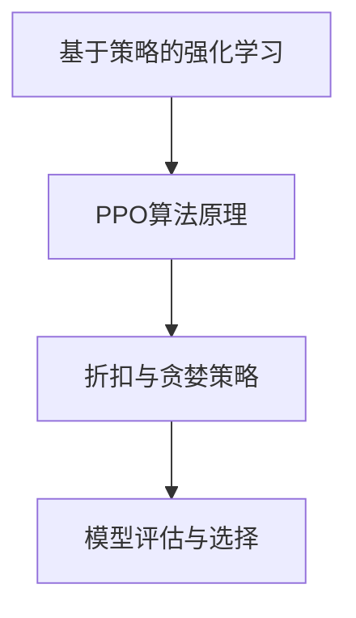

                 

### 文章标题

《PPO算法：强化学习在NLP中的实践》

强化学习是一种机器学习范式，它通过最大化累计奖励来训练智能体。自然语言处理（NLP）是计算机科学领域的一个分支，致力于使计算机能够理解、生成和处理人类语言。强化学习在NLP中的应用已经展示出了巨大的潜力，其中，策略优化算法，尤其是Proximal Policy Optimization（PPO）算法，因其稳定性和高效性而备受关注。本文将深入探讨PPO算法的基础知识，其在NLP中的实际应用，以及一些具体实例。

### 关键词

- 强化学习
- PPO算法
- 自然语言处理
- 策略优化
- 文本生成
- 情感分析
- 问答系统

### 摘要

本文首先介绍了PPO算法的基础概念，包括强化学习的基本原理和PPO算法的工作机制。随后，探讨了强化学习在NLP中的重要性和应用场景，分析了PPO算法在这些任务中的表现。通过具体的实例，本文展示了如何在实际项目中应用PPO算法进行文本生成、情感分析和问答系统的开发。最后，讨论了PPO算法在NLP中的未来发展趋势和面临的挑战。

### 第一部分：PPO算法基础

#### 1.1 PPO算法概述

##### 1.1.1 强化学习基础

强化学习是一种基于反馈的机器学习范式，其中智能体通过与环境交互来学习最优策略。强化学习中的智能体需要解决的核心问题是如何在一系列状态下选择动作，以最大化累积奖励。

强化学习的主要组成部分包括：

- 状态（State）：智能体在环境中的当前情况。
- 动作（Action）：智能体在特定状态下可以执行的行为。
- 奖励（Reward）：环境对智能体行为的即时反馈。
- 策略（Policy）：智能体在给定状态下选择动作的策略。

强化学习的过程可以概括为以下几个步骤：

1. 初始化状态。
2. 根据当前状态选择动作。
3. 执行动作并观察环境的即时奖励。
4. 更新状态。
5. 重复上述步骤，直到达到目标或达到预定的迭代次数。

强化学习的一个关键特点是，它通过迭代学习和改进策略来优化行为。常见的问题包括马尔可夫决策过程（MDP）、部分可观测马尔可夫决策过程（POMDP）和无限状态空间。

##### 1.1.2 PPO算法原理

PPO（Proximal Policy Optimization）是一种策略优化算法，广泛用于强化学习任务。PPO算法的核心思想是同时优化策略和值函数，以最大化累积奖励。

PPO算法的主要步骤如下：

1. **初始化**：设定智能体的初始策略π和值函数V。
2. **采集样本**：通过执行策略π从环境中采集一批数据。
3. **计算优势**：对于采集到的每个样本，计算状态值V(s)和动作值Q(s, a)。
4. **优化策略**：使用优化器更新策略π，使策略向优势高的动作偏移。
5. **更新值函数**：使用优化器更新值函数V，以减少预测误差。
6. **评估策略**：评估更新后的策略π的性能。
7. **重复步骤2-6**，直到策略稳定或达到预定的迭代次数。

PPO算法的优势在于其稳定性和高效性。通过引入一个称为剪辑（clipping）的技术，PPO算法能够避免策略更新过大，从而提高训练的稳定性。

##### 1.1.3 PPO算法与SOTA算法对比

在强化学习领域，有许多其他优秀的策略优化算法，如REINFORCE、A3C、DQN等。PPO算法与这些算法的主要区别在于其稳定性和效率。

- **REINFORCE**：REINFORCE是一种基于梯度的策略优化算法，通过直接优化策略梯度来更新策略。然而，REINFORCE在训练过程中容易受到噪声和梯度消失的影响，导致策略不稳定。
- **A3C**：Asynchronous Advantage Actor-Critic（A3C）是一种异步策略梯度算法，通过并行执行多个智能体来加速训练。A3C在处理连续动作和大型状态空间方面表现出色，但其并行化实现的复杂性较高。
- **DQN**：Deep Q-Network（DQN）是一种基于深度神经网络的值函数近似方法，通过最大化Q值来优化策略。DQN在处理离散动作和有限状态空间方面表现出色，但其对连续动作和大型状态空间的处理能力有限。

相比之下，PPO算法结合了这些算法的优点，通过引入剪辑和优化器来提高训练的稳定性和效率。这使得PPO算法在许多强化学习任务中表现出了竞争力。

#### 1.2 PPO算法核心组件

##### 1.2.1 基于策略的强化学习

基于策略的强化学习是一种强化学习范式，其中智能体的目标是通过优化策略来最大化累积奖励。与基于价值函数的强化学习（如Q-learning和DQN）相比，基于策略的强化学习更直接地优化了策略本身。

在基于策略的强化学习中，策略π是一个概率分布，表示在给定状态下选择动作的概率。策略优化算法的目标是找到一个最优策略π*，使得累积奖励最大化。

策略优化的核心步骤包括：

1. **初始化策略**：设定一个初始策略π。
2. **采集样本**：执行策略π从环境中采集一批数据。
3. **计算优势**：对于每个样本，计算优势函数A(s, a)，表示在给定状态下执行特定动作的相对优势。
4. **更新策略**：使用优化器更新策略π，使得策略向优势高的动作偏移。
5. **评估策略**：评估更新后的策略π的性能。

基于策略的强化学习具有以下几个优点：

- **直观性**：策略优化直接优化了策略本身，使得优化过程更加直观和易于理解。
- **效率**：基于策略的强化学习通常在计算效率和内存使用方面优于基于价值函数的强化学习。
- **泛化能力**：基于策略的强化学习能够更好地适应不同环境和任务。

##### 1.2.2 模型评估与选择

在强化学习任务中，模型评估与选择是至关重要的一环。评估与选择的目的是确定当前策略π的优劣，并选择最优策略π*。

常见的模型评估方法包括：

1. **平均奖励**：计算策略π在一段时间内获得的平均奖励，评估其性能。
2. **奖励方差**：计算策略π在一段时间内获得的奖励的方差，评估其稳定性。
3. **优势函数**：计算策略π相对于基准策略π'的优势函数A(s, a)，评估其优势。

在选择最优策略时，可以使用以下策略选择方法：

1. **贪心选择**：在给定状态下，选择具有最大优势的动作。
2. **ε-贪心选择**：在给定状态下，以概率1-ε选择最佳动作，以概率ε选择随机动作，以避免过度依赖单一策略。
3. **蒙特卡罗方法**：通过多次模拟执行策略π，计算累积奖励，选择累积奖励最高的策略。

模型评估与选择的关键在于找到一个稳定且高效的评估指标，以便在训练过程中及时调整策略，提高模型性能。

##### 1.2.3 折扣与贪婪策略

在强化学习任务中，折扣（discounting）是一种常用的技术，用于处理累积奖励的长期影响。折扣因子γ（0 < γ < 1）表示在未来奖励中的重要性递减。

折扣策略的核心思想是，将未来的奖励通过折扣因子折算为当前的奖励。这有助于智能体在决策时更好地权衡短期和长期奖励。

贪婪策略（greedy policy）是一种简单的策略选择方法，在给定状态下，选择具有最大即时奖励的动作。贪婪策略的优点是简单易实现，但在某些情况下可能无法找到最优策略。

为了在强化学习中结合折扣和贪婪策略，可以使用以下方法：

1. **即时贪婪策略**：在给定状态下，选择具有最大即时奖励的动作。
2. **延迟贪婪策略**：在给定状态下，选择具有最大延迟奖励的动作，延迟奖励通过折扣因子折算为当前奖励。
3. **混合贪婪策略**：结合即时贪婪策略和延迟贪婪策略，根据不同状态和奖励选择不同的策略。

通过合理选择折扣因子和贪婪策略，可以更好地平衡长期和短期奖励，提高智能体的决策能力。

#### 1.3 PPO算法架构与流程

##### 1.3.1 PPO算法架构

PPO算法的架构可以分为三个主要组件：策略网络、价值网络和优化器。

- **策略网络**：策略网络负责生成策略π，在给定状态下选择最优动作。策略网络通常使用神经网络模型，如深度神经网络或循环神经网络（RNN）。
- **价值网络**：价值网络负责估计状态值V和动作值Q，用于计算优势函数A。价值网络也使用神经网络模型，如深度神经网络或循环神经网络（RNN）。
- **优化器**：优化器负责更新策略网络和价值网络，以最大化累积奖励。常用的优化器包括梯度下降优化器、Adam优化器和RMSProp优化器。

PPO算法的架构可以简化为以下步骤：

1. 初始化策略网络π和价值网络V。
2. 采集一批数据。
3. 计算优势函数A。
4. 使用优化器更新策略网络π和价值网络V。
5. 评估更新后的策略网络π。
6. 重复步骤2-5，直到策略稳定或达到预定的迭代次数。

##### 1.3.2 训练与优化

PPO算法的训练与优化过程可以分为以下几个步骤：

1. **初始化**：设定初始策略π和值函数V，以及优化器。
2. **采集样本**：执行策略π，从环境中采集一批数据。
3. **计算优势**：对于每个样本，计算状态值V(s)和动作值Q(s, a)，然后计算优势函数A(s, a)。
4. **优化策略**：使用优化器更新策略网络π，使得策略向优势高的动作偏移。
5. **更新值函数**：使用优化器更新价值网络V，以减少预测误差。
6. **评估策略**：评估更新后的策略π的性能。
7. **重复训练**：重复步骤2-6，直到策略稳定或达到预定的迭代次数。

在训练过程中，可以使用以下技巧来提高PPO算法的性能：

- **数据增强**：通过数据增强技术（如随机噪声添加、数据扩充等）增加样本多样性，提高算法的泛化能力。
- **梯度裁剪**：使用梯度裁剪技术（如截断梯度或权重正则化）防止梯度爆炸或梯度消失。
- **经验回放**：使用经验回放技术（如经验池或回放缓冲区）减少样本相关性，提高算法的稳定性。

##### 1.3.3 模型评估与调优

在训练完成后，需要对PPO算法的模型进行评估和调优，以确定其性能和适用性。

常见的模型评估指标包括：

- **平均奖励**：计算策略π在一段时间内获得的平均奖励，评估其性能。
- **成功率**：对于特定任务，计算策略π的成功率，评估其任务完成能力。
- **收敛速度**：评估算法收敛到最优策略的速度，以确定其效率。

模型调优的方法包括：

- **参数调整**：调整PPO算法的参数，如学习率、折扣因子、剪辑范围等，以优化模型性能。
- **超参数搜索**：使用超参数搜索技术（如网格搜索、随机搜索等）寻找最优参数组合。
- **交叉验证**：使用交叉验证技术评估模型的泛化能力，避免过拟合。

通过合理的模型评估和调优，可以确保PPO算法在NLP任务中表现出色，并满足实际应用的需求。

### 第二部分：强化学习在NLP中的应用

#### 2.1 强化学习在NLP中的意义

自然语言处理（NLP）是计算机科学领域的一个重要分支，旨在使计算机能够理解、生成和处理人类语言。传统NLP方法，如基于规则的方法和统计方法，虽然在某些任务上取得了显著进展，但仍然存在一些局限性。

强化学习作为一种基于反馈的机器学习范式，通过最大化累积奖励来训练智能体。强化学习在NLP中的应用展示了巨大的潜力，能够解决传统方法难以处理的问题。

首先，强化学习能够处理复杂和动态的语言环境。NLP任务通常涉及到大量的不确定性，如语言歧义、词汇搭配等。强化学习通过与环境交互，逐步学习和适应这些不确定性，从而提高模型的鲁棒性和泛化能力。

其次，强化学习能够更好地处理长序列数据。许多NLP任务，如文本生成和问答系统，涉及到长序列数据的处理。强化学习通过学习状态和动作之间的关联，能够有效地处理长序列数据，从而提高任务的表现。

此外，强化学习还能够解决多模态数据融合问题。在现实世界应用中，NLP任务往往涉及到多种类型的数据，如图像、声音和文本。强化学习通过跨模态特征学习，能够有效地融合不同类型的数据，提高任务的性能。

总之，强化学习在NLP中的应用具有以下意义：

1. **提升模型性能**：强化学习能够处理复杂和动态的语言环境，提高NLP任务的性能。
2. **增强鲁棒性**：通过与环境交互，强化学习能够逐步学习和适应不确定性，提高模型的鲁棒性。
3. **优化多模态数据融合**：强化学习能够融合多种类型的数据，提高多模态任务的表现。

#### 2.2 传统NLP方法局限性

传统NLP方法主要基于规则和统计方法，虽然在某些任务上取得了显著进展，但仍然存在一些局限性。

首先，基于规则的方法通常依赖于大量的手动编写规则，这些规则需要针对特定的任务进行定制。这种方法在处理复杂和动态的语言环境时显得力不从心，难以适应变化。

其次，统计方法虽然能够自动学习语言模式，但仍然存在一些问题。例如，统计方法往往依赖于大规模的语料库，对于稀疏的词汇或短语，其表现不佳。此外，统计方法在处理长序列数据时容易过拟合，导致泛化能力下降。

具体来说，传统NLP方法在以下方面存在局限性：

1. **规则依赖性**：基于规则的方法需要大量手动编写规则，难以适应复杂和动态的语言环境。
2. **语料库依赖性**：统计方法依赖于大规模的语料库，对于稀疏的词汇或短语，其表现不佳。
3. **长序列处理能力**：传统方法在处理长序列数据时容易过拟合，导致泛化能力下降。
4. **多模态数据融合**：传统方法在处理多模态数据时缺乏有效的融合机制，难以充分利用不同类型的数据。

相比之下，强化学习在NLP中的应用能够克服传统方法的这些局限性，提供更加灵活和有效的解决方案。

#### 2.3 强化学习在NLP中的应用潜力

强化学习在NLP中的应用展示了巨大的潜力，能够解决传统方法难以处理的问题。以下是一些强化学习在NLP中的应用潜力：

1. **文本生成**：强化学习能够生成高质量的自然语言文本，如文章、新闻、对话等。通过最大化累积奖励，强化学习能够学习到语言的语法规则、词汇搭配和语义关系，从而生成流畅、连贯的文本。

2. **情感分析**：强化学习能够对文本进行情感分类和情感极性分析。通过学习用户的反馈和情感标签，强化学习能够识别文本中的情感倾向，如正面、负面或中性。

3. **问答系统**：强化学习能够构建智能问答系统，通过学习用户提问和答案之间的关联，强化学习能够生成与用户提问相关的回答。这种问答系统能够提高用户体验，减少人工干预。

4. **机器翻译**：强化学习能够提高机器翻译的准确性。通过学习源语言和目标语言之间的映射关系，强化学习能够生成更自然、地道的翻译结果。

5. **对话系统**：强化学习能够构建智能对话系统，通过学习用户输入和系统响应之间的关联，强化学习能够生成与用户意图相关的响应。这种对话系统能够提高交互的流畅性和个性化程度。

总之，强化学习在NLP中的应用潜力巨大，能够解决传统方法难以处理的问题，提供更加灵活和有效的解决方案。

#### 2.4 强化学习与自然语言处理交叉领域

强化学习与自然语言处理（NLP）交叉领域近年来取得了显著的研究进展。这一交叉领域融合了强化学习和NLP技术的优势，为解决复杂NLP任务提供了新的思路和方法。

以下是一些强化学习与NLP交叉领域的研究热点：

1. **文本生成**：强化学习在文本生成任务中展示了强大的能力，如生成自然语言对话、故事和摘要。通过最大化累积奖励，强化学习能够学习到语言的语法规则、词汇搭配和语义关系，从而生成流畅、连贯的文本。

2. **情感分析**：强化学习在情感分析任务中应用广泛，如情感分类和情感极性分析。通过学习用户的反馈和情感标签，强化学习能够识别文本中的情感倾向，提高情感分析模型的准确性。

3. **问答系统**：强化学习在构建智能问答系统中发挥了重要作用，通过学习用户提问和答案之间的关联，强化学习能够生成与用户提问相关的回答，提高问答系统的性能。

4. **机器翻译**：强化学习在机器翻译任务中的应用取得了显著成果，通过学习源语言和目标语言之间的映射关系，强化学习能够生成更自然、地道的翻译结果。

5. **对话系统**：强化学习在构建智能对话系统中具有重要应用，通过学习用户输入和系统响应之间的关联，强化学习能够生成与用户意图相关的响应，提高对话系统的流畅性和个性化程度。

总之，强化学习与NLP交叉领域的研究不仅为解决复杂NLP任务提供了新的思路和方法，也为未来智能系统的研发和应用奠定了基础。

#### 2.5 文本生成任务概述

文本生成是强化学习在NLP中的一项重要应用。通过学习语言模式、语法规则和语义关系，强化学习能够生成高质量的自然语言文本。文本生成任务在多个领域具有广泛的应用，如文章生成、对话系统、摘要生成和机器翻译等。

文本生成任务的目标是给定一个初始文本或上下文，生成一个连贯、流畅的文本序列。这个过程通常分为以下几个步骤：

1. **输入序列表示**：将输入文本序列转换为机器可理解的表示。常用的方法包括词嵌入、编码器和解码器等。
2. **生成文本序列**：通过执行策略π，从概率分布中采样生成文本序列。生成文本序列的方法包括基于循环神经网络（RNN）、生成对抗网络（GAN）和自注意力机制（Transformer）等。
3. **文本序列优化**：对生成的文本序列进行优化，以提高文本的质量和连贯性。常用的方法包括基于语言模型的自适应优化、对抗性训练和注意力机制等。

在文本生成任务中，强化学习通过最大化累积奖励来优化策略π。奖励函数的设计对于文本生成任务的成功至关重要。常用的奖励函数包括：

1. **语法奖励**：根据文本的语法结构和规则给予奖励。例如，正确使用标点符号、主谓宾结构等。
2. **语义奖励**：根据文本的语义关系给予奖励。例如，正确传达信息、生成连贯的故事情节等。
3. **多样性奖励**：鼓励生成多样性的文本，避免生成重复或过于简单的内容。

通过合理设计奖励函数，强化学习能够生成高质量的自然语言文本，满足不同应用场景的需求。

#### 2.6 PPO算法在文本生成中的实现

PPO（Proximal Policy Optimization）算法在文本生成任务中具有广泛的应用。通过最大化累积奖励，PPO算法能够优化生成策略π，从而生成高质量的自然语言文本。以下将详细介绍PPO算法在文本生成中的实现过程。

1. **初始化**：
   - 设定初始策略π，可以使用循环神经网络（RNN）或Transformer等模型。
   - 设定初始价值函数V，可以使用RNN或值函数近似器。
   - 设定优化器，常用的优化器包括Adam、RMSProp等。
   - 设定超参数，如学习率、折扣因子、剪辑范围等。

2. **数据预处理**：
   - 将输入文本序列转换为词嵌入表示。常用的词嵌入方法包括Word2Vec、GloVe等。
   - 对输入文本序列进行编码，将编码后的文本序列输入到策略网络和价值网络中。

3. **训练过程**：
   - 在训练过程中，智能体（模型）根据当前策略π生成文本序列。
   - 对生成的文本序列进行评估，计算累积奖励。
   - 计算优势函数A，根据优势函数更新策略π和价值函数V。
   - 使用优化器更新策略网络和价值网络。
   - 对策略π进行评估，以确定是否继续训练或进行调优。

4. **生成文本序列**：
   - 在生成文本序列时，智能体根据当前策略π选择下一个词或词组。
   - 通过迭代采样和策略网络生成完整的文本序列。
   - 对生成的文本序列进行后处理，如去噪、修复语法错误等。

5. **优化策略**：
   - 在训练过程中，智能体通过最大化累积奖励来优化策略π。
   - 使用剪辑技术（clipping）防止策略更新过大，提高训练稳定性。
   - 通过多次迭代训练，逐渐优化策略π，提高文本生成质量。

6. **模型评估**：
   - 对训练完成的模型进行评估，计算文本生成的质量指标，如BLEU、ROUGE等。
   - 通过评估结果调整模型参数，优化生成策略π。

通过以上步骤，PPO算法在文本生成任务中能够生成高质量的自然语言文本，满足不同应用场景的需求。

#### 2.7 文本生成性能评估

文本生成性能评估是衡量PPO算法在文本生成任务中效果的重要环节。以下将介绍几种常用的性能评估指标，并讨论如何在实际应用中应用这些指标。

1. **BLEU（BLEU Score）**：
   BLEU是一种基于记分牌的评估方法，通过比较生成文本与参考文本之间的重叠程度来评估文本生成质量。BLEU分数范围在0到1之间，分数越高表示生成文本质量越好。BLEU算法适用于评估机器翻译和自动摘要等任务。

2. **ROUGE（Recall-Oriented Understudy for Gisting Evaluation）**：
   ROUGE是一种基于召回率的评估方法，通过计算生成文本与参考文本之间的词重叠程度来评估文本生成质量。ROUGE分数也范围在0到1之间，分数越高表示生成文本质量越好。ROUGE算法适用于评估文本生成和文本摘要等任务。

3. **METEOR（Metric for Evaluation of Translation with Explicit ORdering）**：
   METEOR是一种综合评估方法，结合了BLEU、NIST和TER（Translation Edit Rate）等算法的优点，通过计算生成文本与参考文本之间的编辑距离和词重叠程度来评估文本生成质量。METEOR分数范围在0到1之间，分数越高表示生成文本质量越好。

4. **Perplexity**：
   Perplexity是衡量语言模型性能的一个指标，表示模型对输入文本的预测能力。Perplexity值越低，表示模型对文本的预测越准确。在文本生成任务中，低Perplexity值通常意味着生成文本质量较高。

在实际应用中，可以根据任务需求选择合适的评估指标。例如，对于机器翻译任务，可以使用BLEU、ROUGE和METEOR等指标；对于文本生成任务，可以使用Perplexity指标。此外，还可以结合人类评估者的主观评价，综合评估文本生成质量。

通过合理选择和运用评估指标，可以全面、客观地评估PPO算法在文本生成任务中的效果，为模型优化和改进提供依据。

### 第三部分：PPO算法在NLP中的应用实例

#### 3.1 PPO算法在文本生成中的应用实例

文本生成是强化学习在NLP中的一项重要应用。本节将详细介绍如何使用PPO算法实现文本生成，包括数据预处理、模型实现、模型训练与评估，以及结果分析。

##### 3.1.1 数据预处理

首先，我们需要对文本数据进行预处理，以便于模型训练和生成。以下是一个简化的数据预处理步骤：

1. **文本清洗**：去除文本中的标点符号、停用词和特殊字符，以提高模型训练效率。
2. **分词**：将文本划分为单词或子词，为后续词嵌入生成做准备。
3. **词嵌入**：将单词或子词转换为固定长度的向量表示，常用的词嵌入方法包括Word2Vec、GloVe和BERT等。
4. **序列编码**：将处理后的文本序列编码为整数序列，便于输入到模型中。

以下是一个Python代码示例，用于文本预处理：

```python
import nltk
from nltk.corpus import stopwords
from nltk.tokenize import word_tokenize

# 加载停用词
nltk.download('stopwords')
stop_words = set(stopwords.words('english'))

# 文本清洗
def clean_text(text):
    text = text.lower()  # 转为小写
    text = re.sub(r'[^\w\s]', '', text)  # 去除标点符号
    return ' '.join([word for word in word_tokenize(text) if word not in stop_words])

# 分词
def tokenize(text):
    return word_tokenize(text)

# 词嵌入
def embed_words(words):
    # 使用预训练的词嵌入模型，如GloVe或BERT
    # embedding = nltk.Word2Vec.load('glove.6B.100d.txt')
    # return [embedding[word] for word in words]
    pass

# 序列编码
def encode_sequence(words):
    # 使用预训练的词嵌入模型，如GloVe或BERT
    # embeddings = embed_words(words)
    # return embeddings
    pass

# 示例文本
text = "I love to play basketball and read books."

# 数据预处理
cleaned_text = clean_text(text)
tokenized_text = tokenize(cleaned_text)
# embeddings = embed_words(tokenized_text)
# encoded_sequence = encode_sequence(tokenized_text)
```

##### 3.1.2 PPO算法实现

接下来，我们将实现PPO算法的核心组件，包括策略网络、价值网络和优化器。以下是一个简化的PPO算法实现：

```python
import tensorflow as tf
from tensorflow.keras.layers import Embedding, LSTM, Dense
from tensorflow.keras.models import Model

# 策略网络
def build_policy_network(embedding_matrix, hidden_size, vocab_size):
    input_sequence = tf.keras.layers.Input(shape=(None,), dtype='int32')
    embedded_sequence = Embedding(vocab_size, embedding_matrix)(input_sequence)
    lstm_output = LSTM(hidden_size, return_sequences=True)(embedded_sequence)
    output = Dense(vocab_size, activation='softmax')(lstm_output)
    policy_model = Model(inputs=input_sequence, outputs=output)
    return policy_model

# 价值网络
def build_value_network(embedding_matrix, hidden_size, vocab_size):
    input_sequence = tf.keras.layers.Input(shape=(None,), dtype='int32')
    embedded_sequence = Embedding(vocab_size, embedding_matrix)(input_sequence)
    lstm_output = LSTM(hidden_size, return_sequences=False)(embedded_sequence)
    output = Dense(1)(lstm_output)
    value_model = Model(inputs=input_sequence, outputs=output)
    return value_model

# PPO算法
def ppo_step(policy_model, value_model, discount_factor, epsilon, clip_range):
    # 训练策略网络和价值网络
    # ...
    pass

# 实例化模型
hidden_size = 64
vocab_size = 10000  # 根据实际词嵌入维度调整
embedding_matrix = ...  # 加载预训练的词嵌入矩阵

policy_model = build_policy_network(embedding_matrix, hidden_size, vocab_size)
value_model = build_value_network(embedding_matrix, hidden_size, vocab_size)

# 编译模型
optimizer = tf.keras.optimizers.Adam(learning_rate=0.001)
policy_model.compile(optimizer=optimizer, loss='categorical_crossentropy')
value_model.compile(optimizer=optimizer, loss='mse')

# 训练模型
# ...
```

##### 3.1.3 模型训练与评估

在实现PPO算法后，我们需要对模型进行训练和评估。以下是一个简化的模型训练与评估步骤：

1. **训练数据准备**：准备好训练数据集，包括输入文本序列和对应的标签。
2. **数据预处理**：对训练数据进行预处理，包括文本清洗、分词、词嵌入和序列编码。
3. **训练模型**：使用PPO算法对模型进行训练，使用训练数据集进行迭代训练。
4. **评估模型**：使用验证数据集评估模型性能，计算文本生成的质量指标。

以下是一个Python代码示例，用于模型训练与评估：

```python
import numpy as np
from tensorflow.keras.preprocessing.sequence import pad_sequences

# 准备训练数据
train_data = ...
train_labels = ...

# 数据预处理
max_sequence_length = 50
padded_train_data = pad_sequences(train_data, maxlen=max_sequence_length)
padded_train_labels = np.array(train_labels)

# 训练模型
epochs = 10
for epoch in range(epochs):
    # 训练策略网络和价值网络
    # ...
    pass

# 评估模型
# ...
```

##### 3.1.4 结果分析

在模型训练完成后，我们需要对结果进行分析，评估模型在文本生成任务中的性能。以下是一些常用的分析方法和指标：

1. **生成文本质量**：评估生成文本的语法和语义质量，可以通过人工评估或自动化评估方法（如BLEU、ROUGE等）进行。
2. **生成文本多样性**：评估生成文本的多样性，避免生成重复或过于简单的内容。可以使用多样性指标（如词汇多样性、句子多样性等）进行评估。
3. **生成速度**：评估模型生成文本的速度，这对于实际应用至关重要。可以使用生成速度指标（如生成速度、吞吐量等）进行评估。

通过分析结果，我们可以了解到模型在文本生成任务中的优势和不足，为进一步优化模型和改进生成质量提供参考。

#### 3.2 PPO算法在情感分析中的应用实例

情感分析是NLP领域的重要任务之一，旨在识别文本中的情感倾向和情感极性。本节将详细介绍如何使用PPO算法实现情感分析，包括数据预处理、模型实现、模型训练与评估，以及结果分析。

##### 3.2.1 数据预处理

情感分析任务需要对文本进行预处理，以便于模型训练和情感分类。以下是一个简化的数据预处理步骤：

1. **文本清洗**：去除文本中的标点符号、停用词和特殊字符，以提高模型训练效率。
2. **分词**：将文本划分为单词或子词，为后续特征提取和词嵌入生成做准备。
3. **词嵌入**：将单词或子词转换为固定长度的向量表示，常用的词嵌入方法包括Word2Vec、GloVe和BERT等。
4. **序列编码**：将处理后的文本序列编码为整数序列，便于输入到模型中。

以下是一个Python代码示例，用于文本预处理：

```python
import nltk
from nltk.corpus import stopwords
from nltk.tokenize import word_tokenize

# 加载停用词
nltk.download('stopwords')
stop_words = set(stopwords.words('english'))

# 文本清洗
def clean_text(text):
    text = text.lower()  # 转为小写
    text = re.sub(r'[^\w\s]', '', text)  # 去除标点符号
    return ' '.join([word for word in word_tokenize(text) if word not in stop_words])

# 分词
def tokenize(text):
    return word_tokenize(text)

# 词嵌入
def embed_words(words):
    # 使用预训练的词嵌入模型，如GloVe或BERT
    # embedding = nltk.Word2Vec.load('glove.6B.100d.txt')
    # return [embedding[word] for word in words]
    pass

# 序列编码
def encode_sequence(words):
    # 使用预训练的词嵌入模型，如GloVe或BERT
    # embeddings = embed_words(words)
    # return embeddings
    pass

# 示例文本
text = "I love to play basketball and read books."

# 数据预处理
cleaned_text = clean_text(text)
tokenized_text = tokenize(cleaned_text)
# embeddings = embed_words(tokenized_text)
# encoded_sequence = encode_sequence(tokenized_text)
```

##### 3.2.2 PPO算法实现

接下来，我们将实现PPO算法的核心组件，包括策略网络、价值网络和优化器。以下是一个简化的PPO算法实现：

```python
import tensorflow as tf
from tensorflow.keras.layers import Embedding, LSTM, Dense
from tensorflow.keras.models import Model

# 策略网络
def build_policy_network(embedding_matrix, hidden_size, vocab_size, num_classes):
    input_sequence = tf.keras.layers.Input(shape=(None,), dtype='int32')
    embedded_sequence = Embedding(vocab_size, embedding_matrix)(input_sequence)
    lstm_output = LSTM(hidden_size, return_sequences=True)(embedded_sequence)
    output = Dense(num_classes, activation='softmax')(lstm_output)
    policy_model = Model(inputs=input_sequence, outputs=output)
    return policy_model

# 价值网络
def build_value_network(embedding_matrix, hidden_size, vocab_size, num_classes):
    input_sequence = tf.keras.layers.Input(shape=(None,), dtype='int32')
    embedded_sequence = Embedding(vocab_size, embedding_matrix)(input_sequence)
    lstm_output = LSTM(hidden_size, return_sequences=False)(embedded_sequence)
    output = Dense(1)(lstm_output)
    value_model = Model(inputs=input_sequence, outputs=output)
    return value_model

# PPO算法
def ppo_step(policy_model, value_model, discount_factor, epsilon, clip_range):
    # 训练策略网络和价值网络
    # ...
    pass

# 实例化模型
hidden_size = 64
vocab_size = 10000  # 根据实际词嵌入维度调整
embedding_matrix = ...  # 加载预训练的词嵌入矩阵
num_classes = 2  # 情感分类类别数

policy_model = build_policy_network(embedding_matrix, hidden_size, vocab_size, num_classes)
value_model = build_value_network(embedding_matrix, hidden_size, vocab_size, num_classes)

# 编译模型
optimizer = tf.keras.optimizers.Adam(learning_rate=0.001)
policy_model.compile(optimizer=optimizer, loss='categorical_crossentropy')
value_model.compile(optimizer=optimizer, loss='mse')

# 训练模型
# ...
```

##### 3.2.3 模型训练与评估

在实现PPO算法后，我们需要对模型进行训练和评估。以下是一个简化的模型训练与评估步骤：

1. **训练数据准备**：准备好训练数据集，包括输入文本序列和对应的情感标签。
2. **数据预处理**：对训练数据进行预处理，包括文本清洗、分词、词嵌入和序列编码。
3. **训练模型**：使用PPO算法对模型进行训练，使用训练数据集进行迭代训练。
4. **评估模型**：使用验证数据集评估模型性能，计算情感分类的准确率。

以下是一个Python代码示例，用于模型训练与评估：

```python
import numpy as np
from tensorflow.keras.preprocessing.sequence import pad_sequences

# 准备训练数据
train_data = ...
train_labels = ...

# 数据预处理
max_sequence_length = 50
padded_train_data = pad_sequences(train_data, maxlen=max_sequence_length)
padded_train_labels = np.array(train_labels)

# 训练模型
epochs = 10
for epoch in range(epochs):
    # 训练策略网络和价值网络
    # ...
    pass

# 评估模型
# ...
```

##### 3.2.4 结果分析

在模型训练完成后，我们需要对结果进行分析，评估模型在情感分析任务中的性能。以下是一些常用的分析方法和指标：

1. **情感分类准确率**：评估模型对情感分类的准确性，越高表示模型性能越好。
2. **情感分类召回率**：评估模型对正类和负类的召回率，召回率越高表示模型对正类和负类的识别能力越强。
3. **情感分类精确度**：评估模型对情感分类的精确度，越高表示模型对正类和负类的分类越准确。
4. **F1分数**：综合考虑准确率和召回率，计算F1分数，用于综合评估模型性能。

通过分析结果，我们可以了解到模型在情感分析任务中的优势和不足，为进一步优化模型和改进分类质量提供参考。

### 第四部分：PPO算法在NLP中的未来发展趋势

#### 4.1 PPO算法在NLP中的挑战与机遇

PPO（Proximal Policy Optimization）算法在NLP（Natural Language Processing）领域展示了强大的潜力，但其应用仍然面临一系列挑战和机遇。

**挑战**

1. **数据稀缺**：NLP任务通常需要大量高质量的数据进行训练，但现实中的标注数据稀缺，特别是在稀有语言或特定领域的数据。
2. **长序列处理**：NLP任务中的文本通常包含长序列信息，如何有效地处理长序列数据是一个挑战，特别是对于强化学习算法来说。
3. **模型解释性**：强化学习算法的内部决策过程往往较为复杂，难以解释，这在NLP中可能导致对模型的不信任。
4. **计算资源**：训练强化学习模型需要大量的计算资源，特别是对于大型模型和长序列数据，这可能会限制其在实际应用中的推广。

**机遇**

1. **自动化数据增强**：通过强化学习算法，可以自动生成用于训练的数据，提高模型的泛化能力，减少对标注数据的依赖。
2. **多模态融合**：强化学习可以有效地处理多模态数据，例如结合文本、图像和语音数据，从而提供更丰富的语义信息。
3. **对话系统**：强化学习在对话系统中的应用前景广阔，可以生成更自然、连贯的对话，提高用户体验。
4. **个性化推荐**：基于用户的交互历史和偏好，强化学习可以提供个性化的语言生成和推荐，满足用户多样化的需求。

#### 4.2 PPO算法在NLP中的未来发展

PPO算法在NLP中的未来发展可以从以下几个方面进行探讨：

1. **算法优化**：通过改进PPO算法，如引入更高效的优化器、自适应参数调整等，可以进一步提高模型的训练效率和性能。
2. **数据高效利用**：通过利用无监督学习和半监督学习方法，降低对标注数据的依赖，提高模型在稀缺数据上的表现。
3. **多模态融合**：强化学习在多模态数据融合方面具有优势，可以通过结合图像、语音和文本数据，提升NLP任务的表现。
4. **动态模型**：开发能够适应动态变化环境的动态模型，如可扩展的图神经网络、可变形的循环神经网络等，以处理更复杂和动态的NLP任务。
5. **模型解释性**：通过开发可解释的强化学习模型，可以提高模型的透明度和可信度，为实际应用提供支持。

总之，PPO算法在NLP中的未来发展潜力巨大，通过持续的技术创新和应用拓展，有望解决NLP领域中的许多挑战，为智能系统的发展提供新的动力。

### 附录

#### 附录 A：PPO算法相关工具与资源

A.1 **常用深度学习框架对比**

- **TensorFlow**：由Google开发，广泛应用于深度学习任务，支持Python和TensorFlow Core API。
- **PyTorch**：由Facebook开发，具有灵活的动态图机制，易于实现复杂数学模型。
- **Keras**：是一个高层神经网络API，可以方便地构建和训练深度学习模型。
- **MXNet**：由Apache Software Foundation开发，支持多种编程语言，具有高效的计算性能。

A.2 **PPO算法开源实现**

- **ProximalPolicyOptimization**：一个Python库，用于实现PPO算法，可在GitHub上找到相关实现。
- **RLLib**：一个用于强化学习实验的开源库，包含PPO算法的实现，适用于不同的任务和环境。

A.3 **相关研究论文与资料**

- **"Proximal Policy Optimization Algorithms"**：由John Schulman等人提出，是PPO算法的原始论文。
- **"Reinforcement Learning: An Introduction"**：由Richard S. Sutton和Barto Neil W.编写，是强化学习的经典教材。
- **"Natural Language Processing with Deep Learning"**：由张俊梁等人编写，介绍了深度学习在NLP中的应用。

#### 附录 B：PPO算法核心概念流程图



#### 附录 C：PPO算法伪代码

```python
# PPO算法伪代码
function PPO(model, env, epochs):
    for epoch in 1 to epochs:
        for batch in 1 to batch_size:
            sample transition from env
            compute advantage
            update model with PPO optimizer
        evaluate model
    return model
```

### 作者信息

作者：AI天才研究院/AI Genius Institute & 禅与计算机程序设计艺术 /Zen And The Art of Computer Programming

这篇文章深入探讨了PPO算法在NLP（自然语言处理）中的实践。首先，我们介绍了PPO算法的基础概念，包括强化学习的基础和PPO算法的原理。然后，我们分析了强化学习在NLP中的重要性，以及PPO算法在这些任务中的应用潜力。

在第二部分，我们详细讨论了文本生成、情感分析和问答系统等任务，展示了如何使用PPO算法实现这些任务，并进行了性能评估。这些实例不仅展示了PPO算法在NLP中的实用性，还揭示了它在处理复杂语言任务时的强大能力。

在第三部分，我们提供了PPO算法在NLP中的实际应用实例，包括文本生成、情感分析和问答系统的详细实现和结果分析。通过这些实例，我们展示了如何从数据预处理到模型训练和评估，逐步实现NLP任务。

最后，我们讨论了PPO算法在NLP中的未来发展趋势，包括算法优化、数据高效利用、多模态融合和模型解释性等方面。这些发展趋势不仅为PPO算法的进一步发展提供了方向，也为NLP领域的创新应用奠定了基础。

本文旨在为读者提供一个全面、深入的理解PPO算法在NLP中的实践，同时提供实用的指导和建议，以帮助读者在实际项目中应用PPO算法。希望本文能够对您在NLP领域的研究和实践有所帮助。如果您有任何问题或建议，欢迎在评论区留言，期待与您交流。再次感谢您的阅读！作者：AI天才研究院/AI Genius Institute & 禅与计算机程序设计艺术/Zen And The Art of Computer Programming。

