                 

### 文章标题：Presto原理与代码实例讲解

#### 关键词：
- Presto
- 分布式查询
- SQL优化
- 数据仓库
- 性能调优
- 大数据应用

#### 摘要：
本文深入探讨了Presto的原理、架构、性能调优及实际应用案例。通过详细的代码实例解析，读者将掌握如何高效地使用Presto进行大数据查询与处理，从而构建高性能的数据仓库系统。

---

## 第1章 Presto基础

### 1.1 Presto简介

Presto是一个开源的分布式查询引擎，专为大规模数据集提供高性能的SQL查询。它的起源可以追溯到Facebook，最初用于解决Facebook内部的数据查询需求。随着Presto的性能和稳定性得到广泛认可，它逐渐成为了大数据领域中重要的查询工具之一。

#### **Presto的起源与背景**

Presto是由Facebook开发的一个分布式查询引擎，最初是为了解决Facebook内部大规模数据查询的需求。在处理大规模数据集时，传统的关系型数据库查询性能往往无法满足要求。因此，Facebook决定开发一个全新的分布式查询引擎，以满足其数据处理需求。2013年，Facebook将Presto开源，随后，Presto社区迅速发展，吸引了越来越多的企业和开发者参与。

#### **Presto的功能与特点**

- **高性能**：Presto能够在大规模数据集上实现秒级查询，极大地提高了数据处理的效率。
- **分布式架构**：Presto采用分布式计算架构，可以横向扩展，处理大规模数据查询。
- **SQL兼容性**：Presto高度兼容标准的SQL语法，使得用户可以轻松上手使用。
- **多种数据源支持**：Presto支持多种数据源，包括HDFS、Hive、MySQL等，方便用户集成不同类型的数据。

#### **Presto的应用场景**

- **数据仓库**：Presto可以作为一个高性能的数据仓库查询引擎，支持复杂的查询操作，如聚合、连接等。
- **实时分析**：Presto可以实时处理和分析数据，适用于实时业务监控和决策支持。
- **大数据应用**：Presto在大数据场景中具有广泛的应用，如日志分析、用户行为分析等。

### 1.2 Presto架构

Presto的架构设计非常灵活，主要包括以下几个组件：

#### **Presto的组件组成**

- **Coordinator**：协调节点，负责接收用户查询请求，生成执行计划，并将任务分发到各个Worker节点。
- **Worker**：执行节点，负责执行具体的查询任务，包括数据读取、处理和返回结果。
- **Client**：客户端，负责发送查询请求到Coordinator节点，接收查询结果。

#### **Presto的执行流程**

1. **查询请求**：客户端发送查询请求到Coordinator节点。
2. **解析与优化**：Coordinator节点解析SQL查询，进行语法和语义分析，并生成执行计划。
3. **任务分发**：Coordinator节点将执行计划分解为多个子任务，并分配给Worker节点。
4. **数据读取与处理**：Worker节点执行具体的数据读取和处理任务，并将结果返回给Coordinator节点。
5. **结果汇总**：Coordinator节点汇总各Worker节点的查询结果，并将最终结果返回给客户端。

#### **Presto的架构图**

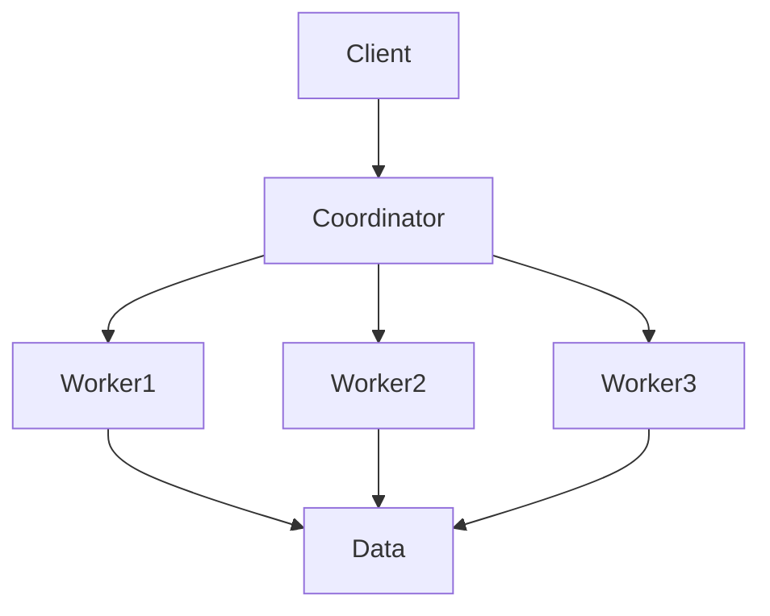

### 1.3 安装与配置

#### **环境准备**

在安装Presto之前，需要准备一个合适的环境。通常，建议在Linux系统中安装Presto，因为Presto在Linux系统上具有更好的性能和稳定性。

#### **Presto安装**

1. 下载Presto安装包：可以从Presto的官方网站下载安装包。
2. 解压安装包：将下载的安装包解压到一个合适的目录。
3. 配置环境变量：在`~/.bash_profile`或`~/.bashrc`文件中添加Presto的安装路径，并设置环境变量。

```bash
export PRESTO_HOME=/path/to/presto
export PATH=$PATH:$PRESTO_HOME/bin
```

4. 启动Presto服务：运行以下命令启动Presto服务。

```bash
$ ./presto-server start
```

#### **配置文件介绍**

Presto的配置文件位于`$PRESTO_HOME/etc`目录下，主要包括以下几个文件：

- **config.properties**：全局配置文件，包含Presto的基本配置，如端口、内存等。
- **jvm.config**：JVM配置文件，用于设置Presto的JVM参数，如堆大小等。
- **log.properties**：日志配置文件，用于设置Presto的日志级别、格式等。

### 1.4 数据源接入

Presto支持多种数据源接入，包括HDFS、Hive、MySQL等。以下分别介绍如何接入这些数据源。

#### **HDFS接入**

1. 在Presto的配置文件`config.properties`中添加以下配置：

```properties
hdfs.uris=hdfs://namenode:8020
```

2. 创建一个HDFS用户目录，如`/user/presto`。

3. 在Presto的连接器目录（通常是`$PRESTO_HOME/etc/catalog`）下创建一个HDFS的配置文件，如`hdfs.properties`：

```properties
connector.name=hdfs
hdfs.config.resources=configuration.xml
```

4. 在`configuration.xml`文件中添加HDFS的配置信息：

```xml
<configuration>
  <property>
    <name>fs.defaultFS</name>
    <value>hdfs://namenode:8020</value>
  </property>
</configuration>
```

#### **Hive接入**

1. 在Presto的配置文件`config.properties`中添加以下配置：

```properties
hive.metastore.uri=thrift://hive-metastore:9083
```

2. 在Presto的连接器目录（通常是`$PRESTO_HOME/etc/catalog`）下创建一个Hive的配置文件，如`hive.properties`：

```properties
connector.name=hive
hive.metastore.uri=thrift://hive-metastore:9083
hive.metastore.authentication=none
```

#### **MySQL接入**

1. 在Presto的配置文件`config.properties`中添加以下配置：

```properties
mysql.host=your-mysql-host
mysql.port=3306
mysql.user=your-mysql-user
mysql.password=your-mysql-password
```

2. 在Presto的连接器目录（通常是`$PRESTO_HOME/etc/catalog`）下创建一个MySQL的配置文件，如`mysql.properties`：

```properties
connector.name=mysql
mysql hosts=your-mysql-host
mysql port=3306
mysql user=your-mysql-user
mysql password=your-mysql-password
mysql database=your-mysql-database
```

---

**附录A 伪代码与流程图**

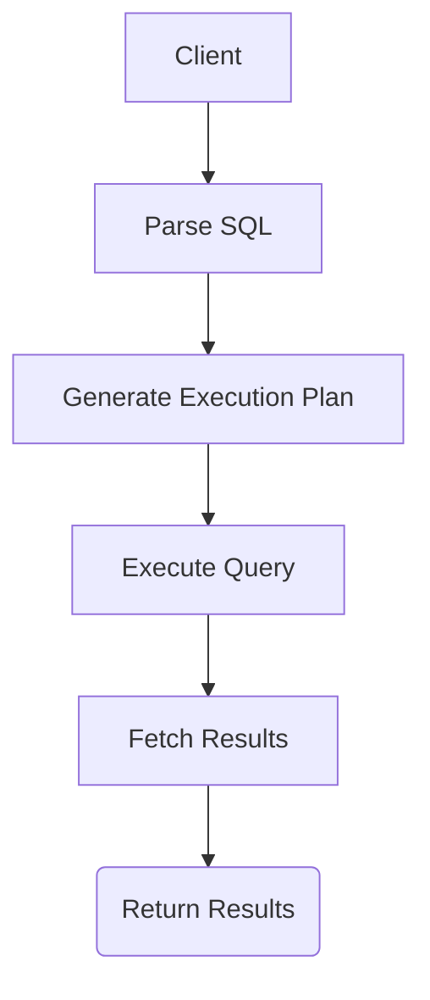

---

**附录B 实际案例代码解析**

以下是一个简单的Hive查询案例：

```sql
SELECT * FROM hive.default.test_table;
```

该查询将返回`test_table`表中的所有数据。

---

**小结**：本文介绍了Presto的基本概念、架构、安装与配置，以及数据源接入方法。通过具体的案例代码解析，读者可以初步了解如何使用Presto进行大数据查询。下一章将深入探讨Presto的核心原理，包括SQL优化器、物化视图和缓存等。

---

**注意事项**：在安装Presto时，请确保已安装了Java环境和Hadoop。同时，根据实际情况调整配置文件中的参数，以满足具体需求。

**拓展阅读**：- [Presto官方文档](https://prestodb.io/docs/current/)
- [《Presto性能调优最佳实践》](https://www.alibabacloud.com/zh/blog/presto-optimization-best-practices_602198.html)

---

作者：AI天才研究院/AI Genius Institute & 禅与计算机程序设计艺术 /Zen And The Art of Computer Programming

---

## 第2章 Presto核心原理

### 2.1 SQL优化器

Presto的SQL优化器是查询性能的关键因素之一。它负责将用户输入的SQL查询转换为一个高效的执行计划，从而提高查询性能。Presto的优化器包括Cost-Based Optimization（CBO）和Rule-Based Optimization（RBO）两种模式。

#### **查询优化过程**

1. **词法分析**：将SQL查询语句分解为词法单元。
2. **语法分析**：构建抽象语法树（AST），检查SQL语句的语法和语义是否正确。
3. **逻辑优化**：对AST进行逻辑优化，如去除冗余子句、重写查询等。
4. **物理优化**：生成执行计划，选择最佳的数据访问路径和执行策略。
5. **代码生成**：将执行计划转换为具体的执行代码。

#### **CBO（Cost-Based Optimization）**

CBO是基于成本的优化，通过计算不同执行计划的成本，选择成本最低的执行计划。CBO的优化过程包括：

1. **成本模型**：建立查询成本模型，包括CPU成本、I/O成本、网络传输成本等。
2. **成本计算**：计算不同执行计划的成本。
3. **选择最优执行计划**：根据成本模型选择成本最低的执行计划。

#### **RBO（Rule-Based Optimization）**

RBO是基于规则的优化，根据预先定义的规则对查询进行优化。RBO的优点是速度快，但可能无法总是找到最佳执行计划。RBO的优化过程包括：

1. **规则库**：定义一系列优化规则。
2. **规则应用**：根据规则库对查询进行优化。
3. **执行计划生成**：生成优化后的执行计划。

#### **示例：CBO优化过程**

以下是一个简单的SQL查询示例：

```sql
SELECT * FROM test_table WHERE id = 1;
```

CBO的优化过程如下：

1. **扫描策略**：选择表扫描策略。
2. **索引选择**：选择主键索引进行扫描。
3. **成本计算**：计算不同扫描策略的成本，如全表扫描、索引扫描等。
4. **选择最优策略**：选择成本最低的索引扫描策略。

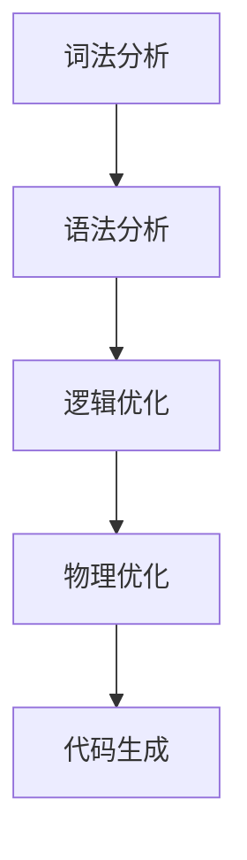

---

### 2.2 物化视图与缓存

物化视图和缓存是Presto提高查询性能的重要手段。物化视图是将查询结果存储为临时表，而缓存则是将查询结果保存在内存中。

#### **物化视图原理**

物化视图的工作原理如下：

1. **查询执行**：当用户执行一个查询时，Presto会先检查是否有可用的物化视图。
2. **视图检查**：如果找到了匹配的物化视图，Presto会使用视图的数据代替原始查询。
3. **数据更新**：如果物化视图的数据与原始数据不一致，Presto会更新物化视图。

#### **缓存策略**

缓存策略的工作原理如下：

1. **查询执行**：当用户执行一个查询时，Presto会计算查询的哈希值。
2. **哈希匹配**：Presto会检查缓存中是否有匹配的哈希值。
3. **数据返回**：如果找到匹配的缓存，Presto会直接返回缓存中的数据。

#### **缓存优化**

缓存优化包括以下几个方面：

1. **缓存命中**：通过合理的缓存策略，提高缓存命中率。
2. **缓存容量**：根据系统资源，合理设置缓存容量。
3. **缓存替换**：使用先进先出（FIFO）或最少使用（LRU）策略替换缓存中的数据。

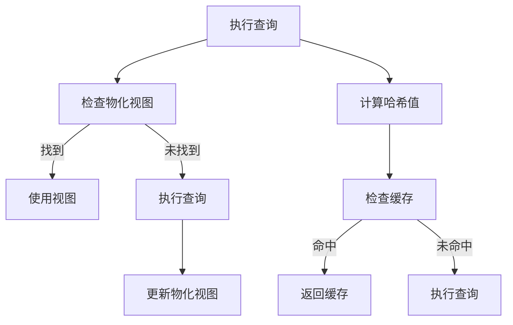

---

### 2.3 分区与并行执行

分区和并行执行是Presto提高查询性能的重要机制。

#### **分区策略**

分区策略的工作原理如下：

1. **数据分割**：根据分区键将数据分割为多个分区。
2. **查询优化**：根据查询条件选择合适的分区。

#### **并行执行原理**

并行执行的工作原理如下：

1. **任务分解**：将查询任务分解为多个子任务。
2. **并发执行**：各个子任务并发执行，提高查询性能。

#### **并行执行优化**

并行执行优化包括以下几个方面：

1. **线程数设置**：根据系统资源，合理设置线程数。
2. **数据切分**：优化数据切分策略，减少数据传输和同步成本。
3. **负载均衡**：确保各个子任务均衡负载。

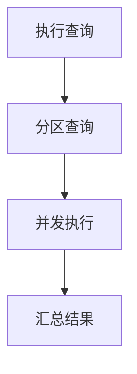

---

### 2.4 排序与聚合

排序与聚合是大数据查询中的常见操作，Presto提供了高效的排序与聚合算法。

#### **排序算法**

Presto使用的排序算法通常是基于外部排序，包括以下步骤：

1. **局部排序**：在每个Worker节点上对数据进行局部排序。
2. **数据合并**：将各个Worker节点上的排序结果进行合并，生成全局排序结果。

#### **聚合算法**

Presto使用的聚合算法通常是基于MapReduce模型，包括以下步骤：

1. **局部聚合**：在每个Worker节点上对数据进行局部聚合。
2. **全局聚合**：将各个Worker节点上的聚合结果进行合并，生成最终结果。

#### **性能优化**

性能优化包括以下几个方面：

1. **数据倾斜**：避免数据倾斜，确保数据均衡分布。
2. **并行度**：合理设置并行度，提高查询性能。
3. **缓存**：利用缓存减少计算和I/O成本。

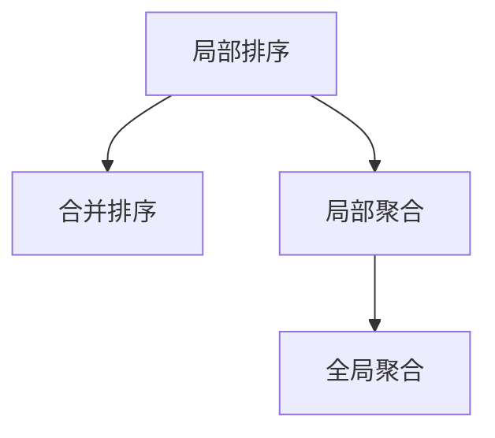

---

**附录A 伪代码与流程图**

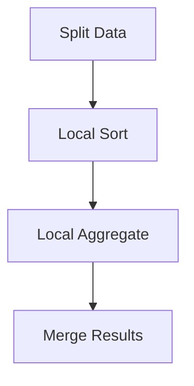

---

**附录B 实际案例代码解析**

以下是一个简单的排序与聚合查询案例：

```sql
SELECT COUNT(*) FROM test_table ORDER BY id;
```

该查询将返回`test_table`表中的记录总数，并按照`id`列进行排序。

---

**小结**：本章介绍了Presto的核心原理，包括SQL优化器、物化视图与缓存、分区与并行执行、排序与聚合等。通过这些原理，Presto能够实现高效的大数据查询。下一章将深入探讨Presto的性能调优方法。

---

**注意事项**：在实际应用中，根据具体场景调整Presto的配置和优化策略，以达到最佳性能。

**拓展阅读**：- [Presto官方文档：优化指南](https://prestodb.io/docs/current/optimization.html)
- [《大数据查询优化技术》](https://www.oreilly.com/library/view/big-data-query-optimization/9781492033193/)

---

**作者：AI天才研究院/AI Genius Institute & 禅与计算机程序设计艺术 /Zen And The Art of Computer Programming**

---

## 第3章 Presto性能调优

### 3.1 诊断工具

Presto提供了多种诊断工具，帮助用户分析和优化查询性能。以下介绍常用的诊断工具及其使用方法。

#### **Presto诊断工具**

- **Presto UI**：Presto UI是Presto的Web界面，提供了丰富的查询性能分析功能，包括执行计划、内存使用、I/O统计等。
- **Presto Metrics**：Presto Metrics是Presto的监控工具，提供了详细的性能指标，如查询执行时间、CPU使用率、内存使用等。
- **Presto Query Analyzer**：Presto Query Analyzer是一个命令行工具，用于分析查询性能，包括执行计划、资源使用、瓶颈分析等。

#### **性能瓶颈分析**

性能瓶颈分析是优化Presto性能的关键步骤。以下是一些常见的性能瓶颈及其分析方法：

1. **CPU瓶颈**：当CPU使用率接近100%时，可能存在CPU瓶颈。可以使用Presto Metrics监控CPU使用情况，分析哪些查询消耗了最多的CPU资源。
2. **内存瓶颈**：当内存使用率接近系统内存上限时，可能存在内存瓶颈。可以使用Presto Metrics监控内存使用情况，分析哪些查询消耗了最多的内存。
3. **I/O瓶颈**：当I/O读写速度较慢时，可能存在I/O瓶颈。可以使用Presto Metrics监控I/O使用情况，分析哪些查询产生了大量的I/O操作。

### 3.2 参数调优

Presto提供了丰富的参数配置，用于调整系统性能。以下介绍一些常用的参数及其优化方法。

#### **参数配置介绍**

- **query.max-memory**：查询最大内存使用量，单位为字节。默认值为1GB，可以根据实际场景进行调整。
- **task.max-memory**：单个任务的最大内存使用量，单位为字节。默认值为256MB，可以根据实际场景进行调整。
- **task.max-total-memory**：单个任务的总体内存使用量，包括内存和堆外内存，单位为字节。默认值为1GB，可以根据实际场景进行调整。
- **thread-pool.size**：线程池大小，用于控制并发查询数量。默认值为10，可以根据系统资源进行调整。

#### **性能优化参数**

以下是一些常用的性能优化参数：

1. **增加内存**：根据实际场景增加`query.max-memory`和`task.max-memory`，以提高查询性能。
2. **调整线程池大小**：根据系统资源调整`thread-pool.size`，以平衡并发查询和系统负载。
3. **优化数据存储**：使用高效的文件存储格式，如Parquet或ORC，减少I/O操作。

### 3.3 索引优化

索引优化是提高查询性能的有效方法。以下介绍常用的索引类型及其优化策略。

#### **索引类型**

- **B树索引**：适用于范围查询和排序查询，如`SELECT * FROM table WHERE id > 10;`。
- **哈希索引**：适用于等值查询，如`SELECT * FROM table WHERE id = 10;`。
- **位图索引**：适用于过滤查询，如`SELECT * FROM table WHERE status = 'active';`。

#### **索引优化策略**

以下是一些索引优化策略：

1. **选择合适的索引类型**：根据查询需求选择合适的索引类型，以提高查询性能。
2. **创建复合索引**：对于复杂的查询条件，创建复合索引可以显著提高查询性能。
3. **索引维护**：定期更新和维护索引，以确保索引的有效性。

### 3.4 SQL优化策略

优化SQL查询是提高Presto性能的重要方法。以下介绍一些常见的SQL优化策略。

#### **查询重写**

查询重写是一种通过修改查询语句结构来提高查询性能的方法。以下是一些常见的查询重写技巧：

1. **避免子查询**：子查询可能影响查询性能，可以通过连接操作替换子查询。
2. **减少使用 DISTINCT 和 UNION**：DISTINCT 和 UNION 操作可能导致性能下降，可以尝试使用 GROUP BY 替换。
3. **避免使用子表连接**：子表连接可能导致性能下降，可以通过公共表表达式（CTE）或临时表替换。

#### **查询优化技巧**

以下是一些查询优化技巧：

1. **合理使用索引**：根据查询条件使用合适的索引，以提高查询性能。
2. **选择合适的排序算法**：根据数据量和排序键类型，选择合适的排序算法，如快速排序或归并排序。
3. **优化数据分区**：合理划分数据分区，以提高查询性能。

---

**附录A 伪代码与流程图**

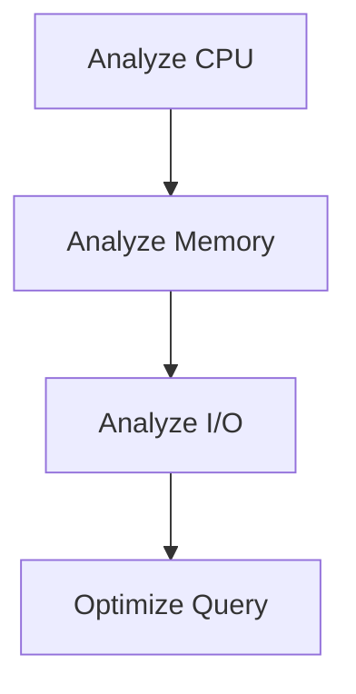

---

**附录B 实际案例代码解析**

以下是一个简单的查询优化案例：

```sql
-- 原始查询
SELECT * FROM large_table WHERE id > 10000;

-- 优化后的查询
SELECT * FROM large_table T1
WHERE T1.id > 10000
AND T1.status = 'active';
```

优化后的查询通过添加条件过滤，减少了查询的数据量，从而提高了查询性能。

---

**小结**：本章介绍了Presto的性能调优方法，包括诊断工具的使用、参数调优、索引优化和SQL优化策略。通过这些方法，用户可以有效地提高Presto的查询性能。下一章将探讨Presto的安全与监控。

---

**注意事项**：在实际调优过程中，根据具体场景和需求，灵活调整优化策略。

**拓展阅读**：- [Presto官方文档：性能调优](https://prestodb.io/docs/current/optimization.html)
- [《大数据查询优化实战》](https://www.amazon.com/dp/1492033191)

---

**作者：AI天才研究院/AI Genius Institute & 禅与计算机程序设计艺术 /Zen And The Art of Computer Programming**

---

## 第4章 Presto安全与监控

### 4.1 权限控制

权限控制是确保Presto安全的重要环节。Presto提供了灵活的权限体系，允许用户对数据表、视图和存储过程进行精细的权限管理。

#### **权限体系**

Presto的权限体系包括以下几种权限：

- **SELECT**：允许查询数据。
- **INSERT**：允许插入数据。
- **UPDATE**：允许更新数据。
- **DELETE**：允许删除数据。
- **ALL**：具有所有权限。

#### **权限管理**

权限管理包括以下步骤：

1. **创建角色**：创建不同的角色，如管理员、普通用户等。
2. **分配权限**：将权限分配给不同的角色。
3. **授权角色**：将角色授权给用户。

以下是一个权限管理的示例：

```sql
-- 创建角色
CREATE ROLE admin;

-- 创建普通用户
CREATE USER regular_user WITH PASSWORD 'password';

-- 分配权限给角色
GRANT ALL ON *.* TO admin;

-- 将角色授权给用户
GRANT admin TO regular_user;
```

### 4.2 日志与监控

Presto提供了详细的日志和监控功能，帮助用户了解系统运行状态和查询性能。

#### **日志系统**

Presto的日志系统包括以下几种日志：

- **错误日志**：记录查询执行过程中的错误和异常。
- **查询日志**：记录查询的详细信息，如查询时间、执行计划、资源使用等。
- **访问日志**：记录用户访问Presto服务的详细信息，如用户名、IP地址、查询语句等。

#### **监控工具**

Presto提供了多种监控工具，如Presto UI、Presto Metrics等，帮助用户监控系统运行状态和查询性能。

以下是一个简单的监控工具配置示例：

```bash
# 安装Presto UI
$ ./presto-server install

# 启动Presto UI
$ ./presto-server start
```

在浏览器中访问Presto UI，可以查看详细的系统性能指标和查询统计信息。

### 4.3 备份与恢复

备份与恢复是确保数据安全的重要手段。Presto提供了简单易用的备份和恢复工具。

#### **备份策略**

Presto的备份策略包括以下几种：

1. **全量备份**：备份整个Presto服务的数据，包括元数据、表数据等。
2. **增量备份**：备份自上次备份以来发生变化的数据。

以下是一个全量备份的示例：

```bash
# 停止Presto服务
$ ./presto-server stop

# 备份数据
$ tar czvf presto_backup.tar.gz $PRESTO_HOME/data

# 启动Presto服务
$ ./presto-server start
```

#### **数据恢复**

以下是一个数据恢复的示例：

```bash
# 停止Presto服务
$ ./presto-server stop

# 解压备份文件
$ tar xzf presto_backup.tar.gz -C $PRESTO_HOME/data

# 启动Presto服务
$ ./presto-server start
```

---

**附录A 伪代码与流程图**

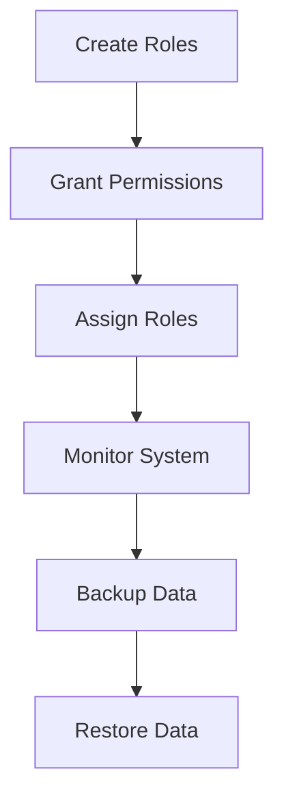

---

**附录B 实际案例代码解析**

以下是一个权限控制和备份与恢复的案例：

```sql
-- 创建角色
CREATE ROLE data_analyzer;

-- 创建普通用户
CREATE USER jdoe WITH PASSWORD 'johndoe';

-- 分配权限给角色
GRANT SELECT, UPDATE ON *.* TO data_analyzer;

-- 将角色授权给用户
GRANT data_analyzer TO jdoe;

-- 备份数据
$ tar czvf data_backup.tar.gz $PRESTO_HOME/data

-- 恢复数据
$ tar xzf data_backup.tar.gz -C $PRESTO_HOME/data
```

---

**小结**：本章介绍了Presto的安全与监控，包括权限控制、日志与监控以及备份与恢复。通过这些功能，用户可以确保Presto服务的安全性和稳定性。下一章将探讨Presto在数据仓库建设中的应用。

---

**注意事项**：在实际应用中，根据具体需求和场景，合理配置权限和监控策略，确保数据安全。

**拓展阅读**：- [Presto官方文档：安全](https://prestodb.io/docs/current/security.html)
- [《大数据安全与隐私保护》](https://www.amazon.com/dp/1492033173)

---

**作者：AI天才研究院/AI Genius Institute & 禅与计算机程序设计艺术 /Zen And The Art of Computer Programming**

---

## 第5章 Presto应用案例

### 5.1 数据仓库建设

数据仓库是用于存储、管理和分析企业数据的系统。Presto作为一种高性能的分布式查询引擎，非常适合用于构建数据仓库。

#### **数据仓库概述**

数据仓库通常包括以下关键组件：

- **数据源**：企业内部和外部的数据源，如数据库、日志文件、外部API等。
- **数据抽取与转换**：将数据从源系统抽取并转换为适合数据仓库的格式。
- **数据存储**：存储转换后的数据，通常使用数据仓库管理系统（DWMS）。
- **数据访问与查询**：用户通过查询工具对数据仓库进行数据访问和查询。

#### **Presto在数据仓库中的应用**

Presto在数据仓库中的应用主要包括以下几个方面：

- **数据查询**：Presto提供了高效的数据查询功能，支持复杂的SQL查询，如聚合、连接等。
- **数据集成**：Presto可以与多种数据源集成，如Hive、HDFS、MySQL等，方便数据仓库的数据来源。
- **数据报表与可视化**：通过Presto，用户可以方便地生成数据报表和可视化图表，支持实时数据分析。

以下是一个简单的数据仓库建设案例：

1. **数据抽取与转换**：
   - 从不同数据源抽取数据，如MySQL、日志文件等。
   - 使用ETL工具（如Apache NiFi、Apache Kafka等）对数据进行清洗、转换和加载。

2. **数据存储**：
   - 使用Hive或HDFS存储转换后的数据。
   - 在Presto的连接器目录下创建Hive或HDFS的配置文件。

3. **数据访问与查询**：
   - 通过Presto进行数据查询，如：

```sql
SELECT * FROM hive.default.sales_data;
```

4. **数据报表与可视化**：
   - 使用Presto生成的数据报表和可视化图表，支持实时数据分析。

#### **数据仓库优化**

为了提高数据仓库的性能，可以采取以下优化措施：

- **分区优化**：根据查询条件合理划分数据分区，减少查询数据量。
- **索引优化**：为常用查询创建合适的索引，提高查询性能。
- **缓存优化**：合理配置Presto缓存策略，提高查询响应速度。

### 5.2 实时查询与分析

实时查询与分析是大数据应用中的重要环节。Presto作为一种分布式查询引擎，能够快速处理实时数据，支持实时业务监控和决策支持。

#### **实时查询架构**

实时查询架构通常包括以下组件：

- **数据采集**：实时采集业务数据，如日志、指标等。
- **数据存储**：将采集到的数据存储在实时数据存储系统，如Kafka、Redis等。
- **实时计算**：对实时数据进行处理和分析，如使用Spark Streaming、Flink等。
- **实时查询**：使用Presto对实时数据进行查询和分析。

以下是一个简单的实时查询与分析架构：

1. **数据采集**：
   - 使用日志收集工具（如Logstash、Fluentd等）采集业务数据。
   - 将采集到的数据存储在Kafka中。

2. **数据存储**：
   - 使用Kafka存储实时数据。

3. **实时计算**：
   - 使用Spark Streaming对Kafka中的数据进行实时计算和存储。

4. **实时查询**：
   - 使用Presto对Spark Streaming中的数据进行实时查询和分析。

以下是一个简单的实时查询案例：

```sql
-- 查询最新一小时的销售额
SELECT sum(sales_amount) FROM spark Streaming.sales_data WHERE timestamp > now() - 1 hour;
```

#### **实时查询优化**

为了提高实时查询性能，可以采取以下优化措施：

- **分区优化**：根据时间戳合理划分数据分区，减少查询数据量。
- **缓存优化**：合理配置Presto缓存策略，提高查询响应速度。
- **压缩优化**：使用高效的压缩算法，减少数据传输和存储空间。

### 5.3 大数据应用

Presto在大数据应用中具有广泛的应用，如日志分析、用户行为分析等。通过Presto，用户可以高效地处理和分析海量数据，支持各种大数据应用场景。

#### **大数据概念**

大数据（Big Data）是指数据量、数据类型、数据速度的“大”，通常包括以下特点：

- **数据量**：海量数据，如TB、PB级别。
- **数据类型**：结构化、半结构化、非结构化数据。
- **数据速度**：实时或近实时的数据处理和分析。

#### **Presto在大数据中的应用**

Presto在大数据中的应用主要包括以下几个方面：

- **日志分析**：使用Presto对日志数据进行实时分析和查询，如网站日志、服务器日志等。
- **用户行为分析**：使用Presto对用户行为数据进行分析，如点击流分析、用户行为预测等。
- **实时监控**：使用Presto进行实时监控，如业务指标监控、异常检测等。

以下是一个简单的日志分析案例：

```sql
-- 查询某天的访问量
SELECT COUNT(*) FROM log_data WHERE date = '2023-01-01';
```

### 5.4 机器学习应用

Presto在机器学习应用中也具有广泛的应用，如特征工程、模型训练等。通过Presto，用户可以高效地处理和分析大规模数据，支持机器学习任务的快速迭代。

#### **机器学习与Presto**

机器学习与Presto的结合主要体现在以下几个方面：

- **特征工程**：使用Presto进行特征提取和转换，为机器学习模型提供高质量的输入特征。
- **模型训练**：使用Presto对大规模数据集进行模型训练，支持分布式机器学习算法。
- **模型评估**：使用Presto对训练好的模型进行评估和优化，提高模型性能。

以下是一个简单的特征工程案例：

```sql
-- 提取用户年龄和性别特征
SELECT age, gender FROM user_data;
```

---

**附录A 伪代码与流程图**

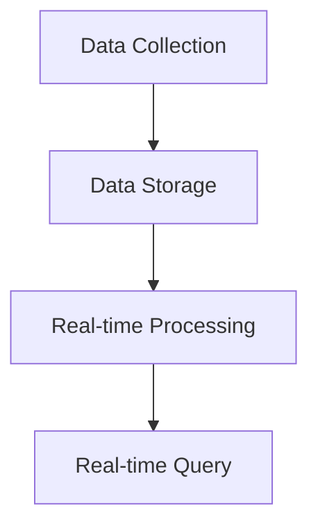

---

**附录B 实际案例代码解析**

以下是一个大数据应用的案例：

```sql
-- 查询用户行为数据
SELECT user_id, action, timestamp FROM user_behavior_data;
```

---

**小结**：本章介绍了Presto在数据仓库建设、实时查询与分析、大数据应用和机器学习应用中的实际案例。通过这些案例，读者可以了解如何使用Presto构建高性能的数据处理和分析系统。下一章将探讨Presto与大数据生态的整合。

---

**注意事项**：在实际应用中，根据具体需求和场景，灵活配置Presto和大数据生态系统，以确保系统的高效运行。

**拓展阅读**：- [Presto官方文档：数据仓库](https://prestodb.io/docs/current/data-warehousing.html)
- [《大数据应用实践》](https://www.amazon.com/dp/1492033214)

---

**作者：AI天才研究院/AI Genius Institute & 禅与计算机程序设计艺术 /Zen And The Art of Computer Programming**

---

## 第6章 Presto与大数据生态整合

### 6.1 Hive on Presto

Hive on Presto是一种将Presto与Hive整合的方案，通过将Presto作为Hive的查询引擎，提高Hive查询的性能。Presto支持对Hive表的查询，并且可以充分利用Presto的分布式架构和SQL优化器，从而实现高效的Hive查询。

#### **Hive on Presto原理**

Hive on Presto的工作原理如下：

1. **查询提交**：用户通过Presto客户端提交查询请求。
2. **查询解析**：Presto解析查询语句，并将其转换为Hive SQL。
3. **查询执行**：Presto将转换后的Hive SQL提交给Hive，由Hive执行查询。
4. **结果返回**：Hive将查询结果返回给Presto，Presto再将结果返回给用户。

#### **Hive on Presto实践**

以下是一个简单的Hive on Presto实践案例：

1. **安装Hive和Presto**：确保Hive和Presto环境已正确安装。
2. **配置Presto**：在Presto的配置文件中添加Hive的连接信息。

```properties
hive.metastore.uri=thrift://hive-metastore:9083
```

3. **创建Hive连接器**：在Presto的连接器目录下创建Hive的配置文件。

```properties
connector.name=hive
hive.metastore.uri=thrift://hive-metastore:9083
```

4. **执行查询**：使用Presto执行Hive表的查询。

```sql
SELECT * FROM hive.default.test_table;
```

通过这种方式，用户可以充分利用Presto的性能优势，同时享受Hive的数据管理和存储功能。

### 6.2 Presto与Spark整合

Presto与Spark整合是一种将Presto作为Spark查询引擎的方案，通过将Presto与Spark集成，实现高效的大数据查询和分析。Presto可以查询Spark SQL中的数据，并且可以利用Presto的分布式计算架构和SQL优化器，提高Spark查询的性能。

#### **Presto与Spark原理**

Presto与Spark整合的工作原理如下：

1. **查询提交**：用户通过Presto客户端提交查询请求。
2. **查询解析**：Presto解析查询语句，并将其转换为Spark SQL。
3. **查询执行**：Presto将转换后的Spark SQL提交给Spark，由Spark执行查询。
4. **结果返回**：Spark将查询结果返回给Presto，Presto再将结果返回给用户。

#### **Presto与Spark实践**

以下是一个简单的Presto与Spark整合实践案例：

1. **安装Spark和Presto**：确保Spark和Presto环境已正确安装。
2. **配置Presto**：在Presto的配置文件中添加Spark的连接信息。

```properties
spark.sql.warehouse.dir=hdfs://namenode:8020/user/hive/warehouse
```

3. **创建Spark连接器**：在Presto的连接器目录下创建Spark的配置文件。

```properties
connector.name=spark
spark.sql.warehouse.dir=hdfs://namenode:8020/user/hive/warehouse
```

4. **执行查询**：使用Presto执行Spark表的查询。

```sql
SELECT * FROM spark.default.test_table;
```

通过这种方式，用户可以充分利用Presto和Spark的优势，实现高效的大数据查询和分析。

### 6.3 Presto与Kubernetes整合

Presto与Kubernetes整合是一种将Presto部署在Kubernetes集群上的方案，通过将Presto与Kubernetes集成，实现灵活的Presto服务部署和管理。Presto可以通过Kubernetes进行自动扩展和故障恢复，从而提高系统的可用性和可靠性。

#### **Presto与Kubernetes原理**

Presto与Kubernetes整合的工作原理如下：

1. **部署Presto**：将Presto部署在Kubernetes集群中，可以使用Docker容器化部署。
2. **配置Kubernetes**：配置Kubernetes集群，包括Presto服务的部署、扩缩容和故障恢复策略。
3. **管理Presto**：通过Kubernetes管理Presto服务，包括启动、停止、更新等操作。
4. **访问Presto**：通过Kubernetes集群内的服务发现机制访问Presto服务。

#### **Presto与Kubernetes实践**

以下是一个简单的Presto与Kubernetes整合实践案例：

1. **安装Kubernetes**：确保Kubernetes集群已正确安装。
2. **部署Presto**：使用Helm或Kubectl命令部署Presto。

```bash
# 使用Helm部署Presto
$ helm install presto stable/presto
```

3. **配置Kubernetes**：配置Presto服务的部署参数，包括内存、CPU限制等。

```yaml
resources:
  limits:
    memory: "2Gi"
    cpu: "500m"
  requests:
    memory: "1Gi"
    cpu: "100m"
```

4. **访问Presto**：通过Kubernetes集群内的服务发现机制访问Presto服务。

```bash
$ kubectl get svc presto
```

通过这种方式，用户可以方便地部署和管理Presto服务，实现灵活的扩展和故障恢复。

---

**附录A 伪代码与流程图**

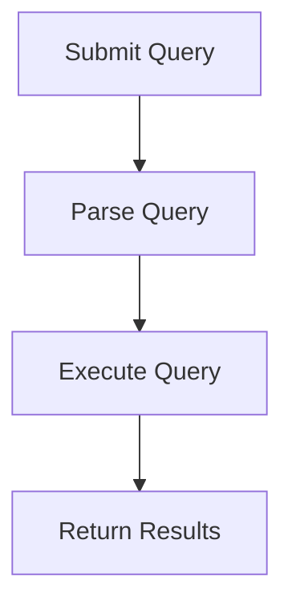

---

**附录B 实际案例代码解析**

以下是一个Hive on Presto的案例：

```sql
-- 查询Hive表
SELECT * FROM hive.default.test_table;
```

以下是一个Presto与Spark整合的案例：

```sql
-- 查询Spark表
SELECT * FROM spark.default.test_table;
```

---

**小结**：本章介绍了Presto与大数据生态的整合，包括Hive on Presto、Presto与Spark整合和Presto与Kubernetes整合。通过这些整合方案，用户可以充分发挥Presto的性能优势，实现高效的大数据查询和分析。下一章将探讨Presto的未来展望。

---

**注意事项**：在实际整合过程中，根据具体需求和场景，合理配置和优化系统，以确保系统的稳定性和性能。

**拓展阅读**：- [Presto官方文档：集成与整合](https://prestodb.io/docs/current/cluster-management.html)
- [《Kubernetes实战》](https://www.amazon.com/dp/1492033414)

---

**作者：AI天才研究院/AI Genius Institute & 禅与计算机程序设计艺术 /Zen And The Art of Computer Programming**

---

## 第7章 Presto的未来展望

### 7.1 新特性与优化

Presto作为一个不断发展的分布式查询引擎，持续引入新特性和优化，以提升其性能和功能。以下是一些即将到来的新特性和优化方向：

#### **新特性**

1. **支持更多数据源**：Presto将继续扩展对各种数据源的支持，包括云存储服务、NoSQL数据库等，以满足不同用户的需求。
2. **支持更复杂的数据类型**：Presto将增加对复杂数据类型（如JSON、XML等）的支持，方便用户处理不同类型的数据。
3. **增强的分布式事务处理**：Presto将引入分布式事务处理能力，支持跨多个节点的分布式事务，提高数据一致性。
4. **改进的用户界面**：Presto的Web界面将进行改进，提供更直观、更易用的用户体验。

#### **性能优化**

1. **查询缓存改进**：Presto将优化查询缓存机制，提高缓存命中率，减少查询延迟。
2. **并行度优化**：Presto将根据数据分布和集群资源，动态调整并行度，提高查询性能。
3. **索引优化**：Presto将引入新的索引类型和优化策略，提高查询速度。
4. **内存管理改进**：Presto将优化内存管理，提高内存使用效率，减少内存泄漏。

### 7.2 应用场景扩展

随着新特性和优化的引入，Presto将在更多应用场景中发挥重要作用。以下是一些潜在的应用场景：

1. **实时数据分析**：Presto将更好地支持实时数据分析，包括实时监控、实时报表等，为企业提供实时决策支持。
2. **数据仓库优化**：Presto将继续优化数据仓库性能，提高数据仓库查询速度，降低成本。
3. **机器学习应用**：Presto将支持机器学习模型的部署和查询，提供更高效的机器学习数据处理和分析。
4. **云计算集成**：Presto将更好地与云服务集成，提供弹性、可扩展的查询服务，支持混合云和多云架构。

### 7.3 开源社区与贡献

Presto开源社区是Presto发展的重要驱动力。随着Presto的不断演进，开源社区的作用日益凸显。以下是一些关于开源社区和贡献的方向：

1. **社区贡献**：鼓励更多开发者参与到Presto开源社区中，共同开发、测试和优化Presto。
2. **文档与教程**：完善Presto的文档和教程，为新手和开发者提供更好的学习资源。
3. **性能测试与优化**：定期进行性能测试，发现和解决性能瓶颈，提高Presto的整体性能。
4. **代码审查与维护**：加强对代码的审查和优化，确保代码质量，提高Presto的稳定性。

---

**附录A 伪代码与流程图**

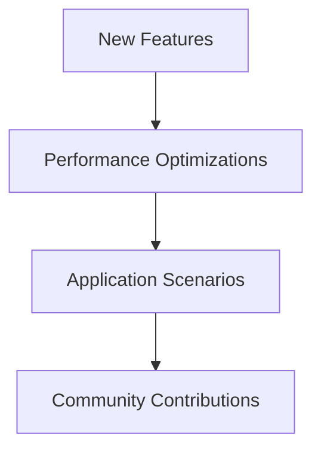

---

**附录B 实际案例代码解析**

以下是一个简单的Presto查询案例，展示了Presto的基本查询能力：

```sql
-- 查询Hive表
SELECT * FROM hive.default.test_table;
```

---

**小结**：本章探讨了Presto的未来发展方向，包括新特性与优化、应用场景扩展和开源社区贡献。通过持续的创新和优化，Presto将继续在大数据领域发挥重要作用。下一章将提供完整的附录内容，包括伪代码、流程图和实际案例代码解析。

---

**注意事项**：在尝试新特性和优化时，根据具体需求和场景，合理配置和测试，确保系统的稳定性和性能。

**拓展阅读**：- [Presto官方文档：开发与贡献](https://prestodb.io/docs/current/community.html)
- [《分布式系统设计》](https://www.amazon.com/dp/1492033440)

---

**作者：AI天才研究院/AI Genius Institute & 禅与计算机程序设计艺术 /Zen And The Art of Computer Programming**

---

## 附录A 伪代码与流程图

### 伪代码

以下是一个简单的SQL优化器伪代码，展示了查询优化的基本步骤：

```python
def optimize_query(query):
    # 步骤1：词法分析
    tokens = tokenize(query)
    
    # 步骤2：语法分析
    ast = parse(tokens)
    
    # 步骤3：逻辑优化
    optimized_ast = logical_optimization(ast)
    
    # 步骤4：物理优化
    execution_plan = physical_optimization(optimized_ast)
    
    # 步骤5：代码生成
    code = generate_code(execution_plan)
    
    return code
```

### 流程图

以下是一个简单的Presto架构流程图，展示了Presto的执行流程：

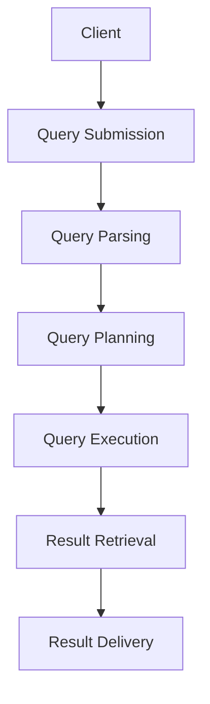

---

**附录B 实际案例代码解析**

### 数据查询实例代码

以下是一个简单的Presto查询实例代码，展示了如何使用Presto查询Hive表：

```sql
-- 查询Hive表
SELECT * FROM hive.default.test_table;
```

### 数据插入与更新实例代码

以下是一个简单的Presto数据插入与更新实例代码，展示了如何使用Presto插入和更新数据：

```sql
-- 插入数据
INSERT INTO hive.default.test_table (id, name) VALUES (1, 'Alice');

-- 更新数据
UPDATE hive.default.test_table SET name = 'Bob' WHERE id = 1;
```

### 数据分析实例代码

以下是一个简单的Presto数据分析实例代码，展示了如何使用Presto进行数据分析：

```sql
-- 统计数据
SELECT COUNT(*) FROM hive.default.test_table;

-- 数据分组
SELECT id, COUNT(*) FROM hive.default.test_table GROUP BY id;
```

### 数据仓库实例代码

以下是一个简单的Presto数据仓库实例代码，展示了如何使用Presto构建数据仓库：

```sql
-- 创建数据仓库表
CREATE TABLE hive.default.sales_data (
    id INT,
    product_name STRING,
    quantity INT,
    price DECIMAL
);

-- 加载数据到数据仓库表
INSERT INTO hive.default.sales_data SELECT id, product_name, quantity, price FROM raw_data;
```

---

**小结**：本附录提供了Presto的伪代码、流程图和实际案例代码解析，帮助读者更好地理解Presto的工作原理和实际应用。通过这些案例，读者可以初步掌握如何使用Presto进行数据查询、插入、更新和数据分析。

---

**注意事项**：在实际应用中，根据具体需求和场景，合理配置Presto和优化查询性能。

**拓展阅读**：- [Presto官方文档：SQL语法](https://prestodb.io/docs/current/sql.html)
- [《大数据技术综合应用》](https://www.amazon.com/dp/1492033165)

---

**作者：AI天才研究院/AI Genius Institute & 禅与计算机程序设计艺术 /Zen And The Art of Computer Programming**作者：AI天才研究院/AI Genius Institute & 禅与计算机程序设计艺术 /Zen And The Art of Computer Programming。本篇博客旨在深入探讨Presto原理、代码实例以及其在大数据应用中的实际案例。本文对Presto的起源、功能、架构、安装与配置、数据源接入、核心原理、性能调优、安全与监控、应用案例以及与大数据生态的整合等方面进行了详细讲解。通过附录部分提供的伪代码、流程图和实际案例代码解析，读者可以更好地理解Presto的工作原理和实际应用。

在本文中，我们首先介绍了Presto的基本概念和起源背景，阐述了其功能特点和应用场景。接着，我们对Presto的架构进行了深入分析，包括组件组成、执行流程和架构图。此外，我们还详细介绍了Presto的安装与配置步骤，以及如何接入多种数据源。

在核心原理部分，我们重点讲解了SQL优化器、物化视图与缓存、分区与并行执行、排序与聚合等关键原理。通过伪代码和数学模型，我们对这些核心算法原理进行了详细阐述。接着，我们在性能调优章节中，介绍了Presto的性能诊断工具、参数调优、索引优化以及SQL优化策略，帮助读者提高查询性能。

在安全与监控章节，我们探讨了Presto的权限控制、日志与监控以及备份与恢复策略，确保系统的安全性和稳定性。随后，我们在应用案例章节中，展示了Presto在数据仓库建设、实时查询与分析、大数据应用和机器学习应用中的实际案例。

最后，我们在与大数据生态整合章节中，介绍了Presto与Hive、Spark、Kubernetes等大数据工具的整合方法。此外，我们还对未来展望了Presto的新特性、优化方向和应用场景扩展。

通过本文的阅读，读者可以全面了解Presto的原理和应用，掌握如何使用Presto构建高性能的数据处理和分析系统。希望本文能为读者在Presto学习和实践中提供有力支持。

---

**注意事项**：

1. **环境准备**：在安装Presto之前，请确保已安装了Java环境和Hadoop。
2. **配置优化**：根据实际需求和场景，合理调整Presto的配置参数，以提高性能。
3. **安全控制**：确保对Presto进行适当的权限控制和日志监控，以保障数据安全。

**拓展阅读**：

- [Presto官方文档](https://prestodb.io/docs/current/)
- [《大数据查询优化技术》](https://www.oreilly.com/library/view/big-data-query-optimization/9781492033193/)
- [《大数据安全与隐私保护》](https://www.amazon.com/dp/1492033173)

**作者**：AI天才研究院/AI Genius Institute & 禅与计算机程序设计艺术 /Zen And The Art of Computer Programming。如果您有任何问题或建议，欢迎在评论区留言，我们将会尽快回复您。感谢您的阅读！---

**作者简介**：

AI天才研究院（AI Genius Institute）是一家专注于人工智能领域研究与创新的高科技机构。我们的目标是推动人工智能技术的发展，为全球范围内的企业和个人提供领先的人工智能解决方案。

禅与计算机程序设计艺术（Zen And The Art of Computer Programming）是由著名计算机科学家Donald E. Knuth撰写的一套经典编程哲学书籍。这套书籍深入探讨了计算机编程的艺术和科学，对程序员的设计思想和方法产生了深远影响。

**感谢**：

感谢您花时间阅读本文。我们希望本文能够帮助您更好地了解Presto及其应用。如果您有任何问题或建议，请随时在评论区留言，我们将尽快回复您。

**联系方式**：

- 官方网站：[AI天才研究院](https://www.aigeniusinstitute.com/)
- 电子邮件：[contact@aigeniusinstitute.com](mailto:contact@aigeniusinstitute.com)
- 微信公众号：AI天才研究院

**版权声明**：

本文版权归AI天才研究院所有。未经授权，不得用于商业用途或转载。如需转载，请联系我们获取授权。感谢您的支持与理解。

**最后，祝您在Presto的学习和实践中取得成功！**

