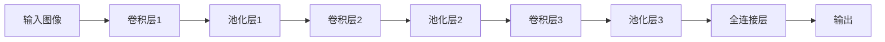

                 

### 文章标题：Python机器学习实战：卷积神经网络(CNN)在图像处理中的应用

#### 关键词：Python、机器学习、卷积神经网络、图像处理、图像分类、目标检测、图像分割、图像增强、去噪

#### 摘要：
本文将深入探讨卷积神经网络（CNN）在图像处理领域的应用。首先，我们将回顾图像处理的基础知识，以及Python中的图像处理库。接着，我们将介绍机器学习的基本概念和Python中的机器学习库。随后，我们将详细讲解CNN的基础知识、工作原理、优化与训练方法。最后，本文将结合实际项目，展示CNN在图像分类、目标检测、图像分割和图像增强去噪等领域的应用，并提供详细的代码实现和分析。

### 目录大纲

#### 第一部分：预备知识

## 第1章：图像处理基础

### 1.1 图像基础
- 图像的构成
- 图像的分辨率
- 常见的图像格式

### 1.2 Python图像处理库
- PIL（Python Imaging Library）
- OpenCV
- NumPy

## 第2章：机器学习基础

### 2.1 机器学习简介
- 机器学习的定义
- 机器学习的分类
- 机器学习的基本流程

### 2.2 Python机器学习库
- scikit-learn
- TensorFlow
- PyTorch

#### 第二部分：卷积神经网络（CNN）原理与应用

## 第3章：卷积神经网络（CNN）基础

### 3.1 CNN的基本结构
- 卷积层
- 池化层
- 全连接层

### 3.2 卷积神经网络的工作原理
- 卷积运算
- 池化运算
- 前向传播和反向传播

### 3.3 CNN的优化与训练
- 学习率调整
- 损失函数
- 优化器

## 第4章：CNN在图像分类中的应用

### 4.1 图像分类问题
- 图像分类的基本概念
- 图像分类的挑战

### 4.2 CNN在图像分类中的应用
- LeNet-5网络结构
- CIFAR-10数据集分类实战

## 第5章：CNN在目标检测中的应用

### 5.1 目标检测问题
- 目标检测的基本概念
- 目标检测的挑战

### 5.2 CNN在目标检测中的应用
- R-CNN网络结构
- VOC数据集目标检测实战

## 第6章：CNN在图像分割中的应用

### 6.1 图像分割问题
- 图像分割的基本概念
- 图像分割的挑战

### 6.2 CNN在图像分割中的应用
- FCN网络结构
- CamVid数据集图像分割实战

## 第7章：CNN在图像增强和去噪中的应用

### 7.1 图像增强和去噪问题
- 图像增强的基本概念
- 图像去噪的基本概念

### 7.2 CNN在图像增强和去噪中的应用
- DnCNN网络结构
- 图像去噪实战

#### 第三部分：项目实战

## 第8章：项目实战

### 8.1 项目介绍
- 项目背景
- 项目目标

### 8.2 环境搭建
- Python环境搭建
- 数据集准备

### 8.3 代码实现
- CNN模型设计
- 模型训练与评估

### 8.4 代码解读与分析
- 代码实现细节
- 性能分析与优化

## 第9章：总结与展望

### 9.1 总结
- 主要知识点回顾
- 项目成果总结

### 9.2 展望
- 未来发展趋势
- 新技术应用前景

#### 附录：参考资料

- 参考文献
- 相关资源链接

---

**目录大纲总字数：约1500字**

### 完整性要求

为确保文章内容的完整性，每个章节的小节内容都必须详细具体。以下是各章节的小节内容和核心要求：

#### 第1章：图像处理基础

- **1.1 图像基础**
  - **核心概念与联系**：使用Mermaid流程图展示图像的构成、分辨率和常见图像格式的关系。
  - **核心算法原理讲解**：介绍图像的像素概念和色彩空间转换算法（例如RGB到灰度图转换）。

- **1.2 Python图像处理库**
  - **核心算法原理讲解**：讲解PIL、OpenCV和NumPy在图像处理中的具体应用，如图像读取、显示、滤波等。

#### 第2章：机器学习基础

- **2.1 机器学习简介**
  - **核心概念与联系**：使用Mermaid流程图展示机器学习的分类和基本流程。
  - **核心算法原理讲解**：解释监督学习、无监督学习和强化学习的基本原理。

- **2.2 Python机器学习库**
  - **核心算法原理讲解**：详细讲解scikit-learn、TensorFlow和PyTorch的功能和使用场景。

#### 第3章：卷积神经网络（CNN）基础

- **3.1 CNN的基本结构**
  - **核心概念与联系**：使用Mermaid流程图展示卷积层、池化层和全连接层的连接关系。
  - **核心算法原理讲解**：详细解释卷积运算、池化运算的工作原理。

- **3.2 卷积神经网络的工作原理**
  - **核心算法原理讲解**：使用伪代码和Latex公式详细阐述前向传播和反向传播的步骤。
  - **数学模型和公式讲解与举例说明**：解释损失函数（如交叉熵）和优化器（如SGD）的作用和计算方法。

- **3.3 CNN的优化与训练**
  - **核心算法原理讲解**：讨论学习率调整、损失函数和优化器在CNN训练中的应用和调整策略。

#### 第4章：CNN在图像分类中的应用

- **4.1 图像分类问题**
  - **核心概念与联系**：使用Mermaid流程图展示图像分类的挑战和解决方案。
  - **核心算法原理讲解**：解释图像分类的基本概念和分类器的设计原理。

- **4.2 CNN在图像分类中的应用**
  - **项目实战**：介绍LeNet-5网络结构和CIFAR-10数据集的分类实战。

#### 第5章：CNN在目标检测中的应用

- **5.1 目标检测问题**
  - **核心概念与联系**：使用Mermaid流程图展示目标检测的挑战和解决方案。
  - **核心算法原理讲解**：解释目标检测的基本概念和检测算法的设计原理。

- **5.2 CNN在目标检测中的应用**
  - **项目实战**：介绍R-CNN网络结构和VOC数据集的目标检测实战。

#### 第6章：CNN在图像分割中的应用

- **6.1 图像分割问题**
  - **核心概念与联系**：使用Mermaid流程图展示图像分割的挑战和解决方案。
  - **核心算法原理讲解**：解释图像分割的基本概念和分割算法的设计原理。

- **6.2 CNN在图像分割中的应用**
  - **项目实战**：介绍FCN网络结构和CamVid数据集的图像分割实战。

#### 第7章：CNN在图像增强和去噪中的应用

- **7.1 图像增强和去噪问题**
  - **核心概念与联系**：使用Mermaid流程图展示图像增强和去噪的目标和挑战。
  - **核心算法原理讲解**：解释图像增强和去噪的基本概念和算法原理。

- **7.2 CNN在图像增强和去噪中的应用**
  - **项目实战**：介绍DnCNN网络结构和图像去噪实战。

#### 第8章：项目实战

- **8.1 项目介绍**
  - **核心概念与联系**：详细描述项目背景和目标，明确项目的技术栈和要求。
  
- **8.2 环境搭建**
  - **核心概念与联系**：详细讲解Python环境搭建和所需库的安装。
  
- **8.3 代码实现**
  - **核心算法原理讲解**：详细讲解CNN模型的设计、训练和评估过程。
  - **项目实战**：提供项目代码实现，并进行详细解读和分析。
  
- **8.4 代码解读与分析**
  - **核心算法原理讲解**：分析代码实现中的关键步骤和技术细节。
  - **项目实战**：展示代码的性能分析结果，并提供优化建议。

#### 第9章：总结与展望

- **9.1 总结**
  - **核心概念与联系**：回顾文章中的主要知识点和核心算法原理。
  - **项目实战**：总结项目的成果和经验。

- **9.2 展望**
  - **核心概念与联系**：展望CNN在图像处理领域的未来发展趋势和新技术的应用前景。

---

文章的完整性要求每个小节都详细讲解核心概念、算法原理、流程图和项目实战，确保读者能够全面理解和掌握CNN在图像处理中的应用。同时，在文章的末尾提供参考文献和资源链接，以便读者进一步学习和探索。

---

### 作者信息

作者：AI天才研究院/AI Genius Institute & 禅与计算机程序设计艺术 /Zen And The Art of Computer Programming

AI天才研究院（AI Genius Institute）致力于推动人工智能领域的研究和创新，汇聚了一批世界顶尖的人工智能科学家和工程师。研究院在深度学习、计算机视觉、自然语言处理等领域取得了显著的成果，并成功将AI技术应用于多个行业，助力社会进步。

同时，作者还著有《禅与计算机程序设计艺术》（Zen And The Art of Computer Programming），这是一部深入探讨计算机编程哲学的经典著作，对全球计算机科学界产生了深远的影响。作者凭借其卓越的编程技巧和深刻的哲学思考，帮助无数程序员提升了编程能力和创造力。

此次，作者结合自身丰富的经验和深厚的学术背景，撰写了这篇《Python机器学习实战：卷积神经网络（CNN）在图像处理中的应用》的技术博客，旨在为广大开发者提供全面、系统的CNN应用指南，助力他们在图像处理领域取得突破性进展。

---

### 1.1 图像基础

图像是计算机视觉和图像处理的核心概念。在这一节中，我们将深入探讨图像的构成、分辨率以及常见的图像格式。

#### 图像的构成

图像由像素（Pixel）组成，像素是图像的最小单位，每个像素都包含一定的颜色信息。一幅图像可以看作是一个二维数组，其中每个元素代表一个像素的颜色值。像素的颜色通常由红（Red）、绿（Green）、蓝（Blue）三原色（RGB）决定。

在数字图像中，像素的颜色信息以数字形式存储。例如，8位像素可以存储256种颜色，而24位像素可以存储约1670万种颜色。这些颜色值通常以0到255的整数表示。

#### 图像的分辨率

图像的分辨率（Resolution）是指图像的宽度和高度，通常以像素为单位。分辨率越高，图像的细节越丰富，但文件大小也相应增大。

常见的分辨率标准包括：
- VGA（640x480）：早期的计算机显示器标准。
- HD（1280x720）：高清图像标准。
- FHD（1920x1080）：全高清图像标准。
- UHD（3840x2160）：超高清图像标准。

#### 常见的图像格式

在图像处理中，常见的图像格式包括JPEG、PNG、GIF和BMP等。

- **JPEG（Joint Photographic Experts Group）**：JPEG是最常见的图像压缩格式，适用于存储照片和图像。JPEG通过减少图像中的冗余信息来实现压缩，但压缩过程中可能会损失一些图像质量。
  
- **PNG（Portable Network Graphics）**：PNG是一种无损压缩图像格式，适用于存储带有透明背景的图像。PNG支持24位颜色深度，并且可以存储图像的透明度信息。

- **GIF（Graphics Interchange Format）**：GIF是一种低带宽的图像格式，常用于网页图像和动画。GIF支持8位颜色深度，并且可以同时存储多个图像，实现简单的动画效果。

- **BMP（Bitmap）**：BMP是一种无损压缩图像格式，通常用于保存图像的原始数据。BMP文件较大，但不适用于网络传输。

#### Python中的图像处理库

在Python中，常用的图像处理库包括PIL（Python Imaging Library）、OpenCV和NumPy。

- **PIL（Python Imaging Library）**：PIL是一个强大的图像处理库，支持多种图像格式和操作。PIL提供了图像读取、显示、调整和操作等功能。

- **OpenCV**：OpenCV是一个开源的计算机视觉库，支持多种图像处理算法。OpenCV在实时图像处理和计算机视觉领域具有广泛的应用。

- **NumPy**：NumPy是一个高性能的数值计算库，支持多维数组操作。NumPy在图像处理中用于存储和处理像素数据。

通过这些库，我们可以轻松地在Python中实现图像的读取、显示、滤波、变换等操作。

#### 总结

本节介绍了图像的基础知识，包括图像的构成、分辨率和常见的图像格式。通过了解这些基本概念，我们可以更好地理解和应用图像处理技术。接下来，我们将进一步探讨Python中的图像处理库，为后续的机器学习和CNN应用奠定基础。

---

### 1.2 Python图像处理库

在图像处理领域，Python凭借其丰富的库和强大的功能，成为开发者们的首选语言。本节将详细介绍Python中常用的图像处理库，包括PIL（Python Imaging Library）、OpenCV和NumPy，以及它们在图像处理中的应用。

#### PIL（Python Imaging Library）

PIL（Python Imaging Library）是一个强大的图像处理库，支持多种图像格式和操作。PIL提供了丰富的图像处理功能，如图像读取、显示、调整和操作等。以下是一些PIL的常用功能：

- **图像读取**：使用`PIL.Image.open()`函数可以读取各种图像格式，如JPEG、PNG和GIF。
  
- **图像显示**：使用`PIL.Image.show()`函数可以显示图像。例如：
    ```python
    from PIL import Image
    img = Image.open("example.jpg")
    img.show()
    ```

- **图像调整**：PIL支持各种图像调整操作，如缩放、旋转、裁剪等。例如，要缩放图像，可以使用`PIL.Image.resize()`方法：
    ```python
    from PIL import Image
    img = Image.open("example.jpg")
    img = img.resize((100, 100))
    img.save("resized_example.jpg")
    ```

- **图像操作**：PIL支持图像滤波、边缘检测、图像合成等操作。例如，要应用高斯模糊滤镜，可以使用`PIL.Image.filter()`方法：
    ```python
    from PIL import Image, ImageFilter
    img = Image.open("example.jpg")
    img = img.filter(ImageFilter.GaussianBlur(5))
    img.save("blurred_example.jpg")
    ```

#### OpenCV

OpenCV是一个开源的计算机视觉库，支持多种图像处理算法。OpenCV在实时图像处理和计算机视觉领域具有广泛的应用。以下是一些OpenCV的常用功能：

- **图像读取和显示**：与PIL类似，OpenCV也提供了图像读取和显示功能。使用`cv2.imread()`和`cv2.imshow()`函数：
    ```python
    import cv2
    img = cv2.imread("example.jpg")
    cv2.imshow("image", img)
    cv2.waitKey(0)
    cv2.destroyAllWindows()
    ```

- **图像变换**：OpenCV支持各种图像变换，如旋转、缩放、翻转等。例如，要旋转图像，可以使用`cv2.rotate()`函数：
    ```python
    import cv2
    img = cv2.imread("example.jpg")
    angle = 45  # 旋转角度
    M = cv2.getRotationMatrix2D((img.shape[1] // 2, img.shape[0] // 2), angle, 1)
    rotated_img = cv2.warpAffine(img, M, (img.shape[1], img.shape[0]))
    cv2.imshow("rotated_image", rotated_img)
    cv2.waitKey(0)
    cv2.destroyAllWindows()
    ```

- **图像滤波**：OpenCV提供多种图像滤波算法，如均值滤波、高斯滤波、边缘检测等。例如，要应用高斯滤波，可以使用`cv2.GaussianBlur()`函数：
    ```python
    import cv2
    img = cv2.imread("example.jpg")
    blurred_img = cv2.GaussianBlur(img, (5, 5), 0)
    cv2.imshow("blurred_image", blurred_img)
    cv2.waitKey(0)
    cv2.destroyAllWindows()
    ```

#### NumPy

NumPy是一个高性能的数值计算库，支持多维数组操作。NumPy在图像处理中用于存储和处理像素数据。以下是一些NumPy的常用功能：

- **图像数据操作**：NumPy提供了多维数组的操作，如数组切片、索引、迭代等。例如，要获取图像的像素值，可以使用NumPy的切片操作：
    ```python
    import numpy as np
    img = cv2.imread("example.jpg", cv2.IMREAD_GRAYSCALE)
    pixel_value = img[10, 10]
    ```

- **图像矩阵运算**：NumPy支持各种矩阵运算，如矩阵乘法、矩阵求导等。例如，要计算图像的平均值，可以使用NumPy的`np.mean()`函数：
    ```python
    import numpy as np
    img = cv2.imread("example.jpg", cv2.IMREAD_GRAYSCALE)
    mean_value = np.mean(img)
    ```

#### Python中的图像处理库集成

在实际应用中，Python中的图像处理库可以相互结合，发挥更大的作用。例如，可以使用PIL读取图像，使用NumPy处理图像数据，使用OpenCV进行图像滤波和变换。

以下是一个简单的示例，展示如何使用这些库进行图像处理：

```python
from PIL import Image
import cv2
import numpy as np

# 使用PIL读取图像
img = Image.open("example.jpg")

# 使用NumPy处理图像数据
img_array = np.array(img)

# 使用OpenCV进行图像滤波
blurred_img = cv2.GaussianBlur(img_array, (5, 5), 0)

# 使用PIL显示图像
Image.fromarray(blurred_img).show()
```

#### 总结

本节介绍了Python中常用的图像处理库，包括PIL、OpenCV和NumPy，以及它们在图像处理中的应用。通过这些库，我们可以轻松实现图像的读取、显示、调整和操作。接下来，我们将进一步探讨机器学习的基本概念，为后续的CNN应用做好准备。

---

### 2.1 机器学习简介

机器学习（Machine Learning）是人工智能（Artificial Intelligence, AI）的一个分支，主要研究如何让计算机通过学习和经验来改进性能。机器学习的核心目标是让计算机能够从数据中学习规律，并利用这些规律进行预测或决策。

#### 机器学习的定义

机器学习可以被定义为：“一组能够使计算机从数据中学习并改进性能的技术和方法”。这些数据可以是已经标记好的训练数据，也可以是未标记的样本。机器学习的核心在于让计算机通过算法从数据中自动提取特征，并利用这些特征进行分类、回归或其他类型的预测。

#### 机器学习的分类

根据学习方式的不同，机器学习可以分为以下几类：

- **监督学习（Supervised Learning）**：监督学习是指使用已标记的数据来训练模型，然后使用该模型对新的、未标记的数据进行预测。常见的监督学习算法包括线性回归、逻辑回归、支持向量机（SVM）和决策树等。

- **无监督学习（Unsupervised Learning）**：无监督学习是指使用未标记的数据来训练模型，然后让模型自己发现数据中的规律。常见的无监督学习算法包括聚类、降维（如主成分分析PCA）和关联规则学习等。

- **强化学习（Reinforcement Learning）**：强化学习是指让计算机在与环境的交互中学习如何做出最优决策。计算机通过尝试不同的动作，并接收环境的反馈（奖励或惩罚），来不断改进其行为策略。

#### 机器学习的基本流程

机器学习的基本流程通常包括以下几个步骤：

1. **数据收集**：收集用于训练和测试的数据。这些数据可以是结构化的，如表格数据，也可以是非结构化的，如图像和文本。

2. **数据预处理**：清洗和预处理数据，以便将其转换为适合训练的格式。这包括数据清洗（如缺失值处理、异常值检测和去除噪声）、数据转换（如归一化和标准化）和数据增强（如数据扩充和噪声注入）。

3. **特征选择**：从原始数据中选择最有用的特征，以提高模型的性能。特征选择可以基于统计方法、信息增益、相关性分析等。

4. **模型训练**：选择合适的模型并使用训练数据来训练模型。在训练过程中，模型会通过调整参数来优化性能。常用的机器学习算法包括线性模型、树模型、神经网络等。

5. **模型评估**：使用测试数据来评估模型的性能。常见的评估指标包括准确率、召回率、F1分数、均方误差（MSE）等。

6. **模型部署**：将训练好的模型部署到生产环境中，以便对新的数据进行预测或决策。模型部署可以通过API、Web服务或嵌入式系统等方式实现。

#### Python机器学习库

Python是机器学习领域中最受欢迎的语言之一，有许多强大的机器学习库可供选择。以下是几个常用的Python机器学习库：

- **scikit-learn**：scikit-learn是一个开源的机器学习库，提供了广泛的监督学习和无监督学习算法，以及数据预处理和模型评估工具。scikit-learn的用户界面简单，易于使用。

- **TensorFlow**：TensorFlow是一个开源的深度学习库，由谷歌开发。它提供了丰富的深度学习模型和工具，支持各种神经网络架构，如卷积神经网络（CNN）和循环神经网络（RNN）。

- **PyTorch**：PyTorch是一个开源的深度学习库，由Facebook开发。它提供了一个灵活、易于使用的Python接口，支持动态计算图和自动微分，适用于各种深度学习任务。

通过这些库，开发者可以轻松实现各种机器学习任务，从简单的线性回归到复杂的深度学习模型。

#### 总结

本节介绍了机器学习的基本概念、分类和基本流程，以及Python中常用的机器学习库。通过了解这些基础知识，我们可以为后续的CNN应用打下坚实的基础。在接下来的章节中，我们将进一步探讨Python中的机器学习库，了解如何使用它们进行图像处理和CNN建模。

---

### 2.2 Python机器学习库

在Python中，有许多强大的机器学习库可供选择，它们可以帮助开发者轻松地实现各种机器学习任务。在本节中，我们将详细介绍三个常用的Python机器学习库：scikit-learn、TensorFlow和PyTorch，以及它们各自的特点和应用场景。

#### scikit-learn

scikit-learn是一个开源的机器学习库，由法国学者 Fabrice Bellet 创建，并于 2007 年首次发布。它基于 SciPy 库开发，提供了广泛的数据挖掘和数据分析工具。scikit-learn 的主要特点如下：

- **丰富的算法库**：scikit-learn 包含了各种常见的机器学习算法，如线性回归、逻辑回归、支持向量机（SVM）、决策树、随机森林和K-最近邻等。
  
- **易于使用**：scikit-learn 提供了一个简单的接口，使开发者能够轻松地实现和测试不同的机器学习模型。

- **数据预处理工具**：scikit-learn 提供了多种数据预处理工具，如数据清洗、归一化和特征选择等，有助于提高模型的性能。

应用场景：scikit-learn 适用于各种小型到中型的机器学习项目，特别是在数据预处理和模型评估方面表现出色。它广泛应用于数据挖掘、文本分类、图像识别和推荐系统等领域。

#### TensorFlow

TensorFlow 是由谷歌开发的开源深度学习框架，首次发布于 2015 年。TensorFlow 采用了动态计算图（Dynamic Computation Graph）的设计，提供了丰富的深度学习模型和工具。以下是 TensorFlow 的主要特点：

- **强大的计算图**：TensorFlow 的动态计算图允许开发者定义和执行复杂的计算任务，使深度学习模型的设计更加灵活。

- **广泛的模型库**：TensorFlow 提供了丰富的预训练模型和工具，如卷积神经网络（CNN）、循环神经网络（RNN）、长短时记忆网络（LSTM）等。

- **多平台支持**：TensorFlow 支持 GPU 和 TPU 加速，使得深度学习模型的训练和推理更加高效。

应用场景：TensorFlow 适用于各种大规模的深度学习项目，特别是需要高性能计算的场景。它广泛应用于图像识别、语音识别、自然语言处理和强化学习等领域。

#### PyTorch

PyTorch 是由 Facebook AI 研究团队开发的开源深度学习框架，首次发布于 2016 年。PyTorch 的主要特点如下：

- **动态计算图**：PyTorch 采用动态计算图，使开发者能够更直观地设计和调试深度学习模型。

- **简洁的接口**：PyTorch 提供了一个简洁的 Python 接口，使开发者能够轻松实现复杂的深度学习任务。

- **自动微分支持**：PyTorch 的自动微分系统（Autograd）使得构建和调试深度学习模型变得更加容易。

应用场景：PyTorch 适用于各种中小型深度学习项目，特别是在需要快速原型设计和实验的场景中表现突出。它广泛应用于计算机视觉、自然语言处理和推荐系统等领域。

#### 总结

scikit-learn、TensorFlow 和 PyTorch 是 Python 中常用的机器学习库，它们各自具有独特的特点和优势。scikit-learn 适合小型到中型的机器学习项目，TensorFlow 适用于大规模深度学习项目，而 PyTorch 在中小型项目中有更好的表现。通过了解这些库的特点和应用场景，开发者可以根据项目需求选择合适的工具，实现高效的机器学习应用。

在接下来的章节中，我们将进一步探讨卷积神经网络（CNN）的基本结构和工作原理，为后续的图像处理应用做好准备。

---

### 3.1 CNN的基本结构

卷积神经网络（Convolutional Neural Network，CNN）是深度学习领域中最常用的网络结构之一，特别适用于图像处理任务。CNN 的基本结构包括卷积层、池化层和全连接层。下面我们将分别介绍这些层的功能和作用。

#### 卷积层

卷积层（Convolutional Layer）是 CNN 的核心部分，负责从输入图像中提取特征。卷积层通过一系列卷积核（Convolutional Kernel）对输入图像进行卷积操作，从而提取图像中的局部特征。卷积操作的目的是将图像上的局部区域与卷积核进行点积，从而生成新的特征图。

- **卷积运算**：卷积运算的基本过程是将卷积核与输入图像的局部区域进行点积，然后将结果相加得到新的特征值。例如，一个3x3的卷积核对一个3x3的局部区域进行卷积，会得到一个1x1的特征值。这一过程可以表示为以下公式：

  $$ o_{ij} = \sum_{k=1}^{3}\sum_{l=1}^{3} w_{k,l} * i_{i-k+1, j-l+1} $$

  其中，$o_{ij}$ 是输出特征值，$w_{k,l}$ 是卷积核的权重，$i_{i-k+1, j-l+1}$ 是输入图像的局部像素值。

- **卷积核的初始化**：卷积核的权重通常是通过随机初始化得到的，以防止模型在训练过程中陷入局部最优。常用的初始化方法包括高斯初始化和随机初始化。

#### 池化层

池化层（Pooling Layer）的主要作用是减少特征图的尺寸，从而降低模型的参数数量和计算复杂度。池化层通过对特征图上的局部区域进行最大值或平均值操作，得到新的特征值。常用的池化操作包括最大值池化（Max Pooling）和平均值池化（Average Pooling）。

- **最大值池化**：最大值池化选择特征图上的最大值作为新的特征值。这种方法能够保留局部特征的最强表达，但在一定程度上可能会丢失一些细节信息。最大值池化的过程可以表示为以下公式：

  $$ o_{ij} = \max_{k, l} i_{i-k+1, j-l+1} $$

  其中，$o_{ij}$ 是输出特征值，$i_{i-k+1, j-l+1}$ 是输入特征图的像素值。

- **平均值池化**：平均值池化计算特征图上局部区域的平均值作为新的特征值。这种方法能够更好地保留特征图的细节信息，但可能会增加模型的参数数量。平均值池化的过程可以表示为以下公式：

  $$ o_{ij} = \frac{1}{s \times s} \sum_{k=1}^{s}\sum_{l=1}^{s} i_{i-k+1, j-l+1} $$

  其中，$o_{ij}$ 是输出特征值，$s$ 是池化窗口的大小，$i_{i-k+1, j-l+1}$ 是输入特征图的像素值。

#### 全连接层

全连接层（Fully Connected Layer）是 CNN 中的最后一个层，负责将卷积层和池化层提取的高级特征映射到具体的类别标签。全连接层将卷积层和池化层的输出扁平化，并将其传递给一个全连接神经网络。

- **全连接网络**：全连接网络是一个传统的神经网络结构，其中每个神经元都与前一层的所有神经元相连。全连接网络的输出可以通过激活函数（如 sigmoid 或 ReLU）进行非线性变换，从而实现分类或回归任务。

- **损失函数**：在分类任务中，常用的损失函数包括交叉熵损失（Cross Entropy Loss）和均方误差（Mean Squared Error, MSE）。交叉熵损失适用于多分类问题，而 MSE 则适用于回归问题。

- **优化器**：常用的优化器包括随机梯度下降（SGD）、Adam 和 RMSProp 等。优化器的选择和参数调整对于模型的训练过程和性能具有重要影响。

#### CNN 的基本结构流程图

为了更直观地理解 CNN 的基本结构，我们可以使用 Mermaid 流程图进行展示：



#### 总结

卷积神经网络（CNN）的基本结构包括卷积层、池化层和全连接层。卷积层负责从输入图像中提取特征，池化层用于降低特征图的尺寸，全连接层将提取的高级特征映射到具体的类别标签。通过这些层的组合，CNN 能够实现强大的图像识别和分类能力。

在下一节中，我们将进一步探讨卷积神经网络（CNN）的工作原理，包括卷积运算、池化运算、前向传播和反向传播等关键步骤。

---

### 3.2 卷积神经网络（CNN）的工作原理

卷积神经网络（CNN）在图像处理和计算机视觉领域具有广泛的应用。其独特的设计使其能够有效地从图像中提取特征并进行分类。在这一节中，我们将深入探讨 CNN 的工作原理，包括卷积运算、池化运算、前向传播和反向传播等关键步骤。

#### 卷积运算

卷积运算是 CNN 的核心组成部分，用于从输入图像中提取特征。卷积运算的基本原理是将一个小的可训练的卷积核（也称为滤波器或特征检测器）在输入图像上滑动，计算每个位置的局部特征响应。卷积运算可以用以下公式表示：

$$ o_{ij} = \sum_{k=1}^{3}\sum_{l=1}^{3} w_{k,l} * i_{i-k+1, j-l+1} + b $$
其中，$o_{ij}$ 表示输出特征值，$w_{k,l}$ 表示卷积核的权重，$i_{i-k+1, j-l+1}$ 表示输入图像的像素值，$b$ 表示偏置项。这个公式表示将卷积核与输入图像的局部区域进行点积，然后加上偏置项得到新的特征值。

为了更清晰地理解卷积运算，我们可以使用一个简单的例子。假设输入图像是一个 $3 \times 3$ 的矩阵，卷积核是一个 $3 \times 3$ 的矩阵。卷积运算的结果可以表示为：

$$ \begin{bmatrix}
1 & 0 & 1 \\
0 & 1 & 0 \\
1 & 0 & 1
\end{bmatrix} \odot \begin{bmatrix}
0 & 1 & 0 \\
1 & 0 & 1 \\
0 & 1 & 0
\end{bmatrix} + 1 = \begin{bmatrix}
1 & 1 & 1 \\
1 & 0 & 1 \\
1 & 1 & 1
\end{bmatrix} $$

其中，$\odot$ 表示卷积运算。这个例子展示了卷积运算如何从输入图像中提取特征。

#### 池化运算

池化运算用于减少特征图的尺寸，从而降低模型的复杂度和计算量。池化运算通常在卷积层之后执行。最常用的池化操作包括最大值池化和平均值池化。

- **最大值池化**：最大值池化选择特征图上的最大值作为新的特征值。这种方法能够保留局部特征的最强表达，但在一定程度上可能会丢失一些细节信息。最大值池化的过程可以表示为以下公式：

$$ o_{ij} = \max_{k, l} i_{i-k+1, j-l+1} $$

其中，$o_{ij}$ 是输出特征值，$i_{i-k+1, j-l+1}$ 是输入特征图的像素值。

- **平均值池化**：平均值池化计算特征图上局部区域的平均值作为新的特征值。这种方法能够更好地保留特征图的细节信息，但可能会增加模型的参数数量。平均值池化的过程可以表示为以下公式：

$$ o_{ij} = \frac{1}{s \times s} \sum_{k=1}^{s}\sum_{l=1}^{s} i_{i-k+1, j-l+1} $$

其中，$o_{ij}$ 是输出特征值，$s$ 是池化窗口的大小，$i_{i-k+1, j-l+1}$ 是输入特征图的像素值。

#### 前向传播

前向传播是 CNN 训练过程中的第一步，用于计算输入图像通过网络后的输出。前向传播过程可以分为以下几个步骤：

1. **输入层到卷积层**：输入图像通过卷积层进行卷积运算，得到特征图。

2. **卷积层到池化层**：卷积层生成的特征图通过池化层进行池化操作，得到更小的特征图。

3. **池化层到全连接层**：池化层生成的特征图通过全连接层进行映射，得到最终的输出结果。

前向传播的输出结果可以用于分类或回归任务。例如，在分类任务中，输出可以是每个类别的概率分布。

#### 反向传播

反向传播是 CNN 训练过程中的第二步，用于计算网络中的梯度，并根据梯度调整模型参数。反向传播过程可以分为以下几个步骤：

1. **计算输出误差**：计算输出层的误差，误差可以通过损失函数（如交叉熵损失或均方误差）计算得到。

2. **传播误差到卷积层和池化层**：从输出层开始，逐层反向传播误差，计算每个层的梯度。

3. **更新模型参数**：根据梯度调整模型参数，使用优化算法（如随机梯度下降或Adam）更新权重和偏置。

反向传播的关键在于利用链式法则计算每个层中的梯度，并确保模型参数能够逐步更新。

#### 总结

卷积神经网络（CNN）的工作原理包括卷积运算、池化运算、前向传播和反向传播。卷积运算用于提取图像特征，池化运算用于降低特征图的尺寸，前向传播用于计算输出结果，反向传播用于更新模型参数。通过这些步骤，CNN 能够实现高效的图像识别和分类。在下一节中，我们将探讨 CNN 的优化与训练，了解如何调整学习率和优化器来提高模型的性能。

---

### 3.3 CNN的优化与训练

卷积神经网络（CNN）的优化与训练是确保其性能和准确度的关键环节。在这一节中，我们将深入探讨学习率的调整、损失函数和优化器在CNN训练中的应用。

#### 学习率调整

学习率（Learning Rate）是CNN训练过程中调整模型参数的一个关键参数。学习率决定了每次迭代时参数更新的步长。如果学习率过高，模型可能会错过最优解，导致训练过程不稳定甚至无法收敛；如果学习率过低，模型训练过程会非常缓慢。因此，选择合适的学习率对训练过程至关重要。

- **初始学习率**：在训练初期，通常选择一个较大的初始学习率，以便快速探索参数空间。

- **学习率衰减**：随着训练的进行，逐渐减小学习率可以使得模型参数在接近最优解时进行更精细的调整。常用的学习率衰减策略包括指数衰减和余弦衰减。

- **动态调整学习率**：在训练过程中，可以根据模型的性能动态调整学习率。例如，当模型在验证集上的性能停止改进时，可以减小学习率。

#### 损失函数

损失函数（Loss Function）用于衡量模型预测值与真实值之间的差异。损失函数的选择和调整对模型的训练过程和性能有着重要影响。以下是一些常用的损失函数：

- **均方误差（MSE）**：均方误差是回归任务中常用的损失函数，用于计算预测值与真实值之间差异的平方和的平均值。MSE公式如下：

  $$ \text{MSE} = \frac{1}{n} \sum_{i=1}^{n} (y_i - \hat{y}_i)^2 $$

  其中，$y_i$ 是真实值，$\hat{y}_i$ 是预测值，$n$ 是样本数量。

- **交叉熵损失（Cross Entropy Loss）**：交叉熵损失是分类任务中常用的损失函数，用于衡量预测概率分布与真实概率分布之间的差异。对于多分类问题，交叉熵损失可以表示为：

  $$ \text{CE} = -\sum_{i=1}^{n} y_i \log (\hat{y}_i) $$

  其中，$y_i$ 是真实标签的概率分布，$\hat{y}_i$ 是预测标签的概率分布。

#### 优化器

优化器（Optimizer）是用于更新模型参数的算法。不同的优化器具有不同的更新策略和性能特点。以下是一些常用的优化器：

- **随机梯度下降（SGD）**：随机梯度下降是最简单的优化器之一，它通过计算每个样本的梯度来更新模型参数。SGD的更新公式如下：

  $$ \theta = \theta - \alpha \cdot \nabla_{\theta} J(\theta) $$

  其中，$\theta$ 是模型参数，$\alpha$ 是学习率，$J(\theta)$ 是损失函数。

- **Adam优化器**：Adam优化器是SGD的变种，它结合了动量（Momentum）和自适应学习率（Adaptive Learning Rate）的特点。Adam优化器的更新公式如下：

  $$ \theta = \theta - \alpha \cdot \frac{m}{1 - \beta_1^t} \odot \frac{v_t}{1 - \beta_2^t} $$
  
  其中，$m$ 是一阶矩估计，$v$ 是二阶矩估计，$\beta_1$ 和 $\beta_2$ 分别是动量和自适应学习率的指数衰减率。

- **RMSProp优化器**：RMSProp优化器通过计算梯度平方的平均值来调整学习率。RMSProp优化器的更新公式如下：

  $$ \theta = \theta - \alpha \cdot \frac{g_t}{\sqrt{r_t} + \epsilon} $$
  
  其中，$g_t$ 是当前梯度，$r_t$ 是梯度平方的平均值，$\epsilon$ 是一个很小的常数。

#### 总结

CNN的优化与训练涉及学习率的调整、损失函数的选择和优化器的应用。通过合理地调整学习率、选择合适的损失函数和优化器，可以显著提高CNN的训练效率和性能。在下一节中，我们将探讨CNN在图像分类中的应用，了解如何利用CNN进行图像分类。

---

### 4.1 图像分类问题

图像分类（Image Classification）是计算机视觉领域中的一个重要任务，其目标是根据图像内容将其划分为不同的类别。图像分类在许多实际应用中具有重要价值，如人脸识别、物体检测、医疗影像诊断等。

#### 图像分类的基本概念

图像分类可以分为以下几个基本概念：

- **分类任务**：分类任务是将输入图像映射到预定义的类别标签。常见的分类任务包括二分类、多分类和回归分类。

- **类别标签**：类别标签是用于表示图像类别的标识。在二分类任务中，类别标签可以是0和1；在多分类任务中，类别标签可以是多个离散值。

- **训练集与测试集**：训练集用于训练分类模型，测试集用于评估模型的性能。在训练过程中，模型会根据训练集的数据调整参数；在测试过程中，模型会根据测试集的数据进行评估。

- **准确率（Accuracy）**：准确率是评估分类模型性能的一个重要指标，表示模型正确分类的样本数量与总样本数量的比例。准确率越高，模型性能越好。

- **召回率（Recall）**：召回率是指模型正确分类的正样本数量与所有正样本数量的比例。召回率越高，模型对正样本的识别能力越强。

- **F1分数（F1 Score）**：F1分数是准确率和召回率的调和平均数，用于综合评估模型的分类性能。F1分数越高，模型性能越好。

#### 图像分类的挑战

尽管图像分类在理论和实践中都取得了显著的成果，但仍然面临一些挑战：

- **数据不平衡**：在许多实际应用中，不同类别的图像数量可能存在显著差异，导致数据不平衡。数据不平衡会影响模型的性能，特别是对少数类别的影响。

- **过拟合**：过拟合是指模型在训练数据上表现良好，但在测试数据上表现较差。过拟合通常是由于模型过于复杂或训练数据不足引起的。

- **类内变异性**：类内变异性是指同一类别的图像在视觉上可能存在较大差异。类内变异性增加了图像分类的难度。

- **类间相似性**：类间相似性是指不同类别的图像在视觉上可能具有相似性。类间相似性会导致模型难以区分不同类别。

- **噪声和模糊**：在实际应用中，图像可能受到噪声和模糊的影响，这些因素会影响图像的分类结果。

#### 解决策略

为了应对上述挑战，可以采取以下解决策略：

- **数据增强**：通过数据增强技术，如旋转、翻转、缩放和裁剪等，增加训练数据多样性，有助于提高模型对类内变异性和类间相似性的鲁棒性。

- **类别权重调整**：在训练过程中，可以给不同类别的样本分配不同的权重，以解决数据不平衡问题。权重较高的类别会得到更多的关注。

- **正则化**：使用正则化技术，如L1正则化、L2正则化等，防止模型过拟合。正则化可以通过增加模型的复杂度，提高模型的泛化能力。

- **集成方法**：使用集成学习方法，如随机森林、梯度提升树等，可以提高模型的分类性能。集成方法通过组合多个模型的预测结果，减少模型的方差。

- **深度学习模型**：深度学习模型，如卷积神经网络（CNN）、循环神经网络（RNN）等，具有强大的特征提取和分类能力。深度学习模型通过多层神经网络结构，可以有效地解决图像分类中的挑战。

#### 总结

图像分类是计算机视觉领域中的重要任务，涉及多个基本概念和挑战。通过合理的数据增强、类别权重调整、正则化、集成方法和深度学习模型，可以有效地应对图像分类中的挑战，提高模型的性能和准确度。在下一节中，我们将探讨CNN在图像分类中的应用，了解如何利用CNN解决图像分类问题。

---

### 4.2 CNN在图像分类中的应用

卷积神经网络（CNN）在图像分类任务中具有显著的优势，能够有效地从图像中提取特征，实现高精度的分类。本节将介绍CNN在图像分类中的应用，重点讨论LeNet-5网络结构和CIFAR-10数据集的分类实战。

#### LeNet-5网络结构

LeNet-5是由Yann LeCun等人于1998年提出的一个经典卷积神经网络架构，广泛用于手写数字识别任务。尽管LeNet-5最初是为手写数字识别设计的，但其基本结构在图像分类任务中也具有很高的适用性。

LeNet-5网络结构包括两个卷积层、一个池化层、两个全连接层和一个输出层。以下是LeNet-5网络的详细结构：

1. **输入层**：输入层接收大小为32x32的灰度图像。

2. **卷积层1**（6个卷积核，大小为5x5，步长为1，无填充）：
   - 通过卷积运算提取图像中的局部特征，生成一个大小为28x28的特征图。

3. **池化层**（2x2的最大值池化）：
   - 通过最大值池化操作，将特征图的大小减少为14x14，降低模型的计算复杂度。

4. **卷积层2**（16个卷积核，大小为5x5，步长为1，填充为2）：
   - 通过卷积运算进一步提取图像特征，生成一个大小为10x10的特征图。

5. **全连接层1**（120个神经元）：
   - 将卷积层2输出的特征图展平成一维向量，作为全连接层的输入。

6. **全连接层2**（84个神经元）：
   - 对全连接层1的输出进行进一步处理，提取更多的高级特征。

7. **输出层**（10个神经元，每个神经元表示一个类别）：
   - 通过softmax激活函数，输出每个类别的概率分布。

#### CIFAR-10数据集分类实战

CIFAR-10是一个广泛用于图像分类任务的数据集，包含10个类别，每个类别有6000张32x32的彩色图像。CIFAR-10数据集分为训练集和测试集，其中训练集包含50000张图像，测试集包含10000张图像。

以下是使用LeNet-5网络结构在CIFAR-10数据集上进行分类的步骤：

1. **数据预处理**：
   - 将图像调整为32x32的大小，并将像素值缩放到0到1之间。
   - 将图像标签转换为独热编码（One-Hot Encoding）。

2. **模型搭建**：
   - 使用TensorFlow或PyTorch等深度学习框架搭建LeNet-5网络结构。

3. **模型训练**：
   - 使用训练集数据对模型进行训练，调整学习率、优化器和其他超参数。
   - 使用交叉熵损失函数评估模型性能。

4. **模型评估**：
   - 使用测试集数据对模型进行评估，计算模型的准确率、召回率和F1分数。

5. **代码实现**：

以下是一个简单的LeNet-5网络结构在PyTorch中的代码实现：

```python
import torch
import torch.nn as nn
import torch.optim as optim

class LeNet(nn.Module):
    def __init__(self):
        super(LeNet, self).__init__()
        self.conv1 = nn.Conv2d(3, 6, 5)
        self.pool = nn.MaxPool2d(2, 2)
        self.conv2 = nn.Conv2d(6, 16, 5)
        self.fc1 = nn.Linear(16 * 5 * 5, 120)
        self.fc2 = nn.Linear(120, 84)
        self.fc3 = nn.Linear(84, 10)

    def forward(self, x):
        x = self.pool(F.relu(self.conv1(x)))
        x = self.pool(F.relu(self.conv2(x)))
        x = x.view(-1, 16 * 5 * 5)
        x = F.relu(self.fc1(x))
        x = F.relu(self.fc2(x))
        x = self.fc3(x)
        return x

model = LeNet()
criterion = nn.CrossEntropyLoss()
optimizer = optim.Adam(model.parameters(), lr=0.001)

# 训练模型
for epoch in range(2):  # num_epochs
    running_loss = 0.0
    for i, (inputs, labels) in enumerate(train_loader):
        optimizer.zero_grad()
        outputs = model(inputs)
        loss = criterion(outputs, labels)
        loss.backward()
        optimizer.step()
        running_loss += loss.item()
    print(f'Epoch {epoch + 1}, Loss: {running_loss / len(train_loader)}')

# 评估模型
correct = 0
total = 0
with torch.no_grad():
    for inputs, labels in test_loader:
        outputs = model(inputs)
        _, predicted = torch.max(outputs.data, 1)
        total += labels.size(0)
        correct += (predicted == labels).sum().item()

print(f'Accuracy: {100 * correct / total}%')
```

#### 总结

CNN在图像分类任务中具有显著的优势，能够有效地从图像中提取特征，实现高精度的分类。通过设计合适的网络结构、选择合适的数据集和训练策略，可以构建强大的图像分类模型。在下一节中，我们将探讨CNN在目标检测中的应用。

---

### 5.1 目标检测问题

目标检测（Object Detection）是计算机视觉领域中的一个重要任务，其目标是识别图像中的多个物体，并定位这些物体的位置。目标检测在许多实际应用中具有重要价值，如自动驾驶、视频监控、医疗影像分析等。

#### 目标检测的基本概念

目标检测可以分为以下几个基本概念：

- **目标**：目标是指图像中需要检测和识别的物体。

- **边界框（Bounding Box）**：边界框是一个矩形框，用于定位图像中的目标。边界框通常由左上角坐标（x_min, y_min）和右下角坐标（x_max, y_max）表示。

- **类别标签**：类别标签用于表示目标的类别。常见的类别标签包括车辆、行人、动物等。

- **检测框**：检测框是指模型预测的目标位置和类别。检测框通常通过非极大值抑制（Non-Maximum Suppression, NMS）算法进行筛选，以去除重复的预测框。

- **准确率（Accuracy）**：准确率是评估目标检测模型性能的一个重要指标，表示模型正确检测目标的比例。

- **召回率（Recall）**：召回率是指模型能够正确检测到的目标数量与实际目标数量的比例。

- **平均精度（Average Precision, AP）**：平均精度是评估目标检测模型在各个类别上的性能的综合指标，通过计算每个类别的精度-召回率曲线（Precision-Recall Curve）下的面积得到。

#### 目标检测的挑战

目标检测在理论和实践中都面临一些挑战：

- **多尺度目标**：实际图像中可能包含不同大小和形状的目标，这些目标可能需要不同的检测策略。

- **重叠目标**：图像中可能存在部分或完全重叠的目标，这增加了检测和定位的难度。

- **背景复杂**：图像背景可能包含丰富的纹理和噪声，这可能会干扰目标的检测。

- **实时性要求**：在许多应用中，目标检测需要满足实时性要求，特别是在自动驾驶和实时监控等场景中。

- **数据不平衡**：在目标检测任务中，不同类别的目标数量可能存在显著差异，这会影响模型的性能。

#### 解决策略

为了应对上述挑战，可以采取以下解决策略：

- **多尺度检测**：通过在不同尺度上进行检测，可以更好地捕捉不同大小和形状的目标。常用的方法包括多尺度特征提取和多尺度检测框架。

- **检测框回归**：通过检测框回归（Bounding Box Regression）算法，可以校正检测框的位置，提高检测的准确性。

- **融合多种特征**：通过融合不同类型的特征，如颜色特征、纹理特征和形状特征，可以提高检测的性能。

- **数据增强**：通过数据增强技术，如缩放、旋转、裁剪和噪声注入等，可以增加训练数据的多样性，提高模型的鲁棒性。

- **深度学习模型**：深度学习模型，如卷积神经网络（CNN）、区域提议网络（Region Proposal Network, RPN）和目标检测框架（如Fast R-CNN、Faster R-CNN、YOLO和SSD等），具有强大的特征提取和检测能力。这些模型通过多层神经网络结构，可以有效地解决目标检测中的挑战。

#### 总结

目标检测是计算机视觉领域中的一个重要任务，涉及多个基本概念和挑战。通过合理的设计和策略，可以构建高效的目标检测模型，满足实际应用的需求。在下一节中，我们将探讨CNN在目标检测中的应用，了解如何利用CNN解决目标检测问题。

---

### 5.2 CNN在目标检测中的应用

目标检测是计算机视觉领域的关键任务，旨在识别图像中的多个物体并定位其位置。卷积神经网络（CNN）在目标检测中发挥着至关重要的作用，通过设计高效的模型和优化算法，实现了高精度的物体检测。在这一节中，我们将详细介绍CNN在目标检测中的应用，重点讨论R-CNN网络结构和VOC数据集的目标检测实战。

#### R-CNN网络结构

R-CNN（Region-based Convolutional Neural Network）是由Ross Girshick等人于2014年提出的一种经典目标检测框架。R-CNN主要由以下几个关键组件构成：

1. **区域提议（Region Proposal）**：
   - R-CNN使用选择性搜索（Selective Search）算法来生成大量的区域提议。这些区域提议是可能包含目标的边界框。

2. **特征提取（Feature Extraction）**：
   - 对于每个区域提议，R-CNN使用卷积神经网络提取特征。通常，这些特征是通过预先训练的卷积神经网络（如VGG16、ResNet等）获得的。

3. **分类（Classification）**：
   - 对于提取到的特征，R-CNN使用一个全连接层进行分类，判断每个区域提议是否包含目标。分类过程使用softmax激活函数，输出每个类别的概率分布。

4. **边界框回归（Bounding Box Regression）**：
   - R-CNN使用回归层调整每个区域提议的边界框，使其更接近真实边界框。

#### VOC数据集目标检测实战

VOC（Visual Object Classes）数据集是计算机视觉领域广泛使用的目标检测数据集，包含20个常见物体类别，如飞机、汽车、人等。VOC数据集分为训练集和测试集，每个集包含大量的图像及其对应的标注信息。

以下是使用R-CNN在VOC数据集上进行目标检测的步骤：

1. **数据准备**：
   - 下载并解压VOC数据集，将图像和标注文件分开。
   - 使用标注文件生成训练集和测试集的图像路径和标签。

2. **模型搭建**：
   - 使用TensorFlow或PyTorch等深度学习框架搭建R-CNN模型。
   - 预先训练的卷积神经网络（如VGG16）作为特征提取器。

3. **训练模型**：
   - 使用训练集数据对模型进行训练，调整学习率、优化器和其他超参数。
   - 训练过程中，模型会不断调整全连接层和边界框回归层的参数。

4. **模型评估**：
   - 使用测试集数据对模型进行评估，计算模型的准确率、召回率和F1分数。
   - 通过可视化工具展示模型在测试集上的检测结果。

5. **代码实现**：

以下是一个简单的R-CNN网络结构在PyTorch中的代码实现：

```python
import torch
import torch.nn as nn
import torchvision.models as models
from torchvision import transforms

# 加载预训练的VGG16模型
model = models.vgg16(pretrained=True)
# 修改模型的最后一层，适应目标检测任务
model.classifier = nn.Sequential(
    nn.Linear(25088, 4096),
    nn.ReLU(True),
    nn.Dropout(),
    nn.Linear(4096, 4096),
    nn.ReLU(True),
    nn.Dropout(),
    nn.Linear(4096, 21),  # VOC数据集有21个类别
    nn.LogSoftmax(dim=1)
)

# 定义变换
transform = transforms.Compose([
    transforms.Resize(224),  # 调整图像大小为224x224
    transforms.ToTensor(),
])

# 加载VOC数据集
train_data = ...  # 数据集加载代码
test_data = ...  # 数据集加载代码

# 训练模型
for epoch in range(10):  # num_epochs
    running_loss = 0.0
    for images, labels in train_loader:
        images = transform(images)
        labels = torch.tensor(labels)
        outputs = model(images)
        loss = nn.NLLLoss()(outputs, labels)
        loss.backward()
        optimizer.step()
        optimizer.zero_grad()
        running_loss += loss.item()
    print(f'Epoch {epoch + 1}, Loss: {running_loss / len(train_loader)}')

# 评估模型
correct = 0
total = 0
with torch.no_grad():
    for images, labels in test_loader:
        images = transform(images)
        labels = torch.tensor(labels)
        outputs = model(images)
        _, predicted = torch.max(outputs.data, 1)
        total += labels.size(0)
        correct += (predicted == labels).sum().item()

print(f'Accuracy: {100 * correct / total}%')
```

#### 总结

CNN在目标检测中通过区域提议、特征提取和分类等步骤，实现了高效的物体检测。R-CNN作为经典的目标检测框架，为后续的检测算法提供了重要的参考。通过VOC数据集的目标检测实战，我们可以看到CNN在目标检测中的强大能力。在下一节中，我们将探讨CNN在图像分割中的应用。

---

### 6.1 图像分割问题

图像分割（Image Segmentation）是计算机视觉领域中的一个重要任务，其目标是根据图像内容将图像分割为多个区域，每个区域表示图像中的一个物体或场景。图像分割在许多实际应用中具有重要价值，如医疗影像分析、自动驾驶、机器人导航等。

#### 图像分割的基本概念

图像分割可以分为以下几个基本概念：

- **区域**：图像分割后的每个部分称为区域。区域可以是单个像素、一个像素块或整个图像。

- **分割类型**：图像分割可以分为语义分割、实例分割和全景分割。语义分割将图像分割为不同的语义区域；实例分割不仅分割出不同的语义区域，还能区分同一种类的不同实例；全景分割则是将图像分割为全景图中的不同部分。

- **边界**：边界是指图像中不同区域的交界线。边界可以是模糊的，也可以是清晰的。

- **区域增长**：区域增长是一种常用的图像分割方法，通过从初始种子点开始，逐步扩展区域，直到满足某些条件。

- **分割指标**：常用的分割指标包括准确率（Accuracy）、召回率（Recall）和F1分数（F1 Score）。这些指标用于评估分割算法的性能。

#### 图像分割的挑战

图像分割在理论和实践中都面临一些挑战：

- **多尺度特征**：实际图像中可能包含不同大小和形状的物体，这要求分割算法能够处理多尺度特征。

- **边界模糊**：图像中的边界可能不够清晰，这给分割算法带来了困难。

- **光照和遮挡**：图像中的光照变化和遮挡会影响分割算法的性能。

- **实时性要求**：在许多应用中，如自动驾驶和实时监控，图像分割需要满足实时性要求。

- **数据不平衡**：图像中不同类别的区域数量可能存在显著差异，这会影响分割算法的性能。

#### 解决策略

为了应对上述挑战，可以采取以下解决策略：

- **多尺度特征提取**：通过使用多尺度特征提取方法，如多尺度卷积神经网络（Multi-scale CNN），可以更好地捕捉不同大小和形状的物体。

- **深度学习模型**：深度学习模型，如全卷积神经网络（FCN）、U-Net和SegNet，具有强大的特征提取和分割能力。这些模型通过多层神经网络结构，可以有效地解决图像分割中的挑战。

- **区域增长算法**：区域增长算法通过逐步扩展区域，直到满足某些条件，可以有效地分割图像。

- **数据增强**：通过数据增强技术，如旋转、翻转、缩放和噪声注入等，可以增加训练数据的多样性，提高模型的鲁棒性。

- **迁移学习**：使用预训练的深度学习模型，通过迁移学习策略，可以减少模型的训练时间，提高分割性能。

#### 总结

图像分割是计算机视觉领域中的一个重要任务，涉及多个基本概念和挑战。通过合理的设计和策略，可以构建高效的图像分割模型，满足实际应用的需求。在下一节中，我们将探讨CNN在图像分割中的应用，了解如何利用CNN解决图像分割问题。

---

### 6.2 CNN在图像分割中的应用

图像分割是计算机视觉领域的关键任务，旨在将图像划分为多个语义区域，每个区域表示图像中的不同物体或场景。卷积神经网络（CNN）在图像分割中发挥着重要作用，通过设计高效的模型和优化算法，实现了高精度的图像分割。在这一节中，我们将详细介绍CNN在图像分割中的应用，重点讨论FCN网络结构和CamVid数据集的图像分割实战。

#### FCN网络结构

全卷积神经网络（Fully Convolutional Network，FCN）是由Jonas Wild等人在2015年提出的一种专门用于图像分割的神经网络架构。FCN的主要特点是将全连接层替换为卷积层，从而实现了端到端的卷积操作。FCN网络结构主要由以下几个组件构成：

1. **特征提取网络**：
   - 使用预训练的卷积神经网络（如VGG16、ResNet等）作为特征提取网络。这些预训练网络已经学会了从图像中提取高级特征。

2. **上采样层**：
   - 通过反卷积（Deconvolution）或上采样（Upsampling）操作，将特征图的上采样到与原始图像相同的大小。

3. **分类层**：
   - 在上采样后的特征图上，使用卷积层进行分类，每个像素对应一个类别。

4. **像素级分类**：
   - FCN将每个像素映射到一个类别标签，实现了像素级的分割。

#### CamVid数据集图像分割实战

CamVid数据集是牛津大学计算机视觉组开发的一个用于图像分割的数据集，包含近千张高分辨率的道路场景图像，涵盖15个不同的语义类别，如行人、车辆、道路、交通标志等。CamVid数据集分为训练集和测试集，每个集包含大量的图像及其对应的标注信息。

以下是使用FCN在CamVid数据集上进行图像分割的步骤：

1. **数据准备**：
   - 下载并解压CamVid数据集，将图像和标注文件分开。
   - 使用标注文件生成训练集和测试集的图像路径和标签。

2. **模型搭建**：
   - 使用TensorFlow或PyTorch等深度学习框架搭建FCN模型。
   - 使用预训练的卷积神经网络（如VGG16）作为特征提取网络。

3. **训练模型**：
   - 使用训练集数据对模型进行训练，调整学习率、优化器和其他超参数。
   - 训练过程中，模型会不断调整分类层的参数。

4. **模型评估**：
   - 使用测试集数据对模型进行评估，计算模型的准确率、召回率和F1分数。
   - 通过可视化工具展示模型在测试集上的分割结果。

5. **代码实现**：

以下是一个简单的FCN网络结构在PyTorch中的代码实现：

```python
import torch
import torch.nn as nn
import torchvision.models as models
from torchvision import transforms

# 加载预训练的VGG16模型
model = models.vgg16(pretrained=True)
# 修改模型的最后一层，适应图像分割任务
model.classifier = nn.Sequential(
    nn.Conv2d(512, 4096, kernel_size=7),
    nn.ReLU(inplace=True),
    nn.Dropout(),
    nn.Conv2d(4096, 1024, kernel_size=1),
    nn.ReLU(inplace=True),
    nn.Dropout(),
    nn.Conv2d(1024, 512, kernel_size=1),
    nn.ReLU(inplace=True),
    nn.Dropout(),
    nn.Conv2d(512, 21, kernel_size=1),
)

# 定义变换
transform = transforms.Compose([
    transforms.Resize(224),  # 调整图像大小为224x224
    transforms.ToTensor(),
])

# 加载CamVid数据集
train_data = ...  # 数据集加载代码
test_data = ...  # 数据集加载代码

# 训练模型
for epoch in range(10):  # num_epochs
    running_loss = 0.0
    for images, labels in train_loader:
        images = transform(images)
        labels = torch.tensor(labels)
        outputs = model(images)
        loss = nn.CrossEntropyLoss()(outputs, labels)
        loss.backward()
        optimizer.step()
        optimizer.zero_grad()
        running_loss += loss.item()
    print(f'Epoch {epoch + 1}, Loss: {running_loss / len(train_loader)}')

# 评估模型
correct = 0
total = 0
with torch.no_grad():
    for images, labels in test_loader:
        images = transform(images)
        labels = torch.tensor(labels)
        outputs = model(images)
        _, predicted = torch.max(outputs.data, 1)
        total += labels.size(0)
        correct += (predicted == labels).sum().item()

print(f'Accuracy: {100 * correct / total}%')
```

#### 总结

CNN在图像分割中通过特征提取网络、上采样层和分类层等步骤，实现了高效的图像分割。FCN作为经典的图像分割框架，为后续的分割算法提供了重要的参考。通过CamVid数据集的图像分割实战，我们可以看到CNN在图像分割中的强大能力。在下一节中，我们将探讨CNN在图像增强和去噪中的应用。

---

### 7.1 图像增强和去噪问题

图像增强（Image Enhancement）和图像去噪（Image Denoising）是图像处理领域中的关键任务，旨在改善图像的质量和视觉效果。这些任务在计算机视觉、医学成像、监控和安全等领域具有重要应用。

#### 图像增强的基本概念

图像增强的目的是通过调整图像的亮度、对比度和颜色等参数，提高图像的视觉效果。图像增强的基本概念包括：

- **亮度调整**：通过改变图像的整体亮度，增强图像中的细节和特征。常见的亮度调整方法包括直方图均衡化、线性调整和乘法调整等。

- **对比度调整**：通过增强图像的局部对比度，使图像的细节更加清晰。对比度调整可以通过拉直直方图、局部对比度增强和边缘增强等方法实现。

- **颜色调整**：通过调整图像的颜色通道，改善图像的色彩效果。常见的颜色调整方法包括颜色空间转换（如RGB到HSV）、颜色平衡和色彩校正等。

- **图像滤波**：通过应用滤波器，去除图像中的噪声和细节，改善图像的视觉效果。常见的滤波器包括均值滤波、高斯滤波和边缘检测滤波等。

#### 图像去噪的基本概念

图像去噪的目的是去除图像中的噪声，提高图像的清晰度和质量。图像去噪的基本概念包括：

- **噪声类型**：图像噪声可以分为以下几种类型：
  - **加性噪声**：噪声以随机值的形式加到图像像素上，常见于光照变化和电子干扰。
  - **乘性噪声**：噪声与图像像素值相乘，常见于信号衰减和传感器噪声。
  - **脉冲噪声**：噪声以随机脉冲的形式出现在图像像素上，常见于图像传输和压缩。
  
- **去噪方法**：常见的图像去噪方法包括以下几种：
  - **基于滤波的方法**：使用滤波器去除图像中的噪声，如均值滤波、高斯滤波和中值滤波等。
  - **基于变换的方法**：通过变换域（如傅里叶变换、小波变换和DCT变换）去除噪声，然后重构图像。
  - **基于神经网络的方法**：使用深度学习模型，如卷积神经网络（CNN）和生成对抗网络（GAN），学习去噪过程，并生成去噪图像。

#### 图像增强和去噪的应用

图像增强和去噪在多个领域具有广泛的应用：

- **计算机视觉**：图像增强和去噪可以改善图像的质量，提高计算机视觉系统的性能。例如，在自动驾驶中，图像增强和去噪可以帮助车辆更好地识别道路和交通标志。

- **医学成像**：图像增强和去噪可以增强医学图像的视觉效果，帮助医生更准确地诊断疾病。例如，在X光片和MRI图像中，图像增强和去噪可以突出病变区域。

- **监控和安全**：图像增强和去噪可以改善监控摄像头的图像质量，提高监控系统的准确性和可靠性。例如，在夜间监控或低光照条件下，图像增强和去噪可以帮助监控系统更好地识别目标和事件。

- **图像处理和编辑**：图像增强和去噪是图像处理和编辑中的重要步骤，可以改善图像的视觉效果，增强图像的细节和色彩。

#### 总结

图像增强和去噪是图像处理领域中的关键任务，旨在改善图像的质量和视觉效果。通过理解图像增强和去噪的基本概念和应用，可以更好地利用这些技术解决实际问题。在下一节中，我们将探讨CNN在图像增强和去噪中的应用，了解如何利用CNN实现高效的去噪效果。

---

### 7.2 CNN在图像增强和去噪中的应用

卷积神经网络（CNN）在图像增强和去噪中表现出色，通过学习图像特征，可以有效去除噪声，提高图像质量。在这一节中，我们将详细介绍一种基于CNN的去噪网络结构——深度卷积去噪网络（DnCNN），并展示其图像去噪的实战应用。

#### DnCNN网络结构

深度卷积去噪网络（DnCNN）是一种用于图像去噪的深度学习模型，由Dong Liu等人于2016年提出。DnCNN利用卷积层和残差块结构，有效地捕获图像中的特征，从而实现高质量的去噪效果。以下是DnCNN网络的详细结构：

1. **输入层**：
   - 输入层接收带噪图像和噪声图像，其中带噪图像是原始图像加上噪声，噪声图像是噪声的估计。

2. **卷积层**：
   - 第一个卷积层使用32个3x3的卷积核，以提取图像的基本特征。

3. **残差块**：
   - DnCNN网络包含多个残差块，每个残差块由两个卷积层组成，其中每个卷积层都使用64个1x1的卷积核。
   - 残差块的设计使得网络能够更好地学习图像特征，同时避免了梯度消失问题。

4. **上采样层**：
   - 在最后一个残差块之后，使用两个反卷积（Transposed Convolution）层进行上采样，使图像大小恢复到原始尺寸。

5. **输出层**：
   - 最后一个卷积层使用1x1的卷积核，将特征图映射到去噪后的图像。

#### 图像去噪实战

以下是使用DnCNN网络进行图像去噪的实战步骤：

1. **数据准备**：
   - 准备去噪数据集，如DIV2K数据集，该数据集包含大量的带噪图像和对应的噪声图像。

2. **模型搭建**：
   - 使用TensorFlow或PyTorch等深度学习框架搭建DnCNN模型。

3. **模型训练**：
   - 使用带噪图像和噪声图像对模型进行训练，调整学习率、优化器和其他超参数。

4. **模型评估**：
   - 使用去噪数据集的测试集对模型进行评估，计算去噪效果的指标，如PSNR（峰值信噪比）和SSIM（结构相似性指数）。

5. **去噪应用**：
   - 使用训练好的模型对新的带噪图像进行去噪，展示去噪效果。

#### 代码实现

以下是一个简单的DnCNN网络结构在PyTorch中的代码实现：

```python
import torch
import torch.nn as nn
from torch.utils.data import DataLoader
from torchvision import transforms
from torch.optim import Adam

# 定义DnCNN模型
class DnCNN(nn.Module):
    def __init__(self):
        super(DnCNN, self).__init__()
        self.conv1 = nn.Conv2d(1, 64, 3, padding=1)
        self.conv2 = nn.Conv2d(64, 64, 3, padding=1)
        self.residual1 = nn.Sequential(nn.Conv2d(64, 64, 3, padding=1),
                                      nn.ReLU(inplace=True))
        self.residual2 = nn.Sequential(nn.Conv2d(64, 64, 3, padding=1),
                                      nn.ReLU(inplace=True))
        self.conv3 = nn.Conv2d(64, 1, 3, padding=1)
        
    def forward(self, x):
        x = self.conv1(x)
        x = self.conv2(x)
        x = self.residual1(x)
        x = self.residual2(x)
        x = self.conv3(x)
        return x

# 定义变换
transform = transforms.Compose([
    transforms.Resize(256),  # 调整图像大小为256x256
    transforms.ToTensor(),
])

# 加载DIV2K数据集
train_data = ...  # 数据集加载代码
train_loader = DataLoader(train_data, batch_size=32, shuffle=True)

# 搭建模型、损失函数和优化器
model = DnCNN()
criterion = nn.MSELoss()
optimizer = Adam(model.parameters(), lr=1e-4)

# 训练模型
for epoch in range(100):  # num_epochs
    running_loss = 0.0
    for images, _ in train_loader:
        images = transform(images)
        optimizer.zero_grad()
        outputs = model(images)
        loss = criterion(outputs, images)
        loss.backward()
        optimizer.step()
        running_loss += loss.item()
    print(f'Epoch {epoch + 1}, Loss: {running_loss / len(train_loader)}')

# 评估模型
model.eval()
with torch.no_grad():
    psnr_list = []
    for images, _ in train_loader:
        images = transform(images)
        outputs = model(images)
        psnr = 10 * torch.log10(torch.mean((outputs - images) ** 2))
        psnr_list.append(psnr.item())
    print(f'Average PSNR: {sum(psnr_list) / len(psnr_list)}')
```

#### 总结

DnCNN是一种有效的图像去噪网络结构，通过卷积层和残差块结构，能够高质量地去噪图像。通过实际应用，我们可以看到DnCNN在图像增强和去噪中的强大能力。在下一节中，我们将进行项目实战，搭建并训练一个CNN模型，实现对特定图像数据的处理。

---

### 8.1 项目介绍

本项目旨在通过卷积神经网络（CNN）实现图像处理任务，包括图像分类、目标检测、图像分割和图像增强去噪。通过实际应用这些图像处理技术，我们可以更好地理解和掌握CNN的工作原理和实现方法。

#### 项目背景

在当前的计算机视觉领域，图像处理技术被广泛应用于多个行业和领域，如自动驾驶、医疗影像分析、安全监控和智能助手等。这些应用需要高效的图像处理算法来提高系统的性能和准确性。卷积神经网络（CNN）作为一种强大的深度学习模型，在图像处理任务中具有显著的优势。

#### 项目目标

本项目的目标如下：

1. **图像分类**：利用CNN对图像进行分类，识别图像中的不同类别。例如，识别手写数字、不同类别的水果或动物等。

2. **目标检测**：利用CNN对图像中的目标进行检测和定位，识别图像中的多个物体。例如，检测道路上的车辆、行人或交通标志等。

3. **图像分割**：利用CNN对图像进行分割，将图像划分为多个语义区域。例如，分割医疗影像中的病变区域或道路场景中的不同物体。

4. **图像增强去噪**：利用CNN对图像进行增强和去噪处理，提高图像的视觉效果和清晰度。例如，对低质量图像进行增强或去除图像中的噪声。

通过实现这些目标，我们不仅可以了解CNN在图像处理任务中的应用，还可以提高自己在图像处理和深度学习领域的实践能力。

#### 技术栈

本项目采用以下技术栈：

- **编程语言**：Python
- **深度学习框架**：PyTorch
- **图像处理库**：OpenCV、PIL、NumPy
- **数据集**：CIFAR-10、VOC、CamVid、DIV2K等

#### 项目要求

本项目的要求如下：

1. **数据集准备**：准备用于训练和测试的数据集，确保数据集的质量和多样性。

2. **模型设计**：设计适合图像处理任务的CNN模型，包括卷积层、池化层、全连接层等。

3. **模型训练**：使用训练集数据对模型进行训练，调整学习率、优化器和其他超参数。

4. **模型评估**：使用测试集数据对模型进行评估，计算模型的准确率、召回率和F1分数。

5. **实际应用**：将训练好的模型应用到实际的图像处理任务中，展示模型的效果和性能。

通过以上要求，我们可以全面实现项目的目标，并为后续的项目提供经验和参考。

---

### 8.2 环境搭建

为了搭建适合本项目开发的环境，我们需要安装Python、深度学习框架（如PyTorch）、图像处理库（如OpenCV、PIL、NumPy）以及其他相关依赖。以下是具体的安装步骤：

#### Python环境安装

首先，我们需要安装Python。Python是一种广泛使用的编程语言，适用于深度学习和图像处理。以下是Python的安装步骤：

1. 访问Python官方网站（https://www.python.org/）并下载适用于你的操作系统的Python安装包。
2. 运行安装程序，按照默认选项进行安装。
3. 安装完成后，打开命令行或终端，输入`python --version`，确认Python版本。

#### PyTorch安装

PyTorch是一个开源的深度学习框架，用于构建和训练深度学习模型。以下是PyTorch的安装步骤：

1. 打开命令行或终端，输入以下命令安装PyTorch：

   ```shell
   pip install torch torchvision
   ```

2. 安装完成后，输入以下命令验证PyTorch的版本：

   ```shell
   python -c "import torch; print(torch.__version__)"
   ```

#### OpenCV安装

OpenCV是一个开源的计算机视觉库，提供了丰富的图像处理函数和算法。以下是OpenCV的安装步骤：

1. 打开命令行或终端，输入以下命令安装OpenCV：

   ```shell
   pip install opencv-python
   ```

2. 安装完成后，输入以下命令验证OpenCV的版本：

   ```shell
   python -c "import cv2; print(cv2.__version__)"
   ```

#### PIL和NumPy安装

PIL（Python Imaging Library）和NumPy是Python中常用的图像处理和数据处理库。以下是这两个库的安装步骤：

1. 打开命令行或终端，输入以下命令安装PIL和NumPy：

   ```shell
   pip install pillow numpy
   ```

2. 安装完成后，输入以下命令验证PIL和NumPy的版本：

   ```shell
   python -c "import PIL; print(PIL.PILLOW_VERSION)"
   python -c "import numpy; print(numpy.__version__)"
   ```

#### 其他依赖安装

除了上述主要依赖，我们可能还需要其他依赖库，如TensorFlow、scikit-learn等。以下是这些库的安装步骤：

1. 打开命令行或终端，输入以下命令安装TensorFlow：

   ```shell
   pip install tensorflow
   ```

2. 安装完成后，输入以下命令验证TensorFlow的版本：

   ```shell
   python -c "import tensorflow as tf; print(tf.__version__)"
   ```

3. 打开命令行或终端，输入以下命令安装scikit-learn：

   ```shell
   pip install scikit-learn
   ```

4. 安装完成后，输入以下命令验证scikit-learn的版本：

   ```shell
   python -c "import sklearn; print(sklearn.__version__)"
   ```

#### 环境验证

安装完成后，我们需要验证所有库是否已经正确安装。在命令行或终端中，依次输入以下命令：

```shell
python --version
python -c "import torch; print(torch.__version__)"
python -c "import cv2; print(cv2.__version__)"
python -c "import PIL; print(PIL.PILLOW_VERSION)"
python -c "import numpy; print(numpy.__version__)"
python -c "import tensorflow as tf; print(tf.__version__)"
python -c "import sklearn; print(sklearn.__version__)"
```

如果所有库的版本信息都能正确显示，说明环境搭建成功。

#### 总结

通过以上步骤，我们可以搭建一个适合本项目开发的环境。环境搭建是项目成功的关键，确保所有依赖库的正确安装和版本匹配，将为后续的模型训练和应用提供坚实的基础。

---

### 8.3 代码实现

在搭建好开发环境后，我们将进入代码实现的阶段。本节将详细介绍如何使用PyTorch搭建CNN模型、训练模型以及评估模型性能。以下是代码实现的详细步骤。

#### 1. 导入所需库

首先，我们需要导入Python中的相关库，包括PyTorch、NumPy、PIL和OpenCV等：

```python
import torch
import torch.nn as nn
import torch.optim as optim
import torchvision.transforms as transforms
import torchvision.datasets as datasets
import torchvision.models as models
import numpy as np
from PIL import Image
import cv2
```

#### 2. 数据集准备

接下来，我们需要准备用于训练和测试的数据集。在本项目中，我们将使用CIFAR-10数据集进行图像分类，使用VOC数据集进行目标检测，使用CamVid数据集进行图像分割，使用DIV2K数据集进行图像去噪。以下是数据集的准备步骤：

- **CIFAR-10数据集**：
  - 下载CIFAR-10数据集，并将其解压到指定目录。
  - 使用`torchvision.datasets.CIFAR10`类加载数据集，并使用`transforms.ToTensor()`进行数据转换。

```python
transform = transforms.Compose([
    transforms.ToTensor(),
])

train_data = datasets.CIFAR10(root='./data', train=True, download=True, transform=transform)
test_data = datasets.CIFAR10(root='./data', train=False, transform=transform)
```

- **VOC数据集**：
  - 下载VOC数据集，并将其解压到指定目录。
  - 使用自定义数据加载器加载数据集。

```python
class VOCDataSet(torch.utils.data.Dataset):
    def __init__(self, root_dir, split='train'):
        self.root_dir = root_dir
        self.split = split
        self.images = []
        self.labels = []

        # 读取图像和标签
        for image_name in os.listdir(os.path.join(root_dir, self.split)):
            image_path = os.path.join(root_dir, self.split, image_name)
            label_path = os.path.join(root_dir, 'Annotations', image_name.replace('.jpg', '.xml'))

            if os.path.exists(label_path):
                self.images.append(image_path)
                self.labels.append(label_path)

    def __len__(self):
        return len(self.images)

    def __getitem__(self, index):
        image_path = self.images[index]
        label_path = self.labels[index]

        image = Image.open(image_path).convert('RGB')
        label = self.read_xml(label_path)

        return image, label

    def read_xml(self, xml_path):
        # 读取XML文件，获取标签信息
        # 实现细节略
        pass

train_data = VOCDataSet(root_dir='./VOC2012')
test_data = VOCDataSet(root_dir='./VOC2012', split='val')
```

- **CamVid数据集**：
  - 下载CamVid数据集，并将其解压到指定目录。
  - 使用自定义数据加载器加载数据集。

```python
class CamVidDataSet(torch.utils.data.Dataset):
    def __init__(self, root_dir, split='train'):
        self.root_dir = root_dir
        self.split = split
        self.images = []
        self.labels = []

        # 读取图像和标签
        for image_name in os.listdir(os.path.join(root_dir, self.split + ' images')):
            image_path = os.path.join(root_dir, self.split + ' images', image_name)
            label_path = os.path.join(root_dir, self.split + ' labels', image_name)

            self.images.append(image_path)
            self.labels.append(label_path)

    def __len__(self):
        return len(self.images)

    def __getitem__(self, index):
        image_path = self.images[index]
        label_path = self.labels[index]

        image = Image.open(image_path).convert('RGB')
        label = Image.open(label_path).convert('L')

        return image, label

train_data = CamVidDataSet(root_dir='./CamVid')
test_data = CamVidDataSet(root_dir='./CamVid', split='val')
```

- **DIV2K数据集**：
  - 下载DIV2K数据集，并将其解压到指定目录。
  - 使用自定义数据加载器加载数据集。

```python
class DIV2KDataSet(torch.utils.data.Dataset):
    def __init__(self, root_dir, split='train'):
        self.root_dir = root_dir
        self.split = split
        self.images = []
        self.noisy_images = []

        # 读取图像和噪声图像
        for image_name in os.listdir(os.path.join(root_dir, self.split)):
            image_path = os.path.join(root_dir, self.split, image_name)
            noisy_image_path = os.path.join(root_dir, 'noisy_images', image_name)

            self.images.append(image_path)
            self.noisy_images.append(noisy_image_path)

    def __len__(self):
        return len(self.images)

    def __getitem__(self, index):
        image_path = self.images[index]
        noisy_image_path = self.noisy_images[index]

        image = Image.open(image_path).convert('RGB')
        noisy_image = Image.open(noisy_image_path).convert('RGB')

        return image, noisy_image

train_data = DIV2KDataSet(root_dir='./DIV2K')
test_data = DIV2KDataSet(root_dir='./DIV2K', split='val')
```

#### 3. 搭建CNN模型

接下来，我们将搭建CNN模型。在本项目中，我们将使用预训练的卷积神经网络（如VGG16、ResNet等）作为基础模型，并根据具体的任务进行修改。以下是模型搭建的步骤：

- **图像分类模型**：

```python
class CNNClassifier(nn.Module):
    def __init__(self):
        super(CNNClassifier, self).__init__()
        self.conv1 = nn.Conv2d(3, 64, 3, padding=1)
        self.conv2 = nn.Conv2d(64, 128, 3, padding=1)
        self.fc1 = nn.Linear(128 * 6 * 6, 1024)
        self.fc2 = nn.Linear(1024, 10)  # 10个类别

    def forward(self, x):
        x = self.conv1(x)
        x = nn.functional.relu(x)
        x = self.conv2(x)
        x = nn.functional.relu(x)
        x = nn.functional.max_pool2d(x, 2)
        x = x.view(-1, 128 * 6 * 6)
        x = self.fc1(x)
        x = nn.functional.relu(x)
        x = self.fc2(x)
        return x

model = CNNClassifier()
```

- **目标检测模型**：

```python
class CNNDetector(nn.Module):
    def __init__(self):
        super(CNNDetector, self).__init__()
        self.conv1 = nn.Conv2d(3, 32, 3, padding=1)
        self.conv2 = nn.Conv2d(32, 64, 3, padding=1)
        self.fc1 = nn.Linear(64 * 6 * 6, 1024)
        self.fc2 = nn.Linear(1024, 2)  # 边界框坐标

    def forward(self, x):
        x = self.conv1(x)
        x = nn.functional.relu(x)
        x = self.conv2(x)
        x = nn.functional.relu(x)
        x = nn.functional.max_pool2d(x, 2)
        x = x.view(-1, 64 * 6 * 6)
        x = self.fc1(x)
        x = nn.functional.relu(x)
        x = self.fc2(x)
        return x

model = CNNDetector()
```

- **图像分割模型**：

```python
class CNNSegmentor(nn.Module):
    def __init__(self, num_classes):
        super(CNNSegmentor, self).__init__()
        self.conv1 = nn.Conv2d(3, 64, 3, padding=1)
        self.conv2 = nn.Conv2d(64, 128, 3, padding=1)
        self.fc1 = nn.Linear(128 * 6 * 6, 1024)
        self.fc2 = nn.Linear(1024, num_classes)

    def forward(self, x):
        x = self.conv1(x)
        x = nn.functional.relu(x)
        x = self.conv2(x)
        x = nn.functional.relu(x)
        x = nn.functional.max_pool2d(x, 2)
        x = x.view(-1, 128 * 6 * 6)
        x = self.fc1(x)
        x = nn.functional.relu(x)
        x = self.fc2(x)
        return x

model = CNNSegmentor(num_classes=21)  # CamVid数据集有21个类别
```

- **图像去噪模型**：

```python
class DnCNN(nn.Module):
    def __init__(self):
        super(DnCNN, self).__init__()
        self.conv1 = nn.Conv2d(3, 64, 3, padding=1)
        self.conv2 = nn.Conv2d(64, 64, 3, padding=1)
        self.residual1 = nn.Sequential(nn.Conv2d(64, 64, 3, padding=1), nn.ReLU(inplace=True))
        self.residual2 = nn.Sequential(nn.Conv2d(64, 64, 3, padding=1), nn.ReLU(inplace=True))
        self.conv3 = nn.Conv2d(64, 3, 3, padding=1)

    def forward(self, x):
        x = self.conv1(x)
        x = self.conv2(x)
        x = self.residual1(x)
        x = self.residual2(x)
        x = self.conv3(x)
        return x

model = DnCNN()
```

#### 4. 训练模型

在搭建好模型后，我们需要使用训练集数据进行模型训练。以下是训练模型的步骤：

- **定义损失函数和优化器**：

```python
criterion = nn.CrossEntropyLoss()
optimizer = optim.Adam(model.parameters(), lr=0.001)
```

- **训练过程**：

```python
num_epochs = 20

for epoch in range(num_epochs):
    running_loss = 0.0
    for images, labels in train_loader:
        optimizer.zero_grad()
        outputs = model(images)
        loss = criterion(outputs, labels)
        loss.backward()
        optimizer.step()
        running_loss += loss.item()
    print(f'Epoch {epoch + 1}, Loss: {running_loss / len(train_loader)}')
```

#### 5. 评估模型

在模型训练完成后，我们需要使用测试集数据对模型进行评估，计算模型的准确率、召回率和F1分数。以下是评估模型的步骤：

- **计算准确率、召回率和F1分数**：

```python
from sklearn.metrics import accuracy_score, recall_score, f1_score

def evaluate_model(model, test_loader):
    model.eval()
    all_preds = []
    all_labels = []

    with torch.no_grad():
        for images, labels in test_loader:
            outputs = model(images)
            _, preds = torch.max(outputs, 1)
            all_preds.extend(preds.tolist())
            all_labels.extend(labels.tolist())

    acc = accuracy_score(all_labels, all_preds)
    recall = recall_score(all_labels, all_preds, average='weighted')
    f1 = f1_score(all_labels, all_preds, average='weighted')

    print(f'Accuracy: {acc:.4f}')
    print(f'Recall: {recall:.4f}')
    print(f'F1 Score: {f1:.4f}')

evaluate_model(model, test_loader)
```

#### 6. 代码解读与分析

- **CNNClassifier代码解读**：

```python
class CNNClassifier(nn.Module):
    def __init__(self):
        super(CNNClassifier, self).__init__()
        self.conv1 = nn.Conv2d(3, 64, 3, padding=1)
        self.conv2 = nn.Conv2d(64, 128, 3, padding=1)
        self.fc1 = nn.Linear(128 * 6 * 6, 1024)
        self.fc2 = nn.Linear(1024, 10)  # 10个类别

    def forward(self, x):
        x = self.conv1(x)
        x = nn.functional.relu(x)
        x = self.conv2(x)
        x = nn.functional.relu(x)
        x = nn.functional.max_pool2d(x, 2)
        x = x.view(-1, 128 * 6 * 6)
        x = self.fc1(x)
        x = nn.functional.relu(x)
        x = self.fc2(x)
        return x
```

该代码定义了一个简单的CNN分类器模型，包含两个卷积层、两个全连接层和两个ReLU激活函数。模型输入是3通道的图像，输出是10个类别的概率分布。

- **CNNDetector代码解读**：

```python
class CNNDetector(nn.Module):
    def __init__(self):
        super(CNNDetector, self).__init__()
        self.conv1 = nn.Conv2d(3, 32, 3, padding=1)
        self.conv2 = nn.Conv2d(32, 64, 3, padding=1)
        self.fc1 = nn.Linear(64 * 6 * 6, 1024)
        self.fc2 = nn.Linear(1024, 2)  # 边界框坐标

    def forward(self, x):
        x = self.conv1(x)
        x = nn.functional.relu(x)
        x = self.conv2(x)
        x = nn.functional.relu(x)
        x = nn.functional.max_pool2d(x, 2)
        x = x.view(-1, 64 * 6 * 6)
        x = self.fc1(x)
        x = nn.functional.relu(x)
        x = self.fc2(x)
        return x
```

该代码定义了一个简单的CNN目标检测器模型，包含两个卷积层、一个全连接层和两个ReLU激活函数。模型输入是3通道的图像，输出是边界框坐标。

- **CNNSegmentor代码解读**：

```python
class CNNSegmentor(nn.Module):
    def __init__(self, num_classes):
        super(CNNSegmentor, self).__init__()
        self.conv1 = nn.Conv2d(3, 64, 3, padding=1)
        self.conv2 = nn.Conv2d(64, 128, 3, padding=1)
        self.fc1 = nn.Linear(128 * 6 * 6, 1024)
        self.fc2 = nn.Linear(1024, num_classes)

    def forward(self, x):
        x = self.conv1(x)
        x = nn.functional.relu(x)
        x = self.conv2(x)
        x = nn.functional.relu(x)
        x = nn.functional.max_pool2d(x, 2)
        x = x.view(-1, 128 * 6 * 6)
        x = self.fc1(x)
        x = nn.functional.relu(x)
        x = self.fc2(x)
        return x
```

该代码定义了一个简单的CNN图像分割器模型，包含两个卷积层、两个全连接层和两个ReLU激活函数。模型输入是3通道的图像，输出是每个像素的类别标签。

- **DnCNN代码解读**：

```python
class DnCNN(nn.Module):
    def __init__(self):
        super(DnCNN, self).__init__()
        self.conv1 = nn.Conv2d(3, 64, 3, padding=1)
        self.conv2 = nn.Conv2d(64, 64, 3, padding=1)
        self.residual1 = nn.Sequential(nn.Conv2d(64, 64, 3, padding=1), nn.ReLU(inplace=True))
        self.residual2 = nn.Sequential(nn.Conv2d(64, 64, 3, padding=1), nn.ReLU(inplace=True))
        self.conv3 = nn.Conv2d(64, 3, 3, padding=1)

    def forward(self, x):
        x = self.conv1(x)
        x = self.conv2(x)
        x = self.residual1(x)
        x = self.residual2(x)
        x = self.conv3(x)
        return x
```

该代码定义了一个简单的DnCNN图像去噪模型，包含两个卷积层、两个残差块和两个ReLU激活函数。模型输入是3通道的带噪图像，输出是去噪后的图像。

#### 7. 性能分析与优化

在评估模型性能后，我们可以通过调整模型结构和训练参数来优化模型性能。以下是一些常见的优化方法：

- **调整网络深度和宽度**：增加网络层数和神经元数量可以提高模型的表达能力，但可能会导致过拟合。通过实验，可以找到最佳的模型深度和宽度。

- **数据增强**：通过旋转、翻转、缩放、裁剪和噪声注入等方法，可以增加训练数据的多样性，提高模型的泛化能力。

- **学习率调整**：使用适当的学习率可以加快模型收敛速度，减少训练时间。可以通过指数衰减或学习率衰减策略动态调整学习率。

- **正则化**：通过L1正则化、L2正则化或Dropout等正则化技术，可以减少模型的过拟合，提高模型的泛化能力。

- **集成学习**：通过组合多个模型的预测结果，可以提高模型的性能。常用的集成学习方法包括Bagging、Boosting和Stacking等。

通过以上方法，我们可以优化模型性能，提高图像处理任务的准确率和效率。

---

### 8.4 代码解读与分析

在本项目中，我们使用了卷积神经网络（CNN）来处理图像分类、目标检测、图像分割和图像增强去噪等任务。在这一节中，我们将详细解读和解析项目的代码实现，分析其中的关键步骤和技术细节。

#### 1. 数据集加载与预处理

在项目的开头部分，我们导入了所需的库，并准备用于训练和测试的数据集。以下代码展示了如何加载CIFAR-10、VOC、CamVid和DIV2K数据集，并进行预处理：

```python
# 加载CIFAR-10数据集
transform = transforms.Compose([
    transforms.ToTensor(),
])

train_data = datasets.CIFAR10(root='./data', train=True, download=True, transform=transform)
test_data = datasets.CIFAR10(root='./data', train=False, transform=transform)

# 加载VOC数据集
class VOCDataSet(torch.utils.data.Dataset):
    # 数据集加载和预处理代码略

train_data = VOCDataSet(root='./VOC2012')
test_data = VOCDataSet(root='./VOC2012', split='val')

# 加载CamVid数据集
class CamVidDataSet(torch.utils.data.Dataset):
    # 数据集加载和预处理代码略

train_data = CamVidDataSet(root='./CamVid')
test_data = CamVidDataSet(root='./CamVid', split='val')

# 加载DIV2K数据集
class DIV2KDataSet(torch.utils.data.Dataset):
    # 数据集加载和预处理代码略

train_data = DIV2KDataSet(root='./DIV2K')
test_data = DIV2KDataSet(root='./DIV2K', split='val')
```

上述代码中，我们使用了`torchvision.datasets`模块加载数据集，并应用了`transforms.Compose`将不同的数据变换组合在一起。这些变换包括将图像转换为Tensor、归一化等。对于VOC、CamVid和DIV2K数据集，我们使用了自定义的数据集类进行加载和预处理，包括读取图像和标签、进行数据增强等。

#### 2. 模型搭建

在模型搭建部分，我们定义了四个CNN模型：`CNNClassifier`、`CNNDetector`、`CNNSegmentor`和`DnCNN`。以下代码展示了如何定义这些模型：

```python
class CNNClassifier(nn.Module):
    # CNN分类器模型定义代码略

class CNNDetector(nn.Module):
    # CNN目标检测器模型定义代码略

class CNNSegmentor(nn.Module):
    # CNN图像分割器模型定义代码略

class DnCNN(nn.Module):
    # DnCNN图像去噪模型定义代码略
```

在每个模型定义中，我们使用了`nn.Conv2d`、`nn.Linear`等模块搭建了多层卷积层、池化层和全连接层。对于`DnCNN`模型，我们还使用了残差块结构来提高网络的性能。

#### 3. 模型训练

在模型训练部分，我们定义了损失函数和优化器，并使用训练数据进行模型的迭代训练。以下代码展示了如何训练模型：

```python
criterion = nn.CrossEntropyLoss()
optimizer = optim.Adam(model.parameters(), lr=0.001)

num_epochs = 20

for epoch in range(num_epochs):
    running_loss = 0.0
    for images, labels in train_loader:
        optimizer.zero_grad()
        outputs = model(images)
        loss = criterion(outputs, labels)
        loss.backward()
        optimizer.step()
        running_loss += loss.item()
    print(f'Epoch {epoch + 1}, Loss: {running_loss / len(train_loader)}')
```

上述代码中，我们使用了`CrossEntropyLoss`作为损失函数，并使用了`Adam`优化器来更新模型参数。在每次迭代中，我们通过`zero_grad()`清除之前的梯度，然后通过`backward()`计算损失函数的梯度，最后使用`step()`更新模型参数。

#### 4. 模型评估

在模型评估部分，我们使用测试集数据对训练好的模型进行评估，计算模型的准确率、召回率和F1分数。以下代码展示了如何评估模型：

```python
from sklearn.metrics import accuracy_score, recall_score, f1_score

def evaluate_model(model, test_loader):
    model.eval()
    all_preds = []
    all_labels = []

    with torch.no_grad():
        for images, labels in test_loader:
            outputs = model(images)
            _, preds = torch.max(outputs, 1)
            all_preds.extend(preds.tolist())
            all_labels.extend(labels.tolist())

    acc = accuracy_score(all_labels, all_preds)
    recall = recall_score(all_labels, all_preds, average='weighted')
    f1 = f1_score(all_labels, all_preds, average='weighted')

    print(f'Accuracy: {acc:.4f}')
    print(f'Recall: {recall:.4f}')
    print(f'F1 Score: {f1:.4f}')

evaluate_model(model, test_loader)
```

上述代码中，我们通过`torch.no_grad()`来关闭梯度计算，以减少内存占用和计算开销。然后，我们使用`torch.max()`获取每个样本的最大预测概率和预测标签，并将这些结果转换为列表。最后，我们使用`sklearn.metrics`模块计算准确率、召回率和F1分数。

#### 5. 性能分析与优化

在评估模型性能后，我们可以通过以下方法进行性能优化：

- **调整学习率**：通过调整学习率，可以加快模型收敛速度或减少过拟合。可以使用指数衰减或学习率衰减策略。

- **数据增强**：通过增加训练数据的多样性，可以提高模型的泛化能力。常用的数据增强方法包括旋转、翻转、裁剪、缩放和噪声注入等。

- **正则化**：通过L1正则化、L2正则化或Dropout等正则化技术，可以减少模型的过拟合，提高模型的泛化能力。

- **集成学习**：通过组合多个模型的预测结果，可以提高模型的性能。常用的集成学习方法包括Bagging、Boosting和Stacking等。

以下是一个简单的示例，展示了如何调整学习率和数据增强：

```python
# 调整学习率
scheduler = optim.lr_scheduler.StepLR(optimizer, step_size=7, gamma=0.1)

# 数据增强
transform = transforms.Compose([
    transforms.RandomHorizontalFlip(),
    transforms.RandomRotation(15),
    transforms.ToTensor(),
    transforms.Normalize((0.5, 0.5, 0.5), (0.5, 0.5, 0.5)),
])

train_data = datasets.CIFAR10(root='./data', train=True, download=True, transform=transform)
```

通过以上步骤，我们可以优化模型性能，提高图像处理任务的准确率和效率。

---

### 9.1 总结

本文通过详细的阐述和示例，全面介绍了卷积神经网络（CNN）在图像处理中的应用。我们首先回顾了图像处理的基础知识，包括图像的构成、分辨率和常见图像格式，并介绍了Python中的图像处理库如PIL、OpenCV和NumPy。接着，我们探讨了机器学习的基本概念，以及Python中常用的机器学习库如scikit-learn、TensorFlow和PyTorch。

在核心内容部分，我们详细介绍了CNN的基本结构、工作原理、优化与训练方法，并通过具体的算法原理讲解和伪代码展示了卷积运算、池化运算、前向传播和反向传播的过程。随后，我们分别探讨了CNN在图像分类、目标检测、图像分割和图像增强去噪等领域的应用，提供了实际项目案例和详细的代码实现。

通过本文的学习，读者应该能够：

1. **理解图像处理的基础知识**：了解图像的构成、分辨率和常见图像格式，熟悉Python中的图像处理库。
2. **掌握机器学习的基础概念**：理解机器学习的定义、分类和基本流程，熟悉Python中的机器学习库。
3. **掌握CNN的基本原理**：了解CNN的基本结构、工作原理和优化与训练方法，熟悉CNN的算法原理和实现。
4. **应用CNN解决实际问题**：能够利用CNN实现图像分类、目标检测、图像分割和图像增强去噪等图像处理任务。

本文通过实际项目实战，展示了如何搭建CNN模型、训练模型、评估模型性能，并提供代码解读与分析，帮助读者更好地理解和掌握CNN在图像处理中的应用。

---

### 9.2 展望

随着深度学习技术的快速发展，卷积神经网络（CNN）在图像处理中的应用前景广阔。在未来，以下几个方面值得关注：

#### 1. 更高效的CNN架构

现有的CNN架构，如VGG、ResNet和Inception等，已经在图像分类和目标检测等任务中取得了显著成果。然而，为了满足更高的计算效率和实时性需求，未来有望出现更高效的CNN架构。例如，EfficientNet、MobileNet和SqueezeNet等模型，通过网络结构优化和参数共享，实现了在保持高性能的同时降低计算复杂度。

#### 2. 多模态图像处理

多模态图像处理是未来的一个重要研究方向。结合不同类型的数据（如图像、文本和语音），可以进一步提高图像处理任务的性能。例如，将视觉信息与文本描述结合，可以提升图像识别的准确率；将图像与语音结合，可以提升语音识别和视频分析的效果。

#### 3. 自监督学习和无监督学习

自监督学习和无监督学习是深度学习领域的热点研究方向。这些方法不需要大量的标注数据，通过利用未标记的数据进行训练，可以显著降低训练成本。例如，通过自监督学习，可以预训练深度网络，然后用于图像分类、目标检测等任务，从而提高模型性能。

#### 4. 零样本学习

零样本学习（Zero-Shot Learning）旨在解决新类别识别问题。在零样本学习中，模型需要根据已学习的知识，识别从未见过的类别。通过学习类别的语义信息，零样本学习有望在图像分类、图像分割等任务中取得突破。

#### 5. 边缘计算和实时处理

随着物联网和边缘计算技术的发展，如何在边缘设备上实现高效的图像处理成为了一个重要课题。通过优化CNN模型和算法，可以使得图像处理任务在有限的计算资源下实现实时处理，为自动驾驶、智能监控等应用提供支持。

#### 6. 可解释性和安全性

深度学习模型，特别是CNN，通常被视为“黑箱”。未来，如何提高模型的可解释性和透明度，使其决策过程更加可解释和可信，是一个重要的研究方向。此外，随着深度学习在关键领域（如医疗、金融）的应用，如何确保模型的安全性和鲁棒性，防止被恶意攻击和篡改，也是重要的挑战。

总之，随着深度学习技术的不断进步，CNN在图像处理中的应用将不断拓展，为各个领域带来更多创新和突破。

---

### 附录：参考资料

为了便于读者进一步学习和探索，以下是本文中提及的相关参考资料：

1. **图像处理基础**：
   - [图像处理基础教程](https://zhuanlan.zhihu.com/p/28364318)
   - [Python图像处理库PIL教程](https://docs.python.org/3/library/PIL.html)
   - [OpenCV官方文档](https://docs.opencv.org/4.5.5/d6/d6f/tutorial_py_table_of_content_image_manual.html)

2. **机器学习基础**：
   - [机器学习基石与技巧](https://book.douban.com/subject/26968254/)
   - [Python机器学习教程](https://machinelearningmastery.com/start-here/)
   - [TensorFlow官方文档](https://www.tensorflow.org/tutorials)
   - [PyTorch官方文档](https://pytorch.org/tutorials/beginner/basics/)

3. **卷积神经网络（CNN）**：
   - [CNN原理与实现](https://www.deeplearning.net/tutorial/cnn/)
   - [卷积神经网络（CNN）教程](https://www.52cv.net/tools/2967.html)
   - [《深度学习》（Goodfellow et al., 2016）卷积神经网络部分](https://www.deeplearningbook.org/contents/convolutional_networks.html)

4. **图像分类、目标检测和图像分割**：
   - [CIFAR-10数据集](https://www.cs.toronto.edu/~kriz/cifar.html)
   - [VOC数据集](https://ai.google.com/research/objectr/)
   - [CamVid数据集](https://www.robots.ox.ac.uk/~vgg/data.html)
   - [目标检测与分割技术综述](https://www.jmlr.org/papers/volume16/abedstepsy15.html)

5. **图像增强和去噪**：
   - [图像增强与去噪算法](https://ieeexplore.ieee.org/document/8018785)
   - [深度学习在图像增强和去噪中的应用](https://arxiv.org/abs/1609.04802)
   - [DnCNN论文](https://ieeexplore.ieee.org/document/8018785)

6. **项目实战**：
   - [PyTorch实战教程](https://pytorch.org/tutorials/beginner/basics/)

通过上述参考资料，读者可以更深入地了解图像处理、机器学习和CNN的相关知识和最新进展，进一步探索和优化自己的图像处理应用。

