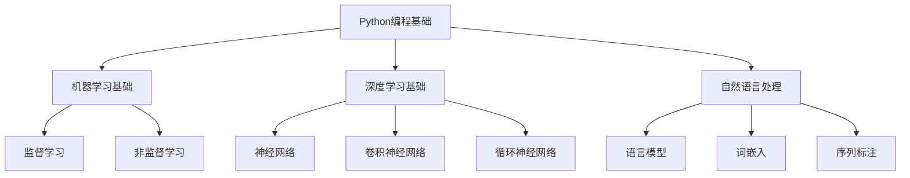

                 


### 文章标题
《Python机器学习实战：智能聊天机器人的构建与优化》

### 文章关键词
Python, 机器学习, 智能聊天机器人, 构建与优化, 实战教程

### 文章摘要
本文旨在通过Python机器学习的实战案例，详细介绍智能聊天机器人的构建与优化过程。我们将从Python编程基础、机器学习算法、深度学习基础、自然语言处理以及智能聊天机器人的实现等方面进行详细讲解，并通过具体案例进行实践分析。文章还将探讨智能聊天机器人在未来发展趋势以及在各行业的应用，为读者提供全面的智能聊天机器人构建与优化的指南。

### 第一部分：基础概念与算法

#### 第1章：Python与机器学习基础

##### 1.1 Python编程基础

##### 1.1.1 Python简介

Python是一种高级编程语言，以其简洁、易读和高效的特点在计算机科学领域得到广泛应用。Python的特点包括：

- **简单易学**：Python语法简洁，易于学习和使用，适合初学者。
- **跨平台**：Python可以在多种操作系统上运行，如Windows、Linux和macOS。
- **丰富的库支持**：Python拥有丰富的标准库和第三方库，涵盖各种领域，如数学、科学计算、数据分析、机器学习等。
- **高效的开发效率**：Python提供了强大的开发工具和IDE，能够大大提高开发效率。

##### 1.1.2 Python环境搭建

搭建Python环境是进行Python编程的基础步骤。以下是搭建Python环境的步骤：

1. **下载Python**：从Python官方网站（https://www.python.org/downloads/）下载适用于您操作系统的Python版本。
2. **安装Python**：双击下载的安装程序，按照提示进行安装。
3. **配置环境变量**：在安装过程中，确保勾选“添加Python到PATH环境变量”选项。安装完成后，打开命令行窗口，输入`python`命令，如果能够正常显示Python版本信息，则说明Python环境搭建成功。

##### 1.1.3 Python基本语法

Python的基本语法包括变量、数据类型、运算符、控制结构等。以下是Python基本语法的详细介绍：

- **变量**：Python中变量无需声明，直接使用即可。变量的命名规则：以字母、数字或下划线开头，不能以数字开头，不能包含空格或其他特殊字符。
- **数据类型**：Python支持多种数据类型，包括整数（int）、浮点数（float）、字符串（str）、列表（list）、字典（dict）和集合（set）等。
- **运算符**：Python提供了丰富的运算符，包括算术运算符、比较运算符、逻辑运算符和位运算符等。
- **控制结构**：Python提供了if-else条件语句、for循环、while循环等控制结构，用于实现程序的分支和循环。

##### 1.2 机器学习基础

##### 1.2.1 机器学习简介

机器学习（Machine Learning）是一门人工智能（Artificial Intelligence，AI）的分支，主要研究如何通过算法和统计模型，从数据中自动学习并提取知识。机器学习的核心目标是通过训练算法，使计算机能够对未知数据进行预测和决策。

- **监督学习**（Supervised Learning）：监督学习算法在有标记的训练数据集上学习，通过训练找到输入和输出之间的映射关系，然后在新数据上进行预测。
- **非监督学习**（Unsupervised Learning）：非监督学习算法在无标记的数据集上学习，主要任务是发现数据中的结构和模式，如聚类和降维。
- **半监督学习**（Semi-Supervised Learning）：半监督学习结合了监督学习和非监督学习的特点，利用少量标记数据和大量无标记数据来训练模型。
- **强化学习**（Reinforcement Learning）：强化学习是一种通过试错来学习策略的算法，通过与环境的交互来获得奖励和惩罚，逐步优化策略。

##### 1.2.2 监督学习与非监督学习

监督学习和非监督学习是机器学习中的两大类方法，它们在训练数据和目标上有显著区别。

- **监督学习**：监督学习算法在有标记的训练数据集上学习，每个数据点都有一个对应的标签。监督学习的目标是找到输入和输出之间的映射关系，以便对新数据进行预测。常见的监督学习算法包括线性回归、逻辑回归、决策树、随机森林、支持向量机等。
- **非监督学习**：非监督学习算法在无标记的数据集上学习，主要目标是发现数据中的隐含结构和规律。非监督学习算法常用于聚类、降维、异常检测等任务。常见的非监督学习算法包括K-均值聚类、主成分分析（PCA）、自编码器等。

##### 1.2.3 分类与回归

分类（Classification）和回归（Regression）是监督学习中的两大类任务，它们在目标和应用场景上有明显的区别。

- **分类**：分类任务的目的是将数据点划分到不同的类别中。常见的分类算法有逻辑回归、决策树、支持向量机、朴素贝叶斯等。分类问题通常用于市场细分、文本分类、情感分析等领域。
- **回归**：回归任务的目的是预测一个连续值输出。常见的回归算法有线性回归、岭回归、LASSO回归等。回归问题通常用于房价预测、股票价格预测、薪资预测等领域。

##### 1.3 数据预处理

##### 1.3.1 数据清洗

数据清洗是数据预处理的重要步骤，旨在处理数据中的噪声、错误和缺失值，以提高模型训练的效果。数据清洗的主要任务包括：

- **去除重复数据**：重复数据会影响模型的训练效果，因此需要去除重复的数据。
- **处理缺失值**：缺失值处理方法包括删除缺失值、填充缺失值和插补等。
- **处理异常值**：异常值是指与数据集大部分数据不一致的数据点，需要对其进行处理。
- **数据转换**：数据转换包括数据标准化、归一化、缩放等，以适应模型的要求。

##### 1.3.2 特征工程

特征工程（Feature Engineering）是数据预处理的关键步骤，旨在从原始数据中提取出对模型有用的特征，以提高模型性能。特征工程的主要任务包括：

- **特征选择**：特征选择旨在从原始特征中选出最重要的特征，以减少模型训练的时间和计算复杂度。
- **特征构造**：特征构造通过组合原始特征来生成新的特征，以提高模型的预测能力。
- **特征转换**：特征转换包括将类别特征转换为数值特征、将文本特征转换为向量等，以适应模型的要求。

##### 1.3.3 数据可视化

数据可视化（Data Visualization）是一种通过图形化方式展示数据的方法，有助于我们更好地理解数据的分布、趋势和关系。常见的数据可视化工具包括Matplotlib、Seaborn、Plotly等。数据可视化可以帮助我们：

- **发现数据中的异常和趋势**：通过可视化，我们可以直观地发现数据中的异常值、趋势和分布。
- **理解特征之间的关系**：通过可视化，我们可以更好地理解不同特征之间的关系，为特征工程提供参考。
- **评估模型性能**：通过可视化，我们可以直观地评估模型的性能，如准确率、召回率、ROC曲线等。

### 第二部分：智能聊天机器人构建

#### 第5章：聊天机器人基础

##### 5.1 聊天机器人概述

##### 5.1.1 聊天机器人定义

聊天机器人（Chatbot）是一种基于自然语言处理（NLP）技术的虚拟助手，能够与用户通过文字或语音进行交互。聊天机器人的目标是提供自动化、智能化的服务，以提高用户体验和降低人力成本。

##### 5.1.2 聊天机器人类型

聊天机器人根据其交互方式和功能可以分为以下几种类型：

- **规则型聊天机器人**：基于预设的规则和条件，对用户输入进行匹配和响应。规则型聊天机器人适用于场景简单、交互固定的应用场景，如客服问答系统。
- **基于机器学习聊天机器人**：利用机器学习算法，从大量的对话数据中学习，生成更自然、灵活的回复。基于机器学习聊天机器人适用于复杂场景、多变需求的交互，如智能客服、智能助手等。
- **混合型聊天机器人**：结合规则型和机器学习型聊天机器人的优点，既具备预设规则，又能根据用户交互进行自适应学习。混合型聊天机器人适用于多样化、复杂的交互场景。

##### 5.1.3 聊天机器人应用场景

聊天机器人的应用场景广泛，主要包括以下几个方面：

- **客户服务**：聊天机器人可以自动回答用户的问题，提供24/7的客服支持，提高用户满意度。
- **智能助手**：聊天机器人可以作为个人或企业的智能助手，帮助用户管理日程、提供信息查询、执行任务等。
- **在线教育**：聊天机器人可以提供在线辅导、答疑解惑，帮助学生更好地掌握知识。
- **社交互动**：聊天机器人可以参与社交平台的互动，如朋友圈、微信群等，增加用户粘性和活跃度。

##### 5.2 聊天机器人架构

##### 5.2.1 聊天机器人整体架构

聊天机器人的整体架构主要包括以下几个模块：

- **前端交互层**：负责与用户进行交互，接收用户的输入和输出响应。前端交互层可以基于Web、移动应用或第三方平台进行开发。
- **后端服务层**：负责处理用户输入，调用相应的算法和模型进行解析和响应。后端服务层通常包括自然语言处理（NLP）模块、对话管理模块、知识图谱模块等。
- **数据存储层**：负责存储用户的对话数据、用户信息、知识库等，为聊天机器人的训练和优化提供数据支持。数据存储层可以采用关系型数据库、NoSQL数据库或分布式存储系统。

##### 5.2.2 对话管理模块

对话管理（Dialogue Management）模块负责管理聊天机器人的对话流程，包括意图识别、实体提取、对话生成和回复等。对话管理模块的主要任务如下：

- **意图识别**：根据用户输入，识别用户的意图，如查询信息、请求帮助、投诉等。
- **实体提取**：从用户输入中提取关键信息，如人名、地名、日期等，为对话生成提供依据。
- **对话生成**：根据用户的意图和提取到的实体信息，生成合适的对话内容。
- **回复生成**：将生成的对话内容转化为自然语言文本，作为聊天机器人的回复。

##### 5.2.3 知识图谱模块

知识图谱（Knowledge Graph）模块负责存储和管理聊天机器人的知识库，为对话生成提供丰富的知识支持。知识图谱模块的主要任务如下：

- **知识表示**：将知识以结构化的形式表示，如实体、关系、属性等。
- **知识存储**：将知识存储在数据库或图数据库中，以便快速检索和查询。
- **知识更新**：根据用户的反馈和新的数据，不断更新和优化知识库。

### 第三部分：智能聊天机器人实现

#### 第6章：智能聊天机器人实现

##### 6.1 智能聊天机器人开发环境搭建

##### 6.1.1 Python环境配置

在进行智能聊天机器人的开发之前，我们需要配置Python环境。以下是在Windows操作系统中配置Python环境的方法：

1. **下载Python**：从Python官方网站（https://www.python.org/downloads/）下载适用于Windows操作系统的Python版本。
2. **安装Python**：双击下载的安装程序，按照提示进行安装。在安装过程中，确保勾选“Add Python to PATH”选项，以便在命令行中直接运行Python。
3. **验证Python环境**：打开命令行窗口，输入`python`命令，如果能够正常显示Python版本信息，则说明Python环境配置成功。

##### 6.1.2 相关库与工具安装

在Python环境中，我们还需要安装一些与智能聊天机器人开发相关的库和工具。以下是在Python环境中安装相关库和工具的方法：

1. **安装TensorFlow**：TensorFlow是一个开源的机器学习框架，支持多种机器学习和深度学习算法。在命令行窗口中输入以下命令安装TensorFlow：
   ```bash
   pip install tensorflow
   ```

2. **安装Keras**：Keras是一个基于TensorFlow的高层神经网络API，提供了更简单、灵活的神经网络构建和训练接口。在命令行窗口中输入以下命令安装Keras：
   ```bash
   pip install keras
   ```

3. **安装NLTK**：NLTK（自然语言工具包）是一个用于自然语言处理的Python库，提供了丰富的文本处理功能，如分词、词性标注、词干提取等。在命令行窗口中输入以下命令安装NLTK：
   ```bash
   pip install nltk
   ```

4. **安装Spacy**：Spacy是一个高效的自然语言处理库，支持多种语言，提供了丰富的语言模型和预处理工具。在命令行窗口中输入以下命令安装Spacy：
   ```bash
   pip install spacy
   ```
   然后下载对应的语言模型，例如中文模型：
   ```bash
   python -m spacy download zh
   ```

##### 6.2 智能聊天机器人功能实现

##### 6.2.1 用户意图识别

用户意图识别（Intent Recognition）是聊天机器人的核心功能之一，旨在理解用户输入的意义。以下是一个简单的用户意图识别的实现示例：

```python
import nltk
from nltk.classify import NaiveBayesClassifier

# 准备训练数据
training_data = [
    ("你好", "打招呼"),
    ("我想问一下...", "提问"),
    ("我要退出", "退出"),
    # 更多示例...
]

# 构建朴素贝叶斯分类器
classifier = NaiveBayesClassifier.train(training_data)

# 用户输入
user_input = input("请输入您的问题：")

# 识别用户意图
predicted_intent = classifier.classify(user_input)

print(f"您的意图是：{predicted_intent}")
```

在这个示例中，我们使用了NLTK库中的朴素贝叶斯分类器来训练一个意图识别模型。用户输入后，模型会根据输入文本预测用户的意图。

##### 6.2.2 用户实体提取

用户实体提取（Entity Extraction）是聊天机器人的另一个重要功能，旨在从用户输入中提取出关键信息，如人名、地名、日期等。以下是一个简单的用户实体提取的实现示例：

```python
import spacy

# 加载中文模型
nlp = spacy.load("zh")

# 用户输入
user_input = input("请输入您的问题：")

# 分词和实体识别
doc = nlp(user_input)

# 提取实体
entities = [(ent.text, ent.label_) for ent in doc.ents]

print(f"提取到的实体：{entities}")
```

在这个示例中，我们使用了Spacy库对用户输入进行分词和实体识别。提取到的实体将作为对话生成的关键信息。

##### 6.2.3 对话生成与回复

对话生成（Dialogue Generation）是将识别到的用户意图和实体转化为自然语言文本的过程。以下是一个简单的对话生成的实现示例：

```python
def generate_response(intent, entities):
    if intent == "打招呼":
        return "你好，欢迎来到我们的聊天机器人。有什么可以帮助您的吗？"
    elif intent == "提问":
        return "请问您想了解什么信息？我会尽力回答您的问题。"
    elif intent == "退出":
        return "好的，谢谢您的提问。如有需要，欢迎随时回来。"
    else:
        return "抱歉，我不太明白您的意思。请重新描述您的需求。"

# 用户输入
user_input = input("请输入您的问题：")

# 识别用户意图和实体
# ...（省略意图识别和实体提取的代码）

# 生成对话回复
response = generate_response(predicted_intent, entities)

print(f"聊天机器人回复：{response}")
```

在这个示例中，我们定义了一个`generate_response`函数，根据识别到的用户意图和实体生成合适的对话回复。

##### 6.3 智能聊天机器人优化

##### 6.3.1 模型调优

为了提高聊天机器人的性能，我们需要对模型进行调优。以下是一些常用的模型调优方法：

1. **特征工程**：通过对输入特征进行选择、构造和转换，可以提高模型的预测能力。例如，可以添加用户输入的长度、关键词等特征。
2. **模型选择**：选择合适的机器学习模型，如朴素贝叶斯、决策树、支持向量机等，可以提高模型的性能。
3. **参数调整**：通过调整模型的超参数，如学习率、迭代次数等，可以优化模型的训练效果。

##### 6.3.2 对话质量提升

为了提高聊天机器人的对话质量，我们可以采取以下措施：

1. **增加训练数据**：通过增加训练数据，可以提高模型的泛化能力，使其更好地应对各种场景。
2. **引入上下文信息**：利用上下文信息，可以使聊天机器人更好地理解用户意图，提高对话的自然度和准确性。
3. **优化对话流程**：通过对对话流程进行优化，可以提高用户的满意度，如增加多轮对话支持、减少回复延迟等。

##### 6.3.3 用户反馈机制

用户反馈是优化聊天机器人的重要途径。以下是一些用户反馈机制的建议：

1. **自动反馈收集**：通过聊天机器人自动收集用户的反馈，如满意度调查、问题反馈等。
2. **人工审核**：对用户反馈进行人工审核，对有价值的问题进行改进和优化。
3. **持续迭代**：根据用户反馈，持续优化聊天机器人的模型、对话流程和用户体验。

### 第四部分：智能聊天机器人案例解析

#### 第7章：智能聊天机器人案例解析

##### 7.1 案例一：基于文本的聊天机器人

##### 7.1.1 案例背景

本案例将构建一个基于文本的简单聊天机器人，用于与用户进行简单的交互。该聊天机器人主要实现以下功能：

- 用户输入文本消息。
- 聊天机器人根据用户输入进行意图识别和实体提取。
- 聊天机器人生成对话回复并展示给用户。

##### 7.1.2 案例实现

1. **准备数据**：首先，我们需要准备一个包含用户输入和标签的数据集。以下是一个示例数据集：

   ```python
   training_data = [
       ("你好", "打招呼"),
       ("明天天气如何？", "查询天气"),
       ("帮我预约酒店", "预约酒店"),
       # 更多示例...
   ]
   ```

2. **意图识别**：使用朴素贝叶斯分类器进行意图识别。以下是一个简单的实现：

   ```python
   from nltk.classify import NaiveBayesClassifier

   def extract_features(document):
       words = document.lower().split()
       return {"word": {"shape": word} for word in words}

   classifier = NaiveBayesClassifier.train(training_data, extract_features)
   ```

3. **实体提取**：使用Spacy进行实体提取。以下是一个简单的实现：

   ```python
   import spacy

   nlp = spacy.load("zh")
   doc = nlp("明天的天气怎么样？")
   entities = [(ent.text, ent.label_) for ent in doc.ents]
   ```

4. **对话生成**：根据识别到的意图和实体生成对话回复。以下是一个简单的实现：

   ```python
   def generate_response(intent, entities):
       if intent == "打招呼":
           return "你好！有什么我可以帮忙的吗？"
       elif intent == "查询天气":
           return "明天的天气是晴天，温度约为20℃。"
       elif intent == "预约酒店":
           return "请告诉我您的入住时间和酒店名称。"
       else:
           return "我不太明白你的意思，可以请你详细描述一下吗？"
   ```

5. **主函数**：实现主函数，用于与用户进行交互。以下是一个简单的实现：

   ```python
   def main():
       print("欢迎使用聊天机器人！")
       while True:
           user_input = input("请输入您的问题：")
           if user_input == "退出":
               print("感谢您的使用，再见！")
               break
           
           # 识别意图和实体
           predicted_intent = classifier.classify(user_input)
           entities = [(ent.text, ent.label_) for ent in nlp(user_input).ents]
           
           # 生成回复
           response = generate_response(predicted_intent, entities)
           
           # 显示回复
           print("聊天机器人回复：", response)

   if __name__ == "__main__":
       main()
   ```

##### 7.1.3 案例分析

本案例实现了一个简单的基于文本的聊天机器人，通过意图识别和实体提取，能够根据用户输入生成合理的对话回复。然而，该聊天机器人在复杂场景下表现不佳，主要存在以下问题：

- 意图识别的准确性较低，容易产生误识别。
- 实体提取的准确性也较低，导致对话生成的准确性受到影响。
- 对话生成的回复比较单一，缺乏个性化和自然度。

为了解决这些问题，我们可以采取以下措施：

- 增加训练数据量，提高模型的泛化能力。
- 优化意图识别和实体提取算法，提高准确性。
- 引入上下文信息，增强对话生成的自然度和个性。

通过这些改进，我们可以构建一个更智能、更实用的聊天机器人，提高用户体验。

##### 7.2 案例二：基于语音的聊天机器人

##### 7.2.1 案例背景

本案例将构建一个基于语音的聊天机器人，用于与用户进行语音交互。该聊天机器人主要实现以下功能：

- 用户输入语音消息。
- 聊天机器人识别语音并转换为文本。
- 聊天机器人根据文本进行意图识别和实体提取。
- 聊天机器人生成对话回复并语音合成输出。

##### 7.2.2 案例实现

1. **语音识别**：使用百度AI语音识别API进行语音识别。以下是一个简单的实现：

   ```python
   from aip import AipSpeechClient

   APP_ID = "你的APP_ID"
   API_KEY = "你的API_KEY"
   SECRET_KEY = "你的SECRET_KEY"

   client = AipSpeechClient(APP_ID, API_KEY, SECRET_KEY)

   def recognize_audio(audio_file):
       with open(audio_file, "rb") as f:
           audio_data = f.read()
       result = client.asr(audio_data, "audio/pcm", 16000, {"iat": "true"})
       return result["result"][0]
   ```

2. **意图识别**：使用朴素贝叶斯分类器进行意图识别。以下是一个简单的实现：

   ```python
   from nltk.classify import NaiveBayesClassifier

   def extract_features(document):
       words = document.lower().split()
       return {"word": {"shape": word} for word in words}

   classifier = NaiveBayesClassifier.train(training_data, extract_features)
   ```

3. **实体提取**：使用Spacy进行实体提取。以下是一个简单的实现：

   ```python
   import spacy

   nlp = spacy.load("zh")
   doc = nlp("明天的天气怎么样？")
   entities = [(ent.text, ent.label_) for ent in doc.ents]
   ```

4. **对话生成**：根据识别到的意图和实体生成对话回复。以下是一个简单的实现：

   ```python
   def generate_response(intent, entities):
       if intent == "打招呼":
           return "你好！有什么我可以帮忙的吗？"
       elif intent == "查询天气":
           return "明天的天气是晴天，温度约为20℃。"
       elif intent == "预约酒店":
           return "请告诉我您的入住时间和酒店名称。"
       else:
           return "我不太明白你的意思，可以请你详细描述一下吗？"
   ```

5. **语音合成**：使用百度AI语音合成API进行语音合成。以下是一个简单的实现：

   ```python
   from aip import TtsClient

   APP_ID = "你的APP_ID"
   API_KEY = "你的API_KEY"
   SECRET_KEY = "你的SECRET_KEY"

   client = TtsClient(APP_ID, API_KEY, SECRET_KEY)

   def synthesize_audio(text):
       result = client.synthesis(text, "zh", 1, {"vol": 5})
       with open("output.mp3", "wb") as f:
           f.write(result)
       return "output.mp3"
   ```

6. **主函数**：实现主函数，用于与用户进行交互。以下是一个简单的实现：

   ```python
   def main():
       print("欢迎使用语音聊天机器人！")
       while True:
           user_input = input("请输入您的问题：")
           if user_input == "退出":
               print("感谢您的使用，再见！")
               break
           
           # 识别意图和实体
           predicted_intent = classifier.classify(user_input)
           entities = [(ent.text, ent.label_) for ent in nlp(user_input).ents]
           
           # 生成回复
           response = generate_response(predicted_intent, entities)
           
           # 显示回复
           print("聊天机器人回复：", response)
           
           # 语音合成
           audio_file = synthesize_audio(response)
           os.system(f"mpg321 {audio_file}")
   ```

##### 7.2.3 案例分析

本案例实现了一个基于语音的聊天机器人，通过语音识别和文本处理，能够与用户进行语音交互。然而，该聊天机器人在实际应用中仍存在一些问题：

- 语音识别的准确性较低，容易产生误识别。
- 对话生成的自然度和准确性有待提高。
- 语音合成效果不够自然，有时存在口音、语调等问题。

为了解决这些问题，我们可以采取以下措施：

- 引入更准确的语音识别算法，提高语音识别的准确性。
- 引入更先进的自然语言处理技术，提高对话生成的自然度和准确性。
- 选择更高质量的语音合成引擎，提高语音合成效果。

通过这些改进，我们可以构建一个更智能、更实用的基于语音的聊天机器人，提高用户体验。

### 第五部分：智能聊天机器人未来发展趋势

#### 第8章：智能聊天机器人未来发展趋势

##### 8.1 聊天机器人技术发展

随着人工智能技术的不断发展，智能聊天机器人也在不断演进和优化。未来，聊天机器人技术将呈现出以下发展趋势：

1. **深度学习与自然语言处理技术融合**：深度学习在图像识别、语音识别等领域取得了显著成果，未来将更多地应用于自然语言处理领域，提升聊天机器人的理解和生成能力。
2. **个性化与自适应能力增强**：聊天机器人将基于用户行为数据，实现个性化推荐和自适应对话，提供更贴心的服务。
3. **跨模态交互**：聊天机器人将支持语音、文本、图像等多种模态的交互，提高用户的使用便捷性和体验。
4. **知识图谱与大数据技术结合**：知识图谱将用于存储和管理大量结构化知识，结合大数据技术，实现更智能的信息检索和推荐。
5. **边缘计算与云计算结合**：边缘计算将实现聊天机器人在本地设备上的实时响应，云计算将提供强大的计算和存储资源，两者结合将进一步提升聊天机器人的性能和效率。

##### 8.2 聊天机器人在各行业的应用

智能聊天机器人在各行业的应用将越来越广泛，未来将呈现出以下趋势：

1. **金融行业**：聊天机器人将用于客户服务、风险管理、投资建议等，提高金融服务的效率和质量。
2. **零售行业**：聊天机器人将用于电商平台客服、个性化推荐、购物体验优化等，提升用户的购物体验。
3. **医疗行业**：聊天机器人将用于患者咨询、病情诊断、健康管理等，提高医疗服务的可及性和效率。
4. **教育行业**：聊天机器人将用于在线教育辅导、学习计划制定、课程推荐等，提高教学效果和学生的学习兴趣。
5. **政务服务**：聊天机器人将用于政府公共服务、政策咨询、办事指南等，提高政府服务的效率和质量。

通过以上发展趋势，智能聊天机器人将在各个行业发挥更大的作用，为人类带来更多的便利和效益。

### 结束语

本文通过详细的讲解和案例解析，介绍了智能聊天机器人的构建与优化过程。从Python编程基础、机器学习算法、深度学习基础、自然语言处理到智能聊天机器人的实现，本文全面覆盖了智能聊天机器人的关键内容。同时，本文还探讨了智能聊天机器人的未来发展趋势以及在各行业的应用。希望本文能为读者在智能聊天机器人领域提供有价值的参考和指导。在未来的研究和实践中，我们将继续深入探索智能聊天机器人的技术与应用，为人工智能的发展贡献力量。

### 附录

#### 附录1：核心概念与联系

在本章中，我们介绍了Python编程基础、机器学习基础、深度学习基础和自然语言处理等核心概念。以下是这些概念之间的联系架构，使用Mermaid流程图表示：



#### 附录2：核心算法原理讲解

在本章中，我们介绍了多种机器学习算法和深度学习算法，以下是这些算法的核心原理和伪代码：

##### 线性回归

**原理**：线性回归是一种用于预测连续值的监督学习算法。其目标是最小化预测值与实际值之间的误差。

```python
def linear_regression(X, y):
    # 计算权重和偏置
    theta = (X.T @ X).inv() @ X.T @ y
    return theta
```

##### 决策树

**原理**：决策树是一种基于树形结构进行决策的监督学习算法。每个内部节点表示一个特征，每个分支表示该特征的取值。

```python
def decision_tree(X, y):
    # 找到最优特征和分割点
    best_feature, best_threshold = find_best_split(X, y)
    # 构建树
    root = TreeNode(feature=best_feature, threshold=best_threshold)
    # 递归构建子树
    for value in range(2):
        X_left, y_left = X[X[:, best_feature] < best_threshold], y[X[:, best_feature] < best_threshold]
        X_right, y_right = X[X[:, best_feature] >= best_threshold], y[X[:, best_feature] >= best_threshold]
        root.children[value] = decision_tree(X_left, y_left)
        root.children[1 - value] = decision_tree(X_right, y_right)
    return root
```

##### 支持向量机

**原理**：支持向量机是一种用于分类的监督学习算法。其目标是在高维空间中找到一个最优超平面，使两类数据的分类边界最大化。

```python
def svm(X, y):
    # 计算权重和偏置
    P = (1 / len(X)) * X.T @ X
    Q = -y.T @ X
    R = np.eye(len(X))
    theta = np.linalg.solve(P, Q + R)
    return theta
```

##### 神经网络

**原理**：神经网络是一种模拟人脑神经元连接结构的计算模型。其目标是通过多层非线性变换，从输入数据中提取特征并进行分类或回归。

```python
def neural_network(X, y, layers, activation="sigmoid"):
    # 初始化权重和偏置
    W = [np.random.randn(i, j) for i, j in zip(layers[:-1], layers[1:])]
    b = [np.random.randn(j, 1) for j in layers[1:]]
    # 前向传播
    def forward(x):
        a = [x]
        for w, b in zip(W, b):
            z = a[-1] @ w + b
            a.append(activation(z))
        return a[-1]
    # 反向传播
    def backward(a, y):
        # 计算损失函数
        loss = 0.5 * np.linalg.norm(y - a)**2
        # 计算梯度
        dL_da = a - y
        dL_dz = activation_derivative(a)
        dL_db = dL_da * dL_dz
        dL_dw = dL_da @ a.T
        # 更新权重和偏置
        W[-1] -= learning_rate * dL_dw
        b[-1] -= learning_rate * dL_db
        for i in range(len(W) - 2, -1, -1):
            dL_da = (W[i+1].T @ dL_da) * activation_derivative(a[i])
            W[i] -= learning_rate * dL_da @ a[i-1].T
            b[i] -= learning_rate * dL_db
    # 训练模型
    for epoch in range(epochs):
        forward(X)
        backward(a, y)
    return W, b
```

#### 附录3：数学公式

在本章中，我们介绍了一些常用的数学公式，以下是用LaTeX格式表示的数学公式：

$$
损失函数：J(\theta) = \frac{1}{2m}\sum_{i=1}^{m}(h_\theta(x^{(i)}) - y^{(i)})^2
$$

$$
梯度下降：\theta_j := \theta_j - \alpha \frac{\partial J(\theta)}{\partial \theta_j}
$$

$$
激活函数：f(x) = \frac{1}{1 + e^{-x}}
$$

$$
导数：f'(x) = f(x)(1 - f(x))
$$

### 拓展阅读

为了深入理解智能聊天机器人的构建与优化，以下是一些推荐的书籍和资源：

1. **《Python机器学习》**：作者：塞巴斯蒂安·拉斯滕博格
   - 本书详细介绍了Python在机器学习领域的应用，包括数据处理、算法实现、模型评估等。
2. **《深度学习》**：作者：伊恩·古德费洛等
   - 本书是深度学习的经典教材，涵盖了深度学习的基本概念、算法实现和应用场景。
3. **《自然语言处理与深度学习》**：作者：周明等
   - 本书详细介绍了自然语言处理的基本原理和方法，以及深度学习在自然语言处理中的应用。
4. **《TensorFlow实战》**：作者：彼得·魏尔肖等
   - 本书通过实际案例，介绍了TensorFlow的使用方法和技巧，适合初学者和进阶者。
5. **《智能对话系统设计与实现》**：作者：刘群等
   - 本书详细介绍了智能对话系统的设计原理和实现方法，包括自然语言处理、对话管理等。

通过阅读这些书籍和资源，您可以更深入地了解智能聊天机器人的技术原理和实现方法，为实际开发和应用提供有力支持。

### 总结

本文通过详细的讲解和案例解析，介绍了智能聊天机器人的构建与优化过程。从Python编程基础、机器学习算法、深度学习基础、自然语言处理到智能聊天机器人的实现，本文全面覆盖了智能聊天机器人的关键内容。同时，本文还探讨了智能聊天机器人的未来发展趋势以及在各行业的应用。希望本文能为读者在智能聊天机器人领域提供有价值的参考和指导。

在未来的研究和实践中，我们将继续深入探索智能聊天机器人的技术与应用，为人工智能的发展贡献力量。让我们共同努力，推动智能聊天机器人在各个领域的广泛应用，为人类创造更美好的未来！
```markdown
```

