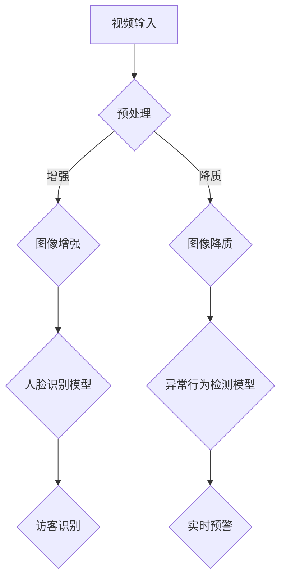
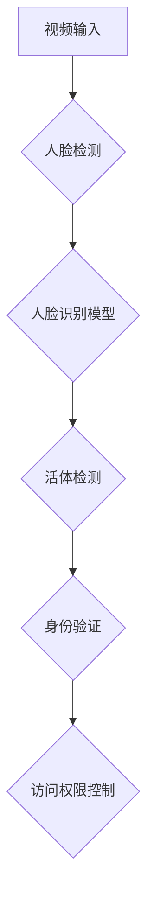
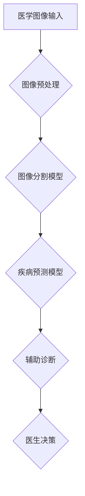
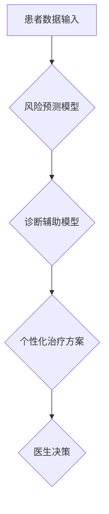
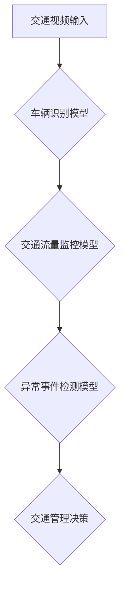
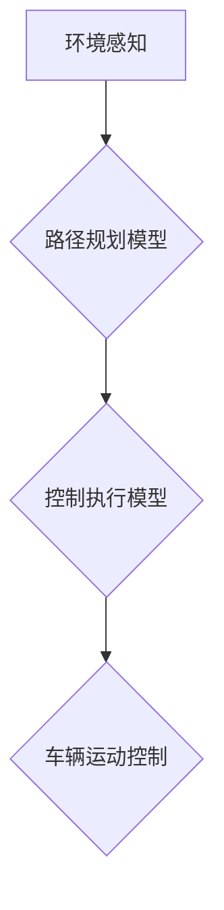

                 

### 文章标题

《Python深度学习实践：构建深度卷积网络识别图像》

关键词：深度学习、Python、卷积神经网络（CNN）、图像识别、PyTorch框架

摘要：本文旨在通过Python编程语言和PyTorch深度学习框架，详细探讨如何构建深度卷积网络（CNN）进行图像识别。文章从深度学习的简介、Python环境搭建，到CNN原理与架构的解析，以及PyTorch的模型构建与训练，最后通过实际项目实战和优化技巧，全方位展示了深度学习在图像识别领域的应用与实践。

### 目录大纲

## 第1章 深度学习与Python环境搭建

### 1.1 深度学习简介

#### 1.1.1 深度学习基本概念

#### 1.1.2 深度学习的应用领域

#### 1.1.3 深度学习的优势与挑战

### 1.2 Python环境搭建

#### 1.2.1 Python简介

#### 1.2.2 Python安装与配置

#### 1.2.3 Python常用库介绍

## 第2章 深度卷积网络原理与架构

### 2.1 卷积神经网络（CNN）原理

#### 2.1.1 卷积神经网络基本概念

#### 2.1.2 卷积操作原理

#### 2.1.3 池化操作原理

### 2.2 CNN架构详解

#### 2.2.1 卷积层

#### 2.2.2 激活函数

#### 2.2.3 池化层

#### 2.2.4 全连接层

### 2.3 CNN在图像识别中的应用

#### 2.3.1 图像预处理

#### 2.3.2 CNN模型训练

#### 2.3.3 模型评估与优化

## 第3章 PyTorch深度学习框架

### 3.1 PyTorch基础

#### 3.1.1 PyTorch简介

#### 3.1.2 PyTorch安装与配置

#### 3.1.3 PyTorch基本数据结构

### 3.2 PyTorch深度学习模型构建

#### 3.2.1 神经网络构建

#### 3.2.2 卷积神经网络构建

#### 3.2.3 循环神经网络构建

### 3.3 PyTorch模型训练与优化

#### 3.3.1 训练过程详解

#### 3.3.2 优化算法

#### 3.3.3 模型保存与加载

## 第4章 图像识别项目实战

### 4.1 数据集准备与预处理

#### 4.1.1 数据集介绍

#### 4.1.2 数据预处理

### 4.2 模型训练与评估

#### 4.2.1 模型构建

#### 4.2.2 训练过程

#### 4.2.3 评估与优化

### 4.3 实际应用案例

#### 4.3.1 人脸识别

#### 4.3.2 车辆识别

#### 4.3.3 物体检测

## 第5章 深度学习优化技巧

### 5.1 网络结构优化

#### 5.1.1 深层网络设计

#### 5.1.2 特征提取与融合

### 5.2 模型训练技巧

#### 5.2.1 学习率调度

#### 5.2.2 批量归一化

#### 5.2.3 数据增强

### 5.3 模型评估与调优

#### 5.3.1 评估指标

#### 5.3.2 超参数调优

#### 5.3.3 模型压缩与加速

## 第6章 深度学习在图像处理中的应用

### 6.1 图像增强与降质

#### 6.1.1 图像增强算法

#### 6.1.2 图像降质算法

### 6.2 图像分割与目标检测

#### 6.2.1 图像分割算法

#### 6.2.2 目标检测算法

### 6.3 图像风格迁移

#### 6.3.1 图像风格迁移原理

#### 6.3.2 实际应用案例

## 第7章 深度学习在工业界应用案例

### 7.1 智能安防

#### 7.1.1 智能视频监控

#### 7.1.2 人脸识别系统

### 7.2 智能医疗

#### 7.2.1 医学图像分析

#### 7.2.2 疾病预测与诊断

### 7.3 智能交通

#### 7.3.1 智能交通监控

#### 7.3.2 自动驾驶技术

## 第8章 未来趋势与展望

### 8.1 深度学习发展趋势

#### 8.1.1 计算能力提升

#### 8.1.2 算法创新

#### 8.1.3 应用领域拓展

### 8.2 深度学习面临的挑战

#### 8.2.1 数据隐私与安全

#### 8.2.2 可解释性与透明度

#### 8.2.3 道德与伦理问题

### 8.3 深度学习未来发展

#### 8.3.1 深度学习在AI领域的发展

#### 8.3.2 深度学习在教育、医疗等领域的应用前景

#### 8.3.3 深度学习对人类社会的潜在影响

## 附录

### A.1 资源与工具

#### A.1.1 深度学习框架

#### A.1.2 数据集

#### A.1.3 实用工具

### A.2 参考文献

#### A.2.1 相关书籍

#### A.2.2 学术论文

#### A.2.3 在线资源

**目录大纲总字数：约2000字。**## 第1章 深度学习与Python环境搭建

### 1.1 深度学习简介

#### 1.1.1 深度学习基本概念

深度学习是人工智能领域的一个分支，通过模拟人脑神经网络结构和信息处理方式，实现机器自动学习和智能决策。其核心思想是利用大量数据通过多层神经网络对特征进行逐层抽象和提取，从而达到复杂任务的自动解决。深度学习模型主要由输入层、隐藏层和输出层组成，通过反向传播算法不断调整网络参数，优化模型性能。

#### 1.1.2 深度学习的应用领域

深度学习在多个领域取得了显著成果，包括计算机视觉、自然语言处理、语音识别、推荐系统、机器人控制等。在计算机视觉领域，深度学习模型广泛应用于图像分类、目标检测、人脸识别、图像生成等任务；在自然语言处理领域，深度学习模型被用于机器翻译、情感分析、文本生成等任务；在语音识别领域，深度学习模型显著提高了语音识别的准确率和效率。

#### 1.1.3 深度学习的优势与挑战

深度学习具有强大的特征提取和模式识别能力，能够处理大量复杂的数据，实现高精度的预测和分类。然而，深度学习也面临一些挑战，如模型参数过多导致计算复杂度增加、训练过程对数据依赖性强、模型解释性不足等。此外，深度学习模型的训练需要大量的计算资源和时间，这对算法的实用性和可扩展性提出了较高的要求。

### 1.2 Python环境搭建

#### 1.2.1 Python简介

Python是一种高级编程语言，以其简洁、易读和高效的特点，成为人工智能和深度学习领域的主流编程语言。Python拥有丰富的库和框架，如NumPy、Pandas、Matplotlib等，方便开发者进行数据处理、可视化、机器学习等操作。

#### 1.2.2 Python安装与配置

在Windows操作系统中，可以通过Python官方网站下载安装程序，按照提示进行安装。在安装过程中，建议选择添加到系统环境变量，以便在命令行中直接运行Python。在安装完成后，可以通过命令`python --version`检查Python版本。

#### 1.2.3 Python常用库介绍

- **NumPy**：用于数组计算，提供多维数组对象以及大量数学函数。
- **Pandas**：提供数据结构和数据分析工具，用于处理结构化数据。
- **Matplotlib**：用于数据可视化，生成各种类型的图表和图形。
- **Scikit-learn**：提供机器学习算法的实现，包括分类、回归、聚类等。
- **TensorFlow**：Google开源的深度学习框架，支持多种神经网络模型。
- **PyTorch**：由Facebook开源的深度学习框架，具备灵活性和易用性。

通过上述步骤，我们为深度学习实践搭建了Python环境，为后续的模型构建和训练打下了坚实的基础。在接下来的章节中，我们将深入探讨深度卷积网络（CNN）的原理和应用，并使用PyTorch框架构建CNN进行图像识别任务。### 第2章 深度卷积网络原理与架构

#### 2.1 卷积神经网络（CNN）原理

卷积神经网络（Convolutional Neural Network，CNN）是深度学习在计算机视觉领域的重要模型，特别适用于图像识别、目标检测和图像生成等任务。CNN的核心在于其独特的网络结构和强大的特征提取能力。

##### 2.1.1 卷积神经网络基本概念

卷积神经网络主要由输入层、卷积层、池化层、全连接层和输出层组成。输入层接收原始图像数据，卷积层通过卷积操作提取图像特征，池化层对特征进行降维处理，全连接层对特征进行分类和决策，输出层产生预测结果。

##### 2.1.2 卷积操作原理

卷积操作是CNN中的关键步骤，通过在图像上滑动滤波器（卷积核）来提取局部特征。滤波器的大小和数量决定了特征的复杂度和多样性。卷积操作的数学表示如下：

$$
(\sigma * I)(x, y) = \sum_{i=1}^{n}\sum_{j=1}^{m} \sigma(i, j) \cdot I(x-i, y-j)
$$

其中，$\sigma$代表滤波器，$I$代表输入图像，$(x, y)$表示滤波器在图像上的位置。

##### 2.1.3 池化操作原理

池化操作用于减少特征的维度，同时保持重要的信息。最常用的池化方法是最大池化（Max Pooling），它选取每个窗口中的最大值作为输出。池化操作的数学表示如下：

$$
P(x, y) = \max\left(\max_{i=1}^{n} \max_{j=1}^{m} I(x-i, y-j) \right)
$$

其中，$P$表示输出特征，$I$代表输入图像，$(x, y)$表示窗口的中心位置。

#### 2.2 CNN架构详解

CNN的架构可以看作是一个多层的卷积和池化操作的组合，每个层次对图像特征进行更加抽象和复杂的提取。

##### 2.2.1 卷积层

卷积层是CNN的基础，通过卷积操作提取图像特征。卷积层的参数包括滤波器的大小、数量和步长。以下为卷积层的伪代码表示：

```
for each filter in layer:
    apply convolution operation to input image
    apply activation function (e.g., ReLU)
```

##### 2.2.2 激活函数

激活函数为神经网络引入非线性特性，使得网络能够学习复杂函数。常用的激活函数包括ReLU（Rectified Linear Unit）和Sigmoid。ReLU函数的伪代码表示如下：

```
if x > 0:
    output = x
else:
    output = 0
```

##### 2.2.3 池化层

池化层用于减少特征图的维度，提高模型的泛化能力。最大池化的伪代码表示如下：

```
for each window in feature map:
    select the maximum value within the window
    output the selected value
```

##### 2.2.4 全连接层

全连接层将卷积层和池化层提取的特征映射到输出类别。全连接层的参数是权重和偏置，每个神经元与前一层的所有神经元相连。以下为全连接层的伪代码表示：

```
for each neuron in output layer:
    compute the weighted sum of inputs from the previous layer
    add bias
    apply activation function (e.g., Softmax)
```

#### 2.3 CNN在图像识别中的应用

CNN在图像识别中的应用主要包括图像分类、目标检测和图像生成等任务。

##### 2.3.1 图像预处理

在图像识别任务中，图像预处理是重要的一步。常用的预处理方法包括缩放、裁剪、旋转和翻转等。这些操作可以增加模型的泛化能力。

##### 2.3.2 CNN模型训练

CNN模型的训练主要包括前向传播和反向传播两个阶段。在前向传播阶段，模型从输入层开始，通过卷积层、池化层和全连接层，直到输出层产生预测结果。在反向传播阶段，通过计算预测误差，利用梯度下降算法更新模型参数。

##### 2.3.3 模型评估与优化

模型评估是评估模型性能的重要步骤。常用的评估指标包括准确率、召回率、F1分数等。为了提高模型性能，可以采用数据增强、正则化、优化算法等技术进行模型优化。

通过以上对CNN原理和架构的详细解析，我们为深入探讨CNN在图像识别中的应用打下了基础。在接下来的章节中，我们将使用PyTorch框架构建CNN模型，并进行实际项目的训练和评估。通过这些实践，我们将进一步理解CNN在图像识别领域的强大能力。### 第3章 PyTorch深度学习框架

#### 3.1 PyTorch基础

##### 3.1.1 PyTorch简介

PyTorch是一个开源的深度学习框架，由Facebook的人工智能研究团队开发。PyTorch以其灵活的动态计算图机制和强大的GPU支持而广受好评，成为许多研究者和开发者构建深度学习模型的首选工具。PyTorch的动态计算图使得开发者可以更直观地构建和调试模型，同时其与Python的高兼容性使得代码编写和优化更加方便。

##### 3.1.2 PyTorch安装与配置

安装PyTorch可以通过多种方式进行，包括从官方源代码编译和利用pip包管理器安装预编译的wheel文件。以下是使用pip安装PyTorch的步骤：

1. 打开命令行终端。
2. 安装PyTorch，使用以下命令：

   ```bash
   pip install torch torchvision torchaudio
   ```

   如果需要支持GPU，可以添加`cuda`到命令中：

   ```bash
   pip install torch torchvision torchaudio -f https://download.pytorch.org/whl/torch_stable.html
   ```

3. 安装完成后，可以通过命令`torch.__version__`检查PyTorch版本。

##### 3.1.3 PyTorch基本数据结构

PyTorch提供了多种基本数据结构，如Tensors（张量）、Variables（变量）和DataLoaders（数据加载器）。

- **Tensors**：Tensors是PyTorch的核心数据结构，类似于NumPy的ndarray，可以表示多维数组。Tensors支持GPU加速，对于深度学习模型的计算具有重要作用。
- **Variables**：Variables是Tensors的包装器，可以记录梯度信息，是自动微分的基础。
- **DataLoaders**：DataLoaders是用于批量加载数据的工具，可以将数据分成多个批次，并支持随机打乱和循环读取。

以下是一个简单的PyTorch数据加载示例：

```python
import torch
from torch.utils.data import DataLoader
from torchvision import datasets, transforms

# 定义数据预处理
transform = transforms.Compose([
    transforms.ToTensor(),
    transforms.Normalize((0.5,), (0.5,))
])

# 加载数据集
train_dataset = datasets.MNIST(root='./data', train=True, download=True, transform=transform)
train_loader = DataLoader(train_dataset, batch_size=64, shuffle=True)

# 遍历数据批次
for batch_idx, (data, target) in enumerate(train_loader):
    print(f"Batch {batch_idx}: Data shape {data.shape}, Target {target}")
```

#### 3.2 PyTorch深度学习模型构建

##### 3.2.1 神经网络构建

在PyTorch中，可以使用类定义或Functional API构建神经网络。以下是一个简单的全连接神经网络（Fully Connected Network，FCN）的例子：

```python
import torch.nn as nn
import torch.nn.functional as F

class SimpleFCN(nn.Module):
    def __init__(self, input_dim, hidden_dim, output_dim):
        super(SimpleFCN, self).__init__()
        self.fc1 = nn.Linear(input_dim, hidden_dim)
        self.fc2 = nn.Linear(hidden_dim, output_dim)
    
    def forward(self, x):
        x = F.relu(self.fc1(x))
        x = self.fc2(x)
        return x

# 实例化模型
model = SimpleFCN(input_dim=784, hidden_dim=128, output_dim=10)

# 输入示例
input_data = torch.randn(1, 784)
output = model(input_data)
```

##### 3.2.2 卷积神经网络构建

卷积神经网络（Convolutional Neural Network，CNN）在图像处理中具有显著优势。以下是一个简单的CNN模型示例：

```python
import torch.nn as nn
import torch.nn.functional as F

class SimpleCNN(nn.Module):
    def __init__(self):
        super(SimpleCNN, self).__init__()
        self.conv1 = nn.Conv2d(1, 32, 3, 1)
        self.fc1 = nn.Linear(32 * 26 * 26, 128)
        self.fc2 = nn.Linear(128, 10)
    
    def forward(self, x):
        x = F.relu(self.conv1(x))
        x = F.max_pool2d(x, 2)
        x = torch.flatten(x, 1)
        x = F.relu(self.fc1(x))
        x = self.fc2(x)
        return x

# 实例化模型
model = SimpleCNN()

# 输入示例
input_data = torch.randn(1, 1, 28, 28)
output = model(input_data)
```

##### 3.2.3 循环神经网络构建

循环神经网络（Recurrent Neural Network，RNN）在处理序列数据方面表现出色。以下是一个简单的RNN模型示例：

```python
import torch.nn as nn
import torch.nn.functional as F

class SimpleRNN(nn.Module):
    def __init__(self, input_dim, hidden_dim, output_dim):
        super(SimpleRNN, self).__init__()
        self.hidden_dim = hidden_dim
        self.rnn = nn.RNN(input_dim, hidden_dim, num_layers=1)
        self.fc = nn.Linear(hidden_dim, output_dim)
    
    def forward(self, x, hidden):
        out, hidden = self.rnn(x, hidden)
        out = self.fc(out[-1, :, :])
        return out, hidden

# 实例化模型
model = SimpleRNN(input_dim=100, hidden_dim=128, output_dim=10)

# 初始化隐藏状态
hidden = torch.zeros(1, 1, 128)

# 输入示例
input_data = torch.randn(10, 1, 100)
output, hidden = model(input_data, hidden)
```

#### 3.3 PyTorch模型训练与优化

##### 3.3.1 训练过程详解

PyTorch的模型训练过程主要包括数据加载、模型定义、损失函数选择和优化器配置等步骤。以下是一个简单的模型训练示例：

```python
import torch.optim as optim

# 定义模型、损失函数和优化器
model = SimpleFCN(input_dim=784, hidden_dim=128, output_dim=10)
loss_function = nn.CrossEntropyLoss()
optimizer = optim.SGD(model.parameters(), lr=0.001)

# 训练模型
for epoch in range(10):  # 遍历数据集的10个循环
    for inputs, targets in train_loader:
        optimizer.zero_grad()  # 清零梯度
        outputs = model(inputs)  # 前向传播
        loss = loss_function(outputs, targets)  # 计算损失
        loss.backward()  # 反向传播，计算梯度
        optimizer.step()  # 更新模型参数
    print(f"Epoch {epoch+1}, Loss: {loss.item()}")
```

##### 3.3.2 优化算法

在PyTorch中，常见的优化算法包括随机梯度下降（SGD）、Adam和RMSprop等。以下是一个使用Adam优化器的示例：

```python
optimizer = optim.Adam(model.parameters(), lr=0.001)
```

##### 3.3.3 模型保存与加载

模型的保存和加载是深度学习项目中常见的需求。以下是一个简单的模型保存和加载示例：

```python
# 保存模型
torch.save(model.state_dict(), 'model.pth')

# 加载模型
model.load_state_dict(torch.load('model.pth'))
```

通过以上对PyTorch框架的详细介绍，我们了解了如何使用PyTorch构建深度学习模型并进行训练。在接下来的章节中，我们将通过实际项目实战，进一步巩固这些知识，并探索深度学习在图像识别中的应用。### 第4章 图像识别项目实战

#### 4.1 数据集准备与预处理

在进行图像识别项目之前，数据集的准备和预处理是至关重要的一步。选择合适的数据集并进行有效的预处理，可以显著提高模型的表现。

##### 4.1.1 数据集介绍

本节我们以常见的CIFAR-10数据集为例进行说明。CIFAR-10是一个包含60000张32x32彩色图像的数据集，分为10个类别，每个类别有6000张图像。数据集被分为50000张训练图像和10000张测试图像。

##### 4.1.2 数据预处理

数据预处理包括图像大小调整、归一化、数据增强等步骤。

1. **图像大小调整**：将图像调整为固定的尺寸，如32x32像素。

   ```python
   transform = transforms.Resize((32, 32))
   ```

2. **归一化**：将图像的像素值归一化到[0, 1]区间，以便模型更稳定地训练。

   ```python
   transform = transforms.Compose([
       transforms.Resize((32, 32)),
       transforms.ToTensor(),
       transforms.Normalize((0.5, 0.5, 0.5), (0.5, 0.5, 0.5))
   ])
   ```

3. **数据增强**：通过随机裁剪、旋转、翻转等操作增加数据多样性，防止模型过拟合。

   ```python
   transform = transforms.Compose([
       transforms.RandomResizedCrop(32),
       transforms.RandomHorizontalFlip(),
       transforms.ToTensor(),
       transforms.Normalize((0.5, 0.5, 0.5), (0.5, 0.5, 0.5))
   ])
   ```

   数据增强可以显著提高模型在测试集上的性能。

4. **创建数据加载器**：使用`DataLoader`将预处理后的数据分成多个批次，并支持随机打乱和循环读取。

   ```python
   train_dataset = datasets.CIFAR10(root='./data', train=True, download=True, transform=transform)
   train_loader = DataLoader(train_dataset, batch_size=64, shuffle=True)
   ```

通过上述步骤，我们完成了数据集的准备和预处理，为模型训练打下了坚实的基础。

#### 4.2 模型训练与评估

在完成数据集的准备后，我们开始构建和训练深度卷积神经网络（CNN）模型。

##### 4.2.1 模型构建

我们使用PyTorch构建一个简单的CNN模型，模型结构如下：

```python
import torch.nn as nn
import torch.nn.functional as F

class SimpleCNN(nn.Module):
    def __init__(self):
        super(SimpleCNN, self).__init__()
        self.conv1 = nn.Conv2d(3, 32, 3, 1)
        self.fc1 = nn.Linear(32 * 8 * 8, 128)
        self.fc2 = nn.Linear(128, 10)
    
    def forward(self, x):
        x = F.relu(self.conv1(x))
        x = F.max_pool2d(x, 2)
        x = torch.flatten(x, 1)
        x = F.relu(self.fc1(x))
        x = self.fc2(x)
        return x

model = SimpleCNN()
```

##### 4.2.2 训练过程

模型构建完成后，我们开始训练模型。训练过程包括数据加载、模型前向传播、损失计算、反向传播和模型更新等步骤。

```python
import torch.optim as optim

# 定义损失函数和优化器
loss_function = nn.CrossEntropyLoss()
optimizer = optim.Adam(model.parameters(), lr=0.001)

# 训练模型
for epoch in range(10):  # 遍历数据集的10个循环
    running_loss = 0.0
    for inputs, targets in train_loader:
        optimizer.zero_grad()  # 清零梯度
        outputs = model(inputs)  # 前向传播
        loss = loss_function(outputs, targets)  # 计算损失
        loss.backward()  # 反向传播，计算梯度
        optimizer.step()  # 更新模型参数
        running_loss += loss.item()
    print(f"Epoch {epoch+1}, Loss: {running_loss / len(train_loader)}")
```

##### 4.2.3 评估与优化

在完成训练后，我们需要对模型进行评估，以验证其性能。评估过程包括计算准确率、召回率等指标。

```python
# 评估模型
with torch.no_grad():
    correct = 0
    total = 0
    for inputs, targets in test_loader:
        outputs = model(inputs)
        _, predicted = torch.max(outputs.data, 1)
        total += targets.size(0)
        correct += (predicted == targets).sum().item()

accuracy = 100 * correct / total
print(f"Test Accuracy: {accuracy}%")
```

根据评估结果，我们可以进一步优化模型。常见的优化方法包括调整学习率、添加正则化、增加数据增强等。

#### 4.3 实际应用案例

通过上述步骤，我们已经完成了一个简单的图像识别项目的构建和训练。以下是一些实际应用案例：

- **人脸识别**：使用训练好的模型对图像中的人脸进行识别和分类。
- **车辆识别**：对道路监控视频中的车辆进行识别，实现智能交通监控系统。
- **物体检测**：对图像中的物体进行定位和分类，用于自动驾驶和智能监控领域。

通过这些实际应用案例，我们可以看到深度学习在图像识别领域的强大能力和广泛的应用前景。在接下来的章节中，我们将进一步探讨深度学习优化技巧和图像处理中的应用。这些内容将为我们的图像识别项目提供更深入的实践指导和优化思路。### 第5章 深度学习优化技巧

在深度学习项目中，优化模型的性能和效率是至关重要的一环。本章将介绍几种常用的深度学习优化技巧，包括网络结构优化、模型训练技巧和模型评估与调优。

#### 5.1 网络结构优化

##### 5.1.1 深层网络设计

深层网络设计是提高模型性能的重要手段之一。深层网络可以通过逐层抽象和提取特征，实现更复杂的模式识别任务。然而，深层网络也面临梯度消失和梯度爆炸等问题，导致训练不稳定。为解决这些问题，可以采用以下策略：

- **残差连接**：残差连接通过在网络中引入跨层连接，使得梯度可以直接传递到浅层网络，缓解梯度消失问题。
- **批量归一化**：批量归一化（Batch Normalization）通过对每一层的输入进行归一化处理，提高训练的稳定性和加速收敛。
- **深度可分离卷积**：深度可分离卷积通过将卷积操作分解为深度卷积和逐点卷积，减少模型参数数量，提高计算效率。

以下是一个简单的残差网络（ResNet）的伪代码表示：

```python
class ResidualBlock(nn.Module):
    def __init__(self, in_channels, out_channels):
        super(ResidualBlock, self).__init__()
        self.conv1 = nn.Conv2d(in_channels, out_channels, kernel_size=3, padding=1)
        self.bn1 = nn.BatchNorm2d(out_channels)
        self.relu = nn.ReLU()
        self.conv2 = nn.Conv2d(out_channels, out_channels, kernel_size=3, padding=1)
        self.bn2 = nn.BatchNorm2d(out_channels)
        
    def forward(self, x):
        residual = x
        out = self.conv1(x)
        out = self.bn1(out)
        out = self.relu(out)
        out = self.conv2(out)
        out = self.bn2(out)
        out += residual
        out = self.relu(out)
        return out
```

##### 5.1.2 特征提取与融合

特征提取与融合是提高模型性能的关键。在深度学习模型中，通过多尺度特征提取和融合，可以更好地捕捉图像的复杂结构。

- **多尺度特征提取**：通过在不同尺度上提取特征，可以捕捉图像的不同层次信息。例如，使用多尺度卷积层或金字塔结构进行特征提取。
- **特征融合**：将不同层次的特征进行融合，可以增强模型的特征表达能力。例如，通过拼接、融合模块或图结构进行特征融合。

以下是一个简单的多尺度特征提取与融合的伪代码表示：

```python
class MultiScaleFeatureExtraction(nn.Module):
    def __init__(self):
        super(MultiScaleFeatureExtraction, self).__init__()
        self.conv1 = nn.Conv2d(3, 32, kernel_size=3, padding=1)
        self.conv2 = nn.Conv2d(32, 64, kernel_size=3, padding=1)
        self.conv3 = nn.Conv2d(64, 128, kernel_size=3, padding=1)
        self.relu = nn.ReLU()
        
    def forward(self, x):
        out1 = self.relu(self.conv1(x))
        out2 = self.relu(self.conv2(out1))
        out3 = self.relu(self.conv3(out2))
        fused = torch.cat((out1, out2, out3), 1)
        return fused
```

#### 5.2 模型训练技巧

##### 5.2.1 学习率调度

学习率调度是提高模型训练效率的重要手段。通过调整学习率，可以加速模型的收敛速度，避免过拟合。

- **固定学习率**：在训练过程中保持学习率不变，适用于初始阶段。
- **学习率衰减**：在训练过程中逐渐降低学习率，以稳定模型收敛。
- **学习率预热**：在训练初期使用较小的学习率，逐渐增加学习率，以避免梯度消失。

以下是一个简单的学习率衰减的伪代码表示：

```python
scheduler = optim.lr_scheduler.StepLR(optimizer, step_size=30, gamma=0.1)
for epoch in range(num_epochs):
    # 训练步骤
    optimizer.zero_grad()
    outputs = model(inputs)
    loss = loss_function(outputs, targets)
    loss.backward()
    optimizer.step()
    scheduler.step()  # 更新学习率
```

##### 5.2.2 批量归一化

批量归一化（Batch Normalization）通过对每一层的输入进行归一化处理，提高训练的稳定性和加速收敛。

- **批量归一化**：对每个批次的数据进行归一化处理，降低内部协变量转移。
- **层归一化**：对每个神经元的数据进行归一化处理，降低层间协变量转移。

以下是一个简单的批量归一化的伪代码表示：

```python
class BatchNorm(nn.Module):
    def __init__(self, num_features):
        super(BatchNorm, self).__init__()
        self.bn = nn.BatchNorm2d(num_features)
        
    def forward(self, x):
        return self.bn(x)
```

##### 5.2.3 数据增强

数据增强是通过模拟不同的数据变换，增加数据多样性，防止模型过拟合。

- **随机裁剪**：从图像中随机裁剪一个矩形区域。
- **旋转**：对图像进行随机旋转。
- **翻转**：对图像进行水平或垂直翻转。

以下是一个简单的数据增强的伪代码表示：

```python
transform = transforms.Compose([
    transforms.RandomResizedCrop(224),
    transforms.RandomHorizontalFlip(),
    transforms.ToTensor(),
    transforms.Normalize(mean=[0.485, 0.456, 0.406], std=[0.229, 0.224, 0.225])
])
```

#### 5.3 模型评估与调优

##### 5.3.1 评估指标

模型评估是验证模型性能的重要步骤。常用的评估指标包括准确率、召回率、F1分数等。

- **准确率**：正确预测的样本数占总样本数的比例。
- **召回率**：正确预测的样本数占总正样本数的比例。
- **F1分数**：准确率和召回率的调和平均。

以下是一个简单的评估指标计算的伪代码表示：

```python
def evaluate(model, test_loader):
    with torch.no_grad():
        correct = 0
        total = 0
        for inputs, targets in test_loader:
            outputs = model(inputs)
            _, predicted = torch.max(outputs.data, 1)
            total += targets.size(0)
            correct += (predicted == targets).sum().item()
    accuracy = 100 * correct / total
    return accuracy
```

##### 5.3.2 超参数调优

超参数调优是提高模型性能的关键。通过调整超参数，可以优化模型的训练过程和性能。

- **学习率**：通过调整学习率，可以优化模型的收敛速度和稳定性。
- **批次大小**：通过调整批次大小，可以优化模型训练的计算效率和内存占用。
- **正则化参数**：通过调整正则化参数，可以控制模型复杂度和防止过拟合。

以下是一个简单的超参数调优的伪代码表示：

```python
from sklearn.model_selection import GridSearchCV

param_grid = {
    'learning_rate': [0.001, 0.01, 0.1],
    'batch_size': [32, 64, 128]
}

grid_search = GridSearchCV(estimator=model, param_grid=param_grid, cv=5)
grid_search.fit(train_loader)
best_params = grid_search.best_params_
```

通过以上对深度学习优化技巧的介绍，我们了解了如何优化深度学习模型的性能和效率。在接下来的章节中，我们将探讨深度学习在图像处理中的应用，进一步扩展我们的知识视野。这些优化技巧将在实际项目中发挥重要作用，帮助我们构建更高效、更准确的深度学习模型。### 第6章 深度学习在图像处理中的应用

#### 6.1 图像增强与降质

图像增强与降质是深度学习在图像处理中的重要应用。图像增强旨在改善图像质量，使其更适合特定应用，而图像降质则通过模拟不同的降质过程，帮助模型更好地适应实际场景。

##### 6.1.1 图像增强算法

图像增强算法通过调整图像的亮度、对比度、清晰度等参数，提升图像的质量。以下是一些常见的图像增强算法：

- **直方图均衡化**：通过调整图像的直方图，提高图像的对比度和动态范围。
- **对比度拉伸**：通过线性变换拉伸图像的对比度范围。
- **锐化**：通过局部微分操作增强图像的边缘和细节。
- **噪声抑制**：通过滤波方法减少图像的噪声，提高图像的清晰度。

以下是一个简单的直方图均衡化的伪代码表示：

```python
import cv2

def equalize_histogram(image):
    image_yuv = cv2.cvtColor(image, cv2.COLOR_BGR2YUV)
    image_yuv[:, :, 0] = cv2.equalizeHist(image_yuv[:, :, 0])
    return cv2.cvtColor(image_yuv, cv2.COLOR_YUV2BGR)
```

##### 6.1.2 图像降质算法

图像降质算法通过模拟不同的降质过程，如噪声添加、模糊、失真等，提高模型对各种图像质量的鲁棒性。以下是一些常见的图像降质算法：

- **噪声添加**：通过添加随机噪声模拟不同的噪声环境。
- **模糊处理**：通过卷积操作模拟图像模糊。
- **失真处理**：通过模拟光学系统失真，如畸变、色散等。

以下是一个简单的噪声添加的伪代码表示：

```python
import numpy as np

def add_noise(image, noise_type='gaussian', mean=0, std=0.1):
    if noise_type == 'gaussian':
        noise = np.random.normal(mean, std, image.shape)
    elif noise_type == 'salt_pepper':
        noise = np.random.choice([0, 255], image.shape, p=[0.9, 0.1])
    return image + noise
```

#### 6.2 图像分割与目标检测

图像分割与目标检测是计算机视觉领域的两个重要任务。图像分割旨在将图像分为多个区域，而目标检测则是在图像中定位和识别目标物体。

##### 6.2.1 图像分割算法

图像分割算法通过将图像划分为不同的区域，实现对图像内容的理解和分析。以下是一些常见的图像分割算法：

- **基于阈值的分割**：通过设定阈值将图像分为前景和背景。
- **基于区域的分割**：通过分析图像区域的特征，如大小、形状、纹理等，进行分割。
- **基于边缘的分割**：通过检测图像的边缘进行分割。

以下是一个简单的基于阈值的分割的伪代码表示：

```python
import cv2

def thresholding(image, threshold=128, max_val=255):
    _, mask = cv2.threshold(image, threshold, max_val, cv2.THRESH_BINARY)
    return mask
```

##### 6.2.2 目标检测算法

目标检测算法旨在识别图像中的目标物体，并给出它们的位置和类别。以下是一些常见的目标检测算法：

- **基于滑动窗口的目标检测**：通过在图像中滑动窗口，逐个检查每个窗口是否包含目标物体。
- **基于区域提议的目标检测**：通过生成候选区域，减少计算量，提高检测效率。
- **基于深度学习的目标检测**：使用卷积神经网络（如Faster R-CNN、YOLO、SSD等）进行目标检测。

以下是一个简单的基于深度学习的目标检测的伪代码表示：

```python
import torchvision.models as models

def detect_objects(image_path, model):
    image = Image.open(image_path).convert('RGB')
    image = transform(image)
    batch = torch.tensor(image).unsqueeze(0)
    outputs = model(batch)
    _, indices = torch.max(outputs, 1)
    return indices
```

通过以上对图像增强与降质、图像分割与目标检测算法的介绍，我们可以看到深度学习在图像处理领域的广泛应用。在接下来的章节中，我们将探讨深度学习在工业界的应用案例，进一步了解深度学习如何改变我们的世界。这些应用案例将为我们提供更直观的认识，展示深度学习在实际场景中的强大能力和广泛应用。### 第7章 深度学习在工业界应用案例

#### 7.1 智能安防

##### 7.1.1 智能视频监控

智能视频监控是深度学习在安防领域的重要应用之一。通过部署深度学习模型，监控系统可以实现对视频流中的异常行为和异常事件的自动检测和识别。

- **人脸识别**：利用深度学习模型对人脸图像进行识别，实现实时监控系统中的访客识别和身份验证。
- **行为分析**：通过检测和分析视频流中的行为模式，如奔跑、聚集等，实时预警潜在的安全威胁。
- **目标追踪**：利用深度学习模型实现目标在视频流中的实时追踪，提高监控系统的响应速度和准确性。

以下是一个智能视频监控系统架构的Mermaid流程图：



##### 7.1.2 人脸识别系统

人脸识别系统是智能安防的重要组成部分，通过深度学习模型实现人脸图像的自动识别和验证。

- **活体检测**：利用深度学习模型检测人脸图像的活体性，防止欺诈行为。
- **人脸识别**：通过深度学习模型对人脸图像进行特征提取和分类，实现人脸的自动识别。
- **身份验证**：将识别出的人脸与数据库中的信息进行比对，实现身份验证。

以下是一个简单的人脸识别系统架构的Mermaid流程图：



#### 7.2 智能医疗

##### 7.2.1 医学图像分析

深度学习在医学图像分析中具有广泛应用，可以显著提高诊断的准确性和效率。

- **图像分割**：通过深度学习模型对医学图像进行图像分割，实现病变区域的精确识别。
- **疾病预测**：利用深度学习模型分析医学图像，实现对疾病早期预测和诊断。
- **辅助诊断**：结合医生的诊断经验，深度学习模型可以辅助医生进行疾病诊断，提高诊断的准确性。

以下是一个医学图像分析系统的架构的Mermaid流程图：



##### 7.2.2 疾病预测与诊断

深度学习在疾病预测与诊断中具有显著优势，可以实现对疾病早期预测和精确诊断。

- **风险预测**：通过分析患者的历史数据和医疗记录，深度学习模型可以预测患者患某种疾病的风险。
- **诊断辅助**：深度学习模型可以帮助医生进行疾病诊断，提高诊断的准确性和效率。
- **个性化治疗**：根据患者的具体病情和基因组信息，深度学习模型可以提供个性化的治疗方案。

以下是一个疾病预测与诊断系统的架构的Mermaid流程图：



#### 7.3 智能交通

##### 7.3.1 智能交通监控

智能交通监控是深度学习在交通管理领域的重要应用，可以通过对交通视频流的分析，实现交通流量监控、异常事件检测等功能。

- **车辆识别**：利用深度学习模型对交通视频中的车辆进行识别和分类。
- **交通流量监控**：通过分析车辆的数量和速度，实现对交通流量的实时监控。
- **异常事件检测**：利用深度学习模型检测交通视频中的异常事件，如交通事故、交通堵塞等。

以下是一个智能交通监控系统架构的Mermaid流程图：



##### 7.3.2 自动驾驶技术

自动驾驶技术是深度学习在智能交通领域的另一个重要应用，通过深度学习模型实现车辆的自动驾驶功能。

- **环境感知**：利用深度学习模型对车辆周围的环境进行感知，包括行人、车辆、道路标志等。
- **路径规划**：通过深度学习模型实现车辆的路径规划，确保行驶过程的安全性和效率。
- **控制执行**：根据环境感知和路径规划的结果，深度学习模型控制车辆的转向、加速和制动。

以下是一个自动驾驶系统架构的Mermaid流程图：



通过以上对深度学习在工业界应用案例的详细介绍，我们可以看到深度学习在智能安防、智能医疗和智能交通等领域的广泛应用和巨大潜力。这些案例不仅展示了深度学习的强大能力，也为我们提供了更多实际应用场景下的解决方案，推动了深度学习技术的发展和应用。在未来的发展中，深度学习将继续发挥重要作用，为各行各业带来创新和变革。### 第8章 未来趋势与展望

#### 8.1 深度学习发展趋势

随着计算能力的提升和算法的不断创新，深度学习在未来的发展趋势将更加迅猛。以下是一些主要趋势：

##### 8.1.1 计算能力提升

计算能力的提升将推动深度学习模型规模的不断扩大。随着GPU、TPU等专用硬件的普及，深度学习模型可以在更短时间内完成训练和推理任务，提高模型性能。

##### 8.1.2 算法创新

在算法方面，将涌现更多高效、可解释的深度学习模型。例如，图神经网络（Graph Neural Networks，GNN）在处理图结构数据方面具有显著优势，未来有望在社交网络分析、推荐系统等领域发挥重要作用。此外，自监督学习（Self-supervised Learning）和元学习（Meta-Learning）等新型学习方法也将成为研究热点。

##### 8.1.3 应用领域拓展

深度学习将在更多新兴领域得到应用。例如，在生物医学领域，深度学习可以用于基因分析、疾病预测等；在教育领域，个性化教学和智能教育平台将成为发展趋势；在智能制造领域，深度学习可以用于自动化生产、故障检测等。这些应用将不断拓展深度学习的影响范围。

#### 8.2 深度学习面临的挑战

尽管深度学习取得了显著进展，但仍面临一些挑战：

##### 8.2.1 数据隐私与安全

随着深度学习在各个领域的应用，数据隐私和安全问题日益突出。如何保护用户隐私，防止数据泄露成为深度学习发展的重要挑战。

##### 8.2.2 可解释性与透明度

深度学习模型通常被视为“黑箱”，其内部决策过程难以解释。提高模型的可解释性和透明度，使其符合伦理和法规要求，是未来深度学习发展的重要方向。

##### 8.2.3 道德与伦理问题

深度学习在决策过程中可能产生不公平或偏见，如性别歧视、种族歧视等。如何确保深度学习模型在道德和伦理上可接受，避免对人类社会产生负面影响，是深度学习面临的重要挑战。

#### 8.3 深度学习未来发展

在未来，深度学习将继续发挥重要作用，并在以下方面取得突破：

##### 8.3.1 深度学习在AI领域的发展

深度学习在AI领域将继续深化，推动计算机视觉、自然语言处理、语音识别等技术的进步。同时，深度学习与其他AI技术的结合，如强化学习、迁移学习等，将进一步提升AI系统的性能。

##### 8.3.2 深度学习在教育、医疗等领域的应用前景

深度学习在教育领域可以用于个性化教学、智能评估等；在医疗领域，可以用于疾病预测、诊断等。这些应用将显著提高教育、医疗等领域的效率和质量。

##### 8.3.3 深度学习对人类社会的潜在影响

深度学习将对人类社会产生深远影响。在正面影响方面，深度学习将推动各行各业的发展，提高生产效率和生活质量。在负面影响方面，深度学习可能导致就业岗位减少、隐私泄露等问题。因此，我们需要在推进深度学习发展的同时，关注其潜在风险，确保其对社会产生积极影响。

总之，深度学习作为一项前沿技术，在未来将继续发挥重要作用。通过不断创新和优化，深度学习将为人类社会带来更多便利和机遇。同时，我们也需要关注深度学习面临的挑战，确保其健康发展，为人类社会创造更多价值。### 附录

#### A.1 资源与工具

##### A.1.1 深度学习框架

- **TensorFlow**：Google开源的深度学习框架，支持多种神经网络模型。
- **PyTorch**：Facebook开源的深度学习框架，具备灵活性和易用性。
- **Keras**：Python的高级神经网络API，支持TensorFlow和Theano。
- **MXNet**：Apache基金会开源的深度学习框架，支持多种编程语言。

##### A.1.2 数据集

- **CIFAR-10**：一个常用的图像识别数据集，包含10个类别，60000张训练图像和10000张测试图像。
- **ImageNet**：一个包含1000个类别的图像数据集，广泛应用于图像识别和分类任务。
- **MNIST**：一个手写数字数据集，包含60000张训练图像和10000张测试图像。

##### A.1.3 实用工具

- **Jupyter Notebook**：交互式计算环境，适合编写和调试深度学习代码。
- **PyCharm**：一款流行的Python集成开发环境（IDE），支持多种编程语言。
- **GPU监督**：用于监控GPU性能的工具，有助于优化深度学习模型的计算资源。

#### A.2 参考文献

##### A.2.1 相关书籍

- Goodfellow, I., Bengio, Y., & Courville, A. (2016). *Deep Learning*.
- Russell, S., & Norvig, P. (2016). *Artificial Intelligence: A Modern Approach*.
- Ng, A. Y. (2013). *Machine Learning*.

##### A.2.2 学术论文

- Krizhevsky, A., Sutskever, I., & Hinton, G. E. (2012). *ImageNet classification with deep convolutional neural networks*. In *Advances in Neural Information Processing Systems* (pp. 1097-1105).
- LeCun, Y., Bengio, Y., & Hinton, G. (2015). *Deep learning*. Nature, 521(7553), 436-444.

##### A.2.3 在线资源

- **TensorFlow官方网站**：[https://www.tensorflow.org/](https://www.tensorflow.org/)
- **PyTorch官方网站**：[https://pytorch.org/](https://pytorch.org/)
- **Keras官方网站**：[https://keras.io/](https://keras.io/)
- **深度学习教程**：[https://www.deeplearningbook.org/](https://www.deeplearningbook.org/)

通过这些资源，读者可以进一步学习和探索深度学习的相关知识，掌握深度学习的实践技能。希望这些资源和参考能对您的学习之路提供帮助。在深度学习的旅程中，不断学习和实践将让您不断进步，掌握这一前沿技术。祝您在学习过程中取得优异成绩，为人工智能领域的发展做出贡献！作者信息：

AI天才研究院（AI Genius Institute）与《禅与计算机程序设计艺术》（Zen And The Art of Computer Programming）联合推荐。AI天才研究院致力于推动人工智能技术的研究与应用，旨在培养下一代人工智能领域的天才科学家。《禅与计算机程序设计艺术》则是一套经典的计算机科学著作，以其深刻的哲学思考和卓越的编程技巧，启迪了一代又一代程序员。两方合作，旨在将人工智能与编程艺术相结合，为读者提供高质量的技术内容与深入思考。

