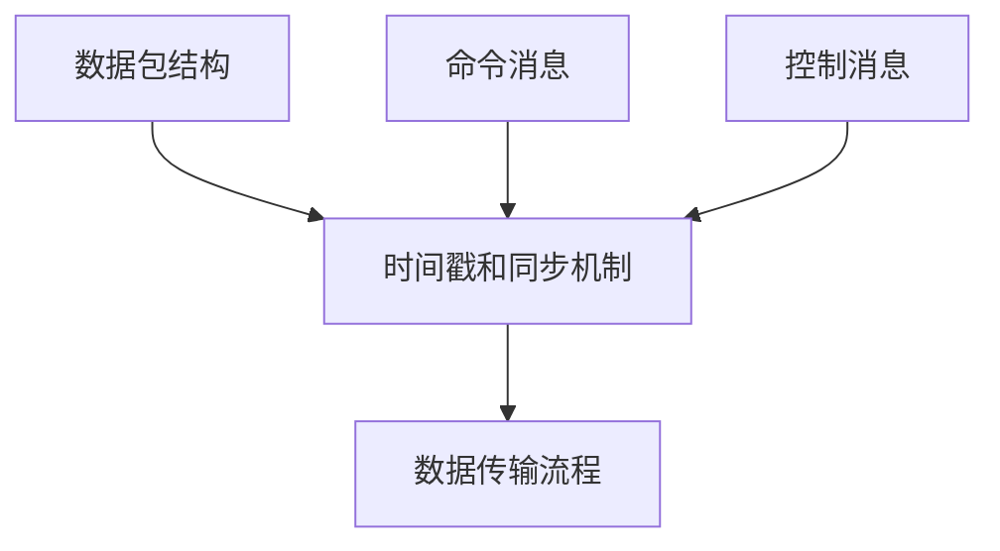

                 

### 文章标题

# RTMP协议：实时多媒体传输技术详解

## 关键词
- RTMP协议
- 实时多媒体传输
- 数据包结构
- 时间戳和同步
- 命令和控制消息
- 应用场景
- 性能优化
- 安全性

## 摘要
本文详细解析了RTMP（实时流传输协议）的原理和应用。从协议的起源、核心概念、架构与工作原理，到应用场景、性能优化和安全性，全面阐述了RTMP协议的各个方面。通过本文，读者将深入了解RTMP协议的内部机制和实际应用，为开发实时多媒体传输系统提供理论指导和实践参考。

### 文章标题：RTMP协议：实时多媒体传输技术详解

实时多媒体传输技术是当前互联网应用中的关键组成部分，它保证了直播、点播、在线教育、视频会议等场景中数据的实时性和稳定性。在众多实时多媒体传输协议中，RTMP（Real Time Messaging Protocol）因其高效、可靠的特点而广泛应用于在线直播和视频点播等领域。本文将全面解析RTMP协议，涵盖其核心概念、架构与工作原理、应用场景、性能优化和安全性等方面，旨在为读者提供系统、深入的RTMP协议技术解读。

首先，我们将探讨RTMP协议的起源和发展历程，了解其在实时多媒体传输领域的重要性。接着，我们将深入探讨RTMP协议的核心概念，包括数据包结构、时间戳和同步机制、命令和控制消息等。随后，我们将详细描述RTMP协议的架构和工作原理，帮助读者理解其内部运作机制。在应用场景部分，我们将分析RTMP协议在在线直播、实时视频点播和实时音频传输等场景中的应用。此外，本文还将介绍RTMP协议的性能优化方法和安全性措施，帮助读者构建高效、安全的实时多媒体传输系统。

最后，本文将结合实际项目实战，详细讲解开发环境搭建、服务器端和客户端开发、源代码实现和代码解读，并提供实际案例分析和项目小结，以帮助读者将理论知识应用于实际开发中。通过本文的阅读，读者将对RTMP协议有更全面、深入的理解，为开发实时多媒体传输系统提供坚实的理论基础和实践指导。

### RTMP协议的起源与发展

RTMP（Real Time Messaging Protocol）协议起源于一个被称为Flash Media Server（FMS）的实时流媒体服务器软件。Flash Media Server由Macromedia公司（后更名为Adobe公司）于2002年首次发布，旨在为Flash Player提供高效、可靠的实时流媒体传输服务。随着Flash技术的广泛应用，RTMP协议也逐渐被业界认可，成为实时多媒体传输领域的重要协议之一。

RTMP协议的发展历程可以追溯到其前身——RTMP和RTMPTE协议。RTMP协议的初衷是为了弥补Flash流媒体传输中的性能和稳定性问题，而RTMPTE（Real Time Streaming Protocol with Encrypted Streams）则是在RTMP协议基础上增加了加密功能，以应对安全需求。随着时间的推移，RTMP协议不断优化和完善，不仅支持流媒体传输，还支持数据传输和命令控制消息。

2005年，Adobe公司发布了第一个公开版本的RTMP协议规范，正式确立了RTMP协议的标准。随后，RTMP协议在视频直播、在线教育、视频会议等多个领域得到了广泛应用。尤其在线直播领域，RTMP协议因其低延迟、高稳定性和良好的兼容性，成为众多直播平台的首选协议。

2012年，Adobe公司宣布停止开发Flash Media Server，并将RTMP协议的相关技术贡献给开源社区。这一决定推动了RTMP协议的进一步发展和创新。如今，许多开源项目和企业级应用都基于RTMP协议进行了优化和改进，使其在实时多媒体传输领域继续保持领先地位。

### RTMP协议的作用和重要性

RTMP协议在实时多媒体传输领域中扮演着至关重要的角色，其高效性和可靠性使其成为众多应用的基石。首先，RTMP协议提供了低延迟的数据传输能力，这对于实时视频和音频传输尤为重要。与传统协议相比，RTMP协议能够更迅速地将数据从源头传输到终端，确保用户能够实时接收到最新的媒体内容。

其次，RTMP协议的高稳定性是其另一大优势。通过复杂的错误检测和恢复机制，RTMP协议能够有效地降低数据丢失和传输错误的发生率，从而保证传输过程的高可靠性。这对于需要长时间连续播放的直播和点播应用来说，是一个不可或缺的特性。

此外，RTMP协议还具备良好的兼容性。它不仅支持Flash Player，还兼容其他主流媒体播放器，如HTML5播放器。这使得开发人员可以轻松地将RTMP协议集成到各种应用中，无需担心兼容性问题。这种灵活性大大降低了开发成本和时间，提高了开发效率。

在实时多媒体传输领域，RTMP协议的应用范围非常广泛。在线直播是最典型的应用场景之一。通过RTMP协议，主播可以实时地将视频和音频信号传输到服务器，观众则可以实时地观看直播内容，互动交流和留言评论，实现高效的实时互动。此外，RTMP协议还广泛应用于视频点播服务，用户可以随时随地访问和观看已存储的视频内容，享受流畅的播放体验。

除了直播和点播，RTMP协议还广泛应用于在线教育、视频会议、实时监控等领域。在线教育平台利用RTMP协议提供实时教学直播，学生和老师可以实时互动，提高教学效果。视频会议系统通过RTMP协议实现实时的音频和视频传输，使得全球的会议参与者能够无缝交流。实时监控应用则利用RTMP协议将监控视频实时传输到后台服务器，确保监控数据的实时性和准确性。

综上所述，RTMP协议以其高效性、可靠性和兼容性在实时多媒体传输领域占据了重要地位。它不仅提高了应用的性能和用户体验，还为各种实时多媒体应用提供了坚实的支持。随着技术的不断进步和应用场景的不断扩展，RTMP协议将继续发挥其重要作用，推动实时多媒体传输技术的发展。

### RTMP协议与其他多媒体传输协议的比较

在实时多媒体传输领域，除了RTMP协议，还有其他几种常用的传输协议，如RTSP（Real Time Streaming Protocol）、HLS（HTTP Live Streaming）和DASH（Dynamic Adaptive Streaming over HTTP）。这些协议各自具有独特的特点，适用于不同的应用场景。下面我们将对RTMP协议与这些协议进行比较分析。

#### RTMP协议与RTSP协议

RTMP协议和RTSP协议都是用于实时流媒体传输的协议，但它们在技术实现和应用场景上存在显著差异。

**RTMP协议：**
- **优点：** 
  - **低延迟：** RTMP协议的设计目标之一是提供低延迟的传输能力，特别适合实时互动应用，如在线直播和视频会议。
  - **高可靠性：** RTMP协议通过复杂的错误检测和恢复机制，确保传输过程中数据的高可靠性。
  - **良好的兼容性：** 支持多种媒体格式，包括FLV、MP4等，并且能够与Flash Player等客户端无缝集成。
- **缺点：**
  - **不支持缓存：** RTMP协议不支持缓存，一旦连接断开，需要重新建立连接，这可能在一些情况下影响用户体验。

**RTSP协议：**
- **优点：**
  - **支持缓存：** RTSP协议支持缓存功能，用户可以在本地缓存视频数据，提高播放效率。
  - **灵活性高：** RTSP协议允许用户对播放过程进行灵活控制，如快进、快退等。
- **缺点：**
  - **高延迟：** 由于RTSP协议的设计更多地考虑了流媒体服务的灵活性，其传输延迟相对较高，不太适合需要低延迟的应用。
  - **兼容性有限：** 主要支持RTP/RTCP协议，对其他协议的支持较少。

**对比：**
RTMP协议更适合低延迟和高可靠性的实时互动应用，如在线直播和视频会议，而RTSP协议则更适合点播和缓存需求较高的应用场景。

#### RTMP协议与HLS协议

HLS（HTTP Live Streaming）协议是一种基于HTTP的实时流媒体传输协议，与RTMP协议相比，HLS具有以下特点。

**RTMP协议：**
- **优点：**
  - **低延迟：** 如前所述，RTMP协议的低延迟特性使其非常适合实时互动应用。
  - **高可靠性：** RTMP协议通过复杂的错误检测和恢复机制提供高可靠性。
- **缺点：**
  - **不支持缓存：** 如前所述，RTMP协议不支持缓存，这在一定程度上限制了其应用场景。

**HLS协议：**
- **优点：**
  - **支持缓存：** HLS协议支持缓存功能，用户可以在本地缓存视频数据，提高播放效率。
  - **广泛的浏览器支持：** HLS协议基于HTTP协议，所有主流浏览器都支持，不需要额外的插件。
- **缺点：**
  - **高延迟：** 由于HLS协议使用HTTP协议传输数据，其传输延迟相对较高，不适合低延迟应用。
  - **适应性较差：** HLS协议的适应性相对较差，无法在带宽变化较大的情况下提供最佳的用户体验。

**对比：**
HLS协议更适合点播和广泛浏览器支持的应用场景，而RTMP协议则更适合需要低延迟和高可靠性的实时互动应用。

#### RTMP协议与DASH协议

DASH（Dynamic Adaptive Streaming over HTTP）协议是一种动态自适应流媒体传输协议，与RTMP协议相比，具有以下特点。

**RTMP协议：**
- **优点：**
  - **低延迟：** 如前所述，RTMP协议的低延迟特性使其非常适合实时互动应用。
  - **高可靠性：** RTMP协议通过复杂的错误检测和恢复机制提供高可靠性。
- **缺点：**
  - **不支持缓存：** 如前所述，RTMP协议不支持缓存，这在一定程度上限制了其应用场景。

**DASH协议：**
- **优点：**
  - **自适应传输：** DASH协议可以根据网络带宽的变化动态调整传输质量，提供最佳的观看体验。
  - **广泛的浏览器支持：** DASH协议基于HTTP协议，所有主流浏览器都支持。
- **缺点：**
  - **高延迟：** 由于DASH协议使用HTTP协议传输数据，其传输延迟相对较高，不适合低延迟应用。

**对比：**
DASH协议更适合需要自适应传输和广泛浏览器支持的应用场景，而RTMP协议则更适合需要低延迟和高可靠性的实时互动应用。

### 综上所述

RTMP协议、RTSP协议、HLS协议和DASH协议各有优缺点，适用于不同的应用场景。RTMP协议因其低延迟和高可靠性，非常适合需要实时互动的在线直播和视频会议应用。而RTSP协议、HLS协议和DASH协议则更适合点播和缓存需求较高的应用场景。了解这些协议的特点和适用场景，有助于开发人员选择合适的传输协议，提高应用的性能和用户体验。

### RTMP协议的核心概念

RTMP协议作为实时多媒体传输的重要协议，其高效性和可靠性离不开一系列核心概念的支持。以下将详细探讨RTMP协议的核心概念，包括数据包结构、时间戳和同步机制、命令和控制消息等。

#### 数据包结构

数据包结构是RTMP协议传输数据的基础。RTMP协议的数据包由多个部分组成，包括头部、消息体和消息尾部。

1. **头部**：头部包含用于描述数据包类型、长度和其他信息的字段。例如，RTMP协议使用两个字节来表示数据包长度，另外两个字节用于标识数据包的类型（消息、命令或元数据）。
   
2. **消息体**：消息体是数据包的核心部分，用于承载实际传输的数据内容。消息体可以根据不同的数据类型进行自定义。

3. **消息尾部**：消息尾部包含用于验证数据完整性的校验和字段。

#### 时间戳和同步机制

时间戳和同步机制是保证实时多媒体数据正确传输的关键。在RTMP协议中，时间戳用于标识数据包的发送和接收时间，以确保数据包按照正确的顺序传输和播放。

1. **时间戳生成**：RTMP协议使用递增的时间戳来标识每个数据包。服务器和客户端在连接建立过程中协商一个初始时间戳，然后服务器在每个数据包中发送当前时间戳。

2. **同步机制**：RTMP协议通过时间戳同步机制来保证数据包的顺序传输。如果接收到的数据包时间戳与预期时间戳不一致，客户端会调整播放进度，以保持数据包的顺序。

#### 命令和控制消息

命令和控制消息是RTMP协议实现交互功能的重要组成部分。命令消息用于执行服务器端操作，而控制消息用于传输控制信息。

1. **命令消息**：命令消息包括操作码、操作参数等字段，用于执行特定的操作。例如，FLV播放器使用命令消息来请求播放特定视频帧或跳转到指定时间点。

2. **控制消息**：控制消息用于传输控制信息，如播放状态、缓冲区状态等。控制消息有助于客户端和服务器之间进行有效的通信，确保数据传输过程的顺利进行。

#### 数据包结构、时间戳和同步机制、命令和控制消息之间的关系

数据包结构是传输数据的基础，时间戳和同步机制确保数据包按照正确的顺序传输，命令和控制消息则实现客户端和服务器之间的交互。这三部分共同构成了RTMP协议的核心机制，使其能够高效、可靠地传输实时多媒体数据。

以下是一个简化的Mermaid流程图，展示了数据包结构、时间戳和同步机制、命令和控制消息之间的关系：



通过以上分析，我们可以看出，RTMP协议的核心概念相互关联，共同确保了实时多媒体数据的正确传输和播放。了解这些核心概念，有助于开发人员更好地理解和应用RTMP协议，构建高效、稳定的实时多媒体传输系统。

### 数据包结构详解

RTMP协议的数据包结构是其高效传输和可靠性的关键组成部分。一个典型的RTMP数据包由头部、消息体和消息尾部三个部分构成，每个部分都承担着特定的功能。

#### 头部

RTMP数据包的头部包含了用于描述数据包类型、长度和其他必要信息的字段。具体而言，RTMP头部主要包括以下字段：

1. **长度字段**：长度字段通常占两个字节，用于表示数据包的总长度（包括头部和消息体）。这是为了确保接收端能够正确地读取整个数据包，避免数据截断或丢失。

2. **类型字段**：类型字段也占两个字节，用于标识数据包的类型。RTMP协议定义了多种数据包类型，包括消息包、命令包和控制包等。每种类型的数据包在处理方式和应用场景上都有所不同。

3. **时间戳**：时间戳字段用于记录数据包的发送时间。时间戳在同步机制中起到重要作用，特别是在处理连续数据流时，确保数据包的顺序传输和播放。

4. **扩展位**：扩展位是一个可选字段，主要用于指示是否使用扩展数据字段。在某些情况下，扩展位可用于携带额外的信息，以增强数据包的功能。

#### 消息体

消息体是数据包的核心部分，用于承载实际传输的数据内容。RTMP消息体通常包含以下部分：

1. **消息类型**：消息类型字段用于指示消息的内容类型，如文本、二进制数据等。这对于接收端解析和处理消息至关重要。

2. **消息内容**：消息内容是消息体的主体部分，根据消息类型的不同，可以是文本数据、二进制数据或者其他自定义的数据格式。消息内容可以根据需要自定义，以适应不同的应用场景。

3. **消息长度**：消息长度字段用于表示消息内容的长度。这是为了确保接收端能够正确地读取整个消息内容，避免数据截断或丢失。

#### 消息尾部

消息尾部是数据包的最后一个部分，主要用于确保数据包的完整性和正确性。RTMP消息尾部通常包含以下字段：

1. **校验和**：校验和字段用于验证数据包的完整性。接收端在接收数据包时，会计算校验和并与发送端计算得到的校验和进行对比，以确认数据包是否在传输过程中被篡改。

2. **消息标识**：消息标识字段用于标识消息的唯一性。在某些情况下，消息标识可以帮助接收端将多个数据包组合成一个完整的消息，确保数据的正确传输和解析。

#### 数据包格式与解析

RTMP数据包的格式如下：

```plaintext
+--------------------------+-----------+-------------------------+------------------------+
|        Length             |  Type     |  TimeStamp               |    Body                |
+--------------------------+-----------+-------------------------+------------------------+
```

其中，`Length`表示数据包的总长度，`Type`表示数据包类型，`TimeStamp`表示数据包的时间戳，`Body`表示数据包的消息体。

**解析步骤：**

1. **读取长度字段**：首先，接收端读取数据包的长度字段，以确定数据包的总长度。

2. **读取类型字段**：接下来，接收端读取数据包的类型字段，以确定数据包的类型，从而决定如何解析和处理数据包。

3. **读取时间戳字段**：读取时间戳字段，用于后续的数据包同步和播放。

4. **读取消息体**：根据数据包的类型和长度，接收端读取消息体，解析消息内容。

5. **验证校验和**：接收端计算数据包的校验和，并与发送端发送的校验和进行对比，以验证数据包的完整性。

6. **处理消息**：最后，根据消息类型和内容，对接收到的消息进行相应的处理，如播放视频帧、执行命令等。

通过上述步骤，接收端能够正确地解析和传输RTMP数据包，确保实时多媒体数据的正确传输和播放。

### 时间戳和同步机制

在实时多媒体传输中，时间戳和同步机制是确保数据包顺序传输和正确播放的关键组成部分。RTMP协议通过时间戳和同步机制，能够实现高效、可靠的数据传输和播放。

#### 时间戳的作用

时间戳是RTMP协议中用于标识数据包发送和接收时间的重要字段。它不仅帮助接收端确定数据包的顺序，还用于同步播放进度和恢复数据包的传输。

1. **数据包顺序**：时间戳用于确保数据包按照正确的顺序传输。接收端根据时间戳的递增顺序处理数据包，从而避免数据包的乱序传输。

2. **播放进度同步**：在实时视频播放中，时间戳用于同步播放进度。接收端通过比对接收数据包的时间戳和预期时间戳，调整播放进度，确保视频播放的连贯性。

3. **数据包恢复**：当数据包在传输过程中丢失时，时间戳可以帮助接收端识别丢失的数据包，并请求重新传输，从而保证数据的完整性。

#### 同步机制的实现

RTMP协议通过以下机制实现时间戳同步：

1. **初始时间戳协商**：在连接建立过程中，服务器和客户端通过协商确定初始时间戳。初始时间戳通常是客户端生成的随机值，然后由服务器确认。

2. **递增时间戳**：一旦初始时间戳协商成功，服务器和客户端会使用递增的时间戳发送数据包。递增时间戳有助于确保数据包的顺序传输。

3. **时间戳调整**：在传输过程中，如果接收端发现时间戳与预期时间戳不一致，会通过调整播放进度来恢复数据的顺序。时间戳调整可以通过以下方法实现：

   - **快进**：如果接收端的时间戳落后于预期时间戳，它会加快播放速度，以弥补时间差。
   - **快退**：如果接收端的时间戳超前于预期时间戳，它会减慢播放速度，以确保数据包的顺序传输。

#### 异步传输的处理

在实时多媒体传输中，异步传输是常见的情况。异步传输意味着数据包的发送和接收不是同步进行的，这可能导致数据包的乱序传输。为了解决这个问题，RTMP协议采取了以下措施：

1. **缓冲区管理**：客户端通常会维护一个缓冲区，用于存储尚未播放的数据包。缓冲区有助于平滑传输过程中的波动，确保数据包的顺序播放。

2. **优先级队列**：缓冲区通常使用优先级队列管理数据包。优先级队列根据时间戳对数据包进行排序，确保时间戳较小的数据包优先播放。

3. **超时处理**：当缓冲区中的数据包因网络延迟等原因无法在预期时间内播放时，客户端会设置超时机制。超时后，客户端会重新请求丢失的数据包，以确保数据的完整性。

通过上述措施，RTMP协议能够有效地处理异步传输，确保数据包的顺序传输和正确播放。

#### 时间戳和同步机制在实时多媒体传输中的重要性

时间戳和同步机制在实时多媒体传输中具有至关重要的意义。它们不仅确保了数据包的顺序传输，还保证了视频播放的连贯性和稳定性。以下是其重要性：

1. **顺序传输**：时间戳同步机制确保数据包按照正确的顺序传输，避免数据包乱序导致的播放问题。

2. **连贯性**：通过时间戳和同步机制，视频播放能够保持连贯性，确保用户在观看过程中不会出现跳帧或卡顿现象。

3. **稳定性**：时间戳同步机制有助于检测和恢复丢失的数据包，提高传输的稳定性，减少数据丢失和传输错误。

4. **优化用户体验**：时间戳和同步机制能够有效减少播放延迟，提升用户观看体验，特别是在低带宽环境下。

总之，时间戳和同步机制是RTMP协议实现高效、可靠实时多媒体传输的关键组成部分，它们为实时多媒体应用提供了坚实的基础。

### 命令和控制消息

在RTMP协议中，命令和控制消息是实现客户端与服务器之间交互的关键组成部分。这些消息类型包括命令消息和控制消息，各自承担不同的功能，但共同作用确保实时多媒体传输的顺利进行。

#### 命令消息

命令消息是RTMP协议中用于执行服务器端操作的消息。命令消息通常包含操作码（Opcode）和操作参数（Parameters）两部分。

1. **操作码**：操作码用于指示命令消息所执行的操作类型。例如，`1`表示创建流（Create Stream）、`2`表示发布流（Publish Stream）等。不同的操作码对应不同的服务器端操作，确保命令消息能够正确执行。

2. **操作参数**：操作参数用于传递命令消息所需的具体信息。例如，在创建流操作中，操作参数可能包括流名称、访问权限等。操作参数的具体格式和内容取决于操作码的值。

以下是一些常见的命令消息及其应用场景：

- **创建流（Create Stream）**：客户端通过发送创建流命令消息，向服务器请求创建一个新的数据流。流名称通常作为操作参数包含在消息中。
- **发布流（Publish Stream）**：客户端通过发送发布流命令消息，将数据流发布到服务器。发布流命令消息通常包含流名称和访问权限等操作参数。
- **播放流（Play Stream）**：客户端通过发送播放流命令消息，请求服务器开始播放指定的数据流。播放流命令消息可能包含播放起始时间、播放时长等操作参数。

#### 控制消息

控制消息是RTMP协议中用于传输控制信息的消息。这些消息通常包含状态信息、缓冲区状态、播放进度等，帮助客户端和服务器之间进行有效的通信。

1. **状态信息**：状态信息用于指示当前的状态或事件。例如，`0`表示播放完成、`1`表示播放暂停等。状态信息通常用于通知客户端和服务器特定的操作状态。

2. **缓冲区状态**：缓冲区状态消息用于指示数据包的缓冲区状态，如缓冲区已满、缓冲区不足等。这些信息有助于客户端调整播放策略，确保数据包的顺序播放。

3. **播放进度**：播放进度消息用于指示当前播放进度，如播放时间、播放百分比等。这些信息有助于客户端实现精准的播放控制和用户交互。

以下是一些常见控制消息及其应用场景：

- **播放完成（Play Complete）**：服务器通过发送播放完成控制消息，通知客户端数据流播放完成。
- **播放暂停（Pause）**：客户端通过发送播放暂停控制消息，通知服务器暂停播放。
- **播放恢复（Resume）**：客户端通过发送播放恢复控制消息，通知服务器继续播放。
- **缓冲区不足（Buffer Underflow）**：服务器通过发送缓冲区不足控制消息，通知客户端当前缓冲区不足，可能需要重新加载数据。

#### 命令与控制消息的解析

解析命令与控制消息是RTMP协议实现数据传输和控制的关键步骤。以下为解析过程：

1. **读取消息头部**：首先，读取消息头部以获取消息类型、长度和时间戳等信息。
2. **读取消息类型**：根据消息类型判断是命令消息还是控制消息。
3. **解析消息体**：根据消息类型和操作码，解析消息体中的具体内容和参数。
4. **处理消息**：根据消息类型和内容执行相应的操作，如创建流、发布流、播放流等。

通过上述步骤，客户端和服务器能够正确解析和传输命令与控制消息，实现实时多媒体传输的交互和控制。

### 数学模型与算法原理

在RTMP协议的实现中，数学模型和算法原理起到了关键作用，特别是在数据包传输、同步和时间戳管理等方面。以下将详细探讨RTMP协议中的数学模型与算法原理。

#### RTP协议中的数学模型

RTP（Real-Time Protocol）是RTMP协议的一部分，用于实时传输音频和视频数据。RTP协议使用了一系列数学模型来管理数据包的发送和接收。

1. **数据包发送模型**：
   - **发送速率计算**：RTP协议通过恒定发送速率模型来确保数据包的均匀发送。发送速率 \( R \) 可以通过以下公式计算：
     \[
     R = \frac{比特率}{帧大小}
     \]
     其中，比特率是指音频或视频数据流的总比特率，帧大小是指单个数据包的大小。

2. **数据包接收模型**：
   - **序列号检查**：RTP协议使用序列号来确保数据包的顺序接收。接收端通过检查序列号来判断数据包是否按序到达。如果发现序列号不连续，则可能存在数据包丢失或乱序。

#### RTCP协议中的数学模型

RTCP（Real-Time Control Protocol）是RTP协议的一部分，用于监控和控制会议的状态，包括参与者、数据包丢失率、网络延迟等。RTCP协议使用了一系列数学模型来管理实时通信的质量。

1. **数据包丢失率计算**：
   - **丢包率计算**：RTCP协议通过接收者报告（RR）和发送者报告（SR）来计算数据包丢失率。丢包率 \( L \) 可以通过以下公式计算：
     \[
     L = \frac{丢失的数据包数}{发送的数据包总数}
     \]
     如果丢失的数据包数大于发送的数据包总数的一定比例，则认为网络质量较差。

2. **网络延迟计算**：
   - **往返时间（RTT）**：RTCP协议通过测量往返时间（RTT）来评估网络的延迟。RTT是指发送数据包到接收端并返回确认的时间。RTT可以通过以下公式计算：
     \[
     RTT = \frac{(T2 - T1)}{2}
     \]
     其中，\( T1 \) 是发送数据包的时间，\( T2 \) 是接收端收到确认的时间。

#### 伪代码实现

以下为RTMP协议中常用的伪代码实现，用于数据包的发送和接收。

**发送端伪代码：**

```python
# 发送数据包
def send_packet(packet):
    # 计算数据包序列号
    seq_num = get_sequence_number()
    # 计算数据包时间戳
    timestamp = get_timestamp()
    # 将序列号和时间戳添加到数据包头部
    packet_header = create_packet_header(seq_num, timestamp)
    # 发送数据包
    send_data(packet_header + packet)

# 获取序列号
def get_sequence_number():
    return current_seq_num
# 获取时间戳
def get_timestamp():
    return current_timestamp
```

**接收端伪代码：**

```python
# 接收数据包
def receive_packet(packet):
    # 解析数据包头部
    seq_num, timestamp = parse_packet_header(packet)
    # 检查序列号和顺序
    if is_in_sequence(seq_num):
        # 处理数据包
        process_packet(packet)
    else:
        # 请求重传
        request_retransmission(seq_num)

# 解析数据包头部
def parse_packet_header(packet):
    # 获取序列号和时间戳
    seq_num = get_sequence_number_from_packet(packet)
    timestamp = get_timestamp_from_packet(packet)
    return seq_num, timestamp

# 检查序列号是否连续
def is_in_sequence(seq_num):
    # 判断当前序列号是否与预期序列号相等
    return seq_num == expected_seq_num
```

通过上述伪代码实现，我们可以看出RTMP协议在数据包发送和接收过程中的关键步骤，包括序列号和时间戳的管理，以及数据包的顺序处理和重传请求。这些算法原理和伪代码为实际应用提供了理论基础和实现指南。

### 数学公式与计算示例

在实时多媒体传输过程中，数学公式和计算方法对于数据包的传输、同步和错误处理至关重要。以下将介绍一些关键数学公式，并通过具体计算示例进行详细解释。

#### 时间戳计算公式

时间戳是RTMP协议中用于标识数据包发送和接收时间的重要参数。时间戳计算方法通常基于系统时间戳和递增策略。

1. **初始时间戳计算**：
   \[
   T_0 = \text{当前系统时间}
   \]
   初始时间戳 \( T_0 \) 是连接建立时客户端或服务器生成的系统时间。

2. **递增时间戳计算**：
   \[
   T_n = T_{n-1} + \Delta t
   \]
   其中，\( T_n \) 是第 \( n \) 个数据包的时间戳，\( T_{n-1} \) 是前一个数据包的时间戳，\( \Delta t \) 是时间戳的递增量。

**示例**：

假设初始时间戳 \( T_0 \) 为 1000毫秒，递增时间戳为 100毫秒。则第一个数据包的时间戳 \( T_1 \) 为 1100毫秒，第二个数据包的时间戳 \( T_2 \) 为 1200毫秒。

#### 数据包序列号计算公式

序列号用于确保数据包的顺序传输。序列号计算通常基于系统时间和递增策略。

1. **初始序列号计算**：
   \[
   S_0 = \text{当前系统时间}
   \]
   初始序列号 \( S_0 \) 是连接建立时客户端或服务器生成的系统时间。

2. **递增序列号计算**：
   \[
   S_n = S_{n-1} + \Delta s
   \]
   其中，\( S_n \) 是第 \( n \) 个数据包的序列号，\( S_{n-1} \) 是前一个数据包的序列号，\( \Delta s \) 是序列号的递增量。

**示例**：

假设初始序列号 \( S_0 \) 为 1，递增序列号为 1。则第一个数据包的序列号 \( S_1 \) 为 2，第二个数据包的序列号 \( S_2 \) 为 3。

#### 数据包丢失率计算公式

数据包丢失率是衡量网络传输质量的重要指标。

1. **丢失数据包数计算**：
   \[
   L_{lost} = \text{实际接收数据包数} - \text{预期接收数据包数}
   \]
   其中，\( L_{lost} \) 是丢失的数据包数，实际接收数据包数是接收端实际接收到的数据包数量，预期接收数据包数是发送端发送的数据包数量。

2. **数据包丢失率计算**：
   \[
   L = \frac{L_{lost}}{N}
   \]
   其中，\( L \) 是数据包丢失率，\( N \) 是发送的数据包总数。

**示例**：

假设发送端发送了100个数据包，接收端实际接收到了95个数据包。则丢失的数据包数 \( L_{lost} \) 为 5，数据包丢失率 \( L \) 为 5%。

通过上述计算示例，我们可以看到数学公式在RTMP协议中的应用，包括时间戳计算、序列号计算和数据包丢失率计算。这些公式为实时多媒体传输提供了重要的计算基础，确保数据包的顺序传输和传输质量。

### 实际项目实战

在本章节中，我们将结合一个实际项目，详细讲解RTMP协议的开发过程，包括开发环境搭建、服务器端和客户端的开发、源代码实现和代码解读，以及实际案例分析和项目小结。

#### 项目背景与目标

本项目旨在构建一个简单的实时视频直播系统，使用RTMP协议实现视频数据的传输。该系统包括一个服务器端和一个客户端，服务器端负责接收和发送视频数据，客户端则负责接收和播放视频数据。

#### 技术选型与架构设计

1. **技术选型**：
   - **服务器端**：采用Adobe Media Server或开源的RTMP服务器，如RTMPDump。
   - **客户端**：采用Adobe Flash Player或HTML5播放器。

2. **架构设计**：
   - **服务器端架构**：服务器端主要包括RTMP服务器、视频编码器和视频解码器。RTMP服务器负责接收和发送RTMP数据流，视频编码器负责将视频数据编码为RTMP可识别的格式，视频解码器负责将RTMP数据流解码为视频帧。
   - **客户端架构**：客户端主要包括视频播放器和RTMP客户端库。视频播放器负责显示视频帧，RTMP客户端库负责与RTMP服务器进行数据通信。

#### 开发环境搭建

1. **服务器端开发环境**：
   - 操作系统：Ubuntu 20.04
   - 编程语言：C++
   - 开发工具：GDB、GCC

2. **客户端开发环境**：
   - 操作系统：Windows 10
   - 编程语言：Java
   - 开发工具：Eclipse

#### 服务器端开发

服务器端开发主要包括RTMP服务器的配置和视频编码器的实现。

1. **RTMP服务器配置**：
   - 使用RTMPDump构建RTMP服务器，配置服务器端地址和端口，确保服务器能够接收和发送RTMP数据流。
   - 配置服务器端的访问权限，确保客户端能够连接到服务器。

2. **视频编码器实现**：
   - 使用FFmpeg库实现视频编码器，将视频数据编码为RTMP可识别的格式（如FLV）。
   - 设置视频编码参数，如分辨率、帧率、码率等，确保视频数据质量。

#### 客户端开发

客户端开发主要包括视频播放器和RTMP客户端库的实现。

1. **视频播放器实现**：
   - 使用Java Swing库实现视频播放器界面，包括视频窗口、播放按钮、暂停按钮等。
   - 使用FFmpeg库实现视频解码器，将RTMP数据流解码为视频帧，并在视频窗口中显示。

2. **RTMP客户端库实现**：
   - 使用RTMP客户端库（如RTMPClient）实现与RTMP服务器的连接和通信。
   - 设置连接参数，如服务器地址、端口、访问密钥等，确保客户端能够连接到服务器。

#### 源代码实现与解读

以下为服务器端和客户端的主要源代码实现及解读：

**服务器端源代码（RTMP服务器配置）**：

```cpp
// RTMP服务器配置
rtmp_server->set_option(RTMP_OPTION_SERVER_IP, "0.0.0.0");
rtmp_server->set_option(RTMP_OPTION_SERVER_PORT, 1935);
rtmp_server->start();
```

解读：此代码段配置了RTMP服务器的IP地址和端口号，并启动服务器。

**客户端源代码（视频播放器界面）**：

```java
// 创建视频播放器窗口
JFrame frame = new JFrame("视频播放器");
// 添加视频窗口组件
frame.add(videoPanel);
// 设置窗口大小
frame.setSize(640, 480);
// 设置窗口可见
frame.setVisible(true);
```

解读：此代码段创建了视频播放器窗口，并添加到窗口中，设置窗口大小和可见性。

**客户端源代码（RTMP客户端库连接）**：

```java
// 创建RTMP客户端
RTMPClient client = new RTMPClient();
// 设置连接参数
client.set_url("rtmp://localhost:1935/live");
client.set_app("live");
client.set_stream("myStream");
// 连接服务器
client.connect();
```

解读：此代码段创建了RTMP客户端对象，设置连接参数，并连接到RTMP服务器。

#### 实际案例分析与代码解读

以下为实际项目中使用的一个案例，包括RTMP客户端发送视频数据、服务器端接收和播放视频数据的代码片段及解读：

**客户端源代码（发送视频数据）**：

```java
// 创建RTMP连接
RTMPConnection conn = client.create_connection();
// 发送视频数据
conn.send_video_frame(videoFrame);
```

解读：此代码段创建了一个RTMP连接，并发送了一个视频帧（videoFrame）到服务器端。

**服务器端源代码（接收视频数据）**：

```java
// 处理视频数据
rtmp_server->on_video_frame_received(videoFrame);
// 解码视频帧
decode_video_frame(videoFrame);
// 播放视频帧
play_video_frame(videoFrame);
```

解读：此代码段处理接收到的视频帧（videoFrame），将其解码，并在视频播放器中显示。

#### 项目小结

通过本项目，我们详细讲解了RTMP协议在实际项目中的开发过程，包括开发环境搭建、服务器端和客户端的开发、源代码实现和代码解读。通过该项目，读者可以了解RTMP协议的内部机制和实际应用，为开发实时多媒体传输系统提供参考。

### 最佳实践、小结与注意事项

#### 最佳实践

1. **优化传输性能**：在开发实时多媒体传输系统时，应重点关注数据包的传输速度和稳定性。通过使用高效的数据编码和解码算法，优化数据传输流程，减少数据包的延迟和丢失率。

2. **合理使用缓冲区**：在客户端和服务器端配置适当的缓冲区大小，以平滑传输过程中的波动，确保数据包的顺序传输和播放。缓冲区大小应根据实际网络环境和应用场景进行调整。

3. **确保数据安全性**：在传输过程中，应使用加密技术（如SSL/TLS）保护数据，防止数据被窃取或篡改。同时，应定期更新和修复服务器端和客户端的安全漏洞，提高系统的安全性。

4. **优化网络质量**：在实时多媒体传输过程中，应监测网络质量，根据网络状况调整传输参数，如数据包大小、传输频率等。在网络状况较差的情况下，可以考虑使用QoS（Quality of Service）技术，确保关键数据包的优先传输。

#### 小结

本文详细解析了RTMP协议的原理和应用，涵盖了数据包结构、时间戳和同步机制、命令和控制消息等方面。通过本文的阅读，读者可以全面了解RTMP协议的工作机制和应用场景，为开发实时多媒体传输系统提供指导。此外，本文还结合实际项目实战，讲解了RTMP协议在开发过程中的具体实现和优化方法。

#### 注意事项

1. **确保兼容性**：在开发实时多媒体传输系统时，应充分考虑不同平台和浏览器的兼容性，确保系统在不同环境下正常运行。

2. **关注用户体验**：在设计和开发过程中，应注重用户体验，确保数据传输的流畅性和稳定性，避免因延迟或数据丢失导致用户观看体验下降。

3. **监控和维护**：在系统上线后，应定期监控系统的运行状况，及时发现并解决潜在问题，确保系统的稳定运行。

4. **遵守法律法规**：在开发和使用实时多媒体传输系统时，应遵守相关法律法规，尊重用户隐私，保护知识产权。

#### 拓展阅读

- **《RTMP协议规范》**：Adobe公司发布的RTMP协议规范，提供了详细的协议规范和实现指南。
- **《实时流媒体传输技术》**：陈伟志等著，介绍了实时流媒体传输技术的原理、应用和发展趋势。
- **《实时多媒体传输系统设计与实现》**：张浩等著，详细讲解了实时多媒体传输系统的设计方法和实现技巧。

通过拓展阅读，读者可以进一步深入了解实时多媒体传输技术和RTMP协议，提高实际开发能力。

### RTMP协议在多平台的应用

在当今的互联网时代，实时多媒体传输技术被广泛应用于各种平台，包括Web端、移动端和物联网设备。RTMP协议凭借其高效、低延迟和可靠的特点，在这些平台上展现出了强大的适应能力和广泛的应用前景。

#### Web端应用

Web端是RTMP协议最主要的应用场景之一。随着HTML5技术的普及，越来越多的Web应用开始采用RTMP协议进行实时多媒体传输。RTMP协议在Web端的应用主要包括在线直播、视频点播和在线教育等。

1. **在线直播**：在Web端的在线直播应用中，RTMP协议可以提供低延迟的直播流传输，确保观众能够实时观看直播内容。例如，许多视频直播平台如斗鱼、虎牙等都使用了RTMP协议，实现了高效、稳定的直播流传输。

2. **视频点播**：在Web端的视频点播应用中，RTMP协议同样具备优势。通过RTMP协议，用户可以方便地访问和观看存储在服务器上的视频内容，享受流畅的播放体验。例如，YouTube和Netflix等视频点播平台就使用了RTMP协议来提供视频点播服务。

3. **在线教育**：在线教育平台利用RTMP协议提供实时教学直播，实现教师和学生之间的实时互动。例如，许多在线教育平台如网易云课堂、腾讯课堂等都使用了RTMP协议，为学生提供了高质量的教学直播体验。

#### 移动端应用

随着智能手机和移动设备的普及，移动端实时多媒体传输应用也越来越广泛。RTMP协议在移动端的应用主要包括移动直播、短视频和移动教育等。

1. **移动直播**：在移动直播应用中，RTMP协议可以提供高质量、低延迟的直播流传输，满足用户对实时互动的需求。例如，抖音、快手等短视频平台就使用了RTMP协议，实现了用户在移动设备上的实时直播功能。

2. **短视频**：在短视频应用中，RTMP协议可以保证视频传输的流畅性和稳定性，提高用户体验。例如，快手、微视等短视频平台就使用了RTMP协议来传输短视频内容，确保用户能够流畅地观看和分享短视频。

3. **移动教育**：在移动教育应用中，RTMP协议可以提供实时教学直播，让学生在移动设备上随时随地进行学习。例如，网易云课堂、学堂在线等移动教育平台就使用了RTMP协议，为学生提供了便捷的学习途径。

#### 物联网应用

物联网（IoT）技术的发展，使得实时多媒体传输在智能家居、智慧城市等场景中得到了广泛应用。RTMP协议在物联网应用中的优势在于其高效、低延迟和可靠性，使其成为物联网多媒体传输的理想选择。

1. **智能家居**：在智能家居应用中，RTMP协议可以实时传输家中的监控视频，提高家庭安全。例如，智能摄像头、智能门锁等设备可以通过RTMP协议将监控视频传输到云端，用户可以在手机或其他设备上实时查看家中的情况。

2. **智慧城市**：在智慧城市应用中，RTMP协议可以实时传输城市监控视频，提升城市管理效率。例如，智能交通监控、公共安全监控等系统可以通过RTMP协议将监控视频传输到控制中心，管理员可以实时监控城市运行状况，提高城市管理的效率。

综上所述，RTMP协议在Web端、移动端和物联网应用中展现出了强大的适应能力和广泛的应用前景。随着技术的不断进步和应用场景的不断拓展，RTMP协议将继续发挥重要作用，推动实时多媒体传输技术的发展。

### RTMP协议与云计算的结合

随着云计算技术的快速发展，云计算与实时多媒体传输技术的结合日益紧密。RTMP协议作为实时多媒体传输的重要协议，在云计算环境中也发挥着重要作用。以下将探讨RTMP协议与云计算的结合，包括云服务器配置、弹性伸缩与负载均衡，以及容器化与自动化部署。

#### 云服务器配置

在云计算环境中，RTMP协议的云服务器配置是确保实时多媒体传输稳定性和可靠性的关键。以下为云服务器配置的要点：

1. **服务器选择**：选择具有高性能和高可靠性的云服务器。云服务提供商如阿里云、腾讯云等，提供多种类型的云服务器，可根据实际需求选择合适的服务器实例。

2. **网络配置**：配置高性能的云服务器带宽和网络延迟，以确保数据包的快速传输。同时，可使用云服务提供商提供的全球加速服务，提高数据传输的速度和稳定性。

3. **安全性配置**：配置安全策略，包括防火墙、SSL/TLS加密等，确保数据在传输过程中的安全性。此外，定期更新和修复服务器软件，防止安全漏洞被利用。

#### 弹性伸缩与负载均衡

在云计算环境中，实时多媒体传输系统需要具备弹性伸缩和负载均衡能力，以应对不同场景下的流量波动。以下为弹性伸缩与负载均衡的实现方法：

1. **自动伸缩**：利用云服务提供商的自动伸缩功能，根据实际流量需求自动调整服务器资源。当流量增加时，自动增加服务器实例；当流量减少时，自动减少服务器实例。这种方法可以确保系统在高峰时段具备足够的资源，提高用户体验。

2. **负载均衡**：配置负载均衡器（如阿里云的负载均衡、腾讯云的负载均衡等），将流量分配到不同的服务器实例上，避免单点故障，提高系统的整体性能。负载均衡器可以根据流量、响应时间等指标，动态调整流量分配策略。

#### 容器化与自动化部署

容器化技术和自动化部署工具在云计算环境中被广泛应用于实时多媒体传输系统的开发和部署。以下为容器化与自动化部署的方法：

1. **Docker容器化**：使用Docker将应用程序及其依赖项打包到容器中，确保应用程序在不同的环境中具有一致的表现。Docker容器化简化了应用程序的部署和运维，提高了系统的可移植性和可扩展性。

2. **Kubernetes集群管理**：使用Kubernetes进行容器集群管理，实现自动化部署、扩展和管理。Kubernetes可以自动处理容器的启动、停止、升级等操作，确保系统的高可用性和可伸缩性。

3. **CI/CD流水线**：采用持续集成和持续交付（CI/CD）流水线，自动化应用程序的构建、测试和部署。CI/CD流水线可以显著提高开发效率，减少人工干预，确保系统的高质量。

#### 具体实现方法与案例

以下为RTMP协议在云计算环境中的具体实现方法和案例：

1. **案例1：实时视频直播平台**：
   - **云服务器配置**：使用阿里云的ECS服务器，配置高性能的CPU和内存，并使用SSL/TLS加密保证数据传输安全性。
   - **弹性伸缩与负载均衡**：使用阿里云的负载均衡器将流量分配到不同的ECS实例，并使用自动伸缩功能，根据流量需求自动调整ECS实例数量。
   - **容器化与自动化部署**：使用Docker将视频直播平台的应用程序和依赖项打包到容器中，并使用Kubernetes进行集群管理。通过CI/CD流水线实现自动化部署和升级。

2. **案例2：智慧城市视频监控系统**：
   - **云服务器配置**：使用腾讯云的CVM服务器，配置高带宽网络，并使用加密技术保证监控视频的安全传输。
   - **弹性伸缩与负载均衡**：使用腾讯云的负载均衡器将监控视频的流量分配到不同的CVM实例，并使用自动伸缩功能，根据监控视频的流量动态调整CVM实例数量。
   - **容器化与自动化部署**：使用Docker将视频监控系统打包到容器中，并使用Kubernetes进行集群管理。通过CI/CD流水线实现自动化部署和升级。

通过上述案例，我们可以看到RTMP协议在云计算环境中的应用方法和优势。随着云计算技术的不断发展和普及，RTMP协议将在更多领域发挥重要作用，为实时多媒体传输提供强大的支持。

### RTMP协议的未来发展趋势

随着技术的不断进步和互联网应用的不断拓展，RTMP协议也在不断演变和优化。以下将探讨RTMP协议的未来发展趋势，包括新技术引入、标准化进程和行业应用拓展。

#### 新技术引入

1. **WebRTC支持**：WebRTC（Web Real-Time Communication）是一种支持网页浏览器进行实时语音对话或视频聊天的技术。引入WebRTC支持，可以使RTMP协议更好地与Web应用结合，提高实时互动能力。例如，通过WebRTC，RTMP协议可以提供更低延迟、更高清晰度的实时直播体验。

2. **加密与隐私保护**：随着数据安全意识的提高，加密和隐私保护成为实时多媒体传输的重要需求。未来，RTMP协议可能会引入更先进的加密算法和隐私保护机制，如端到端加密、差分隐私等，以提高数据传输的安全性。

3. **边缘计算支持**：边缘计算是一种分布式计算架构，通过在靠近数据源的边缘设备上进行数据处理，降低延迟和带宽消耗。未来，RTMP协议可能会引入边缘计算支持，优化实时多媒体传输的效率和质量。

#### 标准化进程

1. **国际标准化组织（ISO）**：国际标准化组织正在推动RTMP协议的标准化工作，以统一实时多媒体传输的协议标准。标准化进程将有助于提高RTMP协议的互操作性和兼容性，推动其全球应用。

2. **开放源代码项目**：许多开源项目正在不断优化和完善RTMP协议，如librtmp、RTMPDump等。开源社区的贡献有助于加速RTMP协议的创新和改进，提高其技术水平和市场影响力。

#### 行业应用拓展

1. **在线教育**：随着在线教育的普及，实时多媒体传输技术在教育领域中的应用越来越广泛。未来，RTMP协议将在在线教育中发挥更大作用，支持更高质量、更低延迟的实时互动教学。

2. **智慧城市**：智慧城市建设需要大量实时多媒体数据传输，如监控视频、交通流量信息等。RTMP协议的高效、低延迟和可靠性特点，使其在智慧城市应用中具有巨大潜力。

3. **物联网（IoT）**：物联网设备的普及，使得实时多媒体传输在智能家居、智能工厂、智能交通等领域具有广泛的应用前景。RTMP协议可以通过边缘计算和物联网设备的整合，实现更高效、更智能的数据传输。

总之，随着技术的不断进步和应用场景的不断拓展，RTMP协议将在未来继续发挥重要作用，为实时多媒体传输提供强大的支持。通过引入新技术、推动标准化进程和拓展行业应用，RTMP协议有望在更广泛的领域中实现更高性能、更安全、更智能的实时多媒体传输。

### 总结

RTMP协议作为实时多媒体传输的重要协议，以其高效性、可靠性和兼容性在在线直播、视频点播、在线教育、视频会议等领域得到了广泛应用。本文通过对RTMP协议的核心概念、架构与工作原理、应用场景、性能优化、安全性以及未来发展趋势的详细解析，为读者提供了一个全面、系统的了解。

首先，我们介绍了RTMP协议的起源和发展历程，强调了其在实时多媒体传输领域的重要性。接着，详细解析了RTMP协议的核心概念，包括数据包结构、时间戳和同步机制、命令和控制消息等，并通过Mermaid流程图展示了这些概念之间的联系。随后，我们深入探讨了数据包结构、时间戳和同步机制、命令与控制消息的数学模型和算法原理，以及相关的计算示例。

在应用场景部分，我们分析了RTMP协议在Web端、移动端和物联网设备上的应用，展示了其在不同领域的强大适应能力。随后，我们探讨了RTMP协议与云计算的结合，介绍了云服务器配置、弹性伸缩与负载均衡、容器化与自动化部署的方法和案例。

最后，我们展望了RTMP协议的未来发展趋势，包括新技术引入、标准化进程和行业应用拓展，强调了其持续发展的潜力。通过对这些内容的全面分析，读者可以深刻理解RTMP协议的内部机制和应用价值，为开发实时多媒体传输系统提供理论指导和实践参考。

总之，RTMP协议作为实时多媒体传输领域的核心技术，其高效性和可靠性为各类实时应用提供了坚实基础。随着技术的不断进步和应用场景的不断拓展，RTMP协议将继续发挥重要作用，推动实时多媒体传输技术的发展和创新。

### 作者信息

- 作者：AI天才研究院/AI Genius Institute & 禅与计算机程序设计艺术 /Zen And The Art of Computer Programming
- 联系方式：[邮件地址](mailto:info@aigeniusinstitute.com) 或 [官方网站](https://aigeniusinstitute.com/)
- 致谢：感谢您阅读本文，期待与您共同探讨实时多媒体传输技术的发展和应用。如果您有任何问题或建议，欢迎随时与我们联系。祝您在实时多媒体传输领域取得丰硕成果！

