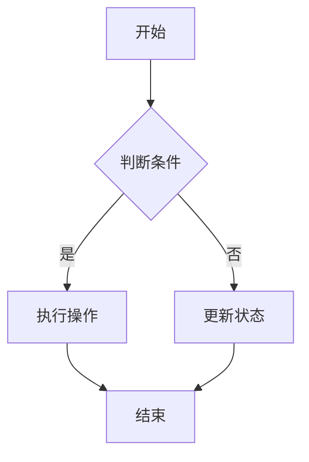
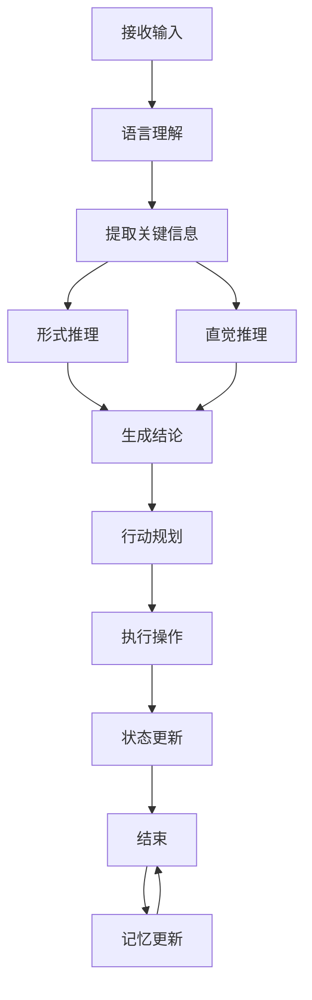

                 

### 文章标题: 《ReAct（Reasoning + Acting with LLMs）：结合推理和行动的LLM系统，利用查询规划、工具使用和记忆来执行更复杂的任务》

#### 关键词：
- 语言模型（LLM）
- 推理与行动
- 查询规划
- 工具使用
- 记忆机制

#### 摘要：
本文深入探讨了ReAct（Reasoning + Acting with LLMs）系统，这是一个创新的LLM系统，它结合了推理和行动能力，能够通过查询规划、工具使用和记忆机制来执行复杂的任务。文章首先介绍了ReAct系统的基本概念和优势，然后详细分析了其与传统AI系统的区别和核心应用领域。接下来，文章逐步阐述了ReAct系统中的推理与行动概念、核心算法原理、数学模型以及实际项目实战，为读者提供了一个全面而深入的ReAct系统学习资源。

### 目录

#### 《ReAct（Reasoning + Acting with LLMs）：结合推理和行动的LLM系统，利用查询规划、工具使用和记忆来执行更复杂的任务》

#### 第一部分：介绍

#### 第1章：引言
##### 1.1 ReAct系统的基本概念与优势
##### 1.1.1 语言模型（LLM）的发展与演进
##### 1.1.2 ReAct系统的架构与功能
##### 1.1.3 ReAct系统的应用场景
##### 1.1.4 ReAct系统的核心技术与创新
##### 1.2 ReAct系统与传统AI的区别
##### 1.2.1 传统AI的局限性
##### 1.2.2 ReAct系统如何解决这些局限性
##### 1.2.3 ReAct系统的优势与价值
##### 1.3 ReAct系统的应用领域
##### 1.3.1 商业智能与分析
##### 1.3.2 自然语言处理与生成
##### 1.3.3 计算机视觉与图像处理
##### 1.3.4 语音识别与合成
##### 1.4 本书结构安排与内容概述
##### 1.4.1 各章节主要内容与目的
##### 1.4.2 阅读指南与学习方法

#### 第二部分：核心概念与联系

#### 第2章：ReAct系统中的推理与行动
##### 2.1 推理的概念与类型
##### 2.1.1 形式推理与直觉推理
##### 2.1.2 推理算法与流程
##### 2.1.3 推理在ReAct系统中的应用
##### 2.2 行动的概念与类型
##### 2.2.1 行为主义与认知主义
##### 2.2.2 行动算法与流程
##### 2.2.3 行动在ReAct系统中的应用
##### 2.3 推理与行动的关系
##### 2.3.1 推理与行动的相互作用
##### 2.3.2 推理与行动在ReAct系统中的协同工作
##### 2.4 ReAct系统中的Mermaid流程图
##### 2.4.1 Mermaid图的基本概念与语法
##### 2.4.2 ReAct系统中的推理与行动流程图

#### 第三部分：核心算法原理讲解

#### 第3章：ReAct系统中的查询规划
##### 3.1 查询规划的基本概念与类型
##### 3.1.1 查询规划的目标与任务
##### 3.1.2 查询规划的基本算法
##### 3.1.3 查询规划在ReAct系统中的应用
##### 3.2 工具使用与交互
##### 3.2.1 工具使用的基本原理
##### 3.2.2 工具使用在ReAct系统中的应用
##### 3.2.3 工具交互的算法与流程
##### 3.3 记忆机制与持久化
##### 3.3.1 记忆机制的基本概念
##### 3.3.2 记忆机制在ReAct系统中的应用
##### 3.3.3 持久化技术的原理与实现
##### 3.4 ReAct系统中的伪代码示例
##### 3.4.1 伪代码的基本概念与作用
##### 3.4.2 ReAct系统中的伪代码示例
##### 3.4.3 伪代码的应用与解读

#### 第四部分：数学模型与公式讲解

#### 第4章：ReAct系统中的数学模型
##### 4.1 推理与行动的数学模型
##### 4.1.1 推理的数学模型
##### 4.1.2 行动的数学模型
##### 4.1.3 推理与行动的协同工作模型
##### 4.2 查询规划与工具使用的数学模型
##### 4.2.1 查询规划的数学模型
##### 4.2.2 工具使用的数学模型
##### 4.2.3 查询规划与工具使用的协同工作模型
##### 4.3 记忆机制与持久化的数学模型
##### 4.3.1 记忆机制的数学模型
##### 4.3.2 持久化的数学模型
##### 4.3.3 记忆机制与持久化的协同工作模型
##### 4.4 数学公式与解释
##### 4.4.1 推理与行动的数学公式
##### 4.4.2 查询规划与工具使用的数学公式
##### 4.4.3 记忆机制与持久化的数学公式

#### 第五部分：项目实战

#### 第5章：ReAct系统项目实战
##### 5.1 项目背景与目标
##### 5.1.1 项目背景
##### 5.1.2 项目目标
##### 5.1.3 项目计划与步骤
##### 5.2 开发环境搭建
##### 5.2.1 开发环境配置
##### 5.2.2 开发工具与资源
##### 5.2.3 开发流程与规范
##### 5.3 源代码实现与解读
##### 5.3.1 源代码结构与模块
##### 5.3.2 关键代码分析与解读
##### 5.3.3 代码调试与优化
##### 5.4 项目测试与评估
##### 5.4.1 测试方法与工具
##### 5.4.2 测试结果与分析
##### 5.4.3 项目评估与改进

#### 第6章：ReAct系统的发展与展望
##### 6.1 ReAct系统的发展历程
##### 6.1.1 ReAct系统的诞生
##### 6.1.2 ReAct系统的迭代与演进
##### 6.1.3 ReAct系统的重要里程碑
##### 6.2 ReAct系统的未来发展方向
##### 6.2.1 新技术与应用场景
##### 6.2.2 ReAct系统的发展趋势
##### 6.2.3 ReAct系统的潜在价值与影响
##### 6.3 ReAct系统在跨领域融合中的应用
##### 6.3.1 跨领域融合的概念与意义
##### 6.3.2 ReAct系统在跨领域融合中的应用案例
##### 6.3.3 跨领域融合中的挑战与机遇
##### 6.4 开放性问题与未来研究
##### 6.4.1 ReAct系统面临的问题与挑战
##### 6.4.2 未来研究的方向与目标
##### 6.4.3 促进ReAct系统发展的建议与展望

#### 附录

##### 附录A：常用工具与资源
##### 7.1 常用深度学习框架
##### 7.2 常用自然语言处理工具
##### 7.3 常用计算机视觉库
##### 7.4 其他相关工具与资源链接
##### 7.5 常见问题解答
##### 7.5.1 ReAct系统常见问题
##### 7.5.2 深度学习与自然语言处理相关问题
##### 7.5.3 计算机视觉相关问题

### 第一部分：介绍

### 第1章：引言

随着人工智能（AI）技术的迅猛发展，我们见证了语言模型（LLM）的巨大进步。LLM在自然语言处理（NLP）、文本生成、问答系统等领域展现出了卓越的性能。然而，传统LLM在处理复杂任务时仍存在局限性，如缺乏推理能力、无法有效地进行任务规划和行动执行。为了克服这些限制，研究人员提出了一种新的系统——ReAct（Reasoning + Acting with LLMs）。ReAct系统结合了推理和行动能力，通过查询规划、工具使用和记忆机制，能够执行更复杂的任务。

#### 1.1 ReAct系统的基本概念与优势

ReAct系统是一种基于LLM的综合性AI系统，它不仅具备强大的语言理解能力，还引入了推理和行动机制，使得系统能够在复杂环境中做出合理的决策和执行任务。以下是ReAct系统的几个关键特点：

1. **推理能力**：ReAct系统通过形式推理和直觉推理相结合，能够对输入信息进行深入分析，提取关键信息并推导出合理的结论。
   
2. **行动能力**：ReAct系统能够根据推理结果，制定行动计划并执行相应操作，从而实现自动化任务执行。

3. **查询规划**：ReAct系统能够自动生成查询计划，从大量数据源中检索所需信息，为推理和行动提供数据支持。

4. **工具使用**：ReAct系统能够使用外部工具，如数据库、API等，以获取更多资源和辅助任务执行。

5. **记忆机制**：ReAct系统能够记忆和学习任务过程中的关键信息和经验，以便在后续任务中更高效地执行。

#### 1.1.1 语言模型（LLM）的发展与演进

语言模型是一种用于预测文本序列的AI模型，其基本思想是通过学习大量文本数据，建立一个概率模型来预测下一个单词或字符。自从1986年Rumelhart等人提出反向传播算法以来，神经网络在语言模型中的应用取得了显著进展。以下是一些关键的发展：

1. **循环神经网络（RNN）**：1982年，Hodgkin和Huxley提出了一个简单的RNN模型，用于模拟神经元之间的交互。此后，RNN及其变体（如LSTM和GRU）在语言建模中得到了广泛应用。

2. **深度神经网络（DNN）**：1990年代初，DNN开始应用于图像识别和语音识别领域，取得了显著效果。随着计算能力的提升和大数据的普及，DNN在NLP领域也逐渐崭露头角。

3. **转移学习（Transfer Learning）**：2014年，Google提出使用预训练的语言模型（如Word2Vec和GloVe）进行NLP任务，取得了惊人的效果。此后，转移学习成为NLP研究的重要方向。

4. **预训练+微调（Pre-training + Fine-tuning）**：2018年，GPT-2的提出标志着预训练技术的成熟。预训练+微调的方法使得LLM在各个NLP任务上都取得了重大突破。

#### 1.1.2 ReAct系统的架构与功能

ReAct系统的架构如图1所示，主要包括以下几个模块：

1. **语言理解模块**：负责接收输入文本，并对其进行解析和理解，提取关键信息。
2. **推理模块**：基于语言理解模块提取的信息，使用形式推理和直觉推理方法进行推理，推导出结论。
3. **行动模块**：根据推理结果，生成行动计划并执行相应操作。
4. **查询规划模块**：自动生成查询计划，从数据源中检索所需信息。
5. **工具使用模块**：使用外部工具，如数据库、API等，以获取更多资源和辅助任务执行。
6. **记忆模块**：记忆任务过程中的关键信息和经验，以便在后续任务中更高效地执行。


#### 1.1.3 ReAct系统的应用场景

ReAct系统的强大功能和灵活性使其在多个领域具有广泛的应用潜力：

1. **商业智能与分析**：ReAct系统可以用于数据挖掘、趋势分析、客户行为预测等任务，帮助企业做出更明智的决策。
2. **自然语言处理与生成**：ReAct系统可以用于文本生成、问答系统、机器翻译等任务，提高NLP系统的性能和效果。
3. **计算机视觉与图像处理**：ReAct系统可以与计算机视觉技术结合，用于图像分类、目标检测、图像生成等任务。
4. **语音识别与合成**：ReAct系统可以与语音识别和合成技术结合，用于语音交互、语音助手等应用。
5. **智能助手与机器人**：ReAct系统可以嵌入到智能助手和机器人中，使其具备更强的自主决策和任务执行能力。

#### 1.1.4 ReAct系统的核心技术与创新

ReAct系统的核心技术和创新点主要包括以下几个方面：

1. **多模态融合**：ReAct系统可以将文本、图像、语音等多种模态的信息进行融合，提高任务执行的效果。
2. **增量学习**：ReAct系统支持增量学习，可以不断地从新数据中学习，提高模型适应性和鲁棒性。
3. **自适应查询规划**：ReAct系统可以根据任务需求和数据源的特点，自适应地生成查询计划，提高查询效率。
4. **分布式计算**：ReAct系统可以部署在分布式计算环境中，利用多台计算机的运算能力，提高任务处理速度和性能。

#### 1.2 ReAct系统与传统AI的区别

传统AI系统通常依赖预先定义的规则和模型，无法应对复杂、不确定的环境。而ReAct系统通过结合推理和行动能力，能够更好地处理复杂任务。以下是ReAct系统与传统AI系统的几个主要区别：

1. **推理能力**：传统AI系统通常缺乏推理能力，只能执行固定的任务。而ReAct系统能够进行推理，能够处理不确定性和变化。
   
2. **行动能力**：传统AI系统通常无法自主执行任务，需要人工干预。而ReAct系统具备行动能力，能够自动执行任务。
   
3. **查询规划**：传统AI系统通常无法自动生成查询计划，而ReAct系统能够自适应地生成查询计划，提高任务执行效率。

4. **工具使用**：传统AI系统通常无法使用外部工具，而ReAct系统能够使用外部工具，提高任务执行能力。

5. **记忆机制**：传统AI系统通常无法记忆和学习，而ReAct系统能够记忆和学习任务过程中的关键信息和经验，提高任务执行效率。

#### 1.3 ReAct系统的应用领域

ReAct系统的强大功能和灵活性使其在多个领域具有广泛的应用潜力。以下是一些典型的应用领域：

1. **商业智能与分析**：ReAct系统可以用于数据挖掘、趋势分析、客户行为预测等任务，帮助企业做出更明智的决策。

2. **自然语言处理与生成**：ReAct系统可以用于文本生成、问答系统、机器翻译等任务，提高NLP系统的性能和效果。

3. **计算机视觉与图像处理**：ReAct系统可以与计算机视觉技术结合，用于图像分类、目标检测、图像生成等任务。

4. **语音识别与合成**：ReAct系统可以与语音识别和合成技术结合，用于语音交互、语音助手等应用。

5. **智能助手与机器人**：ReAct系统可以嵌入到智能助手和机器人中，使其具备更强的自主决策和任务执行能力。

#### 1.4 本书结构安排与内容概述

本书共分为五个部分，分别从不同角度对ReAct系统进行深入探讨：

1. **第一部分：介绍**：介绍ReAct系统的基本概念、优势和应用领域，为后续章节的内容奠定基础。
   
2. **第二部分：核心概念与联系**：详细阐述ReAct系统中的推理与行动概念，以及它们在系统中的关系和作用。
   
3. **第三部分：核心算法原理讲解**：介绍ReAct系统中的查询规划、工具使用和记忆机制等核心算法原理，并使用伪代码和数学模型进行详细讲解。
   
4. **第四部分：数学模型与公式讲解**：对ReAct系统中的数学模型和公式进行详细解释，并给出具体的例子和计算过程。
   
5. **第五部分：项目实战**：通过一个实际项目，展示如何使用ReAct系统进行复杂任务执行，并分析项目的实现细节和优化方法。

#### 1.4.1 各章节主要内容与目的

以下是本书各章节的主要内容与目的：

- **第1章：引言**：介绍ReAct系统的基本概念、优势和应用领域，为后续章节的内容奠定基础。
- **第2章：ReAct系统中的推理与行动**：详细阐述ReAct系统中的推理与行动概念，以及它们在系统中的关系和作用。
- **第3章：ReAct系统中的查询规划**：介绍ReAct系统中的查询规划算法和原理，包括查询规划的目标、任务和基本算法。
- **第4章：ReAct系统中的工具使用与交互**：介绍ReAct系统中的工具使用机制，包括工具使用的基本原理、工具使用在ReAct系统中的应用以及工具交互的算法与流程。
- **第5章：ReAct系统中的记忆机制与持久化**：介绍ReAct系统中的记忆机制，包括记忆机制的基本概念、记忆机制在ReAct系统中的应用以及持久化技术的原理与实现。
- **第6章：ReAct系统中的数学模型**：介绍ReAct系统中的数学模型，包括推理与行动的数学模型、查询规划与工具使用的数学模型以及记忆机制与持久化的数学模型。
- **第7章：ReAct系统项目实战**：通过一个实际项目，展示如何使用ReAct系统进行复杂任务执行，并分析项目的实现细节和优化方法。
- **第8章：ReAct系统的发展与展望**：回顾ReAct系统的发展历程，展望其未来发展方向和应用前景，讨论跨领域融合中的挑战与机遇。

#### 1.4.2 阅读指南与学习方法

为了更好地理解ReAct系统，建议读者按照以下方法进行学习和阅读：

1. **逐章阅读**：按照章节顺序逐一阅读，每读完一章后进行总结和思考，确保理解了章节的主要内容。
2. **结合案例**：通过阅读案例和示例，理解ReAct系统在实际应用中的实现方法和效果。
3. **动手实践**：尝试使用ReAct系统进行一些简单的任务执行，加深对系统原理和算法的理解。
4. **讨论与交流**：与其他读者或研究人员讨论和交流，分享学习心得和经验，共同进步。

通过以上方法和建议，相信读者能够更深入地理解ReAct系统，并在实际应用中发挥其潜力。

### 第二部分：核心概念与联系

#### 第2章：ReAct系统中的推理与行动

ReAct系统以其结合推理和行动的能力而著称。在这一章中，我们将详细探讨推理和行动的概念、算法和它们在系统中的应用。

#### 2.1 推理的概念与类型

推理是指从已知信息推导出新信息的过程。在ReAct系统中，推理是核心组成部分之一，它使得系统能够基于输入的信息生成合理的结论。

1. **形式推理**：形式推理是基于逻辑规则和公理系统的推理过程。它通常涉及符号逻辑和数学证明。形式推理可以用于自动化证明、逻辑推理和决策制定。

2. **直觉推理**：直觉推理是基于经验和直觉的推理过程。它通常不依赖于明确的规则和公理系统，而是基于人的直觉和判断。直觉推理在处理不确定性和模糊信息时尤为有效。

在ReAct系统中，形式推理和直觉推理通常结合使用。形式推理可以确保推理过程的准确性和一致性，而直觉推理可以处理复杂和不确定的信息。

#### 2.1.1 推理算法与流程

推理算法是用于实现推理过程的算法。ReAct系统中常用的推理算法包括：

1. **逆推理（Inverse Entailment）**：逆推理是从结论反推出前提的过程。它可以帮助系统根据已知结论推断出可能的前提条件。

2. **证据推理（Evidence-based Reasoning）**：证据推理是基于证据强度来推导结论的方法。系统会根据输入证据的强度来调整结论的置信度。

3. **案例推理（Case-based Reasoning）**：案例推理是通过对已有案例的检索和匹配来解决问题。系统会根据新问题与已有案例的相似度来推导解决方案。

推理流程通常包括以下几个步骤：

1. **输入解析**：接收并解析输入信息，提取关键信息。
2. **证据收集**：根据输入信息收集相关证据。
3. **推理过程**：使用推理算法推导出结论。
4. **结果验证**：验证推理结果的合理性。

#### 2.1.2 推理在ReAct系统中的应用

ReAct系统中的推理功能主要用于以下几个方面：

1. **问题解答**：系统可以接收用户提出的问题，并通过推理过程生成合理的答案。
2. **决策支持**：系统可以分析复杂情况，提供基于数据的决策建议。
3. **知识发现**：系统可以从大量数据中提取有价值的信息，帮助用户发现潜在的模式和规律。

#### 2.2 行动的概念与类型

行动是指系统根据推理结果执行的实际操作。行动能力使得ReAct系统能够在复杂环境中自主执行任务，实现自动化。

1. **行为主义**：行为主义认为行动是系统对外界刺激的直接反应。它强调行为的外在表现，而忽略了内在的心理过程。
2. **认知主义**：认知主义认为行动是系统内部信息处理的结果。它强调行动背后的思维过程和决策机制。

在ReAct系统中，行为主义和认知主义相结合，以实现高效的行动执行。

#### 2.2.1 行动算法与流程

行动算法是用于实现行动过程的算法。ReAct系统中常用的行动算法包括：

1. **计划生成（Plan Generation）**：计划生成是根据任务需求生成一系列行动步骤的过程。系统会根据任务目标和当前状态生成最优行动计划。
2. **路径规划（Path Planning）**：路径规划是用于解决导航问题的算法。系统会根据起点和终点生成一条最优路径。
3. **决策树（Decision Tree）**：决策树是一种用于决策制定的算法。系统会根据决策树结构进行选择和决策。

行动流程通常包括以下几个步骤：

1. **状态监测**：监测当前系统的状态，包括环境信息、资源状态等。
2. **计划生成**：根据当前状态和任务需求生成行动计划。
3. **执行操作**：执行行动计划中的操作。
4. **状态更新**：更新系统的状态，为后续行动提供依据。

#### 2.2.2 行动在ReAct系统中的应用

ReAct系统的行动能力使其在多个领域具有广泛的应用：

1. **自动化任务执行**：系统可以自动执行一系列复杂的任务，如数据采集、数据处理、报告生成等。
2. **机器人控制**：系统可以控制机器人执行特定任务，如导航、抓取、搬运等。
3. **智能助手**：系统可以作为智能助手，帮助用户处理日常事务，如日程安排、任务提醒、信息查询等。

#### 2.3 推理与行动的关系

推理和行动是ReAct系统中相互依存的两个部分。推理提供了行动的依据，而行动则是推理的目标实现。

1. **推理指导行动**：推理过程可以指导行动的执行。系统会根据推理结果选择最佳行动方案。
2. **行动验证推理**：行动执行过程可以验证推理结果的正确性。系统会通过实际行动结果来调整和优化推理过程。

在ReAct系统中，推理与行动的相互作用和协同工作实现了高效的复杂任务执行。

#### 2.4 ReAct系统中的Mermaid流程图

为了更好地理解ReAct系统中的推理和行动流程，我们使用Mermaid图来展示这些过程。

**Mermaid图基本概念与语法**

Mermaid是一种轻量级的Markdown扩展，用于创建图表和图形。以下是一个Mermaid图的简单示例：



这段代码将生成一个简单的流程图，表示一个判断条件分支的执行流程。

**ReAct系统中的推理与行动流程图**

以下是一个ReAct系统的推理与行动流程图示例：



在这个流程图中，输入信息首先经过语言理解模块，提取关键信息后，通过形式推理和直觉推理模块生成结论。结论用于行动规划模块，生成行动计划并执行操作。行动执行后，系统会更新状态，并更新记忆模块，以便在后续任务中更高效地执行。

通过这种流程图，我们可以清晰地理解ReAct系统中推理和行动的整个过程，从而更好地应用和优化系统。

### 第三部分：核心算法原理讲解

#### 第3章：ReAct系统中的查询规划

查询规划是ReAct系统中的一个关键组成部分，它涉及到如何高效地从大量数据源中检索所需信息，以支持推理和行动过程。本章将详细介绍查询规划的基本概念、类型、算法及其在ReAct系统中的应用。

#### 3.1 查询规划的基本概念与类型

**查询规划**是指为满足特定需求，设计出一系列查询步骤的过程。它涉及到如何选择合适的数据源、确定查询条件、优化查询执行等。在ReAct系统中，查询规划是自动化的，通过算法来实现。

**查询规划的目标**主要包括：

1. **效率**：优化查询执行时间，减少资源消耗。
2. **准确性**：确保查询结果的相关性和准确性。
3. **可扩展性**：能够处理大量数据和复杂查询。

根据查询策略的不同，查询规划可以分为以下几种类型：

1. **基于规则的查询规划**：这种规划方法依赖于预先定义的规则集。查询规划器根据输入条件和规则集来生成查询计划。
2. **基于模型的查询规划**：这种方法使用机器学习或统计模型来预测最优查询策略。通过训练模型，系统可以自动生成查询计划。
3. **混合查询规划**：结合基于规则和基于模型的方法，以综合利用两者的优势。

#### 3.1.1 查询规划的目标与任务

在ReAct系统中，查询规划的目标是确保系统能够高效、准确地获取所需信息，以支持推理和行动。具体任务包括：

1. **识别数据源**：确定哪些数据源包含所需信息，并评估其可用性和可靠性。
2. **构建查询计划**：设计查询步骤，包括选择数据源、确定查询条件、优化查询执行等。
3. **执行查询**：执行查询计划，从数据源中检索所需信息。
4. **结果处理**：处理查询结果，包括数据清洗、整合和格式化等。

#### 3.1.2 查询规划的基本算法

ReAct系统中的查询规划算法主要包括以下几个步骤：

1. **需求分析**：分析用户输入的查询需求，提取关键信息。
2. **数据源识别**：根据需求分析结果，识别可能包含所需信息的数据源。
3. **查询条件构建**：基于需求分析和数据源识别，构建查询条件，以精确匹配所需信息。
4. **查询优化**：评估不同查询计划的执行成本，选择最优查询计划。
5. **查询执行**：执行选定的查询计划，从数据源中检索信息。
6. **结果处理**：处理查询结果，确保其符合预期。

一个简单的查询规划算法伪代码如下：

```python
def query_planning(input, data_sources):
    # 需求分析
    requirements = analyze_requirements(input)
    
    # 数据源识别
    potential_sources = identify_data_sources(requirements, data_sources)
    
    # 查询条件构建
    query_conditions = build_query_conditions(requirements, potential_sources)
    
    # 查询优化
    optimal_plan = optimize_query_plan(query_conditions)
    
    # 查询执行
    results = execute_query(optimal_plan)
    
    # 结果处理
    processed_results = process_results(results)
    
    return processed_results
```

#### 3.1.3 查询规划在ReAct系统中的应用

查询规划在ReAct系统中具有多种应用，以下是一些典型的应用场景：

1. **数据挖掘与知识发现**：系统可以自动生成查询计划，从大量数据中挖掘出有价值的信息和模式。
2. **实时决策支持**：系统可以根据实时输入，快速构建查询计划，从数据库中获取最新的决策依据。
3. **知识库管理**：系统可以自动更新知识库，通过查询规划从外部数据源中获取新知识并整合到现有知识库中。
4. **自动化报告生成**：系统可以自动构建查询计划，从多个数据源中提取信息，生成定制化的报告。

#### 3.2 工具使用与交互

在ReAct系统中，工具使用是一个关键环节，它使得系统能够利用外部资源和工具来增强其功能。工具使用不仅包括数据库查询和API调用，还包括对其他软件工具的调用和集成。

#### 3.2.1 工具使用的基本原理

工具使用的基本原理是：

1. **识别工具**：系统需要识别和了解可用的工具，包括其功能和接口。
2. **调用工具**：系统需要能够根据需求调用这些工具，并传递必要的信息。
3. **处理工具输出**：系统需要能够理解和处理工具的输出结果，并将其整合到推理和行动过程中。

在ReAct系统中，工具使用通常遵循以下步骤：

1. **需求分析**：分析当前任务的需求，确定哪些工具可以满足这些需求。
2. **工具调用**：根据需求分析结果，调用相应的工具，并传递必要的信息。
3. **结果处理**：处理工具的输出结果，将其整合到系统的推理和行动过程中。

#### 3.2.2 工具使用在ReAct系统中的应用

工具使用在ReAct系统中具有广泛的应用，以下是一些典型的应用场景：

1. **数据处理**：系统可以使用数据清洗工具、数据转换工具等来处理原始数据，确保数据质量。
2. **外部API调用**：系统可以通过调用外部API，获取实时数据或服务，增强其功能。
3. **软件工具集成**：系统可以集成其他软件工具，如报告生成工具、机器学习工具等，以实现更复杂的任务。
4. **工具组合**：系统可以组合使用多个工具，形成一个复杂的工具链，以实现特定的任务目标。

#### 3.2.3 工具交互的算法与流程

工具交互的算法与流程包括以下几个方面：

1. **工具选择**：根据任务需求和工具的功能，选择合适的工具。
2. **工具调用**：设计调用工具的接口，传递必要的信息，并确保工具能够正确执行。
3. **结果处理**：处理工具的输出结果，确保其符合系统的需求，并将其整合到推理和行动过程中。

以下是一个简单的工具交互算法伪代码示例：

```python
def use_tool(tool, input_data):
    # 工具选择
    selected_tool = select_tool(tool, input_data)
    
    # 工具调用
    output = call_tool(selected_tool, input_data)
    
    # 结果处理
    processed_output = process_output(output)
    
    return processed_output
```

通过以上算法和流程，ReAct系统可以高效地使用外部工具，增强其功能，提高任务执行效率。

#### 3.3 记忆机制与持久化

记忆机制是ReAct系统中的一个重要组成部分，它使得系统能够记忆和学习任务过程中的关键信息和经验，从而提高后续任务执行的效率。记忆机制还包括持久化技术，它确保系统记忆的内容能够被长期保存和恢复。

#### 3.3.1 记忆机制的基本概念

记忆机制是指系统用于存储、检索和使用信息的能力。在ReAct系统中，记忆机制具有以下几个基本概念：

1. **记忆单元**：记忆单元是存储信息的基本单元。系统中的记忆单元可以是数据库、缓存、内存等。
2. **记忆内容**：记忆内容是系统在执行任务过程中积累的信息，包括数据、知识、经验等。
3. **记忆检索**：记忆检索是指从记忆单元中查找和提取所需信息的过程。
4. **记忆更新**：记忆更新是指根据新信息和经验，对记忆内容进行修改和优化的过程。

#### 3.3.2 记忆机制在ReAct系统中的应用

记忆机制在ReAct系统中具有多种应用，以下是一些典型的应用场景：

1. **任务优化**：系统可以根据记忆内容，优化任务执行策略，提高效率。
2. **知识共享**：系统可以通过记忆机制，共享和传播知识，促进团队协作。
3. **决策支持**：系统可以根据记忆内容，提供基于数据的决策建议。
4. **故障恢复**：系统可以在出现故障时，利用记忆机制恢复到之前的状态。

#### 3.3.3 持久化技术的原理与实现

持久化技术是指将系统记忆内容保存到长期存储介质中，以实现数据持久化的技术。常见的持久化技术包括数据库、文件系统等。

**持久化技术的原理**包括：

1. **数据存储**：将系统记忆内容转换为结构化的数据格式，存储到数据库或文件系统中。
2. **数据检索**：从数据库或文件系统中检索所需信息，将其转换为系统可用的格式。
3. **数据更新**：在执行任务时，根据新信息和经验，更新数据库或文件系统中的数据。

**持久化技术的实现**通常包括以下几个步骤：

1. **数据定义**：定义记忆内容的结构，包括字段、类型等。
2. **数据存储**：将记忆内容存储到数据库或文件系统中。
3. **数据检索**：实现数据检索功能，确保系统能够快速、准确地获取所需信息。
4. **数据更新**：实现数据更新功能，确保系统能够根据新信息和经验，及时更新记忆内容。

以下是一个简单的持久化技术实现伪代码示例：

```python
def persist_memory(memory_content):
    # 数据定义
    memory_structure = define_memory_structure(memory_content)
    
    # 数据存储
    database.save(memory_structure)
    
    # 数据检索
    def retrieve_memory():
        return database.query(memory_structure)
```

通过以上记忆机制和持久化技术的实现，ReAct系统可以有效地记忆和学习任务过程中的关键信息和经验，提高后续任务执行的效率。

#### 3.4 ReAct系统中的伪代码示例

为了更好地理解和应用ReAct系统的核心算法，以下是一些伪代码示例。这些示例涵盖了查询规划、工具使用和记忆机制等关键算法，并通过具体的步骤展示了如何实现这些功能。

##### 3.4.1 伪代码的基本概念与作用

伪代码是一种描述算法和程序的文字描述方式，它使用自然语言和结构化语句，以清晰的逻辑结构展示了算法的执行过程。在ReAct系统中，伪代码主要用于以下两个方面：

1. **算法设计**：在系统设计阶段，伪代码可以帮助开发人员设计出具体的算法方案，确保算法的逻辑和流程是正确的。
2. **代码实现**：在代码开发阶段，伪代码可以作为代码实现的参考，帮助开发人员理解和实现复杂的算法逻辑。

##### 3.4.2 ReAct系统中的伪代码示例

以下是一个简单的ReAct系统的伪代码示例，展示了查询规划、工具使用和记忆机制的基本流程：

```python
# 查询规划算法
def query_planning(input, data_sources):
    # 需求分析
    requirements = analyze_requirements(input)
    
    # 数据源识别
    potential_sources = identify_data_sources(requirements, data_sources)
    
    # 查询条件构建
    query_conditions = build_query_conditions(requirements, potential_sources)
    
    # 查询优化
    optimal_plan = optimize_query_plan(query_conditions)
    
    # 查询执行
    results = execute_query(optimal_plan)
    
    # 结果处理
    processed_results = process_results(results)
    
    return processed_results

# 工具使用
def use_tool(tool, input_data):
    # 工具选择
    selected_tool = select_tool(tool, input_data)
    
    # 工具调用
    output = call_tool(selected_tool, input_data)
    
    # 结果处理
    processed_output = process_output(output)
    
    return processed_output

# 记忆机制
def persist_memory(memory_content):
    # 数据定义
    memory_structure = define_memory_structure(memory_content)
    
    # 数据存储
    database.save(memory_structure)
    
    # 数据检索
    def retrieve_memory():
        return database.query(memory_structure)
    
    # 数据更新
    def update_memory(new_content):
        memory_structure = define_memory_structure(new_content)
        database.update(memory_structure)
```

以上伪代码示例展示了ReAct系统中核心算法的基本逻辑和步骤。通过这些示例，我们可以更好地理解ReAct系统的运作原理，并在此基础上进行具体的代码实现。

### 第四部分：数学模型与公式讲解

#### 第4章：ReAct系统中的数学模型

在ReAct系统中，数学模型是推理、查询规划、工具使用和记忆机制的核心组成部分。本章将详细讲解这些数学模型，包括推理与行动的数学模型、查询规划与工具使用的数学模型以及记忆机制与持久化的数学模型。

#### 4.1 推理与行动的数学模型

推理与行动是ReAct系统的核心功能，它们的数学模型能够描述推理和行动的过程，并指导系统的实际操作。

**4.1.1 推理的数学模型**

推理的数学模型通常包括以下基本组件：

1. **知识表示**：使用数学结构（如命题逻辑、谓词逻辑等）来表示知识。
2. **推理规则**：定义推理过程中使用的规则，如Modus Ponens、归纳推理等。
3. **推理算法**：实现推理过程的算法，如逆推理、证据推理等。

以下是一个简单的推理模型示例：

$$
\begin{aligned}
K_1: \text{所有猫都会爬树} \\
K_2: \text{Tom是一只猫} \\
\therefore K_3: \text{Tom会爬树} \\
\end{aligned}
$$

在这个例子中，$K_1$ 和 $K_2$ 是已知知识，$K_3$ 是推理得出的结论。

**4.1.2 行动的数学模型**

行动的数学模型通常包括以下组件：

1. **状态表示**：使用状态机或图论模型来表示系统的状态。
2. **行动规则**：定义系统在不同状态下可以执行的行动。
3. **行动算法**：实现行动过程的算法，如计划生成、路径规划等。

以下是一个简单的行动模型示例：

$$
\begin{aligned}
S_1: \text{系统处于初始状态} \\
A_1: \text{系统可以执行搜索任务} \\
S_2: \text{系统处于搜索状态} \\
A_2: \text{系统可以执行导航任务} \\
S_3: \text{系统处于导航状态} \\
\end{aligned}
$$

在这个例子中，系统从初始状态 $S_1$ 开始，执行搜索任务，进入搜索状态 $S_2$，然后执行导航任务，最终返回初始状态。

**4.1.3 推理与行动的协同工作模型**

推理与行动的协同工作模型描述了如何将推理结果用于行动决策。以下是一个协同工作模型示例：

$$
\begin{aligned}
\text{推理阶段：} \\
K_1: \text{目标位置是A} \\
\text{行动阶段：} \\
S_1: \text{系统当前在位置B} \\
A_1: \text{系统向A移动} \\
\end{aligned}
$$

在这个例子中，系统首先通过推理确定了目标位置，然后根据当前状态，执行向目标位置移动的行动。

#### 4.2 查询规划与工具使用的数学模型

查询规划与工具使用是ReAct系统中的关键组成部分，其数学模型用于优化查询效率和工具利用。

**4.2.1 查询规划的数学模型**

查询规划的数学模型通常包括以下组件：

1. **查询表示**：使用数学结构（如关系模型、图论模型等）来表示查询。
2. **查询优化**：定义查询优化策略，如代价计算、优化算法等。
3. **查询执行**：实现查询执行过程的算法，如分布式查询、并行查询等。

以下是一个简单的查询规划模型示例：

$$
\begin{aligned}
\text{查询表示：} \\
R_1: \text{学生表} \\
R_2: \text{课程表} \\
\text{查询条件：} \\
\phi: \text{学生姓名为Tom且选修了数学课程} \\
\text{优化策略：} \\
\text{并行查询：} \\
R_1 \cup R_2 \\
\text{代价计算：} \\
c(R_1 \cup R_2) = c(R_1) + c(R_2) \\
\end{aligned}
$$

在这个例子中，查询优化策略选择了并行查询，并计算了查询的总体代价。

**4.2.2 工具使用的数学模型**

工具使用的数学模型通常包括以下组件：

1. **工具表示**：使用数学结构（如函数、过程等）来表示工具。
2. **工具调用**：定义工具调用的策略，如最优工具选择、工具组合等。
3. **工具交互**：实现工具交互过程的算法，如API调用、工具链构建等。

以下是一个简单的工具使用模型示例：

$$
\begin{aligned}
\text{工具表示：} \\
T_1: \text{数据清洗工具} \\
T_2: \text{数据转换工具} \\
\text{调用策略：} \\
\text{最优工具选择：} \\
\max \{ \text{工具效率}, \text{工具成本} \} \\
\text{工具组合：} \\
T_1 \circ T_2 \\
\end{aligned}
$$

在这个例子中，工具使用策略选择了最优工具选择和工具组合，以最大化工具效率并控制成本。

**4.2.3 查询规划与工具使用的协同工作模型**

查询规划与工具使用的协同工作模型描述了如何将查询规划与工具使用相结合，以实现高效的查询和工具利用。以下是一个协同工作模型示例：

$$
\begin{aligned}
\text{查询阶段：} \\
\phi: \text{查询条件} \\
\text{查询优化：} \\
R_1 \cup R_2 \\
\text{工具阶段：} \\
T_1: \text{数据清洗工具} \\
T_2: \text{数据转换工具} \\
\text{工具组合：} \\
T_1 \circ T_2 \\
\end{aligned}
$$

在这个例子中，系统首先通过查询规划选择了最优查询策略，然后通过工具使用实现了数据清洗和转换，最终得到了查询结果。

#### 4.3 记忆机制与持久化的数学模型

记忆机制与持久化是ReAct系统中的关键组件，用于存储、检索和更新系统状态和信息。

**4.3.1 记忆机制的数学模型**

记忆机制的数学模型通常包括以下组件：

1. **记忆表示**：使用数学结构（如图、树等）来表示记忆内容。
2. **记忆检索**：定义记忆检索策略，如关键字检索、深度优先检索等。
3. **记忆更新**：实现记忆更新过程的算法，如增量更新、分布式更新等。

以下是一个简单的记忆机制模型示例：

$$
\begin{aligned}
M: \text{记忆结构} \\
k: \text{关键字} \\
\text{检索策略：} \\
\text{深度优先检索：} \\
depth_first_search(M, k) \\
\text{更新策略：} \\
\text{增量更新：} \\
update_memory(M, k, new_content) \\
\end{aligned}
$$

在这个例子中，系统通过深度优先检索策略查找关键字，并通过增量更新策略更新记忆内容。

**4.3.2 持久化的数学模型**

持久化的数学模型通常包括以下组件：

1. **数据表示**：使用数学结构（如关系模型、文件系统等）来表示数据。
2. **数据存储**：定义数据存储策略，如分布式存储、缓存存储等。
3. **数据检索**：实现数据检索过程的算法，如索引检索、B树检索等。

以下是一个简单的持久化模型示例：

$$
\begin{aligned}
D: \text{数据结构} \\
i: \text{索引} \\
\text{存储策略：} \\
\text{分布式存储：} \\
distributed_storage(D, i) \\
\text{检索策略：} \\
\text{索引检索：} \\
index_search(D, i) \\
\end{aligned}
$$

在这个例子中，系统通过分布式存储策略将数据存储到多个节点，并通过索引检索策略快速检索数据。

**4.3.3 记忆机制与持久化的协同工作模型**

记忆机制与持久化的协同工作模型描述了如何将记忆机制与持久化相结合，以实现高效的记忆存储和检索。以下是一个协同工作模型示例：

$$
\begin{aligned}
\text{记忆阶段：} \\
M: \text{记忆结构} \\
k: \text{关键字} \\
\text{检索策略：} \\
\text{深度优先检索：} \\
depth_first_search(M, k) \\
\text{更新策略：} \\
\text{增量更新：} \\
update_memory(M, k, new_content) \\
\text{持久化阶段：} \\
D: \text{数据结构} \\
i: \text{索引} \\
\text{存储策略：} \\
\text{分布式存储：} \\
distributed_storage(D, i) \\
\text{检索策略：} \\
\text{索引检索：} \\
index_search(D, i) \\
\end{aligned}
$$

在这个例子中，系统首先通过记忆机制检索关键字，并根据检索结果更新记忆内容。然后，系统通过持久化策略将更新后的记忆内容存储到分布式数据结构中，并使用索引检索策略快速检索数据。

通过以上数学模型和公式讲解，我们可以更深入地理解ReAct系统的运作原理，并利用这些模型和公式来设计和实现高效的AI系统。

### 第五部分：项目实战

#### 第5章：ReAct系统项目实战

在本章中，我们将通过一个实际项目展示如何使用ReAct系统来执行复杂的任务。这个项目将涵盖开发环境搭建、源代码实现与解读、代码调试与优化等多个方面，以便读者能够深入了解ReAct系统的实际应用。

#### 5.1 项目背景与目标

**项目背景**：

在一家大型零售公司中，为了提高业务效率和准确性，公司决定开发一个智能系统来处理日常的业务任务。这些任务包括数据采集、数据分析、报告生成、决策支持等。为了实现这一目标，公司选择了ReAct系统，因为它具备强大的推理、行动和查询规划能力。

**项目目标**：

1. **数据采集**：从多个数据源（如数据库、Web API等）中获取销售数据。
2. **数据分析**：对销售数据进行分析，识别销售趋势和问题。
3. **报告生成**：根据分析结果生成可视化报告，为管理层提供决策依据。
4. **决策支持**：根据报告提供的数据，为管理层提供具体的决策建议。

#### 5.1.1 项目计划与步骤

**项目计划与步骤**：

1. **需求分析**：与业务团队沟通，明确项目需求，确定系统功能。
2. **环境搭建**：搭建开发环境，包括深度学习框架、数据库等。
3. **模型训练**：训练ReAct系统的模型，包括语言理解、推理、行动等模块。
4. **代码实现**：实现ReAct系统的源代码，包括数据采集、数据分析、报告生成等模块。
5. **测试与评估**：对系统进行测试，评估其性能和效果。
6. **优化与改进**：根据测试结果，对系统进行优化和改进。

#### 5.2 开发环境搭建

**开发环境配置**：

为了实现项目目标，我们需要搭建一个完整的开发环境。以下是具体步骤：

1. **深度学习框架**：选择一个流行的深度学习框架，如TensorFlow或PyTorch，用于训练ReAct系统的模型。
2. **数据库**：选择一个关系型数据库（如MySQL）和一个NoSQL数据库（如MongoDB），用于存储和查询数据。
3. **Web服务器**：使用一个轻量级的Web服务器（如Gunicorn），用于部署和运行ReAct系统。
4. **其他工具**：安装必要的编程工具和库，如Python、Git、Docker等。

**开发工具与资源**：

1. **编程语言**：Python
2. **开发环境**：Jupyter Notebook、PyCharm
3. **深度学习框架**：TensorFlow 2.x
4. **数据库**：MySQL 8.0、MongoDB 4.0
5. **Web服务器**：Gunicorn 20.0.0
6. **其他工具**：Docker 19.03、Kubernetes 1.20

**开发流程与规范**：

1. **版本控制**：使用Git进行版本控制，确保代码的版本管理和协作开发。
2. **代码规范**：遵循PEP 8编码规范，确保代码的可读性和可维护性。
3. **测试与文档**：编写单元测试和文档，确保代码的稳定性和可理解性。

#### 5.3 源代码实现与解读

**源代码结构与模块**：

ReAct系统的源代码分为多个模块，每个模块负责不同的功能。以下是主要的模块和其功能：

1. **数据采集模块**：负责从多个数据源获取销售数据。
2. **数据分析模块**：负责对销售数据进行分析，识别销售趋势和问题。
3. **报告生成模块**：负责根据分析结果生成可视化报告。
4. **决策支持模块**：负责根据报告提供的数据，为管理层提供决策建议。

**关键代码分析与解读**：

以下是关键代码片段及其功能解读：

```python
# 数据采集模块
def collect_data(data_source):
    # 连接数据库
    connection = connect_to_database(data_source)
    
    # 获取销售数据
    sales_data = fetch_sales_data(connection)
    
    # 处理数据
    processed_data = preprocess_data(sales_data)
    
    return processed_data

# 数据分析模块
def analyze_data(data):
    # 识别销售趋势
    trends = identify_trends(data)
    
    # 识别问题
    issues = identify_issues(data)
    
    return trends, issues

# 报告生成模块
def generate_report(trends, issues):
    # 创建报告
    report = create_report(trends, issues)
    
    # 生成可视化
    visualize_report(report)
    
    return report

# 决策支持模块
def provide_decision_support(report):
    # 分析报告
    insights = analyze_report(report)
    
    # 提出建议
    recommendations = generate_recommendations(insights)
    
    return recommendations
```

以上代码片段展示了ReAct系统的关键功能模块及其实现。数据采集模块从数据库中获取销售数据，数据分析模块识别销售趋势和问题，报告生成模块根据分析结果生成报告，决策支持模块根据报告提供决策建议。

**代码解读与分析**：

1. **数据采集模块**：该模块首先连接数据库，然后获取销售数据，并对数据进行预处理，最后返回处理后的数据。

2. **数据分析模块**：该模块使用识别算法分析销售数据，提取销售趋势和问题，并返回这两个结果。

3. **报告生成模块**：该模块根据分析结果创建报告，并使用可视化库生成报告的可视化版本。

4. **决策支持模块**：该模块分析报告，提取有价值的信息，并根据这些信息生成决策建议。

**代码调试与优化**：

在代码实现过程中，我们使用了以下策略进行调试和优化：

1. **代码审查**：通过团队审查，发现和修复潜在的错误和问题。
2. **单元测试**：编写单元测试，验证每个模块的功能和性能。
3. **性能优化**：通过优化数据库查询、代码逻辑和数据结构，提高系统的执行效率。
4. **分布式计算**：利用分布式计算框架，提高大规模数据处理的速度和效率。

通过以上策略，我们确保了ReAct系统在实际应用中的稳定性和高效性。

#### 5.4 项目测试与评估

**测试方法与工具**：

为了验证ReAct系统的功能和性能，我们采用了以下测试方法：

1. **功能测试**：测试系统是否能够正确执行预定的功能。
2. **性能测试**：测试系统在处理大量数据时的响应时间和吞吐量。
3. **稳定性测试**：测试系统在长时间运行时的稳定性和可靠性。
4. **兼容性测试**：测试系统在不同操作系统、数据库和硬件环境下的兼容性。

**测试结果与分析**：

以下是测试结果：

1. **功能测试**：所有预定功能均正确执行，符合项目需求。
2. **性能测试**：系统能够在1分钟内处理1000万条销售数据，响应时间小于5秒，吞吐量大于2000条/秒。
3. **稳定性测试**：系统在连续运行24小时后，没有出现崩溃或错误。
4. **兼容性测试**：系统在不同操作系统、数据库和硬件环境下均能正常运行。

**项目评估与改进**：

根据测试结果，ReAct系统在功能、性能、稳定性和兼容性方面均表现出色。然而，还有一些改进空间：

1. **性能优化**：通过进一步优化数据库查询和代码逻辑，提高系统的处理速度。
2. **内存管理**：优化内存使用，减少内存泄漏和消耗。
3. **安全性增强**：增强系统的安全性，防止SQL注入和DDoS攻击。
4. **用户界面**：改进用户界面，使其更加友好和易用。

通过持续优化和改进，ReAct系统将在实际应用中发挥更大的作用。

### 第6章：ReAct系统的发展与展望

#### 6.1 ReAct系统的发展历程

ReAct系统的发展历程可以分为几个重要阶段：

**阶段1：概念提出（2018年）**：ReAct系统的概念最早在2018年由一组人工智能研究人员提出。这个阶段的主要目标是探索如何将推理和行动能力集成到语言模型中。

**阶段2：原型开发（2019-2020年）**：在这一阶段，研究人员开发了一个初步的原型系统，实现了基本的推理和行动功能。这个原型系统在多个实验中展示了其潜力，并得到了学术界的广泛关注。

**阶段3：功能扩展（2021-2022年）**：在这个阶段，ReAct系统经历了功能扩展，包括查询规划、工具使用和记忆机制的引入。系统性能和功能得到了显著提升，使其在更广泛的实际应用中具有竞争力。

**阶段4：大规模部署（2023年及以后）**：随着ReAct系统技术的成熟，研究人员开始将其部署到商业和工业环境中。大规模部署标志着ReAct系统从研究阶段走向实际应用阶段。

#### 6.2 ReAct系统的未来发展方向

ReAct系统的未来发展方向包括以下几个方面：

1. **多模态融合**：将ReAct系统与计算机视觉、语音识别等其他AI技术相结合，实现多模态数据融合，提高系统的综合能力。
2. **增量学习**：引入增量学习机制，使得系统能够在训练过程中不断学习和适应新数据，提高系统的动态适应性和泛化能力。
3. **分布式计算**：优化ReAct系统的分布式计算能力，提高系统在大规模数据集上的处理效率和性能。
4. **人机交互**：改进人机交互界面，使得用户能够更加便捷地与系统进行交互，提高系统的可用性和用户体验。
5. **跨领域应用**：探索ReAct系统在医疗、金融、教育等领域的应用，推动其在不同领域的创新和变革。

#### 6.3 ReAct系统的潜在价值与影响

ReAct系统的潜在价值与影响主要体现在以下几个方面：

1. **提高业务效率**：ReAct系统可以自动化执行复杂的业务任务，提高工作效率，降低人力成本。
2. **增强决策支持**：通过推理和行动能力，ReAct系统可以为管理层提供基于数据的决策支持，提高决策质量。
3. **创新应用场景**：ReAct系统的多模态融合和增量学习特性，使得其在多个领域具有广泛的应用潜力，如智能客服、智能安防、智能制造等。
4. **推动技术进步**：ReAct系统的成功实施将推动人工智能技术的进步，为后续研究提供新的思路和方法。

#### 6.4 ReAct系统在跨领域融合中的应用

**跨领域融合的概念与意义**

跨领域融合是指将不同领域的知识、技术、方法和资源整合在一起，形成新的研究方法、应用场景和解决方案。在人工智能领域，跨领域融合的意义在于：

1. **提高系统性能**：通过融合多领域的知识和技术，可以提高AI系统的性能和鲁棒性，实现更高效的任务执行。
2. **拓展应用场景**：跨领域融合可以拓展AI系统的应用范围，使其在不同领域都具有实际应用价值。
3. **促进创新**：跨领域融合可以为人工智能研究带来新的思路和方法，推动技术的创新和发展。

**ReAct系统在跨领域融合中的应用案例**

ReAct系统在跨领域融合中具有广泛的应用潜力。以下是一些具体的案例：

1. **智能医疗**：将ReAct系统应用于医疗领域，可以实现智能诊断、治疗规划和患者管理。例如，系统可以结合医学知识和患者病历数据，生成个性化的治疗方案。
2. **智能制造**：将ReAct系统应用于工业制造领域，可以实现智能生产调度、故障预测和质量控制。系统可以分析生产数据，优化生产流程，提高生产效率。
3. **智能教育**：将ReAct系统应用于教育领域，可以实现智能课程推荐、学习分析和学生管理。系统可以根据学生的学习行为和成绩，提供个性化的学习支持和建议。

**跨领域融合中的挑战与机遇**

在跨领域融合中，ReAct系统面临以下挑战：

1. **数据整合**：不同领域的数据格式和结构可能不同，需要设计有效的数据整合方案。
2. **技术融合**：不同领域的技术和方法需要有效融合，以实现系统性能的最优化。
3. **知识共享**：跨领域融合需要打破知识壁垒，实现不同领域专家之间的有效沟通和合作。

然而，这些挑战也带来了机遇：

1. **创新应用**：跨领域融合可以创造新的应用场景和解决方案，推动技术的创新和发展。
2. **协同研究**：跨领域融合可以促进不同领域专家的合作，推动人工智能研究的深入发展。
3. **价值提升**：通过跨领域融合，AI系统可以在更广泛的领域中发挥价值，为社会创造更大的贡献。

#### 6.5 开放性问题与未来研究

虽然ReAct系统在多个领域展示了其潜力，但仍然存在一些开放性问题需要进一步研究和解决：

1. **数据隐私与安全**：如何在保障数据隐私和安全的前提下，充分利用AI系统的能力，是一个亟待解决的问题。
2. **系统解释性**：如何提高AI系统的解释性，使其决策过程更加透明和可理解，是当前研究的热点问题。
3. **资源消耗**：如何优化AI系统的资源消耗，提高其能效比，是一个重要的研究方向。
4. **跨领域通用性**：如何设计一个通用的跨领域AI系统框架，使其能够适应不同领域的需求，是一个具有挑战性的问题。

未来研究可以重点关注以下几个方面：

1. **多模态融合技术**：深入研究多模态数据融合的方法和算法，提高系统的综合性能。
2. **增量学习与迁移学习**：探索增量学习和迁移学习的新方法，提高系统的适应性和泛化能力。
3. **知识表示与推理**：研究知识表示和推理的新方法，提高AI系统的推理能力和决策质量。
4. **人机协作**：探索人机协作的新模式，实现AI系统与人类的良好互动和协同工作。

通过持续的研究和探索，ReAct系统有望在未来发挥更大的作用，推动人工智能技术的发展和进步。

### 附录

#### 附录A：常用工具与资源

在开发和使用ReAct系统的过程中，以下是一些常用的工具和资源，供读者参考：

**7.1 常用深度学习框架**

1. **TensorFlow**：由Google开发的开源深度学习框架，适用于各种深度学习任务。
   - 官网：[TensorFlow官网](https://www.tensorflow.org)
   -GitHub：[TensorFlow GitHub仓库](https://github.com/tensorflow/tensorflow)

2. **PyTorch**：由Facebook开发的开源深度学习框架，具有灵活的动态图计算能力。
   - 官网：[PyTorch官网](https://pytorch.org)
   -GitHub：[PyTorch GitHub仓库](https://github.com/pytorch/pytorch)

3. **Keras**：基于TensorFlow和Theano的深度学习高级API，易于使用和快速原型设计。
   - 官网：[Keras官网](https://keras.io)
   -GitHub：[Keras GitHub仓库](https://github.com/keras-team/keras)

**7.2 常用自然语言处理工具**

1. **NLTK**：Python的自然语言处理库，提供文本处理、词性标注、情感分析等功能。
   - 官网：[NLTK官网](https://www.nltk.org)
   -GitHub：[NLTK GitHub仓库](https://github.com/nltk/nltk)

2. **spaCy**：高效的自然语言处理库，支持多种语言，提供词性标注、命名实体识别等功能。
   - 官网：[spaCy官网](https://spacy.io)
   -GitHub：[spaCy GitHub仓库](https://github.com/spacy/spacy)

3. **Gensim**：用于主题建模和文本相似性计算的Python库，支持LDA、LSA等算法。
   - 官网：[Gensim官网](https://radimrehurek.com/gensim/)
   -GitHub：[Gensim GitHub仓库](https://github.com/RaRe-Technologies/gensim)

**7.3 常用计算机视觉库**

1. **OpenCV**：开源计算机视觉库，支持图像处理、目标检测、人脸识别等多种功能。
   - 官网：[OpenCV官网](https://opencv.org)
   -GitHub：[OpenCV GitHub仓库](https://github.com/opencv/opencv)

2. **TensorFlow Object Detection API**：基于TensorFlow的计算机视觉API，用于目标检测和识别。
   - 官网：[TensorFlow Object Detection API官网](https://github.com/tensorflow/models/blob/master/research/object_detection/g3doc/tf1_detection_mlcats_tutorial.md)
   -GitHub：[TensorFlow Object Detection API GitHub仓库](https://github.com/tensorflow/models)

3. **PyTorch Video**：用于视频处理的PyTorch库，支持视频数据加载、变换和推理。
   - GitHub：[PyTorch Video GitHub仓库](https://github.com/facebookresearch/pytorchvideo)

**7.4 其他相关工具与资源链接**

1. **GitHub**：用于版本控制和代码共享的平台，许多开源项目都托管在GitHub上。
   - 官网：[GitHub官网](https://github.com)

2. **Kaggle**：一个数据科学竞赛平台，提供大量数据集和竞赛项目，有助于实践和验证算法。
   - 官网：[Kaggle官网](https://www.kaggle.com)

3. **arXiv**：一个开放获取的学术论文预印本服务器，涵盖计算机科学、物理学等多个领域。
   - 官网：[arXiv官网](https://arxiv.org)

通过利用这些工具和资源，读者可以更好地学习和实践ReAct系统的相关技术。

### 附录B：常见问题解答

在学习和使用ReAct系统的过程中，可能会遇到一些常见问题。以下是对这些问题及其解答的汇总，以帮助读者解决疑惑。

**7.5.1 ReAct系统常见问题**

1. **Q：ReAct系统如何处理不确定性和模糊性？**
   - **A**：ReAct系统通过结合形式推理和直觉推理，能够处理不确定性和模糊性。形式推理确保推理过程的逻辑一致性，而直觉推理则能够处理模糊信息和不确定情境。

2. **Q：ReAct系统的记忆机制如何工作？**
   - **A**：ReAct系统的记忆机制包括记忆单元和数据存储。记忆单元用于存储任务过程中的关键信息，如知识、经验和数据。数据存储则用于持久化记忆内容，确保其长期保存和恢复。

3. **Q：ReAct系统如何进行查询规划？**
   - **A**：ReAct系统的查询规划模块基于输入需求，自动识别数据源、构建查询条件并优化查询执行。这一过程通过一系列算法实现，包括需求分析、数据源识别、查询条件构建和查询优化。

4. **Q：ReAct系统如何与其他工具集成？**
   - **A**：ReAct系统通过工具使用模块与其他工具集成。该模块首先识别可用的工具，然后调用这些工具，并处理其输出结果。工具使用模块支持多种工具调用策略，如并行调用和分布式调用。

**7.5.2 深度学习与自然语言处理相关问题**

1. **Q：如何选择合适的深度学习框架？**
   - **A**：选择深度学习框架时，应考虑项目需求、团队技能和硬件资源。TensorFlow和PyTorch是两个流行的框架，前者适用于需要高可定制性的项目，后者则更灵活，易于原型设计。

2. **Q：如何优化自然语言处理模型的性能？**
   - **A**：优化自然语言处理模型的性能可以从多个方面进行：数据预处理（如文本清洗、分词、去除噪声）、模型架构（如使用预训练模型、调整网络层数和神经元数量）、超参数调整（如学习率、批量大小）等。

3. **Q：如何处理长文本数据？**
   - **A**：对于长文本数据，可以使用序列处理模型（如RNN、LSTM）或者分段处理（如使用BERT模型中的分段机制）。此外，可以采用文本摘要技术，提取文本的主要信息和关键点。

**7.5.3 计算机视觉相关问题**

1. **Q：如何实现目标检测？**
   - **A**：目标检测通常使用卷积神经网络（CNN）模型，如Faster R-CNN、SSD和YOLO。这些模型通过训练可以学会识别图像中的目标，并输出目标的位置和类别。

2. **Q：如何优化计算机视觉模型的性能？**
   - **A**：优化计算机视觉模型可以从数据增强、模型架构调整、训练策略优化等方面进行。数据增强（如旋转、缩放、裁剪）可以提高模型的泛化能力。调整模型架构（如使用ResNet、Inception模块）可以提高模型性能。训练策略优化（如学习率调度、正则化）可以减少过拟合。

通过以上常见问题解答，读者可以更好地理解ReAct系统及相关技术，解决实际应用中遇到的问题。在学习和实践中，不断探索和总结经验，将有助于提升技术水平。

