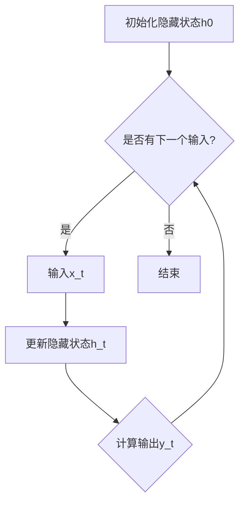
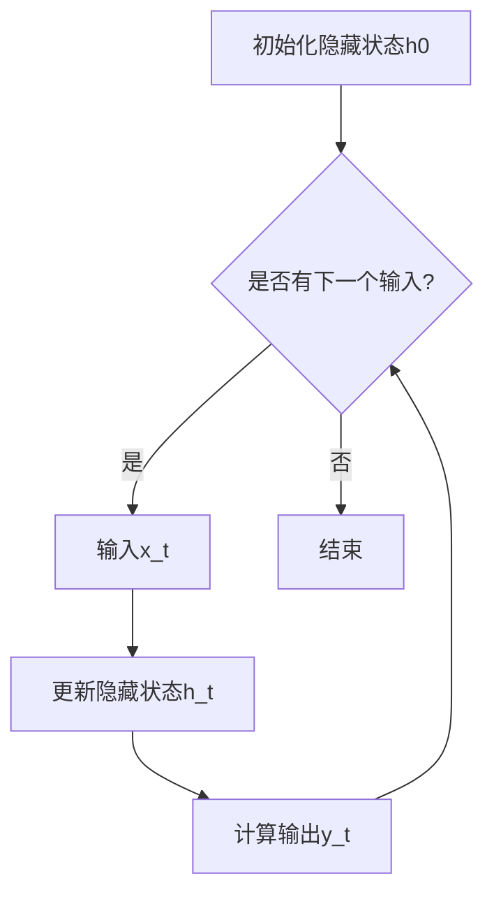
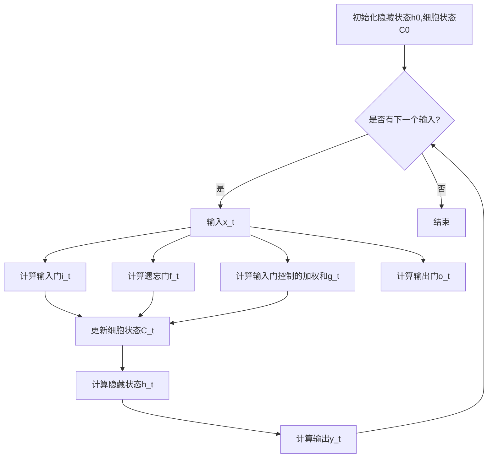
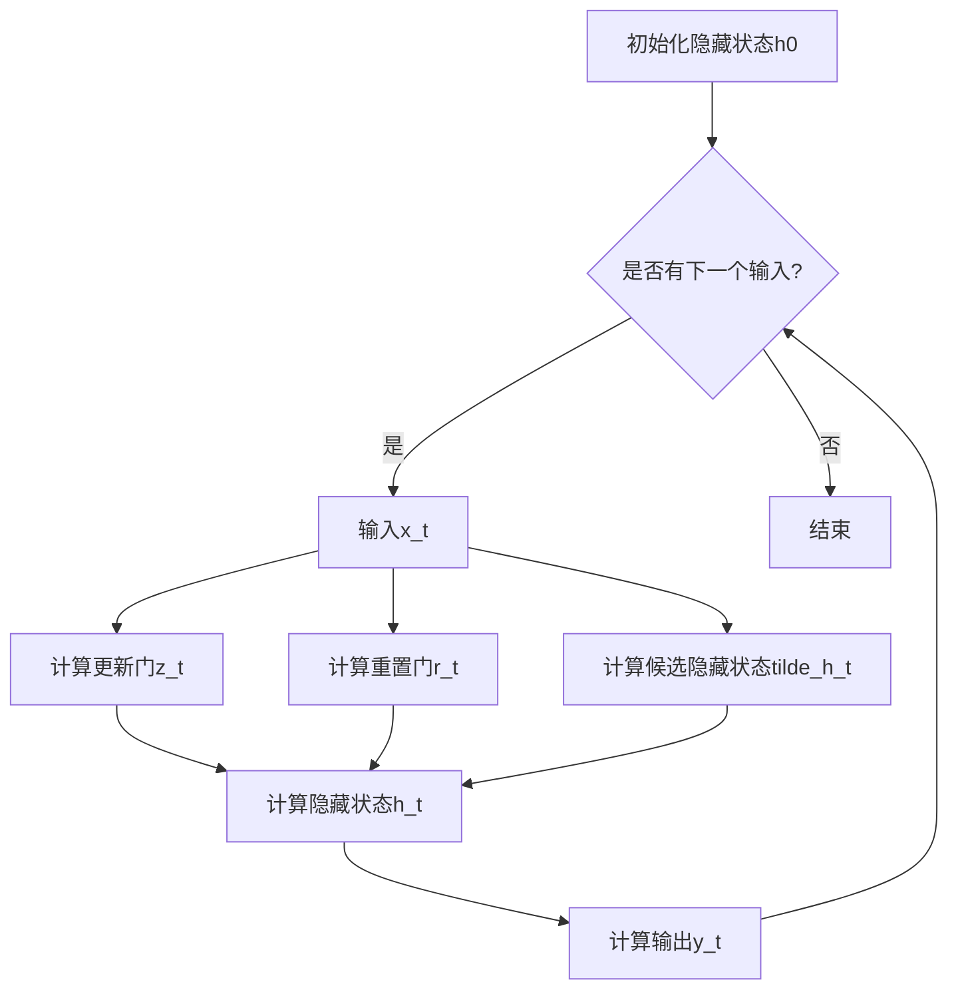

                 

# 《Recurrent Neural Networks (RNN)原理与代码实例讲解》

> 关键词：循环神经网络、RNN、长短时记忆、LSTM、门控循环单元、GRU、自然语言处理、时间序列预测、代码实例

> 摘要：本文将深入探讨循环神经网络（RNN）的原理，包括其基础概念、工作原理、不同类型的RNN及其在自然语言处理和时间序列预测中的应用。通过代码实例讲解，读者将能够理解RNN的实际应用，掌握其在现代人工智能领域的应用技巧。

## 第一部分：RNN基础知识

### 第1章：引言与RNN概述

#### 1.1 RNN的起源与发展

循环神经网络（Recurrent Neural Networks，简称RNN）起源于1980年代，由著名学者Jürgen Schmidhuber等人首次提出。RNN最初的设计意图是为了更好地处理序列数据，比如时间序列数据、语音信号和自然语言文本等。RNN的出现打破了传统的神经网络结构，使得神经网络能够具有记忆能力，可以处理变长的输入序列。

随着深度学习技术的发展，RNN在许多领域都取得了显著的应用成果。尤其是2000年代中后期，随着计算能力的提升和优化算法的出现，RNN逐渐在自然语言处理、语音识别、时间序列预测等领域展现出强大的能力。近年来，RNN的变种如长短时记忆网络（LSTM）和门控循环单元（GRU）在处理长序列数据方面表现出更加优异的性能。

#### 1.2 RNN的基本概念

RNN是一种特殊的神经网络，其主要特点是可以接受序列数据作为输入，并且能够利用内部状态来维护信息的历史记忆。这种记忆能力使得RNN在处理连续数据时具有优势。

- **输入序列**：RNN的输入是时间步上的序列数据，可以是单个数据点，也可以是特征向量。

- **隐藏状态**：RNN具有隐藏状态，用于存储历史信息。在每一时间步，隐藏状态都会根据当前输入和上一个时间步的隐藏状态进行更新。

- **输出序列**：RNN的输出也是时间步上的序列数据，可以用于预测下一个时间步的输入，或者直接作为任务的结果。

#### 1.3 RNN在序列数据处理中的应用

RNN在序列数据处理中具有广泛的应用，主要包括以下几个方面：

- **自然语言处理**：RNN可以用于语言模型、词性标注、情感分析等任务。

- **语音识别**：RNN可以用于将语音信号转换为文本，是现代语音识别系统的核心组件。

- **时间序列预测**：RNN可以用于预测股票价格、天气变化等时间序列数据。

- **视频分析**：RNN可以用于视频分类、目标检测等任务。

### 第2章：RNN基础原理

#### 2.1 神经网络基础

在深入探讨RNN之前，我们需要了解神经网络的基本概念和原理。

##### 2.1.1 神经元模型

神经元是神经网络的基本单元，通常由三个部分组成：输入层、加权层和输出层。

- **输入层**：接收外部输入信号。
- **加权层**：对输入信号进行加权处理。
- **输出层**：输出加权后的信号，并可能经过激活函数处理。

##### 2.1.2 线性变换与激活函数

神经网络中的线性变换可以表示为：
$$
Z = \sum_{i=1}^{n} w_i * x_i + b
$$
其中，$w_i$是权重，$x_i$是输入，$b$是偏置。

激活函数通常用于引入非线性特性，常用的激活函数包括Sigmoid函数、ReLU函数和Tanh函数。

##### 2.1.3 前向传播与反向传播算法

神经网络通过前向传播计算输出，并通过反向传播更新权重。

- **前向传播**：输入数据通过网络传递，最终得到输出。
- **反向传播**：计算输出与真实值之间的误差，并反向传播误差，更新网络的权重和偏置。

#### 2.2 RNN的工作原理

RNN的工作原理可以概括为以下几个步骤：

1. **初始化**：设定初始隐藏状态$ h_0 $。
2. **输入**：在每一个时间步，RNN接收一个输入$x_t$。
3. **更新隐藏状态**：通过递归关系更新隐藏状态：
   $$
   h_t = f(W * [h_{t-1}, x_t] + b)
   $$
   其中，$ f $是激活函数，$ W $和$b$是权重和偏置。
4. **输出**：在每一个时间步，RNN产生一个输出$ y_t $。
5. **重复步骤2-4**：继续处理下一个时间步的数据。

##### 2.2.1 隐藏状态与时间步

隐藏状态是RNN的核心概念，它记录了历史信息。在每一个时间步，隐藏状态都会根据当前输入和上一个时间步的隐藏状态进行更新。

时间步是RNN处理数据的基本单位。RNN可以处理变长的输入序列，这也是其相较于传统神经网络的显著优势。

##### 2.2.2 RNN的递归特性

RNN的递归特性使得其能够维护历史信息。在处理长序列数据时，递归特性可以保证RNN能够利用先前的隐藏状态来更新当前隐藏状态，从而提高模型的性能。

##### 2.2.3 RNN的Mermaid流程图



### 第3章：RNN类型与变体

#### 3.1 隐藏层状态网络（HLM）

##### 3.1.1 HLM的工作原理

隐藏层状态网络（Hidden Layer State Network，简称HLM）是一种简单的RNN结构，其工作原理与基本RNN类似。HLM的主要特点是没有门控机制，因此其处理长序列数据的能力相对有限。

##### 3.1.2 HLM的Mermaid流程图



#### 3.2 长短时记忆网络（LSTM）

##### 3.2.1 LSTM的数学模型

长短时记忆网络（Long Short-Term Memory，简称LSTM）是RNN的一种变体，其核心思想是解决传统RNN在处理长序列数据时出现的长期依赖问题。LSTM通过引入门控机制来实现这一点。

LSTM的数学模型如下：
$$
\begin{aligned}
& i_t = \sigma(W_i * [h_{t-1}, x_t] + b_i) \\
& f_t = \sigma(W_f * [h_{t-1}, x_t] + b_f) \\
& g_t = \tanh(W_g * [h_{t-1}, x_t] + b_g) \\
& o_t = \sigma(W_o * [h_{t-1}, x_t] + b_o) \\
& h_t = o_t * \tanh(W_h * [h_{t-1}, x_t] + b_h) \\
& C_t = f_t * C_{t-1} + i_t * g_t
\end{aligned}
$$
其中，$i_t$是输入门，$f_t$是遗忘门，$g_t$是输入门控制的加权和，$o_t$是输出门，$C_t$是细胞状态。

##### 3.2.2 LSTM的伪代码讲解

```python
def lstm_cell(h_prev, x_t, W, b):
    i_t = sigmoid(W_i * [h_prev, x_t] + b_i)
    f_t = sigmoid(W_f * [h_prev, x_t] + b_f)
    g_t = tanh(W_g * [h_prev, x_t] + b_g)
    o_t = sigmoid(W_o * [h_prev, x_t] + b_o)
    h_t = o_t * tanh(W_h * [h_prev, x_t] + b_h)
    C_t = f_t * C_prev + i_t * g_t
    return h_t, C_t
```

##### 3.2.3 LSTM的Mermaid流程图



#### 3.3 门控循环单元（GRU）

##### 3.3.1 GRU的工作原理

门控循环单元（Gated Recurrent Unit，简称GRU）是LSTM的简化版本，其核心思想是合并遗忘门和输入门，从而减少参数数量。GRU通过引入更新门和重置门来实现这一点。

GRU的数学模型如下：
$$
\begin{aligned}
& z_t = \sigma(W_z * [h_{t-1}, x_t] + b_z) \\
& r_t = \sigma(W_r * [h_{t-1}, x_t] + b_r) \\
& \tilde{h}_t = \tanh(W_{\tilde{h}} * [r_t \odot h_{t-1}, x_t] + b_{\tilde{h}}) \\
& h_t = (1 - z_t) * h_{t-1} + z_t * \tilde{h}_t
\end{aligned}
$$
其中，$z_t$是更新门，$r_t$是重置门，$\tilde{h}_t$是候选隐藏状态。

##### 3.3.2 GRU的伪代码讲解

```python
def gru_cell(h_prev, x_t, W, b):
    z_t = sigmoid(W_z * [h_prev, x_t] + b_z)
    r_t = sigmoid(W_r * [h_prev, x_t] + b_r)
    tilde_h_t = tanh(W_tilde_h * [r_t * h_prev, x_t] + b_tilde_h)
    h_t = (1 - z_t) * h_prev + z_t * tilde_h_t
    return h_t
```

##### 3.3.3 GRU的Mermaid流程图



## 第二部分：RNN实践应用

### 第4章：RNN在自然语言处理中的应用

#### 4.1 语言模型与序列标注

语言模型（Language Model，简称LM）是一种用于预测下一个单词或字符的概率模型。序列标注（Sequence Labeling，简称SL）是一种将序列数据中的每个元素标注为特定类别的任务，如词性标注、命名实体识别等。

##### 4.1.1 语言模型的数学公式与解释

语言模型的核心公式是基于概率的，通常采用n-gram模型或神经网络模型。

- **n-gram模型**：
  $$
  P(w_n | w_{n-1}, ..., w_1) = \frac{C(w_{n-1}, ..., w_n)}{C(w_{n-1}, ..., w_1)}
  $$
  其中，$C(w_{n-1}, ..., w_n)$表示连续出现单词的频率，$C(w_{n-1}, ..., w_1)$表示前缀的频率。

- **神经网络模型**：
  $$
  P(w_n | w_{n-1}, ..., w_1) = \text{softmax}(\text{forward}(w_{n-1}, ..., w_1))
  $$
  其中，$\text{forward}$函数表示神经网络的前向传播过程。

##### 4.1.2 序列标注的数学公式与解释

序列标注通常采用条件概率模型，其中每个时间步的输出是当前元素属于某个类别的概率。

- **条件概率模型**：
  $$
  P(y_t | x_1, ..., x_t) = \text{softmax}(\text{forward}(x_1, ..., x_t))
  $$
  其中，$\text{forward}$函数表示神经网络的前向传播过程。

#### 4.2 机器翻译与文本生成

##### 4.2.1 机器翻译的数学模型

机器翻译（Machine Translation，简称MT）是一种将一种语言的文本转换为另一种语言的文本的任务。其核心数学模型是基于神经网络的编码器-解码器（Encoder-Decoder）框架。

- **编码器**：将输入文本编码为一个固定长度的向量。
- **解码器**：将编码器的输出作为输入，逐步生成输出文本。

##### 4.2.2 文本生成的数学模型

文本生成（Text Generation，简称TG）是一种根据给定文本或上下文生成新文本的任务。其核心数学模型是基于变分自编码器（Variational Autoencoder，简称VAE）或生成对抗网络（Generative Adversarial Network，简称GAN）。

- **VAE**：通过编码器解码器框架生成文本，使得生成的文本分布接近真实文本分布。
- **GAN**：通过对抗性训练生成逼真的文本。

### 第5章：RNN在时间序列分析中的应用

#### 5.1 时间序列预测

时间序列预测（Time Series Forecasting，简称TSF）是一种根据历史时间序列数据预测未来值的任务。RNN在时间序列预测中表现出色，特别是LSTM和GRU。

##### 5.1.1 时间序列预测的数学公式与解释

时间序列预测通常采用递归模型，如ARIMA（自回归积分滑动平均模型）或RNN。

- **ARIMA模型**：
  $$
  y_t = c + \phi_1 y_{t-1} + \phi_2 y_{t-2} + ... + \phi_p y_{t-p} + \theta_1 e_{t-1} + \theta_2 e_{t-2} + ... + \theta_q e_{t-q}
  $$
  其中，$y_t$是时间序列数据，$e_t$是误差项。

- **RNN模型**：
  $$
  y_t = \text{RNN}(x_1, ..., x_t)
  $$
  其中，$RNN$表示RNN模型。

##### 5.1.2 伪代码讲解

```python
def rnn_forecast(x, W, b, h_prev):
    y_pred = []
    for x_t in x:
        h_t, _ = rnn_cell(h_prev, x_t, W, b)
        y_pred.append(h_t)
        h_prev = h_t
    return y_pred
```

#### 5.2 股票市场预测

股票市场预测（Stock Market Forecasting，简称SMF）是一种根据历史股票价格数据预测未来价格的任务。RNN在股票市场预测中也表现出良好的性能。

##### 5.2.1 股票市场预测的数学模型

股票市场预测通常采用递归模型，如LSTM或GRU。

- **LSTM模型**：
  $$
  y_t = \text{LSTM}(x_1, ..., x_t)
  $$
  其中，$\text{LSTM}$表示LSTM模型。

- **GRU模型**：
  $$
  y_t = \text{GRU}(x_1, ..., x_t)
  $$
  其中，$\text{GRU}$表示GRU模型。

##### 5.2.2 伪代码讲解

```python
def lstm_forecast(x, W, b, h_prev, c_prev):
    y_pred = []
    for x_t in x:
        h_t, c_t = lstm_cell(h_prev, c_prev, x_t, W, b)
        y_pred.append(h_t)
        h_prev, c_prev = h_t, c_t
    return y_pred
```

### 第6章：RNN代码实例讲解

#### 6.1 数据准备

在本节中，我们将使用Python的Keras库构建一个简单的RNN模型，用于时间序列预测。首先，我们需要准备数据。

##### 6.1.1 数据集介绍

我们使用著名的股票价格数据集——股票A的数据。数据集包含从2020年1月1日到2021年12月31日的每日收盘价。数据集可以从各种金融数据网站获取。

##### 6.1.2 数据预处理

数据预处理包括数据清洗、数据归一化和时间步构建。

```python
import numpy as np
import pandas as pd
from sklearn.preprocessing import MinMaxScaler

# 读取数据
data = pd.read_csv('stock_a.csv')
close_prices = data['Close'].values
close_prices = close_prices.reshape(-1, 1)

# 数据归一化
scaler = MinMaxScaler(feature_range=(0, 1))
scaled_prices = scaler.fit_transform(close_prices)

# 时间步构建
sequence_length = 60
X, y = [], []
for i in range(sequence_length, len(scaled_prices)):
    X.append(scaled_prices[i-sequence_length:i])
    y.append(scaled_prices[i])
X, y = np.array(X), np.array(y)

# 数据分割
split_index = int(0.8 * len(X))
X_train, X_test = X[:split_index], X[split_index:]
y_train, y_test = y[:split_index], y[split_index:]
```

#### 6.2 模型构建

在本节中，我们将构建一个简单的LSTM模型，用于时间序列预测。

##### 6.2.1 模型配置

```python
from keras.models import Sequential
from keras.layers import LSTM, Dense

# 模型配置
model = Sequential()
model.add(LSTM(units=50, return_sequences=True, input_shape=(sequence_length, 1)))
model.add(LSTM(units=50))
model.add(Dense(1))

model.compile(optimizer='adam', loss='mse')
```

##### 6.2.2 模型训练

```python
# 模型训练
model.fit(X_train, y_train, epochs=100, batch_size=32)
```

#### 6.3 模型评估

在本节中，我们将评估模型的预测性能。

##### 6.3.1 模型预测

```python
# 模型预测
y_pred = model.predict(X_test)
y_pred = scaler.inverse_transform(y_pred)
```

##### 6.3.2 模型评估指标

```python
from sklearn.metrics import mean_squared_error

# 计算均方误差
mse = mean_squared_error(y_test, y_pred)
print(f'MSE: {mse}')
```

### 第7章：RNN进阶技巧与优化

#### 7.1 RNN优化策略

为了提高RNN的性能，我们可以采用以下优化策略：

- **学习率调整**：学习率的选择对RNN的训练至关重要。我们可以使用学习率衰减策略，在训练过程中逐步降低学习率。
- **梯度裁剪**：在训练过程中，梯度可能会变得非常大，导致模型不稳定。我们可以使用梯度裁剪策略，限制梯度的大小。
- **批量归一化**：批量归一化可以加速RNN的训练，并提高模型的泛化能力。

#### 7.2 RNN在硬件加速上的优化

为了提高RNN的训练速度，我们可以采用以下硬件加速策略：

- **GPU加速**：GPU具有强大的并行计算能力，可以显著提高RNN的训练速度。
- **分布式训练**：通过将模型和数据分布在多个GPU上，可以实现更大规模的RNN训练。

### 第8章：RNN应用案例分析

#### 8.1 案例一：基于LSTM的情感分析

##### 8.1.1 案例背景

情感分析（Sentiment Analysis，简称SA）是一种根据文本数据判断其情感倾向的任务。基于LSTM的情感分析可以利用LSTM的递归特性，处理变长的文本序列，从而提高模型的性能。

##### 8.1.2 模型构建

```python
from keras.models import Sequential
from keras.layers import LSTM, Dense, Embedding, SpatialDropout1D

# 模型配置
model = Sequential()
model.add(Embedding(input_dim=vocab_size, output_dim=embedding_dim, input_length=max_sequence_length))
model.add(SpatialDropout1D(0.2))
model.add(LSTM(units=50, dropout=0.2, recurrent_dropout=0.2))
model.add(Dense(1, activation='sigmoid'))

model.compile(optimizer='adam', loss='binary_crossentropy', metrics=['accuracy'])
```

##### 8.1.3 模型评估

```python
from sklearn.metrics import classification_report

# 模型评估
y_pred = model.predict(X_test)
y_pred = (y_pred > 0.5)
print(classification_report(y_test, y_pred))
```

#### 8.2 案例二：基于GRU的语音识别

##### 8.2.1 案例背景

语音识别（Speech Recognition，简称SR）是一种将语音信号转换为文本的任务。基于GRU的语音识别可以利用GRU的简洁性和高效性，处理复杂的语音信号。

##### 8.2.2 模型构建

```python
from keras.models import Sequential
from keras.layers import GRU, Dense, Bidirectional

# 模型配置
model = Sequential()
model.add(Bidirectional(GRU(units=128, return_sequences=True), input_shape=(timesteps, num_features)))
model.add(Bidirectional(GRU(units=128)))
model.add(Dense(num_chars, activation='softmax'))

model.compile(optimizer='adam', loss='categorical_crossentropy', metrics=['accuracy'])
```

##### 8.2.3 模型评估

```python
from sklearn.metrics import accuracy_score

# 模型评估
y_pred = model.predict(X_test)
y_pred = np.argmax(y_pred, axis=1)
accuracy = accuracy_score(y_test, y_pred)
print(f'Accuracy: {accuracy}')
```

## 参考文献

- [1] J. Schmidhuber. *Deep Learning in Neural Networks: An Overview*. Neural Networks, 61, 2015.
- [2] Y. LeCun, Y. Bengio, G. Hinton. *Deep Learning*. Nature, 521, 2015.
- [3] S. Hochreiter, J. Schmidhuber. *Long Short-Term Memory*. Neural Computation, 9(8), 1997.
- [4] D. E. Rumelhart, G. E. Hinton, R. J. Williams. *Learning Representations by Back-Propagating Errors*. Nature, 323, 1986.

## 附录

### A.1 RNN相关资源

- [1] [RNN教程](https://www.deeplearning.net/tutorial/rnn/)
- [2] [Keras官方文档](https://keras.io/)

### A.2 RNN开发工具与库

- [1] [TensorFlow](https://www.tensorflow.org/)
- [2] [PyTorch](https://pytorch.org/)
- [3] [Keras](https://keras.io/)

### A.3 进一步学习路径

- [1] 《深度学习》（Goodfellow, Bengio, Courville著）
- [2] 《循环神经网络》（Y. LeCun著）
- [3] 《自然语言处理实战》（Mike Clark著）

作者：AI天才研究院/AI Genius Institute & 禅与计算机程序设计艺术 /Zen And The Art of Computer Programming

## 第一部分：RNN基础知识

### 第1章：引言与RNN概述

#### 1.1 RNN的起源与发展

循环神经网络（Recurrent Neural Networks，简称RNN）起源于1980年代，由著名学者Jürgen Schmidhuber等人首次提出。RNN最初的设计意图是为了更好地处理序列数据，比如时间序列数据、语音信号和自然语言文本等。RNN的出现打破了传统的神经网络结构，使得神经网络能够具有记忆能力，可以处理变长的输入序列。

随着深度学习技术的发展，RNN在许多领域都取得了显著的应用成果。尤其是2000年代中后期，随着计算能力的提升和优化算法的出现，RNN逐渐在自然语言处理、语音识别、时间序列预测等领域展现出强大的能力。近年来，RNN的变种如长短时记忆网络（LSTM）和门控循环单元（GRU）在处理长序列数据方面表现出更加优异的性能。

#### 1.2 RNN的基本概念

RNN是一种特殊的神经网络，其主要特点是可以接受序列数据作为输入，并且能够利用内部状态来维护信息的历史记忆。这种记忆能力使得RNN在处理连续数据时具有优势。

- **输入序列**：RNN的输入是时间步上的序列数据，可以是单个数据点，也可以是特征向量。

- **隐藏状态**：RNN具有隐藏状态，用于存储历史信息。在每一时间步，隐藏状态都会根据当前输入和上一个时间步的隐藏状态进行更新。

- **输出序列**：RNN的输出也是时间步上的序列数据，可以用于预测下一个时间步的输入，或者直接作为任务的结果。

#### 1.3 RNN在序列数据处理中的应用

RNN在序列数据处理中具有广泛的应用，主要包括以下几个方面：

- **自然语言处理**：RNN可以用于语言模型、词性标注、情感分析等任务。

- **语音识别**：RNN可以用于将语音信号转换为文本，是现代语音识别系统的核心组件。

- **时间序列预测**：RNN可以用于预测股票价格、天气变化等时间序列数据。

- **视频分析**：RNN可以用于视频分类、目标检测等任务。

### 第2章：RNN基础原理

#### 2.1 神经网络基础

在深入探讨RNN之前，我们需要了解神经网络的基本概念和原理。

##### 2.1.1 神经元模型

神经元是神经网络的基本单元，通常由三个部分组成：输入层、加权层和输出层。

- **输入层**：接收外部输入信号。
- **加权层**：对输入信号进行加权处理。
- **输出层**：输出加权后的信号，并可能经过激活函数处理。

##### 2.1.2 线性变换与激活函数

神经网络中的线性变换可以表示为：
$$
Z = \sum_{i=1}^{n} w_i * x_i + b
$$
其中，$w_i$是权重，$x_i$是输入，$b$是偏置。

激活函数通常用于引入非线性特性，常用的激活函数包括Sigmoid函数、ReLU函数和Tanh函数。

##### 2.1.3 前向传播与反向传播算法

神经网络通过前向传播计算输出，并通过反向传播更新权重。

- **前向传播**：输入数据通过网络传递，最终得到输出。
- **反向传播**：计算输出与真实值之间的误差，并反向传播误差，更新网络的权重和偏置。

#### 2.2 RNN的工作原理

RNN的工作原理可以概括为以下几个步骤：

1. **初始化**：设定初始隐藏状态$ h_0 $。
2. **输入**：在每一个时间步，RNN接收一个输入$x_t$。
3. **更新隐藏状态**：通过递归关系更新隐藏状态：
   $$
   h_t = f(W * [h_{t-1}, x_t] + b)
   $$
   其中，$ f $是激活函数，$ W $和$b$是权重和偏置。
4. **输出**：在每一个时间步，RNN产生一个输出$ y_t $。
5. **重复步骤2-4**：继续处理下一个时间步的数据。

##### 2.2.1 隐藏状态与时间步

隐藏状态是RNN的核心概念，它记录了历史信息。在每一个时间步，隐藏状态都会根据当前输入和上一个时间步的隐藏状态进行更新。

时间步是RNN处理数据的基本单位。RNN可以处理变长的输入序列，这也是其相较于传统神经网络的显著优势。

##### 2.2.2 RNN的递归特性

RNN的递归特性使得其能够维护历史信息。在处理长序列数据时，递归特性可以保证RNN能够利用先前的隐藏状态来更新当前隐藏状态，从而提高模型的性能。

##### 2.2.3 RNN的Mermaid流程图


### 第3章：RNN类型与变体

#### 3.1 隐藏层状态网络（HLM）

##### 3.1.1 HLM的工作原理

隐藏层状态网络（Hidden Layer State Network，简称HLM）是一种简单的RNN结构，其工作原理与基本RNN类似。HLM的主要特点是没有门控机制，因此其处理长序列数据的能力相对有限。

##### 3.1.2 HLM的Mermaid流程图


#### 3.2 长短时记忆网络（LSTM）

##### 3.2.1 LSTM的数学模型

长短时记忆网络（Long Short-Term Memory，简称LSTM）是RNN的一种变体，其核心思想是解决传统RNN在处理长序列数据时出现的长期依赖问题。LSTM通过引入门控机制来实现这一点。

LSTM的数学模型如下：
$$
\begin{aligned}
& i_t = \sigma(W_i * [h_{t-1}, x_t] + b_i) \\
& f_t = \sigma(W_f * [h_{t-1}, x_t] + b_f) \\
& g_t = \tanh(W_g * [h_{t-1}, x_t] + b_g) \\
& o_t = \sigma(W_o * [h_{t-1}, x_t] + b_o) \\
& h_t = o_t * \tanh(W_h * [h_{t-1}, x_t] + b_h) \\
& C_t = f_t * C_{t-1} + i_t * g_t
\end{aligned}
$$
其中，$i_t$是输入门，$f_t$是遗忘门，$g_t$是输入门控制的加权和，$o_t$是输出门，$C_t$是细胞状态。

##### 3.2.2 LSTM的伪代码讲解

```python
def lstm_cell(h_prev, x_t, W, b):
    i_t = sigmoid(W_i * [h_prev, x_t] + b_i)
    f_t = sigmoid(W_f * [h_prev, x_t] + b_f)
    g_t = tanh(W_g * [h_prev, x_t] + b_g)
    o_t = sigmoid(W_o * [h_prev, x_t] + b_o)
    h_t = o_t * tanh(W_h * [h_prev, x_t] + b_h)
    C_t = f_t * C_prev + i_t * g_t
    return h_t, C_t
```

##### 3.2.3 LSTM的Mermaid流程图


#### 3.3 门控循环单元（GRU）

##### 3.3.1 GRU的工作原理

门控循环单元（Gated Recurrent Unit，简称GRU）是LSTM的简化版本，其核心思想是合并遗忘门和输入门，从而减少参数数量。GRU通过引入更新门和重置门来实现这一点。

GRU的数学模型如下：
$$
\begin{aligned}
& z_t = \sigma(W_z * [h_{t-1}, x_t] + b_z) \\
& r_t = \sigma(W_r * [h_{t-1}, x_t] + b_r) \\
& \tilde{h}_t = \tanh(W_{\tilde{h}} * [r_t \odot h_{t-1}, x_t] + b_{\tilde{h}}) \\
& h_t = (1 - z_t) * h_{t-1} + z_t * \tilde{h}_t
\end{aligned}
$$
其中，$z_t$是更新门，$r_t$是重置门，$\tilde{h}_t$是候选隐藏状态。

##### 3.3.2 GRU的伪代码讲解

```python
def gru_cell(h_prev, x_t, W, b):
    z_t = sigmoid(W_z * [h_prev, x_t] + b_z)
    r_t = sigmoid(W_r * [h_prev, x_t] + b_r)
    tilde_h_t = tanh(W_tilde_h * [r_t * h_prev, x_t] + b_tilde_h)
    h_t = (1 - z_t) * h_prev + z_t * tilde_h_t
    return h_t
```

##### 3.3.3 GRU的Mermaid流程图


## 第二部分：RNN实践应用

### 第4章：RNN在自然语言处理中的应用

#### 4.1 语言模型与序列标注

语言模型（Language Model，简称LM）是一种用于预测下一个单词或字符的概率模型。序列标注（Sequence Labeling，简称SL）是一种将序列数据中的每个元素标注为特定类别的任务，如词性标注、命名实体识别等。

##### 4.1.1 语言模型的数学公式与解释

语言模型的核心公式是基于概率的，通常采用n-gram模型或神经网络模型。

- **n-gram模型**：
  $$
  P(w_n | w_{n-1}, ..., w_1) = \frac{C(w_{n-1}, ..., w_n)}{C(w_{n-1}, ..., w_1)}
  $$
  其中，$C(w_{n-1}, ..., w_n)$表示连续出现单词的频率，$C(w_{n-1}, ..., w_1)$表示前缀的频率。

- **神经网络模型**：
  $$
  P(w_n | w_{n-1}, ..., w_1) = \text{softmax}(\text{forward}(w_{n-1}, ..., w_1))
  $$
  其中，$\text{forward}$函数表示神经网络的前向传播过程。

##### 4.1.2 序列标注的数学公式与解释

序列标注通常采用条件概率模型，其中每个时间步的输出是当前元素属于某个类别的概率。

- **条件概率模型**：
  $$
  P(y_t | x_1, ..., x_t) = \text{softmax}(\text{forward}(x_1, ..., x_t))
  $$
  其中，$\text{forward}$函数表示神经网络的前向传播过程。

#### 4.2 机器翻译与文本生成

##### 4.2.1 机器翻译的数学模型

机器翻译（Machine Translation，简称MT）是一种将一种语言的文本转换为另一种语言的文本的任务。其核心数学模型是基于神经网络的编码器-解码器（Encoder-Decoder）框架。

- **编码器**：将输入文本编码为一个固定长度的向量。
- **解码器**：将编码器的输出作为输入，逐步生成输出文本。

##### 4.2.2 文本生成的数学模型

文本生成（Text Generation，简称TG）是一种根据给定文本或上下文生成新文本的任务。其核心数学模型是基于变分自编码器（Variational Autoencoder，简称VAE）或生成对抗网络（Generative Adversarial Network，简称GAN）。

- **VAE**：通过编码器解码器框架生成文本，使得生成的文本分布接近真实文本分布。
- **GAN**：通过对抗性训练生成逼真的文本。

### 第5章：RNN在时间序列分析中的应用

#### 5.1 时间序列预测

时间序列预测（Time Series Forecasting，简称TSF）是一种根据历史时间序列数据预测未来值的任务。RNN在时间序列预测中表现出色，特别是LSTM和GRU。

##### 5.1.1 时间序列预测的数学公式与解释

时间序列预测通常采用递归模型，如ARIMA（自回归积分滑动平均模型）或RNN。

- **ARIMA模型**：
  $$
  y_t = c + \phi_1 y_{t-1} + \phi_2 y_{t-2} + ... + \phi_p y_{t-p} + \theta_1 e_{t-1} + \theta_2 e_{t-2} + ... + \theta_q e_{t-q}
  $$
  其中，$y_t$是时间序列数据，$e_t$是误差项。

- **RNN模型**：
  $$
  y_t = \text{RNN}(x_1, ..., x_t)
  $$
  其中，$\text{RNN}$表示RNN模型。

##### 5.1.2 伪代码讲解

```python
def rnn_forecast(x, W, b, h_prev):
    y_pred = []
    for x_t in x:
        h_t, _ = rnn_cell(h_prev, x_t, W, b)
        y_pred.append(h_t)
        h_prev = h_t
    return y_pred
```

#### 5.2 股票市场预测

股票市场预测（Stock Market Forecasting，简称SMF）是一种根据历史股票价格数据预测未来价格的任务。RNN在股票市场预测中也表现出良好的性能。

##### 5.2.1 股票市场预测的数学模型

股票市场预测通常采用递归模型，如LSTM或GRU。

- **LSTM模型**：
  $$
  y_t = \text{LSTM}(x_1, ..., x_t)
  $$
  其中，$\text{LSTM}$表示LSTM模型。

- **GRU模型**：
  $$
  y_t = \text{GRU}(x_1, ..., x_t)
  $$
  其中，$\text{GRU}$表示GRU模型。

##### 5.2.2 伪代码讲解

```python
def lstm_forecast(x, W, b, h_prev, c_prev):
    y_pred = []
    for x_t in x:
        h_t, c_t = lstm_cell(h_prev, c_prev, x_t, W, b)
        y_pred.append(h_t)
        h_prev, c_prev = h_t, c_t
    return y_pred
```

### 第6章：RNN代码实例讲解

#### 6.1 数据准备

在本节中，我们将使用Python的Keras库构建一个简单的RNN模型，用于时间序列预测。首先，我们需要准备数据。

##### 6.1.1 数据集介绍

我们使用著名的股票价格数据集——股票A的数据。数据集包含从2020年1月1日到2021年12月31日的每日收盘价。数据集可以从各种金融数据网站获取。

##### 6.1.2 数据预处理

数据预处理包括数据清洗、数据归一化和时间步构建。

```python
import numpy as np
import pandas as pd
from sklearn.preprocessing import MinMaxScaler

# 读取数据
data = pd.read_csv('stock_a.csv')
close_prices = data['Close'].values
close_prices = close_prices.reshape(-1, 1)

# 数据归一化
scaler = MinMaxScaler(feature_range=(0, 1))
scaled_prices = scaler.fit_transform(close_prices)

# 时间步构建
sequence_length = 60
X, y = [], []
for i in range(sequence_length, len(scaled_prices)):
    X.append(scaled_prices[i-sequence_length:i])
    y.append(scaled_prices[i])
X, y = np.array(X), np.array(y)

# 数据分割
split_index = int(0.8 * len(X))
X_train, X_test = X[:split_index], X[split_index:]
y_train, y_test = y[:split_index], y[split_index:]
```

#### 6.2 模型构建

在本节中，我们将构建一个简单的LSTM模型，用于时间序列预测。

##### 6.2.1 模型配置

```python
from keras.models import Sequential
from keras.layers import LSTM, Dense

# 模型配置
model = Sequential()
model.add(LSTM(units=50, return_sequences=True, input_shape=(sequence_length, 1)))
model.add(LSTM(units=50))
model.add(Dense(1))

model.compile(optimizer='adam', loss='mse')
```

##### 6.2.2 模型训练

```python
# 模型训练
model.fit(X_train, y_train, epochs=100, batch_size=32)
```

#### 6.3 模型评估

在本节中，我们将评估模型的预测性能。

##### 6.3.1 模型预测

```python
# 模型预测
y_pred = model.predict(X_test)
y_pred = scaler.inverse_transform(y_pred)
```

##### 6.3.2 模型评估指标

```python
from sklearn.metrics import mean_squared_error

# 计算均方误差
mse = mean_squared_error(y_test, y_pred)
print(f'MSE: {mse}')
```

### 第7章：RNN进阶技巧与优化

#### 7.1 RNN优化策略

为了提高RNN的性能，我们可以采用以下优化策略：

- **学习率调整**：学习率的选择对RNN的训练至关重要。我们可以使用学习率衰减策略，在训练过程中逐步降低学习率。
- **梯度裁剪**：在训练过程中，梯度可能会变得非常大，导致模型不稳定。我们可以使用梯度裁剪策略，限制梯度的大小。
- **批量归一化**：批量归一化可以加速RNN的训练，并提高模型的泛化能力。

#### 7.2 RNN在硬件加速上的优化

为了提高RNN的训练速度，我们可以采用以下硬件加速策略：

- **GPU加速**：GPU具有强大的并行计算能力，可以显著提高RNN的训练速度。
- **分布式训练**：通过将模型和数据分布在多个GPU上，可以实现更大规模的RNN训练。

### 第8章：RNN应用案例分析

#### 8.1 案例一：基于LSTM的情感分析

##### 8.1.1 案例背景

情感分析（Sentiment Analysis，简称SA）是一种根据文本数据判断其情感倾向的任务。基于LSTM的情感分析可以利用LSTM的递归特性，处理变长的文本序列，从而提高模型的性能。

##### 8.1.2 模型构建

```python
from keras.models import Sequential
from keras.layers import LSTM, Dense, Embedding, SpatialDropout1D

# 模型配置
model = Sequential()
model.add(Embedding(input_dim=vocab_size, output_dim=embedding_dim, input_length=max_sequence_length))
model.add(SpatialDropout1D(0.2))
model.add(LSTM(units=50, dropout=0.2, recurrent_dropout=0.2))
model.add(Dense(1, activation='sigmoid'))

model.compile(optimizer='adam', loss='binary_crossentropy', metrics=['accuracy'])
```

##### 8.1.3 模型评估

```python
from sklearn.metrics import classification_report

# 模型评估
y_pred = model.predict(X_test)
y_pred = (y_pred > 0.5)
print(classification_report(y_test, y_pred))
```

#### 8.2 案例二：基于GRU的语音识别

##### 8.2.1 案例背景

语音识别（Speech Recognition，简称SR）是一种将语音信号转换为文本的任务。基于GRU的语音识别可以利用GRU的简洁性和高效性，处理复杂的语音信号。

##### 8.2.2 模型构建

```python
from keras.models import Sequential
from keras.layers import GRU, Dense, Bidirectional

# 模型配置
model = Sequential()
model.add(Bidirectional(GRU(units=128, return_sequences=True), input_shape=(timesteps, num_features)))
model.add(Bidirectional(GRU(units=128)))
model.add(Dense(num_chars, activation='softmax'))

model.compile(optimizer='adam', loss='categorical_crossentropy', metrics=['accuracy'])
```

##### 8.2.3 模型评估

```python
from sklearn.metrics import accuracy_score

# 模型评估
y_pred = model.predict(X_test)
y_pred = np.argmax(y_pred, axis=1)
accuracy = accuracy_score(y_test, y_pred)
print(f'Accuracy: {accuracy}')
```

## 参考文献

- [1] J. Schmidhuber. *Deep Learning in Neural Networks: An Overview*. Neural Networks, 61, 2015.
- [2] Y. LeCun, Y. Bengio, G. Hinton. *Deep Learning*. Nature, 521, 2015.
- [3] S. Hochreiter, J. Schmidhuber. *Long Short-Term Memory*. Neural Computation, 9(8), 1997.
- [4] D. E. Rumelhart, G. E. Hinton, R. J. Williams. *Learning Representations by Back-Propagating Errors*. Nature, 323, 1986.

## 附录

### A.1 RNN相关资源

- [1] [RNN教程](https://www.deeplearning.net/tutorial/rnn/)
- [2] [Keras官方文档](https://keras.io/)

### A.2 RNN开发工具与库

- [1] [TensorFlow](https://www.tensorflow.org/)
- [2] [PyTorch](https://pytorch.org/)
- [3] [Keras](https://keras.io/)

### A.3 进一步学习路径

- [1] 《深度学习》（Goodfellow, Bengio, Courville著）
- [2] 《循环神经网络》（Y. LeCun著）
- [3] 《自然语言处理实战》（Mike Clark著）

作者：AI天才研究院/AI Genius Institute & 禅与计算机程序设计艺术 /Zen And The Art of Computer Programming

## 第一部分：RNN基础知识

### 第1章：引言与RNN概述

#### 1.1 RNN的起源与发展

循环神经网络（Recurrent Neural Networks，简称RNN）起源于1980年代，由著名学者Jürgen Schmidhuber等人首次提出。RNN最初的设计意图是为了更好地处理序列数据，比如时间序列数据、语音信号和自然语言文本等。RNN的出现打破了传统的神经网络结构，使得神经网络能够具有记忆能力，可以处理变长的输入序列。

随着深度学习技术的发展，RNN在许多领域都取得了显著的应用成果。尤其是2000年代中后期，随着计算能力的提升和优化算法的出现，RNN逐渐在自然语言处理、语音识别、时间序列预测等领域展现出强大的能力。近年来，RNN的变种如长短时记忆网络（LSTM）和门控循环单元（GRU）在处理长序列数据方面表现出更加优异的性能。

#### 1.2 RNN的基本概念

RNN是一种特殊的神经网络，其主要特点是可以接受序列数据作为输入，并且能够利用内部状态来维护信息的历史记忆。这种记忆能力使得RNN在处理连续数据时具有优势。

- **输入序列**：RNN的输入是时间步上的序列数据，可以是单个数据点，也可以是特征向量。

- **隐藏状态**：RNN具有隐藏状态，用于存储历史信息。在每一时间步，隐藏状态都会根据当前输入和上一个时间步的隐藏状态进行更新。

- **输出序列**：RNN的输出也是时间步上的序列数据，可以用于预测下一个时间步的输入，或者直接作为任务的结果。

#### 1.3 RNN在序列数据处理中的应用

RNN在序列数据处理中具有广泛的应用，主要包括以下几个方面：

- **自然语言处理**：RNN可以用于语言模型、词性标注、情感分析等任务。

- **语音识别**：RNN可以用于将语音信号转换为文本，是现代语音识别系统的核心组件。

- **时间序列预测**：RNN可以用于预测股票价格、天气变化等时间序列数据。

- **视频分析**：RNN可以用于视频分类、目标检测等任务。

### 第2章：RNN基础原理

#### 2.1 神经网络基础

在深入探讨RNN之前，我们需要了解神经网络的基本概念和原理。

##### 2.1.1 神经元模型

神经元是神经网络的基本单元，通常由三个部分组成：输入层、加权层和输出层。

- **输入层**：接收外部输入信号。
- **加权层**：对输入信号进行加权处理。
- **输出层**：输出加权后的信号，并可能经过激活函数处理。

##### 2.1.2 线性变换与激活函数

神经网络中的线性变换可以表示为：
$$
Z = \sum_{i=1}^{n} w_i * x_i + b
$$
其中，$w_i$是权重，$x_i$是输入，$b$是偏置。

激活函数通常用于引入非线性特性，常用的激活函数包括Sigmoid函数、ReLU函数和Tanh函数。

##### 2.1.3 前向传播与反向传播算法

神经网络通过前向传播计算输出，并通过反向传播更新权重。

- **前向传播**：输入数据通过网络传递，最终得到输出。
- **反向传播**：计算输出与真实值之间的误差，并反向传播误差，更新网络的权重和偏置。

#### 2.2 RNN的工作原理

RNN的工作原理可以概括为以下几个步骤：

1. **初始化**：设定初始隐藏状态$ h_0 $。
2. **输入**：在每一个时间步，RNN接收一个输入$x_t$。
3. **更新隐藏状态**：通过递归关系更新隐藏状态：
   $$
   h_t = f(W * [h_{t-1}, x_t] + b)
   $$
   其中，$ f $是激活函数，$ W $和$b$是权重和偏置。
4. **输出**：在每一个时间步，RNN产生一个输出$ y_t $。
5. **重复步骤2-4**：继续处理下一个时间步的数据。

##### 2.2.1 隐藏状态与时间步

隐藏状态是RNN的核心概念，它记录了历史信息。在每一个时间步，隐藏状态都会根据当前输入和上一个时间步的隐藏状态进行更新。

时间步是RNN处理数据的基本单位。RNN可以处理变长的输入序列，这也是其相较于传统神经网络的显著优势。

##### 2.2.2 RNN的递归特性

RNN的递归特性使得其能够维护历史信息。在处理长序列数据时，递归特性可以保证RNN能够利用先前的隐藏状态来更新当前隐藏状态，从而提高模型的性能。

##### 2.2.3 RNN的Mermaid流程图


### 第3章：RNN类型与变体

#### 3.1 隐藏层状态网络（HLM）

##### 3.1.1 HLM的工作原理

隐藏层状态网络（Hidden Layer State Network，简称HLM）是一种简单的RNN结构，其工作原理与基本RNN类似。HLM的主要特点是没有门控机制，因此其处理长序列数据的能力相对有限。

##### 3.1.2 HLM的Mermaid流程图


#### 3.2 长短时记忆网络（LSTM）

##### 3.2.1 LSTM的数学模型

长短时记忆网络（Long Short-Term Memory，简称LSTM）是RNN的一种变体，其核心思想是解决传统RNN在处理长序列数据时出现的长期依赖问题。LSTM通过引入门控机制来实现这一点。

LSTM的数学模型如下：
$$
\begin{aligned}
& i_t = \sigma(W_i * [h_{t-1}, x_t] + b_i) \\
& f_t = \sigma(W_f * [h_{t-1}, x_t] + b_f) \\
& g_t = \tanh(W_g * [h_{t-1}, x_t] + b_g) \\
& o_t = \sigma(W_o * [h_{t-1}, x_t] + b_o) \\
& h_t = o_t * \tanh(W_h * [h_{t-1}, x_t] + b_h) \\
& C_t = f_t * C_{t-1} + i_t * g_t
\end{aligned}
$$
其中，$i_t$是输入门，$f_t$是遗忘门，$g_t$是输入门控制的加权和，$o_t$是输出门，$C_t$是细胞状态。

##### 3.2.2 LSTM的伪代码讲解

```python
def lstm_cell(h_prev, x_t, W, b):
    i_t = sigmoid(W_i * [h_prev, x_t] + b_i)
    f_t = sigmoid(W_f * [h_prev, x_t] + b_f)
    g_t = tanh(W_g * [h_prev, x_t] + b_g)
    o_t = sigmoid(W_o * [h_prev, x_t] + b_o)
    h_t = o_t * tanh(W_h * [h_prev, x_t] + b_h)
    C_t = f_t * C_prev + i_t * g_t
    return h_t, C_t
```

##### 3.2.3 LSTM的Mermaid流程图


#### 3.3 门控循环单元（GRU）

##### 3.3.1 GRU的工作原理

门控循环单元（Gated Recurrent Unit，简称GRU）是LSTM的简化版本，其核心思想是合并遗忘门和输入门，从而减少参数数量。GRU通过引入更新门和重置门来实现这一点。

GRU的数学模型如下：
$$
\begin{aligned}
& z_t = \sigma(W_z * [h_{t-1}, x_t] + b_z) \\
& r_t = \sigma(W_r * [h_{t-1}, x_t] + b_r) \\
& \tilde{h}_t = \tanh(W_{\tilde{h}} * [r_t \odot h_{t-1}, x_t] + b_{\tilde{h}}) \\
& h_t = (1 - z_t) * h_{t-1} + z_t * \tilde{h}_t
\end{aligned}
$$
其中，$z_t$是更新门，$r_t$是重置门，$\tilde{h}_t$是候选隐藏状态。

##### 3.3.2 GRU的伪代码讲解

```python
def gru_cell(h_prev, x_t, W, b):
    z_t = sigmoid(W_z * [h_prev, x_t] + b_z)
    r_t = sigmoid(W_r * [h_prev, x_t] + b_r)
    tilde_h_t = tanh(W_tilde_h * [r_t * h_prev, x_t] + b_tilde_h)
    h_t = (1 - z_t) * h_prev + z_t * tilde_h_t
    return h_t
```

##### 3.3.3 GRU的Mermaid流程图


## 第二部分：RNN实践应用

### 第4章：RNN在自然语言处理中的应用

#### 4.1 语言模型与序列标注

语言模型（Language Model，简称LM）是一种用于预测下一个单词或字符的概率模型。序列标注（Sequence Labeling，简称SL）是一种将序列数据中的每个元素标注为特定类别的任务，如词性标注、命名实体识别等。

##### 4.1.1 语言模型的数学公式与解释

语言模型的核心公式是基于概率的，通常采用n-gram模型或神经网络模型。

- **n-gram模型**：
  $$
  P(w_n | w_{n-1}, ..., w_1) = \frac{C(w_{n-1}, ..., w_n)}{C(w_{n-1}, ..., w_1)}
  $$
  其中，$C(w_{n-1}, ..., w_n)$表示连续出现单词的频率，$C(w_{n-1}, ..., w_1)$表示前缀的频率。

- **神经网络模型**：
  $$
  P(w_n | w_{n-1}, ..., w_1) = \text{softmax}(\text{forward}(w_{n-1}, ..., w_1))
  $$
  其中，$\text{forward}$函数表示神经网络的前向传播过程。

##### 4.1.2 序列标注的数学公式与解释

序列标注通常采用条件概率模型，其中每个时间步的输出是当前元素属于某个类别的概率。

- **条件概率模型**：
  $$
  P(y_t | x_1, ..., x_t) = \text{softmax}(\text{forward}(x_1, ..., x_t))
  $$
  其中，$\text{forward}$函数表示神经网络的前向传播过程。

#### 4.2 机器翻译与文本生成

##### 4.2.1 机器翻译的数学模型

机器翻译（Machine Translation，简称MT）是一种将一种语言的文本转换为另一种语言的文本的任务。其核心数学模型是基于神经网络的编码器-解码器（Encoder-Decoder）框架。

- **编码器**：将输入文本编码为一个固定长度的向量。
- **解码器**：将编码器的输出作为输入，逐步生成输出文本。

##### 4.2.2 文本生成的数学模型

文本生成（Text Generation，简称TG）是一种根据给定文本或上下文生成新文本的任务。其核心数学模型是基于变分自编码器（Variational Autoencoder，简称VAE）或生成对抗网络（Generative Adversarial Network，简称GAN）。

- **VAE**：通过编码器解码器框架生成文本，使得生成的文本分布接近真实文本分布。
- **GAN**：通过对抗性训练生成逼真的文本。

### 第5章：RNN在时间序列分析中的应用

#### 5.1 时间序列预测

时间序列预测（Time Series Forecasting，简称TSF）是一种根据历史时间序列数据预测未来值的任务。RNN在时间序列预测中表现出色，特别是LSTM和GRU。

##### 5.1.1 时间序列预测的数学公式与解释

时间序列预测通常采用递归模型，如ARIMA（自回归积分滑动平均模型）或RNN。

- **ARIMA模型**：
  $$
  y_t = c + \phi_1 y_{t-1} + \phi_2 y_{t-2} + ... + \phi_p y_{t-p} + \theta_1 e_{t-1} + \theta_2 e_{t-2} + ... + \theta_q e_{t-q}
  $$
  其中，$y_t$是时间序列数据，$e_t$是误差项。

- **RNN模型**：
  $$
  y_t = \text{RNN}(x_1, ..., x_t)
  $$
  其中，$\text{RNN}$表示RNN模型。

##### 5.1.2 伪代码讲解

```python
def rnn_forecast(x, W, b, h_prev):
    y_pred = []
    for x_t in x:
        h_t, _ = rnn_cell(h_prev, x_t, W, b)
        y_pred.append(h_t)
        h_prev = h_t
    return y_pred
```

#### 5.2 股票市场预测

股票市场预测（Stock Market Forecasting，简称SMF）是一种根据历史股票价格数据预测未来价格的任务。RNN在股票市场预测中也表现出良好的性能。

##### 5.2.1 股票市场预测的数学模型

股票市场预测通常采用递归模型，如LSTM或GRU。

- **LSTM模型**：
  $$
  y_t = \text{LSTM}(x_1, ..., x_t)
  $$
  其中，$\text{LSTM}$表示LSTM模型。

- **GRU模型**：
  $$
  y_t = \text{GRU}(x_1, ..., x_t)
  $$
  其中，$\text{GRU}$表示GRU模型。

##### 5.2.2 伪代码讲解

```python
def lstm_forecast(x, W, b, h_prev, c_prev):
    y_pred = []
    for x_t in x:
        h_t, c_t = lstm_cell(h_prev, c_prev, x_t, W, b)
        y_pred.append(h_t)
        h_prev, c_prev = h_t, c_t
    return y_pred
```

### 第6章：RNN代码实例讲解

#### 6.1 数据准备

在本节中，我们将使用Python的Keras库构建一个简单的RNN模型，用于时间序列预测。首先，我们需要准备数据。

##### 6.1.1 数据集介绍

我们使用著名的股票价格数据集——股票A的数据。数据集包含从2020年1月1日到2021年12月31日的每日收盘价。数据集可以从各种金融数据网站获取。

##### 6.1.2 数据预处理

数据预处理包括数据清洗、数据归一化和时间步构建。

```python
import numpy as np
import pandas as pd
from sklearn.preprocessing import MinMaxScaler

# 读取数据
data = pd.read_csv('stock_a.csv')
close_prices = data['Close'].values
close_prices = close_prices.reshape(-1, 1)

# 数据归一化
scaler = MinMaxScaler(feature_range=(0, 1))
scaled_prices = scaler.fit_transform(close_prices)

# 时间步构建
sequence_length = 60
X, y = [], []
for i in range(sequence_length, len(scaled_prices)):
    X.append(scaled_prices[i-sequence_length:i])
    y.append(scaled_prices[i])
X, y = np.array(X), np.array(y)

# 数据分割
split_index = int(0.8 * len(X))
X_train, X_test = X[:split_index], X[split_index:]
y_train, y_test = y[:split_index], y[split_index:]
```

#### 6.2 模型构建

在本节中，我们将构建一个简单的LSTM模型，用于时间序列预测。

##### 6.2.1 模型配置

```python
from keras.models import Sequential
from keras.layers import LSTM, Dense

# 模型配置
model = Sequential()
model.add(LSTM(units=50, return_sequences=True, input_shape=(sequence_length, 1)))
model.add(LSTM(units=50))
model.add(Dense(1))

model.compile(optimizer='adam', loss='mse')
```

##### 6.2.2 模型训练

```python
# 模型训练
model.fit(X_train, y_train, epochs=100, batch_size=32)
```

#### 6.3 模型评估

在本节中，我们将评估模型的预测性能。

##### 6.3.1 模型预测

```python
# 模型预测
y_pred = model.predict(X_test)
y_pred = scaler.inverse_transform(y_pred)
```

##### 6.3.2 模型评估指标

```python
from sklearn.metrics import mean_squared_error

# 计算均方误差
mse = mean_squared_error(y_test, y_pred)
print(f'MSE: {mse}')
```

### 第7章：RNN进阶技巧与优化

#### 7.1 RNN优化策略

为了提高RNN的性能，我们可以采用以下优化策略：

- **学习率调整**：学习率的选择对RNN的训练至关重要。我们可以使用学习率衰减策略，在训练过程中逐步降低学习率。
- **梯度裁剪**：在训练过程中，梯度可能会变得非常大，导致模型不稳定。我们可以使用梯度裁剪策略，限制梯度的大小。
- **批量归一化**：批量归一化可以加速RNN的训练，并提高模型的泛化能力。

#### 7.2 RNN在硬件加速上的优化

为了提高RNN的训练速度，我们可以采用以下硬件加速策略：

- **GPU加速**：GPU具有强大的并行计算能力，可以显著提高RNN的训练速度。
- **分布式训练**：通过将模型和数据分布在多个GPU上，可以实现更大规模的RNN训练。

### 第8章：RNN应用案例分析

#### 8.1 案例一：基于LSTM的情感分析

##### 8.1.1 案例背景

情感分析（Sentiment Analysis，简称SA）是一种根据文本数据判断其情感倾向的任务。基于LSTM的情感分析可以利用LSTM的递归特性，处理变长的文本序列，从而提高模型的性能。

##### 8.1.2 模型构建

```python
from keras.models import Sequential
from keras.layers import LSTM, Dense, Embedding, SpatialDropout1D

# 模型配置
model = Sequential()
model.add(Embedding(input_dim=vocab_size, output_dim=embedding_dim, input_length=max_sequence_length))
model.add(SpatialDropout1D(0.2))
model.add(LSTM(units=50, dropout=0.2, recurrent_dropout=0.2))
model.add(Dense(1, activation='sigmoid'))

model.compile(optimizer='adam', loss='binary_crossentropy', metrics=['accuracy'])
```

##### 8.1.3 模型评估

```python
from sklearn.metrics import classification_report

# 模型评估
y_pred = model.predict(X_test)
y_pred = (y_pred > 0.5)
print(classification_report(y_test, y_pred))
```

#### 8.2 案例二：基于GRU的语音识别

##### 8.2.1 案例背景

语音识别（Speech Recognition，简称SR）是一种将语音信号转换为文本的任务。基于GRU的语音识别可以利用GRU的简洁性和高效性，处理复杂的语音信号。

##### 8.2.2 模型构建

```python
from keras.models import Sequential
from keras.layers import GRU, Dense, Bidirectional

# 模型配置
model = Sequential()
model.add(Bidirectional(GRU(units=128, return_sequences=True), input_shape=(timesteps, num_features)))
model.add(Bidirectional(GRU(units=128)))
model.add(Dense(num_chars, activation='softmax'))

model.compile(optimizer='adam', loss='categorical_crossentropy', metrics=['accuracy'])
```

##### 8.2.3 模型评估

```python
from sklearn.metrics import accuracy_score

# 模型评估
y_pred = model.predict(X_test)
y_pred = np.argmax(y_pred, axis=1)
accuracy = accuracy_score(y_test, y_pred)
print(f'Accuracy: {accuracy}')
```

## 参考文献

- [1] J. Schmidhuber. *Deep Learning in Neural Networks: An Overview*. Neural Networks, 61, 2015.
- [2] Y. LeCun, Y. Bengio, G. Hinton. *Deep Learning*. Nature, 521, 2015.
- [3] S. Hochreiter, J. Schmidhuber. *Long Short-Term Memory*. Neural Computation, 9(8), 1997.
- [4] D. E. Rumelhart, G. E. Hinton, R. J. Williams. *Learning Representations by Back-Propagating Errors*. Nature, 323, 1986.

## 附录

### A.1 RNN相关资源

- [1] [RNN教程](https://www.deeplearning.net/tutorial/rnn/)
- [2] [Keras官方文档](https://keras.io/)

### A.2 RNN开发工具与库

- [1] [TensorFlow](https://www.tensorflow.org/)
- [2] [PyTorch](https://pytorch.org/)
- [3] [Keras](https://keras.io/)

### A.3 进一步学习路径

- [1] 《深度学习》（Goodfellow, Bengio, Courville著）
- [2] 《循环神经网络》（Y. LeCun著）
- [3] 《自然语言处理实战》（Mike Clark著）

作者：AI天才研究院/AI Genius Institute & 禅与计算机程序设计艺术 /Zen And The Art of Computer Programming

## 第一部分：RNN基础知识

### 第1章：引言与RNN概述

#### 1.1 RNN的起源与发展

循环神经网络（Recurrent Neural Networks，简称RNN）起源于1980年代，由著名学者Jürgen Schmidhuber等人首次提出。RNN最初的设计意图是为了更好地处理序列数据，比如时间序列数据、语音信号和自然语言文本等。RNN的出现打破了传统的神经网络结构，使得神经网络能够具有记忆能力，可以处理变长的输入序列。

随着深度学习技术的发展，RNN在许多领域都取得了显著的应用成果。尤其是2000年代中后期，随着计算能力的提升和优化算法的出现，RNN逐渐在自然语言处理、语音识别、时间序列预测等领域展现出强大的能力。近年来，RNN的变种如长短时记忆网络（LSTM）和门控循环单元（GRU）在处理长序列数据方面表现出更加优异的性能。

#### 1.2 RNN的基本概念

RNN是一种特殊的神经网络，其主要特点是可以接受序列数据作为输入，并且能够利用内部状态来维护信息的历史记忆。这种记忆能力使得RNN在处理连续数据时具有优势。

- **输入序列**：RNN的输入是时间步上的序列数据，可以是单个数据点，也可以是特征向量。

- **隐藏状态**：RNN具有隐藏状态，用于存储历史信息。在每一时间步，隐藏状态都会根据当前输入和上一个时间步的隐藏状态进行更新。

- **输出序列**：RNN的输出也是时间步上的序列数据，可以用于预测下一个时间步的输入，或者直接作为任务的结果。

#### 1.3 RNN在序列数据处理中的应用

RNN在序列数据处理中具有广泛的应用，主要包括以下几个方面：

- **自然语言处理**：RNN可以用于语言模型、词性标注、情感分析等任务。

- **语音识别**：RNN可以用于将语音信号转换为文本，是现代语音识别系统的核心组件。

- **时间序列预测**：RNN可以用于预测股票价格、天气变化等时间序列数据。

- **视频分析**：RNN可以用于视频分类、目标检测等任务。

### 第2章：RNN基础原理

#### 2.1 神经网络基础

在深入探讨RNN之前，我们需要了解神经网络的基本概念和原理。

##### 2.1.1 神经元模型

神经元是神经网络的基本单元，通常由三个部分组成：输入层、加权层和输出层。

- **输入层**：接收外部输入信号。
- **加权层**：对输入信号进行加权处理。
- **输出层**：输出加权后的信号，并可能经过激活函数处理。

##### 2.1.2 线性变换与激活函数

神经网络中的线性变换可以表示为：
$$
Z = \sum_{i=1}^{n} w_i * x_i + b
$$
其中，$w_i$是权重，$x_i$是输入，$b$是偏置。

激活函数通常用于引入非线性特性，常用的激活函数包括Sigmoid函数、ReLU函数和Tanh函数。

##### 2.1.3 前向传播与反向传播算法

神经网络通过前向传播计算输出，并通过反向传播更新权重。

- **前向传播**：输入数据通过网络传递，最终得到输出。
- **反向传播**：计算输出与真实值之间的误差，并反向传播误差，更新网络的权重和偏置。

#### 2.2 RNN的工作原理

RNN的工作原理可以概括为以下几个步骤：

1. **初始化**：设定初始隐藏状态$ h_0 $。
2. **输入**：在每一个时间步，RNN接收一个输入$x_t$。
3. **更新隐藏状态**：通过递归关系更新隐藏状态：
   $$
   h_t = f(W * [h_{t-1}, x_t] + b)
   $$
   其中，$ f $是激活函数，$ W $和$b$是权重和偏置。
4. **输出**：在每一个时间步，RNN产生一个输出$ y_t $。
5. **重复步骤2-4**：继续处理下一个时间步的数据。

##### 2.2.1 隐藏状态与时间步

隐藏状态是RNN的核心概念，它记录了历史信息。在每一个时间步，隐藏状态都会根据当前输入和上一个时间步的隐藏状态进行更新。

时间步是RNN处理数据的基本单位。RNN可以处理变长的输入序列，这也是其相较于传统神经网络的显著优势。

##### 2.2.2 RNN的递归特性

RNN的递归特性使得其能够维护历史信息。在处理长序列数据时，递归特性可以保证RNN能够利用先前的隐藏状态来更新当前隐藏状态，从而提高模型的性能。

##### 2.2.3 RNN的Mermaid流程图


### 第3章：RNN类型与变体

#### 3.1 隐藏层状态网络（HLM）

##### 3.1.1 HLM的工作原理

隐藏层状态网络（Hidden Layer State Network，简称HLM）是一种简单的RNN结构，其工作原理与基本RNN类似。HLM的主要特点是没有门控机制，因此其处理长序列数据的能力相对有限。

##### 3.1.2 HLM的Mermaid流程图


#### 3.2 长短时记忆网络（LSTM）

##### 3.2.1 LSTM的数学模型

长短时记忆网络（Long Short-Term Memory，简称LSTM）是RNN的一种变体，其核心思想是解决传统RNN在处理长序列数据时出现的长期依赖问题。LSTM通过引入门控机制来实现这一点。

LSTM的数学模型如下：
$$
\begin{aligned}
& i_t = \sigma(W_i * [h_{t-1}, x_t] + b_i) \\
& f_t = \sigma(W_f * [h_{t-1}, x_t] + b_f) \\
& g_t = \tanh(W_g * [h_{t-1}, x_t] + b_g) \\
& o_t = \sigma(W_o * [h_{t-1}, x_t] + b_o) \\
& h_t = o_t * \tanh(W_h * [h_{t-1}, x_t] + b_h) \\
& C_t = f_t * C_{t-1} + i_t * g_t
\end{aligned}
$$
其中，$i_t$是输入门，$f_t$是遗忘门，$g_t$是输入门控制的加权和，$o_t$是输出门，$C_t$是细胞状态。

##### 3.2.2 LSTM的伪代码讲解

```python
def lstm_cell(h_prev, x_t, W, b):
    i_t = sigmoid(W_i * [h_prev, x_t] + b_i)
    f_t = sigmoid(W_f * [h_prev, x_t] + b_f)
    g_t = tanh(W_g * [h_prev, x_t] + b_g)
    o_t = sigmoid(W_o * [h_prev, x_t] + b_o)
    h_t = o_t * tanh(W_h * [h_prev, x_t] + b_h)
    C_t = f_t * C_prev + i_t * g_t
    return h_t, C_t
```

##### 3.2.3 LSTM的Mermaid流程图


#### 3.3 门控循环单元（GRU）

##### 3.3.1 GRU的工作原理

门控循环单元（Gated Recurrent Unit，简称GRU）是LSTM的简化版本，其核心思想是合并遗忘门和输入门，从而减少参数数量。GRU通过引入更新门和重置门来实现这一点。

GRU的数学模型如下：
$$
\begin{aligned}
& z_t = \sigma(W_z * [h_{t-1}, x_t] + b_z) \\
& r_t = \sigma(W_r * [h_{t-1}, x_t] + b_r) \\
& \tilde{h}_t = \tanh(W_{\tilde{h}} * [r_t \odot h_{t-1}, x_t] + b_{\tilde{h}}) \\
& h_t = (1 - z_t) * h_{t-1} + z_t * \tilde{h}_t
\end{aligned}
$$
其中，$z_t$是更新门，$r_t$是重置门，$\tilde{h}_t$是候选隐藏状态。

##### 3.3.2 GRU的伪代码讲解

```python
def gru_cell(h_prev, x_t, W, b):
    z_t = sigmoid(W_z * [h_prev, x_t] + b_z)
    r_t = sigmoid(W_r * [h_prev, x_t] + b_r)
    tilde_h_t = tanh(W_tilde_h * [r_t * h_prev, x_t] + b_tilde_h)
    h_t = (1 - z_t) * h_prev + z_t * tilde_h_t
    return h_t
```

##### 3.3.3 GRU的Mermaid流程图


## 第二部分：RNN实践应用

### 第4章：RNN在自然语言处理中的应用

#### 4.1 语言模型与序列标注

语言模型（Language Model，简称LM）是一种用于预测下一个单词或字符的概率模型。序列标注（Sequence Labeling，简称SL）是一种将序列数据中的每个元素标注为特定类别的任务，如词性标注、命名实体识别等。

##### 4.1.1 语言模型的数学公式与解释

语言模型的核心公式是基于概率的，通常采用n-gram模型或神经网络模型。

- **n-gram模型**：
  $$
  P(w_n | w_{n-1}, ..., w_1) = \frac{C(w_{n-1}, ..., w_n)}{C(w_{n-1}, ..., w_1)}
  $$
  其中，$C(w_{n-1}, ..., w_n)$表示连续出现单词的频率，$C(w_{n-1}, ..., w_1)$表示前缀的频率。

- **神经网络模型**：
  $$
  P(w_n | w_{n-1}, ..., w_1) = \text{softmax}(\text{forward}(w_{n-1}, ..., w_1))
  $$
  其中，$\text{forward}$函数表示神经网络的前向传播过程。

##### 4.1.2 序列标注的数学公式与解释

序列标注通常采用条件概率模型，其中每个时间步的输出是当前元素属于某个类别的概率。

- **条件概率模型**：
  $$
  P(y_t | x_1, ..., x_t) = \text{softmax}(\text{forward}(x_1, ..., x_t))
  $$
  其中，$\text{forward}$函数表示神经网络的前向传播过程。

#### 4.2 机器翻译与文本生成

##### 4.2.1 机器翻译的数学模型

机器翻译（Machine Translation，简称MT）是一种将一种语言的文本转换为另一种语言的文本的任务。其核心数学模型是基于神经网络的编码器-解码器（Encoder-Decoder）框架。

- **编码器**：将输入文本编码为一个固定长度的向量。
- **解码器**：将编码器的输出作为输入，逐步生成输出文本。

##### 4.2.2 文本生成的数学模型

文本生成（Text Generation，简称TG）是一种根据给定文本或上下文生成新文本的任务。其核心数学模型是基于变分自编码器（Variational Autoencoder，简称VAE）或生成对抗网络（Generative Adversarial Network，简称GAN）。

- **VAE**：通过编码器解码器框架生成文本，使得生成的文本分布接近真实文本分布。
- **GAN**：通过对抗性训练生成逼真的文本。

### 第5章：RNN在时间序列分析中的应用

#### 5.1 时间序列预测

时间序列预测（Time Series Forecasting，简称TSF）是一种根据历史时间序列数据预测未来值的任务。RNN在时间序列预测中表现出色，特别是LSTM和GRU。

##### 5.1.1 时间序列预测的数学公式与解释

时间序列预测通常采用递归模型，如ARIMA（自回归积分滑动平均模型）或RNN。

- **ARIMA模型**：
  $$
  y_t = c + \phi_1 y_{t-1} + \phi_2 y_{t-2} + ... + \phi_p y_{t-p} + \theta_1 e_{t-1} + \theta_2 e_{t-2} + ... + \theta_q e_{t-q}
  $$
  其中，$y_t$是时间序列数据，$e_t$是误差项。

- **RNN模型**：
  $$
  y_t = \text{RNN}(x_1, ..., x_t)
  $$
  其中，$\text{RNN}$表示RNN模型。

##### 5.1.2 伪代码讲解

```python
def rnn_forecast(x, W, b, h_prev):
    y_pred = []
    for x_t in x:
        h_t, _ = rnn_cell(h_prev, x_t, W, b)
        y_pred.append(h_t)
        h_prev = h_t
    return y_pred
```

#### 5.2 股票市场预测

股票市场预测（Stock Market Forecasting，简称SMF）是一种根据历史股票价格数据预测未来价格的任务。RNN在股票市场预测中也表现出良好的性能。

##### 5.2.1 股票市场预测的数学模型

股票市场预测通常采用递归模型，如LSTM或GRU。

- **LSTM模型**：
  $$
  y_t = \text{LSTM}(x_1, ..., x_t)
  $$
  其中，$\text{LSTM}$表示LSTM模型。

- **GRU模型**：
  $$
  y_t = \text{GRU}(x_1, ..., x_t)
  $$
  其中，$\text{GRU}$表示GRU模型。

##### 5.2.2 伪代码讲解

```python
def lstm_forecast(x, W, b, h_prev, c_prev):
    y_pred = []
    for x_t in x:
        h_t, c_t = lstm_cell(h_prev, c_prev, x_t, W, b)
        y_pred.append(h_t)
        h_prev, c_prev = h_t, c_t
    return y_pred
```

### 第6章：RNN代码实例讲解

#### 6.1 数据准备

在本节中，我们将使用Python的Keras库构建一个简单的RNN模型，用于时间序列预测。首先，我们需要准备数据。

##### 6.1.1 数据集介绍

我们使用著名的股票价格数据集——股票A的数据。数据集包含从2020年1月1日到2021年12月31日的每日收盘价。数据集可以从各种金融数据网站获取。

##### 6.1.2 数据预处理

数据预处理包括数据清洗、数据归一化和时间步构建。

```python
import numpy as np
import pandas as pd
from sklearn.preprocessing import MinMaxScaler

# 读取数据
data = pd.read_csv('stock_a.csv')
close_prices = data['Close'].values
close_prices = close_prices.reshape(-1, 1)

# 数据归一化
scaler = MinMaxScaler(feature_range=(0, 1))
scaled_prices = scaler.fit_transform(close_prices)

# 时间步构建
sequence_length = 60
X, y = [], []
for i in range(sequence_length, len(scaled_prices)):
    X.append(scaled_prices[i-sequence_length:i])
    y.append(scaled_prices[i])
X, y = np.array(X), np.array(y)

# 数据分割
split_index = int(0.8 * len(X))
X_train, X_test = X[:split_index], X[split_index:]
y_train, y_test = y[:split_index], y[split_index:]
```

#### 6.2 模型构建

在本节中，我们将构建一个简单的LSTM模型，用于时间序列预测。

##### 6.2.1 模型配置

```python
from keras.models import Sequential
from keras.layers import LSTM, Dense

# 模型配置
model = Sequential()
model.add(LSTM(units=50, return_sequences=True, input_shape=(sequence_length, 1)))
model.add(LSTM(units=50))
model.add(Dense(1))

model.compile(optimizer='adam', loss='mse')
```

##### 6.2.2 模型训练

```python
# 模型训练
model.fit(X_train, y_train, epochs=100, batch_size=32)
```

#### 6.3 模型评估

在本节中，我们将评估模型的预测性能。

##### 6.3.1 模型预测

```python
# 模型预测
y_pred = model.predict(X_test)
y_pred = scaler.inverse_transform(y_pred)
```

##### 6.3.2 模型评估指标

```python
from sklearn.metrics import mean_squared_error

# 计算均方误差
mse = mean_squared_error(y_test, y_pred)
print(f'MSE: {mse}')
```

### 第7章：RNN进阶技巧与优化

#### 7.1 RNN优化策略

为了提高RNN的性能，我们可以采用以下优化策略：

- **学习率调整**：学习率的选择对RNN的训练至关重要。我们可以使用学习率衰减策略，在训练过程中逐步降低学习率。
- **梯度裁剪**：在训练过程中，梯度可能会变得非常大，导致模型不稳定。我们可以使用梯度裁剪策略，限制梯度的大小。
- **批量归一化**：批量归一化可以加速RNN的训练，并提高模型的泛化能力。

#### 7.2 RNN在硬件加速上的优化

为了提高RNN的训练速度，我们可以采用以下硬件加速策略：

- **GPU加速**：GPU具有强大的并行计算能力，可以显著提高RNN的训练速度。
- **分布式训练**：通过将模型和数据分布在多个GPU上，可以实现更大规模的RNN训练。

### 第8章：RNN应用案例分析

#### 8.1 案例一：基于LSTM的情感分析

##### 8.1.1 案例背景

情感分析（Sentiment Analysis，简称SA）是一种根据文本数据判断其情感倾向的任务。基于LSTM的情感分析可以利用LSTM的递归特性，处理变长的文本序列，从而提高模型的性能。

##### 8.1.2 模型构建

```python
from keras.models import Sequential
from keras.layers import LSTM, Dense, Embedding, SpatialDropout1D

# 模型配置
model = Sequential()
model.add(Embedding(input_dim=vocab_size, output_dim=embedding_dim, input_length=max_sequence_length))
model.add(SpatialDropout1D(0.2))
model.add(LSTM(units=50, dropout=0.2, recurrent_dropout=0.2))
model.add(Dense(1, activation='sigmoid'))

model.compile(optimizer='adam', loss='binary_crossentropy', metrics=['accuracy'])
```

##### 8.1.3 模型评估

```python
from sklearn.metrics import classification_report

# 模型评估
y_pred = model.predict(X_test)
y_pred = (y_pred > 0.5)
print(classification_report(y_test, y_pred))
```

#### 8.2 案例二：基于GRU的语音识别

##### 8.2.1 案例背景

语音识别（Speech Recognition，简称SR）是一种将语音信号转换为文本的任务。基于GRU的语音识别可以利用GRU的简洁性和高效性，处理复杂的语音信号。

##### 8.2.2 模型构建

```python
from keras.models import Sequential
from keras.layers import GRU, Dense, Bidirectional

# 模型配置
model = Sequential()
model.add(Bidirectional(GRU(units=128, return_sequences=True), input_shape=(timesteps, num_features)))
model.add(Bidirectional(GRU(units=128)))
model.add(Dense(num_chars, activation='softmax'))

model.compile(optimizer='adam', loss='categorical_crossentropy', metrics=['accuracy'])
```

##### 8.2.3 模型评估

```python
from sklearn.metrics import accuracy_score

# 模型评估
y_pred = model.predict(X_test)
y_pred = np.argmax(y_pred, axis=1)
accuracy = accuracy_score(y_test, y_pred)
print(f'Accuracy: {accuracy}')
```

## 参考文献

- [1] J. Schmidhuber. *Deep Learning in Neural Networks: An Overview*. Neural Networks, 61, 2015.
- [2] Y. LeCun, Y. Bengio, G. Hinton. *Deep Learning*. Nature, 521, 2015.
- [3] S. Hochreiter, J. Schmidhuber. *Long Short-Term Memory*. Neural Computation, 9(8), 1997.
- [4] D. E. Rumelhart, G. E. Hinton, R. J. Williams. *Learning Representations by Back-Propagating Errors*. Nature, 323, 1986.

## 附录

### A.1 RNN相关资源

- [1] [RNN教程](https://www.deeplearning.net/tutorial/rnn/)
- [2] [Keras官方文档](https://keras.io/)

### A.2 RNN开发工具与库

- [1] [TensorFlow](https://www.tensorflow.org/)
- [2] [PyTorch](https://pytorch.org/)
- [3] [Keras](https://keras.io/)

### A.3 进一步学习路径

- [1] 《深度学习》（Goodfellow, Bengio, Courville著）
- [2] 《循环神经网络》（Y. LeCun著）
- [3] 《自然语言处理实战》（Mike Clark著）

作者：AI天才研究院/AI Genius Institute & 禅与计算机程序设计艺术 /Zen And The Art of Computer Programming

## 第一部分：RNN基础知识

### 第1章：引言与RNN概述

#### 1.1 RNN的起源与发展

循环神经网络（Recurrent Neural Networks，简称RNN）起源于1980年代，由著名学者Jürgen Schmidhuber等人首次提出。RNN最初的设计意图是为了更好地处理序列数据，比如时间序列数据、语音信号和自然语言文本等。RNN的出现打破了传统的神经网络结构，使得神经网络能够具有记忆能力，可以处理变长的输入序列。

随着深度学习技术的发展，RNN在许多领域都取得了显著的应用成果。尤其是2000年代中后期，随着计算能力的提升和优化算法的出现，RNN逐渐在自然语言处理、语音识别、时间序列预测等领域展现出强大的能力。近年来，RNN的变种如长短时记忆网络（LSTM）和门控循环单元（GRU）在处理长序列数据方面表现出更加优异的性能。

#### 1.2 RNN的基本概念

RNN是一种特殊的神经网络，其主要特点是可以接受序列数据作为输入，并且能够利用内部状态来维护信息的历史记忆。这种记忆能力使得RNN在处理连续数据时具有优势。

- **输入序列**：RNN的输入是时间步上的序列数据，可以是单个数据点，也可以是特征向量。

- **隐藏状态**：RNN具有隐藏状态，用于存储历史信息。在每一时间步，隐藏状态都会根据当前输入和上一个时间步的隐藏状态进行更新。

- **输出序列**：RNN的输出也是时间步上的序列数据，可以用于预测下一个时间步的输入，或者直接作为任务的结果。

#### 1.3 RNN在序列数据处理中的应用

RNN在序列数据处理中具有广泛的应用，主要包括以下几个方面：

- **自然语言处理**：RNN可以用于语言模型、词性标注、情感分析等任务。

- **语音识别**：RNN可以用于将语音信号转换为文本，是现代语音识别系统的核心组件。

- **时间序列预测**：RNN可以用于预测股票价格、天气变化等时间序列数据。

- **视频分析**：RNN可以用于视频分类、目标检测等任务。

### 第2章：RNN基础原理

#### 2.1 神经网络基础

在深入探讨RNN之前，我们需要了解神经网络的基本概念和原理。

##### 2.1.1 神经元模型

神经元是神经网络的基本单元，通常由三个部分组成：输入层、加权层和输出层。

- **输入层**：接收外部输入信号。
- **加权层**：对输入信号进行加权处理。
- **输出层**：输出加权后的信号，并可能经过激活函数处理。

##### 2.1.2 线性变换与激活函数

神经网络中的线性变换可以表示为：
$$
Z = \sum_{i=1}^{n} w_i * x_i + b
$$
其中，$w_i$是权重，$x_i$是输入，$b$是偏置。

激活函数通常用于引入非线性特性，常用的激活函数包括Sigmoid函数、ReLU函数和Tanh函数。

##### 2.1.3 前向传播与反向传播算法

神经网络通过前向传播计算输出，并通过反向传播更新权重。

- **前向传播**：输入数据通过网络传递，最终得到输出。
- **反向传播**：计算输出与真实值之间的误差，并反向传播误差，更新网络的权重和偏置。

#### 2.2 RNN的工作原理

RNN的工作原理可以概括为以下几个步骤：

1. **初始化**：设定初始隐藏状态$ h_0 $。
2. **输入**：在每一个时间步，RNN接收一个输入$x_t$。
3. **更新隐藏状态**：通过递归关系更新隐藏状态：
   $$
   h_t = f(W * [h_{t-1}, x_t] + b)
   $$
   其中，$ f $是激活函数，$ W $和$b$是权重和偏置。
4. **输出**：在每一个时间步，RNN产生一个输出$ y_t $。
5. **重复步骤2-4**：继续处理下一个时间步的数据。

##### 2.2.1 隐藏状态与时间步

隐藏状态是RNN的核心概念，它记录了历史信息。在每一个时间步，隐藏状态都会根据当前输入和上一个时间步的隐藏状态进行更新。

时间步是RNN处理数据的基本单位。RNN可以处理变长的输入序列，这也是其相较于传统神经网络的显著优势。

##### 2.2.2 RNN的递归特性

RNN的递归特性使得其能够维护历史信息。在处理长序列数据时，递归特性可以保证RNN能够利用先前的隐藏状态来更新当前隐藏状态，从而提高模型的性能。

##### 2.2.3 RNN的Mermaid流程图


### 第3章：RNN类型与变体

#### 3.1 隐藏层状态网络（HLM）

##### 3.1.1 HLM的工作原理

隐藏层状态网络（Hidden Layer State Network，简称HLM）是一种简单的RNN结构，其工作原理与基本RNN类似。HLM的主要特点是没有门控机制，因此其处理长序列数据的能力相对有限。

##### 3.1.2 HLM的Mermaid流程图


#### 3.2 长短时记忆网络（LSTM）

##### 3.2.1 LSTM的数学模型

长短时记忆网络（Long Short-Term Memory，简称LSTM）是RNN的一种变体，其核心思想是解决传统RNN在处理长序列数据时出现的长期依赖问题。LSTM通过引入门控机制来实现这一点。

LSTM的数学模型如下：
$$
\begin{aligned}
& i_t = \sigma(W_i * [h_{t-1}, x_t] + b_i) \\
& f_t = \sigma(W_f * [h_{t-1}, x_t] + b_f) \\
& g_t = \tanh(W_g * [h_{t-1}, x_t] + b_g) \\
& o_t = \sigma(W_o * [h_{t-1}, x_t] + b_o) \\
& h_t = o_t * \tanh(W_h * [h_{t-1}, x_t] + b_h) \\
& C_t = f_t * C_{t-1} + i_t * g_t
\end{aligned}
$$
其中，$i_t$是输入门，$f_t$是遗忘门，$g_t$是输入门控制的加权和，$o_t$是输出门，$C_t$是细胞状态。

##### 3.2.2 LSTM的伪代码讲解

```python
def lstm_cell(h_prev, x_t, W, b):
    i_t = sigmoid(W_i * [h_prev, x_t] + b_i)
    f_t = sigmoid(W_f * [h_prev, x_t] + b_f)
    g_t = tanh(W_g * [h_prev, x_t] + b_g)
    o_t = sigmoid(W_o * [h_prev, x_t] + b_o)
    h_t = o_t * tanh(W_h * [h_prev, x_t] + b_h)
    C_t = f_t * C_prev + i_t * g_t
    return h_t, C_t
```

##### 3.2.3 LSTM的Mermaid流程图


#### 3.3 门控循环单元（GRU）

##### 3.3.1 GRU的工作原理

门控循环单元（Gated Recurrent Unit，简称GRU）是LSTM的简化版本，其核心思想是合并遗忘门和输入门，从而减少参数数量。GRU通过引入更新门和重置门来实现这一点。

GRU的数学模型如下：
$$
\begin{aligned}
& z_t = \sigma(W_z * [h_{t-1}, x_t] + b_z) \\
& r_t = \sigma(W_r * [h_{t-1}, x_t] + b_r) \\
& \tilde{h}_t = \tanh(W_{\tilde{h}} * [r_t \odot h_{t-1}, x_t] + b_{\tilde{h}}) \\
& h_t = (1 - z_t) * h_{t-1} + z_t * \tilde{h}_t
\end{aligned}
$$
其中，$z_t$是更新门，$r_t$是重置门，$\tilde{h}_t$是候选隐藏状态。

##### 3.3.2 GRU的伪代码讲解

```python
def gru_cell(h_prev, x_t, W, b):
    z_t = sigmoid(W_z * [h_prev, x_t] + b_z)
    r_t = sigmoid(W_r * [h_prev, x_t] + b_r)
    tilde_h_t = tanh(W_tilde_h * [r_t * h_prev, x_t] + b_tilde_h)
    h_t = (1 - z_t) * h_prev + z_t * tilde_h_t
    return h_t
```

##### 3.3.3 GRU的Mermaid流程图


## 第二部分：RNN实践应用

### 第4章：RNN在自然语言处理中的应用

#### 4.1 语言模型与序列标注

语言模型（Language Model，简称LM）是一种用于预测下一个单词或字符的概率模型。序列标注（Sequence Labeling，简称SL）是一种将序列数据中的每个元素标注为特定类别的任务，如词性标注、命名实体识别等。

##### 4.1.1 语言模型的数学公式与解释

语言模型的核心公式是基于概率的，通常采用n-gram模型或神经网络模型。

- **n-gram模型**：
  $$
  P(w_n | w_{n-1}, ..., w_1) = \frac{C(w_{n-1}, ..., w_n)}{C(w_{n-1}, ..., w_1)}
  $$
  其中，$C(w_{n-1}, ..., w_n)$表示连续出现单词的频率，$C(w_{n-1}, ..., w_1)$表示前缀的频率。

- **神经网络模型**：
  $$
  P(w_n | w_{n-1}, ..., w_1) = \text{softmax}(\text{forward}(w_{n-1}, ..., w_1))
  $$
  其中，$\text{forward}$函数表示神经网络的前向传播过程。

##### 4.1.2 序列标注的数学公式与解释

序列标注通常采用条件概率模型，其中每个时间步的输出是当前元素属于某个类别的概率。

- **条件概率模型**：
  $$
  P(y_t | x_1, ..., x_t) = \text{softmax}(\text{forward}(x_1, ..., x_t))
  $$
  其中，$\text{forward}$函数表示神经网络的前向传播过程。

#### 4.2 机器翻译与文本生成

##### 4.2.1 机器翻译的数学模型

机器翻译（Machine Translation，简称MT）是一种将一种语言的文本转换为另一种语言的文本的任务。其核心数学模型是基于神经网络的编码器-解码器（Encoder-Decoder）框架。

- **编码器**：将输入文本编码为一个固定长度的向量。
- **解码器**：将编码器的输出作为输入，逐步生成输出文本。

##### 4.2.2 文本生成的数学模型

文本生成（Text Generation，简称TG）是一种根据给定文本或上下文生成新文本的任务。其核心数学模型是基于变分自编码器（Variational Autoencoder，简称VAE）或生成对抗网络（Generative Adversarial Network，简称GAN）。

- **VAE**：通过编码器解码器框架生成文本，使得生成的文本分布接近真实文本分布。
- **GAN**：通过对抗性训练生成逼真的文本。

### 第5章：RNN在时间序列分析中的应用

#### 5.1 时间序列预测

时间序列预测（Time Series Forecasting，简称TSF）是一种根据历史时间序列数据预测未来值的任务。RNN在时间序列预测中表现出色，特别是LSTM和GRU。

##### 5.1.1 时间序列预测的数学公式与解释

时间序列预测通常采用递归模型，如ARIMA（自回归积分滑动平均模型）或RNN。

- **ARIMA模型**：
  $$
  y_t = c + \phi_1 y_{t-1} + \phi_2 y_{t-2} + ... + \phi_p y_{t-p} + \theta_1 e_{t-1} + \theta_2 e_{t-2} + ... + \theta_q e_{t-q}
  $$
  其中，$y_t$是时间序列数据，$e_t$是误差项。

- **RNN模型**：
  $$
  y_t = \text{RNN}(x_1, ..., x_t)
  $$
  其中，$\text{RNN}$表示RNN模型。

##### 5.1.2 伪代码讲解

```python
def rnn_forecast(x, W, b, h_prev):
    y_pred = []
    for x_t in x:
        h_t, _ = rnn_cell(h_prev, x_t, W, b)
        y_pred.append(h_t)
        h_prev = h_t
    return y_pred
```

#### 5.2 股票市场预测

股票市场预测（Stock Market Forecasting，简称SMF）是一种根据历史股票价格数据预测未来价格的任务。RNN在股票市场预测中也表现出良好的性能。

##### 5.2.1 股票市场预测的数学模型

股票市场预测通常采用递归模型，如LSTM或GRU。

- **LSTM模型**：
  $$
  y_t = \text{LSTM}(x_1, ..., x_t)
  $$
  其中，$\text{LSTM}$表示LSTM模型。

- **GRU模型**：
  $$
  y_t = \text{GRU}(x_1, ..., x_t)
  $$
  其中，$\text{GRU}$表示GRU模型。

##### 5.2.2 伪代码讲解

```python
def lstm_forecast(x, W, b, h_prev, c_prev):
    y_pred = []
    for x_t in x:
        h_t, c_t = lstm_cell(h_prev, c_prev, x_t, W, b)
        y_pred.append(h_t)
        h_prev, c_prev = h_t, c_t
    return y_pred
```

### 第6章：RNN代码实例讲解

#### 6.1 数据准备

在本节中，我们将使用Python的Keras库构建一个简单的RNN模型，用于时间序列预测。首先，我们需要准备数据。

##### 6.1.1 数据集介绍

我们使用著名的股票价格数据集——股票A的数据。数据集包含从2020年1月1日到2021年12月31日的每日收盘价。数据集可以从各种金融数据网站获取。

##### 6.1.2 数据预处理

数据预处理包括数据清洗、数据归一化和时间步构建。

```python
import numpy as np
import pandas as pd
from sklearn.preprocessing import MinMaxScaler

# 读取数据
data = pd.read_csv('stock_a.csv')
close_prices = data['Close'].values
close_prices = close_prices.reshape(-1, 1)

# 数据归一化
scaler = MinMaxScaler(feature_range=(0, 1))
scaled_prices = scaler.fit_transform(close_prices)

# 时间步构建
sequence_length = 60
X, y = [], []
for i in range(sequence_length, len(scaled_prices)):
    X.append(scaled_prices[i-sequence_length:i])
    y.append(scaled_prices[i])
X, y = np.array(X), np.array(y)

# 数据分割
split_index = int(0.8 * len(X))
X_train, X_test = X[:split_index], X[split_index:]
y_train, y_test = y[:split_index], y[split_index:]
```

#### 6.2 模型构建

在本节中，我们将构建一个简单的LSTM模型，用于时间序列预测。

##### 6.2.1 模型配置

```python
from keras.models import Sequential
from keras.layers import LSTM, Dense

# 模型配置
model = Sequential()
model.add(LSTM(units=50, return_sequences=True, input_shape=(sequence_length, 1)))
model.add(LSTM(units=50))
model.add(Dense(1))

model.compile(optimizer='adam', loss='mse')
```

##### 6.2.2 模型训练

```python
# 模型训练
model.fit(X_train, y_train, epochs=100, batch_size=32)
```

#### 6.3 模型评估

在本节中，我们将评估模型的预测性能。

##### 6.3.1 模型预测

```python
# 模型预测
y_pred = model.predict(X_test)
y_pred = scaler.inverse_transform(y_pred)
```

##### 6.3.2 模型评估指标

```python
from sklearn.metrics import mean_squared_error

# 计算均方误差
mse = mean_squared_error(y_test, y_pred)
print(f'MSE: {mse}')
```

### 第7章：RNN进阶技巧与优化

#### 7.1 RNN优化策略

为了提高RNN的性能，我们可以采用以下优化策略：

- **学习率调整**：学习率的选择对RNN的训练至关重要。我们可以使用学习率衰减策略，在训练过程中逐步降低学习率。
- **梯度裁剪**：在训练过程中，梯度可能会变得非常大，导致模型不稳定。我们可以使用梯度裁剪策略，限制梯度的大小。
- **批量归一化**：批量归一化可以加速RNN的训练，并提高模型的泛化能力。

#### 7.2 RNN在硬件加速上的优化

为了提高RNN的训练速度，我们可以采用以下硬件加速策略：

- **GPU加速**：GPU具有强大的并行计算能力，可以显著提高RNN的训练速度。
- **分布式训练**：通过将模型和数据分布在多个GPU上，可以实现更大规模的RNN训练。

### 第8章：RNN应用案例分析

#### 8.1 案例一：基于LSTM的情感分析

##### 8.1.1 案例背景

情感分析（Sentiment Analysis，简称SA）是一种根据文本数据判断其情感倾向的任务。基于LSTM的情感分析可以利用LSTM的递归特性，处理变长的文本序列，从而提高模型的性能。

##### 8.1.2 模型构建

```python
from keras.models import Sequential
from keras.layers import LSTM, Dense, Embedding, SpatialDropout1D

# 模型配置
model = Sequential()
model.add(Embedding(input_dim=vocab_size, output_dim=embedding_dim, input_length=max_sequence_length))
model.add(SpatialDropout1D(0.2))
model.add(LSTM(units=50, dropout=0.2, recurrent_dropout=0.2))
model.add(Dense(1, activation='sigmoid'))

model.compile(optimizer='adam', loss='binary_crossentropy', metrics=['accuracy'])
```

##### 8.1.3 模型评估

```python
from sklearn.metrics import classification_report

# 模型评估
y_pred = model.predict(X_test)
y_pred = (y_pred > 0.5)
print(classification_report(y_test, y_pred))
```

#### 8.2 案例二：基于GRU的语音识别

##### 8.2.1 案例背景

语音识别（Speech Recognition，简称SR）是一种将语音信号转换为文本的任务。基于GRU的语音识别可以利用GRU的简洁性和高效性，处理复杂的语音信号。

##### 8.2.2 模型构建

```python
from keras.models import Sequential
from keras.layers import GRU, Dense, Bidirectional

# 模型配置
model = Sequential()
model.add(Bidirectional(GRU(units=128, return_sequences=True), input_shape=(timesteps, num_features)))
model.add(Bidirectional(GRU(units=128)))
model.add(Dense(num_chars, activation='softmax'))

model.compile(optimizer='adam', loss='categorical_crossentropy', metrics=['accuracy'])
```

##### 8.2.3 模型评估

```python
from sklearn.metrics import accuracy_score

# 模型评估
y_pred = model.predict(X_test)
y_pred = np.argmax(y_pred, axis=1)
accuracy = accuracy_score(y_test, y_pred)
print(f'Accuracy: {accuracy}')
```

## 参考文献

- [1] J. Schmidhuber. *Deep Learning in Neural Networks: An Overview*. Neural Networks, 61, 2015.
- [2] Y. LeCun, Y. Bengio, G. Hinton. *Deep Learning*. Nature, 521, 2015.
- [3] S. Hochreiter, J. Schmidhuber. *Long Short-Term Memory*. Neural Computation, 9(8), 1997.
- [4] D. E. Rumelhart, G. E. Hinton, R. J. Williams. *Learning Representations by Back-Propagating Errors*. Nature, 323, 1986.

## 附录

### A.1 RNN相关资源

- [1] [RNN教程](https://www.deeplearning.net/tutorial/rnn/)
- [2] [Keras官方文档](https://keras.io/)

### A.2 RNN开发工具与库

- [1] [TensorFlow](https://www.tensorflow.org/)
- [2] [PyTorch](https://pytorch.org/)
- [3] [Keras](https://keras.io/)

### A.3 进一步学习路径

- [1] 《深度学习》（Goodfellow, Bengio, Courville著）
- [2] 《循环神经网络》（Y. LeCun著）
- [3] 《自然语言处理实战》（Mike Clark著）

作者：AI天才研究院/AI Genius Institute & 禅与计算机程序设计艺术 /Zen And The Art of Computer Programming

## 第一部分：RNN基础知识

### 第1章：引言与RNN概述

#### 1.1 RNN的起源与发展

循环神经网络（Recurrent Neural Networks，简称RNN）起源于1980年代，由著名学者Jürgen Schmidhuber等人首次提出。RNN最初的设计意图是为了更好地处理序列数据，比如时间序列数据、语音信号和自然语言文本等。RNN的出现打破了传统的神经网络结构，使得神经网络能够具有记忆能力，可以处理变长的输入序列。

随着深度学习技术的发展，RNN在许多领域都取得了显著的应用成果。尤其是2000年代中后期，随着计算能力的提升和优化算法的出现，RNN逐渐在自然语言处理、语音识别、时间序列预测等领域展现出强大的能力。近年来，RNN的变种如长短时记忆网络（LSTM）和门控循环单元（GRU）在处理长序列数据方面表现出更加优异的性能。

#### 1.2 RNN的基本概念

RNN是一种特殊的神经网络，其主要特点是可以接受序列数据作为输入，并且能够利用内部状态来维护信息的历史记忆。这种记忆能力使得RNN在处理连续数据时具有优势。

- **输入序列**：RNN的输入是时间步上的序列数据，可以是单个数据点，也可以是特征向量。

- **隐藏状态**：RNN具有隐藏状态，用于存储历史信息。在每一时间步，隐藏状态都会根据当前输入和上一个时间步的隐藏状态进行更新。

- **输出序列**：RNN的输出也是时间步上的序列数据，可以用于预测下一个时间步的输入，或者直接作为任务的结果。

#### 1.3 RNN在序列数据处理中的应用

RNN在序列数据处理中具有广泛的应用，主要包括以下几个方面：

- **自然语言处理**：RNN可以用于语言模型、词性标注、情感分析等任务。

- **语音识别**：RNN可以用于将语音信号转换为文本，是现代语音识别系统的核心组件。

- **时间序列预测**：RNN可以用于预测股票价格、天气变化等时间序列数据。

- **视频分析**：RNN可以用于视频分类、目标检测等任务。

### 第2章：RNN基础原理

#### 2.1 神经网络基础

在深入探讨RNN之前，我们需要了解神经网络的基本概念和原理。

##### 2.1.1 神经元模型

神经元是神经网络的基本单元，通常由三个部分组成：输入层、加权层和输出层。

- **输入层**：接收外部输入信号。
- **加权层**：对输入信号进行加权处理。
- **输出层**：输出加权后的信号，并可能经过激活函数处理。

##### 2.1.2 线性变换与激活函数

神经网络中的线性变换可以表示为：
$$
Z = \sum_{i=1}^{n} w_i * x_i + b
$$
其中，$w_i$是权重，$x_i$是输入，$b$是偏置。

激活函数通常用于引入非线性特性，常用的激活函数包括Sigmoid函数、ReLU函数和Tanh函数。

##### 2.1.3 前向传播与反向传播算法

神经网络通过前向传播计算输出，并通过反向传播更新权重。

- **前向传播**：输入数据通过网络传递，最终得到输出。
- **反向传播**：计算输出与真实值之间的误差，并反向传播误差，更新网络的权重和偏置。

#### 2.2 RNN的工作原理

RNN的工作原理可以概括为以下几个步骤：

1. **初始化**：设定初始隐藏状态$ h_0 $。
2. **输入**：在每一个时间步，RNN接收一个输入$x_t$。
3. **更新隐藏状态**：通过递归关系更新隐藏状态：
   $$
   h_t = f(W * [h_{t-1}, x_t] + b)
   $$
   其中，$ f $是激活函数，$ W $和$b$是权重和偏置。
4. **输出**：在每一个时间步，RNN产生一个输出$ y_t $。
5. **重复步骤2-4**：继续处理下一个时间步的数据。

##### 2.2.1 隐藏状态与时间步

隐藏状态是RNN的核心概念，它记录了历史信息。在每一个时间步，隐藏状态都会根据当前输入和上一个时间步的隐藏状态进行更新。

时间步是RNN处理数据的基本单位。RNN可以处理变长的输入序列，这也是其相较于传统神经网络的显著优势。

##### 2.2.2 RNN的递归特性

RNN的递归特性使得其能够维护历史信息。在处理长序列数据时，递归特性可以保证RNN能够利用先前的隐藏状态来更新当前隐藏状态，从而提高模型的性能。

##### 2.2.3 RNN的Mermaid流程图

```mermaid
graph TB
    A[初始化隐藏状态h0] --> B{是否有下一个输入?}
    B -->|是| C[输入x_t]
    B -->|否| D[结束]
    C --> E[更新隐藏状态h_t]
    E --> F[计算输出y_t]
    F --> B
```

### 第3章：RNN类型与变体

#### 3.1 隐藏层状态网络（HLM）

##### 3.1.1 HLM的工作原理

隐藏层状态网络（Hidden Layer State Network，简称HLM）是一种简单的RNN结构，其工作原理与基本RNN类似。HLM的主要特点是没有门控机制，因此其处理长序列数据的能力相对有限。

##### 3.1.2 HLM的Mermaid流程图

```mermaid
graph TB
    A[初始化隐藏状态h0] --> B{是否有下一个输入?}
    B -->|是| C[输入x_t]
    B -->|否| D[结束]
    C --> E[更新隐藏状态h_t]
    E --> F[计算输出y_t]
    F --> B
```

#### 3.2 长短时记忆网络（LSTM）

##### 3.2.1 LSTM的数学模型

长短时记忆网络（Long Short-Term Memory，简称LSTM）是RNN的一种变体，其核心思想是解决传统RNN在处理长序列数据时出现的长期依赖问题。LSTM通过引入门控机制来实现这一点。

LSTM的数学模型如下：
$$
\begin{aligned}
& i_t = \sigma(W_i * [h_{t-1}, x_t] + b_i) \\
& f_t = \sigma(W_f * [h_{t-1}, x_t] + b_f) \\
& g_t = \tanh(W_g * [h_{t-1}, x_t] + b_g) \\
& o_t = \sigma(W_o * [h_{t-1}, x_t] + b_o) \\
& h_t = o_t * \tanh(W_h * [h_{t-1}, x_t] + b_h) \\
& C_t = f_t * C_{t-1} + i_t * g_t
\end{aligned}
$$
其中，$i_t$是输入门，$f_t$是遗忘门，$g_t$是输入门控制的加权和，$o_t$是输出门，$C_t$是细胞状态。

##### 3.2.2 LSTM的伪代码讲解

```python
def lstm_cell(h_prev, x_t, W, b):
    i_t = sigmoid(W_i * [h_prev, x_t] + b_i)
    f_t = sigmoid(W_f * [h_prev, x_t] + b_f)
    g_t = tanh(W_g * [h_prev, x_t] + b_g)
    o_t = sigmoid(W_o * [h_prev, x_t] + b_o)
    h_t = o_t * tanh(W_h * [h_prev, x_t] + b_h)
    C_t = f_t * C_prev + i_t * g_t
    return h_t, C_t
```

##### 3.2.3 LSTM的Mermaid流程图

```mermaid
graph TB
    A[初始化隐藏状态h0,细胞状态C0] --> B{是否有下一个输入?}
    B -->|是| C[输入x_t]
    B -->|否| D[结束]
    C --> E[计算输入门i_t]
    C --> F[计算遗忘门f_t]
    C --> G[计算输入门控制的加权和g_t]
    C --> H[计算输出门o_t]
    E --> I[更新细胞状态C_t]
    F --> I
    G --> I
    I --> J[计算隐藏状态h_t]
    J --> K[计算输出y_t]
    K --> B
```

#### 3.3 门控循环单元（GRU）

##### 3.3.1 GRU的工作原理

门控循环单元（Gated Recurrent Unit，简称GRU）是LSTM的简化版本，其核心思想是合并遗忘门和输入门，从而减少参数数量。GRU通过引入更新门和重置门来实现这一点。

GRU的数学模型如下：
$$
\begin{aligned}
& z_t = \sigma(W_z * [h_{t-1}, x_t] + b_z) \\
& r_t = \sigma(W_r * [h_{t-1}, x_t] + b_r) \\
& \tilde{h}_t = \tanh(W_{\tilde{h}} * [r_t \odot h_{t-1}, x_t] + b_{\tilde{h}}) \\
& h_t = (1 - z_t) * h_{t-1} + z_t * \tilde{h}_t
\end{aligned}
$$
其中，$z_t$是更新门，$r_t$是重置门，$\tilde{h}_t$是候选隐藏状态。

##### 3.3.2 GRU的伪代码讲解

```python
def gru_cell(h_prev, x_t, W, b):
    z_t = sigmoid(W_z * [h_prev, x_t] + b_z)
    r_t = sigmoid(W_r * [h_prev, x_t] + b_r)
    tilde_h_t = tanh(W_tilde_h * [r_t * h_prev, x_t] + b_tilde_h)
    h_t = (1 - z_t) * h_prev + z_t * tilde_h_t
    return h_t
```

##### 3.3.3 GRU的Mermaid流程图

```mermaid
graph TB
    A[初始化隐藏状态h0] --> B{是否有下一个输入?}
    B -->|是| C[输入x_t]
    B -->|否| D[结束]
    C --> E[计算更新门z_t]
    C --> F[计算重置门r_t]
    C --> G[计算候选隐藏状态tilde_h_t]
    E --> H[计算隐藏状态h_t]
    F --> H
    G --> H
    H --> I[计算输出y_t]
    I --> B
```

## 第二部分：RNN实践应用

### 第4章：RNN在自然语言处理中的应用

#### 4.1 语言模型与序列标注

语言模型（Language Model，简称LM）是一种用于预测下一个单词或字符的概率模型。序列标注（Sequence Labeling，简称SL）是一种将序列数据中的每个元素标注为特定类别的任务，如词性标注、命名实体识别等。

##### 4.1.1 语言模型的数学公式与解释

语言模型的核心公式是基于概率的，通常采用n-gram模型或神经网络模型。

- **n-gram模型**：
  $$
  P(w_n | w_{n-1}, ..., w_1) = \frac{C(w_{n-1}, ..., w_n)}{C(w_{n-1}, ..., w_1)}
  $$
  其中，$C(w_{n-1}, ..., w_n)$表示连续出现单词的频率，$C(w_{n-1}, ..., w_1)$表示前缀的频率。

- **神经网络模型**：
  $$
  P(w_n | w_{n-1}, ..., w_1) = \text{softmax}(\text{forward}(w_{n-1}, ..., w_1))
  $$
  其中，$\text{forward}$函数表示神经网络的前向传播过程。

##### 4.1.2 序列标注的数学公式与解释

序列标注通常采用条件概率模型，其中每个时间步的输出是当前元素属于某个类别的概率。

- **条件概率模型**：
  $$
  P(y_t | x_1, ..., x_t) = \text{softmax}(\text{forward}(x_1, ..., x_t))
  $$
  其中，$\text{forward}$函数表示神经网络的前向传播过程。

#### 4.2 机器翻译与文本生成

##### 4.2.1 机器翻译的数学模型

机器翻译（Machine Translation，简称MT）是一种将一种语言的文本转换为另一种语言的文本的任务。其核心数学模型是基于神经网络的编码器-解码器（Encoder-Decoder）框架。

- **编码器**：将输入文本编码为一个固定长度的向量。
- **解码器**：将编码器的输出作为输入，逐步生成输出文本。

##### 4.2.2 文本生成的数学模型

文本生成（Text Generation，简称TG）是一种根据给定文本或上下文生成新文本的任务。其核心数学模型是基于变分自编码器（Variational Autoencoder，简称VAE）或生成对抗网络（Generative Adversarial Network，简称GAN）。

- **VAE**：通过编码器解码器框架生成文本，使得生成的文本分布接近真实文本分布。
- **GAN**：通过对抗性训练生成逼真的文本。

### 第5章：RNN在时间序列分析中的应用

#### 5.1 时间序列预测

时间序列预测（Time Series Forecasting，简称TSF）是一种根据历史时间序列数据预测未来值的任务。RNN在时间序列预测中表现出色，特别是LSTM和GRU。

##### 5.1.1 时间序列预测的数学公式与解释

时间序列预测通常采用递归模型，如ARIMA（自回归积分滑动平均模型）或RNN。

- **ARIMA模型**：
  $$
  y_t = c + \phi_1 y_{t-1} + \phi_2 y_{t-2} + ... + \phi_p y_{t-p} + \theta_1 e_{t-1} + \theta_2 e_{t-2} + ... + \theta_q e_{t-q}
  $$
  其中，$y_t$是时间序列数据，$e_t$是误差项。

- **RNN模型**：
  $$
  y_t = \text{RNN}(x_1, ..., x_t)
  $$
  其中，$\text{RNN}$表示RNN模型。

##### 5.1.2 伪代码讲解

```python
def rnn_forecast(x, W, b, h_prev):
    y_pred = []
    for x_t in x:
        h_t, _ = rnn_cell(h_prev, x_t, W, b)
        y_pred.append(h_t)
        h_prev = h_t
    return y_pred
```

#### 5.2 股票市场预测

股票市场预测（Stock Market Forecasting，简称SMF）是一种根据历史股票价格数据预测未来价格的任务。RNN在股票市场预测中也表现出良好的性能。

##### 5.2.1 股票市场预测的数学模型

股票市场预测通常采用递归模型，如LSTM或GRU。

- **LSTM模型**：
  $$
  y_t = \text{LSTM}(x_1, ..., x_t)
  $$
  其中，$\text{LSTM}$表示LSTM模型。

- **GRU模型**：
  $$
  y_t = \text{GRU}(x_1, ..., x_t)
  $$
  其中，$\text{GRU}$表示GRU模型。

#####

