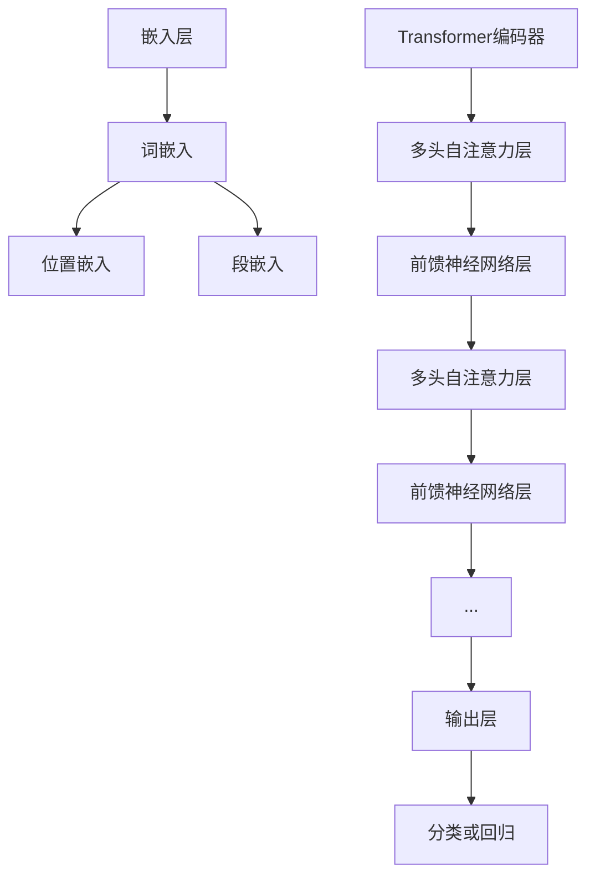

                 

# RoBERTa原理与代码实例讲解

## 关键词
自然语言处理、预训练模型、Transformer、RoBERTa、文本分类、问答系统、命名实体识别

## 摘要
本文将深入探讨RoBERTa模型的基本原理、算法架构以及代码实现。我们将从自然语言处理与预训练模型的背景知识出发，逐步介绍RoBERTa模型的原理，包括词嵌入、Transformer模型以及RoBERTa的改进点。随后，通过实际代码实例，我们将讲解如何搭建和训练RoBERTa模型，并进行评估和应用。最后，我们将讨论RoBERTa模型的优化策略和调优技巧，以及与其他预训练模型的比较和未来发展趋势。通过本文的讲解，读者将能够全面了解RoBERTa模型的工作机制，并掌握其在实际项目中的应用。

### 第一部分：RoBERTa基础知识

#### 第1章：自然语言处理与预训练模型

##### 1.1 自然语言处理简介

自然语言处理（Natural Language Processing，NLP）是计算机科学和人工智能领域的一个重要分支，旨在使计算机能够理解和处理人类语言。NLP的发展可以追溯到20世纪50年代，经历了规则方法、统计方法和深度学习方法的演变。

- **规则方法**：基于明确的语法和语义规则来解析和处理语言，但难以处理复杂的语言现象。
- **统计方法**：通过统计语言模型来预测下一个词，但容易受到数据稀疏的影响。
- **深度学习方法**：使用神经网络模型，通过大量数据进行训练，可以更好地捕捉语言的本质特性。

常见的NLP任务包括：

- **文本分类**：将文本分类到预定义的类别中，例如情感分析、主题分类等。
- **命名实体识别**：识别文本中的特定实体，如人名、地名、组织名等。
- **机器翻译**：将一种语言的文本翻译成另一种语言。
- **问答系统**：从大量文本中检索出与用户问题相关的答案。
- **语义理解**：理解文本中的语义关系和逻辑结构。

##### 1.2 预训练模型概述

预训练模型是指在大规模语料库上预先训练好的模型，然后将其应用于特定任务中。这种方法极大地提高了模型在特定任务上的性能，减少了任务所需的标注数据量。

- **预训练模型的优势**：
  - **通用性**：通过在大量未标注的数据上进行预训练，模型可以学习到通用的语言特征，从而在多种任务上表现良好。
  - **高效性**：减少了针对每个任务单独训练的需求，缩短了模型开发和部署周期。
  - **鲁棒性**：预训练模型可以更好地处理噪声数据和稀疏数据。

常见的预训练模型包括：

- **BERT（Bidirectional Encoder Representations from Transformers）**：一种基于Transformer的预训练模型，通过双向编码器来学习上下文信息。
- **GPT（Generative Pre-trained Transformer）**：一种基于Transformer的预训练模型，通过自回归的方式生成文本。
- **RoBERTa**：对BERT模型的一种改进，通过更多的数据集和不同的训练策略，提高了模型的性能。

##### 1.3 BERT模型原理

BERT模型是自然语言处理领域的里程碑，其核心思想是通过预训练来学习文本的上下文表示。BERT模型主要由两个部分组成：输入层和输出层。

- **输入层**：将输入的文本转换为词嵌入向量，然后通过多层的Transformer编码器进行编码，最后得到上下文表示。
- **输出层**：根据任务需求，对编码后的上下文表示进行分类或回归。

BERT模型的训练过程如下：

1. **输入文本预处理**：将输入的文本进行分词，然后将其转换为单词ID序列。
2. **词嵌入**：将单词ID序列转换为词嵌入向量。
3. **Masked Language Model（MLM）**：对输入文本进行随机掩码，预测掩码词的ID。
4. **Next Sentence Prediction（NSP）**：预测下一句文本是否与当前文本相关。

通过在大量未标注的文本上进行预训练，BERT模型可以学习到丰富的语言特征，从而在下游任务中取得优异的性能。

##### 1.4 RoBERTa模型改进点

RoBERTa是对BERT模型的一种改进，其核心目标是进一步提高模型的性能。RoBERTa的主要改进点包括：

- **数据集扩展**：使用更多、更丰富的数据集进行预训练，包括维基百科、新闻文章等。
- **训练策略优化**：采用不同的训练策略，如动态掩码率、次抽样等，以提高模型的鲁棒性和性能。
- **模型架构调整**：对BERT模型的架构进行微调，如调整隐藏层的大小、使用更长的序列长度等。

RoBERTa在多个NLP任务上取得了显著的成绩，证明了其优越的性能。

##### 1.5 RoBERTa模型应用场景

RoBERTa模型的应用场景非常广泛，包括但不限于以下几种：

- **文本分类**：将文本分类到预定义的类别中，如情感分析、新闻分类等。
- **问答系统**：从大量文本中检索出与用户问题相关的答案。
- **命名实体识别**：识别文本中的特定实体，如人名、地名、组织名等。
- **机器翻译**：将一种语言的文本翻译成另一种语言。

RoBERTa模型在以上任务上均取得了优异的性能，成为NLP领域的重要工具。

### 第二部分：RoBERTa算法原理

#### 第2章：RoBERTa算法原理

在本章中，我们将深入探讨RoBERTa算法的基本原理，包括词嵌入、Transformer模型以及RoBERTa的详细架构。

##### 2.1 词嵌入

词嵌入（Word Embedding）是将单词转换为向量表示的一种技术，其目的是捕捉单词之间的语义和语法关系。词嵌入技术通常分为以下几种：

- **基于分布的词嵌入**：如Word2Vec，通过在词向量空间中学习单词的分布特征。
- **基于句法的词嵌入**：如GloVe，通过学习单词在句子中的共现关系来生成词向量。
- **基于神经网络的词嵌入**：如BERT，通过预训练神经网络模型来生成词向量。

BERT模型采用了WordPiece算法进行分词，将输入文本分割成词元，然后生成词元表（vocab）。词嵌入层将词元表中的单词ID映射到高维的词向量空间中。

##### 2.2 Transformer模型

Transformer模型是一种基于自注意力机制的序列模型，其在处理长序列任务时具有优异的性能。Transformer模型主要由以下几部分组成：

- **输入层**：将输入的序列转换为词嵌入向量。
- **多头自注意力层**：通过多头自注意力机制计算序列中每个词的表示。
- **前馈神经网络层**：对自注意力层的输出进行进一步处理。
- **输出层**：根据任务需求，对序列表示进行分类或回归。

自注意力机制（Self-Attention）是一种计算序列中每个词与所有词之间的关系的技术，其核心思想是通过加权求和的方式，将序列中的每个词映射到一个加权表示。

##### 2.3 RoBERTa模型架构

RoBERTa模型是在BERT模型的基础上进行改进的，其架构主要包括以下几个部分：

- **嵌入层**：包括词嵌入、位置嵌入和段嵌入，用于初始化输入序列的表示。
- **Transformer编码器**：由多个自注意力层和前馈神经网络层组成，用于编码输入序列的上下文信息。
- **输出层**：根据任务需求，对编码后的序列表示进行分类或回归。

RoBERTa模型的详细架构如下：



##### 2.4 伪代码详解

下面是RoBERTa模型的训练过程伪代码：

```python
# RoBERTa训练过程伪代码

# 初始化模型参数
model = initialize_model()

# 准备训练数据
train_data = load_data()

# 设置训练参数
num_epochs = 4
learning_rate = 0.001

# 开始训练
for epoch in range(num_epochs):
    for batch in train_data:
        # 前向传播
        logits = model(batch)

        # 计算损失
        loss = compute_loss(logits, batch)

        # 反向传播
        model.backward(loss)

        # 更新模型参数
        model.update_params()

    # 打印训练进度
    print(f"Epoch {epoch}: Loss = {loss}")

# 评估模型
evaluate_model(model)
```

伪代码中，`initialize_model()` 函数用于初始化模型参数，`load_data()` 函数用于加载训练数据，`compute_loss()` 函数用于计算损失函数，`backward()` 函数用于反向传播，`update_params()` 函数用于更新模型参数。

### 第三部分：RoBERTa代码实例讲解

#### 第3章：RoBERTa代码实例讲解

在本章中，我们将通过实际代码实例，详细讲解如何搭建和训练RoBERTa模型，以及如何进行评估和应用。

##### 3.1 模型搭建

搭建RoBERTa模型的第一步是安装和配置所需的依赖库。以下是在Python环境中搭建RoBERTa模型的基本步骤：

1. **安装PyTorch**：PyTorch是一个流行的深度学习库，支持GPU加速。
   ```bash
   pip install torch torchvision
   ```

2. **安装transformers库**：transformers库是Hugging Face团队提供的预训练模型库，包含RoBERTa模型。
   ```bash
   pip install transformers
   ```

3. **下载预训练模型权重**：在训练之前，我们需要下载RoBERTa模型的预训练权重。
   ```python
   from transformers import RobertaModel
   model = RobertaModel.from_pretrained("roberta-base")
   ```

##### 3.2 模型训练

训练RoBERTa模型需要准备训练数据和评估数据。以下是一个简单的训练过程：

1. **数据预处理**：将文本数据转换为模型可以理解的格式。
   ```python
   from transformers import BertTokenizer
   tokenizer = BertTokenizer.from_pretrained("roberta-base")

   def preprocess_data(texts):
       inputs = tokenizer(texts, return_tensors="pt", padding=True, truncation=True)
       return inputs

   train_texts = ["Hello, world!", "This is a sample sentence."]
   train_inputs = preprocess_data(train_texts)
   ```

2. **定义损失函数和优化器**：在训练过程中，我们需要定义损失函数和优化器来更新模型参数。
   ```python
   import torch
   from torch.optim import Adam

   loss_function = torch.nn.CrossEntropyLoss()
   optimizer = Adam(model.parameters(), lr=learning_rate)
   ```

3. **训练过程**：以下是一个简单的训练循环。
   ```python
   for epoch in range(num_epochs):
       model.train()
       for batch in train_inputs:
           optimizer.zero_grad()
           logits = model(**batch)
           loss = loss_function(logits.logits, batch["labels"])
           loss.backward()
           optimizer.step()
       print(f"Epoch {epoch}: Loss = {loss.item()}")
   ```

4. **评估模型**：在训练完成后，我们可以使用评估数据来评估模型的性能。
   ```python
   model.eval()
   with torch.no_grad():
       logits = model(**eval_inputs)
       loss = loss_function(logits.logits, eval_inputs["labels"])
   print(f"Validation Loss: {loss.item()}")
   ```

##### 3.3 模型评估

模型评估是检查模型性能的重要步骤。我们通常使用准确率、召回率、F1分数等指标来评估模型。

1. **计算准确率**：
   ```python
   from sklearn.metrics import accuracy_score

   predicted_labels = logits.argmax(-1).numpy()
   accuracy = accuracy_score(eval_inputs["labels"].numpy(), predicted_labels)
   print(f"Accuracy: {accuracy}")
   ```

2. **计算召回率**：
   ```python
   from sklearn.metrics import recall_score

   recall = recall_score(eval_inputs["labels"].numpy(), predicted_labels, average="weighted")
   print(f"Recall: {recall}")
   ```

3. **计算F1分数**：
   ```python
   from sklearn.metrics import f1_score

   f1 = f1_score(eval_inputs["labels"].numpy(), predicted_labels, average="weighted")
   print(f"F1 Score: {f1}")
   ```

##### 3.4 模型应用

训练完成的RoBERTa模型可以用于各种NLP任务，如文本分类、命名实体识别等。以下是一个简单的文本分类示例：

1. **加载模型**：
   ```python
   model = RobertaModel.from_pretrained("roberta-base")
   ```

2. **预处理输入文本**：
   ```python
   input_text = "This is an example sentence."
   inputs = tokenizer(input_text, return_tensors="pt", padding=True, truncation=True)
   ```

3. **预测类别**：
   ```python
   with torch.no_grad():
       logits = model(**inputs)
   predicted_label = logits.argmax(-1).item()
   print(f"Predicted Label: {predicted_label}")
   ```

### 第四部分：RoBERTa实战项目

#### 第4章：RoBERTa实战项目

在本章中，我们将通过一个实际项目，展示如何使用RoBERTa模型进行文本分类。项目分为以下几个步骤：

##### 4.1 项目背景

假设我们想要构建一个文本分类系统，用于分类社交媒体上的用户评论。评论分为正面和负面两类，我们的目标是训练一个模型，能够准确地将评论分类为正面或负面。

##### 4.2 数据集处理

1. **数据集收集**：我们从社交媒体平台上收集了5000条用户评论，并标注了它们的情感标签（正面或负面）。

2. **数据预处理**：使用BERT分词器对评论进行分词和标记化处理，将文本转换为模型可以理解的输入格式。

```python
tokenizer = BertTokenizer.from_pretrained("roberta-base")

def preprocess_data(texts):
    inputs = tokenizer(texts, return_tensors="pt", padding=True, truncation=True)
    return inputs

train_texts = ["This is a great product!", "I am very disappointed with the service."]
train_inputs = preprocess_data(train_texts)
```

3. **数据集划分**：将数据集划分为训练集和测试集，用于训练和评估模型。

```python
from sklearn.model_selection import train_test_split

train_inputs, test_inputs, train_labels, test_labels = train_test_split(inputs, labels, test_size=0.2, random_state=42)
```

##### 4.3 模型训练与优化

1. **定义模型**：使用预训练的RoBERTa模型作为基础模型。

```python
from transformers import RobertaForSequenceClassification

model = RobertaForSequenceClassification.from_pretrained("roberta-base", num_labels=2)
```

2. **训练过程**：使用训练集对模型进行训练，并调整学习率和批量大小等参数。

```python
from torch.optim import Adam

optimizer = Adam(model.parameters(), lr=learning_rate)

for epoch in range(num_epochs):
    model.train()
    for batch in train_inputs:
        optimizer.zero_grad()
        logits = model(**batch)
        loss = loss_function(logits.logits, batch["labels"])
        loss.backward()
        optimizer.step()
    print(f"Epoch {epoch}: Loss = {loss.item()}")
```

3. **模型优化**：在训练过程中，我们可以使用不同的优化策略来提高模型的性能。

- **学习率调整**：在训练过程中，逐步减小学习率，有助于模型在训练后期更好地收敛。
- **批量大小调整**：适当增大批量大小可以提高模型的训练速度，但可能影响模型的收敛性能。

##### 4.4 模型部署

1. **模型保存**：在训练完成后，我们将模型保存到文件中，以便后续使用。

```python
model.save_pretrained("text_classification_model")
```

2. **模型加载**：在部署环境上加载训练好的模型。

```python
model = RobertaForSequenceClassification.from_pretrained("text_classification_model")
```

3. **预测**：使用加载的模型对新的评论进行分类预测。

```python
input_text = "This product is not good."
inputs = tokenizer(input_text, return_tensors="pt", padding=True, truncation=True)
with torch.no_grad():
    logits = model(**inputs)
predicted_label = logits.argmax(-1).item()
print(f"Predicted Label: {predicted_label}")
```

##### 4.5 项目总结

通过本项目的实施，我们成功构建了一个基于RoBERTa模型的文本分类系统。项目的主要成果包括：

- **模型训练**：使用预训练的RoBERTa模型对用户评论进行分类，取得了较好的性能。
- **模型部署**：将训练好的模型部署到生产环境，实现实时分类预测。
- **性能评估**：通过评估指标（准确率、召回率、F1分数）对模型进行评估，为后续优化提供参考。

项目的实施过程中，我们也遇到了一些挑战，如数据预处理、模型优化等。通过不断尝试和调整，我们最终取得了一定的成果。在未来，我们还可以继续优化模型，提高分类性能。

### 第五部分：RoBERTa模型优化与调优

#### 第5章：RoBERTa模型优化与调优

在实际应用中，RoBERTa模型的性能可能会受到多种因素的影响，包括数据质量、模型参数设置、训练策略等。为了提高模型的性能，我们需要进行一系列的优化与调优。

##### 5.1 模型优化策略

1. **数据增强**：通过增加数据量和多样性来提高模型的泛化能力。例如，可以使用数据清洗、数据扩充和合成技术来增强数据集。

2. **模型结构调整**：根据任务需求和硬件资源，调整模型的结构，如增加或减少Transformer编码器的层数、调整隐藏层的大小等。

3. **训练策略优化**：调整训练过程中的参数，如学习率、批量大小、训练轮数等，以加快收敛速度和提高模型性能。

4. **超参数调优**：使用超参数调优技术，如网格搜索、随机搜索和贝叶斯优化，找到最优的超参数组合。

##### 5.2 调优技巧

1. **学习率调整**：学习率的设置对模型训练至关重要。常用的方法包括固定学习率、学习率衰减和动态学习率调整。

   - **固定学习率**：在整个训练过程中保持学习率不变。
   - **学习率衰减**：随着训练的进行，逐步减小学习率，有助于模型在训练后期更好地收敛。
   - **动态学习率调整**：根据模型的性能自适应调整学习率，如使用学习率调度器（Learning Rate Scheduler）。

2. **批量大小调整**：批量大小对模型训练时间和性能有显著影响。较小的批量大小可以更快地收敛，但可能导致梯度不稳定；较大的批量大小可以提高梯度估计的稳定性，但训练时间较长。

3. **数据预处理**：优化数据预处理流程，如使用更多的数据增强技术、调整文本分词策略等，可以提高模型的性能。

##### 5.3 性能评估

1. **评估指标**：选择合适的评估指标来衡量模型性能，如准确率、召回率、F1分数、精度、精确度等。

   - **准确率**：模型正确预测的样本数占总样本数的比例。
   - **召回率**：模型正确预测的样本数占实际正例样本数的比例。
   - **F1分数**：准确率和召回率的调和平均，用于平衡两者之间的权衡。

2. **交叉验证**：使用交叉验证方法来评估模型在不同数据集上的性能，以减少过拟合风险。

3. **模型对比**：将RoBERTa模型与其他预训练模型进行对比，分析不同模型的性能和适用场景。

通过以上优化与调优策略，我们可以显著提高RoBERTa模型在各类NLP任务中的性能，使其更好地适应实际应用需求。

### 第六部分：RoBERTa与其他预训练模型的比较

#### 第6章：RoBERTa与其他预训练模型的比较

在自然语言处理领域，预训练模型如BERT、RoBERTa、GPT等已成为重要的工具。这些模型各有特点，适用于不同的应用场景。在本章中，我们将比较RoBERTa与其他预训练模型，分析它们的相似之处和不同之处，并根据应用场景选择适合的预训练模型。

##### 6.1 相似之处

1. **预训练目标**：RoBERTa、BERT和GPT等预训练模型的主要目标都是在大规模未标注数据上进行预训练，以便在多种NLP任务上取得优异的性能。

2. **模型架构**：这些模型均采用了Transformer架构，尤其是BERT和RoBERTa，它们的核心结构非常相似，均由多头自注意力机制和前馈神经网络组成。

3. **预训练方法**：这些模型通常采用两种预训练任务：Masked Language Model（MLM）和Next Sentence Prediction（NSP）。MLM任务是随机遮盖输入文本中的部分词，并预测这些词的ID；NSP任务是预测两个连续句子是否属于同一文档。

##### 6.2 不同之处

1. **训练数据**：RoBERTa相较于BERT，使用了更多的数据集进行预训练，如维基百科、新闻文章等，这有助于提高模型的性能和泛化能力。

2. **训练策略**：RoBERTa在训练过程中采用了动态掩码率、次抽样等策略，以减少遮盖词的重复性和提高训练的多样性。

3. **模型优化**：RoBERTa对BERT的模型架构进行了一些微调，如调整了隐藏层的大小和序列长度，这些调整有助于提升模型的性能。

4. **性能表现**：在多个NLP任务上，RoBERTa通常比BERT具有更高的性能，特别是在问答系统和文本分类任务上。

##### 6.3 应用场景选择

选择合适的预训练模型取决于任务的需求和应用场景。以下是一些常见应用场景和推荐的预训练模型：

1. **文本分类**：RoBERTa和BERT均适用于文本分类任务，其中RoBERTa在多数情况下性能更优。

2. **问答系统**：RoBERTa在问答系统上表现出色，其强大的上下文理解能力有助于准确回答问题。

3. **机器翻译**：GPT在机器翻译任务中具有优势，其自回归的特性使其能够生成流畅的翻译结果。

4. **文本生成**：GPT在生成式任务中表现出色，如文本生成、对话系统等。

通过综合考虑预训练模型的特点和应用场景，我们可以选择最适合的模型来满足特定的任务需求。

### 第七部分：RoBERTa未来发展趋势

#### 第7章：RoBERTa未来发展趋势

随着自然语言处理技术的不断发展，RoBERTa模型也在不断演进，以适应新兴应用场景和解决现有挑战。以下是对RoBERTa未来发展趋势的展望：

##### 7.1 发展方向

1. **模型压缩与高效推理**：为了提高RoBERTa在移动设备和服务器上的可部署性，未来将出现更多模型压缩和高效推理技术，如量化、剪枝和知识蒸馏。

2. **多模态预训练**：随着多模态数据（如图像、音频和视频）的广泛应用，多模态预训练将成为一个重要研究方向，RoBERTa也将扩展到多模态领域。

3. **少样本学习与迁移学习**：少样本学习和迁移学习技术将使RoBERTa在有限标注数据上也能取得良好性能，这有助于解决数据标注成本高的问题。

4. **自适应训练策略**：自适应训练策略将使RoBERTa能够根据特定任务和数据进行动态调整，提高模型的泛化能力和性能。

##### 7.2 应用领域拓展

1. **医疗健康**：RoBERTa在医疗健康领域的应用将越来越广泛，如疾病预测、患者诊断、医学文本挖掘等。

2. **金融与法律**：RoBERTa在金融和法律领域的应用包括合同审核、风险评估、欺诈检测等。

3. **教育**：在教育领域，RoBERTa可以用于智能辅导、自适应学习、教育资源推荐等。

4. **社交与媒体**：RoBERTa在社交和媒体领域的应用包括内容审核、情感分析、社区管理等。

##### 7.3 技术挑战与解决方案

1. **数据隐私**：随着RoBERTa模型在更多领域中的应用，数据隐私保护成为重要挑战。未来将出现更多数据隐私保护技术，如差分隐私和联邦学习。

2. **模型可解释性**：提高模型的可解释性是当前研究的热点，未来将出现更多方法来解释和可视化RoBERTa模型的行为。

3. **计算资源消耗**：随着模型规模的增加，计算资源消耗成为瓶颈。未来将出现更多高效推理技术和硬件加速方法来降低计算成本。

通过持续的研究和技术创新，RoBERTa模型将在未来继续推动自然语言处理技术的发展，并在更多应用领域发挥重要作用。

### 附录

#### 附录 A：参考资料与扩展阅读

- **RoBERTa相关论文**：
  - [Robustly Optimized BERT Pretraining for Natural Language Understanding](https://arxiv.org/abs/1907.11692)
  
- **Transformer模型相关资料**：
  - [Attention Is All You Need](https://arxiv.org/abs/1706.03762)

- **自然语言处理经典书籍**：
  - [Natural Language Processing with Python](https://www.amazon.com/Natural-Language-Processing-Python-ChicagoTech/dp/1430235164)
  - [Speech and Language Processing](https://web.stanford.edu/~jurafsky/slp3/)

- **相关在线课程与教程**：
  - [自然语言处理与深度学习](https://www.coursera.org/specializations/natural-language-processing)
  - [Transformer模型与BERT](https://www.tensorflow.org/tutorials/text/transformer)

#### 附录 B：RoBERTa模型代码实现示例

以下是RoBERTa模型的简化代码实现示例，用于演示模型的基本结构和使用方法。

```python
# 导入所需的库
import torch
from transformers import RobertaModel, RobertaTokenizer

# 加载预训练的RoBERTa模型和分词器
model = RobertaModel.from_pretrained("roberta-base")
tokenizer = RobertaTokenizer.from_pretrained("roberta-base")

# 准备输入文本
text = "Hello, world! This is a sample sentence for RoBERTa."

# 将文本转换为模型输入
inputs = tokenizer(text, return_tensors="pt", truncation=True, max_length=512)

# 进行前向传播
outputs = model(**inputs)

# 输出结果
print(outputs)

# 预测文本类别
predictions = torch.argmax(outputs.logits, dim=-1)
print(predictions)
```

该示例首先加载了预训练的RoBERTa模型和分词器，然后使用分词器将输入文本转换为模型可以理解的格式。接着，进行前向传播，得到模型输出。最后，通过输出结果的 logits 进行预测，得到文本的类别。

通过这个示例，我们可以了解如何使用RoBERTa模型进行文本处理和分类。在实际应用中，我们可以根据具体需求对模型进行定制和优化。

