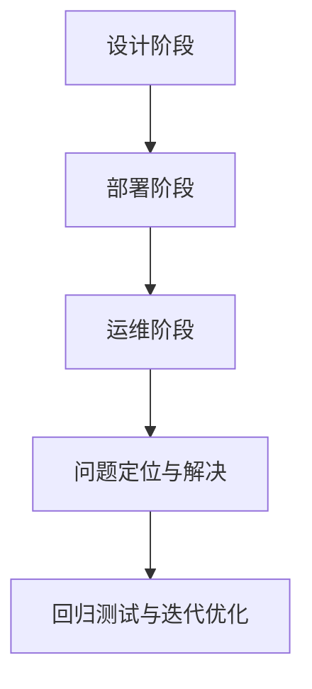

                 

### 文章标题

《SRE自动化运维最佳实践》

### 关键词

- 运维自动化
- 服务可靠性工程（SRE）
- 容器化技术
- Kubernetes运维
- 持续集成与持续部署（CI/CD）

### 摘要

本文将深入探讨服务可靠性工程（SRE）的自动化运维最佳实践。SRE是一种结合软件开发和系统管理的工程实践，它通过自动化和系统化来提高服务的可靠性和效率。文章首先介绍了SRE的基础知识和核心概念，然后详细介绍了SRE中的自动化运维工具，包括Chef、Puppet、Ansible和SaltStack。接着，文章讨论了容器与Kubernetes的运维实践，以及云服务的自动化运维。随后，文章讲述了监控与日志分析、持续集成与持续部署（CI/CD）等方面的最佳实践。最后，通过案例分析展示了大型互联网公司的SRE实践，并提供了SRE资源汇总和开发环境搭建指南。

### 第一部分：SRE基础

#### 第1章：SRE概述

##### 1.1 什么是SRE

服务可靠性工程（Site Reliability Engineering，简称SRE）是一种结合软件开发和系统管理的工程实践。它起源于Google，目的是通过系统化、自动化的方式提高服务的可靠性和效率。SRE强调在软件开发过程中，将系统运维视为一个工程化的过程，使用类似开发的方法来管理和优化系统的运行。

SRE的核心思想是利用软件工程的方法和工具来管理大型分布式系统。它关注系统整体可靠性，而不是单个组件的可靠性。SRE工程师使用自动化工具来处理日常运维任务，从而减少人为错误，提高系统的稳定性和响应速度。

##### 1.2 SRE与传统的IT运维区别

传统的IT运维主要集中在硬件维护、网络配置和系统升级等方面，侧重于确保系统的连续运行。而SRE则更加侧重于系统的整体可靠性和性能优化。以下是SRE与传统的IT运维的一些主要区别：

1. **目标不同**：传统的IT运维主要目标是保证系统的连续运行，而SRE的目标是确保系统在最佳状态下运行，提供高质量的体验。
2. **方法不同**：传统的IT运维更多依赖于手动操作，而SRE强调使用自动化工具和系统化的方法来管理系统。
3. **职责不同**：传统的IT运维通常由专业的运维团队负责，而SRE工程师通常由软件开发和运维团队共同组成，两者界限更加模糊。

##### 1.3 SRE的核心目标与价值观

SRE的核心目标是确保服务的可靠性和高效性，同时保持系统的灵活性和可扩展性。为了实现这一目标，SRE倡导以下价值观：

1. **自动化**：通过自动化减少人为干预，降低错误率，提高运维效率。
2. **监控**：实时监控系统的状态，快速发现并解决潜在问题。
3. **反馈循环**：从系统运行中收集反馈，持续优化系统和流程。
4. **持续改进**：不断改进运维流程和工具，以提高系统的可靠性和性能。

##### 1.4 SRE的发展历程

SRE的概念起源于Google，最初是由Google的软件工程师为了管理公司内部复杂的大型分布式系统而创建的。随着云计算和容器技术的发展，SRE逐渐成为了一种广泛应用的工程实践。

2003年，Google的Ben Treynor-Seymour首次提出了SRE的概念，并将其引入Google。随后，Google内部逐步推广SRE实践，并开发了一系列自动化工具和平台，如GFS、Bigtable、Kubernetes等。

2016年，Google将SRE的理念和最佳实践整理成书，发布了《Site Reliability Engineering》一书，进一步推动了SRE在业界的普及。如今，许多大型互联网公司，如Facebook、Netflix、亚马逊等，都已经采用了SRE实践，并取得了显著的效果。

#### 第2章：SRE中的核心概念

##### 2.1 SLI、SLO、和SLA

SRE中常用的三个关键性能指标分别是SLI（服务级别指标）、SLO（服务级别目标）和SLA（服务级别协议）。

1. **SLI（Service Level Indicator）**：SLI是衡量服务性能的基本指标，通常用于监控和评估系统的运行状况。常见的SLI包括响应时间、吞吐量、错误率等。

2. **SLO（Service Level Objective）**：SLO是服务提供商与用户之间达成的一个目标，用于衡量服务的质量。SLO通常以具体的数据指标表示，如“95%的请求在100毫秒内响应”。

3. **SLA（Service Level Agreement）**：SLA是服务提供商与客户之间签订的一份协议，规定了服务的具体指标和责任。SLA通常包含了SLO、违约处罚、服务恢复时间等条款。

##### 2.2 错误预算（Error Budget）

错误预算（Error Budget）是一种管理服务可靠性的方法，它允许在一定的预算范围内容忍一定的错误和中断。错误预算的目的是在保证服务整体可靠性的同时，允许进行必要的更新和改进。

错误预算由以下几个部分组成：

1. **年度错误预算（Annual Error Budget）**：全年可以容忍的总错误数。
2. **更新预算（Update Budget）**：在更新期间可以容忍的错误数。
3. **可用性目标（Availability Target）**：服务整体的目标可用性百分比。

通过错误预算，SRE团队可以更加灵活地管理和调整系统的更新和改进，同时确保服务的可靠性。

##### 2.3 反馈循环

反馈循环是SRE中的一个重要概念，它强调从系统运行中不断收集反馈，并将其用于改进系统和流程。

反馈循环通常包括以下几个步骤：

1. **监控**：实时监控系统的状态，收集各种性能指标和日志数据。
2. **分析**：对收集到的数据进行分析，识别潜在问题和改进机会。
3. **改进**：根据分析结果，进行系统优化和流程改进。
4. **验证**：验证改进措施的效果，确保问题得到解决。

通过反馈循环，SRE团队可以不断优化系统和流程，提高服务的可靠性和性能。

##### 2.4 监控和日志

监控和日志是SRE中不可或缺的两个环节。监控用于实时跟踪系统的运行状态，日志则用于记录系统运行过程中的详细信息。

1. **监控**：监控是指通过自动化的方式，实时收集和分析系统的性能指标，及时发现异常情况。常见的监控工具包括Prometheus、Grafana、Zabbix等。

2. **日志**：日志是系统运行过程中产生的各种记录，包括操作日志、错误日志、审计日志等。通过分析日志，可以深入了解系统的运行状况和问题根源。

常见的日志收集和处理工具包括ELK（Elasticsearch、Logstash、Kibana）、Fluentd、Log4j等。

#### 第3章：SRE工作流程

##### 3.1 设计与部署

SRE的工作流程始于设计与部署阶段。在这个阶段，SRE团队需要确保系统的高可用性和可扩展性。

1. **架构设计**：设计一个合理、可靠的系统架构，确保系统的各个组件之间可以无缝协同工作。
2. **自动化部署**：使用自动化工具（如Kubernetes、Ansible等）进行系统的部署和更新，减少人为干预和错误。
3. **版本管理**：使用版本控制系统（如Git）管理代码和配置文件，确保部署过程的可追溯性和可重现性。

##### 3.2 运维与监控

在运维与监控阶段，SRE团队需要确保系统的稳定运行，并及时发现和解决问题。

1. **实时监控**：通过监控工具（如Prometheus、Grafana等）实时跟踪系统的性能指标，及时发现异常情况。
2. **日志分析**：通过日志分析工具（如ELK、Fluentd等）收集和分析系统日志，深入了解系统的运行状况和问题根源。
3. **故障处理**：当发现系统故障时，SRE团队需要迅速响应，定位问题并进行修复。

##### 3.3 问题定位与解决

在问题定位与解决阶段，SRE团队需要快速定位问题的根源，并采取有效措施进行解决。

1. **故障排查**：通过日志分析、性能监控、故障复现等方法，快速定位问题的根源。
2. **问题修复**：针对定位到的问题，制定相应的修复方案，并进行实施。
3. **验证**：修复后，对系统进行验证，确保问题得到解决，且不会影响系统的稳定性。

##### 3.4 回归测试与迭代优化

在回归测试与迭代优化阶段，SRE团队需要对系统进行全面的回归测试，确保更新和修复不会引入新的问题。

1. **回归测试**：在每次更新或修复后，对系统进行全面的回归测试，确保系统的稳定性和可靠性。
2. **迭代优化**：根据测试结果和用户反馈，对系统进行优化和改进，以提高用户体验。

### 第二部分：SRE实践

#### 第4章：自动化运维工具

##### 4.1 Chef

Chef是一款强大的自动化运维工具，主要用于配置管理和自动化部署。Chef的核心概念是“代码即配置”（Code is Configuration），即通过编写脚本和模板来描述系统的配置，然后自动执行这些脚本，实现配置的一致性和自动化。

**Chef的关键组件包括**：

- **Chef Server**：用于存储和管理配置数据、节点数据等。
- **Chef Client**：安装在各个节点上的客户端，用于执行配置任务。
- **Cookbook**：包含配置代码的集合，类似于Python的模块。
- **Recipe**：定义了如何在节点上执行特定任务的脚本。

**使用Chef的基本流程如下**：

1. **编写Cookbook和Recipe**：根据需求编写Cookbook和Recipe，描述系统的配置。
2. **上传Cookbook到Chef Server**：将编写的Cookbook上传到Chef Server，以便其他节点可以下载和使用。
3. **安装Chef Client**：在目标节点上安装Chef Client。
4. **执行配置**：运行Chef Client，执行上传的Cookbook和Recipe，实现系统配置的自动化。

**Chef的优点包括**：

- **强大的配置管理能力**：Chef可以管理复杂的系统配置，支持多种平台和环境。
- **易于集成**：Chef可以与其他自动化工具（如Puppet、Ansible等）集成，实现更全面的自动化运维。

##### 4.2 Puppet

Puppet是一款功能强大的自动化运维工具，主要用于配置管理和自动化部署。Puppet的核心思想是通过声明式语言（Puppet Language）描述系统的配置，然后由Puppet Master自动执行这些配置。

**Puppet的关键组件包括**：

- **Puppet Master**：用于存储和管理配置数据、节点数据等。
- **Puppet Agent**：安装在各个节点上的客户端，用于执行配置任务。
- **Module**：包含配置代码的集合，类似于Python的模块。
- **Manifest**：定义了如何在节点上执行特定任务的脚本。

**使用Puppet的基本流程如下**：

1. **编写Module和Manifest**：根据需求编写Module和Manifest，描述系统的配置。
2. **上传Module到Puppet Master**：将编写的Module上传到Puppet Master，以便其他节点可以下载和使用。
3. **安装Puppet Agent**：在目标节点上安装Puppet Agent。
4. **执行配置**：运行Puppet Agent，执行上传的Module和Manifest，实现系统配置的自动化。

**Puppet的优点包括**：

- **易于使用和部署**：Puppet提供了简单的声明式语言，使其易于学习和使用。
- **强大的社区支持**：Puppet拥有庞大的社区，提供了大量的Module和资源，方便用户使用。

##### 4.3 Ansible

Ansible是一款简单易用的自动化运维工具，主要用于配置管理和自动化部署。Ansible的核心特点是“无代理架构”（agentless architecture），即无需在目标节点上安装额外的代理，通过SSH进行远程操作。

**Ansible的关键组件包括**：

- **Ansible Control Machine**：用于控制和管理其他节点的服务器。
- **Ansible Playbook**：包含了任务列表和操作步骤，用于定义自动化流程。
- **Ansible Module**：用于执行特定任务的脚本和模块。

**使用Ansible的基本流程如下**：

1. **编写Ansible Playbook**：根据需求编写Ansible Playbook，定义自动化流程。
2. **执行Ansible Playbook**：在Ansible Control Machine上执行Playbook，实现自动化部署和配置。

**Ansible的优点包括**：

- **简单易用**：Ansible使用简单的YAML语言编写Playbook，使其易于学习和使用。
- **无代理架构**：Ansible无需在目标节点上安装代理，简化了部署和管理。

##### 4.4 SaltStack

SaltStack是一款高性能、模块化的自动化运维工具，主要用于配置管理和自动化部署。SaltStack的核心特点是“实时自动化”（Real-time Automation），即支持实时响应和调整。

**SaltStack的关键组件包括**：

- **Master**：用于控制和管理其他节点。
- **Minion**：安装在各个节点上的客户端，用于执行配置任务。
- **Grains**：用于存储节点的静态信息。
- **Pillars**：用于存储节点的配置信息。

**使用SaltStack的基本流程如下**：

1. **安装Master和Minion**：在Master和Minion节点上安装SaltStack。
2. **编写Pillars和Grains**：根据需求编写Pillars和Grains，定义节点的配置信息。
3. **执行配置**：通过Master节点发送命令到Minion节点，实现自动化部署和配置。

**SaltStack的优点包括**：

- **高性能**：SaltStack采用零MQ消息传递机制，支持大规模节点管理。
- **模块化**：SaltStack提供了丰富的模块和函数库，方便用户自定义和扩展。

#### 第5章：容器与Kubernetes运维

##### 5.1 容器化技术

容器化技术是一种轻量级虚拟化技术，通过将应用程序及其依赖打包到一个独立的容器中，实现应用程序的隔离、部署和运行。容器化技术的主要优点包括：

- **轻量级**：容器共享宿主机的操作系统内核，相比虚拟机，容器具有更低的资源消耗。
- **可移植性**：容器可以运行在任何支持Docker的操作系统上，实现跨平台部署。
- **高效性**：容器启动速度极快，可以在秒级内完成部署。

常见的容器化技术包括Docker、Kubernetes等。

##### 5.2 Kubernetes简介

Kubernetes（简称K8s）是一款开源的容器编排平台，主要用于管理容器化应用程序的部署、扩展和运维。Kubernetes的核心特点包括：

- **自动化部署**：Kubernetes支持自动部署、滚动更新和回滚，确保应用程序的稳定性和可靠性。
- **服务发现与负载均衡**：Kubernetes支持自动服务发现和负载均衡，实现容器集群的高可用性。
- **存储编排**：Kubernetes支持各种存储解决方案，如NFS、GlusterFS等，方便用户进行数据管理。
- **自动伸缩**：Kubernetes支持根据负载自动伸缩容器数量，实现弹性伸缩。

Kubernetes的关键概念包括：

- **Pod**：Kubernetes的最小部署单元，包含一个或多个容器。
- **Service**：用于对外暴露Pod的IP地址和端口号。
- **Ingress**：用于管理外部访问容器集群的入口流量。
- **Deployment**：用于管理Pod的创建、更新和扩展。

##### 5.3 Kubernetes集群的部署与运维

部署Kubernetes集群的过程可以分为以下几个步骤：

1. **安装Docker**：在所有节点上安装Docker，确保可以运行容器。
2. **安装Kubernetes组件**：使用Kubeadm工具在Master节点上安装Kubernetes核心组件，如kube-apiserver、kube-scheduler、kube-controller-manager等。
3. **配置集群网络**：配置集群网络，确保各个节点之间的通信。
4. **安装kubectl**：在本地机器上安装kubectl工具，用于管理Kubernetes集群。
5. **部署Pod和Service**：使用kubectl工具部署Pod和Service，确保应用程序正常运行。

在运维Kubernetes集群时，需要关注以下几个方面：

- **监控和日志**：使用Prometheus、Grafana等监控工具，实时监控集群状态；使用ELK、Fluentd等日志分析工具，收集和解析日志。
- **故障处理**：当集群出现故障时，快速定位并解决问题，如重启Pod、扩容集群等。
- **升级和更新**：定期对Kubernetes集群进行升级和更新，确保集群的安全性、稳定性和可靠性。

##### 5.4 Kubernetes自动化运维实践

Kubernetes的自动化运维实践主要包括以下几个方面：

1. **自动化部署**：使用Helm等工具，实现Kubernetes应用程序的自动化部署和更新。
2. **自动化监控**：使用Prometheus等工具，实现Kubernetes集群和应用程序的实时监控。
3. **自动化故障处理**：使用自定义脚本和工具，实现故障的自动化定位和恢复。
4. **自动化扩容**：根据负载情况，自动调整Kubernetes集群的容量。

通过自动化运维实践，可以显著提高Kubernetes集群的管理效率，降低运维成本，确保应用程序的稳定性和可靠性。

#### 第6章：云服务与自动化运维

##### 6.1 云服务概述

云服务是指通过互联网提供可伸缩的计算资源、存储资源和网络资源等服务。常见的云服务包括：

- **IaaS（基础设施即服务）**：提供虚拟机、存储、网络等基础设施资源，如AWS EC2、Azure Virtual Machines等。
- **PaaS（平台即服务）**：提供开发平台和运行环境，如AWS Elastic Beanstalk、Azure App Service等。
- **SaaS（软件即服务）**：提供在线应用程序和服务，如Google Workspace、Microsoft Office 365等。

云服务的优点包括：

- **弹性伸缩**：根据需求自动调整资源，实现成本优化。
- **高可用性**：通过分布式架构，实现数据的高可用性和容错能力。
- **易用性**：提供简单的界面和API，方便用户管理和使用。

##### 6.2 AWS自动化运维

AWS（Amazon Web Services）提供了丰富的自动化运维工具和功能，帮助用户实现云服务的自动化管理。

1. **AWS CloudFormation**：AWS CloudFormation是一种基础设施即代码的工具，用于自动化部署和管理AWS资源。用户可以使用模板文件定义所需的基础设施，然后通过AWS CloudFormation自动化部署和管理。
2. **AWS Lambda**：AWS Lambda是一种无服务器计算服务，用户可以编写代码并运行在AWS上，无需管理服务器。通过AWS Lambda，可以实现自动化的后台任务处理和响应。
3. **AWS CodePipeline**：AWS CodePipeline是一种自动化持续集成和持续部署（CI/CD）工具，用于自动化构建、测试和部署应用程序。通过AWS CodePipeline，可以实现代码的自动化发布和更新。

##### 6.3 Azure自动化运维

Azure（Microsoft Azure）提供了丰富的自动化运维工具和功能，帮助用户实现云服务的自动化管理。

1. **Azure Resource Manager**：Azure Resource Manager是一种基础设施即代码的工具，用于自动化部署和管理Azure资源。用户可以使用模板文件定义所需的基础设施，然后通过Azure Resource Manager自动化部署和管理。
2. **Azure Functions**：Azure Functions是一种无服务器计算服务，用户可以编写代码并运行在Azure上，无需管理服务器。通过Azure Functions，可以实现自动化的后台任务处理和响应。
3. **Azure DevOps**：Azure DevOps是一种集成化的持续集成和持续部署（CI/CD）平台，用于自动化构建、测试和部署应用程序。通过Azure DevOps，可以实现代码的自动化发布和更新。

##### 6.4 Google Cloud自动化运维

Google Cloud提供了丰富的自动化运维工具和功能，帮助用户实现云服务的自动化管理。

1. **Google Cloud Deployment Manager**：Google Cloud Deployment Manager是一种基础设施即代码的工具，用于自动化部署和管理Google Cloud资源。用户可以使用模板文件定义所需的基础设施，然后通过Google Cloud Deployment Manager自动化部署和管理。
2. **Google Cloud Functions**：Google Cloud Functions是一种无服务器计算服务，用户可以编写代码并运行在Google Cloud上，无需管理服务器。通过Google Cloud Functions，可以实现自动化的后台任务处理和响应。
3. **Google Cloud Build**：Google Cloud Build是一种自动化构建和部署工具，用于自动化构建、测试和部署应用程序。通过Google Cloud Build，可以实现代码的自动化发布和更新。

#### 第7章：监控与日志分析

##### 7.1 监控系统设计

监控系统设计是确保系统稳定运行的关键环节。一个有效的监控系统应具备以下几个特点：

1. **全面性**：监控系统能够全面覆盖系统的各个组件和层次，包括应用层、服务层、基础设施层等。
2. **实时性**：监控系统能够实时收集和分析系统的性能指标，及时发现异常情况。
3. **可扩展性**：监控系统能够根据业务需求进行灵活扩展，支持多种监控方式和工具。
4. **可靠性**：监控系统能够保证数据的准确性和完整性，避免误报和漏报。

监控系统设计的主要步骤包括：

1. **确定监控目标**：根据业务需求和系统特点，确定需要监控的性能指标和报警阈值。
2. **选择监控工具**：根据监控目标和需求，选择合适的监控工具，如Prometheus、Grafana、Zabbix等。
3. **搭建监控架构**：设计监控架构，包括数据采集、数据处理、数据存储、数据展示等环节。
4. **实施监控配置**：根据监控架构，配置监控工具，实现数据的实时采集和分析。

##### 7.2 日志收集与处理

日志收集与处理是监控系统的重要组成部分，用于记录系统的运行状态和异常情况。一个有效的日志收集与处理系统应具备以下几个特点：

1. **完整性**：日志收集系统应能够完整地收集系统的各种日志，包括操作日志、错误日志、审计日志等。
2. **实时性**：日志收集系统应能够实时收集和传输日志数据，确保日志的及时性和准确性。
3. **可扩展性**：日志收集系统应能够根据业务需求进行扩展，支持多种日志格式和传输协议。
4. **可靠性**：日志收集系统应保证数据的完整性和可靠性，避免数据丢失和损坏。

日志收集与处理的主要步骤包括：

1. **确定日志收集需求**：根据业务需求和系统特点，确定需要收集的日志类型和内容。
2. **选择日志收集工具**：根据日志收集需求，选择合适的日志收集工具，如Logstash、Fluentd等。
3. **搭建日志收集架构**：设计日志收集架构，包括日志收集、日志处理、日志存储等环节。
4. **实施日志收集配置**：根据日志收集架构，配置日志收集工具，实现日志的实时收集和传输。

##### 7.3 数据可视化工具

数据可视化工具是将监控和日志数据以图形化方式展示的工具，帮助用户直观地了解系统的运行状况和异常情况。常见的数据可视化工具包括：

1. **Grafana**：Grafana是一种开源的数据可视化和分析工具，支持多种数据源，如InfluxDB、Prometheus、MySQL等。Grafana提供了丰富的图表和仪表板，方便用户自定义和展示监控数据。
2. **Kibana**：Kibana是Elasticsearch的数据可视化工具，用于展示和分析日志数据。Kibana提供了强大的日志搜索、过滤和可视化功能，帮助用户深入了解系统运行状况。

##### 7.4 实时故障诊断与响应

实时故障诊断与响应是确保系统高可用性的关键环节。一个有效的故障诊断与响应系统应具备以下几个特点：

1. **实时性**：故障诊断与响应系统能够实时检测和响应系统故障，减少故障对业务的影响。
2. **自动化**：故障诊断与响应系统应具备自动化能力，自动执行故障检测、定位和恢复操作。
3. **可扩展性**：故障诊断与响应系统应能够根据业务需求进行扩展，支持多种故障检测和恢复策略。
4. **可靠性**：故障诊断与响应系统应保证操作的可靠性和安全性，避免误操作和系统崩溃。

实时故障诊断与响应的主要步骤包括：

1. **故障检测**：使用监控和日志数据，实时检测系统故障，如性能下降、服务中断等。
2. **故障定位**：根据故障检测结果，定位故障的具体原因和位置。
3. **故障响应**：根据故障类型和影响范围，采取相应的响应措施，如重启服务、扩容系统等。
4. **故障恢复**：故障响应后，对系统进行恢复，确保业务正常运行。

#### 第8章：持续集成与持续部署

##### 8.1 CI/CD概述

持续集成（Continuous Integration，简称CI）和持续部署（Continuous Deployment，简称CD）是一种现代软件开发和运维的最佳实践，旨在提高软件交付的效率和质量。

1. **CI**：持续集成是指开发团队在每次代码提交时，自动构建和测试应用程序，确保代码的集成和兼容性。CI的主要目标是快速发现和解决代码集成中的问题，减少集成风险。
2. **CD**：持续部署是指将经过CI测试和验证的代码自动部署到生产环境，实现快速交付和上线。CD的主要目标是确保软件的高质量和稳定性，提高交付速度。

##### 8.2 Jenkins实践

Jenkins是一款开源的持续集成和持续部署工具，广泛应用于现代软件开发和运维领域。以下是Jenkins的实践方法：

1. **安装和配置Jenkins**：在服务器上安装Jenkins，并配置所需的插件和工具，如Git、Maven、Docker等。
2. **创建Jenkinsfile**：在项目的根目录下创建Jenkinsfile，定义构建、测试和部署的流程。Jenkinsfile使用Groovy语言编写，可以灵活地定义各种构建任务。
3. **配置构建流水线**：在Jenkins中创建新的流水线项目，并将Jenkinsfile上传到项目中。Jenkins将根据Jenkinsfile自动构建和执行构建任务。
4. **监控和报警**：配置Jenkins的监控和报警功能，如邮件、微信等，确保在构建失败或测试失败时能够及时通知开发人员。

##### 8.3 GitLab CI/CD

GitLab CI/CD是GitLab自带的持续集成和持续部署工具，与GitLab代码仓库无缝集成，适用于团队协作和快速交付。

1. **配置CI/CD pipeline**：在GitLab项目的设置中，配置CI/CD pipeline，定义构建、测试和部署的流程。GitLab CI/CD使用YAML文件定义pipeline，可以灵活地定义各种构建任务。
2. **触发CI/CD pipeline**：每次代码提交或合并请求时，GitLab CI/CD会自动触发pipeline，执行构建、测试和部署任务。
3. **监控和报警**：配置GitLab CI/CD的监控和报警功能，如邮件、Slack等，确保在构建失败或测试失败时能够及时通知开发人员。

##### 8.4 Dockerfile与CI/CD集成

Dockerfile是用于构建Docker镜像的脚本文件，与CI/CD工具集成可以实现自动化构建和部署容器化应用程序。

1. **编写Dockerfile**：在项目的根目录下编写Dockerfile，定义应用程序的依赖和环境。Dockerfile使用Shell或Python等语言编写，可以灵活地定义各种构建指令。
2. **配置CI/CD pipeline**：在CI/CD工具中配置Dockerfile的构建和部署任务，如使用Jenkins的Pipeline或GitLab CI/CD的YAML文件。
3. **触发CI/CD pipeline**：每次代码提交或合并请求时，CI/CD工具会自动触发Dockerfile的构建任务，生成Docker镜像，并部署到容器集群。

通过Dockerfile与CI/CD集成，可以显著提高容器化应用程序的构建和部署效率，确保软件的高质量和稳定性。

#### 第9章：SRE团队建设与管理

##### 9.1 SRE团队组织架构

SRE团队的组织架构取决于公司的规模、业务和战略。一般来说，SRE团队可以分为以下几个层次：

1. **团队领导**：负责团队的日常运营、人员管理和战略规划。
2. **SRE工程师**：负责系统运维、监控、故障处理和系统优化。
3. **开发工程师**：负责开发与SRE相关的工具和平台，协助SRE团队实现自动化和优化。
4. **测试工程师**：负责测试SRE系统的功能、性能和可靠性。

SRE团队的组织架构应确保团队成员之间的协作和沟通，同时保持高效率和灵活性。

##### 9.2 SRE团队职责与能力模型

SRE团队的职责主要包括：

1. **系统运维**：确保系统的稳定运行，提供高质量的服务。
2. **监控与日志分析**：实时监控系统的状态，收集和分析日志数据，发现潜在问题和故障。
3. **故障处理**：快速响应和解决系统故障，确保业务连续性。
4. **系统优化**：通过自动化和系统化手段，持续优化系统的性能和可靠性。
5. **安全与合规**：确保系统的安全性和合规性，遵循相关法规和标准。

SRE团队的能力模型应包括以下方面：

1. **技术能力**：掌握系统运维、监控、故障处理等技能，熟悉各类工具和平台。
2. **沟通能力**：具备良好的沟通和协作能力，能够与开发团队、测试团队等紧密合作。
3. **问题解决能力**：具备快速分析和解决复杂问题的能力，能够应对各种突发事件。
4. **持续学习能力**：紧跟技术发展趋势，不断学习和掌握新技术和工具。

##### 9.3 SRE团队管理与文化建设

SRE团队的管理和文化建设是确保团队高效运作和持续发展的关键。以下是一些建议：

1. **明确目标和职责**：为团队成员设定清晰的目标和职责，确保团队成员了解自己的工作内容和期望成果。
2. **建立反馈机制**：建立有效的反馈机制，鼓励团队成员之间相互反馈，及时发现问题并进行改进。
3. **持续培训与学习**：定期组织培训和研讨会，帮助团队成员不断提升技能和知识水平。
4. **文化建设**：营造积极、开放和合作的文化氛围，鼓励团队成员分享经验和知识，促进团队协作和创新。
5. **激励机制**：建立合理的激励机制，鼓励团队成员积极投入工作，提高工作满意度和绩效。

通过有效的管理和文化建设，SRE团队可以保持高效率和创新能力，为公司的业务发展提供有力支持。

##### 9.4 SRE与开发团队的协作

SRE与开发团队的协作是确保系统稳定性和质量的关键。以下是一些建议：

1. **共同目标**：SRE和开发团队应共同设定系统稳定性和质量的指标，确保双方的目标一致。
2. **代码审查**：SRE团队应参与开发团队的代码审查，确保代码的质量和可维护性。
3. **定期沟通**：SRE和开发团队应定期沟通，分享系统运行状况、问题和改进措施，确保双方的信息同步。
4. **自动化测试**：SRE团队应与开发团队合作，编写自动化测试用例，确保系统的稳定性和可靠性。
5. **应急响应**：SRE和开发团队应共同制定应急响应计划，确保在系统故障时能够快速响应和恢复。

通过紧密的协作和良好的沟通，SRE和开发团队可以共同提高系统的稳定性和质量，为公司的业务发展提供有力支持。

#### 第10章：大型互联网公司的SRE实践

##### 10.1 谷歌的SRE实践

谷歌是SRE实践的先驱者，其SRE团队在管理和优化大型分布式系统方面取得了显著成效。以下是谷歌SRE实践的主要特点：

1. **自动化与系统化**：谷歌SRE团队大量使用自动化工具和系统化的方法来管理系统，降低人为干预，提高运维效率。
2. **错误预算**：谷歌SRE团队采用错误预算方法，允许在一定的预算范围内容忍一定的错误和中断，确保系统在最佳状态下运行。
3. **反馈循环**：谷歌SRE团队注重从系统运行中收集反馈，不断优化系统和流程，提高系统的可靠性和性能。
4. **监控与日志**：谷歌SRE团队使用完善的监控和日志分析系统，实时跟踪系统的运行状态，及时发现和解决问题。

##### 10.2 亚马逊的SRE实践

亚马逊是另一个在SRE实践方面取得显著成效的互联网公司。以下是亚马逊SRE实践的主要特点：

1. **云服务优势**：亚马逊自身拥有强大的云服务基础设施，SRE团队利用AWS平台提供的自动化工具和资源，实现高效运维。
2. **服务网格**：亚马逊SRE团队采用服务网格技术（如Istio、Linkerd等），实现微服务之间的安全、可靠通信。
3. **持续集成与部署**：亚马逊SRE团队采用CI/CD工具，实现自动化构建、测试和部署，提高软件交付速度和质量。
4. **可靠性工程**：亚马逊SRE团队注重可靠性工程，通过多种手段提高系统的可靠性和稳定性，如故障注入、性能测试等。

##### 10.3 百度的SRE实践

百度作为中国领先的互联网公司，也在SRE实践方面取得了显著成效。以下是百度SRE实践的主要特点：

1. **大数据与人工智能**：百度SRE团队利用大数据和人工智能技术，实现智能监控和故障预测，提高系统运维效率。
2. **分布式架构**：百度SRE团队采用分布式架构，提高系统的可扩展性和容错能力，确保系统的高可用性。
3. **弹性伸缩**：百度SRE团队采用弹性伸缩策略，根据业务需求自动调整资源，实现成本优化和性能优化。
4. **全栈运维**：百度SRE团队具备全栈运维能力，能够处理从硬件到应用层的各种问题，确保系统的稳定运行。

##### 10.4 其他互联网公司的SRE实践

除了谷歌、亚马逊和百度，其他互联网公司如Facebook、Netflix、Twitter等也在SRE实践方面取得了显著成效。以下是这些公司的SRE实践特点：

1. **弹性计算**：这些公司采用弹性计算技术，根据业务需求自动调整计算资源，提高系统性能和成本效益。
2. **容器化与Kubernetes**：这些公司采用容器化和Kubernetes等工具，实现自动化部署、扩容和运维。
3. **微服务架构**：这些公司采用微服务架构，提高系统的可维护性和可扩展性。
4. **日志分析**：这些公司采用日志分析工具，实时收集和分析系统日志，深入了解系统的运行状况和问题根源。

通过这些SRE实践，这些互联网公司不仅提高了系统的稳定性和可靠性，还实现了高效的运维和快速的业务交付。

### 附录

#### 附录A：SRE资源汇总

以下是SRE相关书籍、在线课程、社区和工具的推荐：

1. **书籍**：
   - 《Site Reliability Engineering》
   - 《The Practice of Cloud System Administration》
   - 《Docker Deep Dive》
2. **在线课程**：
   - Coursera的“SRE实践与优化”课程
   - Udemy的“Kubernetes运维实战”课程
3. **社区和论坛**：
   - SRE Google Group
   - Kubernetes社区
   - 云计算社区
4. **工具和库**：
   - Prometheus
   - Grafana
   - Elasticsearch
   - Logstash
   - Fluentd

#### 附录B：Mermaid流程图



#### 附录C：伪代码示例

```plaintext
// 伪代码：错误预算（Error Budget）计算
function calculateErrorBudget(totalBudget, allowedErrors, currentErrors) {
    remainingBudget = totalBudget - currentErrors;
    errorBudget = min(allowedErrors, remainingBudget);
    return errorBudget;
}
```

#### 附录D：数学模型与公式

$$
SLI = \frac{1}{T} \sum_{t=1}^{T} (R_t - R_{t-1})
$$

其中，$SLI$ 表示服务级别指标，$R_t$ 表示在时间 $t$ 的响应时间。

#### 附录E：案例研究代码解读

##### E.1 代码实现

```python
# Python 代码：部署新版本服务
def deploy_new_version(service_name, version):
    # 连接Kubernetes集群
    cluster = connect_kubernetes()

    # 查找当前服务
    service = cluster.get_service(service_name)

    # 创建新版本服务
    new_service = cluster.create_service(service_name, version)

    # 更新部署配置
    new_deployment = cluster.update_deployment(service_name, version)

    # 删除旧版本服务
    cluster.delete_service(service_name)

    return new_deployment
```

##### E.2 代码解读

此代码段展示了如何使用Python通过Kubernetes API部署新版本的服务。首先，它连接到Kubernetes集群，然后查找当前服务的配置。接着，它创建一个新的服务版本，更新部署配置，并最后删除旧版本的服务。这样，新版本的服务就可以在Kubernetes集群中运行了。

#### 附录F：开发环境搭建

##### F.1 安装Docker

在Ubuntu上安装Docker：

```bash
sudo apt-get update
sudo apt-get install docker.io
sudo systemctl start docker
```

##### F.2 安装Kubernetes

使用Minikube在本地环境安装Kubernetes：

```bash
curl -LO https://storage.googleapis.com/minikube/releases/latest/minikube-linux-amd64
sudo chmod +x minikube-linux-amd64
sudo mv minikube-linux-amd64 /usr/local/bin/minikube
minikube start --driver=virtualbox
```

##### F.3 安装Jenkins

在Ubuntu上安装Jenkins：

```bash
sudo apt-get update
sudo apt-get install jenkins
sudo systemctl start jenkins
```

#### 附录G：源代码与实现

##### G.1 Jenkinsfile 示例

```groovy
pipeline {
    agent any

    stages {
        stage('Build') {
            steps {
                sh 'mvn clean package'
            }
        }
        stage('Test') {
            steps {
                sh 'mvn test'
            }
        }
        stage('Deploy') {
            steps {
                sh 'kubectl apply -f deployment.yml'
            }
        }
    }
}
```

##### G.2 部署配置文件示例（deployment.yml）

```yaml
apiVersion: apps/v1
kind: Deployment
metadata:
  name: my-service
spec:
  replicas: 3
  selector:
    matchLabels:
      app: my-service
  template:
    metadata:
      labels:
        app: my-service
    spec:
      containers:
      - name: my-service
        image: my-service:1.0
        ports:
        - containerPort: 8080
```

#### 附录H：代码解读与分析

##### H.1 Jenkinsfile 代码解读

此Jenkinsfile定义了一个简单的持续集成和持续部署（CI/CD）流程。它分为三个阶段：构建、测试和部署。

- **构建阶段**：执行Maven的`clean package`命令来构建项目。
- **测试阶段**：执行Maven的`test`命令来运行项目测试。
- **部署阶段**：使用`kubectl apply -f deployment.yml`命令将新构建的应用部署到Kubernetes集群。

##### H.2 部署配置文件（deployment.yml）代码解读

此deployment.yml文件定义了Kubernetes部署配置：

- **metadata**：设置部署名称。
- **spec**：定义了部署的具体配置，包括副本数量、选择器、模板。
- **template**：定义了Pod的模板，包括标签、容器配置。
- **containers**：指定了容器名称、镜像名称和端口映射。

这个配置文件确保了在Kubernetes集群中部署的应用具有3个副本，并使用了指定的容器镜像和端口。部署后，应用可以通过8080端口访问。

### 文章小结

本文详细介绍了服务可靠性工程（SRE）的自动化运维最佳实践。SRE是一种结合软件开发和系统管理的工程实践，通过自动化和系统化的方法提高服务的可靠性和效率。本文从SRE的基础知识、核心概念、工作流程、自动化运维工具、容器与Kubernetes运维、云服务与自动化运维、监控与日志分析、持续集成与持续部署、团队建设与管理等方面进行了全面探讨。

通过本文的阅读，读者可以深入了解SRE的核心思想、实践方法和技术细节，掌握SRE在自动化运维中的最佳实践。同时，本文还提供了丰富的案例研究和开发环境搭建指南，帮助读者将SRE理念应用到实际项目中。

在未来的工作中，建议读者持续关注SRE领域的新技术、新方法和新趋势，不断学习和实践，提高自身的自动化运维能力，为企业的业务发展提供强有力的支持。

### 注意事项与拓展阅读

在实施SRE自动化运维过程中，需要注意以下几点：

1. **安全保障**：在自动化运维过程中，确保系统的安全性和数据保护，避免因为自动化操作导致的安全漏洞。
2. **冗余与备份**：建立冗余和备份机制，确保在系统故障或数据丢失时能够快速恢复。
3. **监控告警**：合理设置监控和告警阈值，确保在系统出现异常时能够及时通知相关人员。
4. **团队协作**：加强SRE团队与其他部门的协作，确保自动化运维流程的顺畅和高效。

为了进一步深入了解SRE自动化运维，读者可以参考以下书籍和资源：

- 《Site Reliability Engineering》
- 《The Practice of Cloud System Administration》
- 《Docker Deep Dive》
- 《Kubernetes Up & Running》
- Coursera上的“SRE实践与优化”课程
- Kubernetes官方文档

通过学习这些资源和实践案例，读者可以不断提升自己的自动化运维能力，为企业的数字化转型提供有力支持。

