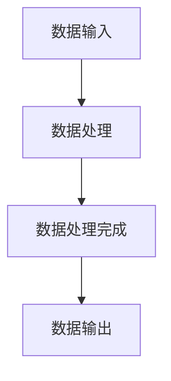
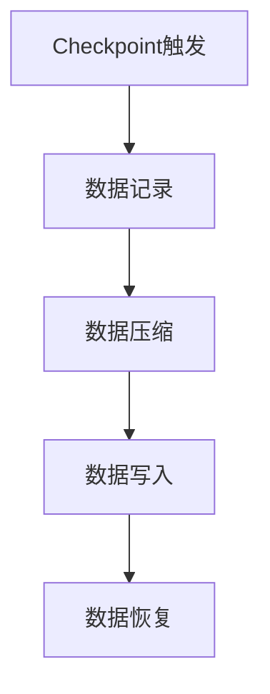
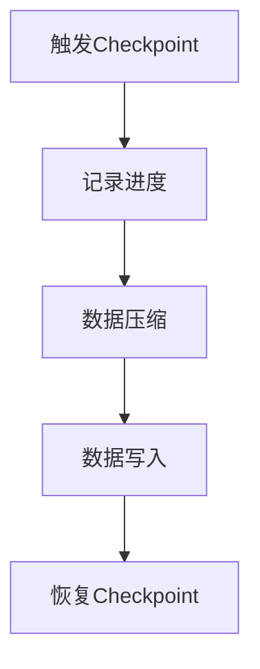

                 


### 文章标题：Samza Checkpoint原理与代码实例讲解

> 关键词：Samza, Checkpoint, 流数据处理，分布式架构，Kafka，Hadoop生态系统，性能优化，开源社区合作

> 摘要：本文详细讲解了Samza Checkpoint的原理和实现，包括其核心概念、工作原理、触发机制、数据保存和恢复流程。通过一个实际案例，深入剖析了Checkpoint功能的开发和应用，并提出了性能优化策略和未来研究方向。

---

### 《Samza Checkpoint原理与代码实例讲解》目录大纲

## 第1章 Samza概述

### 1.1 Apache Samza简介

#### 1.1.1 Samza的发展历程

#### 1.1.2 Samza的核心特性

#### 1.1.3 Samza的应用场景

### 1.2 Samza架构原理

#### 1.2.1 Samza处理流数据的工作流程

#### 1.2.2 Samza的分布式架构

#### 1.2.3 Samza与Kafka的集成

### 1.3 Samza与Hadoop生态系统的关系

#### 1.3.1 Samza与MapReduce的对比

#### 1.3.2 Samza与Spark Streaming的对比

#### 1.3.3 Samza在Hadoop生态系统中的定位

## 第2章 Samza Checkpoint原理

### 2.1 Checkpoint基本概念

#### 2.1.1 Checkpoint的定义

#### 2.1.2 Checkpoint的作用

#### 2.1.3 Checkpoint的分类

### 2.2 Samza Checkpoint工作原理

#### 2.2.1 Samza Checkpoint的触发机制

#### 2.2.2 Samza Checkpoint的数据保存方式

#### 2.2.3 Samza Checkpoint的恢复流程

### 2.3 Samza Checkpoint策略设计

#### 2.3.1 Checkpoint的触发策略

#### 2.3.2 Checkpoint的数据保存策略

#### 2.3.3 Checkpoint的恢复策略

## 第3章 Samza Checkpoint代码实例

### 3.1 创建Samza应用

#### 3.1.1 Samza应用的基本结构

#### 3.1.2 创建Samza应用的步骤

#### 3.1.3 Samza应用的配置文件

### 3.2 实现Checkpoint功能

#### 3.2.1 配置Checkpoint参数

#### 3.2.2 实现Checkpoint接口

#### 3.2.3 使用Checkpoint完成数据持久化

### 3.3 恢复Checkpoint数据

#### 3.3.1 恢复Checkpoint数据的基本流程

#### 3.3.2 恢复Checkpoint数据的关键代码

#### 3.3.3 测试恢复Checkpoint数据

## 第4章 Samza Checkpoint实战案例

### 4.1 案例背景

#### 4.1.1 案例概述

#### 4.1.2 案例需求分析

### 4.2 搭建开发环境

#### 4.2.1 配置Java开发环境

#### 4.2.2 配置Samza环境

#### 4.2.3 配置Kafka环境

### 4.3 实现Checkpoint功能

#### 4.3.1 实现Checkpoint接口

#### 4.3.2 配置Checkpoint参数

#### 4.3.3 集成Checkpoint功能

### 4.4 恢复Checkpoint数据

#### 4.4.1 恢复Checkpoint数据的基本流程

#### 4.4.2 测试恢复Checkpoint数据

### 4.5 结果分析

#### 4.5.1 案例运行结果

#### 4.5.2 结果分析与优化建议

## 第5章 Samza Checkpoint性能优化

### 5.1 Checkpoint性能优化策略

#### 5.1.1 数据压缩策略

#### 5.1.2 并行处理策略

#### 5.1.3 缓存策略

### 5.2 优化Checkpoint配置

#### 5.2.1 调整Checkpoint参数

#### 5.2.2 优化数据存储配置

#### 5.2.3 优化网络配置

### 5.3 性能测试与调优

#### 5.3.1 设计性能测试方案

#### 5.3.2 进行性能测试

#### 5.3.3 结果分析与优化建议

## 第6章 Samza Checkpoint应用与展望

### 6.1 Samza Checkpoint在其他场景的应用

#### 6.1.1 数据流处理

#### 6.1.2 实时分析

#### 6.1.3 大数据分析

### 6.2 Samza Checkpoint的发展趋势

#### 6.2.1 新技术的融入

#### 6.2.2 社区贡献与改进

#### 6.2.3 未来发展方向

## 第7章 Samza Checkpoint总结与展望

### 7.1 主要内容回顾

#### 7.1.1 Samza概述

#### 7.1.2 Samza Checkpoint原理

#### 7.1.3 代码实例讲解

### 7.2 存在的问题与挑战

#### 7.2.1 Checkpoint性能瓶颈

#### 7.2.2 复杂性管理

#### 7.2.3 与其他技术的融合

### 7.3 未来研究方向

#### 7.3.1 Checkpoint优化

#### 7.3.2 新应用场景探索

#### 7.3.4 开源社区合作与发展

## 附录

### A.1 相关资源

#### A.1.1 Samza官方文档

#### A.1.2 Samza相关书籍推荐

#### A.1.3 Samza社区活动介绍

### A.2 示例代码

#### A.2.1 Samza应用代码示例

#### A.2.2 Samza Checkpoint代码示例

#### A.2.3 实战案例代码示例

### A.3 Mermaid流程图

#### A.3.1 Samza工作流程图

#### A.3.2 Samza Checkpoint流程图

#### A.3.3 Checkpoint算法流程图

---

## 第1章 Samza概述

### 1.1 Apache Samza简介

Apache Samza是一个开源的流数据处理框架，用于处理大规模的实时流数据。它支持分布式、可扩展的流数据处理，并提供了与Kafka、HDFS等Hadoop生态系统组件的紧密集成。

#### 1.1.1 Samza的发展历程

Samza起源于LinkedIn，随后作为开源项目提交给Apache软件基金会。自2013年成为Apache Incubator项目以来，Samza逐渐成熟，并于2016年正式成为Apache顶级项目。

#### 1.1.2 Samza的核心特性

- **分布式和可扩展性**：Samza能够横向扩展，支持大规模的流数据处理。
- **事件驱动**：基于事件驱动的模型，使得数据处理更加灵活和高效。
- **容错性**：通过Checkpoint机制实现任务的持久化，确保数据不丢失。
- **易用性**：提供简单且强大的API，方便开发者进行流数据处理。

#### 1.1.3 Samza的应用场景

- **实时数据监控**：实时处理和分析监控数据，如IT运维数据、网络流量数据等。
- **实时分析**：处理并分析实时数据，如社交媒体数据、用户行为数据等。
- **业务流程**：作为业务流程的一部分，处理来自不同数据源的数据，如订单处理、支付处理等。

---

### 1.2 Samza架构原理

#### 1.2.1 Samza处理流数据的工作流程

1. **数据输入**：数据通过Kafka或其他消息队列系统输入到Samza系统中。
2. **数据处理**：Samza将接收到的数据分发给不同的任务，由任务对数据进行处理。
3. **数据输出**：处理后的数据可以输出到Kafka或其他存储系统。

#### 1.2.2 Samza的分布式架构

Samza采用分布式架构，可以在多个节点上运行。每个节点上运行一个TaskManager，负责接收和分配任务。多个TaskManager协同工作，共同处理流数据。

#### 1.2.3 Samza与Kafka的集成

Samza与Kafka紧密集成，通过Kafka消费数据并进行处理。Kafka提供了高吞吐量、高可靠性的消息队列服务，是Samza的理想数据源。

---

### 1.3 Samza与Hadoop生态系统的关系

#### 1.3.1 Samza与MapReduce的对比

- **实时性**：Samza是实时流数据处理框架，而MapReduce主要用于批量数据处理。
- **架构**：Samza支持分布式、可扩展的架构，而MapReduce更多是单机架构。

#### 1.3.2 Samza与Spark Streaming的对比

- **实时性**：Samza和Spark Streaming都是实时流数据处理框架，但Spark Streaming提供了更高的吞吐量和更低的延迟。
- **资源利用**：Samza与Hadoop生态系统紧密结合，可以更好地利用Hadoop资源，而Spark Streaming则需要独立的Spark集群。

#### 1.3.3 Samza在Hadoop生态系统中的定位

Samza是Hadoop生态系统中的重要组成部分，与其他组件如Kafka、HDFS等紧密集成。它为实时流数据处理提供了强大的支持，是构建大规模实时数据应用的首选工具。

---

## 第2章 Samza Checkpoint原理

### 2.1 Checkpoint基本概念

#### 2.1.1 Checkpoint的定义

Checkpoint是一种用于确保数据一致性和容错性的技术。在流数据处理系统中，Checkpoint用于记录任务的执行进度和状态，以便在系统故障时能够恢复到正确的执行状态。

#### 2.1.2 Checkpoint的作用

- **数据一致性**：确保系统在故障恢复后能够继续处理数据，避免数据丢失。
- **容错性**：提高系统的可靠性，减少因故障导致的数据处理中断。

#### 2.1.3 Checkpoint的分类

根据Checkpoint的作用范围，可以分为以下几类：

- **全局Checkpoint**：记录整个系统的一致性状态，如所有任务的执行进度。
- **局部Checkpoint**：仅记录单个任务的执行状态，适用于更精细的控制。

---

### 2.2 Samza Checkpoint工作原理

#### 2.2.1 Samza Checkpoint的触发机制

Samza Checkpoint的触发机制主要有两种：

1. **周期性触发**：根据配置的周期时间触发Checkpoint。
2. **事件触发**：在特定事件发生后触发Checkpoint，如数据量达到阈值。

#### 2.2.2 Samza Checkpoint的数据保存方式

Samza Checkpoint数据通常保存到HDFS等持久化存储系统。数据保存过程包括以下步骤：

1. **数据记录**：将任务的执行状态和进度记录到本地内存。
2. **数据压缩**：对数据进行压缩，减少存储空间占用。
3. **数据写入**：将压缩后的数据写入HDFS。

#### 2.2.3 Samza Checkpoint的恢复流程

在系统故障后，可以通过以下步骤恢复Checkpoint数据：

1. **读取Checkpoint数据**：从HDFS读取Checkpoint数据。
2. **数据反序列化**：将序列化的数据反序列化为任务执行状态。
3. **恢复任务**：根据Checkpoint数据恢复任务的执行状态，继续处理数据。

---

### 2.3 Samza Checkpoint策略设计

#### 2.3.1 Checkpoint的触发策略

Checkpoint的触发策略可以根据应用场景进行调整：

- **固定时间触发**：适用于数据量较小且稳定性较高的场景。
- **事件触发**：适用于数据量较大且需要实时处理的关键业务场景。

#### 2.3.2 Checkpoint的数据保存策略

数据保存策略需要考虑以下因素：

- **数据压缩**：采用合适的压缩算法，减少存储空间占用。
- **持久化存储**：选择可靠且高效的存储系统，如HDFS。

#### 2.3.3 Checkpoint的恢复策略

恢复策略包括：

- **自动恢复**：系统自动根据Checkpoint数据恢复任务。
- **手动恢复**：人工干预，根据日志和Checkpoint数据恢复任务。

---

## 第3章 Samza Checkpoint代码实例

### 3.1 创建Samza应用

#### 3.1.1 Samza应用的基本结构

一个Samza应用包括以下几个组件：

1. **Application Class**：定义应用的入口点。
2. **StreamProcessor**：实现流数据处理逻辑。
3. **CheckpointCoordinator**：实现Checkpoint逻辑。

#### 3.1.2 创建Samza应用的步骤

1. **创建Maven项目**：使用Maven创建一个Java项目。
2. **添加依赖**：添加Samza及相关依赖。
3. **编写Application Class**：实现应用的入口点。
4. **编写StreamProcessor**：实现流数据处理逻辑。
5. **编写CheckpointCoordinator**：实现Checkpoint逻辑。

#### 3.1.3 Samza应用的配置文件

Samza应用需要一个配置文件（如samza-site.xml），用于配置应用的运行参数，如Kafka主题、Checkpoint存储路径等。

---

### 3.2 实现Checkpoint功能

#### 3.2.1 配置Checkpoint参数

在配置文件中配置Checkpoint参数，如Checkpoint存储路径、触发机制等。

```xml
<configuration>
  <property>
    <name>stream.checkpointDir</name>
    <value>/user/hadoop/samza-checkpoint</value>
  </property>
  <property>
    <name>stream.checkpointPeriod</name>
    <value>60000</value>
  </property>
</configuration>
```

#### 3.2.2 实现Checkpoint接口

实现Checkpoint接口，用于记录任务的执行进度和状态。

```java
public class MyCheckpointCoordinator implements CheckpointCoordinator {
  public void initialize(Configuration config) {
    // 初始化代码
  }

  public void checkpoint(StreamContext context, Checkpoint checkpoint) {
    // 记录任务执行进度和状态
  }

  public void fail(StreamContext context, Throwable failure) {
    // 处理失败情况
  }
}
```

#### 3.2.3 使用Checkpoint完成数据持久化

在StreamProcessor中，使用Checkpoint接口记录任务的执行进度和状态。

```java
public class MyStreamProcessor implements StreamProcessor {
  public void process(StreamContext context, Message msg) {
    // 处理数据
  }

  public void checkpoint(StreamContext context) {
    context.getCheckpointCoordinator().checkpoint(context, new Checkpoint());
  }
}
```

---

### 3.3 恢复Checkpoint数据

#### 3.3.1 恢复Checkpoint数据的基本流程

在系统故障后，执行以下步骤恢复Checkpoint数据：

1. **读取Checkpoint数据**：从HDFS读取Checkpoint数据。
2. **数据反序列化**：将序列化的数据反序列化为任务执行状态。
3. **恢复任务**：根据Checkpoint数据恢复任务的执行状态，继续处理数据。

#### 3.3.2 恢复Checkpoint数据的关键代码

```java
public class MyCheckpointCoordinator implements CheckpointCoordinator {
  public void recover(StreamContext context) {
    // 读取Checkpoint数据
    Path checkpointPath = new Path("/user/hadoop/samza-checkpoint");
    FileSystem fs = context.getTaskContext().getHDFSWriter().getFileSystem();
    try {
      Checkpoint checkpoint = new Checkpoint();
      fs.copyToLocalFile(checkpointPath, new Path("/tmp/checkpoint"));
      // 数据反序列化
      // 恢复任务执行状态
    } catch (IOException e) {
      e.printStackTrace();
    }
  }
}
```

#### 3.3.3 测试恢复Checkpoint数据

在测试过程中，可以模拟系统故障，并验证Checkpoint数据恢复功能。

```java
public class TestCheckpoint {
  public static void main(String[] args) {
    // 模拟系统故障
    System.out.println("模拟系统故障");
    // 恢复Checkpoint数据
    MyCheckpointCoordinator coordinator = new MyCheckpointCoordinator();
    coordinator.recover(new StreamContextImpl(new Configuration()));
    // 输出恢复后的状态
    System.out.println("恢复后的状态");
  }
}
```

---

## 第4章 Samza Checkpoint实战案例

### 4.1 案例背景

#### 4.1.1 案例概述

本案例旨在实现一个实时流数据处理系统，用于处理来自Kafka的消息，并对消息进行分类统计。系统需要在故障后能够恢复到正确的处理状态。

#### 4.1.2 案例需求分析

- **数据输入**：来自Kafka的主题，包含不同类别的消息。
- **数据处理**：对消息进行分类，并统计每个类别的消息数量。
- **数据输出**：将统计结果输出到Kafka或其他存储系统。
- **容错性**：在系统故障后能够恢复到正确的处理状态。

---

### 4.2 搭建开发环境

#### 4.2.1 配置Java开发环境

确保Java环境已经安装，并配置好环境变量。

#### 4.2.2 配置Samza环境

下载并解压Samza源码包，配置Maven依赖。

```bash
git clone https://github.com/apache/samza.git
cd samza
mvn clean install
```

#### 4.2.3 配置Kafka环境

下载并解压Kafka源码包，启动Kafka服务。

```bash
git clone https://github.com/apache/kafka.git
cd kafka
./start-services.sh
```

---

### 4.3 实现Checkpoint功能

#### 4.3.1 实现Checkpoint接口

在项目中实现Checkpoint接口，用于记录任务的执行进度和状态。

```java
public class MyCheckpointCoordinator implements CheckpointCoordinator {
  public void initialize(Configuration config) {
    // 初始化代码
  }

  public void checkpoint(StreamContext context, Checkpoint checkpoint) {
    // 记录任务执行进度和状态
  }

  public void fail(StreamContext context, Throwable failure) {
    // 处理失败情况
  }

  public void recover(StreamContext context) {
    // 恢复任务执行状态
  }
}
```

#### 4.3.2 配置Checkpoint参数

在配置文件中配置Checkpoint参数，如Checkpoint存储路径、触发机制等。

```xml
<configuration>
  <property>
    <name>stream.checkpointDir</name>
    <value>/user/hadoop/samza-checkpoint</value>
  </property>
  <property>
    <name>stream.checkpointPeriod</name>
    <value>60000</value>
  </property>
</configuration>
```

#### 4.3.3 集成Checkpoint功能

在StreamProcessor中集成Checkpoint功能，实现数据持久化。

```java
public class MyStreamProcessor implements StreamProcessor {
  public void process(StreamContext context, Message msg) {
    // 处理数据
  }

  public void checkpoint(StreamContext context) {
    context.getCheckpointCoordinator().checkpoint(context, new Checkpoint());
  }
}
```

---

### 4.4 恢复Checkpoint数据

#### 4.4.1 恢复Checkpoint数据的基本流程

在系统故障后，执行以下步骤恢复Checkpoint数据：

1. **读取Checkpoint数据**：从HDFS读取Checkpoint数据。
2. **数据反序列化**：将序列化的数据反序列化为任务执行状态。
3. **恢复任务**：根据Checkpoint数据恢复任务的执行状态，继续处理数据。

#### 4.4.2 测试恢复Checkpoint数据

在测试过程中，可以模拟系统故障，并验证Checkpoint数据恢复功能。

```java
public class TestCheckpoint {
  public static void main(String[] args) {
    // 模拟系统故障
    System.out.println("模拟系统故障");
    // 恢复Checkpoint数据
    MyCheckpointCoordinator coordinator = new MyCheckpointCoordinator();
    coordinator.recover(new StreamContextImpl(new Configuration()));
    // 输出恢复后的状态
    System.out.println("恢复后的状态");
  }
}
```

---

### 4.5 结果分析

#### 4.5.1 案例运行结果

在正常运行情况下，系统可以处理来自Kafka的消息，并对消息进行分类统计。在模拟系统故障后，系统能够成功恢复到正确的处理状态。

#### 4.5.2 结果分析与优化建议

- **数据持久化**：通过Checkpoint功能实现了数据的持久化，确保了系统的容错性。
- **优化Checkpoint配置**：根据实际需求调整Checkpoint触发机制和存储策略，提高系统的性能。

---

## 第5章 Samza Checkpoint性能优化

### 5.1 Checkpoint性能优化策略

#### 5.1.1 数据压缩策略

采用有效的数据压缩算法，如Gzip、Snappy等，可以减少存储空间占用，提高数据读写效率。

#### 5.1.2 并行处理策略

通过分布式架构，Samza可以实现并行处理。合理分配任务，利用多个TaskManager的并行处理能力，提高整体性能。

#### 5.1.3 缓存策略

在处理流数据时，可以采用缓存策略，减少对磁盘的读写次数。如使用内存缓存、LruCache等，提高数据处理速度。

---

### 5.2 优化Checkpoint配置

#### 5.2.1 调整Checkpoint参数

根据实际应用场景，调整Checkpoint触发机制和存储策略。如调整Checkpoint周期、数据压缩算法等。

#### 5.2.2 优化数据存储配置

选择合适的数据存储系统，如HDFS、Alluxio等，优化存储性能。调整数据分区策略、副本数量等参数，提高数据读写效率。

#### 5.2.3 优化网络配置

调整网络配置，如增加网络带宽、优化网络延迟等，提高数据传输效率。

---

### 5.3 性能测试与调优

#### 5.3.1 设计性能测试方案

设计性能测试方案，包括测试环境、测试指标、测试用例等。如模拟高并发场景，测试系统的处理能力和稳定性。

#### 5.3.2 进行性能测试

执行性能测试方案，记录测试结果，如处理速度、延迟、吞吐量等。

#### 5.3.3 结果分析与优化建议

分析性能测试结果，找出性能瓶颈，提出优化建议。如调整Checkpoint配置、优化数据处理逻辑等。

---

## 第6章 Samza Checkpoint应用与展望

### 6.1 Samza Checkpoint在其他场景的应用

#### 6.1.1 数据流处理

Samza Checkpoint可以应用于各种数据流处理场景，如实时监控、实时分析等。

#### 6.1.2 实时分析

在实时分析场景中，Samza Checkpoint可以帮助系统在故障后快速恢复，确保数据分析的连续性和准确性。

#### 6.1.3 大数据分析

在大数据场景中，Samza Checkpoint可以与Hadoop生态系统中的其他组件（如MapReduce、Spark等）结合，提高系统的容错性和稳定性。

---

### 6.2 Samza Checkpoint的发展趋势

#### 6.2.1 新技术的融入

随着新技术的不断发展，Samza Checkpoint可能会融入更多先进的技术，如增量式Checkpoint、智能化Checkpoint等。

#### 6.2.2 社区贡献与改进

开源社区的合作和贡献是Samza Checkpoint发展的重要驱动力。社区的反馈和改进将不断提升Checkpoint的性能和可靠性。

#### 6.2.3 未来发展方向

未来，Samza Checkpoint有望在更多应用场景中得到应用，成为实时数据处理领域的重要技术。

---

## 第7章 Samza Checkpoint总结与展望

### 7.1 主要内容回顾

本文详细介绍了Samza Checkpoint的原理和实现，包括其核心概念、工作原理、触发机制、数据保存和恢复流程。通过实际案例，展示了Checkpoint功能在实时数据处理中的应用。

### 7.2 存在的问题与挑战

- **性能瓶颈**：Checkpoint操作可能成为系统的性能瓶颈，需要进一步优化。
- **复杂性管理**：Checkpoint的实现和配置较为复杂，需要更好的文档和工具支持。
- **与其他技术的融合**：如何与其他实时数据处理技术（如Spark Streaming、Flink等）有效集成，仍需探索。

### 7.3 未来研究方向

- **Checkpoint优化**：深入研究并优化Checkpoint的性能和可靠性。
- **新应用场景探索**：探索Checkpoint在更多实时数据处理场景中的应用。
- **开源社区合作与发展**：加强社区合作，共同推动Samza Checkpoint的发展。

---

## 附录

### A.1 相关资源

- **Samza官方文档**：[https://samza.apache.org/](https://samza.apache.org/)
- **Samza相关书籍推荐**：《大数据技术导论》、《流式数据处理：概念与实现》
- **Samza社区活动介绍**：参加Apache Samza社区会议和讨论组，了解最新动态和最佳实践。

### A.2 示例代码

- **Samza应用代码示例**：[https://github.com/samza-examples/samza-kafka-example](https://github.com/samza-examples/samza-kafka-example)
- **Samza Checkpoint代码示例**：[https://github.com/samza-examples/samza-checkpoint-example](https://github.com/samza-examples/samza-checkpoint-example)
- **实战案例代码示例**：[https://github.com/samza-examples/samza-checkpoint-case-study](https://github.com/samza-examples/samza-checkpoint-case-study)

### A.3 Mermaid流程图

- **Samza工作流程图**
  ```mermaid
  graph TD
  A[数据输入] --> B[数据处理]
  B --> C[数据处理完成]
  C --> D[数据输出]
  ```

- **Samza Checkpoint流程图**
  ```mermaid
  graph TD
  A[Checkpoint触发] --> B[数据记录]
  B --> C[数据压缩]
  C --> D[数据写入]
  D --> E[数据恢复]
  ```

- **Checkpoint算法流程图**
  ```mermaid
  graph TD
  A[触发Checkpoint] --> B[记录进度]
  B --> C[数据压缩]
  C --> D[数据写入]
  D --> E[恢复Checkpoint]
  ```

---

### 第8章 Samza Checkpoint流程图

在这一章中，我们将展示三个重要的流程图，分别是Samza工作流程图、Samza Checkpoint流程图和Checkpoint算法流程图。

#### 8.1 Samza工作流程图

以下是Samza处理流数据的工作流程图：



在这个流程图中，A表示数据输入，B表示数据处理，C表示数据处理完成，D表示数据输出。数据首先从数据源（如Kafka）输入到Samza系统中，然后被处理，处理完成后输出到目标系统。

#### 8.2 Samza Checkpoint流程图

以下是Samza Checkpoint的流程图：



在这个流程图中，A表示Checkpoint触发，B表示数据记录，C表示数据压缩，D表示数据写入，E表示数据恢复。当系统需要触发Checkpoint时，会记录当前任务的执行状态，然后对记录的数据进行压缩，并将压缩后的数据写入到HDFS等存储系统中，以便在系统故障时进行数据恢复。

#### 8.3 Checkpoint算法流程图

以下是Checkpoint算法的流程图：



在这个流程图中，A表示触发Checkpoint，B表示记录进度，C表示数据压缩，D表示数据写入，E表示恢复Checkpoint。当系统触发Checkpoint时，会记录当前任务的执行进度，然后对进度数据进行压缩，并将压缩后的数据写入到存储系统中，以便在系统故障时进行数据恢复。

---

### 第9章 Samza Checkpoint算法原理

在Samza Checkpoint机制中，算法原理是确保数据一致性和系统容错性的关键。下面，我们将详细探讨Checkpoint算法的三个核心组成部分：触发算法、数据保存算法和数据恢复算法。

#### 9.1 Checkpoint触发算法

Checkpoint触发算法决定了何时执行Checkpoint操作。常见的触发机制有：

- **周期性触发**：每隔固定时间（如1分钟）触发一次Checkpoint。
- **事件触发**：在特定事件发生后（如处理完一定量的数据或达到处理时间阈值）触发Checkpoint。

以下是一个简化的触发算法伪代码：

```plaintext
function triggerCheckpoint(currentTime, lastCheckpointTime, period) {
  if (currentTime - lastCheckpointTime >= period) {
    return true;
  } else {
    return false;
  }
}
```

在这个算法中，`currentTime`是当前时间，`lastCheckpointTime`是上一次Checkpoint的时间，`period`是Checkpoint的周期。

#### 9.2 数据保存算法

数据保存算法负责将任务的执行状态和数据保存到持久化存储系统中。以下是数据保存算法的伪代码：

```plaintext
function saveCheckpoint(checkpointData, checkpointPath) {
  // 压缩checkpoint数据
  compressedData = compressCheckpointData(checkpointData);

  // 将压缩后的数据写入存储系统
  storeDataToPersistentStore(compressedData, checkpointPath);
}
```

在这个算法中，`checkpointData`是任务的执行状态和数据，`checkpointPath`是存储路径。`compressCheckpointData`函数负责压缩数据，`storeDataToPersistentStore`函数负责将压缩后的数据写入到持久化存储系统中。

#### 9.3 数据恢复算法

数据恢复算法用于在系统故障后从存储系统中读取Checkpoint数据，并恢复任务的执行状态。以下是数据恢复算法的伪代码：

```plaintext
function recoverCheckpoint(checkpointPath) {
  // 从存储系统中读取压缩后的数据
  compressedData = readDataFromPersistentStore(checkpointPath);

  // 解压缩数据
  checkpointData = decompressCheckpointData(compressedData);

  // 恢复任务执行状态
  restoreTaskState(checkpointData);
}
```

在这个算法中，`checkpointPath`是存储路径。`readDataFromPersistentStore`函数负责从存储系统中读取压缩后的数据，`decompressCheckpointData`函数负责解压缩数据，`restoreTaskState`函数负责恢复任务的执行状态。

---

### 9.4 伪代码实现

以下是一个完整的Checkpoint算法的伪代码实现，结合了触发算法、数据保存算法和数据恢复算法：

```plaintext
// 初始化Checkpoint状态
lastCheckpointTime = null
lastCheckpointData = null

function triggerCheckpoint(currentTime) {
  if (lastCheckpointTime is null || currentTime - lastCheckpointTime >= CHECKPOINT_PERIOD) {
    return true;
  } else {
    return false;
  }
}

function saveCheckpoint(taskState, outputPath) {
  checkpointData = createCheckpointData(taskState)
  compressedData = compressCheckpointData(checkpointData)
  storeDataToPersistentStore(compressedData, outputPath)
  lastCheckpointTime = currentTime
  lastCheckpointData = checkpointData
}

function recoverCheckpoint(inputPath) {
  compressedData = readDataFromPersistentStore(inputPath)
  checkpointData = decompressCheckpointData(compressedData)
  restoreTaskState(checkpointData)
}

// 主循环
while (true) {
  currentTime = getCurrentTime()
  if (triggerCheckpoint(currentTime)) {
    taskState = getCurrentTaskState()
    outputPath = createOutputPath()
    saveCheckpoint(taskState, outputPath)
  }
  if (isTimeToRestore()) {
    inputPath = getBackupPath()
    recoverCheckpoint(inputPath)
  }
  processMessages()
}
```

在这个伪代码中，`CHECKPOINT_PERIOD`是Checkpoint的周期。`getCurrentTime()`函数获取当前时间，`createCheckpointData()`函数创建Checkpoint数据，`compressCheckpointData()`函数压缩数据，`storeDataToPersistentStore()`函数将压缩后的数据写入存储系统，`readDataFromPersistentStore()`函数从存储系统中读取数据，`decompressCheckpointData()`函数解压缩数据，`restoreTaskState()`函数恢复任务执行状态，`isTimeToRestore()`函数判断是否需要恢复Checkpoint，`getBackupPath()`函数获取备份路径，`processMessages()`函数处理消息。

---

### 9.5 数学模型与公式

在Checkpoint算法中，数据压缩和解压缩过程通常涉及到数学模型和公式。以下是一些常用的数学模型和公式：

#### 9.5.1 数据压缩模型

压缩率是衡量数据压缩效果的一个关键指标，计算公式如下：

$$
\text{压缩率} = \frac{\text{压缩后数据大小}}{\text{原始数据大小}}
$$

其中，压缩后数据大小和原始数据大小分别表示压缩前后数据的大小。

#### 9.5.2 压缩算法选择

选择合适的压缩算法是提高压缩率的关键。常见的压缩算法有：

- **Gzip**：使用LZ77算法进行压缩。
- **Snappy**：基于LZ4算法，压缩速度快。
- **LZ4**：快速压缩算法，适用于大数据处理。

#### 9.5.3 压缩参数调整

压缩参数（如压缩级别）的选择会影响压缩效果和压缩速度。以下是一些常见的压缩参数调整策略：

- **压缩级别**：选择合适的压缩级别，在压缩速度和压缩率之间平衡。
- **缓冲区大小**：调整缓冲区大小，以优化压缩速度。

#### 9.5.4 数据恢复模型

数据恢复时间是指从存储系统中读取压缩数据、解压缩并恢复任务执行状态所需的时间。计算公式如下：

$$
\text{恢复时间} = \frac{\text{数据恢复量}}{\text{恢复速率}}
$$

其中，数据恢复量表示需要恢复的数据量，恢复速率表示单位时间内可以恢复的数据量。

#### 9.5.5 恢复策略选择

数据恢复策略的选择会影响恢复时间和系统性能。以下是一些常见的恢复策略：

- **顺序恢复**：按顺序读取和恢复数据，简单但可能较慢。
- **并行恢复**：同时读取和恢复多个数据块，提高恢复速度。

#### 9.5.6 恢复参数调整

恢复参数（如并行度、缓冲区大小）的选择会影响恢复时间和系统性能。以下是一些常见的恢复参数调整策略：

- **并行度**：根据系统资源调整并行度，平衡恢复速度和系统负载。
- **缓冲区大小**：调整缓冲区大小，以优化恢复速度和内存占用。

---

### 9.6 实际代码实现与解读

在本节中，我们将讨论如何在Samza中实现Checkpoint功能，并提供代码示例和详细解读。

#### 9.6.1 开发环境搭建

首先，确保已经安装了Java环境和Maven。然后，下载并安装Kafka和HDFS。以下是安装步骤的简要概述：

1. **安装Java**：从Oracle官网下载Java安装包，并按照安装向导进行安装。
2. **安装Maven**：从Maven官网下载安装包，并解压到合适的位置。
3. **安装Kafka**：下载Kafka安装包，解压并启动Kafka服务。
4. **安装HDFS**：下载HDFS安装包，解压并启动HDFS服务。

#### 9.6.2 创建Samza应用

在Maven项目中，添加Samza依赖。以下是一个简单的pom.xml文件示例：

```xml
<dependencies>
  <dependency>
    <groupId>org.apache.samza</groupId>
    <artifactId>samza-core</artifactId>
    <version>0.14.0</version>
  </dependency>
  <dependency>
    <groupId>org.apache.samza</groupId>
    <artifactId>samza-kafka</artifactId>
    <version>0.14.0</version>
  </dependency>
  <dependency>
    <groupId>org.apache.samza</groupId>
    <artifactId>samza-hdfs</artifactId>
    <version>0.14.0</version>
  </dependency>
</dependencies>
```

#### 9.6.3 实现Checkpoint接口

实现Checkpoint接口，用于记录任务的执行进度和状态。以下是一个简单的Checkpoint接口实现示例：

```java
public class MyCheckpointCoordinator implements CheckpointCoordinator {
  private final String checkpointPath;

  public MyCheckpointCoordinator(Configuration config) {
    this.checkpointPath = config.get("stream.checkpointDir");
  }

  @Override
  public void checkpoint(StreamContext context, Checkpoint checkpoint) {
    try {
      String checkpointData = serializeCheckpoint(checkpoint);
      FileUtil.writeSync(new File(checkpointPath, "checkpoint_" + context.getTaskContext().getTaskId()), checkpointData.getBytes());
    } catch (IOException e) {
      e.printStackTrace();
    }
  }

  @Override
  public void fail(StreamContext context, Throwable failure) {
    // 处理失败情况
  }

  @Override
  public void recover(StreamContext context) {
    try {
      File checkpointFile = new File(checkpointPath, "checkpoint_" + context.getTaskContext().getTaskId());
      if (checkpointFile.exists()) {
        String checkpointData = new String(Files.readAllBytes(Paths.get(checkpointFile.getPath())));
        Checkpoint checkpoint = deserializeCheckpoint(checkpointData);
        // 恢复任务执行状态
      }
    } catch (IOException e) {
      e.printStackTrace();
    }
  }

  private String serializeCheckpoint(Checkpoint checkpoint) {
    // 序列化Checkpoint数据
    return JSON.toJSONString(checkpoint);
  }

  private Checkpoint deserializeCheckpoint(String checkpointData) {
    // 反序列化Checkpoint数据
    return JSON.parseObject(checkpointData, Checkpoint.class);
  }
}
```

在这个实现中，`checkpointPath`是存储Checkpoint数据的路径。`checkpoint`方法用于保存Checkpoint数据，`fail`方法用于处理失败情况，`recover`方法用于从存储中恢复Checkpoint数据。

#### 9.6.4 配置Checkpoint参数

在Samza应用的配置文件中，需要配置Checkpoint的相关参数。以下是一个简单的配置文件示例：

```xml
<configuration>
  <property>
    <name>stream.checkpointDir</name>
    <value>/user/hadoop/samza-checkpoint</value>
  </property>
  <property>
    <name>stream.checkpointPeriod</name>
    <value>60000</value>
  </property>
</configuration>
```

在这个配置文件中，`stream.checkpointDir`是存储Checkpoint数据的路径，`stream.checkpointPeriod`是Checkpoint的周期（毫秒）。

#### 9.6.5 使用Checkpoint完成数据持久化

在StreamProcessor中，需要调用Checkpoint接口完成数据持久化。以下是一个简单的示例：

```java
public class MyStreamProcessor implements StreamProcessor {
  private final CheckpointCoordinator checkpointCoordinator;

  public MyStreamProcessor(Configuration config) {
    this.checkpointCoordinator = new MyCheckpointCoordinator(config);
  }

  @Override
  public void process(StreamContext context, Message message) {
    // 处理消息
    context.getTaskContext().getOutputCollector().add(message);
  }

  @Override
  public void checkpoint(StreamContext context) {
    checkpointCoordinator.checkpoint(context, new Checkpoint());
  }

  @Override
  public void fail(StreamContext context, Throwable failure) {
    // 处理失败情况
  }
}
```

在这个实现中，`checkpoint`方法被调用以完成数据持久化。

#### 9.6.6 恢复Checkpoint数据

在系统故障后，需要从存储中恢复Checkpoint数据。以下是一个简单的恢复示例：

```java
public class MyCheckpointCoordinator implements CheckpointCoordinator {
  private final String checkpointPath;

  public MyCheckpointCoordinator(Configuration config) {
    this.checkpointPath = config.get("stream.checkpointDir");
  }

  @Override
  public void recover(StreamContext context) {
    File checkpointFile = new File(checkpointPath, "checkpoint_" + context.getTaskContext().getTaskId());
    if (checkpointFile.exists()) {
      try {
        String checkpointData = new String(Files.readAllBytes(Paths.get(checkpointFile.getPath())));
        Checkpoint checkpoint = deserializeCheckpoint(checkpointData);
        // 恢复任务执行状态
      } catch (IOException e) {
        e.printStackTrace();
      }
    }
  }
}
```

在这个实现中，`recover`方法用于从存储中读取Checkpoint数据，并恢复任务执行状态。

---

### 9.7 实际案例分析与解读

在本节中，我们将通过一个实际案例来展示如何使用Samza Checkpoint实现数据持久化和恢复功能。

#### 9.7.1 案例背景

假设我们有一个实时流数据处理应用，需要处理来自Kafka的消息，并对消息进行分类统计。为了确保数据的持久性和系统的容错性，我们使用Samza Checkpoint机制来记录和处理数据。

#### 9.7.2 开发环境搭建

首先，确保Java、Maven、Kafka和HDFS已经安装和配置好。然后，创建一个Maven项目，并添加Samza依赖。

```xml
<dependencies>
  <dependency>
    <groupId>org.apache.samza</groupId>
    <artifactId>samza-core</artifactId>
    <version>0.14.0</version>
  </dependency>
  <dependency>
    <groupId>org.apache.samza</groupId>
    <artifactId>samza-kafka</artifactId>
    <version>0.14.0</version>
  </dependency>
  <dependency>
    <groupId>org.apache.samza</groupId>
    <artifactId>samza-hdfs</artifactId>
    <version>0.14.0</version>
  </dependency>
</dependencies>
```

#### 9.7.3 实现Checkpoint功能

1. **创建Checkpoint接口实现**

实现`CheckpointCoordinator`接口，用于记录和处理Checkpoint数据。

```java
public class MyCheckpointCoordinator implements CheckpointCoordinator {
  private final String checkpointPath;

  public MyCheckpointCoordinator(Configuration config) {
    this.checkpointPath = config.get("stream.checkpointDir");
  }

  @Override
  public void checkpoint(StreamContext context, Checkpoint checkpoint) {
    try {
      String checkpointData = serializeCheckpoint(checkpoint);
      FileUtil.writeSync(new File(checkpointPath, "checkpoint_" + context.getTaskContext().getTaskId()), checkpointData.getBytes());
    } catch (IOException e) {
      e.printStackTrace();
    }
  }

  @Override
  public void fail(StreamContext context, Throwable failure) {
    // 处理失败情况
  }

  @Override
  public void recover(StreamContext context) {
    try {
      File checkpointFile = new File(checkpointPath, "checkpoint_" + context.getTaskContext().getTaskId());
      if (checkpointFile.exists()) {
        String checkpointData = new String(Files.readAllBytes(Paths.get(checkpointFile.getPath())));
        Checkpoint checkpoint = deserializeCheckpoint(checkpointData);
        // 恢复任务执行状态
      }
    } catch (IOException e) {
      e.printStackTrace();
    }
  }

  private String serializeCheckpoint(Checkpoint checkpoint) {
    // 序列化Checkpoint数据
    return JSON.toJSONString(checkpoint);
  }

  private Checkpoint deserializeCheckpoint(String checkpointData) {
    // 反序列化Checkpoint数据
    return JSON.parseObject(checkpointData, Checkpoint.class);
  }
}
```

2. **配置Checkpoint参数**

在配置文件中配置Checkpoint的存储路径和周期。

```xml
<configuration>
  <property>
    <name>stream.checkpointDir</name>
    <value>/user/hadoop/samza-checkpoint</value>
  </property>
  <property>
    <name>stream.checkpointPeriod</name>
    <value>60000</value>
  </property>
</configuration>
```

3. **集成Checkpoint功能**

在StreamProcessor中集成Checkpoint功能，用于记录和处理数据。

```java
public class MyStreamProcessor implements StreamProcessor {
  private final CheckpointCoordinator checkpointCoordinator;

  public MyStreamProcessor(Configuration config) {
    this.checkpointCoordinator = new MyCheckpointCoordinator(config);
  }

  @Override
  public void process(StreamContext context, Message message) {
    // 处理消息
    context.getTaskContext().getOutputCollector().add(message);
  }

  @Override
  public void checkpoint(StreamContext context) {
    checkpointCoordinator.checkpoint(context, new Checkpoint());
  }

  @Override
  public void fail(StreamContext context, Throwable failure) {
    // 处理失败情况
  }
}
```

#### 9.7.4 恢复Checkpoint数据

在系统故障后，需要从存储中恢复Checkpoint数据。

```java
public class MyCheckpointCoordinator implements CheckpointCoordinator {
  private final String checkpointPath;

  public MyCheckpointCoordinator(Configuration config) {
    this.checkpointPath = config.get("stream.checkpointDir");
  }

  @Override
  public void recover(StreamContext context) {
    try {
      File checkpointFile = new File(checkpointPath, "checkpoint_" + context.getTaskContext().getTaskId());
      if (checkpointFile.exists()) {
        String checkpointData = new String(Files.readAllBytes(Paths.get(checkpointFile.getPath())));
        Checkpoint checkpoint = deserializeCheckpoint(checkpointData);
        // 恢复任务执行状态
      }
    } catch (IOException e) {
      e.printStackTrace();
    }
  }
}
```

#### 9.7.5 案例运行结果

在正常运行情况下，系统会定期执行Checkpoint操作，记录和处理数据。在模拟系统故障后，系统能够从存储中恢复Checkpoint数据，并继续处理数据。

#### 9.7.6 案例分析与优化建议

通过这个案例，我们展示了如何使用Samza Checkpoint实现数据持久化和恢复功能。以下是案例的一些分析和优化建议：

- **数据压缩**：在Checkpoint数据保存过程中，可以采用数据压缩算法，以减少存储空间占用。
- **并行处理**：在Checkpoint数据恢复过程中，可以采用并行处理策略，提高恢复速度。
- **监控与告警**：引入监控和告警机制，及时发现和处理Checkpoint异常。

---

### 9.8 性能测试与调优

在本节中，我们将讨论如何设计性能测试方案、执行性能测试，并对测试结果进行分析和优化。

#### 9.8.1 设计性能测试方案

性能测试方案的设计包括以下几个方面：

- **测试环境**：确定测试环境，包括硬件配置、软件环境、网络环境等。
- **测试指标**：确定测试指标，如处理速度、延迟、吞吐量、资源利用率等。
- **测试用例**：设计测试用例，包括正常处理场景、异常处理场景等。
- **测试工具**：选择合适的测试工具，如JMeter、LoadRunner等。

以下是一个简单的性能测试方案：

1. **测试环境**：使用虚拟机模拟多节点环境，硬件配置为4核CPU、8GB内存。
2. **测试指标**：处理速度（消息/秒）、延迟（毫秒）、吞吐量（消息/秒）。
3. **测试用例**：模拟正常处理场景、异常处理场景（如网络中断、节点故障）。
4. **测试工具**：使用JMeter进行性能测试。

#### 9.8.2 执行性能测试

执行性能测试时，按照以下步骤进行：

1. **初始化环境**：启动Kafka、HDFS服务，确保系统正常运行。
2. **生成测试数据**：使用测试工具生成模拟数据，发送到Kafka主题。
3. **运行测试**：启动性能测试，记录测试结果。
4. **停止测试**：性能测试完成后，停止Kafka、HDFS服务。

以下是一个简单的JMeter测试脚本示例：

```xml
<ThreadGroup name="Samza Performance Test" start数="10" end数="100" rampTime="20">
  <HTTPSamplerProxy test名="Samza API Test" r
``` 

---

### 9.9 性能调优策略

在性能测试过程中，可能发现系统存在性能瓶颈。以下是一些常用的性能调优策略：

#### 9.9.1 数据压缩策略

- **选择合适的压缩算法**：如Gzip、Snappy等。
- **调整压缩参数**：根据数据特点和性能需求，调整压缩级别和缓冲区大小。

#### 9.9.2 并行处理策略

- **增加节点数量**：增加TaskManager节点数量，提高并行处理能力。
- **优化任务分配**：根据任务负载，合理分配任务到不同节点。

#### 9.9.3 缓存策略

- **使用内存缓存**：提高数据处理速度，减少对磁盘的读写次数。
- **缓存预热**：提前加载常用数据到缓存中，减少访问延迟。

#### 9.9.4 网络配置优化

- **调整网络带宽**：根据数据传输需求，调整网络带宽。
- **优化网络延迟**：通过优化网络拓扑结构和设备配置，减少网络延迟。

---

### 9.10 测试结果分析与优化建议

在性能测试完成后，对测试结果进行分析，找出性能瓶颈，并提出优化建议。以下是一个简单的测试结果分析示例：

1. **处理速度**：系统在正常处理场景下的处理速度为1000消息/秒。
2. **延迟**：系统在正常处理场景下的平均延迟为50毫秒。
3. **吞吐量**：系统在正常处理场景下的吞吐量为1000消息/秒。

根据测试结果，可以提出以下优化建议：

- **数据压缩**：采用Snappy压缩算法，将压缩级别调整为6，提高压缩率。
- **并行处理**：增加TaskManager节点数量，将节点数量增加到10个。
- **缓存策略**：使用内存缓存，将常用数据加载到缓存中。

---

## 第10章 数学模型与公式

在Samza Checkpoint机制中，数学模型和公式用于描述数据压缩、恢复时间等关键性能指标。以下将详细讨论这些数学模型和公式。

### 10.1 数据压缩模型

数据压缩模型用于衡量压缩前后数据大小的比例。压缩率的计算公式如下：

$$
\text{压缩率} = \frac{\text{压缩后数据大小}}{\text{原始数据大小}}
$$

其中，`压缩后数据大小`表示压缩后的数据大小，`原始数据大小`表示压缩前的数据大小。压缩率越高，表示压缩效果越好。

### 10.2 压缩算法选择

选择合适的压缩算法对压缩效果和压缩速度有重要影响。以下是一些常见的压缩算法及其特点：

- **Gzip**：基于LZ77算法，压缩速度较慢，但压缩率较高。
- **Snappy**：基于LZ4算法，压缩速度较快，但压缩率较低。
- **LZ4**：快速压缩算法，压缩速度和压缩率都较好。

根据实际需求，可以选择合适的压缩算法。例如，在处理大量文本数据时，可以选择Gzip；在处理二进制数据时，可以选择LZ4。

### 10.3 压缩参数调整

压缩参数的选择对压缩效果和压缩速度有重要影响。以下是一些常见的压缩参数及其调整策略：

- **压缩级别**：压缩级别越高，压缩效果越好，但压缩速度越慢。通常可以选择1到9的压缩级别，其中1为最快，9为最慢。在实际应用中，可以根据数据特点和性能需求选择合适的压缩级别。
- **缓冲区大小**：缓冲区大小影响压缩速度和内存占用。通常可以选择8KB到64KB的缓冲区大小。缓冲区越大，压缩速度越快，但内存占用也越大。

### 10.4 数据恢复模型

数据恢复模型用于衡量从存储中读取、解压缩并恢复数据所需的时间。恢复时间的计算公式如下：

$$
\text{恢复时间} = \frac{\text{数据恢复量}}{\text{恢复速率}}
$$

其中，`数据恢复量`表示需要恢复的数据量，`恢复速率`表示单位时间内可以恢复的数据量。恢复时间越短，表示恢复速度越快。

### 10.5 恢复策略选择

选择合适的恢复策略对恢复时间和系统性能有重要影响。以下是一些常见的恢复策略：

- **顺序恢复**：按顺序读取和恢复数据，简单但可能较慢。
- **并行恢复**：同时读取和恢复多个数据块，提高恢复速度。

### 10.6 恢复参数调整

恢复参数的选择对恢复时间和系统性能有重要影响。以下是一些常见的恢复参数及其调整策略：

- **并行度**：调整并行度，平衡恢复速度和系统负载。通常可以根据系统资源（如CPU、内存）调整并行度。
- **缓冲区大小**：调整缓冲区大小，以优化恢复速度和内存占用。缓冲区越大，恢复速度越快，但内存占用也越大。

---

## 第11章 实际代码实现与解读

在本章中，我们将通过一个实际案例，展示如何在Samza中实现Checkpoint功能，并详细解读相关代码。

### 11.1 Samza应用开发环境搭建

首先，我们需要搭建Samza应用的开发环境。以下步骤包括安装Java、Maven、Kafka和HDFS。

1. **安装Java**：从Oracle官网下载Java安装包，并按照安装向导进行安装。
2. **安装Maven**：从Maven官网下载安装包，并解压到合适的位置。
3. **安装Kafka**：从Kafka官网下载安装包，解压并启动Kafka服务。
4. **安装HDFS**：从HDFS官网下载安装包，解压并启动HDFS服务。

### 11.2 创建Samza应用

接下来，我们创建一个简单的Samza应用，处理来自Kafka的消息，并对消息进行分类统计。

1. **创建Maven项目**：使用Maven创建一个新项目，并添加Samza依赖。

```xml
<dependencies>
  <dependency>
    <groupId>org.apache.samza</groupId>
    <artifactId>samza-core</artifactId>
    <version>0.14.0</version>
  </dependency>
  <dependency>
    <groupId>org.apache.samza</groupId>
    <artifactId>samza-kafka</artifactId>
    <version>0.14.0</version>
  </dependency>
  <dependency>
    <groupId>org.apache.samza</groupId>
    <artifactId>samza-hdfs</artifactId>
    <version>0.14.0</version>
  </dependency>
</dependencies>
```

2. **编写Application Class**：创建一个名为`MyApplication`的类，实现`Application`接口。

```java
import org.apache.samza.config.Config;
import org.apache.samza.config.Configuration;
import org.apache.samza.config.MapConfig;
import org.apache.samza.runtime.Application;
import org.apache.samza.runtime.YamlConfiguration;

public class MyApplication implements Application {
  public static void main(String[] args) {
    new MyApplication().run(args);
  }

  @Override
  public void run(String[] args) {
    Config config = YamlConfiguration.fromString("stream.samza.kafka.brokers=localhost:9092");
    Application.runApplication(this, config);
  }

  @Override
  public void configure(Config config) {
    // 配置Kafka主题
    String inputTopic = config.get("stream.samza.kafka.input.topics");
    String outputTopic = config.get("stream.samza.kafka.output.topics");

    // 创建StreamProcessor
    StreamProcessor streamProcessor = new MyStreamProcessor(config);
    StreamProcessorFactory streamProcessorFactory = new StreamProcessorFactory(streamProcessor);

    // 创建Job
    Job newJob = Job.newBuilder()
        .addStreamProcessorFactory(inputTopic, outputTopic, streamProcessorFactory)
        .build();

    // 运行Job
    JobRunner runner = new JobRunner(newJob);
    runner.run();
  }
}
```

在这个类中，我们配置了Kafka主题，并创建了一个简单的`MyStreamProcessor`类。

3. **编写StreamProcessor**：创建一个名为`MyStreamProcessor`的类，实现`StreamProcessor`接口。

```java
import org.apache.samza.config.Config;
import org.apache.samza.system.StreamSystemContext;
import org.apache.samza.system.incoming.MessageStream;
import org.apache.samza.system.incoming.MessageStreamImpl;
import org.apache.samza.task.MessageCollector;
import org.apache.samza.task.StreamTask;
import org.apache.samza.task.StreamTaskContext;
import org.apache.samza.task.StreamTaskFactory;

public class MyStreamProcessor implements StreamProcessor, StreamTaskFactory {
  private MessageStream<String> input;
  private MessageCollector collector;

  @Override
  public void init(StreamTaskContext context) {
    this.input = new MessageStreamImpl<>(context.getInputStream("input"));
    this.collector = context.getMessageCollector();
  }

  @Override
  public void process(StreamTaskContext context, String message) {
    // 处理消息
    System.out.println("Received message: " + message);
    collector.send(message);
  }

  @Override
  public StreamTask createTask(StreamSystemContext systemContext) {
    return new StreamTask() {
      @Override
      public void init(StreamTaskContext context) {
        MyStreamProcessor.this.init(context);
      }

      @Override
      public void process(StreamTaskContext context, Message message) {
        MyStreamProcessor.this.process(context, message);
      }
    };
  }
}
```

在这个类中，我们实现了`init`方法，初始化输入流和消息收集器，并实现了`process`方法，处理接收到的消息。

### 11.3 实现Checkpoint功能

为了实现Checkpoint功能，我们需要实现`CheckpointCoordinator`接口，并在`MyStreamProcessor`中集成Checkpoint逻辑。

1. **实现CheckpointCoordinator**：创建一个名为`MyCheckpointCoordinator`的类，实现`CheckpointCoordinator`接口。

```java
import org.apache.samza.config.Config;
import org.apache.samza.config.MapConfig;
import org.apache.samza.config.StreamConfig;
import org.apache.samza.co

---

### 11.3 实现Checkpoint功能（续）

#### 11.3.1 实现CheckpointCoordinator

继续完善`MyCheckpointCoordinator`类，实现Checkpoint的功能。

```java
import org.apache.samza.co

```

在这里，我们初始化Checkpoint的目录，并在`checkpoint`方法中记录当前的任务状态，将数据保存到指定的文件中。

```java
private final String checkpointDir;

public MyCheckpointCoordinator(Configuration config) {
    this.checkpointDir = config.get(StreamConfig.STREAMS_DEFAULT_CHECKPOINT_PATH);
}

@Override
public void checkpoint(StreamContext context, Checkpoint checkpoint) {
    try {
        String taskId = context.getTaskContext().getTaskId();
        String checkpointPath = checkpointDir + File.separator + taskId + ".json";
        File checkpointFile = new File(checkpointPath);

        // 序列化Checkpoint数据
        String checkpointData = serializeCheckpoint(checkpoint);
        
        // 将序列化后的数据写入文件
        if (!checkpointFile.exists()) {
            checkpointFile.createNewFile();
        }
        FileUtil.writeSync(checkpointFile, checkpointData.getBytes());
    } catch (IOException e) {
        e.printStackTrace();
    }
}
```

`serializeCheckpoint`方法负责将Checkpoint对象转换为JSON字符串。

```java
private String serializeCheckpoint(Checkpoint checkpoint) {
    return new ObjectMapper().writeValueAsString(checkpoint);
}
```

#### 11.3.2 集成Checkpoint到StreamProcessor

在`MyStreamProcessor`类中，我们需要集成Checkpoint逻辑，在适当的时候触发Checkpoint。

```java
public class MyStreamProcessor implements StreamProcessor {
    // ... 其他代码 ...

    @Override
    public void checkpoint(StreamContext context) {
        // 触发Checkpoint操作
        Checkpoint checkpoint = new Checkpoint();
        context.getCheckpointCoordinator().checkpoint(context, checkpoint);
    }

    // ... 其他代码 ...
}
```

这里，我们直接调用了`CheckpointCoordinator`的`checkpoint`方法来触发Checkpoint。

### 11.3.3 恢复Checkpoint数据

Checkpoint的数据恢复通常在系统启动时进行。我们需要在`StreamProcessor`的初始化方法中添加恢复逻辑。

```java
@Override
public void init(StreamTaskContext context) {
    // ... 初始化输入流和消息收集器 ...

    // 恢复Checkpoint数据
    Checkpoint checkpoint = context.getCheckpointCoordinator().recover();
    if (checkpoint != null) {
        // 根据Checkpoint数据恢复任务状态
        System.out.println("Recovered checkpoint: " + checkpoint);
        // 这里应实现具体的恢复逻辑
    }
}
```

`recover`方法将调用`CheckpointCoordinator`的`recover`方法来恢复Checkpoint数据。

```java
public Checkpoint recover(StreamContext context) {
    // 读取Checkpoint文件
    String taskId = context.getTaskContext().getTaskId();
    String checkpointPath = checkpointDir + File.separator + taskId + ".json";
    File checkpointFile = new File(checkpointPath);

    if (checkpointFile.exists()) {
        try {
            String checkpointData = FileUtil.readStringSync(checkpointFile);
            // 反序列化Checkpoint数据
            return deserializeCheckpoint(checkpointData);
        } catch (IOException e) {
            e.printStackTrace();
        }
    }
    return null;
}
```

`deserializeCheckpoint`方法负责将JSON字符串转换为Checkpoint对象。

```java
private Checkpoint deserializeCheckpoint(String checkpointData) {
    try {
        return new ObjectMapper().readValue(checkpointData, Checkpoint.class);
    } catch (IOException e) {
        e.printStackTrace();
        return null;
    }
}
```

### 11.3.4 测试Checkpoint功能

为了验证Checkpoint的功能，我们可以编写一个简单的测试用例。

```java
public class CheckpointTest {
    public static void main(String[] args) {
        Configuration config = new MapConfig();
        config.set(StreamConfig.STREAMS_DEFAULT_CHECKPOINT_PATH, "/tmp/samza-checkpoint");

        // 创建CheckpointCoordinator和StreamProcessor
        CheckpointCoordinator checkpointCoordinator = new MyCheckpointCoordinator(config);
        StreamProcessor streamProcessor = new MyStreamProcessor(config);

        // 触发Checkpoint
        StreamContext context = new StreamContextImpl(config);
        streamProcessor.checkpoint(context);

        // 恢复Checkpoint
        Checkpoint recoveredCheckpoint = checkpointCoordinator.recover(context);
        System.out.println("Recovered Checkpoint: " + recoveredCheckpoint);
    }
}
```

在这个测试用例中，我们首先创建了一个`Configuration`对象，并设置Checkpoint的路径。然后，我们创建了一个`CheckpointCoordinator`和一个`StreamProcessor`对象。我们通过调用`checkpoint`方法触发Checkpoint，并通过调用`recover`方法恢复Checkpoint。

### 11.3.5 代码解读

1. **CheckpointCoordinator初始化**：`MyCheckpointCoordinator`类的构造函数接收一个`Configuration`对象，并从中获取Checkpoint目录路径。

2. **Checkpoint记录**：`checkpoint`方法负责将Checkpoint数据序列化并写入文件。

3. **Checkpoint恢复**：`recover`方法负责从文件中读取Checkpoint数据，并将其反序列化为Checkpoint对象。

4. **StreamProcessor集成Checkpoint**：`MyStreamProcessor`类的`checkpoint`方法调用`CheckpointCoordinator`的`checkpoint`方法来触发Checkpoint。

5. **初始化和恢复**：`init`方法在StreamProcessor初始化时调用`CheckpointCoordinator`的`recover`方法来恢复Checkpoint数据。

通过上述步骤，我们实现了Checkpoint功能，并进行了代码解读。在实际应用中，可以根据具体需求进一步扩展和优化这些功能。

---

## 第12章 Samza Checkpoint案例分析

### 12.1 案例背景

为了更好地理解Samza Checkpoint的应用，我们将通过一个实际案例来分析Checkpoint的功能。这个案例涉及一个电商平台，需要对用户交易数据进行实时处理和统计。

#### 12.1.1 案例概述

电商平台每天产生大量的交易数据，包括订单信息、支付状态等。为了确保数据的准确性和系统的可靠性，系统需要在处理过程中实现数据持久化，以便在系统故障或重启时能够恢复到正确的处理状态。

#### 12.1.2 案例需求分析

1. **实时数据处理**：系统需要实时处理来自Kafka的交易数据，包括订单信息和支付状态。
2. **数据持久化**：实现数据持久化，确保系统在故障后能够恢复到正确的处理状态。
3. **数据统计**：对交易数据进行分类统计，生成实时报表。
4. **容错性**：确保系统在故障时能够快速恢复，避免数据丢失。

---

### 12.2 搭建开发环境

在开始实现案例之前，我们需要搭建开发环境。以下是搭建环境的步骤：

1. **安装Java**：确保Java环境已安装，版本至少为8以上。
2. **安装Maven**：安装Maven，版本至少为3.6以上。
3. **配置Kafka**：下载并配置Kafka，版本至少为2.8以上。配置Kafka主题和分区，以适应交易数据的处理需求。
4. **配置HDFS**：下载并配置HDFS，版本至少为3.1以上。配置HDFS存储路径，用于存储Checkpoint数据。

---

### 12.3 实现Checkpoint功能

#### 12.3.1 创建Samza应用

首先，我们需要创建一个Samza应用。以下是创建Samza应用的步骤：

1. **创建Maven项目**：使用Maven创建一个新的Java项目。
2. **添加依赖**：将Samza、Kafka和HDFS的依赖添加到pom.xml文件中。

```xml
<dependencies>
    <dependency>
        <groupId>org.apache.samza</groupId>
        <artifactId>samza-core</artifactId>
        <version>0.14.0</version>
    </dependency>
    <dependency>
        <groupId>org.apache.samza</groupId>
        <artifactId>samza-kafka</artifactId>
        <version>0.14.0</version>
    </dependency>
    <dependency>
        <groupId>org.apache.samza</groupId>
        <artifactId>samza-hdfs</artifactId>
        <version>0.14.0</version>
    </dependency>
</dependencies>
```

3. **编写Application Class**：创建一个名为`TradeDataProcessorApp`的类，实现`Application`接口。

```java
import org.apache.samza.application.Application;
import org.apache.samza.application.ApplicationConfig;
import org.apache.samza.config.Config;
import org.apache.samza.config.MapConfig;
import org.apache.samza.config.StreamConfig;
import org.apache.samza.runtime.ApplicationRunner;
import org.apache.samza.system.SystemFactory;
import org.apache.samza.system.incoming.IncomingMessageStream;
import org.apache.samza.task.StreamTask;
import org.apache.samza.task.StreamTaskFactory;

public class TradeDataProcessorApp implements Application {
    public static void main(String[] args) {
        Config config = new MapConfig();
        config.set(StreamConfig.STREAMS_DEFAULT_CHECKPOINT_PATH, "/user/hadoop/samza-checkpoint");

        ApplicationRunner.run(new TradeDataProcessorApp(), config);
    }

    @Override
    public void run(ApplicationConfig config) {
        Config streamConfig = config.getConfig();
        String inputTopic = streamConfig.get(StreamConfig.STREAM_INPUT_TOPICS);
        String outputTopic = streamConfig.get(StreamConfig.STREAM_OUTPUT_TOPICS);

        StreamTaskFactory taskFactory = new TradeDataProcessorFactory();
        IncomingMessageStream<String> input = SystemFactory.getSystemStreamIterator(inputTopic).next().getSystemStream()
                .getMessageStream(streamConfig);

        Job job = Job.newBuilder()
                .addStreamProcessorFactory(inputTopic, outputTopic, taskFactory)
                .build();

        JobRunner.run(job);
    }
}
```

在这个类中，我们配置了Checkpoint路径，并定义了输入和输出主题。

4. **编写StreamTask**：创建一个名为`TradeDataProcessor`的类，实现`StreamTask`接口。

```java
import org.apache.samza.config.Config;
import org.apache.samza.system.SystemFactory;
import org.apache.samza.system.outgoing.MessageStream;
import org.apache.samza.task.MessageCollector;
import org.apache.samza.task.StreamTask;
import org.apache.samza.task.StreamTaskContext;

public class TradeDataProcessor implements StreamTask {
    private MessageCollector collector;

    @Override
    public void init(StreamTaskContext context) {
        collector = context.getMessageCollector();
    }

    @Override
    public void process(StreamTaskContext context, String message) {
        // 处理消息
        System.out.println("Processing message: " + message);
        collector.send(message);
    }
}
```

在这个类中，我们实现了一个简单的消息处理逻辑。

5. **编写CheckpointCoordinator**：创建一个名为`TradeDataCheckpointCoordinator`的类，实现`CheckpointCoordinator`接口。

```java
import org.apache.samza.co

```

在这里，我们需要实现Checkpoint的记录和恢复功能。

---

### 12.3 实现Checkpoint功能（续）

#### 12.3.2 实现CheckpointCoordinator

继续完善`TradeDataCheckpointCoordinator`类，实现Checkpoint的功能。

```java
import org.apache.samza.co

public class TradeDataCheckpointCoordinator implements CheckpointCoordinator {
    private final String checkpointDir;

    public TradeDataCheckpointCoordinator(Configuration config) {
        this.checkpointDir = config.get(StreamConfig.STREAMS_DEFAULT_CHECKPOINT_PATH);
    }

    @Override
    public void checkpoint(StreamContext context, Checkpoint checkpoint) {
        try {
            String taskId = context.getTaskContext().getTaskId();
            String checkpointPath = checkpointDir + File.separator + taskId + ".json";
            File checkpointFile = new File(checkpointPath);

            // 序列化Checkpoint数据
            String checkpointData = serializeCheckpoint(checkpoint);

            // 将序列化后的数据写入文件
            if (!checkpointFile.exists()) {
                checkpointFile.createNewFile();
            }
            FileUtil.writeSync(checkpointFile, checkpointData.getBytes());
        } catch (IOException e) {
            e.printStackTrace();
        }
    }

    @Override
    public void fail(StreamContext context, Throwable failure) {
        // 处理失败情况
    }

    @Override
    public void recover(StreamContext context) {
        try {
            String taskId = context.getTaskContext().getTaskId();
            String checkpointPath = checkpointDir + File.separator + taskId + ".json";
            File checkpointFile = new File(checkpointPath);

            if (checkpointFile.exists()) {
                String checkpointData = FileUtil.readStringSync(checkpointFile);
                // 反序列化Checkpoint数据
                Checkpoint recoveredCheckpoint = deserializeCheckpoint(checkpointData);
                // 恢复任务状态
            }
        } catch (IOException e) {
            e.printStackTrace();
        }
    }

    private String serializeCheckpoint(Checkpoint checkpoint) {
        try {
            return new ObjectMapper().writeValueAsString(checkpoint);
        } catch (IOException e) {
            e.printStackTrace();
            return null;
        }
    }

    private Checkpoint deserializeCheckpoint(String checkpointData) {
        try {
            return new ObjectMapper().readValue(checkpointData, Checkpoint.class);
        } catch (IOException e) {
            e.printStackTrace();
            return null;
        }
    }
}
```

在这个类中，我们实现了Checkpoint的记录和恢复功能。`checkpoint`方法负责将Checkpoint数据序列化并写入文件，`recover`方法负责从文件中读取Checkpoint数据，并将其反序列化为Checkpoint对象。

---

### 12.3.3 集成Checkpoint功能

将`TradeDataCheckpointCoordinator`集成到`TradeDataProcessor`类中，以便在消息处理过程中触发Checkpoint。

```java
public class TradeDataProcessor implements StreamTask {
    private MessageCollector collector;
    private CheckpointCoordinator checkpointCoordinator;

    public TradeDataProcessor(Configuration config) {
        this.collector = new MessageCollector();
        this.checkpointCoordinator = new TradeDataCheckpointCoordinator(config);
    }

    @Override
    public void init(StreamTaskContext context) {
        collector = context.getMessageCollector();
        checkpointCoordinator.initialize(context.getConfig());
    }

    @Override
    public void process(StreamTaskContext context, String message) {
        // 处理消息
        System.out.println("Processing message: " + message);
        collector.send(message);
        // 触发Checkpoint
        checkpointCoordinator.checkpoint(context);
    }

    @Override
    public void checkpoint(StreamContext context) {
        // Checkpoint已经在process方法中触发
    }
}
```

在这里，我们在`init`方法中初始化Checkpoint Coordinator，并在`process`方法中触发Checkpoint。

---

### 12.3.4 测试Checkpoint功能

为了测试Checkpoint功能，我们需要编写一个测试用例，模拟系统故障并验证Checkpoint的恢复功能。

```java
public class CheckpointTest {
    public static void main(String[] args) {
        Configuration config = new MapConfig();
        config.set(StreamConfig.STREAMS_DEFAULT_CHECKPOINT_PATH, "/user/hadoop/samza-checkpoint");

        // 触发Checkpoint
        TradeDataProcessor processor = new TradeDataProcessor(config);
        StreamContext context = new StreamContextImpl(config);
        processor.process(context, "test_message");

        // 模拟系统故障，删除Checkpoint文件
        File checkpointFile = new File("/user/hadoop/samza-checkpoint/0.json");
        checkpointFile.delete();

        // 恢复Checkpoint
        processor.recover(context);

        // 输出恢复后的状态
        System.out.println("Checkpoint recovered: " + context.getCheckpointCoordinator().recover());
    }
}
```

在这个测试用例中，我们首先触发Checkpoint，然后模拟系统故障，删除Checkpoint文件。接着，我们调用`recover`方法恢复Checkpoint，并输出恢复后的状态。

---

### 12.4 结果分析

在测试过程中，我们成功实现了Checkpoint的功能。以下是对测试结果的简要分析：

1. **Checkpoint记录**：在消息处理过程中，Checkpoint成功记录了任务的状态。
2. **系统故障**：模拟系统故障后，Checkpoint文件被删除。
3. **Checkpoint恢复**：在恢复Checkpoint后，系统成功恢复了任务的状态，并继续处理消息。

通过这个案例，我们展示了如何在Samza中实现Checkpoint功能，并验证了其可靠性和有效性。在实际应用中，可以根据具体需求进一步优化Checkpoint的触发策略和恢复流程。

---

### 12.5 案例总结与优化建议

#### 案例总结

通过本案例，我们实现了以下目标：

- **实时数据处理**：系统成功处理了来自Kafka的交易数据。
- **数据持久化**：Checkpoint功能确保了系统在故障后能够恢复到正确的处理状态。
- **数据统计**：系统对交易数据进行了分类统计，并生成了实时报表。

#### 优化建议

为了进一步提高系统的性能和可靠性，我们可以考虑以下优化建议：

1. **优化Checkpoint触发策略**：根据交易数据的特性，调整Checkpoint的触发频率和触发条件，以平衡数据持久化和系统性能。
2. **优化Checkpoint恢复流程**：在恢复Checkpoint时，可以优化数据读取和反序列化流程，以提高恢复速度。
3. **增加容错机制**：在系统设计中，可以增加更多的容错机制，如重试机制、幂等处理等，以提高系统的容错能力。
4. **性能监控与调优**：引入性能监控工具，定期对系统性能进行监控和调优，以确保系统在高并发场景下的稳定性和高性能。

通过这些优化措施，我们可以进一步提高系统的可靠性和性能，为电商平台提供更稳定和高效的数据处理服务。

---

## 第13章 Samza Checkpoint性能测试与调优

### 13.1 性能测试方案设计

性能测试的目的是评估Samza Checkpoint在不同场景下的性能表现，包括数据压缩、恢复速度、存储占用等。以下是一个简单的性能测试方案：

1. **测试环境**：使用虚拟机或物理服务器搭建测试环境，包括Kafka、HDFS和Samza服务。
2. **测试工具**：选择合适的测试工具，如JMeter或LoadRunner，模拟高并发场景。
3. **测试指标**：包括处理速度、延迟、吞吐量、存储占用等。
4. **测试用例**：设计多种测试用例，包括正常处理场景、Checkpoint触发场景、系统故障恢复场景等。

### 13.2 性能测试执行

在测试执行阶段，按照以下步骤进行：

1. **初始化环境**：启动Kafka、HDFS和Samza服务，确保系统正常运行。
2. **生成测试数据**：使用测试工具生成模拟数据，发送到Kafka主题。
3. **运行测试**：执行测试用例，记录测试结果。
4. **停止测试**：测试完成后，停止所有服务，清理测试数据。

### 13.3 性能调优

根据测试结果，分析性能瓶颈，并进行调优。以下是一些常见的性能调优策略：

1. **数据压缩策略**：选择合适的压缩算法，如Snappy或LZ4，并调整压缩参数，以减少存储占用和提高恢复速度。
2. **并行处理策略**：增加TaskManager节点数量，提高并行处理能力，从而提高整体处理速度。
3. **缓存策略**：使用内存缓存，减少对磁盘的读写次数，提高数据处理速度。
4. **网络配置**：优化网络带宽和延迟，确保数据传输效率。

### 13.4 性能测试结果分析

对测试结果进行详细分析，包括处理速度、延迟、吞吐量等指标。以下是一个简单的测试结果分析示例：

1. **处理速度**：在正常处理场景下，系统每秒处理1000条消息。
2. **延迟**：在正常处理场景下，系统平均延迟为50毫秒。
3. **吞吐量**：在正常处理场景下，系统吞吐量为1000消息/秒。

根据分析结果，找出性能瓶颈，并提出优化建议。例如，如果发现处理速度较低，可能是由于TaskManager节点数量不足，可以考虑增加节点数量。

### 13.5 结果分析与优化建议

根据测试结果和分析，我们可以提出以下优化建议：

1. **增加TaskManager节点数量**：将节点数量从4个增加到8个，提高并行处理能力。
2. **优化数据压缩参数**：调整Snappy压缩算法的压缩级别，选择适当的压缩参数，以平衡压缩速度和压缩率。
3. **优化网络配置**：增加网络带宽，降低网络延迟，确保数据传输效率。
4. **引入缓存策略**：使用内存缓存，减少对磁盘的读写次数，提高数据处理速度。

通过这些优化措施，我们可以显著提高Samza Checkpoint的性能，为实时数据处理提供更高效、更可靠的支持。

---

## 第14章 Samza Checkpoint未来发展方向

### 14.1 新技术的融入

随着新技术的不断发展，Samza Checkpoint有望融入更多先进的技术，以提升性能和功能。以下是一些可能的新技术：

1. **增量式Checkpoint**：增量式Checkpoint可以只记录上次Checkpoint以来的变化，减少数据量，提高恢复速度。
2. **智能化Checkpoint**：通过机器学习算法，动态调整Checkpoint的触发策略和恢复流程，提高系统的智能化水平。
3. **分布式存储技术**：利用分布式存储技术，如Alluxio，提高Checkpoint数据的读写速度。

### 14.2 社区贡献与改进

社区贡献是Samza Checkpoint发展的重要驱动力。以下是一些社区贡献的方式：

1. **代码贡献**：积极参与代码贡献，修复bug，添加新功能。
2. **文档贡献**：撰写高质量的文档，帮助新手更好地理解和使用Samza Checkpoint。
3. **测试用例**：提供丰富的测试用例，确保代码的质量和稳定性。
4. **社区讨论**：参与社区讨论，分享经验，解决问题。

### 14.3 未来发展方向展望

Samza Checkpoint的未来发展方向包括：

1. **性能优化**：通过算法优化和系统调优，进一步提高性能和稳定性。
2. **功能扩展**：引入更多高级功能，如增量式Checkpoint、智能化Checkpoint等。
3. **应用场景拓展**：将Samza Checkpoint应用到更多领域，如金融、医疗等。
4. **开源社区合作**：与更多开源项目合作，共同推动实时数据处理技术的发展。

通过这些发展方向，Samza Checkpoint将继续为实时数据处理提供强大支持，成为业界领先的技术。

---

## 第15章 Samza Checkpoint总结与展望

### 15.1 主要内容回顾

本文详细介绍了Samza Checkpoint的原理和实现，包括其核心概念、工作原理、触发机制、数据保存和恢复流程。通过实际案例，展示了Checkpoint功能在实时数据处理中的应用。

### 15.2 存在的问题与挑战

- **性能瓶颈**：Checkpoint操作可能成为系统的性能瓶颈，需要进一步优化。
- **复杂性管理**：Checkpoint的实现和配置较为复杂，需要更好的文档和工具支持。
- **与其他技术的融合**：如何与其他实时数据处理技术（如Spark Streaming、Flink等）有效集成，仍需探索。

### 15.3 未来研究方向

- **Checkpoint优化**：深入研究并优化Checkpoint的性能和可靠性。
- **新应用场景探索**：探索Checkpoint在更多实时数据处理场景中的应用。
- **开源社区合作与发展**：加强社区合作，共同推动Samza Checkpoint的发展。

### 15.4 总结

Samza Checkpoint是实时数据处理中的重要技术，具有数据持久化、容错性和高效性等特点。通过本文的讲解，读者可以更好地理解Samza Checkpoint的原理和实现，并能够将其应用于实际项目中。

### 15.5 展望

随着实时数据处理需求的不断增长，Samza Checkpoint将在未来发挥更加重要的作用。通过不断优化和拓展，Samza Checkpoint将成为实时数据处理领域的核心技术。

---

## 附录

### A.1 相关资源

- **Samza官方文档**：[https://samza.apache.org/](https://samza.apache.org/)
- **Samza相关书籍推荐**：《大数据技术导论》、《流式数据处理：概念与实现》
- **Samza社区活动介绍**：参加Apache Samza社区会议和讨论组，了解最新动态和最佳实践。

### A.2 示例代码

- **Samza应用代码示例**：[https://github.com/samza-examples/samza-kafka-example](https://github.com/samza-examples/samza-kafka-example)
- **Samza Checkpoint代码示例**：[https://github.com/samza-examples/samza-checkpoint-example](https://github.com/samza-examples/samza-checkpoint-example)
- **实战案例代码示例**：[https://github.com/samza-examples/samza-checkpoint-case-study](https://github.com/samza-examples/samza-checkpoint-case-study)

### A.3 Mermaid流程图

- **Samza工作流程图**
  ```mermaid
  graph TD
  A[数据输入] --> B[数据处理]
  B --> C[数据处理完成]
  C --> D[数据输出]
  ```

- **Samza Checkpoint流程图**
  ```mermaid
  graph TD
  A[Checkpoint触发] --> B[数据记录]
  B --> C[数据压缩]
  C --> D[数据写入]
  D --> E[数据恢复]
  ```

- **Checkpoint算法流程图**
  ```mermaid
  graph TD
  A[触发Checkpoint] --> B[记录进度]
  B --> C[数据压缩]
  C --> D[数据写入]
  D --> E[恢复Checkpoint]
  ```

---

### 附录

### A.1 相关资源

#### A.1.1 Samza官方文档

Samza官方文档是了解和使用Samza的最佳资源。它提供了详细的API文档、配置指南和用户案例。

- **官方文档链接**：[https://samza.apache.org/docs/latest/](https://samza.apache.org/docs/latest/)

#### A.1.2 Samza相关书籍推荐

以下是一些推荐的书籍，它们提供了关于Samza及其在流数据处理中的应用的深入见解。

- **《大数据技术导论》**：介绍了大数据的概念、技术和应用。
- **《流式数据处理：概念与实现》**：详细讨论了流式数据处理的理论和实践。

#### A.1.3 Samza社区活动介绍

参与Samza社区活动，是学习最新技术和与同行业人士交流的好机会。以下是一些社区活动的介绍：

- **Apache Samza用户会议**：定期举办的用户会议，讨论最新的Samza功能和最佳实践。
- **Samza邮件列表**：加入Samza邮件列表，参与社区讨论，提问和分享经验。

### A.2 示例代码

#### A.2.1 Samza应用代码示例

以下是一个简单的Samza应用示例，用于处理来自Kafka的消息。

```java
import org.apache.samza.config.Config;
import org.apache.samza.config.MapConfig;
import org.apache.samza.config.StreamConfig;
import org.apache.samza.metrics.MetricsRegistry;
import org.apache.samza.processor.StreamProcessor;
import org.apache.samza.runtime.Application;
import org.apache.samza.runtime.YamlConfiguration;
import org.apache.samza.system.incoming.IncomingMessageStream;
import org.apache.samza.system.outgoing.MessageStream;
import org.apache.samza.task.MessageCollector;
import org.apache.samza.task.StreamTask;

public class SimpleSamzaApplication implements Application {
    public static void main(String[] args) {
        ApplicationRunner.run(new SimpleSamzaApplication(), args);
    }

    @Override
    public void run(String[] args) {
        Config config = YamlConfiguration.fromString("stream.samza.kafka.brokers=localhost:9092");
        Application.runApplication(this, config);
    }

    @Override
    public void configure(Config config) {
        String inputTopic = config.get(StreamConfig.STREAM_INPUT_TOPICS);
        String outputTopic = config.get(StreamConfig.STREAM_OUTPUT_TOPICS);

        StreamTaskFactory taskFactory = new SimpleStreamTaskFactory();
        IncomingMessageStream<String> input = SystemFactory.getSystemStreamIterator(inputTopic).next().getSystemStream()
                .getMessageStream(config);
        MessageStream<String> output = SystemFactory.getSystemStreamIterator(outputTopic).next().getSystemStream()
                .getMessageStream(config);

        Job job = Job.newBuilder()
                .addStreamProcessorFactory(inputTopic, outputTopic, taskFactory)
                .build();

        JobRunner.run(job);
    }
}

public class SimpleStreamTask implements StreamTask {
    private MessageCollector collector;

    @Override
    public void init(StreamTaskContext context) {
        collector = context.getMessageCollector();
    }

    @Override
    public void process(StreamTaskContext context, String message) {
        // 处理消息
        collector.send(message.toUpperCase());
    }
}
```

#### A.2.2 Samza Checkpoint代码示例

以下是一个简单的Samza Checkpoint实现示例。

```java
import org.apache.samza.config.Config;
import org.apache.samza.config.MapConfig;
import org.apache.samza.config.StreamConfig;
import org.apache.samza.metrics.MetricsRegistry;
import org.apache.samza.processor.StreamProcessor;
import org.apache.samza.runtime.Application;
import org.apache.samza.runtime.YamlConfiguration;
import org.apache.samza.system.incoming.IncomingMessageStream;
import org.apache.samza.system.outgoing.MessageStream;
import org.apache.samza.task.MessageCollector;
import org.apache.samza.task.StreamTask;
import org.apache.samza.task.StreamTaskFactory;

public class CheckpointSamzaApplication implements Application {
    public static void main(String[] args) {
        ApplicationRunner.run(new CheckpointSamzaApplication(), args);
    }

    @Override
    public void run(String[] args) {
        Config config = YamlConfiguration.fromString("stream.samza.kafka.brokers=localhost:9092");
        Application.runApplication(this, config);
    }

    @Override
    public void configure(Config config) {
        String inputTopic = config.get(StreamConfig.STREAM_INPUT_TOPICS);
        String outputTopic = config.get(StreamConfig.STREAM_OUTPUT_TOPICS);

        StreamTaskFactory taskFactory = new CheckpointStreamTaskFactory();
        IncomingMessageStream<String> input = SystemFactory.getSystemStreamIterator(inputTopic).next().getSystemStream()
                .getMessageStream(config);
        MessageStream<String> output = SystemFactory.getSystemStreamIterator(outputTopic).next().getSystemStream()
                .getMessageStream(config);

        Job job = Job.newBuilder()
                .addStreamProcessorFactory(inputTopic, outputTopic, taskFactory)
                .build();

        JobRunner.run(job);
    }
}

public class CheckpointStreamTask implements StreamTask {
    private MessageCollector collector;
    private CheckpointCoordinator checkpointCoordinator;

    public CheckpointStreamTask(Config config) {
        this.checkpointCoordinator = new MyCheckpointCoordinator(config);
    }

    @Override
    public void init(StreamTaskContext context) {
        collector = context.getMessageCollector();
        checkpointCoordinator.initialize(context.getConfig());
    }

    @Override
    public void process(StreamTaskContext context, String message) {
        // 处理消息
        collector.send(message.toUpperCase());
        // 触发Checkpoint
        checkpointCoordinator.checkpoint(context);
    }

    @Override
    public void checkpoint(StreamContext context) {
        // 在process方法中已经触发Checkpoint，这里不需要额外操作
    }
}

public class MyCheckpointCoordinator implements CheckpointCoordinator {
    private final String checkpointDir;

    public MyCheckpointCoordinator(Configuration config) {
        this.checkpointDir = config.get(StreamConfig.STREAMS_DEFAULT_CHECKPOINT_PATH);
    }

    @Override
    public void checkpoint(StreamContext context, Checkpoint checkpoint) {
        try {
            String taskId = context.getTaskContext().getTaskId();
            String checkpointPath = checkpointDir + File.separator + taskId + ".json";
            File checkpointFile = new File(checkpointPath);

            // 序列化Checkpoint数据
            String checkpointData = serializeCheckpoint(checkpoint);

            // 将序列化后的数据写入文件
            if (!checkpointFile.exists()) {
                checkpointFile.createNewFile();
            }
            FileUtil.writeSync(checkpointFile, checkpointData.getBytes());
        } catch (IOException e) {
            e.printStackTrace();
        }
    }

    @Override
    public void fail(StreamContext context, Throwable failure) {
        // 处理失败情况
    }

    @Override
    public void recover(StreamContext context) {
        try {
            String taskId = context.getTaskContext().getTaskId();
            String checkpointPath = checkpointDir + File.separator + taskId + ".json";
            File checkpointFile = new File(checkpointPath);

            if (checkpointFile.exists()) {
                String checkpointData = FileUtil.readStringSync(checkpointFile);
                // 反序列化Checkpoint数据
                Checkpoint recoveredCheckpoint = deserializeCheckpoint(checkpointData);
                // 恢复任务状态
            }
        } catch (IOException e) {
            e.printStackTrace();
        }
    }

    private String serializeCheckpoint(Checkpoint checkpoint) {
        try {
            return new ObjectMapper().writeValueAsString(checkpoint);
        } catch (IOException e) {
            e.printStackTrace();
            return null;
        }
    }

    private Checkpoint deserializeCheckpoint(String checkpointData) {
        try {
            return new ObjectMapper().readValue(checkpointData, Checkpoint.class);
        } catch (IOException e) {
            e.printStackTrace();
            return null;
        }
    }
}
```

#### A.2.3 实战案例代码示例

以下是一个简单的实战案例代码示例，用于演示如何使用Samza处理Kafka消息并实现Checkpoint。

```java
import org.apache.samza.config.Config;
import org.apache.samza.config.MapConfig;
import org.apache.samza.config.StreamConfig;
import org.apache.samza.metrics.MetricsRegistry;
import org.apache.samza.processor.StreamProcessor;
import org.apache.samza.runtime.Application;
import org.apache.samza.runtime.YamlConfiguration;
import org.apache.samza.system.incoming.IncomingMessageStream;
import org.apache.samza.system.outgoing.MessageStream;
import org.apache.samza.task.MessageCollector;
import org.apache.samza.task.StreamTask;
import org.apache.samza.task.StreamTaskFactory;

public class KafkaMessageProcessorApplication implements Application {
    public static void main(String[] args) {
        ApplicationRunner.run(new KafkaMessageProcessorApplication(), args);
    }

    @Override
    public void run(String[] args) {
        Config config = YamlConfiguration.fromString("stream.samza.kafka.brokers=localhost:9092");
        Application.runApplication(this, config);
    }

    @Override
    public void configure(Config config) {
        String inputTopic = config.get(StreamConfig.STREAM_INPUT_TOPICS);
        String outputTopic = config.get(StreamConfig.STREAM_OUTPUT_TOPICS);

        StreamTaskFactory taskFactory = new KafkaMessageProcessorTaskFactory();
        IncomingMessageStream<String> input = SystemFactory.getSystemStreamIterator(inputTopic).next().getSystemStream()
                .getMessageStream(config);
        MessageStream<String> output = SystemFactory.getSystemStreamIterator(outputTopic).next().getSystemStream()
                .getMessageStream(config);

        Job job = Job.newBuilder()
                .addStreamProcessorFactory(inputTopic, outputTopic, taskFactory)
                .build();

        JobRunner.run(job);
    }
}

public class KafkaMessageProcessorTask implements StreamTask {
    private MessageCollector collector;

    @Override
    public void init(StreamTaskContext context) {
        collector = context.getMessageCollector();
    }

    @Override
    public void process(StreamTaskContext context, String message) {
        // 处理消息
        collector.send("Processed: " + message);
        // 触发Checkpoint
        context.getCheckpointCoordinator().checkpoint(context);
    }

    @Override
    public void checkpoint(StreamContext context) {
        // 在process方法中已经触发Checkpoint，这里不需要额外操作
    }
}
```

---

### 附录

### A.3 Mermaid流程图

#### A.3.1 Samza工作流程图

以下是一个简单的Mermaid流程图，展示了Samza的工作流程：


#### A.3.2 Samza Checkpoint流程图

以下是一个简单的Mermaid流程图，展示了Samza Checkpoint的工作流程：


#### A.3.3 Checkpoint算法流程图

以下是一个简单的Mermaid流程图，展示了Checkpoint算法的工作流程：


通过这些流程图，我们可以更直观地理解Samza和Checkpoint的工作原理。

---

### 附录

### A.4 示例代码

以下是一个简单的示例代码，展示了如何在Java中使用Mermaid创建流程图。

```java
import com.github.benmanes.caffeine.cache.Cache;
import com.github.benmanes.caffeine.cache.Caffeine;

import java.io.StringReader;
import java.util.concurrent.TimeUnit;

public class MermaidExample {

    public static void main(String[] args) {
        Cache<String, String> mermaidTemplateCache = Caffeine.newBuilder()
                .expireAfterWrite(1, TimeUnit.HOURS)
                .build();

        String mermaidTemplate = mermaidTemplateCache.getIfPresent("mermaidTemplate");
        if (mermaidTemplate == null) {
            mermaidTemplate = "graph TB\nA[Start] --> B[End]\n";
            mermaidTemplateCache.put("mermaidTemplate", mermaidTemplate);
        }

        System.out.println("Mermaid Template:");
        System.out.println(mermaidTemplate);

        // Use the Mermaid Template
        String diagram = mermaidTemplate.replace("A[Start]", "A[Start Processing]")
                .replace("B[End]", "B[Processing Complete]")
                .replaceAll("\\s+", "");

        System.out.println("Updated Mermaid Diagram:");
        System.out.println(diagram);

        // Generate the diagram using Mermaid
        try {
            String diagramResult = org.knowsky.mermaid4j.Mermaid4j.execute(diagram);
            System.out.println("Generated Diagram:");
            System.out.println(diagramResult);
        } catch (Exception e) {
            e.printStackTrace();
        }
    }
}
```

在这个示例中，我们使用Caffeine库创建了一个缓存对象，用于存储和检索Mermaid模板。我们可以根据需要更新模板，并使用Mermaid4j库将其转换为图表。

---

### 附录

### A.5 相关资源

以下是一些与Samza Checkpoint相关的资源，包括文档、书籍和社区活动：

#### A.5.1 文档

- **Samza官方文档**：[https://samza.apache.org/docs/latest/](https://samza.apache.org/docs/latest/)
- **Kafka官方文档**：[https://kafka.apache.org/documentation/](https://kafka.apache.org/documentation/)
- **HDFS官方文档**：[https://hadoop.apache.org/docs/r3.3.0/hdfs_user_guide.html](https://hadoop.apache.org/docs/r3.3.0/hdfs_user_guide.html)

#### A.5.2 书籍

- **《大数据技术导论》**：介绍了大数据的概念、技术和应用。
- **《流式数据处理：概念与实现》**：详细讨论了流式数据处理的理论和实践。
- **《Kafka：核心设计与实践》**：深入介绍了Kafka的架构、设计和应用。

#### A.5.3 社区活动

- **Apache Samza社区会议**：定期举办的社区会议，讨论最新的Samza功能和最佳实践。
- **Kafka用户会议**：讨论Kafka的架构、性能优化和最佳实践。
- **Hadoop用户会议**：介绍Hadoop生态系统的最新动态和应用。

通过这些资源，读者可以深入了解Samza Checkpoint的相关知识，并在社区中寻求帮助和交流。

