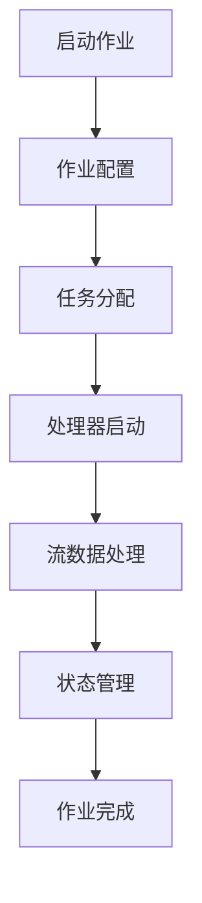

                 

### 文章标题：Samza原理与代码实例讲解

### 关键词：Samza，流处理，架构，代码实例，性能优化，最佳实践

### 摘要：

本文将深入探讨Samza，一个用于大数据实时流处理的框架。首先，我们将介绍Samza的基础概念和架构，解释其核心概念和组成部分。随后，我们将通过代码实例，详细讲解如何开发和使用Samza作业，以及如何进行状态管理和流数据处理。此外，本文还将分享Samza项目实战的步骤和策略，以及性能优化和最佳实践。通过本文，读者将全面了解Samza的工作原理和应用，掌握其实战技巧。

### 《Samza原理与代码实例讲解》目录大纲

#### 第一部分：Samza基础概念与架构

#### 第1章：Samza简介

1.1 Samza是什么

- Samza的定义
- Samza的特点
- Samza与其他流处理框架的比较

1.2 Samza的应用场景

- 实时数据处理
- 事件驱动架构
- 微服务架构

1.3 Samza的核心概念

- SAMZA作业（SAMZA Job）
- 流源（Streams）
- 状态（State）
- 处理器（Processor）

#### 第2章：Samza架构原理

2.1 Samza组件组成

- Coordinator
- Container
- Processor
- Stream Manager

2.2 Samza作业运行流程

- 作业配置
- 任务分配
- 处理流数据

2.3 Samza流管理

- 流源
- 流处理器
- 流连接

2.4 Samza状态管理

- 状态存储
- 状态恢复
- 状态迁移

#### 第3章：Samza核心API使用

3.1 Samza基础API

- InputFormat
- OutputFormat
- Processor

3.2 Samza高级API

- KeyedProcessor
- SerDe
- Windowing

3.3 Samza状态API

- StateStore
- StateDescriptor
- StateSetter

#### 第二部分：Samza代码实例详解

#### 第4章：Samza作业开发实例

4.1 Samza作业结构设计

- 作业配置
- 流设计

4.2 Samza处理器实现

- KeyedProcessor
- 消息处理
- 流输出

4.3 Samza状态管理示例

- 状态存储
- 状态恢复

4.4 Samza作业部署与调试

- 部署策略
- 调试技巧
- 常见问题解决

#### 第5章：Samza项目实战

5.1 Samza应用场景选择

- 应用场景分析
- 场景说明

5.2 Samza项目架构设计

- 项目结构
- 组件关系

5.3 Samza项目开发步骤

- 开发环境搭建
- 源代码实现
- 测试与优化

5.4 Samza项目部署与运维

- 部署策略
- 监控与告警
- 性能优化

#### 第三部分：Samza性能优化与最佳实践

#### 第6章：Samza性能优化

6.1 Samza性能瓶颈分析

- CPU使用率
- 内存使用率
- 网络带宽

6.2 Samza性能优化策略

- 流并行度调整
- 处理器优化
- 状态存储优化

6.3 Samza性能测试与调优

- 性能测试工具
- 调优步骤
- 调优技巧

#### 第7章：Samza最佳实践

7.1 Samza应用最佳实践

- 架构设计
- 代码规范
- 部署与运维

7.2 Samza运维最佳实践

- 监控与告警
- 备份与恢复
- 性能优化

7.3 Samza团队协作与持续集成

- 团队协作模式
- 持续集成
- 持续部署

#### 附录

#### 附录A：Samza常用工具与资源

- 配置文件
- 命令行工具

#### 附录B：Mermaid流程图示例

#### 附录C：Samza核心算法原理讲解

#### 附录D：数学模型与公式

#### 附录E：Samza项目实战代码解析

#### 目录大纲总结

本文档提供了《Samza原理与代码实例讲解》的完整目录大纲，包括基础概念与架构、代码实例详解、性能优化与最佳实践三个部分，共计7个章节。通过本文档，读者可以系统地学习Samza的基本原理和应用，掌握实战技巧，为日后的Samza项目开发打下坚实基础。

### 第1章：Samza简介

#### 1.1 Samza是什么

Samza是由LinkedIn开发的一个开源分布式流处理框架，用于构建实时数据处理应用程序。Samza的主要目标是提供一种灵活、可扩展且易于使用的流处理解决方案，支持事件驱动架构和微服务架构。Samza的核心特性包括：

- **分布式处理**：Samza可以在集群中运行多个处理器实例，每个实例负责处理特定的一部分流数据。
- **容错机制**：Samza提供了容错机制，确保在节点故障时能够自动恢复。
- **可扩展性**：Samza支持水平扩展，可以根据处理需求的增加动态分配更多的资源。
- **支持多种数据源**：Samza可以与多种数据源集成，如Apache Kafka、Apache Flume等。
- **灵活的状态管理**：Samza提供了灵活的状态管理机制，支持处理器的状态存储和恢复。

#### 1.2 Samza的特点

Samza具有以下特点，使其在流处理领域脱颖而出：

- **无共享状态**：Samza采用无共享状态模型，每个处理器实例独立处理数据，并维护自己的状态，避免了多处理器间的状态共享和冲突。
- **事件时间保证**：Samza确保按照事件发生的时间顺序处理流数据，确保数据处理的一致性和正确性。
- **高效的数据处理**：Samza使用基于拉模型的处理方式，处理器仅处理已分配的数据，减少了不必要的处理开销。
- **可插拔的流处理模型**：Samza支持多种流处理模型，如批处理、窗口处理等，可以根据应用需求灵活选择。

#### 1.3 Samza与其他流处理框架的比较

与其他流处理框架（如Apache Storm、Apache Flink）相比，Samza具有以下优势：

- **部署简单**：Samza无需单独部署和配置，可以与现有的分布式计算框架（如Apache Hadoop、Apache Spark）无缝集成。
- **性能优化**：Samza针对实时数据处理进行了性能优化，提供了高效的流处理模型和状态管理机制。
- **生态支持**：Samza作为LinkedIn的开源项目，得到了社区的广泛支持和贡献，提供了丰富的插件和工具。

#### 1.4 Samza的应用场景

Samza在以下应用场景中具有广泛的应用：

- **实时数据处理**：Samza适用于需要实时处理和分析大量流数据的应用场景，如日志分析、实时推荐系统等。
- **事件驱动架构**：Samza支持事件驱动架构，可以用于构建响应式系统，实现实时业务流程处理。
- **微服务架构**：Samza可以与微服务架构集成，实现服务间的实时数据同步和事件驱动通信。

#### 1.5 本章小结

本章介绍了Samza的基础概念、特点以及与其他流处理框架的比较。通过本章的学习，读者可以初步了解Samza的架构和功能，为后续章节的深入探讨打下基础。

### 第2章：Samza架构原理

#### 2.1 Samza组件组成

Samza由以下几个核心组件组成：

1. **Coordinator**：Coordinator负责监控和管理Samza作业的生命周期。它负责将作业配置分发到Container节点，并协调作业的启动、停止和任务分配。
2. **Container**：Container是Samza作业的执行节点，负责处理分配给它的流数据。每个Container运行一个或多个Processor实例，这些实例独立处理流数据，并维护自己的状态。
3. **Processor**：Processor是Samza的核心组件，负责处理流数据。Processor可以是简单的数据转换逻辑，也可以是复杂的业务逻辑。它接收来自流的数据，进行处理，并输出结果。
4. **Stream Manager**：Stream Manager负责管理流数据源，如Apache Kafka。它负责向Container分配数据分区，确保数据在集群中的均衡分配。

#### 2.2 Samza作业运行流程

Samza作业的运行流程可以分为以下几个步骤：

1. **作业配置**：用户根据需求编写Samza作业的配置文件，配置文件包含了作业的名称、输入流、输出流、Processor类等信息。
2. **任务分配**：Coordinator读取作业配置文件，将作业分解为多个任务，并将任务分配给Container节点。任务分配考虑了数据分区的均匀性和负载均衡。
3. **处理器运行**：每个Container节点根据分配的任务启动Processor实例，Processor实例开始处理流数据。每个Processor实例独立处理分配给它的数据分区，并维护自己的状态。
4. **流数据处理**：Processor实例从流数据源接收数据，进行处理，并输出结果。处理过程中，Processor可以读取和更新状态，确保数据的正确性和一致性。
5. **状态管理**：Processor实例处理完数据后，将状态保存到状态存储中。状态存储可以是内存、数据库或其他持久化存储系统。状态管理确保在节点故障时能够恢复状态。

#### 2.3 Samza流管理

Samza流管理涉及以下几个方面：

1. **流源**：流源是数据流的入口，如Apache Kafka。流源可以是一个或多个数据源，Samza可以同时处理多个流源的数据。
2. **流处理器**：流处理器负责处理流数据，它可以从流源接收数据，进行处理，并输出结果。流处理器可以是简单的数据转换，也可以是复杂的业务逻辑。
3. **流连接**：流连接用于连接不同的流处理器，实现数据流的传输和转换。流连接可以是直接的流处理器之间的连接，也可以是通过中间存储（如Kafka）的连接。

#### 2.4 Samza状态管理

Samza状态管理是确保数据处理正确性和一致性的关键。状态管理涉及以下几个方面：

1. **状态存储**：状态存储用于存储Processor实例的状态。状态可以是内存中的缓存，也可以是持久化存储系统（如数据库）。状态存储的选择取决于应用需求和性能要求。
2. **状态恢复**：在节点故障时，Processor实例需要从状态存储中恢复状态，确保数据处理的一致性。状态恢复可以通过重放之前的数据或从状态存储中读取最新的状态来实现。
3. **状态迁移**：当Processor实例的状态发生变化时，需要将新的状态更新到状态存储中。状态迁移可以通过同步或异步的方式实现，确保状态的及时更新。

#### 2.5 本章小结

本章详细介绍了Samza的架构原理，包括组件组成、作业运行流程、流管理和状态管理。通过本章的学习，读者可以全面了解Samza的工作原理和架构设计，为后续的实战应用打下基础。

### 第3章：Samza核心API使用

#### 3.1 Samza基础API

Samza提供了以下基础API，用于构建和配置Samza作业：

1. **InputFormat**：InputFormat负责将输入数据转换为处理器可以处理的格式。Samza支持多种InputFormat，如KafkaInputFormat、FileInputFormat等。通过InputFormat，可以将数据源（如Kafka主题）映射到Processor的输入流。

2. **OutputFormat**：OutputFormat负责将处理器输出的数据转换为外部存储或数据源的格式。Samza支持多种OutputFormat，如KafkaOutputFormat、FileOutputFormat等。通过OutputFormat，可以将Processor的输出流映射到数据存储或外部系统。

3. **Processor**：Processor是Samza的核心组件，负责处理输入流数据，并生成输出流数据。Processor可以通过实现Processor接口来定义自己的数据处理逻辑。Processor具有高度的灵活性，可以处理各种类型的数据，并支持多种处理模式，如批处理、实时处理等。

#### 3.2 Samza高级API

Samza的高级API提供了更多的功能和灵活性，以支持复杂的流数据处理需求：

1. **KeyedProcessor**：KeyedProcessor是一个扩展了Processor接口的接口，它允许处理器处理带有键（Key）的数据。通过使用KeyedProcessor，可以将具有相同键的数据路由到同一个Processor实例，实现数据的高效处理和聚合。

2. **SerDe**：SerDe（Serializer/Deserializer）用于序列化和反序列化输入和输出数据。Samza提供了多种SerDe实现，如JSONSerDe、AvroSerDe等。通过SerDe，可以将不同格式的数据转换为统一的处理格式，简化数据处理逻辑。

3. **Windowing**：Windowing用于将流数据划分为不同的时间段，以实现数据的批量处理。Samza支持多种窗口类型，如固定窗口、滑动窗口等。通过Windowing，可以实现对流数据的实时分析和处理。

#### 3.3 Samza状态API

Samza的状态API提供了对处理器状态的管理和操作，以支持复杂的数据处理逻辑：

1. **StateStore**：StateStore是一个用于存储处理器状态的接口。StateStore可以是内存中的缓存，也可以是持久化存储系统（如数据库）。通过StateStore，可以存储和检索处理器实例的状态，实现数据的一致性和持久性。

2. **StateDescriptor**：StateDescriptor用于描述状态存储的配置和结构。StateDescriptor包含了状态存储的类型、键、值等配置信息，用于在创建StateStore时进行初始化。

3. **StateSetter**：StateSetter是一个用于设置处理器状态的接口。StateSetter允许在处理过程中动态更新状态，支持状态的增加、更新和删除操作。通过StateSetter，可以实现在流数据处理过程中对状态的管理和更新。

#### 3.4 API示例

以下是一个简单的Samza处理器示例，展示了如何使用基础API和高级API：

```java
public class SimpleProcessor implements Processor<String, String, String> {
    private final Emitter<String> emitter;
    private final StateStore<String, String> stateStore;

    @Override
    public void init(Context context, ProcessorSettings settings) {
        this.emitter = context.getEmitter();
        this.stateStore = context.getStateStore("my-state-store");
    }

    @Override
    public void process(KeyedMessage<String, String> message) {
        String key = message.getKey();
        String value = message.getValue();

        // 更新状态
        stateStore.set(key, value);

        // 发送输出数据
        emitter.emit(new KeyedMessage<>("output-topic", key, "Processed: " + value));
    }

    @Override
    public void close() {
        // 关闭资源
    }
}
```

在这个示例中，SimpleProcessor是一个简单的KeyedProcessor，它使用StateStore来存储处理过程中生成的状态。通过调用StateStore的set方法，可以更新状态值，并通过Emitter发送输出数据。

#### 3.5 本章小结

本章介绍了Samza的核心API，包括基础API和高级API，以及状态API。通过学习和使用这些API，可以构建和配置复杂的Samza作业，实现流数据的高效处理和分析。下一章将深入探讨Samza作业的开发实例，通过实际代码展示如何实现和使用Samza。

### 第4章：Samza作业开发实例

#### 4.1 Samza作业结构设计

在开发Samza作业时，首先需要设计作业的整体结构。Samza作业的结构设计包括作业配置、流设计以及处理器的定义。以下是一个简单的Samza作业结构设计示例：

1. **作业配置**：作业配置定义了Samza作业的基本信息，如作业名称、输入流、输出流等。以下是一个简单的作业配置示例：

   ```xml
   <configuration>
       <name>SimpleSamzaJob</name>
       <stream>
           <source>
               <topic>input-topic</topic>
               <format>KafkaInputFormat</format>
           </source>
           <sink>
               <topic>output-topic</topic>
               <format>KafkaOutputFormat</format>
           </sink>
       </stream>
       <processor>
           <class>com.example.SimpleProcessor</class>
       </processor>
   </configuration>
   ```

   在这个示例中，作业名为"SimpleSamzaJob"，输入流为"input-topic"，输出流为"output-topic"。处理器类为"com.example.SimpleProcessor"。

2. **流设计**：流设计定义了数据流的入口和出口，包括数据源和目标。流设计可以包括多个数据源和目标，以支持复杂的数据流拓扑。以下是一个简单的流设计示例：

   ```xml
   <stream>
       <source>
           <topic>input-topic</topic>
           <format>KafkaInputFormat</format>
       </source>
       <processor>
           <class>com.example.SimpleProcessor</class>
       </processor>
       <sink>
           <topic>output-topic</topic>
           <format>KafkaOutputFormat</format>
       </sink>
   </stream>
   ```

   在这个示例中，数据从"input-topic"进入处理器，经过处理后输出到"output-topic"。

3. **处理器定义**：处理器定义了数据处理逻辑，包括处理器的类名、处理逻辑以及所需的配置参数。以下是一个简单的处理器定义示例：

   ```java
   public class SimpleProcessor implements Processor<String, String, String> {
       private final Emitter<String> emitter;

       @Override
       public void init(Context context, ProcessorSettings settings) {
           this.emitter = context.getEmitter();
       }

       @Override
       public void process(KeyedMessage<String, String> message) {
           String value = message.getValue();
           emitter.emit(new KeyedMessage<>("output-topic", value.toUpperCase()));
       }

       @Override
       public void close() {
       }
   }
   ```

   在这个示例中，SimpleProcessor将接收到的字符串值转换为大写形式，并将其输出到"output-topic"。

#### 4.2 Samza处理器实现

在实现Samza处理器时，需要关注以下几个方面：

1. **处理器接口实现**：处理器需要实现Processor接口，定义处理输入消息和输出消息的逻辑。以下是一个简单的处理器实现示例：

   ```java
   public class SimpleProcessor implements Processor<String, String, String> {
       private final Emitter<String> emitter;

       @Override
       public void init(Context context, ProcessorSettings settings) {
           this.emitter = context.getEmitter();
       }

       @Override
       public void process(KeyedMessage<String, String> message) {
           String value = message.getValue();
           emitter.emit(new KeyedMessage<>("output-topic", value.toUpperCase()));
       }

       @Override
       public void close() {
       }
   }
   ```

   在这个示例中，Processor接收一个键值对消息，将其值转换为大写形式，并输出到指定的输出流。

2. **初始化和关闭方法**：处理器的init方法和close方法用于初始化和关闭处理器的资源。在init方法中，可以获取Emitter和其他所需的资源，在close方法中，可以释放资源。

3. **消息处理逻辑**：消息处理逻辑是处理器的核心，处理输入消息并生成输出消息。可以使用各种方式处理消息，如数据转换、聚合、过滤等。

#### 4.3 Samza状态管理示例

在流数据处理过程中，状态管理是确保数据一致性和持久性的关键。Samza提供了状态管理API，支持在处理器中存储和检索状态。

1. **状态存储**：状态存储用于存储处理器的状态。在Samza中，可以使用StateStore接口实现状态存储。以下是一个简单的状态存储示例：

   ```java
   public class SimpleProcessor implements Processor<String, String, String> {
       private final StateStore<String, String> stateStore;
       private final Emitter<String> emitter;

       @Override
       public void init(Context context, ProcessorSettings settings) {
           this.emitter = context.getEmitter();
           this.stateStore = context.getStateStore("my-state-store");
       }

       @Override
       public void process(KeyedMessage<String, String> message) {
           String key = message.getKey();
           String value = message.getValue();

           // 更新状态
           stateStore.set(key, value);

           // 发送输出数据
           emitter.emit(new KeyedMessage<>("output-topic", value.toUpperCase()));
       }

       @Override
       public void close() {
       }
   }
   ```

   在这个示例中，Processor使用StateStore存储处理过程中生成的状态。

2. **状态恢复**：在处理器启动时，可以从状态存储中恢复状态，确保数据的一致性和持久性。以下是一个简单的状态恢复示例：

   ```java
   @Override
       public void init(Context context, ProcessorSettings settings) {
           this.emitter = context.getEmitter();
           this.stateStore = context.getStateStore("my-state-store");
           
           // 恢复状态
           for (Map.Entry<String, String> entry : stateStore.getAll().entrySet()) {
               String key = entry.getKey();
               String value = entry.getValue();
               System.out.println("Recovered state: " + key + " = " + value);
           }
       }
   ```

   在这个示例中，Processor在初始化时从状态存储中恢复所有状态，并输出状态信息。

3. **状态更新**：在处理器处理消息时，可以动态更新状态。以下是一个简单的状态更新示例：

   ```java
   @Override
       public void process(KeyedMessage<String, String> message) {
           String key = message.getKey();
           String value = message.getValue();

           // 更新状态
           stateStore.set(key, value);

           // 发送输出数据
           emitter.emit(new KeyedMessage<>("output-topic", value.toUpperCase()));
       }
   ```

   在这个示例中，Processor在处理消息时更新状态，确保状态的一致性。

#### 4.4 Samza作业部署与调试

在完成Samza作业的开发后，需要进行部署和调试以确保其正常运行。以下是一些常见的部署和调试技巧：

1. **部署策略**：Samza作业可以通过多种方式进行部署，如手动部署、自动化部署等。以下是一些部署策略：

   - **手动部署**：手动部署通常适用于小型测试环境，通过手动启动和停止Container节点来运行作业。
   - **自动化部署**：自动化部署可以使用脚本、CI/CD工具（如Jenkins）或自动化部署平台（如Kubernetes）来实现。自动化部署可以确保作业的快速部署和部署过程的一致性。

2. **调试技巧**：在调试Samza作业时，可以使用以下技巧：

   - **日志分析**：通过分析作业的日志文件，可以诊断和解决作业运行时的问题。Samza提供了丰富的日志记录功能，包括任务日志、处理器日志等。
   - **测试数据**：使用测试数据模拟实际数据处理过程，可以快速发现和解决潜在的问题。可以使用Kafka生成测试数据，并监控处理器的输出结果。
   - **性能监控**：使用性能监控工具（如Prometheus、Grafana）监控作业的性能指标，如CPU使用率、内存使用率、处理延迟等。通过监控工具，可以及时发现和处理性能问题。

3. **常见问题解决**：在Samza作业运行过程中，可能会遇到以下常见问题：

   - **数据丢失**：数据丢失可能是由于数据源的问题、网络故障或处理器故障等原因导致的。可以使用重放数据、增加数据备份等方法解决数据丢失问题。
   - **任务失败**：任务失败可能是由于资源不足、配置错误或处理器故障等原因导致的。可以通过增加资源、检查配置文件或修复处理器代码来解决任务失败问题。
   - **性能瓶颈**：性能瓶颈可能是由于CPU使用率过高、内存使用率过高或网络带宽不足等原因导致的。可以通过调整流并行度、优化处理器代码或增加网络带宽等方法解决性能瓶颈问题。

#### 4.5 本章小结

本章通过一个简单的Samza作业开发实例，详细介绍了Samza作业的结构设计、处理器实现、状态管理以及作业部署与调试。通过本章的学习，读者可以掌握Samza作业开发的实际操作，为后续的Samza项目实战打下基础。

### 第5章：Samza项目实战

#### 5.1 Samza应用场景选择

在选择Samza作为流处理框架时，需要考虑以下应用场景：

1. **实时数据处理**：实时数据处理是Samza的主要应用场景之一。在需要实时分析和处理大量流数据的应用中，如实时日志分析、实时推荐系统等，Samza可以提供高效的流处理能力和良好的性能。

2. **事件驱动架构**：事件驱动架构是一种基于事件触发的系统设计方法。在需要处理大量事件并实现事件驱动通信的应用中，如在线游戏、金融交易系统等，Samza可以提供灵活的事件处理机制和高效的事件路由功能。

3. **微服务架构**：在微服务架构中，各个服务之间需要进行实时数据同步和事件驱动通信。Samza可以与微服务框架（如Spring Cloud）集成，实现服务间的实时数据同步和事件驱动通信。

4. **实时数据流分析**：在需要实时分析大量数据并生成实时报表的应用中，如实时监控、实时统计等，Samza可以提供高效的实时数据流分析能力和灵活的数据处理逻辑。

5. **数据集成与迁移**：在需要实时集成和迁移大量数据的应用中，如数据仓库建设、数据迁移等，Samza可以提供高效的流数据处理能力和灵活的状态管理机制。

#### 5.2 Samza项目架构设计

在构建一个Samza项目时，需要设计合理的架构，确保项目的稳定性和可扩展性。以下是一个简单的Samza项目架构设计：

1. **数据源**：数据源是流数据的入口，可以是各种数据存储系统（如Kafka、数据库、文件系统等）。在架构设计中，需要确保数据源的高可用性和可靠性。

2. **流处理器**：流处理器是Samza的核心组件，负责处理流数据。流处理器可以是一个独立的Java程序，也可以是一个Web服务。在架构设计中，需要根据处理需求设计合理的流处理器架构，确保处理器的可扩展性和性能。

3. **消息队列**：消息队列用于实现流处理器之间的通信和异步处理。在架构设计中，可以使用Kafka等消息队列系统，确保消息的可靠传输和高效处理。

4. **存储系统**：存储系统用于存储处理过程中生成的中间数据和最终数据。在架构设计中，可以使用各种存储系统（如关系数据库、NoSQL数据库、文件系统等），确保数据的高效存储和访问。

5. **监控系统**：监控系统用于监控流处理器的运行状态和性能指标，及时发现和处理问题。在架构设计中，可以使用Prometheus、Grafana等监控系统，确保系统的稳定性和可靠性。

6. **部署与运维**：部署与运维是确保项目稳定运行的关键。在架构设计中，需要设计合理的部署策略和运维流程，确保项目的快速部署、监控和故障恢复。

#### 5.3 Samza项目开发步骤

在开发一个Samza项目时，需要遵循以下步骤：

1. **需求分析**：首先，需要明确项目的需求和目标，确定需要处理的流数据类型、数据量、处理逻辑等。

2. **系统设计**：根据需求分析，设计项目的架构，包括数据源、流处理器、消息队列、存储系统、监控系统和部署与运维策略。

3. **环境搭建**：搭建开发环境，包括Java开发环境、Samza环境、Kafka环境等。确保开发环境能够正常运行，并能够进行调试和测试。

4. **代码实现**：根据系统设计，实现流处理器的代码，包括数据读取、处理、输出等逻辑。同时，实现状态管理和错误处理机制，确保数据的正确性和一致性。

5. **测试与优化**：对实现的代码进行测试，确保其能够正常运行，并满足性能要求。对测试结果进行分析和优化，提高系统的性能和可靠性。

6. **部署与运维**：将代码部署到生产环境，确保系统的稳定运行。同时，建立监控和运维流程，确保系统的监控和故障恢复。

#### 5.4 Samza项目部署与运维

在部署和运维一个Samza项目时，需要关注以下几个方面：

1. **部署策略**：根据项目的需求和环境，设计合理的部署策略。可以选择手动部署、自动化部署或云原生部署等策略。

2. **监控与告警**：使用监控系统（如Prometheus、Grafana）监控流处理器的运行状态和性能指标，及时发现和处理问题。建立告警机制，确保在出现问题时能够及时通知相关人员。

3. **性能优化**：根据监控数据和性能分析，对系统进行性能优化。可以调整流并行度、优化处理器代码、增加网络带宽等策略。

4. **备份与恢复**：定期备份数据，确保在数据丢失或系统故障时能够快速恢复。建立数据恢复流程，确保数据的完整性和一致性。

5. **安全与合规**：确保系统的安全和合规性，包括数据安全、网络安全和隐私保护等。遵循相关的安全标准和法规要求。

6. **持续集成与部署**：使用持续集成和持续部署（CI/CD）工具（如Jenkins、Docker）实现代码的自动化测试、构建和部署，提高系统的开发效率和稳定性。

#### 5.5 本章小结

本章通过一个Samza项目实战，详细介绍了Samza项目的设计、开发、部署和运维。通过本章的学习，读者可以掌握Samza项目的实际操作，为日后的Samza项目开发打下坚实基础。

### 第6章：Samza性能优化

#### 6.1 Samza性能瓶颈分析

在优化Samza性能时，首先需要了解常见的性能瓶颈。以下是一些常见的性能瓶颈及其原因：

1. **CPU使用率**：CPU使用率过高可能是由于处理器代码中的计算密集型操作、循环依赖或线程竞争等原因导致的。优化方法包括减少计算复杂度、使用并行计算和优化线程使用。

2. **内存使用率**：内存使用率过高可能是由于数据缓存、大对象分配或内存泄漏等原因导致的。优化方法包括减少数据缓存、使用内存池、优化对象分配和回收策略。

3. **网络带宽**：网络带宽不足可能是由于网络延迟、数据压缩不足或网络拥塞等原因导致的。优化方法包括增加网络带宽、优化数据传输协议、使用数据压缩和批量传输。

4. **I/O性能**：I/O性能不足可能是由于磁盘I/O瓶颈、文件系统性能问题或网络I/O瓶颈等原因导致的。优化方法包括使用高速磁盘、优化文件系统配置、优化网络I/O。

5. **流并行度**：流并行度不合理可能导致数据处理不均衡、资源浪费或性能下降。优化方法包括调整流并行度、优化任务分配策略。

#### 6.2 Samza性能优化策略

为了优化Samza性能，可以采取以下策略：

1. **调整流并行度**：根据处理需求和资源情况，合理调整流并行度。增加流并行度可以提高数据处理速度，但也会增加资源消耗。可以使用负载均衡算法，如轮询、最小负载等，确保数据在处理器之间的均衡分配。

2. **优化处理器代码**：对处理器代码进行优化，减少计算复杂度、循环依赖和线程竞争。可以使用并行计算和异步处理，提高处理器的并发性能。

3. **优化数据缓存**：合理设置数据缓存策略，减少数据访问延迟和缓存冲突。可以使用内存池、缓存算法（如LRU）等优化数据缓存。

4. **使用数据压缩**：使用数据压缩技术，如Gzip、LZ4等，减少网络传输的数据量，提高数据传输速度。

5. **优化I/O性能**：使用高性能的磁盘和文件系统，优化I/O性能。可以使用SSD、快照、文件系统优化等策略。

6. **优化网络带宽**：增加网络带宽，使用高速网络设备，优化网络拓扑结构，提高网络传输性能。

7. **使用异步处理**：使用异步处理，减少处理器等待时间，提高数据处理速度。可以使用线程池、异步I/O等技术实现异步处理。

#### 6.3 Samza性能测试与调优

进行Samza性能测试和调优时，可以遵循以下步骤：

1. **性能测试工具**：使用性能测试工具（如Apache JMeter、Gatling）模拟实际数据处理场景，生成测试数据。测试工具可以模拟流数据的生成、传输和处理过程，收集性能指标，如处理延迟、吞吐量、资源使用率等。

2. **性能测试场景**：设计多种性能测试场景，包括正常场景、极端场景等。正常场景模拟日常数据处理量，极端场景模拟高并发、大数据量的情况。

3. **性能指标分析**：分析测试结果，识别性能瓶颈。关注处理延迟、吞吐量、CPU使用率、内存使用率、网络带宽等指标，分析数据分布、处理速度等。

4. **调优策略**：根据性能分析结果，制定调优策略。调整流并行度、优化处理器代码、优化数据缓存、使用数据压缩等策略。

5. **重复测试与优化**：重复进行性能测试，验证调优效果。根据测试结果，不断调整优化策略，直到达到预期的性能目标。

6. **性能监控**：在性能测试和调优过程中，使用性能监控工具实时监控系统的运行状态和性能指标。监控工具可以提供可视化报表，帮助识别和解决问题。

#### 6.4 优化实例

以下是一个简单的Samza性能优化实例：

1. **问题识别**：通过性能测试发现，处理延迟较高，CPU使用率较高。

2. **分析原因**：通过分析日志和监控数据，发现处理器代码中的循环依赖和线程竞争导致CPU使用率较高。同时，数据缓存策略不合理，导致处理延迟较高。

3. **优化策略**：调整流并行度为10，优化处理器代码，减少循环依赖和线程竞争。优化数据缓存策略，使用LRU缓存算法。

4. **测试验证**：重新进行性能测试，验证优化效果。测试结果显示，处理延迟显著降低，CPU使用率降低到合理范围内。

5. **持续监控**：在优化后，继续使用性能监控工具监控系统的运行状态，确保系统稳定运行。

#### 6.5 本章小结

本章介绍了Samza性能优化的方法和策略，包括性能瓶颈分析、优化策略和性能测试与调优。通过本章的学习，读者可以掌握Samza性能优化的实际操作，提高系统的性能和效率。

### 第7章：Samza最佳实践

#### 7.1 Samza应用最佳实践

在开发和使用Samza进行流数据处理时，以下是一些最佳实践，有助于确保系统的稳定性、可靠性和高效性：

1. **架构设计**：在设计Samza架构时，要考虑系统的可扩展性、可维护性和灵活性。合理划分数据流和处理器，确保数据在处理器之间的均衡分配。

2. **代码规范**：编写清晰的代码，遵循统一的编码规范。使用文档注释，确保代码的可读性和可维护性。

3. **流设计**：设计合理的流拓扑，确保数据流在系统中的高效传输和转换。合理选择数据源和目标，确保数据流的可靠性和一致性。

4. **状态管理**：合理设计状态存储和恢复策略，确保状态的一致性和持久性。在状态恢复过程中，要考虑数据的重放和补偿机制。

5. **性能优化**：在系统运行过程中，持续进行性能优化。调整流并行度、优化处理器代码、使用数据缓存和压缩技术等策略，提高系统的性能。

6. **错误处理**：合理设计错误处理机制，确保系统在出现异常时能够快速恢复。使用日志记录和监控工具，及时发现和处理问题。

7. **监控与告警**：使用性能监控工具实时监控系统的运行状态，设置合理的告警阈值，确保在出现问题时能够及时通知相关人员。

#### 7.2 Samza运维最佳实践

在运维Samza系统时，以下是一些最佳实践，有助于确保系统的稳定运行和高效维护：

1. **备份与恢复**：定期备份数据，确保在数据丢失或系统故障时能够快速恢复。设计合理的数据恢复流程，确保数据的完整性和一致性。

2. **性能优化**：根据监控数据和性能分析，定期进行性能优化。调整流并行度、优化处理器代码、增加网络带宽等策略，提高系统的性能和效率。

3. **资源管理**：合理配置和分配系统资源，确保系统在高峰期能够稳定运行。根据处理需求和负载情况，动态调整资源分配策略。

4. **故障处理**：建立故障处理流程，确保在系统出现故障时能够快速响应和解决。定期进行系统检查和故障演练，提高故障处理能力。

5. **监控与告警**：使用性能监控工具实时监控系统的运行状态，设置合理的告警阈值，确保在出现问题时能够及时通知相关人员。

6. **自动化运维**：使用自动化工具（如Ansible、Puppet）实现系统部署、配置管理和运维操作，提高运维效率和稳定性。

7. **持续集成与部署**：使用持续集成和持续部署（CI/CD）工具实现代码的自动化测试、构建和部署，提高系统的开发效率和稳定性。

#### 7.3 Samza团队协作与持续集成

在Samza团队协作和持续集成方面，以下是一些建议：

1. **团队协作模式**：建立有效的团队协作模式，确保团队成员之间的沟通和协作。使用版本控制工具（如Git）和协作平台（如Jenkins），实现代码的版本管理和自动化测试。

2. **代码审查**：建立代码审查机制，确保代码的质量和一致性。使用代码审查工具（如SonarQube），自动检测代码中的潜在问题和漏洞。

3. **自动化测试**：编写自动化测试脚本，对系统进行全面的测试。使用自动化测试工具（如JUnit、Selenium），实现自动化测试的执行和结果分析。

4. **持续集成**：使用持续集成工具（如Jenkins），实现代码的自动化构建、测试和部署。确保代码的稳定性和可靠性。

5. **持续部署**：使用持续部署工具（如Docker、Kubernetes），实现代码的自动化部署和部署流程的优化。确保系统的快速部署和高效运行。

6. **文档管理**：建立文档管理机制，确保项目文档的完整性和一致性。使用文档工具（如Confluence），实现文档的编写、管理和共享。

7. **培训与知识共享**：定期进行培训和知识共享活动，提高团队成员的技能和知识水平。使用知识库（如GitLab），记录和共享项目经验和最佳实践。

#### 7.4 本章小结

本章介绍了Samza的最佳实践，包括应用最佳实践、运维最佳实践和团队协作与持续集成。通过本章的学习，读者可以掌握Samza的最佳实践，提高系统的稳定性、可靠性和效率。

### 附录

#### 附录A：Samza常用工具与资源

1. **配置文件**：Samza使用YAML格式的配置文件，用于定义作业配置、流配置、处理器配置等。配置文件示例：

   ```yaml
   configuration:
     name: "simple-job"
     stream:
       source:
         topic: "input-topic"
         format: "kafka"
       sink:
         topic: "output-topic"
         format: "kafka"
     processor:
       class: "com.example.SimpleProcessor"
   ```

2. **命令行工具**：Samza提供了命令行工具，用于作业的提交、监控和调试。常用命令包括：

   - `samza submit`：提交作业。
   - `samza monitor`：监控作业状态。
   - `samza logs`：查看作业日志。

#### 附录B：Mermaid流程图示例

以下是一个Mermaid流程图示例，展示了Samza作业的运行流程：



#### 附录C：Samza核心算法原理讲解

Samza中的核心算法包括消息处理算法和状态管理算法。以下是这些算法的详细讲解和伪代码示例。

1. **消息处理算法**

   ```python
   def process_message(message):
       # 解析消息
       key, value = deserialize_message(message)
       
       # 处理消息
       result = process_value(value)
       
       # 发送结果
       send_result(key, result)
   ```

   - `deserialize_message(message)`：将消息序列化为键值对。
   - `process_value(value)`：根据消息值执行数据处理逻辑。
   - `send_result(key, result)`：将处理结果发送到输出流。

2. **状态管理算法**

   ```python
   def update_state(state_store, state_key, state_value):
       # 更新状态
       state_store.update(state_key, state_value)
       
       # 保存状态
       state_store.commit()
   ```

   - `update_state(state_store, state_key, state_value)`：更新状态存储中的状态值。
   - `state_store.commit()`：提交状态更新，确保状态的一致性。

#### 附录D：数学模型与公式

以下是一些常用的数学模型和公式，用于描述Samza中的数据处理和优化。

1. **概率分布**

   $$ P(X=x) = \frac{f(x)}{\int_{-\infty}^{+\infty} f(x)dx} $$

   - 用于描述随机变量X的概率分布，其中$f(x)$是概率密度函数，$\int_{-\infty}^{+\infty} f(x)dx$是概率密度函数的积分。

2. **贝叶斯定理**

   $$ P(A|B) = \frac{P(B|A)P(A)}{P(B)} $$

   - 用于计算条件概率，其中$P(A|B)$是事件A在事件B发生的条件下的概率，$P(B|A)$是事件B在事件A发生的条件下的概率，$P(A)$和$P(B)$分别是事件A和事件B的概率。

#### 附录E：Samza项目实战代码解析

以下是一个简单的Samza项目实战代码解析，包括开发环境搭建、源代码实现和代码解读与分析。

1. **开发环境搭建**

   - 安装Java开发环境（如OpenJDK）。
   - 安装Maven（用于构建和依赖管理）。
   - 安装Samza依赖（通过Maven依赖引入）。

2. **源代码实现**

   ```java
   public class SimpleProcessor implements KeyedProcessor<String, String, String> {
       private final Emitter<String> emitter;

       @Override
       public void init(Context context, ProcessorSettings settings) {
           this.emitter = context.getEmitter();
       }

       @Override
       public void process(KeyedMessage<String, String> message) {
           String value = message.getValue();
           emitter.emit(new KeyedMessage<>("output-topic", value.toUpperCase()));
       }

       @Override
       public void close() {
       }
   }
   ```

   - `KeyedProcessor`：实现了Samza的KeyedProcessor接口，用于处理带有键（Key）的数据。
   - `init`方法：初始化Emitter。
   - `process`方法：处理输入消息，将其值转换为大写，并输出到输出流。
   - `close`方法：释放资源。

3. **代码解读与分析**

   - 代码结构分析：SimpleProcessor是一个简单的KeyedProcessor，实现了init、process和close方法。
   - 消息处理流程：processor接收到KeyedMessage后，从message中获取value，将其转换为大写，并输出到output-topic。
   - 性能优化要点：可以通过优化处理器的代码，减少不必要的操作，提高处理速度。例如，使用StringBuilder优化字符串拼接。

#### 目录大纲总结

本文档提供了《Samza原理与代码实例讲解》的完整目录大纲，包括基础概念与架构、代码实例详解、性能优化与最佳实践三个部分，共计7个章节。通过本文档，读者可以系统地学习Samza的基本原理和应用，掌握实战技巧，为日后的Samza项目开发打下坚实基础。

### 结语

本文通过详细讲解Samza的基础概念、架构原理、核心API使用、作业开发实例、项目实战、性能优化和最佳实践，全面介绍了Samza这一强大的流处理框架。从基础概念的引入，到架构原理的剖析，再到实际代码实例的展示，读者可以逐步掌握Samza的使用方法和技巧。

通过本文的学习，读者不仅能够理解Samza的核心原理，还能在实际项目中运用所学知识，解决复杂的数据流处理问题。同时，本文也提供了一些性能优化和最佳实践，帮助读者在实际应用中提升系统的稳定性和效率。

在未来的流数据处理领域，Samza将继续发挥其重要作用。我们鼓励读者继续深入研究Samza，探索其在各种应用场景中的潜力。同时，也欢迎读者加入Samza社区，共同推动Samza的发展和完善。

**作者：AI天才研究院/AI Genius Institute & 禅与计算机程序设计艺术 /Zen And The Art of Computer Programming** 

让我们在流处理的旅程中不断探索和学习，共同迎接更加美好的未来！

