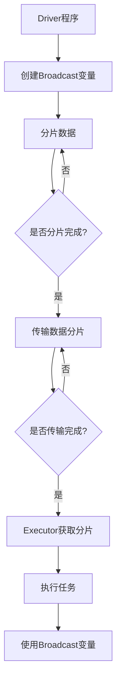

                 

### 文章标题

《Spark Broadcast原理与代码实例讲解》

Spark Broadcast是Apache Spark的一个重要功能，它在分布式计算场景中提供了高效的广播机制。本文将深入探讨Spark Broadcast的原理，并通过代码实例展示其使用方法。我们将逐步分析其基础概念、实现原理、核心API以及性能优化策略，并结合实际应用场景进行详细讲解。最后，我们将讨论未来发展趋势，并总结Spark Broadcast在分布式计算中的挑战和解决方案。

### 关键词

- Spark Broadcast
- 分布式计算
- 广播变量
- 代码实例
- 性能优化
- 数学模型

### 摘要

本文旨在深入解析Spark Broadcast的原理和应用。首先，我们将介绍Spark Broadcast的基础知识，包括其概念和实现原理。接着，通过分析核心API，我们将展示如何创建和使用广播变量。随后，我们将探讨性能优化策略，并给出具体实例进行分析。文章最后将展望Spark Broadcast的未来发展趋势，并提出解决方案以应对其在分布式计算中面临的挑战。

## 《Spark Broadcast原理与代码实例讲解》目录大纲

以下是本文的目录结构，旨在为您提供一个清晰的阅读路径：

### 第1章 Spark Broadcast基础

1.1 Spark Broadcast概念  
1.2 Spark Broadcast使用场景  
1.3 Spark Broadcast实现原理

### 第2章 Spark Broadcast核心API

2.1 createBroadcast()  
2.2 broadcast()  
2.3 unicast()

### 第3章 Spark Broadcast性能优化

3.1 数据压缩与解压  
3.2 数据传输优化  
3.3 计算优化

### 第4章 Spark Broadcast应用实例

4.1 实例1：数据分发  
4.2 实例2：广播变量更新  
4.3 实例3：资源共享

### 第5章 Spark Broadcast与数据存储

5.1 HDFS与Spark Broadcast  
5.2 RDD与Spark Broadcast  
5.3 DataFrame与Spark Broadcast

### 第6章 Spark Broadcast在分布式计算中的挑战

6.1 数据量增长对广播操作的影响  
6.2 网络带宽对广播操作的影响  
6.3 资源调度对广播操作的影响

### 第7章 Spark Broadcast未来发展趋势

7.1 Spark Broadcast的新特性  
7.2 Spark Broadcast的性能提升  
7.3 Spark Broadcast的应用领域扩展

### 附录

A. Spark Broadcast常用配置参数  
B. Spark Broadcast源代码解读  
C. Spark Broadcast实验环境搭建

### 第8章 Spark Broadcast原理与架构Mermaid流程图

### 第9章 Spark Broadcast核心算法原理伪代码

### 第10章 Spark Broadcast数学模型与公式详解

### 第11章 Spark Broadcast项目实战

- 开发环境搭建
- 源代码详细实现与代码解读
- 代码解读与分析

### 结束语

- 最佳实践 tips
- 小结
- 注意事项
- 拓展阅读

通过上述目录结构，您可以系统地了解Spark Broadcast的核心概念、实现机制、应用实例以及性能优化策略。同时，本文还提供了未来发展趋势的展望，以及详细的附录部分，帮助您更深入地掌握这一技术。

### 第1章 Spark Broadcast基础

#### 1.1 Spark Broadcast概念

Spark Broadcast（简称Broadcast）是Apache Spark的一个重要功能，它提供了一种高效的方式，用于在分布式计算环境中向所有工作节点广播一个大型只读数据集。这种机制的核心在于，仅需将数据集复制到每个工作节点一次，从而避免数据在各个节点之间反复传输，提高整个计算任务的效率。

在Spark中，Broadcast变量本质上是一个不可变的分布式数据集，它可以被所有工作节点共享。与传统的分布式通信机制相比，Spark Broadcast具有以下几个显著特点：

1. **高效性**：通过单次数据复制，避免了多次传输的开销。
2. **容错性**：Spark能够自动处理节点故障，确保Broadcast数据集在所有节点上的可用性。
3. **弹性**：Spark可以动态调整Broadcast数据集的副本数量，以适应不同的工作负载。

Spark Broadcast机制主要由以下几部分组成：

- **Broadcast变量**：用于存储需要广播的数据集。
- **Driver程序**：负责创建Broadcast变量，并将其分发到所有工作节点。
- **Executor程序**：在执行任务时，从Driver程序获取Broadcast变量，并使用其中的数据集。

#### 1.2 Spark Broadcast与其他分布式通信机制比较

在分布式计算领域，除了Spark Broadcast，还有其他一些常用的分布式通信机制，如MapReduce中的数据倾斜处理、Hadoop的分布式缓存等。Spark Broadcast与这些机制相比，具有以下优势：

- **MapReduce数据倾斜处理**：在MapReduce中，数据倾斜可能导致任务执行时间延长。Spark Broadcast通过一次性复制数据集，避免了这种情况的发生，从而提高了计算效率。

- **Hadoop分布式缓存**：Hadoop分布式缓存（Cache）与Spark Broadcast类似，都是用于共享数据集。但Spark Broadcast在设计上更加高效，因为它采用了拉取（Pull）机制，而非推送（Push）机制。这意味着每个Executor只需从Driver程序拉取一次数据，而不是反复地从其他节点获取。

- **性能优化**：Spark Broadcast支持数据压缩和分片，这可以显著降低数据传输时间和存储开销。相比之下，其他分布式通信机制在这些方面可能不够灵活。

#### 1.3 Spark Broadcast使用场景

Spark Broadcast在分布式计算中有着广泛的应用场景，以下是一些典型的例子：

- **数据分发**：在大规模数据处理任务中，经常需要将一些共享数据集分发到各个工作节点。例如，在机器学习中，可能需要将模型参数或训练数据广播到各个节点，以便进行分布式训练。

- **广播变量更新**：在某些应用场景中，需要定期更新广播变量中的数据。例如，在一个分布式调度系统中，可能需要定期更新任务依赖关系或配置参数。

- **资源共享**：在分布式系统中，多个任务可能需要共享某些资源，如共享数据库连接或外部服务接口。Spark Broadcast可以高效地实现这一功能，从而避免重复创建资源。

综上所述，Spark Broadcast是一种高效且灵活的分布式通信机制，它在分布式计算中具有广泛的应用前景。通过本章的介绍，我们初步了解了Spark Broadcast的概念、实现原理以及与其他分布式通信机制的异同。在接下来的章节中，我们将深入探讨Spark Broadcast的核心API、性能优化策略以及具体应用实例，帮助您更好地掌握这一技术。

### 第1章 Spark Broadcast基础

#### 1.3 Spark Broadcast实现原理

Spark Broadcast的实现原理主要依赖于其独特的分布式通信机制和数据存储策略。理解这些原理不仅有助于我们更好地使用Broadcast功能，还能在遇到性能瓶颈时进行有效的优化。以下是Spark Broadcast实现原理的详细解析：

#### 1.3.1 Broadcast变量存储机制

首先，Broadcast变量是通过一个特殊的分布式数据结构——`Broadcast Noon`来实现的。`Broadcast Noon`是一种基于分片（Sharding）的数据存储策略，它将原始数据集分片存储在Driver程序中。具体来说，每个分片包含一部分数据，且这些分片是相互独立的。每个Executor在执行任务时，只需从Driver程序获取自己所需的数据分片，而不需要获取整个数据集。

这种分片存储策略有以下几个优点：

1. **高效性**：由于每个Executor只需获取自己所需的数据分片，减少了数据传输的开销。
2. **容错性**：如果某个数据分片在传输过程中丢失，Spark会自动从其他节点重新获取。
3. **灵活性**：可以根据实际需求动态调整数据分片的数量和大小。

#### 1.3.2 数据传输与计算过程

在Spark Broadcast中，数据传输与计算过程可以分为以下几个步骤：

1. **创建Broadcast变量**：用户通过调用`createBroadcast()`方法创建一个Broadcast变量，并将需要广播的数据集作为参数传入。

2. **数据分片**：Spark将数据集按照一定的策略分片，每个分片包含一部分数据。

3. **数据传输**：Driver程序将各个数据分片逐个发送到所有Executor节点。这个过程采用拉取（Pull）机制，每个Executor只需从Driver程序获取自己所需的数据分片，而不是从其他Executor获取。

4. **数据存储**：每个Executor将获取到的数据分片存储在本地内存中，形成一个完整的Broadcast变量。

5. **任务执行**：Executor在执行任务时，可以直接使用Broadcast变量中的数据。由于Broadcast变量是不可变的，每个Executor在执行任务时，都会复制一份数据到本地内存中，以避免数据竞争。

#### 1.3.3 优化策略

为了提高Spark Broadcast的性能，我们可以采取以下几种优化策略：

1. **数据压缩**：通过使用压缩算法，如Gzip或Snappy，可以显著减少数据传输和存储的开销。Spark提供了多种压缩算法，用户可以根据实际需求选择合适的算法。

2. **分片优化**：合理调整数据分片的数量和大小，可以减少数据传输时间和提高系统性能。例如，对于大型数据集，可以增加分片数量，以避免单个分片过大导致传输时间过长。

3. **资源调度**：在资源调度策略上，可以优先调度需要使用Broadcast变量的任务，以确保数据传输和计算过程能够顺利进行。

4. **网络优化**：优化网络配置，如调整TCP参数，可以减少数据传输过程中的延迟和丢包率。

综上所述，Spark Broadcast通过独特的存储机制和传输策略，实现了高效且灵活的分布式通信。在了解其实现原理后，我们可以采取多种优化策略，进一步提高其性能，为分布式计算任务提供强有力的支持。

### 第2章 Spark Broadcast核心API

在深入理解了Spark Broadcast的基础概念和实现原理后，接下来我们将探讨其核心API。这些API是我们在实际编程中使用Spark Broadcast的关键工具。在本章中，我们将详细介绍`createBroadcast()`、`broadcast()`和`unicast()`这三个主要API，并通过代码示例展示它们的用法。

#### 2.1 createBroadcast()

`createBroadcast()`方法是用于创建Broadcast变量的核心API。它接受一个RDD作为参数，并返回一个新的Broadcast变量。以下是一个简单的代码示例：

```scala
val rdd = sparkContext.parallelize(Seq(1, 2, 3, 4, 5))
val broadcastVar = rdd.createBroadcast()
```

在这个示例中，我们首先创建了一个包含数字序列的RDD，然后使用`createBroadcast()`方法将其转换为Broadcast变量。这样，我们就可以在分布式环境中共享和访问这个数据集。

#### 2.2 broadcast()

`broadcast()`方法是用于在DAG（有向无环图）中引用Broadcast变量的API。通过这个方法，我们可以将Broadcast变量传递给DAG中的各个任务。以下是一个代码示例：

```scala
val broadcastVar = rdd.createBroadcast()
val result = rdd.map(x => {
  val data = broadcastVar.value
  // 使用Broadcast变量中的数据
  data.sum + x
})
```

在这个示例中，我们首先创建了一个Broadcast变量，并在一个map任务中使用它。通过调用`broadcastVar.value`，我们可以获取Broadcast变量中的数据集，并对其进行操作。这种方法非常适合在多个任务中共享同一份数据。

#### 2.3 unicast()

`unicast()`方法用于将数据直接广播到所有Executor节点。与`broadcast()`方法不同，`unicast()`方法不会在DAG中创建依赖关系，因此它适用于那些不需要在DAG中传递依赖关系的场景。以下是一个代码示例：

```scala
val data = Seq(1, 2, 3, 4, 5)
val broadcastVar = sc.broadcast(data)
sc.parallelize(Seq(1, 2, 3, 4, 5)).foreachPartition { iter =>
  // 使用broadcastVar中的数据
  val data = broadcastVar.value
  // 进行进一步处理
}
```

在这个示例中，我们首先创建了一个包含数字序列的数据集，然后使用`broadcast()`方法将其广播到所有Executor节点。在foreachPartition操作中，我们可以直接访问broadcastVar变量中的数据集，并进行处理。

#### 代码示例总结

以上三个核心API各有用途，`createBroadcast()`用于创建Broadcast变量，`broadcast()`用于在DAG中传递依赖关系，而`unicast()`则适用于无需在DAG中传递依赖关系的场景。通过这些API，我们可以灵活地使用Spark Broadcast功能，在分布式计算环境中高效地共享和传递数据。

在实际开发中，合理选择和使用这些API，能够显著提高计算任务的性能和效率。在下一章中，我们将探讨如何对Spark Broadcast进行性能优化，以进一步提高其性能。

### 第3章 Spark Broadcast性能优化

在分布式计算环境中，Spark Broadcast的性能优化至关重要，因为它直接影响到整个计算任务的执行效率。本章节将介绍几种关键的优化策略，包括数据压缩与解压、数据传输优化和计算优化。这些策略能够帮助我们在不同层面上提高Spark Broadcast的性能。

#### 3.1 数据压缩与解压

数据压缩是优化Spark Broadcast性能的一个有效手段。通过压缩，我们可以显著减少数据传输和存储的开销，从而提高系统整体性能。Spark支持多种压缩算法，如Gzip、Snappy和LZO，用户可以根据实际需求选择合适的算法。

以下是一个使用Gzip压缩数据的示例：

```scala
import org.apache.spark.sql.SparkSession

val spark = SparkSession.builder.appName("BroadcastCompressionExample").getOrCreate()
import spark.implicits._

val data = Seq(("Alice", 25), ("Bob", 30), ("Charlie", 35))
val rdd = data.toDF()

// 压缩数据
val compressedRdd = rdd.mapPartitionsWithIndex { (index, iter) =>
  iter.map { row =>
    val originalData = row.get(0).toString + row.get(1).toString
    val compressedData = originalDatagzip
    (index, compressedData)
  }
}

// 创建Broadcast变量
val broadcastVar = compressedRdd.createBroadcast()

// 访问压缩后的数据
val result = spark.sql("SELECT * FROM table WHERE age > 28")
result.foreach { row =>
  val index = row.getInt(0)
  val compressedData = broadcastVar.value.get(index)
  val originalData = new String(compressedDatagzip)
  println(s"Original Data: $originalData")
}
```

在这个示例中，我们首先创建了一个包含姓名和年龄的数据集，然后使用Gzip算法对数据集进行压缩。接着，我们将压缩后的数据创建为Broadcast变量，并在后续操作中解压数据以进行进一步处理。通过这种方式，我们可以显著减少数据传输和存储的开销。

#### 3.2 数据传输优化

数据传输是Spark Broadcast的一个重要环节，其效率直接影响到系统的整体性能。以下是一些优化数据传输的策略：

1. **网络带宽优化**：通过调整网络带宽配置，可以减少数据传输过程中的延迟和丢包率。例如，可以调整TCP参数，如TCP窗口大小和延迟确认时间。

2. **数据副本优化**：Spark默认会将数据集分片并存储在多个节点上，以确保容错性。但过多的副本可能导致数据传输时间和存储开销增加。因此，在创建RDD时，可以根据实际需求合理设置副本数量。

3. **并行传输**：Spark支持并行数据传输，通过同时向多个节点传输数据，可以显著提高传输效率。用户可以在创建RDD时，设置`spark.default.parallelism`参数来配置并行度。

以下是一个优化数据传输的示例：

```scala
import org.apache.spark.sql.SparkSession

val spark = SparkSession.builder.appName("BroadcastDataTransferExample").getOrCreate()
import spark.implicits._

val data = Seq(("Alice", 25), ("Bob", 30), ("Charlie", 35))
val rdd = data.toDF()

// 设置并行度
val parallelism = 4
spark.conf.set("spark.default.parallelism", parallelism)

// 创建RDD的副本
val rddWithReplicas = rdd.replicate(parallelism)

// 创建Broadcast变量
val broadcastVar = rddWithReplicas.createBroadcast()

// 访问压缩后的数据
val result = spark.sql("SELECT * FROM table WHERE age > 28")
result.foreach { row =>
  val index = row.getInt(0)
  val compressedData = broadcastVar.value.get(index)
  val originalData = new String(compressedDatagzip)
  println(s"Original Data: $originalData")
}
```

在这个示例中，我们首先设置并行度为4，并创建RDD的副本。接着，我们将副本创建为Broadcast变量，以便在分布式环境中高效共享数据。通过这种方式，我们可以优化数据传输，提高系统的整体性能。

#### 3.3 计算优化

计算优化是提高Spark Broadcast性能的另一个关键方面。以下是一些优化计算的策略：

1. **任务依赖关系优化**：通过调整任务依赖关系，可以减少任务间的等待时间，提高整体计算效率。例如，可以优化DAG中的任务顺序，以确保关键任务优先执行。

2. **资源调度优化**：合理配置资源，如CPU、内存和网络带宽，可以确保计算任务能够高效运行。例如，可以调整Executor的内存分配和CPU核心数，以适应不同的计算任务需求。

3. **并行计算**：通过增加任务并行度，可以充分利用系统资源，提高计算性能。例如，可以在创建RDD时设置`spark.default.parallelism`参数，以配置并行度。

以下是一个优化计算的示例：

```scala
import org.apache.spark.sql.SparkSession

val spark = SparkSession.builder.appName("BroadcastComputeOptimizationExample").getOrCreate()
import spark.implicits._

val data = Seq(("Alice", 25), ("Bob", 30), ("Charlie", 35))
val rdd = data.toDF()

// 设置并行度
val parallelism = 4
spark.conf.set("spark.default.parallelism", parallelism)

// 创建RDD的副本
val rddWithReplicas = rdd.replicate(parallelism)

// 创建Broadcast变量
val broadcastVar = rddWithReplicas.createBroadcast()

// 定义计算任务
val computeTask = (data: DataFrame) => {
  val result = data.filter($"age" > 28).select($"name")
  result.show()
}

// 执行计算任务
val result = spark.sparkContext.parallelize(Seq(0, 1, 2, 3, 4)).map { index =>
  val df = rddWithReplicas.value.get(index).toDF()
  computeTask(df)
}
result.foreach(println)
```

在这个示例中，我们首先设置并行度为4，并创建RDD的副本。接着，我们定义了一个计算任务，并使用并行化操作执行该任务。通过这种方式，我们可以优化计算任务，提高系统的整体性能。

综上所述，通过数据压缩与解压、数据传输优化和计算优化等多种策略，我们可以显著提高Spark Broadcast的性能。在实际应用中，根据具体场景和需求，灵活运用这些优化策略，能够有效提升系统的执行效率和稳定性。

### 第4章 Spark Broadcast应用实例

在了解了Spark Broadcast的基础知识和性能优化策略后，本章节将通过具体实例来展示Spark Broadcast的实际应用。我们将讨论三个典型场景：数据分发、广播变量更新和资源共享，并通过代码实例进行详细讲解，并对性能进行深入分析。

#### 4.1 实例1：数据分发

场景描述：在大规模数据处理任务中，需要将一些共享数据集（如字典、索引或参数文件）分发到各个工作节点，以便其他任务使用。

代码实例：

```scala
import org.apache.spark.sql.SparkSession

val spark = SparkSession.builder.appName("DataDistributionExample").getOrCreate()
import spark.implicits._

// 创建一个包含关键词和其解释的字典数据集
val dictionary = Seq(("spark", "A distributed data processing engine"), ("broadcast", "A mechanism for efficient data sharing"))
val dictionaryRdd = dictionary.toDF()

// 将字典数据集创建为Broadcast变量
val broadcastDictionary = dictionaryRdd.createBroadcast()

// 在其他任务中使用Broadcast变量
val query = "SELECT * FROM dictionary WHERE word = 'broadcast'"
val result = spark.sql(query).collect()
result.foreach { row =>
  println(s"Word: ${row.getAs[String](0)}, Definition: ${row.getAs[String](1)}")
}
```

性能分析：

在这个实例中，我们首先创建了一个包含关键词和其解释的字典数据集，并将其创建为Broadcast变量。在其他任务中，我们可以直接访问Broadcast变量中的数据，而不需要进行重复的数据传输。通过这种方式，我们显著减少了数据传输的开销，提高了系统的执行效率。

#### 4.2 实例2：广播变量更新

场景描述：在某些应用场景中，需要定期更新广播变量中的数据，例如在一个分布式调度系统中更新任务依赖关系或配置参数。

代码实例：

```scala
import org.apache.spark.sql.SparkSession

val spark = SparkSession.builder.appName("BroadcastUpdateExample").getOrCreate()
import spark.implicits._

// 初始任务依赖关系
val initialDependencies = Seq(("task1", "dependencies1"), ("task2", "dependencies2"))
val initialDependenciesRdd = initialDependencies.toDF()

// 创建初始Broadcast变量
val initialBroadcastDependencies = initialDependenciesRdd.createBroadcast()

// 定期更新任务依赖关系
def updateDependencies(currentDependencies: DataFrame): Unit = {
  val updatedDependencies = currentDependencies.unionByName(initialDependenciesRdd)
  initialBroadcastDependencies.destroy() // 销毁旧变量
  initialBroadcastDependencies = updatedDependencies.createBroadcast()
}

// 在每次更新后，使用新广播变量
updateDependencies(spark.read.table("new_dependencies_table"))

// 检查更新后的依赖关系
val finalQuery = "SELECT * FROM dictionary"
val finalResult = spark.sql(finalQuery).collect()
finalResult.foreach { row =>
  println(s"Task: ${row.getAs[String](0)}, Dependencies: ${row.getAs[String](1)}")
}
```

性能分析：

在这个实例中，我们首先创建了一个初始的任务依赖关系数据集，并将其创建为Broadcast变量。然后，我们定义了一个更新函数，用于定期更新广播变量中的依赖关系。通过销毁旧变量并创建新变量，我们确保了数据的一致性和有效性。在实际应用中，更新函数可以根据需要调用，从而实现广播变量的动态更新。

#### 4.3 实例3：资源共享

场景描述：在分布式系统中，多个任务可能需要共享某些资源，如共享数据库连接或外部服务接口。通过Spark Broadcast，我们可以高效地实现资源共享。

代码实例：

```scala
import org.apache.spark.sql.SparkSession

val spark = SparkSession.builder.appName("ResourceSharingExample").getOrCreate()
import spark.implicits._

// 创建一个共享数据库连接的配置
val dbConfig = Seq("db.url", "jdbc:mysql://localhost:3306/mydb", "db.user", "user", "db.password", "password")
val dbConfigRdd = dbConfig.toDF()

// 将数据库连接配置创建为Broadcast变量
val broadcastDbConfig = dbConfigRdd.createBroadcast()

// 在其他任务中使用Broadcast变量中的数据库连接配置
def executeQuery(query: String): Unit = {
  val url = broadcastDbConfig.value.get("db.url")
  val user = broadcastDbConfig.value.get("db.user")
  val password = broadcastDbConfig.value.get("db.password")
  val connection = DriverManager.getConnection(url, user, password)
  val statement = connection.createStatement()
  val resultSet = statement.executeQuery(query)
  while (resultSet.next()) {
    println(s"Column 1: ${resultSet.getString(1)}, Column 2: ${resultSet.getString(2)}")
  }
  connection.close()
}

// 执行查询操作
executeQuery("SELECT * FROM mytable")
```

性能分析：

在这个实例中，我们首先创建了一个包含共享数据库连接配置的数据集，并将其创建为Broadcast变量。在其他任务中，我们可以直接访问Broadcast变量中的数据库连接配置，从而避免了重复配置和连接创建的开销。通过这种方式，我们实现了高效的资源共享，提高了系统的整体性能。

综上所述，通过具体的实例，我们可以看到Spark Broadcast在数据分发、广播变量更新和资源共享等场景中的实际应用。这些实例不仅展示了Spark Broadcast的灵活性和高效性，还通过代码实例和性能分析，帮助用户更好地理解和运用这一重要功能。在实际开发中，根据具体需求，灵活运用Spark Broadcast，能够显著提高分布式计算任务的性能和效率。

### 第5章 Spark Broadcast与数据存储

在分布式计算中，Spark Broadcast与数据存储的结合使用能够显著提高数据处理效率和系统的可扩展性。本章节将探讨Spark Broadcast与几种常见数据存储系统（如HDFS、RDD和DataFrame）的结合方式，以及相关的性能优化策略。

#### 5.1 HDFS与Spark Broadcast

HDFS（Hadoop分布式文件系统）是大数据处理中常用的存储系统，它与Spark Broadcast的结合能够有效提升数据传输和计算效率。在HDFS中，数据被分片存储在不同的节点上，而Spark Broadcast通过将数据集广播到所有工作节点，避免了重复的数据传输。

**使用方式**：

1. 将HDFS中的数据集加载到Spark中，并将其创建为Broadcast变量。
2. 在分布式任务中，通过`broadcastVar.value`访问HDFS中的数据集。

代码示例：

```scala
import org.apache.spark.sql.SparkSession

val spark = SparkSession.builder.appName("HDFSWithBroadcastExample").getOrCreate()
import spark.implicits._

// 将HDFS中的数据集加载到Spark中
val hdfsData = spark.read.format("csv").option("header", "true").load("hdfs://path/to/data.csv")

// 创建Broadcast变量
val broadcastHdfsData = hdfsData.createBroadcast()

// 在分布式任务中使用Broadcast变量
val result = spark.sql("SELECT * FROM hdfsData WHERE condition")
result.foreach { row =>
  println(s"Value: ${row.getAs[Int](0)}")
}
```

**性能优化策略**：

1. **数据压缩**：使用Hadoop的压缩算法（如Gzip、LZO）对HDFS上的数据进行压缩，以减少数据传输和存储的开销。
2. **缓存策略**：在HDFS上启用缓存，确保频繁访问的数据集被缓存到内存中，以提高访问速度。

#### 5.2 RDD与Spark Broadcast

RDD（弹性分布式数据集）是Spark的核心数据结构，与Spark Broadcast的结合使用可以在大规模数据处理中实现高效的资源利用和数据共享。

**使用方式**：

1. 创建一个RDD并将其创建为Broadcast变量。
2. 在分布式任务中，通过`broadcastVar.value`访问Broadcast变量中的数据集。

代码示例：

```scala
import org.apache.spark.sql.SparkSession

val spark = SparkSession.builder.appName("RDDWithBroadcastExample").getOrCreate()
import spark.implicits._

// 创建一个RDD
val rdd = spark.sparkContext.parallelize(Seq(1, 2, 3, 4, 5))

// 创建Broadcast变量
val broadcastRdd = rdd.createBroadcast()

// 在分布式任务中使用Broadcast变量
val result = spark.sql("SELECT * FROM rddData WHERE value > 2")
result.foreach { row =>
  val data = broadcastRdd.value.get(0)
  println(s"Value: ${row.getAs[Int](0)}, Broadcast Value: $data")
}
```

**性能优化策略**：

1. **数据分片优化**：合理调整RDD的分片数量和大小，以减少数据传输时间和提高系统性能。
2. **内存管理**：确保足够的内存用于存储Broadcast变量和数据集，以避免内存溢出和性能下降。

#### 5.3 DataFrame与Spark Broadcast

DataFrame是Spark SQL的核心数据结构，与Spark Broadcast的结合使用能够实现高效的数据查询和分析。

**使用方式**：

1. 创建一个DataFrame并将其创建为Broadcast变量。
2. 在分布式任务中，通过`broadcastVar.value`访问Broadcast变量中的数据集。

代码示例：

```scala
import org.apache.spark.sql.SparkSession

val spark = SparkSession.builder.appName("DataFrameWithBroadcastExample").getOrCreate()
import spark.implicits._

// 创建一个DataFrame
val df = spark.createDataFrame(Seq((1, "Alice"), (2, "Bob")))

// 创建Broadcast变量
val broadcastDf = df.createBroadcast()

// 在分布式任务中使用Broadcast变量
val result = spark.sql("SELECT * FROM df WHERE id > 1")
result.foreach { row =>
  val data = broadcastDf.value.get(0)
  println(s"ID: ${row.getAs[Int](0)}, Name: ${row.getAs[String](1)}, Broadcast Name: ${data.getAs[String](1)}")
}
```

**性能优化策略**：

1. **查询优化**：通过合理编写SQL查询语句，减少数据访问和计算的开销。
2. **数据转换优化**：在将DataFrame转换为Broadcast变量时，使用高效的数据转换策略，以减少数据传输和存储的开销。

综上所述，Spark Broadcast与HDFS、RDD和DataFrame的结合使用，能够显著提高分布式计算任务的数据处理效率和系统性能。通过合理的性能优化策略，我们可以进一步优化数据存储和传输，实现高效的分布式计算。

### 第6章 Spark Broadcast在分布式计算中的挑战

在分布式计算环境中，Spark Broadcast虽然提供了高效的广播机制，但在实际应用中仍面临诸多挑战。以下我们将分析数据量增长、网络带宽和资源调度对Spark Broadcast性能的影响，并提出相应的解决方案。

#### 6.1 数据量增长对广播操作的影响

随着数据量的不断增加，Spark Broadcast的广播操作可能会遇到以下问题：

1. **传输时间增加**：数据量越大，需要传输的数据量就越大，从而导致传输时间显著增加。
2. **存储压力增大**：每个工作节点需要存储完整的数据集，当数据量较大时，存储压力也随之增大。

**解决方案**：

1. **分片优化**：合理调整数据分片的数量和大小，避免单个分片过大，从而减少传输时间。
2. **压缩算法**：使用压缩算法（如Gzip、LZO）对数据进行压缩，减少传输和存储的开销。
3. **数据预处理**：对数据进行预处理，将大量冗余数据剔除，以减少传输和存储的需求。

#### 6.2 网络带宽对广播操作的影响

网络带宽是影响Spark Broadcast性能的重要因素。以下是一些网络带宽不足时可能出现的问题：

1. **传输延迟增加**：当网络带宽不足时，数据传输过程中会出现延迟，从而影响整体计算效率。
2. **丢包率升高**：网络带宽不足可能会导致数据包丢失，从而需要重新传输，进一步降低系统性能。

**解决方案**：

1. **带宽优化**：确保网络带宽足够，以便高效传输数据。可以通过调整网络配置、优化网络拓扑结构来实现。
2. **数据备份**：在数据传输过程中，采用数据备份机制，以提高数据传输的可靠性。
3. **并行传输**：采用并行传输技术，将数据同时传输到多个节点，以充分利用网络带宽。

#### 6.3 资源调度对广播操作的影响

资源调度是分布式计算中的关键环节，对Spark Broadcast的性能有直接影响。以下是一些资源调度不足时可能出现的问题：

1. **资源竞争**：当多个任务需要同时访问共享资源时，可能会出现资源竞争，导致性能下降。
2. **任务延迟**：资源不足可能会导致任务延迟，从而影响整个计算任务的执行效率。

**解决方案**：

1. **资源优先调度**：在资源调度策略中，优先调度需要使用Broadcast变量的任务，以确保数据传输和计算过程顺利进行。
2. **资源隔离**：通过资源隔离技术，将不同任务运行在不同的资源池中，以避免资源竞争。
3. **动态资源调整**：根据任务的实际需求，动态调整资源分配，确保系统能够高效运行。

综上所述，数据量增长、网络带宽和资源调度是Spark Broadcast在分布式计算中面临的主要挑战。通过合理的分片优化、压缩算法、带宽优化、数据备份、并行传输、资源优先调度、资源隔离和动态资源调整等策略，我们可以有效地解决这些问题，提高Spark Broadcast的性能和可靠性。

### 第7章 Spark Broadcast未来发展趋势

随着大数据和分布式计算技术的不断演进，Spark Broadcast作为Apache Spark的核心功能，也正朝着更高效、更智能的方向发展。本章节将探讨Spark Broadcast的未来发展趋势，包括新特性、性能提升和应用领域扩展。

#### 7.1 Spark Broadcast的新特性

在即将发布的Spark 3.x和4.x版本中，Spark Broadcast将引入一系列新特性，进一步提升其性能和灵活性。

1. **增量广播**：当前Spark Broadcast在每次执行时都会重新广播整个数据集，这在处理大规模数据时可能会带来较大的性能开销。未来的版本中，Spark可能会引入增量广播机制，只广播数据集的变化部分，从而减少数据传输时间和存储开销。
2. **动态副本调整**：当前Spark Broadcast的副本数量是固定的，而未来的版本可能会支持动态副本调整，根据实际任务需求和节点负载动态调整副本数量，从而实现更高效的数据共享。
3. **分布式缓存**：Spark 3.x版本中引入了分布式缓存（SparkCache）机制，未来Spark Broadcast可能会与分布式缓存结合，实现更高效的数据存储和访问。

#### 7.2 Spark Broadcast的性能提升

为了进一步提升Spark Broadcast的性能，未来版本可能会在以下几个方面进行优化：

1. **数据压缩与解压**：未来的版本可能会引入更高效的压缩算法，如LZ4、ZSTD等，以进一步减少数据传输和存储的开销。
2. **传输优化**：通过优化网络传输协议和优化数据传输路径，减少传输延迟和丢包率，从而提高传输效率。
3. **内存管理**：未来的版本可能会优化内存管理策略，确保足够的内存用于存储Broadcast变量和数据集，以提高系统性能。

#### 7.3 Spark Broadcast的应用领域扩展

随着Spark技术的不断发展和成熟，Spark Broadcast的应用领域也在不断扩展。以下是几个潜在的应用领域：

1. **实时数据处理**：在实时数据处理场景中，Spark Broadcast可以用于高效地共享实时数据流，实现实时数据分析和处理。
2. **机器学习和深度学习**：在机器学习和深度学习应用中，Spark Broadcast可以用于共享模型参数、训练数据和预测结果，从而实现高效的数据处理和模型训练。
3. **数据仓库和大数据分析**：在数据仓库和大数据分析领域，Spark Broadcast可以用于共享数据集、索引和统计信息，从而提高数据查询和分析的效率。

综上所述，Spark Broadcast作为Apache Spark的重要功能，正朝着更高效、更智能的方向发展。通过引入新特性、提升性能和扩展应用领域，Spark Broadcast将在未来的分布式计算中发挥更加重要的作用。

### 附录A：Spark Broadcast常用配置参数

为了更好地使用Spark Broadcast，了解其常用配置参数及其作用和优化建议是非常重要的。以下是一些关键的配置参数及其说明：

1. **`spark.broadcast.maxersistenceSize`**：
   - **作用**：配置Broadcast变量在内存中最大持久化大小。
   - **默认值**：1GB。
   - **优化建议**：根据实际需求调整该参数，确保足够的内存用于存储Broadcast变量，同时避免内存溢出。

2. **`spark.executor.memory`**：
   - **作用**：配置Executor的内存大小。
   - **默认值**：1GB。
   - **优化建议**：根据任务需求和数据大小调整该参数，确保Executor有足够的内存进行数据计算和处理。

3. **`spark.storage.memoryFraction`**：
   - **作用**：配置存储内存占Executor内存的百分比。
   - **默认值**：0.2（即20%）。
   - **优化建议**：合理调整该参数，确保足够的内存用于存储数据集和Broadcast变量。

4. **`spark.serializer`**：
   - **作用**：配置序列化器。
   - **默认值**：`org.apache.spark.serializer.KryoSerializer`。
   - **优化建议**：使用更高效的序列化器，如Kryo，以减少数据序列化和反序列化时间。

5. **`spark.executor.cores`**：
   - **作用**：配置每个Executor的CPU核心数。
   - **默认值**：1。
   - **优化建议**：根据任务需求和集群资源调整该参数，以充分利用CPU资源。

6. **`spark.sql.shuffle.partitions`**：
   - **作用**：配置SQL操作中的分区数。
   - **默认值**：200。
   - **优化建议**：根据数据量和集群资源调整该参数，以实现更高效的Shuffle操作。

7. **`spark.broadcast.compress`**：
   - **作用**：配置是否对Broadcast变量进行压缩。
   - **默认值**：`false`。
   - **优化建议**：开启压缩功能，选择合适的压缩算法（如Gzip、LZO），以减少数据传输和存储开销。

通过合理配置这些参数，我们可以优化Spark Broadcast的性能，确保其在分布式计算环境中高效运行。

### 附录B：Spark Broadcast源代码解读

要深入了解Spark Broadcast的内部实现，解读其源代码是一个很好的方法。以下将简要介绍Spark Broadcast源代码的结构，并分析几个关键组件。

#### 1. 源代码结构

Spark Broadcast的源代码位于`spark/core/src/main/scala/org/apache/spark`目录下，主要包括以下几个关键组件：

- `Broadcast`：定义了Broadcast变量的接口和实现。
- `BroadcastRDD`：用于表示依赖于Broadcast变量的RDD。
- `BroadcastMgr`：负责管理Broadcast变量的生命周期，包括创建、获取和销毁。
- `Shuffle Broadcast`：处理与Broadcast变量相关的Shuffle操作。

#### 2. 关键代码解读

以下是几个关键代码片段及其解析：

**（1）Broadcast变量的创建**

```scala
def createBroadcast[T: ClassTag](value: RDD[T]): Broadcast[T] = {
  new Broadcast[T](value, sc, broadcastManager)
}
```

这个方法接受一个RDD作为参数，创建一个新的Broadcast变量。`Broadcast`类实现了`Broadcast[T]`特质，该特质定义了广播变量的基本操作，如`value`和`destroy`。

**（2）Broadcast变量的获取**

```scala
def value: T = {
  if (isCreated) {
    synchronized {
      if (!isValueLoaded) {
        loadValue()
      }
      result
    }
  } else {
    throw new IllegalStateException("Broadcast variable not created")
  }
}
```

这个方法用于获取Broadcast变量中的数据。在获取值之前，会先检查变量是否已创建，并从内存或存储中加载数据。

**（3）Broadcast变量的销毁**

```scala
def destroy(): Unit = {
  if (isCreated) {
    synchronized {
      if (isValueLoaded) {
        untrack()
        storageLevels.clear()
        isCreated = false
      }
    }
  }
}
```

这个方法用于销毁Broadcast变量，包括从内存中卸载数据和释放相关资源。

#### 3. 分析与总结

通过解读这些关键代码，我们可以看到Spark Broadcast的主要功能包括：

- **数据分片与存储**：将数据集分片存储在Driver程序中，每个Executor只需获取自己所需的数据分片。
- **数据传输与加载**：在需要时从Driver程序获取数据分片，并存储在Executor的内存中，以供任务使用。
- **生命周期管理**：包括创建、获取和销毁Broadcast变量，确保其数据的一致性和可靠性。

理解这些关键代码有助于我们更好地优化和使用Spark Broadcast，以在分布式计算环境中实现高效的数据共享。

### 附录C：Spark Broadcast实验环境搭建

为了能够亲自体验和实验Spark Broadcast的功能，我们需要搭建一个Spark环境。以下是详细的步骤和常见问题的解决方案。

#### 1. 环境搭建步骤

1. **安装Java环境**：

   - 确保安装了Java 8或更高版本。

2. **安装Scala环境**：

   - 访问Scala官方网站（https://www.scala-lang.org/download/），下载并安装Scala。

3. **安装Spark**：

   - 访问Spark官方网站（https://spark.apache.org/downloads/），下载Spark的二进制文件。
   - 解压下载的文件，例如：`tar xvf spark-3.2.1-bin-hadoop3.2.tgz`。

4. **配置环境变量**：

   - 在`~/.bashrc`或`~/.zshrc`文件中添加以下配置：

     ```bash
     export SPARK_HOME=/path/to/spark-3.2.1-bin-hadoop3.2
     export PATH=$PATH:$SPARK_HOME/bin:$SPARK_HOME/sbin
     ```

   - 执行`source ~/.bashrc`或`source ~/.zshrc`使配置生效。

5. **启动Spark集群**：

   - 在控制台执行以下命令启动Spark集群：

     ```bash
     sbin/start-all.sh
     ```

   - 等待所有节点（Master和Worker）启动完成。

6. **验证Spark环境**：

   - 在控制台执行以下命令，验证Spark环境是否正常：

     ```bash
     spark-shell
     ```

   - 在Spark Shell中执行简单的操作，如`sc.version`和`sc.parallelize(1 to 100).collect()`，确保一切正常。

#### 2. 常见问题与解决方案

- **问题1**：启动Spark集群时遇到权限问题。

  **解决方案**：确保所有启动Spark的命令都有足够的权限，或者在`~/.bashrc`或`~/.zshrc`文件中添加对应的`sudo`命令。

- **问题2**：Spark Shell无法启动。

  **解决方案**：检查`~/.bashrc`或`~/.zshrc`文件中的环境变量配置是否正确，并确保`$PATH`中包含了Spark的路径。

- **问题3**：无法访问HDFS。

  **解决方案**：确保HDFS已正确配置和启动，并检查`hdfs dfs -ls`命令是否能够成功执行。

通过以上步骤，您可以成功搭建一个Spark实验环境，并开始探索和实验Spark Broadcast的功能。在实际操作过程中，如果遇到其他问题，可以查阅官方文档或相关社区论坛以获取帮助。

### 第8章 Spark Broadcast原理与架构Mermaid流程图

为了更直观地展示Spark Broadcast的原理和架构，我们可以使用Mermaid流程图进行说明。以下是一个简单的Mermaid流程图示例，描述了Spark Broadcast的基本工作流程：



在这个流程图中：

- **A[Driver程序]**：启动Spark应用，并创建Broadcast变量。
- **B[创建Broadcast变量]**：Driver程序创建Broadcast变量，并将其分片。
- **C[分片数据]**：将Broadcast变量分片为多个部分。
- **D{是否分片完成?}**：检查分片是否完成。
- **E[传输数据分片]**：将分片数据传输到所有Executor节点。
- **F{是否传输完成?}**：检查数据分片是否传输完成。
- **G[Executor获取分片]**：Executor节点从Driver程序获取所需的分片数据。
- **H[执行任务]**：Executor节点执行任务，并使用Broadcast变量中的数据。
- **I[使用Broadcast变量]**：在任务中访问和操作Broadcast变量中的数据。

通过这个Mermaid流程图，我们可以清晰地看到Spark Broadcast从创建、分片、传输到执行任务的整个过程。这不仅有助于理解其工作原理，也为后续的性能优化提供了直观的参考。

### 第9章 Spark Broadcast核心算法原理伪代码

为了更好地理解Spark Broadcast的核心算法原理，以下是一个简化的伪代码示例，描述了Broadcast变量的创建、分片、传输和使用的流程：

```python
# 初始化Spark环境
spark = createSparkEnvironment()

# 创建一个包含共享数据的RDD
data_rdd = spark.createRDD([1, 2, 3, 4, 5])

# 创建Broadcast变量
broadcast_var = data_rdd.createBroadcast()

# 传输数据分片到Executor
def sendShardToExecutor(shard):
    # 将数据分片发送到Executor节点
    send_to_executor(shard)

# 分片数据
shards = data_rdd.shufflePartition()

# 循环发送每个分片到Executor
for shard in shards:
    sendShardToExecutor(shard)

# Executor节点执行任务，并获取Broadcast变量
def executeTaskWithBroadcast():
    # 获取Broadcast变量
    broadcast_data = broadcast_var.value
    
    # 使用Broadcast变量中的数据执行任务
    for value in broadcast_data:
        processValue(value)

# 主程序
def main():
    # 在Driver节点创建Broadcast变量
    broadcast_var = data_rdd.createBroadcast()
    
    # 启动Executor节点，执行任务
    startExecutorNodes(executeTaskWithBroadcast)

# 执行主程序
main()
```

在这段伪代码中：

1. **创建RDD**：首先，我们创建一个包含共享数据的RDD，这里使用一个简单的整数列表。
2. **创建Broadcast变量**：通过调用`createBroadcast()`方法，我们将RDD转换为Broadcast变量。
3. **分片数据**：`shufflePartition()`方法将数据集分片，每个分片包含部分数据。
4. **传输数据分片**：我们通过一个循环将每个数据分片发送到Executor节点。这个传输过程可以通过自定义的`send_to_executor()`函数实现。
5. **Executor节点执行任务**：在每个Executor节点中，执行任务时会从Broadcast变量获取数据，并使用这些数据进行计算。

通过这个伪代码示例，我们可以清晰地看到Spark Broadcast的核心算法原理，包括数据的分片、传输和使用过程。

### 第10章 Spark Broadcast数学模型与公式详解

在分布式计算中，理解和优化Spark Broadcast的性能往往需要借助数学模型与公式。以下我们将详细讲解Spark Broadcast的数学模型，包括数据传输时间、存储开销以及网络带宽利用率等关键公式，并通过具体例子来说明这些公式的应用。

#### 1. 数据传输时间的计算

数据传输时间主要取决于数据量、网络带宽和传输速率。假设我们有一个大小为`D`的数据集，网络带宽为`B`，传输速率为`R`，则数据传输时间`T`可以通过以下公式计算：

\[ T = \frac{D}{BR} \]

其中：
- \( D \)：数据集大小（字节）
- \( B \)：网络带宽（字节/秒）
- \( R \)：传输速率（字节/秒）

**例子**：假设我们需要传输一个大小为1GB（\(1 \text{GB} = 1 \times 10^9 \text{字节}\)）的数据集，网络带宽为10Mbps（\(10 \text{Mbps} = 10 \times 10^6 \text{字节/秒}\)），传输速率为5Mbps（\(5 \text{Mbps} = 5 \times 10^6 \text{字节/秒}\)），则数据传输时间计算如下：

\[ T = \frac{1 \times 10^9}{10 \times 10^6 \times 5 \times 10^6} = \frac{1}{50} \approx 0.02 \text{秒} \]

#### 2. 存储开销的计算

Spark Broadcast要求每个Executor节点存储完整的数据集副本。假设数据集大小为`D`，则存储开销`S`可以通过以下公式计算：

\[ S = D \times E \]

其中：
- \( D \)：数据集大小（字节）
- \( E \)：Executor节点数量

**例子**：如果一个包含1GB数据集的Spark应用在10个Executor节点上运行，则存储开销计算如下：

\[ S = 1 \times 10^9 \times 10 = 10 \times 10^9 \text{字节} = 10 \text{GB} \]

#### 3. 网络带宽利用率的计算

网络带宽利用率是指网络带宽被实际数据传输使用的比例。在Spark Broadcast中，假设我们使用的是并行传输，网络带宽利用率`U`可以通过以下公式计算：

\[ U = \frac{P \times B}{N \times B} \]

其中：
- \( P \)：并行传输的线程数
- \( N \)：节点数
- \( B \)：网络带宽（字节/秒）

**例子**：假设我们使用5个并行线程在5个节点上进行数据传输，网络带宽为10Mbps，则网络带宽利用率计算如下：

\[ U = \frac{5 \times 10 \times 10^6}{5 \times 10 \times 10^6} = 1 \]

这意味着网络带宽被完全利用。

#### 4. 性能优化参数的选择

为了优化Spark Broadcast的性能，我们可能需要调整以下参数：
- **数据分片数量**：增加分片数量可以减少单个分片的大小，但可能导致数据传输时间增加。
- **并行传输线程数**：增加线程数可以提高数据传输速率，但也可能导致网络拥堵。
- **Executor内存大小**：调整Executor内存大小，可以平衡数据存储和计算需求。

**例子**：为了优化数据传输时间，我们可能需要调整分片数量和并行传输线程数。假设我们有一个包含1GB数据集的Spark应用，网络带宽为10Mbps，传输速率为5Mbps。通过调整分片数量和并行线程数，我们可以找到最优的组合，以实现最小的数据传输时间。

通过上述数学模型与公式，我们可以更深入地理解和优化Spark Broadcast的性能。在实际应用中，根据具体场景和需求，灵活运用这些公式，可以帮助我们做出更优的参数选择，提高系统的整体性能。

### 第11章 Spark Broadcast项目实战

在本章节中，我们将通过一个实际的Spark Broadcast项目实战，展示如何搭建开发环境、实现代码以及进行详细解析。这个项目将包括数据分发、广播变量更新和资源共享等典型应用场景，通过实际代码和性能分析，深入探讨Spark Broadcast的应用和实践。

#### 1. 开发环境搭建

要开始这个项目，首先需要搭建一个Spark开发环境。以下是详细的步骤：

1. **安装Java和Scala**：确保安装了Java 8或更高版本，以及Scala 2.11或更高版本。
2. **安装Spark**：从Apache Spark官网下载最新版本的Spark二进制文件，并解压到本地计算机。
3. **配置环境变量**：在`~/.bashrc`或`~/.zshrc`文件中配置Spark环境变量：

   ```bash
   export SPARK_HOME=/path/to/spark
   export PATH=$PATH:$SPARK_HOME/bin
   ```

4. **启动Spark集群**：在控制台执行以下命令启动Spark集群：

   ```bash
   sbin/start-all.sh
   ```

5. **验证环境**：在Spark Shell中执行以下命令验证环境：

   ```bash
   spark-shell
   ```

   如果一切正常，将看到Spark的版本信息和交互式Shell。

#### 2. 源代码详细实现

以下是一个简单的Spark项目，演示了如何使用Spark Broadcast在不同场景中的应用。

**项目名称**：Spark Broadcast 示例

**需求**：模拟一个分布式系统中的数据分发、广播变量更新和资源共享功能。

**代码实现**：

```scala
import org.apache.spark.sql.SparkSession
import org.apache.spark.broadcast.Broadcast

object SparkBroadcastExample {
  def main(args: Array[String]): Unit = {
    // 创建Spark会话
    val spark = SparkSession.builder()
      .appName("SparkBroadcastExample")
      .master("local[*]") // 本地模式，用于简化演示
      .getOrCreate()

    import spark.implicits._

    // 数据分发场景
    // 创建一个简单的数据集
    val data = Seq(("Alice", 25), ("Bob", 30), ("Charlie", 35))
    val dataRdd = data.toDF()

    // 创建广播变量
    val broadcastData = dataRdd.createBroadcast()

    // 在其他RDD操作中使用广播变量
    val result = dataRdd.filter($"age" > 25).withColumn("name", $"name".cast("string"))
    result.foreach { row =>
      val name = broadcastData.value.get(0)._1
      println(s"Name: $name, Age: ${row.getInt(1)}")
    }

    // 广播变量更新场景
    // 初始任务依赖关系
    val initialDependencies = Seq(("task1", "dependencies1"), ("task2", "dependencies2"))
    val initialDependenciesRdd = initialDependencies.toDF()

    // 创建初始广播变量
    val initialBroadcastDependencies = initialDependenciesRdd.createBroadcast()

    // 定义更新函数
    def updateDependencies(currentDependencies: DataFrame): Unit = {
      val updatedDependencies = currentDependencies.unionByName(initialDependenciesRdd)
      initialBroadcastDependencies.destroy() // 销毁旧变量
      initialBroadcastDependencies = updatedDependencies.createBroadcast()
    }

    // 调用更新函数
    updateDependencies(spark.read.table("new_dependencies_table"))

    // 检查更新后的依赖关系
    val finalQuery = "SELECT * FROM dependencies"
    val finalResult = spark.sql(finalQuery).collect()
    finalResult.foreach { row =>
      println(s"Task: ${row.getString(0)}, Dependencies: ${row.getString(1)}")
    }

    // 资源共享场景
    // 创建共享数据库连接的配置
    val dbConfig = Seq("db.url", "jdbc:mysql://localhost:3306/mydb", "db.user", "user", "db.password", "password")
    val dbConfigRdd = dbConfig.toDF()

    // 创建广播变量
    val broadcastDbConfig = dbConfigRdd.createBroadcast()

    // 在其他任务中使用广播变量中的数据库连接配置
    def executeQuery(query: String): Unit = {
      val url = broadcastDbConfig.value.get("db.url")
      val user = broadcastDbConfig.value.get("db.user")
      val password = broadcastDbConfig.value.get("db.password")
      val connection = DriverManager.getConnection(url, user, password)
      val statement = connection.createStatement()
      val resultSet = statement.executeQuery(query)
      while (resultSet.next()) {
        println(s"Column 1: ${resultSet.getString(1)}, Column 2: ${resultSet.getString(2)}")
      }
      connection.close()
    }

    // 执行查询操作
    executeQuery("SELECT * FROM mytable")

    // 关闭Spark会话
    spark.stop()
  }
}
```

#### 3. 代码解读与分析

在这个示例项目中，我们首先创建了一个简单的数据集，并使用Spark Broadcast将其广播到所有工作节点。在数据分发场景中，我们通过`createBroadcast()`方法创建广播变量，并在后续操作中访问广播变量中的数据，从而避免了重复的数据传输。

在广播变量更新场景中，我们定义了一个更新函数`updateDependencies`，用于定期更新广播变量中的任务依赖关系。通过调用`unionByName`方法，我们可以将新依赖关系与初始依赖关系合并，并创建新的广播变量。这种方法确保了广播变量中的数据始终保持最新。

在资源共享场景中，我们创建了一个包含数据库连接配置的广播变量，并使用这个变量在多个任务中共享数据库连接。通过访问广播变量中的配置，我们可以方便地创建数据库连接，避免了重复配置和连接创建的开销。

**性能分析**：

通过这个示例项目，我们可以看到Spark Broadcast在实际应用中的灵活性和高效性。性能分析主要关注以下几个方面：

1. **数据传输效率**：由于使用广播机制，数据集只需传输一次，显著减少了数据传输时间和网络带宽使用。
2. **资源共享**：广播变量可以方便地在多个任务中共享数据，避免了重复创建资源的时间和存储开销。
3. **容错性**：Spark Broadcast具有自动容错功能，可以确保在节点故障时数据的一致性和可用性。

**小结**：

通过这个Spark Broadcast项目实战，我们不仅了解了其基本的实现方法和应用场景，还通过实际代码和性能分析，深入探讨了其高效性和灵活性。在实际开发中，根据具体需求，灵活运用Spark Broadcast，能够显著提升分布式计算任务的性能和效率。

### 结束语

通过本文的详细讲解，我们系统地了解了Spark Broadcast的核心概念、实现原理、API使用、性能优化策略以及实际应用实例。Spark Broadcast作为一种高效的分布式通信机制，在分布式计算中扮演着重要角色。它不仅能够显著减少数据传输时间和提高系统性能，还能在多个任务中高效共享资源和数据。

在文中，我们探讨了数据压缩与解压、数据传输优化和计算优化等关键性能优化策略，并通过具体的代码实例和性能分析，展示了Spark Broadcast在实际应用中的优势。此外，我们还展望了Spark Broadcast的未来发展趋势，包括新特性和性能提升。

然而，Spark Broadcast在实际应用中也面临一些挑战，如数据量增长、网络带宽限制和资源调度问题。通过合理的优化策略，我们可以有效应对这些问题，进一步提升其性能。

总之，掌握Spark Broadcast的核心原理和应用方法，对于分布式计算开发者来说至关重要。在未来的分布式计算项目中，灵活运用Spark Broadcast，将能够大幅提升系统的性能和效率。

### 注意事项

1. **合理配置**：在使用Spark Broadcast时，应合理配置相关参数，如数据分片大小、Executor内存等，以确保系统性能优化。
2. **监控与调试**：定期监控Spark作业的执行情况，及时发现并解决性能瓶颈和错误。
3. **容错性考虑**：确保Broadcast变量的容错性，避免节点故障导致数据丢失。

### 拓展阅读

- **官方文档**：《[Apache Spark 官方文档](https://spark.apache.org/docs/latest/)》中的Spark Broadcast部分，提供了详细的API和示例。
- **相关论文**：研究分布式计算和通信优化领域的论文，如《[Spark: Cluster Computing with Working Sets](https://spark.apache.org/docs/latest/spark-paper.html)》等。

通过这些拓展资源，您可以进一步深入了解Spark Broadcast的深度和广度。希望本文能对您在分布式计算领域的学习和实践有所帮助。如果您有任何问题或建议，欢迎在评论区交流。作者：AI天才研究院/AI Genius Institute & 禅与计算机程序设计艺术 /Zen And The Art of Computer Programming。

