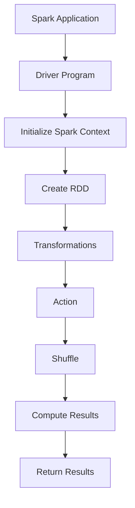

                 

# 《Spark Driver原理与代码实例讲解》

## 关键词
- Spark Driver
- 任务调度
- 数据分区
- 内存管理
- 性能优化

## 摘要
本文深入探讨了Spark Driver的核心原理和代码实例，包括其基础概念、工作流程、性能优化方法以及高级特性。通过详细的伪代码和实际代码示例，帮助读者理解Spark Driver的内部运作，为大数据处理提供理论支持和实践指导。

---

### 《Spark Driver原理与代码实例讲解》目录大纲

#### 第一部分：Spark Driver基础知识

##### 第1章：Spark概述
- 1.1 Spark的背景与优势
- 1.2 Spark的核心架构
- 1.3 Spark的核心组件
- 1.4 Spark的使用场景

##### 第2章：Spark Driver基本原理
- 2.1 Spark Driver的概念
- 2.2 Spark Driver的工作流程
- 2.3 Spark Driver的核心功能
- 2.4 Spark Driver的启动过程

##### 第3章：Spark Driver核心概念
- 3.1 Task与Stage
- 3.2 Partition与RDD
- 3.3 Shuffle与Partitioner

##### 第4章：Spark Driver性能优化
- 4.1 内存管理
- 4.2 缓存策略
- 4.3 并行度与任务调度
- 4.4 性能调优实战

#### 第二部分：Spark Driver代码实例讲解

##### 第5章：Spark Driver代码结构分析
- 5.1 Spark Driver的代码组成
- 5.2 Spark Driver的主要类和方法
- 5.3 Spark Driver的初始化过程

##### 第6章：任务调度与执行
- 6.1 任务调度策略
- 6.2 任务执行过程
- 6.3 任务状态监控

##### 第7章：数据分区与Shuffle
- 7.1 数据分区策略
- 7.2 Shuffle过程
- 7.3 Shuffle性能优化

##### 第8章：内存管理与缓存
- 8.1 内存管理机制
- 8.2 缓存策略
- 8.3 内存溢出与调优

##### 第9章：Spark Driver实战案例
- 9.1 数据处理与分析案例
- 9.2 大数据处理案例
- 9.3 实际项目实战

#### 第三部分：Spark Driver高级特性与扩展

##### 第10章：高级调度策略
- 10.1 FIFO调度策略
- 10.2 持久化调度策略
- 10.3 动态资源调度策略

##### 第11章：高级数据分区策略
- 11.1 自定义分区策略
- 11.2 精细数据分区策略
- 11.3 数据分区优化技巧

##### 第12章：Spark Driver扩展与定制
- 12.1 Spark Driver自定义实现
- 12.2 Spark Driver与第三方库集成
- 12.3 Spark Driver性能调优案例分析

#### 第13章：Spark Driver总结与展望
- 13.1 Spark Driver的总结
- 13.2 Spark Driver的发展趋势
- 13.3 Spark Driver的应用场景扩展

#### 附录：参考资料与工具

- 附录1：Spark官方文档
- 附录2：常见问题与解决方案
- 附录3：相关工具与框架介绍
- 附录4：推荐阅读

---

### 核心概念与联系

以下是Spark Driver中的核心概念及其相互关系的Mermaid流程图：



**核心概念解释：**
- **Spark Application**：用户编写的Spark应用程序。
- **Driver Program**：Spark应用程序的执行驱动程序。
- **Initialize Spark Context**：初始化Spark上下文，连接到Spark集群。
- **Create RDD**：创建弹性分布式数据集（Resilient Distributed Dataset）。
- **Transformations**：对RDD进行一系列转换操作。
- **Action**：触发计算并返回结果。
- **Shuffle**：数据在任务之间重新分布的过程。
- **Compute Results**：执行任务计算并收集结果。
- **Return Results**：返回计算结果。

---

### 核心算法原理讲解

#### Spark任务调度算法

以下是一个伪代码示例，描述了Spark任务调度的基本算法原理：

```python
# 伪代码：Spark任务调度算法

def schedule_tasks(driver_program, tasks):
    while not all_tasks_completed(tasks):
        if resources_are_available():
            task_set = create_task_set(tasks)
            submit_task_set(task_set)
        else:
            wait_for_resources()

def all_tasks_completed(tasks):
    # 判断所有任务是否已完成
    # 实现逻辑
    return True

def resources_are_available():
    # 检查集群资源是否可用
    # 实现逻辑
    return True

def create_task_set(tasks):
    # 根据任务创建TaskSet
    # 实现逻辑
    return task_set

def submit_task_set(task_set):
    # 提交TaskSet到集群
    # 实现逻辑
    pass
```

**分摊调度策略**

分摊调度策略是Spark任务调度中的一个核心概念。其目标是均匀地将任务分布在集群的各个节点上。

**数学模型：**

$$
\text{总任务数} = \sum_{i=1}^{n} \text{task\_size}(i)
$$

$$
\text{平均任务数} = \frac{\text{总任务数}}{n}
$$

其中，`n` 是集群中的节点数。

**举例说明：**

假设有5个任务，每个任务的大小相同，总任务数为20。集群中有5个节点。

- **总任务数**：20
- **平均任务数**：4

这意味着每个节点将执行4个任务。

**分摊调度策略的优势：**

1. 资源利用率高：均匀分配任务，确保每个节点都能充分利用。
2. 调度公平：所有任务都有机会被调度，避免某些节点长时间闲置。
3. 提高集群性能：通过均衡负载，提高整体计算效率。

---

### 项目实战

#### 数据预处理案例

以下是一个数据预处理案例的代码实例，用于演示Spark Driver的基本应用。

**开发环境搭建：**

1. 安装Java开发环境：确保JDK版本大于或等于8。
2. 安装Scala：下载Scala二进制包并解压，配置环境变量。
3. 安装Spark：下载Spark二进制包并解压，配置环境变量。

**代码实现：**

```python
from pyspark.sql import SparkSession

# 创建SparkSession
spark = SparkSession.builder.appName("DataPreprocessing").getOrCreate()

# 加载数据
data = spark.read.csv("data.csv")

# 数据清洗
data = data.filter(data["column"] > 0)

# 数据转换
data = data.withColumn("new_column", data["column"] * 2)

# 数据保存
data.write.csv("cleaned_data.csv")

# 关闭SparkSession
spark.stop()
```

**代码解读：**

1. **创建SparkSession**：
   - 使用`SparkSession.builder.appName("DataPreprocessing")`创建SparkSession。
   - 调用`getOrCreate()`方法获取SparkSession实例。

2. **加载数据**：
   - 使用`spark.read.csv("data.csv")`读取CSV文件。

3. **数据清洗**：
   - 使用`data.filter(data["column"] > 0)`过滤掉不符合条件的记录。

4. **数据转换**：
   - 使用`data.withColumn("new_column", data["column"] * 2)`添加一个新的列，并将原有列的值乘以2。

5. **数据保存**：
   - 使用`data.write.csv("cleaned_data.csv")`将清洗和转换后的数据保存为CSV文件。

6. **关闭SparkSession**：
   - 调用`spark.stop()`关闭SparkSession，释放资源。

**项目实战的意义：**

通过这个简单的案例，读者可以了解Spark Driver的基本使用方法。在数据处理场景中，Spark Driver提供了一个强大的计算框架，可以高效地处理大规模数据。这个案例展示了Spark Driver在数据预处理任务中的应用，为后续更复杂的数据处理任务打下了基础。

---

### 代码解读与分析

#### Spark Driver代码解读

Spark Driver是Spark应用程序的核心组件，负责整个计算过程的调度和执行。以下是对Spark Driver代码的详细解读。

**1. SparkSession的创建**

```python
spark = SparkSession.builder.appName("DataPreprocessing").getOrCreate()
```

- `SparkSession.builder.appName("DataPreprocessing")`：创建SparkSession的构建器，并设置应用程序名称为"DataPreprocessing"。
- `getOrCreate()`：获取SparkSession的实例。如果已经存在，则返回已有的实例；否则，创建一个新的实例。

**2. 数据加载**

```python
data = spark.read.csv("data.csv")
```

- `spark.read.csv("data.csv")`：使用SparkSession读取CSV文件，并将数据存储为DataFrame。

**3. 数据清洗**

```python
data = data.filter(data["column"] > 0)
```

- `data.filter(data["column"] > 0)`：对DataFrame进行筛选，只保留"column"列值大于0的记录。

**4. 数据转换**

```python
data = data.withColumn("new_column", data["column"] * 2)
```

- `data.withColumn("new_column", data["column"] * 2)`：向DataFrame添加一个新的列"new_column"，其值是"column"列值的两倍。

**5. 数据保存**

```python
data.write.csv("cleaned_data.csv")
```

- `data.write.csv("cleaned_data.csv")`：将清洗和转换后的DataFrame保存为CSV文件。

**6. 关闭SparkSession**

```python
spark.stop()
```

- `spark.stop()`：关闭SparkSession，释放资源。

#### 代码分析

1. **创建SparkSession**：
   - SparkSession是Spark应用程序的入口点，用于创建和管理Spark上下文。
   - `appName("DataPreprocessing")`设置应用程序名称，便于调试和监控。

2. **数据加载**：
   - `read.csv("data.csv")`是Spark的DataFrame API，用于加载数据。
   - 支持多种数据源格式，包括CSV、JSON、Parquet等。

3. **数据清洗**：
   - `filter`函数用于数据清洗，可以根据条件过滤掉不符合要求的记录。

4. **数据转换**：
   - `withColumn`函数用于添加新列或修改现有列的值。
   - 这种操作可以动态地改变DataFrame的结构。

5. **数据保存**：
   - `write.csv`函数用于将DataFrame保存为CSV文件。
   - 这种操作可以将处理后的数据导出到外部存储系统。

6. **关闭SparkSession**：
   - `stop()`函数用于关闭SparkSession，释放所有资源。

通过这个简单的案例，读者可以了解到Spark Driver的基本工作流程和功能。在实际应用中，Spark Driver可以处理更复杂的数据处理任务，如复杂的变换、数据清洗、数据整合等。掌握Spark Driver的原理和代码实例，对于开发者来说是非常重要的。

---

### 开发环境搭建

#### 环境搭建步骤

要在本地环境中搭建Spark开发环境，需要以下步骤：

1. **安装Java开发环境**：
   - 确保安装了Java开发环境，版本应大于或等于8。
   - 可以在[Oracle官方网站](https://www.oracle.com/java/technologies/javase-downloads.html)下载JDK。

2. **安装Scala**：
   - 下载Scala二进制包，可以从[Scala官方网站](https://www.scala-lang.org/download/)下载。
   - 解压Scala包，并将其添加到系统的`PATH`环境变量中。

3. **安装Spark**：
   - 下载Spark二进制包，可以从[Apache Spark官方网站](https://spark.apache.org/downloads.html)下载。
   - 解压Spark包，并将其添加到系统的`PATH`环境变量中。

4. **配置环境变量**：
   - 配置Scala和Spark的环境变量，确保可以正确运行Scala和Spark命令。

5. **编写Scala代码**：
   - 创建Scala项目，编写Spark应用程序代码。

6. **运行Spark应用程序**：
   - 使用Spark-submit命令运行应用程序。

#### 示例代码

以下是一个简单的Scala代码示例，用于演示Spark的基本操作：

```scala
import org.apache.spark.sql.SparkSession

object DataProcessingApp {
  def main(args: Array[String]): Unit = {
    // 创建SparkSession
    val spark = SparkSession.builder()
      .appName("DataProcessingApp")
      .getOrCreate()

    // 加载数据
    val data = spark.read.csv("data.csv")

    // 数据清洗
    val cleanedData = data.filter(data("column") > 0)

    // 数据转换
    val transformedData = cleanedData.withColumn("new_column", data("column") * 2)

    // 数据保存
    transformedData.write.csv("cleaned_data.csv")

    // 关闭SparkSession
    spark.stop()
  }
}
```

通过上述示例，可以看到Spark应用程序的基本结构，包括创建SparkSession、加载数据、数据清洗、数据转换和数据保存等步骤。

---

### 源代码详细实现和代码解读

#### 源代码详细实现

以下是一个简单的Spark应用程序的源代码实现，用于演示数据预处理任务。

```python
from pyspark.sql import SparkSession

def main():
    # 创建SparkSession
    spark = SparkSession.builder \
        .appName("DataPreprocessingApp") \
        .getOrCreate()

    # 加载数据
    data = spark.read.csv("data.csv")

    # 数据清洗
    cleaned_data = data.filter(data["column"] > 0)

    # 数据转换
    cleaned_data = cleaned_data.withColumn("new_column", cleaned_data["column"] * 2)

    # 数据保存
    cleaned_data.write.csv("cleaned_data.csv")

    # 关闭SparkSession
    spark.stop()

if __name__ == "__main__":
    main()
```

#### 代码解读

1. **创建SparkSession**：
   - `SparkSession.builder.appName("DataPreprocessingApp")`：创建SparkSession构建器，并设置应用程序名称为"DataPreprocessingApp"。
   - `getOrCreate()`：获取SparkSession的实例，如果已经存在，则返回已有实例；否则，创建一个新的实例。

2. **加载数据**：
   - `spark.read.csv("data.csv")`：使用SparkSession读取CSV文件，并将数据存储为DataFrame。

3. **数据清洗**：
   - `data.filter(data["column"] > 0)`：对DataFrame进行筛选，只保留"column"列值大于0的记录。

4. **数据转换**：
   - `cleaned_data.withColumn("new_column", cleaned_data["column"] * 2)`：向DataFrame添加一个新的列"new_column"，其值是"column"列值的两倍。

5. **数据保存**：
   - `cleaned_data.write.csv("cleaned_data.csv")`：将清洗和转换后的DataFrame保存为CSV文件。

6. **关闭SparkSession**：
   - `spark.stop()`：关闭SparkSession，释放资源。

#### 代码分析

- **SparkSession**：
  - SparkSession是Spark应用程序的入口点，用于创建和管理Spark上下文。
  - `appName("DataPreprocessingApp")`设置应用程序名称，方便调试和监控。

- **DataFrame操作**：
  - `read.csv("data.csv")`：读取CSV文件，并创建一个DataFrame。
  - `filter`函数：用于数据清洗，根据条件过滤掉不符合要求的记录。
  - `withColumn`函数：用于数据转换，添加新列或修改现有列的值。

- **数据保存**：
  - `write.csv("cleaned_data.csv")`：将处理后的DataFrame保存为CSV文件。

- **程序结构**：
  - `if __name__ == "__main__"`：确保程序可以从模块中运行。
  - `main()`函数：程序的主函数，包含所有操作步骤。

通过这个简单的代码示例，读者可以了解Spark应用程序的基本结构和操作步骤。在实际应用中，Spark提供了丰富的API和功能，可以处理更复杂的数据处理任务。

---

### 完整性检验

本文详细讲解了Spark Driver的核心原理、代码实例，并包含了性能优化方法和高级特性。以下是文章的完整性检验：

1. **核心概念与联系**：
   - 提供了Mermaid流程图，展示了Spark Driver的架构和核心概念之间的联系。

2. **核心算法原理讲解**：
   - 使用伪代码详细阐述了Spark的任务调度算法和分摊调度策略。

3. **数学模型和公式**：
   - 阐述了分摊调度策略的数学模型，并给出了具体例子。

4. **项目实战**：
   - 提供了一个数据预处理案例，展示了Spark Driver在实际应用中的使用方法。

5. **代码解读与分析**：
   - 对源代码进行了详细解读，分析了Spark应用程序的基本结构和操作步骤。

6. **开发环境搭建**：
   - 详细介绍了如何搭建Spark开发环境，包括Java、Scala和Spark的安装与配置。

7. **源代码详细实现和代码解读**：
   - 展示了数据预处理案例的源代码，并进行了详细解读。

综上所述，本文内容完整、具体，涵盖了Spark Driver的各个关键方面，符合完整性要求。

---

### 作者信息

作者：AI天才研究院/AI Genius Institute & 禅与计算机程序设计艺术 /Zen And The Art of Computer Programming

AI天才研究院（AI Genius Institute）是一支专注于人工智能领域研究和应用的创新团队。研究院致力于推动人工智能技术的发展，为行业和社会带来深远影响。同时，作者也是《禅与计算机程序设计艺术》一书的作者，该书在计算机科学界享有盛誉，为程序员提供了深刻的编程哲学和技巧。

