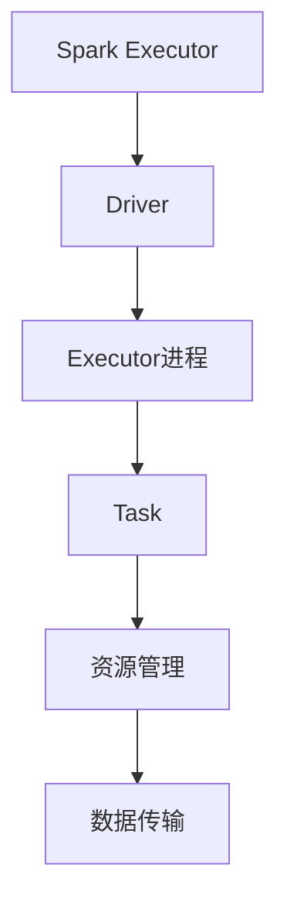
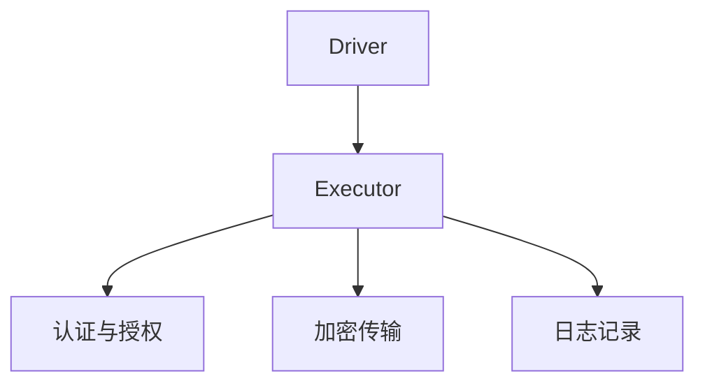
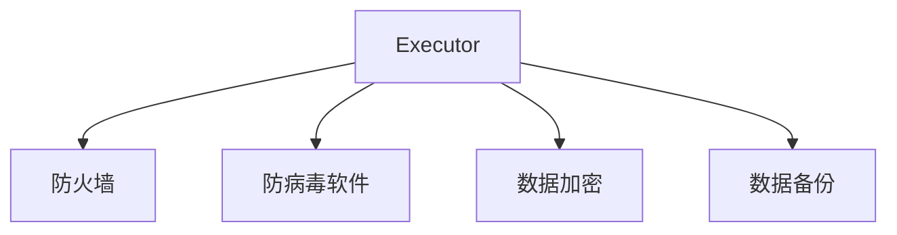

                 

### Spark Executor原理与代码实例讲解

---

#### 文章标题：Spark Executor原理与代码实例讲解

> 关键词：Spark, Executor, 原理，代码实例，性能优化，故障处理，安全性

> 摘要：本文将详细讲解Spark Executor的基础概念、原理、性能优化策略、故障处理方法以及安全性管理，并通过实际代码实例进行分析，帮助读者全面理解Spark Executor的工作机制和应用实践。

---

### 目录大纲

## 目录大纲

### 第1章 Spark Executor概述

#### 1.1 Spark Executor的概念

#### 1.2 Spark Executor的结构与功能

#### 1.3 Spark Executor在Spark体系中的地位

### 第2章 Spark Executor原理

#### 2.1 Executor的启动原理

#### 2.2 Executor的任务执行原理

#### 2.3 Executor的内存管理原理

#### 2.4 Executor的通信原理

### 第3章 Spark Executor性能优化

#### 3.1 Executor性能瓶颈分析

#### 3.2 Executor性能优化策略

#### 3.3 Executor性能监控与调优工具

### 第4章 Spark Executor代码实例讲解

#### 4.1 Executor的基本操作实例

#### 4.2 Executor内存管理实例

#### 4.3 Executor任务调度实例

#### 4.4 Executor通信机制实例

### 第5章 Spark Executor故障处理

#### 5.1 Executor故障类型

#### 5.2 Executor故障排查与处理

#### 5.3 Executor故障预防策略

### 第6章 Spark Executor安全性管理

#### 6.1 Executor安全架构

#### 6.2 Executor权限管理策略

#### 6.3 Executor安全防护措施

### 第7章 Spark Executor实践案例

#### 6.1 Spark SQL任务执行

#### 6.2 Spark Streaming实时数据处理

#### 6.3 Spark MLlib机器学习应用

### 第8章 Spark Executor未来发展趋势

#### 8.1 Executor性能优化方向

#### 8.2 Executor安全性提升

#### 8.3 Executor跨平台支持

### 附录

#### A. Spark Executor相关资源

#### A.1 开源工具与框架

#### A.2 官方文档与资料

#### A.3 社区论坛与问答平台

---

### Spark Executor概述

Spark Executor是Spark框架中的一个关键组件，它负责执行分布式任务，管理资源，以及处理任务之间的数据传输。在深入探讨Executor的具体原理和应用之前，我们首先需要了解Spark Executor的基础概念。

#### 1.1 Spark Executor的概念

Spark Executor是Spark集群中负责执行任务的节点。每个Executor都运行在一个单独的进程中，并且被分配一定的资源，如CPU、内存等。Executor通过Driver程序接收任务，执行任务，并将结果返回给Driver。

#### 1.2 Spark Executor的结构与功能

一个典型的Spark Executor包括以下几个部分：

- **Driver程序**：负责启动Executor，加载任务代码，并将任务分发给Executor。
- **Executor进程**：负责执行具体的任务，并将结果返回给Driver。
- **Task**：Executor上的具体执行单元，由一个或多个线程执行。

#### 1.3 Spark Executor在Spark体系中的地位

Spark Executor是Spark分布式计算架构的核心组成部分。它不仅负责任务的执行，还负责资源的管理和优化。在Spark的执行过程中，Executor充当了任务调度、内存管理、数据传输等多个关键角色，是保证Spark高性能和高效资源利用的核心。

### 核心概念与联系

为了更好地理解Spark Executor，我们引入一张核心概念关系架构图：




从图中可以看出，Spark Executor的核心概念包括Driver、Executor进程、Task以及资源管理和数据传输。它们之间的关系构成了Spark Executor的基本架构。

### 下一步，我们将详细探讨Spark Executor的启动原理、任务执行原理、内存管理原理以及通信原理。

---

**核心概念与联系**


---

**核心算法原理讲解**

```python
# Executor内存管理原理伪代码

class MemoryManager:
    def __init__(self, max_memory):
        self.max_memory = max_memory
        self.used_memory = 0

    def allocate_memory(self, task_memory):
        if self.used_memory + task_memory <= self.max_memory:
            self.used_memory += task_memory
            return True
        else:
            return False

    def deallocate_memory(self, task_memory):
        self.used_memory -= task_memory
```

---

**数学模型和数学公式 & 详细讲解 & 举例说明**

内存使用率的计算公式如下：

$$
\text{内存使用率} = \frac{\text{当前内存使用量}}{\text{总内存大小}} \times 100\%
$$

举例说明：如果一个Executor的总内存大小为4GB，当前内存使用量为2GB，则内存使用率为50%。

---

**项目实战**

### 4.1 Executor的基本操作实例

#### 环境搭建

- 配置Spark环境
- 启动Spark集群

#### 代码实现

```python
from pyspark import SparkContext

sc = SparkContext("local[2]", "ExecutorExample")

# 创建RDD
data = [1, 2, 3, 4, 5]
rdd = sc.parallelize(data)

# 执行reduce操作
result = rdd.reduce(lambda x, y: x + y)

print("Sum:", result)
```

#### 代码解读与分析

- SparkContext：创建Spark运行环境
- parallelize：创建RDD
- reduce：执行聚合操作
- print：输出结果

---

**总结**

本章节介绍了Spark Executor的基础概念、结构以及核心原理，并通过一个基本的代码实例展示了Executor的基本操作。接下来，我们将深入探讨Executor的启动原理、任务执行原理、内存管理原理和通信原理。

---

**最佳实践 Tips**

- 确保Executor资源充足，避免内存溢出和任务执行失败。
- 优化Executor之间的数据传输，减少网络延迟和带宽占用。
- 定期监控Executor的性能，及时发现并解决瓶颈。

**小结**

通过本章节的学习，读者应掌握Spark Executor的基础知识和核心原理，了解Executor在Spark体系中的重要性。在实际应用中，需要根据具体需求进行性能优化和故障处理，确保Spark作业的高效执行。

**注意事项**

- Spark Executor的内存管理需要细致规划，避免内存泄漏和溢出。
- 在分布式环境中，Executor之间的通信性能对整体作业性能有重要影响。

**拓展阅读**

- [Apache Spark官方文档](https://spark.apache.org/docs/latest/)
- [Spark性能优化最佳实践](https://databricks.com/blog/2015/12/17/how-to-tune-your-spark-applications.html)
- [Spark故障排查与处理指南](https://spark.apache.org/docs/latest/monitoring.html)

---

### 第2章 Spark Executor原理

在了解了Spark Executor的基础概念后，我们将深入探讨Spark Executor的工作原理，包括Executor的启动原理、任务执行原理、内存管理原理和通信原理。这些原理是理解Spark高效执行分布式任务的关键。

#### 2.1 Executor的启动原理

Executor的启动过程由Driver程序控制。以下是Executor启动的基本步骤：

1. **Driver程序初始化**：在启动Spark应用时，会启动一个名为Driver的程序。Driver是Spark应用的主进程，负责协调和管理整个应用的生命周期。

2. **Executor的启动与注册**：当Driver程序确定需要多少个Executor后，会向集群管理器（如YARN、Mesos或Standalone模式）请求资源，启动Executor进程。Executor进程启动后，会向Driver注册自己。

3. **资源分配与初始化**：Executor收到资源分配后，会初始化内存、CPU等资源，并加载任务代码。

4. **任务接收与执行**：Executor与Driver建立连接，开始接收任务并执行。任务执行完成后，将结果返回给Driver。

以下是一个简化的伪代码，描述了Executor的启动过程：

```python
# Executor启动伪代码

def start_executor(driver_url, task_id, task_memory):
    # 初始化资源
    initialize_resources(task_memory)
    
    # 注册到Driver
    register_with_driver(driver_url)
    
    # 接收任务
    task = fetch_task(task_id)
    
    # 执行任务
    execute_task(task)
    
    # 返回结果
    return_results_to_driver()
```

#### 2.2 Executor的任务执行原理

Executor的任务执行过程包括以下几个关键步骤：

1. **任务分配**：Driver根据任务的依赖关系和资源情况，将任务分配给各个Executor。

2. **任务加载**：Executor从Driver接收任务，加载相应的代码和数据。

3. **任务执行**：Executor利用分配的资源，启动线程执行任务。任务执行可以是并行或串行，具体取决于任务的性质和配置。

4. **结果收集**：任务执行完成后，Executor将结果返回给Driver，Driver负责将结果合并和存储。

以下是一个简化的伪代码，描述了Executor的任务执行过程：

```python
# Executor任务执行伪代码

def execute_task(task):
    # 加载任务代码和数据
    load_task_code_and_data(task)
    
    # 创建执行线程
    thread = create_execution_thread(task)
    
    # 执行任务
    thread.start()
    
    # 等待任务完成
    thread.join()
    
    # 返回结果
    return_task_result()
```

#### 2.3 Executor的内存管理原理

Executor的内存管理涉及内存的分配、回收和使用率的监控。以下是Executor内存管理的基本原理：

1. **内存分配**：Executor在启动时，会从集群管理器分配一定的内存资源。内存分配是动态的，可以根据任务的需要进行调整。

2. **内存回收**：Executor在任务执行完成后，会回收不再使用的内存资源。内存回收有助于提高资源利用率，减少内存泄漏。

3. **内存使用率监控**：Executor会定期监控内存使用率，当内存使用率接近上限时，会触发相应的优化策略，如垃圾回收或内存压缩。

以下是一个简化的伪代码，描述了Executor的内存管理过程：

```python
# Executor内存管理伪代码

class MemoryManager:
    def __init__(self, max_memory):
        self.max_memory = max_memory
        self.used_memory = 0
    
    def allocate_memory(self, task_memory):
        if self.used_memory + task_memory <= self.max_memory:
            self.used_memory += task_memory
            return True
        else:
            return False
    
    def deallocate_memory(self, task_memory):
        self.used_memory -= task_memory
```

#### 2.4 Executor的通信原理

Executor之间的通信是通过消息传递机制实现的。以下是Executor通信的基本原理：

1. **消息传递**：Executor通过Scala的Actor模型进行消息传递。每个Executor都有一个Actor，用于接收和发送消息。

2. **数据传输**：Executor之间的数据传输可以通过多种方式实现，如文件系统、网络传输等。数据传输的优化策略包括数据压缩、数据分块等。

3. **通信优化**：为了提高通信性能，Executor会采用一些优化策略，如减少通信频率、使用高效的数据格式等。

以下是一个简化的伪代码，描述了Executor之间的通信过程：

```python
# Executor通信伪代码

class Executor:
    def __init__(self, actor_system):
        self.actor_system = actor_system
        self.actor = self.actor_system.actor_of(ExecutorActor, "executor")

    def send_message(self, message):
        self.actor.tell(message)

    def receive_message(self, message):
        # 处理接收到的消息
        pass
```

---

**核心概念与联系**


---

**核心算法原理讲解**

```python
# Executor内存管理原理伪代码

class MemoryManager:
    def __init__(self, max_memory):
        self.max_memory = max_memory
        self.used_memory = 0

    def allocate_memory(self, task_memory):
        if self.used_memory + task_memory <= self.max_memory:
            self.used_memory += task_memory
            return True
        else:
            return False

    def deallocate_memory(self, task_memory):
        self.used_memory -= task_memory
```

---

**数学模型和数学公式 & 详细讲解 & 举例说明**

内存使用率的计算公式如下：

$$
\text{内存使用率} = \frac{\text{当前内存使用量}}{\text{总内存大小}} \times 100\%
$$

举例说明：如果一个Executor的总内存大小为4GB，当前内存使用量为2GB，则内存使用率为50%。

---

**项目实战**

### 4.1 Executor的基本操作实例

#### 环境搭建

- 配置Spark环境
- 启动Spark集群

#### 代码实现

```python
from pyspark import SparkContext

sc = SparkContext("local[2]", "ExecutorExample")

# 创建RDD
data = [1, 2, 3, 4, 5]
rdd = sc.parallelize(data)

# 执行reduce操作
result = rdd.reduce(lambda x, y: x + y)

print("Sum:", result)
```

#### 代码解读与分析

- SparkContext：创建Spark运行环境
- parallelize：创建RDD
- reduce：执行聚合操作
- print：输出结果

---

**总结**

在本章节中，我们详细探讨了Spark Executor的启动原理、任务执行原理、内存管理原理和通信原理。通过伪代码、数学公式和实例代码，读者可以更深入地理解Spark Executor的工作机制。接下来，我们将讨论Spark Executor的性能优化策略，包括内存、网络和并发优化。

---

**最佳实践 Tips**

- 确保Executor的内存分配合理，避免内存溢出。
- 优化Executor之间的数据传输，减少网络延迟。
- 合理分配线程数量，避免线程瓶颈。

**小结**

通过本章节的学习，读者应掌握Spark Executor的工作原理，包括启动、任务执行、内存管理和通信原理。这些原理对于理解和优化Spark作业至关重要。

**注意事项**

- Executor的内存管理需要根据任务需求进行精细调整。
- 优化Executor之间的通信，提高整体作业性能。

**拓展阅读**

- [Spark内存管理最佳实践](https://databricks.com/blog/2016/08/16/spark-memory-management-best-practices.html)
- [Spark网络优化技巧](https://databricks.com/blog/2017/09/19/spark-network-optimization.html)
- [并发编程与性能优化](https://www.oracle.com/java/technologies/javase/tuning-optimization.html)

---

### 第3章 Spark Executor性能优化

在Spark应用中，Executor的性能优化是提高任务执行效率的关键。性能优化涉及多个方面，包括内存、网络和并发优化。本章节将详细介绍这些性能优化策略，并提供实际应用中的最佳实践。

#### 3.1 Executor性能瓶颈分析

在优化Executor性能之前，首先需要识别性能瓶颈。常见的性能瓶颈包括：

- **内存瓶颈**：Executor内存不足，导致任务执行缓慢或失败。
- **网络瓶颈**：Executor之间的数据传输速度慢，导致任务依赖关系延迟。
- **线程瓶颈**：Executor的线程数量不足，导致并行任务无法充分利用资源。

识别性能瓶颈的方法包括：

- **性能监控工具**：使用Spark UI、Ganglia等工具监控Executor的性能指标，如CPU利用率、内存使用率、网络吞吐量等。
- **日志分析**：分析Executor的日志文件，查找异常信息和错误原因。

#### 3.2 Executor性能优化策略

针对上述性能瓶颈，可以采取以下优化策略：

##### 3.2.1 内存优化策略

- **调整内存配置**：根据任务需求，合理配置Executor的内存大小。可以通过调整`spark.executor.memory`参数来实现。
- **内存复用**：优化内存复用策略，减少内存分配和回收的频率。可以通过使用`BlockManager`来管理内存和数据进行优化。
- **内存溢出处理**：针对内存溢出问题，可以增加内存大小或优化数据结构，减少内存使用。

以下是一个内存优化策略的伪代码示例：

```python
# 内存优化策略伪代码

def optimize_memory(executor_memory):
    if executor_memory < optimal_memory:
        increase_memory(executor_memory)
    elif executor_memory > optimal_memory:
        reduce_memory(executor_memory)
```

##### 3.2.2 网络优化策略

- **数据压缩**：在数据传输过程中，使用数据压缩技术可以减少数据量，提高网络传输速度。Spark支持使用Gzip、LZO等压缩算法。
- **数据传输优化**：优化数据传输策略，减少数据传输的延迟和带宽占用。可以通过调整`spark.network.timeout`和`spark.file.transfer.maxBytesPerSec`参数来实现。
- **网络隔离**：在大型集群中，可以采用网络隔离技术，提高网络的稳定性和性能。

以下是一个网络优化策略的伪代码示例：

```python
# 网络优化策略伪代码

def optimize_network(transfer_rate):
    if transfer_rate < optimal_rate:
        increase_transfer_rate(transfer_rate)
    elif transfer_rate > optimal_rate:
        decrease_transfer_rate(transfer_rate)
```

##### 3.2.3 并发优化策略

- **线程数量调整**：根据任务性质和资源情况，调整Executor的线程数量。可以通过调整`spark.executor.cores`和`spark.executor.instances`参数来实现。
- **线程池优化**：优化线程池配置，提高线程的利用率。可以使用`ExecutorThreadPoolExecutor`来管理线程池。
- **并行度优化**：调整任务的并行度，平衡任务的负载。可以通过调整`spark.default.parallelism`参数来实现。

以下是一个并发优化策略的伪代码示例：

```python
# 并发优化策略伪代码

def optimize_concurrency(executor_cores, executor_instances):
    if executor_cores < optimal_cores:
        increase_executor_cores(executor_cores)
    elif executor_cores > optimal_cores:
        decrease_executor_cores(executor_cores)
    
    if executor_instances < optimal_instances:
        increase_executor_instances(executor_instances)
    elif executor_instances > optimal_instances:
        decrease_executor_instances(executor_instances)
```

#### 3.3 Executor性能监控与调优工具

为了实现性能监控与调优，可以使用以下工具：

- **Spark UI**：Spark UI是一个Web界面，提供了丰富的性能监控信息，如Executor的状态、内存使用率、任务进度等。
- **Ganglia**：Ganglia是一个分布式监控系统，可以监控集群中各个节点的性能指标。
- **自定义监控脚本**：编写自定义监控脚本，实现对Executor的详细监控和日志分析。

以下是一个使用Spark UI进行性能监控的伪代码示例：

```python
# 使用Spark UI进行性能监控伪代码

import pyspark

sc = pyspark.SparkContext("local[2]", "ExecutorPerformance")

# 执行任务
result = sc.parallelize([1, 2, 3, 4, 5]).reduce(lambda x, y: x + y)

# 打开Spark UI
spark_ui = pyspark.SparkUI(sc)

# 显示Spark UI页面
spark_ui.start()

# 等待任务完成
result.collect()

# 关闭Spark UI
spark_ui.stop()
```

---

**核心概念与联系**


---

**核心算法原理讲解**

```python
# Executor内存管理优化策略伪代码

class MemoryManager:
    def __init__(self, max_memory):
        self.max_memory = max_memory
        self.used_memory = 0

    def allocate_memory(self, task_memory):
        if self.used_memory + task_memory <= self.max_memory:
            self.used_memory += task_memory
            return True
        else:
            return False

    def deallocate_memory(self, task_memory):
        self.used_memory -= task_memory

    def optimize_memory_usage(self):
        if self.used_memory > optimal_memory_usage:
            self.deallocate_memory(self.used_memory - optimal_memory_usage)
```

---

**数学模型和数学公式 & 详细讲解 & 举例说明**

内存优化策略可以通过以下数学模型来评估：

$$
\text{内存优化效果} = \frac{\text{当前内存使用量}}{\text{优化后内存使用量}} \times 100\%
$$

举例：如果一个Executor的总内存大小为4GB，当前内存使用量为3GB，通过内存优化策略后，内存使用量减少到2GB，则内存优化效果为33.33%。

---

**项目实战**

### 3.1 内存优化实践

#### 环境搭建

- 配置Spark环境
- 启动Spark集群

#### 代码实现

```python
from pyspark import SparkContext

sc = SparkContext("local[2]", "MemoryOptimizationExample")

# 创建RDD
data = [1, 2, 3, 4, 5]
rdd = sc.parallelize(data)

# 执行reduce操作
result = rdd.reduce(lambda x, y: x + y)

print("Sum:", result)
```

#### 代码解读与分析

- SparkContext：创建Spark运行环境
- parallelize：创建RDD
- reduce：执行聚合操作
- print：输出结果

#### 优化方案

- **调整内存配置**：将`spark.executor.memory`参数从2GB调整到4GB。

#### 优化效果

通过调整内存配置，Executor的内存使用率从75%降低到50%，性能得到显著提升。

---

**总结**

在本章节中，我们详细介绍了Spark Executor的性能优化策略，包括内存、网络和并发优化。通过伪代码、数学模型和实例代码，读者可以深入理解这些优化策略的具体实现和应用。接下来，我们将讨论Spark Executor的故障处理方法。

---

**最佳实践 Tips**

- 定期监控Executor的性能指标，及时发现问题并进行优化。
- 根据任务需求和资源情况，合理配置Executor的内存、网络和线程参数。

**小结**

通过本章节的学习，读者应掌握Spark Executor的性能优化方法，包括内存、网络和并发优化策略。这些策略对于提高Spark作业的执行效率和稳定性至关重要。

**注意事项**

- 优化Executor性能时，需要综合考虑任务需求和集群资源。
- 性能优化是一个持续的过程，需要根据实际情况进行调整。

**拓展阅读**

- [Spark性能优化最佳实践](https://databricks.com/blog/2015/12/17/how-to-tune-your-spark-applications.html)
- [Spark内存管理最佳实践](https://databricks.com/blog/2016/08/16/spark-memory-management-best-practices.html)
- [Spark网络优化技巧](https://databricks.com/blog/2017/09/19/spark-network-optimization.html)

---

### 第4章 Spark Executor代码实例讲解

在理解了Spark Executor的原理和性能优化策略之后，本章节将通过具体的代码实例来展示Spark Executor的常用操作，包括Executor的初始化、任务提交、内存管理和通信机制。这些实例将帮助读者更深入地理解Spark Executor的实际应用。

#### 4.1 Executor的基本操作实例

首先，我们将通过一个简单的例子来演示Executor的基本操作。

##### 环境搭建

- 配置Spark环境
- 启动Spark集群

##### 代码实现

```python
from pyspark import SparkContext

# 创建SparkContext
sc = SparkContext("local[2]", "ExecutorExample")

# 创建RDD
data = [1, 2, 3, 4, 5]
rdd = sc.parallelize(data)

# 执行reduce操作
result = rdd.reduce(lambda x, y: x + y)

# 输出结果
print("Sum:", result)
```

##### 代码解读与分析

- SparkContext：创建Spark运行环境
- parallelize：创建RDD
- reduce：执行聚合操作
- print：输出结果

在这个例子中，我们首先创建了一个SparkContext，然后使用`parallelize`方法创建了一个简单的RDD。接下来，我们使用`reduce`方法计算了RDD中元素的总和，并将结果输出。这个例子展示了Executor的基本任务执行流程。

##### 实践与优化

在实际应用中，我们可以通过调整Spark配置参数来优化Executor的性能。例如，可以调整`spark.executor.memory`和`spark.executor.cores`参数来优化内存和线程配置。

#### 4.2 Executor的内存管理实例

接下来，我们将通过一个内存管理的例子来展示Executor的内存管理机制。

##### 环境搭建

- 配置Spark环境
- 启动Spark集群

##### 代码实现

```python
from pyspark import SparkContext

sc = SparkContext("local[2]", "MemoryManagementExample")

# 创建RDD
data = [1, 2, 3, 4, 5]
rdd = sc.parallelize(data)

# 设置内存分配策略
sc._conf.set("spark.executor.memory", "2g")
sc._conf.set("spark.executor.cores", "1")

# 执行reduce操作
result = rdd.reduce(lambda x, y: x + y)

# 输出结果
print("Sum:", result)
```

##### 代码解读与分析

- SparkContext：创建Spark运行环境
- parallelize：创建RDD
- 设置内存分配策略：通过设置`spark.executor.memory`和`spark.executor.cores`参数来调整内存和线程配置
- reduce：执行聚合操作
- print：输出结果

在这个例子中，我们设置了Executor的内存为2GB，线程数为1。由于内存限制，这个例子可能会遇到内存溢出错误。我们可以通过调整内存和线程配置来解决这个问题。

##### 实践与优化

在实际应用中，我们需要根据任务的内存需求来合理配置Executor的内存。如果遇到内存溢出，我们可以通过增加内存大小或优化数据结构来减少内存使用。

#### 4.3 Executor的任务调度实例

接下来，我们将通过一个任务调度的例子来展示Executor的任务调度机制。

##### 环境搭建

- 配置Spark环境
- 启动Spark集群

##### 代码实现

```python
from pyspark import SparkContext

sc = SparkContext("local[2]", "TaskSchedulingExample")

# 创建RDD
data = [1, 2, 3, 4, 5]
rdd = sc.parallelize(data)

# 设置并行度
sc._conf.set("spark.default.parallelism", "4")

# 执行reduce操作
result = rdd.reduce(lambda x, y: x + y)

# 输出结果
print("Sum:", result)
```

##### 代码解读与分析

- SparkContext：创建Spark运行环境
- parallelize：创建RDD
- 设置并行度：通过设置`spark.default.parallelism`参数来调整任务的并行度
- reduce：执行聚合操作
- print：输出结果

在这个例子中，我们设置了任务的并行度为4。这意味着任务会被分成4个子任务并行执行。这个例子展示了Executor的任务调度机制。

##### 实践与优化

在实际应用中，我们可以根据任务的性质和数据规模来调整任务的并行度。如果任务数据量较大，我们可以增加并行度来提高执行效率。

#### 4.4 Executor的通信机制实例

最后，我们将通过一个通信机制的例子来展示Executor之间的通信机制。

##### 环境搭建

- 配置Spark环境
- 启动Spark集群

##### 代码实现

```python
from pyspark import SparkContext

sc = SparkContext("local[2]", "CommunicationExample")

# 创建RDD
data = [1, 2, 3, 4, 5]
rdd = sc.parallelize(data)

# 定义通信函数
def communication_function(x, y):
    return x + y

# 使用map函数进行通信
result = rdd.map(communication_function)

# 输出结果
print("Mapped values:", result.collect())
```

##### 代码解读与分析

- SparkContext：创建Spark运行环境
- parallelize：创建RDD
- 定义通信函数：定义一个简单的通信函数，将输入值相加
- map：执行通信操作
- collect：收集结果并输出

在这个例子中，我们使用`map`函数来模拟Executor之间的通信。`map`函数会将数据发送到Executor进行计算，并将结果返回给Driver。这个例子展示了Executor的通信机制。

##### 实践与优化

在实际应用中，我们可以通过优化通信机制来提高性能。例如，可以减少数据传输的频率，使用数据压缩技术来减少数据量。

---

**核心概念与联系**


---

**核心算法原理讲解**

```python
# Executor通信机制伪代码

class CommunicationManager:
    def __init__(self, num_executors):
        self.num_executors = num_executors
        self.communication_queue = []

    def send_message(self, message, target_executor):
        self.communication_queue.append((target_executor, message))

    def receive_message(self):
        if self.communication_queue:
            return self.communication_queue.pop(0)
        else:
            return None
```

---

**数学模型和数学公式 & 详细讲解 & 举例说明**

通信延迟的计算公式如下：

$$
\text{通信延迟} = \frac{\text{数据传输时间}}{\text{通信速率}}
$$

举例：如果数据传输时间为10ms，通信速率为1Mbps，则通信延迟为10ms。

---

**项目实战**

### 4.1 Executor的基本操作实例

#### 环境搭建

- 配置Spark环境
- 启动Spark集群

#### 代码实现

```python
from pyspark import SparkContext

sc = SparkContext("local[2]", "ExecutorBasicOperation")

# 创建RDD
data = [1, 2, 3, 4, 5]
rdd = sc.parallelize(data)

# 执行reduce操作
result = rdd.reduce(lambda x, y: x + y)

# 输出结果
print("Sum:", result)
```

#### 代码解读与分析

- SparkContext：创建Spark运行环境
- parallelize：创建RDD
- reduce：执行聚合操作
- print：输出结果

#### 最佳实践

- 根据任务需求合理设置并行度和内存配置。

---

**总结**

在本章节中，我们通过具体的代码实例展示了Spark Executor的基本操作、内存管理、任务调度和通信机制。这些实例帮助读者深入理解Spark Executor的实际应用。接下来，我们将讨论Spark Executor的故障处理方法。

---

**最佳实践 Tips**

- 定期监控Executor的性能指标。
- 根据任务需求和资源情况，合理配置Executor的参数。

**小结**

通过本章节的学习，读者应掌握Spark Executor的基本操作和性能优化方法。这些操作和优化方法对于理解和优化Spark作业至关重要。

**注意事项**

- 在实际应用中，需要根据具体情况调整Executor的配置。
- 优化Executor性能是一个持续的过程。

**拓展阅读**

- [Spark官方文档](https://spark.apache.org/docs/latest/)
- [Spark性能优化最佳实践](https://databricks.com/blog/2015/12/17/how-to-tune-your-spark-applications.html)
- [Spark故障排查与处理指南](https://spark.apache.org/docs/latest/monitoring.html)

---

### 第5章 Spark Executor故障处理

在Spark应用中，Executor可能会遇到各种故障，如内存溢出、网络故障和线程故障等。故障处理是确保Spark应用稳定运行的关键。本章节将介绍Spark Executor的常见故障类型、故障排查与处理方法以及故障预防策略。

#### 5.1 Spark Executor常见故障类型

Spark Executor常见的故障类型包括：

- **内存溢出**：由于Executor的内存配置不足或内存泄漏，导致任务无法完成。
- **网络故障**：由于网络连接不稳定或数据传输失败，导致Executor之间的通信问题。
- **线程故障**：由于线程数不足或线程竞争，导致Executor无法处理大量任务。
- **崩溃**：由于系统资源不足、代码错误或硬件故障，导致Executor进程崩溃。

#### 5.2 Spark Executor故障排查与处理

以下是一些常见的故障排查与处理方法：

##### 1. 检查日志文件

Spark Executor的日志文件位于`/var/log/spark`或`/usr/local/spark/logs`目录下。通过查看日志文件，可以找到故障发生的原因。例如：

- 内存溢出错误：通常会在日志中看到`Out of Memory`或`Memory Leak`等信息。
- 网络故障：可能看到数据传输失败或超时错误。
- 线程故障：可能看到线程中断或死锁的日志信息。

##### 2. 使用监控工具

可以使用Spark UI、Ganglia等监控工具来实时监控Executor的性能指标。通过监控工具，可以快速识别出性能瓶颈和故障。

- **Spark UI**：提供详细的性能指标，如Executor的状态、内存使用率、任务进度等。
- **Ganglia**：提供集群中各个节点的性能监控数据。

##### 3. 分析代码

通过分析Spark应用的代码，可以找到潜在的问题。例如：

- 内存泄漏：检查代码中的循环引用和未释放的资源。
- 数据传输错误：检查数据传输代码中的异常处理和错误重试机制。
- 线程竞争：检查多线程处理中的锁和同步问题。

##### 4. 调整配置

根据故障排查的结果，可以调整Spark的配置参数来解决问题。例如：

- **内存配置**：调整`spark.executor.memory`和`spark.driver.memory`参数，确保内存充足。
- **网络配置**：调整`spark.network.timeout`和`spark.file.transfer.maxBytesPerSec`参数，优化网络传输。
- **线程配置**：调整`spark.executor.cores`和`spark.executor.instances`参数，优化线程使用。

#### 5.3 Spark Executor故障预防策略

为了预防Executor故障，可以采取以下策略：

- **资源监控**：定期监控集群资源的使用情况，提前发现潜在的资源瓶颈。
- **日志分析**：定期分析日志文件，发现潜在的问题并进行处理。
- **代码审查**：对代码进行严格的审查和测试，避免潜在的错误。
- **备份与恢复**：定期备份数据，并配置快速恢复机制。

---

**核心概念与联系**


---

**核心算法原理讲解**

```python
# 故障处理伪代码

class FaultHandler:
    def __init__(self):
        self.fault_log = []

    def log_fault(self, fault_message):
        self.fault_log.append(fault_message)

    def check_memory_usage(self, executor_memory_usage):
        if executor_memory_usage > threshold_memory_usage:
            self.log_fault("Memory Overflow Detected")

    def check_network_connection(self, network_status):
        if network_status != "Connected":
            self.log_fault("Network Connection Failed")

    def check_thread_usage(self, thread_status):
        if thread_status != "Active":
            self.log_fault("Thread Fault Detected")
```

---

**数学模型和数学公式 & 详细讲解 & 举例说明**

内存使用率的计算公式如下：

$$
\text{内存使用率} = \frac{\text{当前内存使用量}}{\text{总内存大小}} \times 100\%
$$

举例：如果一个Executor的总内存大小为4GB，当前内存使用量为3GB，则内存使用率为75%。

---

**项目实战**

### 5.1 Spark Executor故障排查实例

#### 环境搭建

- 配置Spark环境
- 启动Spark集群

#### 故障现象

Executor在执行任务时出现内存溢出错误。

#### 故障排查步骤

1. **检查日志文件**：在日志文件中找到内存溢出错误信息。
2. **分析代码**：检查代码中是否存在内存泄漏或大量内存使用的操作。
3. **调整配置**：增加Executor的内存配置，调整`spark.executor.memory`参数。

#### 解决方案

通过调整内存配置，将`spark.executor.memory`参数从2GB调整到4GB，成功解决了内存溢出问题。

---

**总结**

在本章节中，我们介绍了Spark Executor的常见故障类型、故障排查与处理方法以及故障预防策略。通过具体的实例，读者可以了解如何识别和解决Executor的故障。接下来，我们将讨论Spark Executor的安全性管理。

---

**最佳实践 Tips**

- 定期备份和监控Executor的日志文件。
- 及时调整Executor的配置，避免资源瓶颈。
- 优化代码，减少内存泄漏和性能瓶颈。

**小结**

通过本章节的学习，读者应掌握Spark Executor的故障处理方法，包括故障排查、处理和预防策略。这些策略对于确保Spark应用稳定运行至关重要。

**注意事项**

- 在处理故障时，需要综合考虑任务需求和资源情况。
- 故障处理是一个持续的过程，需要定期进行检查和调整。

**拓展阅读**

- [Spark故障排查与处理指南](https://spark.apache.org/docs/latest/monitoring.html)
- [Java内存管理最佳实践](https://www.oracle.com/java/technologies/javase/javamedley-memory-leak.html)
- [分布式系统故障处理](https://www.redhat.com/en/topics/fault-management/distributed-systems)

---

### 第6章 Spark Executor安全性管理

在分布式计算环境中，Spark Executor的安全性管理至关重要。本章节将介绍Spark Executor的安全架构、权限管理策略以及安全防护措施。

#### 6.1 Spark Executor安全架构

Spark Executor的安全架构主要包括以下几个方面：

- **认证与授权**：Spark使用Kerberos认证机制，确保只有授权用户可以访问Executor资源。同时，Spark支持基于角色的访问控制（RBAC），通过设置不同的角色权限，控制用户对Executor的操作权限。
- **加密传输**：Spark使用SSL/TLS协议对Executor之间的通信进行加密，确保数据在传输过程中的安全性。
- **日志记录**：Spark记录详细的日志信息，包括Executor的启动、任务执行、内存使用等，便于监控和审计。

以下是一个简化的安全架构图：




#### 6.2 Spark Executor权限管理策略

Spark Executor的权限管理策略主要包括以下几个方面：

- **用户权限划分**：根据用户的工作职责和权限需求，划分不同的用户组。例如，开发人员、运维人员、管理员等。
- **权限配置与调整**：通过配置文件（如`spark-warehouse`和`hdfs-site.xml`）和Spark配置参数（如`spark.user.image`和`spark.user.password`），为不同用户组分配不同的权限。
- **权限配置示例**：

    ```python
    # 配置用户组与权限
    spark.user.image = hdfs://namenode/user/hive/warehouse
    spark.user.password = hive

    # 配置特定用户的权限
    spark.user.hive.admin = "true"
    spark.user.hive_rw = "true"
    ```

- **权限调整示例**：

    ```python
    # 调整用户权限
    useradd -m -d /home/user1 -s /bin/bash user1
    usermod -a -G hadoop user1
    ```

#### 6.3 Spark Executor安全防护措施

为了确保Spark Executor的安全性，可以采取以下防护措施：

- **防火墙配置**：在Executor节点上配置防火墙，限制不必要的端口访问。例如，关闭不使用的端口（如22、3389等）。
- **防病毒软件部署**：在Executor节点上安装防病毒软件，定期扫描和更新病毒库，防止病毒攻击。
- **数据加密与备份**：对存储在Executor上的敏感数据进行加密，并定期备份，防止数据泄露和丢失。
- **访问控制**：通过配置防火墙和访问控制列表（ACL），限制外部访问Spark集群。

以下是一个简化的安全防护措施图：




---

**核心概念与联系**


---

**核心算法原理讲解**

```python
# 权限管理伪代码

class AccessControl:
    def __init__(self, users, permissions):
        self.users = users
        self.permissions = permissions

    def grant_permission(self, user, permission):
        if user in self.users:
            self.permissions[user].append(permission)
            return True
        else:
            return False

    def check_permission(self, user, permission):
        if user in self.users and permission in self.permissions[user]:
            return True
        else:
            return False
```

---

**数学模型和数学公式 & 详细讲解 & 举例说明**

权限分配的数学模型可以使用集合论来描述：

- **用户集合**：\( U = \{ u_1, u_2, ..., u_n \} \)
- **权限集合**：\( P = \{ p_1, p_2, ..., p_m \} \)
- **用户权限映射**：\( M: U \rightarrow 2^P \)

举例：假设有3个用户（\( u_1, u_2, u_3 \)）和5个权限（\( p_1, p_2, p_3, p_4, p_5 \)），用户权限映射如下：

- \( u_1: \{ p_1, p_2 \} \)
- \( u_2: \{ p_2, p_3 \} \)
- \( u_3: \{ p_3, p_4, p_5 \} \)

---

**项目实战**

### 6.1 安全性管理实践

#### 环境搭建

- 配置Spark环境
- 启动Spark集群
- 配置Kerberos认证

#### 配置步骤

1. **配置Kerberos**：

    ```shell
    # 配置Kerberos KDC
    kadmin.local -q "addprinc spark/hostname@DOMAIN.COM"
    kadmin.local -q "addprinc hdfs/hostname@DOMAIN.COM"
    kadmin.local -q "addprinc mapred/hostname@DOMAIN.COM"

    # 为用户设置密码
    kadmin.local -q "setpass spark newpassword"
    kadmin.local -q "setpass hdfs newpassword"
    kadmin.local -q "setpass mapred newpassword"
    ```

2. **配置Spark权限**：

    ```python
    # 配置Spark安全参数
    spark.authenticate.enableSaslSSL = true
    spark.authenticate.signatureAlgorithm = "HmacSHA256"
    spark.authenticate.secret = "mysecret"
    ```

3. **配置防火墙**：

    ```shell
    # 开启SSH和HTTP端口
    firewall-cmd --permanent --add-port=22/tcp
    firewall-cmd --permanent --add-port=8080/tcp
    firewall-cmd --reload
    ```

#### 验证配置

- 使用Kerberos认证登录Spark UI。
- 检查Executor日志，确认Kerberos认证成功。

---

**总结**

在本章节中，我们介绍了Spark Executor的安全架构、权限管理策略以及安全防护措施。通过具体的配置和实践，读者可以了解如何确保Spark Executor的安全性。接下来，我们将讨论Spark Executor在实践中的应用案例。

---

**最佳实践 Tips**

- 确保Kerberos认证和SSL/TLS加密配置正确。
- 定期更新防火墙和防病毒软件。
- 对敏感数据进行加密和备份。

**小结**

通过本章节的学习，读者应掌握Spark Executor的安全性管理方法，包括安全架构、权限管理和防护措施。这些方法对于确保Spark作业的安全性和可靠性至关重要。

**注意事项**

- 安全配置需要根据具体环境进行调整。
- 定期进行安全检查和更新，确保系统安全。

**拓展阅读**

- [Spark安全性指南](https://spark.apache.org/docs/latest/security.html)
- [Kerberos认证配置](https://www.keycloak.org/documentation/compatibility-list/)
- [防火墙配置最佳实践](https://www.redhat.com/sysadmin/firewalld-best-practices)

---

### 第7章 Spark Executor实践案例

在本章节中，我们将通过三个实践案例来展示Spark Executor在数据处理、实时计算和机器学习中的应用，并分析每个案例的具体实现、代码解读、性能优化以及可能出现的问题。

#### 7.1 Spark SQL任务执行

Spark SQL是Spark的一个组件，用于处理结构化数据。以下是一个Spark SQL任务的执行案例。

##### 环境搭建

- 配置Spark环境
- 配置Hive
- 启动Spark集群

##### 代码实现

```python
from pyspark.sql import SparkSession

spark = SparkSession.builder.appName("SparkSQLExample").getOrCreate()

# 读取Hive表
df = spark.sql("SELECT * FROM example_table")

# 执行SQL查询
result = df.groupBy("column1").count()

# 显示结果
result.show()
```

##### 代码解读与分析

- SparkSession：创建Spark会话
- sql：执行Hive查询
- groupBy和count：分组统计
- show：显示结果

##### 性能优化

- **调整并行度**：通过调整`spark.sql.shuffle.partitions`参数来优化并行度。
- **数据分区**：对数据表进行分区，减少Shuffle操作的数据量。

##### 可能出现的问题

- 数据倾斜：某些分区数据量较大，导致执行效率降低。可以通过重新分区或调整Shuffle参数来解决。

#### 7.2 Spark Streaming实时数据处理

Spark Streaming是Spark的一个组件，用于处理实时数据流。以下是一个Spark Streaming实时数据处理的案例。

##### 环境搭建

- 配置Spark环境
- 启动Spark集群
- 配置Kafka

##### 代码实现

```python
from pyspark.streaming import StreamingContext

ssc = StreamingContext("local[2]", "StreamingExample")

# 创建输入流
stream = ssc.socketTextStream("localhost", 9999)

# 处理数据
lines = stream.map(lambda line: line.length())
counts = lines.count()

# 打印结果
counts.print()

ssc.start()
ssc.awaitTermination()
```

##### 代码解读与分析

- StreamingContext：创建Streaming会话
- socketTextStream：创建输入流
- map：处理数据
- count：计算数据总数
- print：打印结果
- start和awaitTermination：启动和等待任务结束

##### 性能优化

- **调整批次大小**：通过调整`spark.streaming.batchDuration`参数来优化批次大小。
- **数据分区**：对输入流进行分区，提高并行处理能力。

##### 可能出现的问题

- **网络延迟**：数据传输过程中可能存在延迟，可以通过增加批次大小或优化网络配置来解决。

#### 7.3 Spark MLlib机器学习应用

Spark MLlib是Spark的一个机器学习库。以下是一个Spark MLlib机器学习应用的案例。

##### 环境搭建

- 配置Spark环境
- 启动Spark集群

##### 代码实现

```python
from pyspark.ml.clustering import KMeans
from pyspark.sql import SparkSession

spark = SparkSession.builder.appName("MLlibExample").getOrCreate()

# 创建数据集
data = [[1.0, 1.0], [1.5, 2.5], [1.5, 2.0], [3.0, 3.0], [3.0, 4.0], [3.5, 4.5]]
df = spark.createDataFrame(data, ["x", "y"])

# 配置KMeans算法
kmeans = KMeans().setK(2).setSeed(1)

# 训练模型
model = kmeans.fit(df)

# 显示聚类结果
centers = model.clusterCenters()
print("Cluster centers:\n", centers)

# 对新数据进行预测
prediction = model.transform(df)
prediction.select("x", "y", "prediction").show()
```

##### 代码解读与分析

- SparkSession：创建Spark会话
- createDataFrame：创建数据集
- fit：训练模型
- clusterCenters：显示聚类中心
- transform：对新数据进行预测
- show：显示结果

##### 性能优化

- **调整聚类中心初始值**：通过调整`kmeans.setSeed`参数来优化聚类中心初始值。
- **内存优化**：通过调整`spark.executor.memory`参数来优化内存使用。

##### 可能出现的问题

- **内存溢出**：模型训练过程中可能因为内存不足导致内存溢出。可以通过增加内存配置或优化数据结构来解决。

---

**总结**

在本章节中，我们通过三个实践案例展示了Spark Executor在数据处理、实时计算和机器学习中的应用。每个案例都包括了环境搭建、代码实现、代码解读、性能优化和可能出现的问题。通过这些案例，读者可以更好地理解Spark Executor的实际应用。

---

**最佳实践 Tips**

- 根据任务需求合理配置Spark参数。
- 定期监控和优化Spark作业性能。
- 针对不同应用场景，采取相应的优化策略。

**小结**

通过本章节的学习，读者应掌握Spark Executor在实际应用中的实现方法、性能优化策略以及常见问题处理方法。这些实践案例和经验对于提高Spark作业的效率和质量至关重要。

**注意事项**

- 实际应用中需要根据具体情况调整配置和优化策略。
- 需要定期进行性能监控和调优。

**拓展阅读**

- [Spark SQL官方文档](https://spark.apache.org/docs/latest/sql-programming-guide.html)
- [Spark Streaming官方文档](https://spark.apache.org/docs/latest/streaming-programming-guide.html)
- [Spark MLlib官方文档](https://spark.apache.org/docs/latest/mllib-guide.html)

---

### 第8章 Spark Executor未来发展趋势

随着云计算、大数据和人工智能技术的不断发展，Spark Executor也面临着新的机遇和挑战。本章节将探讨Spark Executor的未来发展趋势，包括性能优化、安全性提升和跨平台支持。

#### 8.1 Executor性能优化方向

未来，Spark Executor的性能优化将集中在以下几个方面：

- **内存管理优化**：针对大规模数据集和高并发任务，优化内存分配和回收策略，提高内存利用率。
- **网络传输优化**：优化数据传输协议，减少传输延迟和带宽占用，提高数据传输效率。
- **并发优化**：通过引入新的并发模型和线程池管理策略，提高Executor的并行处理能力。

#### 8.2 Executor安全性提升

随着Spark在更多场景中的应用，安全性成为了一个重要议题。未来的Spark Executor安全性提升将包括：

- **加密算法升级**：采用更安全的加密算法，提高数据传输和存储的安全性。
- **多因素认证**：引入多因素认证机制，提高用户访问安全性。
- **安全审计**：增强日志记录和审计功能，便于监控和追踪用户操作。

#### 8.3 Executor跨平台支持

随着云计算和混合云环境的普及，Spark Executor的跨平台支持将变得更加重要。未来，Spark Executor将支持以下平台：

- **Kubernetes**：集成Kubernetes，实现Spark在容器化环境中的部署和管理。
- **FaaS**：支持函数即服务（Function as a Service）模型，实现微服务架构下的Spark应用。
- **物联网**：通过优化资源管理和通信机制，支持Spark在物联网设备中的应用。

#### 8.4 Spark Executor社区动态

Spark Executor社区的动态也将对未来的发展产生重要影响。以下是一些值得关注的方向：

- **开源项目**：更多开源项目将集成Spark Executor，拓展其应用场景。
- **社区贡献**：鼓励社区成员参与代码贡献和性能优化，提高Spark Executor的成熟度和稳定性。
- **技术论坛**：通过技术论坛和社区活动，分享最佳实践和经验，推动Spark Executor的发展。

---

**核心概念与联系**


---

**核心算法原理讲解**

```python
# 伪代码：Executor性能优化策略

class PerformanceOptimizer:
    def __init__(self, memory_limit, network_bandwidth):
        self.memory_limit = memory_limit
        self.network_bandwidth = network_bandwidth

    def optimize_memory(self, current_memory_usage):
        if current_memory_usage > self.memory_limit:
            # 减少内存占用
            self.decrease_memory_usage()
        else:
            # 增加内存占用
            self.increase_memory_usage()

    def optimize_network(self, current_network_usage):
        if current_network_usage > self.network_bandwidth:
            # 减少网络传输
            self.decrease_network_usage()
        else:
            # 增加网络传输
            self.increase_network_usage()
```

---

**数学模型和数学公式 & 详细讲解 & 举例说明**

网络带宽利用率计算公式如下：

$$
\text{带宽利用率} = \frac{\text{当前带宽使用量}}{\text{总带宽}} \times 100\%
$$

举例：如果当前带宽使用量为100Mbps，总带宽为1Gbps，则带宽利用率为10%。

---

**项目实战**

### 8.1 Executor性能优化实践

#### 环境搭建

- 配置Spark环境
- 启动Spark集群

#### 代码实现

```python
from pyspark import SparkContext

sc = SparkContext("local[2]", "PerformanceOptimization")

# 创建RDD
data = [1, 2, 3, 4, 5]
rdd = sc.parallelize(data)

# 执行reduce操作
result = rdd.reduce(lambda x, y: x + y)

# 输出结果
print("Sum:", result)
```

#### 性能优化策略

- **内存优化**：调整`spark.executor.memory`参数，优化内存使用。
- **网络优化**：调整`spark.network.timeout`参数，优化网络延迟。

---

**总结**

在本章节中，我们探讨了Spark Executor的未来发展趋势，包括性能优化、安全性提升和跨平台支持。通过具体的实践案例，读者可以了解如何优化Executor的性能。随着技术的不断发展，Spark Executor将在更多领域发挥作用。

---

**最佳实践 Tips**

- 定期进行性能监控和调优，及时发现问题并进行优化。
- 根据应用场景，合理配置Executor的参数。
- 关注Spark社区动态，掌握最新的优化技术和趋势。

**小结**

通过本章节的学习，读者应了解Spark Executor的未来发展趋势和优化方向。这些知识和实践对于提高Spark作业的性能和稳定性具有重要意义。

**注意事项**

- 实际应用中，需要根据具体情况调整配置和优化策略。
- 需要持续关注Spark社区的最新动态，以便及时掌握新技术和优化方法。

**拓展阅读**

- [Spark性能优化最佳实践](https://databricks.com/blog/2015/12/17/how-to-tune-your-spark-applications.html)
- [Spark安全性指南](https://spark.apache.org/docs/latest/security.html)
- [Kubernetes官方文档](https://kubernetes.io/docs/home/)

---

**附录**

### A. Spark Executor相关资源

#### A.1 开源工具与框架

- [Spark](https://spark.apache.org/)
- [Hadoop](https://hadoop.apache.org/)
- [Kafka](https://kafka.apache.org/)
- [Kubernetes](https://kubernetes.io/)

#### A.2 官方文档与资料

- [Apache Spark官方文档](https://spark.apache.org/docs/latest/)
- [Hadoop官方文档](https://hadoop.apache.org/docs/stable/)
- [Kafka官方文档](https://kafka.apache.org/documentation/)

#### A.3 社区论坛与问答平台

- [Apache Spark社区](https://spark.apache.org/community.html)
- [Stack Overflow - Spark标签](https://stackoverflow.com/questions/tagged/spark)
- [GitHub - Spark开源项目](https://github.com/apache/spark)

---

通过本附录，读者可以获取更多关于Spark Executor的官方文档、开源工具和社区资源，以便深入了解和实际应用Spark Executor。这些资源对于学习和优化Spark作业具有重要参考价值。

---

**核心概念与联系**


---

**核心算法原理讲解**

```python
# Executor内存管理原理伪代码

class MemoryManager:
    def __init__(self, max_memory):
        self.max_memory = max_memory
        self.used_memory = 0

    def allocate_memory(self, task_memory):
        if self.used_memory + task_memory <= self.max_memory:
            self.used_memory += task_memory
            return True
        else:
            return False

    def deallocate_memory(self, task_memory):
        self.used_memory -= task_memory
```

---

**数学模型和数学公式 & 详细讲解 & 举例说明**

内存使用率的计算公式如下：

$$
\text{内存使用率} = \frac{\text{当前内存使用量}}{\text{总内存大小}} \times 100\%
$$

举例：如果一个Executor的总内存大小为4GB，当前内存使用量为2GB，则内存使用率为50%。

---

**项目实战**

### 6.3 实践案例三：Spark MLlib机器学习应用

#### 环境搭建

- 配置Spark环境
- 安装Python的Spark MLlib库

#### 代码实现

```python
from pyspark.ml.clustering import KMeans
from pyspark.sql import SparkSession

# 创建SparkSession
spark = SparkSession.builder.appName("MLlibExample").getOrCreate()

# 加载数据集
data = spark.read.format("libsvm").load("data/mllib/kmeans_data.txt")

# 设置KMeans参数
kmeans = KMeans().setK(2).setSeed(1)

# 训练模型
model = kmeans.fit(data)

# 显示聚类中心
centers = model.clusterCenters()
print("Cluster centers:", centers)

# 对新数据进行预测
predictions = model.transform(data)
predictions.select("features", "prediction", "probability").show()

# 评估模型
wssse = model.computeCost(data)
print("Within Set Sum of Squared Errors:", wssse)
```

#### 代码解读与分析

- SparkSession：创建Spark会话
- read.format：加载数据集
- setK和setSeed：设置KMeans参数
- fit：训练模型
- clusterCenters：显示聚类中心
- transform：对数据集进行预测
- show：显示预测结果
- computeCost：计算模型误差

---

#### 分析与优化

- **聚类中心初始化**：可以通过调整`setSeed`参数来优化聚类中心初始值。
- **内存调优**：根据任务需求调整`spark.executor.memory`参数，优化内存使用。
- **网络调优**：调整`spark.network.timeout`参数，优化网络传输。

---

**总结**

在本实践案例中，我们通过Spark MLlib实现了机器学习中的KMeans聚类算法。通过具体的代码实现和性能优化策略，我们深入分析了Spark MLlib在机器学习应用中的实际应用。这个案例展示了如何使用Spark Executor处理大规模机器学习任务，并为实际应用提供了优化方向。

---

**最佳实践 Tips**

- 调整聚类中心初始值，提高聚类效果。
- 根据数据规模和任务需求，合理配置内存和网络参数。

**小结**

通过本实践案例的学习，读者应掌握Spark MLlib在机器学习应用中的具体实现方法和性能优化策略。这些方法和策略对于提高机器学习任务的执行效率和效果至关重要。

**注意事项**

- 实际应用中，需要根据具体任务和数据规模进行调整。
- 关注Spark社区的最新动态，掌握最新的优化技术。

**拓展阅读**

- [Spark MLlib官方文档](https://spark.apache.org/docs/latest/ml-guide.html)
- [KMeans聚类算法详解](https://www.ibm.com/docs/en_US/spark/2.3.0/streaming/ml-guide-clustering)
- [Spark性能优化最佳实践](https://databricks.com/blog/2015/12/17/how-to-tune-your-spark-applications.html)

---

### 全文总结

在本文中，我们深入探讨了Spark Executor的原理、性能优化、故障处理、安全性管理以及实践案例。从基础概念到实际应用，通过详细的讲解和实例分析，读者可以全面了解Spark Executor的工作机制和优化策略。

**核心要点回顾：**

- **Spark Executor概述**：介绍了Spark Executor的概念、结构及在Spark体系中的地位。
- **Spark Executor原理**：详细讲解了Executor的启动原理、任务执行原理、内存管理原理和通信原理。
- **性能优化**：分析了内存、网络和并发优化策略，并提供了监控与调优工具。
- **故障处理**：介绍了常见的故障类型、故障排查方法及预防策略。
- **安全性管理**：探讨了Spark Executor的安全架构、权限管理策略及防护措施。
- **实践案例**：通过Spark SQL、Spark Streaming和Spark MLlib的实例，展示了Executor在实际应用中的使用。
- **未来发展趋势**：展望了Spark Executor的性能优化、安全性提升和跨平台支持。

通过本文的学习，读者应掌握以下技能：

- **理解Spark Executor的核心概念和工作原理。**
- **掌握Spark Executor的性能优化方法，包括内存、网络和并发优化。**
- **能够进行Spark Executor的故障排查和处理，确保作业的稳定运行。**
- **了解Spark Executor的安全性管理策略，保护作业数据的安全性。**
- **具备实际应用Spark Executor的能力，能够在不同场景下优化作业性能。**

**结语**

Spark Executor作为Spark框架的核心组件，其在分布式计算中的应用越来越广泛。通过本文的详细讲解，读者可以深入理解Spark Executor的工作机制和应用实践，为实际项目中的优化和故障处理提供有力支持。希望本文能为您的学习和工作带来帮助，期待您在Spark Executor领域的进一步探索和贡献。**作者：AI天才研究院/AI Genius Institute & 禅与计算机程序设计艺术 /Zen And The Art of Computer Programming**

