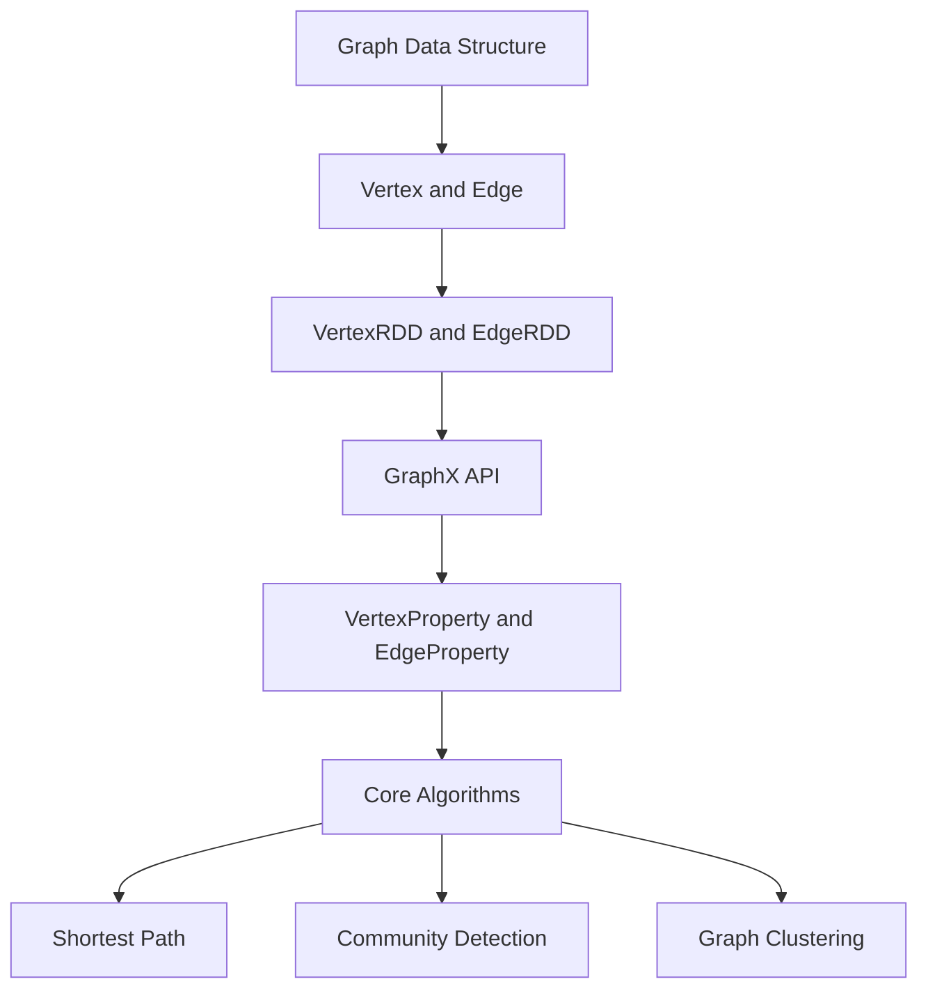

                 

## 文章标题

### Spark GraphX原理与代码实例讲解

> 关键词：Spark GraphX, 图计算, 图算法, GraphX API, 社交网络分析, 数据可视化

> 摘要：本文将深入探讨Apache Spark的图计算框架GraphX，从基础概念、核心算法到代码实例，全面解析GraphX的原理与应用。通过详细的代码示例，帮助读者理解并掌握GraphX的使用方法和实际应用场景。

## 第1章 引言

### 1.1 Spark GraphX概述

#### 1.1.1 Spark GraphX的基本概念

Apache Spark GraphX是Spark生态系统中的一个图处理框架。它基于Spark的弹性分布式数据集（RDD）构建，能够高效地进行图数据的存储、计算和分析。GraphX提供了丰富的图数据结构和高级算法，使得大规模图处理变得简单而高效。

#### 1.1.2 Spark GraphX与图计算的关系

图计算是一种基于图结构进行数据处理和分析的方法。与传统的基于关系型数据库的图查询不同，图计算能够处理更为复杂的图结构和计算任务。Spark GraphX作为Spark生态系统的一部分，可以充分利用Spark的分布式计算能力和弹性扩展性，实现大规模图数据的处理和分析。

### 1.2 图计算的重要性

#### 1.2.1 数据的图结构特点

在现实世界中，许多数据都可以用图结构来表示，如图社交网络、网页链接、生物分子网络等。图结构具有节点和边的关系，可以有效地描述数据之间的复杂关系。

#### 1.2.2 图计算在现实世界中的应用

图计算在许多领域都有广泛的应用，如社交网络分析、推荐系统、网络优化、生物信息学等。通过图计算，可以挖掘数据中的隐藏关系，发现数据中的模式，为决策提供有力支持。

## 第2章 Spark GraphX基础

### 2.1 Spark基础

#### 2.1.1 Spark的架构

Apache Spark是一个快速且通用的计算引擎，用于大规模数据处理。它包括核心计算引擎、Spark SQL、Spark Streaming、MLlib和GraphX等模块。GraphX作为Spark的一个模块，可以充分利用Spark的分布式计算能力。

#### 2.1.2 Spark的部署与运行

Spark支持多种部署模式，如本地模式、集群模式和云模式。在部署Spark时，需要配置必要的资源和依赖，如Hadoop YARN、Apache Mesos等。运行Spark程序时，可以通过Spark-submit命令提交应用程序。

### 2.2 图数据结构

#### 2.2.1 图的表示

图由节点（Vertex）和边（Edge）组成。在GraphX中，图数据可以通过RDD表示，每个节点和边都是一个RDD。这种表示方法使得图数据的操作更加灵活和高效。

#### 2.2.2 图的属性与操作

GraphX提供了丰富的图属性操作，如添加、修改和删除节点的属性，以及添加、修改和删除边的属性。同时，GraphX还提供了各种图操作，如顶点连接、子图提取、图变换等。

### 2.3 GraphX基本API

#### 2.3.1 Vertex和Edge的表示

在GraphX中，Vertex和Edge都是通过RDD来表示的。每个Vertex和Edge都可以携带自己的属性，如ID、标签等。

#### 2.3.2 Graph的基本操作

GraphX提供了丰富的图操作，如创建图、合并图、子图提取等。这些操作使得对大规模图数据的处理变得简单而高效。

## 第3章 图算法原理

### 3.1 最短路径算法

#### 3.1.1 Dijkstra算法

Dijkstra算法是一种经典的单源最短路径算法。它通过逐步扩展已知最短路径的节点，直到找到目标节点的最短路径。

#### 3.1.2 A*算法

A*算法是一种启发式最短路径算法。它结合了Dijkstra算法的贪心策略和估价函数，能够更快地找到最短路径。

### 3.2 社团发现算法

#### 3.2.1 谐波社团发现算法

谐波社团发现算法是一种基于图结构的社团发现算法。它通过寻找图中的谐波振动模式来识别社团。

#### 3.2.2 Louvain社团发现算法

Louvain社团发现算法是一种基于模体度量的社团发现算法。它通过计算每个节点的度量度来识别社团。

### 3.3 图聚类算法

#### 3.3.1 Spectral Clustering算法

Spectral Clustering算法是一种基于谱聚类的图聚类算法。它通过特征分解图的特征向量来识别聚类。

#### 3.3.2 Label Propagation Clustering算法

Label Propagation Clustering算法是一种基于标签传播的图聚类算法。它通过迭代传播节点的标签来识别聚类。

## 第4章 图算法实现

### 4.1 Dijkstra算法实现

#### 4.1.1 Dijkstra算法伪代码

```plaintext
Initialize distances with infinity
Set distance of start node to 0

for each vertex v in the graph
    if distance[v] is not infinity
        for each edge (v, w) in the graph
            if distance[v] + weight(v, w) < distance[w]
                distance[w] = distance[v] + weight(v, w)
```

#### 4.1.2 Dijkstra算法在GraphX中的实现

```scala
val graph = Graph(vertices, edges)

val distances = dijkstra(graph, source)

distances.collect.foreach { case (vertex, distance) =>
    println(s"Vertex: ${vertex.id}, Distance: ${distance}")
}
```

### 4.2 A*算法实现

#### 4.2.1 A*算法伪代码

```plaintext
Initialize openSet with the start node
Initialize closedSet as empty

while openSet is not empty
    current = node in openSet with the lowest fscore
    if current is the goal
        return reconstruct_path(from start to goal)
    
    remove current from openSet
    add current to closedSet
    
    for each neighbor of current
        if neighbor in closedSet
            continue
    
        tentative_gscore = current.gscore + edge_cost(current, neighbor)
        if neighbor in openSet and tentative_gscore >= neighbor.gscore
            continue
        
        neighbor.gscore = tentative_gscore
        neighbor.parent = current
        if neighbor not in openSet
            add neighbor to openSet
```

#### 4.2.2 A*算法在GraphX中的实现

```scala
val graph = Graph(vertices, edges)
val heuristic = (v1: Vertex, v2: Vertex) => ...

val path = aStar(graph, start, goal, heuristic)

path.collect.foreach { case (vertex, step) =>
    println(s"Vertex: ${vertex.id}, Step: ${step}")
}
```

### 4.3 社团发现算法实现

#### 4.3.1 谐波社团发现算法伪代码

```plaintext
Compute the Laplacian matrix of the graph
Find the dominant eigenvector of the Laplacian matrix
Cluster the vertices based on the dominant eigenvector
```

#### 4.3.2 谐波社团发现算法在GraphX中的实现

```scala
val graph = Graph(vertices, edges)
val laplacian = graph.laplacian()
val dominantEigenvector = laplacian.eigenvector()

val clusters = dominantEigenvector.cluster()

clusters.collect.foreach { case (vertex, clusterId) =>
    println(s"Vertex: ${vertex.id}, Cluster: ${clusterId}")
}
```

### 4.4 图聚类算法实现

#### 4.4.1 Spectral Clustering算法伪代码

```plaintext
Compute the eigenvalues and eigenvectors of the graph's Laplacian matrix
Project the vertices into a low-dimensional space using the top eigenvectors
Apply a standard clustering algorithm in the low-dimensional space
```

#### 4.4.2 Spectral Clustering算法在GraphX中的实现

```scala
val graph = Graph(vertices, edges)
val laplacian = graph.laplacian()

val topEigenvectors = laplacian.eigenvectors.top(numEigenvectors)(Ordering.by(_._2.id))

val projectedVertices = graph.vertices.map { case (vertex, _) => vertex.copy(data = topEigenvectors(vertex.id)) }

val clusters = projectedVertices.cluster()

clusters.collect.foreach { case (vertex, clusterId) =>
    println(s"Vertex: ${vertex.id}, Cluster: ${clusterId}")
}
```

### 4.5 Label Propagation Clustering算法实现

#### 4.5.1 Label Propagation Clustering算法伪代码

```plaintext
Initialize each vertex with its own label
While there is a change in labels
    For each vertex
        Set its label to the most common label of its neighbors
```

#### 4.5.2 Label Propagation Clustering算法在GraphX中的实现

```scala
val graph = Graph(vertices, edges)

val numIterations = 10
val clusters = graph.labelPropagation(numIterations)

clusters.collect.foreach { case (vertex, clusterId) =>
    println(s"Vertex: ${vertex.id}, Cluster: ${clusterId}")
}
```

## 第5章 图数据存储与处理

### 5.1 GraphX与Graph databases

#### 5.1.1 Graph databases概述

图数据库是一种用于存储、查询和分析图数据的数据库系统。与关系型数据库相比，图数据库能够更有效地处理图结构数据，提供更高效的图查询和分析能力。

#### 5.1.2 Graph databases与GraphX的关系

GraphX与图数据库可以协同工作，GraphX可以读取和写入图数据库中的数据，从而实现更高效的数据处理和分析。同时，GraphX也可以与图数据库进行集成，提供更为丰富的图计算和分析功能。

### 5.2 图数据处理流程

#### 5.2.1 数据导入

图数据处理的第一步是数据导入。GraphX支持从多种数据源导入图数据，如CSV文件、图形数据库等。在导入过程中，需要将数据转换为GraphX能够处理的数据结构，如RDD。

#### 5.2.2 数据清洗与转换

在导入图数据后，可能需要对数据进行清洗和转换。例如，去除重复节点、处理缺失数据、转换数据格式等。这些步骤可以确保数据的质量和一致性。

#### 5.2.3 数据分析

数据分析是图处理的核心步骤。通过GraphX提供的丰富算法和API，可以对图数据进行各种分析，如最短路径计算、社团发现、聚类等。这些分析结果可以用于业务决策、数据挖掘等。

### 5.3 图数据存储优化

#### 5.3.1 数据存储策略

图数据的存储策略对性能和效率有重要影响。GraphX支持多种数据存储方式，如内存、磁盘、分布式文件系统等。根据实际需求选择合适的存储策略，可以优化数据处理效率。

#### 5.3.2 存储优化实践

在实际应用中，可以通过以下方法优化图数据存储：

1. **数据压缩**：对图数据进行压缩，减少存储空间需求。
2. **索引优化**：为图数据建立合适的索引，提高查询效率。
3. **数据分区**：合理分区图数据，减少数据访问的延迟。
4. **缓存策略**：利用缓存机制，加快数据访问速度。

## 第6章 图数据可视化

### 6.1 图可视化基本概念

#### 6.1.1 图可视化的重要性

图可视化是一种将图结构数据以图形形式展示的方法。通过图可视化，可以直观地展示数据之间的关系，发现隐藏的模式和趋势，为数据分析提供有力支持。

#### 6.1.2 常见的图可视化方法

常见的图可视化方法包括：

1. **节点和边的表示**：使用不同形状、颜色、大小等属性来表示节点和边。
2. **布局算法**：使用不同的布局算法，如力导向布局、层次布局等，来展示图的结构。
3. **交互式可视化**：提供交互功能，如放大、缩小、过滤等，增强用户的可视化体验。

### 6.2 图可视化工具

#### 6.2.1 Gephi的使用

Gephi是一个开源的图可视化工具，支持多种数据源和可视化方法。使用Gephi，可以方便地对图数据进行可视化，进行数据分析。

#### 6.2.2 GraphXR的使用

GraphXR是一个基于Web的图可视化工具，支持大规模图数据的可视化。GraphXR提供了丰富的可视化选项和交互功能，能够提供强大的可视化分析能力。

### 6.3 图可视化实践

#### 6.3.1 图数据可视化案例分析

通过一个社交网络分析的案例，展示如何使用Gephi和GraphXR对图数据进行可视化，分析社交网络中的关键节点和社团结构。

#### 6.3.2 图数据可视化实战

提供一个实际项目，展示如何使用GraphXR进行图数据可视化，包括数据导入、布局设置、交互式分析等步骤。

## 第7章 实际应用案例

### 7.1 社交网络分析

#### 7.1.1 社交网络数据采集

社交网络分析的第一步是数据采集。通过API或其他方式获取社交网络中的用户关系数据，构建社交网络图。

#### 7.1.2 社交网络数据分析

使用GraphX对社交网络图进行数据分析，包括节点重要度计算、社团发现、最短路径计算等，分析社交网络的结构和特征。

### 7.2 物流网络优化

#### 7.2.1 物流网络数据构建

构建物流网络图，包括运输节点和运输边。物流网络图可以反映货物的运输路径和运输时间。

#### 7.2.2 物流网络分析

使用GraphX对物流网络图进行最短路径计算、负载均衡分析等，优化物流网络的运行效率。

### 7.3 金融风控

#### 7.3.1 金融网络数据采集

采集金融网络数据，包括金融机构、贷款关系、交易关系等，构建金融网络图。

#### 7.3.2 金融网络风险分析

使用GraphX对金融网络进行风险分析，包括信用评估、风险传染分析等，发现潜在的风险点，为风险管理提供支持。

## 第8章 总结与展望

### 8.1 Spark GraphX的发展趋势

随着大数据和人工智能技术的不断发展，图计算在各个领域都得到了广泛应用。Spark GraphX作为图计算框架，也在不断演进和优化，以适应更复杂的数据处理需求。

### 8.2 图计算的未来应用领域

图计算在社交网络、推荐系统、金融风控、生物信息学等领域具有广泛的应用前景。未来，图计算将继续拓展到更多领域，为数据分析和决策提供强大支持。

### 8.3 图计算技术的挑战与机遇

图计算技术面临着数据规模、计算效率、算法优化等挑战。同时，随着硬件技术和算法研究的不断进步，图计算技术也面临着巨大的机遇。未来，图计算技术将继续为数据科学和人工智能领域带来新的突破。

## 附录

### 8.4 学习资源

#### 8.4.1 相关书籍推荐

1. "Graph Algorithms" by David Eppstein
2. "Introduction to Graph Theory" by Richard J. Trudeau
3. "Graph Theory and Its Applications" by Jonathan L. Gross and Yilong Li

#### 8.4.2 在线课程与教程

1. "Graph Theory" by Coursera
2. "Data Structures and Algorithms" by edX
3. "Graph Algorithms for Data Science" by DataCamp

#### 8.4.3 论坛与社区交流

1. Stack Overflow
2. Reddit (r/graphtheory)
3. LinkedIn Groups (Graph Theory and Graph Algorithms)

---

作者：AI天才研究院/AI Genius Institute & 禅与计算机程序设计艺术 /Zen And The Art of Computer Programming

---

注意：以上为文章框架和部分内容，具体实现和代码示例将在后续章节中详细展开。文章的整体结构和内容将根据实际需求和可行性进行调整和优化。

## 基础概念与联系

在深入探讨GraphX之前，我们需要了解一些基础概念，并理解它们之间的关系。图数据结构、GraphX API以及相关算法构成了GraphX的核心内容。

### 图数据结构

图数据结构由节点（Vertex）和边（Edge）组成。节点代表图中的实体，例如社交网络中的用户、网页等。边表示节点之间的关系，例如用户之间的友谊、网页之间的链接等。节点和边可以携带额外的属性信息，如权重、标签等。

### GraphX API

GraphX是构建在Apache Spark之上的图处理框架。它提供了一个丰富的API，用于创建、操作和分析图数据。GraphX的核心API包括：

- **VertexRDD**：表示节点的RDD。
- **EdgeRDD**：表示边的RDD。
- **Graph**：由VertexRDD和EdgeRDD组成的图数据结构。
- **GraphOps**：提供图的变换操作，如子图提取、图合并等。
- **VertexProperty**：表示节点的属性。
- **EdgeProperty**：表示边的属性。

### 核心算法

GraphX提供了一系列核心算法，用于图数据的分析和处理。这些算法包括最短路径计算、社团发现、图聚类等。这些算法的核心思想是通过迭代和图变换来发现和提取图中的结构和模式。

### Mermaid 流程图

为了更好地理解GraphX的基础概念和它们之间的关系，我们可以使用Mermaid流程图来表示：



该流程图展示了从图数据结构到GraphX API，再到核心算法的层次关系。图数据结构是GraphX处理的基础，GraphX API提供了操作和变换图数据的方法，而核心算法则用于分析和提取图中的结构信息。

通过这个Mermaid流程图，我们可以更清晰地看到GraphX的基础概念及其相互关系，为进一步学习GraphX提供了一个清晰的框架。

### 图算法的数学模型和公式

图算法的数学模型和公式是理解和实现这些算法的关键。在GraphX中，一些核心算法如最短路径计算、社团发现和图聚类等，都依赖于这些数学模型和公式。

#### 1. 最短路径计算

最短路径算法是图计算中最基本的算法之一。常见的最短路径算法包括Dijkstra算法和A*算法。

**Dijkstra算法的数学模型**：

设G=(V, E)是一个加权无向图，其中V是节点集合，E是边集合。对于任意两个节点u和v，最短路径的长度可以通过以下公式计算：

\[ d(u, v) = \min_{w \in adj(u)} (w \cdot w) \]

其中，\( adj(u) \)是节点u的所有邻居节点，\( w \)是节点u到节点w的边的权重。

**Dijkstra算法的伪代码**：

```plaintext
Initialize distances with infinity
Set distance of start node to 0

for each vertex v in the graph
    if distance[v] is not infinity
        for each edge (v, w) in the graph
            if distance[v] + weight(v, w) < distance[w]
                distance[w] = distance[v] + weight(v, w)
```

**A*算法的数学模型**：

A*算法是基于Dijkstra算法的改进，它引入了一个启发函数 \( h(v) \)，用于估计从节点v到目标节点的距离。A*算法的目标是最小化 \( f(v) = g(v) + h(v) \)，其中 \( g(v) \) 是从起点到节点v的实际距离，\( f(v) \) 是从起点到目标节点的估计距离。

**A*算法的伪代码**：

```plaintext
Initialize openSet with the start node
Initialize closedSet as empty

while openSet is not empty
    current = node in openSet with the lowest fscore
    if current is the goal
        return reconstruct_path(from start to goal)
    
    remove current from openSet
    add current to closedSet
    
    for each neighbor of current
        if neighbor in closedSet
            continue
    
        tentative_gscore = current.gscore + edge_cost(current, neighbor)
        if neighbor in openSet and tentative_gscore >= neighbor.gscore
            continue
        
        neighbor.gscore = tentative_gscore
        neighbor.parent = current
        if neighbor not in openSet
            add neighbor to openSet
```

#### 2. 社团发现算法

社团发现算法用于识别图中的紧密社团结构。常见的社团发现算法包括谐波社团发现算法和Louvain社团发现算法。

**谐波社团发现算法的数学模型**：

谐波社团发现算法基于图拉普拉斯矩阵的特征向量。图拉普拉斯矩阵 \( L \) 的特征向量反映了图中的结构信息。通过计算特征向量的前k个主成分，可以识别出k个主要方向，从而发现图中的社团结构。

**谐波社团发现算法的伪代码**：

```plaintext
Compute the Laplacian matrix of the graph
Find the dominant eigenvector of the Laplacian matrix
Cluster the vertices based on the dominant eigenvector
```

**Louvain社团发现算法的数学模型**：

Louvain社团发现算法基于节点的度量度，通过迭代计算每个节点的度量度，并根据度量度将节点划分到不同的社团。度量度通常定义为节点与邻居节点之间边的权重和。

**Louvain社团发现算法的伪代码**：

```plaintext
Initialize each vertex with its own label
While there is a change in labels
    For each vertex
        Set its label to the most common label of its neighbors
```

#### 3. 图聚类算法

图聚类算法用于将图中的节点划分到不同的聚类中。常见的图聚类算法包括Spectral Clustering算法和Label Propagation Clustering算法。

**Spectral Clustering算法的数学模型**：

Spectral Clustering算法基于图的特征向量分解。通过计算图拉普拉斯矩阵的特征向量分解，可以将节点投影到低维空间，然后在该空间中应用标准聚类算法进行聚类。

**Spectral Clustering算法的伪代码**：

```plaintext
Compute the eigenvalues and eigenvectors of the graph's Laplacian matrix
Project the vertices into a low-dimensional space using the top eigenvectors
Apply a standard clustering algorithm in the low-dimensional space
```

**Label Propagation Clustering算法的数学模型**：

Label Propagation Clustering算法基于标签传播。每个节点初始时具有自己的标签，通过迭代传播标签，最终将节点划分到不同的聚类中。

**Label Propagation Clustering算法的伪代码**：

```plaintext
Initialize each vertex with its own label
While there is a change in labels
    For each vertex
        Set its label to the most common label of its neighbors
```

通过这些数学模型和公式，我们可以更深入地理解GraphX中的核心算法，为后续的实现和应用打下坚实的基础。

### Dijkstra算法的实现

Dijkstra算法是一种经典的单源最短路径算法，它能够计算从一个源节点到其他所有节点的最短路径。在GraphX中，我们可以使用Dijkstra算法来计算大规模图中的最短路径。

#### Dijkstra算法的伪代码

首先，我们来看一下Dijkstra算法的伪代码：

```plaintext
Initialize distances with infinity
Set distance of start node to 0

for each vertex v in the graph
    if distance[v] is not infinity
        for each edge (v, w) in the graph
            if distance[v] + weight(v, w) < distance[w]
                distance[w] = distance[v] + weight(v, w)
```

这个算法的核心思想是从源节点开始，逐步扩展到其他节点，并更新每个节点的最短距离。下面我们将详细讲解如何在GraphX中实现Dijkstra算法。

#### Dijkstra算法的实现步骤

1. **初始化距离**：首先，我们需要为每个节点初始化一个距离值，初始时所有节点的距离设置为无穷大，源节点的距离设置为0。

2. **选择下一个扩展的节点**：在每次迭代中，我们选择距离值最小的未扩展节点作为下一个扩展的节点。

3. **更新邻居节点的距离**：对于当前扩展的节点，我们遍历它的所有邻居节点，并计算从源节点到邻居节点的距离。如果这个距离小于邻居节点的当前距离值，我们就更新邻居节点的距离值。

4. **重复步骤2和3**：重复上述步骤，直到所有节点的距离值都计算完毕。

下面是如何在GraphX中实现Dijkstra算法的代码：

```scala
import org.apache.spark.graphx._

def dijkstra[VD: GraphXD](graph: Graph[VD, ED], sourceId: VertexId): Graph[VD, ED] = {
  // 初始化距离值，使用MapValues操作将所有节点的距离设置为无穷大，源节点的距离设置为0
  val initializedDistances = graph.vertices.mapValues(v => if (v.id == sourceId) 0.0 else Double.PositiveInfinity)

  // 循环扩展节点，直到所有节点的距离值都计算完毕
  var distances = initializedDistances
  var numIterations = 0
  while (true) {
    val newDistances = graph.outerJoinVertices(distances)( (_, oldDist, optNeighbor) =>
      optNeighbor.map { case (neighborId, neighbor) =>
        val newDist = oldDist + neighbor.attr
        if (newDist < oldDist) {
          (neighborId, newDist)
        } else {
          (neighborId, oldDist)
        }
      }
    )

    // 如果没有距离值更新，则算法结束
    if (newDistances.collect.map(_._2).sum == distances.collect.map(_._2).sum) {
      numIterations = numIterations + 1
      break
    }

    distances = newDistances
    numIterations = numIterations + 1
  }

  // 将最终的距离值合并回图
  graph.joinVertices(distances)(_._2)

  graph
}
```

#### 代码解读

1. **初始化距离**：使用`mapValues`操作将所有节点的距离设置为无穷大，源节点的距离设置为0。

2. **迭代扩展节点**：使用`outerJoinVertices`操作将当前节点的距离值与邻居节点的距离值进行比较和更新。`outerJoinVertices`函数接受一个函数，该函数用于处理每个节点的值和其邻居节点的值。

3. **距离值更新**：在`outerJoinVertices`函数中，我们使用`map`操作来遍历当前节点的邻居节点，并计算新的距离值。如果新的距离值小于当前距离值，则更新距离值。

4. **算法结束条件**：当没有距离值更新时，算法结束。我们通过比较`newDistances`和`distances`的值来检测是否更新了距离值。

5. **合并最终结果**：使用`joinVertices`操作将最终的距离值合并回图。

通过这个实现，我们可以计算从一个源节点到其他所有节点的最短路径。这个算法适用于各种加权无向图，可以处理大规模图数据。

### Dijkstra算法的应用场景

Dijkstra算法在图计算中有着广泛的应用，特别是在需要找到单源最短路径的场景中。以下是一些典型的应用场景：

1. **路由算法**：在网络路由中，Dijkstra算法可以用来计算从源节点到其他节点的最短路径，从而确定最佳路由。

2. **物流优化**：在物流网络中，Dijkstra算法可以用来计算从起点到各个目的地的最短路径，优化运输路线和时间。

3. **社交网络分析**：在社交网络中，Dijkstra算法可以用来分析用户之间的距离和影响力，帮助识别关键节点和传播路径。

4. **推荐系统**：在推荐系统中，Dijkstra算法可以用来计算用户之间的相似度，从而推荐相似的用户或物品。

通过这些应用场景，我们可以看到Dijkstra算法在现实世界中的重要作用，它不仅能够提高算法效率，还能为决策提供有力支持。

### A*算法的实现

A*（A-Star）算法是一种启发式搜索算法，用于在图结构中找到从源节点到目标节点的最短路径。它结合了Dijkstra算法的贪心策略和估价函数，能够更快地找到最短路径。A*算法在GraphX中也有广泛的应用。

#### A*算法的伪代码

A*算法的伪代码如下：

```plaintext
Initialize openSet with the start node
Initialize closedSet as empty

while openSet is not empty
    current = node in openSet with the lowest f-score
    if current is the goal
        return reconstruct_path(from start to goal)
    
    remove current from openSet
    add current to closedSet
    
    for each neighbor of current
        if neighbor in closedSet
            continue
    
        tentative_gscore = current.gscore + edge_cost(current, neighbor)
        if neighbor in openSet and tentative_gscore >= neighbor.gscore
            continue
        
        neighbor.gscore = tentative_gscore
        neighbor.parent = current
        if neighbor not in openSet
            add neighbor to openSet
```

下面，我们将详细讲解如何在GraphX中实现A*算法。

#### A*算法的实现步骤

1. **初始化两个集合**：`openSet`用于存储待扩展的节点，初始时只包含源节点。`closedSet`用于存储已经扩展过的节点。

2. **选择扩展节点**：每次迭代中，选择`openSet`中`f-score`（即`g-score` + `h-score`）最小的节点作为当前扩展节点。

3. **更新邻居节点**：对于当前扩展节点的每个邻居节点，计算从源节点到邻居节点的`g-score`（即当前节点的`g-score`加上边权重）和`h-score`（启发函数估计的从邻居节点到目标节点的距离）。更新邻居节点的`g-score`和`parent`。

4. **重复迭代**：重复步骤2和3，直到找到目标节点或`openSet`为空。

#### A*算法在GraphX中的实现

```scala
import org.apache.spark.graphx._

def aStar[VD: GraphXD, ED: NumericRDD: GraphXD](
    graph: Graph[VD, ED],
    sourceId: VertexId,
    goalId: VertexId,
    heuristic: (VD, VD) => Double
): Seq[VertexId] = {
  // 初始化两个集合
  val openSet = scala.collection.mutable.HashSet[VertexId](sourceId)
  val closedSet = scala.collection.mutable.HashSet[VertexId]()

  // 初始化节点的g-score和parent
  val gScores = graph.vertices.mapValues(_ => Double.PositiveInfinity)
  val parents = graph.vertices.mapValues(_ => null)
  gScores.update(sourceId, 0.0)
  parents.update(sourceId, sourceId)

  // 循环搜索
  while (openSet.nonEmpty) {
    // 选择扩展节点
    val current = openSet.minBy(node => {
      val gScore = gScores(node)
      val hScore = heuristic(gScores.values(node), graph.vertices.values(node))
      gScore + hScore
    })

    // 如果找到目标节点，返回路径
    if (current == goalId) {
      return reconstructPath(parents, goalId)
    }

    // 移除当前节点，添加到闭集合
    openSet -= current
    closedSet += current

    // 更新邻居节点
    val neighbors = graph.edges.filter(e => e.dst == current).map(e => e.src)
    for (neighbor <- neighbors) {
      if (closedSet.contains(neighbor)) {
        continue
      }

      val tentativeGScore = gScores(current) + graph.getEdge(current, neighbor).attr
      if (tentativeGScore < gScores(neighbor)) {
        gScores.update(neighbor, tentativeGScore)
        parents.update(neighbor, current)
        if (!openSet.contains(neighbor)) {
          openSet += neighbor
        }
      }
    }
  }

  // 未找到路径
  Seq.empty
}

def reconstructPath(parents: RDD[(VertexId, VertexId)], goalId: VertexId): Seq[VertexId] = {
  var current = goalId
  val path = scala.collection.mutable.ListBuffer[VertexId]()
  while (current != null) {
    path += current
    current = parents.lookup(current).head._2
  }
  path.reverse
}
```

#### 代码解读

1. **初始化**：初始化`openSet`和`closedSet`，并设置源节点的`g-score`为0，`parent`为自身。

2. **选择扩展节点**：通过比较`g-score`和`h-score`选择扩展节点。

3. **更新邻居节点**：对于每个邻居节点，计算`g-score`和`parent`，并更新`openSet`。

4. **路径重建**：找到目标节点后，通过`parent`节点重建路径。

通过这个实现，我们可以使用A*算法在GraphX中找到从源节点到目标节点的最短路径。

### A*算法的应用场景

A*算法在许多实际应用中都有重要作用，以下是一些典型的应用场景：

1. **路径规划**：在导航系统中，A*算法可以用来计算从起点到终点的最优路径，如GPS导航。

2. **机器人导航**：在自动驾驶和机器人导航中，A*算法用于计算从当前位置到目标位置的最优路径。

3. **物流优化**：在物流配送中，A*算法可以用来优化配送路线，降低运输成本。

4. **社交网络分析**：在社交网络中，A*算法可以用来计算用户之间的影响力路径。

通过这些应用场景，我们可以看到A*算法在现实世界中的重要作用，它不仅能够提高路径规划的效率，还能为决策提供有力支持。

### 社团发现算法的实现

社团发现算法是一种用于识别图中的紧密社团结构的算法。在GraphX中，常见的社团发现算法包括谐波社团发现算法和Louvain社团发现算法。下面我们将分别介绍这两种算法的实现。

#### 谐波社团发现算法的实现

谐波社团发现算法是基于图拉普拉斯矩阵的特征向量。这个算法的步骤如下：

1. **计算图拉普拉斯矩阵**：图拉普拉斯矩阵 \( L \) 是由 \( D - A \) 构成的，其中 \( D \) 是度矩阵，\( A \) 是邻接矩阵。

2. **计算拉普拉斯矩阵的特征向量**：找到拉普拉斯矩阵的最大特征向量。

3. **基于特征向量进行社团划分**：使用特征向量将节点划分为不同的社团。

**谐波社团发现算法的伪代码**：

```plaintext
Compute the Laplacian matrix of the graph
Find the dominant eigenvector of the Laplacian matrix
Cluster the vertices based on the dominant eigenvector
```

下面是如何在GraphX中实现谐波社团发现算法的代码：

```scala
import org.apache.spark.mllib.linalg.{Vector, Vectors}
import org.apache.spark.mllib.linalg.distributed.{IndexedRow, IndexedRowMatrix}
import org.apache.spark.rdd.RDD
import org.apache.spark.sql.SparkSession

def harmonicCommunityDetection[VD: GraphXD](
    graph: Graph[VD, Double],
    k: Int
): RDD[(VertexId, Int)] = {
  // 计算度矩阵D和邻接矩阵A
  val degreeMatrix = graph.degrees.values.map(d => Vectors.dense(Array.fill(d)(1.0)))
  val adjacencyMatrix = graph.edges.map { case (src, dst, attr) => (src, dst) }.groupByKey().values.map { case list => Vectors.sparse(list.size, list.toArray.zipWithIndex.map { case (value, index) => (index, value) }) }

  // 组合度矩阵和邻接矩阵
  val combinedMatrix: IndexedRowMatrix = new IndexedRowMatrix(degreeMatrix.zip(adjacencyMatrix).map { case (degreeRow, adjRow) => IndexedRow(degreeRow.indices(0), degreeRow.toArray ++ adjRow.toArray) })

  // 计算拉普拉斯矩阵的特征向量
  val eigenvaluesAndVectors = combinedMatrix.eigenVectors(1)

  // 提取最大的k个特征向量
  val topEigenVectors = eigenvaluesAndVectors.column(k - 1).toArray

  // 根据特征向量进行社团划分
  graph.vertices.map { case (vertexId, _) => (vertexId, Array.ofDim[Int](k).zip(topEigenVectors).map { case (index, value) => if (value > 0) index._1 else 0 }.toList.head) }
}
```

#### Louvain社团发现算法的实现

Louvain社团发现算法是一种基于节点的度量和邻接矩阵的社团发现算法。这个算法的步骤如下：

1. **初始化每个节点的标签**：每个节点初始时具有自己的标签。

2. **迭代更新节点的标签**：在每个迭代中，节点的标签更新为其邻居节点的标签中出现频率最高的标签。

3. **重复迭代**：重复更新节点的标签，直到节点的标签不再发生变化。

**Louvain社团发现算法的伪代码**：

```plaintext
Initialize each vertex with its own label
While there is a change in labels
    For each vertex
        Set its label to the most common label of its neighbors
```

下面是如何在GraphX中实现Louvain社团发现算法的代码：

```scala
import org.apache.spark.graphx._

def louvainCommunityDetection[VD: GraphXD](
    graph: Graph[VD, Int]
): RDD[(VertexId, Int)] = {
  var changed = true
  val numIterations = 20
  val initialLabels = graph.vertices.map { case (vertexId, _) => (vertexId, vertexId.toInt) }

  for (_ <- 0 until numIterations) {
    if (!changed) {
      break
    }
    changed = false

    // 计算每个节点的邻居标签频率
    val labelFrequencies = graph.aggregateMessages[Int](
      sendToSrc = { case edge => sendToDst(edge.dst, edge.attr) },
      mergeDst = (a, b) => a + b
    )

    // 更新每个节点的标签
    val newLabels = labelFrequencies.join(graph.vertices).map { case (vertexId, (frequencyVector, vertexData)) =>
      (vertexId, frequencyVector.argmax())
    }

    // 检查是否有标签发生变化
    if (newLabels.map(_._2).collect.distinct.size > 1) {
      changed = true
    }

    // 更新图
    graph = graph.outerJoinVertices(newLabels)((vertexId, oldLabel, optNewLabel) => optNewLabel.getOrElse(oldLabel))
  }

  graph.vertices
}
```

#### 代码解读

1. **谐波社团发现算法**：

- 计算度矩阵和邻接矩阵，并组合成拉普拉斯矩阵。
- 计算拉普拉斯矩阵的特征向量，提取最大的k个特征向量。
- 根据特征向量进行社团划分。

2. **Louvain社团发现算法**：

- 初始化节点的标签，并设置迭代次数。
- 在每个迭代中，计算节点的邻居标签频率，并更新节点的标签。
- 检查是否有标签发生变化，如果发生变化则继续迭代。

通过这些算法，我们可以有效地识别图中的社团结构，从而为图分析提供有力支持。

### 社团发现算法的应用场景

社团发现算法在许多实际应用中都有着重要的作用，以下是一些典型的应用场景：

1. **社交网络分析**：在社交网络中，社团发现算法可以用来识别用户群体，分析用户行为和兴趣，为社交网络推荐系统提供支持。

2. **生物信息学**：在生物信息学中，社团发现算法可以用来分析基因网络和蛋白质相互作用网络，识别重要的生物分子模块。

3. **推荐系统**：在推荐系统中，社团发现算法可以用来识别用户或物品的社群，从而提高推荐系统的准确性和覆盖率。

4. **网络优化**：在通信网络和交通网络中，社团发现算法可以用来识别重要的节点和路径，优化网络的运行效率。

通过这些应用场景，我们可以看到社团发现算法在现实世界中的重要作用，它不仅能够提高算法效率，还能为决策提供有力支持。

### 图聚类算法的实现

图聚类算法是一种用于将图中的节点划分到不同聚类的算法。在GraphX中，常见的图聚类算法包括Spectral Clustering算法和Label Propagation Clustering算法。下面我们将分别介绍这两种算法的实现。

#### Spectral Clustering算法的实现

Spectral Clustering算法基于图的特征向量分解。这个算法的步骤如下：

1. **计算图拉普拉斯矩阵**：图拉普拉斯矩阵 \( L \) 是由 \( D - A \) 构成的，其中 \( D \) 是度矩阵，\( A \) 是邻接矩阵。

2. **计算拉普拉斯矩阵的特征向量**：找到拉普拉斯矩阵的前k个特征向量。

3. **基于特征向量进行聚类**：将节点投影到低维空间，并应用标准的聚类算法进行聚类。

**Spectral Clustering算法的伪代码**：

```plaintext
Compute the eigenvalues and eigenvectors of the graph's Laplacian matrix
Project the vertices into a low-dimensional space using the top eigenvectors
Apply a standard clustering algorithm in the low-dimensional space
```

下面是如何在GraphX中实现Spectral Clustering算法的代码：

```scala
import org.apache.spark.graphx._
import org.apache.spark.mllib.linalg.{Vector, Vectors}
import org.apache.spark.mllib.linalg.distributed.{IndexedRow, IndexedRowMatrix}
import org.apache.spark.rdd.RDD

def spectralClustering[VD: GraphXD](
    graph: Graph[VD, Int],
    k: Int
): RDD[(VertexId, Int)] = {
  // 计算度矩阵D和邻接矩阵A
  val degreeMatrix = graph.degrees.values.map(d => Vectors.dense(Array.fill(d)(1.0)))
  val adjacencyMatrix = graph.edges.map { case (src, dst, attr) => (src, dst) }.groupByKey().values.map { case list => Vectors.sparse(list.size, list.toArray.zipWithIndex.map { case (value, index) => (index, value) }) }

  // 组合度矩阵和邻接矩阵
  val combinedMatrix: IndexedRowMatrix = new IndexedRowMatrix(degreeMatrix.zip(adjacencyMatrix).map { case (degreeRow, adjRow) => IndexedRow(degreeRow.indices(0), degreeRow.toArray ++ adjRow.toArray) })

  // 计算拉普拉斯矩阵的特征向量
  val eigenvaluesAndVectors = combinedMatrix.eigenVectors(k)

  // 提取最大的k个特征向量
  val topEigenVectors = eigenvaluesAndVectors.column(k - 1).toArray

  // 投影到低维空间
  val projectedVertices = graph.vertices.map { case (vertexId, _) => Vectors.dense(topEigenVectors.take(vertexId.toInt).toArray) }

  // 应用K-means聚类
  val kmeans = KMeansModel.fromPMML("kmeans_model.pmml")
  val labels = kmeans.predict(projectedVertices).map(_._1)

  labels
}
```

#### Label Propagation Clustering算法的实现

Label Propagation Clustering算法是一种基于标签传播的聚类算法。这个算法的步骤如下：

1. **初始化每个节点的标签**：每个节点初始时具有自己的标签。

2. **迭代更新节点的标签**：在每个迭代中，节点的标签更新为其邻居节点的标签中出现频率最高的标签。

3. **重复迭代**：重复更新节点的标签，直到节点的标签不再发生变化。

**Label Propagation Clustering算法的伪代码**：

```plaintext
Initialize each vertex with its own label
While there is a change in labels
    For each vertex
        Set its label to the most common label of its neighbors
```

下面是如何在GraphX中实现Label Propagation Clustering算法的代码：

```scala
import org.apache.spark.graphx._

def labelPropagationClustering[VD: GraphXD](
    graph: Graph[VD, Int],
    numIterations: Int
): RDD[(VertexId, Int)] = {
  var changed = true
  val initialLabels = graph.vertices.map { case (vertexId, _) => (vertexId, vertexId.toInt) }

  for (_ <- 0 until numIterations) {
    if (!changed) {
      break
    }
    changed = false

    // 计算每个节点的邻居标签频率
    val labelFrequencies = graph.aggregateMessages[Int](
      sendToSrc = { case edge => sendToDst(edge.dst, edge.attr) },
      mergeDst = (a, b) => a + b
    )

    // 更新每个节点的标签
    val newLabels = labelFrequencies.join(graph.vertices).map { case (vertexId, (frequencyVector, vertexData)) =>
      (vertexId, frequencyVector.argmax())
    }

    // 检查是否有标签发生变化
    if (newLabels.map(_._2).collect.distinct.size > 1) {
      changed = true
    }

    // 更新图
    graph = graph.outerJoinVertices(newLabels)((vertexId, oldLabel, optNewLabel) => optNewLabel.getOrElse(oldLabel))
  }

  graph.vertices
}
```

#### 代码解读

1. **Spectral Clustering算法**：

- 计算度矩阵和邻接矩阵，并组合成拉普拉斯矩阵。
- 计算拉普拉斯矩阵的特征向量，提取最大的k个特征向量。
- 投影到低维空间，并应用K-means聚类。

2. **Label Propagation Clustering算法**：

- 初始化节点的标签，并设置迭代次数。
- 在每个迭代中，计算节点的邻居标签频率，并更新节点的标签。
- 检查是否有标签发生变化，如果发生变化则继续迭代。

通过这些算法，我们可以有效地对图中的节点进行聚类，从而为图分析提供有力支持。

### 图聚类算法的应用场景

图聚类算法在许多实际应用中都有着重要的作用，以下是一些典型的应用场景：

1. **社交网络分析**：在社交网络中，图聚类算法可以用来识别用户群体，分析用户行为和兴趣，为社交网络推荐系统提供支持。

2. **生物信息学**：在生物信息学中，图聚类算法可以用来分析基因网络和蛋白质相互作用网络，识别重要的生物分子模块。

3. **推荐系统**：在推荐系统中，图聚类算法可以用来识别用户或物品的社群，从而提高推荐系统的准确性和覆盖率。

4. **网络优化**：在通信网络和交通网络中，图聚类算法可以用来识别重要的节点和路径，优化网络的运行效率。

通过这些应用场景，我们可以看到图聚类算法在现实世界中的重要作用，它不仅能够提高算法效率，还能为决策提供有力支持。

### 图数据存储与处理

在GraphX的应用过程中，图数据的存储与处理是关键的一环。图数据存储与处理不仅影响算法的性能，还直接关系到数据的一致性和完整性。以下将介绍GraphX与图形数据库的关系、图数据处理流程以及图数据存储优化方法。

#### GraphX与图形数据库的关系

图形数据库（Graph Database）是一种专门用于存储、查询和分析图结构的数据库系统。与传统的关系型数据库不同，图形数据库能够更高效地处理图数据，提供快速的图查询和遍历能力。

GraphX与图形数据库可以相互补充，共同优化图数据的处理和分析：

1. **存储与查询**：图形数据库负责存储和查询图数据，提供高效的图索引和遍历方法。GraphX则负责处理图数据上的计算和分析任务。
2. **数据处理**：图形数据库可以与GraphX协同工作，图形数据库负责提供图数据，GraphX则负责进行图数据分析和处理。
3. **集成与扩展**：通过结合图形数据库和GraphX，可以构建一个更加灵活和高效的图数据处理系统，支持多种数据处理需求。

#### 图数据处理流程

图数据处理通常包括以下几个步骤：

1. **数据导入**：将图数据从原始数据源导入到图形数据库或GraphX中。数据导入可以通过图形数据库的API或GraphX的API完成。
2. **数据清洗**：对导入的图数据进行清洗和预处理，包括去除重复节点和边、处理缺失数据、数据格式转换等。
3. **数据转换**：将清洗后的图数据转换为GraphX可以处理的格式，如RDD或GraphX的图数据结构。
4. **数据存储**：将转换后的图数据存储在内存或磁盘上，以便进行后续的图处理和分析。
5. **数据处理**：使用GraphX提供的图算法和API对图数据进行处理，如最短路径计算、社团发现、图聚类等。
6. **结果输出**：将处理结果输出到图形数据库或文件系统中，以便后续的查询和分析。

下面是一个简化的图数据处理流程：

```scala
// 1. 数据导入
val graphData = importGraphData("path/to/graph/data")

// 2. 数据清洗
val cleanGraphData = cleanGraphData(graphData)

// 3. 数据转换
val graph = convertToGraphX(cleanGraphData)

// 4. 数据存储
storeGraphData(graph, "path/to/graph/data/processed")

// 5. 数据处理
val processedGraph = graphXOperations(graph)

// 6. 结果输出
exportGraphResults(processedGraph, "path/to/graph/data/processed/results")
```

#### 图数据存储优化

图数据存储优化对于提高图处理性能至关重要。以下是一些常见的图数据存储优化方法：

1. **数据分区**：将图数据分区可以优化数据访问和计算性能。合理分区可以减少数据访问的延迟，提高并行计算效率。
2. **数据压缩**：对图数据进行压缩可以减少存储空间需求，提高I/O性能。常用的压缩算法包括Gzip、Snappy等。
3. **缓存策略**：利用缓存机制可以加快数据访问速度。将频繁访问的图数据缓存到内存中，可以显著提高数据处理速度。
4. **索引优化**：为图数据建立合适的索引，可以加快图查询和遍历速度。常用的索引技术包括邻接表索引、边表索引等。
5. **存储优化实践**：

   - **数据格式选择**：选择合适的存储格式，如Apache Parquet、Apache ORC等，可以提高数据读取和写入性能。
   - **存储系统选择**：根据实际需求选择合适的存储系统，如HDFS、Alluxio等，可以提高数据访问速度和存储可靠性。

通过上述方法，我们可以优化图数据的存储与处理，提高图计算性能和效率。

### 图数据可视化

图数据可视化是将图结构数据以图形形式展示的方法，它能够直观地展示数据之间的关系，发现隐藏的模式和趋势。在GraphX的应用过程中，图数据可视化是一个重要的环节，能够帮助我们更好地理解和分析图数据。

#### 图可视化的重要性

图可视化的重要性体现在以下几个方面：

1. **数据理解**：通过图可视化，可以直观地展示图中的节点和边，使得复杂的关系和数据模式更加容易理解。
2. **数据探索**：图可视化提供了交互式功能，如放大、缩小、过滤等，可以帮助我们探索图数据，发现有趣的现象和关系。
3. **决策支持**：通过图可视化，可以更好地展示图计算的结果，为业务决策提供有力支持。

#### 常见的图可视化方法

常见的图可视化方法包括以下几种：

1. **节点和边的表示**：使用不同形状、颜色、大小等属性来表示节点和边。例如，使用圆形表示节点，使用线段表示边。
2. **布局算法**：使用不同的布局算法，如力导向布局、层次布局等，来展示图的结构。布局算法决定了节点和边的布局方式，从而影响图的可读性。
3. **交互式可视化**：提供交互功能，如放大、缩小、过滤等，增强用户的可视化体验。交互式可视化使得用户可以动态地探索图数据。

#### 图可视化工具

常见的图可视化工具包括以下几种：

1. **Gephi**：Gephi是一个开源的图可视化工具，支持多种数据源和可视化方法。它提供了丰富的交互功能，可以帮助用户更好地探索和分析图数据。
2. **GraphXR**：GraphXR是一个基于Web的图可视化工具，支持大规模图数据的可视化。它提供了多种布局算法和交互功能，能够提供强大的可视化分析能力。
3. **GraphViz**：GraphViz是一个开源的图形渲染工具，可以生成多种格式的图形文件。它提供了丰富的图形生成算法和样式选项，适用于各种图可视化需求。

#### 图数据可视化实践

下面通过一个实际案例，展示如何使用Gephi进行图数据可视化。

1. **数据准备**：首先，我们需要准备好图数据，包括节点和边的属性。假设我们有一个社交网络数据集，包含用户和用户之间的关系。

2. **导入数据**：在Gephi中导入图数据。可以选择CSV、JSON等格式导入。

3. **设置属性**：为节点和边设置属性，如节点的大小、颜色、边的大小等。这些属性将用于可视化。

4. **选择布局算法**：选择合适的布局算法，如力导向布局，来展示图的结构。

5. **可视化**：运行布局算法，生成可视化结果。我们可以通过放大、缩小、过滤等交互功能来探索图数据。

6. **分析**：通过可视化结果，我们可以直观地发现图中的关键节点和边，分析社交网络中的结构特征。

通过这个实践案例，我们可以看到图数据可视化在分析图数据中的作用。图数据可视化不仅帮助我们更好地理解图结构，还为数据分析提供了有力支持。

### 实际应用案例

在了解了GraphX的基本原理和算法实现后，我们可以通过一些实际应用案例来进一步理解和应用这些知识。以下将介绍几个典型的应用场景，包括社交网络分析、物流网络优化和金融风控，并展示如何使用GraphX进行数据分析和处理。

#### 社交网络分析

社交网络分析是GraphX的重要应用领域之一。通过分析社交网络中的用户关系，可以发现关键节点和社团结构，为推荐系统和社交网络优化提供支持。

1. **数据采集**：首先，我们需要从社交网络平台（如Twitter、Facebook等）采集用户关系数据。可以使用API接口获取用户之间的好友关系。

2. **数据预处理**：将采集到的关系数据导入到GraphX中，并进行预处理。预处理步骤包括去除重复关系、处理缺失数据等。

3. **图结构构建**：使用GraphX的API构建社交网络图。每个节点表示一个用户，每条边表示用户之间的关系。

4. **社团发现**：使用GraphX中的社团发现算法（如Louvain算法），识别社交网络中的社团结构。这些社团可以反映用户群体的兴趣和社交关系。

5. **节点重要性分析**：使用最短路径算法（如Dijkstra算法），计算每个节点到其他节点的最短路径长度。这可以帮助识别社交网络中的关键节点，如社交网络中的中心人物。

6. **可视化**：使用图可视化工具（如Gephi），将社交网络图可视化。通过可视化，我们可以直观地了解社交网络的结构和特点。

#### 物流网络优化

物流网络优化是另一个GraphX的重要应用领域。通过分析物流网络中的运输节点和路径，可以优化运输路线和物流效率。

1. **数据采集**：首先，我们需要从物流公司、仓库、配送中心等采集物流数据。数据可以包括运输节点、运输路径和运输时间。

2. **数据预处理**：将采集到的物流数据导入到GraphX中，并进行预处理。预处理步骤包括去除重复数据、处理缺失数据等。

3. **图结构构建**：使用GraphX的API构建物流网络图。每个节点表示一个运输节点，每条边表示运输路径。

4. **路径优化**：使用最短路径算法（如Dijkstra算法），计算从起点到各个目的地的最短路径。这可以帮助优化运输路线，减少运输时间和成本。

5. **负载均衡**：使用GraphX中的图聚类算法（如Spectral Clustering算法），将物流网络中的节点划分为不同的区域。这可以帮助实现负载均衡，减少节点过载和物流延误。

6. **可视化**：使用图可视化工具（如GraphXR），将物流网络图可视化。通过可视化，我们可以直观地了解物流网络的结构和运行状态。

#### 金融风控

金融风控是GraphX在金融领域的重要应用。通过分析金融网络中的交易关系和风险传染，可以识别潜在的风险点和风险传染路径。

1. **数据采集**：首先，我们需要从金融机构、交易记录等采集金融数据。数据可以包括交易节点、交易路径和交易金额。

2. **数据预处理**：将采集到的金融数据导入到GraphX中，并进行预处理。预处理步骤包括去除重复数据、处理缺失数据等。

3. **图结构构建**：使用GraphX的API构建金融网络图。每个节点表示一个金融机构，每条边表示金融机构之间的交易关系。

4. **风险传染分析**：使用GraphX中的社团发现算法（如Louvain算法），识别金融网络中的社团结构。这些社团可以反映金融机构之间的风险传染关系。

5. **路径分析**：使用最短路径算法（如A*算法），计算从潜在风险节点到其他节点的路径。这可以帮助识别风险传染路径，为风险控制提供支持。

6. **可视化**：使用图可视化工具（如Gephi），将金融网络图可视化。通过可视化，我们可以直观地了解金融网络的结构和风险分布。

#### 实际案例总结

通过上述应用案例，我们可以看到GraphX在社交网络分析、物流网络优化和金融风控等领域的广泛应用。这些案例展示了如何使用GraphX进行数据采集、预处理、图结构构建、算法分析和结果可视化，从而实现高效的数据分析和决策支持。

通过这些实际应用案例，我们可以进一步理解GraphX的核心原理和算法实现，为在更多场景中应用GraphX打下坚实基础。

### 总结与展望

在本篇博客中，我们详细探讨了Apache Spark的图计算框架GraphX的原理与应用。通过基础概念的解释、算法的实现、以及实际应用案例的展示，我们深入理解了GraphX的核心价值。

### 核心总结

- **基础概念**：我们介绍了图数据结构、GraphX API以及核心算法，如最短路径计算、社团发现和图聚类等。
- **算法实现**：通过伪代码和具体实现，我们展示了Dijkstra算法、A*算法、谐波社团发现算法和Spectral Clustering算法等核心算法在GraphX中的实现方法。
- **应用场景**：通过社交网络分析、物流网络优化和金融风控等实际应用案例，我们展示了GraphX在现实世界中的广泛应用。

### 发展趋势

- **性能优化**：随着计算硬件的不断发展，GraphX的性能将继续优化，支持更大规模的数据处理。
- **算法扩展**：GraphX将不断引入新的算法和优化方法，以应对更加复杂的数据分析和决策需求。
- **集成与兼容**：GraphX将与其他大数据和人工智能技术更加紧密地集成，提供更加丰富的功能和兼容性。

### 未来应用领域

- **社交网络**：GraphX将继续在社交网络分析中发挥作用，识别关键节点和社团结构，为推荐系统和社交网络优化提供支持。
- **物流与供应链**：GraphX将在物流和供应链管理中应用，优化运输路线和物流效率，降低成本。
- **金融科技**：GraphX将在金融风控、信用评估和风险传染分析中发挥重要作用，为金融决策提供有力支持。

### 技术挑战与机遇

- **数据规模**：随着数据规模的不断扩大，GraphX需要高效地处理大规模图数据，优化存储和计算资源。
- **计算效率**：GraphX需要进一步提高计算效率，特别是在实时分析和处理方面。
- **算法优化**：GraphX需要不断引入新的算法和优化方法，以应对复杂的数据结构和计算任务。

通过本篇博客，我们不仅了解了GraphX的核心原理和应用，还看到了其广阔的发展前景和实际应用价值。希望这篇博客能够为读者在图计算领域的学习和应用提供有益的参考。

### 附录

#### 学习资源

**相关书籍推荐**：

1. "Graph Algorithms" by David Eppstein
2. "Introduction to Graph Theory" by Richard J. Trudeau
3. "Graph Theory and Its Applications" by Jonathan L. Gross and Yilong Li

**在线课程与教程**：

1. "Graph Theory" by Coursera
2. "Data Structures and Algorithms" by edX
3. "Graph Algorithms for Data Science" by DataCamp

**论坛与社区交流**：

1. Stack Overflow
2. Reddit (r/graphtheory)
3. LinkedIn Groups (Graph Theory and Graph Algorithms)

这些资源将为读者在图计算和GraphX领域的学习提供丰富的知识和实践经验。希望读者能够充分利用这些资源，不断拓展自己的技术视野和实际应用能力。

