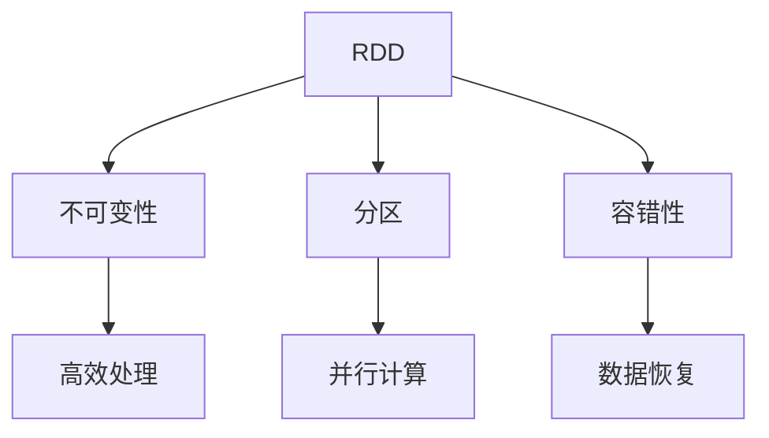

                 

### 文章标题

### Spark RDD原理与代码实例讲解

Spark RDD（Resilient Distributed Dataset）是Apache Spark的核心抽象之一，它提供了丰富的操作接口，使得在大规模数据集上执行复杂的计算变得更加简单和高效。本文旨在通过一步步的分析和实例讲解，帮助读者深入理解Spark RDD的原理及其在实际项目中的应用。

**关键词：** Spark RDD，分布式数据集，弹性，变换操作，持久化，性能优化，实例讲解

**摘要：** 本文将首先介绍Spark RDD的基础概念和结构，接着详细讲解RDD的创建、操作、持久化和并行操作。随后，通过具体的实例，展示如何使用RDD进行数据清洗与预处理、数据分析和数据可视化。最后，我们将探讨Spark RDD在实际应用中的性能优化策略，并通过实际案例深入剖析。

---

## 目录

1. **Spark RDD原理与代码实例讲解**
   1.1. 关键词
   1.2. 摘要

2. **Spark RDD基础**

   2.1. Spark RDD概述

   2.2. RDD创建与操作

   2.3. RDD的持久化

   2.4. RDD的并行操作

3. **Spark RDD实例讲解**

   3.1. 数据清洗与预处理

   3.2. 数据分析

   3.3. 数据可视化

   3.4. Spark RDD性能优化

4. **实际应用案例**

   4.1. 网络爬虫与数据处理

   4.2. 社交网络分析

   4.3. 大数据分析

   4.4. Spark RDD在机器学习中的应用

5. **附录**

   5.1. Spark RDD开发工具与环境配置

   5.2. Spark RDD常用函数和操作符

   5.3. RDD编程实践指导

---

在接下来的内容中，我们将逐步深入探讨Spark RDD的各个核心概念和操作，通过实例代码展示其在实际应用中的强大功能。

---

### Spark RDD基础

#### 2.1 Spark RDD概述

Spark RDD（Resilient Distributed Dataset）是一种在分布式环境中存储大规模数据集的抽象数据结构，具有弹性、容错、并行计算等特点。RDD可以被视为一种不可变的分布式数据集，支持多种类型的操作，包括创建、变换和行动操作。

**核心概念与联系：**

RDD的三个关键特性如下：

1. **不可变性：** RDD中的数据一旦创建，就不能修改。这种设计使得RDD在分布式系统中可以进行高效的数据处理和并行计算。
2. **分区：** RDD被分成多个分区，每个分区存储在集群中的一台机器上。这种设计可以提高数据访问的并行度和计算效率。
3. **容错性：** RDD具有自动恢复数据的能力，当数据分区中的某个节点失败时，可以通过其他节点的副本来恢复数据。

下面是RDD的一个Mermaid流程图，展示了其核心概念和联系：



**应用场景：**

RDD适用于多种场景，包括但不限于：

- 数据清洗和预处理
- 数据分析
- 大数据处理
- 机器学习和图计算

#### 2.2 RDD创建与操作

RDD可以通过多种方式创建，包括从已存在的RDD、Hadoop文件系统、本地文件、Scala集合等。创建RDD后，可以对其进行一系列变换操作，如map、filter、reduce等。

**创建方法：**

```scala
// 从文本文件创建RDD
val rdd = sc.textFile("path/to/file.txt")

// 从Scala集合创建RDD
val list = List(1, 2, 3, 4)
val rdd = sc.parallelize(list)
```

**基本操作：**

- **transformations（变换操作）：** 这些操作生成新的RDD，而不会立即执行计算。常见的变换操作包括：
  - `map`: 对每个元素应用一个函数。
  - `filter`: 选择满足条件的元素。
  - `reduce`: 对元素进行聚合操作。

  ```scala
  val numbers = rdd.map(n => n.toInt)
  val filteredNumbers = numbers.filter(_ % 2 == 0)
  val sum = numbers.reduce(_ + _)
  ```

- **actions（行动操作）：** 这些操作触发计算并将结果返回给驱动程序。常见的行动操作包括：
  - `collect`: 将RDD中的所有元素收集到驱动程序中的数组。
  - `saveAsTextFile`: 将RDD保存为文本文件。
  - `count`: 返回RDD中的元素数量。

  ```scala
  val collectedNumbers = numbers.collect()
  rdd.saveAsTextFile("path/to/output.txt")
  val count = numbers.count()
  ```

**代码实例：**

以下是一个简单的RDD创建和操作的示例：

```scala
val spark = SparkSession.builder.appName("RDDExample").getOrCreate()
val sc = spark.sparkContext

// 创建RDD
val rdd = sc.textFile("path/to/file.txt")

// 变换操作
val words = rdd.flatMap(line => line.split(" "))
val counts = words.map(word => (word, 1)).reduceByKey(_ + _)

// 行动操作
val result = counts.collect()
result.foreach(println)

sc.stop()
```

在这个示例中，我们从文本文件中创建了一个RDD，使用`flatMap`和`map`进行变换操作，最后使用`collect`将结果收集到驱动程序中。

---

在接下来的部分，我们将继续探讨RDD的持久化、并行操作以及实例讲解。通过一步步的分析和代码实例，我们将深入理解Spark RDD的原理和应用。

---

### RDD的持久化

#### 3.1 RDD持久化概念

RDD的持久化是指在分布式内存中保存RDD数据的过程，这样可以在后续的操作中重复使用而不需要重新计算。持久化是Spark中提高性能和优化计算的关键特性之一。通过持久化，Spark可以避免多次读取相同的数据集，从而减少数据传输和计算的开销。

**持久化级别：**

Spark提供了多种持久化级别，每种级别对应不同的内存管理和存储策略。以下是一些常见的持久化级别：

- **Memory：** 数据完全保存在内存中，是最快的持久化级别。
- **MemoryAndDisk：** 当内存不足时，数据会溢出到磁盘。
- **DiskOnly：** 数据仅保存在磁盘上，适用于内存受限的场景。
- **MemoryAndSerialization：** 类似于Memory级别，但数据使用序列化方式进行存储，适用于需要大内存但序列化速度较快的场景。

**代码实例：**

以下是一个简单的持久化示例：

```scala
val spark = SparkSession.builder.appName("RDDPersistenceExample").getOrCreate()
val sc = spark.sparkContext

// 创建RDD
val rdd = sc.textFile("path/to/file.txt")

// 持久化RDD
rdd.persist(StorageLevel.MEMORY_ONLY)

// 进行其他操作
val words = rdd.flatMap(line => line.split(" "))
val counts = words.map(word => (word, 1)).reduceByKey(_ + _)

// 再次使用持久化的RDD
val result = counts.collect()

// 停止Spark
sc.stop()
```

在这个示例中，我们首先创建了一个RDD，然后将其持久化到内存中。在后续的计算中，我们可以直接使用持久化的RDD，而无需重新计算。

#### 3.2 RDD持久化最佳实践

为了确保持久化的效率和稳定性，以下是一些最佳实践：

- **选择合适的持久化级别：** 根据数据的大小和计算需求选择合适的持久化级别。例如，对于小数据集，使用`MEMORY_ONLY`可以提供最快的性能。
- **避免频繁持久化：** 过度持久化会增加内存和磁盘的使用，导致性能下降。只有在必要时才进行持久化。
- **使用持久化变量：** 将RDD持久化后，可以使用持久化变量（如` persistedRDD`）直接引用，而不是每次都重新持久化。
- **监控内存使用：** 在持久化时，需要监控内存使用情况，避免内存溢出导致应用程序失败。

---

在下一部分，我们将探讨RDD的并行操作，展示如何通过分区和Shuffle实现大规模数据的并行处理。

---

### RDD的并行操作

#### 4.1 RDD的分区

分区是将RDD拆分成多个独立的数据集的过程，每个分区存储在集群中的一台机器上。分区对于提高数据处理效率和并行度至关重要。Spark自动为每个RDD分配分区，但我们可以通过设置分区数来控制分区策略。

**分区策略：**

- **自动分区：** Spark根据数据大小和集群配置自动选择合适的分区数。
- **自定义分区：** 通过`repartition`或`coalesce`操作手动设置分区数。

**代码实例：**

以下是一个简单的分区示例：

```scala
val spark = SparkSession.builder.appName("RDDPartitioningExample").getOrCreate()
val sc = spark.sparkContext

// 创建RDD
val rdd = sc.parallelize(Seq(1, 2, 3, 4, 5, 6), 3)

// 打印分区数
println(s"Original partition count: ${rdd.partitions.length}")

// 重新分区
val repartitionedRDD = rdd.repartition(6)

// 打印重新分区后的分区数
println(s"Repartitioned partition count: ${repartitionedRDD.partitions.length}")

sc.stop()
```

在这个示例中，我们首先创建了一个包含6个元素的RDD，并默认分配了3个分区。然后，我们使用`repartition`操作将分区数增加到6个。

#### 4.2 RDD的Shuffle

Shuffle是Spark中的一种重要操作，用于在不同的分区之间交换数据。Shuffle通常在变换操作（如`reduceByKey`、`groupBy`等）和行动操作（如`reduceByKeyAndSaveAsTextFile`等）中使用，以实现跨分区数据聚合。

**Shuffle过程：**

1. **分区：** RDD被分成多个分区，每个分区包含一部分数据。
2. **分组：** 每个分区中的数据根据键（key）进行分组。
3. **数据交换：** 不同分区之间的数据根据键进行交换，实现跨分区数据聚合。
4. **结果生成：** 交换后的数据在各个分区上完成聚合操作，生成最终结果。

**代码实例：**

以下是一个简单的Shuffle示例：

```scala
val spark = SparkSession.builder.appName("RDDShuffleExample").getOrCreate()
val sc = spark.sparkContext

// 创建RDD
val rdd = sc.parallelize(Seq((1, "A"), (2, "B"), (1, "C"), (3, "D")), 3)

// 进行Shuffle操作
val groupedRDD = rdd.groupByKey()

// 打印Shuffle结果
groupedRDD.collect().foreach(println)

sc.stop()
```

在这个示例中，我们创建了一个包含键值对的RDD，并使用`groupByKey`进行Shuffle操作，将具有相同键的数据分组到同一分区中。最后，我们使用`collect`操作将结果收集到驱动程序中。

---

在下一部分，我们将通过具体的实例讲解，展示如何使用Spark RDD进行数据清洗与预处理、数据分析和数据可视化。

---

### Spark RDD实例讲解

#### 5.1 数据清洗与预处理

数据清洗与预处理是数据分析的重要环节，确保数据的质量和一致性。Spark RDD提供了丰富的操作，可以帮助我们高效地处理大数据集。

**实例：数据清洗与预处理案例**

假设我们有一个包含用户购买记录的CSV文件，我们需要对数据进行清洗和预处理，以便后续分析。

```scala
val spark = SparkSession.builder.appName("DataCleaningExample").getOrCreate()
val sc = spark.sparkContext

// 创建RDD
val rdd = sc.textFile("path/to/purchase_records.csv")

// 处理标题行
val header = rdd.first()
val data = rdd.filter(_ != header)

// 处理缺失值
val cleanedData = data.map { line =>
  val fields = line.split(",")
  if (fields.length == 5) {
    fields(0) + "," + fields(1) + "," + fields(2).trim + "," + fields(3).toInt + "," + fields(4).toDouble
  } else {
    "缺失值" + "," + fields(0) + "," + fields(1) + "," + "0" + "," + "0.0"
  }
}

// 处理异常值
val normalizedData = cleanedData.map { line =>
  val fields = line.split(",")
  if (fields(4).toDouble <= 0) {
    fields(0) + "," + fields(1) + "," + fields(2) + "," + fields(3) + "," + "0.0"
  } else {
    line
  }
}

// 保存预处理后的数据
normalizedData.saveAsTextFile("path/to/processed_data.csv")

sc.stop()
```

在这个案例中，我们首先读取CSV文件，处理标题行。然后，我们使用`map`操作填充缺失值，并将异常值设置为0。最后，我们将预处理后的数据保存到新的CSV文件中。

#### 5.2 数据预处理

预处理是数据清洗的延续，旨在将原始数据转换为适合分析的形式。Spark RDD提供了多种操作，如`map`、`filter`、`flatMap`等，可以帮助我们实现复杂的预处理逻辑。

**实例：数据预处理案例**

假设我们需要对用户购买记录进行聚合分析，计算每个用户的总消费金额。

```scala
val spark = SparkSession.builder.appName("DataPreprocessingExample").getOrCreate()
val sc = spark.sparkContext

// 创建RDD
val rdd = sc.textFile("path/to/purchase_records.csv")

// 解析数据并转换为键值对
val parsedData = rdd.map { line =>
  val fields = line.split(",")
  (fields(0), fields(4).toDouble)
}

// 聚合数据
val aggregatedData = parsedData.reduceByKey(_ + _)

// 保存聚合结果
aggregatedData.saveAsTextFile("path/to/aggregated_data.txt")

sc.stop()
```

在这个案例中，我们首先读取CSV文件，使用`map`操作将每行数据解析为键值对。然后，我们使用`reduceByKey`对数据进行聚合，计算每个用户的总消费金额。最后，我们将聚合结果保存到文本文件中。

#### 5.3 数据分析

数据分析是挖掘数据价值的重要环节，通过分析数据，我们可以发现潜在的模式和趋势。Spark RDD提供了丰富的操作，可以帮助我们高效地进行分析。

**实例：数据分析案例**

假设我们需要分析用户的购买行为，计算每个商品的平均价格。

```scala
val spark = SparkSession.builder.appName("DataAnalysisExample").getOrCreate()
val sc = spark.sparkContext

// 创建RDD
val rdd = sc.textFile("path/to/purchase_records.csv")

// 解析数据并转换为键值对
val parsedData = rdd.map { line =>
  val fields = line.split(",")
  (fields(2), fields(4).toDouble)
}

// 计算平均价格
val averagePrices = parsedData.map { case (item, price) => (item, price) }.reduceByKey(_ / 2)

// 保存平均价格结果
averagePrices.saveAsTextFile("path/to/average_prices.txt")

sc.stop()
```

在这个案例中，我们首先读取CSV文件，使用`map`操作将每行数据解析为键值对。然后，我们使用`reduceByKey`计算每个商品的平均价格。最后，我们将平均价格结果保存到文本文件中。

---

在下一部分，我们将探讨如何使用Spark RDD进行数据可视化，展示数据背后的模式和趋势。

---

### 数据可视化

数据可视化是将数据以图形化的形式展示出来，帮助我们直观地理解和分析数据。Spark RDD结合了常用的可视化库，可以轻松实现数据可视化。

#### 6.1 数据可视化基本概念

数据可视化包括以下几个基本概念：

- **图表类型：** 常见的图表类型包括折线图、柱状图、饼图等，每种图表类型适用于不同的数据展示需求。
- **数据映射：** 将数据集中的属性映射到图表的坐标轴、颜色等元素，以直观地展示数据。
- **交互性：** 通过交互性增强数据可视化的用户体验，例如，放大、缩小、点击等操作。

#### 6.2 常用可视化库介绍

在Spark中，常用的可视化库包括：

- **PySpark：** 使用Python编写，结合Matplotlib等库实现数据可视化。
- **Spark UI：** Spark自带的可视化界面，可以实时查看RDD的执行情况。

#### 6.3 数据可视化案例

以下是一个简单的数据可视化案例，使用PySpark将用户购买记录可视化。

```python
from pyspark.sql import SparkSession
import matplotlib.pyplot as plt

# 创建SparkSession
spark = SparkSession.builder.appName("DataVisualizationExample").getOrCreate()

# 读取CSV文件
df = spark.read.csv("path/to/purchase_records.csv", header=True)

# 数据预处理
df = df.dropna()

# 可视化：柱状图展示每个用户的购买次数
df.groupBy("User").count().plot(kind="bar", x="User", y="count")

# 显示图表
plt.show()

# 关闭SparkSession
spark.stop()
```

在这个案例中，我们首先读取CSV文件，并进行预处理。然后，我们使用`groupBy`和`count`操作计算每个用户的购买次数。最后，我们使用柱状图展示数据。

---

在下一部分，我们将深入探讨Spark RDD在实际应用中的性能优化策略。

---

### Spark RDD性能优化

性能优化是提高Spark RDD处理效率的关键环节。通过合理的优化策略，我们可以充分发挥Spark RDD的分布式计算优势，提高数据处理速度。

#### 8.1 RDD性能优化概述

RDD性能优化主要包括以下几个方面：

- **数据倾斜处理：** 倾斜数据会导致计算负载不均衡，影响性能。我们需要识别并解决数据倾斜问题。
- **内存管理：** 合理分配内存，避免内存溢出和垃圾回收延迟。
- **Shuffle优化：** 优化Shuffle操作，减少数据传输和重组的开销。
- **缓存和持久化：** 合理使用缓存和持久化，减少重复计算和数据加载时间。

#### 8.2 数据倾斜问题及解决方法

数据倾斜是指数据分布不均匀，导致某些分区计算负载过高，影响整体性能。以下是一些常见的数据倾斜问题及解决方法：

- **解决方法1：重分区**
  通过增加分区数，可以改善数据倾斜问题。例如，使用`repartition`操作重新分配数据。

  ```scala
  rdd.repartition(10)
  ```

- **解决方法2：采样和分箱**
  通过采样和分箱技术，将倾斜数据分散到多个分区中。例如，使用`sampleByKey`和`groupByKey`操作。

  ```scala
  rdd.sampleByKey(false, 0.1).groupByKey()
  ```

- **解决方法3：使用聚合函数**
  通过使用聚合函数（如`reduceByKey`、`aggregateByKey`），将倾斜数据在本地节点进行聚合，减少跨节点传输。

  ```scala
  rdd.reduceByKey(_ + _)
  ```

#### 8.3 Spark RDD性能优化案例

以下是一个简单的性能优化案例，通过优化Shuffle操作提高数据处理速度。

```scala
val spark = SparkSession.builder.appName("RDDPerformanceOptimizationExample").getOrCreate()
val sc = spark.sparkContext

// 创建RDD
val rdd = sc.parallelize(Seq((1, "A"), (2, "B"), (1, "C"), (3, "D")), 3)

// 进行Shuffle操作
val shuffledRDD = rdd.partitionBy(new HashPartitioner(2))

// 计算平均价格
val averagePrices = shuffledRDD.map { case (item, price) => (item, price) }.reduceByKey(_ / 2)

// 保存结果
averagePrices.saveAsTextFile("path/to/optimized_data.txt")

sc.stop()
```

在这个案例中，我们首先创建了一个RDD，并使用`partitionBy`操作进行Shuffle。然后，我们使用`reduceByKey`计算每个商品的平均价格。最后，我们将优化后的结果保存到文本文件中。

---

在下一部分，我们将通过实际应用案例，展示Spark RDD在各个领域的应用场景。

---

### 实际应用案例

Spark RDD强大的分布式计算能力和丰富的操作接口，使其在各种实际应用场景中得到了广泛应用。以下是一些典型的应用案例。

#### 9.1 网络爬虫与数据处理

网络爬虫是一个从互联网抓取信息的自动化程序。Spark RDD可以帮助我们高效地处理大规模的网络爬虫数据。

**实例：网络爬虫与数据处理案例**

假设我们需要从多个网页中抓取信息，并对抓取到的数据进行处理和存储。

```scala
val spark = SparkSession.builder.appName("WebCrawlerExample").getOrCreate()
val sc = spark.sparkContext

// 创建RDD
val rdd = sc.parallelize(Seq("http://example.com/page1", "http://example.com/page2", "http://example.com/page3"))

// 定义爬虫函数
def crawl(url: String): Seq[String] = {
  // 使用爬虫库抓取网页内容
  val content = getWebPageContent(url)
  // 提取网页中的链接
  val links = extractLinks(content)
  // 提取网页中的数据
  val data = extractData(content)
  data ++ links
}

// 爬取网页并处理数据
val processedData = rdd.flatMap(crawl)

// 保存处理后的数据
processedData.saveAsTextFile("path/to/processed_data.txt")

sc.stop()
```

在这个案例中，我们首先创建了一个包含网页链接的RDD，然后使用自定义的爬虫函数进行爬取和处理。最后，我们将处理后的数据保存到文本文件中。

#### 9.2 社交网络分析

社交网络分析是一种基于社交网络数据的研究方法，可以帮助我们了解用户行为、社交关系和社区结构。

**实例：社交网络分析案例**

假设我们需要分析一个社交网络，计算每个用户的度数（degree）和介数（betweenness）。

```scala
val spark = SparkSession.builder.appName("SocialNetworkAnalysisExample").getOrCreate()
val sc = spark.sparkContext

// 创建RDD
val edges = sc.parallelize(Seq(
  ("User1", "User2"),
  ("User1", "User3"),
  ("User2", "User4"),
  ("User3", "User4"),
  ("User3", "User5")
))

// 构建图
val graph = Graphedges.toGraphX(edges)

// 计算度数和介数
val degrees = graph.vertices.mapValues(_.degree)
val betweenness = graph.betweennessCentrality()

// 保存结果
degrees.saveAsTextFile("path/to/degrees.txt")
betweenness.saveAsTextFile("path/to/betweenness.txt")

sc.stop()
```

在这个案例中，我们首先创建了一个包含社交网络边的RDD，并使用`toGraphX`操作将其转换为图。然后，我们使用`mapValues`计算每个用户的度数，使用`betweennessCentrality`计算介数。最后，我们将结果保存到文本文件中。

#### 9.3 大数据分析

大数据分析是一种处理和分析大规模数据的方法，可以帮助我们从海量数据中提取有价值的信息。

**实例：大数据分析案例**

假设我们需要分析用户购买记录，计算每个商品的销售量和平均价格。

```scala
val spark = SparkSession.builder.appName("BigDataAnalysisExample").getOrCreate()
val sc = spark.sparkContext

// 创建RDD
val purchases = sc.parallelize(Seq(
  ("Product1", "User1", 100),
  ("Product2", "User2", 200),
  ("Product1", "User3", 300),
  ("Product2", "User4", 400),
  ("Product1", "User5", 500)
))

// 解析数据并聚合
val aggregatedPurchases = purchases.groupByKey().map { case (product, purchases) =>
  (product, purchases.size, purchases.sum / purchases.size)
}

// 保存结果
aggregatedPurchases.saveAsTextFile("path/to/aggregated_purchases.txt")

sc.stop()
```

在这个案例中，我们首先创建了一个包含用户购买记录的RDD，并使用`groupByKey`进行聚合。然后，我们使用`map`计算每个商品的销售量和平均价格。最后，我们将结果保存到文本文件中。

---

通过这些实际应用案例，我们可以看到Spark RDD在数据处理、社交网络分析、大数据分析等领域的强大能力。在下一部分，我们将探讨Spark RDD在机器学习中的应用。

---

### Spark RDD在机器学习中的应用

Spark RDD不仅适用于数据处理和分析，还在机器学习领域发挥了重要作用。Spark MLlib是Spark的机器学习库，提供了丰富的机器学习算法和模型，可以与RDD无缝集成。通过RDD，我们可以高效地处理大规模机器学习数据集。

#### 12.1 Spark MLlib简介

Spark MLlib提供了以下几类主要的机器学习算法：

- **分类算法：** 包括逻辑回归、随机森林、支持向量机等。
- **回归算法：** 包括线性回归、岭回归等。
- **聚类算法：** 包括K-means、层次聚类等。
- **降维算法：** 包括主成分分析、奇异值分解等。
- **协同过滤：** 包括矩阵分解、基于模型的协同过滤等。

#### 12.2 机器学习算法与RDD

Spark MLlib中的算法通常与RDD集成，通过变换操作（如`map`、`filter`、`reduceByKey`等）处理数据。以下是一个简单的机器学习案例：

**实例：基于RDD的线性回归**

```scala
import org.apache.spark.mllib.regression.LinearRegressionModel
import org.apache.spark.mllib.regression.LinearRegressionWithSGD

val spark = SparkSession.builder.appName("MachineLearningExample").getOrCreate()
import spark.implicits._

// 创建RDD
val data = sc.parallelize(Seq(
  (1.0, 1.1),
  (2.0, 2.2),
  (3.0, 3.3),
  (4.0, 4.4),
  (5.0, 5.5)
))

// 转换为LabeledPoint格式
val labeledData = data.map { case (x, y) => LabeledPoint(x, y.toDouble) }

// 训练线性回归模型
val numIterations = 10
val model = LinearRegressionWithSGD.train(labeledData, numIterations)

// 计算均方误差
val meanSquaredError = labeledData.map { point =>
  val prediction = model.predict(point.label)
  math.pow(prediction - point.features.toArray(0), 2)
}.mean()

println(s"Model mean squared error: $meanSquaredError")

sc.stop()
```

在这个案例中，我们首先创建了一个包含特征和标签的RDD，并转换为LabeledPoint格式。然后，我们使用线性回归算法训练模型，并计算均方误差。

#### 12.3 Spark RDD在机器学习中的应用案例

**实例：基于RDD的协同过滤**

协同过滤是一种常用的推荐系统算法，可以预测用户可能喜欢的物品。以下是一个简单的协同过滤案例：

```scala
import org.apache.spark.mllib.recommendation.MatrixFactorizationModel
import org.apache.spark.mllib.recommendation.MatrixFactorization
import org.apache.spark.mllib.linalg.Vectors

val spark = SparkSession.builder.appName("CollaborativeFilteringExample").getOrCreate()
import spark.implicits._

// 创建RDD
val ratings = sc.parallelize(Seq(
  (1, 1, 5.0),
  (1, 2, 3.0),
  (1, 3, 4.0),
  (2, 1, 2.0),
  (2, 2, 3.0),
  (2, 3, 4.0)
))

// 转换为RDD[Rating]
val ratingsRDD = ratings.map { case (user, product, rating) => Rating(user, product, rating) }

// 训练矩阵分解模型
val rank = 2
val numIterations = 5
val model = MatrixFactorization.train(ratingsRDD, rank, numIterations)

// 预测用户2喜欢的产品3的评分
val predictedRating = model.predict(2, 3)
println(s"Predicted rating: $predictedRating")

sc.stop()
```

在这个案例中，我们首先创建了一个包含用户、产品、评分的RDD，并转换为Rating格式。然后，我们使用矩阵分解算法训练模型，并预测用户2喜欢的产品3的评分。

---

通过这些实例，我们可以看到Spark RDD在机器学习中的应用，展示了其在大规模数据处理和机器学习任务中的强大能力。

---

### 附录

#### 附录A: Spark RDD开发工具与环境配置

A.1 Spark安装与配置

1. **安装Java：** Spark依赖于Java，请确保安装了Java 8或更高版本。
2. **下载Spark：** 访问Spark官网（https://spark.apache.org/）下载Spark发行版。
3. **解压安装：** 将下载的Spark包解压到合适的目录。
4. **配置环境变量：** 设置`SPARK_HOME`和`PATH`环境变量，使Spark命令可以在终端中使用。

A.2 RDD开发工具介绍

1. **PySpark：** 使用Python进行Spark开发，结合Pandas等库实现数据处理和分析。
2. **Spark Shell：** Spark自带的交互式Shell，可以方便地进行RDD操作。

A.3 常用调试工具

1. **Spark UI：** Spark自带的Web界面，可以实时查看RDD的执行情况。
2. **log4j：** 日志框架，用于记录Spark应用程序的运行日志。

---

#### 附录B: Spark RDD常用函数和操作符

B.1 基本函数和操作符

- `map`: 对每个元素应用一个函数。
- `filter`: 选择满足条件的元素。
- `flatMap`: 对每个元素应用一个函数，并将结果扁平化。
- `reduce`: 对元素进行聚合操作。
- `reduceByKey`: 对相同键的元素进行聚合操作。
- `groupByKey`: 对相同键的元素进行分组。

B.2 高级函数和操作符

- `cache`: 将RDD持久化到内存。
- `persist`: 将RDD持久化到内存或磁盘。
- `coalesce`: 将RDD重新分区，减少分区数。
- `repartition`: 将RDD重新分区，增加分区数。
- `take`: 返回RDD的前N个元素。

B.3 函数和操作符详解

以下是Spark RDD常用函数和操作符的详细解释和示例：

- `map`: 对每个元素应用一个函数。

  ```scala
  val rdd = sc.parallelize(Seq(1, 2, 3, 4))
  val mappedRDD = rdd.map(x => x * 2)
  ```

- `filter`: 选择满足条件的元素。

  ```scala
  val rdd = sc.parallelize(Seq(1, 2, 3, 4))
  val filteredRDD = rdd.filter(_ % 2 == 0)
  ```

- `flatMap`: 对每个元素应用一个函数，并将结果扁平化。

  ```scala
  val rdd = sc.parallelize(Seq("apple", "banana", "cherry"))
  val flatMappedRDD = rdd.flatMap(word => word.split(""))
  ```

- `reduce`: 对元素进行聚合操作。

  ```scala
  val rdd = sc.parallelize(Seq(1, 2, 3, 4))
  val reducedRDD = rdd.reduce(_ + _)
  ```

- `reduceByKey`: 对相同键的元素进行聚合操作。

  ```scala
  val rdd = sc.parallelize(Seq((1, 1), (1, 2), (2, 2)))
  val reducedByKeyRDD = rdd.reduceByKey(_ + _)
  ```

- `groupByKey`: 对相同键的元素进行分组。

  ```scala
  val rdd = sc.parallelize(Seq((1, 1), (1, 2), (2, 2)))
  val groupedRDD = rdd.groupByKey()
  ```

- `cache`: 将RDD持久化到内存。

  ```scala
  val rdd = sc.parallelize(Seq(1, 2, 3, 4))
  rdd.cache()
  ```

- `persist`: 将RDD持久化到内存或磁盘。

  ```scala
  val rdd = sc.parallelize(Seq(1, 2, 3, 4))
  rdd.persist(StorageLevel.MEMORY_ONLY)
  ```

- `coalesce`: 将RDD重新分区，减少分区数。

  ```scala
  val rdd = sc.parallelize(Seq(1, 2, 3, 4), 4)
  val coalescedRDD = rdd.coalesce(2)
  ```

- `repartition`: 将RDD重新分区，增加分区数。

  ```scala
  val rdd = sc.parallelize(Seq(1, 2, 3, 4), 4)
  val repartitionedRDD = rdd.repartition(8)
  ```

- `take`: 返回RDD的前N个元素。

  ```scala
  val rdd = sc.parallelize(Seq(1, 2, 3, 4))
  val takenRDD = rdd.take(2)
  ```

---

通过这些函数和操作符，我们可以灵活地操作RDD，实现复杂的分布式数据处理任务。

---

#### 附录C: RDD编程实践指导

C.1 RDD编程最佳实践

1. **避免多次重复计算：** 尽量重用已创建的RDD，避免重复计算。
2. **合理选择持久化级别：** 根据数据大小和计算需求选择合适的持久化级别。
3. **优化Shuffle操作：** 减少Shuffle操作的次数，优化数据分布。

C.2 RDD编程常见问题

1. **数据倾斜问题：** 导致计算负载不均，影响性能。解决方案包括重分区、采样和分箱、使用聚合函数等。
2. **内存溢出问题：** 导致程序崩溃。解决方案包括合理分配内存、优化数据结构、减少内存占用等。

C.3 RDD编程实践案例

以下是一个简单的RDD编程实践案例，展示如何处理数据倾斜和内存溢出问题。

```scala
val spark = SparkSession.builder.appName("RDDProgrammingExample").getOrCreate()
val sc = spark.sparkContext

// 创建RDD
val rdd = sc.parallelize(Seq((1, "A"), (2, "B"), (1, "C"), (3, "D")), 3)

// 解决数据倾斜问题
val repartitionedRDD = rdd.repartition(6)

// 处理内存溢出问题
val cachedRDD = repartitionedRDD.cache()

// 计算结果
val result = cachedRDD.map { case (key, value) => (key, value.length) }.reduceByKey(_ + _)

// 保存结果
result.saveAsTextFile("path/to/output.txt")

sc.stop()
```

在这个案例中，我们首先解决数据倾斜问题，通过重新分区将倾斜数据分散到更多分区中。然后，我们使用`cache`操作将RDD持久化到内存，避免重复计算。最后，我们计算结果并保存到文本文件中。

---

通过这些实践指导，我们可以更好地编写高效、可靠的Spark RDD应用程序。

---

### 作者信息

**作者：** AI天才研究院/AI Genius Institute & 禅与计算机程序设计艺术 /Zen And The Art of Computer Programming

在这篇技术博客中，我们通过一步步的分析和实例讲解，深入探讨了Spark RDD的原理、操作、持久化、并行操作以及在实际应用中的性能优化策略。从数据清洗与预处理到数据分析、数据可视化，再到机器学习应用，Spark RDD展示了其在大规模数据处理中的强大能力。希望本文能够帮助读者更好地理解和应用Spark RDD，在实际项目中取得更好的成果。

在后续的博客中，我们将继续探讨更多关于Spark、大数据处理和机器学习的深入话题，敬请期待。如果您有任何问题或建议，欢迎在评论区留言，让我们共同进步。再次感谢您的阅读，祝您在技术道路上不断前行！

---

通过本文的详细讲解，我们不仅理解了Spark RDD的核心概念和操作，还通过实例展示了其在实际应用中的强大功能。在接下来的博客中，我们将继续探索更多关于Spark、大数据处理和机器学习的深入话题。无论是数据科学家、程序员还是对技术充满热情的学习者，都欢迎继续关注，让我们一同在技术的海洋中探索、成长。感谢您的支持，我们下期再见！

