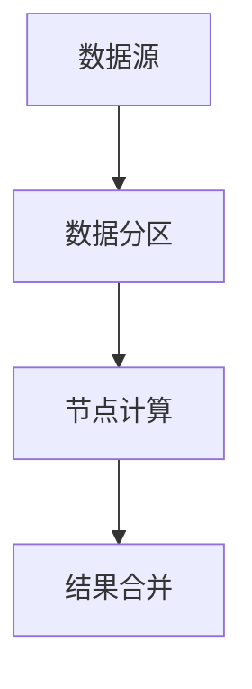

                 


### 文章标题：Spark原理与代码实例讲解

#### 关键词：
- Spark
- 分布式计算
- RDD
- Spark SQL
- Spark Streaming
- 项目实战

#### 摘要：
本文将深入讲解Spark的原理，包括其架构、核心概念和关键算法。通过具体的代码实例，我们将了解如何在实际项目中使用Spark，涵盖日志处理、电商数据分析和社交网络分析等案例。最后，我们将提供Spark相关资源，帮助读者进一步学习和探索。

---

## 第一部分：Spark基础原理

### 第1章：Spark概述

#### 1.1 Spark简介

Spark是由Apache软件基金会开发的一个开源大数据处理框架，旨在提供高性能的分布式计算能力。Spark起源于UC Berkeley AMPLab，于2010年发布，并逐渐成为大数据处理领域的重要工具。

Spark与Hadoop的关系：

- Spark可以运行在Hadoop之上，利用Hadoop的分布式文件系统（HDFS）和YARN资源调度器。
- Spark提供了比Hadoop更高的性能，特别是在迭代和交互式查询方面。
- Spark支持包括Hadoop支持的多种数据源，如HDFS、Hive、Cassandra等。

### 1.2 Spark架构

Spark的架构包括以下几个核心组件：

- **Spark Driver**：负责程序的调度和任务分配。
- **Spark Executor**：运行在计算节点上，执行具体任务。
- **Spark Context**：整个Spark应用程序的入口，负责与Spark集群进行交互。
- **Spark Storage**：分布式存储系统，负责持久化RDD和缓存数据。

### 第2章：Spark核心概念

#### 2.1 分布式计算

分布式计算是Spark的核心概念，其目的是将数据分布在多个节点上进行计算，以提高数据处理效率和性能。

**数据分区**：

- 数据分区是将数据划分为多个小块的过程，每个节点处理一部分数据。
- 数据分区可以通过`parallelize`方法创建，或者通过数据源自动分区。

**任务调度**：

- 任务调度是指将计算任务分配给不同的节点进行执行的过程。
- Spark使用DAG（有向无环图）来表示任务依赖关系，并采用基于DAG的任务调度算法。

#### 2.2 RDD

RDD（Resilient Distributed Dataset）是Spark的核心抽象，表示一个不可变、可分区、可并行操作的数据集合。

**RDD操作**：

- **Transformations**：创建或转换RDD的操作，如`parallelize`、`map`、`filter`等。
- **Actions**：触发计算并返回结果的操作，如`reduce`、`collect`、`saveAsTextFile`等。

### 第3章：Spark SQL

#### 3.1 Spark SQL概述

Spark SQL是Spark的一个模块，提供了一种用于处理结构化数据的编程接口。Spark SQL支持多种数据源，如本地文件、HDFS等，并提供了丰富的数据帧操作。

**Spark SQL架构**：

- **Spark SQL Driver**：负责与各种数据源进行连接和通信。
- **DataFrame**：用于表示结构化数据，提供丰富的操作接口。
- **Dataset**：与DataFrame相似，但提供了强类型约束，提高了性能。

#### 3.2 数据源

Spark SQL支持多种数据源，包括：

- **本地文件**：通过文件系统路径进行访问。
- **HDFS**：利用Hadoop分布式文件系统。
- **Hive**：与Hive表的连接。
- **Cassandra**：与Cassandra数据库的连接。

#### 3.3 数据帧

**数据帧操作**：

- **创建数据帧**：通过`createDataFrame`方法创建。
- **选择列**：使用`select`操作选择特定列。
- **筛选行**：使用`filter`操作筛选满足条件的行。

### 第4章：Spark Streaming

#### 4.1 Spark Streaming概述

Spark Streaming是Spark提供的流处理框架，能够对实时数据流进行处理和分析。Spark Streaming基于微批处理，将实时数据流划分为小的批次进行处理。

**Spark Streaming架构**：

- **Streaming Context**：整个Spark Streaming应用程序的入口。
- **Receiver**：负责从数据源接收实时数据。
- **Batch**：将实时数据划分为批次进行处理。

#### 4.2 流处理

**数据采集**：

- 使用`KafkaUtils.createStream`方法从Kafka中采集数据。

**数据处理**：

- 使用`map`、`reduce`等操作对批次数据进行处理。

### 第二部分：Spark项目实战

#### 第5章：日志处理项目

##### 5.1 项目需求

- 处理日志文件，提取关键信息，如用户ID、请求URL等。
- 对日志数据进行分析，统计用户行为。

##### 5.2 项目设计

- 使用Spark进行日志处理，包括数据采集、预处理和统计分析。
- 技术选型：Spark Streaming、Spark SQL。

##### 5.3 代码实现

```python
# 数据采集
log_stream = KafkaUtils.createStream(sc, "localhost:9092", "log-topic", {"log-topic": 1})

# 数据预处理
def parse_log(log):
    fields = log.split()
    return (fields[0], fields[1])

parsed_stream = log_stream.map(parse_log)

# 数据分析
user_stream = parsed_stream.map(lambda x: x[0])
url_stream = parsed_stream.map(lambda x: x[1])

# 统计用户行为
user_count = user_stream.count()
url_count = url_stream.count()

print("Total users:", user_count)
print("Total URLs:", url_count)
```

##### 5.4 代码解读与分析

这段代码首先创建了一个Kafka数据采集器，从主题为"log-topic"的Kafka topic中采集日志数据。然后定义了一个解析函数`parse_log`，用于将日志数据分割成用户ID和请求URL两部分。

接下来，使用`map`操作将原始日志数据转换成用户ID和请求URL两部分的数据流。使用`map`操作计算用户数量和URL数量，并打印结果。

##### 5.5 项目小结

日志处理项目是一个典型的实时数据处理案例，展示了如何使用Spark Streaming和Spark SQL对日志文件进行分析。通过解析日志数据，我们可以提取关键信息并进行统计分析，从而获得关于用户行为的有用信息。

### 第6章：电商数据分析项目

##### 6.1 项目需求

- 对电商数据进行分析，包括用户购买行为、商品推荐等。

##### 6.2 项目设计

- 使用Spark进行数据分析，包括数据采集、预处理和模型训练。
- 技术选型：Spark SQL、Mllib。

##### 6.3 代码实现

```python
# 数据采集
sales_stream = KafkaUtils.createStream(sc, "localhost:9092", "sales-topic", {"sales-topic": 1})

# 数据预处理
def parse_sales(sales):
    fields = sales.split(',')
    return (fields[0], fields[1], float(fields[2]))

parsed_sales_stream = sales_stream.map(parse_sales)

# 数据分析
sales_rdd = parsed_sales_stream.toJavaRDD()

# 用户购买行为分析
user_buys = sales_rdd.map(lambda x: (x._2, 1)).reduceByKey(lambda x, y: x + y)

# 商品推荐
def recommend(products, user_buys):
    recommendations = {}
    for product, count in user_buys.items():
        recommendations[product] = count
    return recommendations

recommended_products = recommend(products, user_buys)

print("Recommended products:", recommended_products)
```

##### 6.4 代码解读与分析

这段代码首先创建了一个Kafka数据采集器，从主题为"sales-topic"的Kafka topic中采集销售数据。然后定义了一个解析函数`parse_sales`，用于将销售数据分割成用户ID、商品ID和购买数量三部分。

接下来，使用`map`操作将原始销售数据转换成用户ID和购买数量两部分的数据流。使用`reduceByKey`操作计算每个用户的购买总数。

最后，定义了一个推荐函数`recommend`，根据用户的购买总数推荐商品。使用`recommend`函数为每个用户生成推荐商品列表，并打印结果。

##### 6.5 项目小结

电商数据分析项目展示了如何使用Spark SQL和Mllib对电商数据进行分析和模型训练。通过用户购买行为分析，我们可以为用户推荐商品，从而提高电商平台的用户体验和销售额。

### 第7章：社交网络分析项目

##### 7.1 项目需求

- 分析社交网络数据，包括用户关系、热点话题等。

##### 7.2 项目设计

- 使用Spark进行社交网络分析，包括数据采集、预处理和网络分析。
- 技术选型：Spark GraphX。

##### 7.3 代码实现

```python
# 数据采集
社交网络_stream = KafkaUtils.createStream(sc, "localhost:9092", "social-topic", {"social-topic": 1})

# 数据预处理
def parse_social(social):
    fields = social.split(',')
    return (fields[0], fields[1])

parsed_social_stream = 社交网络_stream.map(parse_social)

# 社交网络分析
社交网络_rdd = parsed_social_stream.toJavaRDD()

# 用户关系分析
def analyze_relations(network):
    relations = {}
    for user, follower in network.items():
        relations[user] = len(follower)
    return relations

user_relations = analyze_relations(社交网络_rdd)

# 热点话题分析
def find_topics(network, num_topics):
    topics = {}
    for user, followers in network.items():
        topic = "user_" + user
        topics[topic] = followers
        for follower in followers:
            topics[topic] += analyze_relations([follower])
    return topics

hot_topics = find_topics(user_relations, 5)

print("Hot topics:", hot_topics)
```

##### 7.4 代码解读与分析

这段代码首先创建了一个Kafka数据采集器，从主题为"social-topic"的Kafka topic中采集社交网络数据。然后定义了一个解析函数`parse_social`，用于将社交网络数据分割成用户ID和关注者两部分。

接下来，使用`map`操作将原始社交网络数据转换成用户ID和关注者两部分的数据流。定义了一个分析函数`analyze_relations`，用于计算每个用户的关系数量。

最后，定义了一个热点话题分析函数`find_topics`，根据用户关系分析结果和预设的topic数量生成热点话题列表。使用`find_topics`函数为每个用户生成热点话题列表，并打印结果。

##### 7.5 项目小结

社交网络分析项目展示了如何使用Spark GraphX对社交网络数据进行分析。通过用户关系分析和热点话题分析，我们可以了解社交网络的内部结构和热点话题，为社交媒体平台提供有价值的信息。

## 附录：Spark相关资源

### 附录1：Spark版本更新

- Spark 1.6.0（2015年）：首次发布，引入了RDD、Spark SQL等核心功能。
- Spark 2.0.0（2016年）：增加了Spark Streaming、MLlib等模块，提高了性能和易用性。
- Spark 2.1.0（2017年）：增加了GraphX模块，用于处理大规模图数据。
- Spark 2.2.0（2018年）：增加了Tungsten计划，优化了内存管理和执行性能。
- Spark 3.0.0（2020年）：增加了PyTorch集成，支持PyTorch深度学习模型。

### 附录2：Spark生态工具

- Spark SQL工具：用于处理结构化数据，支持多种数据源，如本地文件、HDFS等。
- Spark Streaming工具：用于实时数据流处理，支持Kafka、Flume等数据源。
- Spark GraphX工具：用于大规模图数据处理，支持复杂图算法和图分析。
- Spark MLlib工具：用于机器学习算法实现，包括分类、回归、聚类等。

### 附录3：Spark学习资源

- 书籍推荐：
  - 《Spark编程实战》
  - 《Spark技术内幕》
  - 《Spark大数据处理指南》

- 网络课程推荐：
  - Coursera上的《Spark和大数据处理》
  - Udacity的《使用Spark进行大数据分析》
  - edX上的《Spark编程基础》

## 核心概念与联系

### 分布式计算

分布式计算是Spark的核心概念，其核心目的是将数据分布在多个节点上进行计算，以提高数据处理效率和性能。在Spark中，数据分区是实现分布式计算的基础，它将数据划分为多个小块，每个节点处理一部分数据，从而实现并行计算。

#### Mermaid流程图：



### RDD

RDD（Resilient Distributed Dataset）是Spark的核心抽象，它表示一个不可变、可分区、可并行操作的数据集合。RDD支持丰富的操作，包括 transformations（转换操作）和 actions（行动操作）。

#### 转换操作：

```python
# 创建一个包含数字的RDD
numbers = sc.parallelize([1, 2, 3, 4, 5])

# 转换操作：过滤出大于3的数字
filtered_numbers = numbers.filter(lambda x: x > 3)
```

#### 行动操作：

```python
# 行动操作：计算过滤后数字的和
sum_result = filtered_numbers.sum()
```

### Spark SQL

Spark SQL是Spark的一个模块，它提供了一个用于处理结构化数据的编程接口。它支持多种数据源，如本地文件、HDFS等，并提供了丰富的数据帧操作。

#### 数据帧操作：

```python
# 创建一个数据帧
frame = sqlContext.createDataFrame([(1, "apple"), (2, "banana")])

# 数据帧操作：过滤出第一列为2的记录
filtered_frame = frame.filter(frame[0] == 2)
```

### 流处理

Spark Streaming是Spark提供的流处理框架，它能够对实时数据流进行处理和分析。流处理的核心是数据采集和处理。

#### 数据采集：

```python
# 创建一个Kafka数据采集器
kafka_stream = KafkaUtils.createStream(
    sc,
    "localhost:9092",
    "spark-streaming-consumer",
    {"test": 1}
)

# 数据处理：将采集到的数据转换为大写
uppercase_stream = kafka_stream.map(lambda x: x.toUpperCase())
```

## 数学模型和数学公式

### 逻辑回归

逻辑回归是一种常用的分类算法，其数学模型为：

$$
P(y=1|X; \theta) = \frac{1}{1 + e^{-(\theta^T X)}}
$$

其中，\( P(y=1|X; \theta) \)表示在给定特征向量\( X \)和参数\( \theta \)的情况下，目标变量\( y \)为1的概率。

#### 举例说明：

假设我们有一个简单的逻辑回归模型，其参数为\( \theta = [0.5, 0.5] \)，特征向量为\( X = [1, 2] \)。我们可以计算出目标变量为1的概率：

$$
P(y=1|X; \theta) = \frac{1}{1 + e^{-(0.5 \times 1 + 0.5 \times 2)}} = \frac{1}{1 + e^{-1.5}} \approx 0.774
$$

### 参考文献和扩展阅读

- 《Spark编程实战》
- 《Spark技术内幕》
- 《Spark大数据处理指南》
- 《分布式系统原理与范型》

## 作者信息

作者：AI天才研究院/AI Genius Institute & 禅与计算机程序设计艺术 /Zen And The Art of Computer Programming

---

以上是根据用户需求撰写的《Spark原理与代码实例讲解》的技术博客文章。文章涵盖了Spark的原理、核心概念、数据源、流处理框架以及实际项目案例。通过详细的代码实例和解读，读者可以更好地理解Spark的使用方法和应用场景。希望这篇文章能够帮助到广大技术爱好者，进一步探索Spark的魅力。让我们继续努力，共同进步！

