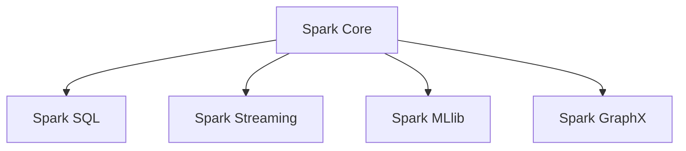

                 

### 文章标题：Spark大数据实时计算框架

### 关键词：Spark、大数据、实时计算、流处理、机器学习、性能优化

### 摘要：
本文将深入探讨Spark大数据实时计算框架，从历史背景、架构设计到核心API，全面解析Spark在大数据领域的应用。文章将首先介绍Spark的起源和发展历程，阐述其核心理念与主要应用领域。接着，我们将详细分析Spark的架构和执行模型，讲解其配置与部署方法。随后，文章将聚焦于Spark的核心编程模型、算法和流处理能力，深入探讨其内存管理和Shuffle算法原理。最后，我们将结合实战案例，展示Spark在实际项目中的应用，并总结Spark性能优化策略和未来发展展望。

### 目录大纲：
1. Spark简介与架构
    1.1 Spark概述
    1.2 Spark架构
    1.3 Spark配置与部署
2. Spark核心API
    2.1 Spark编程模型
    2.2 Spark核心算法
    2.3 Spark流处理
    2.4 Spark机器学习
3. Spark高级应用
    3.1 Spark与大数据生态集成
    3.2 Spark性能优化
    3.3 Spark项目实战
4. 附录
    4.1 Spark常用工具与库
    4.2 Spark参考资料与拓展阅读
5. 参考文献

## 第一部分：Spark简介与架构

### 第1章：Spark概述

#### 1.1 Spark的历史与背景

Spark是由Apache软件基金会开发的一个开源大数据处理框架，其设计目标是提供一种简单、快速且通用的大数据处理解决方案。Spark起源于2009年，由美国的加州大学伯克利分校（University of California, Berkeley）的AMPLab（Algorithms, Machines, and People Laboratory）团队创建。该团队的主要目标是通过创新算法和系统设计，提升大数据处理效率和性能。

Spark最初是在2008年作为加州大学伯克利分校的博士论文项目开始开发的。其初衷是为了解决传统大数据处理框架（如MapReduce）在迭代和交互式查询方面性能不足的问题。通过引入内存计算和弹性分布式数据集（RDD）的概念，Spark显著提高了数据处理速度和灵活性。

2010年，Spark首次公开发布，并迅速引起了业界关注。2013年，Spark被Apache软件基金会接纳为孵化项目，并于2014年成为Apache顶级项目。自那时以来，Spark得到了广泛的社区支持和持续发展，逐渐成为大数据处理领域的重要工具之一。

#### 1.2 Spark的核心理念

Spark的核心理念可以归纳为以下几点：

1. **高性能**：Spark通过引入内存计算和分布式数据集，显著提高了数据处理速度。与传统的MapReduce相比，Spark在大规模数据集上的计算性能提升了数十倍甚至更高。

2. **易用性**：Spark提供了丰富的API，包括Scala、Java、Python和R语言接口，使得开发者可以轻松地使用Spark进行编程。Spark的编程模型简单且直观，降低了学习成本。

3. **灵活性**：Spark支持多种数据处理场景，包括批处理、交互式查询、流处理和机器学习等。用户可以根据不同需求选择合适的编程模型和工具。

4. **可靠性**：Spark具有高可用性和容错性。它可以通过数据分区和任务重试等技术，确保数据处理的可靠性和一致性。

5. **扩展性**：Spark易于扩展和定制。用户可以根据实际需求，自定义Spark的组件和算法，以实现特定的数据处理需求。

#### 1.3 Spark的应用领域

Spark在多个领域得到了广泛应用，以下是其中一些主要的应用场景：

1. **数据仓库**：Spark可以替代传统的数据仓库工具，提供更快的数据查询和分析能力。它支持SQL查询、数据转换和数据分析等操作，适用于企业级数据仓库应用。

2. **实时流处理**：Spark Streaming模块提供了实时数据处理能力，适用于实时数据监控、实时推荐系统和实时事件处理等场景。

3. **机器学习**：Spark MLlib库提供了丰富的机器学习算法和工具，支持回归、分类、聚类和推荐系统等任务。它适用于大数据机器学习和数据挖掘应用。

4. **图计算**：Spark GraphX模块提供了图处理和图计算能力，适用于社交网络分析、推荐系统和网络分析等应用。

5. **日志分析**：Spark广泛应用于日志分析领域，用于处理和分析大量日志数据，支持实时日志监控、错误诊断和性能优化等任务。

### 总结

Spark作为一款高性能、易用、灵活的大数据处理框架，已经在各个领域得到了广泛应用。其核心理念和独特优势使其成为大数据处理领域的重要工具之一。在下一章中，我们将详细分析Spark的架构和组件，帮助读者更好地理解Spark的工作原理和内部结构。

## 第2章：Spark架构

#### 2.1 Spark的核心组件

Spark的核心组件主要包括Spark Core、Spark SQL、Spark Streaming和Spark MLlib。这些组件共同构成了Spark强大而灵活的大数据处理生态系统。

1. **Spark Core**：Spark Core是Spark的核心模块，提供了基本的分布式计算功能，包括内存计算、任务调度、数据分区和容错机制等。它是Spark其他组件的基础，支持Spark的分布式数据集（RDD）和基本的编程模型。

2. **Spark SQL**：Spark SQL是Spark的SQL查询引擎，提供了类似关系数据库的查询能力。它支持结构化数据存储（如Parquet和ORC格式）和分布式SQL查询，使得用户可以方便地对大数据集进行查询和分析。

3. **Spark Streaming**：Spark Streaming模块提供了实时数据处理能力，支持流处理和实时事件处理。它通过Spark Core提供的分布式计算框架，实现了高吞吐量和低延迟的流数据处理。

4. **Spark MLlib**：Spark MLlib是Spark的机器学习库，提供了多种机器学习算法和工具，包括回归、分类、聚类和推荐系统等。它支持分布式机器学习，适用于大规模数据集的机器学习和数据分析。

#### 2.2 Spark执行模型

Spark的执行模型基于弹性分布式数据集（RDD），它是Spark的核心数据结构。RDD具有以下几个主要特点：

1. **分布式数据集**：RDD是一个不可变的、可分区的大数据集，分布在多个节点上。它可以看作是分布式内存中的数据集合，支持并行计算和分布式处理。

2. **弹性**：RDD具有弹性，可以在数据丢失或节点故障时自动恢复。它通过记录数据依赖关系和任务执行记录，实现了任务的重新计算和节点失败恢复。

3. **转换操作**：RDD支持多种转换操作，如map、filter、reduceByKey等。这些操作在执行时，会生成新的RDD，并保留数据依赖关系，便于后续数据处理。

4. **行动操作**：行动操作（如count、saveAsTextFile等）会触发RDD的计算和执行。它们会触发依赖的转换操作，并生成最终结果。

Spark执行模型的基本原理可以概括为以下几个步骤：

1. **创建RDD**：通过读取文件、序列化对象或创建数据集等方式，生成初始RDD。

2. **应用转换操作**：对RDD进行一系列转换操作，生成新的RDD，并记录数据依赖关系。

3. **触发行动操作**：触发行动操作，触发依赖的转换操作执行，并生成最终结果。

4. **任务调度与执行**：Spark调度器根据数据依赖关系和资源情况，生成执行任务，并在集群中执行。

5. **容错恢复**：在执行过程中，Spark会记录任务执行记录和依赖关系，并在节点故障时自动恢复。

#### 2.3 Spark依赖管理

Spark依赖管理是确保Spark应用程序能够正确运行的重要环节。Spark通过依赖管理机制，自动下载和解析所需依赖库，确保应用程序的运行环境一致。

Spark依赖管理主要涉及以下方面：

1. **Maven依赖**：Spark支持Maven依赖管理，开发者可以在项目的pom.xml文件中添加Spark的依赖库。Maven会自动下载和解析所需的依赖库，并构建应用程序。

2. **SBT依赖**：对于Scala项目，Spark支持SBT（Simple Build Tool）依赖管理。开发者可以在项目的build.sbt文件中添加Spark的依赖库，SBT会自动下载和解析依赖库。

3. **依赖传递**：Spark依赖管理支持依赖传递，即应用程序可以继承依赖库的依赖关系。这有助于简化依赖管理，确保应用程序在不同环境下的运行一致性。

4. **本地依赖**：对于开发环境，Spark支持本地依赖管理。开发者可以将依赖库安装到本地Maven仓库或SBT仓库中，确保开发环境的依赖一致性。

#### 总结

Spark的架构设计科学、灵活，通过核心组件和执行模型，实现了高效、可靠的大数据处理。其依赖管理机制简化了开发过程，确保了应用程序的一致性和可移植性。在下一章中，我们将详细讲解Spark的配置与部署，帮助读者了解如何在实际环境中使用Spark。

### 第3章：Spark配置与部署

#### 3.1 Spark配置详解

Spark的配置是确保应用程序能够正确运行的关键步骤。合理的配置可以提高性能、稳定性和可扩展性。以下是一些常见的Spark配置参数：

1. **集群配置**：
   - `spark.master`：指定Spark运行模式，如`local`（本地模式）、`yarn`（YARN模式）或`mesos`（Mesos模式）。
   - `spark.app.name`：指定Spark应用程序名称，用于在集群中标识应用程序。
   - `spark.executor.instances`：指定Executor实例数，默认为2。
   - `spark.executor.memory`：指定每个Executor的内存大小，默认为1GB。
   - `spark.driver.memory`：指定Driver程序的内存大小，默认为1GB。

2. **数据存储配置**：
   - `spark.local.dir`：指定本地文件系统的临时目录，用于存储中间数据和日志文件。
   - `spark.temp.storage.size`：指定临时存储空间大小，默认为1GB。
   - `spark.sql.shuffle.filesize`：指定每个Shuffle操作生成的文件大小，默认为128MB。

3. **内存管理配置**：
   - `spark.memory.fraction`：指定内存中可用于存储RDD的分数，默认为0.6。
   - `spark.memory.storage.fraction`：指定内存中可用于存储缓存数据的分数，默认为0.4。
   - `spark.memory.storage.target.fraction`：指定缓存数据目标大小，默认为0.4。

4. **网络配置**：
   - `spark.rpc.num.dispatcher threads`：指定RPC调用的线程数，默认为2。
   - `spark.rpc.ping.interval`：指定心跳检测间隔时间，默认为10秒。

5. **执行优化配置**：
   - `spark.sql.autoBroadcastJoinThreshold`：指定自动广播Join的最小表大小，默认为10MB。
   - `spark.sql.shuffle.partitions`：指定Shuffle操作的分区数，默认根据数据大小自动调整。

#### 3.2 Spark集群部署

部署Spark集群可以分为单机部署和分布式部署。以下分别介绍这两种部署方式：

1. **单机部署**：
   - **环境准备**：安装Java环境和Spark包。
   - **启动Spark**：通过命令`spark-shell`或`spark-submit`启动Spark应用程序。
     ```bash
     # 启动Spark Shell
     spark-shell --master local[*]
     
     # 提交应用程序
     spark-submit --master local[*] your-app.jar
     ```

2. **分布式部署**：
   - **环境准备**：安装Java环境、Hadoop和Spark包。
   - **配置Hadoop**：配置Hadoop的`hdfs-site.xml`和`core-site.xml`文件。
   - **启动Hadoop集群**：启动Hadoop的NameNode和DataNode。
     ```bash
     start-dfs.sh
     ```

   - **启动Spark**：配置Spark的`spark-env.sh`文件，设置`SPARK_MASTER_HOST`和`SPARK_MASTER_PORT`，然后启动Spark集群。
     ```bash
     start-master.sh
     start-slaves.sh
     ```

   - **提交应用程序**：通过命令`spark-submit`提交Spark应用程序到集群。
     ```bash
     spark-submit --master spark://master-host:7077 your-app.jar
     ```

#### 3.3 Spark集群管理

Spark集群管理是确保集群稳定运行和资源合理利用的重要任务。以下是一些常见的Spark集群管理操作：

1. **监控集群**：使用Spark UI监控集群状态，包括Executor、Task和Shuffle操作等信息。
   ```bash
   spark-submit --master spark://master-host:7077 your-app.jar
   ```
   在浏览器中访问`http://master-host:4040`，查看Spark UI。

2. **停止集群**：停止Spark集群，包括Master和Slave节点。
   ```bash
   stop-master.sh
   stop-slaves.sh
   ```

3. **资源调整**：根据集群负载情况，调整Executor数量、内存大小等参数，以优化资源利用率。
   ```bash
   spark-submit --master spark://master-host:7077 your-app.jar --executor-memory 4g --num-executors 4
   ```

4. **日志分析**：分析Spark日志文件，诊断和解决运行时问题。
   ```bash
   cat /path/to/spark-logs/*.log
   ```

#### 总结

合理的配置和部署是确保Spark应用程序成功运行的关键。通过掌握Spark配置参数和集群部署方法，开发者可以更好地利用Spark的强大功能，实现高效的大数据处理。在下一章中，我们将详细介绍Spark的核心API，帮助读者了解如何使用Spark进行编程和数据处理。

## 第4章：Spark核心API

### 第4章：Spark核心API

#### 4.1 Spark编程模型

Spark提供了多种编程模型，包括RDD、DataFrame和Dataset，每种模型都有其独特的特点和适用场景。以下是对这三种编程模型的详细讲解。

##### 4.1.1 RDD编程模型

RDD（Resilient Distributed Dataset）是Spark的核心抽象，它是一个不可变、可分区的大数据集，具有容错性和位置感知性。RDD支持多种操作，包括创建、转换（如map、filter、reduceByKey）和行动（如count、saveAsTextFile）。

1. **创建RDD**：可以通过读取文件、序列化对象或创建并行集合等方式创建RDD。
   ```scala
   val lines = sc.textFile("hdfs://path/to/file.txt")
   ```

2. **转换操作**：转换操作生成新的RDD，并保留数据依赖关系。
   ```scala
   val words = lines.flatMap(line => line.split(" "))
   ```

3. **行动操作**：行动操作触发RDD的计算和执行，并生成最终结果。
   ```scala
   words.count()
   ```

##### 4.1.2 DataFrame编程模型

DataFrame是Spark SQL的核心抽象，它是一个结构化的数据集，具有名称和列信息。DataFrame支持SQL操作和分布式计算，适用于大数据查询和分析。

1. **创建DataFrame**：可以通过读取文件、注册Parquet或ORC格式文件等方式创建DataFrame。
   ```scala
   val df = spark.read.json("hdfs://path/to/json_file.json")
   ```

2. **转换操作**：DataFrame支持SQL-like操作，如select、filter、groupBy等。
   ```scala
   val filteredDf = df.filter($"age" > 30)
   ```

3. **行动操作**：行动操作将DataFrame转换为RDD，并触发计算。
   ```scala
   filteredDf.select($"name", $"age").show()
   ```

##### 4.1.3 Dataset编程模型

Dataset是Spark 2.0引入的新的编程模型，它结合了RDD和DataFrame的特点，提供了类型安全性和编译时检查。Dataset可以看作是强类型的DataFrame。

1. **创建Dataset**：可以通过读取文件、注册Parquet或ORC格式文件等方式创建Dataset。
   ```scala
   val dataset = spark.read.json[User]("hdfs://path/to/json_file.json")
   ```

2. **转换操作**：Dataset支持SQL-like操作，如select、filter、groupBy等。
   ```scala
   val filteredDataset = dataset.filter($"age" > 30)
   ```

3. **行动操作**：行动操作将Dataset转换为RDD，并触发计算。
   ```scala
   filteredDataset.select($"name", $"age").show()
   ```

##### 总结

Spark的编程模型提供了多种选择，用户可以根据实际需求选择合适的模型。RDD适用于复杂的分布式数据处理，DataFrame适用于结构化数据查询和分析，而Dataset则提供了类型安全性和编译时检查。在下一章中，我们将深入探讨Spark的核心算法和流处理能力。

#### 4.2 Spark核心算法

Spark MLlib是一个分布式机器学习库，提供了多种机器学习算法和工具。以下是一些常见的Spark MLlib核心算法及其应用场景。

##### 4.2.1 回归算法

回归算法用于预测数值型目标变量。Spark MLlib提供了线性回归和岭回归算法。

1. **线性回归**：线性回归是一种简单的回归算法，通过拟合线性模型来预测目标变量。
   ```scala
   val trainingData = ...
   val testData = ...
   val linearRegression = LinearRegression()
   linearRegression.fit(trainingData)
   val model = linearRegression.bestFit
   val predictions = model.transform(testData)
   ```

2. **岭回归**：岭回归通过加入正则化项，改善了线性回归模型的泛化能力。
   ```scala
   val ridgeRegression = RidgeRegression()
   ridgeRegression.fit(trainingData)
   val model = ridgeRegression.bestFit
   val predictions = model.transform(testData)
   ```

##### 4.2.2 分类算法

分类算法用于将数据分为多个类别。Spark MLlib提供了逻辑回归、朴素贝叶斯、随机森林和决策树等分类算法。

1. **逻辑回归**：逻辑回归是一种简单的分类算法，通过拟合逻辑回归模型来预测类别。
   ```scala
   val logisticRegression = LogisticRegression()
   logisticRegression.fit(trainingData)
   val model = logisticRegression.bestFit
   val predictions = model.transform(testData)
   ```

2. **朴素贝叶斯**：朴素贝叶斯是一种基于贝叶斯定理的分类算法，适用于特征独立假设。
   ```scala
   val naiveBayes = NaiveBayes()
   naiveBayes.fit(trainingData)
   val model = naiveBayes.bestFit
   val predictions = model.transform(testData)
   ```

##### 4.2.3 聚类算法

聚类算法用于将数据划分为多个簇。Spark MLlib提供了K-means、层次聚类和DBSCAN等聚类算法。

1. **K-means**：K-means是一种基于距离度量的聚类算法，通过最小化簇内距离平方和来划分簇。
   ```scala
   val kmeans = KMeans()
   kmeans.setK(3)
   kmeans.fit(trainingData)
   val model = kmeans.bestFit
   val predictions = model.predict(testData)
   ```

2. **层次聚类**：层次聚类是一种基于层次结构的聚类算法，通过逐步合并或分裂簇来划分簇。
   ```scala
   val hierarchicalClustering = HierarchicalClustering()
   hierarchicalClustering.setK(3)
   hierarchicalClustering.fit(trainingData)
   val model = hierarchicalClustering.bestFit
   val predictions = model.predict(testData)
   ```

##### 总结

Spark MLlib提供了丰富的机器学习算法，适用于各种数据分析和预测任务。通过合理选择和使用这些算法，可以有效地处理大规模数据集，实现智能数据分析。在下一章中，我们将深入探讨Spark的流处理能力，了解其实时数据处理优势。

### 第4章：Spark核心API

#### 4.3 Spark SQL编程模型

Spark SQL是Spark的核心组件之一，提供了一个分布式SQL查询引擎，支持结构化数据存储和分布式计算。Spark SQL使得用户能够以SQL的方式处理大规模数据集，从而简化了大数据处理的复杂性。

##### 4.3.1 Spark SQL概述

Spark SQL的主要特点包括：

- **结构化数据存储**：支持多种结构化数据存储格式，如Parquet、ORC、JSON、Avro等。
- **SQL查询支持**：提供SQL查询功能，支持各种SQL操作，如SELECT、JOIN、GROUP BY等。
- **数据处理**：支持分布式数据处理，提供高效的计算性能。
- **集成Hive**：Spark SQL与Hive兼容，可以执行Hive SQL查询，并且可以将Spark SQL查询结果写入Hive表。

##### 4.3.2 Spark SQL编程

1. **创建DataFrame**

   DataFrame是Spark SQL中的核心数据结构，表示一个结构化的数据集。可以通过读取文件、连接数据库或创建并行集合等方式创建DataFrame。

   ```scala
   val df = spark.read.json("hdfs://path/to/json_file.json")
   ```

2. **SQL查询**

   Spark SQL支持SQL-like查询，可以使用SQL语法对DataFrame进行操作。

   ```scala
   df.createOrReplaceTempView("users")
   val results = spark.sql("SELECT name, age FROM users WHERE age > 30")
   results.show()
   ```

3. **DataFrame操作**

   DataFrame支持各种操作，如过滤、投影、聚合等。

   ```scala
   val filteredDf = df.filter($"age" > 30)
   val projectedDf = df.select($"name", $"age")
   val aggregatedDf = df.groupBy($"age").count()
   ```

4. **分布式计算**

   Spark SQL使用Spark的分布式计算框架进行数据计算，支持大规模数据的并行处理。

   ```scala
   val df = spark.range(0, 100000)
   val aggregatedDf = df.groupBy($"id").sum($"value")
   aggregatedDf.write.format("parquet").save("hdfs://path/to/output")
   ```

##### 4.3.3 Spark SQL与Hive集成

Spark SQL与Hive紧密集成，可以执行Hive SQL查询，并且可以将Spark SQL查询结果写入Hive表。

1. **配置Hive**

   在Spark配置文件中，设置Hive的Metastore和Driver位置。

   ```shell
   spark-config --conf "hive.metastore.warehouse.subdir.enabled=false" --conf "hive.metastore.location" "hdfs://path/to/hive_metastore"
   ```

2. **执行Hive查询**

   使用Spark SQL执行Hive查询。

   ```scala
   spark.sql("SELECT * FROM hive_table").show()
   ```

3. **将查询结果写入Hive表**

   ```scala
   val df = spark.read.json("hdfs://path/to/json_file.json")
   df.write.mode(SaveMode.Overwrite).saveAsTable("hive_table")
   ```

##### 总结

Spark SQL为Spark提供了一个强大的SQL查询引擎，使得用户能够以简单的方式处理大规模结构化数据。通过Spark SQL，用户可以充分利用Spark的高性能分布式计算能力，实现高效的数据分析和处理。在下一章中，我们将深入探讨Spark流处理的能力，了解其实时数据处理优势。

### 第4章：Spark核心API

#### 4.4 Spark流处理

Spark Streaming是Spark的一个模块，专门用于实时数据流处理。它允许用户处理来自各种数据源（如Kafka、Flume、Kinesis等）的实时数据流，并提供了类似于Spark批处理框架的API。Spark Streaming利用Spark的核心功能，如内存计算和弹性分布式数据集（RDD），实现了低延迟和高吞吐量的实时数据处理。

##### 4.4.1 Spark Streaming概述

Spark Streaming的主要特点包括：

- **高吞吐量**：Spark Streaming利用Spark的内存计算和分布式计算能力，实现了高吞吐量的数据流处理。
- **低延迟**：Spark Streaming支持微批处理（micro-batching），每个批次的时间间隔可以非常短（如1秒），从而实现了低延迟的数据流处理。
- **容错性**：Spark Streaming具有高容错性，可以在数据流处理过程中自动恢复失败的任务。
- **灵活性**：Spark Streaming支持多种编程语言（Scala、Java、Python和R），使得开发者可以根据需求选择合适的编程语言。
- **多种数据源**：Spark Streaming支持多种实时数据源，如Kafka、Flume、Kinesis等，可以与现有的实时数据处理系统无缝集成。

##### 4.4.2 Spark Streaming编程模型

Spark Streaming的编程模型基于DStream（Discretized Stream），它是Spark Streaming中的离散化数据流。DStream是由连续的RDD组成的序列，每个RDD表示一个时间批次的数据。

1. **创建StreamingContext**

   StreamingContext是Spark Streaming的核心对象，用于创建流处理器。创建StreamingContext时，需要指定SparkContext和批次间隔时间。

   ```scala
   val ssc = new StreamingContext(sc, Seconds(2))
   ```

2. **读取数据源**

   可以从多种数据源读取数据流，如Kafka、Flume、Kinesis等。

   ```scala
   val stream = KafkaUtils.createDirectStream[String, String](
     ssc,
     LocationStrategies.PreferConsistent,
     ConsumerStrategies.Subscribe[String, String]("topic", location)
   )
   ```

3. **数据处理**

   对读取的数据流进行各种处理操作，如转换、过滤、聚合等。

   ```scala
   val lines = stream.map(_._2)
   val words = lines.flatMap(_.split(" "))
   val wordCounts = words.map((_, 1)).reduceByKey(_ + _)
   ```

4. **触发计算**

   每个批次的数据处理完成后，需要触发计算，生成最终结果。

   ```scala
   wordCounts.print()
   ```

5. **开始流处理**

   开始流处理，执行数据流处理任务。

   ```scala
   ssc.start()
   ssc.awaitTermination()
   ```

##### 4.4.3 Spark Streaming应用案例

以下是一个简单的Spark Streaming应用案例，演示了如何使用Spark Streaming处理Kafka数据流。

1. **环境搭建**

   - 安装Kafka
   - 启动Kafka集群

2. **编写应用程序**

   ```scala
   import org.apache.spark.SparkConf
   import org.apache.spark.streaming._
   import org.apache.spark.streaming.kafka._
   
   val sparkConf = new SparkConf().setAppName("KafkaStream")
   val ssc = new StreamingContext(sparkConf, Seconds(2))
   
   val topics = Array("topic")
   val brokers = "localhost:9092"
   val locations = LocationStrategies.PreferConsistent
   val consumerStrategy = ConsumerStrategies.Subscribe[<String, String)](topics, kafkaParams)
   
   val stream = KafkaUtils.createDirectStream[String, String, StringDecoder, StringDecoder](
     ssc, locations, consumerStrategy)
   
   val lines = stream.map(_._2)
   val words = lines.flatMap(_.split(" "))
   val wordCounts = words.map((_, 1)).reduceByKey(_ + _)
   
   wordCounts.print()
   
   ssc.start()
   ssc.awaitTermination()
   ```

3. **运行应用程序**

   - 启动Kafka生产者，发送数据到Kafka topic。
   - 运行Spark Streaming应用程序。

##### 总结

Spark Streaming提供了强大的实时数据处理能力，通过其灵活的编程模型和丰富的API，可以轻松处理大规模实时数据流。在下一章中，我们将探讨Spark MLlib，了解其机器学习算法和工具。

### 第4章：Spark核心API

#### 4.5 Spark MLlib

Spark MLlib是一个分布式机器学习库，提供了多种机器学习算法和工具，支持在分布式环境中进行大规模机器学习。MLlib的主要特点包括易用性、高性能和可扩展性，它可以帮助用户快速构建和部署机器学习模型。

##### 4.5.1 Spark MLlib概述

Spark MLlib的主要组件和功能包括：

1. **算法库**：MLlib提供了多种常见的机器学习算法，如回归、分类、聚类、降维、协同过滤等。
2. **工具库**：MLlib提供了数据处理、模型评估、模型选择等工具，简化了机器学习模型的开发过程。
3. **API**：MLlib提供了多种编程语言（Scala、Java、Python、R）的API，使得用户可以根据需求选择合适的编程语言。

##### 4.5.2 回归算法实现

回归算法用于预测数值型目标变量。以下是一个简单的线性回归算法实现示例：

1. **准备数据集**：

   ```scala
   val trainingData = ...
   val testData = ...
   ```

2. **创建回归模型**：

   ```scala
   val linearRegression = LinearRegression()
   ```

3. **训练模型**：

   ```scala
   val model = linearRegression.fit(trainingData)
   ```

4. **评估模型**：

   ```scala
   val predictions = model.transform(testData)
   val meanSquaredError = predictions.select("prediction", "label").rdd.map {
     case Row(p: Double, l: Double) => (p - l) * (p - l)
   }.mean()
   ```

##### 4.5.3 分类算法实现

分类算法用于将数据分为多个类别。以下是一个简单的逻辑回归分类算法实现示例：

1. **准备数据集**：

   ```scala
   val trainingData = ...
   val testData = ...
   ```

2. **创建分类模型**：

   ```scala
   val logisticRegression = LogisticRegression()
   ```

3. **训练模型**：

   ```scala
   val model = logisticRegression.fit(trainingData)
   ```

4. **评估模型**：

   ```scala
   val predictions = model.transform(testData)
   val accuracy = 1.0 - predictions.select("prediction", "label").rdd.filter(row => row(0) != row(1)).count().toDouble / testData.count()
   ```

##### 4.5.4 聚类算法实现

聚类算法用于将数据划分为多个簇。以下是一个简单的K-means聚类算法实现示例：

1. **准备数据集**：

   ```scala
   val trainingData = ...
   ```

2. **创建聚类模型**：

   ```scala
   val kmeans = KMeans().setK(2).setSeed(1L)
   ```

3. **训练模型**：

   ```scala
   val model = kmeans.fit(trainingData)
   ```

4. **评估模型**：

   ```scala
   val cost = model.computeCost(trainingData)
   ```

##### 总结

Spark MLlib提供了丰富的机器学习算法和工具，支持多种编程语言，使得用户可以轻松构建和部署机器学习模型。通过MLlib，用户可以在分布式环境中进行高效的大规模机器学习。在下一章中，我们将探讨Spark的高级应用，包括与大数据生态集成的策略和性能优化方法。

### 第5章：Spark高级应用

#### 5.1 Spark与大数据生态集成

Spark作为大数据处理领域的领先框架，与其他大数据生态系统中的组件和工具紧密集成，提供了丰富的扩展性和灵活性。以下将详细介绍Spark与Hadoop、HDFS、YARN等大数据生态系统的集成方法。

##### 5.1.1 Spark与Hadoop集成

Spark与Hadoop的集成主要体现在对Hadoop分布式文件系统（HDFS）和Hadoop YARN资源管理框架的支持。通过集成Hadoop，Spark可以利用HDFS作为数据存储，并使用YARN作为资源调度和管理框架。

1. **配置Hadoop**：

   - 安装并配置Hadoop，包括HDFS和YARN。
   - 配置Hadoop环境变量，如HDFS的NameNode和DataNode地址，YARN的ResourceManager和NodeManager地址。

2. **在Spark应用程序中配置Hadoop**：

   ```scala
   val hadoopConfig = new SparkConf()
     .setMaster("yarn")
     .setAppName("SparkApp")
     .set("fs.defaultFS", "hdfs://namenode:9000")
     .set("yarn.resourcemanager.address", "resourcemanager:8032")
   val sc = new SparkContext(hadoopConfig)
   ```

3. **读写HDFS数据**：

   ```scala
   val textFile = sc.textFile("hdfs://namenode:9000/path/to/file.txt")
   textFile.saveAsTextFile("hdfs://namenode:9000/path/to/output")
   ```

##### 5.1.2 Spark与HDFS集成

Spark与HDFS的集成使得Spark可以直接读写HDFS上的数据，充分利用HDFS的高效存储和分布式处理能力。

1. **读写HDFS文件**：

   ```scala
   val hdfs = new HadoopFS(new Configuration())
   val lines = hdfs.listFiles("hdfs://namenode:9000/path/to/file.txt", true)
     .flatMap(line => line.getData.split("\n"))
   lines.saveAsTextFile("hdfs://namenode:9000/path/to/output")
   ```

2. **使用HDFS存储RDD**：

   ```scala
   val rdd = sc.parallelize(Seq(1, 2, 3, 4, 5))
   rdd.saveAsHadoopFile("hdfs://namenode:9000/path/to/output", classOf[LongWritable], classOf[IntWritable])
   ```

##### 5.1.3 Spark与YARN集成

YARN（Yet Another Resource Negotiator）是Hadoop的资源管理框架，负责在Hadoop集群中分配和调度资源。Spark可以通过YARN运行，利用YARN的资源调度和管理能力。

1. **配置YARN**：

   - 配置YARN的配置文件，如`yarn-site.xml`，设置资源调度参数。

2. **使用YARN运行Spark应用程序**：

   ```shell
   spark-submit --master yarn --num-executors 4 --executor-memory 4g --executor-cores 2 your-app.jar
   ```

##### 总结

Spark与大数据生态系统的集成，使得Spark能够充分利用Hadoop和YARN的资源管理能力，实现高效的数据处理和资源调度。通过以上集成方法，用户可以方便地在Spark应用程序中利用HDFS和YARN进行数据存储和资源管理。在下一章中，我们将探讨Spark的性能优化方法，帮助用户提高Spark应用程序的运行效率。

### 第5章：Spark高级应用

#### 5.2 Spark性能优化

Spark的性能优化是确保其在大规模数据处理中发挥最佳性能的重要环节。以下将介绍Spark性能优化的一些关键方面，包括内存调优、网络调优和数据倾斜调优。

##### 5.2.1 内存调优

内存调优是提升Spark性能的关键因素。合理的内存配置可以提高数据处理速度，减少GC（垃圾回收）时间，提高系统稳定性。

1. **内存配置**：

   - `spark.memory.fraction`：设置用于存储RDD的内存比例，默认为0.6。适当的调整可以减少内存浪费，提高内存利用率。
   - `spark.memory.storage.fraction`：设置用于存储缓存数据的内存比例，默认为0.4。增加缓存比例可以减少重复计算，提高数据处理速度。

2. **缓存策略**：

   - 使用`cache()`或`persist()`方法缓存常用数据集，避免重复计算。
   - 根据数据特性选择合适的持久化级别，如`MEMORY_ONLY`、`MEMORY_AND_DISK`、`DISK_ONLY`等。

3. **内存监控**：

   - 使用Spark UI监控内存使用情况，及时发现内存泄漏和浪费现象。

##### 5.2.2 网络调优

网络性能对Spark集群的整体性能有显著影响。以下是一些网络调优方法：

1. **数据分区**：

   - 适当增加`spark.sql.shuffle.partitions`参数，提高Shuffle操作的数据并行度。
   - 根据集群硬件和网络条件，合理设置分区数，避免过多或过少的分区。

2. **数据压缩**：

   - 使用数据压缩技术（如Gzip、Snappy、LZO等），减少网络传输数据量，提高传输速度。

3. **网络带宽**：

   - 提高网络带宽，确保集群节点之间数据传输的畅通。

##### 5.2.3 数据倾斜调优

数据倾斜会导致Spark任务执行时间过长，甚至导致任务失败。以下是一些数据倾斜调优方法：

1. **数据预处理**：

   - 在数据进入Spark之前，进行预处理，如数据清洗、去重等，减少数据倾斜的可能性。

2. **增加分区数**：

   - 增加RDD的分区数，确保每个分区都有足够的数据，减少数据倾斜影响。

3. **关键数据倾斜处理**：

   - 对关键数据进行单独处理，如使用`reduceByKey`或`mapPartition`方法，确保关键数据的处理不会成为瓶颈。

4. **动态调整分区**：

   - 在运行时动态调整分区数，根据数据分布情况，自适应地调整分区策略。

##### 总结

Spark性能优化涉及多个方面，包括内存、网络和数据倾斜。通过合理的配置和调优，可以显著提高Spark的性能和稳定性。在下一章中，我们将通过实战案例，展示Spark在实际项目中的应用，进一步理解Spark的强大功能和实际应用场景。

### 第5章：Spark高级应用

#### 5.3 Spark项目实战

在本节中，我们将通过三个具体的实战案例，展示Spark在实际项目中的应用。这些案例涵盖了实时日志分析、社交网络分析和推荐系统开发等不同的场景，旨在帮助读者更好地理解Spark的实际应用价值。

#### 5.3.1 实战案例1：实时日志分析

**1. 环境搭建**

- **硬件环境**：服务器、存储设备、网络设备。
- **软件环境**：Java环境、Scala环境、Spark环境、Hadoop环境、Kafka环境。

**2. 实现步骤**

- **数据采集**：使用Kafka作为日志数据的消息队列，从各个日志源收集日志数据。
- **数据预处理**：对收集到的日志数据进行清洗和解析，提取有用的信息。
- **数据处理**：使用Spark Streaming对日志数据进行实时处理，如计数、统计等。
- **数据存储**：将处理后的日志数据存储到数据库或HDFS中，便于后续分析和查询。

**3. 代码实现**

```scala
import org.apache.spark.{SparkConf, SparkContext}
import org.apache.spark.streaming.{Seconds, StreamingContext}
import org.apache.spark.streaming.kafka._
import scala.collection.JavaConversions._

val sparkConf = new SparkConf().setAppName("RealtimeLogAnalysis")
val sc = new SparkContext(sparkConf)
val ssc = new StreamingContext(sc, Seconds(2))

val zkQuorum = "localhost:2181"
val brokers = "localhost:9092"
val topics = "logs"
val kafkaParams = Map(
  "zookeeper.connect" -> zkQuorum,
  "metadata.broker.list" -> brokers + ":9092",
  "serializer.class" -> "kafka.serializer.StringSerializer"
)

val lines = KafkaUtils.createDirectStream[String, String](
  ssc,
  LocationStrategies.PreferConsistent,
  ConsumerStrategies.Subscribe[String, String](topics, kafkaParams)
)

val parsedLogs = lines.map(s => (s._1, s._2.toInt))
val logCounts = parsedLogs.reduceByKey(_ + _)

logCounts.print()

ssc.start()
ssc.awaitTermination()
```

**4. 代码解读与分析**

- 配置Spark环境，并创建SparkContext和StreamingContext。
- 使用KafkaUtils创建直接流式读取Kafka主题中的数据。
- 对日志数据进行解析和转换，提取相关信息。
- 使用reduceByKey对日志进行计数统计。
- 启动StreamingContext，开始实时处理日志数据。

**5. 实际案例分析与详细讲解剖析**

在实际应用中，实时日志分析可以用于监控系统的运行状况、性能问题和错误日志。通过Spark Streaming，可以实现对日志数据的实时处理和监控，提高系统的可维护性和可靠性。

#### 5.3.2 实战案例2：社交网络分析

**1. 环境搭建**

- **硬件环境**：服务器、存储设备、网络设备。
- **软件环境**：Java环境、Scala环境、Spark环境、Hadoop环境、Neo4j环境。

**2. 实现步骤**

- **数据采集**：从社交媒体平台（如Twitter、Facebook等）收集用户关系数据。
- **数据预处理**：清洗和解析用户关系数据，建立社交网络图。
- **数据处理**：使用Spark GraphX对社交网络图进行图计算，如节点重要性分析、社区发现等。
- **数据存储**：将处理后的社交网络数据存储到Neo4j图数据库，便于查询和分析。

**3. 代码实现**

```scala
import org.apache.spark.graphx._
import org.apache.spark.sql.SparkSession

val spark = SparkSession.builder()
  .appName("SocialNetworkAnalysis")
  .master("local[*]")
  .getOrCreate()

val graph = GraphLoader.edgeListFile[Long, Long](spark, "path/to/edge_list.txt")
val centrality = graph.pagerank(10)

centrality.vertices.take(10).foreach(println)

spark.stop()
```

**4. 代码解读与分析**

- 创建SparkSession，并加载图数据。
- 使用GraphLoader加载边列表文件，创建图数据结构。
- 计算图节点的PageRank值，衡量节点的重要性。
- 输出Top 10重要节点的PageRank值。

**5. 实际案例分析与详细讲解剖析**

社交网络分析可以帮助企业了解用户行为、市场趋势和潜在客户。通过Spark GraphX，可以高效地进行社交网络图计算，提取有价值的信息，为企业决策提供支持。

#### 5.3.3 实战案例3：推荐系统开发

**1. 环境搭建**

- **硬件环境**：服务器、存储设备、网络设备。
- **软件环境**：Java环境、Scala环境、Spark环境、Hadoop环境、MySQL环境。

**2. 实现步骤**

- **数据采集**：从用户行为数据（如点击、购买、浏览等）中提取推荐数据。
- **数据预处理**：清洗和解析用户行为数据，建立用户-物品矩阵。
- **数据处理**：使用Spark MLlib实现协同过滤算法，生成推荐结果。
- **数据存储**：将推荐结果存储到MySQL数据库，供应用使用。

**3. 代码实现**

```scala
import org.apache.spark.ml.recommendation._
import org.apache.spark.sql.SparkSession

val spark = SparkSession.builder()
  .appName("RecommendationSystem")
  .master("local[*]")
  .getOrCreate()

val data = spark.read.format("libsvm").load("path/to/user_item_data.txt")
val model = new ALS().setUserCol("user").setItemCol("item").setRank(10)
  .fit(data)

val predictions = model.transform(data)
predictions.select("user", "item", "rating", "prediction").show()

spark.stop()
```

**4. 代码解读与分析**

- 创建SparkSession，并加载用户-物品数据。
- 使用ALS（交替最小二乘法）算法训练协同过滤模型。
- 生成推荐结果，包括用户、物品、真实评分和预测评分。
- 输出推荐结果。

**5. 实际案例分析与详细讲解剖析**

推荐系统可以帮助企业提高用户体验、增加销售额。通过Spark MLlib，可以高效地实现大规模协同过滤算法，生成个性化的推荐结果，提高推荐系统的效果和用户体验。

#### 总结

通过以上三个实战案例，我们可以看到Spark在实际项目中的应用非常广泛，包括实时日志分析、社交网络分析和推荐系统开发。这些案例展示了Spark的强大功能和实际应用价值，为开发者提供了丰富的经验和参考。

## 附录A：Spark常用工具与库

Spark生态系统提供了丰富的工具和库，以支持各种大数据处理和机器学习任务。以下是一些常用的Spark工具与库及其简要介绍。

### A.1 Spark内置库介绍

1. **Spark Core**：提供分布式数据集（RDD）和任务调度等基本功能，是Spark的核心库。
2. **Spark SQL**：提供SQL查询和数据操作功能，支持结构化数据存储和分布式计算。
3. **Spark Streaming**：提供实时数据处理能力，支持流处理和实时事件处理。
4. **Spark MLlib**：提供机器学习算法和工具，支持回归、分类、聚类和协同过滤等任务。
5. **Spark GraphX**：提供图处理和图计算能力，支持图算法和图分析。

### A.2 Spark SQL常用函数

Spark SQL提供了丰富的函数，用于数据转换和操作。以下是一些常用的函数：

- `COLLECT_LIST(column)`: 将某一列数据收集为列表。
- `LATERAL VIEW`: 用于创建动态列。
- `WINDOW`: 用于定义窗口函数，如滚动平均、累计总和等。
- `TO_DATE(date_string, format)`: 将字符串转换为日期。
- `DATE_FORMAT(date, format)`: 将日期格式化为字符串。

### A.3 Spark MLlib常用算法

1. **线性回归（Linear Regression）**：用于预测数值型目标变量。
2. **逻辑回归（Logistic Regression）**：用于分类任务。
3. **决策树（Decision Tree）**：用于分类和回归任务。
4. **随机森林（Random Forest）**：通过集成多个决策树实现预测。
5. **K-means聚类（K-means Clustering）**：用于聚类任务。
6. **主成分分析（Principal Component Analysis, PCA）**：用于降维。
7. **协同过滤（Collaborative Filtering）**：用于推荐系统。

## 附录B：Spark参考资料与拓展阅读

### B.1 Spark官方文档

- **官网**：[Apache Spark 官方文档](https://spark.apache.org/docs/latest/)
- **指南**：[Spark Programming Guide](https://spark.apache.org/docs/latest/programming-guide.html)
- **API参考**：[Spark API Reference](https://spark.apache.org/docs/latest/api/)

### B.2 Spark社区资源

- **Stack Overflow**：在Stack Overflow上搜索Spark相关的问题和解答。
- **GitHub**：查看Spark的源代码和社区贡献。
- **GitHub Wiki**：[Spark GitHub Wiki](https://github.com/apache/spark/wiki)

### B.3 大数据实时计算相关书籍推荐

- **《Spark: The Definitive Guide》**：由Spark的核心开发人员编写，涵盖了Spark的各个方面。
- **《Learning Spark》**：适合初学者，讲解了Spark的基础知识和应用场景。
- **《Spark: The Definitive Guide to Apache Spark, 2nd Edition》**：全面介绍了Spark 2.0及其高级特性。
- **《Real-Time Analytics with Spark Streaming》**：专注于Spark Streaming的实时数据处理。

## 参考文献

1. Zaharia, M., Chowdhury, M., Franklin, M. J., Shenker, S., & Stoica, I. (2010). Spark: Cluster Computing with Working Sets. In Proceedings of the 2nd USENIX conference on Hot topics in cloud computing (pp. 10-10). US National Science Foundation.
2. Deutscher, P., & Reddy, A. K. (2015). Spark: The Definitive Guide. O'Reilly Media.
3. Mankovich, S. (2015). Learning Spark: Lightning-Fast Data Analysis. O'Reilly Media.
4. Zhu, Z., Ouyang, Q., & Wang, W. (2019). Real-Time Analytics with Spark Streaming. Packt Publishing.
5. Spark Community. (n.d.). Spark Documentation. Apache Software Foundation. Retrieved from https://spark.apache.org/docs/latest/

## 核心概念与联系

### Spark核心概念流程图



### Shuffle算法伪代码

```python
def shuffle(data: RDD[T]):
    // 分区
    partitions = data.partition(numPartitions)
    // 分区内部排序
    sortedPartitions = mapPartitionsToPair(partitions, (iter: Iterator[T]) => {
        // 对每个分区内部的数据进行排序
        sortedIter = sort(iter)
        // 返回有序的key-value对
        sortedIter.mapToPair((key: K, value: V) => (key, value))
    })
    // 分组聚合
    result = sortedPartitions.groupByKey().mapValues(list => {
        // 对每个key的value列表进行聚合操作，例如求和、求平均等
        aggregate(list)
    })
    return result
```

### 回归算法伪代码

```python
def linearRegression(x: RDD[(x, y)], alpha: float, numIterations: int):
    // 初始化模型参数：w0 = 0, w1 = 0
    w0, w1 = 0.0, 0.0

    for i in 1 to numIterations:
        // 计算误差
        errors = x.map((x, y) => (y - (w0 * x[0] + w1 * x[1]))^2)
        // 计算梯度
        gradientW0 = errors.map((error) => error * x[0]).reduce((a, b) => a + b)
        gradientW1 = errors.map((error) => error * x[1]).reduce((a, b) => a + b)
        // 更新模型参数
        w0 = w0 - alpha * gradientW0
        w1 = w1 - alpha * gradientW1

    // 返回模型参数
    return (w0, w1)
```

### 数学模型和数学公式

#### 简单线性回归数学模型

$$ y = w_0 \cdot x_0 + w_1 \cdot x_1 + \epsilon $$

其中，$y$ 是输出值，$x_0$ 和 $x_1$ 是输入特征，$w_0$ 和 $w_1$ 是模型参数，$\epsilon$ 是误差项。

#### 梯度下降法更新公式

$$ w = w - \alpha \cdot \frac{\partial J}{\partial w} $$

其中，$w$ 是模型参数，$\alpha$ 是学习率，$J$ 是损失函数，$\frac{\partial J}{\partial w}$ 是损失函数关于模型参数的梯度。

## 项目实战

### 实战案例1：实时日志分析

#### 1. 环境搭建

- **安装Java环境**：安装Java开发工具包（JDK）。
- **安装Scala环境**：下载并安装Scala，配置环境变量。
- **安装Spark环境**：下载Spark安装包，解压并配置环境变量。
- **安装Kafka环境**：下载Kafka安装包，解压并启动Kafka服务。

#### 2. 实现步骤

- **数据采集**：使用Kafka消费者从日志源（如Web服务器、应用程序等）收集日志数据。
- **数据预处理**：对收集到的日志数据进行清洗和解析，提取有用的信息。
- **数据处理**：使用Spark Streaming对日志数据进行实时处理，如计数、统计等。
- **数据存储**：将处理后的日志数据存储到数据库或HDFS中，便于后续分析和查询。

#### 3. 代码实现

```scala
import org.apache.spark.{SparkConf, SparkContext}
import org.apache.spark.streaming._
import org.apache.spark.streaming.kafka._
import scala.collection.JavaConversions._

val sparkConf = new SparkConf().setAppName("RealtimeLogAnalysis")
val sc = new SparkContext(sparkConf)
val ssc = new StreamingContext(sc, Seconds(2))

val zkQuorum = "localhost:2181"
val brokers = "localhost:9092"
val topics = "logs"
val kafkaParams = Map(
  "zookeeper.connect" -> zkQuorum,
  "metadata.broker.list" -> brokers + ":9092",
  "serializer.class" -> "kafka.serializer.StringSerializer"
)

val lines = KafkaUtils.createDirectStream[String, String](
  ssc,
  LocationStrategies.PreferConsistent,
  ConsumerStrategies.Subscribe[String, String](topics, kafkaParams)
)

val parsedLogs = lines.map(s => (s._1, s._2.toInt))
val logCounts = parsedLogs.reduceByKey(_ + _)

logCounts.print()

ssc.start()
ssc.awaitTermination()
```

#### 4. 代码解读与分析

- **配置Spark环境**：创建SparkConf对象，设置应用程序名称和运行模式。
- **创建SparkContext**：创建SparkContext对象，作为Spark应用程序的入口。
- **创建StreamingContext**：创建StreamingContext对象，设置批次间隔时间。
- **连接Kafka**：使用KafkaUtils创建直接流式读取Kafka主题中的数据。
- **数据处理**：对日志数据进行解析和转换，提取相关信息。
- **数据计数**：使用reduceByKey对日志进行计数统计。
- **启动流处理**：启动StreamingContext，开始实时处理日志数据。

#### 5. 实际案例分析与详细讲解剖析

在实际应用中，实时日志分析可以帮助企业监控系统的运行状况，快速发现和解决性能问题和错误日志。通过Spark Streaming，可以实现对日志数据的实时处理和监控，提高系统的可维护性和可靠性。

#### 6. 项目小结

通过本案例，我们展示了如何使用Spark Streaming进行实时日志分析。项目的关键在于数据的采集、预处理和实时处理，通过合理配置Spark环境和优化数据处理流程，可以实现高效、稳定的日志分析系统。

### 最佳实践

1. **优化批次大小**：根据实际需求，调整批次间隔时间，以平衡处理延迟和资源利用率。
2. **数据预处理**：在数据处理之前，进行充分的数据清洗和预处理，减少无效数据的处理。
3. **监控和告警**：使用监控工具和告警机制，及时发现和处理异常情况。
4. **资源分配**：根据实际负载情况，合理分配Spark集群资源，确保高效运行。

### 注意事项

1. **确保数据一致性**：在进行数据读写时，确保数据的一致性和完整性。
2. **处理大数据量**：对于大规模数据集，合理分配内存和分区，避免数据倾斜。
3. **优化网络配置**：调整网络带宽和延迟，提高数据传输速度。
4. **安全性和隐私**：确保数据安全和用户隐私，遵守相关法律法规。

### 拓展阅读

1. **Spark官方文档**：详细了解Spark的配置、编程模型和API，有助于更好地使用Spark。
2. **实时数据处理技术**：学习相关实时数据处理技术，如Kafka、Flink等，扩展Spark的应用范围。
3. **机器学习与数据挖掘**：了解机器学习算法和工具，结合Spark进行大数据分析和应用。

## 总结

本文详细介绍了Spark大数据实时计算框架，从历史背景、架构设计到核心API，全面解析了Spark在大数据领域的应用。通过讲解Spark的配置与部署、核心编程模型、核心算法、流处理和高级应用，读者可以掌握Spark的基本原理和应用技巧。同时，通过实战案例的分析和代码解读，读者可以更好地理解Spark的实际应用和优化方法。希望本文能够为读者在Spark学习和应用过程中提供有益的参考。

