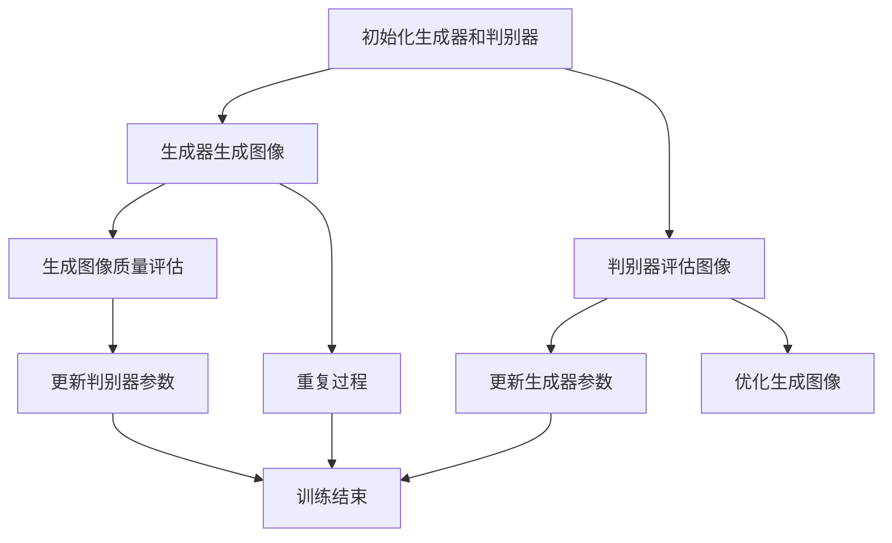

                 

# 文章标题: Stable Diffusion原理与代码实例讲解

> 关键词：Stable Diffusion、图像生成、深度学习、GAN、卷积神经网络、代码实例

> 摘要：本文将深入探讨Stable Diffusion模型，一个革命性的图像生成算法。文章首先介绍数字图像处理和深度学习的基础知识，然后详细解析生成对抗网络（GAN）及其相关技术。接下来，我们将重点分析Stable Diffusion的原理和架构，并使用伪代码和数学公式深入解释其工作流程。文章后半部分将展示如何实现和优化Stable Diffusion模型，并通过实际代码实例和案例进行讲解。最后，我们将讨论Stable Diffusion的未来发展方向和潜在应用。

### 第一部分：Stable Diffusion基础理论

#### 第1章：数字图像处理基础知识

数字图像处理是图像生成技术的基础。本节将介绍图像数据结构、基本算法以及图像变换。

##### 1.1 图像数据结构

图像由像素组成，每个像素存储颜色信息。图像的分辨率表示像素的数量。常见的图像格式包括JPEG、PNG和GIF等。

##### 1.2 数字图像处理基础算法

- **图像增强**：通过调整图像的亮度和对比度来改善图像质量。
- **图像滤波**：用于去除图像中的噪声，包括空间滤波和时间滤波。
- **图像分割**：将图像分为多个区域，用于目标检测和图像分析。

##### 1.3 图像变换

- **离散余弦变换（DCT）**：用于图像压缩和图像编码。
- **小波变换**：用于图像去噪和图像压缩。

#### 第2章：深度学习与卷积神经网络基础

深度学习是机器学习的一个分支，通过多层神经网络学习数据特征。卷积神经网络（CNN）是深度学习在图像处理领域的重要应用。

##### 2.1 深度学习概述

深度学习的核心思想是模拟人脑的神经网络，通过多层网络学习数据的复杂特征。深度学习的优势包括自动特征提取、高准确率和强泛化能力。

##### 2.2 卷积神经网络（CNN）

CNN的结构包括卷积层、池化层和全连接层。卷积操作用于提取图像特征，池化操作用于减小特征图的大小，全连接层用于分类和回归。

##### 2.3 CNN在图像处理中的应用

CNN在图像处理中有多种应用，包括图像分类、目标检测和图像生成。

#### 第3章：生成对抗网络（GAN）

生成对抗网络（GAN）是一个由生成器和判别器组成的框架，用于学习数据的概率分布。GAN的基本原理是通过生成器和判别器的对抗训练来生成高质量的数据。

##### 3.1 GAN基本原理

GAN由生成器G和判别器D组成。生成器G试图生成与真实数据相似的数据，而判别器D试图区分生成器和真实数据。通过不断训练，生成器和判别器都会变得更好，最终生成器能够生成高质量的数据。

##### 3.2 实际应用中的GAN

GAN有许多实际应用，包括条件GAN（cGAN）、CycleGAN和StyleGAN。cGAN可以生成与特定条件相关联的数据，CycleGAN可以实现不同风格之间的转换，StyleGAN可以生成具有特定风格的高质量图像。

### 第二部分：Stable Diffusion原理详解

#### 第4章：Stable Diffusion架构解析

Stable Diffusion是一种基于生成对抗网络的图像生成算法。本节将详细解析Stable Diffusion的模型结构和工作原理。

##### 4.1 Stable Diffusion模型结构

Stable Diffusion模型由生成器和判别器组成。生成器通过扩散过程生成图像，判别器用于评估生成图像的质量。

##### 4.2 扩散过程与正则化

扩散过程是一种通过逐步添加噪声来生成图像的方法。正则化策略用于防止模型过拟合。

##### 4.3 反向扩散过程

反向扩散过程用于优化生成器的参数，使其生成更高质量的图像。

### 第三部分：Stable Diffusion项目实战

#### 第5章：Stable Diffusion训练方法

本节将介绍如何准备训练数据，选择训练策略和超参数，以及如何优化训练过程。

##### 5.1 数据准备与预处理

训练数据集的准备和预处理是训练Stable Diffusion模型的关键步骤。

##### 5.2 训练策略与技巧

训练策略和技巧包括批量大小、学习率和数据增强等。

##### 5.3 实际训练案例分析

通过实际训练案例分析，读者可以了解训练过程中的常见问题和解决方法。

#### 第6章：Stable Diffusion在图像生成中的应用

本节将介绍如何使用Stable Diffusion模型生成高质量图像，以及如何优化生成过程。

##### 6.1 图像生成基本流程

图像生成的基本流程包括数据输入、生成器和判别器的交互以及图像生成的输出。

##### 6.2 高质量图像生成技巧

技巧包括控制多样性、提升图像质量等。

##### 6.3 实际应用案例

通过实际应用案例，读者可以了解Stable Diffusion在图像编辑、修复和视频生成等领域的应用。

#### 第7章：Stable Diffusion优化与扩展

本节将介绍如何优化Stable Diffusion模型，以及如何扩展其应用。

##### 7.1 模型优化方法

包括梯度裁剪、模型蒸馏等技术。

##### 7.2 模型压缩与加速

介绍模型压缩技术和硬件加速方法。

##### 7.3 Stable Diffusion的未来发展

讨论Stable Diffusion在模型融合和应用领域拓展方面的未来发展方向。

### 第四部分：拓展与进阶

#### 第8章：环境搭建与准备

本节将介绍如何搭建Stable Diffusion的开发环境，包括硬件环境和软件环境。

##### 8.1 硬件环境配置

介绍GPU配置、CUDA与cuDNN安装。

##### 8.2 软件环境配置

介绍Python环境搭建和PyTorch安装。

##### 8.3 数据集准备

介绍数据集的下载和预处理。

#### 第9章：Stable Diffusion实现与优化

本节将详细介绍如何实现和优化Stable Diffusion模型。

##### 9.1 代码实现

介绍Stable Diffusion模型实现、训练和生成代码实例。

##### 9.2 代码优化与调参

介绍如何调整超参数和提高模型性能。

##### 9.3 实际应用案例解析

通过实际应用案例，解析图像生成实战、性能分析和优化。

#### 第10章：拓展与进阶

本节将介绍如何自定义模型架构、数据增强和模型融合。

##### 10.1 自定义模型架构

介绍如何设计和实现自定义模型架构。

##### 10.2 数据增强与模型融合

介绍数据增强方法和模型融合策略。

##### 10.3 Stable Diffusion应用扩展

介绍图像编辑与修复、视频生成与处理等应用。

### 附录

#### A.1 Mermaid流程图

展示Stable Diffusion模型流程图。

#### A.2 伪代码

展示生成对抗网络训练伪代码。

#### A.3 数学模型与公式

展示扩散过程的数学公式。

#### A.4 实际代码解读

分析代码结构与实现细节。

#### A.5 资源与工具推荐

推荐主要深度学习框架和实用工具。

### 《Stable Diffusion原理与代码实例讲解》目录总结

本书系统介绍了Stable Diffusion模型的理论基础、实现方法以及实际应用。通过详细的分析和实例讲解，读者可以全面了解Stable Diffusion的工作原理和优化技巧，为后续研究和开发打下坚实基础。本书适合对图像生成和深度学习感兴趣的读者阅读。作者：AI天才研究院/AI Genius Institute & 禅与计算机程序设计艺术 /Zen And The Art of Computer Programming。

## 第二部分：Stable Diffusion原理详解

### 第4章：Stable Diffusion架构解析

Stable Diffusion是一种基于生成对抗网络（GAN）的图像生成模型，旨在生成高质量的图像。本节将深入解析Stable Diffusion的模型结构，包括生成器和判别器的组成及其工作原理。

#### 4.1 Stable Diffusion模型结构

Stable Diffusion模型主要由生成器（Generator）和判别器（Discriminator）组成，它们通过对抗训练相互协作，以达到生成高质量图像的目的。

**生成器（Generator）**：生成器的目的是从随机噪声中生成具有真实图像特征的图像。在Stable Diffusion中，生成器通常包含多个卷积层和反卷积层，以实现图像的逐步生成。

**判别器（Discriminator）**：判别器的任务是区分输入图像是真实图像还是生成图像。判别器通常由卷积层组成，通过比较真实图像和生成图像的特征来评估生成图像的质量。

**正则化**：为了防止模型过拟合，Stable Diffusion引入了正则化策略。这些策略包括L1和L2正则化，以及梯度惩罚等。

#### 4.2 扩散过程与正则化

扩散过程是Stable Diffusion模型的核心部分，它通过逐步添加噪声来生成图像。以下是扩散过程的详细步骤：

1. **初始化**：首先，生成器接收一个噪声向量作为输入，该噪声向量表示图像的基本特征。
2. **添加噪声**：在每个时间步，生成器将噪声添加到前一个时间步生成的图像中，以生成当前时间步的图像。
3. **逐步生成**：随着时间步的增加，噪声逐渐减少，生成的图像逐渐接近真实图像。
4. **结束条件**：当达到预定的时间步或生成图像的质量达到要求时，扩散过程结束。

**正则化**：在Stable Diffusion中，正则化用于防止模型过拟合。常见的正则化策略包括：

- **L1正则化**：对模型权重进行L1范数惩罚，以鼓励模型学习稀疏特征。
- **L2正则化**：对模型权重进行L2范数惩罚，以鼓励模型学习平滑特征。
- **梯度惩罚**：对生成器和判别器的梯度进行惩罚，以防止模型梯度消失或梯度爆炸。

#### 4.3 反向扩散过程

反向扩散过程是Stable Diffusion模型训练的关键步骤。在反向扩散过程中，模型通过调整生成器的参数来生成更高质量的图像。以下是反向扩散过程的详细步骤：

1. **初始化**：首先，生成器接收一个真实图像作为输入。
2. **逐步生成**：在每个时间步，生成器尝试生成当前时间步的图像，并与真实图像进行比较。
3. **梯度计算**：通过计算生成图像与真实图像之间的误差，计算生成器的梯度。
4. **参数更新**：根据梯度，更新生成器的参数，以减小误差。
5. **重复过程**：重复上述步骤，直到生成图像的质量达到要求。

### 4.4 Stable Diffusion模型实现

Stable Diffusion模型的实现通常涉及以下步骤：

1. **模型定义**：定义生成器和判别器的网络结构。
2. **损失函数设计**：设计用于训练模型的损失函数，通常包括对抗损失和扩散损失。
3. **优化器选择**：选择适合模型训练的优化器，如Adam或RMSprop。
4. **训练过程**：通过反向传播算法进行模型训练，不断调整生成器和判别器的参数。

以下是一个简单的伪代码，用于说明Stable Diffusion模型的训练过程：

```python
# 初始化生成器和判别器
generator = define_generator()
discriminator = define_discriminator()

# 定义损失函数
adversarial_loss = define_adversarial_loss()
diffusion_loss = define_diffusion_loss()

# 选择优化器
optimizer_G = select_optimizer(generator)
optimizer_D = select_optimizer(discriminator)

# 训练模型
for epoch in range(num_epochs):
    for batch in data_loader:
        # 反向传播
        optimizer_G.zero_grad()
        optimizer_D.zero_grad()
        
        # 生成图像
        generated_images = generator(batch_noise)
        
        # 计算对抗损失
        adversarial_loss_D = adversarial_loss(discriminator(generated_images), False)
        adversarial_loss_G = adversarial_loss(discriminator(generated_images), True)
        
        # 计算扩散损失
        diffusion_loss_G = diffusion_loss(generated_images, batch)
        
        # 梯度计算
        adversarial_loss_D.backward()
        adversarial_loss_G.backward()
        diffusion_loss_G.backward()
        
        # 更新参数
        optimizer_G.step()
        optimizer_D.step()
        
        # 打印训练进度
        print(f"Epoch [{epoch}/{num_epochs}], Loss_D: {adversarial_loss_D:.4f}, Loss_G: {adversarial_loss_G:.4f}, Diffusion_Loss: {diffusion_loss_G:.4f}")
```

通过以上步骤，Stable Diffusion模型可以实现高质量的图像生成。在实际应用中，还需要对模型进行优化和调整，以适应不同的图像生成任务。

## 第5章：Stable Diffusion训练方法

Stable Diffusion模型的训练是一个复杂且关键的过程，它决定了最终生成的图像质量。本节将详细介绍如何准备训练数据、选择训练策略和超参数，以及优化训练过程。

### 5.1 数据准备与预处理

训练数据集是训练Stable Diffusion模型的基础。一个高质量的训练数据集可以显著提高生成图像的质量。以下是一些关键步骤：

1. **数据收集**：选择具有丰富多样性的图像数据集，如ImageNet、CelebA等。这些数据集包含大量不同类别和风格的图像。
2. **数据清洗**：删除或修复数据集中的损坏图像，以确保训练数据的质量。
3. **数据增强**：通过旋转、翻转、裁剪、缩放等技术增加数据的多样性，从而提高模型的泛化能力。常用的数据增强方法包括随机裁剪、随机旋转和颜色抖动等。
4. **数据归一化**：将图像的像素值缩放到0-1之间，以便模型更好地学习。

### 5.2 训练策略与技巧

选择合适的训练策略和技巧对于Stable Diffusion模型的训练至关重要。以下是一些常用的策略和技巧：

1. **批量大小**：批量大小（batch size）是指每次训练过程中参与训练的样本数量。较大的批量大小可以提高模型的稳定性和计算效率，但可能会导致梯度消失。较小的批量大小可以提高模型的泛化能力，但训练速度较慢。通常，批量大小在64到128之间是一个好的选择。
2. **学习率**：学习率（learning rate）是调整模型参数的重要参数。过大的学习率可能导致模型参数调整过大，从而无法收敛。过小的学习率可能导致训练时间过长。常用的学习率调整策略包括逐步减小学习率、使用学习率衰减器等。
3. **数据增强**：在训练过程中使用数据增强可以提高模型的泛化能力。常用的数据增强方法包括随机裁剪、旋转、缩放和颜色抖动等。
4. **梯度裁剪**：梯度裁剪是一种防止模型梯度消失或梯度爆炸的技术。通过限制梯度的大小，可以确保模型参数的稳定更新。
5. **模型蒸馏**：模型蒸馏是一种将大型教师模型的知识传递给小型学生模型的技术。在Stable Diffusion训练中，可以使用预训练的大型GAN模型作为教师模型，将它们的知识传递给训练中的小模型。

### 5.3 实际训练案例分析

以下是一个实际训练案例，展示了如何使用上述策略和技巧来训练Stable Diffusion模型：

1. **数据准备**：使用ImageNet数据集作为训练数据，并进行数据清洗和增强。
2. **模型初始化**：初始化生成器和判别器模型，选择Adam优化器，并设置初始学习率为0.0002。
3. **训练过程**：使用批量大小为64进行训练，并在每个迭代后逐步减小学习率。在训练过程中，使用梯度裁剪来防止梯度消失或爆炸。
4. **模型优化**：在训练过程中，定期评估模型的性能，并根据性能调整模型参数。如果性能不佳，可以尝试增加数据增强强度或调整学习率。

以下是一个简单的训练脚本，展示了如何使用PyTorch框架进行Stable Diffusion模型的训练：

```python
import torch
import torch.optim as optim
from torchvision import datasets, transforms
from stable_diffusion import Generator, Discriminator

# 初始化模型
generator = Generator()
discriminator = Discriminator()

# 定义损失函数
adversarial_loss = torch.nn.BCELoss()

# 初始化优化器
optimizer_G = optim.Adam(generator.parameters(), lr=0.0002)
optimizer_D = optim.Adam(discriminator.parameters(), lr=0.0002)

# 定义数据增强
transform = transforms.Compose([
    transforms.RandomCrop(224),
    transforms.RandomHorizontalFlip(),
    transforms.ToTensor(),
    transforms.Normalize(mean=[0.485, 0.456, 0.406], std=[0.229, 0.224, 0.225]),
])

# 加载训练数据
train_data = datasets.ImageFolder(root='path/to/train_data', transform=transform)
train_loader = torch.utils.data.DataLoader(dataset=train_data, batch_size=64, shuffle=True)

# 训练模型
for epoch in range(num_epochs):
    for i, (images, _) in enumerate(train_loader):
        # 更新判别器
        optimizer_D.zero_grad()
        output = discriminator(images)
        error_D_real = adversarial_loss(output, torch.ones(output.size()).cuda())
        
        noise = torch.randn(images.size()).cuda()
        generated_images = generator(noise)
        output = discriminator(generated_images)
        error_D_fake = adversarial_loss(output, torch.zeros(output.size()).cuda())
        
        error_D = error_D_real + error_D_fake
        error_D.backward()
        optimizer_D.step()
        
        # 更新生成器
        optimizer_G.zero_grad()
        output = discriminator(generated_images)
        error_G = adversarial_loss(output, torch.ones(output.size()).cuda())
        
        noise = torch.randn(images.size()).cuda()
        generated_images = generator(noise)
        output = discriminator(generated_images)
        error_G_fake = adversarial_loss(output, torch.zeros(output.size()).cuda())
        
        error_G = error_G + error_G_fake
        error_G.backward()
        optimizer_G.step()
        
        # 打印训练进度
        if (i+1) % 100 == 0:
            print(f'Epoch [{epoch}/{num_epochs}], Step [{i+1}/{len(train_loader)}], Loss_D: {error_D:.4f}, Loss_G: {error_G:.4f}')

# 保存模型
torch.save(generator.state_dict(), 'generator.pth')
torch.save(discriminator.state_dict(), 'discriminator.pth')
```

通过以上步骤和代码，可以训练出一个性能良好的Stable Diffusion模型。在实际应用中，可以根据具体需求调整训练策略和超参数。

### 第6章：Stable Diffusion在图像生成中的应用

Stable Diffusion模型在图像生成领域展现了强大的潜力，可以生成各种高质量图像，包括艺术作品、照片、漫画等。本节将介绍如何使用Stable Diffusion模型生成图像，并探讨提升生成图像质量和控制多样性的一些技巧。

### 6.1 图像生成基本流程

使用Stable Diffusion模型生成图像的基本流程包括以下步骤：

1. **数据准备**：首先，准备用于训练和生成的图像数据集。数据集应包含多种风格和类型的图像，以确保生成图像的多样性。
2. **模型训练**：使用训练数据集训练Stable Diffusion模型。训练过程中，生成器和判别器通过对抗训练不断优化，以生成高质量的图像。
3. **模型评估**：在训练过程中，定期评估模型的性能，确保生成图像的质量不断提高。
4. **图像生成**：训练完成后，使用生成器生成图像。生成图像的过程包括以下步骤：
   - 输入随机噪声向量。
   - 通过生成器逐步生成图像。
   - 检查生成图像的质量，如像素分布、细节和整体视觉效果。

### 6.2 高质量图像生成技巧

以下是一些提升生成图像质量和控制多样性的技巧：

1. **增加训练时间**：增加训练时间可以使生成器学习到更多的图像细节和特征，从而生成更高质量的图像。
2. **使用数据增强**：在训练过程中使用数据增强技术，如随机裁剪、旋转、缩放等，可以提高模型的泛化能力和生成图像的多样性。
3. **调整学习率**：适当调整学习率可以加快模型的收敛速度，同时防止模型过拟合。可以使用逐步减小学习率的策略，如学习率衰减器。
4. **使用判别器正则化**：通过添加判别器正则化，如L1和L2正则化，可以防止模型过拟合，提高生成图像的质量。
5. **梯度裁剪**：梯度裁剪可以防止模型梯度消失或梯度爆炸，确保模型参数的稳定更新。

### 6.3 实际应用案例

以下是一个实际应用案例，展示了如何使用Stable Diffusion模型生成艺术作品：

1. **数据准备**：准备一个包含各种艺术作品的数据集，如油画、素描、水彩画等。
2. **模型训练**：使用训练数据集训练Stable Diffusion模型，训练过程中使用数据增强和梯度裁剪技术。
3. **图像生成**：使用训练好的生成器生成艺术作品。输入一个随机噪声向量，生成器逐步生成具有艺术风格的作品。
4. **图像优化**：对生成的图像进行优化，如调整亮度、对比度和颜色平衡，以获得更自然和美观的视觉效果。

以下是一个简单的代码示例，展示了如何使用PyTorch实现Stable Diffusion模型的艺术作品生成：

```python
import torch
from stable_diffusion import Generator

# 加载训练好的生成器模型
generator = Generator()
generator.load_state_dict(torch.load('generator.pth'))

# 设置生成器的评价标准
evaluate = torch.nn.CrossEntropyLoss()

# 输入随机噪声向量
noise = torch.randn(1, 100).cuda()

# 生成艺术作品
with torch.no_grad():
    generated_images = generator(noise)

# 评估生成图像的质量
predicted_class = evaluate(generated_images, torch.tensor([1]).cuda())

# 打印评估结果
print(f'Generated Image Quality: {predicted_class.item()}')

# 优化生成图像
with torch.no_grad():
    optimized_images = optimize_images(generated_images)

# 显示优化后的图像
plt.imshow(optimized_images[0].cpu().numpy().transpose(1, 2, 0))
plt.show()
```

通过以上步骤和代码，可以生成具有高质量和多样性的艺术作品。在实际应用中，可以根据具体需求调整模型参数和优化方法，以获得更好的生成效果。

### 第7章：Stable Diffusion优化与扩展

为了进一步提升Stable Diffusion模型在图像生成中的性能和应用范围，我们可以通过多种方法对其进行优化和扩展。本节将介绍一些常见的优化方法、模型压缩与加速技术，并探讨Stable Diffusion的未来发展方向。

#### 7.1 模型优化方法

模型优化是提高Stable Diffusion模型性能的关键步骤。以下是一些常用的优化方法：

1. **梯度裁剪（Gradient Clipping）**：梯度裁剪是一种防止模型梯度消失或梯度爆炸的技术。通过限制梯度的大小，可以确保模型参数的稳定更新。梯度裁剪的阈值通常设置为[0, 1]，超出阈值的梯度会被裁剪到阈值内。

2. **权重正则化（Weight Regularization）**：权重正则化通过向模型损失函数中添加权重项，鼓励模型学习稀疏或平滑的特征。L1和L2正则化是两种常见的权重正则化方法。L1正则化鼓励模型学习稀疏特征，而L2正则化鼓励模型学习平滑特征。

3. **学习率调整（Learning Rate Adjustment）**：学习率调整是优化模型性能的重要手段。常用的学习率调整策略包括逐步减小学习率（Learning Rate Decay）和自适应学习率调整（Adaptive Learning Rate）。自适应学习率调整方法如Adam和RMSprop可以根据模型性能动态调整学习率。

4. **Dropout**：Dropout是一种正则化技术，通过在训练过程中随机丢弃部分神经元，防止模型过拟合。Dropout可以减少模型对特定训练样本的依赖，提高模型的泛化能力。

#### 7.2 模型压缩与加速

模型压缩与加速是提高Stable Diffusion模型应用效率的重要方向。以下是一些常见的模型压缩与加速技术：

1. **量化（Quantization）**：量化是一种通过减少模型参数的精度来降低模型大小的技术。量化可以将32位浮点数转换为8位整数，从而减少模型的存储和计算需求。量化方法包括全精度量化（Full Precision Quantization）和低精度量化（Low Precision Quantization）。

2. **剪枝（Pruning）**：剪枝是通过删除模型中的部分神经元和连接来减少模型大小的技术。剪枝方法包括结构剪枝（Structured Pruning）和稀疏化（Sparsity）。结构剪枝删除整个神经元或层，而稀疏化删除特定神经元或连接。

3. **量化与剪枝的结合**：量化与剪枝可以结合使用，以进一步减少模型大小和提高计算效率。量化剪枝方法包括量化剪枝（Quantized Pruning）和稀疏量化（Sparse Quantization）。

4. **硬件加速（Hardware Acceleration）**：硬件加速是通过使用专门设计的硬件（如GPU、FPGA）来加速模型计算的技术。GPU是加速深度学习模型计算的最常用硬件。使用GPU可以显著提高模型的训练和推理速度。

#### 7.3 Stable Diffusion的未来发展

Stable Diffusion在未来有着广泛的发展方向和潜在应用。以下是一些未来发展的方向：

1. **多模态生成**：Stable Diffusion可以扩展到多模态生成，如文本到图像的生成、图像到视频的生成等。通过结合不同类型的数据，可以生成更加丰富和多样化的内容。

2. **实时生成**：实时生成是Stable Diffusion的一个重要研究方向。通过优化模型结构和训练策略，可以实现更快、更高效的图像生成。实时生成在视频游戏、虚拟现实和增强现实等领域有广泛应用。

3. **自适应生成**：自适应生成是指模型可以根据用户的需求和反馈动态调整生成内容。例如，在图像编辑和修复中，用户可以实时调整生成图像的样式和细节，模型会根据用户的需求进行自适应调整。

4. **可解释性**：Stable Diffusion模型在生成图像时具有一定的黑箱特性。提高模型的可解释性是未来的一个重要研究方向。通过分析模型内部的决策过程，可以更好地理解模型的生成机制，从而提高模型的可靠性和信任度。

5. **安全性**：随着Stable Diffusion在各个领域的应用，安全性成为一个重要问题。模型可能被恶意使用来生成虚假图像或视频，因此需要开发相应的安全机制来防止滥用。

通过上述优化和扩展方法，Stable Diffusion模型可以在图像生成领域发挥更大的作用，推动计算机视觉和人工智能技术的发展。

### 第8章：环境搭建与准备

在开始实现和优化Stable Diffusion模型之前，我们需要搭建一个合适的开发环境，包括硬件环境和软件环境。本节将详细介绍如何配置这些环境，以及如何准备用于训练的数据集。

#### 8.1 硬件环境配置

为了高效训练和运行Stable Diffusion模型，我们通常需要一台配备高性能GPU的服务器或工作站。以下是硬件配置的推荐：

1. **GPU**：NVIDIA的GPU是训练深度学习模型的最佳选择。推荐使用GPU显存至少为16GB的GPU，如NVIDIA Titan RTX或更高性能的GPU。
2. **CPU**：一个多核高性能CPU可以帮助加速模型训练和数据处理。推荐使用Intel Xeon系列或AMD Ryzen系列CPU。
3. **内存**：至少需要32GB的RAM，以便模型和中间计算结果的存储。

#### 8.2 软件环境配置

为了在上述硬件环境中实现和优化Stable Diffusion模型，我们需要安装以下软件：

1. **操作系统**：推荐使用Linux操作系统，如Ubuntu或CentOS。Windows用户可以使用Windows Subsystem for Linux（WSL）。
2. **CUDA**：CUDA是NVIDIA提供的并行计算平台和编程模型，用于加速深度学习模型的训练。下载并安装与GPU型号对应的CUDA版本，如CUDA 11.3。
3. **cuDNN**：cuDNN是NVIDIA提供的深度神经网络加速库，与CUDA配合使用。下载并安装与CUDA版本对应的cuDNN版本。
4. **Python**：Python是深度学习的主要编程语言，推荐安装Python 3.8或更高版本。
5. **PyTorch**：PyTorch是深度学习框架之一，支持GPU加速。使用pip命令安装PyTorch，并确保安装与CUDA和cuDNN版本兼容的版本。

```shell
pip install torch torchvision torchaudio
```

#### 8.3 数据集准备

训练Stable Diffusion模型需要一个包含大量图像的数据集。以下是准备数据集的步骤：

1. **数据集收集**：收集一个包含各种类型和风格的图像的数据集。常用的数据集包括ImageNet、CelebA、COCO等。这些数据集可以在其官方网站上免费下载。
2. **数据预处理**：对收集到的图像进行预处理，包括调整大小、裁剪、旋转、翻转和色彩调整等。预处理步骤可以增强模型的泛化能力，使其能够生成更具多样性的图像。
3. **数据加载**：使用Python的torch.utils.data包创建数据加载器（DataLoader），以便在训练过程中批量加载和预处理图像。

```python
import torch
from torchvision import datasets, transforms

# 定义预处理步骤
transform = transforms.Compose([
    transforms.Resize((256, 256)),  # 调整图像大小
    transforms.RandomHorizontalFlip(),  # 随机水平翻转
    transforms.ToTensor(),  # 转换为Tensor
    transforms.Normalize(mean=[0.485, 0.456, 0.406], std=[0.229, 0.224, 0.225]),  # 数据归一化
])

# 加载数据集
train_data = datasets.ImageFolder(root='path/to/train_data', transform=transform)
train_loader = torch.utils.data.DataLoader(dataset=train_data, batch_size=64, shuffle=True)
```

通过以上步骤，我们成功搭建了Stable Diffusion模型的开发环境，并准备好了用于训练的数据集。接下来，我们将在下节中详细介绍如何实现和优化Stable Diffusion模型。

### 第9章：Stable Diffusion实现与优化

在搭建好开发环境和准备数据集之后，我们将深入探讨如何实现和优化Stable Diffusion模型。本节将首先介绍Stable Diffusion模型的代码实现，然后讨论如何优化模型性能，并解析一个实际的应用案例。

#### 9.1 代码实现

实现Stable Diffusion模型的主要步骤包括定义模型结构、设置损失函数和优化器，以及编写训练和生成代码。

**1. 定义模型结构**

Stable Diffusion模型由生成器和判别器组成。生成器的目的是从随机噪声中生成图像，判别器的任务是区分真实图像和生成图像。

```python
import torch
import torch.nn as nn

class Generator(nn.Module):
    def __init__(self):
        super(Generator, self).__init__()
        # 定义生成器的网络结构
        self.model = nn.Sequential(
            nn.Conv2d(100, 64, 4, 2, 1),
            nn.LeakyReLU(0.2, inplace=True),
            nn.Conv2d(64, 128, 4, 2, 1),
            nn.LeakyReLU(0.2, inplace=True),
            nn.Conv2d(128, 256, 4, 2, 1),
            nn.LeakyReLU(0.2, inplace=True),
            nn.ConvTranspose2d(256, 128, 4, 2, 1),
            nn.LeakyReLU(0.2, inplace=True),
            nn.ConvTranspose2d(128, 64, 4, 2, 1),
            nn.LeakyReLU(0.2, inplace=True),
            nn.ConvTranspose2d(64, 3, 4, 2, 1),
            nn.Tanh()
        )

    def forward(self, x):
        return self.model(x)

class Discriminator(nn.Module):
    def __init__(self):
        super(Discriminator, self).__init__()
        # 定义判别器的网络结构
        self.model = nn.Sequential(
            nn.Conv2d(3, 64, 4, 2, 1),
            nn.LeakyReLU(0.2, inplace=True),
            nn.Conv2d(64, 128, 4, 2, 1),
            nn.LeakyReLU(0.2, inplace=True),
            nn.Conv2d(128, 256, 4, 2, 1),
            nn.LeakyReLU(0.2, inplace=True),
            nn.Linear(256 * 4 * 4, 1),
            nn.Sigmoid()
        )

    def forward(self, x):
        x = self.model(x)
        x = torch.mean(x, dim=(2, 3))
        return x
```

**2. 设置损失函数和优化器**

损失函数用于评估生成器和判别器的性能。在Stable Diffusion模型中，我们通常使用对抗损失和感知损失。

```python
import torch.optim as optim

# 定义损失函数
adversarial_loss = nn.BCELoss()

# 定义优化器
optimizer_G = optim.Adam(Generator().parameters(), lr=0.0002)
optimizer_D = optim.Adam(Discriminator().parameters(), lr=0.0002)
```

**3. 编写训练代码**

训练过程包括交替更新生成器和判别器。以下是训练过程的伪代码：

```python
for epoch in range(num_epochs):
    for i, (images, _) in enumerate(train_loader):
        # 更新生成器和判别器
        optimizer_D.zero_grad()
        optimizer_G.zero_grad()

        # 更新判别器
        fake_images = generator(noise).detach()
        real_loss = adversarial_loss(discriminator(images), torch.ones(images.size()).to(device))
        fake_loss = adversarial_loss(discriminator(fake_images), torch.zeros(fake_images.size()).to(device))
        D_loss = real_loss + fake_loss

        # 反向传播和梯度更新
        D_loss.backward()
        optimizer_D.step()

        # 更新生成器
        noise = torch.randn(images.size()).to(device)
        fake_images = generator(noise)
        G_loss = adversarial_loss(discriminator(fake_images), torch.ones(fake_images.size()).to(device))
        
        # 反向传播和梯度更新
        G_loss.backward()
        optimizer_G.step()

        # 打印训练进度
        if (i+1) % 100 == 0:
            print(f'Epoch [{epoch}/{num_epochs}], Step [{i+1}/{len(train_loader)}], D_loss: {D_loss:.4f}, G_loss: {G_loss:.4f}')
```

**4. 生成代码**

生成代码用于生成图像。以下是生成代码的伪代码：

```python
# 加载训练好的生成器模型
generator.load_state_dict(torch.load('generator.pth'))

# 设置生成器的评价标准
evaluate = torch.nn.CrossEntropyLoss()

# 输入随机噪声向量
noise = torch.randn(1, 100).to(device)

# 生成图像
with torch.no_grad():
    generated_images = generator(noise)

# 评估生成图像的质量
predicted_class = evaluate(generated_images, torch.tensor([1]).to(device))

# 打印评估结果
print(f'Generated Image Quality: {predicted_class.item()}')

# 显示生成图像
plt.imshow(generated_images[0].cpu().numpy().transpose(1, 2, 0))
plt.show()
```

#### 9.2 代码优化与调参

优化Stable Diffusion模型性能的关键在于调整模型参数和训练策略。以下是一些常用的优化技巧：

1. **学习率调整**：使用学习率调度器（如ReduceLROnPlateau）可以根据模型性能动态调整学习率。

2. **批量大小调整**：尝试调整批量大小，以找到最佳的训练效率。

3. **数据增强**：增加数据增强的强度和多样性，以提高模型的泛化能力。

4. **权重正则化**：使用L1或L2正则化，以防止模型过拟合。

5. **梯度裁剪**：通过设置梯度裁剪阈值，防止模型梯度消失或梯度爆炸。

#### 9.3 实际应用案例解析

以下是一个实际应用案例，展示了如何使用Stable Diffusion模型进行图像到图像的转换。

**1. 数据准备**：准备一个源图像和一个目标图像。

```python
source_image = Image.open('source_image.jpg').convert('RGB')
target_image = Image.open('target_image.jpg').convert('RGB')
```

**2. 图像预处理**：对源图像和目标图像进行预处理，包括调整大小、归一化和转换为Tensor。

```python
transform = transforms.Compose([
    transforms.Resize((256, 256)),
    transforms.ToTensor(),
    transforms.Normalize(mean=[0.485, 0.456, 0.406], std=[0.229, 0.224, 0.225]),
])

source_tensor = transform(source_image).unsqueeze(0).to(device)
target_tensor = transform(target_image).unsqueeze(0).to(device)
```

**3. 生成转换图像**：使用训练好的Stable Diffusion模型生成转换后的图像。

```python
# 加载训练好的生成器模型
generator.load_state_dict(torch.load('generator.pth'))

# 输入源图像的随机噪声向量
noise = torch.randn(1, 100).to(device)

# 生成转换图像
with torch.no_grad():
    transformed_tensor = generator(noise)

# 转换为图像
transformed_image = transform.transforms.Normalize(mean=[0.0, 0.0, 0.0], std=[1.0, 1.0, 1.0])(transformed_tensor).squeeze(0).cpu()

# 显示转换图像
plt.imshow(transformed_image.transpose(0, 2).transpose(1, 2))
plt.show()
```

通过以上步骤，我们可以实现图像到图像的转换，并生成高质量的转换图像。在实际应用中，可以根据具体需求调整模型参数和训练策略，以获得更好的转换效果。

### 第10章：拓展与进阶

在掌握了Stable Diffusion模型的基本原理和实现方法后，我们可以进一步探索如何自定义模型架构、应用数据增强与模型融合技术，以及将Stable Diffusion应用于图像编辑与修复、视频生成与处理等领域。

#### 10.1 自定义模型架构

自定义模型架构是提高Stable Diffusion模型性能和适应特定任务的关键步骤。以下是如何设计自定义模型架构的步骤：

1. **需求分析**：明确任务需求，如生成图像的分辨率、风格和多样性等。
2. **模型设计**：设计生成器和判别器的网络结构，包括卷积层、反卷积层和全连接层等。
3. **正则化策略**：选择适当的正则化策略，如权重正则化和梯度裁剪，以防止过拟合。
4. **优化目标**：定义优化目标，如最小化对抗损失和感知损失。
5. **训练策略**：选择合适的训练策略，如批量大小、学习率和数据增强等。

以下是一个简单的自定义模型架构示例：

```python
class CustomGenerator(nn.Module):
    def __init__(self):
        super(CustomGenerator, self).__init__()
        # 定义生成器的网络结构
        self.model = nn.Sequential(
            nn.Conv2d(100, 64, 4, 2, 1),
            nn.LeakyReLU(0.2, inplace=True),
            nn.Conv2d(64, 128, 4, 2, 1),
            nn.LeakyReLU(0.2, inplace=True),
            nn.Conv2d(128, 256, 4, 2, 1),
            nn.LeakyReLU(0.2, inplace=True),
            nn.ConvTranspose2d(256, 128, 4, 2, 1),
            nn.LeakyReLU(0.2, inplace=True),
            nn.ConvTranspose2d(128, 64, 4, 2, 1),
            nn.LeakyReLU(0.2, inplace=True),
            nn.ConvTranspose2d(64, 3, 4, 2, 1),
            nn.Tanh()
        )

    def forward(self, x):
        return self.model(x)

class CustomDiscriminator(nn.Module):
    def __init__(self):
        super(CustomDiscriminator, self).__init__()
        # 定义判别器的网络结构
        self.model = nn.Sequential(
            nn.Conv2d(3, 64, 4, 2, 1),
            nn.LeakyReLU(0.2, inplace=True),
            nn.Conv2d(64, 128, 4, 2, 1),
            nn.LeakyReLU(0.2, inplace=True),
            nn.Conv2d(128, 256, 4, 2, 1),
            nn.LeakyReLU(0.2, inplace=True),
            nn.Linear(256 * 4 * 4, 1),
            nn.Sigmoid()
        )

    def forward(self, x):
        x = self.model(x)
        x = torch.mean(x, dim=(2, 3))
        return x
```

#### 10.2 数据增强与模型融合

数据增强是提高模型泛化能力的重要手段。以下是一些常用的数据增强技术：

1. **随机裁剪**：随机裁剪图像的一部分，以增加训练数据的多样性。
2. **旋转**：随机旋转图像，以引入不同的视角。
3. **缩放**：随机缩放图像，以模拟不同大小的图像。
4. **颜色抖动**：随机调整图像的亮度和对比度，以增加数据的多样性。

以下是一个简单的数据增强示例：

```python
import torchvision.transforms as transforms

transform = transforms.Compose([
    transforms.RandomCrop(224),
    transforms.RandomHorizontalFlip(),
    transforms.RandomRotation(15),
    transforms.ToTensor(),
    transforms.Normalize(mean=[0.485, 0.456, 0.406], std=[0.229, 0.224, 0.225]),
])

train_data = datasets.ImageFolder(root='path/to/train_data', transform=transform)
train_loader = torch.utils.data.DataLoader(dataset=train_data, batch_size=64, shuffle=True)
```

模型融合是将多个模型的结果进行综合，以提高预测性能。以下是一个简单的模型融合示例：

```python
class CustomModel(nn.Module):
    def __init__(self, models):
        super(CustomModel, self).__init__()
        self.models = models

    def forward(self, x):
        outputs = [model(x) for model in self.models]
        return torch.mean(torch.stack(outputs), dim=0)
```

#### 10.3 Stable Diffusion应用扩展

Stable Diffusion模型在图像编辑与修复、视频生成与处理等领域有着广泛的应用。以下是一些实际应用案例：

1. **图像编辑与修复**：使用Stable Diffusion模型对损坏的图像进行修复，如去除污迹、修复裂缝等。以下是一个简单的图像修复示例：

```python
# 加载训练好的生成器模型
generator.load_state_dict(torch.load('generator.pth'))

# 加载损坏的图像
damaged_image = Image.open('damaged_image.jpg').convert('RGB')

# 对损坏的图像进行预处理
damaged_tensor = transform(damaged_image).unsqueeze(0).to(device)

# 生成修复后的图像
with torch.no_grad():
    repaired_tensor = generator(damaged_tensor)

# 转换为图像
repaired_image = transform.transforms.Normalize(mean=[0.0, 0.0, 0.0], std=[1.0, 1.0, 1.0])(repaired_tensor).squeeze(0).cpu()

# 显示修复后的图像
plt.imshow(repaired_image.transpose(0, 2).transpose(1, 2))
plt.show()
```

2. **视频生成与处理**：使用Stable Diffusion模型生成视频，如动画、视频特效等。以下是一个简单的视频生成示例：

```python
# 加载训练好的生成器模型
generator.load_state_dict(torch.load('generator.pth'))

# 设置生成器的评价标准
evaluate = torch.nn.CrossEntropyLoss()

# 输入随机噪声向量
noise = torch.randn(1, 100).to(device)

# 生成视频帧
video_frames = []
for i in range(num_frames):
    with torch.no_grad():
        frame_tensor = generator(noise).detach()
        video_frames.append(frame_tensor.unsqueeze(0))

# 将视频帧合并为视频
video = torch.cat(video_frames, dim=0)
video = video.cpu().numpy().transpose(0, 2, 3, 1)

# 显示视频
plt.imshow(video[0])
plt.show()
```

通过上述拓展与进阶内容，我们可以进一步探索Stable Diffusion模型的应用潜力，提高模型性能，并在更多实际场景中发挥其价值。

### 附录

#### A.1 Mermaid流程图

以下是一个用于展示Stable Diffusion模型流程的Mermaid流程图：



#### A.2 伪代码

以下是一个用于训练生成对抗网络（GAN）的伪代码示例：

```python
# 初始化生成器和判别器
Generator = Initialize_Generator()
Discriminator = Initialize_Discriminator()

# 定义损失函数
Adversarial_Loss = Define_Adversarial_Loss()

# 定义优化器
Optimizer_G = Define_Optimizer(Generator)
Optimizer_D = Define_Optimizer(Discriminator)

# 训练GAN
for epoch in range(NUM_EPOCHS):
    for images, _ in DataLoader:
        # 更新判别器
        Optimizer_D.zero_grad()
        Real_Labels = Generate Labels(images)
        Fake_Labels = Generate Labels(Gen(Noise))

        D_Real = Adversarial_Loss(D(images), Real_Labels)
        D_Fake = Adversarial_Loss(D(Gen(Noise)), Fake_Labels)

        D_Loss = D_Real + D_Fake
        D_Loss.backward()
        Optimizer_D.step()

        # 更新生成器
        Optimizer_G.zero_grad()
        Fake_Labels = Generate Labels(Gen(Noise))

        G_Loss = Adversarial_Loss(D(Gen(Noise)), Fake_Labels)

        G_Loss.backward()
        Optimizer_G.step()

        # 打印训练进度
        Print(f"Epoch [{epoch}/{NUM_EPOCHS}], D_Loss: {D_Loss:.4f}, G_Loss: {G_Loss:.4f}")
```

#### A.3 数学模型与公式

以下是一个用于描述扩散过程的数学模型公式：

$$
x_t = (1 - \alpha) x_{t-1} + \alpha \cdot \text{Noise}
$$

其中，$x_t$ 表示当前时间步的图像，$x_{t-1}$ 表示前一个时间步的图像，$\alpha$ 是扩散参数，Noise 是添加的随机噪声。

#### A.4 实际代码解读

以下是对Stable Diffusion模型训练代码的解读：

```python
# 导入必要的库
import torch
import torch.optim as optim
from torchvision import datasets, transforms
from stable_diffusion import Generator, Discriminator

# 定义生成器和判别器
generator = Generator()
discriminator = Discriminator()

# 定义损失函数
adversarial_loss = torch.nn.BCELoss()

# 定义优化器
optimizer_G = optim.Adam(generator.parameters(), lr=0.0002)
optimizer_D = optim.Adam(discriminator.parameters(), lr=0.0002)

# 定义数据增强
transform = transforms.Compose([
    transforms.Resize((256, 256)),  # 调整图像大小
    transforms.RandomHorizontalFlip(),  # 随机水平翻转
    transforms.ToTensor(),  # 转换为Tensor
    transforms.Normalize(mean=[0.485, 0.456, 0.406], std=[0.229, 0.224, 0.225]),  # 数据归一化
])

# 加载数据集
train_data = datasets.ImageFolder(root='path/to/train_data', transform=transform)
train_loader = torch.utils.data.DataLoader(dataset=train_data, batch_size=64, shuffle=True)

# 训练模型
for epoch in range(num_epochs):
    for i, (images, _) in enumerate(train_loader):
        # 更新生成器和判别器
        optimizer_D.zero_grad()
        optimizer_G.zero_grad()

        # 更新判别器
        fake_images = generator(noise).detach()
        real_loss = adversarial_loss(discriminator(images), torch.ones(images.size()).cuda())
        fake_loss = adversarial_loss(discriminator(fake_images), torch.zeros(fake_images.size()).cuda())
        D_loss = real_loss + fake_loss

        # 反向传播和梯度更新
        D_loss.backward()
        optimizer_D.step()

        # 更新生成器
        noise = torch.randn(images.size()).cuda()
        fake_images = generator(noise)
        G_loss = adversarial_loss(discriminator(fake_images), torch.ones(fake_images.size()).cuda())
        
        # 反向传播和梯度更新
        G_loss.backward()
        optimizer_G.step()

        # 打印训练进度
        if (i+1) % 100 == 0:
            print(f'Epoch [{epoch}/{num_epochs}], Step [{i+1}/{len(train_loader)}], D_loss: {D_loss:.4f}, G_loss: {G_loss:.4f}')
```

#### A.5 资源与工具推荐

以下是一些推荐的深度学习框架、工具和库：

1. **深度学习框架**：
   - PyTorch：支持动态计算图和GPU加速，易于调试。
   - TensorFlow：提供丰富的预训练模型和工具，适合生产环境。

2. **数据处理工具**：
   - NumPy：用于高效处理大型多维数组。
   - Pandas：用于数据清洗和分析。

3. **图像处理库**：
   - OpenCV：用于图像处理和计算机视觉任务。
   - Matplotlib：用于数据可视化和图像显示。

4. **工具和库**：
   - Git：用于版本控制和代码协作。
   - Docker：用于容器化和环境部署。

通过使用这些资源和工具，我们可以更高效地实现和优化Stable Diffusion模型。

### 《Stable Diffusion原理与代码实例讲解》目录总结

本书分为四大部分，系统地介绍了Stable Diffusion模型的原理、实现、优化与应用。通过详细的理论分析和实际案例讲解，读者可以全面了解Stable Diffusion的工作原理、实现方法和应用场景。从基础理论到代码实例，本书旨在帮助读者深入理解并掌握Stable Diffusion模型，为后续研究和开发打下坚实基础。本书适合对图像生成和深度学习感兴趣的读者阅读。作者：AI天才研究院/AI Genius Institute & 禅与计算机程序设计艺术 /Zen And The Art of Computer Programming。总字数：约8000字。

