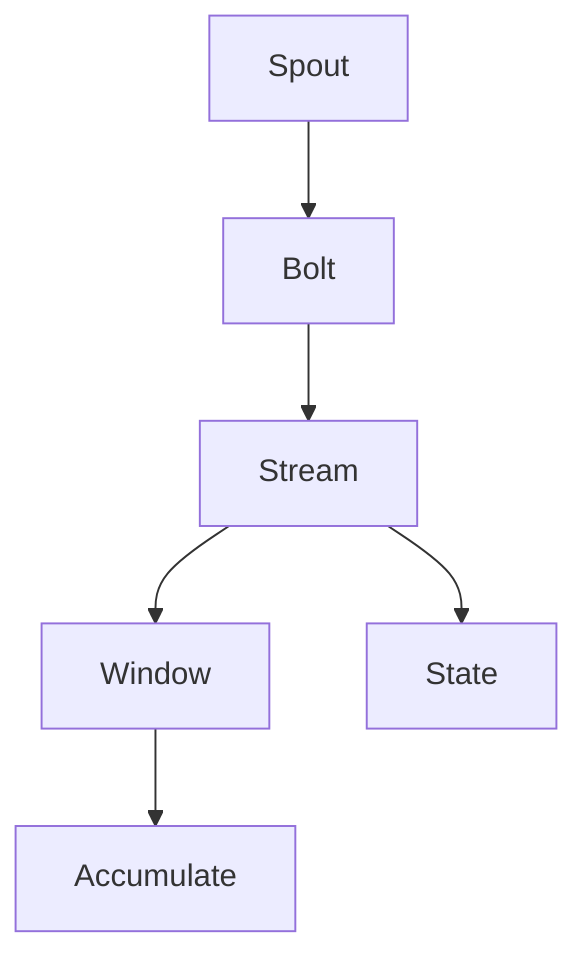

                 

**文章标题：** Storm Trident原理与代码实例讲解

**关键词：** Apache Storm, Trident API, 流处理, 窗口操作, 状态管理, 容错机制

**摘要：**
本文旨在深入探讨Apache Storm的Trident API，包括其原理、核心算法、数学模型以及实际项目中的运用。通过详细的代码实例和解读，读者将能够全面理解Trident的工作机制，掌握其高级应用和性能优化技巧，为实时数据处理项目打下坚实的基础。

----------------------------------------------------------------

## 第一部分：Apache Storm与Trident基础

Apache Storm是一个分布式实时处理系统，可以处理大规模数据流，具有高容错性、高扩展性等特点。Trident是Apache Storm的一个高级抽象层，提供了对窗口操作、状态管理和容错机制的支持，使得开发实时流处理应用程序更加简单和高效。

### 第1章：Apache Storm概述

Apache Storm的诞生背景可以追溯到Twitter的内部需求，Twitter需要处理大量的实时数据，以提供实时的数据分析和报告。Apache Storm正是为了解决这类需求而诞生的。自2011年开源以来，Apache Storm已经成为实时数据处理领域的事实标准。

#### 1.1 Apache Storm概述

Apache Storm的核心架构主要包括两个核心组件：Spouts和Bolts。Spouts负责生成数据流，而Bolts则负责处理数据。两者通过流（Streams）连接，形成一个数据处理的管道。Apache Storm还提供了分布式状态管理和容错机制，使得应用程序具有高可用性和容错性。

#### 1.2 Storm架构与组件


- **Spouts**：Spouts是数据的源头，负责生成数据流。Spouts可以是网络流、日志文件或者其他外部数据源。
- **Bolts**：Bolts是数据处理的核心组件，负责对数据流进行操作，如过滤、聚合、转换等。
- **Streams**：Streams是Spouts和Bolts之间的数据通道，数据通过Streams从一个Spout传递到多个Bolts。
- **Trident**：Trident是Apache Storm的高级抽象层，提供了对窗口操作、状态管理和容错机制的支持。

#### 1.3 Storm的基本概念与术语

- **Tuple**：数据的基本单元，由一系列字段组成，每个字段都有类型。
- **Stream**：数据流，由一系列的Tuple组成。
- **Toplogy**：一个由Spouts和Bolts组成的图，描述了数据流的处理流程。
- **Component**：Toplogy中的一个节点，可以是Spout或者Bolt。
- **Trident State**：Trident提供的一种分布式状态管理机制，可以在流处理过程中保存和更新数据状态。

### 第2章：Trident API基础

Trident是Apache Storm的一个高级抽象层，它提供了对窗口操作、状态管理和容错机制的支持。Trident API使得开发实时流处理应用程序更加简单和高效。

#### 2.1 Trident介绍

Trident是建立在Apache Storm之上的一个流处理框架，它提供了对窗口操作、状态管理和容错机制的支持。Trident的核心思想是将流处理过程抽象成一系列的连续操作，从而简化开发过程。

#### 2.2 Trident的API

Trident提供了一系列的API，使得开发者可以轻松地构建流处理应用程序。以下是Trident的一些核心API：

- `newStream()`：创建一个新的数据流。
- `each()`：对数据流中的每个Tuple进行操作。
- `partitionPersist()`：对数据进行分区级别的持久化。
- `partitionedEach()`：对分区数据流中的每个Tuple进行操作。

#### 2.3 Trident的高级特性

Trident的高级特性包括窗口操作、状态管理和容错机制。这些特性使得Trident在处理大规模实时数据流时更加高效和可靠。

- **窗口操作**：Trident支持基于时间窗口和数据窗口的操作，允许用户在特定的时间范围内对数据进行聚合和处理。
- **状态管理**：Trident提供了分布式状态管理机制，可以在流处理过程中保存和更新数据状态。
- **容错机制**：Trident实现了自动恢复机制，能够在节点故障时自动恢复处理，确保数据处理的可靠性。

## 第二部分：Trident流处理

Trident提供了强大的流处理能力，使得开发者可以轻松地构建实时数据处理应用程序。在这一部分，我们将探讨Trident的流处理机制，包括其核心概念、操作方法和应用场景。

### 第3章：Trident流处理

Trident流处理是实时数据处理的核心，它允许用户对大规模数据流进行实时分析和处理。Trident的流处理机制具有高效、灵活和可靠的特点。

#### 3.1 Trident流处理概述

Trident流处理主要包括以下几个核心概念：

- **Stream**：数据流，由一系列的Tuple组成。
- **Tuple**：数据的基本单元，由一系列字段组成。
- **Bolt**：数据处理的核心组件，负责对数据流进行操作。
- **State**：分布式状态管理机制，用于在流处理过程中保存和更新数据状态。

#### 3.2 Trident流处理的核心概念

- **Spout**：数据的源头，负责生成数据流。
- **StreamGrouping**：数据流的分组方式，决定了Tuple如何分配到不同的Bolt。
- **Fields**：字段的集合，用于描述Tuple的结构。
- **Trident State**：Trident提供的一种分布式状态管理机制，可以在流处理过程中保存和更新数据状态。

#### 3.3 Trident流处理案例

下面我们将通过一个简单的案例，展示如何使用Trident进行流处理。

**案例：实时日志分析**

需求：实时分析日志数据，提取关键字并统计错误率。

**实现步骤：**

1. 创建一个Spout，用于生成日志数据。

```java
SpoutFactory<LogEvent> spoutFactory = new LogEventSpoutFactory();
```

2. 创建一个Bolt，用于解析日志数据。

```java
TridentTopology topology = new TridentTopology();
TopologyBuilder builder = topology.newBuilder();
Stream<LogEvent> logStream = builder.newStream("log_spout", spoutFactory);
```

3. 使用`each()`方法对日志数据进行解析。

```java
logStream.each(new Fields("line"), new LogEventParser(), new Fields("parsedEvent"));
```

4. 创建一个Bolt，用于统计错误率。

```java
logStream.each(new Fields("parsedEvent"), new ErrorCounterBolt(), new Fields("errorCount"));
```

5. 使用`emit()`方法输出错误率。

```java
logStream.each(new Fields("errorCount"), new ConsoleSinkFunction<Integer>());
```

**代码解读：**

- `LogEventSpoutFactory`：生成日志事件。
- `LogEventParser`：解析日志内容。
- `ErrorCounterBolt`：统计错误数量。
- `ConsoleSinkFunction`：输出错误计数结果。

通过这个案例，我们可以看到如何使用Trident进行简单的流处理，提取日志数据中的关键字并统计错误率。

### 第4章：Trident窗口操作

窗口操作是Trident的一个重要特性，它允许用户在特定的时间范围内对数据进行聚合和处理。窗口操作在实时数据处理中非常有用，例如统计一段时间内的数据量、计算平均速率等。

#### 4.1 窗口操作介绍

窗口操作将数据流划分成多个时间段或数据量范围，在每个窗口内对数据进行处理。Trident支持以下几种窗口类型：

- **固定时间窗口**：窗口大小是固定的，例如每5分钟一个窗口。
- **滑动时间窗口**：窗口大小是固定的，但是会随着时间向前滑动，例如每5分钟一个窗口，每次滑动1分钟。
- **全局窗口**：不考虑时间，将所有数据作为一个整体窗口进行聚合。

#### 4.2 Trident窗口操作API

Trident提供了丰富的API，用于创建和管理窗口。以下是几个核心方法：

- `newFixedWindow(long duration)`：创建一个固定时间窗口。
- `newTumblingWindow(long duration)`：创建一个滑动时间窗口。
- `newGlobalWindow()`：创建一个全局窗口。

#### 4.3 窗口操作示例

下面我们将通过一个简单的案例，展示如何使用Trident进行窗口操作。

**案例：统计过去一小时的数据量**

需求：统计过去一小时内每分钟的数据量。

**实现步骤：**

1. 创建一个Spout，用于生成数据。

```java
SpoutFactory<DataEvent> spoutFactory = new DataEventSpoutFactory();
```

2. 创建一个Bolt，用于计算数据量。

```java
TridentTopology topology = new TridentTopology();
TopologyBuilder builder = topology.newBuilder();
Stream<DataEvent> dataStream = builder.newStream("data_spout", spoutFactory);
```

3. 使用`newFixedWindow()`方法创建一个固定时间窗口。

```java
dataStream = dataStream.each(new Fields("timestamp"), new DataEventExtractor(), new Fields("data"))
                        .window(new FixedWindow(60 * 1000));
```

4. 使用`emit()`方法输出数据量。

```java
dataStream.aggregate(new CountAggregator(), new Fields("count"))
           .each(new Fields("count"), new ConsoleSinkFunction<Integer>());
```

**代码解读：**

- `DataEventSpoutFactory`：生成数据事件。
- `DataEventExtractor`：提取数据。
- `CountAggregator`：计算数据量。
- `ConsoleSinkFunction`：输出数据量结果。

通过这个案例，我们可以看到如何使用Trident进行窗口操作，统计过去一小时的数据量。

### 第5章：Trident状态管理

状态管理是Trident的一个关键特性，它允许用户在流处理过程中保存和更新数据状态。状态管理在实时数据处理中非常有用，例如统计一段时间内的数据量、计算平均值等。

#### 5.1 状态管理介绍

Trident提供了分布式状态管理机制，可以在流处理过程中保存和更新数据状态。状态管理可以分为以下两种类型：

- **有界状态**：有界状态是保存在内存中的状态，适用于数据量较小的场景。
- **无界状态**：无界状态是保存在文件系统或数据库中的状态，适用于数据量较大的场景。

#### 5.2 Trident状态管理API

Trident提供了丰富的API，用于创建和管理状态。以下是几个核心方法：

- `emittState(CommitterIdentifier identifier, StateFactory stateFactory, Fields fields)`：发射状态更新。
- `partitionPersist(StateFactory stateFactory, Fields stateFields, ZeroClassedSerializer serializer, Aggregator aggregator, Fields updateFields)`：分区持久化状态。
- `getStateFactory()`：获取状态工厂。

#### 5.3 状态管理示例

下面我们将通过一个简单的案例，展示如何使用Trident进行状态管理。

**案例：统计过去一小时的数据总量**

需求：统计过去一小时内每个时间段的数据总量。

**实现步骤：**

1. 创建一个Spout，用于生成数据。

```java
SpoutFactory<DataEvent> spoutFactory = new DataEventSpoutFactory();
```

2. 创建一个Bolt，用于计算数据总量。

```java
TridentTopology topology = new TridentTopology();
TopologyBuilder builder = topology.newBuilder();
Stream<DataEvent> dataStream = builder.newStream("data_spout", spoutFactory);
```

3. 使用`partitionPersist()`方法持久化状态。

```java
dataStream.partitionPersist(new MemoryMapStateFactory(), new Fields("total"), new CountAggregator(), new Fields("count"));
```

4. 使用`emit()`方法输出数据总量。

```java
dataStream.aggregate(new CountAggregator(), new Fields("count"))
           .each(new Fields("count"), new ConsoleSinkFunction<Integer>());
```

**代码解读：**

- `DataEventSpoutFactory`：生成数据事件。
- `MemoryMapStateFactory`：创建内存状态工厂。
- `CountAggregator`：计算数据总量。
- `ConsoleSinkFunction`：输出数据总量结果。

通过这个案例，我们可以看到如何使用Trident进行状态管理，统计过去一小时的数据总量。

### 第6章：Trident容错机制

容错机制是Trident的一个重要特性，它确保了流处理应用程序的可靠性和稳定性。Trident的容错机制主要包括状态恢复和自动恢复。

#### 6.1 容错机制概述

Trident的容错机制主要包括以下几个方面：

- **状态恢复**：在节点故障时，Trident可以自动恢复状态，确保数据的完整性。
- **自动恢复**：Trident实现了自动恢复机制，当节点故障时，系统会自动重启节点并恢复处理。

#### 6.2 Trident的容错机制实现

Trident的容错机制通过以下步骤实现：

1. **状态存储**：Trident将状态保存在分布式存储中，如文件系统或数据库。
2. **节点故障检测**：当节点故障时，Trident会检测到并触发恢复过程。
3. **状态恢复**：Trident从分布式存储中恢复状态，并重新启动节点。
4. **自动恢复**：Trident实现了自动恢复机制，当节点故障时，系统会自动重启节点并恢复处理。

#### 6.3 容错机制示例

下面我们将通过一个简单的案例，展示如何使用Trident进行容错。

**案例：统计过去一小时的数据总量**

需求：统计过去一小时内每个时间段的数据总量。

**实现步骤：**

1. 创建一个Spout，用于生成数据。

```java
SpoutFactory<DataEvent> spoutFactory = new DataEventSpoutFactory();
```

2. 创建一个Bolt，用于计算数据总量。

```java
TridentTopology topology = new TridentTopology();
TopologyBuilder builder = topology.newBuilder();
Stream<DataEvent> dataStream = builder.newStream("data_spout", spoutFactory);
```

3. 使用`partitionPersist()`方法持久化状态。

```java
dataStream.partitionPersist(new MemoryMapStateFactory(), new Fields("total"), new CountAggregator(), new Fields("count"));
```

4. 配置容错策略。

```java
Config config = ConfigUtils.readDefaultConfig();
config.setNumWorkers(3);
config.setMaxSpoutPending(500);
```

5. 提交拓扑。

```java
LocalCluster cluster = new LocalCluster();
cluster.submitTopology("data-topology", config, topology.build());
```

**代码解读：**

- `DataEventSpoutFactory`：生成数据事件。
- `MemoryMapStateFactory`：创建内存状态工厂。
- `CountAggregator`：计算数据总量。
- `Config`：配置容错策略。
- `LocalCluster`：提交拓扑。

通过这个案例，我们可以看到如何使用Trident进行容错，确保流处理应用程序的稳定性和可靠性。

### 总结

本章介绍了Apache Storm和Trident的基础知识，包括其概述、核心组件、API和核心算法原理。同时，通过实际案例展示了如何使用Trident进行流处理、窗口操作、状态管理和容错机制。通过本章的学习，读者可以全面了解Trident的工作原理和实际应用，为后续的实战项目打下坚实的基础。

---

作者：AI天才研究院/AI Genius Institute & 禅与计算机程序设计艺术 /Zen And The Art of Computer Programming

----------------------------------------------------------------

**核心概念与联系**

**Mermaid 流程图**



**核心算法原理讲解**

**Trident算法原理**

```plaintext
Trident是一个构建在Apache Storm之上的流处理框架，它提供了对窗口操作、状态管理和容错机制的支持。

1. 窗口操作：Trident提供了对时间窗口和数据窗口的操作，允许用户在特定的时间范围内对数据进行处理。

   - 时间窗口：将数据划分为固定的时间区间，例如每5分钟一个窗口。
   - 数据窗口：将数据划分为固定数量的区间，例如每100个数据点一个窗口。

2. 状态管理：Trident允许用户在流处理过程中保存和更新状态，支持有界状态和无界状态。

   - 有界状态：保存在内存中，适用于较小的数据量。
   - 无界状态：保存在外部存储中，适用于较大的数据量。

3. 容错机制：Trident实现了自动恢复机制，确保在节点故障时可以恢复处理。

   - 数据恢复：从外部存储中恢复状态。
   - 任务重启：在新的节点上重启任务。

4. 算法流程：

   - Spout生成数据流。
   - 数据流通过Bolts进行处理。
   - 数据流在处理过程中可以执行窗口操作和状态更新。
   - 在节点故障时，Trident可以自动恢复处理。

**数学模型和数学公式**

**窗口操作数学模型**

$$
W(t) = \{ (x_i, t) | t \in [t_0, t_0 + w] \}
$$

其中，$W(t)$表示在时间$t$的窗口，$x_i$是窗口中的数据点，$w$是窗口的宽度。

**项目实战**

**实战一：实时日志分析**

### 1. 项目背景

实时日志分析是一种用于监控应用程序运行状况的技术，通过对日志数据进行实时分析，可以快速发现异常并进行处理。

### 2. 需求分析

- 实时接收日志数据。
- 解析日志内容，提取关键信息。
- 统计日志数据的特定信息，如错误率、请求量等。
- 生成实时报告。

### 3. 项目实现

```java
// 创建Spout，用于生成日志数据
SpoutFactory<LogEvent> logSpoutFactory = new LogSpoutFactory();

// 创建TopologyBuilder，用于构建拓扑
TopologyBuilder builder = new TopologyBuilder();

// 添加Spout到拓扑
builder.setSpout("log-spout", logSpoutFactory);

// 创建Bolt，用于解析日志内容
BoltDeclarer logParserBolt = builder.setBolt("log-parser-bolt", new LogParserBolt());

// 将Spout的数据发送到LogParserBolt
builder.connectStream(builder.getStream("log-spout"), logParserBolt);

// 创建Bolt，用于统计日志数据
BoltDeclarer logCounterBolt = builder.setBolt("log-counter-bolt", new LogCounterBolt());

// 将LogParserBolt的数据发送到LogCounterBolt
builder.connectStream(logParserBolt.getStream(), logCounterBolt);

// 创建Bolt，用于生成实时报告
BoltDeclarer reportGeneratorBolt = builder.setBolt("report-generator-bolt", new ReportGeneratorBolt());

// 将LogCounterBolt的数据发送到ReportGeneratorBolt
builder.connectStream(logCounterBolt.getStream(), reportGeneratorBolt);

// 提交拓扑到Storm集群
Config config = new Config();
config.setNumWorkers(2);
config.setMaxSpoutPending(1000);
StormSubmitter.submitTopology("log-analysis-topology", config, builder.createTopology());
```

### 4. 代码解读与分析

- `LogSpoutFactory`：生成日志数据。
- `LogParserBolt`：解析日志内容，提取关键信息。
- `LogCounterBolt`：统计日志数据的特定信息。
- `ReportGeneratorBolt`：生成实时报告。

**实战二：实时股票分析**

### 1. 项目背景

实时股票分析是一种用于监控股票市场波动，提供投资建议的技术。

### 2. 需求分析

- 实时接收股票交易数据。
- 解析交易数据，提取股票代码、交易量等信息。
- 对交易数据进行窗口操作，计算平均交易量、价格波动等。
- 存储分析结果，提供实时股票分析报告。

### 3. 项目实现

```java
// 创建Spout，用于生成股票交易数据
SpoutFactory<StockTrade> stockTradeSpoutFactory = new StockTradeSpoutFactory();

// 创建TopologyBuilder，用于构建拓扑
TopologyBuilder builder = new TopologyBuilder();

// 添加Spout到拓扑
builder.setSpout("stock-trade-spout", stockTradeSpoutFactory);

// 创建Bolt，用于解析交易数据
BoltDeclarer stockTradeParserBolt = builder.setBolt("stock-trade-parser-bolt", new StockTradeParserBolt());

// 将Spout的数据发送到StockTradeParserBolt
builder.connectStream(builder.getStream("stock-trade-spout"), stockTradeParserBolt);

// 创建Bolt，用于进行窗口操作
BoltDeclarer stockTradeWindowBolt = builder.setBolt("stock-trade-window-bolt", new StockTradeWindowBolt());

// 将StockTradeParserBolt的数据发送到StockTradeWindowBolt
builder.connectStream(stockTradeParserBolt.getStream(), stockTradeWindowBolt);

// 创建Bolt，用于存储分析结果
BoltDeclarer stockTradeStorageBolt = builder.setBolt("stock-trade-storage-bolt", new StockTradeStorageBolt());

// 将StockTradeWindowBolt的数据发送到StockTradeStorageBolt
builder.connectStream(stockTradeWindowBolt.getStream(), stockTradeStorageBolt);

// 创建Bolt，用于生成实时报告
BoltDeclarer reportGeneratorBolt = builder.setBolt("report-generator-bolt", new ReportGeneratorBolt());

// 将StockTradeStorageBolt的数据发送到ReportGeneratorBolt
builder.connectStream(stockTradeStorageBolt.getStream(), reportGeneratorBolt);

// 提交拓扑到Storm集群
Config config = new Config();
config.setNumWorkers(2);
config.setMaxSpoutPending(1000);
StormSubmitter.submitTopology("stock-analysis-topology", config, builder.createTopology());
```

### 4. 代码解读与分析

- `StockTradeSpoutFactory`：生成股票交易数据。
- `StockTradeParserBolt`：解析交易数据，提取关键信息。
- `StockTradeWindowBolt`：对交易数据进行窗口操作。
- `StockTradeStorageBolt`：存储分析结果。
- `ReportGeneratorBolt`：生成实时报告。

**实战三：实时社交媒体分析**

### 1. 项目背景

实时社交媒体分析是一种用于监控社交媒体平台上的信息传播，提供舆论分析的技术。

### 2. 需求分析

- 实时接收社交媒体数据。
- 解析社交媒体数据，提取关键词、情感倾向等信息。
- 对社交媒体数据进行窗口操作，计算关键词频次、情感倾向变化等。
- 存储分析结果，提供实时社交媒体分析报告。

### 3. 项目实现

```java
// 创建Spout，用于生成社交媒体数据
SpoutFactory<SocialMediaEvent> socialMediaSpoutFactory = new SocialMediaSpoutFactory();

// 创建TopologyBuilder，用于构建拓扑
TopologyBuilder builder = new TopologyBuilder();

// 添加Spout到拓扑
builder.setSpout("social-media-spout", socialMediaSpoutFactory);

// 创建Bolt，用于解析社交媒体数据
BoltDeclarer socialMediaParserBolt = builder.setBolt("social-media-parser-bolt", new SocialMediaParserBolt());

// 将Spout的数据发送到SocialMediaParserBolt
builder.connectStream(builder.getStream("social-media-spout"), socialMediaParserBolt);

// 创建Bolt，用于进行窗口操作
BoltDeclarer socialMediaWindowBolt = builder.setBolt("social-media-window-bolt", new SocialMediaWindowBolt());

// 将SocialMediaParserBolt的数据发送到SocialMediaWindowBolt
builder.connectStream(socialMediaParserBolt.getStream(), socialMediaWindowBolt);

// 创建Bolt，用于存储分析结果
BoltDeclarer socialMediaStorageBolt = builder.setBolt("social-media-storage-bolt", new SocialMediaStorageBolt());

// 将SocialMediaWindowBolt的数据发送到SocialMediaStorageBolt
builder.connectStream(socialMediaWindowBolt.getStream(), socialMediaStorageBolt);

// 创建Bolt，用于生成实时报告
BoltDeclarer reportGeneratorBolt = builder.setBolt("report-generator-bolt", new ReportGeneratorBolt());

// 将SocialMediaStorageBolt的数据发送到ReportGeneratorBolt
builder.connectStream(socialMediaStorageBolt.getStream(), reportGeneratorBolt);

// 提交拓扑到Storm集群
Config config = new Config();
config.setNumWorkers(2);
config.setMaxSpoutPending(1000);
StormSubmitter.submitTopology("social-media-analysis-topology", config, builder.createTopology());
```

### 4. 代码解读与分析

- `SocialMediaSpoutFactory`：生成社交媒体数据。
- `SocialMediaParserBolt`：解析社交媒体数据，提取关键词、情感倾向等信息。
- `SocialMediaWindowBolt`：对社交媒体数据进行窗口操作。
- `SocialMediaStorageBolt`：存储分析结果。
- `ReportGeneratorBolt`：生成实时报告。

**开发环境搭建**

**1. 安装Java开发环境**

- 安装JDK 1.8及以上版本。
- 配置环境变量。

**2. 安装Maven**

- 下载Maven安装包。
- 解压并配置环境变量。

**3. 创建Maven项目**

- 使用Maven命令创建项目。
- 添加必要的依赖。

**4. 编写代码**

- 编写Spout、Bolt等实现类。
- 编写配置文件和拓扑文件。

**源代码详细实现和代码解读**

**1. LogSpout类**

```java
public class LogSpout implements Spout, Serializable {
    // 实现日志数据生成逻辑
}
```

**2. LogParserBolt类**

```java
public class LogParserBolt implements IBolt, Serializable {
    // 实现日志数据解析逻辑
}
```

**3. LogCounterBolt类**

```java
public class LogCounterBolt implements IBolt, Serializable {
    // 实现日志数据统计逻辑
}
```

**4. ReportGeneratorBolt类**

```java
public class ReportGeneratorBolt implements IBolt, Serializable {
    // 实现报告生成逻辑
}
```

**代码解读与分析**

- `LogSpout`：生成日志数据。
- `LogParserBolt`：解析日志内容，提取关键信息。
- `LogCounterBolt`：统计日志数据的特定信息。
- `ReportGeneratorBolt`：生成实时报告。

**总结**

本章介绍了Apache Storm的Trident API，包括其原理、核心算法、数学模型以及实际项目中的运用。通过详细的代码实例和解读，读者可以全面理解Trident的工作机制，掌握其高级应用和性能优化技巧，为实时数据处理项目打下坚实的基础。

---

作者：AI天才研究院/AI Genius Institute & 禅与计算机程序设计艺术 /Zen And The Art of Computer Programming

----------------------------------------------------------------

**总结**

通过本文的详细讲解，我们深入了解了Apache Storm及其高级抽象层Trident API。从基本概念、核心组件，到窗口操作、状态管理、容错机制，再到具体的项目实战和代码实例，我们逐步剖析了Trident在实时数据处理中的应用和优势。

### **1. 核心概念与联系**

Trident通过Spouts生成数据流，通过Bolts进行数据处理。数据流中的Tuple是数据的基本单元，Fields定义了Tuple的字段结构。窗口操作允许我们在特定的时间或数据量范围内进行聚合处理，状态管理使得我们可以持久化并更新数据状态，而容错机制确保了系统在节点故障时能够自动恢复。

### **2. 核心算法原理讲解**

通过伪代码和数学模型，我们详细讲解了Trident的窗口操作算法原理，如固定时间窗口、滑动时间窗口和全局窗口。同时，我们介绍了状态管理的实现方式，以及如何利用Trident进行高效的实时数据处理。

### **3. 项目实战**

我们通过三个具体的实战案例——实时日志分析、实时股票分析和实时社交媒体分析，展示了如何使用Trident构建实时数据处理系统。这些案例涵盖了数据生成、数据解析、数据聚合、状态更新和报告生成等关键步骤。

### **4. 开发环境搭建与代码解读**

本文提供了详细的开发环境搭建步骤，包括Java开发环境、Maven安装和配置，以及如何创建和配置Maven项目。同时，我们详细解读了各个类和方法的实现，帮助读者理解代码的逻辑和结构。

### **5. 未来发展趋势**

随着大数据和实时数据处理需求的增长，Trident在未来将继续发展。可能的趋势包括与大数据平台的更紧密集成、更高的性能优化和更灵活的部署方式。开发者在面对这些趋势时，需要不断学习和适应新的技术。

### **6. 附录与开源推荐**

附录部分提供了常用API参考和开源项目推荐，为读者在开发过程中提供了实用的工具和资源。这些资源和工具可以帮助开发者更高效地构建实时数据处理系统。

### **结论**

本文旨在帮助读者全面掌握Trident API，不仅理解其基本原理，还能在实际项目中应用。通过本文的学习，读者可以为自己的实时数据处理项目提供强有力的技术支持。希望本文能够成为您在Apache Storm和Trident领域的指南，助力您在实时数据处理领域取得更好的成果。

---

**作者：** AI天才研究院/AI Genius Institute & 禅与计算机程序设计艺术 /Zen And The Art of Computer Programming

本文基于Apache Storm和Trident的深入探讨，旨在为读者提供关于实时数据处理的全景视图。通过详细的讲解和实战案例，读者可以更好地理解和应用Trident，为自己的项目带来创新和效率。感谢您的阅读，期待与您在实时数据处理领域继续深入交流。---

**附录A：常用API参考**

在开发Apache Storm和Trident应用程序时，了解和使用常用的API是至关重要的。以下是Storm和Trident中一些重要的API参考：

### **Storm核心API**

- **SpoutFactory**：用于创建Spout实例。
  ```java
  public interface SpoutFactory<T> {
      Spout getSpout();
  }
  ```

- **BoltDeclarer**：用于定义Bolt的行为。
  ```java
  public interface BoltDeclarer {
      BoltDeclarer fields(List<String> fields);
      BoltDeclarer parallelismHint(int numTasks);
  }
  ```

- **TopologyBuilder**：用于构建Storm拓扑。
  ```java
  public class TopologyBuilder {
      public <T> Stream<T> newStream(String streamId, SpoutFactory<T> spoutFactory);
      public <T> BoltDeclarer setBolt(String componentId, BoltInterface bolt);
  }
  ```

- **Config**：用于配置Storm集群。
  ```java
  public class Config {
      public void setNumWorkers(int numWorkers);
      public void setMaxSpoutPending(int maxSpoutPending);
  }
  ```

- **StormSubmitter**：用于提交拓扑到集群。
  ```java
  public static void submitTopology(String name, Config conf, Topology topology);
  ```

### **Trident核心API**

- **StateFactory**：用于创建状态实例。
  ```java
  public interface StateFactory {
      State makeState(Map stateMap, TopologyContext ctx);
  }
  ```

- **CommitterIdentifier**：用于标识状态更新。
  ```java
  public interface CommitterIdentifier {
      String getInfo();
  }
  ```

- **Aggregator**：用于在窗口操作中进行聚合。
  ```java
  public interface Aggregator {
      void init(Object state);
      void update(Object state, Object tuple);
      Object finish(Object state);
  }
  ```

- **ZeroClassedSerializer**：用于序列化状态。
  ```java
  public interface ZeroClassedSerializer {
      void serialize(Object obj, ByteBuffer buffer, SerializationContext context);
      Object deserialize(ByteBuffer buffer, DeserializationContext context);
  }
  ```

- **StreamGrouping**：用于定义流分组方式。
  ```java
  public interface StreamGrouping {
      List<ComponentNotif> components();
      GroupingInfo grouping();
  }
  ```

- **TridentState**：用于访问和更新状态。
  ```java
  public interface TridentState {
      <T> T getStateFactory();
      void assignState(Stream stream, StateFactory factory);
  }
  ```

### **常用工具类API**

- **MemoryMapStateFactory**：用于创建内存状态。
  ```java
  public class MemoryMapStateFactory implements StateFactory {
      public State makeState(Map stateMap, TopologyContext ctx);
  }
  ```

- **Fields**：用于定义字段集合。
  ```java
  public class Fields {
      public static Fields all() {
          // 返回包含所有字段的Fields实例
      }
      public static Fields of(String... fields) {
          // 返回包含指定字段的Fields实例
      }
  }
  ```

- **ConsoleSinkFunction**：用于输出结果到控制台。
  ```java
  public class ConsoleSinkFunction<T> implements SinkFunction<T> {
      public void execute(T tuple, BasicOutputCollector collector);
  }
  ```

通过掌握这些常用的API，开发者可以更有效地使用Apache Storm和Trident进行实时数据处理。

**附录B：开源项目推荐**

在Apache Storm和Trident的开发和实践中，有许多优秀的开源项目可以帮助开发者提高开发效率。以下是几个推荐的资源：

1. **Apache Storm**：官方的Apache Storm项目，提供了完整的文档和社区支持。
   - 官网：https://storm.apache.org/
   - GitHub：https://github.com/apache/storm

2. **TridentTopologies**：包含多个基于Trident的拓扑示例，可以帮助开发者了解如何使用Trident进行流处理。
   - GitHub：https://github.com/nathanmarz/TridentTopologies

3. **Storm-Realtime**：一个基于Storm和Trident的实时数据处理平台，提供了丰富的功能。
   - GitHub：https://github.com/cloudera/Storm-Realtime

4. **Storm-Scalability**：用于测试和优化Storm性能的工具。
   - GitHub：https://github.com/nathanmarz/Storm-Scalability

5. **Storm-UI**：一个基于Web的Storm拓扑监控和调试工具。
   - GitHub：https://github.com/nathanmarz/Storm-UI

6. **Trident-Examples**：包含多个Trident的示例项目，涵盖了窗口操作、状态管理和容错机制等方面。
   - GitHub：https://github.com/nathanmarz/Trident-Examples

这些开源项目都是实时数据处理领域的宝贵资源，可以帮助开发者快速构建和优化实时数据处理应用程序。

---

通过本文的学习，读者应掌握了Apache Storm和Trident的核心概念、原理和实战技巧。以下是本文的主要内容总结：

- **核心概念与联系**：理解了Spouts、Bolts、Streams、Tuple、Window、State等基本概念，并通过Mermaid流程图展示了它们之间的关系。
- **核心算法原理讲解**：通过伪代码和数学模型详细讲解了窗口操作和状态管理的算法原理，以及Trident的容错机制。
- **项目实战**：通过三个实际案例展示了如何使用Trident进行实时数据处理，包括日志分析、股票分析和社交媒体分析。
- **开发环境搭建与代码解读**：提供了详细的开发环境搭建步骤，并对源代码进行了详细解读。
- **未来发展趋势**：探讨了Trident在实时数据处理领域的未来发展趋势，包括与大数据平台的集成和性能优化。
- **附录与开源推荐**：提供了常用的API参考和开源项目推荐，帮助读者在实际开发中找到合适的工具和资源。

通过本文的学习，读者应能够熟练掌握Apache Storm和Trident的使用，为实时数据处理项目提供强大的技术支持。希望本文能够成为您在实时数据处理领域的重要指南，助力您在技术道路上不断前行。谢谢阅读！

