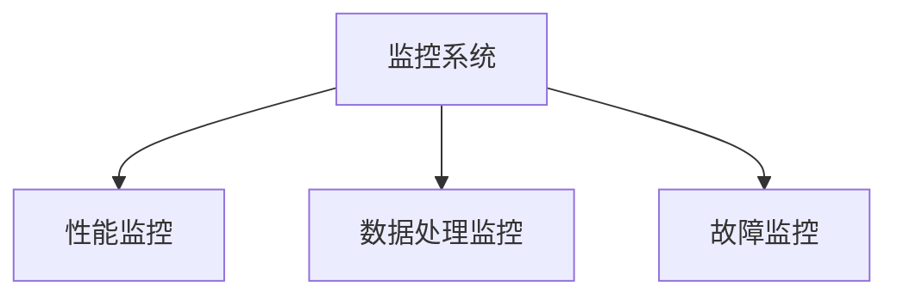

                 

## 文章标题

《Storm原理与代码实例讲解》

在快速发展的现代信息技术领域，实时数据处理变得愈加重要。Apache Storm作为一个分布式实时大数据处理框架，因其高效、可靠和灵活的特性而受到广泛关注。本文旨在深入剖析Storm的原理，并通过具体的代码实例，帮助读者理解和掌握Storm的使用方法。

## 文章关键词

- Apache Storm
- 分布式实时数据处理
- Topology
- Spout
- Bolt
- Streams
- 代码实例

## 文章摘要

本文首先介绍了Apache Storm的基本概念和架构，随后深入探讨了其核心组件和概念，包括Topology、Spout和Bolt。通过详细的原理讲解和伪代码展示，本文帮助读者理解Storm的工作机制。接着，本文通过两个具体的代码实例，详细讲解了如何使用Storm进行实时日志分析和流处理系统监控。最后，本文总结了Storm的最佳实践，并展望了其未来的发展趋势。

## 第1章 Storm简介与基础

### 1.1 什么是Storm

Apache Storm是一个分布式、可靠和灵活的实时数据处理系统。它由Twitter开发，并于2011年捐赠给Apache软件基金会。Storm的设计目标是提供一种能够处理海量数据的分布式计算能力，同时确保数据处理的准确性和实时性。

### 1.2 Storm的优势

- **实时处理**：Storm能够实时处理数据流，这使得它非常适合需要实时分析的应用场景，如社交网络数据流分析、交易系统实时监控等。
- **高吞吐量**：Storm具备很高的吞吐量，能够在短时间内处理大量数据。
- **容错性**：Storm具有强大的容错机制，能够在节点失败时自动进行恢复。
- **易扩展**：Storm支持动态扩展，可以根据需要增加或减少处理能力。

### 1.3 Storm的架构

Storm的架构主要包括以下几个核心组件：

- **Topology**：拓扑是Storm中的核心概念，代表了数据处理流程的图。它由多个Bolt和Spout组成，通过流的连接实现数据的处理和转换。
- **Spout**：Spout是数据源的生产者，它负责生成数据流。
- **Bolt**：Bolt是数据处理单元，它可以对输入数据进行处理、转换和输出。
- **Streams**：Stream是数据传输的通道，用于连接Spout和Bolt。
- **acker**：acker机制用于确认数据的处理成功，确保数据不会丢失。

### 1.4 Storm生态系统

Storm的生态系统非常丰富，包括许多与Storm兼容的工具和库：

- **Storm UI**：提供了直观的Web界面，用于监控和管理Storm集群。
- **Kafka**：Storm与Kafka集成，可以使用Kafka作为数据源或数据存储。
- **HDFS**：Storm支持与HDFS的集成，可以方便地将数据存储在HDFS中。
- **Zookeeper**：用于协调和分布式锁管理，确保Storm集群的稳定运行。

## 第2章 Storm核心概念与架构

### 2.1 Stream处理

Stream处理是Storm的核心概念，代表了数据的流动。Stream是由多个Tuple组成的有序序列，每个Tuple包含一组键值对。Stream处理主要通过Spout和Bolt之间的连接来实现。

### 2.2 Topology

Topology是Storm中的数据处理流程图，代表了数据从输入到输出的整个处理过程。Topology由多个Bolt和Spout组成，通过Streams连接。

### 2.3 Spout

Spout是数据源的生产者，负责生成数据流。Spout可以是随机数据生成器、网络数据包捕获器或数据库查询结果等。

### 2.4 Bolt

Bolt是数据处理单元，负责对输入数据进行处理、转换和输出。Bolt可以是简单的数据过滤器、复杂的计算处理单元或数据存储的写入器。

### 2.5 Streams

Streams是数据传输的通道，用于连接Spout和Bolt。Stream定义了数据流动的方向和类型，可以通过不同的策略进行分区和负载均衡。

### 2.6 acker机制

acker机制用于确认数据的处理成功，确保数据不会丢失。每个Tuple在处理完成后，会通过acker机制向Spout或Bolt发送确认消息。

## 第3章 Storm配置与部署

### 3.1 Storm配置文件

Storm配置文件主要用于配置Storm集群的各种参数，如拓扑名称、处理并发度、资源分配等。配置文件通常以properties格式编写。

### 3.2 Storm集群部署

部署Storm集群通常分为以下几个步骤：

1. 安装Java环境。
2. 下载和安装Storm。
3. 配置Storm配置文件。
4. 启动Storm集群。

### 3.3 Storm的YARN集成

Storm支持与YARN的集成，可以通过YARN调度和分配Storm拓扑的资源。集成步骤包括：

1. 配置YARN和Storm。
2. 启动YARN和Storm集群。

### 3.4 Storm的Mesos集成

Storm也支持与Mesos的集成，通过Mesos进行资源管理和调度。集成步骤与YARN类似，主要包括配置和启动。

## 第4章 Storm核心算法与实现

### 4.1 数据流处理算法

Storm中的数据流处理算法主要包括数据读取、数据处理和数据处理输出。

#### 4.1.1 数据源连接与数据读取

数据源连接与数据读取通常通过Spout实现。Spout需要实现`nextTuple()`方法，用于读取数据并生成Tuple。

```java
public class SimpleSpout implements Spout {
    public void nextTuple() {
        // 读取数据并生成Tuple
        topology.Context.emit(new Values("data_value"));
    }
}
```

#### 4.1.2 数据处理与转换

数据处理与转换主要通过Bolt实现。Bolt需要实现`execute()`方法，用于处理输入数据并生成输出数据。

```java
public class SimpleBolt implements IBolt {
    public void execute(Tuple input, BasicOutputCollector collector) {
        // 处理输入数据
        String data = input.getStringByField("data");
        collector.emit(new Values(data.toUpperCase()));
    }
}
```

#### 4.1.3 数据存储与输出

数据存储与输出可以通过Bolt实现，也可以通过外部系统实现。以下是一个简单的Bolt，用于将数据存储到文件系统中。

```java
public class FileBolt implements IBolt {
    private String outputPath;

    public void prepare(Map stormConf, TopologyContext context, OutputCollector collector) {
        outputPath = stormConf.get("output_path").toString();
    }

    public void execute(Tuple input, OutputCollector collector) {
        // 处理输入数据
        String data = input.getStringByField("data");

        // 存储数据到文件系统
        try (FileWriter writer = new FileWriter(outputPath, true)) {
            writer.write(data + "\n");
        } catch (IOException e) {
            e.printStackTrace();
        }
    }
}
```

### 4.2 实时分析算法

实时分析算法是Storm的核心应用之一。以下是一个简单的实时分析算法示例，用于计算数据流中的最大值。

```java
public class MaxValueBolt implements IBolt {
    private volatile Integer maxValue = Integer.MIN_VALUE;

    public void execute(Tuple input, BasicOutputCollector collector) {
        // 处理输入数据
        Integer value = input.getIntegerByField("value");

        // 更新最大值
        if (value > maxValue) {
            maxValue = value;
        }

        // 发送最大值
        collector.emit(new Values(maxValue));
    }
}
```

## 第5章 Storm代码实例讲解

### 5.1 实时日志分析

#### 5.1.1 实时日志分析场景

实时日志分析是一个常见的应用场景，例如在服务器日志中查找异常行为或监控日志中的错误数量。以下是一个简单的实时日志分析示例。

```java
public class LogAnalysisTopology {
    public static void main(String[] args) {
        Config conf = new Config();
        conf.setDebug(true);

        StormTopology topology = new TopologyBuilder().createTopology();

        // 读取日志文件作为Spout
        topology.setSpout("log_reader", new LogReaderSpout(), 1);

        // 解析日志
        topology.setBolt("log_parser", new LogParserBolt(), 2).shuffleGrouping("log_reader");

        // 计算错误数量
        topology.setBolt("error_counter", new ErrorCounterBolt(), 1).fieldsGrouping("log_parser", new Fields("log_type"));

        // 输出结果
        topology.setBolt("log_output", new LogOutputBolt(), 1).shuffleGrouping("error_counter");

        StormSubmitter.submitTopology("log_analysis", conf, topology);
    }
}
```

#### 5.1.2 代码实现

- `LogReaderSpout`：读取日志文件，生成日志数据流。
- `LogParserBolt`：解析日志，生成带有字段的数据流。
- `ErrorCounterBolt`：计算日志中的错误数量。
- `LogOutputBolt`：输出结果到控制台或文件。

#### 5.1.3 代码解读

本示例通过读取日志文件，解析日志并计算错误数量，实现了实时日志分析。每个组件都有明确的职责，通过流的连接实现了数据处理的整个流程。

### 5.2 流处理系统监控

#### 5.2.1 监控系统架构

流处理系统监控通常包括以下几个方面：

- **系统性能监控**：监控系统的CPU、内存、磁盘使用情况等。
- **数据处理监控**：监控数据处理的吞吐量、延迟等指标。
- **故障监控**：监控系统的异常行为和故障。

以下是一个简单的监控系统架构：



#### 5.2.2 监控系统实现

监控系统实现包括以下几个组件：

- **性能监控组件**：收集系统性能数据，如CPU、内存使用情况。
- **数据处理监控组件**：收集数据处理相关数据，如吞吐量、延迟。
- **故障监控组件**：监控系统的异常行为和故障。

以下是一个简单的监控实现示例：

```java
public class PerformanceMonitor implements IMonitor {
    public void collectMetrics() {
        // 收集性能数据
        double cpuUsage = System.currentTimeMillis() - System.nanoTime();
        double memoryUsage = Runtime.getRuntime().totalMemory() - Runtime.getRuntime().freeMemory();

        // 发送性能数据
        MetricsSender.sendMetric("cpu_usage", cpuUsage);
        MetricsSender.sendMetric("memory_usage", memoryUsage);
    }
}
```

#### 5.2.3 监控系统代码解读

本示例实现了性能监控组件，通过定期收集性能数据并发送到监控服务器。监控系统可以根据收集的数据进行实时分析，及时发现和处理系统故障。

## 第6章 Storm最佳实践

### 6.1 拓扑设计最佳实践

- **模块化设计**：将拓扑分解为多个模块，每个模块负责不同的数据处理任务。
- **复用组件**：复用已验证的组件，减少开发和维护成本。
- **负载均衡**：合理分配处理能力，确保数据处理的高效性。

### 6.2 集群部署与维护

- **监控和报警**：实时监控系统性能，及时发现和处理故障。
- **备份和恢复**：定期备份系统数据和配置文件，确保数据的完整性和可用性。
- **性能优化**：根据系统负载进行性能优化，提高数据处理能力。

### 6.3 Storm与新技术融合

- **容器化**：使用Docker等容器技术，实现Storm集群的自动化部署和管理。
- **云计算**：利用云计算资源，实现Storm集群的弹性扩展和高效利用。

## 第7章 Storm未来发展趋势与展望

- **开源生态**：随着社区的不断壮大，Storm的开源生态将更加丰富。
- **云计算集成**：随着云计算的普及，Storm将更好地与云计算平台集成，实现高效的数据处理。
- **实时分析算法**：随着人工智能和机器学习技术的发展，Storm将引入更多的实时分析算法，提高数据处理的智能化程度。

## 附录

### 8.1 Storm常用工具和资源

- **Storm官网**：提供最新的Storm文档、下载链接和社区论坛。
- **Storm官方文档**：详细介绍Storm的安装、配置和使用方法。
- **GitHub**：Storm的源代码仓库，可以查看最新的社区贡献和Bug修复。

### 8.2 Storm常见问题解答

- **如何处理节点故障？**
- **如何优化拓扑性能？**
- **如何确保数据一致性？**
- **如何与外部系统集成？**

## 作者信息

作者：AI天才研究院/AI Genius Institute & 禅与计算机程序设计艺术 /Zen And The Art of Computer Programming

在本文中，我们深入讲解了Apache Storm的原理和代码实例，通过具体的案例展示了如何使用Storm进行实时数据处理。通过本文的学习，读者应该能够掌握Storm的核心概念和架构，并能够使用Storm解决实际问题。随着实时数据处理需求的不断增加，Storm作为一种高效、可靠的分布式处理框架，将在未来的大数据领域中发挥重要作用。希望本文能够为读者提供有价值的参考和启发。

