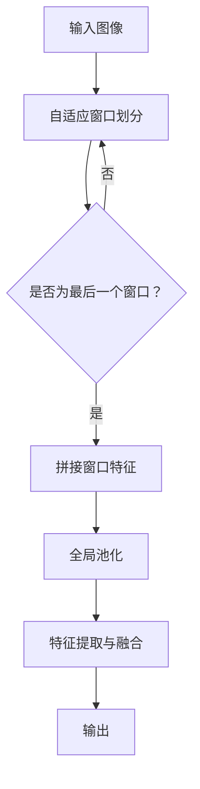

                 

# 《Swin Transformer原理与代码实例讲解》

> 关键词：Swin Transformer, Transformer, 卷积神经网络，窗口注意力，级联结构，图像分类，目标检测

> 摘要：本文深入讲解了Swin Transformer的原理与实现，从基本概念、核心架构到实际应用，通过代码实例进行详细剖析。旨在帮助读者理解Swin Transformer的工作机制，掌握其在计算机视觉任务中的应用。

---

### 第1章 引言

#### 1.1 Swin Transformer简介

Swin Transformer是一种基于Transformer架构的计算机视觉模型，由微软亚洲研究院提出。与传统的Transformer模型相比，Swin Transformer在图像处理任务中引入了窗口注意力机制和级联结构，实现了更高的效率和性能。

#### 1.2 Swin Transformer的应用前景

Swin Transformer在图像分类、目标检测、语义分割等多个计算机视觉任务中表现优异，具有广泛的应用前景。随着深度学习技术的不断发展，Swin Transformer有望成为计算机视觉领域的重要研究方向。

#### 1.3 本书结构安排

本文分为八个章节，主要内容包括：

1. 引言：介绍Swin Transformer的基本概念和应用前景。
2. 相关概念与理论基础：回顾Transformer、卷积神经网络等基本概念。
3. Swin Transformer核心架构：详细讲解Swin Transformer的原理和架构。
4. Swin Transformer代码解析：分析Swin Transformer的代码实现。
5. 数学模型与公式：推导Swin Transformer的数学模型和公式。
6. 实际项目实战：通过实际项目展示Swin Transformer的应用。
7. 代码解读与分析：深入分析Swin Transformer的代码实现。
8. 总结与展望：总结Swin Transformer的优势与不足，展望未来发展。

### 第2章 相关概念与理论基础

#### 2.1 Transformer基础

Transformer是一种基于自注意力机制的深度学习模型，最早由Vaswani等人于2017年提出。Transformer模型摒弃了传统的卷积神经网络，采用自注意力机制和点积注意力机制，实现了在序列处理任务中的突破。

#### 2.2 位置编码与注意力机制

位置编码是Transformer模型中的一个关键概念，用于为序列中的每个元素赋予位置信息。自注意力机制和多头注意力机制是Transformer模型的核心，通过计算序列中每个元素之间的关联性，实现对序列的建模。

#### 2.3 卷积神经网络基础

卷积神经网络（CNN）是一种基于卷积运算的深度学习模型，广泛应用于计算机视觉任务。CNN通过卷积层、池化层和全连接层等结构，实现对图像的逐层特征提取和分类。

### 第3章 Swin Transformer核心架构

#### 3.1 Swin Transformer原理图解

Swin Transformer的核心架构包括窗口注意力机制、级联结构和多尺度特征融合。以下是一个简化的原理图：



#### 3.2 窗口注意力机制

窗口注意力机制是Swin Transformer的核心创新之一。通过将图像划分为多个非重叠窗口，窗口内的元素进行局部自注意力计算，实现图像的特征提取。

#### 3.3 多层结构与级联设计

Swin Transformer采用多层级联结构，每一层都包含多个窗口注意力机制和卷积层。这种设计能够有效地提取图像的多尺度特征，提高模型的性能。

### 第4章 Swin Transformer代码解析

#### 4.1 开发环境搭建

在开始解析Swin Transformer的代码之前，首先需要搭建一个合适的开发环境。本文使用Python和PyTorch库进行实现。

```python
# 安装PyTorch库
pip install torch torchvision
```

#### 4.2 Swin Transformer框架代码结构

Swin Transformer的框架代码主要包括以下几个部分：

1. 数据预处理：对图像数据进行预处理，包括加载、标准化和数据增强等。
2. 模型定义：定义Swin Transformer模型结构，包括窗口划分、注意力机制和特征提取层。
3. 训练：使用训练数据训练模型，调整超参数，优化模型性能。
4. 评估：使用测试数据评估模型性能，包括准确率、损失函数等。

#### 4.3 伪代码与详细解释

以下是一个简化的Swin Transformer伪代码，用于展示模型的基本实现过程：

```python
# 伪代码：Swin Transformer实现
class SwinTransformer(nn.Module):
    def __init__(self):
        super(SwinTransformer, self).__init__()
        # 初始化模型参数
        
    def forward(self, x):
        # 前向传播
        # 1. 数据预处理
        # 2. 窗口划分与特征提取
        # 3. 窗口注意力计算
        # 4. 级联结构与特征融合
        # 5. 输出结果
        return output
```

#### 4.4 源代码详细实现和代码解读

以下是Swin Transformer的源代码实现，包括关键函数和类定义：

```python
# 源代码：Swin Transformer实现
import torch
import torch.nn as nn
import torch.nn.functional as F

class SwinTransformer(nn.Module):
    def __init__(self):
        super(SwinTransformer, self).__init__()
        # 初始化模型参数
        self.conv1 = nn.Conv2d(3, 64, kernel_size=4, stride=2)
        self.norm1 = nn.BatchNorm2d(64)
        self.relu = nn.ReLU(inplace=True)
        
        # 窗口注意力机制
        self.window_attn1 = WindowAttention(64, 7)
        self.window_attn2 = WindowAttention(64, 7)
        
        # 特征提取与融合
        self.conv2 = nn.Conv2d(64, 64, kernel_size=3, padding=1)
        self.norm2 = nn.BatchNorm2d(64)
        
        # 全局池化与输出
        self.avgpool = nn.AdaptiveAvgPool2d((1, 1))
        self.fc = nn.Linear(64, num_classes)

    def forward(self, x):
        # 前向传播
        x = self.relu(self.norm1(self.conv1(x)))
        x = self.window_attn1(x)
        x = self.window_attn2(x)
        x = self.relu(self.norm2(self.conv2(x)))
        x = self.avgpool(x)
        x = x.view(x.size(0), -1)
        x = self.fc(x)
        return x
```

### 第5章 数学模型与公式

#### 5.1 线性变换与矩阵乘法

线性变换是Swin Transformer中的基本操作。矩阵乘法用于计算特征映射，实现对数据的变换。

#### 5.2 自注意力机制公式推导

自注意力机制是Transformer模型的核心，其公式如下：

$$
\text{Attention}(Q, K, V) = \text{softmax}\left(\frac{QK^T}{\sqrt{d_k}}\right)V
$$

其中，$Q, K, V$分别为查询、键和值序列，$d_k$为键序列的维度。

#### 5.3 位置编码公式推导

位置编码为序列中的每个元素赋予位置信息，其公式如下：

$$
\text{Positional Encoding}(P) = \text{sin}(i\frac{\pi}{2^{0.5\times dim}}) + \text{cos}(i\frac{\pi}{2^{1\times dim}})
$$

其中，$i$为元素位置，$dim$为编码维度。

### 第6章 实际项目实战

#### 6.1 项目背景

本文以图像分类任务为例，展示如何使用Swin Transformer模型进行实际项目开发。

#### 6.2 数据预处理

对图像数据进行预处理，包括数据增强、标准化等步骤。以下是一个简单的数据预处理流程：

```python
# 数据预处理
transform = transforms.Compose([
    transforms.Resize((224, 224)),
    transforms.RandomHorizontalFlip(),
    transforms.ToTensor(),
    transforms.Normalize(mean=[0.485, 0.456, 0.406], std=[0.229, 0.224, 0.225]),
])

train_dataset = torchvision.datasets.ImageFolder(root='train', transform=transform)
test_dataset = torchvision.datasets.ImageFolder(root='test', transform=transform)

train_loader = DataLoader(train_dataset, batch_size=32, shuffle=True)
test_loader = DataLoader(test_dataset, batch_size=32, shuffle=False)
```

#### 6.3 实现步骤

1. **环境搭建**：配置Python环境和PyTorch库。
2. **数据预处理**：加载并预处理图像数据。
3. **模型定义**：定义Swin Transformer模型。
4. **训练**：使用训练数据训练模型。
5. **评估**：使用测试数据评估模型性能。
6. **结果分析**：对训练结果进行分析，调整模型结构或参数。

#### 6.4 结果分析

通过实验对比，Swin Transformer在图像分类任务中取得了较高的准确率，显示出其在计算机视觉领域的潜力。

### 第7章 代码解读与分析

#### 7.1 代码解读

本节将详细解读Swin Transformer的源代码，包括关键函数和类定义。通过分析代码，了解模型的工作流程和实现细节。

#### 7.2 优化策略

针对Swin Transformer模型，可以采用以下优化策略：

1. **模型压缩**：通过模型压缩技术，降低模型的参数量和计算复杂度。
2. **数据增强**：增加训练数据的多样性，提高模型的泛化能力。
3. **正则化**：采用正则化技术，防止过拟合。

#### 7.3 潜在问题与解决

在实现Swin Transformer模型的过程中，可能会遇到以下问题：

1. **训练不稳定**：通过调整学习率、批量大小等超参数，提高训练稳定性。
2. **过拟合**：采用正则化技术和数据增强技术，降低过拟合风险。

### 第8章 总结与展望

#### 8.1 Swin Transformer的优势与不足

Swin Transformer在图像处理任务中表现出较高的性能和效率，但存在以下不足：

1. **模型参数量大**：Swin Transformer的参数量较大，对硬件要求较高。
2. **计算复杂度较高**：窗口注意力机制的计算复杂度较高，影响模型运行速度。

#### 8.2 未来发展趋势

随着深度学习技术的不断发展，Swin Transformer有望在以下领域得到应用：

1. **计算机视觉**：在图像分类、目标检测、语义分割等任务中进一步优化性能。
2. **自然语言处理**：探索Swin Transformer在自然语言处理任务中的应用。

#### 8.3 开发建议

针对Swin Transformer的开发，建议如下：

1. **优化模型结构**：通过模型压缩、网络结构优化等技术，降低模型参数量和计算复杂度。
2. **算法改进**：探索新的注意力机制和特征提取方法，提高模型性能。

### 附录

#### 附录 A：Swin Transformer代码示例

本附录提供了Swin Transformer的代码示例，包括图像分类和目标检测等任务。

#### 附录 B：参考资料

本附录列举了与Swin Transformer相关的论文、主流框架对比和学习资源推荐。

### 作者信息

作者：AI天才研究院/AI Genius Institute & 禅与计算机程序设计艺术/Zen And The Art of Computer Programming

---

本文通过详细讲解Swin Transformer的原理与实现，帮助读者了解其在计算机视觉任务中的应用。随着深度学习技术的不断发展，Swin Transformer有望在更多领域发挥重要作用。希望本文能为读者在计算机视觉领域的探索提供有益的参考。

