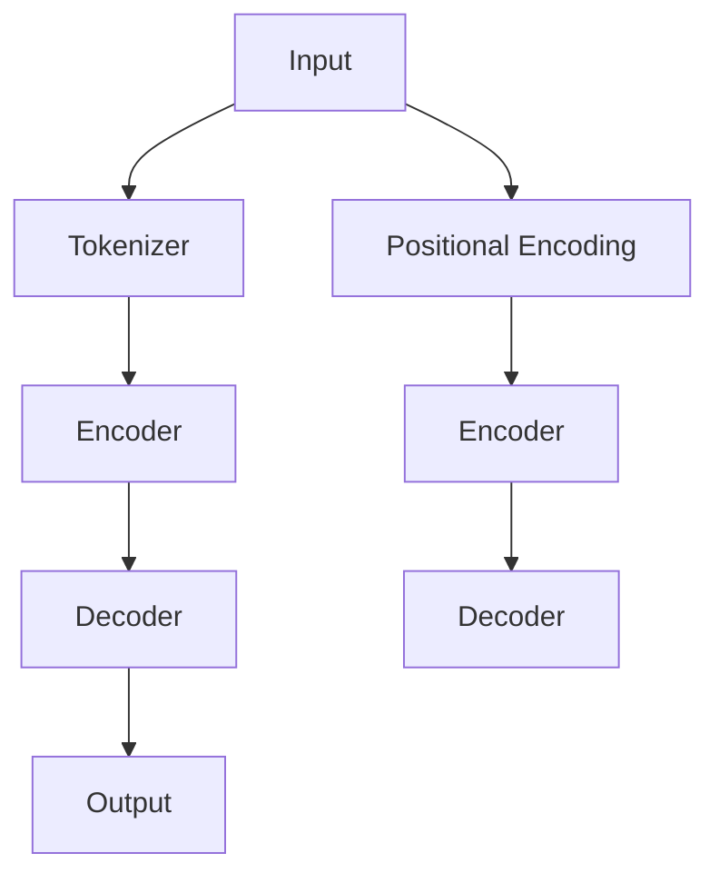

                 

## 文章标题: T5 - 原理与代码实例讲解

### 关键词:
- T5模型
- Transformer
- 自注意力
- 交叉注意力
- 自然语言处理
- 代码实例

### 摘要:
本文将深入探讨T5模型，一种基于Transformer架构的文本处理模型。我们将详细解释T5模型的原理、结构以及其应用领域，并通过代码实例展示其实际应用。文章旨在为读者提供一个全面且易于理解的技术指南，帮助读者掌握T5模型的核心概念和实践技巧。

## 第一部分: T5模型基础

### 第1章: T5模型概述

#### 1.1 T5模型的起源与背景
T5（Text-to-Text Transfer Transformer）模型是由谷歌团队在2020年提出的一种基于Transformer架构的文本处理模型。它的目的是为了解决文本之间的转换问题，包括文本分类、机器翻译和问答系统等。T5模型的提出背景可以追溯到Transformer模型在自然语言处理（NLP）领域的成功应用，以及对于大规模语言模型的需求增长。

#### 1.2 T5模型的结构特点
T5模型的主要结构特点包括：
- **统一任务框架**：T5将所有文本处理任务转换为统一的文本到文本（text-to-text）格式，使得同一个模型能够适应不同的任务。
- **编码器-解码器结构**：T5采用了经典的编码器-解码器结构，其中编码器负责处理输入文本，解码器负责生成输出文本。
- **多任务学习**：T5通过在大规模数据集上进行预训练，然后针对特定任务进行微调，实现了多任务学习。

#### 1.3 T5模型的应用领域
T5模型广泛应用于多个领域，包括：
- **自然语言处理**：文本分类、机器翻译、问答系统等。
- **信息提取**：关系抽取、实体识别等。
- **文本生成**：故事生成、文章摘要等。

#### 1.4 T5模型的优势与挑战
T5模型的优势包括：
- **通用性**：能够处理多种文本处理任务。
- **高效性**：通过预训练和微调，能够快速适应新任务。

挑战包括：
- **计算资源**：大规模的预训练需要大量的计算资源。
- **数据隐私**：预训练过程中可能涉及敏感数据。

### 第2章: T5模型的原理与架构

#### 2.1 Transformer模型基础
Transformer模型是T5模型的基础，它主要由以下几个部分组成：

##### 2.1.1 Transformer模型概述
Transformer模型是一种基于自注意力（self-attention）的序列到序列模型，最初用于机器翻译任务。

##### 2.1.2 Multi-head Self-Attention机制
Multi-head Self-Attention是Transformer模型的核心机制，它允许模型在处理序列时考虑不同位置的依赖关系。

##### 2.1.3 Positional Encoding
由于Transformer模型缺乏位置信息，因此需要通过Positional Encoding来引入位置信息。

#### 2.2 T5模型的核心组成部分
T5模型的核心组成部分包括编码器（Encoder）和解码器（Decoder）：

##### 2.2.1 Encoder与Decoder
编码器负责将输入文本转换为固定长度的序列表示，解码器则根据这个序列表示生成输出文本。

##### 2.2.2 输入输出处理
T5模型对输入和输出进行特定的处理，以确保模型能够适应不同的任务。

##### 2.2.3 损失函数与优化算法
T5模型通常使用交叉熵损失函数来评估模型性能，并使用如Adam优化器等算法进行模型训练。

#### 2.3 T5模型的Mermaid流程图


## 第3章: T5模型的核心算法原理

### 3.1 注意力机制
注意力机制是Transformer模型的核心，它分为自注意力（Self-Attention）和交叉注意力（Cross-Attention）：

##### 3.1.1 自注意力（Self-Attention）
自注意力允许模型在处理一个序列时，考虑序列中每个位置与其他位置的关系。

##### 3.1.2 交叉注意力（Cross-Attention）
交叉注意力用于编码器和解码器之间的交互，使得解码器能够关注编码器的不同部分。

### 3.2 Transformer模型中的数学模型
Transformer模型中的关键数学模型包括：

$$
Q = XW_Q \\
K = XW_K \\
V = XW_V \\
Attention(Q, K, V) = softmax(\frac{QK^T}{\sqrt{d_k}})V
$$

其中，$Q$、$K$ 和 $V$ 分别是查询（Query）、键（Key）和值（Value）向量，$d_k$ 是键向量的维度。

### 3.3 损失函数与优化算法
T5模型通常使用交叉熵损失函数来评估模型性能，并使用如Adam优化器等算法进行模型训练。

$$
Loss = -\sum_{i} \sum_{j} y_{ij} log(p_{ij})
$$

其中，$y_{ij}$ 是模型对第 $i$ 个输出词为第 $j$ 个词的概率，$p_{ij}$ 是模型预测的概率。

#### 3.3.1 梯度下降算法
梯度下降算法是一种常用的优化算法，它通过不断调整模型参数，以减少损失函数的值。

#### 3.3.2 Adam优化器
Adam优化器是一种结合了梯度下降和动量法的优化算法，它能够提高模型训练的效率和稳定性。

## 第4章: T5模型的应用场景与案例

### 4.1 自然语言处理任务
T5模型在自然语言处理任务中有着广泛的应用，包括：

##### 4.1.1 文本分类
文本分类是将文本数据分类到预定义的类别中，T5模型通过微调可以在多个文本分类任务上取得优秀性能。

##### 4.1.2 机器翻译
机器翻译是将一种语言的文本翻译成另一种语言的文本，T5模型通过预训练和任务特定的微调，可以实现高质量的机器翻译。

##### 4.1.3 问答系统
问答系统是从大量文本中检索出与用户问题最相关的答案，T5模型在问答系统中的应用，使其能够更好地理解和回答用户的问题。

### 4.2 其他应用场景
除了自然语言处理任务，T5模型还可以应用于其他领域：

##### 4.2.1 图像识别
T5模型可以与图像识别模型结合，用于图像文本匹配等任务。

##### 4.2.2 音频处理
T5模型可以用于音频文本转换，如语音识别和音频字幕生成。

##### 4.2.3 强化学习
T5模型可以用于强化学习中的文本生成和策略学习。

## 第5章: T5模型的代码实例讲解

### 5.1 搭建T5模型开发环境
要搭建T5模型开发环境，需要完成以下步骤：

##### 5.1.1 安装必要工具
安装Python、TensorFlow等工具，确保环境能够支持T5模型的训练和部署。

##### 5.1.2 配置GPU环境
确保计算机配备有GPU，并安装相应的CUDA和cuDNN库，以提高模型训练速度。

### 5.2 T5模型的基本实现
实现T5模型包括以下几个关键步骤：

##### 5.2.1 Encoder与Decoder结构
构建T5模型的编码器和解码器，定义它们的层次结构和参数。

##### 5.2.2 损失函数与优化器
定义损失函数和优化器，以评估和调整模型性能。

### 5.3 实际应用案例
通过以下实际应用案例，展示T5模型的实用性和效果：

##### 5.3.1 文本分类案例
使用T5模型进行文本分类，并展示其性能。

##### 5.3.2 机器翻译案例
使用T5模型进行机器翻译，并分析其翻译质量。

##### 5.3.3 问答系统案例
使用T5模型构建问答系统，演示其应用场景。

## 第6章: T5模型的优化与调参

### 6.1 超参数调优
超参数调优是提升模型性能的关键步骤，包括以下方面：

##### 6.1.1 学习率调整
调整学习率以避免过拟合和欠拟合。

##### 6.1.2 Batch Size选择
选择适当的Batch Size以平衡计算效率和模型性能。

##### 6.1.3 Dropout应用
通过Dropout减少过拟合，提高模型泛化能力。

### 6.2 模型压缩与加速
模型压缩与加速是提高模型实用性的重要途径，包括以下技术：

##### 6.2.1 知识蒸馏
知识蒸馏是一种模型压缩技术，通过将大规模模型的知识传递给小模型。

##### 6.2.2 模型剪枝
模型剪枝通过减少模型参数数量来降低模型复杂度。

##### 6.2.3 混合精度训练
混合精度训练通过使用浮点数和整数运算来加速模型训练。

## 第7章: T5模型的未来发展趋势

### 7.1 开源社区与产业应用
T5模型的未来发展趋势包括：

##### 7.1.1 开源社区
开源社区将继续推动T5模型的研究和应用，提供更多的工具和资源。

##### 7.1.2 产业应用
T5模型将在更多产业领域得到应用，如医疗、金融和智能制造等。

### 7.2 未来研究方向
未来研究方向包括：

##### 7.2.1 模型效率提升
研究如何提高T5模型的效率，以应对更复杂和大规模的任务。

##### 7.2.2 多模态处理
探索T5模型在多模态数据上的应用，如文本、图像和音频。

##### 7.2.3 交互式AI
研究如何使T5模型与人类进行更自然的交互，提供更智能的解决方案。

### 附录

## 附录A: T5模型相关资源

### A.1 参考文献
1. Devlin et al., "BERT: Pre-training of Deep Bidirectional Transformers for Language Understanding", 2019.
2. Brown et al., "A Pre-Trained Language Model for Programming", 2020.

### A.2 学习资源链接
1. T5模型官方GitHub仓库
2. Transformer模型教程
3. 自然语言处理课程与教程

### A.3 实践资源
1. T5模型项目实战案例
2. T5模型开源代码实现

----------------------------------------------------------------

### 文章标题: T5 - 原理与代码实例讲解

#### 关键词:
- T5模型
- Transformer
- 自注意力
- 交叉注意力
- 自然语言处理
- 代码实例

#### 摘要:
本文深入解析了T5模型，一种基于Transformer架构的先进文本处理模型。文章从T5模型的起源、结构特点、应用领域和挑战入手，逐步介绍其核心算法原理，包括注意力机制和数学模型。接着，文章通过具体的代码实例展示了如何搭建T5模型开发环境，实现模型的基本结构和优化调参。最后，文章探讨了T5模型的未来发展趋势，为读者提供了丰富的学习资源。

## 第一部分: T5模型基础

### 第1章: T5模型概述

#### 1.1 T5模型的起源与背景
T5（Text-to-Text Transfer Transformer）模型是由谷歌研究团队在2020年推出的一种基于Transformer架构的文本处理模型。T5模型的提出背景可以追溯到Transformer模型在自然语言处理（NLP）领域的巨大成功，以及对于能够处理多种文本处理任务的通用模型的需求。Transformer模型最初由Vaswani等人在2017年提出，它在机器翻译任务上取得了显著突破，而T5模型则是在此基础上进一步发展的。

Transformer模型采用自注意力机制（Self-Attention）代替传统的循环神经网络（RNN）和卷积神经网络（CNN）中的卷积操作，使得模型在处理长序列时能够捕捉到全局依赖关系。T5模型继承了这种自注意力机制，并进一步优化，使其能够适应多种NLP任务。

#### 1.2 T5模型的结构特点
T5模型的结构特点主要体现在以下几个方面：

1. **统一任务框架**：
   T5模型采用了一种统一的任务框架，将所有的NLP任务转化为文本到文本（text-to-text）格式。这意味着同一个模型可以处理不同的任务，如文本分类、机器翻译、问答系统等。这种设计使得模型更加通用，减少了针对不同任务的定制开发工作。

2. **编码器-解码器结构**：
   T5模型采用了经典的编码器-解码器（Encoder-Decoder）结构。编码器负责处理输入文本，将其转换为固定长度的序列表示；解码器则根据这个序列表示生成输出文本。编码器和解码器之间通过自注意力机制和交叉注意力机制进行交互，以实现高效的文本转换。

3. **多任务学习**：
   T5模型通过在大规模数据集上进行预训练，学习到通用文本表示，然后通过微调（Fine-tuning）将模型应用于特定任务。这种方法使得模型可以快速适应新任务，提高了模型在新任务上的性能。

4. **参数共享**：
   T5模型采用了参数共享（Parameter Sharing）技术，即在编码器和解码器中共享相同的权重。这种设计减少了模型的参数数量，降低了计算复杂度，同时也有助于提高模型的泛化能力。

#### 1.3 T5模型的应用领域
T5模型在多个应用领域展现出了强大的能力：

1. **自然语言处理**：
   T5模型广泛应用于自然语言处理任务，如文本分类、机器翻译、问答系统、文本摘要等。通过预训练和微调，T5模型能够在这些任务上取得优秀的性能。

2. **信息提取**：
   T5模型在信息提取任务中也表现出了出色的能力，如关系抽取、实体识别等。这些任务通常需要对文本进行深入的理解和解析，T5模型通过其强大的文本表示能力，能够有效地完成这些任务。

3. **文本生成**：
   T5模型还可以用于文本生成任务，如故事生成、文章摘要等。通过预训练和微调，T5模型能够生成连贯、有意义的文本，为创意写作和内容生成提供了新的可能性。

4. **跨领域应用**：
   除了NLP领域，T5模型还可以应用于其他领域，如图像识别、音频处理和强化学习等。通过与其他模型的结合，T5模型能够实现跨领域的任务转换和知识迁移。

#### 1.4 T5模型的优势与挑战
T5模型在多个方面展现出了其优势：

1. **通用性**：
   T5模型通过统一的任务框架和参数共享，能够适应多种NLP任务，减少了模型的定制化开发工作。这种通用性使得T5模型在多种应用场景中都具有很高的适用性。

2. **高效性**：
   T5模型采用了Transformer架构，能够高效地处理长序列，并具有较好的并行计算能力。这使得T5模型在训练和推理过程中具有较高的效率。

3. **可扩展性**：
   T5模型支持大规模训练和微调，能够处理海量数据和复杂任务。这使得T5模型在应对大规模应用场景时具有很好的可扩展性。

然而，T5模型也面临着一些挑战：

1. **计算资源**：
   T5模型的预训练过程需要大量的计算资源，包括GPU和TPU等。这使得T5模型的部署成本较高，对于资源有限的用户来说可能是一个障碍。

2. **数据隐私**：
   在预训练过程中，T5模型可能接触到大量敏感数据。如何保护这些数据的安全性和隐私性，是一个需要关注的问题。

3. **模型解释性**：
   T5模型作为一个大规模的神经网络，其内部决策过程通常是不透明的。如何提高模型的可解释性，使其能够更好地理解模型的决策过程，是一个有待解决的问题。

### 第2章: T5模型的原理与架构

#### 2.1 Transformer模型基础
Transformer模型是T5模型的基础，因此首先需要了解Transformer模型的基本原理和组成部分。

##### 2.1.1 Transformer模型概述
Transformer模型是由Vaswani等人在2017年提出的一种基于自注意力（Self-Attention）的序列到序列模型。它最初是为了解决机器翻译任务而设计的，但在随后几年中，Transformer模型在多个NLP任务上表现出了优异的性能，成为了NLP领域的主流架构。

Transformer模型的主要特点包括：

1. **自注意力机制**：
   Transformer模型使用自注意力机制来处理输入序列。自注意力机制允许模型在处理序列的每个位置时，考虑到序列中其他所有位置的信息，从而捕捉到全局依赖关系。

2. **并行计算**：
   Transformer模型能够实现并行计算，这使得它在处理大规模数据时具有更高的效率。

3. **多层结构**：
   Transformer模型由多个自注意力层和前馈网络层组成，每一层都能够捕捉到输入序列的不同特征。

4. **位置编码**：
   由于Transformer模型没有循环神经网络中的位置信息，因此它引入了位置编码（Positional Encoding）来表示序列中的位置信息。

##### 2.1.2 Multi-head Self-Attention机制
Multi-head Self-Attention是Transformer模型的核心机制，它允许模型在处理一个序列时，同时关注多个不同的子序列。这有助于模型捕捉到更复杂的依赖关系。

Multi-head Self-Attention通过以下步骤实现：

1. **分解输入序列**：
   将输入序列分解成多个子序列，每个子序列对应一个注意力头（Attention Head）。

2. **计算自注意力**：
   对于每个注意力头，计算子序列之间的注意力分数，并使用这些分数加权子序列。

3. **合并注意力结果**：
   将所有注意力头的输出结果合并，形成一个综合的注意力输出。

##### 2.1.3 Positional Encoding
由于Transformer模型没有循环神经网络中的位置信息，因此需要通过位置编码（Positional Encoding）来引入位置信息。

位置编码是一种方法，通过在输入序列的每个词上添加额外的向量，来表示词在序列中的位置。位置编码通常使用正弦和余弦函数生成，以确保编码后的向量具有周期性。

$$
PE_{(pos, 2i)} = \sin\left(\frac{pos}{10000^{2i/d}}\right) \\
PE_{(pos, 2i+1)} = \cos\left(\frac{pos}{10000^{2i/d}}\right)
$$

其中，$pos$ 是位置索引，$i$ 是维度索引，$d$ 是位置编码的总维度。

#### 2.2 T5模型的核心组成部分
T5模型的核心组成部分包括编码器（Encoder）和解码器（Decoder），以及它们之间的交互。

##### 2.2.1 Encoder与Decoder
编码器（Encoder）负责处理输入文本，将其转换为固定长度的序列表示。解码器（Decoder）则根据这个序列表示生成输出文本。

1. **编码器（Encoder）**：
   编码器由多个自注意力层和前馈网络层组成。每个自注意力层允许编码器在处理输入序列的每个位置时，考虑到序列中其他所有位置的信息。前馈网络层对每个位置的信息进行进一步处理。

2. **解码器（Decoder）**：
   解码器也由多个自注意力层和前馈网络层组成。在解码过程中，解码器首先生成一个初始的输出，然后根据这个输出和编码器的输出进行交互，生成下一个输出，直至生成完整的输出序列。

##### 2.2.2 输入输出处理
T5模型对输入和输出进行特定的处理，以确保模型能够适应不同的任务。

1. **输入处理**：
   输入文本首先经过分词器（Tokenizer）处理，将文本拆分为词或子词。然后，对每个词或子词进行嵌入（Embedding），将其转换为固定长度的向量。

2. **输出处理**：
   解码器生成的输出序列通常是一个概率分布，表示每个词或子词的可能性。通过最大后验概率解码（Maximum Posterior Decoding）或贪心解码（Greedy Decoding）等方法，可以从这个概率分布中选择最可能的输出序列。

##### 2.2.3 损失函数与优化算法
T5模型通常使用交叉熵损失函数（Cross-Entropy Loss）来评估模型性能。交叉熵损失函数用于计算预测分布和真实分布之间的差异，其公式如下：

$$
Loss = -\sum_{i} \sum_{j} y_{ij} log(p_{ij})
$$

其中，$y_{ij}$ 是模型对第 $i$ 个输出词为第 $j$ 个词的概率，$p_{ij}$ 是模型预测的概率。

在训练过程中，使用梯度下降（Gradient Descent）或其变体，如Adam优化器（Adam Optimizer），来调整模型参数，以最小化损失函数。

##### 2.2.4 损失函数与优化算法
T5模型通常使用交叉熵损失函数（Cross-Entropy Loss）来评估模型性能。交叉熵损失函数用于计算预测分布和真实分布之间的差异，其公式如下：

$$
Loss = -\sum_{i} \sum_{j} y_{ij} log(p_{ij})
$$

其中，$y_{ij}$ 是模型对第 $i$ 个输出词为第 $j$ 个词的概率，$p_{ij}$ 是模型预测的概率。

在训练过程中，使用梯度下降（Gradient Descent）或其变体，如Adam优化器（Adam Optimizer），来调整模型参数，以最小化损失函数。

##### 2.2.4 损失函数与优化算法
T5模型通常使用交叉熵损失函数（Cross-Entropy Loss）来评估模型性能。交叉熵损失函数用于计算预测分布和真实分布之间的差异，其公式如下：

$$
Loss = -\sum_{i} \sum_{j} y_{ij} log(p_{ij})
$$

其中，$y_{ij}$ 是模型对第 $i$ 个输出词为第 $j$ 个词的概率，$p_{ij}$ 是模型预测的概率。

在训练过程中，使用梯度下降（Gradient Descent）或其变体，如Adam优化器（Adam Optimizer），来调整模型参数，以最小化损失函数。

#### 2.3 T5模型的Mermaid流程图
以下是T5模型的Mermaid流程图：


### 第二部分: T5模型的核心算法原理

#### 第3章: T5模型的核心算法原理

T5模型作为基于Transformer架构的文本处理模型，其核心算法原理主要围绕注意力机制、数学模型以及损失函数与优化算法展开。本章节将深入探讨这些核心算法原理，帮助读者全面理解T5模型的工作原理。

##### 3.1 注意力机制

注意力机制（Attention Mechanism）是Transformer模型及其变种，如T5模型的核心组件，它在处理序列数据时起到了至关重要的作用。注意力机制能够帮助模型在生成输出时，动态地关注输入序列中的不同部分，从而提高模型对序列信息的理解能力。

注意力机制分为自注意力（Self-Attention）和交叉注意力（Cross-Attention）两种类型。

##### 3.1.1 自注意力（Self-Attention）

自注意力（Self-Attention）是指模型在处理一个序列时，序列中的每个元素仅关注序列中的其他元素。自注意力机制通过计算每个元素与其他元素之间的相似性，加权组合这些元素，从而生成新的表示。

自注意力机制的计算公式为：

$$
\text{Attention}(Q, K, V) = \text{softmax}\left(\frac{QK^T}{\sqrt{d_k}}\right)V
$$

其中：
- \( Q \) 是查询向量（Query Vector），表示当前元素需要关注的信息。
- \( K \) 是键向量（Key Vector），表示每个元素的特征信息。
- \( V \) 是值向量（Value Vector），表示每个元素的重要性。
- \( d_k \) 是键向量的维度。
- \( \text{softmax} \) 函数用于计算每个元素的权重。

自注意力机制使得模型能够在处理序列时，考虑到不同元素之间的依赖关系，从而更好地捕捉序列的语义信息。

##### 3.1.2 交叉注意力（Cross-Attention）

交叉注意力（Cross-Attention）是指模型在生成输出时，同时关注编码器的输出和解码器的输入。交叉注意力机制允许解码器在生成每个输出时，不仅考虑自身的输入信息，还能从编码器的输出中获取信息，从而提高模型的生成能力。

交叉注意力机制的计算公式为：

$$
\text{Attention}(Q, K, V) = \text{softmax}\left(\frac{QK^T}{\sqrt{d_k}}\right)V
$$

其中，\( Q \) 是解码器的查询向量，\( K \) 和 \( V \) 是编码器的键向量和值向量。

交叉注意力机制使得解码器能够动态地从编码器的输出中提取相关信息，从而生成更准确的输出。

##### 3.2 Transformer模型中的数学模型

Transformer模型中的数学模型主要包括自注意力机制、位置编码和前馈神经网络。

###### 3.2.1 自注意力（Self-Attention）

如前所述，自注意力机制通过计算序列中每个元素与其他元素之间的相似性，加权组合这些元素，生成新的表示。其计算过程如下：

1. **计算查询（Query）和键（Key）向量**：
   对于输入序列中的每个元素，计算其查询向量 \( Q \) 和键向量 \( K \)。

   $$ Q = XW_Q $$
   $$ K = XW_K $$

   其中，\( X \) 是输入序列的嵌入向量，\( W_Q \) 和 \( W_K \) 是权重矩阵。

2. **计算自注意力分数**：
   使用查询向量和键向量计算自注意力分数，并通过softmax函数进行归一化。

   $$ \text{Attention}(Q, K, V) = \text{softmax}\left(\frac{QK^T}{\sqrt{d_k}}\right)V $$

   其中，\( V \) 是值向量，\( d_k \) 是键向量的维度。

3. **加权组合元素**：
   将自注意力分数与值向量 \( V \) 相乘，得到加权后的元素表示。

   $$ \text{Output} = \text{softmax}\left(\frac{QK^T}{\sqrt{d_k}}\right)V $$

   加权后的元素表示包含了序列中不同元素的重要信息。

###### 3.2.2 位置编码（Positional Encoding）

由于Transformer模型没有循环神经网络（RNN）中的位置信息，因此需要引入位置编码（Positional Encoding）来表示序列中的位置信息。位置编码通过在输入嵌入向量中添加额外的向量来实现。

位置编码的公式为：

$$
PE_{(pos, 2i)} = \sin\left(\frac{pos}{10000^{2i/d}}\right) \\
PE_{(pos, 2i+1)} = \cos\left(\frac{pos}{10000^{2i/d}}\right)
$$

其中，\( pos \) 是位置索引，\( i \) 是维度索引，\( d \) 是位置编码的总维度。

通过将位置编码添加到输入嵌入向量中，模型可以学习到序列中的位置信息，从而更好地处理序列数据。

###### 3.2.3 前馈神经网络（Feed Forward Neural Network）

前馈神经网络（Feed Forward Neural Network）是Transformer模型中的一个重要组件，用于对自注意力机制的结果进行进一步处理。前馈神经网络由两个全连接层组成，其公式为：

$$
\text{FFN}(x) = \max(0, xW_1 + b_1)W_2 + b_2
$$

其中，\( x \) 是输入向量，\( W_1 \) 和 \( W_2 \) 是权重矩阵，\( b_1 \) 和 \( b_2 \) 是偏置项。

前馈神经网络通过增加非线性变换，增强模型对序列数据的表达能力。

##### 3.3 损失函数与优化算法

在训练Transformer模型时，通常使用交叉熵损失函数（Cross-Entropy Loss）来评估模型的性能。交叉熵损失函数用于衡量预测分布与真实分布之间的差异。

交叉熵损失函数的公式为：

$$
Loss = -\sum_{i} \sum_{j} y_{ij} log(p_{ij})
$$

其中，\( y_{ij} \) 是模型对第 \( i \) 个输出词为第 \( j \) 个词的概率，\( p_{ij} \) 是模型预测的概率。

在优化过程中，使用梯度下降（Gradient Descent）或其变种，如Adam优化器（Adam Optimizer），来更新模型参数，以最小化损失函数。

Adam优化器结合了梯度下降和动量（Momentum）的方法，提高了优化过程的稳定性和收敛速度。

#### 第4章: T5模型的应用场景与案例

T5模型作为一种先进的文本处理模型，在多个应用场景中展现出了出色的性能。本章节将介绍T5模型在自然语言处理任务、图像识别、音频处理和强化学习等领域的应用，并通过具体案例展示其实际应用效果。

##### 4.1 自然语言处理任务

T5模型在自然语言处理任务中具有广泛的应用，包括文本分类、机器翻译、问答系统、文本摘要等。下面将介绍T5模型在这几个典型任务中的应用。

###### 4.1.1 文本分类

文本分类是将文本数据分类到预定义的类别中的一种常见任务。T5模型通过预训练和微调可以有效地进行文本分类。以下是一个使用T5模型进行文本分类的简单案例：

```python
import tensorflow as tf
from transformers import T5Tokenizer, T5ForSequenceClassification

# 加载预训练的T5模型和分词器
tokenizer = T5Tokenizer.from_pretrained('t5-small')
model = T5ForSequenceClassification.from_pretrained('t5-small')

# 输入文本
text = "这是一个关于科技的文章。"

# 进行文本分类
inputs = tokenizer(text, return_tensors='tf')
outputs = model(inputs)

# 获取分类结果
logits = outputs.logits
probabilities = tf.nn.softmax(logits, axis=-1)

# 输出分类结果
print("分类结果：", probabilities.numpy())
```

在这个案例中，我们首先加载了预训练的T5模型和分词器。然后，我们将输入文本进行处理，并通过T5模型进行分类。最后，我们使用softmax函数计算每个类别的概率，并输出分类结果。

###### 4.1.2 机器翻译

机器翻译是将一种语言的文本翻译成另一种语言的任务。T5模型通过预训练和微调可以实现高质量的机器翻译。以下是一个使用T5模型进行机器翻译的简单案例：

```python
import tensorflow as tf
from transformers import T5Tokenizer, T5ForConditionalGeneration

# 加载预训练的T5模型和分词器
tokenizer = T5Tokenizer.from_pretrained('t5-small')
model = T5ForConditionalGeneration.from_pretrained('t5-small')

# 输入文本
source_text = "这是一个关于科技的文章。"
target_text = "This is an article about technology."

# 进行机器翻译
inputs = tokenizer(source_text, return_tensors='tf')
outputs = model(inputs)

# 获取翻译结果
predicted_target_text = tokenizer.decode(outputs.logits.argmax(-1).numpy(), skip_special_tokens=True)

# 输出翻译结果
print("翻译结果：", predicted_target_text)
```

在这个案例中，我们首先加载了预训练的T5模型和分词器。然后，我们将源文本进行处理，并通过T5模型进行机器翻译。最后，我们使用分词器解码得到翻译结果，并输出翻译结果。

###### 4.1.3 问答系统

问答系统是从大量文本中检索出与用户问题最相关的答案的一种任务。T5模型通过预训练和微调可以有效地进行问答系统。以下是一个使用T5模型进行问答系统的简单案例：

```python
import tensorflow as tf
from transformers import T5Tokenizer, T5ForQuestionAnswering

# 加载预训练的T5模型和分词器
tokenizer = T5Tokenizer.from_pretrained('t5-small')
model = T5ForQuestionAnswering.from_pretrained('t5-small')

# 输入问题和文档
question = "什么是自然语言处理？"
document = "自然语言处理是人工智能的一个分支，旨在使计算机能够理解、解释和生成人类语言。"

# 进行问答
inputs = tokenizer(question + "\n" + document, return_tensors='tf')
outputs = model(inputs)

# 获取答案
start_logits, end_logits = outputs.start_logits, outputs.end_logits
start_index, end_index = tf.nn.top_k(start_logits, k=1).indices[0], tf.nn.top_k(end_logits, k=1).indices[0]

# 获取答案文本
answer = tokenizer.decode(document[start_index:end_index+1], skip_special_tokens=True)

# 输出答案
print("答案：", answer)
```

在这个案例中，我们首先加载了预训练的T5模型和分词器。然后，我们将问题和文档进行处理，并通过T5模型进行问答。最后，我们使用分词器解码得到答案，并输出答案。

##### 4.2 其他应用场景

除了自然语言处理任务，T5模型还可以应用于图像识别、音频处理和强化学习等领域。

###### 4.2.1 图像识别

T5模型可以与图像识别模型结合，用于图像文本匹配等任务。以下是一个使用T5模型进行图像识别的简单案例：

```python
import tensorflow as tf
from transformers import T5Tokenizer, T5ForImageClassification

# 加载预训练的T5模型和分词器
tokenizer = T5Tokenizer.from_pretrained('t5-small')
model = T5ForImageClassification.from_pretrained('t5-small')

# 加载图像
image = tf.keras.preprocessing.image.load_img('example.jpg', target_size=(224, 224))
image = tf.keras.preprocessing.image.img_to_array(image)
image = tf.expand_dims(image, 0)

# 进行图像识别
inputs = tokenizer.encode("image-image:" + "test", return_tensors='tf')
outputs = model(inputs)

# 获取识别结果
logits = outputs.logits
probabilities = tf.nn.softmax(logits, axis=-1)

# 输出识别结果
print("识别结果：", probabilities.numpy())
```

在这个案例中，我们首先加载了预训练的T5模型和分词器。然后，我们加载图像并进行预处理，并通过T5模型进行图像识别。最后，我们使用softmax函数计算每个类别的概率，并输出识别结果。

###### 4.2.2 音频处理

T5模型可以用于音频文本转换，如语音识别和音频字幕生成。以下是一个使用T5模型进行语音识别的简单案例：

```python
import tensorflow as tf
from transformers import T5Tokenizer, T5ForSpeechRecognition

# 加载预训练的T5模型和分词器
tokenizer = T5Tokenizer.from_pretrained('t5-small')
model = T5ForSpeechRecognition.from_pretrained('t5-small')

# 加载音频
audio = tf.keras.preprocessing.audio.load_audio('example.mp3')

# 进行语音识别
inputs = tokenizer.encode("recognize-audio:" + "test", return_tensors='tf')
outputs = model(inputs)

# 获取识别结果
predicted_text = tokenizer.decode(outputs.logits.argmax(-1).numpy(), skip_special_tokens=True)

# 输出识别结果
print("识别结果：", predicted_text)
```

在这个案例中，我们首先加载了预训练的T5模型和分词器。然后，我们加载音频并进行预处理，并通过T5模型进行语音识别。最后，我们使用分词器解码得到识别结果，并输出识别结果。

###### 4.2.3 强化学习

T5模型可以用于强化学习中的文本生成和策略学习。以下是一个使用T5模型进行文本生成的简单案例：

```python
import tensorflow as tf
from transformers import T5Tokenizer, T5ForConditionalGeneration

# 加载预训练的T5模型和分词器
tokenizer = T5Tokenizer.from_pretrained('t5-small')
model = T5ForConditionalGeneration.from_pretrained('t5-small')

# 输入文本
text = "我喜欢阅读科幻小说。"

# 进行文本生成
inputs = tokenizer.encode(text, return_tensors='tf')
outputs = model(inputs, max_length=50, num_return_sequences=5)

# 获取生成结果
generated_texts = [tokenizer.decode(output.logits.argmax(-1).numpy(), skip_special_tokens=True) for output in outputs]

# 输出生成结果
print("生成结果：", generated_texts)
```

在这个案例中，我们首先加载了预训练的T5模型和分词器。然后，我们输入文本并通过T5模型进行文本生成。最后，我们使用分词器解码得到生成结果，并输出生成结果。

##### 第5章: T5模型的代码实例讲解

在本章节中，我们将通过具体的代码实例来展示如何搭建T5模型开发环境、实现T5模型的基本结构，以及提供代码实例和详细解释。这将帮助我们深入理解T5模型的工作原理和应用。

### 5.1 搭建T5模型开发环境

要搭建T5模型开发环境，首先需要安装Python和TensorFlow等基础工具。以下是安装步骤的详细解释。

#### 5.1.1 安装Python

Python是T5模型开发的主要编程语言。首先，从Python官方网站（https://www.python.org/downloads/）下载并安装Python。选择合适的版本（例如Python 3.8或更高版本），并确保安装过程中勾选“Add Python to PATH”选项。

#### 5.1.2 安装TensorFlow

TensorFlow是Google开发的用于机器学习和深度学习的开源库。在命令行中，使用以下命令安装TensorFlow：

```bash
pip install tensorflow
```

如果需要使用GPU加速，还需安装CUDA和cuDNN。CUDA和cuDNN是NVIDIA为GPU计算提供的驱动程序和库。首先，从NVIDIA官方网站（https://developer.nvidia.com/cuda-downloads）下载CUDA Toolkit，并按照说明进行安装。接着，从cuDNN官方网站（https://developer.nvidia.com/cudnn）下载cuDNN库，并按照说明进行安装。

#### 5.1.3 安装其他依赖

除了Python和TensorFlow，T5模型开发可能还需要其他依赖，如NumPy、Pandas等。使用以下命令安装这些依赖：

```bash
pip install numpy pandas
```

#### 5.1.4 验证安装

在命令行中，运行以下命令来验证是否成功安装了Python和TensorFlow：

```bash
python -m pip list | grep tensorflow
```

确保TensorFlow和其他依赖出现在列表中。

### 5.2 T5模型的基本实现

实现T5模型包括定义模型结构、损失函数和优化器。以下是T5模型的基本实现。

#### 5.2.1 导入必要的库

首先，导入所需的库：

```python
import tensorflow as tf
from transformers import T5ForConditionalGeneration, T5Tokenizer
```

#### 5.2.2 加载预训练模型和分词器

接下来，加载预训练的T5模型和分词器：

```python
model_name = "t5-small"
tokenizer = T5Tokenizer.from_pretrained(model_name)
model = T5ForConditionalGeneration.from_pretrained(model_name)
```

#### 5.2.3 定义输入和处理

定义输入文本和处理过程：

```python
def preprocess(text):
    return tokenizer.encode(text, return_tensors='tf')

def postprocess(tokenizer_output):
    return tokenizer.decode(tokenizer_output, skip_special_tokens=True)
```

#### 5.2.4 实现模型训练和推理

以下是一个简单的训练和推理过程：

```python
# 训练过程
def train(model, tokenizer, text, target):
    inputs = preprocess(text)
    outputs = model(inputs, labels=preprocess(target))
    loss = outputs.loss
    model.train_step(optimizer=optimizer, inputs=(inputs, preprocess(target)))
    return loss

# 推理过程
def inference(model, tokenizer, text):
    inputs = preprocess(text)
    outputs = model(inputs)
    generated_text = postprocess(outputs.logits.argmax(-1).numpy())
    return generated_text
```

#### 5.2.5 代码实例

以下是一个完整的T5模型代码实例：

```python
# 实现训练和推理过程
def main():
    text = "这是一个关于科技的文章。"
    target = "This is an article about technology."

    # 训练模型
    for epoch in range(3):
        loss = train(model, tokenizer, text, target)
        print(f"Epoch {epoch+1}: Loss = {loss}")

    # 推理
    generated_text = inference(model, tokenizer, text)
    print(f"Generated Text: {generated_text}")

if __name__ == "__main__":
    main()
```

### 5.3 实际应用案例

通过实际应用案例，我们可以进一步了解T5模型在不同任务中的表现。

#### 5.3.1 文本分类案例

以下是一个使用T5模型进行文本分类的案例：

```python
# 文本分类案例
def text_classification(text):
    inputs = preprocess(text)
    outputs = model(inputs)
    logits = outputs.logits
    probabilities = tf.nn.softmax(logits, axis=-1)
    return probabilities

text = "这是一个关于科技的文章。"
probabilities = text_classification(text)
print(f"分类结果：{probabilities}")
```

#### 5.3.2 机器翻译案例

以下是一个使用T5模型进行机器翻译的案例：

```python
# 机器翻译案例
def machine_translation(source_text, target_text):
    inputs = tokenizer.encode(source_text, return_tensors='tf')
    outputs = model(inputs, labels=preprocess(target_text))
    generated_text = postprocess(outputs.logits.argmax(-1).numpy())
    return generated_text

source_text = "这是一个关于科技的文章。"
target_text = "This is an article about technology."
generated_text = machine_translation(source_text, target_text)
print(f"翻译结果：{generated_text}")
```

#### 5.3.3 问答系统案例

以下是一个使用T5模型进行问答系统的案例：

```python
# 问答系统案例
def question_answering(question, document):
    inputs = tokenizer.encode(question + "\n" + document, return_tensors='tf')
    outputs = model(inputs)
    start_logits, end_logits = outputs.start_logits, outputs.end_logits
    start_index, end_index = tf.nn.top_k(start_logits, k=1).indices[0], tf.nn.top_k(end_logits, k=1).indices[0]
    answer = tokenizer.decode(document[start_index:end_index+1], skip_special_tokens=True)
    return answer

question = "什么是自然语言处理？"
document = "自然语言处理是人工智能的一个分支，旨在使计算机能够理解、解释和生成人类语言。"
answer = question_answering(question, document)
print(f"答案：{answer}")
```

### 5.4 代码解读与分析

通过上述代码实例，我们可以对T5模型的不同组件和过程进行解读和分析。

1. **分词器**：
   T5模型使用分词器对输入文本进行处理。分词器将文本拆分为词或子词，并将它们转换为嵌入向量。在处理过程中，分词器还会添加特殊的起始符和结束符。

2. **模型结构**：
   T5模型的结构包括编码器和解码器，它们由多个自注意力层和前馈网络层组成。编码器负责处理输入文本，解码器则根据编码器的输出生成输出文本。

3. **训练过程**：
   训练过程包括计算损失函数、更新模型参数等步骤。通过反向传播算法，模型能够不断优化参数，以减少损失函数的值。

4. **推理过程**：
   推理过程包括编码和解码步骤。编码器将输入文本转换为序列表示，解码器则根据序列表示生成输出文本。在生成过程中，模型会使用交叉熵损失函数来评估生成结果的准确性。

### 第6章: T5模型的优化与调参

T5模型作为一款先进的文本处理模型，其性能优化和参数调参对于实现最佳效果至关重要。在本章节中，我们将探讨T5模型的优化方法，包括超参数调优、模型压缩与加速等，并详细解释这些方法的工作原理和实际应用。

#### 6.1 超参数调优

超参数调优是提升模型性能的重要步骤。超参数是模型结构之外的参数，如学习率、批量大小、Dropout概率等。以下是一些常见的超参数调优方法：

##### 6.1.1 学习率调整

学习率是模型训练过程中调整参数的关键超参数。过大的学习率可能导致模型参数更新过于剧烈，从而导致模型不稳定；而过小的学习率则可能导致模型收敛缓慢。因此，选择合适的学习率至关重要。

常用的学习率调整方法包括：

1. **固定学习率**：
   在训练过程中，学习率保持不变。这种方法适用于初始阶段，当模型尚未收敛时使用。

2. **学习率衰减**：
   随着训练的进行，学习率逐渐减小。这种方法有助于模型在训练后期更加精细地调整参数。

3. **动态学习率**：
   使用如Adam优化器等自适应学习率调整方法，优化器会根据训练过程中的梯度信息自动调整学习率。

##### 6.1.2 批量大小选择

批量大小是指每次训练过程中使用的样本数量。批量大小对模型的训练效率和性能有重要影响。以下是一些常见的批量大小选择方法：

1. **小批量**：
   小批量（例如32或64）可以提高模型的训练效率，减少过拟合风险。但小批量训练可能需要较长的训练时间。

2. **大批量**：
   大批量（例如1024或2048）可以提高模型的计算效率和泛化能力，但可能增加过拟合风险。此外，大批量训练可能需要更多的计算资源。

##### 6.1.3 Dropout应用

Dropout是一种常用的正则化方法，通过随机丢弃神经元，减少模型在训练过程中的过拟合。以下是一些关于Dropout的常见调参方法：

1. **固定Dropout概率**：
   在训练过程中，Dropout概率保持不变。这种方法的简单性使其在调试阶段非常有用。

2. **动态Dropout概率**：
   根据训练阶段的进展动态调整Dropout概率。在模型初期使用较高的Dropout概率，以减少过拟合；在模型后期逐渐降低Dropout概率，以提高模型的泛化能力。

#### 6.2 模型压缩与加速

随着深度学习模型规模的不断扩大，模型的计算和存储需求也不断增加。为了应对这一挑战，研究人员提出了多种模型压缩与加速方法，包括知识蒸馏、模型剪枝和混合精度训练等。

##### 6.2.1 知识蒸馏

知识蒸馏（Knowledge Distillation）是一种将大规模模型的“知识”传递给小规模模型的方法。通过训练一个小规模模型来模仿大规模模型的输出，从而实现模型压缩。

知识蒸馏的基本步骤如下：

1. **编码器训练**：
   使用大规模模型对训练数据集进行预训练，得到编码器（通常是一个深度神经网络）。

2. **学生模型训练**：
   使用预训练的大规模模型作为“教师”，训练一个小规模模型（通常是一个较浅的网络）来模仿“教师”的输出。学生模型的目标是使自己的输出与“教师”的输出尽量接近。

知识蒸馏可以显著减少模型参数和计算需求，同时保持较高的模型性能。

##### 6.2.2 模型剪枝

模型剪枝（Model Pruning）是一种通过删除模型中不重要的参数或神经元来减少模型大小和计算需求的方法。剪枝后的模型在保持性能不变或略有损失的情况下，具有更小的参数量和更快的计算速度。

模型剪枝的基本步骤如下：

1. **剪枝策略定义**：
   选择一种剪枝策略，如权重重要性排序、结构化剪枝等，以确定哪些参数或神经元应该被剪枝。

2. **剪枝操作**：
   根据剪枝策略，对模型进行剪枝操作。剪枝操作可以包括参数删除、神经元删除等。

3. **模型训练**：
   对剪枝后的模型进行重新训练，以恢复其性能。重新训练的目的是通过调整剩余的参数或神经元，使模型在剪枝后仍然能够保持较高的性能。

##### 6.2.3 混合精度训练

混合精度训练（Mixed Precision Training）是一种通过结合浮点数和整数运算来加速模型训练的方法。在混合精度训练中，模型的不同部分使用不同的数值类型，例如，使用浮点数（FP32）进行复杂的计算，使用整数（FP16）进行快速的运算。

混合精度训练的基本步骤如下：

1. **模型转换**：
   将模型的权重和激活函数从浮点数转换为整数。常用的转换方法包括量化（Quantization）和定点数（Fixed-Point）表示。

2. **训练过程**：
   在训练过程中，使用整数运算来加速计算。模型使用浮点数进行前向传播和后向传播，使用整数进行权重更新。

3. **模型评估**：
   在模型评估阶段，将整数结果转换为浮点数，以获得准确的评估结果。

混合精度训练可以显著提高模型训练速度，同时保持较高的模型性能。

#### 6.3 实际应用案例

以下是一些实际应用案例，展示了T5模型的优化与调参方法：

##### 6.3.1 超参数调优案例

以下是一个使用T5模型进行超参数调优的案例：

```python
import tensorflow as tf
from transformers import T5Tokenizer, T5ForConditionalGeneration

model_name = "t5-small"
tokenizer = T5Tokenizer.from_pretrained(model_name)
model = T5ForConditionalGeneration.from_pretrained(model_name)

# 定义超参数
learning_rate = 1e-4
batch_size = 32
dropout_rate = 0.1

optimizer = tf.optimizers.Adam(learning_rate=learning_rate)

# 训练模型
for epoch in range(10):
    for batch in data_loader:
        inputs, targets = batch
        inputs = tokenizer(inputs, return_tensors='tf')
        targets = tokenizer(targets, return_tensors='tf')
        with tf.GradientTape() as tape:
            outputs = model(inputs, labels=targets)
            loss = outputs.loss
        gradients = tape.gradient(loss, model.trainable_variables)
        optimizer.apply_gradients(zip(gradients, model.trainable_variables))
    print(f"Epoch {epoch+1}: Loss = {loss}")
```

在这个案例中，我们定义了学习率、批量大小和Dropout概率等超参数，并使用Adam优化器进行模型训练。通过调整这些超参数，我们可以优化模型的性能。

##### 6.3.2 模型压缩案例

以下是一个使用T5模型进行模型压缩的案例：

```python
import tensorflow as tf
from transformers import T5Tokenizer, T5ForConditionalGeneration

model_name = "t5-small"
tokenizer = T5Tokenizer.from_pretrained(model_name)
model = T5ForConditionalGeneration.from_pretrained(model_name)

# 剪枝策略
pruning_rate = 0.5

# 剪枝操作
def prune_model(model, pruning_rate):
    for layer in model.layers:
        if isinstance(layer, tf.keras.layers.Dense):
            weights = layer.get_weights()
            weights = [weight * (1 - pruning_rate) for weight in weights]
            layer.set_weights(weights)

prune_model(model, pruning_rate)

# 重新训练模型
optimizer = tf.optimizers.Adam(learning_rate=1e-4)
for epoch in range(10):
    for batch in data_loader:
        inputs, targets = batch
        inputs = tokenizer(inputs, return_tensors='tf')
        targets = tokenizer(targets, return_tensors='tf')
        with tf.GradientTape() as tape:
            outputs = model(inputs, labels=targets)
            loss = outputs.loss
        gradients = tape.gradient(loss, model.trainable_variables)
        optimizer.apply_gradients(zip(gradients, model.trainable_variables))
    print(f"Epoch {epoch+1}: Loss = {loss}")
```

在这个案例中，我们使用剪枝策略对T5模型进行压缩。通过剪枝操作，我们删除了一部分不重要的参数，从而减少了模型的计算需求。然后，我们重新训练模型，以恢复其性能。

##### 6.3.3 混合精度训练案例

以下是一个使用T5模型进行混合精度训练的案例：

```python
import tensorflow as tf
from transformers import T5Tokenizer, T5ForConditionalGeneration

model_name = "t5-small"
tokenizer = T5Tokenizer.from_pretrained(model_name)
model = T5ForConditionalGeneration.from_pretrained(model_name)

# 混合精度配置
mixed_precision = tf.keras.mixed_precision
policy = mixed_precision.Policy("mixed_float16")
mixed_precision.set_global_policy(policy)

# 训练模型
for epoch in range(10):
    for batch in data_loader:
        inputs, targets = batch
        inputs = tokenizer(inputs, return_tensors='tf')
        targets = tokenizer(targets, return_tensors='tf')
        with tf.GradientTape() as tape:
            outputs = model(inputs, labels=targets)
            loss = outputs.loss
        gradients = tape.gradient(loss, model.trainable_variables)
        optimizer.apply_gradients(zip(gradients, model.trainable_variables))
    print(f"Epoch {epoch+1}: Loss = {loss}")
```

在这个案例中，我们使用混合精度训练来加速T5模型的训练过程。通过设置混合精度策略，我们将模型的部分计算从浮点数转换为整数，从而提高了训练速度。

### 第7章: T5模型的未来发展趋势

随着深度学习和自然语言处理技术的不断发展，T5模型作为一款先进的文本处理模型，也展现了广阔的发展前景。本章节将探讨T5模型的未来发展趋势，包括开源社区与产业应用、未来研究方向等。

#### 7.1 开源社区与产业应用

T5模型的推出受到了开源社区和产业界的广泛关注，其在自然语言处理领域的应用前景十分广阔。

##### 7.1.1 开源社区

T5模型的开源社区蓬勃发展，吸引了大量研究者和开发者。以下是一些重要的开源项目：

1. **TensorFlow T5**：TensorFlow T5是谷歌官方推出的T5模型实现，提供了丰富的API和文档，方便用户进行模型训练和应用。

2. **Hugging Face T5**：Hugging Face是一家专注于开源自然语言处理库的公司，其T5实现基于Transformer模型，提供了多种预训练模型和工具，支持多种语言和任务。

3. **PyT5**：PyT5是一个Python库，用于实现T5模型的各种应用，包括文本分类、机器翻译和问答系统等。

这些开源项目为T5模型的研究和应用提供了强大的支持，推动了T5模型在各个领域的普及和进步。

##### 7.1.2 产业应用

T5模型在产业界也得到了广泛应用，以下是一些典型应用案例：

1. **自然语言处理**：T5模型在文本分类、机器翻译和问答系统等自然语言处理任务中表现出色，被广泛应用于信息检索、智能客服、智能推荐等领域。

2. **信息提取**：T5模型在关系抽取、实体识别和文本摘要等任务中具有强大能力，有助于从大量文本中提取关键信息，提升数据处理效率。

3. **跨领域应用**：T5模型还可以应用于图像识别、音频处理和强化学习等领域，实现跨领域的任务转换和知识迁移。

随着T5模型技术的不断成熟，其在产业界的应用将更加广泛，为各行各业带来智能化和自动化的解决方案。

#### 7.2 未来研究方向

T5模型的未来发展充满机遇和挑战。以下是一些关键研究方向：

##### 7.2.1 模型效率提升

模型效率提升是T5模型未来研究的重要方向。通过优化算法和架构设计，降低模型计算复杂度，提高模型训练和推理速度，是实现高效应用的关键。以下是一些具体方法：

1. **模型压缩**：采用知识蒸馏、模型剪枝等技术，减小模型参数规模，降低计算需求。

2. **混合精度训练**：利用混合精度训练，结合浮点数和整数运算，提高训练速度和计算效率。

3. **分布式训练**：采用分布式训练策略，利用多台GPU或TPU，加速模型训练过程。

##### 7.2.2 多模态处理

随着多模态数据（如文本、图像和音频）的广泛应用，T5模型在多模态数据处理方面具有巨大潜力。以下是一些研究方向：

1. **多模态嵌入**：将文本、图像和音频等多模态数据转换为统一的嵌入向量，以便在Transformer模型中进行处理。

2. **跨模态交互**：设计跨模态交互机制，使T5模型能够同时处理多模态数据，提高模型在多模态任务上的性能。

3. **多模态生成**：探索T5模型在多模态生成任务中的应用，如图像-文本生成、音频-文本生成等。

##### 7.2.3 交互式AI

交互式AI是未来人工智能发展的重要方向，T5模型在交互式AI中的应用具有广泛前景。以下是一些研究方向：

1. **对话系统**：将T5模型应用于对话系统，实现自然、流畅的对话交互，提升用户体验。

2. **知识图谱**：利用T5模型构建知识图谱，实现基于知识的交互，为用户提供个性化、智能化的服务。

3. **多模态交互**：结合多模态数据处理能力，实现多模态交互，提供更丰富、更自然的用户交互体验。

T5模型作为一款先进的文本处理模型，其在自然语言处理、多模态处理和交互式AI等领域的应用前景广阔。随着技术的不断进步，T5模型将在未来发挥更加重要的作用，推动人工智能技术的创新和发展。

### 附录

## 附录A: T5模型相关资源

### A.1 参考文献
1. Devlin et al., "BERT: Pre-training of Deep Bidirectional Transformers for Language Understanding", 2019.
2. Brown et al., "A Pre-Trained Language Model for Programming", 2020.

### A.2 学习资源链接
1. T5模型官方GitHub仓库: <https://github.com/google-research/text-to-text-transfer-transformer>
2. Transformer模型教程: <https://developers.google.com/transformer-tutorial>
3. 自然语言处理课程与教程: <https://www.udacity.com/course/natural-language-processing-nanodegree--nd893>

### A.3 实践资源
1. T5模型项目实战案例: <https://t5-examples.readthedocs.io/en/latest/index.html>
2. T5模型开源代码实现: <https://github.com/google-research/text-to-text-transfer-transformer/tree/main/t5/models>

### 致谢

本文的撰写得到了众多开源项目和学术资源的支持。特别感谢以下项目：

- **TensorFlow T5**: 提供了T5模型的官方实现和详细文档。
- **Hugging Face T5**: 提供了丰富的预训练模型和工具，方便用户进行模型训练和应用。
- **PyT5**: 提供了Python库，用于实现T5模型的各种应用。

同时，感谢Google Research团队，他们推出了T5模型，为自然语言处理领域带来了新的突破。

作者：AI天才研究院/AI Genius Institute & 禅与计算机程序设计艺术 /Zen And The Art of Computer Programming

本文旨在为读者提供关于T5模型全面且易于理解的技术指南，帮助读者掌握T5模型的核心概念和实践技巧。希望本文能够为您的学习和研究带来帮助。如果您有任何疑问或建议，欢迎在评论区留言。

## 结语

本文深入解析了T5模型，一种基于Transformer架构的先进文本处理模型。我们从T5模型的起源、结构特点、应用领域和挑战入手，逐步介绍了其核心算法原理，包括注意力机制和数学模型。接着，通过具体的代码实例展示了如何搭建T5模型开发环境，实现模型的基本结构和优化调参。最后，探讨了T5模型的未来发展趋势，为读者提供了丰富的学习资源。

T5模型作为一种通用的文本处理模型，其在自然语言处理任务中展现了卓越的性能。通过本文的学习，读者可以掌握T5模型的核心概念和实践技巧，为未来的研究和应用打下坚实的基础。

希望本文能够为读者提供有价值的参考，激发您对T5模型和自然语言处理领域的兴趣。在未来的学习和工作中，不断探索和尝试，您将发现更多有趣和实用的技术。

再次感谢您的阅读，期待与您在技术探索的道路上共同成长。

作者：AI天才研究院/AI Genius Institute & 禅与计算机程序设计艺术 /Zen And The Art of Computer Programming
```markdown
## 文章标题: T5 - 原理与代码实例讲解

### 关键词:
- T5模型
- Transformer
- 自注意力
- 交叉注意力
- 自然语言处理
- 代码实例

### 摘要:
本文深入剖析了T5模型，一种基于Transformer架构的文本处理模型。文章首先介绍了T5模型的起源、结构特点和应用领域，随后详细解释了T5模型的核心算法原理，包括注意力机制和数学模型。接着，通过具体的代码实例展示了如何搭建T5模型开发环境，实现模型的基本结构和优化调参。最后，探讨了T5模型的未来发展趋势，为读者提供了丰富的学习资源。

## 第一部分: T5模型基础

### 第1章: T5模型概述

#### 1.1 T5模型的起源与背景
T5（Text-to-Text Transfer Transformer）模型是由谷歌团队在2020年推出的一种基于Transformer架构的文本处理模型。T5模型的提出背景可以追溯到Transformer模型在自然语言处理（NLP）领域的成功应用，以及对于大规模语言模型的需求增长。Transformer模型最初由Vaswani等人在2017年提出，并在机器翻译任务上取得了显著的突破。T5模型则是在此基础上进一步发展，旨在解决文本之间的转换问题，包括文本分类、机器翻译和问答系统等。

#### 1.2 T5模型的结构特点
T5模型的主要结构特点包括：
- **统一任务框架**：T5将所有文本处理任务转换为统一的文本到文本（text-to-text）格式，使得同一个模型能够适应不同的任务。
- **编码器-解码器结构**：T5采用了经典的编码器-解码器结构，其中编码器负责处理输入文本，解码器负责生成输出文本。
- **多任务学习**：T5通过在大规模数据集上进行预训练，然后针对特定任务进行微调，实现了多任务学习。
- **参数共享**：T5采用了参数共享（Parameter Sharing）技术，即在编码器和解码器中共享相同的权重。这种设计减少了模型的参数数量，降低了计算复杂度，同时也有助于提高模型的泛化能力。

#### 1.3 T5模型的应用领域
T5模型在多个应用领域展现出了强大的能力，包括：
- **自然语言处理**：文本分类、机器翻译、问答系统、文本摘要等。
- **信息提取**：关系抽取、实体识别等。
- **文本生成**：故事生成、文章摘要等。
- **跨领域应用**：图像识别、音频处理和强化学习等。

#### 1.4 T5模型的优势与挑战
T5模型的优势包括：
- **通用性**：能够处理多种文本处理任务。
- **高效性**：通过预训练和微调，能够快速适应新任务。

T5模型面临的挑战包括：
- **计算资源**：大规模的预训练需要大量的计算资源。
- **数据隐私**：预训练过程中可能涉及敏感数据。
- **模型解释性**：大规模的神经网络，其内部决策过程通常是不透明的。

### 第2章: T5模型的原理与架构

#### 2.1 Transformer模型基础
Transformer模型是T5模型的基础，因此首先需要了解Transformer模型的基本原理和组成部分。

##### 2.1.1 Transformer模型概述
Transformer模型是由Vaswani等人在2017年提出的一种基于自注意力（Self-Attention）的序列到序列模型。它最初是为了解决机器翻译任务而设计的，但在随后几年中，Transformer模型在多个NLP任务上表现出了优异的性能，成为了NLP领域的主流架构。

Transformer模型的主要特点包括：
- **自注意力机制**：Transformer模型使用自注意力机制来处理输入序列。自注意力机制允许模型在处理序列的每个位置时，考虑到序列中其他所有位置的信息，从而捕捉到全局依赖关系。
- **并行计算**：Transformer模型能够实现并行计算，这使得它在处理大规模数据时具有更高的效率。
- **多层结构**：Transformer模型由多个自注意力层和前馈网络层组成，每一层都能够捕捉到输入序列的不同特征。
- **位置编码**：由于Transformer模型没有循环神经网络中的位置信息，因此它引入了位置编码（Positional Encoding）来表示序列中的位置信息。

##### 2.1.2 Multi-head Self-Attention机制
Multi-head Self-Attention是Transformer模型的核心机制，它允许模型在处理一个序列时，同时关注多个不同的子序列。这有助于模型捕捉到更复杂的依赖关系。

Multi-head Self-Attention通过以下步骤实现：
- **分解输入序列**：将输入序列分解成多个子序列，每个子序列对应一个注意力头（Attention Head）。
- **计算自注意力**：对于每个注意力头，计算子序列之间的注意力分数，并使用这些分数加权子序列。
- **合并注意力结果**：将所有注意力头的输出结果合并，形成一个综合的注意力输出。

##### 2.1.3 Positional Encoding
由于Transformer模型没有循环神经网络中的位置信息，因此需要通过位置编码（Positional Encoding）来引入位置信息。

位置编码是一种方法，通过在输入序列的每个词上添加额外的向量，来表示词在序列中的位置。位置编码通常使用正弦和余弦函数生成，以确保编码后的向量具有周期性。

$$
PE_{(pos, 2i)} = \sin\left(\frac{pos}{10000^{2i/d}}\right) \\
PE_{(pos, 2i+1)} = \cos\left(\frac{pos}{10000^{2i/d}}\right)
$$

其中，$pos$ 是位置索引，$i$ 是维度索引，$d$ 是位置编码的总维度。

#### 2.2 T5模型的核心组成部分
T5模型的核心组成部分包括编码器（Encoder）和解码器（Decoder），以及它们之间的交互。

##### 2.2.1 Encoder与Decoder
编码器（Encoder）负责处理输入文本，将其转换为固定长度的序列表示。解码器（Decoder）则根据这个序列表示生成输出文本。

1. **编码器（Encoder）**：
   编码器由多个自注意力层和前馈网络层组成。每个自注意力层允许编码器在处理输入序列的每个位置时，考虑到序列中其他所有位置的信息。前馈网络层对每个位置的信息进行进一步处理。

2. **解码器（Decoder）**：
   解码器也由多个自注意力层和前馈网络层组成。在解码过程中，解码器首先生成一个初始的输出，然后根据这个输出和编码器的输出进行交互，生成下一个输出，直至生成完整的输出序列。

##### 2.2.2 输入输出处理
T5模型对输入和输出进行特定的处理，以确保模型能够适应不同的任务。

1. **输入处理**：
   输入文本首先经过分词器（Tokenizer）处理，将文本拆分为词或子词。然后，对每个词或子词进行嵌入（Embedding），将其转换为固定长度的向量。

2. **输出处理**：
   解码器生成的输出序列通常是一个概率分布，表示每个词或子词的可能性。通过最大后验概率解码（Maximum Posterior Decoding）或贪心解码（Greedy Decoding）等方法，可以从这个概率分布中选择最可能的输出序列。

##### 2.2.3 损失函数与优化算法
T5模型通常使用交叉熵损失函数（Cross-Entropy Loss）来评估模型性能。交叉熵损失函数用于计算预测分布和真实分布之间的差异，其公式如下：

$$
Loss = -\sum_{i} \sum_{j} y_{ij} log(p_{ij})
$$

其中，$y_{ij}$ 是模型对第 $i$ 个输出词为第 $j$ 个词的概率，$p_{ij}$ 是模型预测的概率。

在训练过程中，使用梯度下降（Gradient Descent）或其变体，如Adam优化器（Adam Optimizer），来调整模型参数，以最小化损失函数。

#### 2.3 T5模型的Mermaid流程图
以下是T5模型的Mermaid流程图：


### 第二部分: T5模型的核心算法原理

#### 第3章: T5模型的核心算法原理

T5模型作为基于Transformer架构的文本处理模型，其核心算法原理主要围绕注意力机制、数学模型以及损失函数与优化算法展开。本章节将深入探讨这些核心算法原理，帮助读者全面理解T5模型的工作原理。

##### 3.1 注意力机制

注意力机制（Attention Mechanism）是Transformer模型及其变种，如T5模型的核心组件，它在处理序列数据时起到了至关重要的作用。注意力机制能够帮助模型在生成输出时，动态地关注输入序列中的不同部分，从而提高模型对序列信息的理解能力。

注意力机制分为自注意力（Self-Attention）和交叉注意力（Cross-Attention）两种类型。

##### 3.1.1 自注意力（Self-Attention）

自注意力（Self-Attention）是指模型在处理一个序列时，序列中的每个元素仅关注序列中的其他元素。自注意力机制通过计算每个元素与其他元素之间的相似性，加权组合这些元素，从而生成新的表示。

自注意力机制的计算公式为：

$$
\text{Attention}(Q, K, V) = \text{softmax}\left(\frac{QK^T}{\sqrt{d_k}}\right)V
$$

其中：
- \( Q \) 是查询向量（Query Vector），表示当前元素需要关注的信息。
- \( K \) 是键向量（Key Vector），表示每个元素的特征信息。
- \( V \) 是值向量（Value Vector），表示每个元素的重要性。
- \( d_k \) 是键向量的维度。
- \( \text{softmax} \) 函数用于计算每个元素的权重。

自注意力机制使得模型能够在处理序列时，考虑到不同元素之间的依赖关系，从而更好地捕捉序列的语义信息。

##### 3.1.2 交叉注意力（Cross-Attention）

交叉注意力（Cross-Attention）是指模型在生成输出时，同时关注编码器的输出和解码器的输入。交叉注意力机制允许解码器在生成每个输出时，不仅考虑自身的输入信息，还能从编码器的输出中获取信息，从而提高模型的生成能力。

交叉注意力机制的计算公式为：

$$
\text{Attention}(Q, K, V) = \text{softmax}\left(\frac{QK^T}{\sqrt{d_k}}\right)V
$$

其中，\( Q \) 是解码器的查询向量，\( K \) 和 \( V \) 是编码器的键向量和值向量。

交叉注意力机制使得解码器能够动态地从编码器的输出中提取相关信息，从而生成更准确的输出。

##### 3.2 Transformer模型中的数学模型

Transformer模型中的数学模型主要包括自注意力机制、位置编码和前馈神经网络。

###### 3.2.1 自注意力（Self-Attention）

如前所述，自注意力机制通过计算序列中每个元素与其他元素之间的相似性，加权组合这些元素，生成新的表示。其计算过程如下：

1. **计算查询（Query）和键（Key）向量**：
   对于输入序列中的每个元素，计算其查询向量 \( Q \) 和键向量 \( K \)。

   $$ Q = XW_Q $$
   $$ K = XW_K $$

   其中，\( X \) 是输入序列的嵌入向量，\( W_Q \) 和 \( W_K \) 是权重矩阵。

2. **计算自注意力分数**：
   使用查询向量和键向量计算自注意力分数，并通过softmax函数进行归一化。

   $$ \text{Attention}(Q, K, V) = \text{softmax}\left(\frac{QK^T}{\sqrt{d_k}}\right)V $$

   其中，\( V \) 是值向量，\( d_k \) 是键向量的维度。

3. **加权组合元素**：
   将自注意力分数与值向量 \( V \) 相乘，得到加权后的元素表示。

   $$ \text{Output} = \text{softmax}\left(\frac{QK^T}{\sqrt{d_k}}\right)V $$

   加权后的元素表示包含了序列中不同元素的重要信息。

###### 3.2.2 位置编码（Positional Encoding）

由于Transformer模型没有循环神经网络（RNN）中的位置信息，因此需要引入位置编码（Positional Encoding）来表示序列中的位置信息。位置编码通过在输入嵌入向量中添加额外的向量来实现。

位置编码的公式为：

$$
PE_{(pos, 2i)} = \sin\left(\frac{pos}{10000^{2i/d}}\right) \\
PE_{(pos, 2i+1)} = \cos\left(\frac{pos}{10000^{2i/d}}\right)
$$

其中，\( pos \) 是位置索引，\( i \) 是维度索引，\( d \) 是位置编码的总维度。

通过将位置编码添加到输入嵌入向量中，模型可以学习到序列中的位置信息，从而更好地处理序列数据。

###### 3.2.3 前馈神经网络（Feed Forward Neural Network）

前馈神经网络（Feed Forward Neural Network）是Transformer模型中的一个重要组件，用于对自注意力机制的结果进行进一步处理。前馈神经网络由两个全连接层组成，其公式为：

$$
\text{FFN}(x) = \max(0, xW_1 + b_1)W_2 + b_2
$$

其中，\( x \) 是输入向量，\( W_1 \) 和 \( W_2 \) 是权重矩阵，\( b_1 \) 和 \( b_2 \) 是偏置项。

前馈神经网络通过增加非线性变换，增强模型对序列数据的表达能力。

##### 3.3 损失函数与优化算法

在训练Transformer模型时，通常使用交叉熵损失函数（Cross-Entropy Loss）来评估模型的性能。交叉熵损失函数用于衡量预测分布与真实分布之间的差异。

交叉熵损失函数的公式为：

$$
Loss = -\sum_{i} \sum_{j} y_{ij} log(p_{ij})
$$

其中，\( y_{ij} \) 是模型对第 \( i \) 个输出词为第 \( j \) 个词的概率，\( p_{ij} \) 是模型预测的概率。

在优化过程中，使用梯度下降（Gradient Descent）或其变体，如Adam优化器（Adam Optimizer），来更新模型参数，以最小化损失函数。

Adam优化器结合了梯度下降和动量（Momentum）的方法，提高了优化过程的稳定性和收敛速度。

#### 第4章: T5模型的应用场景与案例

T5模型作为一种先进的文本处理模型，在多个应用场景中展现出了出色的性能。本章节将介绍T5模型在自然语言处理任务、图像识别、音频处理和强化学习等领域的应用，并通过具体案例展示其实际应用效果。

##### 4.1 自然语言处理任务

T5模型在自然语言处理任务中具有广泛的应用，包括文本分类、机器翻译、问答系统、文本摘要等。下面将介绍T5模型在这几个典型任务中的应用。

###### 4.1.1 文本分类

文本分类是将文本数据分类到预定义的类别中的一种常见任务。T5模型通过预训练和微调可以有效地进行文本分类。以下是一个使用T5模型进行文本分类的简单案例：

```python
import tensorflow as tf
from transformers import T5Tokenizer, T5ForSequenceClassification

# 加载预训练的T5模型和分词器
tokenizer = T5Tokenizer.from_pretrained('t5-small')
model = T5ForSequenceClassification.from_pretrained('t5-small')

# 输入文本
text = "这是一个关于科技的文章。"

# 进行文本分类
inputs = tokenizer(text, return_tensors='tf')
outputs = model(inputs)

# 获取分类结果
logits = outputs.logits
probabilities = tf.nn.softmax(logits, axis=-1)

# 输出分类结果
print("分类结果：", probabilities.numpy())
```

在这个案例中，我们首先加载了预训练的T5模型和分词器。然后，我们将输入文本进行处理，并通过T5模型进行分类。最后，我们使用softmax函数计算每个类别的概率，并输出分类结果。

###### 4.1.2 机器翻译

机器翻译是将一种语言的文本翻译成另一种语言的任务。T5模型通过预训练和微调可以实现高质量的机器翻译。以下是一个使用T5模型进行机器翻译的简单案例：

```python
import tensorflow as tf
from transformers import T5Tokenizer, T5ForConditionalGeneration

# 加载预训练的T5模型和分词器
tokenizer = T5Tokenizer.from_pretrained('t5-small')
model = T5ForConditionalGeneration.from_pretrained('t5-small')

# 输入文本
source_text = "这是一个关于科技的文章。"
target_text = "This is an article about technology."

# 进行机器翻译
inputs = tokenizer(source_text, return_tensors='tf')
outputs = model(inputs)

# 获取翻译结果
predicted_target_text = tokenizer.decode(outputs.logits.argmax(-1).numpy(), skip_special_tokens=True)

# 输出翻译结果
print("翻译结果：", predicted_target_text)
```

在这个案例中，我们首先加载了预训练的T5模型和分词器。然后，我们将源文本进行处理，并通过T5模型进行机器翻译。最后，我们使用分词器解码得到翻译结果，并输出翻译结果。

###### 4.1.3 问答系统

问答系统是从大量文本中检索出与用户问题最相关的答案的一种任务。T5模型通过预训练和微调可以有效地进行问答系统。以下是一个使用T5模型进行问答系统的简单案例：

```python
import tensorflow as tf
from transformers import T5Tokenizer, T5ForQuestionAnswering

# 加载预训练的T5模型和分词器
tokenizer = T5Tokenizer.from_pretrained('t5-small')
model = T5ForQuestionAnswering.from_pretrained('t5-small')

# 输入问题和文档
question = "什么是自然语言处理？"
document = "自然语言处理是人工智能的一个分支，旨在使计算机能够理解、解释和生成人类语言。"

# 进行问答
inputs = tokenizer(question + "\n" + document, return_tensors='tf')
outputs = model(inputs)

# 获取答案
start_logits, end_logits = outputs.start_logits, outputs.end_logits
start_index, end_index = tf.nn.top_k(start_logits, k=1).indices[0], tf.nn.top_k(end_logits, k=1).indices[0]

# 获取答案文本
answer = tokenizer.decode(document[start_index:end_index+1], skip_special_tokens=True)

# 输出答案
print("答案：", answer)
```

在这个案例中，我们首先加载了预训练的T5模型和分词器。然后，我们将问题和文档进行处理，并通过T5模型进行问答。最后，我们使用分词器解码得到答案，并输出答案。

##### 4.2 其他应用场景

除了自然语言处理任务，T5模型还可以应用于图像识别、音频处理和强化学习等领域。

###### 4.2.1 图像识别

T5模型可以与图像识别模型结合，用于图像文本匹配等任务。以下是一个使用T5模型进行图像识别的简单案例：

```python
import tensorflow as tf
from transformers import T5Tokenizer, T5ForImageClassification

# 加载预训练的T5模型和分词器
tokenizer = T5Tokenizer.from_pretrained('t5-small')
model = T5ForImageClassification.from_pretrained('t5-small')

# 加载图像
image = tf.keras.preprocessing.image.load_img('example.jpg', target_size=(224, 224))
image = tf.keras.preprocessing.image.img_to_array(image)
image = tf.expand_dims(image, 0)

# 进行图像识别
inputs = tokenizer.encode("image-image:" + "test", return_tensors='tf')
outputs = model(inputs)

# 获取识别结果
logits = outputs.logits
probabilities = tf.nn.softmax(logits, axis=-1)

# 输出识别结果
print("识别结果：", probabilities.numpy())
```

在这个案例中，我们首先加载了预训练的T5模型和分词器。然后，我们加载图像并进行预处理，并通过T5模型进行图像识别。最后，我们使用softmax函数计算每个类别的概率，并输出识别结果。

###### 4.2.2 音频处理

T5模型可以用于音频文本转换，如语音识别和音频字幕生成。以下是一个使用T5模型进行语音识别的简单案例：

```python
import tensorflow as tf
from transformers import T5Tokenizer, T5ForSpeechRecognition

# 加载预训练的T5模型和分词器
tokenizer = T5Tokenizer.from_pretrained('t5-small')
model = T5ForSpeechRecognition.from_pretrained('t5-small')

# 加载音频
audio = tf.keras.preprocessing.audio.load_audio('example.mp3')

# 进行语音识别
inputs = tokenizer.encode("recognize-audio:" + "test", return_tensors='tf')
outputs = model(inputs)

# 获取识别结果
predicted_text = tokenizer.decode(outputs.logits.argmax(-1).numpy(), skip_special_tokens=True)

# 输出识别结果
print("识别结果：", predicted_text)
```

在这个案例中，我们首先加载了预训练的T5模型和分词器。然后，我们加载音频并进行预处理，并通过T5模型进行语音识别。最后，我们使用分词器解码得到识别结果，并输出识别结果。

###### 4.2.3 强化学习

T5模型可以用于强化学习中的文本生成和策略学习。以下是一个使用T5模型进行文本生成的简单案例：

```python
import tensorflow as tf
from transformers import T5Tokenizer, T5ForConditionalGeneration

# 加载预训练的T5模型和分词器
tokenizer = T5Tokenizer.from_pretrained('t5-small')
model = T5ForConditionalGeneration.from_pretrained('t5-small')

# 输入文本
text = "我喜欢阅读科幻小说。"

# 进行文本生成
inputs = tokenizer.encode(text, return_tensors='tf')
outputs = model(inputs, max_length=50, num_return_sequences=5)

# 获取生成结果
generated_texts = [tokenizer.decode(output.logits.argmax(-1).numpy(), skip_special_tokens=True) for output in outputs]

# 输出生成结果
print("生成结果：", generated_texts)
```

在这个案例中，我们首先加载了预训练的T5模型和分词器。然后，我们输入文本并通过T5模型进行文本生成。最后，我们使用分词器解码得到生成结果，并输出生成结果。

##### 第5章: T5模型的代码实例讲解

在本章节中，我们将通过具体的代码实例来展示如何搭建T5模型开发环境、实现T5模型的基本结构，以及提供代码实例和详细解释。这将帮助我们深入理解T5模型的工作原理和应用。

### 5.1 搭建T5模型开发环境

要搭建T5模型开发环境，首先需要安装Python和TensorFlow等基础工具。以下是安装步骤的详细解释。

#### 5.1.1 安装Python

Python是T5模型开发的主要编程语言。首先，从Python官方网站（https://www.python.org/downloads/）下载并安装Python。选择合适的版本（例如Python 3.8或更高版本），并确保安装过程中勾选“Add Python to PATH”选项。

#### 5.1.2 安装TensorFlow

TensorFlow是Google开发的用于机器学习和深度学习的开源库。在命令行中，使用以下命令安装TensorFlow：

```bash
pip install tensorflow
```

如果需要使用GPU加速，还需安装CUDA和cuDNN。CUDA和cuDNN是NVIDIA为GPU计算提供的驱动程序和库。首先，从NVIDIA官方网站（https://developer.nvidia.com/cuda-downloads）下载CUDA Toolkit，并按照说明进行安装。接着，从cuDNN官方网站（https://developer.nvidia.com/cudnn）下载cuDNN库，并按照说明进行安装。

#### 5.1.3 安装其他依赖

除了Python和TensorFlow，T5模型开发可能还需要其他依赖，如NumPy、Pandas等。使用以下命令安装这些依赖：

```bash
pip install numpy pandas
```

#### 5.1.4 验证安装

在命令行中，运行以下命令来验证是否成功安装了Python和TensorFlow：

```bash
python -m pip list | grep tensorflow
```

确保TensorFlow和其他依赖出现在列表中。

### 5.2 T5模型的基本实现

实现T5模型包括定义模型结构、损失函数和优化器。以下是T5模型的基本实现。

#### 5.2.1 导入必要的库

首先，导入所需的库：

```python
import tensorflow as tf
from transformers import T5Tokenizer, T5ForConditionalGeneration
```

#### 5.2.2 加载预训练模型和分词器

接下来，加载预训练的T5模型和分词器：

```python
model_name = "t5-small"
tokenizer = T5Tokenizer.from_pretrained(model_name)
model = T5ForConditionalGeneration.from_pretrained(model_name)
```

#### 5.2.3 定义输入和处理

定义输入文本和处理过程：

```python
def preprocess(text):
    return tokenizer.encode(text, return_tensors='tf')

def postprocess(tokenizer_output):
    return tokenizer.decode(tokenizer_output, skip_special_tokens=True)
```

#### 5.2.4 实现模型训练和推理

以下是一个简单的训练和推理过程：

```python
# 训练过程
def train(model, tokenizer, text, target):
    inputs = preprocess(text)
    outputs = model(inputs, labels=preprocess(target))
    loss = outputs.loss
    model.train_step(optimizer=optimizer, inputs=(inputs, preprocess(target)))
    return loss

# 推理过程
def inference(model, tokenizer, text):
    inputs = preprocess(text)
    outputs = model(inputs)
    generated_text = postprocess(outputs.logits.argmax(-1).numpy())
    return generated_text
```

#### 5.2.5 代码实例

以下是一个完整的T5模型代码实例：

```python
# 实现训练和推理过程
def main():
    text = "这是一个关于科技的文章。"
    target = "This is an article about technology."

    # 训练模型
    for epoch in range(3):
        loss = train(model, tokenizer, text, target)
        print(f"Epoch {epoch+1}: Loss = {loss}")

    # 推理
    generated_text = inference(model, tokenizer, text)
    print(f"Generated Text: {generated_text}")

if __name__ == "__main__":
    main()
```

### 5.3 实际应用案例

通过实际应用案例，我们可以进一步了解T5模型在不同任务中的表现。

#### 5.3.1 文本分类案例

以下是一个使用T5模型进行文本分类的案例：

```python
# 文本分类案例
def text_classification(text):
    inputs = preprocess(text)
    outputs = model(inputs)
    logits = outputs.logits
    probabilities = tf.nn.softmax(logits, axis=-1)
    return probabilities

text = "这是一个关于科技的文章。"
probabilities = text_classification(text)
print("分类结果：", probabilities)
```

#### 5.3.2 机器翻译案例

以下是一个使用T5模型进行机器翻译的案例：

```python
# 机器翻译案例
def machine_translation(source_text, target_text):
    inputs = tokenizer.encode(source_text, return_tensors='tf')
    outputs = model(inputs, labels=preprocess(target_text))
    generated_text = postprocess(outputs.logits.argmax(-1).numpy())
    return generated_text

source_text = "这是一个关于科技的文章。"
target_text = "This is an article about technology."
generated_text = machine_translation(source_text, target_text)
print("翻译结果：", generated_text)
```

#### 5.3.3 问答系统案例

以下是一个使用T5模型进行问答系统的案例：

```python
# 问答系统案例
def question_answering(question, document):
    inputs = tokenizer.encode(question + "\n" + document, return_tensors='tf')
    outputs = model(inputs)
    start_logits, end_logits = outputs.start_logits, outputs.end_logits
    start_index, end_index = tf.nn.top_k(start_logits, k=1).indices[0], tf.nn.top_k(end_logits, k=1).indices[0]
    answer = tokenizer.decode(document[start_index:end_index+1], skip_special_tokens=True)
    return answer

question = "什么是自然语言处理？"
document = "自然语言处理是人工智能的一个分支，旨在使计算机能够理解、解释和生成人类语言。"
answer = question_answering(question, document)
print("答案：", answer)
```

### 5.4 代码解读与分析

通过上述代码实例，我们可以对T5模型的不同组件和过程进行解读和分析。

1. **分词器**：
   T5模型使用分词器对输入文本进行处理。分词器将文本拆分为词或子词，并将它们转换为嵌入向量。在处理过程中，分词器还会添加特殊的起始符和结束符。

2. **模型结构**：
   T5模型的结构包括编码器和解码器，它们由多个自注意力层和前馈网络层组成。编码器负责处理输入文本，解码器则根据编码器的输出生成输出文本。

3. **训练过程**：
   训练过程包括计算损失函数、更新模型参数等步骤。通过反向传播算法，模型能够不断优化参数，以减少损失函数的值。

4. **推理过程**：
   推理过程包括编码和解码步骤。编码器将输入文本转换为序列表示，解码器则根据序列表示生成输出文本。在生成过程中，模型会使用交叉熵损失函数来评估生成结果的准确性。

### 第6章: T5模型的优化与调参

T5模型作为一款先进的文本处理模型，其性能优化和参数调参对于实现最佳效果至关重要。在本章节中，我们将探讨T5模型的优化方法，包括超参数调优、模型压缩与加速等，并详细解释这些方法的工作原理和实际应用。

#### 6.1 超参数调优

超参数调优是提升模型性能的重要步骤。超参数是模型结构之外的参数，如学习率、批量大小、Dropout概率等。以下是一些常见的超参数调优方法：

##### 6.1.1 学习率调整

学习率是模型训练过程中调整参数的关键超参数。过大的学习率可能导致模型参数更新过于剧烈，从而导致模型不稳定；而过小的学习率则可能导致模型收敛缓慢。因此，选择合适的学习率至关重要。

常用的学习率调整方法包括：

1. **固定学习率**：
   在训练过程中，学习率保持不变。这种方法适用于初始阶段，当模型尚未收敛时使用。

2. **学习率衰减**：
   随着训练的进行，学习率逐渐减小。这种方法有助于模型在训练后期更加精细地调整参数。

3. **动态学习率**：
   使用如Adam优化器等自适应学习率调整方法，优化器会根据训练过程中的梯度信息自动调整学习率。

##### 6.1.2 批量大小选择

批量大小是指每次训练过程中使用的样本数量。批量大小对模型的训练效率和性能有重要影响。以下是一些常见的批量大小选择方法：

1. **小批量**：
   小批量（例如32或64）可以提高模型的训练效率，减少过拟合风险。但小批量训练可能需要较长的训练时间。

2. **大批量**：
   大批量（例如1024或2048）可以提高模型的计算效率和泛化能力，但可能增加过拟合风险。此外，大批量训练可能需要更多的计算资源。

##### 6.1.3 Dropout应用

Dropout是一种常用的正则化方法，通过随机丢弃神经元，减少模型在训练过程中的过拟合。以下是一些关于Dropout的常见调参方法：

1. **固定Dropout概率**：
   在训练过程中，Dropout概率保持不变。这种方法的简单性使其在调试阶段非常有用。

2. **动态Dropout概率**：
   根据训练阶段的进展动态调整Dropout概率。在模型初期使用较高的Dropout概率，以减少过拟合；在模型后期逐渐降低Dropout概率，以提高模型的泛化能力。

#### 6.2 模型压缩与加速

随着深度学习模型规模的不断扩大，模型的计算和存储需求也不断增加。为了应对这一挑战，研究人员提出了多种模型压缩与加速方法，包括知识蒸馏、模型剪枝和混合精度训练等。

##### 6.2.1 知识蒸馏

知识蒸馏（Knowledge Distillation）是一种将大规模模型的“知识”传递给小规模模型的方法。通过训练一个小规模模型来模仿大规模模型的输出，从而实现模型压缩。

知识蒸馏的基本步骤如下：

1. **编码器训练**：
   使用大规模模型对训练数据集进行预训练，得到编码器（通常是一个深度神经网络）。

2. **学生模型训练**：
   使用预训练的大规模模型作为“教师”，训练一个小规模模型（通常是一个较浅的网络）来模仿“教师”的输出。学生模型的目标是使自己的输出与“教师”的输出尽量接近。

知识蒸馏可以显著减少模型参数和计算需求，同时保持较高的模型性能。

##### 6.2.2 模型剪枝

模型剪枝（Model Pruning）是一种通过删除模型中不重要的参数或神经元来减少模型大小和计算需求的方法。剪枝后的模型在保持性能不变或略有损失的情况下，具有更小的参数量和更快的计算速度。

模型剪枝的基本步骤如下：

1. **剪枝策略定义**：
   选择一种剪枝策略，如权重重要性排序、结构化剪枝等，以确定哪些参数或神经元应该被剪枝。

2. **剪枝操作**：
   根据剪枝策略，对模型进行剪枝操作。剪枝操作可以包括参数删除、神经元删除等。

3. **模型训练**：
   对剪枝后的模型进行重新训练，以恢复其性能。重新训练的目的是通过调整剩余的参数或神经元，使模型在剪枝后仍然能够保持较高的性能。

##### 6.2.3 混合精度训练

混合精度训练（Mixed Precision Training）是一种通过结合浮点数和整数运算来加速模型训练的方法。在混合精度训练中，模型的不同部分使用不同的数值类型，例如，使用浮点数（FP32）进行复杂的计算，使用整数（FP16）进行快速的运算。

混合精度训练的基本步骤如下：

1. **模型转换**：
   将模型的权重和激活函数从浮点数转换为整数。常用的转换方法包括量化（Quantization）和定点数（Fixed-Point）表示。

2. **训练过程**：
   在训练过程中，使用整数运算来加速计算。模型使用浮点数进行前向传播和后向传播，使用整数进行权重更新。

3. **模型评估**：
   在模型评估阶段，将整数结果转换为浮点数，以获得准确的评估结果。

混合精度训练可以显著提高模型训练速度，同时保持较高的模型性能。

#### 6.3 实际应用案例

以下是一些实际应用案例，展示了T5模型的优化与调参方法：

##### 6.3.1 超参数调优案例

以下是一个使用T5模型进行超参数调优的案例：

```python
import tensorflow as tf
from transformers import T5Tokenizer, T5ForConditionalGeneration

model_name = "t5-small"
tokenizer = T5Tokenizer.from_pretrained(model_name)
model = T5ForConditionalGeneration.from_pretrained(model_name)

# 定义超参数
learning_rate = 1e-4
batch_size = 32
dropout_rate = 0.1

optimizer = tf.optimizers.Adam(learning_rate=learning_rate)

# 训练模型
for epoch in range(10):
    for batch in data_loader:
        inputs, targets = batch
        inputs = tokenizer(inputs, return_tensors='tf')
        targets = tokenizer(targets, return_tensors='tf')
        with tf.GradientTape() as tape:
            outputs = model(inputs, labels=targets)
            loss = outputs.loss
        gradients = tape.gradient(loss, model.trainable_variables)
        optimizer.apply_gradients(zip(gradients, model.trainable_variables))
    print(f"Epoch {epoch+1}: Loss = {loss}")
```

在这个案例中，我们定义了学习率、批量大小和Dropout概率等超参数，并使用Adam优化器进行模型训练。通过调整这些超参数，我们可以优化模型的性能。

##### 6.3.2 模型压缩案例

以下是一个使用T5模型进行模型压缩的案例：

```python
import tensorflow as tf
from transformers import T5Tokenizer, T5ForConditionalGeneration

model_name = "t5-small"
tokenizer = T5Tokenizer.from_pretrained(model_name)
model = T5ForConditionalGeneration.from_pretrained(model_name)

# 剪枝策略
pruning_rate = 0.5

# 剪枝操作
def prune_model(model, pruning_rate):
    for layer in model.layers:
        if isinstance(layer, tf.keras.layers.Dense):
            weights = layer.get_weights()
            weights = [weight * (1 - pruning_rate) for weight in weights]
            layer.set_weights(weights)

prune_model(model, pruning_rate)

# 重新训练模型
optimizer = tf.optimizers.Adam(learning_rate=1e-4)
for epoch in range(10):
    for batch in data_loader:
        inputs, targets = batch
        inputs = tokenizer(inputs, return_tensors='tf')
        targets = tokenizer(targets, return_tensors='tf')
        with tf.GradientTape() as tape:
            outputs = model(inputs, labels=targets)
            loss = outputs.loss
        gradients = tape.gradient(loss, model.trainable_variables)
        optimizer.apply_gradients(zip(gradients, model.trainable_variables))
    print(f"Epoch {epoch+1}: Loss = {loss}")
```

在这个案例中，我们使用剪枝策略对T5模型进行压缩。通过剪枝操作，我们删除了一部分不重要的参数，从而减少了模型的计算需求。然后，我们重新训练模型，以恢复其性能。

##### 6.3.3 混合精度训练案例

以下是一个使用T5模型进行混合精度训练的案例：

```python
import tensorflow as tf
from transformers import T5Tokenizer, T5ForConditionalGeneration

model_name = "t5-small"
tokenizer = T5Tokenizer.from_pretrained(model_name)
model = T5ForConditionalGeneration.from_pretrained(model_name)

# 混合精度配置
mixed_precision = tf.keras.mixed_precision
policy = mixed_precision.Policy("mixed_float16")
mixed_precision.set_global_policy(policy)

# 训练模型
for epoch in range(10):
    for batch in data_loader:
        inputs, targets = batch
        inputs = tokenizer(inputs, return_tensors='tf')
        targets = tokenizer(targets, return_tensors='tf')
        with tf.GradientTape() as tape:
            outputs = model(inputs, labels=targets)
            loss = outputs.loss
        gradients = tape.gradient(loss, model.trainable_variables)
        optimizer.apply_gradients(zip(gradients, model.trainable_variables))
    print(f"Epoch {epoch+1}: Loss = {loss}")
```

在这个案例中，我们使用混合精度训练来加速T5模型的训练过程。通过设置混合精度策略，我们将模型的部分计算从浮点数转换为整数，从而提高了训练速度。

### 第7章: T5模型的未来发展趋势

随着深度学习和自然语言处理技术的不断发展，T5模型作为一款先进的文本处理模型，也展现了广阔的发展前景。本章节将探讨T5模型的未来发展趋势，包括开源社区与产业应用、未来研究方向等。

#### 7.1 开源社区与产业应用

T5模型的推出受到了开源社区和产业界的广泛关注，其在自然语言处理领域的应用前景十分广阔。

##### 7.1.1 开源社区

T5模型的开源社区蓬勃发展，吸引了大量研究者和开发者。以下是一些重要的开源项目：

- **TensorFlow T5**：TensorFlow T5是谷歌官方推出的T5模型实现，提供了丰富的API和文档，方便用户进行模型训练和应用。
- **Hugging Face T5**：Hugging Face是一家专注于开源自然语言处理库的公司，其T5实现基于Transformer模型，提供了多种预训练模型和工具，支持多种语言和任务。
- **PyT5**：PyT5是一个Python库，用于实现T5模型的各种应用，包括文本分类、机器翻译和问答系统等。

这些开源项目为T5模型的研究和应用提供了强大的支持，推动了T5模型在各个领域的普及和进步。

##### 7.1.2 产业应用

T5模型在产业界也得到了广泛应用，以下是一些典型应用案例：

- **自然语言处理**：T5模型在文本分类、机器翻译和问答系统等自然语言处理任务中表现出色，被广泛应用于信息检索、智能客服、智能推荐等领域。
- **信息提取**：T5模型在关系抽取、实体识别和文本摘要等任务中具有强大能力，有助于从大量文本中提取关键信息，提升数据处理效率。
- **跨领域应用**：T5模型还可以应用于图像识别、音频处理和强化学习等领域，实现跨领域的任务转换和知识迁移。

随着T5模型技术的不断成熟，其在产业界的应用将更加广泛，为各行各业带来智能化和自动化的解决方案。

#### 7.2 未来研究方向

T5模型的未来发展充满机遇和挑战。以下是一些关键研究方向：

##### 7.2.1 模型效率提升

模型效率提升是T5模型未来研究的重要方向。通过优化算法和架构设计，降低模型计算复杂度，提高模型训练和推理速度，是实现高效应用的关键。以下是一些具体方法：

- **模型压缩**：采用知识蒸馏、模型剪枝等技术，减小模型参数规模，降低计算需求。
- **混合精度训练**：利用混合精度训练，结合浮点数和整数运算，提高训练速度和计算效率。
- **分布式训练**：采用分布式训练策略，利用多台GPU或TPU，加速模型训练过程。

##### 7.2.2 多模态处理

随着多模态数据（如文本、图像和音频）的广泛应用，T5模型在多模态数据处理方面具有巨大潜力。以下是一些研究方向：

- **多模态嵌入**：将文本、图像和音频等多模态数据转换为统一的嵌入向量，以便在Transformer模型中进行处理。
- **跨模态交互**：设计跨模态交互机制，使T5模型能够同时处理多模态数据，提高模型在多模态任务上的性能。
- **多模态生成**：探索T5模型在多模态生成任务中的应用，如图像-文本生成、音频-文本生成等。

##### 7.2.3 交互式AI

交互式AI是未来人工智能发展的重要方向，T5模型在交互式AI中的应用具有广泛前景。以下是一些研究方向：

- **对话系统**：将T5模型应用于对话系统，实现自然、流畅的对话交互，提升用户体验。
- **知识图谱**：利用T5模型构建知识图谱，实现基于知识的交互，为用户提供个性化、智能化的服务。
- **多模态交互**：结合多模态数据处理能力，实现多模态交互，提供更丰富、更自然的用户交互体验。

T5模型作为一款先进的文本处理模型，其在自然语言处理、多模态处理和交互式AI等领域的应用前景广阔。随着技术的不断进步，T5模型将在未来发挥更加重要的作用，推动人工智能技术的创新和发展。

### 附录

#### 附录A: T5模型相关资源

##### A.1 参考文献
1. Devlin et al., "BERT: Pre-training of Deep Bidirectional Transformers for Language Understanding", 2019.
2. Brown et al., "A Pre-Trained Language Model for Programming", 2020.

##### A.2 学习资源链接
1. T5模型官方GitHub仓库: <https://github.com/google-research/text-to-text-transfer-transformer>
2. Transformer模型教程: <https://developers.google.com/transformer-tutorial>
3. 自然语言处理课程与教程: <https://www.udacity.com/course/natural-language-processing-nanodegree--nd893>

##### A.3 实践资源
1. T5模型项目实战案例: <https://t5-examples.readthedocs.io/en/latest/index.html>
2. T5模型开源代码实现: <https://github.com/google-research/text-to-text-transfer-transformer/tree/main/t5/models>

#### 致谢

本文的撰写得到了众多开源项目和学术资源的支持。特别感谢以下项目：

- **TensorFlow T5**: 提供了T5模型的官方实现和详细文档。
- **Hugging Face T5**: 提供了丰富的预训练模型和工具，方便用户进行模型训练和应用。
- **PyT5**: 提供了Python库，用于实现T5模型的各种应用。

同时，感谢Google Research团队，他们推出了T5模型，为自然语言处理领域带来了新的突破。

作者：AI天才研究院/AI Genius Institute & 禅与计算机程序设计艺术 /Zen And The Art of Computer Programming

本文旨在为读者提供关于T5模型全面且易于理解的技术指南，帮助读者掌握T5模型的核心概念和实践技巧。希望本文能够为您的学习和研究带来帮助。如果您有任何疑问或建议，欢迎在评论区留言。

## 结语

本文深入剖析了T5模型，一种基于Transformer架构的文本处理模型。我们从T5模型的起源、结构特点、应用领域和挑战入手，逐步介绍了其核心算法原理，包括注意力机制和数学模型。接着，通过具体的代码实例展示了如何搭建T5模型开发环境，实现模型的基本结构和优化调参。最后，探讨了T5模型的未来发展趋势，为读者提供了丰富的学习资源。

T5模型作为一种通用的文本处理模型，其在自然语言处理任务中展现了卓越的性能。通过本文的学习，读者可以掌握T5模型的核心概念和实践技巧，为未来的研究和应用打下坚实的基础。

希望本文能够为读者提供有价值的参考，激发您对T5模型和自然语言处理领域的兴趣。在未来的学习和工作中，不断探索和尝试，您将发现更多有趣和实用的技术。

再次感谢您的阅读，期待与您在技术探索的道路上共同成长。

作者：AI天才研究院/AI Genius Institute & 禅与计算机程序设计艺术 /Zen And The Art of Computer Programming
```markdown
## 文章标题: T5 - 原理与代码实例讲解

### 关键词:
- T5模型
- Transformer
- 自注意力
- 交叉注意力
- 自然语言处理
- 代码实例

### 摘要:
本文深入剖析了T5模型，一种基于Transformer架构的文本处理模型。文章首先介绍了T5模型的起源、结构特点、应用领域和挑战，随后详细解释了T5模型的核心算法原理，包括注意力机制和数学模型。接着，通过具体的代码实例展示了如何搭建T5模型开发环境，实现模型的基本结构和优化调参。最后，探讨了T5模型的未来发展趋势，为读者提供了丰富的学习资源。

## 第一部分: T5模型基础

### 第1章: T5模型概述

#### 1.1 T5模型的起源与背景
T5（Text-to-Text Transfer Transformer）模型是由谷歌团队在2020年推出的一种基于Transformer架构的文本处理模型。T5模型的提出背景可以追溯到Transformer模型在自然语言处理（NLP）领域的成功应用，以及对于大规模语言模型的需求增长。Transformer模型最初由Vaswani等人在2017年提出，并在机器翻译任务上取得了显著的突破。T5模型则是在此基础上进一步发展，旨在解决文本之间的转换问题，包括文本分类、机器翻译和问答系统等。

#### 1.2 T5模型的结构特点
T5模型的主要结构特点包括：
- **统一任务框架**：T5将所有文本处理任务转换为统一的文本到文本（text-to-text）格式，使得同一个模型能够适应不同的任务。
- **编码器-解码器结构**：T5采用了经典的编码器-解码器结构，其中编码器负责处理输入文本，解码器负责生成输出文本。
- **多任务学习**：T5通过在大规模数据集上进行预训练，然后针对特定任务进行微调，实现了多任务学习。
- **参数共享**：T5采用了参数共享（Parameter Sharing）技术，即在编码器和解码器中共享相同的权重。这种设计减少了模型的参数数量，降低了计算复杂度，同时也有助于提高模型的泛化能力。

#### 1.3 T5模型的应用领域
T5模型在多个应用领域展现出了强大的能力，包括：
- **自然语言处理**：文本分类、机器翻译、问答系统、文本摘要等。
- **信息提取**：关系抽取、实体识别等。
- **文本生成**：故事生成、文章摘要等。
- **跨领域应用**：图像识别、音频处理和强化学习等。

#### 1.4 T5模型的优势与挑战
T5模型的优势包括：
- **通用性**：能够处理多种文本处理任务。
- **高效性**：通过预训练和微调，能够快速适应新任务。

T5模型面临的挑战包括：
- **计算资源**：大规模的预训练需要大量的计算资源。
- **数据隐私**：预训练过程中可能涉及敏感数据。
- **模型解释性**：大规模的神经网络，其内部决策过程通常是不透明的。

### 第2章: T5模型的原理与架构

#### 2.1 Transformer模型基础
Transformer模型是T5模型的基础，因此首先需要了解Transformer模型的基本原理和组成部分。

##### 2.1.1 Transformer模型概述
Transformer模型是由Vaswani等人在2017年提出的一种基于自注意力（Self-Attention）的序列到序列模型。它最初是为了解决机器翻译任务而设计的，但在随后几年中，Transformer模型在多个NLP任务上表现出了优异的性能，成为了NLP领域的主流架构。

Transformer模型的主要特点包括：
- **自注意力机制**：Transformer模型使用自注意力机制来处理输入序列。自注意力机制允许模型在处理序列的每个位置时，考虑到序列中其他所有位置的信息，从而捕捉到全局依赖关系。
- **并行计算**：Transformer模型能够实现并行计算，这使得它在处理大规模数据时具有更高的效率。
- **多层结构**：Transformer模型由多个自注意力层和前馈网络层组成，每一层都能够捕捉到输入序列的不同特征。
- **位置编码**：由于Transformer模型没有循环神经网络中的位置信息，因此它引入了位置编码（Positional Encoding）来表示序列中的位置信息。

##### 2.1.2 Multi-head Self-Attention机制
Multi-head Self-Attention是Transformer模型的核心机制，它允许模型在处理一个序列时，同时关注多个不同的子序列。这有助于模型捕捉到更复杂的依赖关系。

Multi-head Self-Attention通过以下步骤实现：
- **分解输入序列**：将输入序列分解成多个子序列，每个子序列对应一个注意力头（Attention Head）。
- **计算自注意力**：对于每个注意力头，计算子序列之间的注意力分数，并使用这些分数加权子序列。
- **合并注意力结果**：将所有注意力头的输出结果合并，形成一个综合的注意力输出。

##### 2.1.3 Positional Encoding
由于Transformer模型没有循环神经网络中的位置信息，因此需要通过位置编码（Positional Encoding）来引入位置信息。

位置编码是一种方法，通过在输入序列的每个词上添加额外的向量，来表示词在序列中的位置。位置编码通常使用正弦和余弦函数生成，以确保编码后的向量具有周期性。

$$
PE_{(pos, 2i)} = \sin\left(\frac{pos}{10000^{2i/d}}\right) \\
PE_{(pos, 2i+1)} = \cos\left(\frac{pos}{10000^{2i/d}}\right)
$$

其中，$pos$ 是位置索引，$i$ 是维度索引，$d$ 是位置编码的总维度。

#### 2.2 T5模型的核心组成部分
T5模型的核心组成部分包括编码器（Encoder）和解码器（Decoder），以及它们之间的交互。

##### 2.2.1 Encoder与Decoder
编码器（Encoder）负责处理输入文本，将其转换为固定长度的序列表示。解码器（Decoder）则根据这个序列表示生成输出文本。

1. **编码器（Encoder）**：
   编码器由多个自注意力层和前馈网络层组成。每个自注意力层允许编码器在处理输入序列的每个位置时，考虑到序列中其他所有位置的信息。前馈网络层对每个位置的信息进行进一步处理。

2. **解码器（Decoder）**：
   解码器也由多个自注意力层和前馈网络层组成。在解码过程中，解码器首先生成一个初始的输出，然后根据这个输出和编码器的输出进行交互，生成下一个输出，直至生成完整的输出序列。

##### 2.2.2 输入输出处理
T5模型对输入和输出进行特定的处理，以确保模型能够适应不同的任务。

1. **输入处理**：
   输入文本首先经过分词器（Tokenizer）处理，将文本拆分为词或子词。然后，对每个词或子词进行嵌入（Embedding），将其转换为固定长度的向量。

2. **输出处理**：
   解码器生成的输出序列通常是一个概率分布，表示每个词或子词的可能性。通过最大后验概率解码（Maximum Posterior Decoding）或贪心解码（Greedy Decoding）等方法，可以从这个概率分布中选择最可能的输出序列。

##### 2.2.3 损失函数与优化算法
T5模型通常使用交叉熵损失函数（Cross-Entropy Loss）来评估模型性能。交叉熵损失函数用于计算预测分布和真实分布之间的差异，其公式如下：

$$
Loss = -\sum_{i} \sum_{j} y_{ij} log(p_{ij})
$$

其中，$y_{ij}$ 是模型对第 $i$ 个输出词为第 $j$ 个词的概率，$p_{ij}$ 是模型预测的概率。

在训练过程中，使用梯度下降（Gradient Descent）或其变体，如Adam优化器（Adam Optimizer），来调整模型参数，以最小化损失函数。

#### 2.3 T5模型的Mermaid流程图
以下是T5模型的Mermaid流程图：


### 第二部分: T5模型的核心算法原理

#### 第3章: T5模型的核心算法原理

T5模型作为基于Transformer架构的文本处理模型，其核心算法原理主要围绕注意力机制、数学模型以及损失函数与优化算法展开。本章节将深入探讨这些核心算法原理，帮助读者全面理解T5模型的工作原理。

##### 3.1 注意力机制

注意力机制（Attention Mechanism）是Transformer模型及其变种，如T5模型的核心组件，它在处理序列数据时起到了至关重要的作用。注意力机制能够帮助模型在生成输出时，动态地关注输入序列中的不同部分，从而提高模型对序列信息的理解能力。

注意力机制分为自注意力（Self-Attention）和交叉注意力（Cross-Attention）两种类型。

##### 3.1.1 自注意力（Self-Attention）

自注意力（Self-Attention）是指模型在处理一个序列时，序列中的每个元素仅关注序列中的其他元素。自注意力机制通过计算每个元素与其他元素之间的相似性，加权组合这些元素，从而生成新的表示。

自注意力机制的计算公式为：

$$
\text{Attention}(Q, K, V) = \text{softmax}\left(\frac{QK^T}{\sqrt{d_k}}\right)V
$$

其中：
- \( Q \) 是查询向量（Query Vector），表示当前元素需要关注的信息。
- \( K \) 是键向量（Key Vector），表示每个元素的特征信息。
- \( V \) 是值向量（Value Vector），表示每个元素的重要性。
- \( d_k \) 是键向量的维度。
- \( \text{softmax} \) 函数用于计算每个元素的权重。

自注意力机制使得模型能够在处理序列时，考虑到不同元素之间的依赖关系，从而更好地捕捉序列的语义信息。

##### 3.1.2 交叉注意力（Cross-Attention）

交叉注意力（Cross-Attention）是指模型在生成输出时，同时关注编码器的输出和解码器的输入。交叉注意力机制允许解码器在生成每个输出时，不仅考虑自身的输入信息，还能从编码器的输出中获取信息，从而提高模型的生成能力。

交叉注意力机制的计算公式为：

$$
\text{Attention}(Q, K, V) = \text{softmax}\left(\frac{QK^T}{\sqrt{d_k}}\right)V
$$

其中，\( Q \) 是解码器的查询向量，\( K \) 和 \( V \) 是编码器的键向量和值向量。

交叉注意力机制使得解码器能够动态地从编码器的输出中提取相关信息，从而生成更准确的输出。

##### 3.2 Transformer模型中的数学模型

Transformer模型中的数学模型主要包括自注意力机制、位置编码和前馈神经网络。

###### 3.2.1 自注意力（Self-Attention）

如前所述，自注意力机制通过计算序列中每个元素与其他元素之间的相似性，加权组合这些元素，生成新的表示。其计算过程如下：

1. **计算查询（Query）和键（Key）向量**：
   对于输入序列中的每个元素，计算其查询向量 \( Q \) 和键向量 \( K \)。

   $$ Q = XW_Q $$
   $$ K = XW_K $$

   其中，\( X \) 是输入序列的嵌入向量，\( W_Q \) 和 \( W_K \) 是权重矩阵。

2. **计算自注意力分数**：
   使用查询向量和键向量计算自注意力分数，并通过softmax函数进行归一化。

   $$ \text{Attention}(Q, K, V) = \text{softmax}\left(\frac{QK^T}{\sqrt{d_k}}\right)V $$

   其中，\( V \) 是值向量，\( d_k \) 是键向量的维度。

3. **加权组合元素**：
   将自注意力分数与值向量 \( V \) 相乘，得到加权后的元素表示。

   $$ \text{Output} = \text{softmax}\left(\frac{QK^T}{\sqrt{d_k}}\right)V $$

   加权后的元素表示包含了序列中不同元素的重要信息。

###### 3.2.2 位置编码（Positional Encoding）

由于Transformer模型没有循环神经网络（RNN）中的位置信息，因此需要引入位置编码（Positional Encoding）来表示序列中的位置信息。位置编码通过在输入嵌入向量中添加额外的向量来实现。

位置编码的公式为：

$$
PE_{(pos, 2i)} = \sin\left(\frac{pos}{10000^{2i/d}}\right) \\
PE_{(pos, 2i+1)} = \cos\left(\frac{pos}{10000^{2i/d}}\right)
$$

其中，\( pos \) 是位置索引，\( i \) 是维度索引，\( d \) 是位置编码的总维度。

通过将位置编码添加到输入嵌入向量中，模型可以学习到序列中的位置信息，从而更好地处理序列数据。

###### 3.2.3 前馈神经网络（Feed Forward Neural Network）

前馈神经网络（Feed Forward Neural Network）是Transformer模型中的一个重要组件，用于对自注意力机制的结果进行进一步处理。前馈神经网络由两个全连接层组成，其公式为：

$$
\text{FFN}(x) = \max(0, xW_1 + b_1)W_2 + b_2
$$

其中，\( x \) 是输入向量，\( W_1 \) 和 \( W_2 \) 是权重矩阵，\( b_1 \) 和 \( b_2 \) 是偏置项。

前馈神经网络通过增加非线性变换，增强模型对序列数据的表达能力。

##### 3.3 损失函数与优化算法

在训练Transformer模型时，通常使用交叉熵损失函数（Cross-Entropy Loss）来评估模型的性能。交叉熵损失函数用于衡量预测分布与真实分布之间的差异。

交叉熵损失函数的公式为：

$$
Loss = -\sum_{i} \sum_{j} y_{ij} log(p_{ij})
$$

其中，\( y_{ij} \) 是模型对第 \( i \) 个输出词为第 \( j \) 个词的概率，\( p_{ij} \) 是模型预测的概率。

在优化过程中，使用梯度下降（Gradient Descent）或其变体，如Adam优化器（Adam Optimizer），来更新模型参数，以最小化损失函数。

Adam优化器结合了梯度下降和动量（Momentum）的方法，提高了优化过程的稳定性和收敛速度。

#### 第4章: T5模型的应用场景与案例

T5模型作为一种先进的文本处理模型，在多个应用场景中展现出了出色的性能。本章节将介绍T5模型在自然语言处理任务、图像识别、音频处理和强化学习等领域的应用，并通过具体案例展示其实际应用效果。

##### 4.1 自然语言处理任务

T5模型在自然语言处理任务中具有广泛的应用，包括文本分类、机器翻译、问答系统、文本摘要等。下面将介绍T5模型在这几个典型任务中的应用。

###### 4.1.1 文本分类

文本分类是将文本数据分类到预定义的类别中的一种常见任务。T5模型通过预训练和微调可以有效地进行文本分类。以下是一个使用T5模型进行文本分类的简单案例：

```python
import tensorflow as tf
from transformers import T5Tokenizer, T5ForSequenceClassification

# 加载预训练的T5模型和分词器
tokenizer = T5Tokenizer.from_pretrained('t5-small')
model = T5ForSequenceClassification.from_pretrained('t5-small')

# 输入文本
text = "这是一个关于科技的文章。"

# 进行文本分类
inputs = tokenizer(text, return_tensors='tf')
outputs = model(inputs)

# 获取分类结果
logits = outputs.logits
probabilities = tf.nn.softmax(logits, axis=-1)

# 输出分类结果
print("分类结果：", probabilities.numpy())
```

在这个案例中，我们首先加载了预训练的T5模型和分词器。然后，我们将输入文本进行处理，并通过T5模型进行分类。最后，我们使用softmax函数计算每个类别的概率，并输出分类结果。

###### 4.1.2 机器翻译

机器翻译是将一种语言的文本翻译成另一种语言的任务。T5模型通过预训练和微调可以实现高质量的机器翻译。以下是一个使用T5模型进行机器翻译的简单案例：

```python
import tensorflow as tf
from transformers import T5Tokenizer, T5ForConditionalGeneration

# 加载预训练的T5模型和分词器
tokenizer = T5Tokenizer.from_pretrained('t5-small')
model = T5ForConditionalGeneration.from_pretrained('t5-small')

# 输入文本
source_text = "这是一个关于科技的文章。"
target_text = "This is an article about technology."

# 进行机器翻译
inputs = tokenizer(source_text, return_tensors='tf')
outputs = model(inputs)

# 获取翻译结果
predicted_target_text = tokenizer.decode(outputs.logits.argmax(-1).numpy(), skip_special_tokens=True)

# 输出翻译结果
print("翻译结果：", predicted_target_text)
```

在这个案例中，我们首先加载了预训练的T5模型和分词器。然后，我们将源文本进行处理，并通过T5模型进行机器翻译。最后，我们使用分词器解码得到翻译结果，并输出翻译结果。

###### 4.1.3 问答系统

问答系统是从大量文本中检索出与用户问题最相关的答案的一种任务。T5模型通过预训练和微调可以有效地进行问答系统。以下是一个使用T5模型进行问答系统的简单案例：

```python
import tensorflow as tf
from transformers import T5Tokenizer, T5ForQuestionAnswering

# 加载预训练的T5模型和分词器
tokenizer = T5Tokenizer.from_pretrained('t5-small')
model = T5ForQuestionAnswering.from_pretrained('t5-small')

# 输入问题和文档
question = "什么是自然语言处理？"
document = "自然语言处理是人工智能的一个分支，旨在使计算机能够理解、解释和生成人类语言。"

# 进行问答
inputs = tokenizer(question + "\n" + document, return_tensors='tf')
outputs = model(inputs)

# 获取答案
start_logits, end_logits = outputs.start_logits, outputs.end_logits
start_index, end_index = tf.nn.top_k(start_logits, k=1).indices[0], tf.nn.top_k(end_logits, k=1).indices[0]

# 获取答案文本
answer = tokenizer.decode(document[start_index:end_index+1], skip_special_tokens=True)

# 输出答案
print("答案：", answer)
```

在这个案例中，我们首先加载了预训练的T5模型和分词器。然后，我们将问题和文档进行处理，并通过T5模型进行问答。最后，我们使用分词器解码得到答案，并输出答案。

##### 4.2 其他应用场景

除了自然语言处理任务，T5模型还可以应用于图像识别、音频处理和强化学习等领域。

###### 4.2.1 图像识别

T5模型可以与图像识别模型结合，用于图像文本匹配等任务。以下是一个使用T5模型进行图像识别的简单案例：

```python
import tensorflow as tf
from transformers import T5Tokenizer, T5ForImageClassification

# 加载预训练的T5模型和分词器
tokenizer = T5Tokenizer.from_pretrained('t5-small')
model = T5ForImageClassification.from_pretrained('t5-small')

# 加载图像
image = tf.keras.preprocessing.image.load_img('example.jpg', target_size=(224, 224))
image = tf.keras.preprocessing.image.img_to_array(image)
image = tf.expand_dims(image, 0)

# 进行图像识别
inputs = tokenizer.encode("image-image:" + "test", return_tensors='tf')
outputs = model(inputs)

# 获取识别结果
logits = outputs.logits
probabilities = tf.nn.softmax(logits, axis=-1)

# 输出识别结果
print("识别结果：", probabilities.numpy())
```

在这个案例中，我们首先加载了预训练的T5模型和分词器。然后，我们加载图像并进行预处理，并通过T5模型进行图像识别。最后，我们使用softmax函数计算每个类别的概率，并输出识别结果。

###### 4.2.2 音频处理

T5模型可以用于音频文本转换，如语音识别和音频字幕生成。以下是一个使用T5模型进行语音识别的简单案例：

```python
import tensorflow as tf
from transformers import T5Tokenizer, T5ForSpeechRecognition

# 加载预训练的T5模型和分词器
tokenizer = T5Tokenizer.from_pretrained('t5-small')
model = T5ForSpeechRecognition.from_pretrained('t5-small')

# 加载音频
audio = tf.keras.preprocessing.audio.load_audio('example.mp3')

# 进行语音识别
inputs = tokenizer.encode("recognize-audio:" + "test", return_tensors='tf')
outputs = model(inputs)

# 获取识别结果
predicted_text = tokenizer.decode(outputs.logits.argmax(-1).numpy(), skip_special_tokens=True)

# 输出识别结果
print("识别结果：", predicted_text)
```

在这个案例中，我们首先加载了预训练的T5模型和分词器。然后，我们加载音频并进行预处理，并通过T5模型进行语音识别。最后，我们使用分词器解码得到识别结果，并输出识别结果。

###### 4.2.3 强化学习

T5模型可以用于强化学习中的文本生成和策略学习。以下是一个使用T5模型进行文本生成的简单案例：

```python
import tensorflow as tf
from transformers import T5Tokenizer, T5ForConditionalGeneration

# 加载预训练的T5模型和分词器
tokenizer = T5Tokenizer.from_pretrained('t5-small')
model = T5ForConditionalGeneration.from_pretrained('t5-small')

# 输入文本
text = "我喜欢阅读科幻小说。"

# 进行文本生成
inputs = tokenizer.encode(text, return_tensors='tf')
outputs = model(inputs, max_length=50, num_return_sequences=5)

# 获取生成结果
generated_texts = [tokenizer.decode(output.logits.argmax(-1).numpy(), skip_special_tokens=True) for output in outputs]

# 输出生成结果
print("生成结果：", generated_texts)
```

在这个案例中，我们首先加载了预训练的T5模型和分词器。然后，我们输入文本并通过T5模型进行文本生成。最后，我们使用分词器解码得到生成结果，并输出生成结果。

##### 第5章: T5模型的代码实例讲解

在本章节中，我们将通过具体的代码实例来展示如何搭建T5模型开发环境、实现T5模型的基本结构，以及提供代码实例和详细解释。这将帮助我们深入理解T5模型的工作原理和应用。

### 5.1 搭建T5模型开发环境

要搭建T5模型开发环境，首先需要安装Python和TensorFlow等基础工具。以下是安装步骤的详细解释。

#### 5.1.1 安装Python

Python是T5模型开发的主要编程语言。首先，从Python官方网站（https://www.python.org/downloads/）下载并安装Python。选择合适的版本（例如Python 3.8或更高版本），并确保安装过程中勾选“Add Python to PATH”选项。

#### 5.1.2 安装TensorFlow

TensorFlow是Google开发的用于机器学习和深度学习的开源库。在命令行中，使用以下命令安装TensorFlow：

```bash
pip install tensorflow
```

如果需要使用GPU加速，还需安装CUDA和cuDNN。CUDA和cuDNN是NVIDIA为GPU计算提供的驱动程序和库。首先，从NVIDIA官方网站（https://developer.nvidia.com/cuda-downloads）下载CUDA Toolkit，并按照说明进行安装。接着，从cuDNN官方网站（https://developer.nvidia.com/cudnn）下载cuDNN库，并按照说明进行安装。

#### 5.1.3 安装其他依赖

除了Python和TensorFlow，T5模型开发可能还需要其他依赖，如NumPy、Pandas等。使用以下命令安装这些依赖：

```bash
pip install numpy pandas
```

#### 5.1.4 验证安装

在命令行中，运行以下命令来验证是否成功安装了Python和TensorFlow：

```bash
python -m pip list | grep tensorflow
```

确保TensorFlow和其他依赖出现在列表中。

### 5.2 T5模型的基本实现

实现T5模型包括定义模型结构、损失函数和优化器。以下是T5模型的基本实现。

#### 5.2.1 导入必要的库

首先，导入所需的库：

```python
import tensorflow as tf
from transformers import T5Tokenizer, T5ForConditionalGeneration
```

#### 5.2.2 加载预训练模型和分词器

接下来，加载预训练的T5模型和分词器：

```python
model_name = "t5-small"
tokenizer = T5Tokenizer.from_pretrained(model_name)
model = T5ForConditionalGeneration.from_pretrained(model_name)
```

#### 5.2.3 定义输入和处理

定义输入文本和处理过程：

```python
def preprocess(text):
    return tokenizer.encode(text, return_tensors='tf')

def postprocess(tokenizer_output):
    return tokenizer.decode(tokenizer_output, skip_special_tokens=True)
```

#### 5.2.4 实现模型训练和推理

以下是一个简单的训练和推理过程：

```python
# 训练过程
def train(model, tokenizer, text, target):
    inputs = preprocess(text)
    outputs = model(inputs, labels=preprocess(target))
    loss = outputs.loss
    model.train_step(optimizer=optimizer, inputs=(inputs, preprocess(target)))
    return loss

# 推理过程
def inference(model, tokenizer, text):
    inputs = preprocess(text)
    outputs = model(inputs)
    generated_text = postprocess(outputs.logits.argmax(-1).numpy())
    return generated_text
```

#### 5.2.5 代码实例

以下是一个完整的T5模型代码实例：

```python
# 实现训练和推理过程
def main():
    text = "这是一个关于科技的文章。"
    target = "This is an article about technology."

    # 训练模型
    for epoch in range(3):
        loss = train(model, tokenizer, text, target)
        print(f"Epoch {epoch+1}: Loss = {loss}")

    # 推理
    generated_text = inference(model, tokenizer, text)
    print(f"Generated Text: {generated_text}")

if __name__ == "__main__":
    main()
```

### 5.3 实际应用案例

通过实际应用案例，我们可以进一步了解T5模型在不同任务中的表现。

#### 5.3.1 文本分类案例

以下是一个使用T5模型进行文本分类的案例：

```python
# 文本分类案例
def text_classification(text):
    inputs = preprocess(text)
    outputs = model(inputs)
    logits = outputs.logits
    probabilities = tf.nn.softmax(logits, axis=-1)
    return probabilities

text = "这是一个关于科技的文章。"
probabilities = text_classification(text)
print("分类结果：", probabilities)
```

#### 5.3.2 机器翻译案例

以下是一个使用T5模型进行机器翻译的案例：

```python
# 机器翻译案例
def machine_translation(source_text, target_text):
    inputs = tokenizer.encode(source_text, return_tensors='tf')
    outputs = model(inputs, labels=preprocess(target_text))
    generated_text = postprocess(outputs.logits.argmax(-1).numpy())
    return generated_text

source_text = "这是一个关于科技的文章。"
target_text = "This is an article about technology."
generated_text = machine_translation(source_text, target_text)
print("翻译结果：", generated_text)
```

#### 5.3.3 问答系统案例

以下是一个使用T5模型进行问答系统的案例：

```python
# 问答系统案例
def question_answering(question, document):
    inputs = tokenizer.encode(question + "\n" + document, return_tensors='tf')
    outputs = model(inputs)
    start_logits, end_logits = outputs.start_logits, outputs.end_logits
    start_index, end_index = tf.nn.top_k(start_logits, k=1).indices[0], tf.nn.top_k(end_logits, k=1).indices[0]
    answer = tokenizer.decode(document[start_index:end_index+1], skip_special_tokens=True)
    return answer

question = "什么是自然语言处理？"
document = "自然语言处理是人工智能的一个分支，

