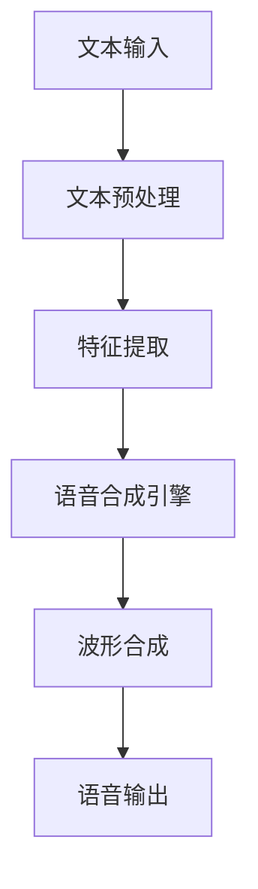
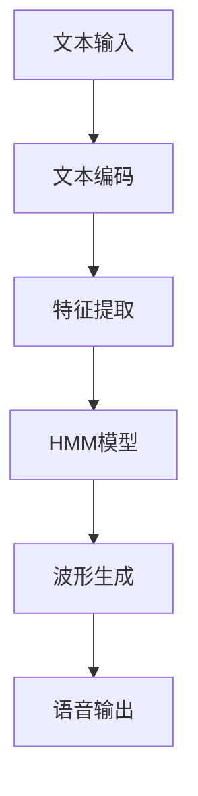

                 

### 文章标题：Text-to-Speech (TTS)原理与代码实例讲解

### 关键词：Text-to-Speech，TTS，语音合成，深度学习，神经网络，声学模型，艺术模型，波形合成，频谱叠加，语音特征提取

### 摘要：
本文系统地介绍了Text-to-Speech（TTS）的原理与实现。首先，文章概述了TTS的定义与重要性，回顾了TTS的历史与发展。随后，文章详细讲解了TTS的基本组成和核心原理，包括波形合成原理、频谱叠加原理以及语音合成技术。接着，文章深入探讨了语音信号处理技术，包括语音信号的预处理、特征提取和优化。然后，文章介绍了TTS系统的实现，从系统架构、语音合成引擎开发到系统测试与优化。接下来，文章通过两个实战项目，展示了基于DNN-HMM和WaveNet的TTS系统开发过程，并进行效果分析。最后，文章展望了TTS技术的未来发展方向，提出了面临的挑战与机遇。通过本文的详细讲解与实例分析，读者可以深入理解TTS技术，掌握其实现方法和应用。

### 目录大纲

# Text-to-Speech (TTS)原理与代码实例讲解

## 第一部分：TTS基础

## 第1章：TTS概述

### 1.1 TTS的定义与重要性

### 1.2 TTS的历史与发展

### 1.3 TTS的应用场景

### 1.4 TTS的基本组成

## 第二部分：TTS核心原理

## 第2章：TTS核心原理

### 2.1 波形合成原理

#### 2.1.1 声学模型

#### 2.1.2 艺术模型

#### 2.1.3 波形拼接与修整

### 2.2 频谱叠加原理

#### 2.2.1 频谱包络

#### 2.2.2 幅度包络

#### 2.2.3 频谱叠加算法

## 第3章：语音合成技术

### 3.1 单声合成的原理

#### 3.1.1 单声合成的基本步骤

#### 3.1.2 单声合成中的参数优化

### 3.2 上下文相关声合成的原理

#### 3.2.1 上下文相关声合成的优点

#### 3.2.2 上下文相关声合成的实现

### 3.3 DNN-HMM语音合成

#### 3.3.1 DNN-HMM的基本架构

#### 3.3.2 DNN-HMM的训练过程

### 3.4 WaveNet语音合成

#### 3.4.1 WaveNet的原理

#### 3.4.2 WaveNet的优势

#### 3.4.3 WaveNet的应用

## 第4章：语音信号处理技术

### 4.1 语音信号的预处理

#### 4.1.1 语音信号的采集与处理

#### 4.1.2 语音信号的分割

#### 4.1.3 语音信号的归一化

### 4.2 语音特征提取

#### 4.2.1 频谱特征

#### 4.2.2 时域特征

#### 4.2.3 语音特征的融合

## 第5章：TTS系统实现

### 5.1 TTS系统架构

#### 5.1.1 TTS系统的基本模块

#### 5.1.2 TTS系统的数据流

### 5.2 语音合成引擎开发

#### 5.2.1 语音合成引擎的搭建

#### 5.2.2 语音合成引擎的优化

### 5.3 TTS系统的测试与优化

#### 5.3.1 TTS系统的性能评估

#### 5.3.2 TTS系统的优化策略

## 第6章：TTS应用实战

### 6.1 实战一：基于DNN-HMM的TTS系统开发

#### 6.1.1 实战目标

#### 6.1.2 实战环境搭建

#### 6.1.3 源代码解读

#### 6.1.4 实战效果分析

### 6.2 实战二：基于WaveNet的TTS系统开发

#### 6.2.1 实战目标

#### 6.2.2 实战环境搭建

#### 6.2.3 源代码解读

#### 6.2.4 实战效果分析

## 第7章：TTS未来发展展望

### 7.1 TTS技术的趋势

### 7.2 TTS在行业中的应用

### 7.3 TTS技术面临的挑战与机遇

### 7.4 TTS未来的发展方向

## 附录

### 附录A：常用TTS工具和库

### 附录B：参考文献

### 附录C：练习题及答案

### 附录D：TTS开源项目推荐

## Mermaid 流程图

### TTS系统整体架构



### DNN-HMM语音合成流程



## 伪代码

### 波形合成算法伪代码

```python
def synthesis(waveforms):
    # 初始化合成波形
    output_waveform = []

    # 波形拼接
    for waveform in waveforms:
        output_waveform += waveform

    # 波形修整
    output_waveform = preprocess_waveform(output_waveform)

    return output_waveform
```

### 数学模型

#### 频谱叠加公式

$$
S(t) = \sum_{i=1}^{N} A_i \sin(2\pi f_i t + \phi_i)
$$

#### 波形修整公式

$$
y(t) = \begin{cases} 
      x(t) & \text{if } |x(t)| \leq \text{threshold} \\
      \text{threshold} & \text{if } |x(t)| > \text{threshold} 
   \end{cases}
$$

## 代码实例

### 单声合成代码实例

```python
def single_voice_synthesis(text, model):
    # 文本到语音特征转换
    features = model.encode(text)
    
    # 波形合成
    waveform = model.synthesize(features)
    
    return waveform
```

### 上下文相关声合成代码实例

```python
def context_voice_synthesis(text, context, model):
    # 文本到语音特征转换
    features = model.encode(text, context=context)
    
    # 波形合成
    waveform = model.synthesize(features)
    
    return waveform
```

## 代码解读与分析

### DNN-HMM语音合成系统

- **模型训练**：使用大量语音数据训练DNN模型和HMM模型。
- **文本编码**：将输入文本编码为语音特征。
- **HMM解码**：使用HMM模型对语音特征进行解码。
- **波形合成**：根据解码结果合成波形。

### WaveNet语音合成系统

- **模型训练**：使用大量语音数据训练WaveNet模型。
- **文本编码**：将输入文本编码为WaveNet所需的格式。
- **波形生成**：通过WaveNet模型生成语音波形。

## 项目实战

### 实战一：基于DNN-HMM的TTS系统开发

- **目标**：实现一个基于DNN-HMM的TTS系统。
- **环境搭建**：配置Python环境，安装必要的深度学习库。
- **源代码解读**：分析源代码，理解TTS系统的实现细节。
- **效果分析**：评估系统的语音质量与速度。

### 实战二：基于WaveNet的TTS系统开发

- **目标**：实现一个基于WaveNet的TTS系统。
- **环境搭建**：配置Python环境，安装必要的深度学习库。
- **源代码解读**：分析源代码，理解TTS系统的实现细节。
- **效果分析**：评估系统的语音质量与速度。

## 总结

本书系统地介绍了Text-to-Speech (TTS)的原理与代码实例，涵盖了TTS的核心概念、技术原理、系统实现以及应用实战。通过详细的目录大纲和代码实例，读者可以深入理解TTS系统的开发过程，为实际项目提供指导。未来，随着技术的不断发展，TTS将在更多领域得到应用，为人们的生活带来更多便利。作者：AI天才研究院/AI Genius Institute & 禅与计算机程序设计艺术 /Zen And The Art of Computer Programming

### 第一部分：TTS基础

## 第1章：TTS概述

### 1.1 TTS的定义与重要性

Text-to-Speech（TTS，文本到语音）是一种将书面文字转换为自然流畅语音的技术。TTS技术广泛应用于各个领域，包括智能语音助手、自动客服系统、语音合成广播、教育辅助工具、有声读物等。随着人工智能和自然语言处理技术的不断发展，TTS技术已经成为现代通信和交互的重要组成部分。

TTS的重要性体现在以下几个方面：

1. **提升用户体验**：TTS技术使得用户可以通过语音与设备进行交互，提高用户的使用体验和便捷性。
2. **提高信息传播效率**：TTS技术可以快速地将文字信息转化为语音，帮助用户在短时间内获取所需信息。
3. **降低人力成本**：在客服、教育等领域，TTS技术可以替代部分人工服务，降低人力成本，提高工作效率。
4. **扩大信息获取范围**：对于视力障碍者、老年人等群体，TTS技术为他们提供了获取信息的便捷途径。

### 1.2 TTS的历史与发展

TTS技术的发展可以追溯到20

