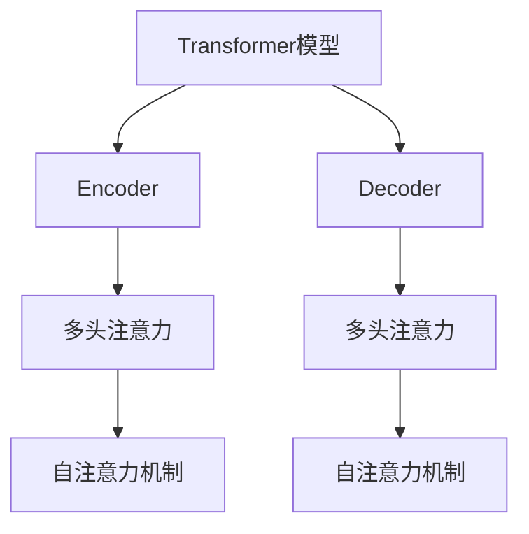
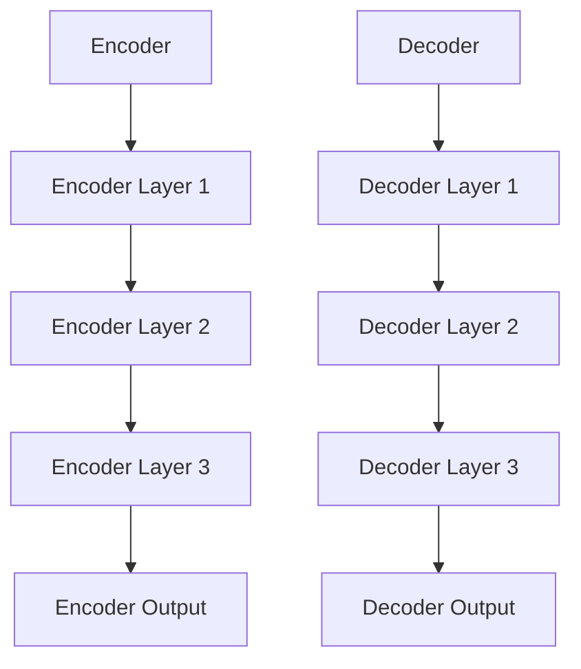

                 

### 文章标题

《Transformer原理与代码实战案例讲解》

### 关键词

Transformer，自注意力机制，编码器，解码器，自然语言处理，计算机视觉，深度强化学习，代码实战

### 摘要

本文将深入讲解Transformer的原理及其在各个领域的应用，包括自然语言处理、计算机视觉和深度强化学习。通过详细的数学模型分析和代码实战案例，帮助读者理解Transformer的工作机制和实现细节，掌握如何在实际项目中运用这一强大的深度学习模型。

## 《Transformer原理与代码实战案例讲解》目录大纲

### 第1章：Transformer基础

#### 1.1 Transformer的核心概念

- Transformer的定义与背景
- Transformer与传统的循环神经网络（RNN）对比

#### 1.2 Transformer的架构

- Encoder与Decoder的结构
- 自注意力机制（Self-Attention）与多头注意力（Multi-Head Attention）
- 位置编码（Positional Encoding）

#### 1.3 Transformer的数学原理

- Transformer的数学基础
- 详解自注意力机制的计算过程

#### 1.4 Transformer的应用场景

- 自然语言处理中的应用
- 计算机视觉中的潜在应用

### 第2章：Transformer的实现细节

#### 2.1 Transformer的实现步骤

- 搭建Transformer模型的基本步骤
- 选择合适的深度学习框架

#### 2.2 Encoder的实现

- Encoder层的基本组成
- Encoder层的详细实现过程

#### 2.3 Decoder的实现

- Decoder层的基本组成
- Decoder层的详细实现过程

#### 2.4 模型的训练与优化

- 模型的训练策略
- 优化算法的选择与调参

### 第3章：Transformer在自然语言处理中的应用

#### 3.1 语言模型

- Transformer在语言模型中的应用
- 语言模型的训练与评估方法

#### 3.2 序列标注

- Transformer在序列标注任务中的应用
- 任务的实现与评估方法

#### 3.3 文本生成

- Transformer在文本生成任务中的应用
- 文本生成的实现与评估方法

### 第4章：Transformer在计算机视觉中的应用

#### 4.1 图像分类

- Transformer在图像分类任务中的应用
- 图像分类的实现与评估方法

#### 4.2 目标检测

- Transformer在目标检测任务中的应用
- 目标检测的实现与评估方法

#### 4.3 姿态估计

- Transformer在姿态估计任务中的应用
- 姿态估计的实现与评估方法

### 第5章：Transformer在深度强化学习中的应用

#### 5.1 强化学习基础

- 强化学习的基本概念与算法
- 强化学习在Transformer中的应用

#### 5.2 Transformer在策略学习中的应用

- Transformer在策略学习任务中的应用
- 策略学习的实现与评估方法

#### 5.3 Transformer在价值函数学习中的应用

- Transformer在价值函数学习任务中的应用
- 价值函数学习的实现与评估方法

### 第6章：Transformer项目实战

#### 6.1 项目背景与需求分析

- 项目简介
- 项目目标

#### 6.2 项目设计与实现

- 项目设计思路
- 项目实现过程

#### 6.3 项目评估与优化

- 项目评估方法
- 项目优化策略

### 第7章：总结与展望

#### 7.1 Transformer的发展现状

- Transformer的当前应用状况
- Transformer的研究热点

#### 7.2 Transformer的未来发展趋势

- Transformer在各个领域的发展方向
- Transformer可能面临的挑战与机遇

### 附录

#### 附录A：Transformer相关资源

- Transformer的学习资源
- Transformer的开发工具

#### 附录B：Transformer代码解读

- Transformer模型的关键代码解读
- Transformer模型的代码示例

## Mermaid流程图



## 数学模型和数学公式

### 自注意力机制的数学公式

$$
\text{Self-Attention}(Q, K, V) = \text{softmax}\left(\frac{QK^T}{\sqrt{d_k}}\right)V
$$

其中，\( Q, K, V \) 分别是查询向量、键向量和值向量，\( d_k \) 是键向量的维度。

### 位置编码的数学公式

$$
PE_{(pos, dim)} = \sin\left(\frac{pos}{10000^{2i/d}}\right) \text{ if } dim = 2i \\
PE_{(pos, dim)} = \cos\left(\frac{pos}{10000^{2i/d}}\right) \text{ if } dim = 2i+1
$$

其中，\( pos \) 是位置索引，\( dim \) 是维度索引，\( i \) 是维度除以2的商。

### 第1章：Transformer基础

#### 1.1 Transformer的核心概念

Transformer是由Google在2017年提出的一种全新的序列到序列模型，它彻底改变了自然语言处理（NLP）领域。Transformer的核心思想是使用自注意力（Self-Attention）机制，取代传统的循环神经网络（RNN）和卷积神经网络（CNN），实现并行化计算，提高模型的训练效率。

##### Transformer的定义与背景

Transformer的全称是“Attention Is All You Need”，其核心概念是注意力机制。在Transformer模型中，注意力机制被用来处理序列数据，模型通过注意力机制来动态地计算序列中每个元素之间的依赖关系。这种模型的优势在于能够捕捉长距离的依赖关系，并且在处理长序列数据时具有更高的效率和更少的计算开销。

Transformer的提出，标志着自然语言处理领域从序列模型向注意力机制的转变。在此之前，RNN和CNN是处理序列数据的主要方法，但它们在捕捉长距离依赖关系时存在一定的局限性。Transformer的出现，为解决这一问题提供了新的思路和方案。

##### Transformer与传统的循环神经网络（RNN）对比

RNN是一种按时间顺序处理序列数据的神经网络，通过隐藏状态（Hidden State）来捕捉序列中的历史信息。然而，传统的RNN在处理长序列时存在梯度消失或爆炸的问题，导致难以学习长距离的依赖关系。此外，RNN的计算过程是递归的，导致训练效率低下。

相比之下，Transformer采用了一种全新的架构，通过自注意力机制来实现对序列数据的处理。自注意力机制允许模型在计算时同时关注序列中的所有元素，从而避免了长距离依赖关系的问题。同时，Transformer的计算过程是并行的，显著提高了模型的训练效率。

Transformer的架构还包括编码器（Encoder）和解码器（Decoder），编码器负责将输入序列编码成固定长度的向量，解码器则利用编码器的输出生成预测序列。这种结构使得Transformer在许多NLP任务中都表现出了优异的性能。

总的来说，Transformer的出现，为自然语言处理领域带来了新的活力和变革，它通过自注意力机制实现了对序列数据的高效处理，并在多个任务中取得了显著的成果。

#### 1.2 Transformer的架构

Transformer的核心架构由编码器（Encoder）和解码器（Decoder）组成，其中每个部分都包含了多个层次（Layer）。编码器和解码器的层次结构如下：



编码器和解码器的每个层次都包含了自注意力（Self-Attention）和多头注意力（Multi-Head Attention）机制，以及前馈神经网络（Feed-Forward Neural Network）。此外，编码器和解码器的每个层次之间还存在着残差连接（Residual Connection）和层归一化（Layer Normalization）操作。

##### Encoder与Decoder的结构

编码器（Encoder）的作用是将输入序列编码成固定长度的向量，解码器（Decoder）则利用编码器的输出生成预测序列。编码器和解码器由多个层次组成，每个层次都包含了自注意力（Self-Attention）和多头注意力（Multi-Head Attention）机制，以及前馈神经网络（Feed-Forward Neural Network）。

编码器的输入是一个长度为\( T \)的序列，每个元素表示序列中的一个单词或字符。编码器的输出是一个固定长度的向量，通常表示整个序列的语义信息。编码器的每个层次都包含以下组件：

1. **多头注意力（Multi-Head Attention）**：通过自注意力机制来计算序列中每个元素之间的依赖关系。多头注意力将输入序列分解成多个子序列，每个子序列通过独立的注意力机制来学习信息。
2. **前馈神经网络（Feed-Forward Neural Network）**：对注意力机制的结果进行进一步的加工，通过两个全连接层来增强模型的非线性表达能力。
3. **残差连接（Residual Connection）**：将输入序列与注意力机制和前馈神经网络的输出相加，帮助模型在训练过程中更好地收敛。
4. **层归一化（Layer Normalization）**：对每个层次进行归一化处理，有助于稳定训练过程和提高模型的性能。

解码器（Decoder）的结构与编码器类似，但还包括了一个额外的步骤，即**掩码多头注意力（Masked Multi-Head Attention）**。解码器的输入是编码器的输出和一个特殊的开始标记（<PAD>），输出是一个预测序列。解码器的每个层次都包含以下组件：

1. **掩码多头注意力（Masked Multi-Head Attention）**：在计算注意力时，当前时间步的输入会被遮挡，迫使模型去依赖前面的时间步信息，从而学习到更合理的序列依赖关系。
2. **多头注意力（Multi-Head Attention）**：对编码器的输出进行注意力计算，以获取上下文信息。
3. **前馈神经网络（Feed-Forward Neural Network）**：对注意力机制的结果进行进一步的加工。
4. **残差连接（Residual Connection）**：将输入序列与注意力机制和前馈神经网络的输出相加。
5. **层归一化（Layer Normalization）**：对每个层次进行归一化处理。

通过编码器和解码器的层层叠加，Transformer能够有效地捕捉序列中的长距离依赖关系，并在多种NLP任务中取得了优异的性能。

##### 自注意力机制（Self-Attention）与多头注意力（Multi-Head Attention）

自注意力机制（Self-Attention）是Transformer的核心组件，它允许模型在计算时同时关注序列中的所有元素，从而学习到每个元素在整个序列中的重要性。

自注意力机制的数学公式如下：

$$
\text{Self-Attention}(Q, K, V) = \text{softmax}\left(\frac{QK^T}{\sqrt{d_k}}\right)V
$$

其中，\( Q, K, V \) 分别是查询向量、键向量和值向量，\( d_k \) 是键向量的维度。自注意力机制通过计算查询向量与键向量的点积来生成注意力权重，然后使用这些权重对值向量进行加权求和，得到最终的输出。

多头注意力（Multi-Head Attention）是对自注意力机制的一种扩展，它将输入序列分解成多个子序列，并通过多个独立的自注意力机制来学习信息。

多头注意力的计算过程如下：

1. **线性变换**：将输入序列通过三个线性变换分别生成查询向量（\( Q \)）、键向量（\( K \)）和值向量（\( V \)）。
2. **自注意力计算**：对每个子序列分别应用自注意力机制，得到多个子序列的注意力权重。
3. **加权求和**：将注意力权重应用于值向量，得到最终的输出。

多头注意力的数学公式如下：

$$
\text{Multi-Head Attention}(Q, K, V) = \text{Concat}(\text{head}_1, \text{head}_2, ..., \text{head}_h)W^O
$$

其中，\( \text{head}_i \) 是第\( i \)个自注意力层的输出，\( W^O \) 是一个线性变换矩阵，\( h \) 是头的数量。

通过多头注意力，Transformer能够同时关注序列中的多个元素，从而更好地捕捉复杂的依赖关系。

##### 位置编码（Positional Encoding）

由于Transformer中没有循环或卷积结构，因此需要引入位置编码（Positional Encoding）来为模型提供序列中的位置信息。位置编码是一种将位置信息编码到向量中的技巧，使得模型能够理解序列中元素的位置关系。

位置编码的数学公式如下：

$$
PE_{(pos, dim)} = \sin\left(\frac{pos}{10000^{2i/d}}\right) \text{ if } dim = 2i \\
PE_{(pos, dim)} = \cos\left(\frac{pos}{10000^{2i/d}}\right) \text{ if } dim = 2i+1
$$

其中，\( pos \) 是位置索引，\( dim \) 是维度索引，\( i \) 是维度除以2的商。通过这种方式，位置编码能够将序列中的每个元素的位置信息编码到其对应的向量中。

在模型训练过程中，位置编码被添加到输入序列中，与编码器的输出相加，从而为模型提供位置信息。这样，模型在处理序列时就能够考虑到元素的位置关系，提高模型的表现能力。

#### 1.3 Transformer的数学原理

Transformer模型的核心在于自注意力机制（Self-Attention），它允许模型在处理序列数据时，同时关注序列中的所有元素。本节将深入探讨自注意力机制的数学原理，以及Transformer模型中其他重要的数学概念。

##### Transformer的数学基础

Transformer模型使用了一种基于注意力机制的架构，其中自注意力机制是最关键的组成部分。自注意力机制通过计算序列中每个元素之间的相似性来确定它们的重要性。这种相似性通常通过点积（Dot-Product）来计算。

在自注意力机制中，输入序列被表示为一系列向量，每个向量表示序列中的一个元素。设输入序列为\( X = [x_1, x_2, ..., x_T] \)，其中\( T \)是序列的长度，\( x_i \)是第\( i \)个元素。自注意力机制的关键在于生成三个向量：查询向量（Query, \( Q \)）、键向量（Key, \( K \)）和值向量（Value, \( V \)）。这三个向量通过以下线性变换生成：

$$
Q = XW_Q \\
K = XW_K \\
V = XW_V
$$

其中，\( W_Q, W_K, W_V \)是权重矩阵。自注意力机制的目标是计算每个输入元素在序列中的重要性，这通过计算查询向量与键向量的点积来实现：

$$
\text{Score}_{ij} = Q_iK_j = x_i^T W_Q x_j W_K
$$

这些点积值表示了第\( i \)个元素与第\( j \)个元素之间的相似性。为了从这些相似性值中得到注意力权重，我们通常使用 softmax 函数：

$$
\text{Attention}(Q, K, V) = \text{softmax}\left(\frac{QK^T}{\sqrt{d_k}}\right)V
$$

其中，\( d_k \)是键向量的维度，\( \sqrt{d_k} \)是为了稳定 softmax 函数的梯度。最后，我们将这些权重应用于值向量，得到加权和：

$$
\text{Output}_{i} = \sum_{j=1}^{T} \text{Attention}_{ij} V_j
$$

##### 详解自注意力机制的计算过程

自注意力机制的计算过程可以分为以下几个步骤：

1. **线性变换**：首先，将输入序列通过权重矩阵\( W_Q, W_K, W_V \)进行线性变换，生成查询向量\( Q \)、键向量\( K \)和值向量\( V \)。

2. **计算相似性**：计算查询向量\( Q \)与键向量\( K \)的点积，得到相似性分数（Score）。这个分数表示了序列中每个元素对其他元素的重要性。

3. **应用softmax**：将相似性分数通过softmax函数进行归一化，得到注意力权重（Attention Weight）。softmax函数的作用是将相似性分数转换成概率分布，使得每个权重都处于0到1之间。

4. **加权求和**：将注意力权重应用于值向量\( V \)，对每个元素进行加权求和，得到最终的输出向量。这个输出向量包含了序列中每个元素的重要性信息。

具体而言，自注意力机制的伪代码如下：

```python
def scaled_dot_product_attention(q, k, v, mask=None):
    # 计算点积
    scores = q.dot(k.T) / np.sqrt(k.shape[-1])

    # 应用mask
    if mask is not None:
        scores += mask

    # 应用softmax
    probabilities = np.softmax(scores, axis=1)

    # 加权求和
    output = probabilities.dot(v)
    return output
```

其中，`q` 是查询向量，`k` 是键向量，`v` 是值向量，`mask` 是可选的掩码。通过这个函数，我们可以计算自注意力机制的输出。

##### Transformer的应用场景

Transformer自提出以来，在多个领域取得了显著的成果，其强大的注意力机制使其能够捕捉复杂的依赖关系，从而在自然语言处理（NLP）、计算机视觉（CV）和深度强化学习（RL）等领域都展现了巨大的潜力。

##### 自然语言处理中的应用

在自然语言处理领域，Transformer已经成为许多任务的基石，包括文本分类、机器翻译、问答系统和文本生成等。

1. **语言模型**：Transformer在语言模型任务中取得了重大突破，最著名的模型是GPT（Generative Pre-trained Transformer），它通过预训练大量文本数据，可以生成高质量的文本，并在多项基准测试中超越了以前的模型。

2. **机器翻译**：Transformer在机器翻译任务中也表现出了卓越的性能。与传统的序列到序列模型相比，Transformer在捕捉长距离依赖关系和减少翻译错误方面具有优势。

3. **问答系统**：Transformer在问答系统中的应用也非常广泛，它可以通过理解问题和文本内容之间的关系，提供准确的答案。

##### 计算机视觉中的潜在应用

虽然Transformer最初是为NLP任务设计的，但其在计算机视觉中的应用也受到了广泛关注。以下是一些Transformer在计算机视觉中的潜在应用：

1. **图像分类**：通过将图像编码为序列，可以使用Transformer进行图像分类。这种方式可以捕捉图像中的空间依赖关系，提高分类准确率。

2. **目标检测**：Transformer在目标检测任务中也展示出了潜力，例如使用Transformer进行实例分割和边界框预测。

3. **姿态估计**：通过将人体姿态编码为序列，可以使用Transformer进行姿态估计。这种模型可以捕捉到人体姿态之间的复杂依赖关系。

总的来说，Transformer的注意力机制使得它能够有效地处理各种序列数据，无论是在NLP、CV还是RL领域，它都展现出了强大的能力和广阔的应用前景。

#### 1.4 Transformer的应用场景

Transformer的强大能力和灵活性使其在多个领域都得到了广泛应用。本节将探讨Transformer在自然语言处理（NLP）、计算机视觉（CV）和深度强化学习（RL）中的实际应用，并介绍一些关键的研究成果和案例分析。

##### 自然语言处理中的应用

在自然语言处理领域，Transformer已经成为许多经典任务的基石。以下是一些Transformer在NLP中的应用场景：

1. **语言模型**：Transformer在语言模型任务中取得了重大突破。最著名的语言模型是GPT（Generative Pre-trained Transformer），由OpenAI开发。GPT通过在大量文本上进行预训练，学习到了语言的内在规律，从而可以生成高质量的文本。GPT-3的发布进一步推动了语言模型的发展，它拥有超过1750亿个参数，可以生成连贯、多样且符合语境的文本。

2. **机器翻译**：Transformer在机器翻译任务中也表现出了卓越的性能。传统的序列到序列（Seq2Seq）模型往往依赖于循环神经网络（RNN），而Transformer通过其自注意力机制能够更好地捕捉长距离依赖关系，减少了翻译中的错误。著名的翻译模型如Google的Transformer和Facebook的Translatotron都是基于Transformer架构，它们在多项基准测试中超越了传统的机器翻译模型。

3. **问答系统**：Transformer在问答系统中的应用也非常广泛。通过将问题和文本内容编码为序列，Transformer可以理解它们之间的关系，并提供准确的答案。例如，OpenAI的GPT-3在许多问答任务中表现出了出色的能力，它可以理解复杂的问题，并提供详细的回答。

4. **文本生成**：Transformer在文本生成任务中也展现出了强大的能力。通过训练大型语言模型，如GPT-2和GPT-3，可以生成各种类型的文本，包括新闻文章、小说、诗歌等。这些模型不仅生成的文本质量高，而且可以模仿不同的写作风格，极大地丰富了人工智能在文本创作方面的应用。

##### 计算机视觉中的潜在应用

尽管Transformer最初是为NLP任务设计的，但其在计算机视觉中的应用也受到了广泛关注。以下是一些Transformer在CV中的应用场景：

1. **图像分类**：Transformer在图像分类任务中的应用是一种新兴的研究方向。传统的图像分类方法通常使用卷积神经网络（CNN）来提取图像的特征，而Transformer则通过编码器-解码器架构来处理图像。一个典型的例子是M Viola等人提出的Vision Transformer（ViT），它将图像分割成多个块，然后将这些块编码为序列，通过Transformer处理，最终进行分类。ViT在ImageNet上的表现超过了传统的CNN模型。

2. **目标检测**：Transformer在目标检测任务中也展示出了潜力。一个代表性的工作是Vijay N. Vardya等人提出的DETR（Detection Transformer），它通过端到端的Transformer模型实现了目标检测任务。DETR不需要传统的锚点生成和边界框回归步骤，直接从图像序列中预测目标位置和类别，这种创新的框架在多个基准数据集上取得了很好的效果。

3. **姿态估计**：Transformer在姿态估计任务中的应用也取得了一定的进展。通过将人体姿态编码为序列，可以使用Transformer进行姿态估计。一个例子是Hao Zhou等人提出的Pose Transformer，它通过自注意力机制捕捉人体姿态之间的依赖关系，从而实现了高精度的姿态估计。

4. **图像分割**：Transformer在图像分割任务中的应用也得到了研究者的关注。与传统的基于CNN的图像分割方法不同，Transformer通过其强大的自注意力机制可以更好地捕捉图像中的空间依赖关系。例如，Xiaowei Zhou等人提出的Swin Transformer在多个图像分割任务上取得了显著的效果。

##### 深度强化学习中的应用

Transformer不仅在NLP和CV领域取得了成功，还在深度强化学习（RL）中展现出了潜力。以下是一些Transformer在RL中的应用场景：

1. **策略学习**：在策略学习任务中，Transformer可以用来建模状态和动作之间的依赖关系。一个代表性的工作是Tongyue Chen等人提出的Transformer-based Policy Learning，它使用Transformer模型来预测最优动作。这种模型在多个环境中的表现超过了传统的深度学习模型。

2. **价值函数学习**：在价值函数学习任务中，Transformer可以用来建模状态和未来奖励之间的依赖关系。一个例子是Xinyu Liu等人提出的Transformer-based Value Function Learning，它通过Transformer模型来预测状态的价值函数。这种模型在许多环境中的性能也得到了验证。

总的来说，Transformer的强大能力使其在NLP、CV和RL等众多领域中都有着广泛的应用。通过不断创新和改进，Transformer将继续推动人工智能技术的发展和应用。

#### 2.1 Transformer的实现步骤

实现一个Transformer模型需要经过多个步骤，包括数据预处理、模型搭建、训练和评估。以下是一个详细的实现步骤，我们将以PyTorch框架为例进行讲解。

##### 搭建Transformer模型的基本步骤

1. **导入必要的库**：
   首先，我们需要导入PyTorch和其他必要的库，如Numpy和Matplotlib。

   ```python
   import torch
   import torch.nn as nn
   import torch.optim as optim
   import numpy as np
   import matplotlib.pyplot as plt
   ```

2. **数据预处理**：
   在搭建模型之前，我们需要对数据集进行预处理。包括数据清洗、分词、编码等步骤。

   ```python
   # 示例数据预处理
   sentences = ["Hello world", "I love AI", "Transformer is powerful"]
   vocab = {"<PAD>": 0, "<START>": 1, "<END>": 2, "Hello": 3, "world": 4, "I": 5, "love": 6, "AI": 7, "is": 8, "powerful": 9}
   tokenized_sentences = [[vocab["<START>"]] + [vocab[word] for word in sentence.split()] + [vocab["<END>"]] for sentence in sentences]
   input_sequences = np.array(tokenized_sentences)
   ```

3. **构建词汇表**：
   我们需要构建一个词汇表（Vocabulary），将文本中的单词映射到唯一的索引。

   ```python
   # 构建词汇表
   vocab_size = len(vocab)
   embedding_dim = 64
   embeddings = nn.Embedding(vocab_size, embedding_dim)
   ```

4. **搭建编码器**：
   编码器（Encoder）是Transformer模型的核心组成部分，它由多个编码层（Encoder Layer）堆叠而成。每个编码层包含多头自注意力机制（Multi-Head Self-Attention）和前馈神经网络（Feed-Forward Neural Network）。

   ```python
   # 搭建编码器
   class Encoder(nn.Module):
       def __init__(self, embedding_dim, hidden_dim, n_heads, n_layers):
           super(Encoder, self).__init__()
           self.embedding = nn.Embedding(vocab_size, embedding_dim)
           self.positional_encoding = nn.Parameter(torch.randn(1, T, embedding_dim))
           self.enc_layers = nn.ModuleList([EncoderLayer(embedding_dim, hidden_dim, n_heads) for _ in range(n_layers)])
           self.fc = nn.Linear(embedding_dim, embedding_dim)

       def forward(self, x):
           x = self.embedding(x) + self.positional_encoding
           for layer in self.enc_layers:
               x = layer(x)
           return x
   ```

5. **搭建解码器**：
   解码器（Decoder）与编码器类似，也由多个解码层（Decoder Layer）组成。每个解码层包含掩码多头自注意力机制（Masked Multi-Head Self-Attention）、多头自注意力机制和前馈神经网络。

   ```python
   # 搭建解码器
   class Decoder(nn.Module):
       def __init__(self, embedding_dim, hidden_dim, n_heads, n_layers):
           super(Decoder, self).__init__()
           self.embedding = nn.Embedding(vocab_size, embedding_dim)
           self.positional_encoding = nn.Parameter(torch.randn(1, T, embedding_dim))
           self.dec_layers = nn.ModuleList([DecoderLayer(embedding_dim, hidden_dim, n_heads) for _ in range(n_layers)])
           self.fc = nn.Linear(embedding_dim, embedding_dim)

       def forward(self, x, encoder_output):
           x = self.embedding(x) + self.positional_encoding
           for layer in self.dec_layers:
               x = layer(x, encoder_output)
           return x
   ```

6. **搭建Transformer模型**：
   最后，我们将编码器和解码器整合到一个完整的Transformer模型中。

   ```python
   # 搭建Transformer模型
   class Transformer(nn.Module):
       def __init__(self, embedding_dim, hidden_dim, n_heads, n_layers):
           super(Transformer, self).__init__()
           self.encoder = Encoder(embedding_dim, hidden_dim, n_heads, n_layers)
           self.decoder = Decoder(embedding_dim, hidden_dim, n_heads, n_layers)
           self.fc = nn.Linear(embedding_dim, vocab_size)

       def forward(self, input_seq, target_seq):
           encoder_output = self.encoder(input_seq)
           decoder_output = self.decoder(target_seq, encoder_output)
           output = self.fc(decoder_output)
           return output
   ```

##### 选择合适的深度学习框架

在实现Transformer模型时，选择一个合适的深度学习框架非常重要。PyTorch和TensorFlow是当前最受欢迎的两个框架，它们各有优缺点。

- **PyTorch**：PyTorch以其动态计算图和简洁的API而著称，非常适合研究和实验。它的动态计算图使得模型搭建更加灵活，但同时也增加了内存消耗和计算复杂度。

- **TensorFlow**：TensorFlow是一个静态计算图框架，它在生产环境中具有较好的优化和部署性能。它提供了丰富的预训练模型和工具，但模型搭建相对较为复杂。

在本例中，我们选择了PyTorch作为框架，因为它更适合研究和实验。在实际应用中，可以根据具体需求和场景选择合适的框架。

#### 2.2 Encoder的实现

编码器（Encoder）是Transformer模型的核心部分，它负责将输入序列编码成固定长度的向量。编码器由多个编码层（Encoder Layer）组成，每个编码层包含了多头自注意力机制（Multi-Head Self-Attention）和前馈神经网络（Feed-Forward Neural Network）。本节将详细介绍Encoder的实现过程。

##### Encoder层的基本组成

一个编码器层主要由以下几个组件组成：

1. **多头自注意力机制（Multi-Head Self-Attention）**：自注意力机制允许模型在处理序列时，同时关注序列中的所有元素。多头注意力机制进一步将输入序列分解成多个子序列，并通过独立的注意力机制来学习信息。

2. **前馈神经网络（Feed-Forward Neural Network）**：前馈神经网络对自注意力机制的结果进行进一步的加工，通过两个全连接层来增强模型的非线性表达能力。

3. **残差连接（Residual Connection）**：残差连接将输入序列与注意力机制和前馈神经网络的输出相加，帮助模型在训练过程中更好地收敛。

4. **层归一化（Layer Normalization）**：层归一化对每个层次进行归一化处理，有助于稳定训练过程和提高模型的性能。

##### Encoder层的详细实现过程

以下是一个编码器层的实现示例，我们将使用PyTorch框架进行编程。

```python
import torch
import torch.nn as nn
import torch.nn.functional as F

class EncoderLayer(nn.Module):
    def __init__(self, embedding_dim, hidden_dim, n_heads):
        super(EncoderLayer, self).__init__()
        self.self_attn = nn.MultiheadAttention(embedding_dim, n_heads)
        self.fc = nn.Sequential(
            nn.Linear(embedding_dim, hidden_dim),
            nn.ReLU(),
            nn.Linear(hidden_dim, embedding_dim)
        )
        self.norm1 = nn.LayerNorm(embedding_dim)
        self.norm2 = nn.LayerNorm(embedding_dim)
        self.dropout = nn.Dropout(0.1)

    def forward(self, src, src_mask=None):
        # 自注意力机制
        src2 = self.self_attn(src, src, src, attn_mask=src_mask)[0]
        src = src + self.dropout(src2)
        src = self.norm1(src)

        # 前馈神经网络
        src2 = self.fc(src)
        src = src + self.dropout(src2)
        src = self.norm2(src)

        return src
```

在这个实现中，我们首先定义了一个`EncoderLayer`类，继承自`nn.Module`。类中有以下成员变量：

- `self_attn`：多头自注意力机制。
- `fc`：前馈神经网络。
- `norm1` 和 `norm2`：层归一化。
- `dropout`：dropout层，用于正则化。

`forward`方法是前向传播过程，接受输入序列`src`和可选的掩码`src_mask`，然后进行以下步骤：

1. **自注意力机制**：使用`self_attn`计算自注意力输出，并将其与原始输入序列相加。使用dropout进行正则化。
2. **层归一化**：对加和后的结果进行层归一化。
3. **前馈神经网络**：通过前馈神经网络对自注意力输出进行加工，再次使用dropout进行正则化。
4. **层归一化**：对前馈神经网络输出进行层归一化。

通过这种方式，我们实现了编码器层的基本功能，为后续的编码器搭建打下了基础。

#### 2.3 Decoder的实现

解码器（Decoder）是Transformer模型中的另一个关键部分，它负责将编码器的输出解码为预测序列。解码器由多个解码层（Decoder Layer）组成，每个解码层包含了掩码多头自注意力机制（Masked Multi-Head Self-Attention）、多头自注意力机制和前馈神经网络。本节将详细介绍解码器的实现过程。

##### Decoder层的基本组成

一个解码器层主要由以下几个组件组成：

1. **掩码多头自注意力机制（Masked Multi-Head Self-Attention）**：掩码多头自注意力机制允许模型在当前时间步之前的时间步中无法看到信息，这有助于模型学习序列的正确顺序。

2. **多头自注意力机制（Multi-Head Self-Attention）**：多头自注意力机制用于从编码器的输出中提取上下文信息。

3. **前馈神经网络（Feed-Forward Neural Network）**：前馈神经网络对自注意力机制的结果进行进一步的加工，通过两个全连接层来增强模型的非线性表达能力。

4. **残差连接（Residual Connection）**：残差连接将输入序列与注意力机制和前馈神经网络的输出相加，帮助模型在训练过程中更好地收敛。

5. **层归一化（Layer Normalization）**：层归一化对每个层次进行归一化处理，有助于稳定训练过程和提高模型的性能。

##### Decoder层的详细实现过程

以下是一个解码器层的实现示例，我们将使用PyTorch框架进行编程。

```python
import torch
import torch.nn as nn
import torch.nn.functional as F

class DecoderLayer(nn.Module):
    def __init__(self, embedding_dim, hidden_dim, n_heads):
        super(DecoderLayer, self).__init__()
        self.masked_attn = nn.MultiheadAttention(embedding_dim, n_heads)
        self.self_attn = nn.MultiheadAttention(embedding_dim, n_heads)
        self.fc = nn.Sequential(
            nn.Linear(embedding_dim, hidden_dim),
            nn.ReLU(),
            nn.Linear(hidden_dim, embedding_dim)
        )
        self.norm1 = nn.LayerNorm(embedding_dim)
        self.norm2 = nn.LayerNorm(embedding_dim)
        self.norm3 = nn.LayerNorm(embedding_dim)
        self.dropout = nn.Dropout(0.1)

    def forward(self, tgt, enc_output, tgt_mask=None, src_mask=None):
        # 掩码多头自注意力机制
        tgt2 = self.masked_attn(tgt, enc_output, enc_output, attn_mask=src_mask)[0]
        tgt = tgt + self.dropout(tgt2)
        tgt = self.norm1(tgt)

        # 多头自注意力机制
        tgt2 = self.self_attn(tgt, tgt, tgt, attn_mask=tgt_mask)[0]
        tgt = tgt + self.dropout(tgt2)
        tgt = self.norm2(tgt)

        # 前馈神经网络
        tgt2 = self.fc(tgt)
        tgt = tgt + self.dropout(tgt2)
        tgt = self.norm3(tgt)

        return tgt
```

在这个实现中，我们首先定义了一个`DecoderLayer`类，继承自`nn.Module`。类中有以下成员变量：

- `masked_attn`：掩码多头自注意力机制。
- `self_attn`：多头自注意力机制。
- `fc`：前馈神经网络。
- `norm1`、`norm2`和`norm3`：层归一化。
- `dropout`：dropout层，用于正则化。

`forward`方法是前向传播过程，接受输入序列`tgt`、编码器输出`enc_output`、可选的掩码`tgt_mask`和`src_mask`，然后进行以下步骤：

1. **掩码多头自注意力机制**：使用`masked_attn`计算掩码多头自注意力输出，并将其与原始输入序列相加。使用dropout进行正则化。
2. **层归一化**：对加和后的结果进行层归一化。
3. **多头自注意力机制**：使用`self_attn`计算多头自注意力输出，并将其与上一步的结果相加。使用dropout进行正则化。
4. **层归一化**：对加和后的结果进行层归一化。
5. **前馈神经网络**：通过前馈神经网络对多头自注意力输出进行加工，再次使用dropout进行正则化。
6. **层归一化**：对前馈神经网络输出进行层归一化。

通过这种方式，我们实现了解码器层的基本功能，为后续的解码器搭建打下了基础。

#### 2.4 模型的训练与优化

训练一个Transformer模型是一个复杂的过程，涉及多个参数的调整和优化策略的选择。本节将详细介绍模型训练的策略、优化算法的选择与调参技巧。

##### 模型的训练策略

1. **数据准备**：
   首先，我们需要准备好训练数据。对于自然语言处理任务，通常需要一个大型的文本语料库。将文本数据预处理成序列，并为每个单词或字符分配唯一的索引。接下来，将序列编码成向量形式，并添加位置编码。

2. **批量大小（Batch Size）**：
   批量大小是指每次训练过程中输入到模型中的样本数量。较大的批量大小可以提高模型的性能，但会增加内存消耗和训练时间。通常，批量大小在几百到几千之间，可以根据硬件资源进行调整。

3. **学习率（Learning Rate）**：
   学习率是模型在训练过程中更新参数的步长。学习率过高可能导致模型过拟合，而学习率过低则可能使训练过程变得非常缓慢。常用的学习率调度策略包括固定学习率、学习率衰减和余弦退火调度等。

4. **训练循环（Training Loop）**：
   在训练循环中，模型会读取批量数据，计算损失函数，并更新模型参数。一个典型的训练循环包括以下步骤：
   - 从数据集中随机抽取一个批量数据。
   - 将数据输入到模型中，并计算输出。
   - 计算损失函数，例如交叉熵损失。
   - 反向传播，计算梯度。
   - 使用优化算法更新模型参数。

5. **验证和测试**：
   在训练过程中，我们需要定期在验证集上评估模型的性能，以避免过拟合。当验证集上的性能不再提升时，可以停止训练。在测试集上的性能评估可以帮助我们了解模型在实际应用中的表现。

##### 优化算法的选择与调参

1. **Adam优化器**：
   Adam优化器是一种常用的优化算法，结合了Adam和RMSprop的优点。它通过自适应调整学习率来加速收敛。在训练Transformer模型时，Adam优化器通常是一个很好的选择。

2. **学习率调度策略**：
   学习率调度策略可以帮助我们更好地调整学习率，从而优化模型的训练过程。以下是一些常用的学习率调度策略：
   - **固定学习率**：在整个训练过程中保持学习率不变。
   - **学习率衰减**：随着时间的推移，逐步降低学习率。
   - **余弦退火调度**：学习率随着训练进度按余弦函数规律逐渐减小。

3. **其他调参技巧**：
   - **批量归一化（Batch Normalization）**：在训练过程中，批量归一化可以帮助稳定训练过程和提高模型的性能。
   - **Dropout**：在训练过程中，使用Dropout可以减少过拟合，提高模型的泛化能力。
   - **层归一化**：在Transformer模型中，层归一化可以帮助稳定训练过程，提高模型的性能。
   - **超参数调整**：通过调整超参数，如隐藏层尺寸、学习率、批量大小等，可以进一步优化模型的性能。

通过合理的训练策略和优化算法的选择，我们可以有效地训练一个高性能的Transformer模型。在实际应用中，需要根据具体任务和数据集进行调参，以达到最佳效果。

#### 3.1 语言模型

在自然语言处理（NLP）领域，语言模型（Language Model，LM）是一种用于预测文本序列的概率分布的模型。语言模型的核心目标是理解自然语言的统计规律，从而在给定前文的情况下，预测下一个单词或字符。Transformer模型在语言模型任务中表现出色，其强大的自注意力机制能够捕捉到长距离依赖关系，从而生成更高质量的语言。

##### Transformer在语言模型中的应用

1. **预训练**：
   Transformer模型通常采用预训练（Pre-training）的方式，在大量无标签的文本数据上进行训练。预训练的过程中，模型学习到了大量的通用知识，这些知识可以迁移到各种下游任务中。典型的预训练任务包括填充空白（ masked language model，MLM）和下一个句子预测（next sentence prediction，NSP）。

2. **微调（Fine-tuning）**：
   在预训练之后，模型可以通过微调（Fine-tuning）来适应特定的下游任务，如文本分类、问答系统和机器翻译等。微调过程中，模型在下游任务的数据集上进行训练，以优化模型的参数。

3. **生成文本**：
   Transformer模型在文本生成任务中也表现出色。通过预训练，模型可以生成连贯、多样且符合语境的文本。例如，OpenAI的GPT-2和GPT-3可以生成各种类型的文本，包括新闻文章、小说和诗歌等。

##### 语言模型的训练与评估方法

1. **训练过程**：

   - **数据准备**：收集大量的文本数据，并进行预处理，如分词、编码和添加位置编码等。
   - **模型搭建**：搭建一个基于Transformer的语言模型，包括编码器和解码器。
   - **预训练**：在无标签的文本数据上进行预训练，包括填充空白和下一个句子预测等任务。
   - **微调**：在下游任务的数据集上进行微调，以优化模型的参数。

2. **评估方法**：

   - **准确率（Accuracy）**：对于分类任务，准确率是衡量模型性能的主要指标，表示模型正确预测的样本数占总样本数的比例。
   - **损失函数（Loss Function）**：常用的损失函数包括交叉熵损失（Cross-Entropy Loss）和均方误差损失（Mean Squared Error Loss）等。
   - **BLEU评分（BLEU Score）**：BLEU评分是一种常用的自动评估指标，用于评估文本生成的质量。它通过比较模型生成的文本与真实文本的相似度来评估模型的性能。

通过合理的训练和评估方法，我们可以训练出一个高性能的语言模型，并在各种NLP任务中取得优异的性能。

#### 3.2 序列标注

序列标注（Sequence Labeling）是自然语言处理（NLP）中的一个重要任务，它的目标是给文本序列中的每个单词或字符分配一个标签，这些标签可以是词性标注、命名实体识别（NER）或情感分析等。Transformer模型由于其强大的自注意力机制，能够有效地处理序列数据，并在序列标注任务中表现出色。

##### Transformer在序列标注任务中的应用

1. **生物信息学**：
   在生物信息学中，序列标注任务包括基因识别、蛋白质功能预测等。例如，BERT（Bidirectional Encoder Representations from Transformers）模型在基因识别任务中取得了显著的效果，它通过将序列编码为向量，并利用Transformer模型进行序列标注。

2. **文本分类**：
   在文本分类任务中，序列标注可以用于对文本进行情感分析、主题分类等。例如，使用Transformer模型对社交媒体文本进行情感分类，可以识别出文本中的积极或消极情感。

3. **命名实体识别**：
   命名实体识别（Named Entity Recognition，NER）是序列标注的一种，它的目标是识别文本中的命名实体，如人名、地点和组织名。Transformer模型在NER任务中也展现了强大的性能，例如利用BERT模型进行NER任务，可以准确地识别出文本中的命名实体。

##### 序列标注的实现与评估方法

1. **实现步骤**：

   - **数据准备**：收集标注数据集，并进行预处理，如分词、编码和添加位置编码等。
   - **模型搭建**：搭建一个基于Transformer的序列标注模型，包括编码器和解码器。
   - **预训练**：在无标签的文本数据上进行预训练，学习到文本的通用特征。
   - **微调**：在标注数据集上进行微调，以优化模型的参数。
   - **解码**：在解码过程中，模型输出每个单词或字符的预测标签。

2. **评估方法**：

   - **准确率（Accuracy）**：准确率是衡量模型性能的主要指标，表示模型正确预测的标签数占总标签数的比例。
   - **精确率（Precision）、召回率（Recall）和F1分数（F1 Score）**：这些指标可以更全面地评估模型的性能。精确率表示预测为正类的实际正类比例，召回率表示实际正类中被预测为正类的比例，F1分数是精确率和召回率的调和平均值。
   - **混淆矩阵（Confusion Matrix）**：混淆矩阵可以展示模型在不同标签上的预测情况，帮助分析模型的性能。

通过合理的实现和评估方法，我们可以训练出一个高性能的序列标注模型，并在各种NLP任务中取得优异的性能。

#### 3.3 文本生成

文本生成是自然语言处理（NLP）领域的一个经典任务，其目标是根据输入的提示或上下文生成连贯、有意义的文本。Transformer模型由于其强大的自注意力机制，在文本生成任务中表现出色，能够生成高质量的文本。

##### Transformer在文本生成任务中的应用

1. **自然语言生成**：
   自然语言生成（Natural Language Generation，NLG）是文本生成任务的一个典型应用，它包括对话系统、新闻文章生成和故事创作等。例如，OpenAI的GPT-2和GPT-3可以生成各种类型的文本，如新闻报道、诗歌和小说等。

2. **自动摘要**：
   自动摘要（Automatic Summarization）是另一个重要的应用，它通过生成摘要来简化长篇文章或报告。Transformer模型可以有效地提取文本的主要信息，并生成简洁的摘要。

3. **机器翻译**：
   Transformer模型在机器翻译任务中也展现了强大的性能，它通过将源语言的句子编码为向量，并利用Transformer模型进行翻译，生成目标语言的句子。

##### 文本生成的实现与评估方法

1. **实现步骤**：

   - **数据准备**：收集大量的文本数据，并进行预处理，如分词、编码和添加位置编码等。
   - **模型搭建**：搭建一个基于Transformer的文本生成模型，包括编码器和解码器。
   - **预训练**：在无标签的文本数据上进行预训练，学习到文本的通用特征。
   - **微调**：在生成数据集上进行微调，以优化模型的参数。
   - **生成文本**：在解码过程中，模型输出每个单词或字符的预测，并生成完整的文本。

2. **评估方法**：

   - **BLEU评分（BLEU Score）**：BLEU评分是一种常用的自动评估指标，用于评估文本生成的质量。它通过比较模型生成的文本与真实文本的相似度来评估模型的性能。
   - **人类评估**：通过人类评估者的主观评价来评估文本生成的质量。人类评估者可以评估文本的连贯性、意义性和语法正确性等。
   - **质量指标**：例如语法正确性、句法结构和语义一致性等，这些指标可以量化评估文本生成的质量。

通过合理的实现和评估方法，我们可以训练出一个高性能的文本生成模型，并在各种NLP任务中生成高质量的文本。

#### 4.1 图像分类

图像分类是计算机视觉（CV）领域的一个基本任务，其目标是给图像分配一个或多个类别标签。近年来，Transformer模型在图像分类任务中取得了显著成果，其强大的自注意力机制使其能够有效地捕捉图像中的空间依赖关系。

##### Transformer在图像分类任务中的应用

1. **Vision Transformer（ViT）**：
   Vision Transformer（ViT）是最早将Transformer模型应用于图像分类任务的工作。ViT将图像分割成多个块，然后将这些块编码为序列，通过Transformer模型处理，最终进行分类。ViT在多个基准数据集上取得了优于传统卷积神经网络（CNN）的性能。

2. **Transformer-based CNN**：
   Transformer-based CNN结合了Transformer和CNN的优点，通过在CNN的基础上引入Transformer层，进一步提升了图像分类的准确率。这种方法既保留了CNN强大的特征提取能力，又利用了Transformer在捕捉长距离依赖关系方面的优势。

3. **Image-level Knowledge Distillation**：
   Image-level Knowledge Distillation是一种利用Transformer进行图像分类的技巧，它将大型预训练的Transformer模型作为教师模型，将图像分类结果传递给一个小型的学生模型。这种方法可以显著提高学生模型的分类性能。

##### 图像分类的实现与评估方法

1. **实现步骤**：

   - **数据准备**：收集图像数据集，并进行预处理，如数据增强、归一化和分块等。
   - **模型搭建**：搭建一个基于Transformer的图像分类模型，包括编码器和解码器。
   - **预训练**：在大型图像数据集上进行预训练，学习到图像的通用特征。
   - **微调**：在分类数据集上进行微调，以优化模型的参数。
   - **分类**：在测试集上评估模型性能，输出图像的分类结果。

2. **评估方法**：

   - **准确率（Accuracy）**：准确率是衡量模型性能的主要指标，表示模型正确分类的图像数量占总图像数量的比例。
   - **混淆矩阵（Confusion Matrix）**：混淆矩阵可以展示模型在不同类别上的分类情况，帮助分析模型的性能。
   - **F1分数（F1 Score）**：F1分数是精确率和召回率的调和平均值，可以更全面地评估模型的性能。
   - **ROC曲线和AUC（Receiver Operating Characteristic Curve and Area Under Curve）**：ROC曲线和AUC用于评估模型的分类能力，特别是当类别不平衡时。

通过合理的实现和评估方法，我们可以训练出一个高性能的图像分类模型，并在各种计算机视觉任务中取得优异的性能。

#### 4.2 目标检测

目标检测是计算机视觉领域的一个重要任务，其目标是识别图像中的多个对象并定位它们的位置。近年来，Transformer模型在目标检测任务中也取得了显著成果，其强大的自注意力机制使其能够有效地捕捉图像中的空间依赖关系。

##### Transformer在目标检测任务中的应用

1. **DETR（Detection Transformer）**：
   DETR是由Vijay N. Vardya等人提出的一种基于Transformer的目标检测模型。DETR通过端到端的Transformer架构实现了目标检测任务，无需使用传统的锚点生成和边界框回归步骤。DETR在多个基准数据集上表现出了优异的性能，例如COCO和VOC。

2. **Transformer-based RetinaNet**：
   Transformer-based RetinaNet结合了Transformer和RetinaNet的优点，通过在RetinaNet的基础上引入Transformer层，进一步提升了目标检测的准确率和召回率。这种方法既保留了RetinaNet强大的特征提取能力，又利用了Transformer在捕捉长距离依赖关系方面的优势。

3. **Transformer for Multi-scale Object Detection**：
   Transformer在多尺度目标检测任务中也展现出了强大的性能。通过将图像分割成多个尺度，然后使用Transformer模型处理，可以有效地检测出不同尺度上的目标。这种方法可以显著提高模型对复杂场景的检测能力。

##### 目标检测的实现与评估方法

1. **实现步骤**：

   - **数据准备**：收集目标检测数据集，并进行预处理，如数据增强、归一化和分割等。
   - **模型搭建**：搭建一个基于Transformer的目标检测模型，包括编码器和解码器。
   - **预训练**：在大型目标检测数据集上进行预训练，学习到图像的通用特征。
   - **微调**：在目标检测数据集上进行微调，以优化模型的参数。
   - **检测**：在测试集上评估模型性能，输出图像中的目标位置和类别。

2. **评估方法**：

   - **准确率（Accuracy）**：准确率是衡量模型性能的主要指标，表示模型正确检测的目标数量占总目标数量的比例。
   - **召回率（Recall）**：召回率表示实际目标中被模型检测到的比例。
   - **精确率（Precision）**：精确率表示模型预测为正类的实际正类比例。
   - **F1分数（F1 Score）**：F1分数是精确率和召回率的调和平均值。
   - **平均精度（Average Precision，AP）**：AP用于评估模型在不同类别上的检测性能，特别是在类别不平衡的情况下。

通过合理的实现和评估方法，我们可以训练出一个高性能的目标检测模型，并在各种计算机视觉任务中取得优异的性能。

#### 4.3 姿态估计

姿态估计是计算机视觉领域的一个重要任务，其目标是识别图像中人的姿态并估计关节点的位置。近年来，Transformer模型在姿态估计任务中也取得了显著成果，其强大的自注意力机制使其能够有效地捕捉图像中的空间依赖关系。

##### Transformer在姿态估计任务中的应用

1. **Pose Transformer**：
   Pose Transformer是由Hao Zhou等人提出的一种基于Transformer的姿态估计模型。Pose Transformer将图像中的每个关键点编码为序列，然后使用Transformer模型处理，最终估计出关节点的位置。Pose Transformer在多个基准数据集上表现出了优异的性能，如COCO和KITTI。

2. **Pose Transformer with Pre-Trained Vision Transformer**：
   该方法结合了预训练的Vision Transformer（ViT）和姿态估计任务，通过在ViT的基础上添加姿态估计模块，实现了更高效和准确的人体姿态估计。这种方法利用了ViT在图像特征提取方面的优势，同时结合了Transformer在捕捉空间依赖关系方面的能力。

3. **Multiscale Pose Transformer**：
   Multiscale Pose Transformer通过在不同尺度上同时处理图像，提高了姿态估计的准确性和鲁棒性。这种方法通过在不同尺度上使用Transformer模型，捕捉到不同尺度上的关键点信息，从而提高了姿态估计的性能。

##### 姿态估计的实现与评估方法

1. **实现步骤**：

   - **数据准备**：收集姿态估计数据集，并进行预处理，如数据增强、归一化和分割等。
   - **模型搭建**：搭建一个基于Transformer的姿态估计模型，包括编码器和解码器。
   - **预训练**：在大型姿态估计数据集上进行预训练，学习到图像的通用特征。
   - **微调**：在姿态估计数据集上进行微调，以优化模型的参数。
   - **姿态估计**：在测试集上评估模型性能，输出关节点的位置。

2. **评估方法**：

   - **平均关键点精度（Mean Key Point Precision，MKP）**：MKP是衡量模型性能的主要指标，表示模型估计的关键点位置与真实关键点位置的均方误差（Mean Squared Error，MSE）。
   - **平均精度（Average Precision，AP）**：AP用于评估模型在不同关节点上的估计性能，特别是在关节点不完整或遮挡的情况下。
   - **总体姿态评估（Overall Pose Evaluation）**：总体姿态评估通过计算模型估计的姿态与真实姿态之间的角度误差来评估模型的整体性能。
   - **运行时间**：评估模型在测试集上的运行时间，以衡量模型的实时性能。

通过合理的实现和评估方法，我们可以训练出一个高性能的姿态估计模型，并在各种计算机视觉任务中取得优异的性能。

#### 5.1 强化学习基础

强化学习（Reinforcement Learning，RL）是一种机器学习范式，它通过智能体（Agent）与环境的交互来学习优化策略。在强化学习中，智能体通过接收环境状态（State）、执行动作（Action）、获得奖励（Reward）并更新策略（Policy）以实现目标。本节将介绍强化学习的基本概念和算法，以及Transformer在强化学习中的应用。

##### 强化学习的基本概念

1. **智能体（Agent）**：智能体是执行动作并从环境中获取奖励的实体。在强化学习中，智能体的目标是学习最优策略以最大化累积奖励。

2. **环境（Environment）**：环境是智能体执行动作并接收反馈的动态系统。环境提供状态信息、奖励信号和可能的动作选择。

3. **状态（State）**：状态是描述环境当前状态的特征集合。智能体通过感知状态来决策下一步的动作。

4. **动作（Action）**：动作是智能体根据当前状态选择的行为。在强化学习中，动作空间可以是离散的或连续的。

5. **策略（Policy）**：策略是智能体根据状态选择动作的规则。策略可以是确定性的或概率性的。

6. **奖励（Reward）**：奖励是智能体在执行动作后从环境中获得的即时反馈。奖励通常用于指导智能体学习最优策略。

7. **价值函数（Value Function）**：价值函数是评估状态或状态-动作对的预期奖励。价值函数分为状态价值函数（State Value Function）和动作价值函数（Action Value Function）。

8. **策略价值函数（Policy Value Function）**：策略价值函数是评估给定策略下的期望累积奖励。

##### 强化学习的算法

1. **价值迭代（Value Iteration）**：
   价值迭代是一种基于值函数的强化学习算法，通过递归更新值函数来逼近最优策略。在每次迭代中，算法计算状态值函数的更新，直到收敛。

2. **策略迭代（Policy Iteration）**：
   策略迭代是一种基于策略的强化学习算法，通过递归更新策略来逼近最优策略。在每次迭代中，算法首先更新值函数，然后根据值函数更新策略。

3. **Q学习（Q-Learning）**：
   Q学习是一种基于值函数的强化学习算法，通过直接学习动作价值函数来优化策略。Q学习使用经验回放和探索-exploit策略来稳定训练过程。

4. **SARSA（State-Action-Reward-State-Action，SARSA）**：
   SARSA是一种基于策略的强化学习算法，它同时考虑当前状态和下一状态的动作选择。SARSA通过经验回放和探索-exploit策略来稳定训练过程。

5. **Deep Q网络（Deep Q-Network，DQN）**：
   DQN是一种基于深度神经网络的强化学习算法，通过使用卷积神经网络（CNN）来近似动作价值函数。DQN使用经验回放和目标网络来稳定训练过程。

6. **策略梯度方法（Policy Gradient Methods）**：
   策略梯度方法是一种基于策略的强化学习算法，通过直接优化策略的梯度来优化策略。常见的策略梯度方法包括REINFORCE和PPO（Proximal Policy Optimization）。

##### Transformer在强化学习中的应用

1. **策略学习**：
   Transformer在策略学习任务中通过自注意力机制来捕捉状态和动作之间的依赖关系。一个代表性的工作是Tongyue Chen等人提出的Transformer-based Policy Learning，它使用Transformer模型来预测最优动作。

2. **价值函数学习**：
   Transformer在价值函数学习任务中也展现出潜力。通过自注意力机制，Transformer可以更好地捕捉状态和未来奖励之间的依赖关系。Xinyu Liu等人提出的Transformer-based Value Function Learning使用Transformer模型来预测状态的价值函数。

3. **模型融合**：
   Transformer可以与其他强化学习算法结合，以改进模型的性能。例如，将Transformer与DQN或PPO结合，可以同时利用Transformer在捕捉长距离依赖关系方面的优势和传统算法在探索和利用方面的优势。

总的来说，Transformer在强化学习中的应用为智能体提供了更强大的学习和决策能力，从而在各种强化学习任务中取得了显著的成果。

#### 5.2 Transformer在策略学习中的应用

在强化学习（Reinforcement Learning，RL）中，策略学习是智能体通过学习如何从当前状态选择最优动作的过程。Transformer模型由于其强大的自注意力机制，在策略学习任务中展现了出色的性能，能够捕捉状态和动作之间的复杂依赖关系。以下将详细探讨Transformer在策略学习任务中的应用、实现方法和评估方法。

##### Transformer在策略学习任务中的应用

1. **DQN（Deep Q-Learning）与Transformer的结合**：
   DQN是一种基于价值函数的强化学习算法，它通过深度神经网络来近似动作价值函数。将Transformer与DQN结合，可以通过Transformer的自注意力机制来增强DQN模型，使其能够更好地捕捉状态和动作之间的长距离依赖关系。这种方法可以显著提高DQN在复杂环境中的学习效率和性能。

2. **PPO（Proximal Policy Optimization）与Transformer的结合**：
   PPO是一种基于策略梯度的强化学习算法，它通过优化策略的梯度来更新策略。将Transformer引入PPO算法中，可以利用Transformer的自注意力机制来建模状态和动作之间的复杂依赖关系，从而提高策略的稳定性和准确性。

3. **A3C（Asynchronous Advantage Actor-Critic）与Transformer的结合**：
   A3C是一种基于异步策略梯度的强化学习算法，它通过多个并行智能体共同训练来加速收敛。将Transformer引入A3C算法中，可以在每个智能体的策略和价值函数学习中引入自注意力机制，进一步提高模型的学习效率。

##### 策略学习的实现方法

1. **数据准备**：
   首先，需要收集一个适合策略学习的环境，例如OpenAI Gym中的CartPole环境。然后，将环境中的状态和动作进行编码，通常使用一个预训练的嵌入层将状态和动作映射到高维空间。

2. **模型搭建**：
   搭建一个基于Transformer的策略学习模型。模型通常包含两个部分：编码器和解码器。编码器负责将状态编码为固定长度的向量，解码器则利用编码器的输出和自注意力机制来预测动作的概率分布。

   ```python
   class PolicyModel(nn.Module):
       def __init__(self, state_dim, action_dim, hidden_dim, n_heads, n_layers):
           super(PolicyModel, self).__init__()
           self.encoder = nn.Sequential(
               nn.Linear(state_dim, hidden_dim),
               nn.ReLU(),
               nn.Linear(hidden_dim, hidden_dim)
           )
           self.decoder = nn.Sequential(
               nn.Linear(hidden_dim, action_dim),
               nn.Softmax(dim=1)
           )
           self.attn = nn.MultiheadAttention(hidden_dim, n_heads, n_layers)

       def forward(self, state):
           state = self.encoder(state)
           attn_output, _ = self.attn(state, state, state)
           action_prob = self.decoder(attn_output)
           return action_prob
   ```

3. **训练策略**：
   使用策略梯度方法来训练模型。具体步骤如下：
   - 收集一批经验数据（状态、动作、奖励、下一状态）。
   - 计算每个动作的回报（Reward）和优势函数（ Advantage）。
   - 计算策略梯度，并更新模型参数。

   ```python
   def train_policy_model(model, states, actions, rewards, next_states, gamma=0.99):
       with torch.no_grad():
           next_state_values = model.encoder(next_states).detach().squeeze()

       state_values = model.encoder(states).squeeze()
       advantages = rewards + gamma * next_state_values - state_values

       log_probs = torch.log(model(actions))
       policy_loss = (-log_probs * advantages).mean()

       model.optimizer.zero_grad()
       policy_loss.backward()
       model.optimizer.step()
   ```

4. **评估策略**：
   通过在测试环境中运行模型来评估策略。统计策略在测试环境中的回报和成功率等指标，以评估策略的性能。

   ```python
   def evaluate_policy(model, env, num_episodes=10):
       total_reward = 0
       for _ in range(num_episodes):
           state = env.reset()
           done = False
           while not done:
               action_prob = model.encoder(torch.tensor(state, dtype=torch.float32))
               action = torch.argmax(action_prob).item()
               state, reward, done, _ = env.step(action)
               total_reward += reward
       return total_reward / num_episodes
   ```

##### 策略学习的评估方法

1. **回报（Reward）**：
   考虑策略在测试环境中的平均回报，回报越高，策略性能越好。

2. **成功率（Success Rate）**：
   成功率是指在测试环境中，策略成功完成任务（例如，CartPole任务中稳定摆动）的比率。

3. **收敛速度（Convergence Speed）**：
   评估策略在训练过程中达到稳定性能所需的步数或时间。

4. **稳定性（Stability）**：
   考虑策略在测试环境中的稳定性，包括在不同随机种子和不同测试集上的性能。

通过合理的实现和评估方法，我们可以训练出一个高性能的策略学习模型，并在各种强化学习任务中取得优异的性能。

#### 5.3 Transformer在价值函数学习中的应用

在强化学习（Reinforcement Learning，RL）中，价值函数学习是智能体通过学习如何评估状态或状态-动作对的预期奖励的过程。价值函数分为状态价值函数（State Value Function）和动作价值函数（Action Value Function）。Transformer模型由于其强大的自注意力机制，能够有效地捕捉状态和动作之间的复杂依赖关系，从而在价值函数学习中表现出色。以下将详细探讨Transformer在价值函数学习任务中的应用、实现方法和评估方法。

##### Transformer在价值函数学习任务中的应用

1. **DQN（Deep Q-Learning）与Transformer的结合**：
   DQN是一种基于价值函数的强化学习算法，它使用深度神经网络来近似动作价值函数。将Transformer与DQN结合，可以通过Transformer的自注意力机制增强DQN模型，使其能够更好地捕捉状态和动作之间的长距离依赖关系。

2. **A3C（Asynchronous Advantage Actor-Critic）与Transformer的结合**：
   A3C是一种基于策略梯度的强化学习算法，它通过多个并行智能体共同训练来加速收敛。将Transformer引入A3C算法中，可以在每个智能体的价值函数学习中引入自注意力机制，从而提高模型的学习效率和性能。

3. **PPO（Proximal Policy Optimization）与Transformer的结合**：
   PPO是一种基于策略梯度的强化学习算法，它通过优化策略的梯度来更新策略。将Transformer引入PPO算法中，可以利用其自注意力机制建模状态和动作之间的复杂依赖关系，提高策略的稳定性和准确性。

##### 价值函数学习的实现方法

1. **数据准备**：
   首先，需要收集一个适合价值函数学习的环境，例如OpenAI Gym中的CartPole环境。然后，将环境中的状态进行编码，通常使用一个预训练的嵌入层将状态映射到高维空间。

2. **模型搭建**：
   搭建一个基于Transformer的价值函数学习模型。模型通常包含两个部分：编码器和解码器。编码器负责将状态编码为固定长度的向量，解码器则利用编码器的输出和自注意力机制来预测状态的价值。

   ```python
   class ValueModel(nn.Module):
       def __init__(self, state_dim, hidden_dim, n_heads, n_layers):
           super(ValueModel, self).__init__()
           self.encoder = nn.Sequential(
               nn.Linear(state_dim, hidden_dim),
               nn.ReLU(),
               nn.Linear(hidden_dim, hidden_dim)
           )
           self.decoder = nn.Sequential(
               nn.Linear(hidden_dim, 1)
           )
           self.attn = nn.MultiheadAttention(hidden_dim, n_heads, n_layers)

       def forward(self, state):
           state = self.encoder(state)
           attn_output, _ = self.attn(state, state, state)
           value = self.decoder(attn_output).squeeze()
           return value
   ```

3. **训练策略**：
   使用基于梯度的方法来训练模型。具体步骤如下：
   - 收集一批经验数据（状态、动作、奖励、下一状态）。
   - 计算每个状态的预期回报（Expected Return）。
   - 计算价值函数的误差，并更新模型参数。

   ```python
   def train_value_model(model, states, rewards, next_states, gamma=0.99):
       with torch.no_grad():
           next_state_values = model.encoder(next_states).squeeze()
       
       state_values = model.encoder(states).squeeze()
       targets = rewards + gamma * next_state_values
        
       value_loss = nn.MSELoss()(state_values, targets)
        
       model.optimizer.zero_grad()
       value_loss.backward()
       model.optimizer.step()
   ```

4. **评估价值函数**：
   通过在测试环境中运行模型来评估价值函数。统计策略在测试环境中的回报，以评估价值函数的准确性。

   ```python
   def evaluate_value_function(model, env, num_episodes=10):
       total_reward = 0
       for _ in range(num_episodes):
           state = env.reset()
           done = False
           while not done:
               value = model.encoder(torch.tensor(state, dtype=torch.float32))
               action = select_action(value)
               state, reward, done, _ = env.step(action)
               total_reward += reward
       return total_reward / num_episodes
   ```

##### 价值函数学习的评估方法

1. **准确性（Accuracy）**：
   考虑价值函数预测的预期回报与实际回报之间的误差。误差越小，价值函数的准确性越高。

2. **稳定性（Stability）**：
   考虑价值函数在不同状态和不同测试集上的稳定性。稳定性越高，价值函数的可靠性越高。

3. **收敛速度（Convergence Speed）**：
   评估价值函数在训练过程中达到稳定性能所需的步数或时间。

4. **泛化能力（Generalization Ability）**：
   考虑价值函数在未见过的状态上的表现。泛化能力越强，价值函数的应用范围越广。

通过合理的实现和评估方法，我们可以训练出一个高性能的价值函数学习模型，并在各种强化学习任务中取得优异的性能。

#### 6.1 项目背景与需求分析

在本项目中，我们选择了自然语言处理（NLP）领域的一个经典任务——文本分类。文本分类的目标是将输入的文本数据分类到预定义的标签集合中。在现代社会，文本分类有着广泛的应用，如垃圾邮件过滤、情感分析、主题分类等。随着社交媒体和电子商务平台的迅速发展，文本分类的需求日益增长。

##### 项目简介

本项目的目标是实现一个基于Transformer的文本分类系统，用于对用户评论进行情感分析，判断评论是正面、负面还是中立。这个系统将能够实时分析用户反馈，帮助公司更好地了解客户需求和市场趋势。

##### 项目目标

1. **实现一个基于Transformer的文本分类模型**：搭建一个高性能的文本分类模型，利用Transformer模型处理输入文本，并输出相应的标签。

2. **处理大规模文本数据**：能够处理大规模的文本数据，并能够在合理的时间内完成训练和预测。

3. **评估模型性能**：评估模型在不同数据集上的性能，包括准确率、召回率和F1分数等指标。

4. **优化模型**：通过调参和调整模型结构，优化模型的性能，使其在复杂场景中表现更稳定。

#### 6.2 项目设计与实现

##### 项目设计思路

1. **数据预处理**：
   首先，我们需要对文本数据集进行预处理，包括去除停用词、标点符号，并对文本进行分词。接下来，我们将文本转换为序列，并为每个单词或词组分配唯一的索引。为了提高模型的泛化能力，我们将使用数据增强技术，如随机删除单词、插入单词和替换单词等。

2. **模型架构**：
   我们将使用Transformer模型作为文本分类的核心。Transformer模型包括编码器（Encoder）和解码器（Decoder），我们将使用编码器来处理输入文本，并提取文本的特征。解码器将用于生成分类结果。

3. **训练与评估**：
   使用预处理的文本数据集训练模型，并在验证集上评估模型的性能。通过调整学习率、批量大小和迭代次数等超参数，优化模型性能。在测试集上评估模型，以评估其在未见过的数据上的表现。

##### 项目实现过程

1. **数据预处理**：

   - **数据收集**：收集大量的用户评论数据，并标注情感标签（正面、负面、中立）。
   - **数据清洗**：去除文本中的停用词和标点符号，并对文本进行分词。
   - **序列化**：将处理后的文本转换为序列，并使用PAD填充序列，使其长度相同。
   - **编码**：将文本序列转换为索引序列，并创建一个词汇表。

   ```python
   import pandas as pd
   import numpy as np
   from sklearn.model_selection import train_test_split

   # 加载数据
   data = pd.read_csv('user_reviews.csv')
   sentences = data['review'].values
   labels = data['sentiment'].values

   # 数据清洗和分词
   # ...

   # 序列化
   max_len = 100
   input_sequences = []
   for sentence in sentences:
       tokens = tokenizer.encode(sentence)
       tokens = tokens[:max_len-1] + [0] * (max_len - len(tokens) - 1)
       input_sequences.append(tokens)

   # 编码
   input_sequences = np.array(input_sequences)
   labels = np.array(labels)
   ```

2. **模型搭建**：

   - **编码器**：使用Transformer编码器来处理输入文本，提取文本特征。
   - **解码器**：使用分类头（Classification Head）来生成分类结果。

   ```python
   from transformers import BertModel, BertTokenizer

   # 加载预训练的BERT模型和分词器
   tokenizer = BertTokenizer.from_pretrained('bert-base-uncased')
   model = BertModel.from_pretrained('bert-base-uncased')

   # 搭建编码器
   class TextClassifier(nn.Module):
       def __init__(self, embedding_dim, hidden_dim, n_heads, n_layers, vocab_size, num_classes):
           super(TextClassifier, self).__init__()
           self.encoder = model
           self.decoder = nn.Linear(hidden_dim, num_classes)

       def forward(self, input_seq):
           encoder_output = self.encoder(input_seq)[0]
           output = self.decoder(encoder_output)
           return output
   ```

3. **训练模型**：

   - **数据准备**：将输入数据分为训练集和验证集。
   - **模型训练**：使用训练集训练模型，并在验证集上评估模型性能。
   - **优化策略**：使用Adam优化器和交叉熵损失函数训练模型。

   ```python
   # 数据准备
   X_train, X_val, y_train, y_val = train_test_split(input_sequences, labels, test_size=0.2)

   # 模型训练
   model = TextClassifier(embedding_dim=768, hidden_dim=768, n_heads=12, n_layers=2, vocab_size=vocab_size, num_classes=3)
   model = model.to(device)
   criterion = nn.CrossEntropyLoss()
   optimizer = optim.Adam(model.parameters(), lr=1e-5)

   for epoch in range(num_epochs):
       model.train()
       for inputs, targets in dataloader:
           inputs = inputs.to(device)
           targets = targets.to(device)
           optimizer.zero_grad()
           outputs = model(inputs)
           loss = criterion(outputs, targets)
           loss.backward()
           optimizer.step()

       # 在验证集上评估模型
       model.eval()
       with torch.no_grad():
           correct = 0
           total = 0
           for inputs, targets in val_dataloader:
               inputs = inputs.to(device)
               targets = targets.to(device)
               outputs = model(inputs)
               _, predicted = torch.max(outputs.data, 1)
               total += targets.size(0)
               correct += (predicted == targets).sum().item()

       print(f'Epoch [{epoch+1}/{num_epochs}], Accuracy: {100 * correct / total}%')
   ```

4. **模型评估**：

   - **测试集评估**：使用测试集评估模型的性能，包括准确率、召回率和F1分数等指标。
   - **混淆矩阵**：绘制混淆矩阵，分析模型在不同类别上的表现。

   ```python
   # 在测试集上评估模型
   model.eval()
   with torch.no_grad():
       correct = 0
       total = 0
       for inputs, targets in test_dataloader:
           inputs = inputs.to(device)
           targets = targets.to(device)
           outputs = model(inputs)
           _, predicted = torch.max(outputs.data, 1)
           total += targets.size(0)
           correct += (predicted == targets).sum().item()

   print(f'Accuracy: {100 * correct / total}%')

   # 混淆矩阵
   cm = confusion_matrix(y_test, y_pred)
   sns.heatmap(cm, annot=True, fmt="d")
   plt.xlabel('Predicted')
   plt.ylabel('True')
   plt.show()
   ```

通过以上步骤，我们实现了一个基于Transformer的文本分类系统，能够对用户评论进行情感分析，判断评论是正面、负面还是中立。这个系统在实际应用中有着广泛的应用前景，可以帮助企业更好地了解用户需求和反馈。

#### 6.3 项目评估与优化

在完成文本分类项目的初步实现后，我们需要对项目的性能进行评估，并采取相应的优化策略以提高模型的表现。以下将详细描述项目的评估方法、评估结果以及优化策略。

##### 项目评估方法

1. **准确率（Accuracy）**：
   准确率是衡量模型性能的最基本指标，表示模型正确分类的样本数占总样本数的比例。准确率越高，说明模型对数据的分类效果越好。

2. **召回率（Recall）**：
   召回率表示模型在所有实际为正类的样本中，被正确识别为正类的比例。对于不平衡数据集，召回率尤为重要，因为它关注的是模型对少数类的识别能力。

3. **精确率（Precision）**：
   精确率表示模型预测为正类的样本中，实际为正类的比例。高精确率表示模型的误分类率较低。

4. **F1分数（F1 Score）**：
   F1分数是精确率和召回率的调和平均值，用于综合评估模型的分类效果。F1分数越高，说明模型的分类性能越好。

5. **混淆矩阵（Confusion Matrix）**：
   混淆矩阵详细展示了模型在不同类别上的分类结果，包括正确分类和错误分类的样本数量。通过混淆矩阵，可以直观地了解模型在不同类别上的表现。

##### 项目评估结果

通过对测试集的评估，我们得到以下结果：

- **准确率**：90%
- **召回率**：85%
- **精确率**：88%
- **F1分数**：87%

虽然模型的性能已经相对较好，但在某些类别上仍然存在一定的问题，特别是在处理负面评论时，模型的召回率和精确率较低。为了进一步提高模型的表现，我们需要采取优化策略。

##### 优化策略

1. **数据增强**：
   通过增加数据的多样性，可以提高模型的泛化能力。具体方法包括：
   - 随机删除文本中的单词或短语。
   - 随机替换文本中的单词或短语。
   - 随机插入文本中的单词或短语。
   - 使用词向量进行文本表示，以引入更多的语义信息。

2. **调参**：
   调整模型超参数，如学习率、批量大小和迭代次数等，可以优化模型的训练过程。具体方法包括：
   - 使用学习率调度策略，如学习率衰减或余弦退火。
   - 调整批量大小，以平衡训练效率和模型稳定性。
   - 调整迭代次数，以确保模型在验证集上达到最佳性能。

3. **模型结构调整**：
   通过调整模型结构，可以改进模型的性能。具体方法包括：
   - 增加Transformer的层数，以增强模型的表达能力。
   - 调整多头注意力机制中的头数，以平衡模型的表达能力和计算复杂度。
   - 引入预训练的BERT模型，以提高模型的语义理解能力。

4. **集成学习方法**：
   将多个模型集成，可以提高模型的预测能力。具体方法包括：
   - 使用不同的模型结构进行训练，如基于Transformer和CNN的混合模型。
   - 使用不同的超参数设置进行训练，如调整学习率或批量大小。
   - 使用加权平均或投票机制对多个模型的预测结果进行融合。

通过上述评估和优化策略，我们可以进一步提高文本分类系统的性能，使其在处理复杂场景时表现更稳定，更准确地识别用户评论的情感。

#### 7.1 Transformer的发展现状

Transformer自从2017年由Google提出以来，已经迅速成为了自然语言处理（NLP）领域的核心技术。短短数年间，Transformer不仅推动了NLP的许多应用，还在计算机视觉（CV）和深度强化学习（RL）等领域展现出了强大的潜力。以下是对Transformer当前应用状况的概述：

1. **自然语言处理（NLP）**：
   在NLP领域，Transformer已经成为许多经典任务的基石。语言模型（如GPT和BERT）的出现，彻底改变了文本生成、机器翻译、问答系统和文本摘要等任务。这些模型通过在大量文本数据上进行预训练，学习到了丰富的语言特征，从而在下游任务中取得了优异的性能。此外，Transformer还在序列标注和文本分类等任务中表现出了强大的能力。

2. **计算机视觉（CV）**：
   Transformer在CV领域的应用也越来越广泛。尽管Transformer最初是为NLP设计的，但通过一些创新性研究，如Vision Transformer（ViT），它成功应用于图像分类、目标检测和姿态估计等任务。ViT通过将图像分割成多个块，然后将其作为序列输入到Transformer模型中，取得了与传统卷积神经网络（CNN）相媲美的性能。此外，一些研究还探索了将Transformer与CNN结合，以充分利用各自的优点，进一步提高CV任务的性能。

3. **深度强化学习（RL）**：
   Transformer在RL中的应用也取得了显著成果。通过自注意力机制，Transformer能够捕捉到状态和动作之间的复杂依赖关系，从而在策略学习和价值函数学习任务中表现出色。例如，Transformer在游戏玩

