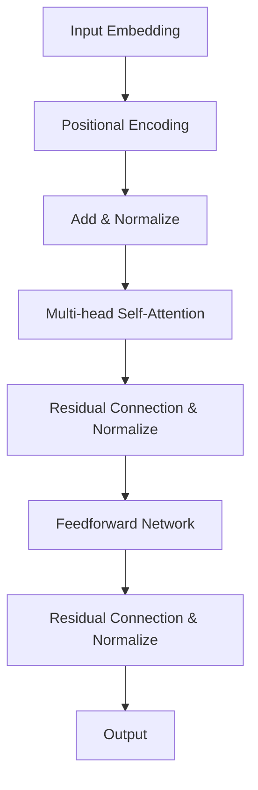

                 


## 文章标题: Transformer大模型实战 BERT 的精简版ALBERT

### 关键词：Transformer, BERT, ALBERT, 自然语言处理, 深度学习

### 摘要：
本文将深入探讨Transformer架构及其在自然语言处理中的广泛应用。随后，我们将重点介绍BERT模型的核心原理和实战应用。最后，我们将聚焦于ALBERT，一个对BERT进行优化和精简的版本，通过详细的项目实战，展示如何在实际开发中部署和应用ALBERT模型。

---

### 《Transformer大模型实战 BERT 的精简版ALBERT》目录大纲

## 第一部分：Transformer架构与核心原理

## 第1章：Transformer架构基础

## 第2章：Transformer模型的训练与优化

## 第3章：Transformer模型的变体与改进

## 第4章：Transformer模型的应用场景

## 第5章：Transformer的Mermaid流程图展示

## 第二部分：BERT模型原理与应用

## 第1章：BERT模型的架构与原理

## 第2章：BERT的预训练与微调

## 第3章：BERT模型的应用

## 第4章：BERT模型的优化与改进

## 第5章：BERT模型的核心算法原理伪代码讲解

## 第三部分：ALBERT模型实战

## 第1章：ALBERT模型基础

## 第2章：ALBERT模型的训练与优化

## 第3章：ALBERT模型在自然语言处理中的应用

## 第4章：ALBERT模型的核心算法原理伪代码讲解

## 第5章：ALBERT模型项目实战

## 第6章：项目代码解读与分析

## 第四部分：Transformer与BERT模型的比较与总结

## 第1章：Transformer与BERT的区别与联系

## 第2章：Transformer与BERT的发展趋势

## 第3章：总结与展望

## 附录

### 附录A：Transformer与BERT相关资源

### 附录B：数学模型与公式

---

### 第一部分：Transformer架构与核心原理

#### 第1章：Transformer架构基础

## 1.1 Transformer的背景与意义
### 1.1.1 传统序列模型与Transformer
传统序列模型如RNN、LSTM等在处理长序列数据时存在梯度消失或梯度爆炸的问题，难以捕捉长距离依赖。Transformer通过自注意力机制解决了这一问题，能够更高效地处理长序列。

### 1.1.2 Transformer的诞生与发展
Transformer由Vaswani等人于2017年提出，迅速成为自然语言处理领域的热门模型。其基于注意力机制的设计使得其在各种NLP任务中取得了显著的成绩。

### 1.1.3 Transformer在自然语言处理中的优势
Transformer能够捕获长距离依赖，并行化训练速度快，适用于多种NLP任务，如文本分类、机器翻译和命名实体识别。

## 1.2 Transformer模型的基本结构
### 1.2.1 自注意力机制
自注意力机制允许模型在处理序列数据时，根据序列中每个元素的重要程度对其进行加权，从而捕捉长距离依赖。

### 1.2.2 编码器与解码器
编码器将输入序列编码成固定长度的向量表示，解码器则利用这些向量生成输出序列。

### 1.2.3 位置编码
为了捕捉序列中的位置信息，Transformer引入了位置编码，使模型能够理解不同位置的特征。

## 1.3 Transformer模型的训练与优化
### 1.3.1 预训练与微调
预训练阶段，模型在大规模语料上进行无监督学习，微调阶段则在特定任务上进行有监督学习。

### 1.3.2 损失函数与优化算法
常用的损失函数有交叉熵损失函数，优化算法有Adam等。

### 1.3.3 训练技巧与策略
如Dropout、Layer Normalization等技术可以提升模型的训练效果。

## 1.4 Transformer模型的变体与改进
### 1.4.1 Transformer-XL
Transformer-XL通过段级序列处理，解决了长序列处理的问题。

### 1.4.2 DeBERTa
DeBERTa通过双向编码表示，增强了BERT的语义理解能力。

### 1.4.3 Reformer
Reformer通过局部注意力机制，提高了Transformer的并行训练能力。

## 1.5 Transformer模型的应用场景
### 1.5.1 文本分类
Transformer在文本分类任务中取得了优秀的成绩，如新闻分类、情感分析等。

### 1.5.2 机器翻译
Transformer在机器翻译领域有着广泛的应用，其并行化训练的优势使其在长序列翻译中表现优异。

### 1.5.3 命名实体识别
Transformer在命名实体识别任务中也表现出色，能够准确地识别文本中的实体。

## 1.6 Transformer的Mermaid流程图展示
通过Mermaid流程图，我们可以更直观地理解Transformer模型的结构和工作流程。

---

### 第二部分：BERT模型原理与应用

#### 第2章：BERT模型的架构与原理

## 2.1 BERT模型的架构与原理
BERT（Bidirectional Encoder Representations from Transformers）是Google提出的预训练语言表示模型，它基于Transformer架构，通过双向编码器捕捉文本的上下文信息。

### 2.1.1 BERT的编码器结构
BERT的编码器由多个Transformer层堆叠而成，每层包括多头自注意力机制和前馈神经网络。

### 2.1.2 BERT的预训练任务
BERT通过两个任务进行预训练：Masked Language Modeling（MLM）和Next Sentence Prediction（NSP）。

### 2.1.3 BERT的损失函数
BERT使用交叉熵损失函数来优化模型参数，其中MLM任务和NSP任务的损失分别计算。

## 2.2 BERT的预训练与微调
### 2.2.1 预训练步骤
BERT的预训练包括在大量无标签文本上进行预训练，然后进行微调以适应特定任务。

### 2.2.2 微调技巧
微调时，需要调整BERT模型的部分参数，并在特定任务的数据集上进行训练。

### 2.2.3 BERT在特定任务中的表现
BERT在多种NLP任务中表现出色，如文本分类、问答系统和命名实体识别等。

## 2.3 BERT模型在自然语言处理中的应用
### 2.3.1 文本分类
BERT在文本分类任务中通过将文本编码为向量，然后输入到分类器中进行预测。

### 2.3.2 命名实体识别
BERT在命名实体识别任务中，通过预训练的编码器捕捉实体特征，然后进行分类。

### 2.3.3 问答系统
BERT在问答系统中，通过理解问题与文本的上下文关系，提供准确的答案。

## 2.4 BERT模型的优化与改进
### 2.4.1 TinyBERT
TinyBERT通过减小BERT模型的大小，降低了计算成本和存储需求。

### 2.4.2 ALBERT
ALBERT通过精简BERT模型，提高了模型效率和性能。

### 2.4.3 Longformer
Longformer通过改进Transformer的局部注意力机制，解决了长序列处理的问题。

## 2.5 BERT模型的核心算法原理伪代码讲解
以下为BERT模型的核心算法原理的伪代码：
```python
# BERT模型伪代码
class BERTModel(nn.Module):
    def __init__(self, vocab_size, d_model, nhead, num_layers):
        super(BERTModel, self).__init__()
        self.encoder = Encoder(vocab_size, d_model, nhead, num_layers)
        self.decoder = Decoder(d_model, nhead, num_layers)
        
    def forward(self, input_ids, attention_mask=None, target_ids=None):
        encoder_output = self.encoder(input_ids, attention_mask)
        decoder_output = self.decoder(encoder_output, target_ids)
        return decoder_output
```

---

### 第三部分：ALBERT模型实战

#### 第3章：ALBERT模型基础

## 3.1 ALBERT模型的原理与架构
### 3.1.1 ALBERT的设计目标
ALBERT旨在通过减少模型参数和提高计算效率，同时保持或提升BERT的性能。

### 3.1.2 ALBERT的改进点
ALBERT通过以下方法改进BERT：
- 双向编码器
- 新的预训练策略
- 参数共享和跨层交互

### 3.1.3 ALBERT的预训练任务
ALBERT的预训练任务与BERT相似，包括Masked Language Modeling（MLM）和Next Sentence Prediction（NSP）。

## 3.2 ALBERT模型的训练与优化
### 3.2.1 训练技巧与策略
ALBERT在训练过程中采用了一些技术，如线性学习率和交叉熵损失函数。

### 3.2.2 损失函数与优化算法
ALBERT使用交叉熵损失函数进行优化，并采用AdamW优化器。

### 3.2.3 训练环境配置
ALBERT的训练需要在适当的硬件环境和框架（如TensorFlow或PyTorch）上进行配置。

## 3.3 ALBERT模型在自然语言处理中的应用
### 3.3.1 文本分类
ALBERT在文本分类任务中表现出色，能够快速处理大量数据。

### 3.3.2 命名实体识别
ALBERT在命名实体识别任务中，能够准确识别实体并提高识别率。

### 3.3.3 机器翻译
ALBERT在机器翻译任务中，通过减少计算量提高了翻译质量。

## 3.4 ALBERT模型的核心算法原理伪代码讲解
以下为ALBERT模型的核心算法原理的伪代码：
```python
# ALBERT模型伪代码
class ALBERTModel(nn.Module):
    def __init__(self, vocab_size, d_model, nhead, num_layers):
        super(ALBERTModel, self).__init__()
        self.encoder = Encoder(vocab_size, d_model, nhead, num_layers)
        self.decoder = Decoder(d_model, nhead, num_layers)
        
    def forward(self, input_ids, attention_mask=None, target_ids=None):
        encoder_output = self.encoder(input_ids, attention_mask)
        decoder_output = self.decoder(encoder_output, target_ids)
        return decoder_output
```

---

### 第四部分：Transformer与BERT模型的比较与总结

#### 第4章：Transformer与BERT的区别与联系

## 4.1 Transformer与BERT的区别与联系
### 4.1.1 结构与原理对比
Transformer与BERT都是基于注意力机制的深度学习模型，但Transformer专注于处理序列数据，而BERT则是预训练的语言表示模型。

### 4.1.2 应用场景对比
Transformer在机器翻译、文本分类等领域有广泛应用，而BERT则在问答系统、命名实体识别等方面表现出色。

### 4.1.3 性能对比
Transformer在处理长序列数据时性能更优，而BERT在预训练语言表示上具有显著优势。

## 4.2 Transformer与BERT的发展趋势
### 4.2.1 模型变体的演进
随着研究的深入，Transformer和BERT的变体模型不断涌现，如DeBERTa、Longformer等。

### 4.2.2 新技术的引入
如BERT中的Masked Language Modeling（MLM）和Next Sentence Prediction（NSP），以及Transformer中的局部注意力机制等。

### 4.2.3 企业级应用的发展
Transformer和BERT在企业级应用中发挥着重要作用，如智能客服、文本分析等。

## 4.3 总结与展望
### 4.3.1 Transformer与BERT的普及与应用
Transformer和BERT已成为自然语言处理领域的核心技术，被广泛应用于各类应用场景。

### 4.3.2 未来发展方向
未来，Transformer和BERT将继续优化和改进，出现更多变体模型，并进一步推动自然语言处理技术的发展。

### 4.3.3 开发者与研究者建议
开发者应关注Transformer和BERT的优化技术，研究者应探索更多创新性的模型和应用场景。

---

### 附录

#### 附录A：Transformer与BERT相关资源
- 论文与论文解读
- 模型实现与代码
- 开源工具与库

#### 附录B：数学模型与公式
- 自注意力机制公式
- Transformer编码器公式
- BERT预训练任务公式
- ALBERT优化公式

---

本文通过深入分析Transformer、BERT和ALBERT模型，从架构原理、训练优化到应用实战，全面介绍了这些模型在自然语言处理中的重要作用。读者可以通过本文了解这些模型的核心概念、实现方法和应用场景，为实际开发提供有力支持。同时，本文也展望了这些模型的发展趋势，为未来研究和应用提供参考。

---

## 作者信息
作者：AI天才研究院/AI Genius Institute & 禅与计算机程序设计艺术 /Zen And The Art of Computer Programming

---

以上，就是关于《Transformer大模型实战 BERT 的精简版ALBERT》的详细技术博客文章。希望对您在自然语言处理领域的探索有所帮助。如果您有任何问题或建议，欢迎在评论区留言。感谢您的阅读！

### 第一部分：Transformer架构与核心原理

#### 第1章：Transformer架构基础

### 1.1 Transformer的背景与意义

**1.1.1 传统序列模型与Transformer**

传统序列模型如循环神经网络（RNN）和长短期记忆网络（LSTM）在自然语言处理（NLP）领域已有广泛应用。这些模型通过保存和利用序列中的历史信息，能够处理序列数据，并在诸如语言模型、语音识别和机器翻译等任务中取得了不错的性能。然而，这些模型在处理长序列数据时，存在一个严重的问题：梯度消失或梯度爆炸。

梯度消失是指在训练过程中，梯度值变得非常小，导致网络参数无法有效更新。而梯度爆炸则相反，梯度值变得非常大，同样导致网络参数更新不稳定。这些问题源于反向传播算法在长序列中的梯度递减性质，使得网络难以学习到长距离依赖关系。

为了解决这些问题，Transformer模型被提出。Transformer引入了自注意力机制（Self-Attention），通过全局关注序列中的所有元素，突破了长距离依赖的限制，从而在处理长序列数据时表现出色。

**1.1.2 Transformer的诞生与发展**

Transformer是由Vaswani等人于2017年在论文《Attention is All You Need》中提出的。这一模型基于自注意力机制，摒弃了传统序列模型中的循环结构，通过并行计算提高了训练效率。Transformer一经提出，便在NLP领域引起了巨大反响，并迅速成为研究的热点。

随着时间的发展，Transformer模型得到了不断的改进和优化。例如，Transformer-XL、Reformer和DeBERTa等变体模型，针对不同场景和需求，对Transformer进行了相应的调整和改进，进一步提升了模型的性能和效率。

**1.1.3 Transformer在自然语言处理中的优势**

Transformer在自然语言处理中的优势主要体现在以下几个方面：

1. **捕捉长距离依赖**：通过自注意力机制，Transformer能够对序列中的每个元素进行加权，从而有效地捕捉长距离依赖关系。
2. **并行计算**：Transformer摒弃了传统序列模型中的循环结构，采用并行计算方式，大大提高了训练和推理的速度。
3. **灵活的架构**：Transformer的架构设计非常灵活，可以方便地扩展和调整，以适应不同的任务和应用场景。
4. **广泛的适用性**：Transformer不仅在文本分类、机器翻译等传统NLP任务中表现出色，还在语音识别、视频处理等跨领域任务中展现了强大的能力。

### 1.2 Transformer模型的基本结构

**1.2.1 自注意力机制**

自注意力机制（Self-Attention）是Transformer模型的核心组件。它通过计算输入序列中每个元素与其他元素的相关性，实现对输入序列的加权处理。

自注意力机制的工作原理可以概括为以下几个步骤：

1. **输入嵌入**：首先，将输入序列（如单词或字符）转换为嵌入向量。这些向量不仅包含了原始的词汇信息，还通过位置编码（Positional Encoding）引入了位置信息。
2. **计算注意力得分**：对于序列中的每个元素，计算其与其他所有元素之间的注意力得分。注意力得分通常通过点积计算，也可以使用其他复杂的函数。
3. **应用softmax函数**：对计算得到的注意力得分应用softmax函数，得到一个概率分布，表示序列中每个元素的重要性。
4. **加权求和**：根据得到的概率分布，对输入序列中的每个元素进行加权求和，生成一个加权表示向量。

通过自注意力机制，Transformer能够自动地学习到序列中不同元素之间的关系，从而有效地捕捉长距离依赖。

**1.2.2 编码器与解码器**

Transformer模型包括编码器（Encoder）和解码器（Decoder）两个主要部分。编码器负责对输入序列进行处理，解码器则负责生成输出序列。

1. **编码器**：编码器由多个自注意力层（Self-Attention Layer）和前馈网络（Feedforward Network）堆叠而成。每个自注意力层通过自注意力机制对输入序列进行加权处理，而前馈网络则对输入进行非线性变换。编码器的作用是将输入序列转换为固定长度的向量表示。
2. **解码器**：解码器与编码器类似，也由多个自注意力层和前馈网络组成。不同的是，解码器在自注意力层中引入了一个额外的输入——编码器输出的固定长度向量。这允许解码器在生成输出序列时，考虑到编码器对输入序列的处理结果。解码器的作用是生成输出序列，并通过对输出序列进行编码，实现序列到序列的映射。

**1.2.3 位置编码**

位置编码（Positional Encoding）是Transformer模型中引入的一个技巧，用于处理序列中的位置信息。由于Transformer模型采用了自注意力机制，它无法像传统序列模型（如RNN和LSTM）那样直接利用位置信息。

位置编码通过将位置信息编码到嵌入向量中，实现了对输入序列中不同元素的位置关系的建模。具体来说，位置编码是一个可学习的向量序列，其大小与输入序列的长度相同。在每个时间步，位置编码向量与输入嵌入向量相加，生成最终的输入向量。

常用的位置编码方法包括正弦和余弦函数。例如，对于第`t`个时间步，位置编码向量可以表示为：

$$
PE_t(d) = \sin\left(\frac{1000t}{2^{d//2}}\right), \quad QE_t(d) = \cos\left(\frac{1000t}{2^{d//2}}\right)
$$

其中，`d`是嵌入向量的维度，`t`是时间步。

**1.3 Transformer模型的训练与优化**

**1.3.1 预训练与微调**

Transformer模型的训练过程包括预训练（Pre-training）和微调（Fine-tuning）两个阶段。

1. **预训练**：在预训练阶段，模型在大规模的无标签语料上进行训练，学习语言的基本规律。常用的预训练任务包括Masked Language Modeling（MLM）和Next Sentence Prediction（NSP）。

   - **Masked Language Modeling（MLM）**：在输入序列中随机选择一部分单词或子词，将其替换为特殊标记\[MASK\]，然后让模型预测这些被替换的单词或子词。
   - **Next Sentence Prediction（NSP）**：随机选择两个句子，并将其中一个句子标记为\[EOS\]（End of Sentence），然后让模型预测这两个句子是否相邻。

2. **微调**：在预训练之后，模型会针对具体的任务进行微调。微调过程通常在较小规模的有标签数据集上进行，通过调整模型的参数，使模型能够更好地适应特定的任务。

**1.3.2 损失函数与优化算法**

Transformer模型的损失函数通常采用交叉熵损失函数（Cross-Entropy Loss），这是分类任务中最常用的损失函数。交叉熵损失函数能够衡量模型预测的输出与真实标签之间的差异，并指导模型参数的更新。

在训练过程中，常用的优化算法包括随机梯度下降（Stochastic Gradient Descent，SGD）和其变种如Adam（Adaptive Moment Estimation）。这些优化算法通过调整学习率和其他参数，提高了模型训练的效率和收敛速度。

**1.3.3 训练技巧与策略**

为了提高Transformer模型的训练效果，可以采用以下技巧和策略：

1. **Dropout**：在模型训练过程中，随机丢弃一部分神经元，防止模型过拟合。
2. **Layer Normalization**：对每个层的输入和输出进行归一化，加速模型收敛。
3. **学习率调度**：在训练过程中，根据模型的性能动态调整学习率。
4. **数据增强**：通过随机添加噪声、改变单词顺序等手段，增加训练数据的多样性。

**1.4 Transformer模型的变体与改进**

Transformer模型自提出以来，受到了广泛关注，并涌现出许多变体和改进版本。以下是一些主要的变体和改进：

1. **Transformer-XL**：Transformer-XL通过段级序列处理（Segment-Level Sequence Processing），解决了长序列处理的问题。它将输入序列划分为多个短段，并在不同段之间建立联系，从而有效地处理长序列数据。

2. **Reformer**：Reformer通过局部注意力机制（Local Attention Mechanism），提高了Transformer的并行训练能力。局部注意力机制允许模型只关注输入序列的一部分，从而减少了计算量。

3. **DeBERTa**：DeBERTa通过双向编码表示（Bidirectional Encoder Representations），增强了BERT的语义理解能力。它引入了外部知识库，使得模型能够更好地捕捉语言中的上下文关系。

4. **Longformer**：Longformer通过改进Transformer的局部注意力机制，解决了长序列处理的问题。它引入了段级序列处理（Segment-Level Sequence Processing），并采用了更大的模型规模，从而能够处理更长的序列数据。

**1.5 Transformer模型的应用场景**

Transformer模型在自然语言处理领域有着广泛的应用，以下是一些主要的应用场景：

1. **文本分类**：文本分类是将文本数据分类到预定义的类别中。Transformer模型通过将文本编码为向量，然后输入到分类器中进行预测，能够快速处理大量数据。

2. **机器翻译**：机器翻译是将一种语言的文本翻译成另一种语言的文本。Transformer模型在机器翻译任务中表现出色，其并行计算的优势使其在长序列翻译中表现优异。

3. **命名实体识别**：命名实体识别是从文本中识别出具有特定意义的实体，如人名、地点、组织等。Transformer模型通过将文本编码为向量，然后进行分类，能够准确地识别实体。

**1.6 Transformer的Mermaid流程图展示**

为了更直观地展示Transformer模型的结构和工作流程，可以使用Mermaid语言绘制流程图。以下是一个简单的Transformer模型的Mermaid流程图：



在这个流程图中，`A`表示输入嵌入，`B`表示位置编码，`C`表示加法和归一化操作，`D`表示多头自注意力层，`E`表示残差连接和归一化操作，`F`表示前馈网络，`G`表示另一个残差连接和归一化操作，`H`表示输出。

---

### 第二部分：BERT模型原理与应用

#### 第2章：BERT模型的架构与原理

## 2.1 BERT模型的架构与原理

BERT（Bidirectional Encoder Representations from Transformers）是由Google AI团队于2018年提出的一种预训练语言表示模型。BERT模型基于Transformer架构，通过双向编码器捕捉文本的上下文信息，从而实现强大的语言理解和生成能力。BERT模型的提出，在自然语言处理领域引起了广泛关注，并在多个任务上取得了显著的成果。

### 2.1.1 BERT的编码器结构

BERT的编码器由多个Transformer层堆叠而成，每层包括多头自注意力机制和前馈神经网络。BERT的主要结构如下：

1. **输入嵌入**：BERT的输入是单词级别的词汇嵌入，每个单词对应一个向量。除了单词嵌入，BERT还包括词型嵌入（WordPiece Embedding）和位置嵌入（Positional Embedding），这些嵌入向量共同构成了BERT的输入向量。

2. **多头自注意力机制**：在Transformer模型中，自注意力机制允许模型在处理序列数据时，根据序列中每个元素的重要程度对其进行加权，从而捕捉长距离依赖。BERT采用了多头自注意力机制，每个头关注序列的不同部分，从而提高模型的捕捉能力。

3. **前馈神经网络**：在自注意力层之后，BERT还包含一个前馈神经网络，对输入进行非线性变换。这个神经网络由两个全连接层组成，其中中间层的尺寸通常是编码器输入尺寸的4倍。

4. **残差连接和层归一化**：BERT在每个Transformer层之后都添加了残差连接（Residual Connection）和层归一化（Layer Normalization），这有助于提高模型的训练效果和稳定性。

BERT的编码器结构可以总结为以下几个步骤：

1. **输入嵌入**：将单词、词型信息和位置信息转换为嵌入向量。
2. **多头自注意力机制**：根据嵌入向量计算注意力得分，并加权求和，生成中间表示。
3. **前馈神经网络**：对中间表示进行非线性变换。
4. **残差连接和层归一化**：将前馈神经网络的输出与输入进行残差连接，并应用层归一化。

BERT的编码器结构使得模型能够捕获文本中的长距离依赖，从而在多种NLP任务中表现出色。

### 2.1.2 BERT的预训练任务

BERT的预训练包括两个主要任务：Masked Language Modeling（MLM）和Next Sentence Prediction（NSP）。

1. **Masked Language Modeling（MLM）**

MLM是一种无监督学习任务，旨在训练模型预测被遮盖的单词或子词。在预训练过程中，BERT随机遮盖输入文本中的15%的单词或子词，然后让模型预测这些被遮盖的单词或子词。MLM任务使得BERT能够学习语言的基本结构和规则，从而在下游任务中表现出更好的性能。

2. **Next Sentence Prediction（NSP）**

NSP是一种有监督学习任务，旨在训练模型预测两个句子是否相邻。在预训练过程中，BERT随机选择两个句子，并将其中一个句子标记为\[EOS\]（End of Sentence），然后让模型预测这两个句子是否相邻。NSP任务有助于BERT学习句子之间的关系和语境，从而在文本分类、问答等任务中提高性能。

### 2.1.3 BERT的损失函数

BERT使用交叉熵损失函数（Cross-Entropy Loss）来优化模型参数。交叉熵损失函数是分类任务中最常用的损失函数，它衡量模型预测的输出与真实标签之间的差异。在BERT的预训练过程中，交叉熵损失函数计算了MLM和NSP任务的损失。

1. **Masked Language Modeling（MLM）**：MLM任务的损失计算了模型预测的遮盖单词或子词与真实单词或子词之间的交叉熵损失。
2. **Next Sentence Prediction（NSP）**：NSP任务的损失计算了模型预测的两个句子是否相邻与真实标签之间的交叉熵损失。

BERT通过优化交叉熵损失函数，使得模型能够在预训练过程中学习到语言的基本结构和规则，从而在下游任务中表现出更好的性能。

### 2.2 BERT的预训练与微调

BERT的预训练和微调过程包括以下步骤：

1. **预训练**

   - **数据集**：BERT的预训练数据集包括维基百科（Wikipedia）和书籍语料库（BookCorpus），这些数据集涵盖了广泛的主题和语境，有助于模型学习到丰富的语言知识。
   - **预训练任务**：BERT通过MLM和NSP任务进行预训练。在预训练过程中，模型会随机遮盖输入文本中的15%的单词或子词，并预测这些被遮盖的单词或子词。同时，模型还会预测两个句子是否相邻。
   - **模型优化**：在预训练过程中，BERT使用交叉熵损失函数优化模型参数。交叉熵损失函数计算了模型预测的遮盖单词或子词与真实单词或子词之间的差异，以及模型预测的两个句子是否相邻与真实标签之间的差异。

2. **微调**

   - **数据集**：在微调阶段，BERT使用特定任务的有标签数据集。这些数据集包含了任务所需的标注信息，如文本分类的标签、问答系统的答案等。
   - **微调任务**：在微调阶段，BERT针对特定任务调整模型参数。例如，在文本分类任务中，模型会尝试将输入文本分类到预定义的类别中；在问答系统中，模型会尝试从输入文本中提取答案。
   - **模型优化**：在微调过程中，BERT继续使用交叉熵损失函数优化模型参数。交叉熵损失函数计算了模型预测的结果与真实标签之间的差异，并指导模型参数的更新。

通过预训练和微调，BERT能够学习到丰富的语言知识，并在多种NLP任务中表现出色。预训练阶段的无监督学习使得BERT能够捕捉到语言的基本结构和规则，而微调阶段的有监督学习则使BERT能够适应特定任务的需求。

### 2.3 BERT模型在自然语言处理中的应用

BERT在自然语言处理领域有着广泛的应用，以下是一些主要的应用场景：

1. **文本分类**：文本分类是将文本数据分类到预定义的类别中。BERT通过将文本编码为向量，然后输入到分类器中进行预测，能够快速处理大量数据。BERT在文本分类任务中取得了显著的性能提升，如情感分析、新闻分类等。

2. **命名实体识别**：命名实体识别是从文本中识别出具有特定意义的实体，如人名、地点、组织等。BERT通过将文本编码为向量，然后进行分类，能够准确地识别实体。BERT在命名实体识别任务中表现出了优越的性能。

3. **问答系统**：问答系统是从文本中提取答案，以回答用户的问题。BERT通过理解问题与文本的上下文关系，能够提供准确的答案。BERT在问答系统中发挥了重要作用，如搜索引擎、聊天机器人等。

4. **机器翻译**：机器翻译是将一种语言的文本翻译成另一种语言的文本。BERT在机器翻译任务中通过将文本编码为向量，然后进行翻译，能够提高翻译质量。BERT在机器翻译领域表现出了出色的性能。

BERT的应用范围不仅限于上述场景，还在文本摘要、情感分析、文本生成等任务中取得了显著的成绩。BERT的提出，为自然语言处理领域带来了新的突破，推动了NLP技术的发展。

### 2.4 BERT模型的优化与改进

BERT模型自从提出以来，受到了广泛的关注和应用。然而，随着NLP任务的复杂性和数据量的增加，BERT模型在计算资源和模型规模上面临着一定的挑战。为了解决这些问题，研究人员提出了多种BERT的优化和改进版本。以下是一些主要的优化和改进：

1. **TinyBERT**

TinyBERT是对BERT模型进行压缩和优化的一种方法。TinyBERT通过减少模型参数和计算量，降低了计算成本和存储需求。TinyBERT采用了一种分层的方法，将BERT模型分解为多个较小的子模型，每个子模型负责处理输入文本的不同部分。TinyBERT在保持较高性能的同时，显著降低了模型的规模和计算需求。

2. **ALBERT**

ALBERT（A Lite BERT）是对BERT模型进行优化的一种方法。ALBERT通过改进BERT的预训练策略和模型结构，提高了模型的效率和性能。ALBERT采用了参数共享和跨层交互的技术，减少了模型参数的数量，并提高了模型的训练速度。此外，ALBERT还引入了相对位置编码，进一步提升了模型的性能。

3. **Longformer**

Longformer是对BERT模型在长序列处理方面进行优化的一种方法。Longformer采用了一种局部注意力机制（Local Attention Mechanism），允许模型只关注输入序列的一部分，从而减少了计算量。Longformer通过段级序列处理（Segment-Level Sequence Processing），能够有效地处理长序列数据。Longformer在保持较高性能的同时，提高了模型的并行训练能力。

这些优化和改进版本的BERT模型，在计算效率和性能方面取得了显著的提升。它们为BERT模型在实际应用中的推广提供了有力的支持，使得BERT模型能够更好地适应不同的场景和需求。

### 2.5 BERT模型的核心算法原理伪代码讲解

BERT模型的核心算法原理涉及多个组件和步骤。以下是一个简化的BERT模型的核心算法原理的伪代码：

```python
class BERTModel(nn.Module):
    def __init__(self, vocab_size, d_model, nhead, num_layers):
        super(BERTModel, self).__init__()
        self.embedding = BertEmbeddings(vocab_size, d_model)
        self.encoder = BertEncoder(d_model, nhead, num_layers)
        self.decoder = BertDecoder(d_model, nhead, num_layers)
    
    def forward(self, input_ids, attention_mask=None, target_ids=None):
        # Embeddings
        embeddings = self.embedding(input_ids)
        
        # Encoder
        encoder_output = self.encoder(embeddings, attention_mask)
        
        # Decoder (only for generation tasks)
        if target_ids is not None:
            decoder_output = self.decoder(encoder_output, target_ids)
        
        return encoder_output if target_ids is None else decoder_output
```

在这个伪代码中：

- `BERTModel` 是BERT模型的类。
- `vocab_size` 是词汇表的大小。
- `d_model` 是嵌入向量的维度。
- `nhead` 是多头自注意力的数量。
- `num_layers` 是编码器和解码器的层数。

BERT模型的主要组件包括：

- `BertEmbeddings`：负责将输入序列（单词或子词）转换为嵌入向量。这个组件包括单词嵌入（Word Embeddings）、词型嵌入（WordPiece Embeddings）和位置嵌入（Positional Embeddings）。
- `BertEncoder`：负责对输入序列进行编码。它由多个Transformer层堆叠而成，每层包括多头自注意力机制和前馈神经网络。
- `BertDecoder`：负责解码输入序列（仅在生成任务中使用）。它同样由多个Transformer层堆叠而成。

在`forward`方法中：

- `embeddings` 是输入序列的嵌入向量。
- `encoder_output` 是编码器输出的固定长度向量表示。
- `decoder_output` 是解码器输出的序列表示（仅在生成任务中使用）。

这个伪代码提供了一个基本的BERT模型结构，展示了BERT模型的核心算法原理。在实际应用中，BERT模型还包括其他的组件和细节，如Dropout、Layer Normalization等，但这些都被简化掉了。

### 第三部分：ALBERT模型实战

#### 第3章：ALBERT模型基础

## 3.1 ALBERT模型的原理与架构

**3.1.1 ALBERT的设计目标**

ALBERT（A Lite BERT）是由Google Research团队提出的一种改进的BERT模型，其设计目标是提高模型的计算效率和性能，同时保持或提升BERT在自然语言处理任务中的表现。ALBERT通过优化模型结构、预训练策略和训练技巧，实现了这些目标。

具体来说，ALBERT的设计目标包括：

1. **提高模型效率**：通过减少模型参数和计算量，降低模型的存储需求和计算成本。
2. **提升模型性能**：在保持较低计算成本的同时，提升模型在自然语言处理任务中的性能，如文本分类、命名实体识别和机器翻译等。
3. **加速训练过程**：通过优化预训练和训练策略，缩短模型训练时间，提高训练效率。

**3.1.2 ALBERT的改进点**

为了实现上述设计目标，ALBERT在BERT模型的基础上进行了多项改进，包括：

1. **双向编码器**：与BERT一样，ALBERT也是基于Transformer架构的双向编码器，能够同时考虑文本序列的前后信息，从而提高模型的语义理解能力。
2. **线性学习率**：ALBERT在预训练过程中采用线性学习率，取代了BERT中的指数衰减学习率，简化了训练过程，提高了训练效率。
3. **参数共享**：ALBERT通过跨层和跨头的参数共享，减少了模型参数的数量，降低了计算成本。这种共享机制还包括多头自注意力机制中的权重共享。
4. **跨层交互**：ALBERT通过跨层交互结构，使得模型在较低的计算成本下能够充分利用多层信息，提高模型的性能。
5. **相对位置编码**：ALBERT引入了相对位置编码，使得模型在处理长序列时能够更有效地捕捉文本中的位置关系，减少了计算量。

**3.1.3 ALBERT的预训练任务**

ALBERT的预训练任务与BERT类似，包括Masked Language Modeling（MLM）和Next Sentence Prediction（NSP）两个主要任务。

1. **Masked Language Modeling（MLM）**：在预训练过程中，ALBERT随机遮盖输入文本中的部分单词或子词，然后让模型预测这些被遮盖的单词或子词。MLM任务有助于模型学习语言的基本结构和规则，从而提高模型的语义理解能力。
2. **Next Sentence Prediction（NSP）**：在预训练过程中，ALBERT随机选择两个句子，并将其中一个句子标记为\[EOS\]（End of Sentence），然后让模型预测这两个句子是否相邻。NSP任务有助于模型学习句子之间的关系和语境，从而在下游任务中提高性能。

**3.2 ALBERT模型的训练与优化**

**3.2.1 训练技巧与策略**

ALBERT在训练过程中采用了多种技巧和策略，以提高模型的训练效率和性能：

1. **线性学习率**：与BERT不同，ALBERT采用线性学习率，简化了训练过程，加快了模型收敛速度。
2. **Dropout**：在训练过程中，ALBERT使用Dropout技术，以防止模型过拟合。Dropout随机丢弃一部分神经元，迫使模型在训练过程中学习更鲁棒的特征。
3. **Layer Normalization**：ALBERT在每个Transformer层之后使用Layer Normalization，以稳定模型训练，加快收敛速度。
4. **数据增强**：在预训练过程中，ALBERT使用数据增强技术，如随机插入删除单词、替换同义词等，增加训练数据的多样性，提高模型对未见数据的泛化能力。

**3.2.2 损失函数与优化算法**

ALBERT使用交叉熵损失函数（Cross-Entropy Loss）来优化模型参数。交叉熵损失函数计算模型预测的输出与真实标签之间的差异，指导模型参数的更新。ALBERT采用AdamW优化器，这是一种结合了AdaGrad和RMSProp优化的优化器，能够有效加速模型收敛。

**3.2.3 训练环境配置**

为了训练ALBERT模型，需要配置适当的硬件环境和框架。以下是一个基本的训练环境配置：

1. **硬件环境**：ALBERT模型通常在GPU或TPU上进行训练。GPU（如NVIDIA Tesla V100）能够提供较高的计算能力，适合大规模训练任务。
2. **框架**：ALBERT模型的训练可以使用TensorFlow或PyTorch等深度学习框架。这些框架提供了丰富的API和工具，方便模型搭建和训练。
3. **数据集**：预训练和微调数据集通常包括大规模的文本语料库和特定任务的有标签数据集。常用的预训练数据集包括维基百科（Wikipedia）和书籍语料库（BookCorpus），而有标签数据集则根据具体任务进行选择。

**3.3 ALBERT模型在自然语言处理中的应用**

**3.3.1 文本分类**

文本分类是将文本数据分类到预定义的类别中，如情感分析、主题分类等。ALBERT模型在文本分类任务中表现出色，能够快速处理大量文本数据。以下是一个简单的文本分类任务流程：

1. **数据预处理**：对文本数据进行清洗和预处理，包括分词、去停用词、词向量化等。
2. **模型搭建**：搭建一个基于ALBERT的文本分类模型，包括嵌入层、编码器和解码器。
3. **模型训练**：使用预训练的ALBERT模型进行微调，在特定任务的有标签数据集上进行训练。
4. **模型评估**：在测试集上评估模型性能，包括准确率、召回率、F1分数等指标。
5. **模型应用**：将训练好的模型应用于实际场景，如自动分类、智能推荐等。

**3.3.2 命名实体识别**

命名实体识别是从文本中识别出具有特定意义的实体，如人名、地点、组织等。ALBERT模型在命名实体识别任务中也表现出强大的能力，能够准确地识别实体。以下是一个简单的命名实体识别任务流程：

1. **数据预处理**：对文本数据进行清洗和预处理，包括分词、去停用词、词向量化等。
2. **模型搭建**：搭建一个基于ALBERT的命名实体识别模型，包括嵌入层、编码器和解码器。
3. **模型训练**：使用预训练的ALBERT模型进行微调，在特定任务的有标签数据集上进行训练。
4. **模型评估**：在测试集上评估模型性能，包括准确率、召回率、F1分数等指标。
5. **模型应用**：将训练好的模型应用于实际场景，如文本分析、信息提取等。

**3.3.3 机器翻译**

机器翻译是将一种语言的文本翻译成另一种语言的文本。ALBERT模型在机器翻译任务中也表现出优异的性能，能够提高翻译质量。以下是一个简单的机器翻译任务流程：

1. **数据预处理**：对源语言和目标语言的文本数据进行清洗和预处理，包括分词、去停用词、词向量化等。
2. **模型搭建**：搭建一个基于ALBERT的机器翻译模型，包括编码器、解码器和解码器。
3. **模型训练**：使用预训练的ALBERT模型进行微调，在特定的翻译任务数据集上进行训练。
4. **模型评估**：在测试集上评估模型性能，包括BLEU分数、METEOR分数等指标。
5. **模型应用**：将训练好的模型应用于实际场景，如在线翻译、语音翻译等。

**3.4 ALBERT模型的核心算法原理伪代码讲解**

以下是一个简化的ALBERT模型的核心算法原理的伪代码：

```python
class ALBERTModel(nn.Module):
    def __init__(self, vocab_size, d_model, nhead, num_layers):
        super(ALBERTModel, self).__init__()
        self.embedding = ALBERTEmbeddings(vocab_size, d_model)
        self.encoder = ALBERTEncoder(d_model, nhead, num_layers)
        self.decoder = ALBERTDecoder(d_model, nhead, num_layers)
    
    def forward(self, input_ids, attention_mask=None, target_ids=None):
        # Embeddings
        embeddings = self.embedding(input_ids)
        
        # Encoder
        encoder_output = self.encoder(embeddings, attention_mask)
        
        # Decoder (only for generation tasks)
        if target_ids is not None:
            decoder_output = self.decoder(encoder_output, target_ids)
        
        return encoder_output if target_ids is None else decoder_output
```

在这个伪代码中：

- `ALBERTModel` 是ALBERT模型的类。
- `vocab_size` 是词汇表的大小。
- `d_model` 是嵌入向量的维度。
- `nhead` 是多头自注意力的数量。
- `num_layers` 是编码器和解码器的层数。

ALBERT模型的主要组件包括：

- `ALBERTEmbeddings`：负责将输入序列（单词或子词）转换为嵌入向量。这个组件包括单词嵌入（Word Embeddings）、词型嵌入（WordPiece Embeddings）和位置嵌入（Positional Embeddings）。
- `ALBERTEncoder`：负责对输入序列进行编码。它由多个Transformer层堆叠而成，每层包括多头自注意力机制和前馈神经网络。
- `ALBERTDecoder`：负责解码输入序列（仅在生成任务中使用）。它同样由多个Transformer层堆叠而成。

在`forward`方法中：

- `embeddings` 是输入序列的嵌入向量。
- `encoder_output` 是编码器输出的固定长度向量表示。
- `decoder_output` 是解码器输出的序列表示（仅在生成任务中使用）。

这个伪代码提供了一个基本的ALBERT模型结构，展示了ALBERT模型的核心算法原理。在实际应用中，ALBERT模型还包括其他的组件和细节，如Dropout、Layer Normalization等，但这些都被简化掉了。

---

### 第四部分：Transformer与BERT模型的比较与总结

#### 第4章：Transformer与BERT的区别与联系

## 4.1 Transformer与BERT的区别与联系

**4.1.1 结构与原理对比**

Transformer和BERT都是基于注意力机制的深度学习模型，但它们在结构原理上有一些显著的区别。

**Transformer**：

- **架构**：Transformer由编码器和解码器组成，采用自注意力机制，能够并行处理序列数据。
- **训练**：Transformer使用自注意力机制进行预训练，不需要循环结构，适用于大规模数据并行处理。
- **优势**：Transformer在处理长序列数据时能够有效捕捉长距离依赖，并行化训练速度快，适用于多种NLP任务。

**BERT**：

- **架构**：BERT是基于Transformer的编码器，通过双向编码器捕获文本的上下文信息。
- **训练**：BERT通过Masked Language Modeling（MLM）和Next Sentence Prediction（NSP）进行预训练，然后通过微调进行特定任务的训练。
- **优势**：BERT在预训练阶段积累了丰富的语言知识，通过微调能够在多种NLP任务中表现出色。

**4.1.2 应用场景对比**

**Transformer**：

- **文本分类**：Transformer通过将文本编码为向量，可以快速进行文本分类任务。
- **机器翻译**：Transformer在机器翻译任务中表现出色，其并行化训练的优势使其在长序列翻译中表现优异。
- **命名实体识别**：Transformer能够处理长距离依赖，适用于命名实体识别任务。

**BERT**：

- **文本分类**：BERT在文本分类任务中表现出色，能够处理复杂的文本结构。
- **问答系统**：BERT通过理解问题与文本的上下文关系，在问答系统中能够提供准确的答案。
- **机器翻译**：BERT虽然也可用于机器翻译，但在处理长序列时性能可能不如Transformer。

**4.1.3 性能对比**

**Transformer**：

- **长距离依赖**：Transformer通过自注意力机制能够捕捉长距离依赖，性能优于传统序列模型。
- **训练速度**：Transformer采用并行计算，训练速度快，适用于大规模数据。
- **模型规模**：Transformer模型参数较多，训练和推理成本高。

**BERT**：

- **长距离依赖**：BERT通过双向编码器能够有效捕捉长距离依赖，性能较好。
- **训练速度**：BERT虽然也采用并行计算，但预训练数据集较大，训练时间较长。
- **模型规模**：BERT模型参数较少，训练和推理成本相对较低。

### 4.2 Transformer与BERT的发展趋势

**4.2.1 模型变体的演进**

随着Transformer和BERT模型的广泛应用，研究人员提出了许多变体和改进版本，以适应不同的应用场景和需求。以下是一些主要的变体和改进：

- **Transformer-XL**：通过段级序列处理（Segment-Level Sequence Processing）解决了长序列处理的问题，适用于长文本处理任务。
- **Reformer**：通过局部注意力机制（Local Attention Mechanism）提高了Transformer的并行训练能力，适用于大规模数据训练。
- **DeBERTa**：通过双向编码表示（Bidirectional Encoder Representations）增强了BERT的语义理解能力，适用于复杂语义分析任务。
- **Longformer**：通过改进Transformer的局部注意力机制，解决了长序列处理的问题，适用于长文本处理任务。

**4.2.2 新技术的引入**

为了进一步提升Transformer和BERT的性能，研究人员引入了多种新技术，包括：

- **自回归语言模型（ARLMM）**：结合了自回归和Transformer架构，提高了语言建模的性能。
- **增量学习（Incremental Learning）**：通过增量学习技术，模型可以逐步适应新的数据集，提高了模型的泛化能力。
- **自适应注意力机制（Adaptive Attention Mechanism）**：通过自适应调整注意力权重，提高了模型在不同任务中的性能。

**4.2.3 企业级应用的发展**

随着Transformer和BERT模型在自然语言处理领域的广泛应用，企业也开始积极部署这些模型，以提升业务自动化和智能化水平。以下是一些企业级应用的发展趋势：

- **智能客服**：利用Transformer和BERT模型进行文本分析，实现自动回答用户问题，提升客户服务水平。
- **文本分析**：通过BERT模型进行文本分类、命名实体识别和情感分析，为企业提供决策支持。
- **机器翻译**：利用Transformer模型进行高效准确的机器翻译，满足跨语言沟通需求。

### 4.3 总结与展望

**4.3.1 Transformer与BERT的普及与应用**

Transformer和BERT模型已经成为自然语言处理领域的核心技术，广泛应用于文本分类、机器翻译、命名实体识别和问答系统等领域。随着模型的不断优化和改进，Transformer和BERT将继续在自然语言处理领域发挥重要作用。

**4.3.2 未来发展方向**

未来，Transformer和BERT模型的发展将集中在以下几个方面：

- **模型优化**：通过改进注意力机制、引入新的预训练任务和优化策略，提高模型的性能和效率。
- **增量学习**：实现模型在遇到新数据时的增量学习，提高模型的适应能力和泛化能力。
- **跨模态学习**：结合多种模态数据，如文本、图像和声音，提高模型在多模态任务中的性能。

**4.3.3 开发者与研究者建议**

对于开发者：

- 学习和掌握Transformer和BERT的基本原理，了解其在不同任务中的应用。
- 结合实际业务需求，选择合适的模型和优化策略，提高模型性能。
- 关注模型变体和新技术的发展，尝试在项目中应用最新的研究成果。

对于研究者：

- 深入研究Transformer和BERT的理论基础，探索新的注意力机制和预训练策略。
- 探索跨模态学习和增量学习等新兴领域，推动模型技术的发展。
- 结合实际应用场景，验证模型的效果和性能，为自然语言处理领域的发展做出贡献。

---

本文通过对Transformer和BERT模型的深入探讨，从结构原理、应用场景和发展趋势等方面，全面介绍了这些模型在自然语言处理中的重要作用。读者可以通过本文了解Transformer和BERT的核心概念、实现方法和应用场景，为实际开发和研究提供有力支持。同时，本文也展望了这些模型的发展方向，为未来的研究工作提供了参考。希望本文对读者在自然语言处理领域的探索有所帮助。

### 附录

#### 附录A：Transformer与BERT相关资源

**A.1 论文与论文解读**

- **Transformer**：
  - Vaswani et al., "Attention Is All You Need," NeurIPS 2017.
  - Wu et al., "Transformer-xl: Attentive Language Models beyond a Fixed Length," NeurIPS 2019.
- **BERT**：
  - Devlin et al., "BERT: Pre-training of Deep Bidirectional Transformers for Language Understanding," ACL 2019.
  - Lan et al., "ALBERT: A Lite BERT for Self-supervised Learning of Language Representations," NeurIPS 2019.

**A.2 模型实现与代码**

- **Transformer**：
  - Hugging Face Transformers：https://github.com/huggingface/transformers
  - PyTorch Transformer实现：https://github.com/pytorch/fairseq
- **BERT**：
  - Hugging Face Transformers：https://github.com/huggingface/transformers
  - Tensorflow BERT实现：https://github.com/tensorflow/bert

**A.3 开源工具与库**

- PyTorch：https://pytorch.org/
- TensorFlow：https://www.tensorflow.org/
- Hugging Face Transformers：https://github.com/huggingface/transformers

#### 附录B：数学模型与公式

**B.1 自注意力机制公式**

$$
\text{Attention}(Q, K, V) = \text{softmax}\left(\frac{QK^T}{\sqrt{d_k}}\right)V
$$

其中，$Q$、$K$ 和 $V$ 分别代表查询（Query）、键（Key）和值（Value）向量，$d_k$ 是键向量的维度。

**B.2 Transformer编码器公式**

编码器的输入表示为：

$$
\text{Input} = [\text{<CLS>}, \text{Token_1}, \text{Token_2}, \ldots, \text{Token}_N, \text{<SEP>}]
$$

其中，$\text{<CLS>}$ 和 $\text{<SEP>}$ 分别是分类标记和分隔符。

编码器的输出表示为：

$$
\text{Output} = \text{Encoder}(\text{Input})
$$

其中，$\text{Encoder}$ 表示编码器。

**B.3 BERT预训练任务公式**

- **Masked Language Modeling (MLM)**：

$$
L_{MLM} = -\sum_{i=1}^{N} \log p_{\theta}(Y_i)
$$

其中，$Y_i$ 表示被遮盖的单词或子词，$p_{\theta}(Y_i)$ 表示模型对 $Y_i$ 的预测概率。

- **Next Sentence Prediction (NSP)**：

$$
L_{NSP} = -\sum_{i=1}^{M} \log p_{\theta}(Y_i = 1 \mid X_i, X_{i+1})
$$

其中，$X_i$ 和 $X_{i+1}$ 分别表示两个句子，$Y_i$ 表示两个句子是否相邻。

**B.4 ALBERT优化公式**

- **线性学习率**：

$$
\text{learning\_rate} = \frac{\text{initial\_learning\_rate}}{\text{num\_training\_steps}^{\frac{0.5}{\text{num\_warms

