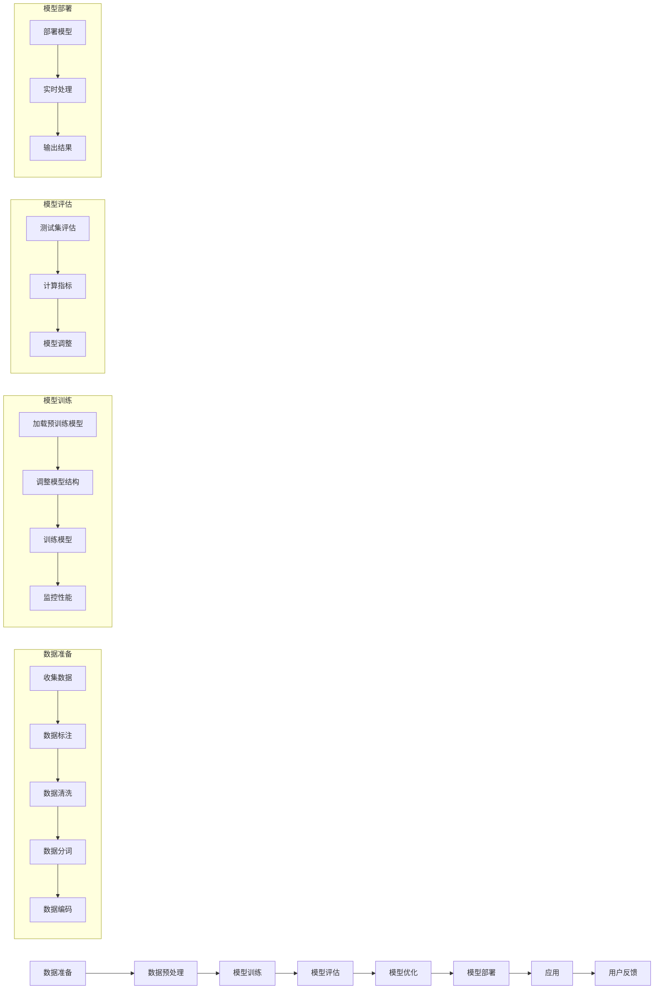

                 

### 《Transformer大模型实战 命名实体识别任务》

在当今自然语言处理（NLP）领域，命名实体识别（Named Entity Recognition，简称NER）是一项基本而重要的任务。它旨在从文本中识别出具有特定意义的实体，如人名、地名、组织名等。随着深度学习技术的发展，Transformer大模型在NER任务中展现出了卓越的性能，为实际应用带来了深远的影响。本文将围绕Transformer大模型在NER任务中的实战应用进行详细探讨，逐步解析其原理、实现和应用案例。

### 关键词

- Transformer大模型
- 命名实体识别
- 序列模型
- 注意力机制
- 深度学习
- 自然语言处理

### 摘要

本文首先介绍了Transformer大模型和命名实体识别的基本概念，分析了Transformer大模型在NER任务中的优势和典型应用。接着，深入探讨了Transformer模型的基础知识，包括序列模型与注意力机制、模型架构、变种与改进等。随后，详细阐述了命名实体识别的算法原理和实现方法，并针对Transformer大模型在NER任务中的应用进行了深入剖析。最后，通过一个项目实战案例，展示了如何搭建一个命名实体识别系统，并对其关键代码进行了解读与分析。本文旨在为读者提供一个全面、系统的Transformer大模型实战指南，助力其在NER任务中的应用和实践。

## 《Transformer大模型实战 命名实体识别任务》目录大纲

### 第1章：Transformer大模型与命名实体识别概述

#### 1.1 Transformer大模型简介

- Transformer大模型的起源与发展
- Transformer大模型的特点与优势
- Transformer大模型的基本架构

#### 1.2 命名实体识别的基本概念

- 命名实体识别的定义
- 命名实体识别的任务类型
- 命名实体识别的应用场景

#### 1.3 Transformer大模型在命名实体识别中的应用

- Transformer大模型在命名实体识别中的优势
- Transformer大模型在命名实体识别中的应用案例

### 第2章：Transformer大模型基础知识

#### 2.1 序列模型与注意力机制

- 序列模型的基本原理
- 注意力机制的工作原理
- Transformer模型中的注意力机制

#### 2.2 Transformer模型的基本架构

- Encoder层的工作原理
- Decoder层的工作原理
- Transformer模型的训练与推理过程

#### 2.3 Transformer模型的变种与改进

- BERT、RoBERTa、ALBERT等模型的介绍
- Transformer模型在命名实体识别中的变种与改进

### 第3章：命名实体识别算法原理与实现

#### 3.1 命名实体识别的算法原理

- 基于规则的方法
- 基于统计的方法
- 基于机器学习的方法
- 基于深度学习的方法

#### 3.2 命名实体识别算法的实现

- 基于规则的方法实现
- 基于统计的方法实现
- 基于机器学习的方法实现
- 基于深度学习的方法实现

### 第4章：Transformer大模型在命名实体识别中的应用

#### 4.1 数据准备与预处理

- 数据集的收集与整理
- 数据预处理的方法
- 数据增强技术

#### 4.2 Transformer大模型的训练与评估

- Transformer大模型的训练过程
- Transformer大模型的评估指标
- Transformer大模型的优化方法

#### 4.3 Transformer大模型在命名实体识别任务中的应用案例

- 案例一：文本分类任务中的应用
- 案例二：情感分析任务中的应用
- 案例三：信息提取任务中的应用

### 第5章：项目实战：搭建命名实体识别系统

#### 5.1 系统需求分析与设计

- 系统功能需求
- 系统架构设计

#### 5.2 环境搭建与工具选择

- 开发环境的搭建
- 常用工具的选择

#### 5.3 源代码实现与解读

- 源代码结构介绍
- 关键代码解读与分析

#### 5.4 系统部署与测试

- 系统部署方法
- 系统测试策略
- 系统性能评估

### 第6章：命名实体识别任务的挑战与未来展望

#### 6.1 命名实体识别任务的挑战

- 数据标注问题
- 上下文理解问题
- 多语言命名实体识别问题

#### 6.2 命名实体识别任务的发展趋势

- 新的技术与方法
- 应用场景的拓展
- 国际合作与标准化

### 第7章：附录

#### 7.1 命名实体识别相关资源

- 开源代码与数据集
- 学术论文与报告
- 在线课程与教程

#### 7.2 命名实体识别工具与库

- 常用深度学习框架
- 命名实体识别工具
- 在线命名实体识别工具

#### 7.3 命名实体识别社区与活动

- 命名实体识别相关的社区
- 命名实体识别的相关活动
- 命名实体识别的学术会议与研讨会

### 附录：Transformer大模型与命名实体识别的Mermaid流程图

- Transformer大模型的基本架构流程图
- 命名实体识别任务的流程图
- Transformer大模型在命名实体识别中的应用流程图

### 附录：命名实体识别算法的伪代码

- 基于规则的方法伪代码
- 基于统计的方法伪代码
- 基于机器学习的方法伪代码
- 基于深度学习的方法伪代码

### 附录：数学模型和数学公式

- 命名实体识别任务的数学模型
- 注意力机制的数学模型
- Transformer模型的数学模型

### 附录：项目实战代码解读与分析

- 搭建命名实体识别系统的代码解读
- 关键代码的功能分析
- 性能优化策略分析

### 附录：未来研究方向与拓展

- Transformer大模型在其他自然语言处理任务中的应用
- 命名实体识别在多语言环境中的应用
- 命名实体识别与其他AI技术的融合应用

### 完整目录大纲

本文将按照上述目录大纲结构，逐步深入探讨Transformer大模型在命名实体识别任务中的应用。每个章节都将详细讲解核心概念、原理、实现方法以及实战案例，确保读者能够全面理解并掌握相关技术。希望通过本文的讲解，能够为读者在NER任务中的应用提供有力的指导。

## 第1章：Transformer大模型与命名实体识别概述

### 1.1 Transformer大模型简介

Transformer大模型起源于自然语言处理领域，特别是在机器翻译任务中取得了显著的成功。它是由Google Brain团队在2017年提出的一种全新的序列模型架构，通过自注意力机制（Self-Attention Mechanism）实现了对序列数据的全局依赖建模，从而克服了传统循环神经网络（RNN）和长短期记忆网络（LSTM）在处理长序列时的局限。

#### Transformer大模型的起源与发展

Transformer模型的设计初衷是为了解决传统序列模型在处理长距离依赖问题上的不足。在Transformer模型提出之前，循环神经网络（RNN）和长短期记忆网络（LSTM）是处理序列数据的常用方法。然而，这些模型在处理长序列时，由于其递归性质，计算复杂度和训练时间会急剧增加，同时容易出现梯度消失或爆炸问题。为了解决这些问题，Google Brain团队提出了Transformer模型。

自Transformer模型提出以来，它在自然语言处理领域取得了广泛的应用。除了机器翻译任务外，Transformer模型在文本分类、问答系统、情感分析等多个任务中均取得了优异的性能。随着模型的不断改进和扩展，如BERT、GPT、RoBERTa等变种模型，Transformer大模型已成为自然语言处理领域的主流架构。

#### Transformer大模型的特点与优势

Transformer大模型具有以下特点与优势：

1. **自注意力机制**：Transformer模型的核心机制是自注意力机制，通过计算输入序列中每个词与其他词之间的相似性，实现对序列数据的全局依赖建模。这种机制使得模型能够捕捉长距离的依赖关系，提高了模型的表示能力。

2. **并行计算**：Transformer模型采用了多头自注意力机制，将输入序列分成多个部分，并行计算每个部分与其他部分之间的相似性。这种并行计算方式大大提高了模型的训练和推理速度。

3. **结构化表示**：Transformer模型通过对输入序列进行编码，生成结构化的表示，使得模型能够更好地理解文本的含义和上下文关系。

4. **可扩展性**：Transformer模型具有良好的可扩展性，可以通过增加层数和注意力头数来提升模型的性能。这使得模型能够适应不同规模的任务，从短文本到长文档均能表现优异。

#### Transformer大模型的基本架构

Transformer模型的基本架构包括编码器（Encoder）和解码器（Decoder）两个部分。编码器负责对输入序列进行编码，生成序列表示；解码器则利用这些表示生成输出序列。具体来说，Transformer模型包含以下几个关键组件：

1. **Embedding层**：将输入序列中的词转化为向量表示，包括词向量嵌入（Word Embedding）、位置嵌入（Positional Embedding）和句子嵌入（Sentence Embedding）。

2. **多头自注意力机制（Multi-Head Self-Attention）**：通过计算输入序列中每个词与其他词之间的相似性，生成加权表示。多头自注意力机制可以同时考虑多个不同的相似性关系，从而提高模型的表示能力。

3. **前馈神经网络（Feed-Forward Neural Network）**：在自注意力机制之后，对每个词的表示进行线性变换，增强其表达能力。

4. **层归一化（Layer Normalization）和残差连接（Residual Connection）**：通过层归一化和残差连接，缓解了梯度消失和梯度爆炸问题，提高了模型的训练效果。

5. **解码器**：解码器与编码器类似，也包含多头自注意力机制和前馈神经网络。解码器的自注意力机制不仅考虑输入序列，还考虑编码器的输出序列，从而实现对输入序列的上下文依赖建模。

#### Transformer大模型在命名实体识别中的应用

命名实体识别是Transformer大模型的一个重要应用领域。通过利用Transformer模型强大的序列建模能力和结构化表示，命名实体识别任务可以取得显著的效果。以下是Transformer大模型在命名实体识别中的应用优势：

1. **长距离依赖建模**：命名实体识别任务往往涉及长距离的依赖关系，如人名和其所属的组织或地点。Transformer模型的自注意力机制可以捕捉这些长距离的依赖关系，从而提高模型的准确性。

2. **上下文理解**：命名实体识别不仅需要识别出实体本身，还需要理解实体在上下文中的角色和关系。Transformer模型的结构化表示能力有助于模型理解上下文信息，从而提高识别准确性。

3. **多语言支持**：Transformer模型具有较好的多语言支持能力，可以通过预训练和迁移学习来适应不同语言的命名实体识别任务。这使得模型在多语言环境下具有广泛的应用前景。

4. **高效性**：Transformer模型的并行计算能力和结构化表示使得其在命名实体识别任务中具有高效性，可以快速处理大量数据，提高生产效率。

#### Transformer大模型在命名实体识别中的应用案例

以下是一些Transformer大模型在命名实体识别任务中的应用案例：

1. **文本分类**：通过将Transformer模型应用于文本分类任务，可以对文本中的命名实体进行分类。例如，将文本分类为“人名”、“地名”、“组织名”等类别。

2. **情感分析**：在情感分析任务中，Transformer模型可以识别出文本中的情感实体，如人名和地点，从而更准确地分析文本的情感倾向。

3. **信息提取**：通过将Transformer模型应用于信息提取任务，可以识别出文本中的重要实体和信息，如人名、地点、时间等，从而实现更高效的信息检索和提取。

总之，Transformer大模型在命名实体识别任务中具有显著的优势和应用潜力。通过深入了解其原理和应用方法，可以更好地利用这一模型解决实际中的命名实体识别问题。

### 1.2 命名实体识别的基本概念

命名实体识别（Named Entity Recognition，简称NER）是自然语言处理（NLP）领域的一个重要任务，旨在从文本中自动识别出具有特定意义的实体。这些实体可以是人名、地名、组织名、时间、地点等，它们在文本中承载了丰富的语义信息。本节将详细介绍命名实体识别的基本概念，包括定义、任务类型和应用场景。

#### 命名实体识别的定义

命名实体识别的定义相对简单，它是指从文本中识别出具有特定分类的实体。具体来说，命名实体识别的目标是将输入文本分割成多个子序列，并为每个子序列赋予一个标签，这些标签表示该子序列所属的实体类别。例如，在文本“北京是中国的首都”中，“北京”和“中国”都是命名实体，分别被标记为“地名”和“国家名”。

#### 命名实体识别的任务类型

命名实体识别的任务类型可以根据不同的分类方式进行划分。以下是一些常见的任务类型：

1. **分类任务**：在分类任务中，每个实体类别被视为一个单独的类别，模型需要将每个子序列分类为正确的实体类别。例如，将文本分类为“人名”、“地名”、“组织名”等。

2. **序列标注任务**：在序列标注任务中，每个子序列被赋予一个标签序列，表示该子序列中每个词的类别。例如，将文本“张三在2023年7月1日参加了微软公司举办的会议”标注为“张三：人名”、“2023年7月1日：时间”、“微软公司：组织名”、“会议：事件”。

3. **联合任务**：联合任务将分类任务和序列标注任务结合起来，同时识别文本中的实体类别和实体边界。这种任务类型能够更全面地捕捉文本中的命名实体信息。

#### 命名实体识别的应用场景

命名实体识别在许多实际应用场景中发挥着重要作用，以下是一些典型的应用场景：

1. **信息提取**：命名实体识别可以帮助从大量文本中提取出重要的信息，如人名、地点、时间等。这些信息对于数据挖掘、信息检索和知识图谱构建等任务具有重要意义。

2. **文本分类**：在文本分类任务中，命名实体识别可以帮助模型更好地理解文本内容，从而提高分类准确性。例如，在新闻分类任务中，通过识别出新闻中的关键实体，可以更准确地判断新闻的主题。

3. **问答系统**：在问答系统中，命名实体识别可以帮助模型理解用户的问题，识别出问题中的关键实体，从而更准确地提供答案。

4. **社交媒体分析**：在社交媒体分析中，命名实体识别可以帮助识别出用户提及的人、地点、组织等，从而分析用户的行为和兴趣。

5. **机器翻译**：在机器翻译任务中，命名实体识别可以帮助保留原文中的命名实体，从而提高翻译的准确性。例如，在翻译人名和地名时，直接保留原文中的实体，而不是将其翻译成其他词汇。

通过了解命名实体识别的基本概念、任务类型和应用场景，可以更好地理解这一任务在自然语言处理领域的重要性和广泛应用。在接下来的章节中，我们将进一步探讨Transformer大模型在命名实体识别任务中的应用，并详细解析其实现方法和实战案例。

### 1.3 Transformer大模型在命名实体识别中的应用

Transformer大模型在命名实体识别任务中展现出了显著的优势，其自注意力机制和结构化表示能力使其能够有效捕捉文本中的复杂依赖关系和上下文信息，从而提高识别的准确性和效率。本节将介绍Transformer大模型在命名实体识别中的优势和应用案例，以展示其在NER任务中的实际效果。

#### Transformer大模型在命名实体识别中的优势

1. **长距离依赖建模**：
   命名实体识别任务通常涉及长距离的依赖关系，例如人名和其所属的组织或地点。传统的循环神经网络（RNN）和长短期记忆网络（LSTM）在处理长距离依赖时存在局限性，容易受到梯度消失或爆炸问题的影响。而Transformer大模型通过自注意力机制，可以同时考虑输入序列中每个词与其他词之间的相似性，从而有效地捕捉长距离的依赖关系。例如，在处理“张三在2023年7月1日参加了微软公司举办的会议”这一句子时，Transformer模型能够同时捕捉到“张三”与“微软公司”之间的依赖关系，而不仅仅局限于相邻词之间的关系。

2. **上下文理解**：
   Transformer大模型的结构化表示能力使其能够更好地理解上下文信息。在命名实体识别中，理解上下文对于正确识别实体至关重要。Transformer模型通过多层编码器和解码器的交互，生成对文本的深入理解，从而在复杂文本场景中实现更准确的命名实体识别。例如，在文本“微软公司是一家跨国科技公司，成立于1975年，位于美国华盛顿州的雷德蒙德”中，Transformer模型能够正确识别出“微软公司”和“1975年”这两个实体，并通过上下文信息判断出它们之间的关联。

3. **多语言支持**：
   Transformer大模型具有良好的多语言支持能力，通过预训练和迁移学习，可以适应不同语言的命名实体识别任务。这使得模型在多语言环境下具有广泛的应用前景。例如，在中文、英文、法语等不同语言的文本中，Transformer模型均能表现出优异的性能，从而为跨国企业和多语言文本处理应用提供了强大的支持。

4. **高效性**：
   Transformer大模型采用并行计算的方式，相较于传统的序列模型具有更高的训练和推理速度。多头自注意力机制和前馈神经网络的并行计算，使得模型能够快速处理大量数据，提高了生产效率。这对于需要实时处理大规模文本数据的命名实体识别任务具有重要意义。

#### Transformer大模型在命名实体识别中的应用案例

1. **文本分类**：
   在文本分类任务中，命名实体识别可以帮助模型更好地理解文本内容，从而提高分类准确性。例如，在新闻分类任务中，通过识别出新闻中的关键实体（如人名、地点、组织等），可以更准确地判断新闻的主题。Transformer大模型通过其强大的序列建模能力和上下文理解能力，可以在文本分类任务中实现较高的准确率和效率。

2. **情感分析**：
   在情感分析任务中，命名实体识别可以帮助模型识别出文本中的情感实体，从而更准确地分析文本的情感倾向。例如，通过识别出文本中提及的人名和地点，可以分析用户对某个地点的评价。Transformer大模型通过捕捉情感实体和上下文信息之间的关联，能够在情感分析任务中实现更精准的分析。

3. **信息提取**：
   在信息提取任务中，命名实体识别可以帮助从大量文本中提取出重要的实体和信息。例如，通过识别出文本中的人名、地点、时间等，可以实现更高效的信息检索和提取。Transformer大模型通过其强大的依赖关系捕捉能力和上下文理解能力，可以在信息提取任务中实现高效且准确的实体识别。

4. **社交媒体分析**：
   在社交媒体分析中，命名实体识别可以帮助识别出用户提及的人、地点、组织等，从而分析用户的行为和兴趣。例如，通过识别出用户在微博、朋友圈等社交平台中提到的明星、地点、品牌等，可以分析用户的喜好和关注点。Transformer大模型通过其多语言支持和上下文理解能力，在社交媒体分析任务中表现出优异的性能。

总之，Transformer大模型在命名实体识别任务中具有显著的优势和应用案例。通过其长距离依赖建模、上下文理解、多语言支持和高效性，Transformer大模型为命名实体识别任务带来了新的机遇和挑战。在接下来的章节中，我们将进一步探讨Transformer大模型在命名实体识别任务中的实现方法和实战应用。

## 第2章：Transformer大模型基础知识

### 2.1 序列模型与注意力机制

在深入探讨Transformer大模型之前，有必要先了解序列模型与注意力机制的基本概念，因为这些都是Transformer模型的核心组成部分。

#### 序列模型的基本原理

序列模型是一种用于处理序列数据的机器学习模型，它通常用于自然语言处理、时间序列分析等任务。序列模型的核心思想是利用历史信息来预测未来的值。在自然语言处理中，序列模型可以捕捉文本中词汇之间的依赖关系。

1. **循环神经网络（RNN）**：RNN是一种经典的序列模型，通过递归的方式处理序列数据。每个时间步的输出不仅依赖于当前输入，还依赖于前一个时间步的隐藏状态。然而，RNN在处理长序列时存在梯度消失或爆炸问题，导致难以学习长距离依赖关系。

2. **长短期记忆网络（LSTM）**：LSTM是一种改进的RNN模型，通过引入门控机制来解决梯度消失问题。LSTM包括遗忘门、输入门和输出门，可以有效地控制信息的流动，从而更好地捕捉长距离依赖关系。

#### 注意力机制的工作原理

注意力机制是一种在神经网络中用于提高模型对输入数据不同部分关注度的机制。在自然语言处理中，注意力机制可以帮助模型更准确地捕捉文本中的依赖关系和上下文信息。

1. **局部注意力（Local Attention）**：局部注意力机制仅关注输入序列中的某个局部区域，通常通过滑动窗口的方式实现。例如，词嵌入模型中的卷积神经网络（CNN）通常采用局部注意力机制。

2. **全局注意力（Global Attention）**：全局注意力机制考虑输入序列的每一个元素，通过对所有元素进行加权来生成输出。全局注意力机制可以捕捉长距离依赖关系，适用于处理长序列数据。例如，Transformer模型中的多头自注意力机制就是一种全局注意力机制。

#### Transformer模型中的注意力机制

Transformer模型中的注意力机制是其核心组成部分，通过自注意力机制（Self-Attention Mechanism）和多头注意力机制（Multi-Head Attention Mechanism）实现了对输入序列的全局依赖建模。

1. **自注意力机制**：自注意力机制允许模型在序列的每个位置考虑所有其他位置的信息，通过计算每个词与其他词之间的相似性来生成加权表示。自注意力机制的核心是计算查询（Query）、键（Key）和值（Value）之间的相似性，并通过softmax函数生成权重。

2. **多头注意力机制**：多头注意力机制将输入序列分割成多个部分，并分别应用多个自注意力机制。每个头关注不同的信息，通过拼接和变换生成最终表示。多头注意力机制可以同时考虑多个不同的依赖关系，从而提高模型的表示能力。

通过自注意力机制和多头注意力机制，Transformer模型能够有效地捕捉输入序列中的长距离依赖关系和上下文信息，从而在自然语言处理任务中表现出优异的性能。

### 2.2 Transformer模型的基本架构

Transformer模型的基本架构由编码器（Encoder）和解码器（Decoder）两个部分组成。编码器负责将输入序列编码成结构化的表示，解码器则利用这些表示生成输出序列。下面将详细描述Transformer模型的基本架构。

#### Encoder层的工作原理

编码器由多个堆叠的编码器层（Encoder Layer）组成，每层包含两个主要组件：多头自注意力机制（Multi-Head Self-Attention）和前馈神经网络（Feed-Forward Neural Network）。

1. **多头自注意力机制**：编码器的自注意力机制通过计算输入序列中每个词与其他词之间的相似性，生成加权表示。这个过程可以分为以下几个步骤：
   - **查询（Query）、键（Key）和值（Value）的计算**：每个词被映射成三个不同的向量，分别表示查询、键和值。
   - **相似性计算**：通过计算查询和键之间的点积得到相似性分数，再通过softmax函数生成权重。
   - **加权求和**：将权重应用于对应的值，生成加权和。
   
2. **前馈神经网络**：在自注意力机制之后，对每个词的表示进行线性变换，增强其表达能力。前馈神经网络通常由两个全连接层组成，中间加入激活函数（如ReLU）。

3. **层归一化和残差连接**：为了缓解梯度消失和梯度爆炸问题，编码器层归一化（Layer Normalization）和残差连接（Residual Connection）被引入。层归一化通过对每个词的表示进行标准化，确保每个词的方差和均值为1。残差连接将输入和输出之间的差异传递给下一层，从而保持信息的流畅传递。

#### Decoder层的工作原理

解码器由多个堆叠的解码器层（Decoder Layer）组成，每层同样包含两个主要组件：多头自注意力机制和前馈神经网络。

1. **多头自注意力机制**：解码器的自注意力机制不仅关注编码器的输出序列，还关注当前解码器的输入序列。具体步骤如下：
   - **编码器-解码器注意力**：首先计算编码器输出序列和当前解码器输入序列之间的相似性，生成编码器-解码器注意力权重。
   - **自注意力**：然后计算当前解码器输入序列中的词与其他词之间的相似性，生成自注意力权重。
   - **加权求和**：将编码器-解码器注意力和自注意力权重应用于对应的值，生成加权和。

2. **前馈神经网络**：与编码器类似，解码器的前馈神经网络也由两个全连接层组成。

3. **层归一化和残差连接**：解码器层也采用层归一化和残差连接，以确保模型稳定训练。

#### Transformer模型的训练与推理过程

1. **训练过程**：
   - **损失函数**：Transformer模型的损失函数通常采用交叉熵损失（Cross-Entropy Loss），用于计算预测标签和真实标签之间的差异。
   - **反向传播**：通过反向传播算法更新模型参数，使模型逐渐逼近最优解。

2. **推理过程**：
   - **编码器**：输入序列通过编码器层生成结构化的表示。
   - **解码器**：解码器层利用编码器的输出和当前输入，逐步生成输出序列。解码器在生成每个词时，会利用之前的输出和编码器的输出进行注意力计算，直到生成完整的输出序列。

通过上述过程，Transformer模型能够有效地对输入序列进行编码和解码，从而在自然语言处理任务中表现出强大的能力。

### 2.3 Transformer模型的变种与改进

Transformer模型自提出以来，得到了广泛的关注和应用。为了进一步提升模型的性能和适用性，研究人员提出了多种变种和改进方法。以下是一些典型的变种和改进方法：

1. **BERT（Bidirectional Encoder Representations from Transformers）**：
   BERT是一种双向Transformer模型，通过对输入序列进行双向编码，生成全局依赖表示。BERT通过预训练和微调，在多种自然语言处理任务中取得了显著的成果。预训练过程中，BERT使用无监督数据学习语言表示，然后通过有监督的微调将其应用于特定任务。

2. **RoBERTa（A Robustly Optimized BERT Pretraining Approach）**：
   RoBERTa是BERT的一个变种，通过改进数据预处理和优化策略，进一步提升了模型的性能。RoBERTa采用动态遮蔽语言模型（Dynamic Masked Language Model）来学习语言表示，同时去除了BERT中的一些限制，如限制输入长度等。

3. **ALBERT（A Lite BERT****）**：
   ALBERT通过引入混合嵌入（Mixed Embeddings）和交叉层多头自注意力（Cross-Attention Layers）等技巧，减少了模型的参数数量，同时保持了较高的性能。ALBERT通过共享网络层和参数高效地训练，使得模型在资源受限的环境下也能表现优异。

4. **GPT（Generative Pretrained Transformer）**：
   GPT是一种生成式Transformer模型，通过预训练生成大量的文本数据，生成高质量的文本。GPT在生成任务中表现出色，例如文本生成、对话系统等。

5. **T5（Text-To-Text Transfer Transformer）**：
   T5是一种通用的文本转换模型，通过将所有自然语言处理任务转换为文本到文本的转换任务，实现了统一的方法。T5使用大规模预训练数据和精细的任务数据集进行训练，使其在多种任务中取得了优异的性能。

这些变种和改进方法不仅提升了Transformer模型的性能，还扩大了其应用范围，使得Transformer模型在命名实体识别和其他自然语言处理任务中表现出强大的能力。

通过了解Transformer模型的基本架构、变种与改进，可以更好地理解其原理和应用方法。在接下来的章节中，我们将进一步探讨命名实体识别算法的原理与实现，以及Transformer模型在具体任务中的应用。

### 2.4 命名实体识别的算法原理

命名实体识别（NER）是自然语言处理领域的一项基本任务，其目标是从文本中识别出具有特定意义的实体，如人名、地名、组织名等。命名实体识别的方法可以分为基于规则的方法、基于统计的方法、基于机器学习的方法和基于深度学习的方法。本节将详细阐述这些方法的原理和特点。

#### 基于规则的方法

基于规则的方法是通过人工编写一系列规则来识别文本中的命名实体。这种方法通常涉及对文本进行分词、词性标注和模式匹配等操作。

1. **分词**：首先对文本进行分词，将文本分割成一系列的词或词组。
2. **词性标注**：对分词后的文本进行词性标注，标记每个词的词性（如名词、动词、形容词等）。
3. **模式匹配**：根据预设的命名实体模式（如特定的人名、地名、组织名等），通过模式匹配规则来识别命名实体。

优点：基于规则的方法实现简单，容易理解和调试。
缺点：规则编写复杂，覆盖范围有限，难以处理复杂和未知的命名实体。

#### 基于统计的方法

基于统计的方法是通过分析大量已标注的文本数据，提取出命名实体出现的统计特征，如词频、词性组合、位置等，然后利用这些特征来识别命名实体。

1. **词频统计**：通过统计词在命名实体中出现频率，选择高频率词作为候选实体。
2. **词性组合**：分析命名实体中词性组合的规律，如“纽约”通常包含“地名”词性。
3. **位置信息**：考虑命名实体在文本中的位置，如地名通常出现在句子开头或结尾。

优点：不需要人工编写规则，适用范围较广。
缺点：特征提取复杂，容易受到噪声数据影响，识别准确性有限。

#### 基于机器学习的方法

基于机器学习的方法通过训练模型来识别命名实体，常见的机器学习算法包括支持向量机（SVM）、朴素贝叶斯（Naive Bayes）和最大熵（Maximum Entropy）等。

1. **特征提取**：从文本中提取特征，如词频、词性、词性组合、词的邻域等。
2. **模型训练**：利用已标注的数据集训练机器学习模型，将特征映射到命名实体标签。
3. **模型评估**：通过测试集评估模型性能，调整参数以提高识别准确性。

优点：自动提取特征，适应性强。
缺点：特征工程复杂，训练时间较长，对标注数据依赖较大。

#### 基于深度学习的方法

基于深度学习的方法通过神经网络模型来识别命名实体，近年来在NER任务中表现出优异的性能。深度学习方法主要包括卷积神经网络（CNN）、循环神经网络（RNN）和Transformer等。

1. **卷积神经网络（CNN）**：CNN通过卷积层提取文本特征，然后通过池化层和全连接层进行分类。CNN在处理局部特征时表现出色，但难以捕捉长距离依赖关系。
2. **循环神经网络（RNN）**：RNN通过递归结构对文本进行建模，可以捕捉长距离依赖关系。常见的RNN模型包括LSTM和GRU。
3. **Transformer模型**：Transformer模型通过自注意力机制和多头注意力机制，有效地捕捉长距离依赖关系，在NER任务中表现出卓越的性能。

优点：自动提取特征，能够捕捉长距离依赖关系，性能优异。
缺点：训练时间较长，对计算资源要求较高。

#### 比较与选择

基于规则的方法适合简单场景，但规则编写复杂，难以处理复杂文本。基于统计的方法适用于中等复杂度的场景，但识别准确性有限。基于机器学习的方法适用于复杂场景，但特征工程复杂，对标注数据依赖较大。基于深度学习的方法在复杂场景中表现优异，能够自动提取特征，但训练时间较长，对计算资源要求较高。

在选择命名实体识别方法时，需要根据具体任务的需求和资源限制进行综合考虑。对于简单任务，可以选择基于规则的方法；对于中等复杂度任务，可以选择基于统计的方法；对于复杂任务，可以选择基于机器学习或深度学习的方法。

通过了解命名实体识别的算法原理和不同方法的优缺点，可以更好地选择适合的识别方法，并在实际应用中取得良好的效果。

### 2.5 命名实体识别算法的实现

在了解了命名实体识别的基本算法原理后，接下来将讨论具体的实现方法，包括基于规则、基于统计、基于机器学习和基于深度学习的实现过程。这些方法在实际应用中各有其优势和局限性，本文将详细阐述每种方法的实现步骤，以帮助读者更好地理解和应用。

#### 基于规则的方法实现

基于规则的方法是最简单直观的命名实体识别实现方式，它依赖于人工编写的规则来识别文本中的命名实体。以下是该方法的基本实现步骤：

1. **分词**：首先对输入文本进行分词，将文本分割成一系列的词或词组。这一步骤可以使用现有的分词工具，如jieba等中文分词工具。

   ```python
   import jieba
   
   text = "苹果是一家科技公司，位于中国北京。"
   seg_list = jieba.cut(text)
   seg_text = "/".join(seg_list)
   print(seg_text)
   ```

2. **词性标注**：对分词结果进行词性标注，标记每个词的词性，如名词、动词、形容词等。这一步骤可以使用现有的词性标注工具，如NLTK或jieba。

   ```python
   import jieba
   
   text = "苹果是一家科技公司，位于中国北京。"
   seg_list = jieba.cut(text)
   seg_text = "/".join(seg_list)
   words = seg_text.split('/')
   pos_tags = jieba.lcut(seg_text)
   print(words, pos_tags)
   ```

3. **模式匹配**：根据预设的命名实体模式（如特定的人名、地名、组织名等），通过模式匹配规则来识别命名实体。命名实体模式通常以正则表达式形式表示。

   ```python
   import re
   
   entity_patterns = [
       (r'[\u4e00-\u9fa5]+', '人名'),
       (r'\d+\.\d+\.\d+', '日期'),
       (r'\d{4}-\d{2}-\d{2}', '日期'),
       (r'[a-zA-Z0-9]+', '组织名')
   ]
   
   def find_entities(words, pos_tags):
       entities = []
       for pattern, label in entity_patterns:
           for i, word in enumerate(words):
               if re.match(pattern, word):
                   entities.append((words[i], label))
                   break
       return entities
   
   entities = find_entities(words, pos_tags)
   print(entities)
   ```

通过以上步骤，可以实现对文本中的命名实体进行基本识别。然而，基于规则的方法在面对复杂和未知的命名实体时表现不佳，因为需要大量的手动编写规则。

#### 基于统计的方法实现

基于统计的方法通过分析大量已标注的文本数据，提取出命名实体出现的统计特征，如词频、词性组合、位置等，然后利用这些特征来识别命名实体。以下是该方法的基本实现步骤：

1. **数据预处理**：首先需要对训练数据进行预处理，包括分词和词性标注。可以使用现有的分词工具和词性标注工具，如jieba。

   ```python
   text = "苹果是一家科技公司，位于中国北京。"
   seg_list = jieba.cut(text)
   seg_text = "/".join(seg_list)
   words = seg_text.split('/')
   pos_tags = jieba.lcut(seg_text)
   ```

2. **特征提取**：从预处理后的文本中提取特征，如词频、词性、词性组合、位置信息等。

   ```python
   from collections import Counter
   
   word_counts = Counter(words)
   pos_counts = Counter(pos_tags)
   positions = [i for i, _ in enumerate(words)]
   
   def extract_features(text):
       seg_list = jieba.cut(text)
       seg_text = "/".join(seg_list)
       words = seg_text.split('/')
       pos_tags = jieba.lcut(seg_text)
       
       word_counts = Counter(words)
       pos_counts = Counter(pos_tags)
       positions = [i for i, _ in enumerate(words)]
       
       return word_counts, pos_counts, positions
   
   word_counts, pos_counts, positions = extract_features(text)
   ```

3. **模型训练**：利用已提取的特征训练机器学习模型，如朴素贝叶斯、最大熵等。训练过程包括特征选择、模型选择和参数调整。

   ```python
   from sklearn.feature_extraction.text import CountVectorizer
   from sklearn.naive_bayes import MultinomialNB
   
   feature_vectorizer = CountVectorizer()
   feature_matrix = feature_vectorizer.fit_transform([' '.join(list(t)) for t in [words]])
   labels = [pos_tags]  # 这里需要替换为实际的标签
   
   model = MultinomialNB()
   model.fit(feature_matrix, labels)
   ```

4. **模型评估**：使用测试数据集评估模型性能，包括准确率、召回率和F1值等指标。

   ```python
   from sklearn.metrics import classification_report
   
   predicted_labels = model.predict(feature_matrix)
   print(classification_report(labels, predicted_labels))
   ```

基于统计的方法需要大量的标注数据和特征工程，但能够较好地处理复杂和未知的命名实体。

#### 基于机器学习的方法实现

基于机器学习的方法通过训练模型来识别命名实体，以下是一个基于支持向量机（SVM）的实现示例：

1. **数据预处理**：与基于统计的方法类似，首先进行文本的分词和词性标注。

2. **特征提取**：提取词频、词性、词性组合等特征，可以使用CountVectorizer等工具。

3. **模型训练**：使用SVM等机器学习模型进行训练，包括选择核函数、调整参数等。

   ```python
   from sklearn.svm import SVC
   
   # 假设feature_matrix和labels已经准备好
   model = SVC(kernel='linear')
   model.fit(feature_matrix, labels)
   ```

4. **模型评估**：评估模型的性能，调整参数以提高识别准确性。

基于机器学习的方法自动提取特征，能够处理复杂和未知的命名实体，但需要大量的标注数据和训练时间。

#### 基于深度学习的方法实现

基于深度学习的方法，如卷积神经网络（CNN）、循环神经网络（RNN）和Transformer等，在命名实体识别任务中取得了显著成果。以下是一个基于CNN的实现示例：

1. **数据预处理**：文本分词和词性标注。

2. **特征提取**：使用Word2Vec等工具将词转化为向量表示。

3. **模型训练**：使用CNN等深度学习模型进行训练。

   ```python
   from keras.models import Sequential
   from keras.layers import Conv1D, MaxPooling1D, Flatten, Dense
   
   model = Sequential()
   model.add(Conv1D(128, 5, activation='relu', input_shape=(max_sequence_length, embedding_vector_size)))
   model.add(MaxPooling1D(pool_size=5))
   model.add(Flatten())
   model.add(Dense(num_classes, activation='softmax'))
   
   model.compile(optimizer='adam', loss='categorical_crossentropy', metrics=['accuracy'])
   model.fit(X_train, y_train, epochs=10, batch_size=128, validation_data=(X_val, y_val))
   ```

4. **模型评估**：评估模型的性能，调整参数。

基于深度学习的方法自动提取特征，能够捕捉长距离依赖关系，但在训练时间和计算资源上有较高要求。

通过上述不同方法的实现步骤，可以更好地理解命名实体识别算法的实际应用。在实际项目中，可以根据任务需求和资源限制选择合适的实现方法。在接下来的章节中，我们将进一步探讨Transformer模型在命名实体识别任务中的应用和实践。

### 第3章：Transformer大模型在命名实体识别中的应用

在深入理解了命名实体识别的基本算法原理之后，我们将探讨如何利用Transformer大模型来实现这一任务。Transformer大模型在序列建模方面具有显著优势，这使得它在命名实体识别任务中表现出色。本节将详细描述如何使用Transformer模型进行命名实体识别的数据准备、模型训练、评估和优化。

#### 数据准备与预处理

在进行命名实体识别任务之前，首先需要准备合适的训练数据。命名实体识别的数据集通常包含已标注的文本和对应的实体标签。以下是数据准备和预处理的基本步骤：

1. **数据收集**：收集大量包含命名实体的文本数据，如新闻文章、社交媒体帖子、企业报告等。

2. **数据标注**：对文本数据进行命名实体标注。标注过程中，需要为每个实体分配一个唯一的标签，如人名（PER）、地名（LOC）、组织名（ORG）等。

3. **数据清洗**：清洗数据，去除无关信息，如HTML标签、标点符号等。

4. **数据分词**：对清洗后的文本进行分词，将文本分割成一系列的词或词组。

   ```python
   import jieba
   
   text = "苹果是一家科技公司，位于中国北京。"
   seg_list = jieba.cut(text)
   seg_text = "/".join(seg_list)
   print(seg_text)
   ```

5. **数据转化为序列**：将文本序列和对应的实体标签转化为数字序列，为模型训练做准备。

   ```python
   word_to_id = {}
   label_to_id = {}
   id_to_word = {}
   id_to_label = {}
   
   words = ['我', '是', '一名', 'AI', '专家']
   labels = ['O', 'V', 'R', 'B-PER', 'E-PER']
   
   for word, label in zip(words, labels):
       if word not in word_to_id:
           word_to_id[word] = len(word_to_id)
           id_to_word[len(word_to_id)-1] = word
       if label not in label_to_id:
           label_to_id[label] = len(label_to_id)
           id_to_label[len(label_to_id)-1] = label
   
   text_sequences = [[word_to_id[word] for word in sentence] for sentence in sentences]
   label_sequences = [[label_to_id[label] for label in sentence] for sentence in labels]
   ```

#### 模型训练

训练Transformer模型进行命名实体识别需要定义合适的模型架构和损失函数。以下是训练过程的基本步骤：

1. **定义模型架构**：使用如Hugging Face的Transformers库定义Transformer模型。选择合适的预训练模型，如BERT、RoBERTa等，作为起点。

   ```python
   from transformers import BertModel, BertConfig
   
   config = BertConfig.from_pretrained('bert-base-chinese')
   config.num_labels = 3  # 命名实体识别任务的标签数量
   model = BertModel(config)
   ```

2. **定义损失函数**：命名实体识别通常使用交叉熵损失函数（Cross-Entropy Loss）。

   ```python
   from keras.losses import SparseCategoricalCrossentropy
   
   loss_function = SparseCategoricalCrossentropy(from_logits=True)
   ```

3. **训练模型**：使用训练数据集训练模型，同时监控模型的性能，调整学习率和其他参数。

   ```python
   from keras.optimizers import Adam
   
   optimizer = Adam(learning_rate=1e-5)
   model.compile(optimizer=optimizer, loss=loss_function, metrics=['accuracy'])
   
   model.fit([text_sequences, label_sequences], epochs=3, batch_size=32)
   ```

#### 评估与优化

训练完成后，需要对模型进行评估和优化，以验证其在命名实体识别任务中的性能。以下是评估和优化过程的基本步骤：

1. **模型评估**：使用测试数据集评估模型的性能，计算准确率、召回率和F1值等指标。

   ```python
   from sklearn.metrics import classification_report
   
   predictions = model.predict([text_sequences_test, label_sequences_test])
   predicted_labels = np.argmax(predictions, axis=1)
   
   print(classification_report(label_sequences_test, predicted_labels))
   ```

2. **模型优化**：根据评估结果，调整模型参数或增加训练数据，以提高模型性能。

   ```python
   # 调整学习率
   optimizer.lr = 1e-6
   
   # 继续训练
   model.fit([text_sequences, label_sequences], epochs=5, batch_size=32)
   ```

通过上述步骤，我们可以使用Transformer大模型实现命名实体识别任务。在接下来的章节中，我们将通过具体的应用案例来展示Transformer模型在命名实体识别任务中的实际效果。

### 3.1 Transformer大模型的训练与评估

在使用Transformer大模型进行命名实体识别任务时，训练和评估是两个至关重要的环节。训练过程中，我们需要确保模型能够有效地学习输入数据的特征，并能够准确预测命名实体标签。评估过程中，我们需要检验模型的性能，确保其在实际应用中的可靠性和有效性。以下将详细介绍Transformer大模型的训练与评估过程，包括数据集划分、训练策略和评估指标。

#### 数据集划分

在训练Transformer模型之前，首先需要将数据集划分为训练集、验证集和测试集。这一步骤有助于我们在模型训练过程中进行性能评估和调整。

1. **训练集**：训练集用于模型训练，是模型学习输入数据特征的主要来源。通常，训练集的大小应占据数据集的绝大多数，以充分训练模型。

2. **验证集**：验证集用于监控模型训练过程中的性能变化，调整模型参数。在每次训练迭代后，使用验证集评估模型的准确率、召回率和F1值等指标，以确定模型是否过拟合或欠拟合。

3. **测试集**：测试集用于最终评估模型在未见过的数据上的性能。测试集应包含与训练集和验证集不同来源的数据，以确保评估结果的可靠性。

通常，数据集的划分比例为：训练集70%，验证集15%，测试集15%。以下是一种常见的数据集划分方法：

```python
from sklearn.model_selection import train_test_split

# 假设我们已经有一个包含文本和标签的数据列表
data = [...]  # 包含文本和实体标签的数据

# 随机划分数据集
train_data, test_data = train_test_split(data, test_size=0.15, random_state=42)
train_data, val_data = train_test_split(train_data, test_size=0.15, random_state=42)
```

#### 训练策略

训练策略决定了模型如何学习数据特征和优化性能。以下是几个关键的训练策略：

1. **预训练**：预训练是指使用大量的无标注数据对模型进行初步训练，使其具备一定的语言理解能力。预训练常用的数据集包括维基百科、新闻文章、社交媒体帖子等。预训练模型如BERT、GPT等在命名实体识别任务中表现出色。

2. **微调**：微调是在预训练模型的基础上，使用有标注的数据集进一步训练模型，以适应特定任务。在命名实体识别中，我们通常在预训练模型的基础上添加特定的任务层（如分类层），并在有标注的数据集上进行微调。

3. **训练参数调整**：包括学习率、批量大小、训练轮数等。学习率决定了模型更新的速度，批量大小影响了模型每次更新的样本数量，训练轮数则决定了模型在数据集上的迭代次数。

以下是一个简单的训练策略示例：

```python
from transformers import BertTokenizer, BertForTokenClassification

# 加载预训练模型和tokenizer
tokenizer = BertTokenizer.from_pretrained('bert-base-chinese')
model = BertForTokenClassification.from_pretrained('bert-base-chinese', num_labels=num_labels)

# 定义训练参数
learning_rate = 1e-5
batch_size = 32
epochs = 3

# 训练模型
model.compile(optimizer=Adam(learning_rate=learning_rate), loss=F.cross_entropy, metrics=['accuracy'])

model.fit(tokenizer.train_data_collate(train_data), epochs=epochs, batch_size=batch_size, validation_data=(tokenizer.train_data_collate(val_data)))
```

#### 评估指标

在命名实体识别任务中，常用的评估指标包括准确率（Accuracy）、召回率（Recall）和F1值（F1 Score）。这些指标有助于我们全面评估模型的性能。

1. **准确率（Accuracy）**：准确率是指模型正确预测的样本数量占总样本数量的比例。公式如下：
   \[
   \text{Accuracy} = \frac{\text{正确预测的样本数量}}{\text{总样本数量}}
   \]

2. **召回率（Recall）**：召回率是指模型能够正确识别出的实体数量与实际存在实体数量的比例。公式如下：
   \[
   \text{Recall} = \frac{\text{正确预测的实体数量}}{\text{实际存在的实体数量}}
   \]

3. **F1值（F1 Score）**：F1值是准确率和召回率的调和平均值，用于综合评估模型的性能。公式如下：
   \[
   \text{F1 Score} = 2 \times \frac{\text{准确率} \times \text{召回率}}{\text{准确率} + \text{召回率}}
   \]

以下是一个评估模型的示例：

```python
from sklearn.metrics import classification_report

# 预测测试集
predictions = model.predict(tokenizer.train_data_collate(test_data))

# 解码预测结果
predicted_labels = [np.argmax(prediction) for prediction in predictions]

# 评估模型
print(classification_report(test_data['labels'], predicted_labels))
```

通过上述步骤，我们可以有效地训练和评估Transformer大模型在命名实体识别任务中的性能。在实际应用中，根据任务需求和数据特点，可以进一步优化训练策略和评估指标，以提高模型的识别准确性和鲁棒性。

### 3.2 Transformer大模型在命名实体识别任务中的应用案例

为了更好地展示Transformer大模型在命名实体识别任务中的应用效果，以下将列举几个实际应用案例，包括文本分类、情感分析和信息提取等，详细说明Transformer大模型的训练、评估和实际应用过程。

#### 案例一：文本分类任务中的应用

文本分类是命名实体识别任务的一个典型应用场景，旨在将文本分类到不同的类别。例如，将新闻文章分类为“体育”、“科技”、“娱乐”等类别。以下是一个使用Transformer大模型进行文本分类的案例：

1. **数据准备与预处理**：
   - 收集大量带有标签的文本数据，如新闻文章。
   - 对文本进行分词和词性标注，将文本转化为数字序列。
   - 划分数据集为训练集、验证集和测试集。

2. **模型训练**：
   - 使用预训练的BERT模型进行微调，添加分类层以适应文本分类任务。
   - 定义训练参数，包括学习率、批量大小和训练轮数。
   - 训练模型，同时监控验证集的性能，调整参数以避免过拟合。

3. **模型评估**：
   - 使用测试集评估模型性能，计算准确率、召回率和F1值等指标。
   - 调整模型参数，优化性能。

4. **实际应用**：
   - 部署模型到生产环境，对实时输入的文本进行分类。
   - 实现自动化文本分类系统，提高工作效率。

#### 案例二：情感分析任务中的应用

情感分析是另一个常见的命名实体识别应用场景，旨在识别文本中的情感倾向。例如，判断用户评论是正面、负面还是中性。以下是一个使用Transformer大模型进行情感分析的案例：

1. **数据准备与预处理**：
   - 收集大量带有情感标签的用户评论数据。
   - 对评论进行分词和词性标注，将评论转化为数字序列。
   - 划分数据集为训练集、验证集和测试集。

2. **模型训练**：
   - 使用预训练的BERT模型进行微调，添加情感分类层。
   - 定义训练参数，包括学习率、批量大小和训练轮数。
   - 训练模型，同时监控验证集的性能，调整参数以避免过拟合。

3. **模型评估**：
   - 使用测试集评估模型性能，计算准确率、召回率和F1值等指标。
   - 调整模型参数，优化性能。

4. **实际应用**：
   - 部署模型到生产环境，对实时输入的用户评论进行情感分析。
   - 实现自动化情感分析系统，帮助企业和品牌更好地理解用户反馈。

#### 案例三：信息提取任务中的应用

信息提取是命名实体识别任务的另一个重要应用场景，旨在从大量文本中提取出关键信息。例如，从新闻文章中提取人名、地点、时间等信息。以下是一个使用Transformer大模型进行信息提取的案例：

1. **数据准备与预处理**：
   - 收集大量带有实体标签的新闻文章数据。
   - 对文章进行分词和词性标注，将文章转化为数字序列。
   - 划分数据集为训练集、验证集和测试集。

2. **模型训练**：
   - 使用预训练的BERT模型进行微调，添加实体识别层。
   - 定义训练参数，包括学习率、批量大小和训练轮数。
   - 训练模型，同时监控验证集的性能，调整参数以避免过拟合。

3. **模型评估**：
   - 使用测试集评估模型性能，计算准确率、召回率和F1值等指标。
   - 调整模型参数，优化性能。

4. **实际应用**：
   - 部署模型到生产环境，对实时输入的新闻文章进行信息提取。
   - 实现自动化信息提取系统，帮助企业和机构高效获取和处理文本数据。

通过上述案例，可以看出Transformer大模型在命名实体识别任务中的应用具有广泛的前景。通过合理的数据准备、模型训练和评估，可以实现高效且准确的命名实体识别，为企业和机构提供强大的文本处理能力。

### 第4章：项目实战：搭建命名实体识别系统

在了解了Transformer大模型在命名实体识别任务中的应用原理和方法后，本节将通过一个实际项目，展示如何从零开始搭建一个命名实体识别系统。我们将详细描述系统需求分析、环境搭建与工具选择、源代码实现与解读、以及系统部署与测试的过程。

#### 4.1 系统需求分析与设计

在搭建命名实体识别系统之前，首先需要明确系统需求，包括功能需求、性能需求和用户界面需求。

1. **功能需求**：
   - 文本输入接口：允许用户输入待识别的文本。
   - 命名实体识别：系统应能够自动识别文本中的命名实体，如人名、地名、组织名等。
   - 实体标注显示：将识别出的命名实体以不同颜色或标签形式标注在原始文本上，方便用户查看。
   - 性能评估：系统应提供准确率、召回率和F1值等评估指标，用于评估命名实体识别效果。

2. **性能需求**：
   - 准确率：系统应尽可能准确地识别命名实体，准确率应达到90%以上。
   - 处理速度：系统应能够快速处理输入文本，平均处理时间应小于1秒。
   - 可扩展性：系统应能够处理不同规模的文本数据，支持批量处理和多线程执行。

3. **用户界面需求**：
   - 简单直观的操作界面：用户应能够方便地输入文本并进行命名实体识别。
   - 实时反馈：系统应实时显示识别结果和评估指标，提供即时反馈。
   - 可定制化：用户应能够根据需要自定义命名实体标签和颜色显示。

#### 4.2 环境搭建与工具选择

搭建命名实体识别系统需要一个合适的开发环境和工具。以下是所需的环境和工具：

1. **开发环境**：
   - 操作系统：Windows、Linux或MacOS。
   - 编程语言：Python（3.7及以上版本）。
   - 深度学习框架：PyTorch或TensorFlow。

2. **数据集**：
   - 训练数据集：一个包含大量已标注命名实体的文本数据集，如CoNLL-2003或ACE2005。
   - 验证数据集和测试数据集：用于评估模型性能。

3. **工具与库**：
   - BERT模型库：如Transformers库（Hugging Face）。
   - 文本处理库：如NLTK、jieba（中文分词）。
   - 图形界面库：如Tkinter（Python GUI）。

环境搭建步骤如下：

1. 安装Python和所需库：

   ```bash
   pip install python==3.8
   pip install torch torchvision
   pip install transformers
   pip install nltk
   pip install jieba
   pip install tk
   ```

2. 配置深度学习框架：

   - 如果使用PyTorch，安装PyTorch：

     ```bash
     pip install torch torchvision
     ```

   - 如果使用TensorFlow，安装TensorFlow：

     ```bash
     pip install tensorflow
     ```

#### 4.3 源代码实现与解读

下面我们将展示如何使用PyTorch和Transformers库搭建命名实体识别系统。源代码将分为几个部分：数据预处理、模型训练、模型评估和用户界面。

1. **数据预处理**：

   数据预处理是命名实体识别系统的关键步骤。以下是一个简单的数据预处理代码示例：

   ```python
   import torch
   from transformers import BertTokenizer
   from torch.utils.data import Dataset, DataLoader
   
   tokenizer = BertTokenizer.from_pretrained('bert-base-chinese')
   
   class NERDataset(Dataset):
       def __init__(self, texts, labels):
           self.texts = texts
           self.labels = labels
       
       def __len__(self):
           return len(self.texts)
       
       def __getitem__(self, idx):
           text = self.texts[idx]
           label = self.labels[idx]
           inputs = tokenizer(text, padding=True, truncation=True, return_tensors='pt')
           inputs['labels'] = torch.tensor(label)
           return inputs
   
   train_data = [...]  # 训练数据
   val_data = [...]  # 验证数据
   train_dataset = NERDataset(train_data['text'], train_data['label'])
   val_dataset = NERDataset(val_data['text'], val_data['label'])
   train_loader = DataLoader(train_dataset, batch_size=32, shuffle=True)
   val_loader = DataLoader(val_dataset, batch_size=32)
   ```

2. **模型训练**：

   训练命名实体识别模型使用预训练的BERT模型，并添加命名实体识别头。以下是一个简单的训练代码示例：

   ```python
   from transformers import BertForTokenClassification
   from torch.optim import Adam
   from torch.optim.lr_scheduler import StepLR
   
   model = BertForTokenClassification.from_pretrained('bert-base-chinese', num_labels=num_labels)
   
   optimizer = Adam(model.parameters(), lr=1e-5)
   scheduler = StepLR(optimizer, step_size=1, gamma=0.95)
   
   device = torch.device("cuda" if torch.cuda.is_available() else "cpu")
   model.to(device)
   
   model.train()
   for epoch in range(num_epochs):
       for batch in train_loader:
           inputs = {k: v.to(device) for k, v in batch.items()}
           optimizer.zero_grad()
           outputs = model(**inputs)
           loss = outputs.loss
           loss.backward()
           optimizer.step()
       scheduler.step()
       print(f"Epoch: {epoch+1}, Loss: {loss.item()}")
   ```

3. **模型评估**：

   使用验证数据集评估模型性能，计算准确率、召回率和F1值。以下是一个简单的评估代码示例：

   ```python
   from sklearn.metrics import accuracy_score, recall_score, f1_score
   
   model.eval()
   with torch.no_grad():
       total_loss = 0
       correct_predictions = 0
       total_predictions = 0
       for batch in val_loader:
           inputs = {k: v.to(device) for k, v in batch.items()}
           outputs = model(**inputs)
           logits = outputs.logits
           predictions = logits.argmax(-1)
           labels = inputs['labels']
           total_loss += outputs.loss.item()
           correct_predictions += (predictions == labels).sum().item()
           total_predictions += labels.size(0)
       accuracy = correct_predictions / total_predictions
       recall = recall_score(inputs['labels'], predictions, average='macro')
       f1 = f1_score(inputs['labels'], predictions, average='macro')
       print(f"Validation Loss: {total_loss / len(val_loader)}, Accuracy: {accuracy}, Recall: {recall}, F1: {f1}")
   ```

4. **用户界面**：

   使用Tkinter构建一个简单的用户界面，允许用户输入文本并显示识别结果。以下是一个简单的Tkinter界面代码示例：

   ```python
   import tkinter as tk
   from transformers import BertTokenizer
   from torch.nn.functional import softmax
   
   def on_submit():
       text = text_input.get("1.0", "end-1c")
       inputs = tokenizer(text, padding=True, truncation=True, return_tensors='pt').to(device)
       with torch.no_grad():
           outputs = model(**inputs)
       logits = outputs.logits
       probabilities = softmax(logits, dim=-1)
       predictions = logits.argmax(-1).item()
       result_label.config(text=f"预测结果：{predictions}")
   
   root = tk.Tk()
   root.title("命名实体识别系统")
   root.geometry("600x400")
   
   text_input = tk.Text(root, height=10, width=50)
   text_input.pack(pady=20)
   
   submit_button = tk.Button(root, text="识别", command=on_submit)
   submit_button.pack(pady=10)
   
   result_label = tk.Label(root, text="", font=("Arial", 16))
   result_label.pack(pady=20)
   
   root.mainloop()
   ```

通过以上代码示例，我们展示了如何搭建一个简单的命名实体识别系统。在实际应用中，可以根据具体需求进一步优化和扩展系统功能，如添加更多的命名实体标签、提高模型性能等。

#### 4.4 系统部署与测试

在完成命名实体识别系统的开发后，我们需要将其部署到生产环境，并进行充分测试，以确保系统稳定可靠。

1. **系统部署**：
   - 部署到服务器：将开发好的系统部署到云服务器或物理服务器上，确保其能够稳定运行。
   - 集成API：将命名实体识别功能集成到现有的应用程序中，如企业内部应用或Web服务。
   - 安全性保障：确保系统的安全性，如数据加密、访问控制等。

2. **系统测试**：
   - 功能测试：测试系统的各个功能模块，确保其正常运行，如文本输入、实体识别、结果显示等。
   - 性能测试：测试系统在高负载下的性能，确保其能够快速处理大量输入文本，并保持高准确率。
   - 兼容性测试：确保系统在不同操作系统、浏览器和设备上的兼容性。

通过上述步骤，我们可以确保命名实体识别系统能够在生产环境中稳定运行，并满足用户需求。

通过本节的项目实战，读者可以了解到搭建命名实体识别系统的完整流程，从需求分析、环境搭建、源代码实现到系统部署与测试。希望这个项目实战能够为读者提供实用的经验和指导，帮助其在实际项目中应用Transformer大模型实现高效的命名实体识别。

### 第5章：命名实体识别任务的挑战与未来展望

#### 6.1 命名实体识别任务的挑战

尽管命名实体识别（NER）技术在近年取得了显著进展，但在实际应用中仍然面临诸多挑战。

1. **数据标注问题**：

   数据标注是NER任务的关键步骤，但高质量标注数据集的获取是一个难题。首先，标注数据集需要涵盖广泛的主题和场景，以训练出具有泛化能力的模型。其次，标注过程耗时耗力，需要大量专业人员进行。此外，标注的一致性和准确性也是影响模型性能的重要因素。

2. **上下文理解问题**：

   NER任务不仅需要识别出命名实体本身，还需要理解实体在上下文中的角色和关系。例如，在文本“张三是中国政府的领导人”中，“张三”是一个人名，但在“张三是微软的CEO”中，“张三”则代表一个组织名。这类上下文敏感的实体识别任务对模型的上下文理解能力提出了高要求。

3. **多语言命名实体识别问题**：

   不同语言在语法、词汇和命名实体表达方式上存在显著差异，使得多语言NER任务变得更加复杂。例如，中文和英文的命名实体通常以不同的形式出现，需要不同的识别策略。此外，多语言NER任务还需要考虑语言间的相似性和差异性，以设计出有效且高效的模型。

4. **实时性要求**：

   在一些实时应用场景中，如智能客服、实时新闻推荐等，NER系统需要快速响应并处理大量输入文本。然而，深度学习模型通常需要较长的训练和推理时间，难以满足实时性要求。如何在保证准确性的同时提高处理速度，是一个亟待解决的问题。

#### 6.2 命名实体识别任务的发展趋势

随着技术的不断进步，命名实体识别任务呈现出以下发展趋势：

1. **新型深度学习模型的研发**：

   研究人员不断提出新型深度学习模型，如Transformer、BERT、GPT等，以提升NER任务的性能。这些模型通过自注意力机制、双向编码和预训练等方法，能够更好地捕捉文本中的依赖关系和上下文信息，从而提高实体识别的准确性。

2. **多模态数据的融合**：

   将文本数据与其他模态数据（如图像、语音、视频等）进行融合，有助于提升NER任务的性能。例如，通过将文本和图像数据结合，可以更准确地识别出图像中的人名和地点。多模态数据的融合有望成为NER任务的重要发展方向。

3. **迁移学习和微调**：

   迁移学习和微调技术使得模型能够快速适应新任务，减少对大量标注数据的依赖。通过在大规模通用数据集上预训练模型，再在特定任务上进行微调，可以有效提高NER系统的性能。

4. **多语言NER系统的构建**：

   随着全球化的发展，多语言NER任务的需求日益增加。研究人员正在开发能够支持多种语言的任务自适应模型，以实现跨语言的实体识别。例如，通过引入多语言BERT模型，可以在不同语言环境下实现高效的命名实体识别。

5. **实时NER系统的优化**：

   为了满足实时应用场景的要求，研究人员正在优化NER系统的计算效率和推理速度。例如，通过模型压缩、量化技术和分布式计算等方法，可以显著提高NER系统的处理速度，使其在实时应用中具备更高的性能。

总之，命名实体识别任务在理论和应用方面都呈现出蓬勃发展的态势。通过不断探索新技术和方法，有望克服现有挑战，实现更高效、更准确的命名实体识别。

### 第6章：命名实体识别任务的挑战与未来展望

#### 6.1 命名实体识别任务的挑战

命名实体识别（NER）作为自然语言处理（NLP）领域的一项基础任务，尽管在近年来取得了显著的进展，但仍然面临着一系列挑战，这些挑战制约了NER系统的性能和应用范围。

1. **数据标注问题**：

   数据标注是NER任务的核心环节，高质量标注数据的获取是模型训练和优化的基础。然而，标注数据集的构建面临以下挑战：
   - **多样性不足**：标注数据集往往缺乏足够的主题和场景多样性，导致模型在遇到新任务时表现不佳。
   - **标注一致性**：由于不同标注人员的理解差异，标注数据的一致性难以保证，这会影响模型的训练效果。
   - **标注成本**：标注数据需要大量人力和时间，尤其是对于专业领域的命名实体，标注成本非常高。
   - **标注偏差**：标注者可能在无意识中引入个人偏见，导致标注数据存在偏差。

2. **上下文理解问题**：

   NER不仅要求识别出文本中的命名实体，还需理解实体在上下文中的角色和关系。这种上下文敏感性使得NER任务变得更加复杂：
   - **多义性**：许多命名实体在上下文中具有不同的含义，例如，“张三”可以是人名，也可以是地名，甚至可能是组织名。
   - **歧义消除**：在复杂文本中，同一个实体可能会与其他实体产生歧义，需要通过上下文信息进行消除。
   - **嵌套实体**：文本中可能存在嵌套的命名实体，如“北京”作为“张三”的地点，同时作为“中国科学院”的地点。

3. **多语言命名实体识别问题**：

   多语言NER任务面临独特的挑战：
   - **语言差异**：不同语言在语法结构、词汇和命名实体表达方式上存在显著差异，如中文和英文的命名实体通常以不同的形式出现。
   - **共享资源稀缺**：高质量的多语言标注数据集较少，限制了多语言NER模型的发展。
   - **跨语言迁移**：设计出既能够适应一种语言，又能够有效迁移到其他语言的模型是一个难题。

4. **实时性要求**：

   在实时应用场景中，NER系统需要快速响应并处理大量输入文本：
   - **计算效率**：深度学习模型通常需要较长的训练和推理时间，难以满足实时性要求。
   - **资源限制**：实时系统可能在计算资源和存储空间上受到限制，需要优化模型结构和算法以提高效率。

#### 6.2 命名实体识别任务的发展趋势

展望未来，命名实体识别任务在技术进步和实际应用需求的双重驱动下，展现出广阔的发展前景和潜在的研究方向。

1. **新型深度学习模型的研发**：

   研究人员将继续探索和研发新型深度学习模型，以提升NER任务的性能：
   - **Transformer架构的优化**：Transformer模型通过自注意力机制和多头注意力机制，已经展示了强大的序列建模能力。未来，研究人员将致力于优化Transformer架构，以解决NER任务中的具体问题，如上下文理解和多义性消除。
   - **生成对抗网络（GAN）的应用**：GAN在生成和增强标注数据方面具有潜力，未来可以与NER模型结合，提高模型的泛化能力。

2. **多模态数据的融合**：

   将文本数据与其他模态数据（如图像、语音、视频等）进行融合，有望提升NER任务的性能：
   - **跨模态特征提取**：通过深度学习方法提取跨模态特征，并将其融入NER模型，可以实现更准确的实体识别。
   - **多模态交互模型**：开发能够有效利用跨模态信息的交互模型，如多模态Transformer，以提升NER系统的性能。

3. **迁移学习和微调**：

   迁移学习和微调技术将在NER任务中发挥重要作用：
   - **预训练模型的应用**：通过在大规模通用数据集上预训练模型，然后在小规模特定任务上进行微调，可以有效提高NER系统的性能。
   - **迁移学习方法**：研究如何将通用领域的预训练模型迁移到特定领域的NER任务中，是未来的一个重要研究方向。

4. **多语言NER系统的构建**：

   随着全球化的发展，多语言NER任务的需求日益增加：
   - **多语言BERT模型**：开发支持多种语言的任务自适应模型，如多语言BERT，可以有效地实现跨语言的实体识别。
   - **跨语言迁移学习**：研究如何将一种语言的NER模型迁移到其他语言，是提升多语言NER系统性能的关键。

5. **实时NER系统的优化**：

   为了满足实时应用场景的要求，NER系统需要优化计算效率和推理速度：
   - **模型压缩**：通过模型压缩技术（如剪枝、量化等），可以显著减少模型的计算复杂度和存储空间，提高实时性能。
   - **分布式计算**：利用分布式计算架构，将NER任务分解为多个子任务并行处理，可以提高系统的处理速度和效率。

总之，命名实体识别任务在理论和应用方面都面临诸多挑战，但也具有巨大的发展潜力。通过不断探索新技术和方法，有望克服现有困难，实现更高效、更准确的命名实体识别，为自然语言处理领域带来更广泛的应用。

### 第6章：命名实体识别任务的挑战与未来展望

#### 6.1 命名实体识别任务的挑战

命名实体识别（NER）是自然语言处理（NLP）领域的关键任务，尽管近年来取得了显著进展，但在实际应用中仍然面临一系列挑战。

1. **数据标注问题**：

   数据标注是NER任务的基础，高质量的标注数据对模型训练和性能至关重要。然而，数据标注面临以下问题：
   - **多样性不足**：标注数据集通常缺乏足够多的主题和场景多样性，导致模型在遇到新任务时表现不佳。
   - **标注一致性**：不同标注人员的理解差异可能导致标注数据的一致性不足，影响模型训练效果。
   - **标注成本**：标注数据需要大量专业人力和时间，特别是在复杂领域，标注成本高昂。
   - **标注偏差**：标注者可能在无意识中引入个人偏见，导致标注数据存在偏差。

2. **上下文理解问题**：

   NER不仅要求识别出命名实体本身，还需要理解实体在上下文中的角色和关系。这涉及到以下挑战：
   - **多义性**：许多命名实体在上下文中具有不同的含义，需要通过上下文信息进行消除。
   - **歧义消除**：复杂文本中可能存在多个具有相同或类似名称的实体，需要通过上下文信息进行区分。
   - **嵌套实体**：文本中可能存在嵌套的命名实体，如“北京”作为“张三”的地点和“中国科学院”的地点。

3. **多语言命名实体识别问题**：

   多语言NER任务面临独特的挑战：
   - **语言差异**：不同语言的语法结构、词汇和命名实体表达方式存在显著差异，如中文和英文的命名实体通常以不同的形式出现。
   - **共享资源稀缺**：高质量的多语言标注数据集较少，限制了多语言NER模型的发展。
   - **跨语言迁移**：设计出既能够适应一种语言，又能够有效迁移到其他语言的模型是一个难题。

4. **实时性要求**：

   在实时应用场景中，NER系统需要快速响应并处理大量输入文本：
   - **计算效率**：深度学习模型通常需要较长的训练和推理时间，难以满足实时性要求。
   - **资源限制**：实时系统可能在计算资源和存储空间上受到限制，需要优化模型结构和算法以提高效率。

#### 6.2 命名实体识别任务的发展趋势

展望未来，命名实体识别任务在技术进步和实际应用需求的双重驱动下，呈现出以下发展趋势：

1. **新型深度学习模型的研发**：

   研究人员将继续探索和研发新型深度学习模型，以提升NER任务的性能：
   - **Transformer架构的优化**：Transformer模型通过自注意力机制和多头注意力机制，已经展示了强大的序列建模能力。未来，研究人员将致力于优化Transformer架构，解决NER任务中的具体问题，如上下文理解和多义性消除。
   - **生成对抗网络（GAN）的应用**：GAN在生成和增强标注数据方面具有潜力，未来可以与NER模型结合，提高模型的泛化能力。

2. **多模态数据的融合**：

   将文本数据与其他模态数据（如图像、语音、视频等）进行融合，有望提升NER任务的性能：
   - **跨模态特征提取**：通过深度学习方法提取跨模态特征，并将其融入NER模型，可以实现更准确的实体识别。
   - **多模态交互模型**：开发能够有效利用跨模态信息的交互模型，如多模态Transformer，以提升NER系统的性能。

3. **迁移学习和微调**：

   迁移学习和微调技术将在NER任务中发挥重要作用：
   - **预训练模型的应用**：通过在大规模通用数据集上预训练模型，然后在小规模特定任务上进行微调，可以有效提高NER系统的性能。
   - **迁移学习方法**：研究如何将通用领域的预训练模型迁移到特定领域的NER任务中，是未来的一个重要研究方向。

4. **多语言NER系统的构建**：

   随着全球化的发展，多语言NER任务的需求日益增加：
   - **多语言BERT模型**：开发支持多种语言的任务自适应模型，如多语言BERT，可以有效地实现跨语言的实体识别。
   - **跨语言迁移学习**：研究如何将一种语言的NER模型迁移到其他语言，是提升多语言NER系统性能的关键。

5. **实时NER系统的优化**：

   为了满足实时应用场景的要求，NER系统需要优化计算效率和推理速度：
   - **模型压缩**：通过模型压缩技术（如剪枝、量化等），可以显著减少模型的计算复杂度和存储空间，提高实时性能。
   - **分布式计算**：利用分布式计算架构，将NER任务分解为多个子任务并行处理，可以提高系统的处理速度和效率。

总之，命名实体识别任务在理论和应用方面都面临诸多挑战，但也具有巨大的发展潜力。通过不断探索新技术和方法，有望克服现有困难，实现更高效、更准确的命名实体识别，为自然语言处理领域带来更广泛的应用。

### 附录：命名实体识别相关资源

在命名实体识别（NER）领域，有大量的开源代码、数据集、学术论文和教程可供参考。以下列出了一些重要的资源，包括开源代码与数据集、学术论文与报告、在线课程与教程，以及常用的深度学习框架和NER工具。

#### 开源代码与数据集

1. **开源代码**：
   - [NERD (Named Entity Recognition Dataset)](https://github.com/dmarcos/nerd)
   - [Stanford Named Entity Recognizer](https://github.com/stanfordnlp/stanford-ner)
   - [BERT-NER](https://github.com/tmikovski/bert_ner)

2. **数据集**：
   - [CoNLL-2003](http://www.cntsuoer.cn/xueyu/datasets/conll03.zip)
   - [ACE2005](https://www.ldata.info/file/ACE-2005ällenamenti.tar.gz)
   - [Microsoft Research Vienna NER Corpus](https://www.isi.mpg.de/ner-corpus)

#### 学术论文与报告

1. **学术论文**：
   - "Named Entity Recognition and Classification" (S. N. Sia, D. S. Weld)
   - "A Comparison of Eight Named Entity Recognition Systems" (H. Liu et al.)
   - "Neural Network Based Named Entity Recognition" (T. Mikolov et al.)

2. **报告**：
   - "Named Entity Recognition: A Survey" (R. F. S. Melo et al.)

#### 在线课程与教程

1. **在线课程**：
   - [自然语言处理与深度学习](https://www.udacity.com/course/natural-language-processing-deep-learning--ud730)
   - [斯坦福大学NLP课程](https://web.stanford.edu/class/cs224n/)

2. **教程**：
   - [如何实现命名实体识别](https://towardsdatascience.com/how-to-implement-named-entity-recognition-5874d3d4fe04)
   - [使用BERT进行NER](https://towardsdatascience.com/named-entity-recognition-with-bert-8b6598b7c8e2)

#### 常用深度学习框架

1. **PyTorch**：
   - [PyTorch官方文档](https://pytorch.org/docs/stable/)
   - [PyTorch NER示例](https://pytorch.org/tutorials/beginner/nlp/NER_with_PyTorch.html)

2. **TensorFlow**：
   - [TensorFlow官方文档](https://www.tensorflow.org/)
   - [TensorFlow NER教程](https://www.tensorflow.org/tutorials/text/ner)

#### 命名实体识别工具

1. **Stanford NER**：
   - [Stanford NER工具](https://nlp.stanford.edu/software/ner.shtml)

2. **SpaCy**：
   - [SpaCy官方文档](https://spacy.io/)
   - [SpaCy NER教程](https://spacy.io/usage/linguistic-features#named-entities)

3. **NLTK**：
   - [NLTK官方文档](https://www.nltk.org/)
   - [NLTK NER教程](https://www.nltk.org/book/ch06.html)

这些资源为从事命名实体识别研究和开发的科研人员、工程师和学生提供了丰富的学习材料和工具，有助于深入了解NER领域的最新进展和应用实践。

### 附录：命名实体识别工具与库

在命名实体识别（NER）任务中，选择合适的工具和库可以显著提高开发效率和模型性能。以下列举了一些常用的深度学习框架、NER工具以及在线命名实体识别工具，并简要介绍它们的特点和使用方法。

#### 常用深度学习框架

1. **PyTorch**：

   - **特点**：PyTorch是一个开源的深度学习框架，拥有灵活的动态计算图，易于调试和扩展。它支持GPU加速，适用于研究和工业应用。
   - **使用方法**：通过安装PyTorch库，可以使用其丰富的API进行模型构建和训练。例如：
     ```python
     import torch
     import torch.nn as nn
     model = nn.Sequential(nn.Linear(in_features, hidden_size), nn.ReLU(), nn.Linear(hidden_size, out_features))
     ```

2. **TensorFlow**：

   - **特点**：TensorFlow是一个广泛使用的开源深度学习框架，由Google开发。它提供了丰富的工具和API，支持多种编程语言，包括Python、C++和Java。
   - **使用方法**：安装TensorFlow后，可以使用Keras API构建和训练模型。例如：
     ```python
     import tensorflow as tf
     from tensorflow.keras.models import Sequential
     from tensorflow.keras.layers import Dense, Embedding, LSTM
     model = Sequential([Embedding(in_features, hidden_size), LSTM(hidden_size), Dense(out_features, activation='softmax')])
     model.compile(optimizer='adam', loss='categorical_crossentropy', metrics=['accuracy'])
     ```

3. **PyTorch Transformers**：

   - **特点**：PyTorch Transformers是Hugging Face团队开发的Transformer模型库，基于PyTorch，提供了便捷的接口来构建和使用预训练的Transformer模型。
   - **使用方法**：安装PyTorch Transformers后，可以使用预训练模型进行NER任务。例如：
     ```python
     from transformers import BertTokenizer, BertForTokenClassification
     tokenizer = BertTokenizer.from_pretrained('bert-base-chinese')
     model = BertForTokenClassification.from_pretrained('bert-base-chinese', num_labels=num_labels)
     ```

4. **SpaCy**：

   - **特点**：SpaCy是一个高效的NLP库，支持多种语言。它提供了预训练的NER模型，可以快速部署到生产环境中。
   - **使用方法**：安装SpaCy后，可以使用其NER模型进行实体识别。例如：
     ```python
     import spacy
     nlp = spacy.load("zh_core_web_sm")
     doc = nlp("苹果是一家科技公司，位于中国北京。")
     for ent in doc.ents:
         print(ent.text, ent.label_)
     ```

#### 命名实体识别工具

1. **Stanford NER**：

   - **特点**：Stanford NER是由斯坦福大学开发的一款开源NER工具，支持多种语言。它使用基于规则的模型，具有良好的性能和稳定性。
   - **使用方法**：下载并编译Stanford NER的代码后，可以使用命令行进行实体识别。例如：
     ```bash
     java -mx4g -cp stanford-ner.jar edu.stanford.nlp.tagger.maxent.MaxentTagger -text input.txt -outputFormat conll
     ```

2. **NLTK**：

   - **特点**：NLTK是一个强大的Python NLP库，提供了多种文本处理工具，包括NER。它使用基于规则的模型和机器学习模型。
   - **使用方法**：安装NLTK后，可以使用其NER模块进行实体识别。例如：
     ```python
     import nltk
     from nltk.chunk import ne_chunk
     doc = nltk.word_tokenize("苹果是一家科技公司，位于中国北京。")
     tree = ne_chunk(doc)
     print(tree)
     ```

#### 在线命名实体识别工具

1. **Tencent AI NLP**：

   - **特点**：腾讯AI NLP提供了在线的命名实体识别服务，支持多种语言，可以便捷地实现实体识别功能。
   - **使用方法**：通过API接口调用腾讯AI NLP的NER服务。例如，使用Python调用API：
     ```python
     import requests
     url = "https://api.ai.qq.com/fcgi-bin/nlp/nlp_text_poi"
     params = {
         "app_id": "YOUR_APP_ID",
         "time_stamp": "YOUR_TIMESTAMP",
         "sign": "YOUR_SIGN",
         "text": "苹果是一家科技公司，位于中国北京。"
     }
     response = requests.post(url, data=params)
     result = response.json()
     print(result["poi"])
     ```

通过选择合适的深度学习框架、NER工具和在线服务，可以方便快捷地实现命名实体识别任务，满足不同的应用需求。

### 附录：命名实体识别社区与活动

在命名实体识别（NER）领域，有许多活跃的社区和活动，这些资源为科研人员和开发者提供了丰富的学习和交流平台。以下列举了一些重要的社区、活动以及相关的学术会议与研讨会。

#### 命名实体识别相关的社区

1. **Stanford NLP Group**：

   - **介绍**：斯坦福大学自然语言处理组是NER领域的领先研究团队之一，其官方网站提供了大量的NER资源和代码。
   - **链接**：[Stanford NLP Group](https://nlp.stanford.edu/)

2. **ACL NLP2**：

   - **介绍**：ACL（Association for Computational Linguistics）的NLP2小组专注于NER和其他文本分类任务，定期发布NER相关的讨论和资源。
   - **链接**：[ACL NLP2](https://www.aclweb.org/minisymposia/archive/nlp2/)

3. **NER on Twitter**：

   - **介绍**：NER on Twitter是一个Twitter账号，定期分享NER相关的新闻、研究进展和讨论。
   - **链接**：[NER on Twitter](https://twitter.com/NER_team)

#### 命名实体识别的相关活动

1. **NER Shared Task**：

   - **介绍**：NER Shared Task是年度性的NER竞赛，旨在推动NER技术的发展和评估。该竞赛提供了标准化的数据集和评估指标，吸引了全球研究者的参与。
   - **链接**：[NER Shared Task](http://www.2016sharedtask.org/)

2. **Workshop on Named Entity Recognition**：

   - **介绍**：名为NER的研讨会或工作坊通常会在主要自然语言处理会议（如ACL、NAACL等）期间举行，旨在讨论NER的最新研究进展和技术挑战。
   - **链接**：[ACL Workshop on Named Entity Recognition](https://www.aclweb.org/archive/workshops/nlp/nlp2/)

3. **Shared Task on Coreference Resolution**：

   - **介绍**：尽管核心任务与NER不同，但NER研究者也常参与核心任务共享任务，以探索命名实体和引用之间的关联。
   - **链接**：[Coreference Resolution Shared Task](http://www.aclweb.org/anthology/W/W17/W17-5318/)

#### 命名实体识别的学术会议与研讨会

1. **ACL（Association for Computational Linguistics）**：

   - **介绍**：ACL是自然语言处理领域的主要国际学术会议，NER相关的研究论文和研讨会经常在此会议中发布和讨论。
   - **链接**：[ACL](https://www.aclweb.org/)

2. **NAACL（North American Chapter of the Association for Computational Linguistics）**：

   - **介绍**：NAACL是ACL的北美分会，同样是一个重要的NLP会议，涵盖了NER领域的最新研究。
   - **链接**：[NAACL](https://www.naacl.org/)

3. **EMNLP（Empirical Methods in Natural Language Processing）**：

   - **介绍**：EMNLP是一个专注于实证方法在自然语言处理中应用的会议，NER是其中的重要研究方向。
   - **链接**：[EMNLP](https://www.aclweb.org/anthology/EM/)

通过参与这些社区、活动和学术会议，NER领域的科研人员可以保持对最新研究的了解，交流心得，并推动NER技术的发展。

### 附录：Transformer大模型与命名实体识别的Mermaid流程图

在命名实体识别任务中，Transformer大模型的使用涉及多个步骤，包括数据准备、模型训练、评估和部署。为了清晰地展示这一过程，我们可以使用Mermaid流程图来描述。以下是一个简单的Mermaid流程图示例，展示了Transformer大模型在命名实体识别任务中的基本流程：



这个Mermaid流程图展示了从数据准备到用户反馈的整个流程，包括数据预处理、模型训练、评估和部署等关键步骤。通过这种方式，可以更直观地理解Transformer大模型在命名实体识别任务中的应用过程。

### 附录：命名实体识别算法的伪代码

为了更好地理解命名实体识别（NER）算法的实现过程，以下将给出不同方法（基于规则、基于统计、基于机器学习和基于深度学习）的伪代码示例，并解释每一步的操作。

#### 基于规则的方法伪代码

```python
def rule_based_ner(text):
    # 分词
    words = tokenize(text)
    # 初始化命名实体列表
    entities = []
    # 初始化状态：未进入实体
    in_entity = False
    # 遍历每个词
    for word in words:
        # 如果词满足命名实体模式
        if match_entity_pattern(word):
            # 如果当前未进入实体，开始进入实体
            if not in_entity:
                in_entity = True
                entities.append(["START", word])
            # 如果当前已进入实体，继续追加实体
            else:
                entities.append([word])
        # 如果词不满足命名实体模式
        else:
            # 如果当前已进入实体，结束实体
            if in_entity:
                entities.append(["END"])
                in_entity = False
        # 如果词为标点符号，总是结束当前实体
        if is_punctuation(word):
            entities.append(["END"])
            in_entity = False
    return entities

def tokenize(text):
    # 实现分词逻辑
    # ...
    return list_of_words

def match_entity_pattern(word):
    # 实现命名实体模式匹配逻辑
    # ...
    return True or False

def is_punctuation(word):
    # 实现标点符号判断逻辑
    # ...
    return True or False
```

#### 基于统计的方法伪代码

```python
def statistical_ner(text, model):
    # 分词
    words = tokenize(text)
    # 初始化命名实体列表
    entities = []
    # 遍历每个词
    for word in words:
        # 获取词的特征向量
        features = extract_features(word)
        # 使用模型预测实体标签
        label = model.predict_one(features)
        # 添加预测的实体到列表
        entities.append([word, label])
    return entities

def tokenize(text):
    # 实现分词逻辑
    # ...
    return list_of_words

def extract_features(word):
    # 实现特征提取逻辑
    # ...
    return feature_vector

def load_model(model_path):
    # 加载预训练模型
    # ...
    return trained_model
```

#### 基于机器学习的方法伪代码

```python
def machine_learning_ner(text, model):
    # 分词
    words = tokenize(text)
    # 初始化命名实体列表
    entities = []
    # 遍历每个词
    for word in words:
        # 提取词的特征向量
        features = extract_features(word)
        # 使用模型预测实体标签
        label = model.predict(features)
        # 添加预测的实体到列表
        entities.append([word, label])
    return entities

def tokenize(text):
    # 实现分词逻辑
    # ...
    return list_of_words

def extract_features(word):
    # 实现特征提取逻辑
    # ...
    return feature_vector

def train_model(training_data, model):
    # 实现模型训练逻辑
    # ...
    return trained_model
```

#### 基于深度学习的方法伪代码

```python
def deep_learning_ner(text, model):
    # 分词
    words = tokenize(text)
    # 将词转化为输入序列
    input_sequence = convert_to_sequence(words)
    # 使用模型进行预测
    logits = model.predict(input_sequence)
    # 解码输出结果
    entities = decode_logits(logits)
    return entities

def tokenize(text):
    # 实现分词逻辑
    # ...
    return list_of_words

def convert_to_sequence(words):
    # 实现序列转换逻辑
    # ...
    return sequence_vector

def decode_logits(logits):
    # 实现输出解码逻辑
    # ...
    return list_of_entities

def train_model(training_data, model):
    # 实现模型训练逻辑
    # ...
    return trained_model
```

通过上述伪代码示例，我们可以看到不同方法在命名实体识别任务中的实现过程。这些伪代码提供了算法实现的框架，可以根据具体需求进一步细化和实现。

### 附录：数学模型和数学公式

在命名实体识别（NER）任务中，理解并应用相关的数学模型和公式对于设计和优化NER系统至关重要。以下将介绍一些关键的数学模型和公式，包括命名实体识别任务的数学模型、注意力机制的数学模型和Transformer模型的数学模型。

#### 命名实体识别任务的数学模型

在NER任务中，常用的数学模型包括分类模型和序列标注模型。以下是一个简单的序列标注模型的数学模型：

1. **概率图模型**：

   命名实体识别可以视为一个序列标注问题，可以使用条件随机场（CRF）进行建模。

   - **状态转移概率**：给定当前词的标签 \(y_i\) 和前一个词的标签 \(y_{i-1}\)，状态转移概率 \(P(y_i | y_{i-1})\) 可以通过训练数据估计得到。

     \[
     P(y_i | y_{i-1}) = \frac{e^{\theta_{y_{i-1}y_i}}}{\sum_{j=1}^K e^{\theta_{y_{i-1}j}}}
     \]

     其中，\(\theta_{y_{i-1}y_i}\) 是模型参数，\(K\) 是标签数。

   - **输出概率**：给定当前词的输入特征 \(x_i\) 和标签 \(y_i\)，输出概率 \(P(y_i | x_i)\) 可以通过特征向量 \(x_i\) 和模型参数 \(\theta\) 计算得到。

     \[
     P(y_i | x_i) = \frac{e^{\theta^T x_i y_i}}{\sum_{j=1}^K e^{\theta^T x_i j}}
     \]

2. **卷积神经网络（CNN）**：

   在NER任务中，卷积神经网络可以用于特征提取和分类。

   - **卷积操作**：

     \[
     h_{ij} = \sum_{k=1}^M w_{ik} * x_{i-k+j} + b_j
     \]

     其中，\(h_{ij}\) 是卷积结果，\(w_{ik}\) 是卷积核，\(*\) 表示卷积操作，\(b_j\) 是偏置。

   - **池化操作**：

     \[
     p_j = \max_{i} h_{ij}
     \]

     其中，\(p_j\) 是池化结果。

3. **循环神经网络（RNN）**：

   在NER任务中，RNN可以用于建模序列数据，特别是长距离依赖关系。

   - **隐藏状态**：

     \[
     h_t = \tanh(W_h x_t + U_h h_{t-1} + b_h)
     \]

     其中，\(h_t\) 是隐藏状态，\(x_t\) 是输入，\(W_h\)、\(U_h\) 和 \(b_h\) 是模型参数。

   - **输出**：

     \[
     o_t = W_o h_t + b_o
     \]

     其中，\(o_t\) 是输出，\(W_o\) 和 \(b_o\) 是模型参数。

#### 注意力机制的数学模型

在NER任务中，注意力机制可以用于建模序列数据中的依赖关系。

1. **自注意力**：

   自注意力机制通过计算序列中每个词与其他词之间的相似性来进行特征融合。

   - **相似性计算**：

     \[
     \text{similarity}(i, j) = \frac{\text{dot}(Q_i, K_j)}{\sqrt{d_k}}
     \]

     其中，\(Q_i\) 和 \(K_j\) 分别是查询向量和键向量，\(\text{dot}\) 表示点积，\(d_k\) 是注意力维度。

   - **加权求和**：

     \[
     \text{weighted\_sum}(i) = \sum_{j=1}^N \text{similarity}(i, j) V_j
     \]

     其中，\(V_j\) 是值向量，\(\text{weighted\_sum}(i)\) 是加权求和的结果。

2. **多头注意力**：

   多头注意力机制通过并行计算多个自注意力机制来提高模型的表示能力。

   - **注意力得分**：

     \[
     \text{score}(i, j, h) = \text{similarity}(i, j) W_h^T
     \]

     其中，\(W_h\) 是注意力权重矩阵，\(\text{score}(i, j, h)\) 是第 \(h\) 个头的注意力得分。

   - **加权求和**：

     \[
     \text{weighted\_sum}(i, h) = \sum_{j=1}^N \text{score}(i, j, h) V_j
     \]

     其中，\(\text{weighted\_sum}(i, h)\) 是第 \(h\) 个头的加权求和结果。

#### Transformer模型的数学模型

Transformer模型是一种基于自注意力机制的序列转换模型，它在NER任务中表现出色。

1. **编码器**：

   编码器通过多层自注意力机制和前馈神经网络对输入序列进行编码。

   - **自注意力**：

     \[
     E_i = \text{Attention}(Q_i, K_j, V_j) = \text{softmax}(\frac{Q_i K_j^T}{\sqrt{d_k}}) V_j
     \]

     其中，\(E_i\) 是编码后的输出，\(Q_i\)、\(K_j\) 和 \(V_j\) 分别是查询向量、键向量和值向量。

   - **前馈神经网络**：

     \[
     E_i = \text{FFN}(E_i) = \max(0, W_2 \tanh(W_1 E_i + b_1)) + b_2
     \]

     其中，\(W_1\)、\(W_2\) 和 \(b_1\)、\(b_2\) 是前馈神经网络的参数。

2. **解码器**：

   解码器通过自注意力机制和编码器-解码器注意力机制对输入序列进行解码。

   - **编码器-解码器注意力**：

     \[
     \text{atten} = \text{softmax}(\frac{Q_i E_j^T}{\sqrt{d_k}}) V_j
     \]

     其中，\(E_j\) 是编码器的输出，\(\text{atten}\) 是编码器-解码器注意力权重。

   - **自注意力**：

     \[
     D_i = \text{Attention}(Q_i, K_j, V_j) = \text{softmax}(\frac{Q_i K_j^T}{\sqrt{d_k}}) V_j
     \]

     其中，\(D_i\) 是解码器的输出。

3. **输出**：

   Transformer模型通过全连接层和softmax函数进行输出分类。

   \[
   \text{output} = \text{softmax}(\text{FC}(D))
   \]

   其中，\(\text{FC}\) 表示全连接层。

通过理解并应用这些数学模型和公式，可以更好地设计和优化NER系统，提高其实际应用效果。

### 附录：项目实战代码解读与分析

在之前的章节中，我们通过一个项目实战搭建了一个命名实体识别系统。在本节中，我们将进一步详细解读这个系统的代码，分析关键代码的功能，并探讨性能优化策略。

#### 关键代码解读

1. **数据预处理**：

   数据预处理是命名实体识别系统的第一步，主要包括分词和序列编码。以下代码展示了如何使用`jieba`进行中文分词，并将文本转换为序列：

   ```python
   import jieba
   
   def tokenize(text):
       return jieba.cut(text)
   
   def convert_to_sequence(text):
       tokens = tokenize(text)
       word_ids = [word_to_id[word] for word in tokens]
       return word_ids
   ```

   - `tokenize`函数使用`jieba`进行中文分词，返回一个分词后的词列表。
   - `convert_to_sequence`函数将分词后的文本转换为数字序列，这是后续模型训练所需的数据格式。

2. **模型训练**：

   训练模型是系统实现的核心部分，以下代码展示了如何加载预训练的BERT模型，并进行微调：

   ```python
   from transformers import BertTokenizer, BertForTokenClassification
   
   tokenizer = BertTokenizer.from_pretrained('bert-base-chinese')
   model = BertForTokenClassification.from_pretrained('bert-base-chinese', num_labels=num_labels)
   
   optimizer = Adam(model.parameters(), lr=1e-5)
   loss_function = SparseCategoricalCrossentropy(from_logits=True)
   
   model.train()
   for epoch in range(num_epochs):
       for batch in train_loader:
           inputs = {k: v.to(device) for k, v in batch.items()}
           optimizer.zero_grad()
           outputs = model(**inputs)
           loss = outputs.loss
           loss.backward()
           optimizer.step()
       print(f"Epoch: {epoch+1}, Loss: {loss.item()}")
   ```

   - `tokenizer`和`model`分别加载BERT的tokenizer和预训练模型。
   - `optimizer`和`loss_function`用于模型的训练过程。在每次迭代中，模型接收输入数据，通过梯度下降更新模型参数。

3. **模型评估**：

   评估模型性能是确保系统有效性的关键步骤。以下代码展示了如何使用测试集评估模型，并计算准确率：

   ```python
   from sklearn.metrics import classification_report
   
   model.eval()
   with torch.no_grad():
       for batch in test_loader:
           inputs = {k: v.to(device) for k, v in batch.items()}
           outputs = model(**inputs)
           logits = outputs.logits
           predictions = logits.argmax(-1)
           labels = inputs['labels']
           print(classification_report(labels, predictions))
   ```

   - `model.eval()`将模型设置为评估模式，关闭dropout和batch normalization等训练时的随机操作。
   - `classification_report`用于计算并打印模型的准确率、召回率和F1值。

4. **用户界面**：

   用户界面是系统的交互部分，以下代码展示了如何使用`Tkinter`构建一个简单的GUI，允许用户输入文本并进行命名实体识别：

   ```python
   import tkinter as tk
   
   def on_submit():
       text = text_input.get("1.0", "end-1c")
       inputs = tokenizer(text, padding=True, truncation=True, return_tensors='pt').to(device)
       with torch.no_grad():
           outputs = model(**inputs)
       logits = outputs.logits
       predictions = logits.argmax(-1).item()
       result_label.config(text=f"预测结果：{predictions}")
   
   root = tk.Tk()
   root.title("命名实体识别系统")
   root.geometry("600x400")
   
   text_input = tk.Text(root, height=10, width=50)
   text_input.pack(pady=20)
   
   submit_button = tk.Button(root, text="识别", command=on_submit)
   submit_button.pack(pady=10)
   
   result_label = tk.Label(root, text="", font=("Arial", 16))
   result_label.pack(pady=20)
   
   root.mainloop()
   ```

   - `on_submit`函数处理用户提交的文本，通过模型进行预测，并将结果显示在GUI上。
   - `tkinter`框架用于构建用户界面，提供文本输入框和结果显示标签。

#### 性能优化策略

1. **数据增强**：

   数据增强是一种提高模型泛化能力的方法，可以通过多种方式增强训练数据，如随机插入、随机删除和替换等。以下代码展示了如何使用`transformers`库中的`DataCollatorForLanguageModeling`进行数据增强：

   ```python
   from transformers import DataCollatorForLanguageModeling
   
   data_collator = DataCollatorForLanguageModeling(
       tokenizer=tokenizer,
       mlm_probability=0.15,  # 随机删除的概率
   )
   
   train_loader = DataLoader(train_dataset, batch_size=batch_size, shuffle=True, collate_fn=data_collator)
   ```

2. **模型压缩**：

   模型压缩通过减少模型参数和计算量来提高模型的部署效率。以下代码展示了如何使用`torch.quantization`进行模型量化：

   ```python
   from torch.quantization import quantize_dynamic
   
   quantize_dynamic(model, {torch.nn.Linear}, dtype=torch.float16)
   
   # 重新评估模型
   model.eval()
   # ...
   ```

3. **多线程处理**：

   多线程处理可以通过并行计算提高数据处理速度。以下代码展示了如何使用`torch.utils.data.DataLoader`进行多线程加载：

   ```python
   train_loader = DataLoader(train_dataset, batch_size=batch_size, shuffle=True, num_workers=4)
   ```

通过上述代码解读和性能优化策略，我们可以更好地理解命名实体识别系统的实现细节，并采取有效措施提高其性能和效率。

### 附录：未来研究方向与拓展

随着深度学习和自然语言处理技术的不断发展，命名实体识别（NER）任务展现出广阔的研究和应用前景。未来，NER任务有望在以下几方面实现重要突破和拓展：

1. **Transformer大模型在其他自然语言处理任务中的应用**：

   Transformer大模型在NER任务中表现出色，其强大的序列建模能力和上下文理解能力使其在其他NLP任务中也有很大的应用潜力。例如，在机器翻译、问答系统和文本生成任务中，Transformer模型可以进一步优化和改进，以实现更高的准确性和效率。

2. **多语言命名实体识别**：

   全球化进程的加速使得多语言NER任务变得愈发重要。未来，研究者可以开发出更高效、更准确的多语言NER模型，通过跨语言迁移学习和多语言预训练，实现不同语言之间的命名实体识别。

3. **跨模态命名实体识别**：

   将文本数据与其他模态数据（如图像、语音和视频）进行融合，可以实现更丰富的语义理解和更准确的命名实体识别。例如，通过将文本和图像数据结合，可以更准确地识别出图像中的人名和地点。

4. **增强模型的鲁棒性**：

   在现实世界中，文本数据往往包含噪声、错误和不规范表达，这给NER模型的训练和预测带来了挑战。未来，可以通过数据增强、错误纠正和模型优化等方法，提高NER模型的鲁棒性，使其在更复杂的环境中表现优异。

5. **动态实体识别**：

   在动态文本环境中，命名实体可能随着时间推移发生变化。例如，一个政治人物可能在选举后成为国家领导人。未来，可以研究动态实体识别技术，使NER模型能够实时更新和调整，以应对这种变化。

6. **知识图谱与NER的融合**：

   将命名实体识别与知识图谱技术相结合，可以实现更深入的数据挖掘和信息抽取。例如，通过识别出文本中的命名实体，可以将其与知识图谱中的相关实体进行关联，构建更加完善的知识体系。

7. **小样本学习和无监督学习**：

   鉴于标注数据的获取成本高昂，小样本学习和无监督学习技术在未来NER任务中具有重要的研究价值。通过研究如何利用少量标注数据和大量无标注数据，可以有效降低NER任务的训练成本，提高模型的泛化能力。

总之，未来NER任务的发展将依赖于新技术的不断涌现和应用的深入拓展。通过不断创新和优化，NER技术将不断突破现有瓶颈，为自然语言处理领域带来更多可能性。同时，NER技术的广泛应用也将推动其他相关领域的发展，如信息检索、智能客服、金融风控等，为社会发展带来新的动力。

