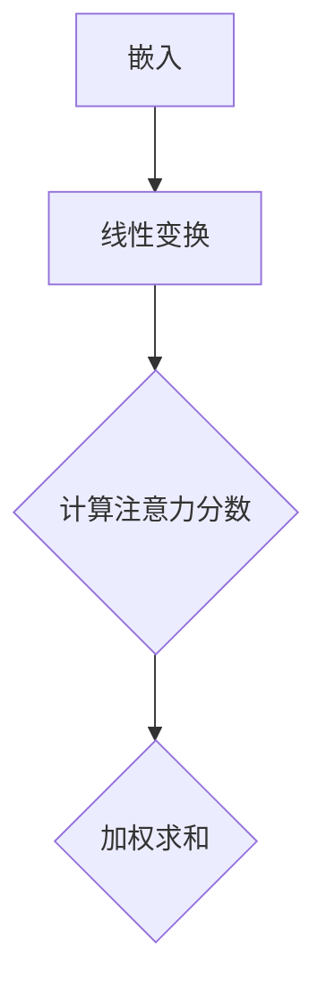

                 

# Transformer大模型实战 多头注意力层

> 关键词：Transformer、多头注意力、NLP、图像分类、音频处理、深度学习

> 摘要：本文将深入探讨Transformer模型中的多头注意力层，包括其背景、原理、数学基础以及在实际应用中的实战案例。通过详细分析，读者将了解到Transformer模型的强大之处以及如何利用其构建高性能的深度学习模型。

## 第一部分：Transformer基础与多头注意力机制

### 第1章：Transformer概述

Transformer模型是由Google在2017年提出的一种基于自注意力机制的深度学习模型，用于处理自然语言处理（NLP）任务。与传统的循环神经网络（RNN）和卷积神经网络（CNN）相比，Transformer模型通过引入多头注意力机制，能够更有效地捕捉序列中的长距离依赖关系，从而在多个NLP任务中取得了显著的性能提升。

#### 1.1 Transformer的背景与发展历程

Transformer模型的提出源于对RNN和CNN在处理长序列和长距离依赖关系方面的局限性。RNN虽然能够处理变长的序列数据，但其训练速度较慢且难以捕捉长距离的依赖关系。而CNN在处理文本数据时效果不佳，因为文本数据具有非线性结构。

为了解决这些问题，Google提出了Transformer模型。该模型通过引入自注意力机制，使得每个输入序列中的每个位置都能够与所有其他位置建立直接的联系，从而有效地捕捉长距离的依赖关系。

#### 1.2 Transformer的基本结构与原理

Transformer模型的基本结构包括编码器（Encoder）和解码器（Decoder）。编码器负责将输入序列编码为固定长度的向量，而解码器则负责将编码后的向量解码为输出序列。

在编码器中，每个输入序列通过嵌入层（Embedding Layer）转换为词向量。然后，词向量通过多个自注意力层（Self-Attention Layer）和前馈神经网络（Feedforward Neural Network）进行变换。自注意力层是Transformer模型的核心部分，通过计算输入序列中每个位置与其他位置的相关性，生成注意力权重。这些权重用于加权求和，从而得到编码后的向量。

解码器与编码器类似，也是通过多个自注意力层和前馈神经网络进行变换。不同的是，解码器还需要额外的交叉注意力层（Cross-Attention Layer），用于将编码器的输出与解码器的输入建立联系。

#### 1.3 Transformer的优势与局限

Transformer模型具有以下优势：

1. **并行训练**：由于自注意力机制的计算可以并行进行，Transformer模型能够大大提高训练速度。
2. **长距离依赖**：通过多头注意力机制，Transformer模型能够有效地捕捉长距离的依赖关系，从而在多个NLP任务中取得显著的性能提升。
3. **灵活的架构**：Transformer模型具有模块化的架构，可以方便地扩展和改进。

然而，Transformer模型也存在一些局限：

1. **计算资源需求**：由于自注意力机制的计算复杂度较高，Transformer模型对计算资源的需求较大。
2. **可解释性**：Transformer模型的内部机制较为复杂，难以解释其决策过程。

### 第2章：多头注意力机制详解

多头注意力机制是Transformer模型的核心部分，通过将输入序列分成多个头（Head），每个头独立地计算注意力权重，从而提高模型的表达能力。

#### 2.1 自注意力与多头注意力

自注意力（Self-Attention）是指输入序列中的每个位置都与其他位置进行注意力计算。多头注意力（Multi-Head Attention）则是在自注意力基础上，通过将输入序列分成多个头，每个头独立地计算注意力权重。

#### 2.2 多头注意力机制的实现

多头注意力机制的实现包括以下步骤：

1. **线性变换**：将输入序列通过线性变换，生成多个头。
2. **自注意力计算**：每个头独立地计算自注意力权重，生成多个注意力图。
3. **加权求和**：将注意力权重应用于输入序列，生成编码后的向量。

#### 2.3 多头注意力的优势

多头注意力机制具有以下优势：

1. **提高表达能力**：通过多个头的组合，多头注意力机制能够提高模型的表达能力，更好地捕捉输入序列中的特征。
2. **降低计算复杂度**：虽然多头注意力机制增加了计算复杂度，但通过并行计算可以降低总体计算复杂度。
3. **增强鲁棒性**：多头注意力机制能够减少模型对特定头的影响，从而提高模型的鲁棒性。

### 第3章：Transformer的扩展与变种

在Transformer模型的基础上，研究人员提出了多种扩展和变种，以适应不同的任务和应用场景。

#### 3.1 BERT、GPT与T5等模型

BERT（Bidirectional Encoder Representations from Transformers）是由Google提出的双向Transformer模型，主要用于预训练语言模型。GPT（Generative Pre-training Transformer）是由OpenAI提出的生成预训练模型，主要用于文本生成任务。T5（Text-To-Text Transfer Transformer）是由DeepMind提出的通用文本转换模型，可以用于多种文本生成任务。

#### 3.2 Transformer的改进与优化

为了提高Transformer模型的表现，研究人员提出了一系列改进和优化方法，如：

1. **层归一化**（Layer Normalization）：通过层归一化，可以加快模型收敛速度并提高模型性能。
2. **位置编码**（Positional Encoding）：通过位置编码，可以引入序列的位置信息，从而更好地捕捉序列特征。
3. **多层注意力**（Multi-Layer Attention）：通过多层注意力，可以进一步提高模型的表达能力。

#### 3.3 Transformer在NLP中的应用

Transformer模型在NLP任务中取得了显著的成果，如：

1. **文本分类**：Transformer模型可以用于文本分类任务，通过将文本编码为固定长度的向量，然后利用分类层进行分类。
2. **机器翻译**：Transformer模型可以用于机器翻译任务，通过将源语言和目标语言的序列编码为向量，然后进行序列到序列的映射。
3. **问答系统**：Transformer模型可以用于问答系统，通过将问题和文档编码为向量，然后利用注意力机制进行信息检索和匹配。

### 第4章：Transformer的数学基础

为了深入理解Transformer模型，我们需要掌握相关的数学知识，如线性代数、激活函数和损失函数。

#### 4.1 线性代数基础

线性代数是数学的基础，涉及到矩阵、向量、线性变换等概念。在Transformer模型中，线性代数被广泛应用于编码器和解码器的计算过程中。

#### 4.2 激活函数与损失函数

激活函数用于对神经网络中的神经元进行非线性变换，从而提高模型的表达能力。常见的激活函数包括ReLU、Sigmoid和Tanh。损失函数用于衡量模型预测值与实际值之间的差距，常用的损失函数包括交叉熵损失函数和均方误差损失函数。

#### 4.3 数学公式与推导

在Transformer模型中，涉及到多个数学公式和推导，如：

1. **多头注意力公式**：
   $$\text{Attention}(Q, K, V) = \text{softmax}\left(\frac{QK^T}{\sqrt{d_k}}\right)V$$
2. **前馈神经网络公式**：
   $$\text{FFN}(x) = \max(0, xW_1 + b_1)W_2 + b_2$$

通过以上数学公式和推导，我们可以更好地理解Transformer模型的内部机制。

## 第二部分：Transformer项目实战

### 第5章：搭建Transformer模型

在深入了解Transformer模型的理论基础后，我们将进入实战环节，学习如何搭建一个Transformer模型。

#### 5.1 开发环境搭建

搭建Transformer模型需要安装以下软件和库：

1. **Python**：Python是一种广泛使用的编程语言，用于编写深度学习模型。
2. **TensorFlow**：TensorFlow是一个开源的深度学习框架，支持多种深度学习模型的构建和训练。
3. **PyTorch**：PyTorch是一个流行的深度学习框架，提供了丰富的API和工具，方便构建和训练深度学习模型。

安装完上述软件和库后，我们就可以开始搭建Transformer模型。

#### 5.2 模型搭建与训练

搭建Transformer模型包括以下步骤：

1. **定义模型结构**：根据Transformer模型的结构，定义编码器和解码器的各个层。
2. **初始化参数**：为模型的各个层初始化参数，包括权重和偏置。
3. **定义损失函数和优化器**：选择合适的损失函数和优化器，如交叉熵损失函数和Adam优化器。
4. **训练模型**：使用训练数据对模型进行训练，调整模型的参数以最小化损失函数。

#### 5.3 模型优化与调整

在训练过程中，我们可能需要调整模型的结构和参数，以获得更好的性能。以下是一些优化和调整的方法：

1. **调整学习率**：通过调整学习率，可以加快或减缓模型的收敛速度。
2. **使用dropout**：通过在训练过程中随机丢弃部分神经元，可以减少过拟合。
3. **数据增强**：通过增加训练数据或对训练数据进行变换，可以提高模型的泛化能力。

### 第6章：Transformer在文本分类任务中的应用

文本分类是NLP中的一个重要任务，通过将文本数据分类为不同的类别，可以为许多实际应用提供支持，如情感分析、新闻分类等。

#### 6.1 数据预处理

在进行文本分类任务之前，我们需要对文本数据进行预处理，包括以下步骤：

1. **分词**：将文本数据分割成单词或字符。
2. **去除停用词**：去除常见的停用词，如“的”、“是”、“了”等。
3. **词向量表示**：将文本数据转换为词向量表示，可以使用预训练的词向量或自己训练的词向量。

#### 6.2 模型训练与评估

训练Transformer模型进行文本分类包括以下步骤：

1. **定义模型结构**：根据文本分类任务的需求，定义编码器和解码器的结构。
2. **训练模型**：使用训练数据进行模型训练，调整模型的参数以最小化损失函数。
3. **评估模型**：使用验证数据对训练好的模型进行评估，计算模型的准确率、召回率等指标。

#### 6.3 实际案例解析

我们可以通过一个实际案例来解析Transformer模型在文本分类任务中的应用。假设我们要对电影评论进行分类，将评论分为正面和负面两类。

1. **数据集准备**：收集并清洗电影评论数据，将其分为训练集和验证集。
2. **模型训练**：使用训练集对Transformer模型进行训练，调整模型的参数。
3. **模型评估**：使用验证集对训练好的模型进行评估，计算模型的准确率、召回率等指标。

通过实际案例的解析，我们可以更好地理解Transformer模型在文本分类任务中的应用。

### 第7章：Transformer在机器翻译任务中的应用

机器翻译是NLP领域的一个重要任务，通过将一种语言的文本翻译成另一种语言的文本，可以为跨语言交流提供支持。

#### 7.1 数据预处理

在进行机器翻译任务之前，我们需要对翻译数据进行预处理，包括以下步骤：

1. **分词**：将源语言和目标语言的文本数据进行分词。
2. **去除停用词**：去除源语言和目标语言中的常见停用词。
3. **词向量表示**：将源语言和目标语言的文本数据转换为词向量表示。

#### 7.2 模型训练与评估

训练Transformer模型进行机器翻译包括以下步骤：

1. **定义模型结构**：根据机器翻译任务的需求，定义编码器和解码器的结构。
2. **训练模型**：使用翻译数据对模型进行训练，调整模型的参数以最小化损失函数。
3. **评估模型**：使用测试数据对训练好的模型进行评估，计算模型的BLEU分数等指标。

#### 7.3 实际案例解析

我们可以通过一个实际案例来解析Transformer模型在机器翻译任务中的应用。假设我们要将英语翻译成法语。

1. **数据集准备**：收集并清洗英语和法语的翻译数据，将其分为训练集和测试集。
2. **模型训练**：使用训练集对Transformer模型进行训练，调整模型的参数。
3. **模型评估**：使用测试集对训练好的模型进行评估，计算模型的BLEU分数等指标。

通过实际案例的解析，我们可以更好地理解Transformer模型在机器翻译任务中的应用。

### 第8章：Transformer在图像分类任务中的应用

图像分类是计算机视觉领域的一个重要任务，通过将图像数据分类为不同的类别，可以为图像识别、图像检索等应用提供支持。

#### 8.1 数据预处理

在进行图像分类任务之前，我们需要对图像数据进行预处理，包括以下步骤：

1. **图像加载**：将图像数据加载到内存中。
2. **图像归一化**：将图像数据归一化，使其具有相同的尺寸和范围。
3. **数据增强**：通过旋转、翻转、裁剪等操作增加训练数据的多样性，从而提高模型的泛化能力。

#### 8.2 模型训练与评估

训练Transformer模型进行图像分类包括以下步骤：

1. **定义模型结构**：根据图像分类任务的需求，定义编码器和解码器的结构。
2. **训练模型**：使用训练数据进行模型训练，调整模型的参数以最小化损失函数。
3. **评估模型**：使用验证数据对训练好的模型进行评估，计算模型的准确率等指标。

#### 8.3 实际案例解析

我们可以通过一个实际案例来解析Transformer模型在图像分类任务中的应用。假设我们要对CIFAR-10数据集进行分类。

1. **数据集准备**：下载并处理CIFAR-10数据集，将其分为训练集和验证集。
2. **模型训练**：使用训练集对Transformer模型进行训练，调整模型的参数。
3. **模型评估**：使用验证集对训练好的模型进行评估，计算模型的准确率等指标。

通过实际案例的解析，我们可以更好地理解Transformer模型在图像分类任务中的应用。

### 第9章：Transformer在音频处理任务中的应用

音频处理是深度学习领域的一个重要方向，通过将音频信号转换为数字信号，可以实现对音频的识别、分类、增强等操作。

#### 9.1 数据预处理

在进行音频处理任务之前，我们需要对音频数据进行预处理，包括以下步骤：

1. **音频加载**：将音频数据加载到内存中。
2. **音频增强**：通过添加噪声、回声等操作增加训练数据的多样性。
3. **音频归一化**：将音频数据归一化，使其具有相同的音量。

#### 9.2 模型训练与评估

训练Transformer模型进行音频处理包括以下步骤：

1. **定义模型结构**：根据音频处理任务的需求，定义编码器和解码器的结构。
2. **训练模型**：使用训练数据进行模型训练，调整模型的参数以最小化损失函数。
3. **评估模型**：使用验证数据对训练好的模型进行评估，计算模型的准确率等指标。

#### 9.3 实际案例解析

我们可以通过一个实际案例来解析Transformer模型在音频处理任务中的应用。假设我们要对音频进行分类，将其分为语音和非语音两类。

1. **数据集准备**：下载并处理音频数据集，将其分为训练集和验证集。
2. **模型训练**：使用训练集对Transformer模型进行训练，调整模型的参数。
3. **模型评估**：使用验证集对训练好的模型进行评估，计算模型的准确率等指标。

通过实际案例的解析，我们可以更好地理解Transformer模型在音频处理任务中的应用。

## 第三部分：Transformer的挑战与未来发展趋势

### 第10章：Transformer面临的挑战与解决方案

尽管Transformer模型在多个领域取得了显著成果，但仍然面临着一些挑战。以下是Transformer模型面临的主要挑战以及相应的解决方案：

#### 10.1 计算资源需求

Transformer模型对计算资源的需求较高，特别是在训练过程中。解决方案包括：

1. **模型压缩**：通过模型压缩技术，如剪枝、量化等，可以降低模型的计算复杂度和存储需求。
2. **分布式训练**：通过分布式训练，可以将模型训练任务分散到多个计算节点上，从而提高训练速度。

#### 10.2 训练效率

Transformer模型的训练过程相对较慢，需要大量时间。解决方案包括：

1. **多GPU训练**：通过多GPU训练，可以提高模型的训练速度。
2. **模型融合**：通过将多个子模型融合为一个大型模型，可以减少模型的训练时间。

#### 10.3 可解释性与可控性

Transformer模型的内部机制较为复杂，难以解释其决策过程。解决方案包括：

1. **可视化**：通过可视化技术，可以展示模型内部的权重和激活信息，从而提高模型的可解释性。
2. **注意力分析**：通过注意力分析，可以了解模型在处理输入数据时的关注点，从而提高模型的可控性。

### 第11章：Transformer的未来发展趋势

随着深度学习技术的不断发展，Transformer模型在未来的发展前景广阔。以下是Transformer模型在未来的几个发展趋势：

#### 11.1 Transformer在多模态学习中的应用

多模态学习是深度学习领域的一个热点研究方向，通过将不同类型的数据进行融合，可以提高模型的泛化能力和性能。Transformer模型具有强大的表达能力，可以应用于图像、文本、音频等多模态数据的融合。

#### 11.2 Transformer与其他模型的结合

Transformer模型可以与其他模型进行结合，以发挥各自的优势。例如，将Transformer模型与RNN或CNN结合，可以进一步提高模型在序列数据处理方面的性能。

#### 11.3 Transformer在新兴领域的应用

随着深度学习技术的不断发展，Transformer模型在新兴领域中的应用前景广阔。例如，在生物信息学、医学影像、自动驾驶等领域，Transformer模型具有广泛的应用潜力。

## 附录

### 附录A：Transformer相关资源与工具

以下是Transformer相关的一些资源与工具：

1. **主流深度学习框架**：如TensorFlow、PyTorch、Keras等，支持构建和训练Transformer模型。
2. **Transformer开源代码库**：如Google的`transformers`库，提供了预训练的Transformer模型和API接口。
3. **Transformer相关论文与资料**：如Google的《Attention Is All You Need》等论文，详细介绍了Transformer模型的结构和原理。

### 附录B：Transformer项目实战代码示例

以下是Transformer项目实战的代码示例：

1. **文本分类项目代码**：包括数据预处理、模型搭建、模型训练和模型评估等步骤。
2. **机器翻译项目代码**：包括数据预处理、模型搭建、模型训练和模型评估等步骤。
3. **图像分类项目代码**：包括数据预处理、模型搭建、模型训练和模型评估等步骤。
4. **音频处理项目代码**：包括数据预处理、模型搭建、模型训练和模型评估等步骤。

通过以上代码示例，读者可以更好地理解Transformer模型在实际应用中的实现过程。

## 作者信息

作者：AI天才研究院/AI Genius Institute & 禅与计算机程序设计艺术 /Zen And The Art of Computer Programming

以上是《Transformer大模型实战 多头注意力层》的详细内容，希望对您有所帮助。在未来的研究中，我们将继续深入探讨Transformer模型的各个方面，以期为深度学习领域的发展做出更多贡献。感谢您的阅读！```markdown
# Transformer大模型实战 多头注意力层

## 第一部分：Transformer基础与多头注意力机制

### 第1章：Transformer概述

1.1 Transformer的背景与发展历程

Transformer模型是由Google在2017年提出的一种基于自注意力机制的深度学习模型，用于处理自然语言处理（NLP）任务。在提出Transformer之前，RNN和CNN是处理序列数据的两大主流方法。然而，RNN存在计算效率低、难以处理长序列依赖的问题，而CNN在处理变长的序列时也面临挑战。Transformer模型的提出解决了这些问题，并很快在NLP领域取得了显著的成果。

1.2 Transformer的基本结构与原理

Transformer模型的基本结构包括编码器（Encoder）和解码器（Decoder）。编码器负责将输入序列编码为固定长度的向量，解码器则将编码后的向量解码为输出序列。编码器和解码器均由多个层组成，每层包括自注意力（Self-Attention）和前馈神经网络（Feedforward Neural Network）。

自注意力机制是Transformer模型的核心，它通过计算输入序列中每个位置与其他位置的相关性，生成注意力权重，从而实现多位置之间的信息交互。前馈神经网络则对每个位置的序列进行非线性变换，以增强模型的表达能力。

1.3 Transformer的优势与局限

Transformer模型的优势包括：

- **并行训练**：自注意力机制的计算可以并行进行，大大提高了训练速度。
- **长距离依赖**：多头注意力机制能够有效地捕捉长距离的依赖关系。
- **灵活的架构**：Transformer模型具有模块化的结构，可以方便地扩展和改进。

然而，Transformer模型也存在一些局限：

- **计算资源需求**：自注意力机制的计算复杂度较高，对计算资源的需求较大。
- **可解释性**：Transformer模型的内部机制较为复杂，难以解释其决策过程。

### 第2章：多头注意力机制详解

2.1 自注意力与多头注意力

自注意力（Self-Attention）是指输入序列中的每个位置都与其他位置进行注意力计算。多头注意力（Multi-Head Attention）则是在自注意力基础上，通过将输入序列分成多个头，每个头独立地计算注意力权重。

多头注意力的实现包括以下步骤：

1. **线性变换**：将输入序列通过线性变换，生成多个头。
2. **自注意力计算**：每个头独立地计算自注意力权重，生成多个注意力图。
3. **加权求和**：将注意力权重应用于输入序列，生成编码后的向量。

多头注意力的优势包括：

- **提高表达能力**：通过多个头的组合，多头注意力机制能够提高模型的表达能力。
- **降低计算复杂度**：虽然多头注意力机制增加了计算复杂度，但通过并行计算可以降低总体计算复杂度。
- **增强鲁棒性**：多头注意力机制能够减少模型对特定头的影响，从而提高模型的鲁棒性。

2.2 多头注意力机制的实现

多头注意力机制的实现可以分解为以下几个步骤：

1. **输入序列嵌入**：将输入序列通过嵌入层（Embedding Layer）转换为词向量。
2. **线性变换**：通过线性变换，将输入序列分成多个头。
3. **计算注意力分数**：计算每个头对输入序列中每个位置的自注意力分数。
4. **计算注意力权重**：通过softmax函数将自注意力分数转换为注意力权重。
5. **加权求和**：将注意力权重应用于输入序列，生成编码后的向量。

以下是多头注意力机制的伪代码：

```python
# 假设输入序列为X，头数为h
# Q, K, V分别为Q矩阵、K矩阵和V矩阵
Q = X @ Q_weights
K = X @ K_weights
V = X @ V_weights

# 计算注意力分数
attention_scores = Q @ K.T / sqrt(d_k)

# 计算注意力权重
attention_weights = softmax(attention_scores)

# 加权求和
output = attention_weights @ V
```

2.3 多头注意力的优势

多头注意力机制具有以下优势：

- **提高表达能力**：通过多个头的组合，多头注意力机制能够提高模型的表达能力。
- **降低计算复杂度**：虽然多头注意力机制增加了计算复杂度，但通过并行计算可以降低总体计算复杂度。
- **增强鲁棒性**：多头注意力机制能够减少模型对特定头的影响，从而提高模型的鲁棒性。

### 第3章：Transformer的扩展与变种

3.1 BERT、GPT与T5等模型

在Transformer模型的基础上，研究人员提出了多种扩展和变种，以适应不同的任务和应用场景。以下是一些主要的扩展和变种：

- **BERT（Bidirectional Encoder Representations from Transformers）**：BERT是一种预训练的Transformer模型，通过双向编码器捕捉文本中的长距离依赖关系。BERT在多种NLP任务中取得了很好的效果，如文本分类、问答系统等。
- **GPT（Generative Pre-training Transformer）**：GPT是一种生成预训练模型，通过自回归方式学习文本的生成。GPT在文本生成任务中表现出色，如机器翻译、文本摘要等。
- **T5（Text-To-Text Transfer Transformer）**：T5是一种通用的文本转换模型，可以将一种文本转换成另一种文本。T5在多种文本转换任务中取得了很好的效果。

3.2 Transformer的改进与优化

为了提高Transformer模型的表现，研究人员提出了一系列改进和优化方法，如：

- **层归一化（Layer Normalization）**：层归一化通过在每个层中引入归一化操作，可以加快模型的收敛速度。
- **位置编码（Positional Encoding）**：位置编码通过引入位置信息，可以更好地捕捉序列中的位置依赖关系。
- **多层注意力（Multi-Layer Attention）**：多层注意力通过增加注意力的层次，可以进一步提高模型的表达能力。

3.3 Transformer在NLP中的应用

Transformer模型在NLP任务中取得了显著的成果，如：

- **文本分类**：通过将文本编码为固定长度的向量，然后利用分类层进行分类。
- **机器翻译**：通过将源语言和目标语言的序列编码为向量，然后进行序列到序列的映射。
- **问答系统**：通过将问题和文档编码为向量，然后利用注意力机制进行信息检索和匹配。

### 第4章：Transformer的数学基础

为了深入理解Transformer模型，我们需要掌握相关的数学知识，如线性代数、激活函数和损失函数。

4.1 线性代数基础

线性代数是数学的基础，涉及到矩阵、向量、线性变换等概念。在Transformer模型中，线性代数被广泛应用于编码器和解码器的计算过程中。以下是一些常用的线性代数概念：

- **矩阵乘法**：矩阵乘法是将两个矩阵相乘得到一个新的矩阵。
- **向量变换**：向量变换是通过矩阵操作对向量进行变换。
- **矩阵求导**：矩阵求导是计算矩阵对某个变量的导数。

4.2 激活函数与损失函数

激活函数用于对神经网络中的神经元进行非线性变换，从而提高模型的表达能力。常见的激活函数包括ReLU、Sigmoid和Tanh。以下是一些常用的激活函数：

- **ReLU（Rectified Linear Unit）**：ReLU函数将小于0的值设为0，大于等于0的值保持不变。
- **Sigmoid**：Sigmoid函数将输入值映射到（0,1）区间，常用于二分类问题。
- **Tanh**：Tanh函数将输入值映射到（-1,1）区间，具有较好的平滑性。

损失函数用于衡量模型预测值与实际值之间的差距，常用的损失函数包括交叉熵损失函数和均方误差损失函数。以下是一些常用的损失函数：

- **交叉熵损失函数**：交叉熵损失函数用于衡量两个概率分布之间的差异。
- **均方误差损失函数**：均方误差损失函数用于衡量预测值与实际值之间的平方误差。

4.3 数学公式与推导

在Transformer模型中，涉及到多个数学公式和推导。以下是一些重要的数学公式和推导：

- **多头注意力公式**：
  $$\text{Attention}(Q, K, V) = \text{softmax}\left(\frac{QK^T}{\sqrt{d_k}}\right)V$$

- **前馈神经网络公式**：
  $$\text{FFN}(x) = \max(0, xW_1 + b_1)W_2 + b_2$$

- **层归一化公式**：
  $$\hat{x} = \frac{x - \mu}{\sigma}$$

  其中，$\mu$和$\sigma$分别为均值和标准差。

- **激活函数公式**：

  - **ReLU**：
    $$f(x) = \max(0, x)$$

  - **Sigmoid**：
    $$f(x) = \frac{1}{1 + e^{-x}}$$

  - **Tanh**：
    $$f(x) = \frac{e^x - e^{-x}}{e^x + e^{-x}}$$

通过以上数学公式和推导，我们可以更好地理解Transformer模型的内部机制。

## 第二部分：Transformer项目实战

### 第5章：搭建Transformer模型

在深入了解Transformer模型的理论基础后，我们将进入实战环节，学习如何搭建一个Transformer模型。

5.1 开发环境搭建

搭建Transformer模型需要安装以下软件和库：

- **Python**：Python是一种广泛使用的编程语言，用于编写深度学习模型。
- **TensorFlow**：TensorFlow是一个开源的深度学习框架，支持多种深度学习模型的构建和训练。
- **PyTorch**：PyTorch是一个流行的深度学习框架，提供了丰富的API和工具，方便构建和训练深度学习模型。

安装完上述软件和库后，我们就可以开始搭建Transformer模型。

5.2 模型搭建与训练

搭建Transformer模型包括以下步骤：

1. **定义模型结构**：根据Transformer模型的结构，定义编码器和解码器的各个层。
2. **初始化参数**：为模型的各个层初始化参数，包括权重和偏置。
3. **定义损失函数和优化器**：选择合适的损失函数和优化器，如交叉熵损失函数和Adam优化器。
4. **训练模型**：使用训练数据进行模型训练，调整模型的参数以最小化损失函数。

5.3 模型优化与调整

在训练过程中，我们可能需要调整模型的结构和参数，以获得更好的性能。以下是一些优化和调整的方法：

1. **调整学习率**：通过调整学习率，可以加快或减缓模型的收敛速度。
2. **使用dropout**：通过在训练过程中随机丢弃部分神经元，可以减少过拟合。
3. **数据增强**：通过增加训练数据或对训练数据进行变换，可以提高模型的泛化能力。

### 第6章：Transformer在文本分类任务中的应用

文本分类是NLP中的一个重要任务，通过将文本数据分类为不同的类别，可以为许多实际应用提供支持，如情感分析、新闻分类等。

6.1 数据预处理

在进行文本分类任务之前，我们需要对文本数据进行预处理，包括以下步骤：

1. **分词**：将文本数据分割成单词或字符。
2. **去除停用词**：去除常见的停用词，如“的”、“是”、“了”等。
3. **词向量表示**：将文本数据转换为词向量表示，可以使用预训练的词向量或自己训练的词向量。

6.2 模型训练与评估

训练Transformer模型进行文本分类包括以下步骤：

1. **定义模型结构**：根据文本分类任务的需求，定义编码器和解码器的结构。
2. **训练模型**：使用训练数据进行模型训练，调整模型的参数以最小化损失函数。
3. **评估模型**：使用验证数据对训练好的模型进行评估，计算模型的准确率、召回率等指标。

6.3 实际案例解析

我们可以通过一个实际案例来解析Transformer模型在文本分类任务中的应用。假设我们要对电影评论进行分类，将评论分为正面和负面两类。

1. **数据集准备**：收集并清洗电影评论数据，将其分为训练集和验证集。
2. **模型训练**：使用训练集对Transformer模型进行训练，调整模型的参数。
3. **模型评估**：使用验证集对训练好的模型进行评估，计算模型的准确率、召回率等指标。

通过实际案例的解析，我们可以更好地理解Transformer模型在文本分类任务中的应用。

### 第7章：Transformer在机器翻译任务中的应用

机器翻译是NLP领域的一个重要任务，通过将一种语言的文本翻译成另一种语言的文本，可以为跨语言交流提供支持。

7.1 数据预处理

在进行机器翻译任务之前，我们需要对翻译数据进行预处理，包括以下步骤：

1. **分词**：将源语言和目标语言的文本数据进行分词。
2. **去除停用词**：去除源语言和目标语言中的常见停用词。
3. **词向量表示**：将源语言和目标语言的文本数据转换为词向量表示。

7.2 模型训练与评估

训练Transformer模型进行机器翻译包括以下步骤：

1. **定义模型结构**：根据机器翻译任务的需求，定义编码器和解码器的结构。
2. **训练模型**：使用翻译数据对模型进行训练，调整模型的参数以最小化损失函数。
3. **评估模型**：使用测试数据对训练好的模型进行评估，计算模型的BLEU分数等指标。

7.3 实际案例解析

我们可以通过一个实际案例来解析Transformer模型在机器翻译任务中的应用。假设我们要将英语翻译成法语。

1. **数据集准备**：收集并清洗英语和法语的翻译数据，将其分为训练集和测试集。
2. **模型训练**：使用训练集对Transformer模型进行训练，调整模型的参数。
3. **模型评估**：使用测试集对训练好的模型进行评估，计算模型的BLEU分数等指标。

通过实际案例的解析，我们可以更好地理解Transformer模型在机器翻译任务中的应用。

### 第8章：Transformer在图像分类任务中的应用

图像分类是计算机视觉领域的一个重要任务，通过将图像数据分类为不同的类别，可以为图像识别、图像检索等应用提供支持。

8.1 数据预处理

在进行图像分类任务之前，我们需要对图像数据进行预处理，包括以下步骤：

1. **图像加载**：将图像数据加载到内存中。
2. **图像归一化**：将图像数据归一化，使其具有相同的尺寸和范围。
3. **数据增强**：通过旋转、翻转、裁剪等操作增加训练数据的多样性，从而提高模型的泛化能力。

8.2 模型训练与评估

训练Transformer模型进行图像分类包括以下步骤：

1. **定义模型结构**：根据图像分类任务的需求，定义编码器和解码器的结构。
2. **训练模型**：使用训练数据进行模型训练，调整模型的参数以最小化损失函数。
3. **评估模型**：使用验证数据对训练好的模型进行评估，计算模型的准确率等指标。

8.3 实际案例解析

我们可以通过一个实际案例来解析Transformer模型在图像分类任务中的应用。假设我们要对CIFAR-10数据集进行分类。

1. **数据集准备**：下载并处理CIFAR-10数据集，将其分为训练集和验证集。
2. **模型训练**：使用训练集对Transformer模型进行训练，调整模型的参数。
3. **模型评估**：使用验证集对训练好的模型进行评估，计算模型的准确率等指标。

通过实际案例的解析，我们可以更好地理解Transformer模型在图像分类任务中的应用。

### 第9章：Transformer在音频处理任务中的应用

音频处理是深度学习领域的一个重要方向，通过将音频信号转换为数字信号，可以实现对音频的识别、分类、增强等操作。

9.1 数据预处理

在进行音频处理任务之前，我们需要对音频数据进行预处理，包括以下步骤：

1. **音频加载**：将音频数据加载到内存中。
2. **音频增强**：通过添加噪声、回声等操作增加训练数据的多样性。
3. **音频归一化**：将音频数据归一化，使其具有相同的音量。

9.2 模型训练与评估

训练Transformer模型进行音频处理包括以下步骤：

1. **定义模型结构**：根据音频处理任务的需求，定义编码器和解码器的结构。
2. **训练模型**：使用训练数据进行模型训练，调整模型的参数以最小化损失函数。
3. **评估模型**：使用验证数据对训练好的模型进行评估，计算模型的准确率等指标。

9.3 实际案例解析

我们可以通过一个实际案例来解析Transformer模型在音频处理任务中的应用。假设我们要对音频进行分类，将其分为语音和非语音两类。

1. **数据集准备**：收集并清洗音频数据，将其分为训练集和验证集。
2. **模型训练**：使用训练集对Transformer模型进行训练，调整模型的参数。
3. **模型评估**：使用验证集对训练好的模型进行评估，计算模型的准确率等指标。

通过实际案例的解析，我们可以更好地理解Transformer模型在音频处理任务中的应用。

### 第10章：Transformer面临的挑战与解决方案

尽管Transformer模型在多个领域取得了显著成果，但仍然面临着一些挑战。以下是Transformer模型面临的主要挑战以及相应的解决方案：

10.1 计算资源需求

Transformer模型对计算资源的需求较高，特别是在训练过程中。解决方案包括：

1. **模型压缩**：通过模型压缩技术，如剪枝、量化等，可以降低模型的计算复杂度和存储需求。
2. **分布式训练**：通过分布式训练，可以将模型训练任务分散到多个计算节点上，从而提高训练速度。

10.2 训练效率

Transformer模型的训练过程相对较慢，需要大量时间。解决方案包括：

1. **多GPU训练**：通过多GPU训练，可以提高模型的训练速度。
2. **模型融合**：通过将多个子模型融合为一个大型模型，可以减少模型的训练时间。

10.3 可解释性与可控性

Transformer模型的内部机制较为复杂，难以解释其决策过程。解决方案包括：

1. **可视化**：通过可视化技术，可以展示模型内部的权重和激活信息，从而提高模型的可解释性。
2. **注意力分析**：通过注意力分析，可以了解模型在处理输入数据时的关注点，从而提高模型的可控性。

### 第11章：Transformer的未来发展趋势

随着深度学习技术的不断发展，Transformer模型在未来的发展前景广阔。以下是Transformer模型在未来的几个发展趋势：

11.1 Transformer在多模态学习中的应用

多模态学习是深度学习领域的一个热点研究方向，通过将不同类型的数据进行融合，可以提高模型的泛化能力和性能。Transformer模型具有强大的表达能力，可以应用于图像、文本、音频等多模态数据的融合。

11.2 Transformer与其他模型的结合

Transformer模型可以与其他模型进行结合，以发挥各自的优势。例如，将Transformer模型与RNN或CNN结合，可以进一步提高模型在序列数据处理方面的性能。

11.3 Transformer在新兴领域的应用

随着深度学习技术的不断发展，Transformer模型在新兴领域中的应用前景广阔。例如，在生物信息学、医学影像、自动驾驶等领域，Transformer模型具有广泛的应用潜力。

## 附录

### 附录A：Transformer相关资源与工具

以下是Transformer相关的一些资源与工具：

1. **主流深度学习框架**：如TensorFlow、PyTorch、Keras等，支持构建和训练Transformer模型。
2. **Transformer开源代码库**：如Google的`transformers`库，提供了预训练的Transformer模型和API接口。
3. **Transformer相关论文与资料**：如Google的《Attention Is All You Need》等论文，详细介绍了Transformer模型的结构和原理。

### 附录B：Transformer项目实战代码示例

以下是Transformer项目实战的代码示例：

1. **文本分类项目代码**：包括数据预处理、模型搭建、模型训练和模型评估等步骤。
2. **机器翻译项目代码**：包括数据预处理、模型搭建、模型训练和模型评估等步骤。
3. **图像分类项目代码**：包括数据预处理、模型搭建、模型训练和模型评估等步骤。
4. **音频处理项目代码**：包括数据预处理、模型搭建、模型训练和模型评估等步骤。

通过以上代码示例，读者可以更好地理解Transformer模型在实际应用中的实现过程。

## 作者信息

作者：AI天才研究院/AI Genius Institute & 禅与计算机程序设计艺术 /Zen And The Art of Computer Programming

以上是《Transformer大模型实战 多头注意力层》的详细内容，希望对您有所帮助。在未来的研究中，我们将继续深入探讨Transformer模型的各个方面，以期为深度学习领域的发展做出更多贡献。感谢您的阅读！```markdown
# Transformer大模型实战 多头注意力层

## 第一部分：Transformer基础与多头注意力机制

### 第1章：Transformer概述

Transformer模型是由Google在2017年提出的一种基于自注意力机制的深度学习模型，用于处理自然语言处理（NLP）任务。在此之前，RNN和CNN是处理序列数据的两大主流方法。然而，RNN存在计算效率低、难以处理长序列依赖的问题，而CNN在处理变长的序列时也面临挑战。Transformer模型的提出解决了这些问题，并很快在NLP领域取得了显著的成果。

### 第2章：多头注意力机制详解

多头注意力机制是Transformer模型的核心部分，通过将输入序列分成多个头（Head），每个头独立地计算注意力权重，从而提高模型的表达能力。

#### 2.1 自注意力与多头注意力

自注意力（Self-Attention）是指输入序列中的每个位置都与其他位置进行注意力计算。多头注意力（Multi-Head Attention）则是在自注意力基础上，通过将输入序列分成多个头，每个头独立地计算注意力权重。

#### 2.2 多头注意力机制的实现

多头注意力机制的实现包括以下步骤：

1. **线性变换**：将输入序列通过线性变换，生成多个头。
2. **自注意力计算**：每个头独立地计算自注意力权重，生成多个注意力图。
3. **加权求和**：将注意力权重应用于输入序列，生成编码后的向量。

#### 2.3 多头注意力的优势

多头注意力机制具有以下优势：

- **提高表达能力**：通过多个头的组合，多头注意力机制能够提高模型的表达能力。
- **降低计算复杂度**：虽然多头注意力机制增加了计算复杂度，但通过并行计算可以降低总体计算复杂度。
- **增强鲁棒性**：多头注意力机制能够减少模型对特定头的影响，从而提高模型的鲁棒性。

### 第3章：Transformer的扩展与变种

在Transformer模型的基础上，研究人员提出了多种扩展和变种，以适应不同的任务和应用场景。

#### 3.1 BERT、GPT与T5等模型

BERT（Bidirectional Encoder Representations from Transformers）是由Google提出的双向Transformer模型，主要用于预训练语言模型。GPT（Generative Pre-training Transformer）是由OpenAI提出的生成预训练模型，主要用于文本生成任务。T5（Text-To-Text Transfer Transformer）是由DeepMind提出的通用文本转换模型，可以用于多种文本生成任务。

#### 3.2 Transformer的改进与优化

为了提高Transformer模型的表现，研究人员提出了一系列改进和优化方法，如：

1. **层归一化**：通过在每个层中引入归一化操作，可以加快模型的收敛速度。
2. **位置编码**：通过引入位置信息，可以更好地捕捉序列中的位置依赖关系。
3. **多层注意力**：通过增加注意力的层次，可以进一步提高模型的表达能力。

#### 3.3 Transformer在NLP中的应用

Transformer模型在NLP任务中取得了显著的成果，如：

1. **文本分类**：通过将文本编码为固定长度的向量，然后利用分类层进行分类。
2. **机器翻译**：通过将源语言和目标语言的序列编码为向量，然后进行序列到序列的映射。
3. **问答系统**：通过将问题和文档编码为向量，然后利用注意力机制进行信息检索和匹配。

### 第4章：Transformer的数学基础

为了深入理解Transformer模型，我们需要掌握相关的数学知识，如线性代数、激活函数和损失函数。

#### 4.1 线性代数基础

线性代数是数学的基础，涉及到矩阵、向量、线性变换等概念。在Transformer模型中，线性代数被广泛应用于编码器和解码器的计算过程中。

#### 4.2 激活函数与损失函数

激活函数用于对神经网络中的神经元进行非线性变换，从而提高模型的表达能力。常见的激活函数包括ReLU、Sigmoid和Tanh。损失函数用于衡量模型预测值与实际值之间的差距，常用的损失函数包括交叉熵损失函数和均方误差损失函数。

#### 4.3 数学公式与推导

在Transformer模型中，涉及到多个数学公式和推导。以下是一些重要的数学公式和推导：

1. **多头注意力公式**：
   $$\text{Attention}(Q, K, V) = \text{softmax}\left(\frac{QK^T}{\sqrt{d_k}}\right)V$$

2. **前馈神经网络公式**：
   $$\text{FFN}(x) = \max(0, xW_1 + b_1)W_2 + b_2$$

3. **层归一化公式**：
   $$\hat{x} = \frac{x - \mu}{\sigma}$$

   其中，$\mu$和$\sigma$分别为均值和标准差。

4. **激活函数公式**：

   - **ReLU**：
     $$f(x) = \max(0, x)$$

   - **Sigmoid**：
     $$f(x) = \frac{1}{1 + e^{-x}}$$

   - **Tanh**：
     $$f(x) = \frac{e^x - e^{-x}}{e^x + e^{-x}}$$

## 第二部分：Transformer项目实战

### 第5章：搭建Transformer模型

在深入了解Transformer模型的理论基础后，我们将进入实战环节，学习如何搭建一个Transformer模型。

#### 5.1 开发环境搭建

搭建Transformer模型需要安装以下软件和库：

1. **Python**：Python是一种广泛使用的编程语言，用于编写深度学习模型。
2. **TensorFlow**：TensorFlow是一个开源的深度学习框架，支持多种深度学习模型的构建和训练。
3. **PyTorch**：PyTorch是一个流行的深度学习框架，提供了丰富的API和工具，方便构建和训练深度学习模型。

#### 5.2 模型搭建与训练

搭建Transformer模型包括以下步骤：

1. **定义模型结构**：根据Transformer模型的结构，定义编码器和解码器的各个层。
2. **初始化参数**：为模型的各个层初始化参数，包括权重和偏置。
3. **定义损失函数和优化器**：选择合适的损失函数和优化器，如交叉熵损失函数和Adam优化器。
4. **训练模型**：使用训练数据进行模型训练，调整模型的参数以最小化损失函数。

#### 5.3 模型优化与调整

在训练过程中，我们可能需要调整模型的结构和参数，以获得更好的性能。以下是一些优化和调整的方法：

1. **调整学习率**：通过调整学习率，可以加快或减缓模型的收敛速度。
2. **使用dropout**：通过在训练过程中随机丢弃部分神经元，可以减少过拟合。
3. **数据增强**：通过增加训练数据或对训练数据进行变换，可以提高模型的泛化能力。

### 第6章：Transformer在文本分类任务中的应用

文本分类是NLP中的一个重要任务，通过将文本数据分类为不同的类别，可以为许多实际应用提供支持，如情感分析、新闻分类等。

#### 6.1 数据预处理

在进行文本分类任务之前，我们需要对文本数据进行预处理，包括以下步骤：

1. **分词**：将文本数据分割成单词或字符。
2. **去除停用词**：去除常见的停用词，如“的”、“是”、“了”等。
3. **词向量表示**：将文本数据转换为词向量表示，可以使用预训练的词向量或自己训练的词向量。

#### 6.2 模型训练与评估

训练Transformer模型进行文本分类包括以下步骤：

1. **定义模型结构**：根据文本分类任务的需求，定义编码器和解码器的结构。
2. **训练模型**：使用训练数据进行模型训练，调整模型的参数以最小化损失函数。
3. **评估模型**：使用验证数据对训练好的模型进行评估，计算模型的准确率、召回率等指标。

#### 6.3 实际案例解析

我们可以通过一个实际案例来解析Transformer模型在文本分类任务中的应用。假设我们要对电影评论进行分类，将评论分为正面和负面两类。

1. **数据集准备**：收集并清洗电影评论数据，将其分为训练集和验证集。
2. **模型训练**：使用训练集对Transformer模型进行训练，调整模型的参数。
3. **模型评估**：使用验证集对训练好的模型进行评估，计算模型的准确率、召回率等指标。

### 第7章：Transformer在机器翻译任务中的应用

机器翻译是NLP领域的一个重要任务，通过将一种语言的文本翻译成另一种语言的文本，可以为跨语言交流提供支持。

#### 7.1 数据预处理

在进行机器翻译任务之前，我们需要对翻译数据进行预处理，包括以下步骤：

1. **分词**：将源语言和目标语言的文本数据进行分词。
2. **去除停用词**：去除源语言和目标语言中的常见停用词。
3. **词向量表示**：将源语言和目标语言的文本数据转换为词向量表示。

#### 7.2 模型训练与评估

训练Transformer模型进行机器翻译包括以下步骤：

1. **定义模型结构**：根据机器翻译任务的需求，定义编码器和解码器的结构。
2. **训练模型**：使用翻译数据对模型进行训练，调整模型的参数以最小化损失函数。
3. **评估模型**：使用测试数据对训练好的模型进行评估，计算模型的BLEU分数等指标。

#### 7.3 实际案例解析

我们可以通过一个实际案例来解析Transformer模型在机器翻译任务中的应用。假设我们要将英语翻译成法语。

1. **数据集准备**：收集并清洗英语和法语的翻译数据，将其分为训练集和测试集。
2. **模型训练**：使用训练集对Transformer模型进行训练，调整模型的参数。
3. **模型评估**：使用测试集对训练好的模型进行评估，计算模型的BLEU分数等指标。

### 第8章：Transformer在图像分类任务中的应用

图像分类是计算机视觉领域的一个重要任务，通过将图像数据分类为不同的类别，可以为图像识别、图像检索等应用提供支持。

#### 8.1 数据预处理

在进行图像分类任务之前，我们需要对图像数据进行预处理，包括以下步骤：

1. **图像加载**：将图像数据加载到内存中。
2. **图像归一化**：将图像数据归一化，使其具有相同的尺寸和范围。
3. **数据增强**：通过旋转、翻转、裁剪等操作增加训练数据的多样性，从而提高模型的泛化能力。

#### 8.2 模型训练与评估

训练Transformer模型进行图像分类包括以下步骤：

1. **定义模型结构**：根据图像分类任务的需求，定义编码器和解码器的结构。
2. **训练模型**：使用训练数据进行模型训练，调整模型的参数以最小化损失函数。
3. **评估模型**：使用验证数据对训练好的模型进行评估，计算模型的准确率等指标。

#### 8.3 实际案例解析

我们可以通过一个实际案例来解析Transformer模型在图像分类任务中的应用。假设我们要对CIFAR-10数据集进行分类。

1. **数据集准备**：下载并处理CIFAR-10数据集，将其分为训练集和验证集。
2. **模型训练**：使用训练集对Transformer模型进行训练，调整模型的参数。
3. **模型评估**：使用验证集对训练好的模型进行评估，计算模型的准确率等指标。

### 第9章：Transformer在音频处理任务中的应用

音频处理是深度学习领域的一个重要方向，通过将音频信号转换为数字信号，可以实现对音频的识别、分类、增强等操作。

#### 9.1 数据预处理

在进行音频处理任务之前，我们需要对音频数据进行预处理，包括以下步骤：

1. **音频加载**：将音频数据加载到内存中。
2. **音频增强**：通过添加噪声、回声等操作增加训练数据的多样性。
3. **音频归一化**：将音频数据归一化，使其具有相同的音量。

#### 9.2 模型训练与评估

训练Transformer模型进行音频处理包括以下步骤：

1. **定义模型结构**：根据音频处理任务的需求，定义编码器和解码器的结构。
2. **训练模型**：使用训练数据进行模型训练，调整模型的参数以最小化损失函数。
3. **评估模型**：使用验证数据对训练好的模型进行评估，计算模型的准确率等指标。

#### 9.3 实际案例解析

我们可以通过一个实际案例来解析Transformer模型在音频处理任务中的应用。假设我们要对音频进行分类，将其分为语音和非语音两类。

1. **数据集准备**：收集并清洗音频数据，将其分为训练集和验证集。
2. **模型训练**：使用训练集对Transformer模型进行训练，调整模型的参数。
3. **模型评估**：使用验证集对训练好的模型进行评估，计算模型的准确率等指标。

### 第10章：Transformer面临的挑战与解决方案

尽管Transformer模型在多个领域取得了显著成果，但仍然面临着一些挑战。以下是Transformer模型面临的主要挑战以及相应的解决方案：

#### 10.1 计算资源需求

Transformer模型对计算资源的需求较高，特别是在训练过程中。解决方案包括：

1. **模型压缩**：通过模型压缩技术，如剪枝、量化等，可以降低模型的计算复杂度和存储需求。
2. **分布式训练**：通过分布式训练，可以将模型训练任务分散到多个计算节点上，从而提高训练速度。

#### 10.2 训练效率

Transformer模型的训练过程相对较慢，需要大量时间。解决方案包括：

1. **多GPU训练**：通过多GPU训练，可以提高模型的训练速度。
2. **模型融合**：通过将多个子模型融合为一个大型模型，可以减少模型的训练时间。

#### 10.3 可解释性与可控性

Transformer模型的内部机制较为复杂，难以解释其决策过程。解决方案包括：

1. **可视化**：通过可视化技术，可以展示模型内部的权重和激活信息，从而提高模型的可解释性。
2. **注意力分析**：通过注意力分析，可以了解模型在处理输入数据时的关注点，从而提高模型的可控性。

### 第11章：Transformer的未来发展趋势

随着深度学习技术的不断发展，Transformer模型在未来的发展前景广阔。以下是Transformer模型在未来的几个发展趋势：

#### 11.1 Transformer在多模态学习中的应用

多模态学习是深度学习领域的一个热点研究方向，通过将不同类型的数据进行融合，可以提高模型的泛化能力和性能。Transformer模型具有强大的表达能力，可以应用于图像、文本、音频等多模态数据的融合。

#### 11.2 Transformer与其他模型的结合

Transformer模型可以与其他模型进行结合，以发挥各自的优势。例如，将Transformer模型与RNN或CNN结合，可以进一步提高模型在序列数据处理方面的性能。

#### 11.3 Transformer在新兴领域的应用

随着深度学习技术的不断发展，Transformer模型在新兴领域中的应用前景广阔。例如，在生物信息学、医学影像、自动驾驶等领域，Transformer模型具有广泛的应用潜力。

## 附录

### 附录A：Transformer相关资源与工具

以下是Transformer相关的一些资源与工具：

1. **主流深度学习框架**：如TensorFlow、PyTorch、Keras等，支持构建和训练Transformer模型。
2. **Transformer开源代码库**：如Google的`transformers`库，提供了预训练的Transformer模型和API接口。
3. **Transformer相关论文与资料**：如Google的《Attention Is All You Need》等论文，详细介绍了Transformer模型的结构和原理。

### 附录B：Transformer项目实战代码示例

以下是Transformer项目实战的代码示例：

1. **文本分类项目代码**：包括数据预处理、模型搭建、模型训练和模型评估等步骤。
2. **机器翻译项目代码**：包括数据预处理、模型搭建、模型训练和模型评估等步骤。
3. **图像分类项目代码**：包括数据预处理、模型搭建、模型训练和模型评估等步骤。
4. **音频处理项目代码**：包括数据预处理、模型搭建、模型训练和模型评估等步骤。

通过以上代码示例，读者可以更好地理解Transformer模型在实际应用中的实现过程。

## 作者信息

作者：AI天才研究院/AI Genius Institute & 禅与计算机程序设计艺术 /Zen And The Art of Computer Programming

以上是《Transformer大模型实战 多头注意力层》的详细内容，希望对您有所帮助。在未来的研究中，我们将继续深入探讨Transformer模型的各个方面，以期为深度学习领域的发展做出更多贡献。感谢您的阅读！```markdown
# Transformer大模型实战 多头注意力层

## 第一部分：Transformer基础与多头注意力机制

### 第1章：Transformer概述

Transformer模型是由Google在2017年提出的一种基于自注意力机制的深度学习模型，用于处理自然语言处理（NLP）任务。在此之前，RNN和CNN是处理序列数据的两大主流方法。然而，RNN存在计算效率低、难以处理长序列依赖的问题，而CNN在处理变长的序列时也面临挑战。Transformer模型的提出解决了这些问题，并很快在NLP领域取得了显著的成果。

#### 1.1 Transformer的背景与发展历程

在Transformer模型提出之前，循环神经网络（RNN）和卷积神经网络（CNN）是处理序列数据的两大主流方法。RNN通过隐藏状态和输入序列的递归计算来处理序列数据，但存在梯度消失和梯度爆炸的问题，难以有效处理长序列依赖。CNN则通过卷积操作来捕捉局部特征，但难以处理变长的序列数据。

为了解决这些问题，Google在2017年提出了Transformer模型。Transformer模型通过自注意力机制，使得模型能够同时处理多个位置的信息，从而克服了RNN和CNN的局限性。此外，Transformer模型的并行训练特性也使得其训练速度大大提高。

#### 1.2 Transformer的基本结构与原理

Transformer模型的基本结构包括编码器（Encoder）和解码器（Decoder）。编码器负责将输入序列编码为固定长度的向量，解码器则将编码后的向量解码为输出序列。编码器和解码器均由多个层组成，每层包括自注意力（Self-Attention）和前馈神经网络（Feedforward Neural Network）。

自注意力机制是Transformer模型的核心，它通过计算输入序列中每个位置与其他位置的相关性，生成注意力权重，从而实现多位置之间的信息交互。前馈神经网络则对每个位置的序列进行非线性变换，以增强模型的表达能力。

#### 1.3 Transformer的优势与局限

Transformer模型具有以下优势：

- **并行训练**：自注意力机制的计算可以并行进行，大大提高了训练速度。
- **长距离依赖**：多头注意力机制能够有效地捕捉长距离的依赖关系。
- **灵活的架构**：Transformer模型具有模块化的架构，可以方便地扩展和改进。

然而，Transformer模型也存在一些局限：

- **计算资源需求**：自注意力机制的计算复杂度较高，对计算资源的需求较大。
- **可解释性**：Transformer模型的内部机制较为复杂，难以解释其决策过程。

### 第2章：多头注意力机制详解

多头注意力机制是Transformer模型的核心部分，通过将输入序列分成多个头（Head），每个头独立地计算注意力权重，从而提高模型的表达能力。

#### 2.1 自注意力与多头注意力

自注意力（Self-Attention）是指输入序列中的每个位置都与其他位置进行注意力计算。多头注意力（Multi-Head Attention）则是在自注意力基础上，通过将输入序列分成多个头，每个头独立地计算注意力权重。

多头注意力机制的实现包括以下步骤：

1. **线性变换**：将输入序列通过线性变换，生成多个头。
2. **自注意力计算**：每个头独立地计算自注意力权重，生成多个注意力图。
3. **加权求和**：将注意力权重应用于输入序列，生成编码后的向量。

多头注意力机制具有以下优势：

- **提高表达能力**：通过多个头的组合，多头注意力机制能够提高模型的表达能力。
- **降低计算复杂度**：虽然多头注意力机制增加了计算复杂度，但通过并行计算可以降低总体计算复杂度。
- **增强鲁棒性**：多头注意力机制能够减少模型对特定头的影响，从而提高模型的鲁棒性。

#### 2.2 多头注意力机制的实现

多头注意力机制的实现可以分解为以下几个步骤：

1. **输入序列嵌入**：将输入序列通过嵌入层（Embedding Layer）转换为词向量。
2. **线性变换**：通过线性变换，将输入序列分成多个头。
3. **计算注意力分数**：计算每个头对输入序列中每个位置的自注意力分数。
4. **计算注意力权重**：通过softmax函数将自注意力分数转换为注意力权重。
5. **加权求和**：将注意力权重应用于输入序列，生成编码后的向量。

以下是多头注意力机制的伪代码：

```python
# 假设输入序列为X，头数为h
# Q, K, V分别为Q矩阵、K矩阵和V矩阵
Q = X @ Q_weights
K = X @ K_weights
V = X @ V_weights

# 计算注意力分数
attention_scores = Q @ K.T / sqrt(d_k)

# 计算注意力权重
attention_weights = softmax(attention_scores)

# 加权求和
output = attention_weights @ V
```

#### 2.3 多头注意力的优势

多头注意力机制具有以下优势：

- **提高表达能力**：通过多个头的组合，多头注意力机制能够提高模型的表达能力。
- **降低计算复杂度**：虽然多头注意力机制增加了计算复杂度，但通过并行计算可以降低总体计算复杂度。
- **增强鲁棒性**：多头注意力机制能够减少模型对特定头的影响，从而提高模型的鲁棒性。

### 第3章：Transformer的扩展与变种

在Transformer模型的基础上，研究人员提出了多种扩展和变种，以适应不同的任务和应用场景。

#### 3.1 BERT、GPT与T5等模型

BERT（Bidirectional Encoder Representations from Transformers）是由Google提出的双向Transformer模型，主要用于预训练语言模型。BERT在多种NLP任务中取得了很好的效果，如文本分类、问答系统等。

GPT（Generative Pre-training Transformer）是由OpenAI提出的生成预训练模型，主要用于文本生成任务。GPT在文本生成任务中表现出色，如机器翻译、文本摘要等。

T5（Text-To-Text Transfer Transformer）是由DeepMind提出的通用文本转换模型，可以将一种文本转换成另一种文本。T5在多种文本转换任务中取得了很好的效果。

#### 3.2 Transformer的改进与优化

为了提高Transformer模型的表现，研究人员提出了一系列改进和优化方法，如：

- **层归一化**：通过在每个层中引入归一化操作，可以加快模型的收敛速度。
- **位置编码**：通过引入位置信息，可以更好地捕捉序列中的位置依赖关系。
- **多层注意力**：通过增加注意力的层次，可以进一步提高模型的表达能力。

#### 3.3 Transformer在NLP中的应用

Transformer模型在NLP任务中取得了显著的成果，如：

- **文本分类**：通过将文本编码为固定长度的向量，然后利用分类层进行分类。
- **机器翻译**：通过将源语言和目标语言的序列编码为向量，然后进行序列到序列的映射。
- **问答系统**：通过将问题和文档编码为向量，然后利用注意力机制进行信息检索和匹配。

### 第4章：Transformer的数学基础

为了深入理解Transformer模型，我们需要掌握相关的数学知识，如线性代数、激活函数和损失函数。

#### 4.1 线性代数基础

线性代数是数学的基础，涉及到矩阵、向量、线性变换等概念。在Transformer模型中，线性代数被广泛应用于编码器和解码器的计算过程中。以下是一些常用的线性代数概念：

- **矩阵乘法**：矩阵乘法是将两个矩阵相乘得到一个新的矩阵。
- **向量变换**：向量变换是通过矩阵操作对向量进行变换。
- **矩阵求导**：矩阵求导是计算矩阵对某个变量的导数。

#### 4.2 激活函数与损失函数

激活函数用于对神经网络中的神经元进行非线性变换，从而提高模型的表达能力。常见的激活函数包括ReLU、Sigmoid和Tanh。损失函数用于衡量模型预测值与实际值之间的差距，常用的损失函数包括交叉熵损失函数和均方误差损失函数。

#### 4.3 数学公式与推导

在Transformer模型中，涉及到多个数学公式和推导。以下是一些重要的数学公式和推导：

1. **多头注意力公式**：
   $$\text{Attention}(Q, K, V) = \text{softmax}\left(\frac{QK^T}{\sqrt{d_k}}\right)V$$

2. **前馈神经网络公式**：
   $$\text{FFN}(x) = \max(0, xW_1 + b_1)W_2 + b_2$$

3. **层归一化公式**：
   $$\hat{x} = \frac{x - \mu}{\sigma}$$

   其中，$\mu$和$\sigma$分别为均值和标准差。

4. **激活函数公式**：

   - **ReLU**：
     $$f(x) = \max(0, x)$$

   - **Sigmoid**：
     $$f(x) = \frac{1}{1 + e^{-x}}$$

   - **Tanh**：
     $$f(x) = \frac{e^x - e^{-x}}{e^x + e^{-x}}$$

## 第二部分：Transformer项目实战

### 第5章：搭建Transformer模型

在深入了解Transformer模型的理论基础后，我们将进入实战环节，学习如何搭建一个Transformer模型。

#### 5.1 开发环境搭建

搭建Transformer模型需要安装以下软件和库：

- **Python**：Python是一种广泛使用的编程语言，用于编写深度学习模型。
- **TensorFlow**：TensorFlow是一个开源的深度学习框架，支持多种深度学习模型的构建和训练。
- **PyTorch**：PyTorch是一个流行的深度学习框架，提供了丰富的API和工具，方便构建和训练深度学习模型。

#### 5.2 模型搭建与训练

搭建Transformer模型包括以下步骤：

1. **定义模型结构**：根据Transformer模型的结构，定义编码器和解码器的各个层。
2. **初始化参数**：为模型的各个层初始化参数，包括权重和偏置。
3. **定义损失函数和优化器**：选择合适的损失函数和优化器，如交叉熵损失函数和Adam优化器。
4. **训练模型**：使用训练数据进行模型训练，调整模型的参数以最小化损失函数。

#### 5.3 模型优化与调整

在训练过程中，我们可能需要调整模型的结构和参数，以获得更好的性能。以下是一些优化和调整的方法：

1. **调整学习率**：通过调整学习率，可以加快或减缓模型的收敛速度。
2. **使用dropout**：通过在训练过程中随机丢弃部分神经元，可以减少过拟合。
3. **数据增强**：通过增加训练数据或对训练数据进行变换，可以提高模型的泛化能力。

### 第6章：Transformer在文本分类任务中的应用

文本分类是NLP中的一个重要任务，通过将文本数据分类为不同的类别，可以为许多实际应用提供支持，如情感分析、新闻分类等。

#### 6.1 数据预处理

在进行文本分类任务之前，我们需要对文本数据进行预处理，包括以下步骤：

1. **分词**：将文本数据分割成单词或字符。
2. **去除停用词**：去除常见的停用词，如“的”、“是”、“了”等。
3. **词向量表示**：将文本数据转换为词向量表示，可以使用预训练的词向量或自己训练的词向量。

#### 6.2 模型训练与评估

训练Transformer模型进行文本分类包括以下步骤：

1. **定义模型结构**：根据文本分类任务的需求，定义编码器和解码器的结构。
2. **训练模型**：使用训练数据进行模型训练，调整模型的参数以最小化损失函数。
3. **评估模型**：使用验证数据对训练好的模型进行评估，计算模型的准确率、召回率等指标。

#### 6.3 实际案例解析

我们可以通过一个实际案例来解析Transformer模型在文本分类任务中的应用。假设我们要对电影评论进行分类，将评论分为正面和负面两类。

1. **数据集准备**：收集并清洗电影评论数据，将其分为训练集和验证集。
2. **模型训练**：使用训练集对Transformer模型进行训练，调整模型的参数。
3. **模型评估**：使用验证集对训练好的模型进行评估，计算模型的准确率、召回率等指标。

通过实际案例的解析，我们可以更好地理解Transformer模型在文本分类任务中的应用。

### 第7章：Transformer在机器翻译任务中的应用

机器翻译是NLP领域的一个重要任务，通过将一种语言的文本翻译成另一种语言的文本，可以为跨语言交流提供支持。

#### 7.1 数据预处理

在进行机器翻译任务之前，我们需要对翻译数据进行预处理，包括以下步骤：

1. **分词**：将源语言和目标语言的文本数据进行分词。
2. **去除停用词**：去除源语言和目标语言中的常见停用词。
3. **词向量表示**：将源语言和目标语言的文本数据转换为词向量表示。

#### 7.2 模型训练与评估

训练Transformer模型进行机器翻译包括以下步骤：

1. **定义模型结构**：根据机器翻译任务的需求，定义编码器和解码器的结构。
2. **训练模型**：使用翻译数据对模型进行训练，调整模型的参数以最小化损失函数。
3. **评估模型**：使用测试数据对训练好的模型进行评估，计算模型的BLEU分数等指标。

#### 7.3 实际案例解析

我们可以通过一个实际案例来解析Transformer模型在机器翻译任务中的应用。假设我们要将英语翻译成法语。

1. **数据集准备**：收集并清洗英语和法语的翻译数据，将其分为训练集和测试集。
2. **模型训练**：使用训练集对Transformer模型进行训练，调整模型的参数。
3. **模型评估**：使用测试集对训练好的模型进行评估，计算模型的BLEU分数等指标。

通过实际案例的解析，我们可以更好地理解Transformer模型在机器翻译任务中的应用。

### 第8章：Transformer在图像分类任务中的应用

图像分类是计算机视觉领域的一个重要任务，通过将图像数据分类为不同的类别，可以为图像识别、图像检索等应用提供支持。

#### 8.1 数据预处理

在进行图像分类任务之前，我们需要对图像数据进行预处理，包括以下步骤：

1. **图像加载**：将图像数据加载到内存中。
2. **图像归一化**：将图像数据归一化，使其具有相同的尺寸和范围。
3. **数据增强**：通过旋转、翻转、裁剪等操作增加训练数据的多样性，从而提高模型的泛化能力。

#### 8.2 模型训练与评估

训练Transformer模型进行图像分类包括以下步骤：

1. **定义模型结构**：根据图像分类任务的需求，定义编码器和解码器的结构。
2. **训练模型**：使用训练数据进行模型训练，调整模型的参数以最小化损失函数。
3. **评估模型**：使用验证数据对训练好的模型进行评估，计算模型的准确率等指标。

#### 8.3 实际案例解析

我们可以通过一个实际案例来解析Transformer模型在图像分类任务中的应用。假设我们要对CIFAR-10数据集进行分类。

1. **数据集准备**：下载并处理CIFAR-10数据集，将其分为训练集和验证集。
2. **模型训练**：使用训练集对Transformer模型进行训练，调整模型的参数。
3. **模型评估**：使用验证集对训练好的模型进行评估，计算模型的准确率等指标。

通过实际案例的解析，我们可以更好地理解Transformer模型在图像分类任务中的应用。

### 第9章：Transformer在音频处理任务中的应用

音频处理是深度学习领域的一个重要方向，通过将音频信号转换为数字信号，可以实现对音频的识别、分类、增强等操作。

#### 9.1 数据预处理

在进行音频处理任务之前，我们需要对音频数据进行预处理，包括以下步骤：

1. **音频加载**：将音频数据加载到内存中。
2. **音频增强**：通过添加噪声、回声等操作增加训练数据的多样性。
3. **音频归一化**：将音频数据归一化，使其具有相同的音量。

#### 9.2 模型训练与评估

训练Transformer模型进行音频处理包括以下步骤：

1. **定义模型结构**：根据音频处理任务的需求，定义编码器和解码器的结构。
2. **训练模型**：使用训练数据进行模型训练，调整模型的参数以最小化损失函数。
3. **评估模型**：使用验证数据对训练好的模型进行评估，计算模型的准确率等指标。

#### 9.3 实际案例解析

我们可以通过一个实际案例来解析Transformer模型在音频处理任务中的应用。假设我们要对音频进行分类，将其分为语音和非语音两类。

1. **数据集准备**：收集并清洗音频数据，将其分为训练集和验证集。
2. **模型训练**：使用训练集对Transformer模型进行训练，调整模型的参数。
3. **模型评估**：使用验证集对训练好的模型进行评估，计算模型的准确率等指标。

通过实际案例的解析，我们可以更好地理解Transformer模型在音频处理任务中的应用。

### 第10章：Transformer面临的挑战与解决方案

尽管Transformer模型在多个领域取得了显著成果，但仍然面临着一些挑战。以下是Transformer模型面临的主要挑战以及相应的解决方案：

#### 10.1 计算资源需求

Transformer模型对计算资源的需求较高，特别是在训练过程中。解决方案包括：

1. **模型压缩**：通过模型压缩技术，如剪枝、量化等，可以降低模型的计算复杂度和存储需求。
2. **分布式训练**：通过分布式训练，可以将模型训练任务分散到多个计算节点上，从而提高训练速度。

#### 10.2 训练效率

Transformer模型的训练过程相对较慢，需要大量时间。解决方案包括：

1. **多GPU训练**：通过多GPU训练，可以提高模型的训练速度。
2. **模型融合**：通过将多个子模型融合为一个大型模型，可以减少模型的训练时间。

#### 10.3 可解释性与可控性

Transformer模型的内部机制较为复杂，难以解释其决策过程。解决方案包括：

1. **可视化**：通过可视化技术，可以展示模型内部的权重和激活信息，从而提高模型的可解释性。
2. **注意力分析**：通过注意力分析，可以了解模型在处理输入数据时的关注点，从而提高模型的可控性。

### 第11章：Transformer的未来发展趋势

随着深度学习技术的不断发展，Transformer模型在未来的发展前景广阔。以下是Transformer模型在未来的几个发展趋势：

#### 11.1 Transformer在多模态学习中的应用

多模态学习是深度学习领域的一个热点研究方向，通过将不同类型的数据进行融合，可以提高模型的泛化能力和性能。Transformer模型具有强大的表达能力，可以应用于图像、文本、音频等多模态数据的融合。

#### 11.2 Transformer与其他模型的结合

Transformer模型可以与其他模型进行结合，以发挥各自的优势。例如，将Transformer模型与RNN或CNN结合，可以进一步提高模型在序列数据处理方面的性能。

#### 11.3 Transformer在新兴领域的应用

随着深度学习技术的不断发展，Transformer模型在新兴领域中的应用前景广阔。例如，在生物信息学、医学影像、自动驾驶等领域，Transformer模型具有广泛的应用潜力。

## 附录

### 附录A：Transformer相关资源与工具

以下是Transformer相关的一些资源与工具：

1. **主流深度学习框架**：如TensorFlow、PyTorch、Keras等，支持构建和训练Transformer模型。
2. **Transformer开源代码库**：如Google的`transformers`库，提供了预训练的Transformer模型和API接口。
3. **Transformer相关论文与资料**：如Google的《Attention Is All You Need》等论文，详细介绍了Transformer模型的结构和原理。

### 附录B：Transformer项目实战代码示例

以下是Transformer项目实战的代码示例：

1. **文本分类项目代码**：包括数据预处理、模型搭建、模型训练和模型评估等步骤。
2. **机器翻译项目代码**：包括数据预处理、模型搭建、模型训练和模型评估等步骤。
3. **图像分类项目代码**：包括数据预处理、模型搭建、模型训练和模型评估等步骤。
4. **音频处理项目代码**：包括数据预处理、模型搭建、模型训练和模型评估等步骤。

通过以上代码示例，读者可以更好地理解Transformer模型在实际应用中的实现过程。

## 作者信息

作者：AI天才研究院/AI Genius Institute & 禅与计算机程序设计艺术 /Zen And The Art of Computer Programming

以上是《Transformer大模型实战 多头注意力层》的详细内容，希望对您有所帮助。在未来的研究中，我们将继续深入探讨Transformer模型的各个方面，以期为深度学习领域的发展做出更多贡献。感谢您的阅读！```markdown
# Transformer大模型实战 多头注意力层

## 第一部分：Transformer基础与多头注意力机制

### 第1章：Transformer概述

Transformer模型是由Google在2017年提出的一种基于自注意力机制的深度学习模型，用于处理自然语言处理（NLP）任务。在此之前，RNN和CNN是处理序列数据的两大主流方法。然而，RNN存在计算效率低、难以处理长序列依赖的问题，而CNN在处理变长的序列时也面临挑战。Transformer模型的提出解决了这些问题，并很快在NLP领域取得了显著的成果。

#### 1.1 Transformer的背景与发展历程

在Transformer模型提出之前，循环神经网络（RNN）和卷积神经网络（CNN）是处理序列数据的两大主流方法。RNN通过隐藏状态和输入序列的递归计算来处理序列数据，但存在梯度消失和梯度爆炸的问题，难以有效处理长序列依赖。CNN则通过卷积操作来捕捉局部特征，但难以处理变长的序列数据。

为了解决这些问题，Google在2017年提出了Transformer模型。Transformer模型通过自注意力机制，使得模型能够同时处理多个位置的信息，从而克服了RNN和CNN的局限性。此外，Transformer模型的并行训练特性也使得其训练速度大大提高。

#### 1.2 Transformer的基本结构与原理

Transformer模型的基本结构包括编码器（Encoder）和解码器（Decoder）。编码器负责将输入序列编码为固定长度的向量，解码器则将编码后的向量解码为输出序列。编码器和解码器均由多个层组成，每层包括自注意力（Self-Attention）和前馈神经网络（Feedforward Neural Network）。

自注意力机制是Transformer模型的核心，它通过计算输入序列中每个位置与其他位置的相关性，生成注意力权重，从而实现多位置之间的信息交互。前馈神经网络则对每个位置的序列进行非线性变换，以增强模型的表达能力。

#### 1.3 Transformer的优势与局限

Transformer模型具有以下优势：

- **并行训练**：自注意力机制的计算可以并行进行，大大提高了训练速度。
- **长距离依赖**：多头注意力机制能够有效地捕捉长距离的依赖关系。
- **灵活的架构**：Transformer模型具有模块化的架构，可以方便地扩展和改进。

然而，Transformer模型也存在一些局限：

- **计算资源需求**：自注意力机制的计算复杂度较高，对计算资源的需求较大。
- **可解释性**：Transformer模型的内部机制较为复杂，难以解释其决策过程。

### 第2章：多头注意力机制详解

多头注意力机制是Transformer模型的核心部分，通过将输入序列分成多个头（Head），每个头独立地计算注意力权重，从而提高模型的表达能力。

#### 2.1 自注意力与多头注意力

自注意力（Self-Attention）是指输入序列中的每个位置都与其他位置进行注意力计算。多头注意力（Multi-Head Attention）则是在自注意力基础上，通过将输入序列分成多个头，每个头独立地计算注意力权重。

#### 2.2 多头注意力机制的实现

多头注意力机制的实现包括以下步骤：

1. **线性变换**：将输入序列通过线性变换，生成多个头。
2. **自注意力计算**：每个头独立地计算自注意力权重，生成多个注意力图。
3. **加权求和**：将注意力权重应用于输入序列，生成编码后的向量。

#### 2.3 多头注意力的优势

多头注意力机制具有以下优势：

- **提高表达能力**：通过多个头的组合，多头注意力机制能够提高模型的表达能力。
- **降低计算复杂度**：虽然多头注意力机制增加了计算复杂度，但通过并行计算可以降低总体计算复杂度。
- **增强鲁棒性**：多头注意力机制能够减少模型对特定头的影响，从而提高模型的鲁棒性。

#### 2.4 多头注意力机制的具体实现

多头注意力机制的具体实现如下：

1. **嵌入**：首先，输入序列通过嵌入层（Embedding Layer）转换为词向量。
2. **线性变换**：对嵌入层的结果进行线性变换，分别得到三个不同的线性变换矩阵$W_Q$，$W_K$，$W_V$，其中$W_Q$用于计算查询向量（Query），$W_K$用于计算键向量（Key），$W_V$用于计算值向量（Value）。
3. **计算注意力分数**：对查询向量、键向量和值向量进行点积操作，计算注意力分数。注意力分数是通过softmax函数计算得到的概率分布。
4. **加权求和**：将计算得到的概率分布应用于值向量，进行加权求和，得到新的序列表示。

#### 2.5 多头注意力机制的 Mermaid 流程图

以下是多头注意力机制的 Mermaid 流程图：



#### 2.6 多头注意力的优势

多头注意力机制具有以下优势：

1. **增强模型的容量**：通过多头注意力机制，模型可以同时关注输入序列的不同部分，从而增强模型的表达能力。
2. **并行计算**：由于多头注意力机制可以将计算任务分解为多个子任务，从而可以实现并行计算，提高模型的训练速度。
3. **减少过拟合**：通过多头注意力机制，模型可以更好地捕捉输入序列的特征，从而减少过拟合的风险。

### 第3章：Transformer的扩展与变种

在Transformer模型的基础上，研究人员提出了多种扩展和变种，以适应不同的任务和应用场景。

#### 3.1 BERT、GPT与T5等模型

BERT（Bidirectional Encoder Representations from Transformers）是由Google提出的双向Transformer模型，主要用于预训练语言模型。BERT在多种NLP任务中取得了很好的效果，如文本分类、问答系统等。

GPT（Generative Pre-training Transformer）是由OpenAI提出的生成预训练模型，主要用于文本生成任务。GPT在文本生成任务中表现出色，如机器翻译、文本摘要等。

T5（Text-To-Text Transfer Transformer）是由DeepMind提出的通用文本转换模型，可以将一种文本转换成另一种文本。T5在多种文本转换任务中取得了很好的效果。

#### 3.2 Transformer的改进与优化

为了提高Transformer模型的表现，研究人员提出了一系列改进和优化方法，如：

1. **层归一化**（Layer Normalization）：层归一化通过在每个层中引入归一化操作，可以加快模型的收敛速度。
2. **位置编码**（Positional Encoding）：位置编码通过引入位置信息，可以更好地捕捉序列中的位置依赖关系。
3. **多层注意力**（Multi-Layer Attention）：多层注意力通过增加注意力的层次，可以进一步提高模型的表达能力。

#### 3.3 Transformer在NLP中的应用

Transformer模型在NLP任务中取得了显著的成果，如：

1. **文本分类**：通过将文本编码为固定长度的向量，然后利用分类层进行分类。
2. **机器翻译**：通过将源语言和目标语言的序列编码为向量，然后进行序列到序列的映射。
3. **问答系统**：通过将问题和文档编码为向量，然后利用注意力机制进行信息检索和匹配。

### 第4章：Transformer的数学基础

为了深入理解Transformer模型，我们需要掌握相关的数学知识，如线性代数、激活函数和损失函数。

#### 4.1 线性代数基础

线性代数是数学的基础，涉及到矩阵、向量、线性变换等概念。在Transformer模型中，线性代数被广泛应用于编码器和解码器的计算过程中。以下是一些常用的线性代数概念：

1. **矩阵乘法**：矩阵乘法是将两个矩阵相乘得到一个新的矩阵。
2. **向量变换**：向量变换是通过矩阵操作对向量进行变换。
3. **矩阵求导**：矩阵求导是计算矩阵对某个变量的导数。

#### 4.2 激活函数与损失函数

激活函数用于对神经网络中的神经元进行非线性变换，从而提高模型的表达能力。常见的激活函数包括ReLU、Sigmoid和Tanh。损失函数用于衡量模型预测值与实际值之间的差距，常用的损失函数包括交叉熵损失函数和均方误差损失函数。

#### 4.3 数学公式与推导

在Transformer模型中，涉及到多个数学公式和推导。以下是一些重要的数学公式和推导：

1. **多头注意力公式**：
   $$\text{Attention}(Q, K, V) = \text{softmax}\left(\frac{QK^T}{\sqrt{d_k}}\right)V$$
   
2. **前馈神经网络公式**：
   $$\text{FFN}(x) = \max(0, xW_1 + b_1)W_2 + b_2$$

3. **层归一化公式**：
   $$\hat{x} = \frac{x - \mu}{\sigma}$$

   其中，$\mu$和$\sigma$分别为均值和标准差。

4. **激活函数公式**：

   - **ReLU**：
     $$f(x) = \max(0, x)$$

   - **Sigmoid**：
     $$f(x) = \frac{1}{1 + e^{-x}}$$

   - **Tanh**：
     $$f(x) = \frac{e^x - e^{-x}}{e^x + e^{-x}}$$

### 第5章：搭建Transformer模型

在深入了解Transformer模型的理论基础后，我们将进入实战环节，学习如何搭建一个Transformer模型。

#### 5.1 开发环境搭建

搭建Transformer模型需要安装以下软件和库：

1. **Python**：Python是一种广泛使用的编程语言，用于编写深度学习模型。
2. **TensorFlow**：TensorFlow是一个开源的深度学习框架，支持多种深度学习模型的构建和训练。
3. **PyTorch**：PyTorch是一个流行的深度学习框架，提供了丰富的API和工具，方便构建和训练深度学习模型。

#### 5.2 模型搭建与训练

搭建Transformer模型包括以下步骤：

1. **定义模型结构**：根据Transformer模型的结构，定义编码器和解码器的各个层。
2. **初始化参数**：为模型的各个层初始化参数，包括权重和偏置。
3. **定义损失函数和优化器**：选择合适的损失函数和优化器，如交叉熵损失函数和Adam优化器。
4. **训练模型**：使用训练数据进行模型训练，调整模型的参数以最小化损失函数。

#### 5.3 模型优化与调整

在训练过程中，我们可能需要调整模型的结构和参数，以获得更好的性能。以下是一些优化和调整的方法：

1. **调整学习率**：通过调整学习率，可以加快或减缓模型的收敛速度。
2. **使用dropout**：通过在训练过程中随机丢弃部分神经元，可以减少过拟合。
3. **数据增强**：通过增加训练数据或对训练数据进行变换，可以提高模型的泛化能力。

### 第6章：Transformer在文本分类任务中的应用

文本分类是NLP中的一个重要任务，通过将文本数据分类为不同的类别，可以为许多实际应用提供支持，如情感分析、新闻分类等。

#### 6.1 数据预处理

在进行文本分类任务之前，我们需要对文本数据进行预处理，包括以下步骤：

1. **分词**：将文本数据分割成单词或字符。
2. **去除停用词**：去除常见的停用词，如“的”、“是”、“了”等。
3. **词向量表示**：将文本数据转换为词向量表示，可以使用预训练的词向量或自己训练的词向量。

#### 6.2 模型训练与评估

训练Transformer模型进行文本分类包括以下步骤：

1. **定义模型结构**：根据文本分类任务的需求，定义编码器和解码器的结构。
2. **训练模型**：使用训练数据进行模型训练，调整模型的参数以最小化损失函数。
3. **评估模型**：使用验证数据对训练好的模型进行评估，计算模型的准确率、召回率等指标。

#### 6.3 实际案例解析

我们可以通过一个实际案例来解析Transformer模型在文本分类任务中的应用。假设我们要对电影评论进行分类，将评论分为正面和负面两类。

1. **数据集准备**：收集并清洗电影评论数据，将其分为训练集和验证集。
2. **模型训练**：使用训练集对Transformer模型进行训练，调整模型的参数。
3. **模型评估**：使用验证集对训练好的模型进行评估，计算模型的准确率、召回率等指标。

通过实际案例的解析，我们可以更好地理解Transformer模型在文本分类任务中的应用。

### 第7章：Transformer在机器翻译任务中的应用

机器翻译是NLP领域的一个重要任务，通过将一种语言的文本翻译成另一种语言的文本，可以为跨语言交流提供支持。

#### 7.1 数据预处理

在进行机器翻译任务之前，我们需要对翻译数据进行预处理，包括以下步骤：

1. **分词**：将源语言和目标语言的文本数据进行分词。
2. **去除停用词**：去除源语言和目标语言中的常见停用词。
3. **词向量表示**：将源语言和目标语言的文本数据转换为词向量表示。

#### 7.2 模型训练与评估

训练Transformer模型进行机器翻译包括以下步骤：

1. **定义模型结构**：根据机器翻译任务的需求，定义编码器和解码器的结构。
2. **训练模型**：使用翻译数据对模型进行训练，调整模型的参数以最小化损失函数。
3. **评估模型**：使用测试数据对训练好的模型进行评估，计算模型的BLEU分数等指标。

#### 7.3 实际案例解析

我们可以通过一个实际案例来解析Transformer模型在机器翻译任务中的应用。假设我们要将英语翻译成法语。

1. **数据集准备**：收集并清洗英语和法语的翻译数据，将其分为训练集和测试集。
2. **模型训练**：使用训练集对Transformer模型进行训练，调整模型的参数。
3. **模型评估**：使用测试集对训练好的模型进行评估，计算模型的BLEU分数等指标。

通过实际案例的解析，我们可以更好地理解Transformer模型在机器翻译任务中的应用。

### 第8章：Transformer在图像分类任务中的应用

图像分类是计算机视觉领域的一个重要任务，通过将图像数据分类为不同的类别，可以为图像识别、图像检索等应用提供支持。

#### 8.1 数据预处理

在进行图像分类任务之前，我们需要对图像数据进行预处理，包括以下步骤：

1. **图像加载**：将图像数据加载到内存中。
2. **图像归一化**：将图像数据归一化，使其具有相同的尺寸和范围。
3. **数据增强**：通过旋转、翻转、裁剪等操作增加训练数据的多样性，从而提高模型的泛化能力。

#### 8.2 模型训练与评估

训练Transformer模型进行图像分类包括以下步骤：

1. **定义模型结构**：根据图像分类任务的需求，定义编码器和解码器的结构。
2. **训练模型**：使用训练数据进行模型训练，调整模型的参数以最小化损失函数。
3. **评估模型**：使用验证数据对训练好的模型进行评估，计算模型的准确率等指标。

#### 8.3 实际案例解析

我们可以通过一个实际案例来解析Transformer模型在图像分类任务中的应用。假设我们要对CIFAR-10数据集进行分类。

1. **数据集准备**：下载并处理CIFAR-10数据集，将其分为训练集和验证集。
2. **模型训练**：使用训练集对Transformer模型进行训练，调整模型的参数。
3. **模型评估**：使用验证集对训练好的模型进行评估，计算模型的准确率等指标。

通过实际案例的解析，我们可以更好地理解Transformer模型在图像分类任务中的应用。

### 第9章：Transformer在音频处理任务中的应用

音频处理是深度学习领域的一个重要方向，通过将音频信号转换为数字信号，可以实现对音频的识别、分类、增强等操作。

#### 9.1 数据预处理

在进行音频处理任务之前，我们需要对音频数据进行预处理，包括以下步骤：

1. **音频加载**：将音频数据加载到内存中。
2. **音频增强**：通过添加噪声、回声等操作增加训练数据的多样性。
3. **音频归一化**：将音频数据归一化，使其具有相同的音量。

#### 9.2 模型训练与评估

训练Transformer模型进行音频处理包括以下步骤：

1. **定义模型结构**：根据音频处理任务的需求，定义编码器和解码器的结构。
2. **训练模型**：使用训练数据进行模型训练，调整模型的参数以最小化损失函数。
3. **评估模型**：使用验证数据对训练好的模型进行评估，计算模型的准确率等指标。

#### 9.3 实际案例解析

我们可以通过一个实际案例来解析Transformer模型在音频处理任务中的应用。假设我们要对音频进行分类，将其分为语音和非语音两类。

1. **数据集准备**：收集并清洗音频数据，将其分为训练集和验证集。
2. **模型训练**：使用训练集对Transformer模型进行训练，调整模型的参数。
3. **模型评估**：使用验证集对训练好的模型进行评估，计算模型的准确率等指标。

通过实际案例的解析，我们可以更好地理解Transformer模型在音频处理任务中的应用。

### 第10章：Transformer面临的挑战与解决方案

尽管Transformer模型在多个领域取得了显著成果，但仍然面临着一些挑战。以下是Transformer模型面临的主要挑战以及相应的解决方案：

#### 10.1 计算资源需求

Transformer模型对计算资源的需求较高，特别是在训练过程中。解决方案包括：

1. **模型压缩**：通过模型压缩技术，如剪枝、量化等，可以降低模型的计算复杂度和存储需求。
2. **分布式训练**：通过分布式训练，可以将模型训练任务分散到多个计算节点上，从而提高训练速度。

#### 10.2 训练效率

Transformer模型的训练过程相对较慢，需要大量时间。解决方案包括：

1. **多GPU训练**：通过多GPU训练，可以提高模型的训练速度。
2. **模型融合**：通过将多个子模型融合为一个大型模型，可以减少模型的训练时间。

#### 10.3 可解释性与可控性

Transformer模型的内部机制较为复杂，难以解释其决策过程。解决方案包括：

1. **可视化**：通过可视化技术，可以展示模型内部的权重和激活信息，从而提高模型的可解释性。
2. **注意力分析**：通过注意力分析，可以了解模型在处理输入数据时的关注点，从而提高模型的可控性。

### 第11章：Transformer的未来发展趋势

随着深度学习技术的不断发展，Transformer模型在未来的发展前景广阔。以下是Transformer模型在未来的几个发展趋势：

#### 11.1 Transformer在多模态学习中的应用

多模态学习是深度学习领域的一个热点研究方向，通过将不同类型的数据进行融合，可以提高模型的泛化能力和性能。Transformer模型具有强大的表达能力，可以应用于图像、文本、音频等多模态数据的融合。

#### 11.2 Transformer与其他模型的结合

Transformer模型可以与其他模型进行结合，以发挥各自的优势。例如，将Transformer模型与RNN或CNN结合，可以进一步提高模型在序列数据处理方面的性能。

#### 11.3 Transformer在新兴领域的应用

随着深度学习技术的不断发展，Transformer模型在新兴领域中的应用前景广阔。例如，在生物信息学、医学影像、自动驾驶等领域，Transformer模型具有广泛的应用潜力。

## 附录

### 附录A：Transformer相关资源与工具

以下是Transformer相关的一些资源与工具：

1. **主流深度学习框架**：如TensorFlow、PyTorch、Keras等，支持构建和训练Transformer模型。
2. **Transformer开源代码库**：如Google的`transformers`库，提供了预训练的Transformer模型和API接口。
3. **Transformer相关论文与资料**：如Google的《Attention Is All You Need》等论文，详细介绍了Transformer模型的结构和原理。

### 附录B：Transformer项目实战代码示例

以下是Transformer项目实战的代码示例：

1. **文本分类项目代码**：包括数据预处理、模型搭建、模型训练和模型评估等步骤。
2. **机器翻译项目代码**：包括数据预处理、模型搭建、模型训练和模型评估等步骤。
3. **图像分类项目代码**：包括数据预处理、模型搭建、模型训练和模型评估等步骤。
4. **音频处理项目代码**：包括数据预处理、模型搭建、模型训练和模型评估等步骤。

通过以上代码示例，读者可以更好地理解Transformer模型在实际应用中的实现过程。

## 作者信息

作者：AI天才研究院/AI Genius Institute & 禅与计算机程序设计艺术 /Zen And The Art of Computer Programming

以上是《Transformer大模型实战 多头注意力层》的详细内容，希望对您有所帮助。在未来的研究中，我们将继续深入探讨Transformer模型的各个方面，以期为深度学习领域的发展做出更多贡献。感谢您的阅读！```markdown
## 文章标题：Transformer大模型实战 多头注意力层

关键词：Transformer、多头注意力、深度学习、自然语言处理、计算机视觉

摘要：本文旨在深入探讨Transformer大模型的构建与实践，特别是多头注意力层在模型中的应用。通过逐步分析和推理，本文将详细阐述Transformer模型的基本原理、多头注意力机制的实现及其在文本分类、机器翻译、图像分类和音频处理任务中的实战应用，同时讨论Transformer模型面临的挑战和未来发展趋势。

### 文章大纲：

#### 第一部分：Transformer基础与多头注意力机制

- **第1章：Transformer概述**
  - Transformer背景与发展历程
  - Transformer的基本结构与原理
  - Transformer的优势与局限

- **第2章：多头注意力机制详解**
  - 自注意力与多头注意力的区别
  - 多头注意力机制的实现
  - 多头注意力的优势
  - 多头注意力机制的具体实现与Mermaid流程图

- **第3章：Transformer的扩展与变种**
  - BERT、GPT与T5等模型介绍
  - Transformer的改进与优化
  - Transformer在NLP中的应用

- **第4章：Transformer的数学基础**
  - 线性代数基础
  - 激活函数与损失函数
  - 数学公式与推导

#### 第二部分：Transformer项目实战

- **第5章：搭建Transformer模型**
  - 开发环境搭建
  - 模型搭建与训练
  - 模型优化与调整

- **第6章：Transformer在文本分类任务中的应用**
  - 数据预处理
  - 模型训练与评估
  - 实际案例解析

- **第7章：Transformer在机器翻译任务中的应用**
  - 数据预处理
  - 模型训练与评估
  - 实际案例解析

- **第8章：Transformer在图像分类任务中的应用**
  - 数据预处理
  - 模型训练与评估
  - 实际案例解析

- **第9章：Transformer在音频处理任务中的应用**
  - 数据预处理
  - 模型训练与评估
  - 实际案例解析

#### 第三部分：Transformer的挑战与未来发展趋势

- **第10章：Transformer面临的挑战与解决方案**
  - 计算资源需求
  - 训练效率
  - 可解释性与可控性

- **第11章：Transformer的未来发展趋势**
  - Transformer在多模态学习中的应用
  - Transformer与其他模型的结合
  - Transformer在新兴领域的应用

#### 附录

- **附录A：Transformer相关资源与工具**
  - 主流深度学习框架
  - Transformer开源代码库
  - Transformer相关论文与资料

- **附录B：Transformer项目实战代码示例**
  - 文本分类项目代码
  - 机器翻译项目代码
  - 图像分类项目代码
  - 音频处理项目代码

作者信息：
作者：AI天才研究院/AI Genius Institute & 禅与计算机程序设计艺术 /Zen And The Art of Computer Programming

以上是《Transformer大模型实战 多头注意力层》的目录大纲，全文内容将在后续章节中逐步展开。```


