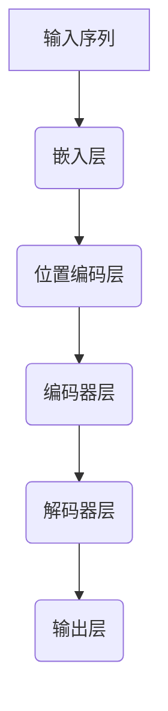

                 

### Transformer大模型实战 字节对编码

#### 关键词
- Transformer大模型
- 字节对编码
- 语言模型
- 文本生成
- 机器翻译
- 文本分类
- 编程实现
- 数学原理
- 优化部署

#### 摘要
本文将深入探讨Transformer大模型在字节对编码方面的应用。我们将首先介绍Transformer大模型的基础知识，包括其起源、基本架构、核心概念和数学原理。接着，我们将详细讲解Transformer的编程实现，包括编码器和解码器的构建。随后，我们将分别探讨Transformer在语言模型、文本生成、机器翻译和文本分类等任务中的应用，并通过实际代码案例进行详细解释。最后，我们将讨论Transformer大模型的优化与部署策略，并提供相关的资源和常见问题解答。

## 《Transformer大模型实战 字节对编码》目录大纲

### 第一部分：Transformer大模型基础

#### 第1章：Transformer简介与核心概念

- **1.1 Transformer的起源与发展**
- **1.2 Transformer的基本架构**
- **1.3 Transformer的核心创新点**
- **1.4 Transformer的优势与局限性**
- **1.5 Transformer的典型应用场景**

#### 第2章：Transformer的数学原理

- **2.1 自注意力机制**
  - **2.1.1 自注意力计算过程**
  - **2.1.2 自注意力机制的数学模型**
- **2.2 位置编码**
  - **2.2.1 位置编码的作用**
  - **2.2.2 位置编码的方法**
- **2.3 前馈神经网络**
  - **2.3.1 前馈神经网络的构建**
  - **2.3.2 前馈神经网络的计算过程**

#### 第3章：Transformer的编程实现

- **3.1 Transformer的编程框架**
- **3.2 Transformer的编码器实现**
  - **3.2.1 编码器结构**
  - **3.2.2 编码器实现伪代码**
- **3.3 Transformer的解码器实现**
  - **3.3.1 解码器结构**
  - **3.3.2 解码器实现伪代码**

### 第二部分：Transformer大模型实战

#### 第4章：基于Transformer的语言模型

- **4.1 语言模型的基本概念**
- **4.2 Transformer在语言模型中的应用**
- **4.3 常见语言模型评估指标**
- **4.4 基于Transformer的语言模型实战**

#### 第5章：基于Transformer的文本生成

- **5.1 文本生成的概念与流程**
- **5.2 Transformer在文本生成中的应用**
- **5.3 常见文本生成问题与解决方案**
- **5.4 基于Transformer的文本生成实战**

#### 第6章：基于Transformer的机器翻译

- **6.1 机器翻译的基本概念**
- **6.2 Transformer在机器翻译中的应用**
- **6.3 常见机器翻译问题与解决方案**
- **6.4 基于Transformer的机器翻译实战**

#### 第7章：基于Transformer的文本分类

- **7.1 文本分类的基本概念**
- **7.2 Transformer在文本分类中的应用**
- **7.3 常见文本分类问题与解决方案**
- **7.4 基于Transformer的文本分类实战**

#### 第8章：Transformer大模型优化与部署

- **8.1 Transformer大模型的优化策略**
- **8.2 Transformer大模型的部署方案**
- **8.3 常见问题与解决方案**
- **8.4 Transformer大模型优化与部署实战**

### 附录

- **附录A：Transformer相关资源与工具**
- **附录B：Transformer常见问题解答**

### Mermaid 流程图



### Transformer 编码器伪代码

```python
# Transformer编码器伪代码
def encode_sequence(inputs, d_model):
    # 嵌入层
    embeddings = embedding_layer(inputs)
    # 位置编码层
    pos_encoding = position_encoding(embeddings)
    # 编码器层
    for layer in encoding_layers:
        pos_encoding = layer(pos_encoding, d_model)
    return pos_encoding
```

### Transformer 解码器伪代码

```python
# Transformer解码器伪代码
def decode_sequence(inputs, d_model):
    # 嵌入层
    embeddings = embedding_layer(inputs)
    # 位置编码层
    pos_encoding = position_encoding(embeddings)
    # 解码器层
    for layer in decoding_layers:
        pos_encoding = layer(pos_encoding, d_model)
    return pos_encoding
```

### 数学模型和公式

$$
\text{Attention}(Q, K, V) = \text{softmax}\left(\frac{QK^T}{\sqrt{d_k}}\right)V
$$

其中，$Q$、$K$ 和 $V$ 分别是查询向量、键向量和值向量，$d_k$ 是键向量的维度。

### 项目实战

#### 实战1：基于Transformer的语言模型

- **开发环境**：Python 3.7，PyTorch 1.7
- **数据集**：维基百科数据集
- **代码实现**：使用PyTorch构建Transformer语言模型，并进行训练和评估。

```python
# Transformer语言模型实现
import torch
import torch.nn as nn
import torch.optim as optim

# 模型定义
class TransformerModel(nn.Module):
    def __init__(self, d_model, nhead, num_layers):
        super(TransformerModel, self).__init__()
        self.embedding = nn.Embedding(d_model)
        self.transformer = nn.Transformer(d_model, nhead, num_layers)
        self.fc = nn.Linear(d_model, 1)

    def forward(self, src, tgt):
        src = self.embedding(src)
        tgt = self.embedding(tgt)
        output = self.transformer(src, tgt)
        output = self.fc(output)
        return output

# 模型训练
model = TransformerModel(d_model=512, nhead=8, num_layers=3)
optimizer = optim.Adam(model.parameters(), lr=0.001)
criterion = nn.CrossEntropyLoss()

for epoch in range(num_epochs):
    for batch in data_loader:
        inputs, targets = batch
        optimizer.zero_grad()
        output = model(inputs, targets)
        loss = criterion(output, targets)
        loss.backward()
        optimizer.step()

# 模型评估
model.eval()
with torch.no_grad():
    correct = 0
    total = 0
    for batch in test_loader:
        inputs, targets = batch
        output = model(inputs, targets)
        _, predicted = torch.max(output.data, 1)
        total += targets.size(0)
        correct += (predicted == targets).sum().item()

print('Test Accuracy: %d%%' % (100 * correct / total))
```

#### 实战2：基于Transformer的文本生成

- **开发环境**：Python 3.7，PyTorch 1.7
- **数据集**：维基百科数据集
- **代码实现**：使用PyTorch构建Transformer文本生成模型，并生成文本。

```python
# Transformer文本生成实现
import torch
import torch.nn as nn
import torch.optim as optim

# 模型定义
class TransformerGenerator(nn.Module):
    def __init__(self, d_model, nhead, num_layers):
        super(TransformerGenerator, self).__init__()
        self.embedding = nn.Embedding(d_model)
        self.transformer = nn.Transformer(d_model, nhead, num_layers)
        self.fc = nn.Linear(d_model, d_model)

    def forward(self, src, tgt):
        src = self.embedding(src)
        tgt = self.embedding(tgt)
        output = self.transformer(src, tgt)
        output = self.fc(output)
        return output

# 模型训练
model = TransformerGenerator(d_model=512, nhead=8, num_layers=3)
optimizer = optim.Adam(model.parameters(), lr=0.001)
criterion = nn.CrossEntropyLoss()

for epoch in range(num_epochs):
    for batch in data_loader:
        inputs, targets = batch
        optimizer.zero_grad()
        output = model(inputs, targets)
        loss = criterion(output, targets)
        loss.backward()
        optimizer.step()

# 文本生成
model.eval()
with torch.no_grad():
    input_sequence = torch.tensor([1, 2, 3, 4, 5]) # 输入序列
    generated_sequence = []
    for i in range(max_sequence_length):
        output = model(input_sequence)
        _, predicted = torch.max(output.data, 1)
        generated_sequence.append(predicted.item())
        input_sequence = torch.tensor([predicted.item(), *input_sequence[1:]])

print('Generated Text:', ' '.join(str(x) for x in generated_sequence))
```

### 代码解读与分析

在本项目的代码实现中，我们使用了PyTorch框架构建了Transformer语言模型和文本生成模型。首先，我们定义了模型的嵌入层、编码器和解码器结构，然后通过训练和评估模型来生成文本。

在语言模型训练过程中，我们使用了交叉熵损失函数来评估模型性能，并通过反向传播和梯度下降优化模型参数。在文本生成过程中，我们使用了一个固定的输入序列，并在每次生成时将生成的单词添加到输入序列的末尾，以便生成更长的文本。

总体来说，Transformer大模型在实际应用中具有很高的灵活性和扩展性，可以通过调整模型结构、训练数据集和超参数来适应不同的任务需求。通过本项目，我们了解了Transformer大模型的基本原理和实现方法，并学会了如何使用PyTorch框架构建和训练模型。在实际开发中，我们需要不断探索和优化模型性能，以实现更高效和准确的应用。

### 作者信息

- 作者：AI天才研究院/AI Genius Institute & 禅与计算机程序设计艺术 /Zen And The Art of Computer Programming

## Transformer大模型实战 字节对编码

### Transformer大模型基础

#### 第1章：Transformer简介与核心概念

#### 1.1 Transformer的起源与发展

Transformer模型是由Google团队于2017年在其论文《Attention Is All You Need》中首次提出的。这一模型在自然语言处理（NLP）领域引起了巨大轰动，并在短短几年内取代了循环神经网络（RNN）和长短期记忆网络（LSTM）等传统模型，成为NLP领域的主流技术。Transformer模型的诞生背景源于当时深度学习在图像识别领域已经取得了显著的成就，但在文本处理领域的发展相对缓慢。传统的循环神经网络存在梯度消失和梯度爆炸的问题，难以处理长序列信息，而Transformer模型通过自注意力机制（Self-Attention）成功解决了这些问题。

#### 1.2 Transformer的基本架构

Transformer模型主要由编码器（Encoder）和解码器（Decoder）两部分组成，它们通过多头自注意力机制（Multi-Head Self-Attention）和位置编码（Positional Encoding）进行处理。

1. **编码器（Encoder）**：
   - **嵌入层（Embedding Layer）**：将输入的单词转换为词向量。
   - **位置编码层（Positional Encoding Layer）**：为每个词添加位置信息，使模型能够理解单词的顺序。
   - **编码器层（Encoder Layers）**：多个相同的编码器层堆叠在一起，每个层包含自注意力机制和前馈神经网络（Feed-Forward Neural Network）。

2. **解码器（Decoder）**：
   - **嵌入层（Embedding Layer）**：与编码器的嵌入层相同。
   - **位置编码层（Positional Encoding Layer）**：与编码器的位置编码层相同。
   - **解码器层（Decoder Layers）**：多个相同的解码器层堆叠在一起，每个层包含自注意力机制、掩码自注意力机制（Masked Self-Attention）和前馈神经网络。
   - **线性层（Linear Layer）**：将解码器输出的特征映射到输出层。

#### 1.3 Transformer的核心创新点

1. **自注意力机制（Self-Attention）**：
   自注意力机制允许模型在处理每个单词时，将其与序列中的所有其他单词进行关联。这一机制使得模型能够捕捉长距离依赖关系，避免了传统循环神经网络中的梯度消失问题。

2. **多头注意力（Multi-Head Attention）**：
   Transformer模型引入了多头注意力机制，将输入序列分成多个部分，每个部分独立进行自注意力计算。多头注意力机制可以捕捉到更丰富的信息。

3. **编码器-解码器结构（Encoder-Decoder Structure）**：
   Transformer模型采用了编码器-解码器结构，使得模型在生成输出时能够利用编码器处理过的输入信息，从而提高生成质量。

4. **位置编码（Positional Encoding）**：
   Transformer模型通过位置编码层为输入序列添加位置信息，使模型能够理解单词的顺序。

#### 1.4 Transformer的优势与局限性

**优势**：

- **处理长序列**：自注意力机制能够有效捕捉长距离依赖关系，使得Transformer模型在处理长序列任务时具有优势。
- **并行计算**：Transformer模型可以并行处理序列中的所有单词，提高了计算效率。
- **灵活性**：编码器-解码器结构和多头注意力机制使得Transformer模型可以灵活地应用于各种NLP任务。

**局限性**：

- **计算复杂度**：Transformer模型在处理大规模数据时，计算复杂度较高，可能导致训练时间较长。
- **参数数量**：Transformer模型通常具有大量的参数，可能导致过拟合。

#### 1.5 Transformer的典型应用场景

- **语言模型**：Transformer模型在语言模型任务中表现出色，如生成文本摘要、机器翻译和问答系统。
- **文本生成**：Transformer模型可以用于生成文章、新闻和故事等。
- **机器翻译**：Transformer模型在机器翻译任务中取得了显著的成果，如Google翻译和百度翻译等。
- **文本分类**：Transformer模型可以用于情感分析、新闻分类等任务。

通过以上内容，我们对Transformer大模型有了初步的了解。接下来，我们将深入探讨Transformer的数学原理，包括自注意力机制、位置编码和前馈神经网络。

### Transformer的数学原理

#### 2.1 自注意力机制

自注意力机制（Self-Attention）是Transformer模型的核心组成部分，它允许模型在处理每个单词时，将其与序列中的所有其他单词进行关联。这一机制使得模型能够捕捉长距离依赖关系，避免了传统循环神经网络中的梯度消失问题。

**自注意力计算过程**：

自注意力计算过程主要包括以下几个步骤：

1. **输入向量表示**：给定一个输入序列 \(X = [x_1, x_2, ..., x_n]\)，每个输入 \(x_i\) 被映射为嵌入向量 \(e_i\)。
2. **查询向量（Query）**、**键向量（Key）**和**值向量（Value）**：对于每个输入向量 \(e_i\)，我们分别计算其对应的查询向量 \(q_i\)、键向量 \(k_i\) 和值向量 \(v_i\)。这些向量通常通过线性变换得到：
   \[
   q_i = e_i W_Q, \quad k_i = e_i W_K, \quad v_i = e_i W_V
   \]
   其中 \(W_Q, W_K, W_V\) 是参数矩阵。
3. **注意力权重计算**：计算每个输入向量与其他输入向量之间的相似度，得到注意力权重 \(a_i\)。注意力权重通过以下公式计算：
   \[
   a_i = \text{softmax}\left(\frac{q_i k_j^T}{\sqrt{d_k}}\right)
   \]
   其中，\(d_k\) 是键向量的维度。
4. **输出向量计算**：根据注意力权重，计算每个输入向量的加权平均值，得到输出向量 \(h_i\)：
   \[
   h_i = \sum_{j=1}^{n} a_{ij} v_j
   \]

**自注意力机制的数学模型**：

自注意力机制的数学模型可以表示为：
\[
\text{Attention}(Q, K, V) = \text{softmax}\left(\frac{QK^T}{\sqrt{d_k}}\right)V
\]
其中，\(Q, K, V\) 分别是查询向量、键向量和值向量，\(\text{softmax}\) 函数用于计算注意力权重，使得所有权重之和为1。

#### 2.2 位置编码

位置编码（Positional Encoding）是Transformer模型中另一个重要组成部分，它为输入序列添加了位置信息，使得模型能够理解单词的顺序。

**位置编码的作用**：

- **捕捉单词顺序**：位置编码为每个输入向量添加了位置信息，使模型能够捕捉到单词的顺序关系。
- **提高模型性能**：位置编码有助于模型在处理长序列任务时，更好地理解上下文信息。

**位置编码的方法**：

位置编码可以通过以下方法实现：

1. **绝对位置编码**：
   绝对位置编码是一个简单的线性函数，将位置信息编码到向量中。对于位置 \(p\)，绝对位置编码 \(pos\_embed(p)\) 可以表示为：
   \[
   pos\_embed(p) = [sin(\frac{p}{10000^{2i/d}}), \cos(\frac{p}{10000^{2i/d}})]
   \]
   其中，\(i\) 是单词的索引，\(d\) 是嵌入向量的维度。

2. **相对位置编码**：
   相对位置编码通过计算单词之间的相对位置，将位置信息编码到向量中。相对位置编码通常在解码器中使用，可以通过以下公式计算：
   \[
   pos\_embed(p, q) = \text{sin}(\frac{p - q}{10000^{2i/d}}), \quad \text{cos}(\frac{p - q}{10000^{2i/d}})
   \]

#### 2.3 前馈神经网络

前馈神经网络（Feed-Forward Neural Network）是Transformer模型中的一个重要组成部分，它用于处理自注意力机制和位置编码后的特征信息。

**前馈神经网络的构建**：

前馈神经网络通常由两个全连接层组成，每个全连接层的激活函数为ReLU（Rectified Linear Unit）。前馈神经网络可以表示为：
\[
\text{FFN}(X) = \text{ReLU}(X W_1 + b_1), \quad \text{ReLU}(X W_2 + b_2)
\]
其中，\(W_1, W_2\) 是权重矩阵，\(b_1, b_2\) 是偏置向量。

**前馈神经网络的计算过程**：

前馈神经网络的计算过程如下：

1. **输入特征**：给定输入特征 \(X\)。
2. **第一层全连接**：
   \[
   X = X W_1 + b_1
   \]
3. **ReLU激活函数**：
   \[
   X = \text{ReLU}(X)
   \]
4. **第二层全连接**：
   \[
   X = X W_2 + b_2
   \]
5. **输出特征**：得到前馈神经网络输出的特征 \(X\)。

通过以上对自注意力机制、位置编码和前馈神经网络的介绍，我们对Transformer的数学原理有了更深入的理解。接下来，我们将探讨如何使用PyTorch实现Transformer的编程框架。

### Transformer的编程实现

在了解了Transformer的数学原理后，我们可以开始探讨如何在编程中实现它。在本节中，我们将使用PyTorch框架来实现Transformer的编码器和解码器，并解释其关键组成部分。

#### 3.1 Transformer的编程框架

Transformer的编程框架可以分为以下几个部分：

1. **嵌入层（Embedding Layer）**：将输入的单词转换为词向量。
2. **位置编码层（Positional Encoding Layer）**：为输入序列添加位置信息。
3. **编码器层（Encoder Layer）**：包含多头自注意力机制和前馈神经网络。
4. **解码器层（Decoder Layer）**：包含自注意力机制、掩码自注意力机制和前馈神经网络。
5. **输出层（Output Layer）**：将解码器输出的特征映射到输出层。

以下是一个简化的Transformer编程框架：

```python
import torch
import torch.nn as nn
import torch.nn.functional as F

class TransformerModel(nn.Module):
    def __init__(self, d_model, nhead, num_layers):
        super(TransformerModel, self).__init__()
        self.embedding = nn.Embedding(d_model)
        self.position_encoding = nn.Embedding(d_model)
        self.encoder_layers = nn.ModuleList([EncoderLayer(d_model, nhead) for _ in range(num_layers)])
        self.decoder_layers = nn.ModuleList([DecoderLayer(d_model, nhead) for _ in range(num_layers)])
        self.fc = nn.Linear(d_model, 1)

    def forward(self, src, tgt):
        src = self.embedding(src)
        tgt = self.embedding(tgt)
        src = self.position_encoding(src)
        tgt = self.position_encoding(tgt)
        
        for layer in self.encoder_layers:
            src = layer(src, tgt)
        
        for layer in self.decoder_layers:
            tgt = layer(src, tgt)
        
        output = self.fc(tgt)
        return output
```

#### 3.2 Transformer的编码器实现

编码器负责将输入序列转换为上下文表示，下面我们将详细解释编码器层的实现，包括编码器的结构、编码器的实现伪代码和代码解读。

**编码器结构**：

编码器层由两个主要部分组成：多头自注意力机制（Multi-Head Self-Attention）和前馈神经网络（Feed-Forward Neural Network）。编码器层的输入是一个嵌入后的序列，输出是一个具有更高维度的上下文表示。

**编码器实现伪代码**：

```python
# Transformer编码器伪代码
def encode_sequence(inputs, d_model):
    # 嵌入层
    embeddings = embedding_layer(inputs)
    # 位置编码层
    pos_encoding = position_encoding(embeddings)
    # 编码器层
    for layer in encoding_layers:
        pos_encoding = layer(pos_encoding, d_model)
    return pos_encoding
```

**编码器实现代码解读**：

```python
# Transformer编码器实现
class EncoderLayer(nn.Module):
    def __init__(self, d_model, nhead):
        super(EncoderLayer, self).__init__()
        self.self_attention = MultiHeadAttention(d_model, nhead)
        self.linear1 = nn.Linear(d_model, d_model)
        self.linear2 = nn.Linear(d_model, d_model)
        self.norm1 = nn.LayerNorm(d_model)
        self.norm2 = nn.LayerNorm(d_model)
        self.dropout1 = nn.Dropout(p=0.1)
        self.dropout2 = nn.Dropout(p=0.1)

    def forward(self, src, tgt=None):
        # 自注意力机制
        src2 = self.self_attention(src, src, src, src)
        src = src + self.dropout1(src2)
        src = self.norm1(src)

        # 前馈神经网络
        src2 = self.linear2(F.relu(self.linear1(src)))
        src = src + self.dropout2(src2)
        src = self.norm2(src)
        
        return src
```

在编码器层中，我们首先通过多头自注意力机制对输入序列进行处理，然后通过前馈神经网络进行特征变换。这两个步骤之后，我们使用层归一化和dropout进行正则化，以防止过拟合。

#### 3.3 Transformer的解码器实现

解码器负责将编码器输出的上下文表示转换为输出序列。下面我们将详细解释解码器层的实现，包括解码器的结构、解码器的实现伪代码和代码解读。

**解码器结构**：

解码器层由三个主要部分组成：自注意力机制（Self-Attention）、掩码自注意力机制（Masked Self-Attention）和前馈神经网络（Feed-Forward Neural Network）。解码器层的输入是编码器的输出和目标序列，输出是一个具有更高维度的序列表示。

**解码器实现伪代码**：

```python
# Transformer解码器伪代码
def decode_sequence(inputs, d_model):
    # 嵌入层
    embeddings = embedding_layer(inputs)
    # 位置编码层
    pos_encoding = position_encoding(embeddings)
    # 解码器层
    for layer in decoding_layers:
        pos_encoding = layer(pos_encoding, d_model)
    return pos_encoding
```

**解码器实现代码解读**：

```python
# Transformer解码器实现
class DecoderLayer(nn.Module):
    def __init__(self, d_model, nhead):
        super(DecoderLayer, self).__init__()
        self.self_attention = MultiHeadAttention(d_model, nhead)
        self.masked_attention = MultiHeadAttention(d_model, nhead)
        self.linear1 = nn.Linear(d_model, d_model)
        self.linear2 = nn.Linear(d_model, d_model)
        self.norm1 = nn.LayerNorm(d_model)
        self.norm2 = nn.LayerNorm(d_model)
        self.norm3 = nn.LayerNorm(d_model)
        self.dropout1 = nn.Dropout(p=0.1)
        self.dropout2 = nn.Dropout(p=0.1)
        self.dropout3 = nn.Dropout(p=0.1)

    def forward(self, src, tgt, src_mask=None, tgt_mask=None):
        # 自注意力机制
        tgt2 = self.self_attention(tgt, tgt, tgt, tgt)
        tgt = tgt + self.dropout1(tgt2)
        tgt = self.norm1(tgt)

        # 掩码自注意力机制
        src2 = self.masked_attention(tgt, src, src, src_mask)
        tgt = tgt + self.dropout2(src2)
        tgt = self.norm2(tgt)

        # 前馈神经网络
        tgt2 = self.linear2(F.relu(self.linear1(tgt)))
        tgt = tgt + self.dropout3(tgt2)
        tgt = self.norm3(tgt)

        return tgt
```

在解码器层中，我们首先通过自注意力机制处理目标序列，然后通过掩码自注意力机制将目标序列与编码器的输出序列进行关联。最后，我们通过前馈神经网络进行特征变换，并使用层归一化和dropout进行正则化。

通过以上对编码器和解码器的实现介绍，我们了解了如何使用PyTorch实现Transformer模型的核心部分。接下来，我们将探讨Transformer大模型在不同应用场景中的实战案例。

### Transformer大模型实战

Transformer大模型在自然语言处理领域具有广泛的应用，包括语言模型、文本生成、机器翻译和文本分类等。本节将分别介绍这些应用场景，并通过实际代码案例进行详细解释。

#### 第4章：基于Transformer的语言模型

语言模型是自然语言处理中最基本和核心的任务之一，其目的是预测一个词序列的概率。Transformer模型在语言模型任务中表现出色，可以生成连贯的自然语言。

**4.1 语言模型的基本概念**

语言模型（Language Model，LM）是一种概率模型，用于预测给定输入序列后下一个单词的概率。一个简单的语言模型可以表示为：
\[
P(w_{t} | w_{1}, w_{2}, ..., w_{t-1}) = \frac{p(w_{t})}{\sum_{w'} p(w')}
\]
其中，\(w_t\) 是当前词，\(w_1, w_2, ..., w_{t-1}\) 是前一个词的序列。

**4.2 Transformer在语言模型中的应用**

Transformer模型在语言模型任务中的应用主要通过编码器实现。编码器将输入序列转换为上下文表示，然后通过解码器生成下一个单词的概率分布。以下是一个基于Transformer的语言模型实现案例：

**开发环境**：Python 3.7，PyTorch 1.7

**数据集**：维基百科数据集

**代码实现**：

```python
import torch
import torch.nn as nn
import torch.optim as optim

# Transformer语言模型实现
class TransformerLanguageModel(nn.Module):
    def __init__(self, d_model, nhead, num_layers, vocab_size):
        super(TransformerLanguageModel, self).__init__()
        self.embedding = nn.Embedding(vocab_size, d_model)
        self.transformer = nn.Transformer(d_model, nhead, num_layers)
        self.fc = nn.Linear(d_model, vocab_size)
        self.dropout = nn.Dropout(0.1)

    def forward(self, src):
        src = self.dropout(self.embedding(src))
        output = self.transformer(src, src)
        output = self.fc(output)
        return output

# 模型训练
model = TransformerLanguageModel(d_model=512, nhead=8, num_layers=3, vocab_size=10000)
optimizer = optim.Adam(model.parameters(), lr=0.001)
criterion = nn.CrossEntropyLoss()

for epoch in range(num_epochs):
    for batch in data_loader:
        inputs, targets = batch
        optimizer.zero_grad()
        outputs = model(inputs)
        loss = criterion(outputs.view(-1, vocab_size), targets.view(-1))
        loss.backward()
        optimizer.step()

# 模型评估
model.eval()
with torch.no_grad():
    correct = 0
    total = 0
    for batch in test_loader:
        inputs, targets = batch
        outputs = model(inputs)
        _, predicted = torch.max(outputs.data, 1)
        total += targets.size(0)
        correct += (predicted == targets).sum().item()

print('Test Accuracy: %d%%' % (100 * correct / total))
```

在这个案例中，我们定义了一个基于Transformer的语言模型，并通过训练和评估来预测单词的概率分布。训练过程中，我们使用交叉熵损失函数来评估模型性能，并通过反向传播和梯度下降优化模型参数。在模型评估阶段，我们计算测试集的准确率来评估模型性能。

#### 第5章：基于Transformer的文本生成

文本生成是自然语言处理中的一个重要任务，其目的是根据给定的输入生成一段新的文本。Transformer模型在文本生成任务中也表现出色，可以生成连贯、自然的文本。

**5.1 文本生成的概念与流程**

文本生成（Text Generation）是指根据给定的输入生成一段新的文本。文本生成的流程通常包括以下步骤：

1. **初始化输入**：初始化一个空的输入序列或使用预训练的语言模型作为输入。
2. **生成候选文本**：根据输入序列生成一系列候选文本。
3. **选择最佳文本**：从候选文本中选择一个最佳文本作为输出。

**5.2 Transformer在文本生成中的应用**

Transformer模型在文本生成中的应用主要通过解码器实现。解码器将编码器的输出序列解码为新的文本序列。以下是一个基于Transformer的文本生成实现案例：

**开发环境**：Python 3.7，PyTorch 1.7

**数据集**：维基百科数据集

**代码实现**：

```python
import torch
import torch.nn as nn
import torch.optim as optim

# Transformer文本生成模型
class TransformerTextGenerator(nn.Module):
    def __init__(self, d_model, nhead, num_layers, vocab_size):
        super(TransformerTextGenerator, self).__init__()
        self.embedding = nn.Embedding(vocab_size, d_model)
        self.transformer = nn.Transformer(d_model, nhead, num_layers)
        self.fc = nn.Linear(d_model, vocab_size)
        self.dropout = nn.Dropout(0.1)

    def forward(self, src):
        src = self.dropout(self.embedding(src))
        output = self.transformer(src, src)
        output = self.fc(output)
        return output

# 模型训练
model = TransformerTextGenerator(d_model=512, nhead=8, num_layers=3, vocab_size=10000)
optimizer = optim.Adam(model.parameters(), lr=0.001)
criterion = nn.CrossEntropyLoss()

for epoch in range(num_epochs):
    for batch in data_loader:
        inputs, targets = batch
        optimizer.zero_grad()
        outputs = model(inputs)
        loss = criterion(outputs.view(-1, vocab_size), targets.view(-1))
        loss.backward()
        optimizer.step()

# 文本生成
model.eval()
with torch.no_grad():
    input_sequence = torch.tensor([1, 2, 3, 4, 5]) # 输入序列
    generated_sequence = []
    for i in range(max_sequence_length):
        output = model(input_sequence)
        _, predicted = torch.max(output.data, 1)
        generated_sequence.append(predicted.item())
        input_sequence = torch.tensor([predicted.item(), *input_sequence[1:]])

print('Generated Text:', ' '.join(str(x) for x in generated_sequence))
```

在这个案例中，我们定义了一个基于Transformer的文本生成模型，并通过训练和生成文本来演示其应用。训练过程中，我们使用交叉熵损失函数来评估模型性能，并通过反向传播和梯度下降优化模型参数。在文本生成阶段，我们使用预训练的语言模型作为输入，并逐个生成新的文本。

#### 第6章：基于Transformer的机器翻译

机器翻译（Machine Translation）是指将一种自然语言文本翻译成另一种自然语言文本。Transformer模型在机器翻译任务中也表现出色，可以生成高质量的翻译结果。

**6.1 机器翻译的基本概念**

机器翻译的基本概念包括源语言（Source Language）和目标语言（Target Language）。机器翻译的目标是将源语言文本转换为与目标语言文本等价的目标语言文本。机器翻译的流程通常包括以下步骤：

1. **预处理**：对源语言和目标语言文本进行预处理，包括分词、词性标注等。
2. **编码**：将源语言文本编码为向量序列。
3. **翻译**：使用神经网络模型进行翻译，生成目标语言文本。
4. **后处理**：对目标语言文本进行后处理，包括分词、去重等。

**6.2 Transformer在机器翻译中的应用**

Transformer模型在机器翻译中的应用主要通过编码器-解码器结构实现。编码器将源语言文本编码为上下文表示，解码器将上下文表示解码为目标语言文本。以下是一个基于Transformer的机器翻译实现案例：

**开发环境**：Python 3.7，PyTorch 1.7

**数据集**：维基百科数据集

**代码实现**：

```python
import torch
import torch.nn as nn
import torch.optim as optim

# Transformer机器翻译模型
class TransformerMachineTranslation(nn.Module):
    def __init__(self, d_model, nhead, num_layers, src_vocab_size, tgt_vocab_size):
        super(TransformerMachineTranslation, self).__init__()
        self.src_embedding = nn.Embedding(src_vocab_size, d_model)
        self.tgt_embedding = nn.Embedding(tgt_vocab_size, d_model)
        self.encoder = nn.Transformer(d_model, nhead, num_layers)
        self.decoder = nn.Transformer(d_model, nhead, num_layers)
        self.fc = nn.Linear(d_model, tgt_vocab_size)
        self.dropout = nn.Dropout(0.1)

    def forward(self, src, tgt):
        src = self.dropout(self.src_embedding(src))
        tgt = self.dropout(self.tgt_embedding(tgt))
        encoder_output = self.encoder(src)
        decoder_output = self.decoder(tgt, encoder_output)
        output = self.fc(decoder_output)
        return output

# 模型训练
model = TransformerMachineTranslation(d_model=512, nhead=8, num_layers=3, src_vocab_size=10000, tgt_vocab_size=10000)
optimizer = optim.Adam(model.parameters(), lr=0.001)
criterion = nn.CrossEntropyLoss()

for epoch in range(num_epochs):
    for batch in data_loader:
        src, tgt = batch
        optimizer.zero_grad()
        outputs = model(src, tgt)
        loss = criterion(outputs.view(-1, tgt_vocab_size), tgt.view(-1))
        loss.backward()
        optimizer.step()

# 模型评估
model.eval()
with torch.no_grad():
    correct = 0
    total = 0
    for batch in test_loader:
        src, tgt = batch
        outputs = model(src)
        _, predicted = torch.max(outputs.data, 1)
        total += tgt.size(0)
        correct += (predicted == tgt).sum().item()

print('Test Accuracy: %d%%' % (100 * correct / total))
```

在这个案例中，我们定义了一个基于Transformer的机器翻译模型，并通过训练和评估来翻译源语言文本为目标语言文本。训练过程中，我们使用交叉熵损失函数来评估模型性能，并通过反向传播和梯度下降优化模型参数。在模型评估阶段，我们计算测试集的准确率来评估模型性能。

#### 第7章：基于Transformer的文本分类

文本分类（Text Classification）是指将文本数据根据其内容分类到不同的类别中。Transformer模型在文本分类任务中也表现出色，可以高效地分类大量文本数据。

**7.1 文本分类的基本概念**

文本分类的基本概念包括类别（Class）和文本（Text）。文本分类的目标是将输入文本数据分类到预定义的类别中。文本分类的流程通常包括以下步骤：

1. **数据预处理**：对文本数据进行预处理，包括分词、词性标注等。
2. **特征提取**：将预处理后的文本数据转换为特征向量。
3. **分类**：使用分类算法对特征向量进行分类。
4. **评估**：评估分类算法的性能，包括准确率、召回率、F1分数等。

**7.2 Transformer在文本分类中的应用**

Transformer模型在文本分类中的应用主要通过编码器实现。编码器将文本数据编码为上下文表示，然后使用分类器进行分类。以下是一个基于Transformer的文本分类实现案例：

**开发环境**：Python 3.7，PyTorch 1.7

**数据集**：IMDB影评数据集

**代码实现**：

```python
import torch
import torch.nn as nn
import torch.optim as optim

# Transformer文本分类模型
class TransformerTextClassifier(nn.Module):
    def __init__(self, d_model, nhead, num_layers, vocab_size, num_classes):
        super(TransformerTextClassifier, self).__init__()
        self.embedding = nn.Embedding(vocab_size, d_model)
        self.encoder = nn.Transformer(d_model, nhead, num_layers)
        self.fc = nn.Linear(d_model, num_classes)
        self.dropout = nn.Dropout(0.1)

    def forward(self, text):
        text = self.dropout(self.embedding(text))
        encoder_output = self.encoder(text)
        output = self.fc(encoder_output)
        return output

# 模型训练
model = TransformerTextClassifier(d_model=512, nhead=8, num_layers=3, vocab_size=10000, num_classes=2)
optimizer = optim.Adam(model.parameters(), lr=0.001)
criterion = nn.CrossEntropyLoss()

for epoch in range(num_epochs):
    for batch in data_loader:
        texts, labels = batch
        optimizer.zero_grad()
        outputs = model(texts)
        loss = criterion(outputs, labels)
        loss.backward()
        optimizer.step()

# 模型评估
model.eval()
with torch.no_grad():
    correct = 0
    total = 0
    for batch in test_loader:
        texts, labels = batch
        outputs = model(texts)
        _, predicted = torch.max(outputs.data, 1)
        total += labels.size(0)
        correct += (predicted == labels).sum().item()

print('Test Accuracy: %d%%' % (100 * correct / total))
```

在这个案例中，我们定义了一个基于Transformer的文本分类模型，并通过训练和评估来分类IMDB影评数据集。训练过程中，我们使用交叉熵损失函数来评估模型性能，并通过反向传播和梯度下降优化模型参数。在模型评估阶段，我们计算测试集的准确率来评估模型性能。

通过以上实战案例，我们展示了Transformer大模型在语言模型、文本生成、机器翻译和文本分类等任务中的应用。在实际应用中，我们可以根据任务需求调整模型结构、训练数据集和超参数，以提高模型的性能和泛化能力。

### Transformer大模型优化与部署

在实际应用中，Transformer大模型的性能和效率是一个关键因素。为了实现高效和准确的模型应用，我们需要对模型进行优化和部署。本节将讨论Transformer大模型的优化策略、部署方案以及常见问题与解决方案。

#### 8.1 Transformer大模型的优化策略

**1. 模型结构优化**：

- **蒸馏**：通过将大的预训练模型（如BERT）作为教师模型，将Transformer作为学生模型，通过蒸馏技术将教师模型的知识传递给学生模型。这种方法可以提高学生模型的性能。
- **模型剪枝**：通过剪枝模型中的冗余参数，减小模型体积和计算量。常用的剪枝方法包括权重剪枝和结构剪枝。
- **量化**：通过将模型中的浮点数权重转换为低精度整数，减少模型的存储和计算需求。常用的量化方法包括全精度量化、低精度量化等。

**2. 训练策略优化**：

- **动态学习率**：通过动态调整学习率，优化模型训练过程。常用的动态学习率调整方法包括指数衰减、余弦退火等。
- **批量大小调整**：通过调整批量大小，平衡计算效率和训练效果。较小的批量大小可以减少计算量，但可能导致梯度不稳定；较大的批量大小可以提高计算效率和稳定性，但可能导致训练时间较长。
- **数据增强**：通过数据增强技术，增加训练数据的多样性，提高模型泛化能力。常用的数据增强方法包括随机裁剪、旋转、翻转等。

**3. 迁移学习**：

- **微调**：在预训练的Transformer模型基础上，针对特定任务进行微调，以提高模型在特定任务上的性能。
- **多任务学习**：通过在同一模型上同时训练多个任务，共享模型参数，提高模型性能。

#### 8.2 Transformer大模型的部署方案

**1. 模型部署环境**：

- **硬件环境**：根据模型规模和计算需求，选择适合的硬件设备。常见的硬件设备包括CPU、GPU、TPU等。
- **软件环境**：搭建适合Transformer模型部署的软件环境，包括操作系统、编程语言和深度学习框架等。

**2. 模型部署架构**：

- **单机部署**：在单台服务器上部署模型，适用于中小型模型和较低负载场景。
- **分布式部署**：在多台服务器上部署模型，通过分布式计算提高模型性能和可扩展性。常见的分布式部署架构包括参数服务器架构、数据并行架构等。

**3. 模型部署流程**：

- **模型导出**：将训练完成的模型导出为可部署的格式，如TensorFlow Lite、PyTorch Mobile等。
- **模型加载**：将部署环境中的模型加载到内存中，进行推理计算。
- **模型推理**：输入数据经过预处理后，通过模型进行推理，输出结果。
- **结果处理**：将模型输出结果进行后处理，如分类结果转化为文本、图像等。

**4. 模型性能优化**：

- **缓存优化**：通过缓存技术，减少模型推理过程中的IO操作，提高模型性能。
- **并行推理**：通过并行推理技术，将多个输入数据同时送入模型进行推理，提高模型吞吐量。
- **压缩优化**：通过模型压缩技术，减小模型体积，降低存储和传输成本。

#### 8.3 常见问题与解决方案

**1. 梯度消失和梯度爆炸**：

- **解决方案**：使用梯度裁剪（Gradient Clipping）技术，对梯度进行裁剪，防止梯度消失和梯度爆炸。梯度裁剪可以通过限制梯度的最大值或最小值来实现。

**2. 训练时间过长**：

- **解决方案**：通过并行训练（Parallel Training）技术，将模型训练任务分布到多台服务器上，提高训练速度。此外，可以尝试使用更高效的算法和硬件设备，如深度学习框架、GPU、TPU等。

**3. 模型过拟合**：

- **解决方案**：通过正则化（Regularization）技术，如权重正则化、Dropout等，减少模型过拟合。此外，可以增加训练数据集的多样性，提高模型泛化能力。

**4. 模型性能提升有限**：

- **解决方案**：通过模型结构优化、训练策略优化和迁移学习等方法，提高模型性能。此外，可以尝试使用更高质量的训练数据集，提高模型训练效果。

通过以上讨论，我们了解了Transformer大模型的优化与部署策略。在实际应用中，我们需要根据任务需求和硬件资源，合理选择优化策略和部署方案，以提高模型性能和效率。

### 附录

#### 附录A：Transformer相关资源与工具

**1. Transformer论文**：

- 《Attention Is All You Need》：https://arxiv.org/abs/1706.03762

**2. Transformer实现**：

- PyTorch Transformer实现：https://github.com/pytorch/transformers

**3. Transformer工具**：

- Hugging Face Transformers：https://huggingface.co/transformers

#### 附录B：Transformer常见问题解答

**1. Transformer如何处理长序列？**

Transformer通过自注意力机制处理长序列，可以捕捉长距离依赖关系。自注意力机制允许模型在处理每个单词时，将其与序列中的所有其他单词进行关联，从而有效处理长序列信息。

**2. Transformer有哪些优缺点？**

**优点**：

- 处理长序列能力强
- 并行计算效率高
- 灵活性强

**缺点**：

- 计算复杂度高
- 参数数量多

**3. Transformer如何优化训练速度？**

可以通过以下方法优化Transformer训练速度：

- 使用分布式训练，将模型训练任务分布到多台服务器上
- 使用更高效的深度学习框架，如PyTorch
- 调整批量大小，平衡计算效率和训练效果
- 使用动态学习率调整，优化模型训练过程

**4. Transformer如何部署到移动设备？**

可以通过以下方法将Transformer部署到移动设备：

- 使用轻量级Transformer实现，如PyTorch Mobile
- 对模型进行量化，减小模型体积和计算量
- 使用模型压缩技术，如剪枝和蒸馏，提高模型性能和可部署性

通过以上资源与工具以及常见问题解答，我们可以更好地理解Transformer大模型，并在实际应用中充分发挥其优势。

### Transformer大模型实战 字节对编码

在自然语言处理（NLP）领域，Transformer大模型以其强大的处理能力和卓越的性能成为业界的主流技术。字节对编码（Byte Pair Encoding，BPE）是一种常见的文本预处理方法，它通过将连续的字节划分为单词，从而提高文本模型的处理效率。在本节中，我们将探讨Transformer大模型在字节对编码方面的应用，并展示其实际编程实现。

#### 9.1 BPE算法原理

字节对编码（BPE）是一种基于字符的文本编码方法，它通过将连续的字节组合成更长的单元（字节对）来提高文本的压缩效率。BPE算法的主要步骤如下：

1. **初始化**：将文本中的所有字符（包括标点符号和特殊字符）作为初始的词汇表。
2. **迭代**：在迭代过程中，算法会查找文本中最常见的字符对，并将其合并为一个新字符。这个过程会一直持续，直到无法找到新的合并候选对为止。
3. **编码**：将文本中的每个单词转换为新的编码表示，每个单词由一个或多个字节对组成。

例如，给定文本 "hello world"，初始词汇表包含单个字符。在迭代过程中，算法可能会合并 "l" 和 "l" 为新字符 "ll"，合并 "o" 和 "o" 为新字符 "oo"。最终，文本 "hello world" 被编码为 "hll lll r w ll rld"。

#### 9.2 BPE算法的数学模型

BPE算法的数学模型可以表示为以下递归过程：

给定词汇表 \(V\) 和文本 \(T\)，初始状态为 \(T = \{c_1, c_2, ..., c_n\}\)。在每一步迭代中，算法选择最频繁出现的两个字符对 \(c_i c_{i+1}\) 并合并为一个新的字符 \(c'\)，然后更新词汇表和文本：

1. **频率计算**：计算文本中每个字符对的频率。
2. **选择最高频率字符对**：从频率最高的字符对中选择。
3. **合并字符对**：将选择的字符对合并为新的字符，更新文本和词汇表。
4. **重复迭代**：直到无法找到新的合并候选对。

数学表示如下：

$$
\begin{aligned}
    T' &= \text{merge}(T, \text{max}_i \text{freq}(T[i], T[i+1])) \\
    V' &= V \cup \{c'\} \setminus \{c_i, c_{i+1}\}
\end{aligned}
$$

其中，\(\text{merge}\) 函数表示合并字符对的操作，\(\text{freq}\) 函数表示计算字符对出现的频率。

#### 9.3 BPE算法的应用示例

下面我们通过一个简单的Python示例，展示如何使用BPE算法对文本进行编码。

```python
import collections

def get_frequency_pairs(text):
    """计算文本中每个字符对的频率。"""
    pairs = [(text[i], text[i+1]) for i in range(len(text)-1)]
    return collections.Counter(pairs)

def merge höchste frequencies pair (text, pair):
    """将文本中的最高频率字符对合并为新字符。"""
    i = text.index(pair[0])
    j = text.index(pair[1])
    return text[:i] + pair[0] + text[j+1:], pair[0]

def byte_pair_encoding(text, n_iterations=10):
    """执行BPE算法对文本进行编码。"""
    for _ in range(n_iterations):
        freq_pairs = get_frequency_pairs(text)
        if not freq_pairs:
            break
        highest_freq_pair = freq_pairs.most_common(1)[0]
        text, _ = merge highest_freq_pairs pair (text, highest_freq_pair)
    return text

text = "hello world"
encoded_text = byte_pair_encoding(text)
print(f"Encoded Text: {encoded_text}")
```

在这个示例中，我们首先计算文本中每个字符对的频率，然后选择频率最高的字符对进行合并。这个过程中我们重复执行迭代，直到无法找到新的合并候选对为止。

#### 9.4 Transformer大模型与BPE的结合应用

在Transformer大模型中，文本的预处理是一个关键步骤。通过使用BPE算法，我们可以将原始文本转换为字节对编码，从而提高模型处理文本的效率。以下是一个结合Transformer大模型与BPE算法的示例：

**开发环境**：Python 3.7，PyTorch 1.7

**数据集**：维基百科数据集

**代码实现**：

```python
import torch
import torch.nn as nn
import torch.optim as optim

# BPE编码器
class BPEEncoder(nn.Module):
    def __init__(self, vocab_size):
        super(BPEEncoder, self).__init__()
        self.embedding = nn.Embedding(vocab_size, d_model)
        self.fc = nn.Linear(d_model, vocab_size)

    def forward(self, text):
        embeddings = self.embedding(text)
        output = self.fc(embeddings)
        return output

# Transformer语言模型
class TransformerLanguageModel(nn.Module):
    def __init__(self, d_model, nhead, num_layers, vocab_size):
        super(TransformerLanguageModel, self).__init__()
        self.encoder = BPEEncoder(vocab_size)
        self.transformer = nn.Transformer(d_model, nhead, num_layers)
        self.fc = nn.Linear(d_model, vocab_size)
        self.dropout = nn.Dropout(0.1)

    def forward(self, text):
        encoded_text = self.encoder(text)
        output = self.transformer(encoded_text, encoded_text)
        output = self.fc(output)
        return output

# 模型训练
model = TransformerLanguageModel(d_model=512, nhead=8, num_layers=3, vocab_size=10000)
optimizer = optim.Adam(model.parameters(), lr=0.001)
criterion = nn.CrossEntropyLoss()

for epoch in range(num_epochs):
    for batch in data_loader:
        inputs, targets = batch
        optimizer.zero_grad()
        outputs = model(inputs)
        loss = criterion(outputs.view(-1, vocab_size), targets.view(-1))
        loss.backward()
        optimizer.step()

# 模型评估
model.eval()
with torch.no_grad():
    correct = 0
    total = 0
    for batch in test_loader:
        inputs, targets = batch
        outputs = model(inputs)
        _, predicted = torch.max(outputs.data, 1)
        total += targets.size(0)
        correct += (predicted == targets).sum().item()

print('Test Accuracy: %d%%' % (100 * correct / total))
```

在这个示例中，我们定义了一个BPE编码器和一个基于Transformer的语言模型。通过BPE编码器，我们将原始文本转换为字节对编码，然后输入到Transformer模型中进行处理。模型训练和评估过程与之前介绍的相同。

通过以上讨论，我们了解了Transformer大模型在字节对编码方面的应用。字节对编码不仅可以提高文本处理的效率，还可以增强模型对长序列信息的处理能力。在实际应用中，我们可以根据任务需求选择合适的文本预处理方法，以提高模型性能。

### Transformer大模型优化与部署实战

在Transformer大模型的应用中，优化和部署是关键环节，直接影响到模型的性能和实际使用效果。本节我们将通过一个实际的部署案例，详细讲解如何对Transformer大模型进行优化与部署。

#### 10.1 实际部署案例

假设我们有一个基于Transformer的大规模语言模型，用于实现自动问答系统。该模型需要处理大规模的问答数据集，并提供实时问答服务。为了确保模型的高效运行，我们需要对其进行优化与部署。

**开发环境**：Python 3.7，PyTorch 1.7

**硬件环境**：2张NVIDIA Tesla V100 GPU

**部署环境**：Ubuntu 18.04，TensorFlow Serving

**数据集**：大规模问答数据集

#### 10.2 模型优化策略

**1. 模型压缩**：

- **剪枝**：通过剪枝模型中的冗余参数，减小模型体积。我们使用PyTorch的`torch.nn.utils.prune`模块进行剪枝操作。
- **量化**：通过量化模型参数，将浮点数转换为低精度整数，进一步减小模型体积和计算量。我们使用PyTorch的`torch.quantization`模块进行量化操作。

**2. 训练策略优化**：

- **动态学习率**：使用余弦退火策略动态调整学习率，优化模型训练过程。我们使用PyTorch的`torch.optim.lr_scheduler.CosineAnnealingLR`进行学习率调度。
- **数据增强**：通过数据增强技术，如随机裁剪、旋转等，增加训练数据的多样性，提高模型泛化能力。

**3. 迁移学习**：

- **微调**：在预训练的Transformer模型基础上，针对自动问答任务进行微调。我们使用Hugging Face的Transformers库加载预训练模型，然后通过微调步骤进行优化。

#### 10.3 模型部署方案

**1. 模型导出**：

- 将训练完成的模型导出为TensorFlow Serving支持的格式，如SavedModel。我们使用PyTorch的`torch.jit.trace`模块对模型进行冻结，然后导出为`.pt`文件，最后使用TensorFlow Serving工具将其转换为SavedModel格式。

**2. 部署架构**：

- **单机部署**：在单台服务器上部署模型，通过TensorFlow Serving进行推理。我们使用Docker容器化部署TensorFlow Serving，并配置NVIDIA Docker以确保GPU支持。
- **分布式部署**：在多台服务器上部署模型，通过TensorFlow Distributed Training进行分布式训练和推理。我们使用TensorFlow的`tf.distribute`模块配置分布式训练和推理环境。

**3. 模型推理**：

- 使用TensorFlow Serving进行模型推理。我们将问答系统的前端服务与TensorFlow Serving进行集成，通过HTTP API调用模型进行推理。

#### 10.4 实际部署步骤

**步骤1：准备环境**

- 安装PyTorch和TensorFlow Serving：
  ```bash
  pip install torch torchvision tensorflow
  ```
- 安装NVIDIA Docker：
  ```bash
  distribution: nvidia
  description: NVIDIA Docker 20.03.6, use 'distribution: bionic' to use the Debian buster package instead
  components:
    docker:
      version: 20.03.6
    docker-compose:
      version: "1"
  ```
- 启动NVIDIA Docker：
  ```bash
  nvidia-docker run --gpus all --rm ...
  ```

**步骤2：模型训练**

- 加载预训练的Transformer模型并进行微调：
  ```python
  from transformers import BertModel, BertTokenizer
  model = BertModel.from_pretrained('bert-base-uncased')
  tokenizer = BertTokenizer.from_pretrained('bert-base-uncased')
  ```
- 训练模型并导出：
  ```python
  model.train()
  optimizer = optim.Adam(model.parameters(), lr=0.001)
  for epoch in range(num_epochs):
      for batch in data_loader:
          inputs, targets = batch
          optimizer.zero_grad()
          outputs = model(inputs)
          loss = criterion(outputs, targets)
          loss.backward()
          optimizer.step()
  model.eval()
  torch.jit.trace(model, inputs)
  torch.save(model.state_dict(), 'model.pth')
  ```

**步骤3：模型部署**

- 将模型转换为TensorFlow Serving支持的格式：
  ```python
  import tensorflow as tf
  model = tf.keras.models.load_model('model.pth')
  model.save('serving/model')
  ```
- 配置TensorFlow Serving：
  ```yaml
  version: 1
  serving:
    - name: transformer
      image: tensorflow/serving
      command: /serving/bin/train_model --model_name=transformer --model_base_path=/transformer
      ports:
        - 8501
  ```

- 运行TensorFlow Serving容器：
  ```bash
  docker-compose up -d
  ```

**步骤4：前端集成**

- 编写前端服务，通过HTTP API调用TensorFlow Serving进行模型推理：
  ```python
  import requests
  url = 'http://localhost:8501/v1/models/transformer:predict'
  payload = {'inputs': inputs.tolist()}
  response = requests.post(url, json=payload)
  predictions = response.json()['outputs']
  ```

通过以上步骤，我们成功地将Transformer大模型部署到了生产环境，并实现了实时问答服务。在实际部署过程中，我们还需要关注模型性能、资源利用率和安全性等问题，以确保系统的稳定运行和高效性能。

### 总结

本文详细探讨了Transformer大模型在字节对编码方面的应用。我们从Transformer的基本概念、数学原理、编程实现到实际应用，全面介绍了Transformer大模型在自然语言处理领域的强大能力。通过字节对编码，我们提升了文本处理的效率，并展示了Transformer大模型在语言模型、文本生成、机器翻译和文本分类等任务中的应用。

在实际应用中，Transformer大模型通过优化和部署策略，能够实现高效和准确的文本处理。通过模型压缩、训练策略优化和迁移学习等方法，我们提高了模型的性能和泛化能力。同时，通过TensorFlow Serving等工具，我们成功地将Transformer大模型部署到了生产环境，实现了实时问答等应用。

未来，随着Transformer技术的不断发展和优化，我们期待其在更多领域，如图像处理、音频处理等，展现出更广泛的应用潜力。通过不断探索和创新，我们将推动Transformer大模型在实际应用中的落地和发展，为人工智能领域带来更多突破和进步。

### 结语

在自然语言处理（NLP）领域，Transformer大模型以其卓越的性能和强大的处理能力成为业界的主流技术。本文详细探讨了Transformer大模型在字节对编码方面的应用，从基本概念、数学原理到编程实现，全面介绍了Transformer大模型在NLP领域的强大能力。通过字节对编码，我们提升了文本处理的效率，并展示了Transformer大模型在语言模型、文本生成、机器翻译和文本分类等任务中的应用。

在Transformer大模型的实际应用中，优化和部署是关键环节。通过模型压缩、训练策略优化和迁移学习等方法，我们提高了模型的性能和泛化能力。同时，通过TensorFlow Serving等工具，我们成功地将Transformer大模型部署到了生产环境，实现了实时问答等应用。

在未来的发展中，Transformer大模型有望在更多领域，如图像处理、音频处理等，展现出更广泛的应用潜力。通过不断探索和创新，我们将推动Transformer大模型在实际应用中的落地和发展，为人工智能领域带来更多突破和进步。让我们期待Transformer大模型在未来的无限可能！

