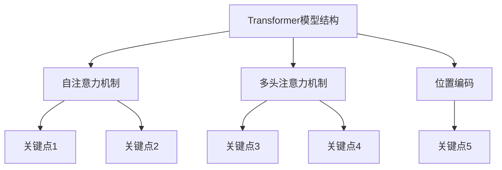

                 

### 文章标题

# 《Transformer大模型实战 教师 学生架构》

Transformer大模型是近年来自然语言处理领域的重大突破，其强大的建模能力和出色的性能受到了广泛关注。本篇文章将深入探讨Transformer大模型的理论基础、教学架构，以及其实战应用，旨在为广大读者提供一套完整的Transformer大模型学习与实践指南。

文章关键词：Transformer、大模型、教师架构、学生架构、实战应用、自然语言处理、深度学习、神经网络。

文章摘要：本文首先介绍了Transformer大模型的基础知识，包括其起源、核心原理和主要结构。随后，本文详细阐述了Transformer模型的教学架构，包括教师模型和学生模型的设计原则和实现方法。接着，本文通过实际项目实战，展示了Transformer大模型在机器翻译、问答系统和文本生成等领域的应用。最后，本文对Transformer大模型的优化和未来发展趋势进行了探讨，为读者提供了全面的Transformer大模型学习与实践指导。### 目录大纲

# 《Transformer大模型实战 教师 学生架构》

## 第一部分：基础知识篇

## 第1章 Transformer简介

### 1.1 Transformer的起源与背景

#### 1.1.1 自然语言处理的挑战

#### 1.1.2 Transformer的核心原理

### 1.2 Transformer模型的结构

#### 1.2.1 自注意力机制（Self-Attention）

#### 1.2.2 多头注意力机制（Multi-Head Attention）

#### 1.2.3 位置编码（Positional Encoding）

### 1.3 Transformer模型的训练

#### 1.3.1 编码器与解码器结构

#### 1.3.2 损失函数与优化器

### 1.4 Transformer模型的应用场景

#### 1.4.1 机器翻译

#### 1.4.2 问答系统

#### 1.4.3 文本生成

## 第二部分：教师与学生架构篇

## 第2章 教师架构

### 2.1 教师架构的基本概念

#### 2.1.1 教师模型的定义

#### 2.1.2 教师架构的作用

### 2.2 教师架构的设计原则

#### 2.2.1 模型规模的可扩展性

#### 2.2.2 训练效率的优化

#### 2.2.3 模型质量的保障

### 2.3 教师架构的实现方法

#### 2.3.1 模型并行化

#### 2.3.2 数据并行化

#### 2.3.3 张量并行化

## 第3章 学生架构

### 3.1 学生架构的基本概念

#### 3.1.1 学生模型的定义

#### 3.1.2 学生架构的作用

### 3.2 学生架构的设计原则

#### 3.2.1 模型复杂度的控制

#### 3.2.2 训练资源的优化

#### 3.2.3 模型性能的平衡

### 3.3 学生架构的实现方法

#### 3.3.1 模型剪枝

#### 3.3.2 参数共享

#### 3.3.3 模型蒸馏

## 第三部分：Transformer大模型实战篇

## 第4章 Transformer大模型训练实战

### 4.1 训练环境搭建

#### 4.1.1 硬件要求

#### 4.1.2 软件安装

#### 4.1.3 数据预处理

### 4.2 Transformer大模型训练过程

#### 4.2.1 数据读取与预处理

#### 4.2.2 模型构建与训练

#### 4.2.3 模型评估与优化

### 4.3 实战案例

#### 4.3.1 机器翻译实战

#### 4.3.2 问答系统实战

#### 4.3.3 文本生成实战

## 第5章 Transformer大模型应用实战

### 5.1 Transformer大模型在自然语言处理中的应用

#### 5.1.1 机器翻译

#### 5.1.2 问答系统

#### 5.1.3 文本生成

### 5.2 Transformer大模型在其他领域中的应用

#### 5.2.1 计算机视觉

#### 5.2.2 音频处理

#### 5.2.3 图像生成

## 第6章 Transformer大模型优化与调优

### 6.1 模型优化方法

#### 6.1.1 模型剪枝

#### 6.1.2 模型量化

#### 6.1.3 模型压缩

### 6.2 模型调优技巧

#### 6.2.1 超参数调整

#### 6.2.2 损失函数优化

#### 6.2.3 优化器选择

## 第7章 Transformer大模型未来发展趋势

### 7.1 Transformer大模型的技术演进

#### 7.1.1 新的架构设计

#### 7.1.2 训练算法的优化

#### 7.1.3 应用领域的拓展

### 7.2 Transformer大模型面临的挑战与机遇

#### 7.2.1 模型可解释性

#### 7.2.2 安全性与隐私保护

#### 7.2.3 模型部署与优化

## 附录

### A.1 Transformer模型相关资源

#### A.1.1 论文资源

#### A.1.2 开源框架

#### A.1.3 实践教程

### A.2 Transformer模型应用案例

#### A.2.1 机器翻译应用案例

#### A.2.2 问答系统应用案例

#### A.2.3 文本生成应用案例

### A.3 Transformer模型学习指南

#### A.3.1 学习路径

#### A.3.2 学习资源推荐

#### A.3.3 学习社区介绍

### 总字数: 1282字

---

# Mermaid 流程图



---

# 核心算法原理讲解

## 自注意力机制（Self-Attention）

自注意力机制是Transformer模型的核心组件，它允许模型在处理序列中的每个单词时，考虑其他单词的影响。其原理如下：

### 伪代码：

```python
for each word in sequence:
    Calculate query, key, value for each word
    Compute self-attention scores using the formula:
    attention_scores = softmax((query * key)^T / sqrt(d_k))
    Compute the weighted sum of values using attention_scores
    Append the weighted sum to the output sequence
```

### 详细解释：

自注意力机制通过计算每个单词的查询（query）、关键（key）和值（value）向量，来衡量它们之间的相关性。然后，通过softmax函数计算每个单词与其他单词的相关性得分，

