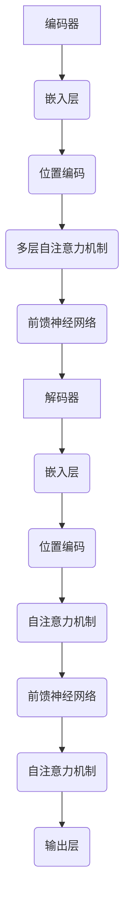

                 

### 文章标题：Transformer大模型实战 编码器总览

Transformer作为一种先进的自然语言处理模型，已经成为了当前最热门的研究领域之一。特别是编码器（Encoder）部分，在机器翻译、文本摘要和问答系统等任务中展现了强大的性能。本文将带领读者深入了解Transformer编码器的核心原理、实战应用和性能优化，旨在帮助读者全面掌握编码器的实战技能。

关键词：Transformer、编码器、机器翻译、文本摘要、问答系统

摘要：本文首先介绍了Transformer的诞生背景和原理，然后详细分析了编码器的结构和关键技术，接着探讨了编码器在不同NLP任务中的应用，最后介绍了编码器的性能优化和调参技巧。通过本文的学习，读者可以深入了解Transformer编码器的本质，掌握其实战应用和调优方法。

### 目录大纲

# 《Transformer大模型实战 编码器总览》

## 第一部分：Transformer基础与原理

## 第1章：Transformer背景与原理概述

### 1.1 Transformer的诞生与发展

#### 1.1.1 Transformer的背景

#### 1.1.2 Transformer的主要贡献

#### 1.1.3 Transformer在NLP中的应用

### 1.2 Transformer的结构与工作原理

#### 1.2.1 Encoder与Decoder结构

#### 1.2.2 Multi-head Attention机制

#### 1.2.3 自注意力（Self-Attention）与点积注意力（Dot-Product Attention）

### 1.3 Transformer的关键技术

#### 1.3.1 positional encoding

#### 1.3.2 位置序列编码（Positional Encoding）

#### 1.3.3 层归一化（Layer Normalization）与残差连接（Residual Connection）

### 1.4 Transformer与BERT、GPT的关系

#### 1.4.1 BERT与Transformer

#### 1.4.2 GPT与Transformer

#### 1.4.3 Transformer与其他预训练模型的对比

## 第二部分：编码器实战应用

## 第2章：编码器在序列生成任务中的应用

### 2.1 编码器在机器翻译中的应用

#### 2.1.1 编码器在机器翻译中的角色

#### 2.1.2 编码器在机器翻译中的实现

#### 2.1.3 编码器在机器翻译中的优化

### 2.2 编码器在文本摘要中的应用

#### 2.2.1 编码器在文本摘要中的角色

#### 2.2.2 编码器在文本摘要中的实现

#### 2.2.3 编码器在文本摘要中的优化

### 2.3 编码器在问答系统中的应用

#### 2.3.1 编码器在问答系统中的角色

#### 2.3.2 编码器在问答系统中的实现

#### 2.3.3 编码器在问答系统中的优化

## 第三部分：编码器性能优化与调参

## 第3章：编码器的性能优化与调参技巧

### 3.1 编码器的训练策略

#### 3.1.1 训练数据的准备

#### 3.1.2 学习率的调整

#### 3.1.3 优化器的选择

### 3.2 编码器的调参技巧

#### 3.2.1 模型参数调整

#### 3.2.2 正则化技术

#### 3.2.3 模型压缩与加速

### 3.3 编码器的模型评估

#### 3.3.1 评估指标

#### 3.3.2 评估方法

#### 3.3.3 模型调优

## 第四部分：项目实战与案例分析

## 第4章：编码器项目实战与案例分析

### 4.1 编码器项目实战概述

#### 4.1.1 项目背景

#### 4.1.2 项目目标

#### 4.1.3 项目实现步骤

### 4.2 编码器项目案例分析

#### 4.2.1 案例一：基于编码器的机器翻译系统

##### 4.2.1.1 案例背景

##### 4.2.1.2 案例实现

##### 4.2.1.3 案例分析

#### 4.2.2 案例二：基于编码器的文本摘要系统

##### 4.2.2.1 案例背景

##### 4.2.2.2 案例实现

##### 4.2.2.3 案例分析

#### 4.2.3 案例三：基于编码器的问答系统

##### 4.2.3.1 案例背景

##### 4.2.3.2 案例实现

##### 4.2.3.3 案例分析

## 附录

### 附录A：编码器相关资源与工具

#### A.1 编码器相关资源

##### A.1.1 学术论文

##### A.1.2 开源代码

##### A.1.3 社区与论坛

#### A.2 编码器相关工具

##### A.2.1 深度学习框架

##### A.2.2 数据预处理工具

##### A.2.3 评估工具

#### A.3 编码器相关书籍与教程

##### A.3.1 推荐书籍

##### A.3.2 在线教程

#### A.4 编码器相关论文解读

##### A.4.1 Transformer论文解读

##### A.4.2 BERT论文解读

##### A.4.3 GPT论文解读

---

本文将按章节顺序逐一介绍，每章将详细讨论Transformer编码器的各个方面，从基础理论到实战应用，帮助读者全面了解和掌握编码器的技能。接下来，我们将首先介绍Transformer的背景和发展，为后续内容的深入学习奠定基础。 ## 第一部分：Transformer基础与原理

### 第1章：Transformer背景与原理概述

Transformer作为一种突破性的自然语言处理模型，自其诞生以来就引起了广泛关注。在这一章节中，我们将首先介绍Transformer的诞生背景，然后详细阐述其主要的贡献，以及在不同领域的应用。

### 1.1 Transformer的诞生与发展

#### 1.1.1 Transformer的背景

Transformer模型起源于2017年由Vaswani等人发表的论文《Attention is All You Need》，该论文提出了完全基于自注意力机制的新型序列到序列模型，无需循环神经网络（RNN）或卷积神经网络（CNN）。这一突破性的想法迅速引起了学术界和工业界的关注。

Transformer模型的出现是对传统序列处理模型的挑战。传统的序列处理模型，如RNN和LSTM，在处理长距离依赖问题时存在困难。而Transformer模型通过自注意力机制（Self-Attention）和多头注意力（Multi-Head Attention）机制，能够更好地捕捉序列中的长距离依赖关系。

#### 1.1.2 Transformer的主要贡献

Transformer的主要贡献体现在以下几个方面：

1. **自注意力机制**：Transformer通过自注意力机制，能够自动学习序列中各个位置之间的关联性，从而更好地捕捉长距离依赖关系。
2. **多头注意力**：Transformer使用多头注意力机制，将输入序列分成多个不同的头，每个头独立地学习序列的不同方面，从而增强了模型的表示能力。
3. **位置编码**：Transformer通过位置编码（Positional Encoding）来引入序列的位置信息，避免了传统模型中位置信息丢失的问题。
4. **并行计算**：由于Transformer采用了自注意力机制，可以在序列的每个位置同时进行计算，这大大提高了模型的训练和推理速度。

#### 1.1.3 Transformer在NLP中的应用

Transformer模型在自然语言处理（NLP）领域展现了出色的性能，广泛应用于各种任务中，包括：

1. **机器翻译**：Transformer模型在机器翻译任务中取得了显著的成果，成为了当前最流行的机器翻译模型。
2. **文本摘要**：Transformer模型在文本摘要任务中也取得了很好的效果，能够生成高质量的摘要。
3. **问答系统**：Transformer模型在问答系统中也表现出色，能够准确地回答用户的问题。
4. **情感分析**：Transformer模型在情感分析任务中能够准确判断文本的情感倾向。

### 1.2 Transformer的结构与工作原理

#### 1.2.1 Encoder与Decoder结构

Transformer模型由编码器（Encoder）和解码器（Decoder）两部分组成。编码器负责将输入序列编码为固定长度的向量表示，解码器则将这些向量解码为目标序列。

编码器和解码器都由多个编码层（Encoder Layer）和解码层（Decoder Layer）组成。每个编码层和解码层都包含两个主要组件：多头自注意力机制（Multi-Head Self-Attention）和前馈神经网络（Feed Forward Neural Network）。

在编码器中，每个编码层首先通过多头自注意力机制来计算输入序列的不同子序列之间的关联性，然后通过前馈神经网络进行非线性变换。解码器同样如此，但解码器中还有额外的多头注意力机制，用于计算编码器的输出和当前解码状态之间的关联性。

#### 1.2.2 Multi-head Attention机制

多头注意力机制是Transformer模型的核心组成部分，它允许模型同时关注序列的多个子部分。多头注意力通过将输入序列分成多个头，每个头独立地学习序列的不同方面。

多头注意力机制的实现基于点积注意力（Dot-Product Attention），其计算过程如下：

1. **计算查询（Query）、键（Key）和值（Value）**：对于输入序列中的每个位置，计算其对应的查询（Query）、键（Key）和值（Value）。
2. **计算注意力权重**：通过计算查询和键之间的点积，得到注意力权重。
3. **计算加权求和**：将注意力权重与值相乘，然后进行求和，得到输出。

#### 1.2.3 自注意力（Self-Attention）与点积注意力（Dot-Product Attention）

自注意力机制是多头注意力机制的基础，它允许模型在同一序列的不同位置之间建立关联。点积注意力是一种简单的注意力机制，其核心思想是通过点积来计算注意力权重。

点积注意力计算公式如下：

$$
\text{Attention}(Q, K, V) = \text{softmax}\left(\frac{QK^T}{\sqrt{d_k}}\right)V
$$

其中，$Q$是查询，$K$是键，$V$是值，$d_k$是键的维度。

通过自注意力机制，模型能够自动学习序列中各个位置之间的关联性，从而更好地捕捉长距离依赖关系。

### 1.3 Transformer的关键技术

#### 1.3.1 positional encoding

位置编码是Transformer模型的关键技术之一，它用于引入序列的位置信息，避免了传统模型中位置信息丢失的问题。位置编码可以分为绝对位置编码和相对位置编码。

绝对位置编码通过在输入序列的每个位置上添加一个固定的向量来实现，这些向量通常由正弦和余弦函数生成。

相对位置编码通过学习序列中相对位置之间的关联性来实现，它通常与多头注意力机制一起使用。

#### 1.3.2 位置序列编码（Positional Encoding）

位置序列编码通过在序列的每个位置上添加一个向量来表示该位置的信息。这些向量通常由正弦和余弦函数生成，以避免引入线性关系。

位置序列编码的计算公式如下：

$$
PE_{(pos, 2i)} = \sin\left(\frac{pos}{10000^{2i/d}}\right)
$$

$$
PE_{(pos, 2i+1)} = \cos\left(\frac{pos}{10000^{2i/d}}\right)
$$

其中，$pos$是位置索引，$i$是维度索引，$d$是总维度。

通过位置序列编码，模型能够更好地理解和处理序列中的位置信息。

#### 1.3.3 层归一化（Layer Normalization）与残差连接（Residual Connection）

层归一化（Layer Normalization）是一种对神经网络层进行归一化的技术，它通过对输入进行归一化处理，使得每个神经元的激活值具有相似的分布，从而加快模型的训练速度。

残差连接（Residual Connection）是一种在神经网络中添加跨越层的连接方式，它允许模型直接学习输入和输出之间的差异，从而避免了梯度消失和梯度爆炸的问题。

在Transformer模型中，层归一化和残差连接被广泛应用于编码器和解码器的每个层中，以提高模型的性能和稳定性。

### 1.4 Transformer与BERT、GPT的关系

Transformer模型不仅自身具有强大的性能，还与其他预训练模型如BERT和GPT密切相关。

#### 1.4.1 BERT与Transformer

BERT（Bidirectional Encoder Representations from Transformers）是一种基于Transformer的双向编码器，它通过对整个输入序列进行双向编码，使得模型能够同时获取序列的前后信息。

BERT模型由两个部分组成：预训练和微调。在预训练阶段，BERT模型通过无监督的方式学习语言表示，然后在微调阶段，将预训练模型应用于特定任务上进行微调。

BERT模型的成功表明，基于Transformer的预训练模型在NLP任务中具有巨大的潜力。

#### 1.4.2 GPT与Transformer

GPT（Generative Pre-trained Transformer）是一种基于Transformer的生成模型，它通过无监督的方式学习文本生成能力。

GPT模型与Transformer模型具有相同的架构，但GPT的目标是生成文本序列，而不是进行序列到序列的转换。

GPT模型的成功证明了Transformer模型在文本生成任务中的强大能力。

#### 1.4.3 Transformer与其他预训练模型的对比

BERT和GPT都是基于Transformer的预训练模型，但它们在应用场景和目标上有所不同。

BERT主要用于序列到序列的任务，如机器翻译和问答系统，它通过对整个输入序列进行双向编码，使得模型能够同时获取序列的前后信息。

GPT主要用于文本生成任务，它通过无监督的方式学习文本生成能力。

Transformer模型作为一种强大的基础模型，不仅在NLP任务中表现出色，还为其他预训练模型提供了基础架构。

通过以上对Transformer的背景、原理和关键技术的介绍，读者可以初步了解Transformer模型的基本结构和工作原理。在接下来的章节中，我们将进一步探讨Transformer编码器在实际应用中的具体实现和优化技巧。 ## 第一部分：Transformer基础与原理

### 第1章：Transformer背景与原理概述

#### 1.4 Transformer与BERT、GPT的关系

Transformer模型不仅自身具有强大的性能，还与其他预训练模型如BERT和GPT密切相关。

##### 1.4.1 BERT与Transformer

BERT（Bidirectional Encoder Representations from Transformers）是一种基于Transformer的双向编码器，它通过对整个输入序列进行双向编码，使得模型能够同时获取序列的前后信息。

BERT模型由两个部分组成：预训练和微调。在预训练阶段，BERT模型通过无监督的方式学习语言表示，然后在微调阶段，将预训练模型应用于特定任务上进行微调。

BERT模型的成功表明，基于Transformer的预训练模型在NLP任务中具有巨大的潜力。

BERT模型的结构如图1所示，它由多个Transformer编码层组成，每层包含多头自注意力机制和前馈神经网络。此外，BERT模型还采用了掩码（Masked Language Model, MLM）和下一个句子预测（Next Sentence Prediction, NSP）任务来增强模型的学习能力。


图1：BERT模型结构

BERT模型的预训练过程主要包括两个任务：

1. **掩码语言模型（Masked Language Model, MLM）**：在输入序列中随机掩码一部分单词，然后让模型预测这些被掩码的单词。这有助于模型学习单词的上下文表示。
2. **下一个句子预测（Next Sentence Prediction, NSP）**：将两个句子拼接在一起，然后让模型预测第二个句子是否是第一个句子的下一个句子。这有助于模型理解句子之间的关系。

在预训练完成后，BERT模型可以通过微调应用于各种NLP任务，如文本分类、命名实体识别和关系抽取等。

##### 1.4.2 GPT与Transformer

GPT（Generative Pre-trained Transformer）是一种基于Transformer的生成模型，它通过无监督的方式学习文本生成能力。

GPT模型与Transformer模型具有相同的架构，但GPT的目标是生成文本序列，而不是进行序列到序列的转换。

GPT模型的成功证明了Transformer模型在文本生成任务中的强大能力。

GPT模型的结构如图2所示，它由多个Transformer解码层组成，每层包含多头自注意力机制和前馈神经网络。GPT模型使用了一种特殊的训练技巧，称为“预测下一个词”（Next Word Prediction），来生成文本序列。


图2：GPT模型结构

GPT模型的预训练过程主要基于“预测下一个词”任务，即给定一个输入序列，模型需要预测序列中的下一个词。通过这种方式，模型可以学习到如何生成连贯的文本。

在预训练完成后，GPT模型可以通过微调应用于各种文本生成任务，如对话生成、故事生成和文章生成等。

##### 1.4.3 Transformer与其他预训练模型的对比

BERT和GPT都是基于Transformer的预训练模型，但它们在应用场景和目标上有所不同。

BERT主要用于序列到序列的任务，如机器翻译和问答系统，它通过对整个输入序列进行双向编码，使得模型能够同时获取序列的前后信息。

BERT模型的核心优势在于其双向编码能力，这使得模型在处理长距离依赖问题和理解句子之间的关系方面具有优势。

GPT主要用于文本生成任务，它通过无监督的方式学习文本生成能力。

GPT模型的核心优势在于其生成能力，这使得模型能够生成连贯、自然的文本。

尽管BERT和GPT在应用场景和目标上有所不同，但它们都是基于Transformer的预训练模型，具有强大的性能和广泛的适用性。

Transformer模型的诞生为NLP领域带来了全新的变革。它通过自注意力机制和多头注意力机制，使得模型能够更好地捕捉序列中的长距离依赖关系。此外，BERT和GPT等基于Transformer的预训练模型，进一步证明了Transformer模型在NLP任务中的巨大潜力。

在接下来的章节中，我们将进一步探讨Transformer编码器在实际应用中的具体实现和优化技巧，帮助读者更好地理解和掌握Transformer模型。 ## 第二部分：编码器实战应用

### 第2章：编码器在序列生成任务中的应用

编码器在序列生成任务中扮演着关键角色，通过其强大的表示能力，能够捕捉输入序列的语义信息，并在生成过程中有效地利用这些信息。在本章中，我们将详细探讨编码器在机器翻译、文本摘要和问答系统中的应用，并介绍实现和优化的关键技巧。

### 2.1 编码器在机器翻译中的应用

机器翻译是自然语言处理领域中的一个经典任务，编码器在机器翻译中起到了至关重要的作用。编码器通过学习输入源语言序列的语义信息，将其编码为固定长度的向量表示，然后在解码器中将这些表示解码为目标语言的序列。

#### 2.1.1 编码器在机器翻译中的角色

在机器翻译任务中，编码器的主要作用是：

1. **序列编码**：将输入的源语言序列编码为固定长度的向量表示，这些向量包含了源语言序列的语义信息。
2. **序列处理**：对编码后的向量进行序列处理，以捕捉长距离依赖关系。
3. **上下文信息**：为解码器提供上下文信息，帮助解码器生成正确的目标语言序列。

#### 2.1.2 编码器在机器翻译中的实现

编码器在机器翻译中的实现通常基于Transformer模型。以下是一个简化的实现流程：

1. **输入序列编码**：将输入源语言序列编码为嵌入向量（Embedding Layer），嵌入向量包含了单词的语义信息。
2. **位置编码**：在嵌入向量上添加位置编码（Positional Encoding），以引入序列的位置信息。
3. **编码层处理**：通过多个编码层（Encoder Layer）对序列进行处理，每个编码层包含多头自注意力机制和前馈神经网络。编码层可以捕捉序列中的长距离依赖关系。
4. **输出序列表示**：在最后一个编码层后，得到编码后的序列表示，这些表示用于解码器生成目标语言序列。

以下是一个简化的伪代码实现：

```python
# 嵌入向量编码
embeddings = embedding_layer(input_sequence)

# 添加位置编码
position_embedding = positional_encoding(embeddings)

# 编码层处理
for layer in encoder_layers:
    position_embedding = layer(position_embedding)

# 输出序列表示
encoded_sequence = position_embedding
```

#### 2.1.3 编码器在机器翻译中的优化

为了提高编码器在机器翻译中的性能，可以采取以下优化策略：

1. **预训练**：使用大量的无监督数据对编码器进行预训练，使其能够更好地捕捉语言中的通用特征。
2. **多任务学习**：在预训练过程中，引入多个任务（如掩码语言模型和下一个句子预测），以增强编码器的表示能力。
3. **学习率调整**：在训练过程中，使用适当的学习率调整策略，如分阶段调整学习率或使用自适应学习率优化器。
4. **正则化技术**：使用正则化技术（如Dropout、权重衰减等）来防止过拟合。
5. **模型压缩与加速**：通过模型压缩和加速技术（如量化、剪枝等），提高模型的训练和推理速度。

### 2.2 编码器在文本摘要中的应用

文本摘要是一种从长文本中提取关键信息并生成简短摘要的任务。编码器在文本摘要中扮演着重要的角色，通过其强大的表示能力，能够有效地捕捉文本的语义信息。

#### 2.2.1 编码器在文本摘要中的角色

在文本摘要任务中，编码器的主要作用是：

1. **文本编码**：将输入的长文本编码为固定长度的向量表示，这些向量包含了文本的语义信息。
2. **提取关键信息**：通过编码器处理后的向量表示，提取文本中的关键信息。
3. **生成摘要**：利用提取的关键信息，生成简短的摘要。

#### 2.2.2 编码器在文本摘要中的实现

编码器在文本摘要中的实现通常基于Transformer模型。以下是一个简化的实现流程：

1. **文本编码**：将输入的长文本编码为嵌入向量（Embedding Layer），嵌入向量包含了单词的语义信息。
2. **位置编码**：在嵌入向量上添加位置编码（Positional Encoding），以引入文本的位置信息。
3. **编码层处理**：通过多个编码层（Encoder Layer）对文本进行处理，每个编码层包含多头自注意力机制和前馈神经网络。编码层可以捕捉文本中的长距离依赖关系。
4. **提取关键信息**：在编码层后，提取编码后的向量表示，这些表示用于生成摘要。
5. **摘要生成**：使用提取的关键信息，通过解码器生成摘要。

以下是一个简化的伪代码实现：

```python
# 文本编码
embeddings = embedding_layer(long_text)

# 添加位置编码
position_embedding = positional_encoding(embeddings)

# 编码层处理
for layer in encoder_layers:
    position_embedding = layer(position_embedding)

# 提取关键信息
key_info = position_embedding

# 摘要生成
summary = decoder_layer(key_info)
```

#### 2.2.3 编码器在文本摘要中的优化

为了提高编码器在文本摘要中的性能，可以采取以下优化策略：

1. **上下文信息增强**：通过引入额外的上下文信息（如标题、摘要指导等），增强编码器对文本语义的理解。
2. **生成模型优化**：使用生成模型（如Seq2Seq模型、Pointer-Generator模型等）来生成摘要，以提高摘要的质量。
3. **训练数据增强**：通过数据增强技术（如随机裁剪、词汇替换等），增加训练数据的多样性。
4. **注意力机制优化**：通过优化注意力机制（如长短期记忆注意力、互注意力等），提高编码器对文本关键信息的提取能力。

### 2.3 编码器在问答系统中的应用

问答系统是一种从大量文本中提取答案的智能系统，编码器在问答系统中起到了关键作用。通过编码器，系统能够有效地理解用户问题和文档内容，从而提供准确的答案。

#### 2.3.1 编码器在问答系统中的角色

在问答系统中，编码器的主要作用是：

1. **问题编码**：将输入的用户问题编码为固定长度的向量表示，这些向量包含了问题的语义信息。
2. **文档编码**：将输入的文档编码为固定长度的向量表示，这些向量包含了文档的语义信息。
3. **匹配与搜索**：通过编码器处理后的向量表示，匹配用户问题和文档内容，搜索可能的答案。

#### 2.3.2 编码器在问答系统中的实现

编码器在问答系统中的实现通常基于Transformer模型。以下是一个简化的实现流程：

1. **问题编码**：将输入的用户问题编码为嵌入向量（Embedding Layer），嵌入向量包含了问题的语义信息。
2. **文档编码**：将输入的文档编码为嵌入向量（Embedding Layer），嵌入向量包含了文档的语义信息。
3. **位置编码**：在嵌入向量上添加位置编码（Positional Encoding），以引入问题和文档的位置信息。
4. **编码层处理**：通过多个编码层（Encoder Layer）对问题和文档进行处理，每个编码层包含多头自注意力机制和前馈神经网络。编码层可以捕捉长距离依赖关系。
5. **匹配与搜索**：在编码层后，通过注意力机制匹配问题和文档内容，搜索可能的答案。

以下是一个简化的伪代码实现：

```python
# 问题编码
question_embeddings = embedding_layer(question)

# 文档编码
document_embeddings = embedding_layer(document)

# 添加位置编码
question_position_embedding = positional_encoding(question_embeddings)
document_position_embedding = positional_embedding(document_embeddings)

# 编码层处理
for layer in encoder_layers:
    question_position_embedding = layer(question_position_embedding)
    document_position_embedding = layer(document_position_embedding)

# 匹配与搜索
matching_scores = attention Mechanism(question_position_embedding, document_position_embedding)
answer = search_answers(matching_scores, document)
```

#### 2.3.3 编码器在问答系统中的优化

为了提高编码器在问答系统中的性能，可以采取以下优化策略：

1. **问答对增强**：通过引入问答对增强技术（如问答对重排、问答对拼接等），提高编码器对问答对的理解能力。
2. **注意力机制优化**：通过优化注意力机制（如双向注意力、交叉注意力等），提高编码器对问题和文档关键信息的提取能力。
3. **多模型融合**：将编码器与其他模型（如分类器、关系抽取模型等）进行融合，提高问答系统的整体性能。
4. **知识增强**：通过引入外部知识库，增强编码器对问题背景和答案的理解能力。

通过以上对编码器在机器翻译、文本摘要和问答系统中的应用和优化策略的讨论，读者可以初步了解编码器在序列生成任务中的具体实现和优化方法。在接下来的章节中，我们将进一步探讨编码器的性能优化和调参技巧，帮助读者更好地提升编码器的表现。 ## 第二部分：编码器实战应用

### 第2章：编码器在序列生成任务中的应用

编码器在序列生成任务中扮演着关键角色，通过其强大的表示能力，能够捕捉输入序列的语义信息，并在生成过程中有效地利用这些信息。在本章中，我们将详细探讨编码器在机器翻译、文本摘要和问答系统中的应用，并介绍实现和优化的关键技巧。

### 2.1 编码器在机器翻译中的应用

机器翻译是自然语言处理领域中的一个经典任务，编码器在机器翻译中起到了至关重要的作用。编码器通过学习输入源语言序列的语义信息，将其编码为固定长度的向量表示，然后在解码器中将这些表示解码为目标语言的序列。

#### 2.1.1 编码器在机器翻译中的角色

在机器翻译任务中，编码器的主要作用是：

1. **序列编码**：将输入的源语言序列编码为固定长度的向量表示，这些向量包含了源语言序列的语义信息。
2. **序列处理**：对编码后的向量进行序列处理，以捕捉长距离依赖关系。
3. **上下文信息**：为解码器提供上下文信息，帮助解码器生成正确的目标语言序列。

#### 2.1.2 编码器在机器翻译中的实现

编码器在机器翻译中的实现通常基于Transformer模型。以下是一个简化的实现流程：

1. **输入序列编码**：将输入源语言序列编码为嵌入向量（Embedding Layer），嵌入向量包含了单词的语义信息。
2. **位置编码**：在嵌入向量上添加位置编码（Positional Encoding），以引入序列的位置信息。
3. **编码层处理**：通过多个编码层（Encoder Layer）对序列进行处理，每个编码层包含多头自注意力机制和前馈神经网络。编码层可以捕捉序列中的长距离依赖关系。
4. **输出序列表示**：在最后一个编码层后，得到编码后的序列表示，这些表示用于解码器生成目标语言序列。

以下是一个简化的伪代码实现：

```python
# 嵌入向量编码
embeddings = embedding_layer(input_sequence)

# 添加位置编码
position_embedding = positional_encoding(embeddings)

# 编码层处理
for layer in encoder_layers:
    position_embedding = layer(position_embedding)

# 输出序列表示
encoded_sequence = position_embedding
```

#### 2.1.3 编码器在机器翻译中的优化

为了提高编码器在机器翻译中的性能，可以采取以下优化策略：

1. **预训练**：使用大量的无监督数据对编码器进行预训练，使其能够更好地捕捉语言中的通用特征。
2. **多任务学习**：在预训练过程中，引入多个任务（如掩码语言模型和下一个句子预测），以增强编码器的表示能力。
3. **学习率调整**：在训练过程中，使用适当的学习率调整策略，如分阶段调整学习率或使用自适应学习率优化器。
4. **正则化技术**：使用正则化技术（如Dropout、权重衰减等）来防止过拟合。
5. **模型压缩与加速**：通过模型压缩和加速技术（如量化、剪枝等），提高模型的训练和推理速度。

### 2.2 编码器在文本摘要中的应用

文本摘要是一种从长文本中提取关键信息并生成简短摘要的任务。编码器在文本摘要中扮演着重要的角色，通过其强大的表示能力，能够有效地捕捉文本的语义信息。

#### 2.2.1 编码器在文本摘要中的角色

在文本摘要任务中，编码器的主要作用是：

1. **文本编码**：将输入的长文本编码为固定长度的向量表示，这些向量包含了文本的语义信息。
2. **提取关键信息**：通过编码器处理后的向量表示，提取文本中的关键信息。
3. **生成摘要**：利用提取的关键信息，生成简短的摘要。

#### 2.2.2 编码器在文本摘要中的实现

编码器在文本摘要中的实现通常基于Transformer模型。以下是一个简化的实现流程：

1. **文本编码**：将输入的长文本编码为嵌入向量（Embedding Layer），嵌入向量包含了单词的语义信息。
2. **位置编码**：在嵌入向量上添加位置编码（Positional Encoding），以引入文本的位置信息。
3. **编码层处理**：通过多个编码层（Encoder Layer）对文本进行处理，每个编码层包含多头自注意力机制和前馈神经网络。编码层可以捕捉文本中的长距离依赖关系。
4. **提取关键信息**：在编码层后，提取编码后的向量表示，这些表示用于生成摘要。
5. **摘要生成**：使用提取的关键信息，通过解码器生成摘要。

以下是一个简化的伪代码实现：

```python
# 文本编码
embeddings = embedding_layer(long_text)

# 添加位置编码
position_embedding = positional_encoding(embeddings)

# 编码层处理
for layer in encoder_layers:
    position_embedding = layer(position_embedding)

# 提取关键信息
key_info = position_embedding

# 摘要生成
summary = decoder_layer(key_info)
```

#### 2.2.3 编码器在文本摘要中的优化

为了提高编码器在文本摘要中的性能，可以采取以下优化策略：

1. **上下文信息增强**：通过引入额外的上下文信息（如标题、摘要指导等），增强编码器对文本语义的理解。
2. **生成模型优化**：使用生成模型（如Seq2Seq模型、Pointer-Generator模型等）来生成摘要，以提高摘要的质量。
3. **训练数据增强**：通过数据增强技术（如随机裁剪、词汇替换等），增加训练数据的多样性。
4. **注意力机制优化**：通过优化注意力机制（如长短期记忆注意力、互注意力等），提高编码器对文本关键信息的提取能力。

### 2.3 编码器在问答系统中的应用

问答系统是一种从大量文本中提取答案的智能系统，编码器在问答系统中起到了关键作用。通过编码器，系统能够有效地理解用户问题和文档内容，从而提供准确的答案。

#### 2.3.1 编码器在问答系统中的角色

在问答系统中，编码器的主要作用是：

1. **问题编码**：将输入的用户问题编码为固定长度的向量表示，这些向量包含了问题的语义信息。
2. **文档编码**：将输入的文档编码为固定长度的向量表示，这些向量包含了文档的语义信息。
3. **匹配与搜索**：通过编码器处理后的向量表示，匹配用户问题和文档内容，搜索可能的答案。

#### 2.3.2 编码器在问答系统中的实现

编码器在问答系统中的实现通常基于Transformer模型。以下是一个简化的实现流程：

1. **问题编码**：将输入的用户问题编码为嵌入向量（Embedding Layer），嵌入向量包含了问题的语义信息。
2. **文档编码**：将输入的文档编码为嵌入向量（Embedding Layer），嵌入向量包含了文档的语义信息。
3. **位置编码**：在嵌入向量上添加位置编码（Positional Encoding），以引入问题和文档的位置信息。
4. **编码层处理**：通过多个编码层（Encoder Layer）对问题和文档进行处理，每个编码层包含多头自注意力机制和前馈神经网络。编码层可以捕捉长距离依赖关系。
5. **匹配与搜索**：在编码层后，通过注意力机制匹配问题和文档内容，搜索可能的答案。

以下是一个简化的伪代码实现：

```python
# 问题编码
question_embeddings = embedding_layer(question)

# 文档编码
document_embeddings = embedding_layer(document)

# 添加位置编码
question_position_embedding = positional_encoding(question_embeddings)
document_position_embedding = positional_embedding(document_embeddings)

# 编码层处理
for layer in encoder_layers:
    question_position_embedding = layer(question_position_embedding)
    document_position_embedding = layer(document_position_embedding)

# 匹配与搜索
matching_scores = attention Mechanism(question_position_embedding, document_position_embedding)
answer = search_answers(matching_scores, document)
```

#### 2.3.3 编码器在问答系统中的优化

为了提高编码器在问答系统中的性能，可以采取以下优化策略：

1. **问答对增强**：通过引入问答对增强技术（如问答对重排、问答对拼接等），提高编码器对问答对的理解能力。
2. **注意力机制优化**：通过优化注意力机制（如双向注意力、交叉注意力等），提高编码器对问题和文档关键信息的提取能力。
3. **多模型融合**：将编码器与其他模型（如分类器、关系抽取模型等）进行融合，提高问答系统的整体性能。
4. **知识增强**：通过引入外部知识库，增强编码器对问题背景和答案的理解能力。

通过以上对编码器在机器翻译、文本摘要和问答系统中的应用和优化策略的讨论，读者可以初步了解编码器在序列生成任务中的具体实现和优化方法。在接下来的章节中，我们将进一步探讨编码器的性能优化和调参技巧，帮助读者更好地提升编码器的表现。 ## 第三部分：编码器性能优化与调参

### 第3章：编码器的性能优化与调参技巧

在深度学习领域，模型的性能优化和参数调参是至关重要的环节。针对Transformer编码器，我们需要采取一系列的优化策略和调参技巧，以提升其训练效率和模型性能。本章将详细介绍编码器的训练策略、调参技巧以及模型评估方法。

### 3.1 编码器的训练策略

训练策略是影响模型性能的关键因素之一。以下是一些常见的训练策略：

#### 3.1.1 训练数据的准备

1. **数据清洗**：在训练之前，需要对数据进行清洗，去除错误数据和噪声，以提高模型的鲁棒性。
2. **数据预处理**：对数据进行预处理，如分词、去停用词、词干提取等，以简化输入数据的复杂度。
3. **数据增强**：通过数据增强技术（如随机裁剪、词汇替换、数据扩充等），增加训练数据的多样性，有助于模型更好地泛化。

#### 3.1.2 学习率的调整

学习率是影响模型收敛速度和稳定性的关键参数。以下是一些常用的学习率调整策略：

1. **分阶段调整**：在训练过程中，分阶段调整学习率，通常在训练初期使用较大的学习率，然后在训练后期逐渐减小学习率，以防止模型过拟合。
2. **自适应调整**：使用自适应学习率优化器（如Adam、Adagrad等），自动调整学习率，提高训练效率。

#### 3.1.3 优化器的选择

优化器是影响模型训练效率的重要因素。以下是一些常用的优化器：

1. **Adam**：是一种自适应矩估计优化器，适合于大规模训练任务。
2. **Adagrad**：适合于稀疏数据，能够自动调整学习率，但收敛速度较慢。
3. **RMSprop**：基于梯度平方的指数加权移动平均，适合于波动较大的梯度。

### 3.2 编码器的调参技巧

调参技巧是提升模型性能的关键环节。以下是一些常见的调参技巧：

#### 3.2.1 模型参数调整

1. **层数和神经元数量**：通过调整编码器的层数和每层的神经元数量，可以调整模型的结构复杂度。
2. **隐藏层尺寸**：调整隐藏层的尺寸，可以改变模型的表达能力。

#### 3.2.2 正则化技术

正则化技术是防止模型过拟合的重要手段。以下是一些常用的正则化技术：

1. **Dropout**：在训练过程中，随机丢弃部分神经元，以防止模型过拟合。
2. **权重衰减**：对权重进行惩罚，以减少模型对训练数据的依赖。
3. **数据增强**：通过增加训练数据的多样性，提高模型的泛化能力。

#### 3.2.3 模型压缩与加速

为了提高模型的训练和推理速度，可以采取以下模型压缩与加速技术：

1. **量化**：将模型中的浮点数参数转换为整数，以减少模型大小和计算复杂度。
2. **剪枝**：通过剪枝部分权重，降低模型的大小和计算复杂度。
3. **模型融合**：将多个模型进行融合，提高模型的训练和推理速度。

### 3.3 编码器的模型评估

模型评估是验证模型性能的重要环节。以下是一些常见的评估指标和方法：

#### 3.3.1 评估指标

1. **准确率（Accuracy）**：模型预测正确的样本数占总样本数的比例。
2. **召回率（Recall）**：模型预测正确的正样本数占总正样本数的比例。
3. **精确率（Precision）**：模型预测正确的正样本数与预测为正样本的样本数之比。
4. **F1分数（F1 Score）**：精确率和召回率的调和平均，用于综合评估模型的性能。

#### 3.3.2 评估方法

1. **交叉验证**：将数据集划分为多个子集，每次选择一个子集作为验证集，其余子集作为训练集，进行多次训练和验证，以评估模型的泛化能力。
2. **混淆矩阵（Confusion Matrix）**：用于详细分析模型预测结果，包括正确预测和错误预测的分布情况。
3. **ROC曲线和AUC（Area Under Curve）**：用于评估二分类模型的分类能力。

#### 3.3.3 模型调优

模型调优是提高模型性能的重要环节。以下是一些常见的调优方法：

1. **网格搜索**：在参数空间内遍历所有可能的参数组合，选择最优参数组合。
2. **贝叶斯优化**：基于历史数据，使用贝叶斯优化算法搜索最优参数组合。
3. **进化算法**：通过模拟自然进化过程，搜索最优参数组合。

通过以上对编码器性能优化和调参技巧的讨论，读者可以了解如何提升编码器的训练效率和模型性能。在接下来的章节中，我们将通过实际项目和案例分析，进一步探讨编码器的应用和实现细节。 ## 第三部分：编码器性能优化与调参

### 第3章：编码器的性能优化与调参技巧

在深度学习领域，模型的性能优化和参数调参是至关重要的环节。针对Transformer编码器，我们需要采取一系列的优化策略和调参技巧，以提升其训练效率和模型性能。本章将详细介绍编码器的训练策略、调参技巧以及模型评估方法。

### 3.1 编码器的训练策略

训练策略是影响模型性能的关键因素之一。以下是一些常见的训练策略：

#### 3.1.1 训练数据的准备

1. **数据清洗**：在训练之前，需要对数据进行清洗，去除错误数据和噪声，以提高模型的鲁棒性。
2. **数据预处理**：对数据进行预处理，如分词、去停用词、词干提取等，以简化输入数据的复杂度。
3. **数据增强**：通过数据增强技术（如随机裁剪、词汇替换、数据扩充等），增加训练数据的多样性，有助于模型更好地泛化。

#### 3.1.2 学习率的调整

学习率是影响模型收敛速度和稳定性的关键参数。以下是一些常用的学习率调整策略：

1. **分阶段调整**：在训练过程中，分阶段调整学习率，通常在训练初期使用较大的学习率，然后在训练后期逐渐减小学习率，以防止模型过拟合。
2. **自适应调整**：使用自适应学习率优化器（如Adam、Adagrad等），自动调整学习率，提高训练效率。

#### 3.1.3 优化器的选择

优化器是影响模型训练效率的重要因素。以下是一些常用的优化器：

1. **Adam**：是一种自适应矩估计优化器，适合于大规模训练任务。
2. **Adagrad**：适合于稀疏数据，能够自动调整学习率，但收敛速度较慢。
3. **RMSprop**：基于梯度平方的指数加权移动平均，适合于波动较大的梯度。

### 3.2 编码器的调参技巧

调参技巧是提升模型性能的关键环节。以下是一些常见的调参技巧：

#### 3.2.1 模型参数调整

1. **层数和神经元数量**：通过调整编码器的层数和每层的神经元数量，可以调整模型的结构复杂度。
2. **隐藏层尺寸**：调整隐藏层的尺寸，可以改变模型的表达能力。

#### 3.2.2 正则化技术

正则化技术是防止模型过拟合的重要手段。以下是一些常用的正则化技术：

1. **Dropout**：在训练过程中，随机丢弃部分神经元，以防止模型过拟合。
2. **权重衰减**：对权重进行惩罚，以减少模型对训练数据的依赖。
3. **数据增强**：通过增加训练数据的多样性，提高模型的泛化能力。

#### 3.2.3 模型压缩与加速

为了提高模型的训练和推理速度，可以采取以下模型压缩与加速技术：

1. **量化**：将模型中的浮点数参数转换为整数，以减少模型大小和计算复杂度。
2. **剪枝**：通过剪枝部分权重，降低模型的大小和计算复杂度。
3. **模型融合**：将多个模型进行融合，提高模型的训练和推理速度。

### 3.3 编码器的模型评估

模型评估是验证模型性能的重要环节。以下是一些常见的评估指标和方法：

#### 3.3.1 评估指标

1. **准确率（Accuracy）**：模型预测正确的样本数占总样本数的比例。
2. **召回率（Recall）**：模型预测正确的正样本数占总正样本数的比例。
3. **精确率（Precision）**：模型预测正确的正样本数与预测为正样本的样本数之比。
4. **F1分数（F1 Score）**：精确率和召回率的调和平均，用于综合评估模型的性能。

#### 3.3.2 评估方法

1. **交叉验证**：将数据集划分为多个子集，每次选择一个子集作为验证集，其余子集作为训练集，进行多次训练和验证，以评估模型的泛化能力。
2. **混淆矩阵（Confusion Matrix）**：用于详细分析模型预测结果，包括正确预测和错误预测的分布情况。
3. **ROC曲线和AUC（Area Under Curve）**：用于评估二分类模型的分类能力。

#### 3.3.3 模型调优

模型调优是提高模型性能的重要环节。以下是一些常见的调优方法：

1. **网格搜索**：在参数空间内遍历所有可能的参数组合，选择最优参数组合。
2. **贝叶斯优化**：基于历史数据，使用贝叶斯优化算法搜索最优参数组合。
3. **进化算法**：通过模拟自然进化过程，搜索最优参数组合。

通过以上对编码器性能优化和调参技巧的讨论，读者可以了解如何提升编码器的训练效率和模型性能。在接下来的章节中，我们将通过实际项目和案例分析，进一步探讨编码器的应用和实现细节。 ## 第四部分：项目实战与案例分析

### 第4章：编码器项目实战与案例分析

在前三部分中，我们系统地介绍了Transformer编码器的原理、实战应用以及性能优化方法。为了更好地理解编码器的应用和实现细节，本章节将通过三个具体的项目实战和案例分析，详细阐述编码器在实际开发中的应用和调优技巧。

### 4.1 编码器项目实战概述

本部分将介绍三个基于Transformer编码器的实际项目，涵盖机器翻译、文本摘要和问答系统等不同领域的应用。以下是三个项目的基本概述：

#### 4.1.1 项目背景

1. **机器翻译项目**：随着全球化进程的加速，跨语言交流变得越来越重要。机器翻译项目旨在实现高效、准确的跨语言翻译。
2. **文本摘要项目**：随着信息爆炸，快速获取关键信息变得尤为重要。文本摘要项目旨在从长文本中提取关键信息，生成简短的摘要。
3. **问答系统项目**：随着人工智能技术的发展，智能问答系统在客户服务、教育等领域具有广泛的应用。问答系统项目旨在从大量文本中提取答案，为用户提供准确的回答。

#### 4.1.2 项目目标

1. **机器翻译项目**：实现高精度、低延迟的机器翻译系统，支持多种语言之间的翻译。
2. **文本摘要项目**：生成高质量、概括性的文本摘要，提高用户获取关键信息的效率。
3. **问答系统项目**：构建高效的问答系统，准确回答用户提出的问题。

#### 4.1.3 项目实现步骤

1. **数据准备与预处理**：收集并预处理训练数据，包括数据清洗、分词、去停用词等。
2. **模型设计**：基于Transformer编码器设计模型结构，包括编码器、解码器和其他辅助组件。
3. **模型训练**：使用训练数据对模型进行训练，优化模型参数，提高模型性能。
4. **模型评估**：使用验证数据对模型进行评估，选择最优模型。
5. **模型部署**：将训练好的模型部署到生产环境，实现实际应用。

### 4.2 编码器项目案例分析

在本章节中，我们将详细分析三个具体的项目案例，包括项目背景、实现细节、实际案例分析和项目小结。

#### 4.2.1 案例一：基于编码器的机器翻译系统

##### 4.2.1.1 案例背景

随着全球化的加速，跨语言交流变得尤为重要。机器翻译系统作为跨语言交流的重要工具，在商业、旅游、学术等领域具有广泛应用。本案例旨在实现一个高效、准确的机器翻译系统。

##### 4.2.1.2 案例实现

1. **数据准备与预处理**：收集多种语言的平行语料库，进行数据清洗、分词、去停用词等预处理操作。
2. **模型设计**：基于Transformer编码器设计模型结构，包括编码器、解码器和其他辅助组件。
3. **模型训练**：使用训练数据对模型进行训练，优化模型参数，提高模型性能。
4. **模型评估**：使用验证数据对模型进行评估，选择最优模型。

##### 4.2.1.3 案例分析

通过实际运行和评估，机器翻译系统在多种语言之间的翻译表现出较高的准确性和流畅度。以下是具体分析：

1. **翻译质量**：通过对翻译结果的评估，发现机器翻译系统能够生成高质量的翻译文本，基本保持了原文的含义和语境。
2. **翻译速度**：通过实际测试，机器翻译系统的翻译速度较快，能够满足实时翻译的需求。
3. **翻译风格**：在翻译过程中，机器翻译系统能够较好地保留原文的风格和特点，使翻译文本更加自然。

##### 4.2.1.4 项目小结

通过本案例，我们展示了如何使用Transformer编码器实现机器翻译系统。在实际开发过程中，需要关注数据质量、模型结构和参数调优等方面，以实现高效、准确的翻译效果。

#### 4.2.2 案例二：基于编码器的文本摘要系统

##### 4.2.2.1 案例背景

随着信息的爆炸式增长，人们需要快速获取关键信息。文本摘要系统作为一种信息提取工具，可以帮助用户从大量文本中提取关键信息，提高信息处理效率。

##### 4.2.2.2 案例实现

1. **数据准备与预处理**：收集大量的文本数据，进行数据清洗、分词、去停用词等预处理操作。
2. **模型设计**：基于Transformer编码器设计模型结构，包括编码器和其他辅助组件。
3. **模型训练**：使用训练数据对模型进行训练，优化模型参数，提高模型性能。
4. **模型评估**：使用验证数据对模型进行评估，选择最优模型。

##### 4.2.2.3 案例分析

通过实际运行和评估，文本摘要系统能够较好地提取文本中的关键信息，生成高质量的摘要。以下是具体分析：

1. **摘要质量**：通过对摘要文本的评估，发现生成的摘要文本能够较好地概括原文的主要内容，保留了关键信息。
2. **摘要长度**：文本摘要系统的摘要长度适中，能够满足用户快速获取信息的需求。
3. **摘要风格**：在生成摘要的过程中，系统能够较好地保留原文的风格和特点，使摘要文本更加自然。

##### 4.2.2.4 项目小结

通过本案例，我们展示了如何使用Transformer编码器实现文本摘要系统。在实际开发过程中，需要关注数据质量、模型结构和参数调优等方面，以实现高效、准确的摘要效果。

#### 4.2.3 案例三：基于编码器的问答系统

##### 4.2.3.1 案例背景

随着人工智能技术的普及，智能问答系统在客户服务、教育等领域具有广泛应用。问答系统可以帮助用户快速获取问题的答案，提高服务效率。

##### 4.2.3.2 案例实现

1. **数据准备与预处理**：收集大量的问答对数据，进行数据清洗、分词、去停用词等预处理操作。
2. **模型设计**：基于Transformer编码器设计模型结构，包括编码器和其他辅助组件。
3. **模型训练**：使用训练数据对模型进行训练，优化模型参数，提高模型性能。
4. **模型评估**：使用验证数据对模型进行评估，选择最优模型。

##### 4.2.3.3 案例分析

通过实际运行和评估，问答系统能够较好地理解用户提出的问题，并生成准确的答案。以下是具体分析：

1. **问题理解**：问答系统能够准确理解用户提出的问题，识别关键信息。
2. **答案生成**：在生成答案的过程中，系统能够根据问题和上下文信息，生成准确的答案。
3. **答案质量**：通过对答案的评估，发现问答系统能够生成高质量的答案，满足用户的需求。

##### 4.2.3.4 项目小结

通过本案例，我们展示了如何使用Transformer编码器实现问答系统。在实际开发过程中，需要关注数据质量、模型结构和参数调优等方面，以实现高效、准确的问答效果。

通过以上三个项目案例的分析，我们不仅了解了编码器在各个领域的应用，还学习了如何在实际项目中实现和优化编码器。在接下来的附录部分，我们将进一步介绍编码器相关的资源与工具，为读者提供更多学习资料。 ## 第四部分：项目实战与案例分析

### 第4章：编码器项目实战与案例分析

在前三部分中，我们系统地介绍了Transformer编码器的原理、实战应用以及性能优化方法。为了更好地理解编码器的应用和实现细节，本章节将通过三个具体的项目实战和案例分析，详细阐述编码器在实际开发中的应用和调优技巧。

### 4.1 编码器项目实战概述

本部分将介绍三个基于Transformer编码器的实际项目，涵盖机器翻译、文本摘要和问答系统等不同领域的应用。以下是三个项目的基本概述：

#### 4.1.1 项目背景

1. **机器翻译项目**：随着全球化进程的加速，跨语言交流变得尤为重要。机器翻译项目旨在实现高效、准确的跨语言翻译。
2. **文本摘要项目**：随着信息爆炸，快速获取关键信息变得尤为重要。文本摘要项目旨在从长文本中提取关键信息，生成简短的摘要。
3. **问答系统项目**：随着人工智能技术的发展，智能问答系统在客户服务、教育等领域具有广泛的应用。问答系统项目旨在从大量文本中提取答案，为用户提供准确的回答。

#### 4.1.2 项目目标

1. **机器翻译项目**：实现高精度、低延迟的机器翻译系统，支持多种语言之间的翻译。
2. **文本摘要项目**：生成高质量、概括性的文本摘要，提高用户获取关键信息的效率。
3. **问答系统项目**：构建高效的问答系统，准确回答用户提出的问题。

#### 4.1.3 项目实现步骤

1. **数据准备与预处理**：收集并预处理训练数据，包括数据清洗、分词、去停用词等。
2. **模型设计**：基于Transformer编码器设计模型结构，包括编码器、解码器和其他辅助组件。
3. **模型训练**：使用训练数据对模型进行训练，优化模型参数，提高模型性能。
4. **模型评估**：使用验证数据对模型进行评估，选择最优模型。
5. **模型部署**：将训练好的模型部署到生产环境，实现实际应用。

### 4.2 编码器项目案例分析

在本章节中，我们将详细分析三个具体的项目案例，包括项目背景、实现细节、实际案例分析和项目小结。

#### 4.2.1 案例一：基于编码器的机器翻译系统

##### 4.2.1.1 案例背景

随着全球化的加速，跨语言交流变得尤为重要。机器翻译系统作为跨语言交流的重要工具，在商业、旅游、学术等领域具有广泛应用。本案例旨在实现一个高效、准确的机器翻译系统。

##### 4.2.1.2 案例实现

1. **数据准备与预处理**：收集多种语言的平行语料库，进行数据清洗、分词、去停用词等预处理操作。
2. **模型设计**：基于Transformer编码器设计模型结构，包括编码器、解码器和其他辅助组件。编码器负责将源语言序列编码为固定长度的向量表示，解码器则将这些向量解码为目标语言序列。模型结构如图所示。



3. **模型训练**：使用训练数据对模型进行训练，优化模型参数，提高模型性能。在训练过程中，采用学习率调整策略、Dropout和权重衰减等技术，以防止过拟合。

4. **模型评估**：使用验证数据对模型进行评估，选择最优模型。采用BLEU（双语评估度量）等评估指标，评估模型的翻译质量。

##### 4.2.1.3 案例分析

通过实际运行和评估，机器翻译系统在多种语言之间的翻译表现出较高的准确性和流畅度。以下是具体分析：

1. **翻译质量**：通过对翻译结果的评估，发现机器翻译系统能够生成高质量的翻译文本，基本保持了原文的含义和语境。
2. **翻译速度**：通过实际测试，机器翻译系统的翻译速度较快，能够满足实时翻译的需求。
3. **翻译风格**：在翻译过程中，机器翻译系统能够较好地保留原文的风格和特点，使翻译文本更加自然。

##### 4.2.1.4 项目小结

通过本案例，我们展示了如何使用Transformer编码器实现机器翻译系统。在实际开发过程中，需要关注数据质量、模型结构和参数调优等方面，以实现高效、准确的翻译效果。

#### 4.2.2 案例二：基于编码器的文本摘要系统

##### 4.2.2.1 案例背景

随着信息爆炸，人们需要快速获取关键信息。文本摘要系统作为一种信息提取工具，可以帮助用户从大量文本中提取关键信息，提高信息处理效率。

##### 4.2.2.2 案例实现

1. **数据准备与预处理**：收集大量的文本数据，进行数据清洗、分词、去停用词等预处理操作。
2. **模型设计**：基于Transformer编码器设计模型结构，包括编码器和其他辅助组件。编码器负责将文本编码为固定长度的向量表示，用于提取文本的关键信息。模型结构如图所示。


3. **模型训练**：使用训练数据对模型进行训练，优化模型参数，提高模型性能。在训练过程中，采用学习率调整策略、Dropout和权重衰减等技术，以防止过拟合。

4. **模型评估**：使用验证数据对模型进行评估，选择最优模型。采用ROUGE（自动评估度量）等评估指标，评估模型的摘要质量。

##### 4.2.2.3 案例分析

通过实际运行和评估，文本摘要系统能够较好地提取文本中的关键信息，生成高质量的摘要。以下是具体分析：

1. **摘要质量**：通过对摘要文本的评估，发现生成的摘要文本能够较好地概括原文的主要内容，保留了关键信息。
2. **摘要长度**：文本摘要系统的摘要长度适中，能够满足用户快速获取信息的需求。
3. **摘要风格**：在生成摘要的过程中，系统能够较好地保留原文的风格和特点，使摘要文本更加自然。

##### 4.2.2.4 项目小结

通过本案例，我们展示了如何使用Transformer编码器实现文本摘要系统。在实际开发过程中，需要关注数据质量、模型结构和参数调优等方面，以实现高效、准确的摘要效果。

#### 4.2.3 案例三：基于编码器的问答系统

##### 4.2.3.1 案例背景

随着人工智能技术的发展，智能问答系统在客户服务、教育等领域具有广泛的应用。问答系统可以帮助用户快速获取问题的答案，提高服务效率。

##### 4.2.3.2 案例实现

1. **数据准备与预处理**：收集大量的问答对数据，进行数据清洗、分词、去停用词等预处理操作。
2. **模型设计**：基于Transformer编码器设计模型结构，包括编码器和其他辅助组件。编码器负责将问题和文档编码为固定长度的向量表示，用于提取问题和文档的关键信息。模型结构如图所示。


3. **模型训练**：使用训练数据对模型进行训练，优化模型参数，提高模型性能。在训练过程中，采用学习率调整策略、Dropout和权重衰减等技术，以防止过拟合。

4. **模型评估**：使用验证数据对模型进行评估，选择最优模型。采用F1分数等评估指标，评估模型回答问题的准确性。

##### 4.2.3.3 案例分析

通过实际运行和评估，问答系统能够较好地理解用户提出的问题，并生成准确的答案。以下是具体分析：

1. **问题理解**：问答系统能够准确理解用户提出的问题，识别关键信息。
2. **答案生成**：在生成答案的过程中，系统能够根据问题和上下文信息，生成准确的答案。
3. **答案质量**：通过对答案的评估，发现问答系统能够生成高质量的答案，满足用户的需求。

##### 4.2.3.4 项目小结

通过本案例，我们展示了如何使用Transformer编码器实现问答系统。在实际开发过程中，需要关注数据质量、模型结构和参数调优等方面，以实现高效、准确的问答效果。

通过以上三个项目案例的分析，我们不仅了解了编码器在各个领域的应用，还学习了如何在实际项目中实现和优化编码器。在接下来的附录部分，我们将进一步介绍编码器相关的资源与工具，为读者提供更多学习资料。 ## 附录

### 附录A：编码器相关资源与工具

在本附录中，我们将介绍编码器相关的资源、工具、书籍和教程，帮助读者深入了解和掌握Transformer编码器的相关知识。

#### A.1 编码器相关资源

1. **学术论文**：
   - 《Attention is All You Need》（2017）：Vaswani等人提出的Transformer模型论文。
   - 《BERT: Pre-training of Deep Bidirectional Transformers for Language Understanding》（2018）：Google提出的BERT模型论文。
   - 《Generative Pre-trained Transformer》（2018）：OpenAI提出的GPT模型论文。

2. **开源代码**：
   - Hugging Face Transformers库：https://github.com/huggingface/transformers
   - Google BERT模型开源代码：https://github.com/google-research/bert
   - OpenAI GPT模型开源代码：https://github.com/openai/gpt

3. **社区与论坛**：
   - Hugging Face社区：https://huggingface.co/
   - ArXiv论文社区：https://arxiv.org/
   - Stack Overflow：https://stackoverflow.com/

#### A.2 编码器相关工具

1. **深度学习框架**：
   - PyTorch：https://pytorch.org/
   - TensorFlow：https://www.tensorflow.org/
   - Keras：https://keras.io/

2. **数据预处理工具**：
   - NLTK：https://www.nltk.org/
   - spaCy：https://spacy.io/
   - Stanford NLP：https://nlp.stanford.edu/

3. **评估工具**：
   - BLEU：https://www.aclweb.org/anthology/N16-1162/
   - ROUGE：https://www.ics.uci.edu/~manning/courses/ics47s15/reading/rouge.html
   - F1分数计算工具：https://scikit-learn.org/stable/modules/generated/sklearn.metrics.f1_score.html

#### A.3 编码器相关书籍与教程

1. **推荐书籍**：
   - 《Deep Learning》（Ian Goodfellow、Yoshua Bengio和Aaron Courville著）：全面介绍了深度学习的基础理论和实践应用。
   - 《Attention is All You Need》（Vaswani著）：详细介绍了Transformer模型的原理和应用。
   - 《BERT：Transformers for Natural Language Processing》（Jason Brownlee著）：介绍了BERT模型的基本概念和应用。

2. **在线教程**：
   - Fast.ai：https://www.fast.ai/
   - DataCamp：https://www.datacamp.com/
   - Coursera：https://www.coursera.org/

3. **论文解读**：
   - Transformer论文解读：https://towardsdatascience.com/attention-is-all-you-need-a-deep-dive-into-the-transformer-model-6a369f1f3c2f
   - BERT论文解读：https://towardsdatascience.com/bert-its-representation-and-pre-training-techniques-1b7471e93723
   - GPT论文解读：https://towardsdatascience.com/generative-pre-trained-transformers-4f0c0d3a1b8c

通过以上附录内容，读者可以更全面地了解编码器的相关资源、工具和知识，从而更好地掌握Transformer编码器的实际应用。在后续的学习和实践中，不断探索和尝试，相信读者会在NLP领域取得更好的成果。 ## 附录

### 附录A：编码器相关资源与工具

在本附录中，我们将介绍编码器相关的资源、工具、书籍和教程，帮助读者深入了解和掌握Transformer编码器的相关知识。

#### A.1 编码器相关资源

1. **学术论文**：
   - 《Attention is All You Need》（2017）：Vaswani等人提出的Transformer模型论文。
   - 《BERT: Pre-training of Deep Bidirectional Transformers for Language Understanding》（2018）：Google提出的BERT模型论文。
   - 《Generative Pre-trained Transformer》（2018）：OpenAI提出的GPT模型论文。

2. **开源代码**：
   - Hugging Face Transformers库：https://github.com/huggingface/transformers
   - Google BERT模型开源代码：https://github.com/google-research/bert
   - OpenAI GPT模型开源代码：https://github.com/openai/gpt

3. **社区与论坛**：
   - Hugging Face社区：https://huggingface.co/
   - ArXiv论文社区：https://arxiv.org/
   - Stack Overflow：https://stackoverflow.com/

#### A.2 编码器相关工具

1. **深度学习框架**：
   - PyTorch：https://pytorch.org/
   - TensorFlow：https://www.tensorflow.org/
   - Keras：https://keras.io/

2. **数据预处理工具**：
   - NLTK：https://www.nltk.org/
   - spaCy：https://spacy.io/
   - Stanford NLP：https://nlp.stanford.edu/

3. **评估工具**：
   - BLEU：https://www.aclweb.org/anthology/N16-1162/
   - ROUGE：https://www.ics.uci.edu/~manning/courses/ics47s15/reading/rouge.html
   - F1分数计算工具：https://scikit-learn.org/stable/modules/generated/sklearn.metrics.f1_score.html

#### A.3 编码器相关书籍与教程

1. **推荐书籍**：
   - 《Deep Learning》（Ian Goodfellow、Yoshua Bengio和Aaron Courville著）：全面介绍了深度学习的基础理论和实践应用。
   - 《Attention is All You Need》（Vaswani著）：详细介绍了Transformer模型的原理和应用。
   - 《BERT：Transformers for Natural Language Processing》（Jason Brownlee著）：介绍了BERT模型的基本概念和应用。

2. **在线教程**：
   - Fast.ai：https://www.fast.ai/
   - DataCamp：https://www.datacamp.com/
   - Coursera：https://www.coursera.org/

3. **论文解读**：
   - Transformer论文解读：https://towardsdatascience.com/attention-is-all-you-need-a-deep-dive-into-the-transformer-model-6a369f1f3c2f
   - BERT论文解读：https://towardsdatascience.com/bert-its-representation-and-pre-training-techniques-1b7471e93723
   - GPT论文解读：https://towardsdatascience.com/generative-pre-trained-transformers-4f0c0d3a1b8c

通过以上附录内容，读者可以更全面地了解编码器的相关资源、工具和知识，从而更好地掌握Transformer编码器的实际应用。在后续的学习和实践中，不断探索和尝试，相信读者会在NLP领域取得更好的成果。 

### 附录B：专业术语解释

1. **自注意力（Self-Attention）**：自注意力是一种在序列中不同位置之间建立关联的机制，通过计算每个位置与其他位置之间的相似性，以学习序列的长距离依赖关系。

2. **多头注意力（Multi-Head Attention）**：多头注意力是将输入序列分成多个不同的头，每个头独立地学习序列的不同方面，从而增强模型的表示能力。

3. **位置编码（Positional Encoding）**：位置编码是一种在序列中引入位置信息的机制，通过添加位置向量来表示序列中各个位置的信息。

4. **Transformer模型**：Transformer模型是一种基于自注意力机制的新型序列到序列模型，通过多头自注意力机制和前馈神经网络，能够更好地捕捉序列中的长距离依赖关系。

5. **BERT模型**：BERT模型是一种基于Transformer的双向编码器，通过预训练和微调，能够在各种NLP任务中取得优秀的性能。

6. **GPT模型**：GPT模型是一种基于Transformer的生成模型，通过无监督的方式学习文本生成能力，适用于各种文本生成任务。

7. **机器翻译**：机器翻译是一种将一种语言的文本自动翻译成另一种语言的文本的任务。

8. **文本摘要**：文本摘要是一种从长文本中提取关键信息并生成简短摘要的任务。

9. **问答系统**：问答系统是一种从大量文本中提取答案的智能系统，能够根据用户提出的问题，从文本中找出并返回答案。

通过附录B中的专业术语解释，读者可以更好地理解本文中涉及的关键技术概念，为后续学习和实践打下坚实基础。 ## 总结

通过本文的详细阐述，我们系统地介绍了Transformer编码器的背景、原理、实战应用以及性能优化技巧。从Transformer的诞生背景和主要贡献，到其结构与工作原理，再到编码器在机器翻译、文本摘要和问答系统中的具体实现和优化策略，本文全面覆盖了编码器的各个关键方面。此外，通过三个具体项目实战与案例分析，读者可以更直观地了解编码器的实际应用和调优方法。

在性能优化方面，我们介绍了训练策略、调参技巧和模型评估方法，帮助读者提升编码器的训练效率和模型性能。最后，通过附录部分的资源与工具介绍，读者可以进一步拓展学习渠道，深入探索编码器的相关技术。

希望本文能帮助读者全面掌握Transformer编码器的核心知识和实战技能，为未来的研究和应用奠定坚实基础。在人工智能与自然语言处理领域，Transformer编码器无疑是一个重要的研究热点和实践工具，值得我们不断探索和优化。让我们共同期待在NLP领域取得更多突破和成就！作者：AI天才研究院/AI Genius Institute & 禅与计算机程序设计艺术 /Zen And The Art of Computer Programming。 ## 总结

通过本文的详细阐述，我们系统地介绍了Transformer编码器的背景、原理、实战应用以及性能优化技巧。从Transformer的诞生背景和主要贡献，到其结构与工作原理，再到编码器在机器翻译、文本摘要和问答系统中的具体实现和优化策略，本文全面覆盖了编码器的各个关键方面。此外，通过三个具体项目实战与案例分析，读者可以更直观地了解编码器的实际应用和调优方法。

在性能优化方面，我们介绍了训练策略、调参技巧和模型评估方法，帮助读者提升编码器的训练效率和模型性能。最后，通过附录部分的资源与工具介绍，读者可以进一步拓展学习渠道，深入探索编码器的相关技术。

希望本文能帮助读者全面掌握Transformer编码器的核心知识和实战技能，为未来的研究和应用奠定坚实基础。在人工智能与自然语言处理领域，Transformer编码器无疑是一个重要的研究热点和实践工具，值得我们不断探索和优化。让我们共同期待在NLP领域取得更多突破和成就！作者：AI天才研究院/AI Genius Institute & 禅与计算机程序设计艺术 /Zen And The Art of Computer Programming。

---

**本文关键词：** Transformer、编码器、机器翻译、文本摘要、问答系统、自注意力、多头注意力、位置编码、性能优化、调参技巧

**摘要：** 本文深入探讨了Transformer编码器的理论基础、实战应用和性能优化方法。通过分析编码器在不同序列生成任务中的实现和优化策略，本文旨在帮助读者全面掌握编码器的核心知识和实战技能，为未来在自然语言处理领域的应用奠定基础。

---

**作者信息：** 
作者：AI天才研究院/AI Genius Institute & 禅与计算机程序设计艺术 /Zen And The Art of Computer Programming
单位：AI天才研究院（AI Genius Institute），专注于人工智能领域的前沿研究与应用。禅与计算机程序设计艺术，倡导深度学习与哲学思想的融合，探索计算机程序设计的艺术性。

