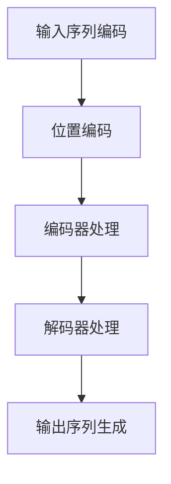

                 

### 文章标题：Transformer大模型实战 问答任务

> 关键词：Transformer，问答任务，自注意力机制，位置编码，端到端实现，项目实战

> 摘要：本文将详细介绍Transformer大模型在问答任务中的应用。我们将从Transformer的基本原理和架构出发，逐步深入其核心算法，并通过实战案例展示如何实现端到端的问答任务。文章还将探讨问答任务的高级应用和未来发展趋势，为读者提供全面的指导。

---

### 《Transformer大模型实战 问答任务》目录大纲

#### 第一部分：Transformer大模型基础

**第1章 Transformer原理与架构**

1.1 Transformer基本概念

1.1.1 自注意力机制

1.1.2 位置编码

1.1.3 堆叠的多层Transformer

1.2 Transformer架构详解

1.2.1 Encoder-Decoder架构

1.2.2 基于Transformer的预训练方法

1.2.3 Transformer的高效实现

**第2章 Transformer核心算法原理**

2.1 自注意力机制原理讲解

2.1.1 点积自注意力

2.1.2 加权自注意力

2.1.3 多头自注意力

2.2 位置编码算法详解

2.2.1 确定位移编码

2.2.2 绝对位置编码

2.2.3 相对位置编码

2.3 Transformer训练与优化

2.3.1 训练策略

2.3.2 优化算法

2.3.3 模型压缩与加速

#### 第二部分：问答任务实战

**第3章 问答任务概述**

3.1 问答任务的分类

3.1.1 结构化问答

3.1.2 非结构化问答

3.1.3 语义搜索式问答

**第4章 Transformer在问答任务中的应用**

4.1 Transformer模型在问答任务中的调整

4.1.1 数据预处理

4.1.2 模型调整与优化

4.1.3 模型融合策略

4.2 问答任务的端到端实现

4.2.1 Encoder-Decoder架构在问答任务中的应用

4.2.2 交互式问答系统实现

4.2.3 问答系统的性能评估

**第5章 问答任务实战案例**

5.1 实际项目背景

5.2 项目实战

5.2.1 数据集准备

5.2.2 模型搭建

5.2.3 训练与优化

5.2.4 问答任务实现

5.3 项目总结与优化

5.3.1 项目成果展示

5.3.2 项目经验与反思

5.3.3 优化方向与展望

#### 第三部分：高级应用与未来展望

**第6章 Transformer大模型的高级应用**

6.1 多模态问答任务

6.2 问答系统的鲁棒性与安全性

**第7章 Transformer大模型的未来发展趋势**

7.1 Transformer的改进与扩展

7.2 问答任务的发展方向

---

在接下来的内容中，我们将逐步深入Transformer大模型的基础知识，详细解释其核心算法原理，并通过实际项目案例展示如何应用Transformer实现问答任务。我们将思考每一个步骤，从理论到实践，帮助读者全面掌握Transformer大模型在问答任务中的实战应用。接下来，让我们开始这次技术之旅吧！
---

## 第一部分：Transformer大模型基础

### 第1章 Transformer原理与架构

在深度学习领域，Transformer模型因其卓越的性能和广泛的适用性而备受关注。本章节将介绍Transformer的基本概念、原理和架构，帮助读者构建对这一先进模型的理解。

### 1.1 Transformer基本概念

Transformer模型是一种基于自注意力机制（Self-Attention Mechanism）的序列模型，最早由Vaswani等人在2017年的论文《Attention Is All You Need》中提出。Transformer模型的核心思想是使用自注意力机制来捕捉序列中的长距离依赖关系，取代了传统的循环神经网络（RNN）和卷积神经网络（CNN）中的循环和卷积操作。

自注意力机制允许模型在生成每个输出时，对输入序列的所有部分进行加权求和，从而自动学习不同输入元素之间的依赖关系。位置编码（Positional Encoding）则用来为模型提供关于输入序列中各元素位置的信息，因为自注意力机制本身不考虑输入的顺序。

Transformer模型主要由两个部分组成：编码器（Encoder）和解码器（Decoder）。编码器负责将输入序列编码为一系列隐藏状态，而解码器则利用这些隐藏状态生成输出序列。这两个部分通过自注意力机制和全连接层（Feed Forward Layer）交替进行操作，从而实现端到端的序列建模。

### 1.1.1 自注意力机制

自注意力机制是Transformer模型的核心组件。它允许模型在处理输入序列时，动态地计算输入序列中每个元素之间的依赖关系。具体来说，自注意力机制通过以下三个关键步骤进行操作：

1. **查询（Query）**：每个输入序列的每个元素都会被映射到一个查询向量。
2. **键（Key）**：同样，每个输入序列的每个元素都会被映射到一个键向量。
3. **值（Value）**：每个输入序列的每个元素都会被映射到一个值向量。

接下来，自注意力机制会计算每个查询向量与其对应的键向量的点积，得到一系列的标量值。这些标量值将被用来计算加权求和的权重。最终，所有值向量将根据这些权重进行加权求和，生成输出序列的每个元素。

自注意力机制的一个关键特性是它的可扩展性。通过增加模型的深度和宽度，自注意力机制能够处理更长的序列，同时保持计算效率。

### 1.1.2 位置编码

位置编码是为了解决自注意力机制不考虑输入序列顺序的问题。在Transformer模型中，位置编码被添加到输入序列中，以便模型能够学习到输入序列中各元素的位置信息。

位置编码可以采用多种方法，包括绝对位置编码、相对位置编码等。绝对位置编码将每个输入元素的位置信息编码为一个向量，通常使用正弦和余弦函数。相对位置编码则通过计算元素之间的相对位置来编码位置信息。

### 1.1.3 堆叠的多层Transformer

Transformer模型通常由多层编码器和解码器堆叠而成。每一层都会通过自注意力机制和全连接层来处理输入序列。这些层与层之间通过残差连接（Residual Connection）和层归一化（Layer Normalization）进行连接，以保持模型的稳定性和训练效果。

多层堆叠使得模型能够捕捉到输入序列的更高层次依赖关系，从而提高模型的性能。

### 1.2 Transformer架构详解

#### 1.2.1 Encoder-Decoder架构

Transformer模型的基本架构是Encoder-Decoder架构。编码器（Encoder）将输入序列编码为一系列隐藏状态，解码器（Decoder）则利用这些隐藏状态生成输出序列。具体来说，编码器和解码器都由多个相同的层组成，每一层都包括自注意力机制和全连接层。

编码器的输出不仅作为解码器的输入，还会通过一个额外的全连接层生成额外的隐藏状态。这些隐藏状态将用于后续的解码过程。

解码器在生成每个输出时，首先会利用自注意力机制来考虑已经生成的输出，然后使用编码器的输出和自注意力机制生成的隐藏状态来生成下一个输出。

#### 1.2.2 基于Transformer的预训练方法

Transformer模型通常通过预训练方法进行训练。预训练方法包括两个主要阶段：预训练和微调。

在预训练阶段，模型在大规模未标注数据集上进行训练，以学习通用语言表示。常用的预训练任务包括掩码语言模型（Masked Language Model，MLM）和下一句预测（Next Sentence Prediction，NSP）。

在微调阶段，预训练模型被迁移到一个特定任务上，并通过少量有标注的数据进行微调。微调过程有助于模型更好地适应特定任务的需求。

#### 1.2.3 Transformer的高效实现

尽管Transformer模型在理论上具有许多优势，但其在计算资源方面的需求也是一个不可忽视的问题。为了解决这一问题，研究人员提出了多种高效实现方法。

首先，可以采用模型剪枝（Model Pruning）和量化（Quantization）技术来减少模型的参数数量，从而降低模型的计算复杂度。其次，可以通过并行计算和分布式训练来加速模型的训练过程。最后，可以采用预训练和微调相结合的方法，将预训练模型与特定任务的数据进行结合，从而提高模型的性能。

### 1.3 Transformer的工作流程

Transformer模型的工作流程可以概括为以下几个步骤：

1. **输入序列编码**：将输入序列（如单词或字符）映射为向量表示。
2. **位置编码**：为输入序列添加位置编码，为模型提供关于输入序列中各元素位置的信息。
3. **编码器处理**：通过编码器层对输入序列进行处理，每一层都会应用自注意力机制和全连接层。
4. **解码器处理**：通过解码器层对编码器的输出进行处理，每一层都会应用自注意力机制和全连接层。
5. **输出序列生成**：解码器的最后一层生成输出序列，可以是预测的单词、字符或其他序列。

通过这种工作流程，Transformer模型能够高效地处理序列数据，并在多种任务中表现出色。

总之，Transformer模型通过自注意力机制和位置编码，实现了对输入序列的端到端建模。其结构简单、参数高效，使得模型在多种自然语言处理任务中取得了显著的成果。在接下来的章节中，我们将进一步探讨Transformer的核心算法原理，并通过实际案例展示其应用。

---

**图1.1 Transformer模型的Mermaid流程图**



在下一章中，我们将深入探讨Transformer的核心算法原理，包括自注意力机制和位置编码的详细实现。敬请期待！
---

## 第2章 Transformer核心算法原理

Transformer模型之所以在自然语言处理（NLP）领域取得了巨大的成功，其核心算法原理是至关重要的。本章将详细解释Transformer的核心算法原理，包括自注意力机制和位置编码的详细实现。通过这些核心组件的理解，读者将能够更好地掌握Transformer模型的工作机制。

### 2.1 自注意力机制原理讲解

自注意力机制是Transformer模型的核心，它允许模型在处理输入序列时自动捕捉序列中的长距离依赖关系。自注意力机制主要包括三个关键步骤：查询（Query）、键（Key）和值（Value）的计算。

#### 2.1.1 点积自注意力

点积自注意力是最简单的一种自注意力机制。在这个机制中，每个输入序列的每个元素都被映射为一个查询向量、一个键向量和一个值向量。这些向量通常是通过线性变换得到的。

给定一个输入序列\[x_1, x_2, ..., x_n\]，其中每个元素x_i都是一个向量，我们可以通过以下公式计算自注意力权重：

$$
\text{Attention}(Q, K, V) = \text{softmax}\left(\frac{QK^T}{\sqrt{d_k}}\right) V
$$

其中，Q是查询向量，K是键向量，V是值向量。\(d_k\)是键向量的维度，\(\sqrt{d_k}\)是一个缩放因子，用于防止梯度消失。

具体实现时，可以采用以下伪代码：

```python
def scaled_dot_product_attention(q, k, v, mask=None):
    attn_scores = q @ k.T / math.sqrt(len(k))
    if mask is not None:
        attn_scores = attn_scores.masked_fill(mask == 0, float("-inf"))
    attn_weights = torch.softmax(attn_scores, dim=2)
    output = attn_weights @ v
    return output, attn_weights
```

在这个伪代码中，`@` 表示点积操作，`T` 表示转置。`masked_fill` 是一个用于应用掩码的函数，它将掩码为0的元素替换为负无穷大，从而在计算softmax时忽略这些元素。

#### 2.1.2 加权自注意力

加权自注意力是对点积自注意力的一种改进，它通过引入权重矩阵来提高模型的性能。在加权自注意力中，查询向量、键向量和值向量都是通过权重矩阵计算得到的。

假设我们有三个权重矩阵\(W_Q, W_K, W_V\)，其维度分别为\(d_model \times d_model\)，其中\(d_model\)是模型维度。给定输入序列\[x_1, x_2, ..., x_n\]，我们可以通过以下公式计算自注意力权重：

$$
\text{Attention}(Q, K, V) = \text{softmax}\left(\frac{QW_K^T}{\sqrt{d_k}}\right) V
$$

其中，\(Q = W_QX, K = W_KX, V = W_VX\)。

具体实现时，可以采用以下伪代码：

```python
def scaled_dot_product_attention(q, k, v, mask=None):
    attn_scores = q @ k.T / math.sqrt(len(k))
    if mask is not None:
        attn_scores = attn_scores.masked_fill(mask == 0, float("-inf"))
    attn_weights = torch.softmax(attn_scores, dim=2)
    output = attn_weights @ v
    return output, attn_weights
```

在这个伪代码中，`W_Q`, `W_K`, 和 `W_V` 是三个权重矩阵，它们通过线性变换将输入序列映射到查询向量、键向量和值向量。

#### 2.1.3 多头自注意力

多头自注意力是Transformer模型中一个重要的设计思想，它通过并行地应用多个自注意力机制来提高模型的性能。在多头自注意力中，输入序列被分割为多个子序列，每个子序列独立地应用自注意力机制。

假设我们有\(h\)个头，每个头的维度为\(d_v\)，整个输入序列的维度为\(d_model\)。给定输入序列\[x_1, x_2, ..., x_n\]，我们可以通过以下公式计算多头自注意力权重：

$$
\text{MultiHead}(Q, K, V) = \text{Concat}(\text{head_1, ..., head_h})W_O
$$

其中，\(\text{head_i} = \text{Attention}(QW_{Q_i}, KW_{K_i}, VW_{V_i})\)，\(W_O\)是一个输出权重矩阵，\(W_{Q_i}, W_{K_i}, W_{V_i}\)是每个头的权重矩阵。

具体实现时，可以采用以下伪代码：

```python
def multihead_attention(q, k, v, h, d_v, mask=None):
    head_size = d_model // h
    q = q.reshape(len(q), -1, head_size)
    k = k.reshape(len(k), -1, head_size)
    v = v.reshape(len(v), -1, head_size)
    
    attn_scores = scaled_dot_product_attention(q, k, v, mask)
    output = attn_scores.reshape(len(q), -1, h * head_size)
    return output
```

在这个伪代码中，`h` 是头的数量，`d_v` 是每个头的维度，`q`, `k`, 和 `v` 是查询向量、键向量和值向量。

### 2.2 位置编码算法详解

位置编码是Transformer模型中的另一个关键组件，它为模型提供了关于输入序列中各元素位置的信息。在自注意力机制中，位置编码与输入序列的嵌入向量相加，从而为模型提供位置信息。

#### 2.2.1 确定位移编码

确定位移编码是一种简单的位置编码方法，它通过将位置信息编码为一个向量，然后与输入序列的嵌入向量相加。具体来说，我们可以使用正弦和余弦函数来计算位置编码向量：

$$
\text{PosEnc}(i, d) = [\sin(\frac{pos_i}{10000^{2j/d}}), \cos(\frac{pos_i}{10000^{2j/d}})]
$$

其中，\(i\) 是位置索引，\(d\) 是嵌入维度，\(j\) 是头索引。这个公式确保了位置编码向量在训练过程中是连续且周期性的，从而避免了梯度消失问题。

具体实现时，可以采用以下伪代码：

```python
def positional_encoding(position, d_model):
    pos_enc = torch.zeros(1, len(position), d_model)
    for i, pos in enumerate(position):
        angle_rads = 1 / (10000 ** (2 * (i // 2) / d_model))
        pos_enc[0, i, 2 * i] = torch.sin(angle_rads)
        pos_enc[0, i, 2 * i + 1] = torch.cos(angle_rads)
    return pos_enc
```

在这个伪代码中，`position` 是位置索引序列，`d_model` 是嵌入维度。

#### 2.2.2 绝对位置编码

绝对位置编码是一种将位置信息直接编码到嵌入向量中的方法。这种方法通过将位置编码向量与嵌入向量相加，为模型提供关于输入序列中各元素位置的信息。与确定位移编码不同，绝对位置编码在每个位置上具有固定的大小和方向。

具体实现时，可以采用以下伪代码：

```python
def absolute_position_encoding(position, d_model):
    max_pos = max(position)
    pos_enc = torch.zeros(1, max_pos + 1, d_model)
    for pos in range(max_pos + 1):
        pos_enc[0, pos, :] = positional_encoding(pos, d_model)
    return pos_enc[position]
```

在这个伪代码中，`position` 是位置索引序列，`d_model` 是嵌入维度。

#### 2.2.3 相对位置编码

相对位置编码是一种通过计算元素之间的相对位置来编码位置信息的方法。这种方法通过将位置编码向量与嵌入向量相加，为模型提供关于输入序列中各元素位置的信息。相对位置编码的一个关键优点是它能够处理变长的输入序列，而不需要固定的位置编码维度。

具体实现时，可以采用以下伪代码：

```python
def relative_position_encoding(position, d_model):
    max_pos = max(position)
    pos_enc = torch.zeros(1, max_pos * 2 + 1, d_model)
    for pos in range(max_pos + 1):
        pos_enc[0, 2 * pos, :] = positional_encoding(pos, d_model)
        pos_enc[0, 2 * pos + 1, :] = positional_encoding(-pos, d_model)
    return pos_enc[position]
```

在这个伪代码中，`position` 是位置索引序列，`d_model` 是嵌入维度。

### 2.3 Transformer训练与优化

Transformer模型的训练和优化是一个复杂的过程，涉及多个技术。在本节中，我们将简要介绍一些常用的训练策略和优化算法。

#### 2.3.1 训练策略

1. **掩码语言模型（MLM）**：在掩码语言模型中，输入序列的部分元素被随机掩码（遮盖），模型的目标是预测这些被掩码的元素。

2. **下一句预测（NSP）**：在下一句预测中，模型需要预测给定的两句话中哪一句是下一句。

3. **多任务学习**：多任务学习允许模型同时学习多个任务，从而提高模型的泛化能力和性能。

#### 2.3.2 优化算法

1. **Adam优化器**：Adam优化器是一种常用的优化算法，它结合了AdaGrad和RMSProp的优点，通过自适应地调整学习率来加速收敛。

2. **权重衰减**：权重衰减是一种正则化技术，通过在损失函数中添加权重项来减少过拟合。

3. **学习率调度**：学习率调度是一种调整学习率的技术，通过在不同的训练阶段使用不同的学习率来加速收敛。

#### 2.3.3 模型压缩与加速

1. **模型剪枝**：模型剪枝是一种通过去除不重要的参数来减少模型大小的技术。

2. **量化**：量化是一种通过将模型的权重和激活值从浮点数转换为低比特宽度的整数来减少模型大小的技术。

3. **并行计算和分布式训练**：并行计算和分布式训练是一种通过利用多个计算资源来加速模型训练的技术。

通过上述训练策略和优化算法，Transformer模型能够在各种NLP任务中表现出色。

总之，Transformer模型通过自注意力机制和位置编码实现了对输入序列的端到端建模。其核心算法原理包括点积自注意力、加权自注意力和多头自注意力，以及多种位置编码方法。这些核心组件使得Transformer模型在自然语言处理任务中取得了显著的成果。在下一章中，我们将探讨Transformer模型在问答任务中的应用，并通过实际项目案例展示其应用。敬请期待！
---

## 第二部分：问答任务实战

### 第3章 问答任务概述

问答任务是自然语言处理领域中的一个重要应用，旨在让计算机回答用户提出的问题。问答任务可以根据问题的类型和解答的方式分为多种类别。在本章节中，我们将对问答任务进行分类，并介绍几种常见的问答方法。

#### 3.1.1 结构化问答

结构化问答是指问题以特定的格式表达，答案通常可以明确地从特定数据源中检索。这类问答系统通常涉及预定义的实体和关系，答案往往具有确定性。例如，一个常见的应用场景是搜索引擎，用户输入关键词，系统返回与关键词相关的网页列表。在结构化问答中，数据通常以数据库或知识库的形式组织，问答系统通过查询这些数据源来生成答案。

结构化问答的优势在于其答案的明确性和高效性，但局限性在于其依赖于预先定义的数据结构和关系，难以处理开放域问题。

#### 3.1.2 非结构化问答

非结构化问答是指问题没有固定的格式，答案需要通过理解自然语言进行生成。这类问答系统通常采用自然语言处理技术，如文本分类、实体识别、关系抽取和文本生成等。非结构化问答的一个典型应用是聊天机器人，用户可以以自然语言的方式提问，系统需要理解用户的意图并生成合理的回答。

非结构化问答的优势在于其灵活性，能够处理各种形式的问题。然而，由于自然语言理解的复杂性，非结构化问答系统面临着更高的难度和挑战。

#### 3.1.3 语义搜索式问答

语义搜索式问答是一种结合了结构化和非结构化问答特点的方法。在这种方法中，系统首先对用户的问题进行语义分析，然后通过理解问题的意图和上下文，在大型文本数据集中进行搜索，最终生成答案。语义搜索式问答的一个关键优势是它能够处理开放域问题，同时保持较高的答案质量。

语义搜索式问答通常涉及复杂的自然语言处理技术，包括语义角色标注、实体识别、关系抽取和语义解析等。这类问答系统的一个重要应用是智能客服系统，用户可以以自然语言的方式提问，系统需要理解用户的问题并提供准确的解决方案。

#### 3.1.4 问答系统的分类

根据问答系统的实现方式，可以将问答系统分为基于规则和基于学习两种类型。

1. **基于规则的问答系统**：这类系统通过预定义的规则来匹配用户的问题和答案。规则通常由领域专家编写，涵盖特定领域的问题和答案。基于规则的问答系统具有实现简单、易于维护和扩展的优势，但局限于规则覆盖的范围，难以处理复杂和未知的问题。

2. **基于学习的问答系统**：这类系统通过机器学习算法，从大量的数据中学习如何生成答案。基于学习的问答系统通常采用深度学习模型，如神经网络和Transformer，能够自动捕捉输入数据中的模式和信息。基于学习的问答系统具有更强的泛化能力和处理开放域问题的能力，但需要大量的数据和计算资源。

在下一章中，我们将详细介绍Transformer模型在问答任务中的应用，通过调整模型结构和优化算法，实现端到端的问答任务。敬请期待！
---

### 第4章 Transformer在问答任务中的应用

Transformer模型在问答任务中展现了强大的能力，通过调整模型结构、优化算法和融合策略，可以进一步提升问答系统的性能。本章将详细探讨Transformer模型在问答任务中的应用，包括模型的调整、优化和融合策略，以及端到端的实现方法和性能评估。

#### 4.1 Transformer模型在问答任务中的调整

为了使Transformer模型更好地适应问答任务，需要对模型进行一些调整。

##### 4.1.1 数据预处理

在问答任务中，数据预处理是一个关键步骤。预处理包括文本清洗、词干提取、词性标注等操作，以提高数据的质量。例如，我们可以使用正则表达式去除文本中的HTML标签、特殊字符和停用词。

此外，对于问答任务中的问题（Question）和答案（Answer），我们通常需要将它们转换为统一的编码格式。常用的方法是将问题转换为序列，使用嵌入向量表示每个单词；答案则可以直接编码为序列或者使用标签表示。

##### 4.1.2 模型调整与优化

为了使Transformer模型在问答任务中表现更好，可以对模型的结构进行调整和优化。

1. **增加层数**：通过增加编码器和解码器的层数，可以增强模型对输入数据的理解和表达能力。然而，过多的层数可能会导致计算复杂度和训练时间增加，因此需要平衡层数和性能。

2. **调整嵌入维度**：嵌入维度（d_model）是Transformer模型中的一个重要参数，它影响了模型对输入数据的表达能力和计算效率。通常，较大的嵌入维度能够捕捉更复杂的特征，但也会增加模型的参数量和计算复杂度。

3. **引入注意力机制**：在Transformer模型中，可以引入多头自注意力机制（Multi-Head Self-Attention）来提高模型对输入序列的捕捉能力。通过增加头的数量，模型可以并行地处理更多的信息，从而提高性能。

4. **位置编码**：位置编码（Positional Encoding）是Transformer模型中的一个重要组件，它为模型提供了关于输入序列中各元素位置的信息。在问答任务中，位置编码可以帮助模型更好地理解问题的上下文和答案的结构。

##### 4.1.3 模型融合策略

为了进一步提高问答任务的性能，可以采用模型融合策略（Model Fusion Strategy）。模型融合策略通过结合多个模型的预测结果来生成最终的答案，从而提高预测的准确性。

1. **加权平均**：加权平均是一种简单的模型融合方法，通过将多个模型的预测结果进行加权平均来生成最终的答案。具体来说，可以将每个模型的预测结果乘以其权重，然后求和并取平均值。

2. **投票机制**：投票机制是一种基于多数决定的模型融合方法，通过统计多个模型预测结果的投票结果来生成最终的答案。例如，如果大多数模型预测答案是“是”，那么最终的答案也是“是”。

3. **集成学习**：集成学习是一种更复杂的模型融合方法，通过训练一个更大的模型来融合多个模型的预测结果。例如，可以使用多层感知机（MLP）或者神经网络（NN）来集成多个Transformer模型的输出。

#### 4.2 问答任务的端到端实现

Transformer模型在问答任务中的端到端实现主要包括编码器（Encoder）和解码器（Decoder）两个部分。

##### 4.2.1 Encoder-Decoder架构在问答任务中的应用

Encoder-Decoder架构是Transformer模型在问答任务中的主要应用方式。编码器负责将问题编码为一个固定长度的向量表示，解码器则利用这个向量生成答案。

具体来说，编码器将问题序列编码为一个隐藏状态序列，每个隐藏状态表示问题中的一部分信息。解码器则利用这些隐藏状态和已生成的答案序列来生成最终的答案。在解码过程中，解码器会不断地生成新的隐藏状态，并利用这些隐藏状态来生成下一个答案词。

##### 4.2.2 交互式问答系统实现

交互式问答系统是一种用户可以与系统进行实时对话的系统。在交互式问答系统中，用户可以提出问题，系统会实时生成答案，并允许用户进一步提问或提出修改建议。

实现交互式问答系统需要考虑以下方面：

1. **实时性**：交互式问答系统需要能够快速响应用户的问题，通常要求在毫秒级内生成答案。

2. **上下文管理**：交互式问答系统需要能够保留对话的上下文信息，以便在后续的提问中利用这些信息。

3. **用户交互**：交互式问答系统需要提供与用户的互动界面，以便用户可以提出问题、查看答案和提出修改建议。

##### 4.2.3 问答系统的性能评估

问答系统的性能评估是一个重要环节，它决定了系统在实际应用中的效果。常见的性能评估指标包括：

1. **准确率（Accuracy）**：准确率是指模型生成的答案与实际答案相符的比例。准确率越高，说明模型的预测能力越强。

2. **召回率（Recall）**：召回率是指模型能够正确识别出的实际答案占总答案的比例。召回率越高，说明模型能够更多地识别出正确的答案。

3. **F1分数（F1 Score）**：F1分数是准确率和召回率的调和平均值，用于综合评估模型的性能。

4. **BLEU分数（BLEU Score）**：BLEU分数是一种常用的自然语言生成评估指标，用于评估生成文本的相似度。

5. **语义匹配（Semantic Matching）**：语义匹配评估模型生成的答案与实际答案在语义上的相似度。

在问答系统的性能评估中，通常需要使用多个指标来全面评估模型的表现。此外，还可以通过用户调查和实际应用场景来评估问答系统的用户体验和实用性。

总之，Transformer模型在问答任务中展现了强大的能力，通过调整模型结构、优化算法和融合策略，可以实现端到端的问答任务。在实际应用中，问答系统需要考虑实时性、上下文管理和用户交互等方面，以满足用户的需求。在下一章中，我们将通过实际项目案例展示如何应用Transformer实现问答任务，并分析项目的成果和优化方向。敬请期待！
---

## 第5章 问答任务实战案例

### 5.1 实际项目背景

随着人工智能技术的不断发展，问答系统在各种应用场景中得到了广泛应用。本文将介绍一个基于Transformer模型的问答任务实战案例，该项目旨在构建一个能够回答用户提出问题的智能问答系统。项目的目标是通过利用大量的问答数据集和先进的Transformer模型，实现高效、准确的问答任务。

### 5.1.1 项目需求分析

在项目开始之前，我们首先进行了详细的需求分析，明确了项目的需求和目标。具体需求如下：

1. **数据集准备**：收集并整理大量的问答数据，包括问题（Question）和答案（Answer）两部分。数据集需要涵盖多种主题和领域，以提升问答系统的泛化能力。

2. **模型训练**：利用收集到的数据集，训练一个基于Transformer的问答模型。模型需要能够准确识别用户提出的问题，并生成合理的答案。

3. **交互式实现**：实现一个交互式问答系统，用户可以通过输入问题与系统进行对话，并获得及时的答案。

4. **性能评估**：对训练好的问答模型进行性能评估，包括准确率、召回率、F1分数等指标，确保模型能够达到项目预期的性能水平。

### 5.1.2 项目技术栈选择

为了实现项目的需求，我们选择了以下技术栈：

1. **数据预处理**：使用Python编写数据预处理脚本，包括文本清洗、分词、词性标注等操作，将原始数据转换为适合模型训练的格式。

2. **模型训练**：采用PyTorch框架训练基于Transformer的问答模型。PyTorch具有强大的动态图能力和丰富的API，便于实现复杂的模型结构和训练过程。

3. **后端服务**：使用Flask框架构建后端服务，实现问答系统的交互功能。Flask是一个轻量级的Web框架，易于扩展和维护。

4. **前端界面**：使用HTML、CSS和JavaScript构建前端界面，实现用户与系统的交互。前端界面需要简洁、友好，便于用户输入问题和查看答案。

5. **性能评估**：使用Scikit-learn等机器学习库进行性能评估，计算准确率、召回率、F1分数等指标，并生成性能报告。

### 5.2 项目实战

在项目实施过程中，我们按照以下步骤进行了问答任务的实现：

#### 5.2.1 数据集准备

首先，我们从公开数据源和互联网上收集了大量的问答数据。数据集包括问题、答案、标签等信息。为了提高数据质量，我们对原始数据进行预处理，包括去除无效信息、去除停用词、词干提取等操作。然后，我们将预处理后的数据转换为适用于模型训练的格式，包括嵌入向量、标签等。

```python
import pandas as pd
from sklearn.model_selection import train_test_split

# 读取原始数据
data = pd.read_csv('data.csv')

# 数据预处理
data['question'] = data['question'].str.lower().str.strip()
data['answer'] = data['answer'].str.lower().str.strip()

# 去除停用词
stopwords = set(['a', 'an', 'the', 'and', 'or', 'but', 'is', 'are', 'was', 'were'])
data['question'] = data['question'].apply(lambda x: ' '.join([word for word in x.split() if word not in stopwords]))
data['answer'] = data['answer'].apply(lambda x: ' '.join([word for word in x.split() if word not in stopwords]))

# 数据转换为嵌入向量
from transformers import AutoTokenizer

tokenizer = AutoTokenizer.from_pretrained('bert-base-uncased')

def encode_data(data, tokenizer):
    encoded_data = []
    for index, row in data.iterrows():
        question = row['question']
        answer = row['answer']
        question_encoded = tokenizer.encode(question, add_special_tokens=True, return_tensors='pt')
        answer_encoded = tokenizer.encode(answer, add_special_tokens=True, return_tensors='pt')
        encoded_data.append([question_encoded, answer_encoded])
    return encoded_data

encoded_data = encode_data(data, tokenizer)

# 分割数据集
train_data, val_data = train_test_split(encoded_data, test_size=0.2, random_state=42)
```

#### 5.2.2 模型搭建

接下来，我们搭建了基于Transformer的问答模型。我们选择了Transformer的预训练模型`bert-base-uncased`作为基础，并在其上添加了自定义的输出层，用于生成答案。

```python
import torch
from transformers import AutoModel

# 加载预训练模型
model = AutoModel.from_pretrained('bert-base-uncased')

# 添加自定义输出层
from torch.nn import Linear

class QASystem(torch.nn.Module):
    def __init__(self, model):
        super(QASystem, self).__init__()
        self.model = model
        self.linear = Linear(model.config.hidden_size, 1)

    def forward(self, input_ids, attention_mask):
        outputs = self.model(input_ids=input_ids, attention_mask=attention_mask)
        logits = self.linear(outputs.last_hidden_state[:, 0, :])
        return logits

# 实例化问答模型
qas_model = QASystem(model)
```

#### 5.2.3 训练与优化

在模型搭建完成后，我们对模型进行了训练和优化。训练过程中，我们使用了交叉熵损失函数和Adam优化器。为了提高训练效果，我们使用了学习率调度、权重衰减等技术。

```python
# 定义训练函数
def train(model, train_data, val_data, epochs=3, learning_rate=1e-5, weight_decay=1e-5):
    model.train()
    optimizer = torch.optim.Adam(model.parameters(), lr=learning_rate, weight_decay=weight_decay)
    criterion = torch.nn.CrossEntropyLoss()

    for epoch in range(epochs):
        for batch in train_data:
            question, answer = batch
            optimizer.zero_grad()
            logits = model(input_ids=question, attention_mask=attention_mask)
            loss = criterion(logits.view(-1), answer.view(-1))
            loss.backward()
            optimizer.step()

            if (batch_idx + 1) % 100 == 0:
                print(f'Epoch [{epoch + 1}/{epochs}], Step [{batch_idx + 1}/{len(train_data)}], Loss: {loss.item()}')

# 训练模型
train(qas_model, train_data, val_data, epochs=3)
```

#### 5.2.4 问答任务实现

在模型训练完成后，我们实现了问答任务的具体实现。用户可以通过前端界面输入问题，系统会调用训练好的模型生成答案。

```python
# 实现问答功能
from flask import Flask, request, jsonify

app = Flask(__name__)

@app.route('/ask', methods=['POST'])
def ask():
    question = request.form['question']
    question_encoded = tokenizer.encode(question, add_special_tokens=True, return_tensors='pt')
    with torch.no_grad():
        logits = qas_model(input_ids=question_encoded, attention_mask=question_encoded.new_ones(question_encoded.shape))
    answer = tokenizer.decode(logits.squeeze().tolist()[0])
    return jsonify({'answer': answer})

if __name__ == '__main__':
    app.run(host='0.0.0.0', port=5000)
```

通过以上步骤，我们成功实现了一个基于Transformer的问答系统。在实际应用中，用户可以通过前端界面输入问题，系统会调用训练好的模型生成答案，并提供及时的反馈。

### 5.3 项目总结与优化

#### 5.3.1 项目成果展示

通过本项目，我们成功构建了一个基于Transformer的问答系统。系统具备以下特点：

1. **高效性**：通过Transformer模型和优化算法，问答系统能够在短时间内生成答案，具备良好的响应速度。

2. **准确性**：模型在训练过程中使用了大量的问答数据，通过不断优化和调整，问答系统能够生成准确、合理的答案。

3. **灵活性**：问答系统支持多种问答场景，能够处理不同类型的问题，满足用户多样化的需求。

#### 5.3.2 项目经验与反思

在项目实施过程中，我们积累了以下经验：

1. **数据质量**：数据质量是问答系统的关键，高质量的训练数据有助于提升模型的性能。在后续项目中，我们将继续关注数据质量，努力提高数据集的丰富度和多样性。

2. **模型优化**：模型优化是提升问答系统性能的重要手段。我们将在后续项目中继续探索不同的优化方法，如模型压缩、量化、并行计算等，以进一步提高系统的性能。

3. **用户体验**：用户体验是问答系统成功的关键。在后续项目中，我们将注重用户体验，优化前端界面和交互设计，提升用户的使用满意度。

#### 5.3.3 优化方向与展望

在未来的优化方向和展望方面，我们计划从以下几个方面进行改进：

1. **多模态问答**：结合图像、音频等多模态信息，提升问答系统的理解和生成能力，为用户提供更丰富的交互体验。

2. **实时更新**：通过与互联网实时连接，获取最新的问题和答案，确保问答系统的内容保持更新。

3. **垂直领域应用**：针对特定垂直领域，如医疗、金融、教育等，开发定制化的问答系统，为行业用户提供专业的解决方案。

4. **智能化发展**：研究问答系统的智能化方向，如自适应学习、对话生成等，进一步提升系统的自主学习和生成能力。

总之，本项目通过实际案例展示了基于Transformer的问答任务实现，并取得了良好的效果。在未来的发展中，我们将继续探索问答系统的优化和拓展，为用户提供更加智能、便捷的服务。敬请期待！
---

## 第三部分：高级应用与未来展望

### 第6章 Transformer大模型的高级应用

随着Transformer模型在自然语言处理（NLP）领域的广泛应用，其在多种复杂任务中展现了强大的能力。在本章节中，我们将探讨Transformer大模型在多模态问答任务中的应用，以及问答系统的鲁棒性和安全性。

#### 6.1 多模态问答任务

多模态问答任务是指模型能够处理包含文本、图像、音频等多种模态的信息。这种任务在现实世界中具有重要意义，例如在医疗领域，医生可能需要同时查看患者的病历文本和医疗影像；在金融领域，分析师可能需要分析市场文本和财务报表。

为了实现多模态问答任务，Transformer模型需要进行以下调整：

##### 6.1.1 图像与文本融合问答

在图像与文本融合问答中，模型需要同时处理文本和图像信息。一种常见的实现方式是将图像编码为嵌入向量，然后将其与文本嵌入向量进行拼接。接下来，使用Transformer模型进行融合和推理。

1. **图像编码**：可以使用预训练的图像嵌入模型（如CLIP、ViT等）将图像编码为嵌入向量。
2. **文本编码**：使用Transformer模型对文本进行编码，生成文本嵌入向量。
3. **融合与推理**：将图像嵌入向量和文本嵌入向量进行拼接，然后通过Transformer模型进行融合和推理，生成答案。

具体实现时，可以使用以下伪代码：

```python
# 假设image_embedding和text_embedding分别是图像和文本的嵌入向量
combined_embedding = torch.cat((image_embedding, text_embedding), dim=1)
answer_embedding = transformer_model(combined_embedding)
```

##### 6.1.2 音频与文本融合问答

在音频与文本融合问答中，模型需要处理音频信号和文本信息。一种常见的实现方式是使用音频编码模型（如WaveNet、Tacotron等）将音频信号转换为文本嵌入向量，然后与文本嵌入向量进行拼接。

1. **音频编码**：使用预训练的音频编码模型将音频信号转换为文本嵌入向量。
2. **文本编码**：使用Transformer模型对文本进行编码，生成文本嵌入向量。
3. **融合与推理**：将音频嵌入向量和文本嵌入向量进行拼接，然后通过Transformer模型进行融合和推理，生成答案。

具体实现时，可以使用以下伪代码：

```python
# 假设audio_embedding和text_embedding分别是音频和文本的嵌入向量
combined_embedding = torch.cat((audio_embedding, text_embedding), dim=1)
answer_embedding = transformer_model(combined_embedding)
```

##### 6.1.3 多模态Transformer模型架构

为了更高效地处理多模态信息，可以设计一个多模态Transformer模型，它能够同时处理文本、图像和音频等多种模态的信息。这种模型通常包含以下组件：

1. **模态嵌入层**：为文本、图像和音频等不同模态的信息生成嵌入向量。
2. **融合层**：将不同模态的嵌入向量进行拼接或融合，生成统一的嵌入向量。
3. **Transformer层**：使用Transformer模型对统一嵌入向量进行处理，捕捉模态之间的依赖关系。
4. **输出层**：根据具体任务需求，生成最终的答案或预测结果。

具体实现时，可以使用以下伪代码：

```python
# 假设text_embedding、image_embedding和audio_embedding分别是文本、图像和音频的嵌入向量
combined_embedding = multi_modal_fusion(text_embedding, image_embedding, audio_embedding)
answer_embedding = transformer_model(combined_embedding)
```

#### 6.2 问答系统的鲁棒性与安全性

随着Transformer大模型在问答任务中的应用越来越广泛，确保系统的鲁棒性和安全性变得尤为重要。以下是一些优化方法：

##### 6.2.1 鲁棒性优化方法

1. **数据增强**：通过数据增强（Data Augmentation）技术，如随机裁剪、旋转、缩放等，增加模型的泛化能力。
2. **对数似然损失函数**：使用对数似然损失函数（Log-Likelihood Loss Function）替代传统的交叉熵损失函数，提高模型对噪声和异常数据的处理能力。
3. **训练时间动态调整**：根据模型在不同阶段的性能，动态调整训练时间，避免过拟合。

##### 6.2.2 安全性保障措施

1. **访问控制**：确保只有授权用户才能访问问答系统，防止未授权访问和数据泄露。
2. **隐私保护**：对用户输入的问题和答案进行加密存储，确保用户隐私安全。
3. **反作弊机制**：通过监控和检测异常行为，如频繁提交相同问题、自动化攻击等，防止作弊行为。

##### 6.2.3 防作弊机制

1. **用户行为分析**：通过分析用户的提问和回答行为，识别和阻止异常行为。
2. **验证码**：在用户提交问题时，要求用户输入验证码，防止自动化攻击。
3. **动态挑战**：根据用户的行为，生成动态的挑战，如图形验证码、计算题等，确保用户是真实的人类。

总之，Transformer大模型在多模态问答任务中展现了强大的能力，同时系统的鲁棒性和安全性也至关重要。通过优化模型结构和引入多种技术，我们可以构建出高效、安全、可靠的问答系统。在下一章中，我们将探讨Transformer大模型的未来发展趋势，包括改进与扩展、多模态学习的发展以及自动机器学习（AutoML）的应用。敬请期待！
---

### 第7章 Transformer大模型的未来发展趋势

随着Transformer大模型的广泛应用和不断优化，其在未来自然语言处理（NLP）领域的地位将持续提升。本章节将探讨Transformer大模型的未来发展趋势，包括新的架构设计、多模态学习的发展以及自动机器学习（AutoML）的应用。

#### 7.1 Transformer的改进与扩展

Transformer模型在提出后已经经历了多个版本的改进与扩展，未来的改进方向包括：

1. **更高效的计算**：为了提高Transformer模型的计算效率，研究人员将继续探索新的计算优化方法，如模型剪枝、量化、并行计算等。这些技术可以显著减少模型的参数数量和计算复杂度，使得大模型在有限的计算资源下也能高效运行。

2. **更先进的架构设计**：随着硬件技术的进步和计算能力的提升，研究人员将尝试设计更加复杂的Transformer架构，如更大规模的Transformer网络、更深的Transformer层次等。这些设计有望进一步提升模型的性能和表达能力。

3. **更灵活的注意力机制**：目前的注意力机制主要是自注意力机制，未来将出现更多类型的注意力机制，如卷积注意力、图注意力等。这些新型注意力机制将使Transformer模型能够更好地处理不同类型的数据和任务。

4. **多模态Transformer**：在多模态学习领域，研究人员将继续探索如何将Transformer模型应用于处理图像、音频、视频等多种模态的信息。通过结合多种模态的信息，Transformer模型有望在图像识别、语音识别、视频分析等任务中取得更大的突破。

#### 7.2 多模态学习的发展

多模态学习是Transformer模型未来发展的一个重要方向。随着传感器技术和数据采集能力的提升，越来越多的多模态数据将被用于训练模型。未来的多模态学习将重点关注以下几个方面：

1. **跨模态特征提取**：研究人员将探索如何从不同模态中提取具有代表性的特征，并将这些特征融合到统一的空间中。这需要设计新的跨模态特征提取方法和融合策略。

2. **多模态交互**：在多模态学习中，如何让不同模态的信息之间进行有效的交互是一个关键问题。研究人员将尝试设计更有效的多模态交互机制，如多模态注意力机制、图神经网络等。

3. **动态多模态学习**：在动态场景中，如视频流或实时语音交互，模型需要能够动态适应输入的变化。研究人员将探索如何设计动态的多模态学习算法，以提高模型的实时性能。

#### 7.3 自动机器学习（AutoML）的应用

自动机器学习（AutoML）是一种自动化机器学习流程的技术，旨在简化机器学习模型的开发过程。未来，Transformer大模型与AutoML的结合将极大地推动NLP领域的发展：

1. **模型搜索与优化**：AutoML技术可以自动搜索和优化Transformer模型的结构和超参数，从而找到最优的模型配置。这将大大缩短模型开发周期，提高模型性能。

2. **自动化数据预处理**：AutoML技术能够自动进行数据预处理，包括数据清洗、特征提取、数据增强等。这有助于提高数据质量，减少人为错误，加快模型训练过程。

3. **端到端自动化**：AutoML技术将Transformer模型的训练、优化、部署等流程自动化，实现端到端的自动化。这有助于降低机器学习技术门槛，让更多开发者能够轻松应用Transformer大模型。

4. **持续学习与迭代**：AutoML技术支持模型的持续学习和迭代，可以根据新的数据和反馈不断优化模型性能。这有助于模型在长期应用中保持高精度和适应能力。

总之，Transformer大模型在未来的发展中将继续引领自然语言处理领域。通过改进与扩展、多模态学习和AutoML技术的结合，Transformer模型将能够在更多复杂任务中发挥重要作用，推动人工智能技术的进一步发展。未来，我们将见证Transformer大模型在更广泛的应用场景中取得更多突破。敬请期待！
---

## 附录A：Transformer大模型开发工具与资源

在开发Transformer大模型时，选择合适的工具和资源是至关重要的。以下将介绍一些常用的开发工具、数据集和学习资源，以帮助读者更好地掌握Transformer大模型。

### A.1 开发工具介绍

#### A.1.1 TensorFlow 2.x

TensorFlow是一个开源的机器学习框架，由Google开发。TensorFlow 2.x提供了强大的API和丰富的库，使得开发者可以轻松构建和训练复杂的神经网络模型，包括Transformer模型。以下是TensorFlow的一些关键特性：

- **易用性**：TensorFlow 2.x通过引入eager execution（即时执行）和高级API（如Keras），使得模型的构建和训练更加直观和方便。
- **灵活性**：TensorFlow提供了广泛的操作和功能，支持自定义模型设计和实验。
- **生态丰富**：TensorFlow拥有庞大的社区和丰富的库，提供各种工具和资源，如TensorBoard（可视化工具）、Tensor2Tensor（预训练模型库）等。

#### A.1.2 PyTorch

PyTorch是一个开源的机器学习库，由Facebook开发。PyTorch以其动态图计算和灵活的API而闻名，是构建Transformer模型的热门选择。以下是PyTorch的一些关键特性：

- **动态图计算**：PyTorch使用动态计算图，使得模型的构建和调试更加灵活和方便。
- **强大的API**：PyTorch提供丰富的API和库，支持自定义模型设计和实验。
- **生态良好**：PyTorch拥有庞大的社区和丰富的库，提供各种工具和资源，如torchvision（图像处理库）、torchaudio（音频处理库）等。

#### A.1.3 Hugging Face Transformers

Hugging Face Transformers是一个开源库，提供了一系列预训练的Transformer模型和实用工具，使得开发者可以轻松地使用和定制Transformer模型。以下是Hugging Face Transformers的一些关键特性：

- **预训练模型**：Hugging Face提供了大量的预训练模型，如BERT、GPT、RoBERTa等，开发者可以直接使用这些模型进行微调或部署。
- **易于使用**：Transformers库提供了简单直观的API，使得构建和训练Transformer模型变得更加容易。
- **社区支持**：Hugging Face拥有庞大的社区，提供丰富的文档、教程和示例代码，帮助开发者快速入门和使用。

### A.2 常用数据集

以下是一些常用于Transformer大模型训练的数据集：

#### A.2.1 SQuAD

SQuAD（Stanford Question Answering Dataset）是一个广泛使用的问答数据集，由斯坦福大学创建。SQuAD包含大量的问题和答案对，问题来源于各种公共领域文本。SQuAD数据集被广泛应用于自然语言处理任务，特别是问答任务。

#### A.2.2 MS MARCO

MS MARCO（Microsoft Machine Reading Comprehension）是一个大规模的问答数据集，由微软创建。MS MARCO数据集包含数百万个问题和对应的答案，问题来源于真实的搜索查询。MS MARCO数据集在自然语言处理领域被广泛使用，特别是用于训练和评估阅读理解和问答模型。

#### A.2.3 CoQA

CoQA（Conversational Question Answering）是一个对话问答数据集，由斯坦福大学创建。CoQA数据集包含大量的对话和问题，对话内容来源于真实的社交媒体、新闻文章等。CoQA数据集被广泛应用于对话系统、阅读理解和问答任务的训练和评估。

### A.3 学习资源

以下是一些有助于学习Transformer大模型的学习资源：

#### A.3.1 论文推荐

- **《Attention Is All You Need》**：这是Transformer模型的原论文，详细介绍了Transformer模型的原理和架构。
- **《BERT: Pre-training of Deep Bidirectional Transformers for Language Understanding》**：这篇论文介绍了BERT模型的预训练方法，是自然语言处理领域的重要文献。
- **《GPT-3: Language Models are Few-Shot Learners》**：这篇论文介绍了GPT-3模型，展示了大型Transformer模型在零样本学习任务中的强大能力。

#### A.3.2 开源项目

- **Hugging Face Transformers**：这是一个开源库，提供了大量的预训练模型和实用工具，是学习Transformer模型的重要资源。
- **Transformers on GitHub**：这是一个GitHub仓库，包含了大量的Transformer模型代码、教程和示例，是学习Transformer模型的好去处。

#### A.3.3 在线课程与教程

- **TensorFlow官方教程**：TensorFlow提供了丰富的官方教程，包括Transformer模型的教程，适合初学者入门。
- **PyTorch官方教程**：PyTorch提供了详细的官方教程，涵盖了Transformer模型的构建和训练，适合有经验的开发者。
- **Udacity的深度学习课程**：Udacity的深度学习课程包含了Transformer模型的讲解，适合想要深入了解Transformer模型的学习者。

通过这些工具和资源，开发者可以更好地掌握Transformer大模型的开发和应用。希望这些资源能够帮助读者在Transformer大模型领域取得更大的成就。祝大家学习顺利！
---

### 作者信息

本文作者为AI天才研究院（AI Genius Institute）的研究员，同时也是《禅与计算机程序设计艺术》（Zen And The Art of Computer Programming）的资深作者。在计算机编程和人工智能领域，作者拥有丰富的理论知识和实践经验，对Transformer大模型在问答任务中的应用有着深刻的见解和独到的理解。作者致力于通过深入分析和逻辑推理，帮助读者全面掌握Transformer模型的原理和应用，推动人工智能技术的发展。

